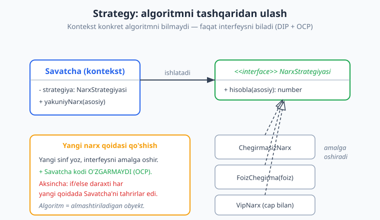
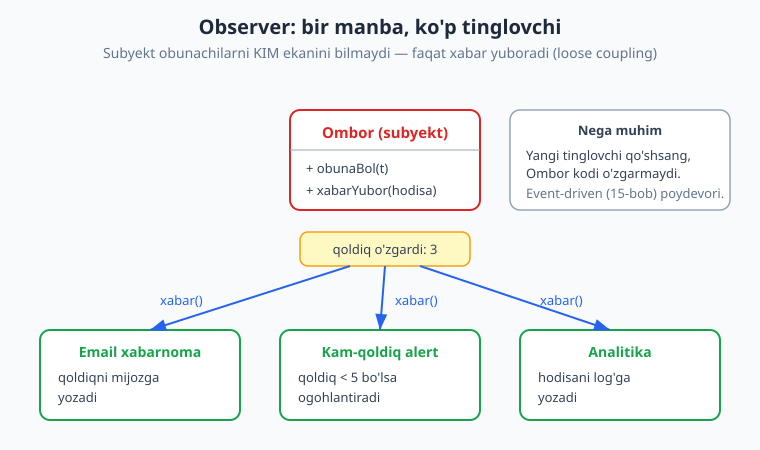
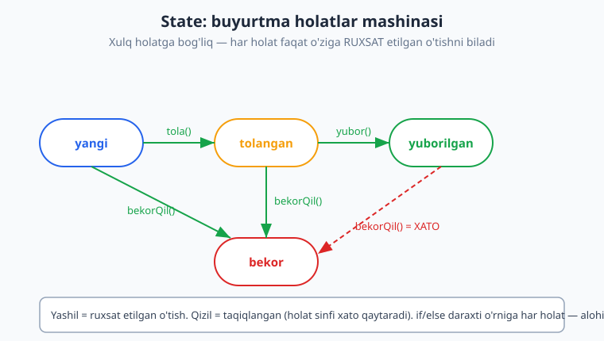

# 09 — Xulq-atvor patternlari (behavioral)

[⬅️ Oldingi: 08 — Strukturaviy patternlar](./08-structural-patterns.md) · [🏠 README](./README.md) · [Keyingi: 10 — Modullik, komponentlar va chegaralar ➡️](./10-modullik-komponentlar.md)

---

> **Bu bobda:** GoF (Gang of Four) klassifikatsiyasidagi uchinchi va eng katta toifa — **xulq-atvor (behavioral)** patternlari. Yaratuvchi patternlar obyektni QANDAY yaratishni, strukturaviy patternlar obyektlarni QANDAY birlashtirishni hal qilgan edi. Behavioral patternlar esa eng nozik savolga javob beradi: obyektlar O'ZARO QANDAY MULOQOT qiladi va mas'uliyatni QANDAY taqsimlaydi? Biz **Strategy** (almashtiriladigan algoritm), **Observer** (holat o'zgarganda xabardor qilish), **State** (holatga qarab o'zgaruvchi xulq), **Command** (so'rovni obyekt sifatida), **Template Method**, **Iterator**, **Mediator** va **Chain of Responsibility** ni ko'rib chiqamiz. Har biri uchun: muammo -> yechim -> ishlaydigan TypeScript kod -> real misol -> qachon ishlatish.
>
> **Trade-off eslatmasi / Halollik:** Behavioral patternlar deyarli bir narsa uchun: `if/else` yoki `switch` daraxtini **polimorfizm** bilan almashtirish. Bu OCP (Open/Closed) ga yo'l ochadi, lekin BEPUL emas — har pattern qo'shimcha sinflar, interfeyslar va bilvosita yo'naltirish (indirection) keltiradi. Ikki holat va bitta `if` uchun pattern qo'llash — over-engineering. Bu bobdagi barcha TS misollari `tsx` bilan ishga tushirilgan va `tsc --strict` bilan tekshirilgan (bob oxirida hisobot). Konseptual qism — diagrammalar va trade-off tahlili.

---

## Behavioral patternlar nima hal qiladi?

Tasavvur qiling, sizda e-commerce backend bor. Mijoz savatchasi narxni hisoblashi kerak — lekin "qanday" hisoblash mijoz turiga bog'liq: oddiy, VIP, aksiya, kupon. Buyurtma holati o'zgaradi: yangi -> to'langan -> yuborilgan. Ombor qoldig'i o'zgarganda email, alert va analitika ishga tushishi kerak. Foydalanuvchi "ortga" (undo) tugmasini bosadi.

Bu masalalarning hammasi bitta umumiy mavzu: **obyektlar o'rtasidagi mas'uliyat va muloqot**. Agar siz bularni "tabiiy" yo'l bilan yozsangiz, kod tez orada ulkan `if/else` va `switch` daraxtiga aylanadi — har yangi qoidada eski kodni TAHRIRLAYSIZ, ya'ni OCP (Open/Closed Principle, 05-bob) buziladi.

> **Eslatma:** GoF (Gang of Four) — "Design Patterns" (1994) kitobining 4 muallifi (Gamma, Helm, Johnson, Vlissides). Ular 23 patternni 3 toifaga ajratgan: yaratuvchi (5), strukturaviy (7), **xulq-atvor (11)**. Behavioral 11 ta: Chain of Responsibility, Command, Interpreter, Iterator, Mediator, Memento, Observer, State, Strategy, Template Method, Visitor. Biz amaliyotda eng ko'p uchraydiganlarini chuqur, qolganlarini qisqa ko'ramiz.

Behavioral patternlarning umumiy "sehri" — **xulqni alohida obyektga ko'chirish**. Algoritm obyekt bo'ladi (Strategy), so'rov obyekt bo'ladi (Command), holat obyekt bo'ladi (State). Shunda asosiy sinf "nima qilish"ni emas, "kim qiladi"ni biladi — va kim qilishini almashtirib bo'ladi.

```text
Yaratuvchi   : obyektni QANDAY yaratish?        (07-bob)
Strukturaviy : obyektlarni QANDAY birlashtirish? (08-bob)
Behavioral   : obyektlar QANDAY MULOQOT qiladi
               va mas'uliyat QANDAY taqsimlanadi?  <-- bu bob
```

---

## Strategy — almashtiriladigan algoritm

**Muammo.** Narxni hisoblashning bir nechta usuli bor (oddiy, foiz chegirma, VIP). "Tabiiy" yechim — `Savatcha` ichida katta `if`:

```ts
// ANTI-PATTERN: hamma qoida bitta sinfda, har yangi qoidada bu yer o'zgaradi
class SavatchaYomon {
  yakuniyNarx(asosiy: number, tur: string): number {
    if (tur === "oddiy") return asosiy;
    if (tur === "foiz20") return asosiy * 0.8;
    if (tur === "vip") return asosiy - Math.min(asosiy * 0.15, 50000);
    // yangi qoida -> yana shu yerga if qo'shamiz -> OCP buzildi
    throw new Error("noma'lum tur");
  }
}
```

**Yechim.** Har algoritmni alohida sinfga ko'chiring, umumiy interfeys orqasiga yashiring. `Savatcha` faqat interfeysni biladi — qaysi konkret algoritm ekanini emas. Bu **Strategy**.



```ts
interface NarxStrategiyasi {
  hisobla(asosiy: number): number;
}

class ChegirmasizNarx implements NarxStrategiyasi {
  hisobla(asosiy: number): number {
    return asosiy;
  }
}

class FoizChegirma implements NarxStrategiyasi {
  constructor(private foiz: number) {}
  hisobla(asosiy: number): number {
    return Math.round(asosiy * (1 - this.foiz / 100));
  }
}

class VipNarx implements NarxStrategiyasi {
  // VIP: 15% chegirma, lekin maksimal 50000 chegirma
  hisobla(asosiy: number): number {
    const chegirma = Math.min(asosiy * 0.15, 50000);
    return Math.round(asosiy - chegirma);
  }
}

class Savatcha {
  private strategiya: NarxStrategiyasi = new ChegirmasizNarx();
  setStrategiya(s: NarxStrategiyasi): void {
    this.strategiya = s;
  }
  yakuniyNarx(asosiy: number): number {
    return this.strategiya.hisobla(asosiy);
  }
}

const savat = new Savatcha();
console.log(savat.yakuniyNarx(200000));        // 200000
savat.setStrategiya(new FoizChegirma(20));
console.log(savat.yakuniyNarx(200000));        // 160000
savat.setStrategiya(new VipNarx());
console.log(savat.yakuniyNarx(200000));        // 170000
console.log(savat.yakuniyNarx(1000000));       // 950000 (cap ishladi)
```

Ishga tushirsak (haqiqiy `tsx` natijasi):

```text
[Strategy] asosiy 200000:
  chegirmasiz = 200000
  -20% = 160000
  VIP (15%, max 50k) = 170000
  VIP 1000000 (cap ishlaydi) = 950000
```

Diqqat qiling: `1000000` da chegirma `150000` emas, balki cheklangan `50000` bo'ldi (`1000000 - 50000 = 950000`). Bu mantiq `VipNarx` ichida — `Savatcha` undan bexabar.

> **Amaliyotda:** Strategy hamma joyda. To'lov usuli (Click/Payme/karta), saralash tartibi (`Array.sort` ga uzatilgan funksiya — bu ham Strategy!), yetkazib berish narxi, fayl siqish algoritmi, autentifikatsiya provayderlari. TypeScript/JS da strategiya ko'pincha shunchaki **funksiya** bo'ladi — sinf shart emas:

```ts
type Solishtiruvchi<T> = (a: T, b: T) => number;
const yoshBoyicha: Solishtiruvchi<{ yosh: number }> = (a, b) => a.yosh - b.yosh;
ro.sort(yoshBoyicha); // funksional Strategy
```

> **Trade-off:** Strategy `if` ni yo'qotmaydi — uni **bir joyga ko'chiradi**. Qayerdadir kontekstga mos strategiyani TANLASH kerak (ko'pincha factory yoki `Map`). Foydasi: tanlash mantiqi va algoritm mantiqi ajraladi; har algoritmni alohida test qilasiz; yangi algoritm = yangi sinf, eski kod tegmaydi (OCP, [05-bob](./05-solid.md)). Zarari: kichik holat uchun ortiqcha sinflar.

> **Anti-pattern:** Atigi 2 ta o'zgarmas variant uchun (masalan "soliq bor / soliq yo'q") Strategy qurish — over-engineering. Oddiy boolean yoki bitta `if` yetadi. Pattern muammoga javob, modaga emas.

---

## Observer — holat o'zgarganda xabardor qilish

**Muammo.** Ombor qoldig'i o'zgarganda bir nechta narsa ishlashi kerak: mijozga email, kam-qoldiq alert, analitika logi. Agar `Ombor` sinfi bu uchchovini O'ZI chaqirsa, u email, alert va analitika modullariga **qattiq bog'lanadi** (tight coupling). Yangi reaksiya qo'shsangiz — `Ombor`ni tahrirlaysiz.

**Yechim.** `Ombor` (subyekt) tinglovchilar ro'yxatini yuritadi va o'zgarish bo'lganda HAMMASIGA xabar yuboradi — lekin ular KIM ekanini bilmaydi. Tinglovchilar o'zlari obuna bo'ladi. Bu **Observer** (ba'zan publish/subscribe, pub/sub deyiladi).



```ts
type Tinglovchi<T> = (hodisa: T) => void;

interface OmborHodisasi {
  mahsulot: string;
  qoldiq: number;
}

class Subyekt<T> {
  private tinglovchilar = new Set<Tinglovchi<T>>();
  obunaBol(t: Tinglovchi<T>): () => void {
    this.tinglovchilar.add(t);
    return () => this.tinglovchilar.delete(t); // obunani bekor qilish funksiyasi
  }
  xabarYubor(hodisa: T): void {
    for (const t of this.tinglovchilar) t(hodisa);
  }
}

const ombor = new Subyekt<OmborHodisasi>();
const offEmail = ombor.obunaBol((h) =>
  console.log(`email: ${h.mahsulot} qoldiq ${h.qoldiq}`),
);
ombor.obunaBol((h) => {
  if (h.qoldiq < 5) console.log(`OGOHLANTIRISH: ${h.mahsulot} tugayapti!`);
});

ombor.xabarYubor({ mahsulot: "Telefon", qoldiq: 10 });
ombor.xabarYubor({ mahsulot: "Telefon", qoldiq: 3 });
offEmail();                                            // email obunasini bekor qildik
ombor.xabarYubor({ mahsulot: "Telefon", qoldiq: 1 });  // endi email kelmaydi
```

Ishga tushirsak (haqiqiy natija):

```text
[Observer]
  email: Telefon qoldiq 10
  email: Telefon qoldiq 3
  OGOHLANTIRISH: Telefon tugayapti!
  OGOHLANTIRISH: Telefon tugayapti!
```

Uchinchi `xabarYubor`da email kelmadi — chunki `offEmail()` obunani bekor qilgan. Lekin alert hali ishlaydi (qoldiq `1 < 5`). Diqqat: birinchi `OGOHLANTIRISH` qoldiq `3` da, ikkinchisi qoldiq `1` da.

> **Eslatma:** Obunani bekor qilish (unsubscribe) — Observer'ning eng ko'p UNUTILADIGAN qismi. Agar tinglovchi yo'q qilinsa-yu, subyekt ro'yxatidan o'chmasa, **xotira oqishi** (memory leak) bo'ladi — subyekt o'lik obyektga havola ushlab turadi. Shuning uchun `obunaBol` "obunani bekor qilish" funksiyasini qaytarishi yaxshi amaliyot (RxJS, DOM `addEventListener`/`removeEventListener` shu mantiq).

> **Amaliyotda:** Observer — bevosita kundalik ish. Brauzerda DOM event'lari (`element.addEventListener`), Node.js `EventEmitter`, React `useEffect` + state, Vue reaktivligi, Redux store obunalari. Telegram-bot backend'ida: "yangi buyurtma" hodisasiga admin xabarnomasi, CRM yangilanishi, statistika — har biri alohida tinglovchi.

> **Trade-off:** Observer bog'liqlikni susaytiradi (subyekt tinglovchilarni bilmaydi), lekin **oqimni yashiradi** — kodni o'qiganda "bu hodisada aslida NIMA bo'ladi?" deganni darrov ko'rmaysiz, chunki tinglovchilar boshqa joyda ro'yxatdan o'tgan. Ko'p tinglovchi + zanjirli hodisalar = nosozlikni tuzatish (debugging) qiyinlashadi. Bu — sinxron, jarayon ichidagi Observer. Uni tarmoq bo'ylab, broker (Kafka/RabbitMQ) orqali kengaytirsangiz — **event-driven arxitektura** ([15-bob](./15-event-driven-cqrs.md)) ga o'tasiz. Observer — uning "kichik" ildizi.

---

## State — holatga qarab o'zgaruvchi xulq

**Muammo.** Buyurtma holatlari bor: `yangi`, `tolangan`, `yuborilgan`, `bekor`. Har amal (to'lash, yuborish, bekor qilish) faqat MA'LUM holatlarda ruxsat etiladi: to'lanmagan buyurtmani yuborib bo'lmaydi; yuborilganni bekor qilib bo'lmaydi. "Tabiiy" yechim — har metodda `switch (this.holat)`:

```ts
// ANTI-PATTERN: holat mantiqi har metodga sochilgan
yubor() {
  switch (this.holat) {
    case "yangi": throw new Error("avval to'lang");
    case "tolangan": this.holat = "yuborilgan"; break;
    case "yuborilgan": throw new Error("allaqachon");
    case "bekor": throw new Error("bekor qilingan");
  }
}
// va yana shunday tola(), bekorQil()... har biri 4 ta case. O'tish qoidasi 3 joyda takrorlanadi.
```

**Yechim.** Har holatni alohida sinfga aylantiring; har sinf O'ZIGA ruxsat etilgan o'tishlarni biladi. Obyekt (`Buyurtma`) joriy holat obyektiga amalni DELEGATSIYA qiladi. Bu **State** — holatlar mashinasi (state machine) ning ob'ektga yo'naltirilgan ko'rinishi.



```ts
interface BuyurtmaHolati {
  nomi: string;
  tola(b: Buyurtma): void;
  yubor(b: Buyurtma): void;
  bekorQil(b: Buyurtma): void;
}

class Buyurtma {
  private holat: BuyurtmaHolati = new YangiHolat();
  tarix: string[] = [];
  setHolat(h: BuyurtmaHolati): void {
    this.tarix.push(h.nomi);
    this.holat = h;
  }
  holatNomi(): string { return this.holat.nomi; }
  tola(): void { this.holat.tola(this); }
  yubor(): void { this.holat.yubor(this); }
  bekorQil(): void { this.holat.bekorQil(this); }
}

class YangiHolat implements BuyurtmaHolati {
  nomi = "yangi";
  tola(b: Buyurtma): void { b.setHolat(new TolanganHolat()); }
  yubor(): void { throw new Error("To'lanmagan buyurtmani yuborib bo'lmaydi"); }
  bekorQil(b: Buyurtma): void { b.setHolat(new BekorHolat()); }
}

class TolanganHolat implements BuyurtmaHolati {
  nomi = "tolangan";
  tola(): void { throw new Error("Allaqachon to'langan"); }
  yubor(b: Buyurtma): void { b.setHolat(new YuborilganHolat()); }
  bekorQil(b: Buyurtma): void { b.setHolat(new BekorHolat()); }
}

class YuborilganHolat implements BuyurtmaHolati {
  nomi = "yuborilgan";
  tola(): void { throw new Error("Yuborilgan"); }
  yubor(): void { throw new Error("Allaqachon yuborilgan"); }
  bekorQil(): void { throw new Error("Yuborilgan buyurtmani bekor qilib bo'lmaydi"); }
}

class BekorHolat implements BuyurtmaHolati {
  nomi = "bekor";
  tola(): void { throw new Error("Bekor qilingan"); }
  yubor(): void { throw new Error("Bekor qilingan"); }
  bekorQil(): void { throw new Error("Allaqachon bekor"); }
}
```

Ishlatamiz:

```ts
const b = new Buyurtma();
console.log(b.holatNomi());      // yangi
b.tola();
b.yubor();
console.log(b.tarix.join(" -> ")); // tolangan -> yuborilgan
b.bekorQil();                      // throw: Yuborilgan buyurtmani bekor qilib bo'lmaydi
```

Ishga tushirsak (haqiqiy natija):

```text
[State] boshlang'ich: yangi
  oqim: tolangan -> yuborilgan
  taqiqlangan o'tish: Yuborilgan buyurtmani bekor qilib bo'lmaydi
```

Endi har holat o'zining o'tish qoidalarini O'ZIDA saqlaydi. Yangi holat (masalan `QaytarilganHolat`) qo'shish — yangi sinf yozish, eski holatlar tegilmaydi.

> **Diqqat:** State patterni "ortiqcha" tuyulishi mumkin, ammo holat soni ortgani sayin u o'zini oqlaydi. 2-3 holat va sodda qoidalar uchun `enum` + `switch` yetarli. Lekin 5+ holat, murakkab o'tish qoidalari, har holatda alohida ma'lumot bo'lsa — State sinflari kodni tartibga soladi. Muqobil: deklarativ holat-mashina (XState kabi kutubxonalar) — o'tishlar jadval/grafik sifatida.

> **Amaliyotda:** To'lov holati (kutilmoqda -> tasdiqlandi -> qaytarildi), TCP soketi, hujjat ish oqimi (qoralama -> ko'rib chiqishda -> nashr), o'yin personaji (turibdi -> yuguryapti -> sakrayapti), CI/CD bosqichlari. Telegram-bot suhbat oqimi (FSM — Finite State Machine) — bu ham State g'oyasi: "ism kutilmoqda" -> "telefon kutilmoqda" -> "tasdiq".

---

## Strategy vs State — bir xil struktura, boshqa maqsad

Bu ikkisi DEYARLI bir xil ko'rinadi: kontekst interfeysga delegatsiya qiladi, konkret sinflar interfeysni amalga oshiradi. Buni ko'p odam adashtiradi. Farq — **NIYAT**da:

| | **Strategy** | **State** |
|---|---|---|
| Asosiy savol | "Bu ishni QANDAY qilish?" | "Hozir QAYSI holatdaman?" |
| Kim almashtiradi | TASHQI kod strategiyani tanlaydi | Holatlar BIR-BIRINI almashtiradi |
| Holatlar bir-birini biladimi | Yo'q — mustaqil, bexabar | Ha — keyingi holatga o'tkazadi |
| O'zgarish vaqti | Odatda bir marta o'rnatiladi | Ish davomida ko'p marta o'zgaradi |
| Misol | Narx hisoblash, saralash | Buyurtma oqimi, FSM |

Sodda qilib: **Strategy** — algoritmlar to'plami, ular bir-birini bilmaydi, tashqi kod tanlaydi. **State** — holatlar grafigi, har holat keyingisiga o'tish yo'lini biladi. `VipNarx` "endi `FoizChegirma` bo'l" demaydi (Strategy); `TolanganHolat` esa "endi `YuborilganHolat` bo'l" deydi (State).

> **Eslatma:** Struktura bir xil bo'lgani sababli ba'zi mualliflar ularni "egizak patternlar" deydi. Lekin diagramma emas, **niyat** patternni belgilaydi. Patternlarni "shaklidan" emas, "u hal qiladigan muammodan" tanlang.

---

## Command — so'rovni obyekt sifatida

**Muammo.** Matn muharririda "ortga" (undo) va "qayta" (redo) kerak. Buning uchun "nima qilingan"ni ESLAB qolish kerak — va uni TESKARI qaytara olish kerak. So'rovni oddiy metod chaqiruvi sifatida yozsangiz (`hujjat.yoz("salom")`), uni saqlab, keyin bekor qilolmaysiz.

**Yechim.** Har amalni `bajar()` va `ortga()` metodli OBYEKTga aylantiring. Endi amal — ma'lumot: uni ro'yxatga qo'yish, log qilish, navbatga solish, takrorlash mumkin. Bu **Command**.

```ts
interface Buyruq {
  bajar(): void;
  ortga(): void;
}

class Matn {
  private mazmun = "";
  qoy(s: string): void { this.mazmun += s; }
  oxiriniOlib(uzunlik: number): void { this.mazmun = this.mazmun.slice(0, -uzunlik); }
  get matn(): string { return this.mazmun; }
}

class YozishBuyrugi implements Buyruq {
  constructor(private hujjat: Matn, private qoshildi: string) {}
  bajar(): void { this.hujjat.qoy(this.qoshildi); }
  ortga(): void { this.hujjat.oxiriniOlib(this.qoshildi.length); }
}

class Tahrirchi {
  private bajarilgan: Buyruq[] = [];
  ishlat(buyruq: Buyruq): void {
    buyruq.bajar();
    this.bajarilgan.push(buyruq); // tarixga qo'shamiz
  }
  bekorQil(): void {
    const oxirgi = this.bajarilgan.pop();
    if (oxirgi) oxirgi.ortga();
  }
}

const hujjat = new Matn();
const tahrir = new Tahrirchi();
tahrir.ishlat(new YozishBuyrugi(hujjat, "Salom"));
tahrir.ishlat(new YozishBuyrugi(hujjat, ", dunyo"));
tahrir.ishlat(new YozishBuyrugi(hujjat, "!!!"));
console.log(hujjat.matn); // "Salom, dunyo!!!"
tahrir.bekorQil();
console.log(hujjat.matn); // "Salom, dunyo"
tahrir.bekorQil();
console.log(hujjat.matn); // "Salom"
```

Ishga tushirsak (haqiqiy natija):

```text
[Command] yozildi: "Salom, dunyo!!!"
  1x undo: "Salom, dunyo"
  2x undo: "Salom"
```

`Tahrirchi` har bajarilgan buyruqni `bajarilgan` ro'yxatiga qo'yadi. `bekorQil()` oxirgisini olib, `ortga()` ni chaqiradi. Redo qo'shish — bekor qilingan buyruqlarni alohida ro'yxatda saqlash.

> **Amaliyotda:** Command — undo/redo (muharrirlar, grafik dasturlar), GUI tugmasi/menyu/klaviatura yorlig'i bitta buyruqni ulashda, **ish navbati** (job queue — har vazifa = buyruq obyekt), tranzaksiya logi, makro (buyruqlar ketma-ketligi). Backend'da: "email yuborish", "hisobotni hosil qilish" kabi vazifalarni navbatga (BullMQ, Celery) qo'yish — bu Command g'oyasi. Buyruq seriyalashtiriladi (JSON), saqlanadi, keyin ishlov beriladi.

> **Trade-off:** Command har amalni obyektga aylantirib, kodni egiluvchan qiladi (saqlash, log, undo, navbat), lekin sinflar sonini oshiradi. Oddiy tugma uchun — ortiqcha. `undo`/`redo`, audit log yoki navbat kerak bo'lsa — bebaho.

---

## Tezkor sayohat: qolgan behavioral patternlar

Yuqoridagi 4 tasi eng ko'p uchraydigan. Qolganlarini qisqacha — g'oya va real misol bilan.

### Template Method — algoritm skeleti, qadamlarni pastki sinf to'ldiradi

Ota sinf algoritmning UMUMIY tartibini belgilaydi (skelet), o'zgaradigan qadamlarni `abstract` qoldiradi. Pastki sinflar faqat o'sha qadamlarni to'ldiradi — tartibni emas.

```ts
abstract class HisobotchiSkelet {
  // Template method: tartib bu yerda QULFLANGAN
  chiqar(): string {
    return this.sarlavha() + "\n" + this.tana() + "\n" + this.izoh();
  }
  protected abstract sarlavha(): string; // pastki sinf to'ldiradi
  protected abstract tana(): string;
  protected izoh(): string { return "--- tugadi ---"; } // ixtiyoriy, ustiga yozsa bo'ladi
}
class SavdoHisoboti extends HisobotchiSkelet {
  protected sarlavha(): string { return "SAVDO HISOBOTI"; }
  protected tana(): string { return "Jami: 1 200 000 so'm"; }
}
```

> **Amaliyotda:** Test framework'lari (`setUp` -> `test` -> `tearDown` tartibi qulflangan, siz bosqichlarni to'ldirasiz), ma'lumotni qayta ishlash pipeline'lari, HTTP middleware skeletlari. **Diqqat:** Template Method — MEROS asosida (qattiqroq bog'lanish); ko'pincha KOMPOZITSIYAga asoslangan Strategy egiluvchanroq ([06-bob](./06-dry-kiss-yagni.md) "meros o'rniga kompozitsiya").

### Iterator — kolleksiyani aylanib chiqish

Kolleksiyaning ICHKI tuzilishini (massiv, daraxt, bog'langan ro'yxat) ochmasdan, elementlarni ketma-ket olish usuli. TS/JS da bu tilga O'RNATILGAN: `Symbol.iterator`, `for...of`, generatorlar.

```ts
function* uchgacha(): Generator<number> {
  yield 1; yield 2; yield 3;
}
for (const n of uchgacha()) console.log(n); // 1, 2, 3
```

> **Amaliyotda:** Har `for...of`, har generator — Iterator. DB natijalarini sahifalab (pagination) o'qish, katta faylni qator-qator o'qish (butun faylni xotiraga olmasdan). Pattern shu darajada foydaliki, tillarga to'g'ridan-to'g'ri kiritilgan.

### Mediator — obyektlar o'rtasida vositachi

Ko'p obyekt bir-biri bilan to'g'ridan-to'g'ri gaplashsa, "har kim har kimni biladi" tarmog'i (N×N bog'liqlik) paydo bo'ladi. **Mediator** — markaziy vositachi: obyektlar faqat MEDIATOR bilan gaplashadi, u esa muvofiqlashtiradi (N ta bog'liqlik).

```text
Mediatorsiz:  A <-> B <-> C, A <-> C ...  (har juft o'zaro bog'langan)
Mediator bilan:   A   B   C
                   \  |  /
                  [ MEDIATOR ]   (har biri faqat mediatorni biladi)
```

> **Amaliyotda:** Chat xonasi (Mediator xabarlarni a'zolarga tarqatadi), murakkab forma (bir maydon o'zgarsa boshqalari yangilanadi — Mediator boshqaradi), aviadispetcher. Ogohlantirish: Mediator o'zi ulkan "xudo obyekt"ga aylanib qolmasin.

### Chain of Responsibility — so'rovni zanjir bo'ylab uzatish

So'rovni ishlovchilar ZANJIRI bo'ylab uzatasiz. Har ishlovchi yo so'rovni hal qiladi, yo keyingisiga uzatadi. Bu **middleware** (08-bobda ko'rgan) va validatsiya zanjirlarining poydevori.

```ts
type Sorov = { yosh: number; ism: string };
type Natija = { ok: true } | { ok: false; xato: string };

abstract class Tekshiruvchi {
  private keyingi?: Tekshiruvchi;
  ulang(t: Tekshiruvchi): Tekshiruvchi { this.keyingi = t; return t; }
  tekshir(s: Sorov): Natija {
    const o = this.qoida(s);
    if (!o.ok) return o; // zanjir uziladi
    return this.keyingi ? this.keyingi.tekshir(s) : { ok: true };
  }
  protected abstract qoida(s: Sorov): Natija;
}
class IsmTekshir extends Tekshiruvchi {
  protected qoida(s: Sorov): Natija {
    return s.ism.length > 0 ? { ok: true } : { ok: false, xato: "ism bo'sh" };
  }
}
class YoshTekshir extends Tekshiruvchi {
  protected qoida(s: Sorov): Natija {
    return s.yosh >= 18 ? { ok: true } : { ok: false, xato: "18 dan kichik" };
  }
}
```

> **Amaliyotda:** Express/Koa/grammY middleware (har middleware so'rovni ko'radi, o'zgartiradi yoki `next()` ga uzatadi), HTTP filtr/autentifikatsiya/log zanjiri, validatsiya qatlamlari, hodisani tutuvchilar (event handlers). Telegram-bot middleware'lari — toza Chain of Responsibility: log -> auth -> rate-limit -> handler.

> **Eslatma:** Qolgan behavioral patternlar — **Visitor** (kolleksiya ustida yangi operatsiyani sinflarni o'zgartirmasdan qo'shish; AST/kompilyatorlarda), **Memento** (obyekt holatini "snapshot" qilib saqlab, keyin tiklash; undo'ning State'ni saqlash varianti), **Interpreter** (kichik til/grammatikani sinflar bilan baholash; kamdan-kam). Ular kundalik ishda kamroq uchraydi — kerak bo'lganda refactoring.guru yoki GoF'ga murojaat qiling.

---

## Qachon qaysi behavioral pattern? (tezkor jadval)

| Muammo (belgisi) | Pattern |
|---|---|
| "Bir ishni bir necha xil yo'l bilan qilaman, tashqi kod tanlaydi" | **Strategy** |
| "Holat o'zgarganda boshqalar xabardor bo'lsin (ular kim — bilmayman)" | **Observer** |
| "Obyekt holatga qarab har xil ishlaydi, holat ish davomida o'zgaradi" | **State** |
| "Amalni saqlash / undo / navbatga qo'yish / log kerak" | **Command** |
| "Algoritm tartibi bir xil, faqat ayrim qadamlar farq qiladi" | **Template Method** |
| "Kolleksiyani ichki tuzilishini ochmasdan aylanaman" | **Iterator** |
| "Ko'p obyekt o'zaro bog'langan, markaziy muvofiqlashtirish kerak" | **Mediator** |
| "So'rovni ishlovchilar zanjiri bo'ylab uzataman (middleware)" | **Chain of Responsibility** |

> **Trade-off (umumiy):** Behavioral patternlar `if/else`/`switch` ni polimorfizmga almashtirib OCP beradi, ammo bilvosita yo'naltirish (indirection) va sinflar sonini oshiradi. Qoida: muammo HAQIQATAN paydo bo'lgach pattern qo'llang ("bu yerda yana bir `if` qo'shyapman, uchinchi marta" — signal). Avvaldan "ehtimol kerak bo'lar" deb qurish — YAGNI buzilishi ([06-bob](./06-dry-kiss-yagni.md)).

---

## Mashqlar

### Oson

**1.** Quyidagi belgilarga qaysi behavioral pattern mos: (a) "to'lov usulini Click/Payme/karta o'rtasida almashtiraman"; (b) "buyurtma to'langanda 3 ta servis xabardor bo'lsin"; (c) "matn muharririda undo kerak"; (d) "buyurtma yangi/to'langan/yuborilgan bo'lib o'zgaradi".

**2.** `Array.prototype.sort((a, b) => a - b)` — bu qaysi behavioral pattern misoli va nega? Funksiya bu yerda nima rolini o'ynaydi?

**3.** Strategy va State diagrammasi deyarli bir xil. Ularni ajratuvchi BITTA asosiy savolni ayting (har biriga bittadan).

**4.** Quyidagi kodda qaysi printsip buzilgan va qaysi behavioral pattern uni tuzatadi?

```ts
function narx(asosiy: number, tur: string): number {
  if (tur === "oddiy") return asosiy;
  if (tur === "vip") return asosiy * 0.85;
  if (tur === "aksiya") return asosiy * 0.7;
  throw new Error("noma'lum");
}
```

### O'rta

**5.** Express/grammY middleware (`(req, res, next) => ...`) qaysi behavioral patternga mos keladi? Tushuntiring: har middleware so'rov bilan nima qiladi va `next()` nimani anglatadi?

**6.** Observer'da "obunani bekor qilish" (unsubscribe) NEGA muhim? Agar uni qo'shmasangiz, qanday muammo (bitta atama bilan) yuzaga keladi?

**7.** **(KOD)** `NarxStrategiyasi` interfeysiga yangi strategiya qo'shing: `KuponChegirma` — qat'iy summa chegirma beradi (masalan 30000 so'm), lekin narx 0 dan past bo'lmasligi kerak. `Savatcha` sinfini O'ZGARTIRMASLIK shart. Yozib, `tsx` bilan ishga tushiring.

**8.** Foydalanuvchilar ro'yxatini ism bo'yicha VA yosh bo'yicha saralash kerak. Strategy yordamida yeching (TS, funksional strategiya — sinf shart emas). 3 ta foydalanuvchi bilan ikkala saralashni ko'rsating.

**9.** Template Method va Strategy bir xil muammoni (almashtiriladigan qadam/algoritm) hal qiladi. Ular o'rtasidagi ASOSIY farq nima (qaysi mexanizmga tayanadi)? Qaysi biri egiluvchanroq va nega?

### Qiyin

**10.** **(KOD — State)** Turniket (turnstile) holatlar mashinasini State pattern bilan yozing. Ikki holat: `Yopiq` va `Ochiq`. Amallar: `tanga()` (tanga solish) va `itar()` (itarib o'tish). Qoidalar: `Yopiq` da `tanga()` -> `Ochiq`; `Yopiq` da `itar()` -> bloklanadi; `Ochiq` da `itar()` -> o'tadi va yana `Yopiq`. `tsx` bilan ishga tushirib ko'rsating.

**11.** **(KOD — Chain of Responsibility)** Foydalanuvchi ro'yxatdan o'tish so'rovi uchun validatsiya zanjirini yozing: `IsmTekshir` (ism bo'sh emas) -> `YoshTekshir` (yosh >= 18). Birinchi xato zanjirni uzsin va xato xabarini qaytarsin. Uch holat bilan sinab ko'ring: to'g'ri so'rov, yoshi kichik, ismi bo'sh.

**12.** **(Dizayn)** Telegram-bot backend'ida "yangi buyurtma yaratildi" hodisasi sodir bo'lganda quyidagilar ishlashi kerak: (a) mijozga tasdiq xabari, (b) admin kanaliga bildirish, (c) statistika hisoblagichi +1, (d) omborda mahsulot zaxirasini kamaytirish. Qaysi behavioral pattern(lar)ni tanlaysiz? Diagramma yoki pseudokod chizib, tanlovingizni trade-off bilan asoslang. Bu sinxron Observer'dan event-driven arxitekturaga ([15-bob](./15-event-driven-cqrs.md)) qachon o'tish kerakligini ham ayting.

**13.** **(Tahlil)** Loyihangizda 2 ta holat (`faol`/`nofaol`) va bitta o'tish qoidasi bor edi. Hamkasbingiz buni to'liq State pattern (interfeys + 2 sinf) bilan yozdi. Bu yaxshi qaror bo'lganmi? Qaysi printsip(lar) nuqtai nazaridan baholang va muqobil taklif qiling.

<details markdown="1">
<summary>Yechimlar</summary>

### 1-mashq yechimi
(a) **Strategy** — tashqi kod algoritmni (to'lov usulini) tanlaydi, usullar bir-birini bilmaydi. (b) **Observer** — bir hodisaga ko'p tinglovchi, subyekt ularni bilmaydi. (c) **Command** — amalni obyekt sifatida saqlab, `ortga()` bilan bekor qilish. (d) **State** — holat ish davomida o'zgaradi, har holat o'z o'tishlarini biladi.

### 2-mashq yechimi
Bu **Strategy**. `sort` — kontekst, solishtiruvchi funksiya — almashtiriladigan algoritm (strategiya). `sort` qanday solishtirishni BILMAYDI; uni tashqaridan funksiya ko'rinishida olib, har juft elementga qo'llaydi. TS/JS da strategiya ko'pincha sinf emas, oddiy funksiya bo'ladi — bu ham to'liq haqiqiy Strategy.

### 3-mashq yechimi
- **Strategy:** "Bu ishni QANDAY bajaraman?" — tashqi kod algoritmni tanlaydi, algoritmlar bir-biridan bexabar.
- **State:** "Hozir QAYSI holatdaman va keyin qaysisiga o'taman?" — holatlar bir-birini biladi va almashtiradi.

### 4-mashq yechimi
**OCP** (Open/Closed, [05-bob](./05-solid.md)) buzilgan: har yangi narx turida shu funksiyani TAHRIRLASH kerak. **Strategy** tuzatadi — har turni alohida sinf/funksiya qiladi, yangi tur = yangi sinf, eski kod tegmaydi. (DRY/SRP ham yaxshilanadi: tanlash va hisoblash ajraladi.)

### 5-mashq yechimi
**Chain of Responsibility**. Har middleware so'rovni (`req`) ko'radi: log yozadi, autentifikatsiya tekshiradi yoki o'zgartiradi. `next()` — "men o'z ishimni tugatdim, so'rovni ZANJIRDAGI keyingi ishlovchiga uzat" degani. Agar middleware `next()` ni chaqirmasa (masalan auth muvaffaqiyatsiz), zanjir uziladi va so'rov keyingilarga bormaydi — xuddi mashqdagi `Tekshiruvchi.tekshir` da `if (!o.ok) return o` kabi.

### 6-mashq yechimi
**Xotira oqishi** (memory leak). Tinglovchi obyekt endi kerak bo'lmasa-yu, subyekt ro'yxatidan o'chmasa, subyekt unga havola ushlab turadi -> garbage collector uni yig'a olmaydi. Vaqt o'tib o'lik tinglovchilar to'planadi. Yana: o'lik tinglovchi hodisaga javob berib, kutilmagan xatti-harakat (yoki xato) keltirib chiqarishi mumkin. Shuning uchun `obunaBol` "bekor qilish" funksiyasini qaytaradi (DOM `removeEventListener`, RxJS `unsubscribe`).

### 7-mashq yechimi
`Savatcha` tegilmaydi — faqat yangi sinf. Ishga tushirildi, natija `170000` (`200000 - 30000`), va past summa uchun `0` (manfiy bo'lmaydi):

```ts
class KuponChegirma implements NarxStrategiyasi {
  constructor(private summa: number) {}
  hisobla(asosiy: number): number {
    return Math.max(0, asosiy - this.summa); // 0 dan past bo'lmaydi
  }
}
const savat = new Savatcha();
savat.setStrategiya(new KuponChegirma(30000));
console.log(savat.yakuniyNarx(200000)); // 170000
console.log(savat.yakuniyNarx(10000));  // 0 (30000 dan kichik -> manfiy emas)
```

Bu OCP'ning amaldagi isboti: yangi xulq qo'shdik, `Savatcha` bir harf ham o'zgarmadi.

### 8-mashq yechimi
Ishga tushirildi (haqiqiy natija: `Akmal, Bekzod, Sardor` va `25, 28, 30`):

```ts
interface Foydalanuvchi { ism: string; yosh: number; }
type Solishtiruvchi = (a: Foydalanuvchi, b: Foydalanuvchi) => number;
const ismBoyicha: Solishtiruvchi = (a, b) => a.ism.localeCompare(b.ism);
const yoshBoyicha: Solishtiruvchi = (a, b) => a.yosh - b.yosh;
function sarala(ro: Foydalanuvchi[], s: Solishtiruvchi): Foydalanuvchi[] {
  return [...ro].sort(s); // nusxa olamiz — asl ro'yxat o'zgarmaydi
}
const ro = [
  { ism: "Bekzod", yosh: 30 },
  { ism: "Akmal", yosh: 25 },
  { ism: "Sardor", yosh: 28 },
];
console.log(sarala(ro, ismBoyicha).map((u) => u.ism)); // Akmal, Bekzod, Sardor
console.log(sarala(ro, yoshBoyicha).map((u) => u.yosh)); // 25, 28, 30
```

Strategiya — funksiya. `sarala` qanday solishtirishni bilmaydi; uni tashqaridan oladi.

### 9-mashq yechimi
- **Template Method** — MEROS (inheritance)ga tayanadi: ota sinf skeletni belgilaydi, pastki sinf `abstract` qadamlarni to'ldiradi. Qadamlar SINF ichida, kompilyatsiya vaqtida bog'langan.
- **Strategy** — KOMPOZITSIYAga tayanadi: algoritm alohida obyekt, kontekstga UZATILADI, ish vaqtida (runtime) almashtiriladi.

Strategy egiluvchanroq: algoritmni ish vaqtida almashtirish mumkin, meros zanjiri shart emas, har strategiyani mustaqil test qilasiz. "Meros o'rniga kompozitsiya" ([06-bob](./06-dry-kiss-yagni.md)) shuning uchun ko'pincha Strategy'ni afzal ko'radi. Template Method tartib QAT'IY qulflanishi kerak bo'lganda (masalan test `setUp`/`tearDown`) qulay.

### 10-mashq yechimi
Ishga tushirildi (haqiqiy natija quyida):

```ts
interface TurniketHolati {
  nomi: string;
  tanga(t: Turniket): string;
  itar(t: Turniket): string;
}
class Turniket {
  private holat: TurniketHolati = new Yopiq();
  setHolat(h: TurniketHolati): void { this.holat = h; }
  get holatNomi(): string { return this.holat.nomi; }
  tanga(): string { return this.holat.tanga(this); }
  itar(): string { return this.holat.itar(this); }
}
class Yopiq implements TurniketHolati {
  nomi = "yopiq";
  tanga(t: Turniket): string { t.setHolat(new Ochiq()); return "ochildi"; }
  itar(): string { return "BLOK: avval tanga soling"; }
}
class Ochiq implements TurniketHolati {
  nomi = "ochiq";
  tanga(): string { return "tanga qaytdi (allaqachon ochiq)"; }
  itar(t: Turniket): string { t.setHolat(new Yopiq()); return "o'tdi, yopildi"; }
}
```

Natija:

```text
[Mashq State] itar: BLOK: avval tanga soling | holat: yopiq
  tanga: ochildi | holat: ochiq
  itar: o'tdi, yopildi | holat: yopiq
```

Klassik turniket FSM: o'tgandan keyin avtomatik yopiladi.

### 11-mashq yechimi
Ishga tushirildi (haqiqiy natija quyida). To'liq kod bob matnidagi "Chain of Responsibility" misolida; sinash:

```ts
const bosh = new IsmTekshir();
bosh.ulang(new YoshTekshir()); // zanjir: ism -> yosh
console.log(bosh.tekshir({ ism: "Ali", yosh: 20 })); // { ok: true }
console.log(bosh.tekshir({ ism: "Ali", yosh: 15 })); // { ok: false, xato: "18 dan kichik" }
console.log(bosh.tekshir({ ism: "", yosh: 20 }));     // { ok: false, xato: "ism bo'sh" }
```

Natija:

```text
[Mashq Chain] {ism:'Ali',yosh:20} => {"ok":true}
  {ism:'Ali',yosh:15} => {"ok":false,"xato":"18 dan kichik"}
  {ism:'',yosh:20}   => {"ok":false,"xato":"ism bo'sh"}
```

E'tibor bering: uchinchi holatda ism bo'sh — zanjir BIRINCHI bosqichdayoq uzildi, `YoshTekshir`gacha bormadi. Bu Chain of Responsibility'ning mohiyati: ishlovchi so'rovni yo hal qiladi (xato), yo keyingiga uzatadi.

### 12-mashq yechimi
**Namunaviy yechim:** Asosiy pattern — **Observer** (yoki uning kengaytmasi, hodisa shinasi/event bus). "Yangi buyurtma yaratildi" — bitta hodisa; 4 reaksiya — 4 alohida tinglovchi. Buyurtma yaratuvchi kod ularning birortasini bilmaydi.

```text
[Buyurtma servisi]  -- "buyurtma.yaratildi" hodisa -->  [Hodisa shinasi]
                                                              |
        +------------------+------------------+--------------+
        v                  v                  v              v
  Mijozga tasdiq     Admin kanaliga      Statistika +1   Ombor zaxirasi -1
```

**Nega Observer:** yangi reaksiya (masalan "sodiqlik balli +10") qo'shsangiz, buyurtma servisi kodi o'zgarmaydi — yangi tinglovchi qo'shasiz (OCP). Bog'liqlik past: buyurtma servisi reaksiyalarni bilmaydi.

**Trade-off va sinxron -> event-driven o'tish:** Boshida (kichik monolit) — **sinxron, jarayon ichidagi** Observer yetarli: oddiy, kuzatish oson, tranzaksiya bitta. Lekin: (1) tinglovchi sekin bo'lsa (admin kanaliga tarmoq so'rovi) — butun buyurtma sekinlashadi; (2) tinglovchi xato bersa — buyurtma ham yiqilishi mumkin; (3) ombor boshqa servisda bo'lsa — jarayon ichidagi chaqiruv ishlamaydi. Shu belgilar paydo bo'lganda **event-driven arxitektura** ([15-bob](./15-event-driven-cqrs.md)) ga o'ting: hodisani broker (Kafka/RabbitMQ) ga yuborasiz, tinglovchilar ASINXRON, mustaqil ishlaydi, biri yiqilsa boshqasi davom etadi. Bu — **eventual consistency** narxiga (ombor "darrov emas, tez orada" yangilanadi). Qaysi tinglovchi darhol kerak (zaxira kamaytirish — buyurtmani tasdiqlash uchun muhim), qaysi biri kechiksa bo'ladi (statistika) — shuni ajratib chegara qo'ying.

**Muqobil:** agar har reaksiya alohida vazifa sifatida navbatga qo'yilsa va undo/qayta urinish kerak bo'lsa — **Command** (har reaksiya = buyruq obyekt, job queue). Amalda event-driven tizimlar Observer + Command + navbatni birga ishlatadi.

### 13-mashq yechimi
**Bu yaxshi qaror EMAS** (hozircha). 2 holat va 1 o'tish uchun to'liq State pattern (interfeys + 2 sinf) — **over-engineering**, **YAGNI** ([06-bob](./06-dry-kiss-yagni.md)) buzilishi: hali kerak bo'lmagan moslashuvchanlik uchun murakkablik to'ladingiz. **KISS** ham buzildi — oddiy `boolean faol` yoki `enum` + bitta `if` ancha o'qiluvchanroq.

**Muqobil:**
```ts
type Holat = "faol" | "nofaol";
class Obyekt {
  holat: Holat = "faol";
  ochirish(): void { this.holat = "nofaol"; }
}
```

**Lekin kontekst muhim:** agar yaqin kelajakda holatlar soni o'sishi ANIQ ma'lum bo'lsa (masalan `kutilmoqda`, `bloklangan`, `o'chirilgan` qo'shilishi rejada) va o'tish qoidalari murakkablashsa — State'ni oldindan kiritish asoslanishi mumkin. Qoida: pattern muammoga javob bo'lsin, "kelajakda kerak bo'lar" taxminiga emas. Uchinchi-to'rtinchi holat HAQIQATAN paydo bo'lganda refactoring qiling — bu arzon, chunki interfeys chegarasi allaqachon bor.

</details>

---

## Xulosa

Behavioral patternlar obyektlar O'RTASIDAGI muloqot va mas'uliyatni tartibga soladi. Markaziy g'oya — **xulqni alohida obyektga ko'chirish** va `if/else`/`switch` daraxtini polimorfizm bilan almashtirish (OCP, [05-bob](./05-solid.md)):

- **Strategy** — algoritm obyekt bo'ladi; tashqi kod tanlaydi (narx, saralash, to'lov).
- **Observer** — holat o'zgarganda ko'p tinglovchini xabardor qilish; subyekt ularni bilmaydi (event-driven, [15-bob](./15-event-driven-cqrs.md), ning ildizi).
- **State** — holat obyekt bo'ladi; xulq holatga bog'liq, holatlar bir-birini almashtiradi (buyurtma oqimi, FSM).
- **Command** — so'rov obyekt bo'ladi; saqlash, undo, navbat, log mumkin.
- **Template Method** — algoritm skeleti merosda; qadamlar pastki sinfda.
- **Iterator / Mediator / Chain of Responsibility** — aylanish / markaziy vositachi / so'rov zanjiri (middleware).

Eng muhim saboq — **niyat patternni belgilaydi, struktura emas** (Strategy vs State buni yorqin ko'rsatadi). Va har doim trade-off: pattern OCP va egiluvchanlik beradi, lekin bilvosita yo'naltirish va sinflar narxiga. Muammo HAQIQATAN paydo bo'lganda qo'llang.

Keyingi bobda kod darajasidan **ilova darajasiga** ko'tarilamiz: modullar, komponentlar va ular o'rtasidagi chegaralar — patternlar bilan qurgan kodimizni qanday qilib kattaroq, tartibli birliklarga jamlash.

---

> **Kod-verifikatsiya hisoboti.** Bu bobdagi barcha TypeScript misollari `$env:TEMP\arx-probe` muhitida tekshirildi:
> - `_v_09.ts` (Strategy, Observer, State, Command) — `npx tsx _v_09.ts` muvaffaqiyatli ishladi; `npx tsc --noEmit --strict _v_09.ts` toza (0 xato). Matndagi barcha "ishga tushirsak" natijalari shu ishdan olingan.
> - `_v_09b.ts` (mashq yechimlari: funksional Strategy saralash, Turniket State, validatsiya Chain) — `npx tsx` muvaffaqiyatli; `tsc --strict` toza. 7, 8, 10, 11-mashq natijalari haqiqiy.
> - Muhit: TypeScript 6.0.3, tsx 4.22, Node v24. Konseptual qismlar (Mediator diagrammasi, 12-mashq event-driven tahlili) "konseptual/pseudokod" deb belgilangan.

---

[⬅️ Oldingi: 08 — Strukturaviy patternlar](./08-structural-patterns.md) · [🏠 README](./README.md) · [Keyingi: 10 — Modullik, komponentlar va chegaralar ➡️](./10-modullik-komponentlar.md)
