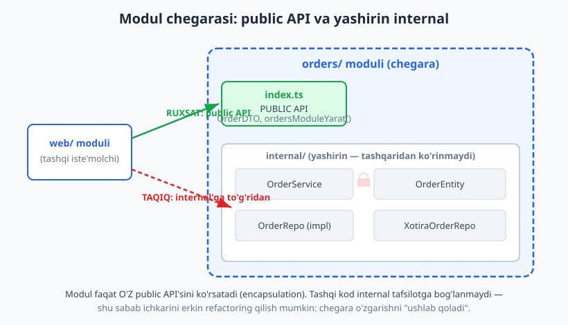
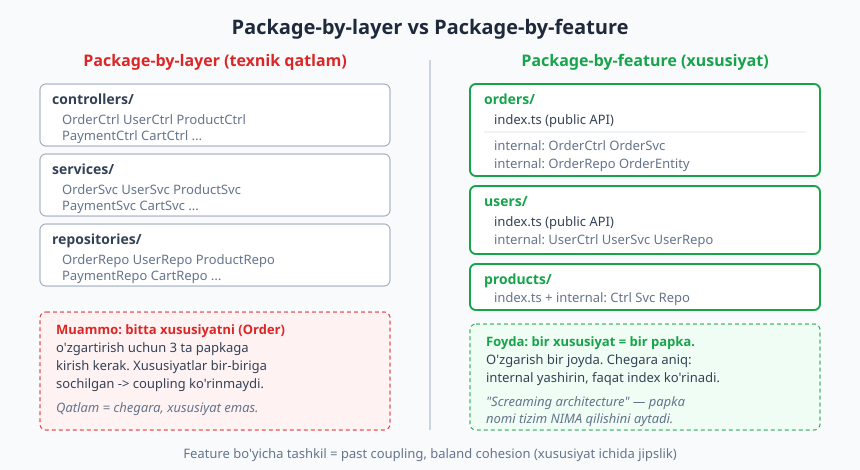
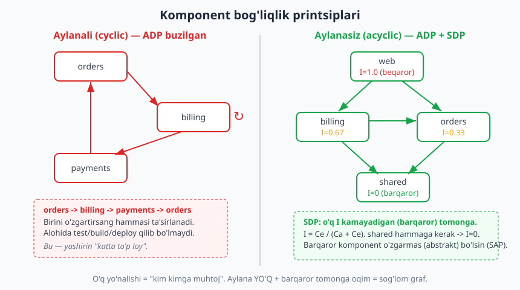

# 10 — Modullik, komponentlar va chegaralar

[⬅️ Oldingi: 09 — Xulq-atvor patternlari](./09-behavioral-patterns.md) · [🏠 README](./README.md) · [Keyingi: 11 — Qatlamli arxitektura ➡️](./11-qatlamli-arxitektura.md)

---

> **Bu bobda:** Endi biz kod darajasidan (printsiplar, patternlar) **ilova darajasiga** ko'tarilamiz. Patternlar bilan yozgan sinflarimizni endi kattaroq, tartibli birliklarga — **modullar** va **komponentlar**ga jamlaymiz. Eng muhim tushuncha — **chegara (boundary)**: ikki kod bo'lagi orasidagi ataylab qo'yilgan "devor", undan faqat tor, ochiq shartnoma (public API) o'tadi. Biz modul/komponent/paket farqini, **package-by-layer vs package-by-feature** taqqoslashini, Robert Martin'ning **komponent bog'liqlik printsiplari**ni (Acyclic / Stable Dependencies / Stable Abstractions), chegarani majburlash usullarini va **modulli monolit** g'oyasini ko'rib chiqamiz. Misol — `orders/` feature-moduli, public `index` orqali ko'rsatilgan, internal tafsiloti yashirin.
>
> **Trade-off eslatmasi / Halollik:** Chegara BEPUL emas. Har chegara — bilvosita yo'naltirish (indirection), DTO o'girish, ba'zan ortiqcha kod. Juda ko'p chegara — ortiqcha ("nano-modul" kasalligi), juda kam — "katta to'p loy" (big ball of mud). To'g'ri javob — **kontekstga bog'liq**: chegarani u yerda qo'yingki, kelajakda mustaqil o'zgarish, test yoki (16-bobda) ajratib mikroservis qilish ehtimoli bor. Bu bobdagi TypeScript misollari (`orders` modul tuzilmasi, aylana-detektor, barqarorlik metrikasi) `tsx` bilan ishga tushirilgan va `tsc --strict` bilan tekshirilgan (bob oxirida hisobot). Bog'liqlik printsiplari konseptual — ularni biz kichik graf-modelda real hisoblab ko'rsatamiz.

---

## Modul, komponent, paket: farqi nimada?

Bu uch so'z ko'pincha aralashtiriladi. Ularni **bir-birini qamrab oluvchi darajalar** sifatida tasavvur qiling — sinfdan yuqorida, lekin har biri biroz boshqa narsani urg'ulaydi.

- **Paket (package)** — fayl tizimi/til darajasidagi **guruhlash mexanizmi**. Bu shunchaki "papka" yoki nomlar maydoni (namespace): TypeScript'da papka + `index.ts`, Python'da `__init__.py` li katalog, Java'da `package`, C#'da `namespace`. Paket — **texnik birlik**, o'zicha hech qanday arxitektura va'da bermaydi.
- **Modul (module)** — mantiqiy, o'zaro bog'liq kod birligi, **aniq chegara va ochiq shartnomaga** ega. Modul "men nimani ko'rsataman (public API) va nimani yashiraman (internal)" deydi. Modul — arxitekturaning **asosiy birligi** (Mark Richards & Neal Ford, *Fundamentals of Software Architecture*: modullik — arxitekturaning poydevori, hamma boshqa narsa shundan o'sadi).
- **Komponent (component)** — modulning **fizik, joylab bo'ladigan (deployable yoki redeploy bo'ladigan) ko'rinishi**. Robert Martin (*Clean Architecture*) ta'rifi: komponent — "deploy birligining eng kichik donasi" (masalan `.jar`, `.dll`, npm paketi, yoki monolit ichidagi mustaqil build bo'lagi). Komponent — bir yoki bir nechta modulning to'plami.

> **Eslatma:** Atamalar tilga qarab siljiydi (Java "komponent"i Node "modul"iga o'xshashi mumkin). Muhimi — **so'z emas, g'oya**: o'zaro bog'liq kodni mantiqiy birlikka jamlash va atrofiga **chegara** qo'yish. Biz "modul"ni eng ko'p ishlatamiz, chunki u chegara g'oyasini eng aniq tashiydi.

Oddiy o'xshatish: **paket** — bu uy ichidagi xona (joy ajratdi); **modul** — eshigi, qulfi va "faqat mehmonxonaga kiring, oshxona shaxsiy" qoidasi bor xona (chegara qo'ydi); **komponent** — alohida ko'chirib bo'ladigan modul uy (deploy birligi).

### Modullik = arxitekturaning asosiy birligi

Nega aynan modul? Chunki tizim o'sganda siz endi *sinflar* haqida o'ylamaysiz — ulardan minglab bo'ladi. Siz **modullar va ular orasidagi bog'liqlik** haqida o'ylaysiz. Yaxshi modullik bo'lmasa, har bir o'zgarish butun tizim bo'ylab to'lqin bo'lib tarqaladi (bu — past modullik belgisi). Modullik to'g'ri bo'lsa — o'zgarish bitta modul ichida qoladi.

---

## Chegara (boundary) nima va nega muhim?

**Chegara** — ikki kod bo'lagi orasidagi **ataylab qo'yilgan ajratuvchi chiziq**. Uning ikki tomoni bir-birini faqat tor, e'lon qilingan **shartnoma (public API)** orqali biladi; ichki tafsilotni KO'RMAYDI.

Nega bu shunchalik muhim? Chunki chegara — **o'zgarishni ushlab qoluvchi to'siq**. Robert Martin buni shunday ifodalaydi: arxitekturaning vazifasi — **muhim qarorlarni qancha vaqt iloji boricha kechiktirish** va o'zgarishning ta'sir maydonini cheklash. Chegara aynan shuni qiladi:

- Chegara **ichidagi** kodni xohlaganingizcha refactoring qilasiz — tashqi kod sezmaydi (shartnoma o'zgarmasa).
- Bog'liqlik **bir tomonlama** bo'ladi: A modul B'ning public API'siga bog'lanadi, lekin B A'ni umuman bilmaydi.
- Test oson: modulni public API'si orqali, ichini bilmasdan test qilasiz.
- Jamoa mustaqil ishlaydi: har jamoa o'z modulini, shartnomaga rioya qilgancha, erkin o'zgartiradi (Conway qonuni, [25-bob](./25-evolyutsion-antipatternlar.md), bilan chambarchas).

> **Diqqat:** Chegara faqat papka bo'lib qo'yilsa, bu chegara EMAS. `internal/` papkasi bo'lsayu, tashqi kod undagi sinfni to'g'ridan import qilsa — devor yo'q, faqat chizilgan chiziq bor. Chegara **majburlanishi** kerak (pastda — qanday).



---

## Package-by-layer vs package-by-feature

Kodni papkalarga qanday taqsimlaysiz? Ikki asosiy yondashuv bor va ular tizim sog'ligiga katta ta'sir qiladi.

### Package-by-layer (qatlam bo'yicha)

Eng keng tarqalgan boshlang'ich yondashuv — kodni **texnik rol** bo'yicha guruhlash:

```text
src/
  controllers/   <- OrderCtrl, UserCtrl, ProductCtrl, PaymentCtrl ...
  services/      <- OrderSvc, UserSvc, ProductSvc, PaymentSvc ...
  repositories/  <- OrderRepo, UserRepo, ProductRepo ...
  models/        <- Order, User, Product ...
```

Bir qarashda toza ko'rinadi. Lekin muammo bor: **bitta xususiyat (masalan "Order") butun ko'ndalang qatlamlarga sochilgan**. "Buyurtmaga chegirma qo'shaman" desangiz — `controllers/`, `services/`, `repositories/` ga alohida kirasiz. Va eng yomoni: `OrderSvc` `UserSvc`ga muhtojligi (real coupling) **ko'rinmaydi** — chunki ular bir papkada, hech kim chegara qo'ymagan. Har kim hammani import qiladi.

### Package-by-feature (xususiyat bo'yicha / vertikal bo'lak)

Muqobil — kodni **biznes xususiyati** bo'yicha guruhlash. Har xususiyat o'zining to'liq vertikal bo'lagiga (controller + service + repo + model) ega:

```text
src/
  orders/        <- index.ts (public) + internal: ctrl, svc, repo, entity
  users/         <- index.ts (public) + internal: ctrl, svc, repo
  products/      <- index.ts (public) + internal: ctrl, svc, repo
```

Endi "Order"ga tegishli hamma narsa **bitta papkada**. O'zgarish bir joyda. Va — bu eng muhimi — har papka atrofiga **chegara** qo'yish mumkin: `orders/index.ts` faqat kerakli narsani export qiladi, qolgani yashirin.



> **Trade-off:** Package-by-feature har doim avtomatik g'olib emas. Juda kichik CRUD ilova uchun by-layer soddaroq va tanish bo'lishi mumkin. Ammo tizim o'sgan sayin by-feature ustun keladi: u **coupling'ni kamaytiradi** (xususiyat ichidagi cohesion oshadi, [04-bob](./04-coupling-cohesion.md)) va keyinchalik xususiyatni ajratib olishni (16-bobda modulli monolit -> mikroservis) osonlashtiradi. Amalda gibrid ham bo'ladi: yuqori darajada feature, feature ichida kichik layer.

> **Amaliyotda:** Robert Martin "screaming architecture" ("baqiruvchi arxitektura") g'oyasini aynan shu uchun yoqlaydi: papkalar ro'yxati `controllers/services/models` deb emas, `orders/payments/inventory` deb tizim NIMA qilishini "baqirib" turishi kerak — xuddi uy chizmasi "bu uy" deb baqirgani kabi, "bu g'isht va beton" deb emas. Papka tuzilmangiz ramka (framework) emas, **biznes domeni** haqida gapirsin.

---

## Komponent bog'liqlik printsiplari (Robert Martin)

Modullar ko'paygach, savol o'zgaradi: modullar **bir-biriga qanday bog'lansin**? Robert Martin (*Clean Architecture*, ilgari *Agile Principles*) bu uchun uchta printsip beradi. Ular sinf darajasidagi SOLID'ning ([05-bob](./05-solid.md)) komponent darajasidagi davomi.

### 1. ADP — Acyclic Dependencies Principle (aylanma bog'liqlik bo'lmasin)

> Komponentlar orasidagi bog'liqlik grafida **aylana (cycle) bo'lmasligi kerak**.

Agar `orders` `billing`ga, `billing` `payments`ga, `payments` esa qaytib `orders`ga bog'lansa — **aylana** hosil bo'ladi. Bu — falokat:

- Endi siz `orders`ni `billing` va `payments`siz **test qila olmaysiz** — ular bir-biriga yopishgan.
- Birini o'zgartirsangiz — uchalasini qayta build/deploy qilasiz ("ertalabki bog'liqlik" muammosi).
- Aslida bu **bitta katta komponent**, atayin uch papkaga bo'lingan illyuziya. Yashirin "katta to'p loy".



Aylanani DFS (chuqurlikka qidiruv) bilan dasturiy aniqlash mumkin. Quyida real ishlaydigan misol — "kulrang/qora ranglash" usuli bilan aylanani topadi:

```ts
type Graf = Record<string, readonly string[]>; // modul -> u bog'langan modullar

function aylanaBormi(g: Graf): { bor: boolean; yol: string[] } {
  const rang = new Map<string, "kulrang" | "qora">();
  const stek: string[] = [];
  function dfs(tugun: string): string[] | null {
    rang.set(tugun, "kulrang"); // hozir tashrif zanjirida
    stek.push(tugun);
    for (const keyingi of g[tugun] ?? []) {
      if (rang.get(keyingi) === "kulrang") {
        // orqaga qaytuvchi qirra -> aylana topildi
        return [...stek.slice(stek.indexOf(keyingi)), keyingi];
      }
      if (rang.get(keyingi) === undefined) {
        const natija = dfs(keyingi);
        if (natija) return natija;
      }
    }
    stek.pop();
    rang.set(tugun, "qora"); // to'liq tekshirildi
    return null;
  }
  for (const t of Object.keys(g)) {
    if (rang.get(t) === undefined) {
      const yol = dfs(t);
      if (yol) return { bor: true, yol };
    }
  }
  return { bor: false, yol: [] };
}
```

Ishga tushirsak (haqiqiy natija):

```text
[ADP] toza graf aylana: {"bor":false,"yol":[]}
[ADP] aylanali graf aylana: {"bor":true,"yol":["orders","billing","payments","orders"]}
```

> **Amaliyotda:** Aylanani buzishning ikki klassik usuli: (1) **DIP qo'llash** — `payments` to'g'ridan `orders`ga bog'lanmaydi, o'rniga `orders` belgilagan interfeysga bog'lanadi va o'qni teskari buradi ([05-bob](./05-solid.md), DIP); (2) **yangi modul ajratish** — uchalasiga kerak narsani `shared` (yoki yangi abstraksiya) ga ko'chirib, uchchalasi unga bog'lanadi, bir-biriga emas. Linterlar (ESLint `import/no-cycle`, `dependency-cruiser`, `madge`, Java'da ArchUnit) bu aylanalarni CI'da avtomatik ushlaydi.

### 2. SDP — Stable Dependencies Principle (barqaror tomonga bog'lan)

> Bog'liqlik **barqarorlik yo'nalishida** bo'lsin: kamroq barqaror komponent ko'proq barqarorga bog'lansin, teskarisi emas.

"Barqarorlik" bu yerda "kam o'zgaradi" degani emas — **o'zgartirish qanchalik qiyin** degani. Komponent unga ko'p narsa bog'langan bo'lsa, uni o'zgartirish qiyin (chunki hammasini sindirib qo'yasiz), demak u **barqaror**. Martin buni metrika bilan o'lchaydi:

```text
I = Ce / (Ca + Ce)

Ca (afferent)  = ICHKARIGA bog'liqlik: nechta komponent MENGA bog'liq
Ce (efferent)  = TASHQARIGA bog'liqlik: men nechta komponentga bog'liqman
I (instability) = 0 -> maksimal BARQAROR (hammaga kerak, hech kimga muhtoj emas)
                  1 -> maksimal BEQAROR (hech kimga kerak emas, hammaga muhtoj)
```

Kichik graf-modelda hisoblab ko'ramiz (real ishlaydigan kod):

```ts
function barqarorlik(g: Graf): Record<string, number> {
  const ce = new Map<string, number>(), ca = new Map<string, number>();
  for (const t of Object.keys(g)) { ce.set(t, (g[t] ?? []).length); ca.set(t, 0); }
  for (const t of Object.keys(g))
    for (const k of g[t] ?? []) ca.set(k, (ca.get(k) ?? 0) + 1);
  const r: Record<string, number> = {};
  for (const t of Object.keys(g)) {
    const e = ce.get(t) ?? 0, a = ca.get(t) ?? 0;
    r[t] = a + e === 0 ? 0 : Number((e / (a + e)).toFixed(2));
  }
  return r;
}
// graf: shared:[], orders:[shared], billing:[orders,shared], web:[orders,billing]
```

Ishga tushirsak (haqiqiy natija):

```text
[SDP] barqarorlik I: {"shared":0,"orders":0.33,"billing":0.67,"web":1}
[SDP] buzilishlar (barqaror -> beqarorga bog'lanish): []
```

`shared` hammaga kerak (Ca yuqori, Ce=0) -> `I=0`, maksimal barqaror. `web` esa hech kimga kerak emas, hammaga muhtoj -> `I=1`, beqaror. **Bog'liqlik o'qi har doim `I` kamayadigan (barqaror) tomonga ketadi** — bizning grafda buzilish yo'q. Agar `shared` (barqaror) `web`ga (beqaror) bog'lansa — SDP buzilardi: o'zgaruvchan narsaga muhtoj barqaror komponent — vaqtli bomba.

### 3. SAP — Stable Abstractions Principle (barqaror = abstrakt bo'lsin)

> Komponent qanchalik **barqaror** bo'lsa, shunchalik **abstrakt** (interfeys, abstrakt sinf) bo'lishi kerak.

Mantiq oddiy: barqaror komponentni o'zgartirish qiyin (ko'p narsa bunga bog'liq). Ammo biznes o'zgaradi. Yechim — barqaror komponentni **abstraksiyalardan** qiling. Abstraksiyani kengaytirish (yangi implementatsiya qo'shish) eski kodni buzmaydi (OCP, [05-bob](./05-solid.md)). Shunday qilib komponent ham barqaror (ishonchli), ham moslashuvchan bo'ladi. SDP + SAP birga DIP'ning komponent darajasidagi ko'rinishi: **o'q barqaror, abstrakt o'zakka yo'naladi**.

> **Diqqat:** Bu uch printsip — **ko'rsatkich (metrika)**, qonun emas. `I=0.4` "yomon" degani emas. Ular tizim sog'ligini *kuzatish* va anomaliyani (masalan beqaror komponentga ko'p bog'lanish) sezish uchun. Raqamlarni ko'r-ko'rona ta'qib qilmang — trend va anomaliyaga qarang.

---

## Chegarani majburlash: faqat public API ko'rinsin

Endi eng amaliy savol: chegarani **qanday majburlaysiz**, shunchaki "iltimos, internal'ga tegmang" demasdan? Bir necha qatlam:

1. **Til mexanizmi.** TypeScript/JavaScript'da modulning `index.ts` faylida faqat public narsalarni `export` qiling; internal fayllarni export qilmang. Boshqa modul faqat `import { X } from "../orders"` qila oladi (`index`dan), `import { Y } from "../orders/internal/..."` esa ataylab uzun, "noqulay" yo'l. Python'da `__init__.py` da faqat public ismlarni `__all__`ga qo'ying. Java'da `package-private` yoki Java Module System (`module-info.java`); C#'da `internal` kalit so'zi.
2. **Konstruktor/yaratuvchi yashirish.** Ichki sinf konstruktorini `private` qiling, faqat fabrika orqali yarating — tashqi kod uni to'g'ridan `new` qila olmaydi.
3. **DTO bilan ajratish.** Modul tashqariga **ichki entity'ni emas, oddiy DTO**ni qaytaradi. Shunda tashqi kod ichki tuzilmaga bog'lanmaydi.
4. **Avtomatik tekshirish.** `dependency-cruiser`, ESLint qoidalari, ArchUnit (Java) bilan "modul X faqat Y'ning index'iga bog'lansin" qoidasini CI'da majburlang.

Quyida `orders/` feature-modulining to'liq tuzilmasi. E'tibor bering: faqat `OrderDTO`, `OrdersModule` va `ordersModuleYarat` export qilingan; `OrderEntity`, `OrderRepo`, `OrderService` — internal va tashqaridan **ko'rinmaydi**:

```ts
// orders/internal/order.entity.ts (INTERNAL — export qilinmaydi)
interface OrderItem { readonly productId: string; readonly qty: number; readonly unitPrice: number; }

class OrderEntity {
  private constructor(                       // private! tashqi kod new qila olmaydi
    public readonly id: string,
    private readonly items: readonly OrderItem[],
    private status: "yangi" | "tolangan" | "yuborilgan",
  ) {}
  static yarat(id: string, items: readonly OrderItem[]): OrderEntity {
    if (items.length === 0) throw new Error("buyurtma bo'sh bo'lishi mumkin emas");
    return new OrderEntity(id, items, "yangi");
  }
  jami(): number { return this.items.reduce((s, it) => s + it.qty * it.unitPrice, 0); }
  tolandiDeb(): void {
    if (this.status !== "yangi") throw new Error("faqat 'yangi' buyurtma to'lanadi");
    this.status = "tolangan";
  }
  get holat(): string { return this.status; }
}

// orders/internal/order.service.ts (INTERNAL — biznes mantiq)
class OrderService {
  constructor(private repo: OrderRepo) {}
  buyurtmaBer(id: string, items: readonly OrderItem[]): string {
    const o = OrderEntity.yarat(id, items);
    this.repo.saqla(o);
    return o.id;
  }
  tola(id: string): void {
    const o = this.repo.top(id);
    if (!o) throw new Error("buyurtma topilmadi: " + id);
    o.tolandiDeb();
    this.repo.saqla(o);
  }
  korinish(id: string): { id: string; jami: number; holat: string } {
    const o = this.repo.top(id);
    if (!o) throw new Error("buyurtma topilmadi: " + id);
    return { id: o.id, jami: o.jami(), holat: o.holat };
  }
}
```

Va modulning **public yuzi** — tor `index.ts`:

```ts
// orders/index.ts — PUBLIC API. Faqat shu tashqariga ko'rinadi.
export interface OrderDTO {            // tashqi shartnoma (ichki entity emas!)
  readonly id: string;
  readonly jami: number;
  readonly holat: string;
}
export interface OrdersModule {
  buyurtmaBer(id: string, items: ReadonlyArray<{ productId: string; qty: number; unitPrice: number }>): string;
  tola(id: string): void;
  korinish(id: string): OrderDTO;
}
export function ordersModuleYarat(): OrdersModule {
  const service = new OrderService(new XotiraOrderRepo()); // ichki — sizmaydi
  return {
    buyurtmaBer: (id, items) => service.buyurtmaBer(id, items),
    tola: (id) => service.tola(id),
    korinish: (id) => service.korinish(id),
  };
}
```

Tashqi iste'molchi (masalan `web/` moduli) faqat shu public yuzaga bog'lanadi:

```ts
const orders: OrdersModule = ordersModuleYarat();
const id = orders.buyurtmaBer("ORD-1", [
  { productId: "kitob", qty: 2, unitPrice: 45000 },
  { productId: "ruchka", qty: 3, unitPrice: 5000 },
]);
console.log(orders.korinish(id));   // to'lovdan oldin
orders.tola(id);
console.log(orders.korinish(id));   // to'lovdan keyin
```

Ishga tushirsak (haqiqiy natija):

```text
[orders] yaratildi: ORD-1
[orders] korinish (to'lovdan oldin): {"id":"ORD-1","jami":105000,"holat":"yangi"}
[orders] korinish (to'lovdan keyin): {"id":"ORD-1","jami":105000,"holat":"tolangan"}
[orders] kutilgan xato (ikki marta to'lov): faqat 'yangi' buyurtma to'lanadi
```

E'tibor bering: tashqi kod `OrderEntity`ni **ko'ra olmaydi** — uni yarata ham olmaydi (konstruktor `private` + export yo'q). Hamma muloqot tor public API orqali. Biz endi `XotiraOrderRepo`ni `PostgresOrderRepo`ga almashtirsak ham, `OrderEntity` ichki tuzilmasini o'zgartirsak ham — `web/` moduli **bir harf ham o'zgarmaydi**. Mana chegaraning kuchi.

> **Eslatma:** Bu — [12-bob](./12-hexagonal-portlar-adapterlar.md) (hexagonal) va [13-bob](./13-onion-clean-architecture.md) (clean) ning urug'i. Ular aynan shu g'oyani — biznes mantiqni infratuzilmadan chegara bilan ajratish — butun ilova darajasiga ko'taradi.

---

## Anti-patternlar

### Leaky module (sizib chiqadigan modul)

Modul "public API'm shu" deydi, lekin amalda ichki tafsilotini ham oshkor qiladi — masalan ichki entity'ni to'g'ridan qaytaradi, yoki internal sinfini export qiladi. Tashqi kod o'sha tafsilotga bog'lanib qoladi va siz endi ichini o'zgartira olmaysiz.

```ts
// LEAKY: internal Connection tashqariga sizib chiqdi
export class Connection { /* ... */ }      // <- buni export qilmaslik kerak edi
export function getConn(): Connection { return new Connection(); }
// Endi tashqi kod conn.query(...) ni TO'G'RIDAN chaqiradi -> chegara teshik
```

Davo: ichkini yashiring, faqat tor vazifa-funksiyani (`usersRepo.topId(id)`) ko'rsating. DTO qaytaring, ichki obyektni emas.

### Aylanma bog'liqlik (circular dependency)

Yuqorida ko'rdik: `A -> B -> A`. Belgisi — ikki modulni bir-birisiz import qilib bo'lmaydi, biri o'zgarsa ikkinchisi sinadi. Davo: DIP bilan o'qni teskari burish yoki umumiy abstraksiyani uchinchi modulga ajratish.

> **Anti-pattern:** **"Utils/Common axlat qutisi".** `shared/` yoki `common/` modul boshda foydali, lekin tez orada "qayerga qo'yishni bilmagan hamma narsa" papkasiga aylanadi — va hammaga bog'langani uchun `I=0` (juda barqaror), demak uni o'zgartirish dahshatli. Davo: `shared`ni faqat **chinakam umumiy, barqaror, abstrakt** (SAP) narsalar uchun ishlating; biznesga xos kodni feature-modulga qaytaring.

> **Anti-pattern:** **"Nano-modul"** — har sinfni alohida "modul" qilib, o'nlab chegara va DTO o'girmasi yasash. Bu chegaraning teskari ortiqchaligi: foydadan ko'p surkalish (boilerplate) keltiradi. Chegara — *narx*; uni faqat **mustaqil o'zgarish/test/deploy** qiymati narxidan oshganda qo'ying.

---

## Modulli monolit: 10-bobdan 16-bobga ko'prik

Bu bobdagi g'oyalar bitta kuchli arxitekturada birlashadi: **modulli monolit (modular monolith)**.

- **Bitta deploy birligi** (monolit kabi): bitta jarayon, bitta build, oddiy tranzaksiya, tarmoq chaqiruvi yo'q — operatsion jihatdan sodda.
- **Lekin ichida toza chegarali modullar**: har modul (`orders`, `users`, `payments`) o'z public API'siga ega, internal yashirin, aylanma bog'liqlik yo'q, bog'liqlik barqaror tomonga.

Bu — "katta to'p loy" monolit bilan distributed mikroservis murakkabligi orasidagi **oltin o'rta**. Tizim o'sgach, agar bir modul mustaqil masshtab yoki deploy talab qilsa — chegara allaqachon o'rnatilgani uchun uni ajratib mikroservis qilish nisbatan arzon. Chegara bo'lmasa, monolitdan mikroservisga sakrash — qiynoq.

> **Trade-off:** Modulli monolit ko'p loyiha uchun **eng oqilona boshlang'ich**: mikroservisning operatsion soliqsiz (tarmoq, distributed tranzaksiya, kuzatuv murakkabligi) modullikning foydasini olasiz. To'liq tahlil — [16-bob](./16-monolit-mikroservis.md). Asosiy saboq shu yerda: **avval ichki chegarani to'g'ri qo'ying; jarayon chegarasini (mikroservis) keyin, kerak bo'lganda qo'yasiz.**

---

## Xulosa

Bu bobda kod darajasidan ilova darajasiga ko'tarildik. Asosiy g'oyalar:

- **Modul** — arxitekturaning asosiy birligi: aniq **chegara** va tor **public API**ga ega kod jamlanmasi. Paket — texnik guruhlash; komponent — deploy birligi.
- **Chegara** — o'zgarishni ushlab qoluvchi to'siq. U **majburlanishi** kerak (export nazorati, private konstruktor, DTO, avtomatik linter), shunchaki papka bilan emas.
- **Package-by-feature** odatda **by-layer**dan ustun: coupling kamayadi, cohesion oshadi, xususiyatni keyin ajratish oson ("screaming architecture").
- **Komponent bog'liqlik printsiplari** (Robert Martin): **ADP** (aylana yo'q), **SDP** (`I = Ce/(Ca+Ce)`, barqaror tomonga bog'lan), **SAP** (barqaror = abstrakt). Ular SOLID'ning komponent darajasidagi davomi.
- Anti-patternlar: **leaky module**, **aylanma bog'liqlik**, **utils axlat qutisi**, **nano-modul**. Har biri chegaraning yo'qligi yoki ortiqchaligidan kelib chiqadi.
- **Modulli monolit** — bu printsiplarni jamlaydi va [16-bob](./16-monolit-mikroservis.md)ga ko'prik bo'ladi.

Cross-link: chegaraning poydevori — coupling/cohesion ([04-bob](./04-coupling-cohesion.md)); bog'liqlik o'qini boshqarish — DIP ([05-bob](./05-solid.md)); chegarani butun ilovaga ko'tarish — qatlamli ([11-bob](./11-qatlamli-arxitektura.md)), hexagonal ([12-bob](./12-hexagonal-portlar-adapterlar.md)). Real backend misollarini [Node.js](../nodejs/README.md) va [PHP Expert](../php-expert/README.md) kitoblarida ko'rishingiz mumkin.

Keyingi bobda eng klassik ilova arxitekturasini — **qatlamli (layered / n-tier)** ni — ko'ramiz: presentation/business/data qatlamlari, ularning chegaralari va keng tarqalgan "sinkhole" anti-pattern.

---

## Mashqlar

### Oson

**1.** O'z so'zlaringiz bilan ayting: paket, modul va komponent orasidagi farq nima? Har biriga bittadan misol keltiring.

**2.** Quyidagi papka tuzilmasi package-by-layer'mi yoki package-by-feature'mi? Nega?
```text
src/
  invoices/   payments/   customers/
```

**3.** "Chegara faqat papka qilib qo'yilsa, bu chegara emas" — bu nimani anglatadi? Chegarani majburlashning ikkita usulini ayting.

**4.** Barqarorlik metrikasida `I=0` va `I=1` nimani bildiradi? `shared` modul (hamma unga bog'liq, u hech kimga bog'liq emas) qaysi qiymatga ega bo'ladi?

### O'rta

**5.** Quyidagi bog'liqlik grafida aylana bormi? Bo'lsa, qaysi yo'l? `auth -> users`, `users -> notifications`, `notifications -> auth`.

**6.** Quyidagi grafda har modulning `I = Ce / (Ca + Ce)` qiymatini hisoblang: `payment_gateway:[]`, `checkout:[payment_gateway]`, `cart:[checkout]`, `ui:[cart, checkout]`. Qaysi modul eng barqaror?

**7.** Quyidagi kodda qaysi anti-pattern bor va qanday tuzatasiz?
```ts
export class DbConnection { query(sql: string) { /* ... */ } }
export function getDb(): DbConnection { return new DbConnection(); }
// boshqa modul: const rows = getDb().query("SELECT ...");
```

**8.** `e-commerce` loyihasi hozir package-by-layer (`controllers/`, `services/`, `repos/`). Buyurtma (`order`) bilan bog'liq fayllarni package-by-feature tuzilmasiga qayta tashkil eting (papka chizmasini chizing).

**9.** SDP qoidasiga ko'ra, `shared` (barqaror, `I=0`) moduli `web` (beqaror, `I=1`) moduliga bog'lansa — bu printsipni buzadimi? Nega bu xavfli?

### Qiyin

**10.** (KOD) Bog'liqlik grafida aylanani aniqlovchi funksiya yozing (`aylanaBormi(graf): yol | null`). `{auth:[users], users:[notifications], notifications:[auth]}` da sinab ko'ring. `tsx` + `tsc --strict` bilan tekshiring.

**11.** (KOD) Yuqoridagi "leaky" `DbConnection`ni public API orqasiga yashiring: `usersRepoYarat(): UsersRepo` fabrikasi yozing, `Connection` internal qolsin, faqat `topId(id)` ko'rinsin. Ishga tushirib tekshiring.

**12.** `orders` moduli `billing`ga, `billing` `orders`ga bog'langan (aylana). DIP bilan bu aylanani buzing: qaysi modulda interfeys e'lon qilasiz, o'q qaysi tomonga buriladi? Diagramma bilan tushuntiring.

**13.** Sizning jamoangiz `orders` modulini mustaqil masshtablash uchun mikroservis qilmoqchi. Modulli monolitda chegara to'g'ri qo'yilgan bo'lsa, bu nega arzonroq? Agar chegara yo'q bo'lsa (hamma bir-birini import qilgan), nima sodir bo'ladi?

**14.** `shared/utils` papkangiz 47 ta o'zaro bog'liqmas funksiyaga to'lib ketgan va hammaga bog'langan. Bu nega muammo (barqarorlik metrikasi nuqtai nazaridan)? Uni qanday qayta tashkil etasiz?

<details markdown="1">
<summary>Yechimlar</summary>

### 1-mashq yechimi
- **Paket** — til/fayl tizimi darajasidagi guruhlash mexanizmi (papka + `index.ts`, Python `__init__.py`, Java `package`). O'zicha arxitektura va'dasi yo'q. *Misol:* `src/orders/` papkasi.
- **Modul** — aniq chegara va public API'ga ega mantiqiy kod birligi. "Nimani ko'rsataman, nimani yashiraman" deydi. *Misol:* `orders` moduli — `index.ts` public, `internal/` yashirin.
- **Komponent** — modulning deploy bo'ladigan fizik ko'rinishi (`.jar`, npm paket, mustaqil build bo'lagi). *Misol:* `orders.jar` yoki `@app/orders` npm paketi.

Asosiy g'oya hammasida bir xil — o'zaro bog'liq kodni birlashtirish; farq — urg'u (guruhlash / chegara / deploy).

### 2-mashq yechimi
**Package-by-feature.** Papkalar texnik rol (`controllers`, `services`) bo'yicha emas, **biznes xususiyati** (`invoices`, `payments`, `customers`) bo'yicha bo'lingan. Bu "screaming architecture": papka nomlari tizim NIMA qilishini ("hisob-faktura, to'lov, mijozlar") aytadi, "controller, service" deb texnik tuzilmani emas.

### 3-mashq yechimi
"Chegara faqat papka qilib qo'yilsa, bu chegara emas" — agar `internal/` papka bo'lsayu, tashqi kod undagi sinfni bemalol `import` qilolsa, hech qanday devor yo'q — faqat **chizilgan chiziq** bor. Chegara faqat u **majburlanganda** haqiqiy.

Majburlashning ikki usuli (har qaysi to'g'ri): (a) faqat `index`da public narsalarni export qilish, internal'ni export qilmaslik; (b) ichki sinf konstruktorini `private` qilib, faqat fabrika orqali yaratish; (c) DTO qaytarish, ichki entity emas; (d) `dependency-cruiser`/ESLint `import/no-cycle`/ArchUnit bilan CI'da avtomatik tekshirish.

### 4-mashq yechimi
`I = Ce / (Ca + Ce)` — beqarorlik (instability):
- **`I=0`** — maksimal **barqaror**: `Ce=0` (hech kimga bog'liq emas), `Ca>0` (ko'pchilik unga bog'liq). Uni o'zgartirish qiyin, chunki hammasini sindirasiz.
- **`I=1`** — maksimal **beqaror**: `Ca=0` (hech kim unga bog'liq emas), `Ce>0` (u boshqalarga bog'liq). Uni erkin o'zgartirasiz.

`shared` modul (hamma bog'liq, u hech kimga bog'liq emas): `Ce=0`, `Ca`>0 -> `I = 0 / (Ca + 0) = 0`. Maksimal barqaror. Aynan shuning uchun u **abstrakt va o'zgarmas** (SAP) bo'lishi kerak.

### 5-mashq yechimi
**Ha, aylana bor:** `auth -> users -> notifications -> auth`. `notifications` qaytib `auth`ga bog'langani uchun zanjir yopiladi. Bu ADP'ni buzadi: uchala modulni endi alohida test/build qilib bo'lmaydi, biri o'zgarsa ikkinchisi sinadi. Davo: zanjirdagi bitta bog'liqlikni DIP bilan teskari burish yoki umumiy qismni alohida modulga ajratish.

### 6-mashq yechimi
Ishga tushirildi (haqiqiy natija): `{"payment_gateway":0,"checkout":0.33,"cart":0.5,"ui":1}`.

Qo'lda tekshiruv:
- `payment_gateway`: Ce=0 (hech kimga bog'liq emas), Ca=1 (checkout unga bog'liq) -> `I = 0/(1+0) = 0`. **Eng barqaror.**
- `checkout`: Ce=1 (payment_gateway), Ca=2 (cart va ui) -> `I = 1/(2+1) = 0.33`.
- `cart`: Ce=1 (checkout), Ca=1 (ui) -> `I = 1/(1+1) = 0.5`.
- `ui`: Ce=2 (cart, checkout), Ca=0 -> `I = 2/(0+2) = 1`. Eng beqaror.

`payment_gateway` eng barqaror — to'g'ri, chunki to'lov shlyuzi tizimning eng ishonchli, kam o'zgaradigan o'zagi bo'lishi kerak. Bog'liqlik `I` kamayadigan tomonga (`ui -> cart -> checkout -> payment_gateway`) oqyapti — sog'lom.

### 7-mashq yechimi
**Anti-pattern: leaky module.** `DbConnection` (infratuzilma tafsiloti) `export` qilingan va `getDb()` uni to'g'ridan qaytaryapti. Tashqi modul `getDb().query("SELECT ...")` deb **xom SQL**ni har joyda yozadi — ma'lumotlar bazasi tafsiloti butun tizimga sizib chiqadi. Endi DB'ni almashtirsangiz (yoki ORM kiritsangiz) — hamma joyni o'zgartirasiz.

Tuzatish: `Connection`ni internal qiling (export qilmang), faqat **vazifaga yo'naltirilgan** repository ko'rsating:
```ts
export interface UsersRepo { topId(id: number): UserRow | null; }
export function usersRepoYarat(): UsersRepo { /* Connection ichkarida */ }
```
Endi tashqi kod `repo.topId(5)` deydi, SQL va ulanish yashirin.

### 8-mashq yechimi
**Namunaviy yechim** — order'ga tegishli barcha qatlamlarni bitta vertikal bo'lakka jamlash:
```text
src/
  orders/
    index.ts              <- public API (OrdersModule, OrderDTO)
    internal/
      order.controller.ts
      order.service.ts
      order.repo.ts
      order.entity.ts
  users/ ...
  products/ ...
```
**Trade-off:** umumiy infratuzilma (DB ulanishi, logger) qayerga? — uni `shared/` (yoki `platform/`) ga qo'ying, lekin faqat chinakam umumiy, barqaror narsalar uchun. **Muqobil:** juda kichik ilovada by-layer ham yetarli — qaror tizim hajmiga bog'liq. Asosiy yutuq: "order"ga o'zgarish endi bitta papkada qoladi.

### 9-mashq yechimi
**Ha, buzadi.** SDP: bog'liqlik `I` kamayadigan (barqaror) tomonga ketishi kerak. `shared` (`I=0`) `web`ga (`I=1`) bog'lansa — o'q **beqaror tomonga** ketadi.

Nega xavfli: `web` tez-tez o'zgaradi (`I=1`). Ammo unga `shared` bog'langan, `shared`ga esa hamma bog'langan. Demak `web`dagi har o'zgarish `shared` orqali **butun tizimga** to'lqin bo'lib tarqaladi. Barqaror o'zak o'zgaruvchan chetga muhtoj bo'lib qoldi — bu vaqtli bomba. Davo: bog'liqlikni teskari buring (DIP) yoki `shared`dan `web`ga ishorani umuman olib tashlang.

### 10-mashq yechimi
Ishga tushirildi (haqiqiy natija: `["auth","users","notifications","auth"]`):
```ts
type Graf = Record<string, readonly string[]>;
function aylanaBormi(g: Graf): string[] | null {
  const rang = new Map<string, "kulrang" | "qora">();
  const stek: string[] = [];
  function dfs(t: string): string[] | null {
    rang.set(t, "kulrang"); stek.push(t);
    for (const k of g[t] ?? []) {
      if (rang.get(k) === "kulrang") return [...stek.slice(stek.indexOf(k)), k];
      if (rang.get(k) === undefined) { const r = dfs(k); if (r) return r; }
    }
    stek.pop(); rang.set(t, "qora"); return null;
  }
  for (const t of Object.keys(g)) if (rang.get(t) === undefined) { const r = dfs(t); if (r) return r; }
  return null;
}
console.log(aylanaBormi({ auth: ["users"], users: ["notifications"], notifications: ["auth"] }));
// ["auth","users","notifications","auth"]
```
"Kulrang" — hozir tashrif zanjirida turgan tugun; unga qaytib kelsak — aylana. Aynan shu algoritm `madge`/`dependency-cruiser` kabi vositalar ichida ishlaydi.

### 11-mashq yechimi
Ishga tushirildi (haqiqiy natija: `{"id":1,"ism":"Oqil"}` va `null`):
```ts
// internal — export QILINMAYDI
class Connection {
  private ochiq = true;
  query(sql: string): string { if (!this.ochiq) throw new Error("ulanish yopiq"); return `natija(${sql})`; }
}
interface UserRow { id: number; ism: string; }
export interface UsersRepo { topId(id: number): UserRow | null; }
export function usersRepoYarat(): UsersRepo {
  const conn = new Connection();                       // ichki — sizmaydi
  const baza = new Map<number, UserRow>([[1, { id: 1, ism: "Oqil" }]]);
  return {
    topId(id) { conn.query(`SELECT * FROM users WHERE id=${id}`); return baza.get(id) ?? null; },
  };
}
const repo = usersRepoYarat();
console.log(repo.topId(1));  // {"id":1,"ism":"Oqil"}
console.log(repo.topId(99)); // null
```
`Connection` endi `usersRepoYarat` ichida qulflangan — tashqi kod uni ko'ra ham, yarata ham olmaydi. Chegara public API'da.

### 12-mashq yechimi
**Aylana:** `orders -> billing` va `billing -> orders`. Faraz qilaylik, `billing` `orders`ga to'lov holatini xabar berish uchun bog'lanyapti.

**DIP yechimi:** `billing`da `orders`ga to'g'ridan bog'lanish o'rniga, **`orders` modulida interfeys** (`TolovKuzatuvchisi`) e'lon qiling. `billing` o'sha interfeysni **implement** qiladi, `orders` esa faqat interfeysga bog'lanadi (konkret `billing`ga emas):
```text
AVVAL (aylana):
  orders --> billing      billing --> orders   (ikki yo'nalish -> aylana)

KEYIN (DIP, aylana yo'q):
  orders --> [TolovKuzatuvchisi interfeysi]   (orders ICHIDA e'lon qilingan)
                    ^
                    | implements
                 billing                       (billing orders'ga, orders billing'ga bog'lanmaydi)
```
O'q endi **billing'dan orders'dagi abstraksiyaga** yo'naladi — bir tomonlama. Aylana yo'qoldi. Bu — DIP'ning ([05-bob](./05-solid.md)) komponent darajasidagi ishlatilishi: bog'liqlik o'qini abstraksiya bilan teskari burdik.

### 13-mashq yechimi
**Chegara to'g'ri qo'yilgan modulli monolitda** `orders` allaqachon faqat o'z public API'si orqali muloqot qiladi, internal tafsiloti yashirin, boshqa modullar uning ichki sinflariga bog'lanmagan. Shuning uchun ajratish nisbatan arzon: public API'ni tarmoq chegarasiga (REST/gRPC) o'tkazasiz, ichki chaqiruvlarni tarmoq chaqiruviga almashtirasiz — qolgani o'zgarmaydi.

**Chegara yo'q bo'lsa** (hamma `orders`ning ichki sinflarini to'g'ridan import qilgan): ajratish — qiynoq. Har bog'lanishni topib uzishingiz, ma'lumotlar bazasini bo'lishingiz, tranzaksiyalarni qayta loyihalashingiz kerak — natijada ko'pincha "**distributed monolit**" (eng yomon: mikroservis murakkabligi + monolit bog'liqligi) chiqadi. Saboq: **avval ichki chegarani to'g'ri qo'ying, jarayon chegarasini keyin** ([16-bob](./16-monolit-mikroservis.md)).

### 14-mashq yechimi
**Muammo (barqarorlik nuqtai nazaridan):** `shared/utils` hammaga bog'langan, demak `Ca` juda yuqori, `Ce` past -> `I` ga yaqin 0 (juda **barqaror**). SAP'ga ko'ra, juda barqaror komponent **abstrakt va o'zgarmas** bo'lishi kerak. Ammo bu 47 ta konkret, o'zaro bog'liqmas funksiya — ular o'zgaradi! Natija: har o'zgarish butun tizimga to'lqin tarqatadi (juda barqaror narsani o'zgartiryapsiz). Bundan tashqari, bu **past cohesion** ([04-bob](./04-coupling-cohesion.md)): bir-biriga aloqasi yo'q funksiyalar bitta papkada.

**Qayta tashkil:**
1. Funksiyalarni **mavzuga ko'ra** ajrating: `date/`, `money/`, `validation/` kabi kichik, jipis (high-cohesion) modullarga.
2. Biznesga xos funksiyalarni tegishli **feature-modulga** qaytaring (ular umumiy emas edi).
3. `shared`da faqat **chinakam universal, barqaror, abstrakt** narsa qolsin (masalan `Result<T>` tipi, asosiy xato sinflari).
4. Endi har modulning Ca'si pasayadi, o'zgarish lokal qoladi.

Bu — "utils axlat qutisi" anti-patternining klassik davosi: past cohesionni baland cohesionga, bitta ulkan barqaror tugunni bir nechta maqsadli modulga aylantirish.

</details>

---

> **Kod-verifikatsiya hisoboti.** Bu bobdagi barcha TypeScript misollari `$env:TEMP\arx-probe` muhitida tekshirildi:
> - `_v_10.ts` (`orders` feature-modul tuzilmasi: internal entity/repo/service + public `index` API + tashqi iste'molchi) — `npx tsx _v_10.ts` muvaffaqiyatli ishladi; `npx tsc --noEmit --strict _v_10.ts` toza (0 xato). Matndagi `[orders]` natijalari shu ishdan olingan.
> - `_v_10b.ts` (ADP aylana-detektor + SDP barqarorlik metrikasi `I = Ce/(Ca+Ce)` + SDP buzilish tekshiruvi) — `npx tsx` muvaffaqiyatli; `tsc --strict` toza. `[ADP]` va `[SDP]` natijalari haqiqiy.
> - `_v_10c.ts` (mashq yechimlari: aylana-detektor, leaky modulni yashirish, barqarorlik hisobi) — `npx tsx` muvaffaqiyatli; `tsc --strict` toza. 6, 10, 11-mashq natijalari haqiqiy.
> - Muhit: TypeScript 6.0.3, tsx 4.22, Node v24. Komponent bog'liqlik printsiplari (ADP/SDP/SAP) — konseptual; biz ularni kichik graf-modelda real hisoblab ko'rsatdik. Diagrammalar va DIP-aylana yechimi (12-mashq) "konseptual/pseudokod" sifatida belgilangan.

---

[⬅️ Oldingi: 09 — Xulq-atvor patternlari](./09-behavioral-patterns.md) · [🏠 README](./README.md) · [Keyingi: 11 — Qatlamli arxitektura ➡️](./11-qatlamli-arxitektura.md)
