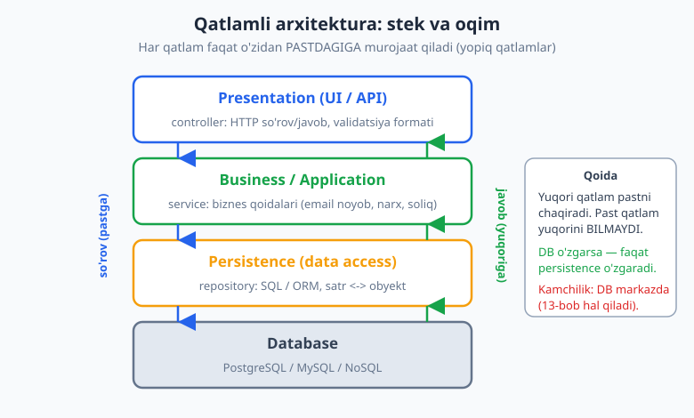
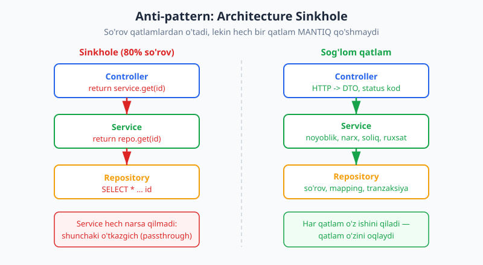
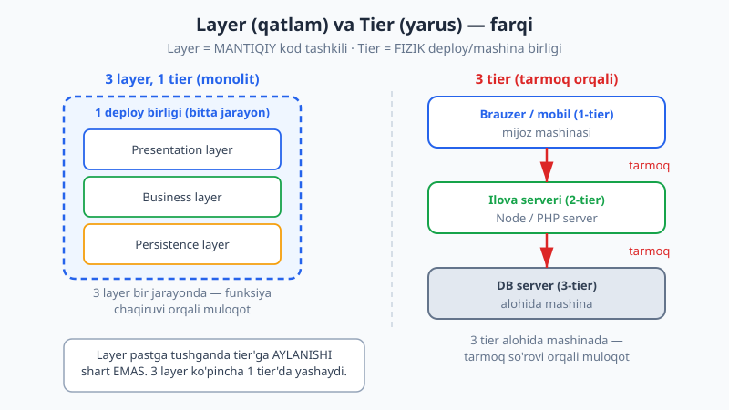

# 11 — Qatlamli arxitektura (layered / n-tier)

[⬅️ Oldingi: 10 — Modullik, komponentlar va chegaralar](./10-modullik-komponentlar.md) · [🏠 README](./README.md) · [Keyingi: 12 — Hexagonal: portlar va adapterlar ➡️](./12-hexagonal-portlar-adapterlar.md)

---

> **Bu bobda:** Dunyodagi eng keng tarqalgan arxitektura uslubi — **qatlamli (layered) arxitektura** bilan tanishamiz. Bu kod darajasidan (patternlar, 07-09-boblar) va modullar darajasidan (10-bob) keyingi tabiiy qadam: butun ilovani gorizontal qatlamlarga ajratish. Klassik tartib: **presentation** (UI/API) -> **business/application** (biznes qoidalari) -> **persistence** (ma'lumotga kirish) -> **database**. Har qatlam faqat o'zidan PASTDAGIGA murojaat qiladi. Biz **yopiq va ochiq qatlam** farqini, eng mashhur tuzoq — **architecture sinkhole** anti-patternini, ko'pchilik adashtiradigan **tier (yarus) va layer (qatlam)** farqini ko'ramiz; qachon qatlamli yaxshi, qachon emasligini, va u keyingi boblarning (hexagonal 12, clean 13) zaminini qanday tayyorlashini tahlil qilamiz. Yakunda ishlaydigan TypeScript misol: `controller -> service -> repository`.
>
> **Trade-off eslatmasi / Halollik:** Qatlamli arxitektura sodda va tanish — shu sababli eng ko'p ishlatiladi va eng ko'p NOTO'G'RI ishlatiladi. Uning markaziy ayirboshlashi: **soddalik va tanishlik** evaziga **domen ko'rinmasligi** va **ma'lumotlar bazasiga markazlashish** (DB butun dizaynni tortib turadi). Bu "yomon" degani emas — ko'p loyiha uchun aynan to'g'ri tanlov. Lekin uning chegaralarini bilish 12-13-boblardagi muqobillarni tushunish uchun shart. Bu bobdagi TypeScript misoli `$env:TEMP\arx-probe` muhitida `tsx` bilan ishga tushirilgan va `tsc --strict` bilan tekshirilgan (bob oxirida hisobot). Tier vs layer, sinkhole tahlili — konseptual (diagramma + trade-off).

---

## Qatlamli arxitektura nima?

Tasavvur qiling, sizda Telegram-bot backend yoki e-commerce API bor. Foydalanuvchi "ro'yxatdan o'tish" so'rovini yuboradi. Bu so'rov bilan bir nechta ALOHIDA ish bajarilishi kerak:

1. HTTP so'rovini qabul qilish, JSON ni o'qish, javob status kodini qaytarish;
2. biznes qoidalarini tekshirish (email noyobmi? yosh yetarlimi?);
3. ma'lumotni bazaga yozish (SQL so'rovi, satrlarni obyektga o'girish).

Agar bu uchchovini BITTA funksiyaga tiqsangiz, kod tez orada o'qib bo'lmaydigan tugunga aylanadi — HTTP detali, biznes mantiq va SQL bir-biriga chalkashadi. Qatlamli arxitekturaning g'oyasi oddiy va kuchli: **bir xil turdagi mas'uliyatni bitta gorizontal qatlamga jamla**, va qatlamlarni tartibli stekka ter.

```text
+---------------------------------------------+
|  Presentation (UI / API)   <- controller    |   tashqi dunyo
+---------------------------------------------+
|  Business / Application     <- service      |   biznes qoidalari
+---------------------------------------------+
|  Persistence (data access)  <- repository   |   ma'lumotga kirish
+---------------------------------------------+
|  Database                                   |   saqlash
+---------------------------------------------+
```



Har qatlamning ANIQ bir mas'uliyati bor — bu kohezatsiyani (cohesion, [04-bob](./04-coupling-cohesion.md)) oshiradi:

- **Presentation** — tashqi dunyo bilan muloqot: HTTP marshrutlash, so'rovni o'qish, javobni formatlash, status kod. Bu yerda biznes qoidasi BO'LMASLIGI kerak.
- **Business/Application** — ilovaning haqiqiy MANTIQI: "email noyob bo'lsin", "VIP mijozga chegirma", "buyurtma minimal summasi". HTTP yoki SQL ni bilmaydi.
- **Persistence** — ma'lumotni o'qish/yozish: SQL so'rovlari yoki ORM, satr <-> obyekt mapping, tranzaksiya boshqaruvi. Biznes qoidasini bilmaydi.
- **Database** — saqlash mexanizmi (PostgreSQL, MySQL, NoSQL).

> **Eslatma:** Bu eng klassik 4 qatlamli tartib, lekin qatlam soni qat'iy emas. Ba'zi loyihalarda 3 ta (presentation/business/data), boshqalarda servis qatlami ikkiga bo'linadi (application + domain). Muhim narsa — qatlam SONI emas, balki PRINTSIP: bir xil mas'uliyatni guruhlash va yo'nalishni bir tomonga (pastga) qaratish.

---

## Asosiy qoida: so'rov pastga, javob yuqoriga

Qatlamli arxitekturaning yuragida bitta qoida turadi: **har qatlam faqat o'zidan PASTDAGI qatlamni chaqiradi**. So'rov yuqoridan (presentation) pastga (database) tushadi, javob esa teskari yuqoriga ko'tariladi.

Bu nima beradi? **Bir tomonlama bog'liqlik** (one-way dependency). Pastki qatlam yuqoridagi qatlamni BILMAYDI — repository "meni kim chaqiryapti, controller'mi yoki test'mi?" deb so'ramaydi. Bu bog'liqlikni bir yo'nalishda ushlab turish kodni soddalashtiradi va sinash (test) qulaylashtiradi.

```text
So'rov:                       Javob:
  Controller                    Controller
     | (chaqiradi)                 ^ (qaytaradi)
     v                             |
  Service                       Service
     |                             ^
     v                             |
  Repository                    Repository
     |                             ^
     v                             |
  Database                      Database
```

> **Diqqat:** Yuqori qatlam pastni chaqirishi mumkin, lekin past qatlam yuqorini chaqirsa — bu **qatlam buzilishi** (layering violation). Masalan, repository ichidan controller'ga yoki service'ga murojaat qilish butun foydani yo'qotadi: bog'liqlik ikki tomonlama bo'lib, qatlamlar bir-biriga "yopishadi". Bunday kodni alohida test qilib bo'lmaydi va o'zgartirish xavfli bo'ladi.

---

## Yopiq va ochiq qatlam (layers of isolation)

Endi nozikroq savol. So'rov presentation'dan pastga tushadi — lekin u HAR qatlamdan O'TISHI shartmi, yoki ba'zi qatlamlarni "sakrab" o'tishi mumkinmi?

Bu yerda ikki yondashuv bor:

- **Yopiq qatlam (closed layer):** so'rov qatlamni SAKRAB o'tolmaydi — u keyingi qatlamga TUSHISHI shart. Presentation -> Business -> Persistence; presentation to'g'ridan-to'g'ri persistence'ga kira olmaydi.
- **Ochiq qatlam (open layer):** so'rov bu qatlamni sakrab, undan pastdagiga to'g'ridan-to'g'ri o'tishi mumkin.

Mark Richards va Neal Ford ("Fundamentals of Software Architecture") buni **layers of isolation** (qatlamlarni izolyatsiya qilish) printsipi deb ataydi. G'oya: qatlamlar YOPIQ bo'lsa, bir qatlamdagi o'zgarish faqat O'ZIGA tegishli — qo'shni qatlamlarga tarqalmaydi.

Misol: business qatlamining ICHKI tuzilishini butunlay qayta yozsangiz ham, agar uning presentation'ga ko'rsatadigan interfeysi o'zgarmasa — presentation qatlami HECH NARSANI sezmaydi. Bu izolyatsiya. Lekin agar presentation persistence'ni TO'G'RIDAN-TO'G'RI chaqirsa (business'ni sakrab), endi siz persistence'ni o'zgartirsangiz — presentation ham, business ham buzilishi mumkin. Izolyatsiya yo'qoldi.

```text
YOPIQ (yaxshi izolyatsiya):          OCHIQ (izolyatsiya zaif):
  Presentation                         Presentation ----+
     |  (sakrab bo'lmaydi)                 |             | (sakrab o'tdi)
     v                                     v             v
  Business                              Business      (Business sakraldi)
     |                                     |             |
     v                                     v             v
  Persistence                           Persistence <---+
```

> **Trade-off:** Nega hamma qatlamni har doim yopiq qilmaymiz? Chunki yopiq qatlam ba'zan ortiqcha "o'tkazgich" kod talab qiladi. Tasavvur qiling, presentation faqat bir nechta umumiy yordamchini (masalan formatlash, log) ishlatadi — ularni har qatlamdan o'tkazib o'tirish ortiqcha. Shuning uchun ba'zan **ochiq "umumiy/services" qatlami** qo'shiladi: har qatlam unga to'g'ridan-to'g'ri kira oladi. Qoida: standart holatda YOPIQ qiling (izolyatsiya muhim); ochiq qatlamni faqat ataylab, sababini bilib qo'shing.

> **Amaliyotda:** Yopiqlikni amalga oshirish odatda KOD TASHKILI bilan ta'minlanadi: presentation moduli faqat business modulini import qiladi, persistence'ni import qilmaydi. Ba'zi tillarda buni qattiqroq ushlab turish mumkin (masalan TypeScript'da `eslint-plugin-boundaries`, Java'da ArchUnit testlari) — qatlam buzilishini kompilyatsiya yoki test bosqichida ushlash.

---

## Anti-pattern: architecture sinkhole

Endi qatlamli arxitekturaning eng mashhur tuzog'i. **Architecture sinkhole** (arxitektura cho'kmasi) — bu shunday holatki, so'rov qatlamlardan O'TADI, lekin hech bir qatlam unga MANTIQ qo'shmaydi: har qatlam shunchaki so'rovni pastga uzatadi (passthrough).

Misol bilan ko'raylik. Bunday kod juda ko'p uchraydi:

```ts
// ANTI-PATTERN: sinkhole — har qatlam hech narsa qilmay o'tkazadi
class FoydalanuvchiController {
  yaratish(id: number) {
    return this.servis.get(id); // shunchaki uzatdi
  }
}
class FoydalanuvchiServisi {
  get(id: number) {
    return this.repo.get(id);   // shunchaki uzatdi
  }
}
class FoydalanuvchiRepo {
  get(id: number) {
    return db.query("SELECT * FROM users WHERE id = ?", id); // haqiqiy ish faqat shu yerda
  }
}
```

Bu yerda `service` qatlami HECH NARSA qilmadi — u faqat `repo.get`'ni chaqirdi va natijani qaytardi. Agar shunday so'rovlar ko'pchilikni tashkil qilsa, siz har so'rov uchun ikkita ortiqcha funksiya chaqiruvi va ikkita ortiqcha fayl yozyapsiz — foydasiz murakkablik.



> **Anti-pattern:** "Sinkhole" nomi shundan: so'rov qatlamlarga "tushadi" va izsiz yo'qoladi — hech qanday qiymat qo'shilmaydi, faqat yo'naltirish (indirection). Bu over-engineering ([06-bob](./06-dry-kiss-yagni.md), YAGNI) ko'rinishi: arxitektura "to'g'ri ko'rinsin" deb qatlamlar qo'yiladi, lekin ular bo'sh.

**Qachon bu MUAMMO, qachon NORMAL?** Bu yerda nozik nuqta bor. Mark Richards "80-20 qoidasi"ni eslatadi: agar so'rovlaringizning ~80% sinkhole bo'lsa (toza o'tkazgich, mantiqsiz), bu jiddiy signal — qatlamli arxitektura sizga foyda bermayapti, faqat narx qo'shyapti. Lekin agar ~20% so'rov o'tkazgich, qolgan 80% da business qatlami HAQIQIY ish qilsa (validatsiya, hisob-kitob, ruxsat tekshiruvi) — bu normal. Hatto sof CRUD so'rovlar uchun "bo'sh" service metodi bo'lishi ham yomon emas: u KELAJAKDA mantiq qo'shish uchun joy ochib qo'yadi va izchillikni saqlaydi.

> **Diqqat:** Sinkhole'ni "tuzatish" uchun service qatlamini OLIB TASHLASH har doim to'g'ri yechim emas. Agar 80% sinkhole bo'lsa-yu, lekin qolgan 20% da business qatlami muhim mantiqni ushlab tursa — qatlamni saqlang, faqat sof o'tkazgich joylarda controller'ni to'g'ridan-to'g'ri repository'ga ulashga (ochiq qatlam orqali) ruxsat berish mumkin. Qaror — o'lchang: real loyihada nechta so'rov mantiqsiz o'tyapti?

---

## Tier va layer — ko'p adashtirishadigan farq

Bu ikki atama o'zbekchada ham, inglizchada ham chalkashtiriladi, lekin farq muhim:

- **Layer (qatlam)** — **mantiqiy** kod tashkili. Presentation/business/persistence — bular layer. Ular bitta jarayonda (process), bitta deploy birligida yashashi mumkin.
- **Tier (yarus)** — **fizik** deploy birligi. Brauzer, ilova serveri, DB serveri alohida MASHINALARDA bo'lsa — bular tier. Tier'lar o'rtasida muloqot TARMOQ orqali bo'ladi.

Bu farqning amaliy ahamiyati katta. "3-layer" arxitektura — kod uch mantiqiy qatlamga bo'lingani; bu uchchovi BITTA serverda, bitta jarayonda ishlashi mumkin (klassik monolit). "3-tier" arxitektura esa uch FIZIK yarus: mijoz, ilova serveri, DB serveri — uch alohida mashina.



```text
3 LAYER, 1 TIER (klassik monolit):
  [ Bitta server / jarayon ]
    Presentation  -> Business -> Persistence    (funksiya chaqiruvi)
  Hammasi bir joyda; tarmoq YO'Q qatlamlar orasida.

3 TIER (fizik tarqatilgan):
  [Brauzer] --tarmoq--> [Ilova serveri] --tarmoq--> [DB serveri]
  Har yarus alohida mashinada; muloqot tarmoq so'rovi orqali.
```

> **Eslatma:** Layer pastga tushganda AVTOMATIK tier'ga aylanmaydi. Ko'p odam "biz 3-layer arxitektura qildik, demak 3-tier" deb o'ylaydi — bu xato. Sizning presentation, business, persistence layerlaringiz aksariyat hollarda BITTA jarayonda, bitta serverda yashaydi (funksiya chaqiruvlari bilan ulanadi, tarmoq emas). Tier — bu deploy qarori (masshtab, izolyatsiya kerak bo'lganda), layer — kod tashkili qarori.

> **Trade-off:** Layerni tier'ga aylantirish (masalan business qatlamini alohida serverga ko'chirish) BEPUL emas. Funksiya chaqiruvi nanosekundlarda, tarmoq so'rovi millisekundlarda o'lchanadi (taxminan, tartib darajasida ming barobar sekinroq) — va tarmoq ishonchsiz ([distributed fallacy](./README.md), 1-fallacy "tarmoq ishonchli"). Shuning uchun "har layer alohida tier bo'lsin" — yomon standart. Tier'larni faqat haqiqiy ehtiyoj (mustaqil masshtablash, xavfsizlik izolyatsiyasi) bo'lganda ajrating.

---

## Kod: controller -> service -> repository (TypeScript)

Nazariyani ishlaydigan kodga aylantiramiz. Klassik 3 qatlamli oqim quramiz: HTTP controller (presentation), foydalanuvchi servisi (business), in-memory repository (persistence). "Database" o'rniga xotiradagi `Map` ishlatamiz — printsip bir xil.

Avval **domen modeli** — qatlamlardan mustaqil:

```ts
interface Foydalanuvchi {
  id: number;
  ism: string;
  email: string;
  faol: boolean;
}
```

**Persistence qatlami (repository).** Faqat saqlash/o'qish; biznes qoidasini bilmaydi. Eng muhimi — INTERFEYS orqali e'lon qilamiz (buni quyida tushuntiramiz):

```ts
interface FoydalanuvchiRepo {
  saqla(f: Omit<Foydalanuvchi, "id">): Foydalanuvchi;
  emailBoyichaTop(email: string): Foydalanuvchi | undefined;
  idBoyichaTop(id: number): Foydalanuvchi | undefined;
  hammasi(): Foydalanuvchi[];
}

class XotiradagiRepo implements FoydalanuvchiRepo {
  private jadval = new Map<number, Foydalanuvchi>();
  private keyingiId = 1;

  saqla(f: Omit<Foydalanuvchi, "id">): Foydalanuvchi {
    const yangi: Foydalanuvchi = { id: this.keyingiId++, ...f };
    this.jadval.set(yangi.id, yangi);
    return yangi;
  }
  emailBoyichaTop(email: string): Foydalanuvchi | undefined {
    for (const f of this.jadval.values()) {
      if (f.email === email) return f;
    }
    return undefined;
  }
  idBoyichaTop(id: number): Foydalanuvchi | undefined {
    return this.jadval.get(id);
  }
  hammasi(): Foydalanuvchi[] {
    return [...this.jadval.values()];
  }
}
```

**Business qatlami (service).** Biznes qoidalari SHU YERDA: email noyobligi, email formati, "yangi foydalanuvchi faol". Service repository INTERFEYSIGA bog'lanadi — konkret `XotiradagiRepo`'ga emas. Bu Dependency Inversion (DIP, [05-bob](./05-solid.md)):

```ts
class RoyxatdanOtkazishXatosi extends Error {}

class FoydalanuvchiServisi {
  constructor(private repo: FoydalanuvchiRepo) {} // INTERFEYSga bog'landi

  royxatdanOtkaz(ism: string, email: string): Foydalanuvchi {
    // Biznes qoidasi 1: email noyob bo'lishi shart
    if (this.repo.emailBoyichaTop(email)) {
      throw new RoyxatdanOtkazishXatosi("Bu email allaqachon ro'yxatdan o'tgan");
    }
    // Biznes qoidasi 2: email '@' belgisini o'z ichiga olishi shart
    if (!email.includes("@")) {
      throw new RoyxatdanOtkazishXatosi("Email noto'g'ri");
    }
    // Biznes qoidasi 3: yangi foydalanuvchi avtomatik faol
    return this.repo.saqla({ ism, email, faol: true });
  }

  faolRoyxat(): Foydalanuvchi[] {
    return this.repo.hammasi().filter((f) => f.faol);
  }
}
```

**Presentation qatlami (controller).** HTTP so'rov/javobni biznes tiliga o'giradi. Biznes qoidasini BILMAYDI — faqat servisni chaqiradi va xatolarni HTTP status kodga aylantiradi:

```ts
interface HttpJavob {
  status: number;
  tana: unknown;
}

class FoydalanuvchiController {
  constructor(private servis: FoydalanuvchiServisi) {}

  yaratish(sorov: { ism: string; email: string }): HttpJavob {
    try {
      const f = this.servis.royxatdanOtkaz(sorov.ism, sorov.email);
      return { status: 201, tana: { id: f.id, ism: f.ism } };
    } catch (e) {
      if (e instanceof RoyxatdanOtkazishXatosi) {
        return { status: 400, tana: { xato: e.message } }; // biznes xatosi -> 400
      }
      return { status: 500, tana: { xato: "ichki xato" } };
    }
  }

  faollarniRoyxati(): HttpJavob {
    const royxat = this.servis.faolRoyxat();
    return { status: 200, tana: royxat.map((f) => ({ id: f.id, ism: f.ism })) };
  }
}
```

**Ulash (composition root).** Qatlamlar pastdan yuqoriga ulanadi — bu yagona joy konkret sinflarni biladi:

```ts
const repo = new XotiradagiRepo();
const servis = new FoydalanuvchiServisi(repo);
const controller = new FoydalanuvchiController(servis);

controller.yaratish({ ism: "Akmal", email: "akmal@mail.uz" }); // 201
controller.yaratish({ ism: "Soxta", email: "akmal@mail.uz" }); // 400 (dublikat)
controller.yaratish({ ism: "Xato", email: "emailsiz" });        // 400 (format)
controller.faollarniRoyxati();                                  // 200
```

Ishga tushirsak (haqiqiy `tsx` natijasi):

```text
[Qatlamli] controller -> service -> repository
  POST akmal@mail.uz => 201 {"id":1,"ism":"Akmal"}
  POST bekzod@mail.uz => 201 {"id":2,"ism":"Bekzod"}
  POST dublikat => 400 {"xato":"Bu email allaqachon ro'yxatdan o'tgan"}
  POST email-xato => 400 {"xato":"Email noto'g'ri"}
  GET faol royxat => 200 [{"id":1,"ism":"Akmal"},{"id":2,"ism":"Bekzod"}]
  [DIP] soxta repo bilan faol royxat => ["Test"]
```

Diqqat qiling: **dublikat email** xatosi `service` qatlamida (biznes qoidasi) ushlandi, `controller` esa uni `400` status kodga aylantirdi — har qatlam o'z ishini qildi. Bu sinkhole EMAS: business qatlami haqiqiy mantiq qo'shdi.

Oxirgi qator esa qatlamli arxitekturaning eng kuchli tomonini ko'rsatadi. `repo`ni butunlay boshqa amalga oshirish (`SoxtaRepo`) bilan almashtirdik — `FoydalanuvchiServisi` va `FoydalanuvchiController` BIR HARF HAM o'zgarmadi:

```ts
class SoxtaRepo implements FoydalanuvchiRepo { /* har doim test ma'lumoti */ }
const servis2 = new FoydalanuvchiServisi(new SoxtaRepo()); // service tegmadi!
```

> **Amaliyotda:** Bu repository'ni almashtira olish — qatlamli arxitekturaning amaliy foydasi: (1) **test** — service'ni soxta (fake/mock) repository bilan, haqiqiy DB'siz sinash; (2) **DB almashtirish** — PostgreSQL'dan MongoDB'ga o'tsangiz, faqat persistence qatlami o'zgaradi, business tegmaydi. Bu DIP ([05-bob](./05-solid.md)) ning amaliy mevasi: business pastdagi konkret DB'ga emas, repository INTERFEYSIGA bog'langan.

> **Trade-off:** E'tibor bering — bu misolda `service` repository interfeysiga bog'langan, lekin interfeysni ASOSAN business EMAS, persistence "egasi". Ya'ni o'q hali ham pastga qaragan (business -> persistence interfeysi). Bu qatlamli arxitekturaning chegarasi: domen hali ham infratuzilmaga (DB) "qaraydi". 12-13-boblarda (hexagonal, clean) interfeysni domen "egalik qiladi" va o'q ICHKARIGA buriladi — bu "DB markazda" muammosini hal qiladi.

---

## Qatlam chegarasida model o'zgaradi (DTO va mapping)

Qatlamli arxitekturaning ko'p e'tibordan chetda qoladigan, lekin amaliyotda juda muhim qismi: **har qatlamning O'Z modeli bo'lishi mumkin va kerak**. Bitta `Foydalanuvchi` obyektini butun stek bo'ylab "sudrash" oson yo'l, lekin u qatlamlarni bir-biriga yopishtiradi.

Real loyihada uchta alohida shakl uchraydi:

- **DB modeli (satr):** ma'lumotlar bazasi ustunlariga mos — `user_id`, `full_name`, `parol_hash`, `created_at`. Bu persistence qatlamining "tili".
- **Domen modeli:** ilova ichidagi toza obyekt — `id`, `ism`. Biznes mantiq shu bilan ishlaydi.
- **API DTO (Data Transfer Object):** tashqariga chiqadigan shakl — `parol_hash`, ichki maydonlarsiz. Presentation qatlamining "tili".

Qatlam chegarasida **mapping** (o'girish) bo'ladi:

```ts
// Persistence chegarasi: DB satri -> domen
function satrdanDomenga(s: FoydalanuvchiSatri): Domen {
  return { id: s.user_id, ism: s.full_name }; // parol_hash YUQORIGA O'TMAYDI
}
// Presentation chegarasi: domen -> API DTO
function domendanDtoga(d: Domen): ApiDto {
  return { id: d.id, ism: d.ism };
}
```

Nega ortiqcha ko'rinadigan bu o'girish muhim? **Maxfiy ma'lumot oqishining oldini oladi.** Agar DB satrini to'g'ridan-to'g'ri API javobiga qaytarsangiz, `parol_hash` tashqariga chiqib ketadi — xavfsizlik nuqsoni. Mapping qatlamlari bu chegaralarni majburiy qiladi.

> **Diqqat:** Bu yerda muvozanat bor. Juda sodda CRUD ilovada uch xil model + ikkita mapper — ortiqcha bo'lishi mumkin (boilerplate). Kichik loyihada bitta model yetishi mumkin. Lekin maxfiy maydonlar (parol, token), ichki holat (versiya raqami, soft-delete bayrog'i) bo'lsa — kamida API DTO'ni ALOHIDA qiling. Qoida: ichki shakl bevosita tashqariga chiqmasin.

> **Amaliyotda:** Frameworklar bu mapping'ni yengillashtiradi — NestJS'da `class-transformer` (`@Exclude()`), Java'da MapStruct, .NET'da AutoMapper. Lekin "sehrli" mapping ham xatosiz emas: `@Exclude()` qo'yishni unutsangiz, parol heshi chiqib ketadi. Shuning uchun API DTO'ni AYNAN kerakli maydonlardan tuzish (allowlist) — "hammasi, minus maxfiylar" (denylist) dan xavfsizroq.

---

## Qatlamli arxitekturada keng tarqalgan xatolar

Amaliyotda qatlamli arxitektura ko'p NOTO'G'RI quriladi. Eng tez-tez uchraydigan xatolar:

- **"Semiz controller" (fat controller):** biznes mantiq presentation qatlamiga sizib chiqadi — controller validatsiya, hisob-kitob, ruxsat tekshiruvini O'ZI qiladi. Natija: bir xil mantiq bir nechta controller'da takrorlanadi (DRY buzilishi, [06-bob](./06-dry-kiss-yagni.md)), va uni test qilish uchun HTTP simulyatsiya kerak. Tuzatish: mantiqni service'ga ko'chiring.
- **"Anemik" domen, "xudo" service:** domen obyektlari faqat ma'lumot (getter/setter), butun mantiq bitta ulkan service'da. Bu qatlamli uchun KENG tarqalgan — kichik loyihada qabul qilsa bo'ladi, lekin domen o'sganda service "xudo obyekt"ga aylanadi (past kohezatsiya, [04-bob](./04-coupling-cohesion.md)).
- **DB modelini hamma joyga sudrash:** ORM entity (DB satri) presentation'gacha ko'tariladi va to'g'ridan-to'g'ri JSON sifatida qaytariladi — maxfiy maydon oqishi va DB sxemasini API'ga "yopishtirish" (sxema o'zgarsa, API ham buziladi).
- **Qatlam buzilishi (skipping):** intizom bo'lmasa, controller business'ni sakrab to'g'ridan-to'g'ri repository'ni chaqiradi. Bir-ikki marta "tezroq" tuyuladi, lekin izolyatsiya yo'qoladi va biznes qoidasi chetlab o'tiladi.
- **Sinkhole'ni sezmaslik:** yuqorida ko'rgan toza o'tkazgich qatlamlar — ko'pchilik buni "to'g'ri arxitektura" deb o'ylab davom etadi, foydasiz murakkablik to'playdi.

> **Amaliyotda:** Bu xatolarni KOD- revyu va avtomatik tekshiruv bilan ushlash mumkin: lint qoidalari (`eslint-plugin-boundaries`) qatlam buzilishini, ArchUnit (Java) testlari import yo'nalishini tekshiradi. Eng yaxshi himoya — jamoada qatlam mas'uliyatlari aniq kelishilgan bo'lishi: "biznes qoidasi FAQAT service'da" kabi sodda kelishuv ko'p xatoni oldini oladi.

---

## Qachon qatlamli arxitektura yaxshi (va qachon emas)

Hech qanday arxitektura "har doim to'g'ri" emas — har biri trade-off. Qatlamli arxitektura quyidagi hollarda kuchli:

**Yaxshi tanlov:**

- **Sodda, tanish jamoa.** Bu eng ko'p o'rgatiladigan uslub — deyarli har bir dasturchi controller/service/repository'ni biladi. Yangi a'zo tez moslashadi.
- **Kichik-o'rta ilova, CRUD ustun.** Ko'p ma'lumotni o'qish/yozish, oddiy biznes mantiq — qatlamli bunga ideal.
- **Tez boshlash kerak.** Framework'lar (Spring, NestJS, Laravel, Django) qatlamli tuzilmaga to'g'ridan-to'g'ri yordam beradi.
- **Domen murakkabligi past-o'rta.** Biznes qoidalari ko'p emas, asosan ma'lumotni boshqarish.

**Kamchiliklari (qachon o'ylab ko'rish kerak):**

- **Domen ko'rinmaydi.** Kodga qarab "bu ilova NIMA qiladi?" deganni darrov tushunmaysiz — papkalar `controllers/`, `services/`, `repositories/` deb texnik bo'lingan, biznes konsepti emas. Domen mantiq service qatlamiga "tarqaladi". (Buni [10-bob](./10-modullik-komponentlar.md)dagi xususiyatga (feature) bo'lish va 13-bobdagi domen-markazli yondashuv hal qiladi.)
- **DB markazda.** Bog'liqlik oxir-oqibat pastga, ma'lumotlar bazasiga qaraydi — dizayn "DB sxemasidan" boshlanadi, domendan emas. Bu ko'p loyihada muammo emas, lekin murakkab domen uchun cheklov.
- **Butun ilova bitta deploy.** Klassik qatlamli — monolit; bir qatlamni alohida masshtablab bo'lmaydi (mikroservislar, 14-bob, buni hal qiladi — lekin o'z narxi bilan).
- **Qatlam buzilishi xavfi.** Intizom bo'lmasa, controller to'g'ridan-to'g'ri repository'ni chaqirib, qatlamlarni "aralashtiradi".

> **Amaliyotda:** Aksariyat real loyihalar (ayniqsa boshlanishida) qatlamli arxitektura bilan boshlaydi — bu to'g'ri qaror. "Mikroservislardan boshlash" yoki "darrov hexagonal" ko'pincha erta optimizatsiya. Qatlamli bilan boshlang; domen murakkablashganda yoki masshtab muammosi REAL paydo bo'lganda 12-14-boblardagi uslublarga bosqichma-bosqich o'ting. Martin Fowler ta'kidlaganidek (martinfowler.com): "monolit-birinchi" ko'p hollarda oqilona strategiya.

> **Trade-off:** Qatlamli vs hexagonal/clean (12-13-bob) — bu "soddalik vs domen mustaqilligi" ayirboshlashi. Qatlamli soddaroq, lekin domen infratuzilmaga qaraydi. Hexagonal/clean domenni markazga qo'yadi (o'q ichkariga), lekin ko'proq abstraksiya va boshlang'ich murakkablik talab qiladi. Kichik CRUD ilova uchun hexagonal — over-engineering; murakkab, uzoq yashaydigan domen uchun qatlamli — yetishmaydi. Kontekst hal qiladi.

---

## Qatlamli arxitektura — keyingi boblarning ko'prigi

Bu bob bejiz 11-o'rinda turmaydi. Qatlamli arxitektura — keyingi uchta bobning ZAMINI:

- **12-bob (Hexagonal / portlar va adapterlar):** qatlamli "DB markazda" muammosini hal qiladi — domenni markazga, DB va UI'ni "adapter" sifatida chetga qo'yadi. Bog'liqlik o'qi ICHKARIGA buriladi.
- **13-bob (Clean / onion):** xuddi shu g'oyani konsentrik halqalar bilan rasmiylashtiradi — "bog'liqlik qoidasi": o'q har doim ichkariga, domenga.
- **14-bob (mikroservislar):** qatlamli monolitni mustaqil deploy birliklariga bo'ladi — har birining ichida ko'pincha yana qatlamli tuzilma bo'ladi.

Boshqacha aytganda: qatlamli arxitekturani chuqur tushunsangiz, keyingi uslublar uning MUAMMOLARINI qanday hal qilishini ko'rasiz. Ular qatlamli o'rnini bosmaydi — uni RIVOJLANTIRADI.

---

## Mashqlar

### Oson

**1.** Quyidagi mas'uliyatlar qaysi qatlamga tegishli: (a) HTTP status kodini `404` qaytarish; (b) "buyurtma minimal summasi 50000 so'm" qoidasini tekshirish; (c) `SELECT * FROM orders WHERE user_id = ?` so'rovini bajarish; (d) JSON so'rov tanasini o'qib, obyektga aylantirish.

**2.** Qatlamli arxitekturada asosiy qoida nima? So'rov qaysi yo'nalishda oqadi va past qatlam yuqori qatlamni chaqira oladimi?

**3.** "Layer" va "tier" o'rtasidagi farqni bir jumlada ayting. "3-layer ilova" har doim "3-tier"mi?

**4.** Yopiq (closed) qatlam va ochiq (open) qatlam o'rtasidagi farq nima? Standart holatda qaysi birini tanlash kerak va nega?

**5.** Quyidagi kodda qatlamli arxitekturaning qaysi qoidasi buzilgan?

```ts
class FoydalanuvchiRepo {
  saqla(f: Foydalanuvchi) {
    this.controller.korsatXabar("saqlandi"); // repo controller'ni chaqiryapti
    db.insert(f);
  }
}
```

### O'rta

**6.** Quyidagi uch qatlamga qarang. Bu sinkhole anti-patternimi? Tushuntiring — qaysi qatlam mantiq qo'shyapti, qaysi biri yo'q?

```ts
class Controller { get(id: number) { return this.servis.get(id); } }
class Servis     { get(id: number) { return this.repo.get(id); } }
class Repo       { get(id: number) { return db.query("...", id); } }
```

**7.** Mark Richards'ning "80-20" mulohazasini o'z so'zlaringiz bilan tushuntiring: qancha so'rov sinkhole bo'lsa, bu signal? Va NEGA "service qatlamini butunlay olib tashlash" har doim to'g'ri yechim emas?

**8.** Sizda 3-layer monolit bor (presentation/business/persistence, hammasi bitta serverda). Boshqaruvchi "biz 3-tier emasmiz, masshtablanmaydigan ilova qurdik" deydi. Bu da'vo to'g'rimi? Layer va tier farqi orqali javob bering.

**9.** **(KOD)** Yuqoridagi `controller -> service -> repository` misoliga `deaktivatsiya(id)` operatsiyasini qo'shing: faqat MAVJUD va FAOL foydalanuvchini nofaol qilish mumkin (yo'q bo'lsa yoki allaqachon nofaol bo'lsa — xato). Biznes qoidasi QAYSI qatlamga tushishi kerak? Yozib, `tsx` bilan ishga tushiring.

**10.** Qatlamli arxitekturada `service` `repository` INTERFEYSIGA bog'lanadi (konkret sinfga emas). Bu qaysi SOLID printsipi va u amalda nima beradi (kamida 2 ta foyda)?

### Qiyin

**11.** **(KOD)** Uch qatlamli oqimda QATLAM CHEGARASIDA model o'zgarishini ko'rsating: DB satri (`user_id`, `full_name`, `parol_hash`) -> domen obyekti (`id`, `ism`) -> API DTO (`id`, `ism`). `parol_hash` API javobiga CHIQMASLIGI shart. Mapper funksiyalar yozing va `parol_hash` DTO'da yo'qligini tekshiring (`tsx`).

**12.** **(Dizayn)** Telegram-bot backend'ida quyidagi so'rov keladi: "foydalanuvchi /buy buyrug'ini yubordi, mahsulot sotib olmoqchi". Bu so'rov uchun 3 qatlamli oqimni loyihalang: har qatlam ANIQ NIMA qiladi (presentation/business/persistence)? Qaysi biznes qoidalari business qatlamida bo'lishi kerak (kamida 2 ta)? Pseudokod yoki diagramma bilan ko'rsating.

**13.** **(Tahlil va trade-off)** Jamoangiz oddiy CRUD ilova (mahsulot katalogi: qo'shish, ko'rish, tahrirlash, o'chirish — murakkab biznes mantiq yo'q) quryapti. Hamkasbingiz "darrov hexagonal arxitektura (12-bob) qilaylik, kelajakda kerak bo'ladi" deydi. Siz qatlamli arxitekturani taklif qilasiz. Har ikki tomonni trade-off bilan baholang: qaysi printsiplar (KISS, YAGNI, [06-bob](./06-dry-kiss-yagni.md)) qaysi tomonni qo'llaydi? Qachon hamkasbingiz haq bo'lar edi?

**14.** **(Tahlil)** Qatlamli arxitekturaning "DB markazda" kamchiligini tushuntiring: dizayn nega DB sxemasidan boshlanishga moyil bo'ladi? Bu qaysi turdagi loyihada muammo, qaysisida emas? 12-13-boblar buni qanday hal qilishini (o'q yo'nalishi orqali) bir-ikki jumlada ayting.

<details markdown="1">
<summary>Yechimlar</summary>

### 1-mashq yechimi
(a) **Presentation** — HTTP status kod tashqi dunyo (HTTP) detali. (b) **Business** — "minimal summa" biznes qoidasi. (c) **Persistence** — SQL so'rovi ma'lumotga kirish. (d) **Presentation** — so'rov tanasini o'qish (deserializatsiya) tashqi formatdan ichki obyektga o'tish, bu presentation chegarasi. Asosiy saboq: har mas'uliyat o'z qatlamida — HTTP detali business'ga, biznes qoidasi persistence'ga aralashmasin.

### 2-mashq yechimi
Asosiy qoida: **har qatlam faqat o'zidan PASTDAGI qatlamni chaqiradi**. So'rov yuqoridan (presentation) pastga (database) oqadi, javob teskari yuqoriga ko'tariladi. Past qatlam yuqorini chaqira OLMAYDI — bu bir tomonlama bog'liqlik. Aksincha bo'lsa (repo controller'ni chaqirsa) — qatlam buzilishi, ikki tomonlama bog'liqlik paydo bo'ladi.

### 3-mashq yechimi
**Layer** — mantiqiy kod tashkili (presentation/business/persistence); **tier** — fizik deploy birligi (alohida mashina/jarayon). Yo'q, "3-layer" har doim "3-tier" EMAS: uch mantiqiy qatlam ko'pincha bitta serverda, bitta jarayonda (1 tier) yashaydi va funksiya chaqiruvi orqali muloqot qiladi. Tier'ga aylanish faqat ular tarmoq orqali ajratilganda sodir bo'ladi.

### 4-mashq yechimi
**Yopiq qatlam** — so'rov uni sakrab o'tolmaydi, keyingi qatlamga tushishi shart. **Ochiq qatlam** — so'rov uni sakrab, undan pastdagiga to'g'ridan-to'g'ri o'tishi mumkin. Standart holatda **yopiq**ni tanlang: u izolyatsiya beradi (bir qatlamdagi o'zgarish qo'shnilarga tarqalmaydi — layers of isolation). Ochiq qatlamni faqat ataylab, aniq sabab bilan (masalan umumiy yordamchilar qatlami) qo'shing.

### 5-mashq yechimi
**Qatlam buzilishi** (layering violation): repository (eng pastki qatlam) controller (eng yuqori qatlam)ni chaqiryapti — bog'liqlik PASTDAN YUQORIGA, qoidaga TESKARI. Bu bir tomonlama bog'liqlikni buzadi: endi repo'ni controller'siz test qilib bo'lmaydi va ular bir-biriga "yopishadi". To'g'ri yechim: repo faqat saqlasin (`db.insert`), foydalanuvchiga xabar ko'rsatish — bu presentation qatlamining ishi, natija yuqoriga qaytgach amalga oshirilsin.

### 6-mashq yechimi
**Ha, bu sinkhole** — uchchala qatlam ham sof o'tkazgich: `Controller.get` -> `Servis.get` -> `Repo.get`, hech qaysi biri MANTIQ qo'shmaydi (validatsiya, transformatsiya, ruxsat tekshiruvi yo'q). Faqat `Repo` haqiqiy ish qiladi (DB so'rovi). Agar ilovadagi so'rovlarning aksariyati shunaqa bo'lsa — qatlamli arxitektura narx qo'shyapti, foyda emas. Lekin: agar bu so'rov ESTISNO bo'lsa-yu, boshqa so'rovlarda service haqiqiy mantiq qilsa — bitta "bo'sh" o'tkazgich metod normal (izchillik va kelajak uchun joy).

### 7-mashq yechimi
"80-20" mulohaza: agar so'rovlaringizning ~80% sinkhole (toza o'tkazgich) bo'lsa — bu jiddiy signal, qatlamli arxitektura sizga deyarli foyda bermayapti, faqat ikki ortiqcha qatlam narxini to'layapsiz. ~20% o'tkazgich, 80% da haqiqiy mantiq bo'lsa — normal. Service qatlamini OLIB TASHLASH har doim to'g'ri emas, chunki: (1) o'sha 20% (yoki undan kam) so'rov muhim biznes mantiqni ushlab turishi mumkin — uni yo'qotsangiz, mantiq controller yoki repo'ga "tarqaladi"; (2) izchillik va kelajakda mantiq qo'shish uchun joy yo'qoladi. To'g'ri yondashuv: avval O'LCHANG (nechta so'rov sinkhole?), keyin qaror qiling — kerak bo'lsa faqat sof o'tkazgich joylarda ochiq qatlamga ruxsat bering.

### 8-mashq yechimi
Da'vo CHALKASH — ikki narsani aralashtiryapti. "3-tier emaslik" (fizik tarqatilmaganlik) "masshtablanmaslik"ni ANGLATMAYDI. 3-layer monolit ham masshtablanadi: uni bir nechta nusxada (instance) ishga tushirib, yuk balanslagich orqasiga qo'yish mumkin (gorizontal masshtab). Layer (mantiqiy) va tier (fizik) — boshqa o'lchamlar. Tier'larga ajratish (masalan business'ni alohida serverga) faqat MA'LUM holatlarda foydali (mustaqil masshtablash, izolyatsiya) va o'z narxi bor (tarmoq latency, ishonchsizlik). Monolitni "masshtablanmaydigan" deyish noto'g'ri — bu deploy strategiyasiga bog'liq, layer/tier soniga emas.

### 9-mashq yechimi
Biznes qoidasi ("mavjud va faol bo'lishi shart") **business/service qatlamiga** tushadi — controller HTTP'ni, repo saqlashni biladi, qoida service'da. Ishga tushirildi (haqiqiy natija):

```ts
class TopilmadiXatosi extends Error {}
class HolatXatosi extends Error {}

class Servis {
  constructor(private repo: Repo) {}
  deaktivatsiya(id: number): Foydalanuvchi {
    const f = this.repo.idBoyichaTop(id);
    if (!f) throw new TopilmadiXatosi("foydalanuvchi yo'q");      // qoida 1
    if (!f.faol) throw new HolatXatosi("allaqachon nofaol");      // qoida 2
    const yangi = { ...f, faol: false };
    this.repo.saqlaYangila(yangi);
    return yangi;
  }
}
```

Natija:

```text
[7-mashq] deaktivatsiya
  1-marta: {"id":1,"ism":"Akmal","faol":false}
  2-marta xato: allaqachon nofaol
  yo'q id xato: foydalanuvchi yo'q
```

E'tibor bering: ikki xil xato sinfi (`TopilmadiXatosi`, `HolatXatosi`) — controller ularni mos status kodga (404, 409) aylantira oladi. Biznes qoidasi service'da, HTTP semantikasi controller'da.

### 10-mashq yechimi
Bu **Dependency Inversion Principle (DIP)** ([05-bob](./05-solid.md)): yuqori daraja (business) past darajaga (konkret DB) emas, ABSTRAKSIYAGA (repository interfeysi) bog'lanadi. Amaliy foydalar: (1) **Test** — service'ni soxta (fake/mock) repo bilan, haqiqiy DB ulashsiz, tez sinash mumkin; (2) **DB almashtirish** — PostgreSQL'dan boshqasiga o'tsangiz, faqat persistence qatlamida yangi `implements FoydalanuvchiRepo` sinf yozasiz, business tegmaydi; (3) qo'shimcha — service'ni mustaqil tushunish va rivojlantirish osonlashadi (u DB detalini bilmaydi).

### 11-mashq yechimi
Har qatlam chegarasida model o'zgaradi; `parol_hash` faqat DB/persistence darajasida qoladi. Ishga tushirildi (haqiqiy natija):

```ts
interface FoydalanuvchiSatri { user_id: number; full_name: string; parol_hash: string; }
interface Domen { id: number; ism: string; }
interface ApiDto { id: number; ism: string; }

function satrdanDomenga(s: FoydalanuvchiSatri): Domen {
  return { id: s.user_id, ism: s.full_name }; // parol_hash YUQORIGA O'TMAYDI
}
function domendanDtoga(d: Domen): ApiDto {
  return { id: d.id, ism: d.ism };
}
```

Natija:

```text
[11-mashq] mapper zanjiri (parol_hash chiqmaydi)
  DB satr kalitlari: user_id,full_name,parol_hash
  API DTO: {"id":7,"ism":"Bekzod"}
  DTO da parol bormi? false
```

Saboq: qatlam chegarasida MAPPING qilish (DB modeli != domen modeli != API DTO) maxfiy ma'lumotni (parol heshi) yuqori qatlamlarga "sizib chiqishi"ni oldini oladi. Agar DB satrini to'g'ridan-to'g'ri API javobiga qaytarsangiz — `parol_hash` tashqariga chiqib ketardi (xavfsizlik nuqsoni).

### 12-mashq yechimi
**Namunaviy yechim — 3 qatlamli oqim:**

```text
Presentation (Telegram handler):
  - /buy buyrug'ini va parametrlarni (mahsulot id) o'qish
  - foydalanuvchi id'sini Telegram update'dan olish
  - service'ni chaqirish; natijani foydalanuvchiga xabar sifatida formatlash
  - xato -> foydalanuvchiga tushunarli xabar ("balans yetmaydi")

Business (xarid servisi):
  - qoida 1: mahsulot mavjud va sotuvda bormi?
  - qoida 2: foydalanuvchi balansi yetarlimi?
  - qoida 3: omborda zaxira bormi (qoldiq > 0)?
  - balansdan yechish, zaxirani kamaytirish, buyurtma yaratish (atomik)
  - repository'larni chaqirish (mahsulot, balans, buyurtma)

Persistence (repository'lar):
  - mahsulotRepo.topish(id), balansRepo.olish/yangilash,
    buyurtmaRepo.saqlash, omborRepo.kamaytirish
  - SQL/ORM, tranzaksiya (hammasi birga yoki hech biri)
```

**Business qatlamidagi qoidalar (kamida 2 ta):** (a) "balans mahsulot narxidan kam bo'lmasligi"; (b) "ombor qoldig'i 0 dan katta bo'lishi"; (qo'shimcha: "mahsulot sotuvda (faol) bo'lishi"). Bularning HAMMASI business'da — presentation faqat Telegram detalini, persistence faqat saqlashni biladi. Diqqat: balans yechish + zaxira kamaytirish + buyurtma yaratish bitta TRANZAKSIYADA bo'lsin (yarim bajarilmasin) — bu business qatlami muvofiqlashtiradigan muhim nuqta.

### 13-mashq yechimi
**Bu yerda QATLAMLI to'g'ri tanlov** (hamkasbingiz haq emas — hozircha). Sabab: ilova oddiy CRUD, murakkab biznes mantiq yo'q. Hexagonal'ning asosiy foydasi — domenni infratuzilmadan ajratish — bu yerda hal qiladigan muammo deyarli YO'Q (domen juda yupqa).

- **KISS** ([06-bob](./06-dry-kiss-yagni.md)) qatlamli tomonni qo'llaydi: oddiy muammoga oddiy yechim. Hexagonal qo'shimcha portlar, adapterlar, abstraksiya keltiradi — CRUD uchun ortiqcha.
- **YAGNI** ham qatlamli tomonda: "kelajakda kerak bo'ladi" — taxmin. Murakkablikni HOZIR to'lab, ehtimoliy kelajak uchun investitsiya qilish — YAGNI buzilishi.

**Qachon hamkasbingiz HAQ bo'lar edi:** agar (a) domen murakkab va o'sishi ANIQ bilinsa (ko'p biznes qoidasi, murakkab hisob-kitoblar); (b) bir nechta tashqi integratsiya (to'lov, yetkazib berish, tashqi API) bo'lib, ularni almashtirish/test qilish muhim bo'lsa; (c) ilova uzoq yashashi va katta jamoa ishlashi rejalashtirilgan bo'lsa. Bunday hollarda hexagonal'ning domen-mustaqilligi investitsiyasi o'zini oqlaydi. **Qoida:** arxitektura murakkabligi domen murakkabligiga MOS bo'lsin — oddiy CRUD'ga hexagonal ham, murakkab domenga yalang'och qatlamli ham noto'g'ri.

### 14-mashq yechimi
**"DB markazda" muammosi:** qatlamli arxitekturada bog'liqlik o'qi oxir-oqibat pastga, persistence va database'ga qaragani uchun, jamoa odatda dizaynni "qanday jadvallar kerak?" degan savoldan boshlaydi — domen tushunchalaridan emas. Natijada domen modeli ko'pincha DB sxemasining ko'zgusi bo'lib qoladi (har jadval = bir sinf), va biznes mantiq service qatlamiga "tarqaladi", domen obyektlariga emas.

**Qaysi loyihada muammo:** murakkab, qoidalarga boy domen (bank, sug'urta, logistika) — bu yerda domenni DB'ga bo'ysundirish biznes mantiqni xiralashtiradi. **Qaysida emas:** oddiy CRUD, ma'lumotni boshqarish ustun bo'lgan ilova — bu yerda "DB markazda" tabiiy va muammo emas.

**12-13-bob qanday hal qiladi:** ular bog'liqlik O'QINI TESKARI buradi — o'q ICHKARIGA, domenga qaraydi (hexagonal: domen markazda, DB "adapter" sifatida chetda; clean: "bog'liqlik qoidasi" — o'q har doim ichki, domen halqasiga). Shunda domen DB'ni BILMAYDI; DB domenga moslashadi, aksincha emas. Bu domenni mustaqil loyihalash va test qilish imkonini beradi.

</details>

---

## Xulosa

Qatlamli (layered) arxitektura — dunyodagi eng keng tarqalgan arxitektura uslubi: ilovani gorizontal qatlamlarga (presentation -> business -> persistence -> database) ajratadi, har qatlam faqat o'zidan PASTDAGIGA murojaat qiladi.

- **Asosiy qoida** — so'rov pastga, javob yuqoriga; bir tomonlama bog'liqlik (past qatlam yuqorini bilmaydi).
- **Yopiq qatlam** izolyatsiya beradi (o'zgarish tarqalmaydi); **ochiq qatlam** sakrab o'tishga ruxsat beradi — standart holatda yopiq.
- **Architecture sinkhole** — eng mashhur tuzoq: qatlamlar mantiqsiz o'tkazgichga aylanadi (so'rovlarning ko'pchiligi hech narsa qilmay o'tadi). 80-20 mulohazasi bilan o'lchang.
- **Tier (fizik deploy) != layer (mantiqiy kod tashkili)** — 3-layer monolit ko'pincha 1-tier'da yashaydi.
- **Qachon yaxshi:** sodda, tanish, kichik-o'rta CRUD ilova. **Kamchiliklari:** domen ko'rinmaydi, DB markazda, butun ilova bitta deploy.

Eng muhim saboq — qatlamli arxitektura "boshlang'ich nuqta sifatida deyarli har doim oqilona", lekin uning chegaralarini (ayniqsa "DB markazda") bilish kerak. Aynan bu chegaralar keyingi boblarni keltirib chiqaradi.

Keyingi bobda **hexagonal arxitektura (portlar va adapterlar)** ga o'tamiz: u qatlamli "DB markazda" muammosini bog'liqlik o'qini ICHKARIGA, domenga burish orqali hal qiladi. Domen markazga ko'chadi, DB va UI esa almashtirib bo'ladigan "adapter"larga aylanadi.

---

> **Kod-verifikatsiya hisoboti.** Bu bobdagi barcha TypeScript misollari `$env:TEMP\arx-probe` muhitida tekshirildi:
> - `_v_11.ts` (controller -> service -> repository to'liq oqim; biznes qoidalari; DIP isboti `SoxtaRepo` bilan) — `npx tsx _v_11.ts` muvaffaqiyatli ishladi; `npx tsc --noEmit --strict _v_11.ts` toza (0 xato). Matndagi barcha "ishga tushirsak" natijalari shu ishdan olingan.
> - `_v_11b.ts` (9-mashq deaktivatsiya biznes qoidasi; 11-mashq qatlam chegarasi mapper zanjiri, `parol_hash` chiqmasligi) — `npx tsx` muvaffaqiyatli; `tsc --strict` toza. 9 va 11-mashq natijalari haqiqiy.
> - Muhit: TypeScript 6.0.3, tsx 4.22, Node v24. Konseptual qismlar (sinkhole 80-20 tahlili, tier vs layer, dizayn mashqlari 12-13-14) "konseptual/pseudokod" deb belgilangan.

---

[⬅️ Oldingi: 10 — Modullik, komponentlar va chegaralar](./10-modullik-komponentlar.md) · [🏠 README](./README.md) · [Keyingi: 12 — Hexagonal: portlar va adapterlar ➡️](./12-hexagonal-portlar-adapterlar.md)
