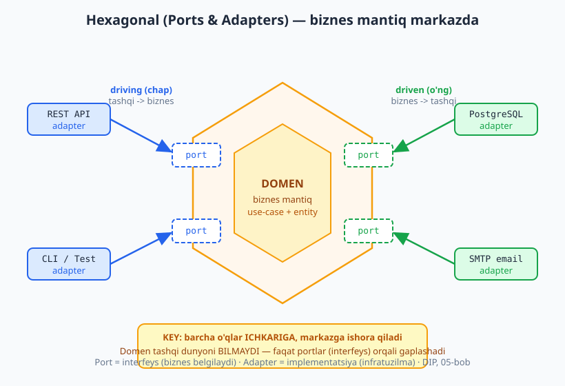
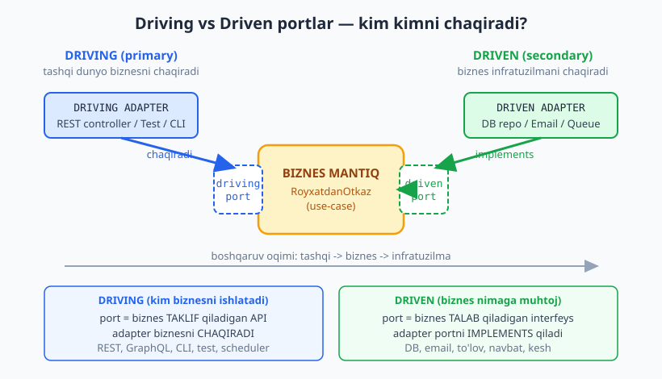
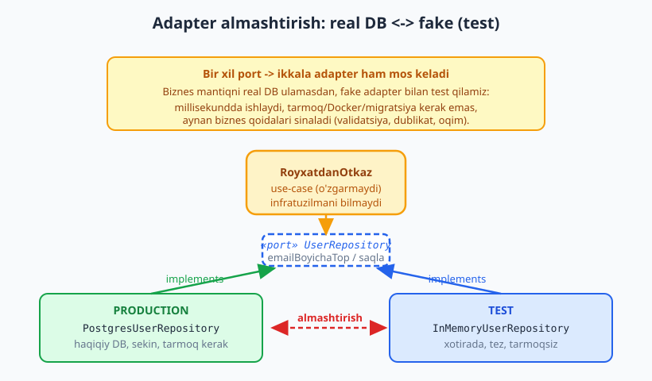

# 12 — Hexagonal: portlar va adapterlar

[⬅️ Oldingi: 11 — Qatlamli arxitektura](./11-qatlamli-arxitektura.md) · [🏠 README](./README.md) · [Keyingi: 13 — Onion va Clean Architecture ➡️](./13-onion-clean-architecture.md)

---

> **Bu bobda:** **Hexagonal arxitektura** (Ports &amp; Adapters) — biznes mantiqni infratuzilmadan (DB, framework, tashqi servis) **izolyatsiya** qiladigan uslub. Avvalgi bobdagi qatlamli arxitekturada biznes mantiq pastdagi DB qatlamiga **bog'lanib** (coupling — bog'liqlik, 04-bob) qolardi; hexagonal bu o'qni teskari buradi: biznes mantiq **markazda**, infratuzilma esa chekkada va markazga "ulanadi". Ikki asosiy atama: **port** (interfeys — biznes belgilaydi) va **adapter** (implementatsiya — infratuzilma beradi). Yana **driving** (primary — tashqi dunyo biznesni chaqiradi) va **driven** (secondary — biznes infratuzilmani chaqiradi) portlarni ajratamiz. Eng kuchli amaliy foyda — testlash: real DB adapterini **fake/in-memory** adapter bilan almashtirib, biznes qoidalarni infratuzilmasiz, millisekundda sinaymiz.
>
> **Trade-off eslatmasi / Halollik:** hexagonal bepul kelmaydi — ko'proq interfeys, ko'proq fayl, ko'proq boilerplate (qo'shimcha shablon kod). U **soddalikni** **izolyatsiya va testability**ga almashtiradi. Kichik CRUD ilovaga bu ortiqcha (over-engineering); murakkab, uzoq yashaydigan domenga — qutqaruvchi. Bu bobning markaziy TypeScript misoli (`RoyxatdanOtkaz` use-case + `UserRepository` port + `InMemoryUserRepository` adapter + fake bilan test + adapter almashtirish) `$env:TEMP/arx-probe` da `tsx` bilan **haqiqatan ishga tushirilgan** va `tsc --strict` bilan tip-tekshirilgan (0 xato) — natijalar bob oxirida.

---

## Muammo: qatlamli arxitekturada biznes DB'ga bog'lanib qoladi

11-bobdagi klassik qatlamli arxitekturani eslang: yuqorida UI, ostida biznes mantiq, eng pastda ma'lumot kirishi (DB). Bog'liqlik **yuqoridan pastga** oqadi — biznes qatlam DB qatlamini to'g'ridan-to'g'ri chaqiradi:

```text
   UI / Controller
        |  (chaqiradi)
        v
   Biznes mantiq  ----import--->  PostgresClient, ORM, SMTP...
        |  (chaqiradi)
        v
   Ma'lumot kirishi (DB)
```

Ko'rinishidan tartibli. Lekin bitta jiddiy muammo bor: **biznes mantiq pastdagi konkret texnologiyaga bog'langan**. `BuyurtmaXizmati` ichida `import { db } from "./postgres"` yoki `new SmtpMailer()` bo'lsa — biznes qoidasi infratuzilma detaliga **yopishib** qoladi. Bu nima bilan xavfli?

- **Testlash qiyin.** `BuyurtmaXizmati`ni sinash uchun haqiqiy Postgres ko'tarishingiz kerak — Docker, migratsiya, tarmoq. Bitta validatsiya qoidasini tekshirish uchun butun DB.
- **Almashtirish qiyin.** Postgres'dan MongoDB'ga yoki SMTP'dan SendGrid'ga o'tsangiz — biznes kodga tegasiz, regressiya xavfi.
- **Domen ifloslanadi.** Biznes mantiq ichida SQL satrlari, ORM annotatsiyalari, HTTP detallari aralashadi — "nima muhim" (qoidalar) "qanday saqlanadi" (texnologiya) bilan chalkashadi.

> **Diqqat:** ko'pchilik "qatlamli arxitektura DIP'ni hal qiladi" deb o'ylaydi. Aslida **an'anaviy** qatlamli arxitekturada bog'liqlik o'qi pastga qaraydi va biznes pastki qatlamga bog'langan. Hexagonal aynan shu o'qni teskari aylantirish (DIP — Dependency Inversion, 05-bob) ustiga qurilgan. 13-bobdagi Onion/Clean ham xuddi shu g'oyaning rivoji.

**Hexagonal arxitektura** (boshqacha nomi **Ports &amp; Adapters**) — bu muammoni hal qilish uchun **Alistair Cockburn** taklif qilgan uslub (2005 atrofida ta'riflangan). Asosiy g'oya bitta jumlada: **biznes mantiqni markazga qo'y, infratuzilmani chekkaga sur, ular orasiga interfeys (port) qo'y va bog'liqlik o'qini ICHKARIGA (markazga) yo'naltir.**

> **Eslatma — "hexagonal" nega olti burchak?** Cockburn olti burchakni ataylab tanlagan: u "yuqori/past" (qatlam) tasavvurini buzadi va har tomonga bir nechta port joylashtirish mumkinligini ko'rsatadi. Olti burchakda sehrli ma'no yo'q — oltita port bo'lishi shart emas. Muhimi — **ichkari vs tashqari**, "yuqori vs past" emas.

---

## Port = interfeys, Adapter = implementatsiya

Bu ikki atama butun arxitekturaning yuragi. Sodda ta'rif:

- **Port** — bu **interfeys**. Uni **biznes** (domen) belgilaydi. Port "menga shunday imkoniyat kerak" deydi, lekin u **qanday** bajarilishini aytmaydi. Masalan: "menga foydalanuvchini email bo'yicha topadigan va saqlaydigan narsa kerak" — bu `UserRepository` port.
- **Adapter** — bu portning **konkret implementatsiyasi**. Uni **infratuzilma** beradi. Masalan: `PostgresUserRepository` (haqiqiy DB), `InMemoryUserRepository` (xotirada, test uchun), `MongoUserRepository` — barchasi bir xil `UserRepository` portni **implements** qiladi.

Bitta port — bir nechta adapter. Aynan shu narsa kuch beradi: biznes faqat **port**ni biladi, qaysi adapter ulanganini bilmaydi.

> **Intuitsiya — elektr rozetka.** Devordagi rozetka — bu **port** (standart shakl, "menga 220V kerak" deydi). Vilkasi shu shaklga mos har qanday qurilma — **adapter**. Choynak, noutbuk zaryadlovchisi, changyutgich — hammasi bir xil portga ulanadi. Devor "u yerda nima ulanganini" bilmaydi. Sayohatda boshqa shakldagi rozetka uchun **adapter** (perexodnik) olasiz — bu Adapter pattern (08-bob), aynan shu g'oya.

Bog'liqlik o'qi qayerga qaragani — eng muhim detal. **Biznes portni chaqiradi (port'ga bog'lanadi), adapter portni implements qiladi (port'ga bog'lanadi).** Ya'ni **ikkala tomon ham portga (abstraksiyaga) bog'lanadi**, biri ikkinchisiga emas. Bu — DIP'ning aniq qo'llanilishi: o'q konkret klassga emas, abstraksiyaga qaraydi.



> **Diqqat — port "biznes tomonda" yashaydi.** Eng keng tarqalgan xato: `UserRepository` interfeysini DB papkasiga qo'yish. Yo'q — **port domen (biznes) tomoniga tegishli**, chunki uni biznes ehtiyoji belgilaydi. Adapter (implementatsiya) infratuzilma tomonida. Agar interfeysni DB papkasiga qo'ysangiz, bog'liqlik o'qi yana pastga "sirg'alib" ketadi va izolyatsiya buziladi. Buni 13-bobda (Clean) "Dependency Rule" deb yana ko'ramiz.

---

## Driving va Driven portlar — kim kimni chaqiradi?

Portlar ikki xil bo'ladi, va ularni ajratmaslik — chalkashlikning asosiy manbai. Farq — **boshqaruv oqimi yo'nalishi**: kim kimni chaqiradi?

### Driving (primary) — tashqi dunyo biznesni chaqiradi

**Driving port** (yoki primary, "haydovchi") — bu biznes **taklif qiladigan** API. Tashqi dunyo (UI, REST controller, test, CLI, scheduler) shu port orqali biznesni **chaqiradi**. Boshqaruv tashqaridan ichkariga oqadi.

- **Driving port** = `RoyxatdanOtkazPort` (biznes "men ro'yxatdan o'tkaza olaman" deydi).
- **Driving adapter** = REST controller, test, CLI — bular portni **chaqiradi**.

### Driven (secondary) — biznes infratuzilmani chaqiradi

**Driven port** (yoki secondary, "haydaladigan") — bu biznes **talab qiladigan** interfeys. Biznes ichki ishi uchun shu port orqali infratuzilmani **chaqiradi**: DB, email, to'lov, navbat. Boshqaruv ichkaridan tashqariga oqadi.

- **Driven port** = `UserRepository`, `Xabarchi` (biznes "menga saqlovchi/yuboruvchi kerak" deydi).
- **Driven adapter** = `PostgresUserRepository`, `SmtpXabarchi` — bular portni **implements** qiladi.



Eslab qolishning oson usuli — **chap vs o'ng**:

| | Driving (chap, primary) | Driven (o'ng, secondary) |
|---|---|---|
| **Savol** | Kim biznesni **ishlatadi**? | Biznes nimaga **muhtoj**? |
| **Port nima** | Biznes **taklif** qiladigan API | Biznes **talab** qiladigan interfeys |
| **Adapter rol** | Portni **chaqiradi** | Portni **implements** qiladi |
| **Misol** | REST, CLI, test, GraphQL, cron | DB, email, to'lov, kesh, navbat |
| **Oqim** | tashqi -&gt; biznes | biznes -&gt; tashqi |

> **Eslatma:** asimmetriyaga e'tibor bering. Driving tomonda **adapter biznesni chaqiradi** (biznes API'ni implements qiladi yoki shunchaki ochiq metodlari bor). Driven tomonda **biznes portni chaqiradi, adapter implements qiladi**. Ikkala holatda ham biznes faqat abstraksiyaga (portga) bog'lanadi — konkret REST yoki konkret Postgres'ga emas.

---

## Markaziy misol: `RoyxatdanOtkaz` use-case (TS, ishga tushadi)

Endi nazariyani kodga aylantiramiz. E-commerce yoki [Telegram-bot backend](../tgbot-js/README.md) uchun klassik amal — **foydalanuvchini ro'yxatdan o'tkazish**. Biznes qoidalari: email to'g'ri bo'lsin, parol yetarli uzun bo'lsin, email takrorlanmasin. Bu qoidalar **DB'dan, frameworkdan mustaqil** — ular sof biznes.

### 1-qadam: domen va portlar

Avval domen tipi va **driven portlar**ni belgilaymiz. E'tibor bering — bu yerda hech qanday DB/framework yo'q:

```ts
// ---------- DOMEN (markaz) ----------
interface User {
  id: string;
  email: string;
  parolHash: string;
}
class DomainXato extends Error {}

// ---------- DRIVEN PORT (secondary): biznes belgilaydi ----------
// Biznes "menga foydalanuvchini saqlovchi kerak" deydi, QANDAY emas.
interface UserRepository {
  emailBoyichaTop(email: string): Promise<User | null>;
  saqla(u: User): Promise<void>;
}

// Yana bir driven port: parol hashlash (infratuzilma detali).
interface ParolHasher {
  hash(xom: string): string;
}
```

`UserRepository` — port. U "topish" va "saqlash" imkoniyatini talab qiladi, lekin Postgres haqida bir og'iz so'z aytmaydi. `ParolHasher` ham port — bcrypt yoki argon2 keyin adapter'da hal qilinadi.

### 2-qadam: use-case (biznes mantiq, markazda)

Endi **driving port** va uni amalga oshiruvchi use-case:

```ts
// ---------- DRIVING PORT (primary): tashqi dunyo biznesni chaqiradi ----------
interface RoyxatdanOtkazPort {
  bajar(email: string, parol: string): Promise<User>;
}

// ---------- USE-CASE (biznes mantiq, MARKAZDA) ----------
// Bu sinf HECH QANDAY DB/framework import qilmaydi — faqat PORTLARGA bog'langan (DIP).
class RoyxatdanOtkaz implements RoyxatdanOtkazPort {
  constructor(
    private readonly repo: UserRepository,  // driven port
    private readonly hasher: ParolHasher,   // driven port
  ) {}

  async bajar(email: string, parol: string): Promise<User> {
    if (!email.includes("@")) throw new DomainXato("email noto'g'ri");
    if (parol.length < 6) throw new DomainXato("parol juda qisqa");

    const mavjud = await this.repo.emailBoyichaTop(email);
    if (mavjud) throw new DomainXato("bu email allaqachon ro'yxatdan o'tgan");

    const user: User = {
      id: "u" + (Math.random() * 1e6 | 0),
      email,
      parolHash: this.hasher.hash(parol),
    };
    await this.repo.saqla(user);
    return user;
  }
}
```

Bu kodning eng muhim xususiyati — **u nimani BILMAYDI**. U Postgres'ni bilmaydi, Express'ni bilmaydi, bcrypt'ni bilmaydi. U faqat ikkita port (`UserRepository`, `ParolHasher`) va o'z biznes qoidalarini biladi. Bog'liqliklar **konstruktor orqali tashqaridan beriladi** (Dependency Injection — bog'liqlikni in'eksiya qilish). Aynan shu — hexagonalning mohiyati.

### 3-qadam: adapter (infratuzilma)

Endi portni implements qiluvchi **driven adapter**lar. Test/lokal uchun in-memory:

```ts
// ---------- ADAPTER: In-Memory (test/fake uchun) ----------
class InMemoryUserRepository implements UserRepository {
  private xotira = new Map<string, User>();
  async emailBoyichaTop(email: string): Promise<User | null> {
    return this.xotira.get(email) ?? null;
  }
  async saqla(u: User): Promise<void> {
    this.xotira.set(u.email, u);
  }
  soni(): number { return this.xotira.size; } // faqat testda foydali (portda YO'Q)
}

// Sodda fake hasher (test uchun — deterministik, haqiqiy bcrypt emas)
class FakeHasher implements ParolHasher {
  hash(xom: string): string { return "hash(" + xom + ")"; }
}
```

Productionda esa xuddi shu portga `PostgresUserRepository` ulanadi (konseptual — bu yerda haqiqiy DB ko'tarmaymiz):

```ts
// ---------- Production adapter (konseptual eskiz) ----------
// class PostgresUserRepository implements UserRepository {
//   constructor(private readonly db: Pool) {}
//   async emailBoyichaTop(email: string): Promise<User | null> {
//     const r = await this.db.query("SELECT * FROM users WHERE email=$1", [email]);
//     return r.rows[0] ?? null;
//   }
//   async saqla(u: User): Promise<void> {
//     await this.db.query("INSERT INTO users(id,email,parol_hash) VALUES($1,$2,$3)",
//       [u.id, u.email, u.parolHash]);
//   }
// }
```

Diqqat: `PostgresUserRepository` bilan `InMemoryUserRepository` **bir xil interfeysni** (`UserRepository`) implements qiladi. Use-case ikkalasini ham farqsiz qabul qiladi. SQL adapteri amaliyoti uchun [SQL kitobi](../sql/README.md) va [Node.js backend](../nodejs/README.md)ga qarang.

---

## Testlash kuchi: fake adapter bilan biznesni sinash

Mana eng katta amaliy foyda. Biznes mantiqni sinash uchun real Postgres **kerak emas** — fake adapter yetarli. Test millisekundda ishlaydi, tarmoq/Docker/migratsiya talab qilmaydi:

```ts
function tasdiq(shart: boolean, nom: string): void {
  console.log(`${shart ? "  OK " : "  XATO "} ${nom}`);
  if (!shart) process.exitCode = 1;
}

async function testlar(): Promise<void> {
  // TEST 1: muvaffaqiyatli ro'yxat (in-memory adapter)
  const repo = new InMemoryUserRepository();
  const useCase = new RoyxatdanOtkaz(repo, new FakeHasher());
  const u = await useCase.bajar("oqil@example.com", "parol123");
  tasdiq(u.email === "oqil@example.com", "user qaytdi");
  tasdiq(u.parolHash === "hash(parol123)", "parol hashlandi (fake)");
  tasdiq(repo.soni() === 1, "adapterda 1 user saqlandi");

  // TEST 2: takroriy email rad etiladi
  let xato = "";
  try { await useCase.bajar("oqil@example.com", "boshqa1"); }
  catch (e) { xato = (e as Error).message; }
  tasdiq(xato === "bu email allaqachon ro'yxatdan o'tgan", "dublikat bloklandi");

  // TEST 3: validatsiya (biznes qoidasi)
  let q = "";
  try { await useCase.bajar("yomon", "parol123"); } catch (e) { q = (e as Error).message; }
  tasdiq(q === "email noto'g'ri", "email validatsiya ishladi");
}
```

Bu testlar **biznes qoidalarini** sinaydi (validatsiya, dublikat, hashlash), DB'ni emas. Ular tez, ishonchli, izolyatsiyalangan. Bu — hexagonalning eng kuchli va'dasi.



> **Amaliyotda:** real loyihada bu testlar Jest/Vitest bilan yoziladi (`expect(...).toThrow(...)`). Bu yerda biz tashqi kutubxonasiz, sof TS bilan tekshirdik — natijasi bir xil. Asosiy g'oya: **port ortidagi fake** sizga "test double" beradi — fake, stub, spy, mock — barchasi shu portni implements qiladi.

---

## Adapter almashtirish: biznes kod o'zgarmaydi

Hexagonalning va'dasi — adapterni almashtirsangiz, biznes kod **tegilmaydi**. Buni isbotlash uchun yangi adapter qo'shamiz: `LoglovchiUserRepository`. U boshqa repoyni **o'rab** (Decorator, 08-bob), har murojaatni log qiladi — lekin baribir bir xil `UserRepository` portni implements qiladi:

```ts
// Bir xil PORT, boshqa implementatsiya. Biznes kod O'ZGARMAYDI.
class LoglovchiUserRepository implements UserRepository {
  constructor(private readonly ich: UserRepository) {}
  async emailBoyichaTop(email: string): Promise<User | null> {
    console.log(`   [log] qidiruv: ${email}`);
    return this.ich.emailBoyichaTop(email);
  }
  async saqla(u: User): Promise<void> {
    console.log(`   [log] saqlandi: ${u.email} (${u.id})`);
    return this.ich.saqla(u);
  }
}

// TEST 4: ADAPTERNI ALMASHTIRAMIZ — use-case AYNAN o'sha
const boshqaRepo = new LoglovchiUserRepository(new InMemoryUserRepository());
const useCase2 = new RoyxatdanOtkaz(boshqaRepo, new FakeHasher()); // BIR XIL sinf
const u2 = await useCase2.bajar("ali@example.com", "qwerty1");
```

`RoyxatdanOtkaz` sinfining **biron qatori o'zgarmadi**. Faqat unga uzatilgan adapter o'zgardi. Productionda shu joyga `PostgresUserRepository`, testda `InMemoryUserRepository`, debug paytida `LoglovchiUserRepository` — biznes mantiq daxlsiz. Bu — DIP va hexagonalning amaliy isboti.

> **Bu joy "ulagich" (composition root) deyiladi.** Qaysi adapter qaysi portga ulanishi — ilovaning **bitta joyida** (odatda `main.ts` yoki `bootstrap.ts`) hal qilinadi. Bu joy "iflos" (konkret klasslarni biladi), qolgan hamma joy "toza" (faqat portlar). Bog'liqlik in'eksiyasi (DI) konteynerlari (NestJS, InversifyJS) aynan shu ulashni avtomatlashtiradi.

---

## Qachon hexagonal arziydi? (trade-off)

Hexagonal — kuchli, lekin **har joyga emas**. Halol trade-off:

**Foyda:**
- Biznes mantiq infratuzilmadan izolyatsiya — toza, fokuslangan domen.
- Tez, ishonchli testlar (fake adapter, real DB shart emas).
- Texnologiyani almashtirish oson (DB, email provayder, framework).
- Biznes qoidalari bitta joyda, "shovqinsiz".

**Narx:**
- Ko'proq interfeys, ko'proq fayl, ko'proq boilerplate.
- "Bitta jadval, bitta forma" CRUD uchun ortiqcha indirektsiya.
- Yangi a'zoga o'rganish vaqti (port/adapter/use-case qayerda?).
- Mapping kod (domen tipi &lt;-&gt; DB qatori) qo'shimcha mehnat.

> **Trade-off — qachon arziydi.** Hexagonal **murakkab, uzoq yashaydigan domen**da arziydi: ko'p biznes qoidasi, ehtimoliy texnologiya almashinuvi, jiddiy test ehtiyoji (bank, to'lov, buyurtma boshqaruvi, ko'p integratsiyali backend). **Arzimaydi:** oddiy CRUD admin-panel, prototip, qisqa umrli skript, "ma'lumotni ko'rsat-saqla" ilovasi — bu yerda hexagonal faqat shovqin qo'shadi. Qoida: **murakkablik domeninda bo'lsa — hexagonal; murakkablik faqat infratuzilmada (ko'p o'qish/yozish, kam qoida) bo'lsa — soddaroq qatlamli yetadi.**

> **Anti-pattern — "hexagonal hamma joyda".** Har bir kichik servisni to'liq port/adapter/use-case/mapping bilan o'rash — keng tarqalgan over-engineering. 1000 qatorlik CRUD'ni 5000 qatorga aylantirasiz, foyda esa nol. SOLID kabi (05-bob), hexagonal ham **dogma emas, vosita**: o'zgarish va test ehtiyoji yuqori joyda qo'llang, qolganini sodda qoldiring.

> **Eslatma — boshqa arxitekturalar bilan aloqa.** Hexagonal, **Onion** (Jeffrey Palermo) va **Clean Architecture** (Robert C. Martin) — uchalasi ham **bir xil yadro g'oyani** ifodalaydi: bog'liqlik ichkariga, biznes markazda, infratuzilma chekkada. Farqlar — terminologiya va qatlam soni. 13-bobda buni batafsil ko'ramiz; 14-bobdagi **DDD** esa shu markazdagi "domen"ni qanday modellashtirishni o'rgatadi (Entity, Aggregate, Repository — `UserRepository` aynan DDD'dan).

---

## Mashqlar

### Oson

**1.** Quyidagilarning har biri **driving** (primary) yoki **driven** (secondary) portmi, ayting: (a) `UserRepository` (DB); (b) `RoyxatdanOtkazPort` (REST controller chaqiradi); (c) `Xabarchi` (email yuborish); (d) `TolovGateway` (Stripe); (e) `XaridQilPort` (mobil ilova chaqiradi); (f) `KeshOmbori` (Redis).

**2.** Bir-ikki gap bilan: nima farqi bor — **port** va **adapter** orasida? Misol bilan ayting.

**3.** "Port interfeysini DB papkasiga qo'yish kerak, chunki uni DB implements qiladi" — bu jumla to'g'rimi? Tushuntiring.

**4.** Hexagonal diagrammasida (olti burchak) bog'liqlik o'qlari **qaysi tomonga** ishora qiladi va nega? Bu qaysi SOLID printsipi (05-bob) bilan bog'liq?

### O'rta

**5.** Quyidagi kodda hexagonal printsipi **buzilganmi**? Buzilgan bo'lsa, tuzating (konseptual yoki kod):

```ts
import { PostgresClient } from "./postgres";
class BuyurtmaXizmati {
  private db = new PostgresClient();
  yarat(mahsulot: string) { this.db.query("INSERT ..."); }
}
```

**6.** `RoyxatdanOtkaz` use-case'ini Postgres bilan test qilmoqchisiz, lekin CI'da DB yo'q. Hexagonal qanday yordam beradi? Aniq qaysi sinfni qaysi sinf bilan almashtirasiz?

**7.** Nima uchun `InMemoryUserRepository`dagi `soni()` metodi `UserRepository` **portida yo'q**? Agar uni portga qo'shsak, qanday muammo bo'ladi?

**8.** `Xabarchi` (notification) — driven port. Quyidagi vazifa uchun port + ikkita adapter (real konseptual + fake) g'oyasini chizing (kod yoki diagramma): "ro'yxatdan o'tgach foydalanuvchiga xabar yuborish". Test'da qaysi adapter ishlatiladi?

### Qiyin

**9.** **Use-case + port + in-memory adapter yozing.** `BuyurtmaYarat` use-case: `mahsulot` va `narx` qabul qiladi, `narx <= 0` bo'lsa xato tashlaydi, aks holda `BuyurtmaRepository` portiga saqlaydi. `BuyurtmaRepository` port (`saqla`, `hammasi`) va `InMemoryBuyurtmaRepo` adapter yozing. Use-case'ni in-memory adapter bilan **sinab ko'rsating** (saqlandi + validatsiya).

**10.** **Fake (spy) adapter bilan test yozing.** `Xabarchi` port (`yubor(kimga, matn): Promise<void>`) va `XushKelibsizXizmati` use-case (`kutibOl(email)` -> "Xush kelibsiz!" yuboradi) berilgan. `JosusXabarchi` (spy) adapter yozing — yuborilgan xabarlarni xotirada to'playdi. Test: aynan **1 ta** xabar **to'g'ri manzilga** yuborilganini tekshiring, **haqiqiy email yubormasdan**.

**11.** **Driving adapterni almashtiring.** `RoyxatdanOtkaz` use-case'ga ikki xil **driving** adapter ulanadi deylik: (a) REST controller (HTTP so'rovdan email/parol oladi); (b) CLI buyruq (argument'lardan oladi). Ikkalasi ham bir xil use-case'ni chaqiradi. Konseptual kod yoki diagramma bilan ko'rsating: nega use-case o'zgarmaydi?

**12.** **Trade-off tahlili (kod yo'q).** Sizga ikki loyiha berilgan: (A) bank tranzaksiya tizimi — murakkab qoidalar, 6 ta tashqi integratsiya, qattiq test talabi; (B) blog admin-panel — postlarni CRUD qilish. Har biri uchun hexagonal arziydimi? Nega? Trade-off'ni (foyda vs narx) aniq yozing.

**13.** **Mapping muammosi.** `User` domen tipi (`{ id, email, parolHash }`) va DB jadvali ustunlari (`user_id`, `email_address`, `pwd_hash`) **mos kelmaydi**. Hexagonalda bu mos kelmaslik **qayerda** hal qilinadi — domenda, use-case'da yoki adapterda? Nega? (Ipucha: domen DB ustun nomlarini bilishi kerakmi?)

<details markdown="1"><summary>Yechimlar</summary>

### 1-mashq yechimi

(a) `UserRepository` — **driven** (biznes DB'ni chaqiradi). (b) `RoyxatdanOtkazPort` — **driving** (controller biznesni chaqiradi). (c) `Xabarchi` — **driven** (biznes email'ni chaqiradi). (d) `TolovGateway` — **driven** (biznes Stripe'ni chaqiradi). (e) `XaridQilPort` — **driving** (mobil ilova biznesni chaqiradi). (f) `KeshOmbori` — **driven** (biznes Redis'ni chaqiradi). Qoida: tashqi **biznesni** chaqirsa — driving; biznes **tashqarini** chaqirsa — driven.

### 2-mashq yechimi

**Port** — interfeys, biznes belgilaydi, "menga shunday imkoniyat kerak" deydi (masalan `UserRepository`: topish + saqlash). **Adapter** — shu portning konkret implementatsiyasi, infratuzilma beradi (masalan `PostgresUserRepository`). Bitta port — ko'p adapter. Biznes faqat portni biladi, qaysi adapter ulanganini bilmaydi. O'xshatish: rozetka (port) va vilkali qurilma (adapter).

### 3-mashq yechimi

**Noto'g'ri.** Port **biznes (domen) tomoniga** tegishli, chunki uni biznes ehtiyoji belgilaydi — "menga foydalanuvchi saqlovchi kerak". Adapter (Postgres) portni implements qiladi, lekin port unga **tegishli emas**. Agar interfeysni DB papkasiga qo'ysangiz, bog'liqlik o'qi yana pastga "sirg'aladi" va izolyatsiya buziladi (biznes endi DB papkasiga bog'lanadi). To'g'ri joy: port domen tomonida, adapter infratuzilma tomonida. Bu — 13-bobdagi "Dependency Rule".

### 4-mashq yechimi

O'qlar **ICHKARIGA, markazga (domenga)** ishora qiladi. Sababi: biznes portni (abstraksiya) chaqiradi, adapter ham portni (abstraksiya) implements qiladi — ikkala tomon abstraksiyaga bog'lanadi, biri ikkinchisiga emas. Adapter (konkret, past daraja) portga (abstraksiya) "bo'ysunadi". Bu — **DIP (Dependency Inversion, 05-bob)**: yuqori daraja pastga emas, ikkalasi ham abstraksiyaga bog'lanadi; bog'liqlik o'qi teskari (inverted).

### 5-mashq yechimi

**Buzilgan.** `BuyurtmaXizmati` (biznes) `PostgresClient`ni to'g'ridan-to'g'ri **import qiladi va `new` bilan yaratadi** — biznes mantiq konkret DB'ga yopishib qoldi. Test qiyin, almashtirish qiyin. Tuzatish — port kiriting va DI qiling:

```ts
interface BuyurtmaRepository { yarat(mahsulot: string): Promise<void>; }

class BuyurtmaXizmati {
  constructor(private readonly repo: BuyurtmaRepository) {} // port, DI
  async yarat(mahsulot: string): Promise<void> { await this.repo.yarat(mahsulot); }
}
// PostgresBuyurtmaRepo implements BuyurtmaRepository — alohida adapter sifatida.
```

Endi biznes faqat `BuyurtmaRepository` portni biladi; Postgres adapteri tashqarida, ulanish "composition root"da.

### 6-mashq yechimi

Hexagonal aynan shu uchun. `RoyxatdanOtkaz` use-case `UserRepository` **portga** bog'langan, Postgres'ga emas. CI testida `PostgresUserRepository` **adapterini `InMemoryUserRepository` adapteri bilan almashtirasiz** — use-case'ga shuni uzatasiz. Use-case kodning biron qatori o'zgarmaydi, real DB kerak emas, test millisekundda ishlaydi. Bu — port ortidagi fake'ning kuchi.

### 7-mashq yechimi

`soni()` — **test yordamchisi**, biznes ehtiyoji emas. Port faqat biznes talab qiladigan imkoniyatlarni (`emailBoyichaTop`, `saqla`) o'z ichiga olishi kerak. Agar `soni()`ni portga qo'ssak: (1) har bir adapter (Postgres ham) uni implements qilishga **majbur** bo'ladi — Postgres uchun bu `SELECT COUNT(*)`, lekin biznes buni hech qachon ishlatmaydi; (2) port "shishadi", **ISP (Interface Segregation, 05-bob)** buziladi — interfeysda ishlatilmaydigan metod. Test yordamchisi konkret adapter'da qolishi to'g'ri.

### 8-mashq yechimi

```text
              Xabarchi (driven PORT)
              yubor(kimga, matn)
                /          \
    SmtpXabarchi          JosusXabarchi (fake/spy)
    (real, SMTP)          (xotirada to'playdi)
```

Use-case (`RoyxatdanOtkaz` yoki `XushKelibsizXizmati`) faqat `Xabarchi` portni biladi. Productionda `SmtpXabarchi` ulanadi (haqiqiy email). **Test'da `JosusXabarchi`** ulanadi — u email yubormaydi, faqat "nima yuborilishi kerak edi"ni xotirada to'playdi, keyin tekshiriladi. Test tarmoqsiz, tez, ishonchli.

### 9-mashq yechimi

```ts
interface Buyurtma { id: string; mahsulot: string; narx: number; }
interface BuyurtmaRepository {
  saqla(b: Buyurtma): Promise<void>;
  hammasi(): Promise<Buyurtma[]>;
}
class InMemoryBuyurtmaRepo implements BuyurtmaRepository {
  private list: Buyurtma[] = [];
  async saqla(b: Buyurtma): Promise<void> { this.list.push(b); }
  async hammasi(): Promise<Buyurtma[]> { return [...this.list]; }
}
class BuyurtmaYarat {
  constructor(private readonly repo: BuyurtmaRepository) {} // port, DI
  async bajar(mahsulot: string, narx: number): Promise<Buyurtma> {
    if (narx <= 0) throw new Error("narx musbat bo'lishi kerak");
    const b: Buyurtma = { id: "b1", mahsulot, narx };
    await this.repo.saqla(b);
    return b;
  }
}

// Test (in-memory adapter):
const repo = new InMemoryBuyurtmaRepo();
const uc = new BuyurtmaYarat(repo);
await uc.bajar("Kitob", 50000);
console.log((await repo.hammasi()).length === 1); // true — saqlandi
// validatsiya: uc.bajar("Bepul", 0) -> "narx musbat bo'lishi kerak" xato
```

Yuqorida `_v_12_mashq.ts` da ishga tushirildi: "buyurtma saqlandi" va "validatsiya ishladi" — ikkalasi ham OK.

### 10-mashq yechimi

```ts
interface Xabarchi { yubor(kimga: string, matn: string): Promise<void>; }

// FAKE/SPY: yuborilgan xabarlarni xotirada to'playdi
class JosusXabarchi implements Xabarchi {
  public yuborilgan: { kimga: string; matn: string }[] = [];
  async yubor(kimga: string, matn: string): Promise<void> {
    this.yuborilgan.push({ kimga, matn });
  }
}
class XushKelibsizXizmati {
  constructor(private readonly xabarchi: Xabarchi) {}
  async kutibOl(email: string): Promise<void> {
    await this.xabarchi.yubor(email, "Xush kelibsiz!");
  }
}

// Test:
const josus = new JosusXabarchi();
await new XushKelibsizXizmati(josus).kutibOl("oqil@example.com");
console.log(josus.yuborilgan.length === 1);                 // true
console.log(josus.yuborilgan[0].kimga === "oqil@example.com"); // true
// HECH QANDAY haqiqiy email yuborilmadi.
```

Spy adapter "nima yuborildi"ni yozib boradi, keyin test uni tekshiradi. Bu — test double'ning "spy" turi: chaqiruvlarni kuzatadi, lekin tashqi ta'sir (email) qilmaydi.

### 11-mashq yechimi

```text
   REST controller (driving adapter)        CLI buyruq (driving adapter)
   req.body.email, req.body.parol           argv[2], argv[3]
            \                                       /
             \                                     /
              v                                   v
              RoyxatdanOtkaz.bajar(email, parol)   <- BIR XIL use-case
                            |
                            v
                 UserRepository (driven port)
```

Ikkala driving adapter ham email/parol'ni **o'z manbasidan** (HTTP body yoki CLI argument) oladi, keyin **bir xil** `RoyxatdanOtkaz.bajar(email, parol)`ni chaqiradi. Use-case "so'rov qayerdan kelganini" bilmaydi — u faqat `(email, parol)` oladi. Shu sababli yangi kirish kanali (GraphQL, gRPC, Telegram bot) qo'shsangiz — yangi driving adapter yozasiz, use-case **o'zgarmaydi**. Bu driving tomondagi izolyatsiya.

### 12-mashq yechimi

**(A) Bank tranzaksiya tizimi — HA, arziydi.** Murakkab biznes qoidalari (limit, firibgarlik tekshiruvi, balans), 6 ta tashqi integratsiya (har biri driven port ortida — almashtiriladi, mock qilinadi), qattiq test talabi (real bank API'siz biznes qoidalarni fake adapter bilan sinash hayotiy). Narx (boilerplate) bu yerda **oqlanadi**, chunki murakkablik domenda va izolyatsiya/test foydasi katta.

**(B) Blog admin-panel — YO'Q, arzimaydi.** Murakkablik domenda emas, faqat CRUD (yarat-o'qi-yangila-o'chir). Biznes qoidasi deyarli yo'q. Hexagonal bu yerda har jadval uchun port + adapter + use-case + mapping qo'shadi — 200 qatorlik ish 1000 qatorga aylanadi, foyda nol. Soddaroq qatlamli yoki to'g'ridan-to'g'ri ORM yetadi. **Qoida:** murakkablik domenda -> hexagonal; murakkablik faqat infratuzilmada (ko'p o'qish/yozish, kam qoida) -> soddaroq.

### 13-mashq yechimi

Mos kelmaslik **adapterda** hal qilinadi — `PostgresUserRepository` ichida. Sababi: domen **DB ustun nomlarini bilmasligi kerak** (`user_id`, `pwd_hash` — bu infratuzilma detali). Adapter DB qatorini o'qib, uni `User` domen tipiga **map (tarjima) qiladi**:

```ts
// adapter ichida:
function qatordanDomen(row: any): User {
  return { id: row.user_id, email: row.email_address, parolHash: row.pwd_hash };
}
```

Agar mapping'ni domenga yoki use-case'ga qo'ysangiz — biznes mantiq DB sxemasiga bog'lanadi (sxema o'zgarsa biznes o'zgaradi), izolyatsiya buziladi. Mapping adapterda turishi — domenni "toza" saqlaydi. Bu qo'shimcha mehnat (mapping kod) — hexagonalning halol narxlaridan biri.

</details>

---

## Xulosa

Hexagonal arxitektura (Ports &amp; Adapters) bitta kuchli g'oyaga asoslanadi: **biznes mantiqni markazga qo'y, infratuzilmani chekkaga sur, ular orasiga port (interfeys) qo'y va bog'liqlik o'qini ichkariga yo'naltir.** **Port** — biznes belgilaydigan interfeys; **adapter** — infratuzilma beradigan implementatsiya. **Driving** (primary) portlar tashqi dunyo biznesni chaqirishi uchun, **driven** (secondary) portlar biznes infratuzilmani chaqirishi uchun.

Eng katta amaliy foyda — **testlash**: real DB adapterini fake/in-memory adapter bilan almashtirib, biznes qoidalarni infratuzilmasiz, tez va ishonchli sinaymiz. Va bu almashtirish biznes kodga **tegmaydi** — DIP (05-bob)ning aniq amaliyoti. Lekin hexagonal dogma emas: u soddalikni izolyatsiyaga almashtiradi, shuning uchun **murakkab, uzoq yashaydigan domen**da arziydi, oddiy CRUD'da emas.

Keyingi bobda **Onion va Clean Architecture**ni ko'ramiz — bu uchchala uslub bir xil yadro g'oyani (bog'liqlik ichkariga) qatlam soni va terminologiya bilan turlicha ifodalaydi.

> **Cross-link:** bog'liqlik o'qini teskari aylantirish uchun [05 — SOLID (DIP)](./05-solid.md); port ortidagi fake aslida Adapter/Decorator pattern — [08 — Strukturaviy patternlar](./08-structural-patterns.md); qatlamli bilan farq — [11 — Qatlamli arxitektura](./11-qatlamli-arxitektura.md); davomi — [13 — Onion va Clean](./13-onion-clean-architecture.md); markazdagi domenni modellashtirish (Repository, Entity) — [14 — DDD]. Repository adapteri amaliyoti — [SQL](../sql/README.md) va [Node.js backend](../nodejs/README.md); real bot misoli — [Telegram-bot (grammY)](../tgbot-js/README.md).

---

[⬅️ Oldingi: 11 — Qatlamli arxitektura](./11-qatlamli-arxitektura.md) · [🏠 README](./README.md) · [Keyingi: 13 — Onion va Clean Architecture ➡️](./13-onion-clean-architecture.md)
