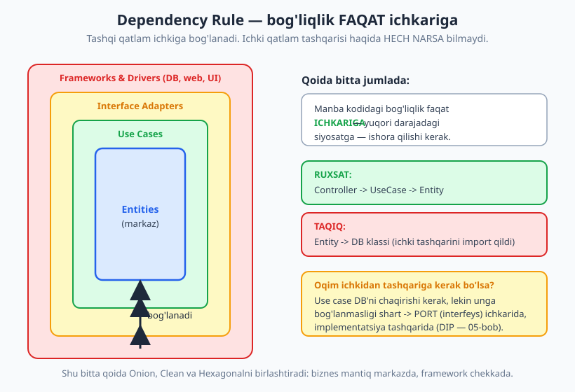
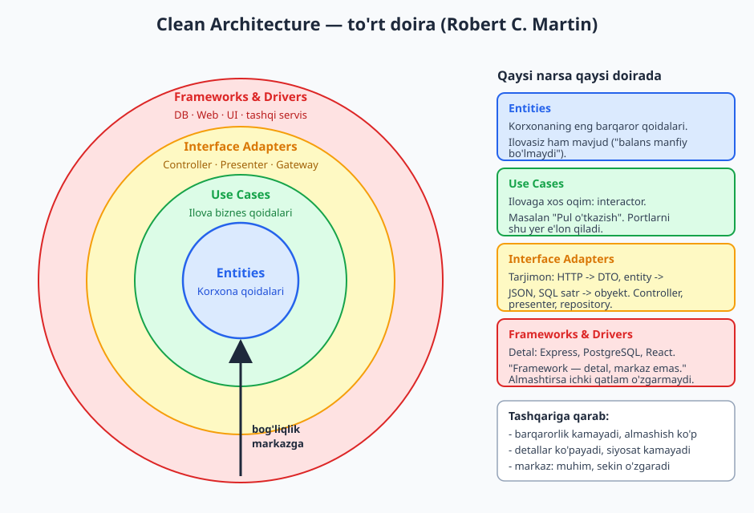
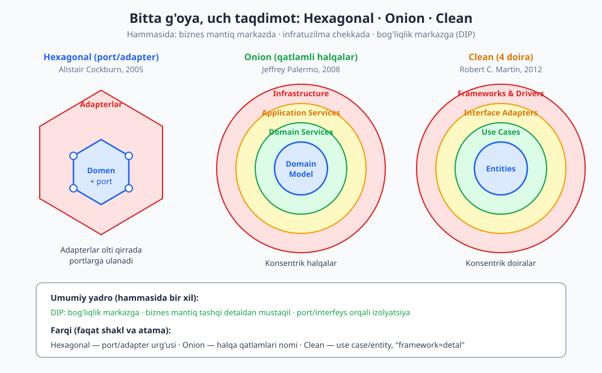

# 13 — Onion va Clean Architecture

[⬅️ Oldingi: 12 — Hexagonal: portlar va adapterlar](./12-hexagonal-portlar-adapterlar.md) · [🏠 README](./README.md) · [Keyingi: 14 — Domain-Driven Design (DDD) asoslari ➡️](./14-ddd-asoslari.md)

---

> **Bu bobda:** 12-bobdagi hexagonal g'oyaning ikki mashhur "qarindoshi" — **Onion Architecture** (Jeffrey Palermo) va **Clean Architecture** (Robert C. Martin) bilan tanishamiz. Ikkalasining ham yuragida bitta qoida turadi: **Dependency Rule** (bog'liqlik qoidasi) — manba kodidagi bog'liqlik faqat **ichkariga**, biznes mantiq tomon yo'naladi. Clean'ning to'rt konsentrik doirasini (Entities -> Use Cases -> Interface Adapters -> Frameworks & Drivers), Onion qatlamlarini, **use case interactor**, **entity**, **boundary** (input/output port) va chegaradagi **DTO** tushunchalarini ko'ramiz. Yakunda real `PulOtkaz` use case'ini TypeScript'da to'liq qatlamlarga ajratib yozamiz va bog'liqlik haqiqatan ichkariga ekanini ishga tushirib isbotlaymiz.
>
> **Trade-off eslatmasi / Halollik:** Onion, Clean va Hexagonal — bir xil g'oyaning (DIP + biznes mantiqni izolyatsiya qilish) **uch xil taqdimoti**, raqobatchi "texnologiya" emas. Hech biri "har doim to'g'ri" emas: bu tuzilma **boilerplate** (qo'shimcha sarflama kod) keltiradi va oddiy CRUD ilova uchun **ortiqcha** bo'lishi mumkin. Bu bobdagi `PulOtkaz` TypeScript misoli `$env:TEMP/arx-probe` da `tsx` bilan **haqiqatan ishga tushirilgan** va `tsc --strict` bilan tip-tekshirilgan — bob oxirida natija keltirilgan. Doiralar/qatlamlar diagrammalari esa **konseptual** (ishlaydigan kod sifatida emas).

---

## Nega yana bitta arxitektura?

12-bobda hexagonal arxitekturani (portlar va adapterlar) ko'rdik: biznes mantiqni markazga qo'yib, atrofini **portlar** (interfeyslar) bilan o'rab, tashqi dunyoni (DB, web, UI) **adapter** sifatida ulagandik. Asosiy yutuq — biznes mantiq infratuzilmadan **mustaqil** bo'ldi.

Onion va Clean — aynan shu g'oyaning davomi. Tabiiy savol: agar g'oya bir xil bo'lsa, **nega uchta nom?** Javob — tarix va urg'u farqida:

| Nomi | Muallif (taxminiy yil) | Asosiy urg'u |
|---|---|---|
| **Hexagonal** (Ports & Adapters) | Alistair Cockburn (2005) | **Port** va **adapter** — har tomondan ulanish nuqtasi |
| **Onion** | Jeffrey Palermo (2008) | Konsentrik **qatlamlar** (halqalar) va ularning nomlanishi |
| **Clean** | Robert C. Martin / Uncle Bob (2012) | **Use case** va **entity** ajratimi, "framework — detal" |

> **Eslatma:** Robert Martin o'zining "Clean Architecture" kitobida ochiq aytadi: Clean — Hexagonal, Onion va bir nechta o'xshash uslublarni **bitta umumlashtirilgan g'oyaga** birlashtirish urinishi. Shuning uchun ularni "qaysi biri yaxshi?" deb solishtirish — noto'g'ri savol. To'g'ri savol: **bu loyihaga shu darajadagi izolyatsiya keraqmi?**

Bu uchchalasini birlashtiradigan yagona qoida — **Dependency Rule**. Avval shuni mustahkamlaymiz, chunki qolgan hamma narsa undan kelib chiqadi.

---

## Dependency Rule — asosiy qoida

Clean Architecture'ning butun mohiyati bitta jumlaga sig'adi:

> **Manba kodidagi bog'liqlik faqat ICHKARIGA yo'naladi.** Tashqi (chekka) qatlam ichki qatlamga bog'lanishi mumkin; ichki qatlam tashqi qatlam haqida **hech narsa bilmasligi** kerak.

"Bog'liqlik" deganda bu yerda **manba kodi darajasidagi** bog'liqlikni — kim kimni `import` qiladi, kim kimning nomini biladi — nazarda tutamiz. Bu juda muhim nuans:

- **Ichki qatlam** (Entity, Use Case) tashqi qatlamning (DB klassi, HTTP framework) **nomini ham bilmaydi** — hech qachon import qilmaydi.
- **Tashqi qatlam** ichki qatlamni emin-erkin chaqiradi.



### Intuitsiya: nima nimaga "bo'ysunadi"

O'xshatish: biznes qoidalari — bu davlat **konstitutsiyasi**; frameworklar — yillik **byudjet farmoyishlari**. Farmoyish konstitutsiyaga bo'ysunishi shart, aksincha emas. Konstitutsiya o'zgarmaydi deb aytmayapmiz — lekin u **kamdan-kam** va **ehtiyotkorlik** bilan o'zgaradi, farmoyishlar esa har yili almashadi. Agar konstitutsiya bitta farmoyishga bog'lab qo'yilsa, butun davlat shu farmoyishning garoviga aylanadi.

Xuddi shunday: agar `Hisob` entity'ngiz PostgreSQL kutubxonasini import qilsa, sizning eng muhim biznes qoidangiz endi bitta DB drayveriga **bog'lanib** qoldi. Mongo'ga o'tmoqchi bo'lsangiz — biznes qoidasiga tegasiz. Bu — teskari oqim, Dependency Rule buzilishi.

> **Diqqat — eng keng tarqalgan tushunmovchilik.** "Dependency Rule biznes mantiq DB'ni hech qachon chaqirmaydi degani" — **noto'g'ri**. Use case ko'pincha ma'lumotni saqlashi (ya'ni DB'ga ta'sir qilishi) **kerak**. Qoida *control flow* (boshqaruv oqimi) haqida emas, **manba bog'liqligi** haqida. Use case DB'ni chaqiradi, lekin uning **konkret klassiga emas, o'zi e'lon qilgan portga (interfeysga)** bog'lanadi. Implementatsiya tashqarida turadi. Buni keyingi bo'limda — DIP yordamida — hal qilamiz.

### Oqim chegarani qanday kesib o'tadi (DIP)

Ko'pincha boshqaruv oqimi (control flow) ichkidan tashqariga ketishi kerak: use case ma'lumotni **saqlashi** lozim, ya'ni DB'ga (tashqi qatlam) chaqiruv qilishi kerak. Lekin manba bog'liqligi ichkariga bo'lishi shart. Bu ziddiyatni **Dependency Inversion Principle** (DIP, 05-bob) hal qiladi:

```text
Pseudokod / konseptual:

  USE CASE qatlami:
      interface HisobRepository {          <- PORT shu yerda E'LON qilinadi
          saqla(h: Hisob): void
      }
      class PulOtkaz {
          constructor(repo: HisobRepository) { ... }   // portga bog'lanadi
      }

  ADAPTER qatlami (TASHQARIDA):
      class PostgresHisobRepository implements HisobRepository { ... }

  Boshqaruv oqimi:  PulOtkaz ---> HisobRepository.saqla()   (tashqariga)
  Manba bog'liqligi: PostgresHisobRepository ---> HisobRepository   (ichkariga!)
```

E'tibor bering: **port (interfeys) ichki qatlamga tegishli**, uning implementatsiyasi esa tashqarida. Shunday qilib, oqim tashqariga ketsa ham, **manba bog'liqligi ichkariga** qoladi — adapter ichkidagi interfeysni `implements` qiladi. Bu DIP'ning aniq qo'llanilishi: ikkala tomon ham abstraksiyaga (portga) bog'lanadi, va past daraja (DB) ichki abstraksiyaga "bo'ysunadi".

---

## Clean Architecture — to'rt doira

Clean Architecture'ni Robert Martin to'rtta **konsentrik doira** sifatida chizadi. Ichkaridan tashqariga:



### 1) Entities — korxona biznes qoidalari (eng ichki)

**Entity** — korxonaning eng umumiy va eng barqaror biznes qoidalarini o'zida saqlovchi obyekt. "Korxona" so'ziga e'tibor bering: bu qoidalar **ilovasiz ham mavjud**. Masalan, "bank hisobining balansi manfiy bo'la olmaydi" — bu qoida sizning veb-ilovangiz bo'lmasa ham, hatto bank qog'ozda yuritilsa ham haqiqat.

Entity hech narsani import qilmaydi: na DB, na framework, na use case. U eng kam o'zgaradi va eng ko'p qayta ishlatiladi.

> **Eslatma:** Clean'dagi "Entity" — DDD'dagi (14-bob) Entity'dan kengroq tushuncha. Bu yerda u shunchaki "korxona qoidalari joylashgan obyekt" degani; oddiy POJO ham, boy domen obyekti ham bo'lishi mumkin.

### 2) Use Cases — ilova biznes qoidalari

**Use case** (foydalanish stsenariysi) — sizning ilovangizga **xos** biznes qoidasini ifodalaydi. "Pul o'tkazish", "buyurtma berish", "ro'yxatdan o'tish" — bular use case'lar. Entity'lardan farqi: ular **ilovaga bog'liq**. Bank qog'ozda yuritilganda "balans manfiy bo'lmaydi" qoidasi bor (entity), lekin "mobil ilova orqali ikki bosqichli tasdiq bilan o'tkazma" — bu konkret ilovaning use case'i.

Use case'ni amalga oshiruvchi obyekt **interactor** deb ataladi. U:

- Entity'larni boshqaradi (ularning metodlarini chaqiradi),
- O'zi e'lon qilgan **portlar** (boundary) orqali tashqi dunyo bilan gaplashadi,
- Konkret DB yoki framework haqida **hech narsa bilmaydi**.

### 3) Interface Adapters — tarjimon qatlami

Bu qatlam **tarjimon**: ma'lumotni use case/entity uchun qulay shakldan tashqi dunyo (DB, web) uchun qulay shaklga va aksincha aylantiradi. Bu yerda yashaydiganlar:

- **Controller** — kiruvchi HTTP so'rovini use case kirish DTO'siga aylantiradi,
- **Presenter** — use case natijasini ekran/JSON uchun formatlaydi,
- **Gateway / Repository** — use case portining implementatsiyasi; SQL satrlarini entity'ga (va aksincha) o'giradi.

### 4) Frameworks & Drivers — detallar (eng tashqi)

Eng tashqi doira — **detallar**: Express yoki Fastify, PostgreSQL yoki MongoDB, React yoki Vue. Bu yerda kam kod yozasiz, asosan ulanish (glue). Martinning mashhur shiori:

> **"Framework — bu detal."** Framework — markaz emas, **vosita**. Siz Express'ni "ishlatasiz", lekin ilovangiz Express'ga **aylanmasligi** kerak.

> **Amaliyotda:** bu "framework markaz emas" qoidasini amalda tekshirishning oddiy usuli bor: *ilovangizning yadrosini (Entity + Use Case) yangi loyihaga ko'chirib, butunlay boshqa framework ostida ishga tushira olasizmi — biznes kodga tegmasdan?* Agar javob "ha" bo'lsa, Dependency Rule'ga rioya qilgansiz. Agar `import express` so'zi use case faylida turgan bo'lsa — yo'q.

---

## Onion Architecture — qatlamli halqalar

Onion (piyoz) arxitekturasini Jeffrey Palermo 2008-yilda taklif qilgan. Nomi shakldan kelib chiqqan: konsentrik **halqalar**, piyoz kabi. Ichkaridan tashqariga odatdagi qatlamlar:

1. **Domain Model** (markaz) — entity'lar, value object'lar (14-bobda batafsil).
2. **Domain Services** — bir nechta entity'ni qamrab oladigan domen mantig'i.
3. **Application Services** — use case'lar, ilova oqimlarini muvofiqlashtiradi.
4. **Infrastructure** (chekka) — DB, fayl tizimi, tashqi API, UI.

Onion'ning markaziy g'oyasi Clean bilan **bir xil**: tashqi qatlam ichkiga bog'lanadi, hech qachon aksincha emas. Palermo buni shunday ta'kidlagan: barcha bog'liqlik **markazga** yo'naladi, va interfeyslar (portlar) ichki qatlamlarda e'lon qilinib, tashqarida amalga oshiriladi.

> **Eslatma — Onion vs an'anaviy qatlamli (11-bob).** 11-bobdagi klassik **layered** (n-tier) arxitekturada oqim yuqoridan pastga: Presentation -> Business -> **Data Access** -> DB. Ya'ni biznes qatlami ma'lumot qatlamiga **bog'lanadi**. Onion buni **teskari aylantiradi**: ma'lumot kirishi endi eng tashqi halqada, va u markazdagi interfeysni amalga oshiradi. Shu sababli Onion'ni ko'pincha "an'anaviy qatlamli arxitekturaning DIP bilan tuzatilgan versiyasi" deb atashadi.

---

## Hexagonal vs Onion vs Clean — bir g'oya, uch shakl

Endi uchchalasini yonma-yon qo'yamiz. Asosiy xabar: **yadro bir xil** (DIP + izolyatsiya), faqat taqdimot va atamalar farq qiladi.



| Jihat | Hexagonal | Onion | Clean |
|---|---|---|---|
| Shakl | Olti burchak + portlar | Konsentrik halqalar | 4 konsentrik doira |
| Markaz | Domen + portlar | Domain Model | Entities |
| Use case nomi | (aniq ajratilmagan) | Application Services | Use Cases (alohida doira) |
| Tashqi chekka | Adapterlar | Infrastructure | Frameworks & Drivers |
| Asosiy qoida | Port/adapter izolyatsiyasi | Bog'liqlik markazga | Dependency Rule |
| Mashhur urg'u | Ulanish nuqtalari | Qatlam nomlanishi | "Framework — detal" |

> **Trade-off:** uchchalasidan birini "tanlash" — texnologiya tanlovi emas, **so'zlashuv tanlovi**. Jamoangiz "port/adapter" tilida gaplashsa Hexagonal, "use case/entity doiralari" tilida gaplashsa Clean qulay. Muhimi — yagona qoidaga (bog'liqlik ichkariga) izchil rioya qilish, qaysi diagrammani chizishingiz emas. Bir loyihada uchchala atamani aralashtirib ishlatish ham normal.

---

## Boundary, input/output port va DTO

Use case tashqi dunyo bilan **boundary** (chegara) orqali gaplashadi. Boundary — bu shunchaki interfeys, lekin uning yo'nalishiga qarab ikki turga bo'linadi:

- **Input port** (kirish chegarasi) — tashqi dunyo use case'ni shu interfeys orqali **chaqiradi**. Controller input port'ni chaqiradi.
- **Output port** (chiqish chegarasi, "driven") — use case tashqi dunyoga shu interfeys orqali **murojaat qiladi** (masalan saqlash, email). Repository va presenter — output port implementatsiyasi.

Chegarani ma'lumot **DTO** (Data Transfer Object — ma'lumot tashish obyekti) shaklida kesib o'tadi. DTO — bu metodsiz, oddiy ma'lumot to'plami.

> **Diqqat — entity'ni chegaradan tashqariga "oqizmang".** Keng tarqalgan xato: use case natijasi sifatida boy `Hisob` entity'sini to'g'ridan-to'g'ri controller'ga (va undan JSON'ga) qaytarish. Bu ichki tuzilmani tashqi API'ga "yopishtirib" qo'yadi: entity'ni o'zgartirsangiz API shartnomasi buziladi, va tashqi dunyo entity'ning xususiy maydonlarini ko'rib qoladi. To'g'ri yondashuv — chegarada **DTO** ishlatish: use case soddagina `{ manbaBalans, qabulBalans }` qaytaradi, entity ichkarida qoladi.

```text
Konseptual oqim (input -> use case -> output):

  HTTP so'rov
     |  controller (adapter) tarjima qiladi
     v
  PulOtkazSorovi (DTO)  ---> [Input port] PulOtkaz.bajar()
                                  |  entity'larni boshqaradi
                                  |  [Output port] repo.saqla()  --> Repository (adapter)
                                  v
                            PulOtkazNatija (DTO)
     ^
     |  presenter (adapter) formatlaydi
  HTTP javob (JSON)
```

---

## KOD: `PulOtkaz` use case'ini qatlamlarga ajratamiz (TypeScript)

Endi nazariyani kodga aylantiramiz. Bank o'tkazmasi misolida to'rtta qatlamni alohida ko'rsatamiz va **bog'liqlik haqiqatan ichkariga** ekanini isbotlaymiz. Bu kod `tsx` bilan ishga tushirilgan va `tsc --strict` bilan tekshirilgan.

### 1-qatlam — Entity (`Hisob`): korxona qoidasi

`Hisob` hech narsani import qilmaydi. Uning yagona vazifasi — biznes qoidasini himoya qilish: **balans hech qachon manfiy bo'lmaydi.**

```ts
/** Domen xatosi — biznes qoidasi buzilganda. */
class DomenXatosi extends Error {}

class Hisob {
  private _balans: number;
  constructor(
    public readonly id: string,
    boshlangichBalans: number,
  ) {
    if (boshlangichBalans < 0) {
      throw new DomenXatosi("Boshlang'ich balans manfiy bo'la olmaydi");
    }
    this._balans = boshlangichBalans;
  }

  get balans(): number {
    return this._balans;
  }

  /** Korxona qoidasi: balans hech qachon manfiy bo'lmaydi. */
  yech(summa: number): void {
    if (summa <= 0) throw new DomenXatosi("Summa musbat bo'lishi kerak");
    if (summa > this._balans) throw new DomenXatosi("Mablag' yetarli emas");
    this._balans -= summa;
  }

  qoy(summa: number): void {
    if (summa <= 0) throw new DomenXatosi("Summa musbat bo'lishi kerak");
    this._balans += summa;
  }
}
```

E'tibor bering: `Hisob` qoidani **o'zi** himoya qiladi. Hech kim tashqaridan `_balans`ni manfiy qila olmaydi — bu kapsulalash. Qoida shu yerda, markazda.

### 2-qatlam — Use Case (`PulOtkaz`) + portlar

Portlar (interfeyslar) **shu qatlamda e'lon qilinadi**. `PulOtkaz` konkret DB'ga emas, `HisobRepository` **portiga** bog'lanadi — bu DIP'ning amaliy qo'llanilishi.

```ts
/** OUTPUT PORT (driven): saqlash abstraksiyasi. Use case BUNGA bog'lanadi. */
interface HisobRepository {
  topId(id: string): Hisob | undefined;
  saqla(h: Hisob): void;
}

/** INPUT DTO (boundary): chegarada oddiy ma'lumot. */
interface PulOtkazSorovi {
  manbaId: string;
  qabulId: string;
  summa: number;
}
/** OUTPUT DTO (boundary): natija — entity emas, oddiy ma'lumot chiqadi. */
interface PulOtkazNatija {
  manbaBalans: number;
  qabulBalans: number;
}

/** USE CASE INTERACTOR: ilovaga xos qoida — o'tkazma stsenariysi. */
class PulOtkaz {
  // DIP: konkret DB'ga emas, REPOSITORY PORTIGA bog'lanamiz.
  constructor(private readonly repo: HisobRepository) {}

  bajar(sorov: PulOtkazSorovi): PulOtkazNatija {
    const manba = this.repo.topId(sorov.manbaId);
    const qabul = this.repo.topId(sorov.qabulId);
    if (!manba || !qabul) throw new DomenXatosi("Hisob topilmadi");

    // Entity biznes qoidalarini bajaradi (manfiy balansni o'zi rad etadi).
    manba.yech(sorov.summa);
    qabul.qoy(sorov.summa);

    this.repo.saqla(manba);
    this.repo.saqla(qabul);

    return { manbaBalans: manba.balans, qabulBalans: qabul.balans };
  }
}
```

Diqqat qiling: `PulOtkaz` faylida `import postgres` yoki `import express` **yo'q**. U faqat `Hisob` (ichki) va o'zi e'lon qilgan portga bog'langan. Bu — Dependency Rule'ga to'liq rioya.

### 3-qatlam — Adapter: port implementatsiyasi

Repository **tashqarida** yashaydi va ichkidagi portni `implements` qiladi. O'q ichkariga: `InMemoryHisobRepository` -> `HisobRepository`.

```ts
class InMemoryHisobRepository implements HisobRepository {
  private jadval = new Map<string, Hisob>();
  topId(id: string): Hisob | undefined {
    return this.jadval.get(id);
  }
  saqla(h: Hisob): void {
    this.jadval.set(h.id, h);
  }
}
```

Ertaga `PostgresHisobRepository` yozsak, **ichki qatlamlar bir harf ham o'zgarmaydi** — `Hisob` ham, `PulOtkaz` ham daxlsiz. Framework — detal.

### 4-qatlam — Driver: controller (ulanish)

Eng tashqi qatlam — faqat **ulanish** (wiring). Tashqi so'rovni DTO'ga aylantirib use case'ni chaqiradi, xatoni HTTP statusga o'giradi.

```ts
class OtkazmaController {
  constructor(private readonly useCase: PulOtkaz) {}
  post(body: PulOtkazSorovi): { status: number; javob: unknown } {
    try {
      const natija = this.useCase.bajar(body);
      return { status: 200, javob: natija };
    } catch (e) {
      if (e instanceof DomenXatosi) return { status: 400, javob: { xato: e.message } };
      throw e;
    }
  }
}
```

### Ulash (composition root) va ishga tushirish

Hamma narsani **eng tashqarida** — kompozitsiya ildizida — bir-biriga ulaymiz. Bu yagona joy hamma qatlamni "ko'radi":

```ts
const repo = new InMemoryHisobRepository();
repo.saqla(new Hisob("A", 100));
repo.saqla(new Hisob("B", 0));

const controller = new OtkazmaController(new PulOtkaz(repo));

console.log(JSON.stringify(controller.post({ manbaId: "A", qabulId: "B", summa: 30 })));
console.log(JSON.stringify(controller.post({ manbaId: "A", qabulId: "B", summa: 200 })));
console.log(JSON.stringify(controller.post({ manbaId: "A", qabulId: "YO_Q", summa: 10 })));
```

Bog'liqlikni ichkariga "burish" (DI) shu yerda sodir bo'ladi: `repo` ni `PulOtkaz`ga, `PulOtkaz`ni `OtkazmaController`ga **tashqaridan beramiz**. Ichki qatlamlar o'z bog'liqligini o'zi yaratmaydi — bu ularni framework'dan toza saqlaydi.

> **Amaliyotda — DB'ni almashtirish isboti.** Quyidagi `LoglovchiRepository` — yana bitta `HisobRepository` implementatsiyasi (decorator, 08-bob). Uni `PulOtkaz`ga uzatamiz va use case **umuman o'zgarmaydi** — bu Dependency Rule'ning amaliy natijasi: tashqi detalni almashtirsak, markaz daxlsiz qoladi.

```ts
class LoglovchiRepository implements HisobRepository {
  constructor(private ichki: HisobRepository) {}
  topId(id: string): Hisob | undefined {
    return this.ichki.topId(id);
  }
  saqla(h: Hisob): void {
    console.log(`   [log] saqlandi: ${h.id} balans=${h.balans}`);
    this.ichki.saqla(h);
  }
}
```

---

## Qaysi qatlamga nima qo'yiladi — qaror jadvali

Eng ko'p berilgan amaliy savol: "shu logikani qaysi qatlamga qo'yaman?" Quyidagi mezon yordam beradi:

| Logika turi | Qatlam | Sinov savoli |
|---|---|---|
| "Balans manfiy bo'lmaydi" | **Entity** | Ilovasiz, qog'ozda ham haqiqatmi? Ha -> entity |
| "O'tkazma ikki bosqichda tasdiqlanadi" | **Use Case** | Bu konkret ilovaning oqimimi? Ha -> use case |
| HTTP so'rovni DTO'ga aylantirish | **Interface Adapter** | Bu tarjima/formatlashmi? Ha -> adapter |
| SQL so'rov, ulanish stringi | **Frameworks & Drivers** | Bu konkret texnologiya detalimi? Ha -> chekka |

> **Anti-pattern — "anemik" use case + semiz controller.** Agar barcha biznes qoidasi controller ichida `if`larda yotsa, va use case shunchaki repository'ni chaqirsa — siz qatlamlarni **chizgansiz, lekin ishlatmagansiz**. Bu eng keng tarqalgan soxta-Clean. Tekshirish: biznes qoidasini test qilish uchun HTTP framework'ni ko'tarishga majbur bo'lsangiz — qoida noto'g'ri qatlamda.

---

## Qachon kerak, qachon ortiqcha (trade-off)

Bu eng muhim bo'lim. Clean/Onion — **bepul emas**.

**Narxi:**

- **Boilerplate:** har use case uchun interactor, har port uchun interfeys + implementatsiya, DTO'lar. Oddiy "jadvalga qator qo'sh" amali uchun 4-5 fayl.
- **Kognitiv yuk:** yangi dasturchi oqimni tushunish uchun bir nechta qatlamdan o'tishi kerak.
- **Indirection (bilvositalik):** "bu metod aslida qayerda bajariladi?" degan savol ko'payadi.

**Foydasi:**

- **Testlanuvchanlik:** biznes mantiqni DB/web'siz, sof birlik testi bilan sinash.
- **Moslashuvchanlik:** framework/DB'ni almashtirish markaziy kodga tegmaydi.
- **Uzoq umr:** biznes qoidalari texnologiyadan uzoqroq yashaydi; ularni izolyatsiya qilish — kelajakka sarmoya.

> **Trade-off:** sodda **CRUD** (yarat-o'qi-yangila-o'chir) ilova, qisqa muddatli skript yoki MVP uchun Clean **ortiqcha** bo'lishi mumkin — qatlamlar hech qanday biznes qoidasini himoya qilmaydi, faqat boilerplate qo'shadi. Aksincha: murakkab biznes qoidalari, uzoq umr, bir nechta interfeys (web + mobil + cron) yoki tez o'zgaradigan infratuzilma bo'lsa — izolyatsiya o'zini oqlaydi. Qoida: **murakkablikni murakkablik bilan to'g'rilang, soddani sodda qoldiring.** 02-bobdagi sifat atributlari tahlili shu qarorga asos.

> **Amaliyotda:** real loyihalarda ko'pincha **"pragmatik Clean"** ishlatiladi — eng muhim domen (masalan to'lov, buyurtma) qatlamlarga to'liq ajratiladi, oddiy CRUD modullari esa (masalan "shahar ro'yxati") to'g'ridan-to'g'ri controller -> ORM ko'rinishida qoladi. Hamma narsani bir xil qattiqlikda qatlamlash — o'zi anti-pattern. Modulli monolit (16-bob) bunda yaxshi yondashuv: har modul o'z murakkabligiga mos darajada qatlamlanadi.

---

## Bog'liq boblar

- **05 — SOLID:** DIP shu bobdagi Dependency Rule'ning poydevori. Portlar = abstraksiyaga bog'lanish.
- **08 — Structural patterns:** repository decorator (`LoglovchiRepository`), adapter — shu yerda ishlatildi.
- **12 — Hexagonal:** port/adapter g'oyasi; bu bob uni Onion/Clean shaklida umumlashtiradi.
- **14 — DDD asoslari:** Entity, Value Object, Aggregate, Repository — Clean'ning ichki doirasini chuqurlashtiradi.
- **16 — Monolit/mikroservis:** har modulni o'z murakkabligiga mos darajada qatlamlash (modulli monolit).
- Boshqa kitob: [PHP Expert](../php-expert/README.md) — Clean arxitekturaning PHP'dagi amaliy qo'llanilishi; [Node.js](../nodejs/README.md) — backend'da qatlamlash; [SQL](../sql/README.md) — repository ortidagi ma'lumot qatlami.

---

## Mashqlar

### Oson

**1-mashq.** Quyidagi import Dependency Rule'ni buzadimi? `Hisob` entity faylida: `import { PostgresClient } from "../infra/postgres"`. Nega?

**2-mashq.** Clean'ning to'rt doirasini ichkaridan tashqariga to'g'ri tartibda nomlang va har biriga bittadan misol bering.

**3-mashq.** Quyidagi logikalarni qaysi qatlamga qo'yasiz: (a) "parol kamida 8 belgi"; (b) "ro'yxatdan o'tgach tasdiqlash emaili yuboriladi"; (c) bcrypt bilan parolni hashlash kutubxonasi chaqiruvi?

**4-mashq.** "Framework — detal" iborasini o'z so'zlaringiz bilan tushuntiring va bitta misol keltiring.

### O'rta

**5-mashq.** `PulOtkaz` use case'i natija sifatida `Hisob` entity'sini to'g'ridan-to'g'ri qaytarsa, qaysi printsip buziladi va nima yomon oqibati bo'ladi? Qanday tuzatasiz?

**6-mashq.** Hexagonal, Onion va Clean orasidagi **umumiy yadroni** bitta jumlada, va har birining **o'ziga xos urg'usini** bittadan ayting.

**7-mashq.** Input port va output port farqini tushuntiring. Controller va repository — qaysi turdagi port bilan ishlaydi?

**8-mashq.** Trade-off: kichik 3 jadvalli admin-panel uchun to'liq Clean qatlamlash kerakmi? Nimani nimaga almashtirasiz? Qaroringizni asoslang.

**9-mashq.** An'anaviy qatlamli arxitektura (11-bob) bilan Onion orasidagi asosiy farq nimada — bog'liqlik yo'nalishi bo'yicha tushuntiring.

### Qiyin

**10-mashq (KOD).** `PulOtkaz` use case'iga **yangi output port** qo'shing: `Bildirgich` (interfeys `xabar(hisobId: string, matn: string): void`). O'tkazma muvaffaqiyatli bo'lganda har ikkala hisob egasiga bildirishnoma yuborilsin. Portni use case qatlamida e'lon qiling, in-memory (massivga yozadigan) implementatsiyasini adapter sifatida yozing, composition root'da ulang. TS'da yozib ishga tushiring. Dependency Rule buzilmaganini tekshiring.

**11-mashq (KOD).** `HisobRepository`ning ikkinchi implementatsiyasini yozing: `XatoliRepository` — `saqla` chaqirilganda doim `Error("DB ulanmadi")` tashlaydi. `OtkazmaController` shu xatoni 500 statusga aylantirsin (DomenXatosi 400, qolgani 500). `PulOtkaz`ga **tegmasdan** buni amalga oshiring. Ishga tushirib tekshiring.

**12-mashq.** Quyidagi `BuyurtmaService` Clean'ga mos emas. Qaysi qatlam buzilgan va nega? Qanday qayta tuzasiz (qatlamlarga ajrating, pseudokod yoki TS bilan)?
```ts
class BuyurtmaService {
  async yarat(req: HttpRequest) {
    const sql = `INSERT INTO buyurtma ...`;        // ?
    if (req.body.summa <= 0) throw new Error("...");// ?
    await postgres.query(sql);                      // ?
    return `<html>Buyurtma yaratildi</html>`;        // ?
  }
}
```

**13-mashq.** Stsenariy: jamoangiz "biz Clean Architecture ishlatamiz" deydi, lekin barcha biznes qoidasi controller'larda, use case'lar shunchaki repository'ni chaqiradi. Bu qanday anti-pattern, qanday aniqlaysiz, va bitta amaliy test bilan isbotlang?

---

<details markdown="1">
<summary>Yechimlar</summary>

### 1-mashq yechimi

**Ha, buzadi.** `Hisob` — eng ichki qatlam (Entity). U eng tashqi qatlamdagi (Frameworks & Drivers) `PostgresClient`ni import qilmoqda — bu **tashqariga** yo'nalgan bog'liqlik, Dependency Rule'ning to'g'ridan-to'g'ri buzilishi. Oqibat: biznes qoidangiz endi PostgreSQL'ga bog'lanib qoldi; DB'ni almashtirsangiz yoki entity'ni sof birlik testida sinamoqchi bo'lsangiz, PostgreSQL kutubxonasini ham ko'tarishingiz kerak. Entity hech qanday tashqi texnologiyani bilmasligi shart.

### 2-mashq yechimi

Ichkaridan tashqariga:
1. **Entities** — `Hisob` (balans manfiy bo'lmaydi qoidasi).
2. **Use Cases** — `PulOtkaz` interactor (o'tkazma oqimi).
3. **Interface Adapters** — `OtkazmaController` (HTTP -> DTO), `InMemoryHisobRepository` (port impl).
4. **Frameworks & Drivers** — Express, PostgreSQL drayveri, ulanish stringi.

### 3-mashq yechimi

- **(a) "parol kamida 8 belgi"** — bu odatda **Entity/domen** qoidasi (`Foydalanuvchi` yoki `Parol` value object ichida): xavfsizlik qoidasi ilovadan mustaqil. (Ba'zan use case'da ham bo'lishi mumkin, lekin domen sof yechim.)
- **(b) "tasdiqlash emaili yuboriladi"** — **Use Case** oqimi (ilovaga xos stsenariy). Emailni *yuborish*ning o'zi output port (`EmailYuboruvchi`) orqali, implementatsiya esa adapter qatlamida.
- **(c) bcrypt chaqiruvi** — **Frameworks & Drivers** (konkret kutubxona detali); use case unga port orqali murojaat qiladi (`ParolHashlovchi`), to'g'ridan-to'g'ri import qilmaydi.

### 4-mashq yechimi

"Framework — detal" — frameworkni (Express, Django, React) ilovangizning **markazi** emas, **almashtiriladigan vosita** sifatida ko'rish. Biznes qoidalari frameworkdan mustaqil bo'lishi kerak, shunda frameworkni almashtirganda yadro o'zgarmaydi. Misol: agar Express'dan Fastify'ga o'tsangiz, faqat eng tashqi adapter/driver qatlami o'zgaradi — `Hisob` va `PulOtkaz` daxlsiz qoladi. Aksincha bo'lsa (biznes kod Express'ga to'lib ketgan), framework markazga aylangan va uni almashtirish butun ilovani qayta yozishni talab qiladi.

### 5-mashq yechimi

**Boundary/DTO printsipi buziladi** (entity chegaradan tashqariga "oqib chiqdi"). Yomon oqibatlari: (1) tashqi API ichki entity tuzilmasiga **bog'lanadi** — entity'ni o'zgartirsangiz API shartnomasi buziladi; (2) entity'ning xususiy metodlari/holati tashqi dunyoga ko'rinadi; (3) presenter formatlashni nazorat qila olmaydi. **Tuzatish:** chegarada **DTO** ishlating — use case `{ manbaBalans, qabulBalans }` kabi oddiy ma'lumot qaytaradi, `Hisob` entity'si ichkarida qoladi (aynan bobdagi `PulOtkazNatija` qilgani).

### 6-mashq yechimi

**Umumiy yadro:** uchchalasida ham biznes mantiq markazda, infratuzilma chekkada, va manba bog'liqligi faqat markazga (ichkariga) yo'naladi — DIP orqali izolyatsiya (Dependency Rule). **Urg'ular:** Hexagonal — port va adapter (ulanish nuqtalari); Onion — konsentrik qatlamlar va ularning nomlanishi; Clean — use case/entity ajratimi va "framework — detal".

### 7-mashq yechimi

- **Input port** — tashqi dunyo use case'ni shu interfeys orqali **chaqiradi** (use case "qabul qiluvchi" tomon). **Controller** input port'ni chaqiradi.
- **Output port** (driven) — use case tashqi dunyoga shu interfeys orqali **murojaat qiladi** (use case "tashabbuskor" tomon). **Repository** output port implementatsiyasi.

Yo'nalish farqi: input port'da oqim ichkariga kiradi, output port'da ichkaridan tashqariga chiqadi — lekin manba bog'liqligi ikkalasida ham ichkariga (port ichki qatlamda e'lon qilinadi).

### 8-mashq yechimi

Odatda **kerak emas**. Kichik 3 jadvalli admin-panelda murakkab biznes qoidasi yo'q — qatlamlar hech narsani himoya qilmay, faqat boilerplate qo'shadi. **Almashinuv:** to'liq Clean'da *boshlang'ich tezlik va soddalikni* — *kelajakdagi nazariy moslashuvchanlikka* almashtirasiz; bu holatda moslashuvchanlik deyarli kerak bo'lmaydi, demak yomon savdo. To'g'ri yondashuv: to'g'ridan-to'g'ri controller -> ORM (yoki yengil servis qatlami). Agar keyinchalik murakkab qoidalar paydo bo'lsa, o'sha modulnigina qatlamlaysiz (evolyutsion arxitektura, 25-bob).

### 9-mashq yechimi

An'anaviy qatlamli (n-tier): bog'liqlik **yuqoridan pastga** — Business qatlami Data Access qatlamiga bog'lanadi, u esa DB'ga. Ya'ni biznes mantiq ma'lumot kirishiga bog'liq. Onion buni **teskari aylantiradi**: ma'lumot kirishi (Infrastructure) eng tashqi halqaga ko'chiriladi va u markazdagi interfeysni **amalga oshiradi** (implements). Natijada bog'liqlik **markazga** yo'naladi va domen ma'lumot qatlamidan mustaqil bo'ladi. Qisqasi: farq — DIP'ning bor-yo'qligi.

### 10-mashq yechimi

```ts
class DomenXatosi extends Error {}

class Hisob {
  private _balans: number;
  constructor(public readonly id: string, b: number) {
    if (b < 0) throw new DomenXatosi("manfiy");
    this._balans = b;
  }
  get balans() { return this._balans; }
  yech(s: number) { if (s > this._balans) throw new DomenXatosi("yetarli emas"); this._balans -= s; }
  qoy(s: number) { this._balans += s; }
}

// USE CASE qatlami — yangi OUTPUT PORT shu yerda e'lon qilinadi
interface HisobRepository { topId(id: string): Hisob | undefined; saqla(h: Hisob): void; }
interface Bildirgich { xabar(hisobId: string, matn: string): void; }

class PulOtkaz {
  constructor(private repo: HisobRepository, private bildirgich: Bildirgich) {}
  bajar(manbaId: string, qabulId: string, summa: number) {
    const a = this.repo.topId(manbaId), b = this.repo.topId(qabulId);
    if (!a || !b) throw new DomenXatosi("topilmadi");
    a.yech(summa); b.qoy(summa);
    this.repo.saqla(a); this.repo.saqla(b);
    this.bildirgich.xabar(a.id, `${summa} yechildi`);
    this.bildirgich.xabar(b.id, `${summa} tushdi`);
    return { manbaBalans: a.balans, qabulBalans: b.balans };
  }
}

// ADAPTER qatlami — port implementatsiyalari (tashqarida)
class InMemoryRepo implements HisobRepository {
  m = new Map<string, Hisob>();
  topId(id: string) { return this.m.get(id); }
  saqla(h: Hisob) { this.m.set(h.id, h); }
}
class XotiraBildirgich implements Bildirgich {
  yuborilgan: string[] = [];
  xabar(id: string, matn: string) { this.yuborilgan.push(`${id}: ${matn}`); }
}

// composition root — ulash
const repo = new InMemoryRepo();
repo.saqla(new Hisob("A", 100)); repo.saqla(new Hisob("B", 0));
const bild = new XotiraBildirgich();
const uc = new PulOtkaz(repo, bild);
console.log(uc.bajar("A", "B", 40));
console.log(bild.yuborilgan);
// => { manbaBalans: 60, qabulBalans: 40 }
// => [ 'A: 40 yechildi', 'B: 40 tushdi' ]
```

`Bildirgich` porti **use case qatlamida** e'lon qilingani uchun Dependency Rule buzilmaydi: `PulOtkaz` faqat portga bog'langan, konkret `XotiraBildirgich`ni bilmaydi.

### 11-mashq yechimi

```ts
class XatoliRepository implements HisobRepository {
  topId(id: string) { return new Hisob(id, 1000); } // topish ishlaydi
  saqla(_h: Hisob): void { throw new Error("DB ulanmadi"); } // saqlash tushadi
}

class OtkazmaController {
  constructor(private uc: PulOtkaz) {}
  post(b: { manbaId: string; qabulId: string; summa: number }) {
    try {
      return { status: 200, javob: this.uc.bajar(b.manbaId, b.qabulId, b.summa) };
    } catch (e) {
      if (e instanceof DomenXatosi) return { status: 400, javob: { xato: e.message } };
      return { status: 500, javob: { xato: "ichki xato" } }; // qolgani 500
    }
  }
}
// const c = new OtkazmaController(new PulOtkaz(new XatoliRepository(), ...));
// c.post({ manbaId: "A", qabulId: "B", summa: 10 }) => { status: 500, ... }
```

`PulOtkaz`ga **tegmadik** — faqat yangi adapter (`XatoliRepository`) va controllerda xato turini ajratdik. Bu Dependency Rule'ning amaliy foydasi: tashqi xatti-harakatni markazga tegmasdan o'zgartirdik.

### 12-mashq yechimi

`BuyurtmaService` **barcha qatlamni bitta metodga aralashtirgan** — Dependency Rule va SRP buzilgan:

- `INSERT INTO ...` + `postgres.query` -> **Frameworks & Drivers** (DB detali) ishi.
- `if (summa <= 0)` -> **biznes qoidasi** -> Entity/Use Case.
- `req: HttpRequest` ni to'g'ridan-to'g'ri qabul qilish -> **Interface Adapter** (controller) ishi.
- `<html>...` qaytarish -> **Presenter/adapter** ishi.

Qayta tuzish (konseptual):
```text
Buyurtma (entity)         : summa > 0 qoidasi ichida
YaratBuyurtma (use case)  : BuyurtmaRepository portiga bog'lanadi, DTO qabul/qaytaradi
BuyurtmaController(adapter): HttpRequest -> DTO, natija -> HTML/JSON
PostgresBuyurtmaRepo      : SQL shu yerda, portni implements qiladi
```
Endi biznes qoidasini (`summa > 0`) DB yoki HTTP'siz test qilish mumkin.

### 13-mashq yechimi

Bu **anemik use case / semiz controller** anti-pattern'i ("soxta-Clean"): qatlamlar **chizilgan, lekin ishlatilmagan**. Aniqlash: use case fayllarini ochib ko'ring — agar ular faqat `repo.saqla(x)` kabi delegatsiyadan iborat bo'lsa va hech qanday qoida (`if`, hisob-kitob) bo'lmasa, mantiq boshqa joyda. **Amaliy test:** bitta biznes qoidasini (masalan "o'tkazma summasi musbat") **sof birlik testi** bilan, HTTP framework'ni ko'tarmasdan sinashga urinib ko'ring. Agar qoidani sinash uchun controller'ni (demak HTTP qatlamini) ishga tushirishingiz kerak bo'lsa — qoida noto'g'ri qatlamda, va siz Clean'ning asosiy foydasini (testlanuvchanlik) yo'qotgansiz. Tuzatish: biznes qoidalarini entity/use case'ga ko'chiring.

</details>

---

[⬅️ Oldingi: 12 — Hexagonal: portlar va adapterlar](./12-hexagonal-portlar-adapterlar.md) · [🏠 README](./README.md) · [Keyingi: 14 — Domain-Driven Design (DDD) asoslari ➡️](./14-ddd-asoslari.md)
