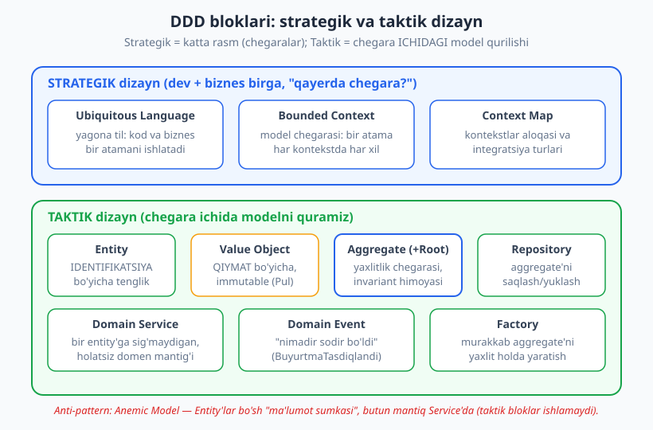
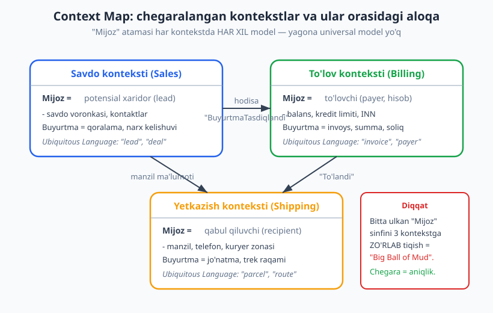
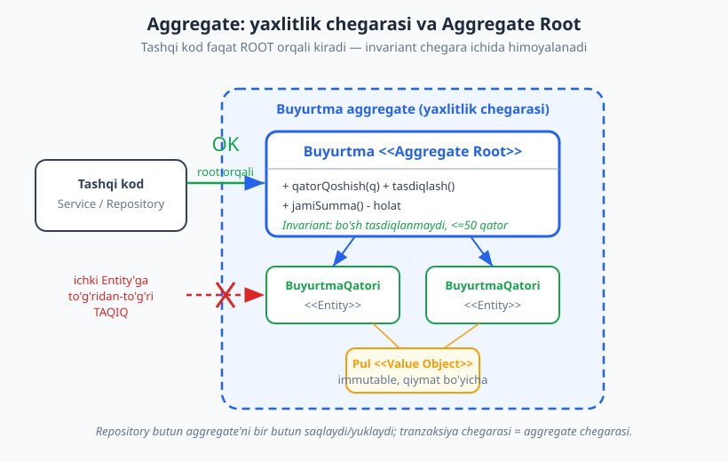

# 14 — Domain-Driven Design (DDD) asoslari

[⬅️ Oldingi: 13 — Onion va Clean Architecture](./13-onion-clean-architecture.md) · [🏠 README](./README.md) · [Keyingi: 15 — Event-driven arxitektura va CQRS ➡️](./15-event-driven-cqrs.md)

---

> **Bu bobda:** Eric Evans 2003-yilda "Domain-Driven Design: Tackling Complexity in the Heart of Software" kitobida taklif qilgan yondashuvni o'rganamiz. DDD — bu freymvork yoki kutubxona EMAS, balki **murakkab biznes domeniga** dasturiy ta'minotni moslashtirishning fikrlash usuli. Asosiy g'oya: kodning yuragiga **biznes mantig'ini** (texnologiyani emas) qo'yish va dasturchilar bilan biznes ekspertlari **bitta til**da gaplashishi. Biz ikki qatlamni ko'ramiz: **strategik dizayn** (Ubiquitous Language — yagona til, Bounded Context — model chegarasi, Context Map — kontekstlar xaritasi) va **taktik dizayn** (Entity, Value Object, Aggregate, Repository, Domain Service, Domain Event, Factory). Asosiy anti-pattern — **Anemic Domain Model** — ni qarama-qarshi qo'yib, "rich" (boy) modelga aylantiramiz. Misol sifatida e-commerce buyurtma domeni: ishlaydigan TypeScript kodda invariant himoyasini ko'rsatamiz.
>
> **Trade-off eslatmasi / Halollik:** DDD **bepul emas** va **har joyga mos kelmaydi**. Oddiy CRUD ilova (forma -> jadval, kam mantiq) uchun DDD ortiqcha murakkablik — Entity/Aggregate/Repository qatlamlari faqat boilerplate qo'shadi. DDD foydasi domen **murakkab** va **o'zgaruvchan** bo'lganda, biznes qoidalari ko'p va nozik bo'lganda namoyon bo'ladi. Bu — keng tarqalgan trade-off: konseptual aniqlik va kelajakdagi moslashuvchanlik uchun bugun ko'proq tuzilma narxini to'laysiz. Bu bobdagi barcha TypeScript misollari `$env:TEMP\arx-probe` muhitida `tsx` bilan ishga tushirilgan va `tsc --strict` bilan tekshirilgan (bob oxirida hisobot). Strategik tushunchalar (Bounded Context, Context Map) — konseptual, diagramma bilan tushuntirilgan.

---

## DDD nima va qachon kerak

Tasavvur qiling, siz logistika kompaniyasi uchun tizim yozyapsiz. Biznes egasi "konosament", "tranzit zonasi", "demuraj" deb gapiradi. Dasturchi esa kodda `Table1`, `processData()`, `status_2` deb yozadi. Yig'ilishda ular bir-birini tushunmaydi — har savol "tarjima" talab qiladi, har tarjimada xato yashiringan. Murakkab biznes mantig'i kodga noto'g'ri ko'chiriladi, chunki kod biznes tilida **gapirmaydi**.

DDD aynan shu muammoni hal qiladi. **Domen** (domain — muammo sohasi, biznesning real dunyosi) — bu sizning dasturingiz xizmat qiladigan haqiqiy faoliyat: bank uchun hisoblar va o'tkazmalar, e-commerce uchun buyurtma va savat, logistika uchun jo'natma va marshrut. DDD aytadi: **modelni domen atrofida quring**, texnologiya atrofida emas. Ma'lumotlar bazasi, freymvork, UI — bular ikkilamchi. Birlamchi — biznes qoidalarini to'g'ri aks ettiruvchi **domen modeli**.

> **Eslatma:** "Domain-Driven Design" termini va to'liq metodologiyasi Eric Evans'ga tegishli (2003, "the blue book" deb ataladi). Ko'p tushunchalar (Entity, Value Object, Repository, Factory) undan oldin ham mavjud edi — Evans ularni yagona, izchil tizimga jamladi va **strategik dizayn**ni (Bounded Context, Context Map) ham qo'shdi. Bu bob konseptual asosga e'tibor beradi; chuqurroq amaliyot uchun Vaughn Vernon "Implementing Domain-Driven Design" (2013) mashhur manba.

**Qachon DDD kerak (va qachon kerak emas):**

```text
DDD MOS keladi                          DDD ORTIQCHA (over-engineering)
----------------------------------      --------------------------------
- Murakkab biznes mantig'i              - Oddiy CRUD (forma -> jadval)
- Ko'p, nozik biznes qoidalari          - Mantiq deyarli yo'q
- Domen tez-tez o'zgaradi               - Statik, barqaror domen
- Biznes ekspertlari bilan ishlash      - Texnik utility/skript
- Uzoq umrli, katta tizim               - Bir martalik MVP, prototip
```

> **Trade-off:** DDD — "hammasi yoki hech narsa" emas. Ko'p loyihalarda **strategik DDD** (Ubiquitous Language, Bounded Context — chegaralar) eng katta foyda beradi va arzon. **Taktik DDD** (Aggregate, Value Object) faqat domenning eng murakkab, qoidaga boy yadrosida (core domain) o'zini oqlaydi. CRUD bo'lgan qismlarda oddiy, to'g'ridan-to'g'ri kod yozavering — hamma joyga Aggregate tiqish KISS ([06-bob](./06-dry-kiss-yagni.md)) ni buzadi.

DDD tabiiy ravishda **Hexagonal** ([12-bob](./12-hexagonal-portlar-adapterlar.md)) va **Clean/Onion** ([13-bob](./13-onion-clean-architecture.md)) arxitekturasi bilan juftlashadi: domen modeli markazda, infratuzilma chetda. Ushbu boblar "domen markazda" deb aytadi — DDD esa shu domenni **qanday qurish** kerakligini aytadi.

---

## Strategik dizayn: katta rasm

Taktik bloklarga (Entity, Aggregate) o'tishdan oldin **strategik dizayn** keladi — chegaralar haqida fikr. Ko'p jamoa shu yerda xato qiladi: darrov sinflar yozishni boshlaydi, lekin **qayerda chegara** ekanini o'ylamaydi.



### Ubiquitous Language — yagona til

**Ubiquitous Language** (hamma joyda ishlatiladigan til — "ubiquitous" = "hamma joyda mavjud") — DDD'ning yuragi. Qoida sodda, lekin kuchli: **dasturchilar, biznes ekspertlari, testchilar — hamma bir xil atamani ishlatadi**, va shu atamalar **kodda ham** aynan shunday nomlanadi.

Agar biznes "buyurtmani tasdiqlash" desa, kodda `Buyurtma.tasdiqlash()` bo'lsin — `Order.setStatus(2)` emas. Agar biznes "VIP mijoz" desa, kodda `VipMijoz` bo'lsin, `customer_type === 'c'` emas. Til tarjimasiz bo'lganda, biznesdan kodga mantiq buzilmasdan o'tadi.

```text
YOMON (tarjima kerak)              YAXSHI (Ubiquitous Language)
----------------------             ----------------------------
status = 2                         buyurtma.tasdiqlash()
processData(c, 1)                  hisob.pulOtkazish(qabulQiluvchi, summa)
flag_x = true                      mahsulot.zaxiradanChiqarish()
```

> **Amaliyotda:** Ubiquitous Language statik lug'at emas — u jamoa biznesni chuqurroq tushungan sari **rivojlanadi**. Yangi atama paydo bo'lsa yoki eski atama noaniq bo'lsa, kodni ham yangilang. Bu — refactoring sababi, lekin DDD'da bu normal: model va til birga o'sadi.

### Bounded Context — model chegarasi

Mana DDD'ning eng muhim va eng ko'p e'tibordan chetda qoladigan g'oyasi. Yangi boshlovchilar **bitta universal model** qurishga harakat qiladi: butun tizim uchun bitta ulkan `Mijoz` sinfi, unda 60 ta maydon — savdo, to'lov, yetkazish, qo'llab-quvvatlash uchun hammasi aralash. Bu — falokat. Bunday sinf hech kimga to'liq tushunarli emas, har o'zgarish hamma joyni buzadi.

**Bounded Context** (chegaralangan kontekst) aytadi: **bitta universal model yo'q**. Domen bir nechta **kontekst**ga bo'linadi, va har kontekstda bir xil atama **boshqa ma'no**ga ega:

- **Savdo** kontekstida "Mijoz" = potensial xaridor (lead), savdo voronkasidagi kontakt.
- **To'lov** kontekstida "Mijoz" = to'lovchi (payer), balansi va kredit limiti bor.
- **Yetkazish** kontekstida "Mijoz" = qabul qiluvchi (recipient), manzili va telefoni bor.

Har kontekst o'z modeli, o'z Ubiquitous Language'iga ega. Bir kontekstdagi "Mijoz" boshqasidagidan farq qiladi va bu — **to'g'ri**, kasallik emas.



> **Anti-pattern:** **Big Ball of Mud** (loy to'pi) — chegarasiz, hamma narsa hamma narsaga bog'langan tizim. Bitta ulkan model hamma kontekstga xizmat qilmoqchi bo'ladi va natijada hech biriga yaxshi xizmat qilmaydi. Bounded Context — bunga qarshi asosiy vosita. Chegara = mahalliy aniqlik va mustaqil o'zgarish.

### Context Map — kontekstlar aloqasi

Kontekstlar bir-biriga bog'lanishi kerak (Savdo buyurtmani To'lovga uzatadi, To'lov Yetkazishga). **Context Map** — bu kontekstlar va ular o'rtasidagi **integratsiya turlari** xaritasi. Evans bir nechta munosabat turini ta'riflaydi, masalan:

- **Customer/Supplier** (mijoz/ta'minotchi) — yuqori oqim (upstream) kontekst quyi oqim (downstream) ehtiyojini hisobga oladi.
- **Conformist** (moslashuvchi) — quyi oqim yuqori oqim modelini shundayligicha qabul qiladi (ta'sir o'tkaza olmaydi).
- **Anticorruption Layer (ACL)** — quyi oqim o'zini begona/eski model "ifloslanishi"dan himoya qiluvchi tarjima qatlami quradi.

> **Eslatma:** Bounded Context — **mikroservis chegarasini** aniqlashning eng yaxshi mezoni. "Servisni qanchaga bo'lay?" degan savolga texnik javob (kod hajmi) emas, **domen javobi** to'g'ri: har Bounded Context — potensial mustaqil servis nomzodi. Bu bog'liqlik [16-bobda](./16-monolit-mikroservis.md) mikroservislar mavzusida chuqurlashadi. Conway qonuni ([03-bob](./03-hujjatlash-c4-adr.md) va keyingi boblarda) ham shu yerga ulanadi: kontekst chegaralari ko'pincha jamoa chegaralarini aks ettiradi.

---

## Taktik dizayn: modelni qurish bloklari

Endi chegara ICHIDA modelni qanday quramiz? DDD taktik **building block**lar to'plamini beradi. Eng muhimlarini chuqur ko'ramiz.

### Value Object — qiymat bo'yicha

**Value Object** (qiymat obyekti) — bu **identifikatsiyasi yo'q**, faqat **qiymati** muhim bo'lgan obyekt. Ikki Value Object teng, agar ularning barcha qiymatlari teng bo'lsa. Klassik misollar: **Pul** (summa + valyuta), **Manzil** (ko'cha + shahar + indeks), **Sana oralig'i**, **rang**.

Ikki muhim xususiyat:

1. **Immutable** (o'zgarmas) — yaratilgandan keyin o'zgartirilmaydi. O'zgartirish kerak bo'lsa, **yangi** obyekt yaratiladi. Bu xatolarni kamaytiradi: bir joyda ishlatilayotgan `Pul` boshqa joyda kutilmaganda o'zgarib qolmaydi.
2. **Qiymat bo'yicha tenglik** — `Pul.som(100)` har doim boshqa `Pul.som(100)` ga teng, ular alohida obyekt bo'lsa ham.

Mana ishlaydigan `Pul` Value Object (qisqartirilgan; to'liq versiya `_v_14.ts` da):

```ts
class Pul {
  // readonly -> yaratilgandan keyin o'zgarmaydi (immutable)
  private constructor(
    readonly tiyin: number, // pulni butun tiyinda saqlaymiz (float xatosidan qochish)
    readonly valyuta: string,
  ) {}

  static som(somMiqdori: number, valyuta = "UZS"): Pul {
    if (!Number.isInteger(somMiqdori)) throw new Error("Pul.som: butun som kerak");
    return new Pul(somMiqdori * 100, valyuta);
  }

  qoshish(boshqa: Pul): Pul {
    if (this.valyuta !== boshqa.valyuta) throw new Error("Valyuta mos emas");
    return new Pul(this.tiyin + boshqa.tiyin, this.valyuta); // YANGI obyekt
  }

  kopaytirish(son: number): Pul {
    return new Pul(this.tiyin * son, this.valyuta);
  }

  teng(boshqa: Pul): boolean { // qiymat bo'yicha — ID yo'q
    return this.tiyin === boshqa.tiyin && this.valyuta === boshqa.valyuta;
  }
}
```

Ishga tushirsak (haqiqiy natija):

```text
a + b = 200,000 UZS
a o'zgarmadi: 150,000 UZS
teng? true
```

E'tibor bering: `a.qoshish(b)` chaqirilgandan keyin `a` **o'zgarmadi** — yangi obyekt qaytdi. Va `Pul.som(100).teng(Pul.som(100))` `true` — ikki alohida obyekt, lekin qiymati bir xil.

> **Amaliyotda:** Pulni `number` (oddiy son) sifatida saqlash — keng tarqalgan xato. Birinchidan, suzuvchi nuqta (floating point) xatosi: `0.1 + 0.2 !== 0.3`. Shuning uchun biz pulni **butun tiyinda** saqlaymiz. Ikkinchidan, oddiy son valyutani bilmaydi — `100 dollar + 100 so'm` ma'nosiz, lekin tiplar buni to'smaydi. `Pul` Value Object ikkala muammoni ham hal qiladi: birlik (tiyin) yashiringan, valyuta tekshiriladi. Bu — **primitive obsession** (primitiv tiplarga haddan ortiq tayanish) anti-patterniga davo.

### Entity — identifikatsiya bo'yicha

**Entity** (mavjudlik, ob'yekt) — bu **o'ziga xos identifikatsiyaga** (ID) ega obyekt. Ikki Entity teng, agar ularning **ID si** teng bo'lsa — qiymatlari boshqacha bo'lsa ham. Entity vaqt o'tishi bilan **o'zgaradi** (state'i bor), lekin u **bitta** narsa bo'lib qoladi.

Misol: `Buyurtma`. Buyurtma manzili o'zgarishi, qatorlar qo'shilishi mumkin, lekin u **o'sha buyurtma** bo'lib qoladi (`id = "BUY-1001"`). Ikki buyurtma bir xil mahsulot va summaga ega bo'lsa ham — ular **ikki xil** buyurtma, chunki ID lari farq qiladi.

```text
Value Object                        Entity
----------------------------        ----------------------------
ID yo'q                             ID bor (o'ziga xoslik)
qiymat bo'yicha tenglik             ID bo'yicha tenglik
immutable (o'zgarmas)               o'zgaruvchan (state bor)
masalan: Pul, Manzil, Email         masalan: Buyurtma, Mijoz, Hisob
```

> **Diqqat:** "Bu Entity yoki Value Object?" — DDD'da eng ko'p beriladigan savol, va javob **kontekstga bog'liq**. `Manzil` ko'pincha Value Object (qiymat muhim, ID kerak emas). Lekin pochta logistikasi kontekstida har bir jismoniy manzil GPS bilan kuzatiladigan, tarixi bor obyekt bo'lishi mumkin — u yerda `Manzil` Entity. Universal javob yo'q: **savol shu obyekt o'ziga xos identifikatsiyaga muhtojmi?** Agar "ha, ikki bir xil ko'rinishdagi nusxa ham alohida narsa" bo'lsa — Entity. Agar "qiymati bir xil bo'lsa, bir xil narsa" bo'lsa — Value Object.

### Aggregate va Aggregate Root — yaxlitlik chegarasi

Mana taktik DDD'ning eng kuchli, lekin eng qiyin bloki. **Aggregate** (yig'ma) — bir-biri bilan chambarchas bog'liq Entity va Value Object'larning **yaxlit guruhi**, bitta birlik sifatida ko'riladi. Har aggregate'ning bitta **Aggregate Root** (yig'ma ildizi) Entity'si bor — bu **yagona kirish nuqtasi**.

Asosiy qoidalar:

1. **Tashqi kod faqat root orqali kiradi.** Aggregate ichidagi obyektlarga (masalan buyurtma qatorlariga) tashqaridan to'g'ridan-to'g'ri tegib bo'lmaydi.
2. **Invariant root tomonidan himoyalanadi.** Invariant — bu doim rost bo'lishi shart qoida ("buyurtma summasi manfiy bo'lmasin", "bo'sh buyurtma tasdiqlanmaydi"). Root har o'zgarishdan keyin invariant buzilmasligini ta'minlaydi.
3. **Aggregate = tranzaksiya chegarasi.** Bir tranzaksiyada bitta aggregate o'zgaradi (saqlanadi), butun holda. Repository ham aggregate'ni **bir butun** saqlaydi/yuklaydi.



Mana `Buyurtma` aggregate'i. `BuyurtmaQatori` — ichki Entity, `Pul` — Value Object, `Buyurtma` — Aggregate Root va invariant himoyachisi:

```ts
class BuyurtmaQatori {
  constructor(
    readonly mahsulotId: string,
    readonly nomi: string,
    readonly birlikNarx: Pul,
    private _miqdor: number,
  ) {
    if (_miqdor <= 0) throw new Error("Qator miqdori musbat bo'lsin");
  }
  jami(): Pul { return this.birlikNarx.kopaytirish(this._miqdor); }
}

type BuyurtmaHolati = "yangi" | "tasdiqlangan";

class Buyurtma {
  static readonly MAKS_QATOR = 50;
  private _qatorlar: BuyurtmaQatori[] = [];
  private _holat: BuyurtmaHolati = "yangi";

  constructor(readonly id: string, readonly mijozId: string) {}

  // Tashqaridan faqat O'QISH uchun: push() qilib bo'lmaydi
  get qatorlar(): readonly BuyurtmaQatori[] { return this._qatorlar; }

  qatorQoshish(qator: BuyurtmaQatori): void {
    // I3: holat invarianti
    if (this._holat === "tasdiqlangan")
      throw new Error("Tasdiqlangan buyurtmani o'zgartirib bo'lmaydi");
    // I2: aggregate darajasidagi invariant
    if (this._qatorlar.length >= Buyurtma.MAKS_QATOR)
      throw new Error(`Buyurtmada ${Buyurtma.MAKS_QATOR} dan ko'p qator bo'lmaydi`);
    this._qatorlar.push(qator);
  }

  jamiSumma(): Pul {
    return this._qatorlar.reduce<Pul>((y, q) => y.qoshish(q.jami()), Pul.som(0));
  }

  tasdiqlash(): void {
    // I1: bo'sh buyurtmani tasdiqlab bo'lmaydi
    if (this._qatorlar.length === 0)
      throw new Error("Bo'sh buyurtmani tasdiqlab bo'lmaydi");
    this._holat = "tasdiqlangan";
  }
}
```

E'tibor bering, bu yerda **uchta invariant** root ichida himoyalanadi:

- **I1:** bo'sh buyurtmani tasdiqlab bo'lmaydi (kamida 1 qator).
- **I2:** qatorlar soni `MAKS_QATOR` (50) dan oshmaydi.
- **I3:** tasdiqlangan buyurtmaga qator qo'shib bo'lmaydi.

Ishga tushirsak (haqiqiy natija — `_v_14.ts`):

```text
--- Aggregate: Buyurtma ---
Jami summa: 490,000 UZS
Holat: yangi

--- Invariant himoyasi (xatolar kutiladi) ---
I1 ushlandi: Bo'sh buyurtmani tasdiqlab bo'lmaydi
Tasdiqlandi, holat: tasdiqlangan
I3 ushlandi: Tasdiqlangan buyurtmani o'zgartirib bo'lmaydi
```

Eng muhim joy — **inkapsulyatsiya**. `qatorlar` getteri `readonly` massiv qaytaradi, shuning uchun tashqi kod `buyurtma.qatorlar.push(...)` qila olmaydi — `tsc` xato beradi. Qator qo'shishning yagona yo'li — `qatorQoshish()` metodi, u esa invariantni tekshiradi. Demak, **invariantni chetlab o'tib bo'lmaydi**. Bu — Aggregate Root'ning butun mohiyati.

> **Diqqat:** Aggregate'ni KICHIK saqlang. Yangi boshlovchilarning keng tarqalgan xatosi — ulkan aggregate yaratish (masalan `Mijoz` ichida barcha buyurtmalar, barcha to'lovlar). Bu yomon, chunki: (1) butun aggregate bir tranzaksiyada yuklanadi — sekinlik; (2) bir vaqtda ko'p foydalanuvchi tegsa — qulflanish (lock) muammosi. Qoida: aggregate'ga faqat **birga o'zgarishi va birga izchil bo'lishi** SHART bo'lgan narsalarni qo'shing. Buyurtma va uning qatorlari — ha. Buyurtma va mijozning butun tarixi — yo'q. Aggregate'lar bir-biriga **ID orqali** (obyekt havolasi orqali emas) murojaat qiladi.

### Repository — aggregate saqlash

**Repository** (ombor) — aggregate'larni saqlash va yuklash uchun **kollektsiyaga o'xshash** interfeys. Domen kodi `repo.saqla(buyurtma)` yoki `repo.topish(id)` deydi — SQL, ORM yoki fayl ekanini bilmaydi. Muhim: repository **aggregate root** uchun bo'ladi (har Entity uchun emas) va aggregate'ni **bir butun** boshqaradi.

```ts
interface BuyurtmaRepository {
  topish(id: string): Promise<Buyurtma | null>;
  saqla(buyurtma: Buyurtma): Promise<void>; // butun aggregate
}
```

Bu interfeys **domen qatlamida** (ichkarida) yashaydi, implementatsiya esa **infratuzilmada** (chetda) — aynan Onion/Clean ([13-bob](./13-onion-clean-architecture.md)) va Hexagonal ([12-bob](./12-hexagonal-portlar-adapterlar.md)) tamoyili: domen abstraksiyaga bog'lanadi (DIP, [05-bob](./05-solid.md)), konkret bazaga emas.

### Domain Service, Domain Event, Factory

Qolgan taktik bloklar qisqacha:

- **Domain Service** — bir Entity yoki Value Object'ga tabiiy sig'maydigan, **holatsiz** domen mantig'i. Masalan, "ikki hisob o'rtasida pul o'tkazish" — bu na bitta hisobga, na ikkinchisiga to'liq tegishli; u Domain Service. Diqqat: bu **application service** (transport, transaksiya) dan farq qiladi — Domain Service sof biznes qoidasini ifodalaydi.
- **Domain Event** — domenda "nimadir sodir bo'ldi" faktini ifodalovchi obyekt: `BuyurtmaTasdiqlandi`, `TolovQabulQilindi`. O'tgan zamonda nomlanadi (allaqachon bo'lib o'tgan). Domain Event'lar — **event-driven arxitektura** ([15-bob](./15-event-driven-cqrs.md)) va kontekstlararo integratsiyaning asosi.
- **Factory** — murakkab aggregate'ni **yaxlit, to'g'ri holatda** yaratish mas'uliyati. Konstruktor juda murakkab bo'lganda yoki yaratishda bir nechta qoida bo'lganda, Factory ([07-bob](./07-creational-patterns.md)) yaratishni inkapsulyatsiya qiladi.

---

## Anti-pattern: Anemic Domain Model

Endi DDD bilan bog'liq eng muhim anti-patternga keldik. **Anemic Domain Model** (qonsiz/quvvatsiz domen modeli) — terminni Martin Fowler ommalashtirgan (martinfowler.com). Bu — birinchi qarashda DDD'ga **o'xshaydi** (Entity sinflar bor), lekin aslida uning ZIDDI.

Anemic modelda Entity'lar — bo'sh **"ma'lumot sumkasi"**: faqat maydonlar (getter/setter), hech qanday biznes mantig'i yo'q. Butun mantiq alohida **service** sinflarida. Obyekt o'z holatini himoya qila olmaydi — har kim uning maydonlarini istalgancha o'zgartiradi.

```ts
// ANEMIC (anti-pattern): mantiqsiz "ma'lumot sumkasi" + hamma mantiq service'da
class HisobAnemic {
  balans = 0; // ochiq maydon, hech qanday himoya
}
class HisobServiceAnemic {
  yechish(h: HisobAnemic, miqdor: number): void {
    if (miqdor > h.balans) throw new Error("Yetarli mablag' yo'q");
    h.balans -= miqdor; // mantiq SERVICE'da, obyektda emas
  }
}
```

Muammo: hech narsa `h.balans = -999999` ni to'smaydi. Invariant ("balans manfiy bo'lmasin") himoyasiz. Ishga tushirsak (haqiqiy natija — `_v_14b.ts`):

```text
--- Anemic vs Rich ---
Anemic balans (buzilgan): -999999
```

Mantiq obyektdan **tashqarida** bo'lgani uchun, balansni manfiy qilib qo'yish hech qiyinchiliksiz o'tdi. Bu — **Tell, Don't Ask** prinsipi va inkapsulyatsiyaning buzilishi.

**Rich Domain Model** (boy domen modeli) — invariant **obyekt ichida** himoyalanadi:

```ts
// RICH: invariant obyekt ICHIDA himoyalangan
class Hisob {
  private _balans: number; // private — tashqaridan o'zgartirib bo'lmaydi
  constructor(boshlangich = 0) {
    if (boshlangich < 0) throw new Error("Balans manfiy bo'lolmaydi");
    this._balans = boshlangich;
  }
  get balans(): number { return this._balans; }
  yechish(miqdor: number): void {
    if (miqdor <= 0) throw new Error("Musbat miqdor kerak");
    if (miqdor > this._balans) throw new Error("Yetarli mablag' yo'q"); // invariant
    this._balans -= miqdor;
  }
}
```

Ishga tushirsak:

```text
Rich balans: 700
Rich invariant ushladi: Yetarli mablag' yo'q
```

`_balans` **private** — `rich._balans = -1` yozsangiz, `tsc` xato beradi. Balansni o'zgartirishning yagona yo'li — `yechish()`/`toldirish()`, ular invariantni himoya qiladi. Mantiq **ma'lumot bilan birga** yashaydi — bu obyektga yo'naltirilgan dasturlashning va DDD'ning asosi.

> **Trade-off:** Anemic model **har doim ham yomon emas**. Oddiy CRUD ilovada (mantiq kam, ko'pincha forma -> jadral) anemic uslub (DTO + service) — pragmatik va to'g'ri tanlov; rich model ortiqcha murakkablik bo'lardi. "Anemic = anti-pattern" da'vosi faqat **domen murakkab** bo'lganda o'rinli: agar siz "DDD qilyapman" deb Entity'lar yozsangiz-u, butun mantiq service'da bo'lsa — siz DDD foydasini olmasdan narxini to'layapsiz. Doim TRADE-OFF: kontekstni baholang.

> **Amaliyotda (PHP):** Bu tamoyillar tilga bog'liq emas. PHP'da rich domen modeli, Value Object va Aggregate aynan shunday quriladi (`private` maydonlar, konstruktorda validatsiya, faktoriya metodlar). PHP kontekstida DDD amaliyoti uchun [../php-expert/README.md](../php-expert/README.md) ga qarang — u yerda domen modeli va qatlamli arxitektura PHP misollarida ko'rsatilgan. Bazaviy saqlash (Repository implementatsiyasi) uchun [../sql/README.md](../sql/README.md) foydali.

---

## Hammasi birga: DDD oqimi

Bir e-commerce buyurtma yaratish oqimini DDD bloklari bilan ko'rsatamiz (konseptual ketma-ketlik):

```text
1. Application Service "buyurtma yarat" so'rovini oladi (transport).
2. Factory yangi Buyurtma aggregate'ini quradi (Aggregate Root).
3. Mijoz qator qo'shadi:
     buyurtma.qatorQoshish(qator)  -> root invariantni tekshiradi (I2, I3).
4. Mijoz tasdiqlaydi:
     buyurtma.tasdiqlash()         -> root invariantni tekshiradi (I1).
     Domain Event chiqadi: "BuyurtmaTasdiqlandi".
5. Repository butun aggregate'ni saqlaydi (bitta tranzaksiya).
6. "BuyurtmaTasdiqlandi" hodisasi boshqa kontekstlarga uchadi
   (To'lov, Yetkazish) -> event-driven (15-bob).
```

Har qadamda **domen modeli markazda**: u o'z qoidalarini o'zi himoya qiladi, transport va baza esa atrofda xizmat qiladi. Bu — DDD + Clean/Hexagonal juftligining go'zalligi.

---

## Mashqlar

### Oson

**1-mashq.** Quyidagi obyektlardan har biri **Entity** yoki **Value Object** ekanini ayting va sababini tushuntiring: (a) Telegram-bot foydalanuvchisi (`chatId` bilan), (b) rang (`#2563eb`), (c) bank o'tkazmasi (`transferId` bilan), (d) GPS koordinata (`lat`, `lng`), (e) yetkazish manzili (oddiy e-commerce kontekstida).

**2-mashq.** Quyidagi kod qaysi anti-patternga misol va nega? Qanday tuzatasiz?

```ts
class Mahsulot { narx = 0; soni = 0; }
class MahsulotService {
  qiymat(m: Mahsulot): number { return m.narx * m.soni; }
}
```

**3-mashq.** Ubiquitous Language nuqtai nazaridan quyidagi kodning nomlanishi yomon. Biznes "kursni tasdiqlash" desa, qanday qayta nomlaysiz?

```ts
class Course { setStatus(s: number): void { /* 1 = tasdiqlangan */ } }
```

**4-mashq.** "Bounded Context" o'z so'zlaringiz bilan tushuntiring va "Mijoz" atamasi uchta turli kontekstda qanday farq qilishiga o'zingizning misolingizni keltiring (e-commerce'dan boshqa domen — masalan universitet yoki shifoxona).

### O'rta

**5-mashq.** Onlayn kutubxona (kitob ijaraga berish) domeni uchun **aggregate chegarasini** chizing/tasvirlang: qaysi obyektlar bitta aggregate ichida, qaysilari alohida? Aggregate Root nima? Kamida bitta invariant aytib bering. Tanlovingizni asoslang.

**6-mashq.** Quyidagi `Manzil` Value Object'ini to'ldiring: immutable bo'lsin, qiymat bo'yicha tenglik (`teng`) metodi bo'lsin, va konstruktorda bo'sh ko'cha/shaharni rad etsin (validatsiya). TypeScript'da yozing.

**7-mashq.** Quyidagi anemic kodni **rich** modelga aylantiring. Invariant: hisobda manfiy ball bo'lmasin, va ball faqat butun son qo'shiladi.

```ts
class Sodiqlik { ball = 0; }
class SodiqlikService {
  qoshish(s: Sodiqlik, n: number): void { s.ball += n; }
  ayirish(s: Sodiqlik, n: number): void { s.ball -= n; }
}
```

**8-mashq.** Nima uchun aggregate'lar bir-biriga **ID orqali** murojaat qilishi tavsiya etiladi (to'g'ridan-to'g'ri obyekt havolasi orqali emas)? Kamida ikkita sabab keltiring.

**9-mashq.** Repository va Domain Service o'rtasidagi farqni tushuntiring. Quyidagilarning qaysi biri Repository, qaysi biri Domain Service: (a) buyurtmani ID bo'yicha topish, (b) ikki hisob o'rtasida pul o'tkazish (manba va qabul qiluvchi balansini izchil o'zgartirish), (c) mahsulotni bazaga saqlash.

### Qiyin

**10-mashq (KOD).** `Buyurtma` aggregate'iga yangi metod qo'shing: `qatorOlibTashlash(mahsulotId: string)`. Invariantlar saqlanishi kerak: (a) tasdiqlangan buyurtmadan qator olib bo'lmaydi, (b) mavjud bo'lmagan mahsulotni olib tashlashga urinish xato bersin. TypeScript'da yozing, `tsx` bilan ishga tushiring va `tsc --strict` bilan tekshiring.

**11-mashq (KOD).** `Pul` Value Object'ini kengaytiring: `ayirish(boshqa: Pul): Pul` metodi qo'shing, lekin natija **manfiy bo'lib qolsa** xato bersin (invariant: pul manfiy bo'lmaydi). Valyuta mosligini ham tekshiring. Ishga tushirib, manfiy holat xato berishini ko'rsating.

**12-mashq.** Telegram-bot orqali ishlaydigan oziq-ovqat yetkazish servisini loyihalashtiryapsiz. Domenni **Bounded Context**larga bo'ling (kamida 3 ta), har kontekstda "Buyurtma" atamasi nimani anglatishini ayting, va kontekstlar o'rtasidagi integratsiyani (Context Map) Domain Event'lar bilan tasvirlang. (Real bot misoli uchun [../tgbot-js/README.md](../tgbot-js/README.md).)

**13-mashq.** "DDD'ni qachon ISHLATMASLIK kerak?" Konkret misol keltiring: shunday loyiha tasvirlangki, unda to'liq DDD (Aggregate, Value Object, Repository) **over-engineering** bo'ladi. Buning o'rniga nima ishlatgan bo'lardingiz va nega? Bu — trade-off mashqi: aniqlikni nimaga almashtirasiz?

---

<details markdown="1"><summary>Yechimlar</summary>

### 1-mashq yechimi
- **(a) Telegram foydalanuvchisi — Entity.** `chatId` — o'ziga xos identifikatsiya; foydalanuvchi vaqt o'tishi bilan o'zgaradi (ism, til), lekin o'sha bitta foydalanuvchi bo'lib qoladi.
- **(b) Rang — Value Object.** ID kerak emas; `#2563eb` har doim `#2563eb` ga teng. Immutable.
- **(c) Bank o'tkazmasi — Entity.** `transferId` o'ziga xos; ikki bir xil summa/sana o'tkazma ham alohida tranzaksiya.
- **(d) GPS koordinata — Value Object** (odatda). Faqat qiymat (lat, lng) muhim; bir xil koordinata = bir xil joy. (Eslatma: agar kontekst "kuzatiladigan nuqta" bo'lsa, Entity bo'lishi mumkin.)
- **(e) Yetkazish manzili — Value Object** (oddiy e-commerce'da). Qiymat (ko'cha, shahar) muhim, ID kerak emas. Logistika kontekstida esa Entity bo'lishi mumkin — javob kontekstga bog'liq.

### 2-mashq yechimi
Bu — **Anemic Domain Model**. `Mahsulot` faqat ma'lumot sumkasi (mantiqsiz maydonlar), butun mantiq (`qiymat`) `MahsulotService`'da. Maydonlar ochiq — `m.narx = -100` yoki `m.soni = -5` ni hech narsa to'smaydi.

Rich modelga aylantirish:

```ts
class Mahsulot {
  constructor(private _narx: number, private _soni: number) {
    if (_narx < 0 || _soni < 0) throw new Error("Manfiy qiymat mumkin emas");
  }
  qiymat(): number { return this._narx * this._soni; } // mantiq obyekt ichida
}
```

Endi `qiymat()` — obyektning o'z metodi (Tell, Don't Ask), va konstruktor invariantni himoya qiladi.

### 3-mashq yechimi
Ubiquitous Language: kod biznes tilida gapirishi kerak. `setStatus(1)` — texnik va noaniq ("1 nima?"). Biznes "kursni tasdiqlash" desa:

```ts
class Kurs {
  private _tasdiqlangan = false;
  tasdiqlash(): void { this._tasdiqlangan = true; }
  get tasdiqlanganmi(): boolean { return this._tasdiqlangan; }
}
```

Metod nomi (`tasdiqlash`) biznes atamasiga aynan mos, "sehrli son" (1) yo'qoldi. Kod o'qiganda biznes ekspert ham tushunadi.

### 4-mashq yechimi
**Bounded Context** — domen modelining chegarasi: shu chegara ichida har atama aniq, yagona ma'noga ega; chegaradan tashqarida o'sha atama boshqa ma'no bilan, boshqa modelda yashashi mumkin. Bitta universal model qurishga urinish o'rniga, domenni mustaqil, ichida izchil kontekstlarga bo'lamiz.

Misol — **universitet** tizimi, "Talaba":
- **Qabul (admission)** kontekstida "Talaba" = ariza beruvchi (abituriyent), test ballari, hujjatlari bor.
- **O'quv jarayoni** kontekstida "Talaba" = guruhga biriktirilgan, baholari, davomati bor.
- **Yotoqxona** kontekstida "Talaba" = yashovchi, xona raqami, to'lovi bor.

Uchta kontekstda "Talaba" — uchta turli model. Ularni bitta ulkan sinfga tiqish — Big Ball of Mud.

### 5-mashq yechimi
**Namunaviy yechim:** Onlayn kutubxona uchun ikki aggregate ko'rinadi:

- **Kitob nusxasi (BookCopy)** aggregate — Root: `KitobNusxasi` (har jismoniy nusxaning ID si). Ichida: holat (`mavjud`/`ijarada`), inventar raqami. Invariant: bir nusxa bir vaqtda faqat bitta ijarada bo'lishi mumkin.
- **Ijara (Loan)** aggregate — Root: `Ijara`. Ichida: qaysi nusxa (ID orqali), qaysi a'zo (ID orqali), boshlanish/tugash sanasi. Invariant: tugash sanasi boshlanishdan keyin; muddati o'tgan ijara yangilanmaydi.

**Asoslash:** Kitob nusxasi va Ijara alohida aggregate, chunki ular alohida o'zgaradi va alohida izchillik talab qiladi. Ular bir-biriga **ID orqali** murojaat qiladi (Ijara ichida butun KitobNusxasi obyektini emas, `nusxaId` ni saqlaydi). Muqobil: ikkalasini bitta aggregate qilish — lekin bu aggregate'ni kattalashtiradi va parallel ijaralarni qulflashda muammo tug'diradi. Kichik aggregate afzal.

### 6-mashq yechimi

```ts
class Manzil {
  private constructor(
    readonly kocha: string,
    readonly shahar: string,
    readonly indeks: string,
  ) {}
  static yarat(kocha: string, shahar: string, indeks: string): Manzil {
    if (!kocha.trim()) throw new Error("Ko'cha bo'sh bo'lmasin");
    if (!shahar.trim()) throw new Error("Shahar bo'sh bo'lmasin");
    return new Manzil(kocha.trim(), shahar.trim(), indeks.trim());
  }
  teng(b: Manzil): boolean {
    return this.kocha === b.kocha && this.shahar === b.shahar && this.indeks === b.indeks;
  }
}
```

`readonly` maydonlar -> immutable; `static yarat` -> validatsiya bilan yagona yaratish nuqtasi; `teng` -> qiymat bo'yicha tenglik. Bu — Value Object'ning to'liq shabloni.

### 7-mashq yechimi

```ts
class Sodiqlik {
  private _ball: number;
  constructor(boshlangich = 0) {
    if (boshlangich < 0) throw new Error("Ball manfiy bo'lmaydi");
    this._ball = boshlangich;
  }
  get ball(): number { return this._ball; }
  qoshish(n: number): void {
    if (!Number.isInteger(n) || n <= 0) throw new Error("Musbat butun son kerak");
    this._ball += n;
  }
  ayirish(n: number): void {
    if (!Number.isInteger(n) || n <= 0) throw new Error("Musbat butun son kerak");
    if (n > this._ball) throw new Error("Ball yetarli emas"); // invariant
    this._ball -= n;
  }
}
```

`_ball` private; o'zgartirish faqat `qoshish`/`ayirish` orqali; har ikkalasi invariantni (manfiy bo'lmasin, butun son) himoya qiladi. Service yo'qoldi — mantiq obyektga ko'chdi.

### 8-mashq yechimi
Aggregate'lar bir-biriga **ID orqali** murojaat qilishining sabablari:
1. **Aggregate kichik qoladi.** Agar `Buyurtma` butun `Mijoz` obyektini ichiga olsa, buyurtmani yuklaganda mijoz (va uning butun grafigi) ham yuklanadi — sekinlik va katta tranzaksiya. ID bilan faqat kerak bo'lganda alohida yuklaysiz.
2. **Izchillik chegarasi aniq.** Har aggregate o'z tranzaksiya chegarasiga ega. ID orqali murojaat boshqa aggregate'ni "tasodifan" shu tranzaksiyada o'zgartirib qo'yishdan saqlaydi.
3. (Qo'shimcha) **Mustaqil o'zgarish va masshtab** — keyinchalik aggregate'larni alohida servis/bazaga ajratish osonlashadi (obyekt havolasi kontekst chegarasidan o'tib ketmaydi).

### 9-mashq yechimi
- **Repository** — aggregate'larni **saqlash/yuklash** uchun (kollektsiyaga o'xshash): topish, saqlash, o'chirish. Domen mantig'i emas, **doimiylik** (persistence) bilan ishlaydi.
- **Domain Service** — bir Entity'ga sig'maydigan **biznes mantig'i** (holatsiz). Pul o'tkazish ikki hisobga tegishli — biror bitta hisobga to'liq tegmaydi.

Tasnif: (a) buyurtmani ID bo'yicha topish — **Repository**. (b) ikki hisob o'rtasida pul o'tkazish — **Domain Service** (sof qoida; transaksiya/transport esa application qatlamda). (c) mahsulotni bazaga saqlash — **Repository**.

### 10-mashq yechimi
Ishga tushirildi va tekshirildi (haqiqiy natija quyida). `Buyurtma`ga qo'shilgan metod:

```ts
qatorOlibTashlash(mahsulotId: string): void {
  if (this._holat === "tasdiqlangan")
    throw new Error("Tasdiqlangan buyurtmadan qator olib bo'lmaydi");
  const indeks = this._qatorlar.findIndex((q) => q.mahsulotId === mahsulotId);
  if (indeks === -1)
    throw new Error(`Mahsulot topilmadi: ${mahsulotId}`);
  this._qatorlar.splice(indeks, 1);
}
```

Sinov natijasi (`_v_14c.ts`):

```text
Qatorlar (oldin): 2
Olib tashlangach: 1
Yoq mahsulot xatosi: Mahsulot topilmadi: yoq-id
Tasdiqlangach olib tashlash: Tasdiqlangan buyurtmadan qator olib bo'lmaydi
```

Ikkala invariant ham ishladi: tasdiqlangach o'zgartirish bloklandi, mavjud bo'lmagan mahsulot xato berdi. Metod root ichida bo'lgani uchun, olib tashlash ham himoyalangan kirish nuqtasidan o'tadi.

### 11-mashq yechimi
Ishga tushirildi (haqiqiy natija quyida). `Pul`ga qo'shilgan metod:

```ts
ayirish(boshqa: Pul): Pul {
  if (this.valyuta !== boshqa.valyuta) throw new Error("Valyuta mos emas");
  const natija = this.tiyin - boshqa.tiyin;
  if (natija < 0) throw new Error("Pul manfiy bo'lib qoldi"); // invariant
  return Pul.tiyindan(natija, this.valyuta);
}
```

Sinov natijasi (`_v_14c.ts`):

```text
100000 - 30000 = 70,000 UZS
Manfiy holat xatosi: Pul manfiy bo'lib qoldi
```

Value Object immutable bo'lib qoladi (yangi obyekt qaytdi), va invariant (manfiy emas) himoyalanadi. Bu — Value Object ham invariantga ega bo'lishi mumkinligini ko'rsatadi (faqat Aggregate emas).

### 12-mashq yechimi
**Namunaviy yechim** — oziq-ovqat yetkazish, Bounded Context'lar:

- **Buyurtma berish (Ordering)** konteksti — "Buyurtma" = mijoz savatchasi, taomlar ro'yxati, summa.
- **Oshxona (Kitchen)** konteksti — "Buyurtma" = tayyorlanadigan taomlar talabnomasi (ticket), tayyorlik holati.
- **Yetkazish (Delivery)** konteksti — "Buyurtma" = kuryerga biriktirilgan jo'natma, manzil, marshrut.

**Context Map (Domain Event'lar bilan):**

```text
[Buyurtma berish] --"BuyurtmaTasdiqlandi"--> [Oshxona]
[Oshxona]         --"TaomTayyor"---------->  [Yetkazish]
[Yetkazish]       --"Yetkazildi"--------->   [Buyurtma berish] (yopish)
```

Har kontekst mustaqil ishlaydi, faqat Domain Event orqali bog'lanadi. "BuyurtmaTasdiqlandi" hodisasi Telegram-botda mijozga xabar yuborishni ham tetiklashi mumkin. Bu — event-driven integratsiya ([15-bob](./15-event-driven-cqrs.md)), real bot amaliyoti uchun [../tgbot-js/README.md](../tgbot-js/README.md).

### 13-mashq yechimi
**Misol:** ichki vaqt hisobi (timesheet) skripti — xodimlar Excel'dan vaqtni import qiladi, yig'indi hisoblanadi, hisobot chiqadi. Bu yerda mantiq deyarli yo'q (yig'indi + filtr), ma'lumot oqim shaklida, domen barqaror.

To'liq DDD (Aggregate, Value Object, Repository interfeyslari, Domain Event) bu yerda **over-engineering**: har bir oddiy hisob uchun sinflar qatlami, ammo himoyalanadigan murakkab invariant yo'q. Buning o'rniga: oddiy **skript + DTO + funksiyalar** (transaction script yoki table module uslubi), to'g'ridan-to'g'ri SQL/CSV.

**Trade-off:** DDD'ning konseptual aniqligi va kelajakdagi moslashuvchanligini **soddalik va tezlik**ka almashtiraman. Domen murakkablashsa va invariantlar paydo bo'lsa — keyin refactoring qilaman. Qoida ([06-bob](./06-dry-kiss-yagni.md), YAGNI): hozir kerak bo'lmagan murakkablikni qo'shma. DDD — vosita, har joyga emas, **murakkab yadro** (core domain) ga qo'llang.

</details>

---

## Xulosa

Domain-Driven Design — murakkab biznes domeniga dasturni moslashtirishning fikrlash usuli. Eng muhim saboqlar:

- **Strategik dizayn birinchi.** **Ubiquitous Language** (dev va biznes bir til), **Bounded Context** (bitta universal model YO'Q — har kontekstda alohida model), **Context Map** (kontekstlar aloqasi). Bounded Context — mikroservis chegarasini ([16-bob](./16-monolit-mikroservis.md)) aniqlashning eng yaxshi mezoni.
- **Taktik dizayn — chegara ichida.** **Value Object** (qiymat bo'yicha, immutable — `Pul`, `Manzil`), **Entity** (identifikatsiya bo'yicha — `Buyurtma`), **Aggregate + Root** (yaxlitlik chegarasi, invariant himoyasi, faqat root orqali kirish), **Repository** (aggregate saqlash), Domain Service, Domain Event, Factory.
- **Rich vs Anemic.** Mantiq **ma'lumot bilan birga** yashasin — obyekt o'z invariantini o'zi himoya qilsin. **Anemic Domain Model** (bo'sh sumka + hamma mantiq service'da) — DDD'ga o'xshaydi, lekin uning ziddi. Ammo oddiy CRUD'da anemic uslub pragmatik — kontekstni baholang.
- **Trade-off.** DDD bepul emas: murakkab, qoidaga boy, o'zgaruvchan domen uchun foydali; oddiy CRUD uchun over-engineering. Strategik DDD arzon va keng foydali; taktik DDD faqat core domain'da o'zini oqlaydi.

DDD tabiiy ravishda Hexagonal ([12-bob](./12-hexagonal-portlar-adapterlar.md)) va Clean/Onion ([13-bob](./13-onion-clean-architecture.md)) bilan juftlashadi: domen markazda, infratuzilma chetda. Keyingi bobda Domain Event'lar va aggregate'lar o'rtasidagi aloqani kengaytiramiz — **event-driven arxitektura va CQRS**: hodisalar tizimning umurtqa pog'onasiga aylanganda nima bo'ladi.

---

> **Kod-verifikatsiya hisoboti.** Bu bobdagi barcha TypeScript misollari `$env:TEMP\arx-probe` muhitida tekshirildi:
> - `_v_14.ts` (Value Object `Pul`, Entity `BuyurtmaQatori`, Aggregate `Buyurtma` + 3 invariant) — `npx tsx _v_14.ts` muvaffaqiyatli ishladi; `npx tsc --noEmit --strict _v_14.ts` toza (0 xato). Matndagi "Jami summa: 490,000 UZS", I1/I3 invariant xatolari va Value Object natijalari shu ishdan olingan.
> - `_v_14b.ts` (Anemic vs Rich `Hisob`, Value Object `Email`) — `npx tsx` muvaffaqiyatli; `tsc --strict` toza. "Anemic balans (buzilgan): -999999" va Rich invariant natijalari haqiqiy.
> - `_v_14c.ts` (10 va 11-mashq yechimlari: `qatorOlibTashlash`, `Pul.ayirish`) — `npx tsx` muvaffaqiyatli; `tsc --strict` toza. Mashq natijalari haqiqiy.
> - Muhit: TypeScript 6.0.3, tsx 4.22, Node v24. Strategik qismlar (Bounded Context, Context Map, DDD oqimi) "konseptual" deb belgilangan; tizim/integratsiya qarorlari diagramma + trade-off bilan berilgan.

---

[⬅️ Oldingi: 13 — Onion va Clean Architecture](./13-onion-clean-architecture.md) · [🏠 README](./README.md) · [Keyingi: 15 — Event-driven arxitektura va CQRS ➡️](./15-event-driven-cqrs.md)
