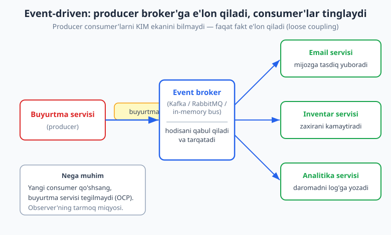
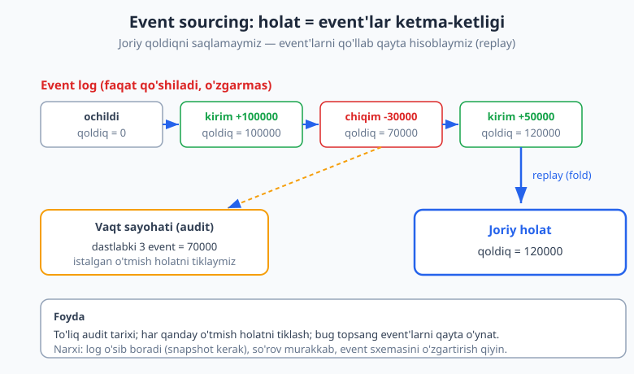
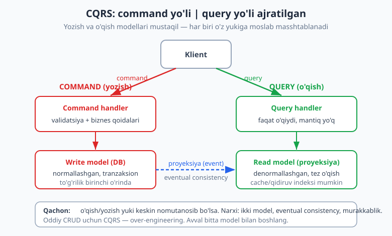

# 15 — Event-driven arxitektura va CQRS

[⬅️ Oldingi: 14 — Domain-Driven Design (DDD) asoslari](./14-ddd-asoslari.md) · [🏠 README](./README.md) · [Keyingi: 16 — Monolit, modulli monolit va mikroservislar ➡️](./16-monolit-mikroservis.md)

---

> **Bu bobda:** kod darajasidagi **Observer** patternini ([09-bob](./09-behavioral-patterns.md)) butun tizim darajasiga ko'taramiz. Avval eng nozik tushunchani aniqlaymiz: **event** (hodisa — "bo'lib o'tdi", o'tgan zamon) vs **command** (buyruq — "buni qil"). Keyin **event-driven arxitektura**ni quramiz: producer (ishlab chiqaruvchi) hodisani **broker** (vositachi)ga e'lon qiladi, bir nechta **consumer** (iste'molchi) uni mustaqil tinglaydi — bir-birini bilmasdan. Martin Fowler ajratgan to'rt uslubni ko'ramiz: Event Notification, Event-Carried State Transfer, Event Sourcing va CQRS. **Event sourcing**da holatni event'lar ketma-ketligi sifatida saqlaymiz; **CQRS**da yozish va o'qish modellarini ajratamiz. Choreography vs orchestration, eventual consistency va idempotentlikka ham kiramiz. Asosiy yuk — ishlaydigan TypeScript event bus (subscribe/publish) misoli.
>
> **Trade-off eslatmasi / Halollik:** Event-driven uslub bog'liqlikni (coupling) kamaytiradi va masshtablashga yo'l ochadi, lekin BEPUL emas — oqim yashirinadi, nosozlikni tuzatish (debugging) qiyinlashadi, **eventual consistency** (oxir-oqibat izchillik — ma'lumot "darrov emas, tez orada" mos keladi) kiradi. Bu bobdagi TS misollari (`_v_15.ts`, `_v_15b.ts`) `$env:TEMP\arx-probe` da `tsx` bilan ishga tushirilgan va `tsc --strict` bilan tekshirilgan (bob oxirida hisobot); barcha "ishga tushirsak" natijalari haqiqiy. Tizim dizayni qarorlari (Kafka vs RabbitMQ, masshtab raqamlari) — konseptual/trade-off tahlili, "ishladi" emas.

---

## Event vs Command — ikki so'z, ikki dunyo

Hammasi nomdan boshlanadi. Tizimda obyektlar bir-biriga xabar yuboradi — lekin xabar **ikki xil ruhda** bo'lishi mumkin:

- **Command (buyruq):** "Buyurtmani yarat", "Emailni yubor", "Zaxirani kamaytir". Bu — **buyruq mayli**, kelajakka qaratilgan. Yuboruvchi ANIQ bitta qabul qiluvchiga aytadi va natija kutadi. Buyruq RAD ETILISHI mumkin (validatsiya yiqilsa).
- **Event (hodisa):** "Buyurtma yaratildi", "To'lov amalga oshdi", "Zaxira kamaydi". Bu — **o'tgan zamon**, fakt. Allaqachon sodir bo'lgan, uni "rad etib" bo'lmaydi. Yuboruvchi KIM tinglashini bilmaydi va javob kutmaydi.

> **Eslatma:** Nomlash konvensiyasi muhim. Command — **buyruq mayli yoki hozirgi zamon** (`BuyurtmaYarat`, `CreateOrder`). Event — **o'tgan zamon** (`BuyurtmaYaratildi`, `OrderCreated`). Agar event nomini buyruq maylida yozsangiz (`ZaxiraKamaytir` deb event yuborsangiz), siz aslida command yuboryapsiz va consumer'larga "nima qilishni" aytib, bog'liqlikni yashirincha qaytarib qo'yasiz.

Farq nafaqat grammatik — u **bog'liqlik yo'nalishini** belgilaydi:

```text
COMMAND:  Yuboruvchi  --->  "buni qil"  --->  ANIQ qabul qiluvchi
          (kim qilishini biladi, natija kutadi, rad etilishi mumkin)

EVENT:    Producer    --->  "bu bo'ldi"  --->  ??? (kim tinglasa)
          (kim tinglashini bilmaydi, javob kutmaydi, fakt)
```

Tasavvur qiling, e-commerce backend. "To'lov amalga oshdi" — bu event. Buni kim tinglaydi? Bugun: email servisi, inventar, analitika. Ertaga: sodiqlik dasturi, fraud-detektor. To'lov servisi BULARNING BIRORTASINI bilmasligi kerak — u faqat faktni e'lon qiladi. Mana shu — Observer patternining ([09-bob](./09-behavioral-patterns.md)) tizim darajasidagi ko'rinishi, va u **event-driven arxitektura**ning yuragi.

> **Diqqat:** "Event yoki command?" degan savol ko'pincha noto'g'ri tushuniladi. Bitta xabar har ikkisi bo'la olmaydi, lekin bitta amal ikkalasini ham keltirib chiqarishi mumkin: klient `BuyurtmaYarat` (command) yuboradi -> servis uni bajaradi -> keyin `BuyurtmaYaratildi` (event) e'lon qiladi. Command — kirish (intent), event — chiqish (natija, fakt).

---

## Event-driven arxitektura: producer, broker, consumer

Klassik (sinxron) tizimda buyurtma servisi har bir ishni O'ZI chaqiradi:

```ts
// QATTIQ BOG'LANGAN: buyurtma servisi 4 ta modulni ham biladi
class BuyurtmaServisiYomon {
  yarat(b: Buyurtma): void {
    this.saqla(b);
    emailServisi.yubor(b);        // <- email modulini biladi
    inventar.kamaytir(b);         // <- inventar modulini biladi
    analitika.qayd(b);            // <- analitika modulini biladi
    // yangi reaksiya = SHU YERNI tahrirlash (OCP buzildi)
  }
}
```

Bu kodda buyurtma servisi to'rtta modulga **qattiq bog'langan** (tight coupling). Yangi reaksiya qo'shsangiz — shu metodni tahrirlaysiz; bir modul sekin bo'lsa — butun buyurtma sekinlashadi; bir modul yiqilsa — buyurtma ham yiqilishi mumkin.

**Yechim** — uchta rolni ajratish:

- **Producer (publisher):** faktni e'lon qiladi (`buyurtma.yaratildi`). Kim tinglashini bilmaydi.
- **Broker (event bus / message broker):** hodisani qabul qiladi va obunachilarga tarqatadi.
- **Consumer (subscriber):** o'zini qiziqtirgan hodisaga obuna bo'ladi va reaksiya qiladi.



### Ishlaydigan event bus (TypeScript)

Mana eng oddiy in-memory event bus — subscribe/publish bilan. Bu Observer'ning ko'p-hodisali (multi-topic), tip-xavfsiz versiyasi:

```ts
type Handler<T> = (hodisa: T) => void;

class EventBus {
  private handlerlar = new Map<string, Set<Handler<any>>>();

  on<T>(turi: string, h: Handler<T>): () => void {
    if (!this.handlerlar.has(turi)) this.handlerlar.set(turi, new Set());
    this.handlerlar.get(turi)!.add(h);
    return () => this.handlerlar.get(turi)?.delete(h); // unsubscribe funksiyasi
  }

  emit<T>(turi: string, hodisa: T): void {
    const set = this.handlerlar.get(turi);
    if (!set) return;
    for (const h of set) h(hodisa); // ro'yxatdagi TARTIBDA chaqiriladi
  }
}
```

Endi event nomini o'tgan zamonda beramiz va producer'ni consumer'lardan ajratamiz:

```ts
interface BuyurtmaYaratildi {
  buyurtmaId: string;
  mahsulot: string;
  soni: number;
  narx: number;
}

const bus = new EventBus();

// Uchta mustaqil consumer obuna bo'ladi
const offEmail = bus.on<BuyurtmaYaratildi>("buyurtma.yaratildi", (h) =>
  console.log(`email: #${h.buyurtmaId} tasdiq mijozga`),
);
bus.on<BuyurtmaYaratildi>("buyurtma.yaratildi", (h) =>
  console.log(`inventar: ${h.mahsulot} -${h.soni}`),
);
bus.on<BuyurtmaYaratildi>("buyurtma.yaratildi", (h) =>
  console.log(`analitika: daromad +${h.narx}`),
);

// Producer faqat faktni e'lon qiladi — consumer'lardan bexabar
bus.emit<BuyurtmaYaratildi>("buyurtma.yaratildi", {
  buyurtmaId: "A-100", mahsulot: "Telefon", soni: 2, narx: 5000000,
});

offEmail(); // email obunasini bekor qildik
bus.emit<BuyurtmaYaratildi>("buyurtma.yaratildi", {
  buyurtmaId: "A-101", mahsulot: "Quloqchin", soni: 1, narx: 300000,
});
```

Ishga tushirsak (haqiqiy `tsx` natijasi):

```text
[Event bus] A-100:
  email: #A-100 tasdiq mijozga
  inventar: Telefon -2
  analitika: daromad +5000000
[Event bus] A-101 (email obunasi bekor qilingan):
  inventar: Quloqchin -1
  analitika: daromad +300000
```

Diqqat qiling: A-101'da email kelmadi — `offEmail()` obunani bekor qilgan. Lekin inventar va analitika ishlashda davom etdi. **Producer kodi (`emit`) o'zgarmadi** — yangi consumer qo'shish yoki olib tashlash producer'ga teginmaydi. Bu OCP'ning ([05-bob](./05-solid.md)) tizim darajasidagi isboti.

> **Eslatma:** Bu — **sinxron, jarayon ichidagi** (in-process) event bus: `emit` handler'larni darrov, navbatma-navbat chaqiradi. Real distributed tizimda broker o'rnida Kafka, RabbitMQ yoki AWS SNS/SQS turadi: hodisa tarmoq orqali uzatiladi, consumer'lar BOSHQA jarayon/serverda, ASINXRON ishlaydi. Mexanizm o'zgaradi, g'oya bir xil qoladi.

> **Trade-off:** Event bus bog'liqlikni susaytiradi, lekin **oqimni yashiradi**. `bus.emit("buyurtma.yaratildi", ...)` qatorini o'qiganingizda "bu yerda aslida NIMA bo'ladi?" deganni darrov ko'rmaysiz — handler'lar boshqa fayllarda ro'yxatdan o'tgan. Ko'p consumer + zanjirli hodisalar (bir hodisa boshqasini chaqiradi) = nosozlikni kuzatish qiyinlashadi. Buning uchun **kuzatuv** (observability — log, trace, correlation ID) muhim bo'ladi.

---

## Event uslublari: Martin Fowler tasnifi

Martin Fowler (martinfowler.com) "event-driven" so'zining ostida **to'rt xil** naqshni ajratadi — ular ko'pincha aralashtiriladi. Ularni bilish chalkashlikni oldini oladi.

### 1) Event Notification — faqat "xabar berish"

Hodisa **minimal** ma'lumot oladi: "nimadir bo'ldi, bormi-yo'qmi bilmoqchi bo'lsang, kelib so'ra". Consumer batafsil kerak bo'lsa, producer'dan QAYTA so'raydi (callback).

```ts
// Faqat ID — batafsil kerak bo'lsa, consumer API'dan so'rab oladi
bus.emit("buyurtma.yaratildi", { buyurtmaId: "A-100" });
```

**Foyda:** hodisa kichik, modullar maksimal ajralgan. **Zarari:** consumer batafsil uchun qayta so'rov yuboradi (ko'p tarmoq chaqiruvi), va producer bilan yashirin bog'liqlik qoladi (so'rov API'si kerak).

### 2) Event-Carried State Transfer — ma'lumot bilan

Hodisa O'ZIDA kerakli barcha ma'lumotni olib yuradi. Consumer producer'dan QAYTA so'rashi shart emas.

```ts
// To'liq holat hodisa ichida — qayta so'rov shart emas
bus.emit("buyurtma.yaratildi", {
  buyurtmaId: "A-100", mahsulot: "Telefon", soni: 2, narx: 5000000, mijoz: "Ali",
});
```

**Foyda:** consumer mustaqil ishlaydi, producer'ga qayta murojaat yo'q, producer vaqtincha o'chsa ham consumer davom etadi. **Zarari:** ma'lumot **takrorlanadi** (har consumer'da nusxa), va u "eski" bo'lishi mumkin (eventual consistency). Bizning yuqoridagi misol — aynan shu uslub.

### 3) Event Sourcing — holatni event'lar sifatida saqlash

Bu — eng kuchli va eng murakkab uslub. Odatda biz **joriy holatni** saqlaymiz (`qoldiq = 120000`). Event sourcing'da esa biz **barcha o'zgarishlarni** (event'larni) ketma-ket, o'zgarmas (immutable) log sifatida saqlaymiz; joriy holat — shu event'larni ketma-ket qo'llab QAYTA HISOBLANADI (replay/fold).



```ts
type HisobHodisasi =
  | { tur: "ochildi"; boshlangich: number }
  | { tur: "kirim"; summa: number }
  | { tur: "chiqim"; summa: number };

// Joriy holat = event'larni ketma-ket qo'llash (fold/reduce)
function joriyQoldiq(hodisalar: HisobHodisasi[]): number {
  return hodisalar.reduce((qoldiq, e) => {
    switch (e.tur) {
      case "ochildi": return e.boshlangich;
      case "kirim": return qoldiq + e.summa;
      case "chiqim": return qoldiq - e.summa;
    }
  }, 0);
}

const hisobLog: HisobHodisasi[] = [
  { tur: "ochildi", boshlangich: 0 },
  { tur: "kirim", summa: 100000 },
  { tur: "chiqim", summa: 30000 },
  { tur: "kirim", summa: 50000 },
];
console.log(joriyQoldiq(hisobLog));            // 120000
console.log(joriyQoldiq(hisobLog.slice(0, 3))); // 70000 — "vaqt sayohati"
```

Ishga tushirsak (haqiqiy natija):

```text
[Event sourcing] event log -> joriy qoldiq: 120000
[Event sourcing] dastlabki 3 event: 70000
```

`slice(0, 3)` bilan biz O'TMISHDAGI holatni tikladik — bu event sourcing'ning sehri: istalgan vaqtdagi holatni qayta tiklash mumkin (audit, "vaqt sayohati", bug topganda event'larni qayta o'ynash).

> **Trade-off:** Event sourcing to'liq audit tarixi, o'tmish holatni tiklash va kuchli tahlil beradi (har o'zgarish saqlangan). Narxi katta: event log o'sib boradi (**snapshot** — vaqti-vaqti bilan joriy holatni saqlash kerak, har safar 0 dan hisoblamaslik uchun); event sxemasini keyin o'zgartirish qiyin (eski event'lar saqlanib qoladi — versiyalash kerak); oddiy so'rov ("qoldiq qancha?") murakkablashadi. **Diqqat:** event sourcing'ni "modaga" tatbiq qilmang — u audit/tarix HAQIQATAN muhim bo'lgan domenlarda (moliya, buxgalteriya, qonuniy talab) o'zini oqlaydi.

### 4) CQRS — keyingi bo'limda batafsil

To'rtinchi uslub — CQRS — alohida e'tibor talab qiladi.

---

## CQRS — yozish va o'qishni ajratish

**CQRS** (Command Query Responsibility Segregation — buyruq va so'rov mas'uliyatini ajratish) g'oyasi sodda: **yozish modeli** (command, ma'lumotni o'zgartirish) va **o'qish modeli** (query, ma'lumotni olish) ALOHIDA bo'lsin.

An'anaviy CRUD'da bitta model ham yozadi, ham o'qiydi. CQRS'da ikkita:

- **Write model:** normallashgan, tranzaksion, biznes qoidalarni tekshiradi. To'g'rilik birinchi o'rinda.
- **Read model:** denormallashgan (oldindan birlashtirilgan), tez o'qish uchun moslangan. Mantiq yo'q — faqat tayyor ko'rinishni qaytaradi. Cache, qidiruv indeksi yoki alohida DB bo'lishi mumkin.



```ts
interface Command {
  bajar(write: Map<string, number>, ozgartirish: (k: string, v: number) => void): void;
}
class ZaxiraQoshCommand implements Command {
  constructor(private mahsulot: string, private soni: number) {}
  bajar(write: Map<string, number>, ozgartirish: (k: string, v: number) => void): void {
    const yangi = (write.get(this.mahsulot) ?? 0) + this.soni;
    write.set(this.mahsulot, yangi);
    ozgartirish(this.mahsulot, yangi); // read model'ga proyeksiya signali
  }
}

const writeModel = new Map<string, number>();           // raqamli, normallashgan
const readModel = new Map<string, string>();            // tayyor ko'rinish

function command(c: Command): void {
  c.bajar(writeModel, (mahsulot, qoldiq) => {
    readModel.set(mahsulot, `${mahsulot}: ombrda ${qoldiq} dona`); // proyeksiya
  });
}
function query(mahsulot: string): string {
  return readModel.get(mahsulot) ?? `${mahsulot}: ma'lumot yo'q`;
}

command(new ZaxiraQoshCommand("Telefon", 10));
command(new ZaxiraQoshCommand("Telefon", 5));
console.log(writeModel.get("Telefon")); // 15
console.log(query("Telefon"));          // "Telefon: ombrda 15 dona"
```

Ishga tushirsak (haqiqiy natija):

```text
[CQRS] write model: 15
[CQRS] read model (query): Telefon: ombrda 15 dona
```

Diqqat: write model raqam (`15`) saqlaydi, read model esa tayyor matn. Real tizimda read model alohida tezkor ombor (Redis, Elasticsearch) bo'lishi va write'dan **event** orqali yangilanishi mumkin — ya'ni CQRS ko'pincha event-driven bilan birga keladi.

> **Diqqat (eng keng tarqalgan xato):** CQRS — bu read va write uchun ALOHIDA DB degani EMAS (bu — bitta variant). Mohiyati: read va write uchun alohida **MODEL** (yo'l, kod). Ko'pchilik CQRS'ni darrov "event sourcing + ikki DB + Kafka" deb tasavvur qiladi — bu uni keraksiz murakkablashtiradi. Eng oddiy CQRS — bir DB ichida read uchun alohida so'rov metodlari, write uchun alohida command metodlari.

> **Qachon CQRS kerak:** (1) o'qish va yozish yuki KESKIN nomutanosib bo'lsa (masalan mahsulot katalogi: million marta o'qiladi, kamdan-kam yoziladi — read model'ni alohida masshtablaysiz); (2) o'qish va yozish modellari TABIIY ravishda farq qilsa (yozishda normallashgan, o'qishda murakkab birlashtirilgan ko'rinish kerak); (3) murakkab domen + event sourcing bilan birga. **Qachon KERAK EMAS:** oddiy CRUD ilova — CQRS faqat murakkablik qo'shadi va hech narsa bermaydi.

> **Trade-off:** CQRS o'qish va yozishni mustaqil optimallashtirish/masshtablash imkonini beradi. Narxi: ikki model (ko'proq kod), va write -> read sinxronizatsiyasi ko'pincha ASINXRON bo'lib, **eventual consistency** keltiradi (yozdingiz, lekin read model bir lahza eski bo'lishi mumkin). UI buni hisobga olishi kerak ("yangilandi" deb ko'rsatib, fonda sinxronlash).

---

## Choreography vs Orchestration — koordinatsiya kim qiladi?

Bir nechta servis bitta jarayonni (masalan buyurtmani bajarish) birgalikda bajarganda, ularni KIM muvofiqlashtiradi? Ikki yondashuv bor:

**Choreography (markazsiz):** har servis o'z hodisalarini tinglaydi va o'z hodisasini chiqaradi. Markaziy "boshqaruvchi" yo'q — har kim o'z partiyasini biladi, raqs o'z-o'zidan yig'iladi.

```text
Buyurtma servisi  --[buyurtma.yaratildi]-->  To'lov servisi
To'lov servisi    --[to'lov.tasdiqlandi]-->  Inventar servisi
Inventar servisi  --[zaxira.ajratildi]-->    Yetkazib berish servisi
```

**Orchestration (markazlashgan):** bitta "dirijyor" (orchestrator) butun jarayonni boshqaradi — har servisga buyruq beradi va natijani kutadi.

```text
              [ Orchestrator ]
              /      |       \
        To'lov?   Zaxira?  Yetkazish?   (har biriga command yuboradi,
                                          natijani kutadi, keyingisini chaqiradi)
```

> **Trade-off:** **Choreography** — maksimal ajralgan, yangi servis qo'shish oson (yangi hodisaga obuna bo'ladi), lekin umumiy oqimni TUSHUNISH qiyin (hech qayerda "to'liq jarayon" yozilmagan). **Orchestration** — oqim bitta joyda ko'rinadi, kuzatish/tuzatish oson, lekin orchestrator markaziy bog'liqlik nuqtasiga aylanadi va o'sib ketishi mumkin. Murakkab tranzaksiyalarda (masalan Saga pattern bilan kompensatsiya) ko'pincha orchestration tanlanadi. Aniq "yaxshi" javob yo'q — domen va jamoaga bog'liq (Conway qonuni, [25-bob](./25-evolyutsion-antipatternlar.md)).

---

## Eventual consistency va idempotentlik

Event-driven tizimga o'tganingiz bilan ikkita tushuncha muqarrar bo'ladi.

### Eventual consistency (oxir-oqibat izchillik)

Sinxron tizimda buyurtma yaratilsa, zaxira O'SHA ZAHOTI kamayadi — hammasi bitta tranzaksiyada. Event-driven'da inventar servisi hodisani biroz keyin oladi, shuning uchun qisqa vaqt "buyurtma bor, lekin zaxira hali kamaymagan" holati bo'ladi. Ma'lumot **oxir-oqibat** mos keladi, lekin DARROV emas.

Bu yomon emas — bu **tanlov**. Siz qattiq izchillikni (strong consistency, hamma joyda bir lahzada bir xil) decoupling va availability'ga almashtirasiz. Bu to'g'ridan-to'g'ri **CAP teoremasi** va **PACELC** bilan bog'liq — normal ishlashda ham Latency vs Consistency tanlovi bor (chuqur [22-bob](./22-cap-consistency-replikatsiya.md)da).

> **Amaliyotda:** Eventual consistency'ni foydalanuvchiga to'g'ri ko'rsatish muhim. "Buyurtmangiz qabul qilindi, tez orada tasdiq keladi" — bu eventual consistency'ni UI tiliga tarjima qilish. Bank o'tkazmasi "kutilmoqda" holati, "post yuborildi, lekin hali hammaga ko'rinmaydi" — bularning barchasi shu g'oya.

### Idempotentlik (idempotency)

Broker'lar ko'pincha hodisani **kamida bir marta** (at-least-once) yetkazib beradi — ya'ni bir hodisa IKKI marta kelishi mumkin (tarmoq qayta urinishi sababli). Agar "zaxira -1" hodisasi ikki marta ishlansa, zaxira xato kamayadi. Yechim — **idempotent consumer**: bir hodisani ikki marta qabul qilsa ham, natija bir xil bo'lsin.

```ts
class IdempotentConsumer {
  private korilgan = new Set<string>();
  ishlangan = 0;
  qayta = 0;
  qabulQil(eventId: string): void {
    if (this.korilgan.has(eventId)) { this.qayta++; return; } // takror -> e'tiborsiz
    this.korilgan.add(eventId);
    this.ishlangan++; // asl ish faqat birinchi marta
  }
}
```

Ishga tushirsak (`["e1","e2","e1","e3","e2","e1"]` ketma-ketligida — haqiqiy natija):

```text
[10-mashq] ishlangan: 3, takror tashlandi: 3
```

Olti hodisadan faqat uchtasi (e1, e2, e3) ishlandi — qolgan uchta takror tashlandi. Har hodisaning yagona ID'si bo'lishi va consumer "ko'rilgan"larni eslab qolishi (yoki amalni tabiatan idempotent qilishi) idempotentlikning kaliti. Bu mavzu navbatlar bilan birga [21-bob](./21-message-queue-async.md)da chuqurroq.

> **Diqqat:** Idempotentlikni "keyin qo'sharman" deb qoldirmang. Distributed tizimda qayta yetkazib berish — istisno emas, NORMA (8 fallacy: "tarmoq ishonchli" — yolg'on, [23-bob](./23-fault-tolerance-resilience.md)). Idempotent bo'lmagan consumer ertami-kechmi ikki marta email yuboradi yoki ikki marta pul yechadi.

---

## Amaliyotda: Telegram-bot buyurtma oqimi

Keling, yig'amiz. Telegram-bot orqali do'kon ishlaydi. Mijoz "Sotib olish" bosadi -> `BuyurtmaYarat` command bajariladi -> servis `BuyurtmaYaratildi` event chiqaradi. Bu hodisaga to'rtta consumer obuna:

```text
[Bot handler]  --BuyurtmaYarat (command)-->  [Buyurtma servisi]
                                                    |
                                          BuyurtmaYaratildi (event)
                                                    |
                                            [ Event bus / broker ]
                          +-------------------+-----+-----------------+
                          v                   v                       v
                   Mijozga tasdiq      Admin kanaliga          Statistika +1
                   (Telegram xabar)    bildirish               va Inventar -1
```

Boshida (kichik bot, bitta server) — **sinxron, jarayon ichidagi** event bus yetarli: oddiy, kuzatish oson, hammasi bitta jarayonda. Lekin quyidagi belgilar paydo bo'lganda **haqiqiy broker**ga (RabbitMQ/Kafka) o'ting:

- consumer sekin (admin kanaliga tarmoq so'rovi) — sinxronda butun buyurtma kutadi;
- consumer yiqilsa — buyurtma ham yiqilmasligi kerak (asinxron'da mustaqil);
- consumer boshqa servisda (inventar alohida mikroservis, [16-bob](./16-monolit-mikroservis.md)).

> **Amaliyotda:** Real Telegram-bot misolini `../tgbot-js/README.md` kitobida ko'rishingiz mumkin. Node.js'da `EventEmitter` — tayyor in-process event bus; grammY/Express middleware — Chain of Responsibility ([09-bob](./09-behavioral-patterns.md)) ustiga qurilgan hodisa oqimi. Backend arxitekturasi uchun `../nodejs/README.md`, ma'lumotlar ombori tanlovi uchun `../sql/README.md`.

> **Anti-pattern: distributed monolit.** Hamma narsani event'ga aylantirib, lekin servislar bir-biriga shu qadar bog'liq bo'lsaki, birini ikkinchisisiz deploy qilib bo'lmasa — siz "distributed monolit" yaratdingiz: monolitning bog'liqligi + distributed tizimning murakkabligi, eng yomon ikkalasi. Event-driven decoupling REAL bo'lishi kerak (consumer producer'siz, producer consumer'siz ishlasin), aks holda u faqat narx qo'shadi. Bu xavf [16-bob](./16-monolit-mikroservis.md)da.

---

## Qachon event-driven, qachon yo'q?

Event-driven — kuchli, lekin har masala uchun emas. Tezkor yo'riqnoma:

| Belgisi | Tavsiya |
|---|---|
| Bir hodisaga ko'p mustaqil reaksiya kerak | Event-driven (Observer / event bus) |
| Reaksiyalar sekin yoki alohida deploy qilinadi | Asinxron broker (Kafka/RabbitMQ) |
| To'liq audit tarixi / o'tmish holat kerak (moliya) | Event sourcing |
| O'qish/yozish yuki keskin nomutanosib | CQRS |
| Oddiy CRUD, bitta reaksiya, sinxron yetarli | To'g'ridan-to'g'ri chaqiruv (event KERAK EMAS) |

> **Trade-off (umumiy):** Event-driven decoupling, masshtablash va kengaytiriluvchanlik beradi; narxi — yashirin oqim, debugging murakkabligi, eventual consistency va idempotentlik talabi. Qoida: **muammo HAQIQATAN paydo bo'lganda** (qattiq bog'liqlik og'ritganda, modullar mustaqil masshtab talab qilganda) qo'llang. Avvaldan "mikroservis bo'lamiz, hammasi event bo'lsin" deb qurish — YAGNI ([06-bob](./06-dry-kiss-yagni.md)) buzilishi va ko'pincha distributed monolitga olib keladi.

---

## Mashqlar

### Oson

**1.** Quyidagilarning har biri **event** (o'tgan zamon, fakt) yoki **command** (buyruq, intent) — ayting: (a) `EmailYubor`; (b) `TolovTasdiqlandi`; (c) `FoydalanuvchiRoyxatdanOtdi`; (d) `ZaxiraKamaytir`; (e) `ParolOzgartirildi`.

**2.** Event-driven arxitekturada uchta rolni ayting (producer, broker, consumer) va har birining vazifasini bitta jumlada tushuntiring.

**3.** Nega event nomi O'TGAN zamonda yoziladi (`BuyurtmaYaratildi`, `ZaxiraKamaytir` emas)? Buyruq maylida yozsangiz qanday yashirin muammo paydo bo'ladi?

**4.** Quyidagi kodda buyurtma servisi nechta modulga bog'langan va bu nega yomon? Qanday pattern/arxitektura uni tuzatadi?

```ts
class BuyurtmaServisi {
  yarat(b: Buyurtma): void {
    this.saqla(b);
    emailServisi.yubor(b);
    inventar.kamaytir(b);
    analitika.qayd(b);
  }
}
```

**5.** "Eventual consistency" nima degani? Bitta sodda real misol bilan tushuntiring (bank yoki ijtimoiy tarmoq).

### O'rta

**6.** **(KOD — event bus)** Bob matnidagi `EventBus`ga `once<T>(turi, h)` metodini qo'shing — handler FAQAT BIR marta chaqirilsin, keyin avtomatik o'chsin (ko'rsatma: ichida `on` ishlating va birinchi chaqiruvda `off()` qiling). `ping` hodisasini 3 marta yuborib, `once` 1 marta, oddiy `on` 3 marta chaqirilganini ko'rsating. `tsx` bilan ishga tushiring.

**7.** Martin Fowlerning **Event Notification** va **Event-Carried State Transfer** uslublari orasidagi farqni ayting. Har birining bitta foydasi va bitta zararini keltiring. Qaysi biri consumer'ni producer'dan ko'proq mustaqil qiladi?

**8.** Choreography va orchestration farqini ayting. Quyidagi 3-bosqichli buyurtma jarayoni (to'lov -> zaxira -> yetkazish) uchun har ikki yondashuvni 2-3 qatorli pseudokod/diagramma bilan chizing.

**9.** **(KOD — idempotentlik)** Idempotent consumer yozing: u hodisa ID'larini qabul qiladi, takrorlangan ID'larni e'tiborsiz qoldiradi. `["e1","e2","e1","e3","e2","e1"]` ketma-ketligi uchun nechta hodisa ishlangani va nechtasi takror tashlanganini chiqaring. `tsx` bilan tekshiring.

**10.** CQRS haqida keng tarqalgan XATO da'voni ayting va to'g'rilang. (Ko'rsatma: "CQRS = ikki DB / event sourcing / Kafka" haqida o'ylang.) Eng oddiy CQRS qanday ko'rinadi?

### Qiyin

**11.** **(KOD — event sourcing)** Bank hisobi uchun event sourcing yozing. Hodisalar: `ochildi`, `kirim {s}`, `chiqim {s}`. `tikla(boshlangichQoldiq, hodisalar)` funksiyasi event'larni qo'llab qoldiqni hisoblasin. Snapshot g'oyasini ko'rsating: 3 ta event bilan qoldiqni hisoblang (snapshot), keyin yangi event'ni SHU snapshotdan davom ettiring (0 dan emas). `tsx` bilan ishga tushiring.

**12.** **(Dizayn)** E-commerce'da "to'lov amalga oshdi" hodisasiga quyidagilar ulanishi kerak: (a) buyurtmani "to'langan" ga o'tkazish, (b) yetkazib berishni boshlash, (c) mijozga chek emaili, (d) sodiqlik balli. Qaysi event uslubini (Notification / State Transfer) tanlaysiz va nega? Bu sinxron (in-process bus) yoki asinxron (broker) bo'lsinmi — qaysi belgilarga qarab qaror qilasiz? Diagramma chizing, trade-off bilan asoslang.

**13.** **(Dizayn — CQRS qarori)** Hamkasbingiz oddiy "vazifalar ro'yxati" (todo) ilovasi uchun to'liq CQRS + event sourcing + alohida read/write DB taklif qildi. Bu yaxshi qaror bo'lganmi? Qaysi printsip(lar) nuqtai nazaridan baholang. CQRS HAQIQATAN qachon o'zini oqlaydi — uchta belgi keltiring.

**14.** **(Tahlil)** Loyihangiz event-driven, lekin bironta servisni ikkinchisisiz deploy qilib bo'lmaydi — har o'zgarishda hammasini birga chiqarasiz. Bu qanday anti-pattern? Nega u "eng yomon ikki dunyo"? Qanday tekshirasiz, sizning event-driven decoupling'ingiz REALmi yoki soxtami?

<details markdown="1">
<summary>Yechimlar</summary>

### 1-mashq yechimi
(a) **command** — buyruq mayli, intent. (b) **event** — o'tgan zamon, fakt. (c) **event** — o'tgan zamon, fakt. (d) **command** — buyruq mayli. (e) **event** — o'tgan zamon, fakt. Qoida: o'tgan zamonda (`-di`, `-ndi`) = event; buyruq maylida = command.

### 2-mashq yechimi
- **Producer (publisher):** faktni e'lon qiladi (`buyurtma.yaratildi`), kim tinglashini bilmaydi.
- **Broker (event bus):** hodisani qabul qiladi va obunachilarga tarqatadi.
- **Consumer (subscriber):** o'zini qiziqtirgan hodisaga obuna bo'ladi va reaksiya qiladi.

### 3-mashq yechimi
Event — bu allaqachon SODIR BO'LGAN fakt, shuning uchun o'tgan zamon (`BuyurtmaYaratildi`). Agar buyruq maylida (`ZaxiraKamaytir`) yozsangiz, siz aslida **command** yuboryapsiz — consumer'ga "nima qilishni" aytyapsiz. Bu producer'ni consumer mantiqiga BOG'LAB qo'yadi (producer "zaxirani kamaytirish kerak"ligini biladi). Toza event'da producer faqat "buyurtma yaratildi" deydi; zaxirani kamaytirish kerakligini INVENTAR consumer'i o'zi hal qiladi — decoupling shunda saqlanadi.

### 4-mashq yechimi
Buyurtma servisi **uchta** modulga (email, inventar, analitika) qattiq bog'langan. Yomon, chunki: yangi reaksiya = shu metodni tahrirlash (OCP buzildi); bir modul sekin = buyurtma sekin; bir modul yiqilsa = buyurtma yiqilishi mumkin. **Event-driven arxitektura** (event bus / Observer) tuzatadi: servis `BuyurtmaYaratildi` event chiqaradi, har modul mustaqil obuna bo'ladi; servis ularni BILMAYDI.

### 5-mashq yechimi
**Eventual consistency** — ma'lumot bir lahzada hamma joyda bir xil emas, balki OXIR-OQIBAT (qisqa kechikishdan keyin) mos keladi. Misol: bank o'tkazmasi yuborganingizda balans darrov emas, "kutilmoqda" bo'lib, bir necha soniya/daqiqada yangilanadi. Ijtimoiy tarmoq: post yozdingiz, lekin u barcha foydalanuvchilarga bir lahzada emas, sekin-asta ko'rinadi. Qattiq izchillik (strong consistency) o'rniga decoupling/availability tanlangan.

### 6-mashq yechimi
Ishga tushirildi (haqiqiy natija: `once chaqirildi: 1 marta, on: 3 marta`):

```ts
once<T>(t: string, h: Handler<T>): void {
  const off = this.on<T>(t, (e) => { off(); h(e); }); // birinchi chaqiruvda o'zini o'chiradi
}
```

`once` ichida oddiy `on` ishlatiladi, lekin handler birinchi chaqirilganda darrov `off()` qiladi. Shuning uchun 3 ta `emit`dan keyin `once` 1 marta, oddiy `on` esa 3 marta chaqirildi.

### 7-mashq yechimi
- **Event Notification:** hodisa minimal ma'lumot (faqat ID) oladi. Foyda: hodisa kichik, maksimal ajralgan. Zarari: consumer batafsil uchun producer'ga QAYTA so'rov yuboradi (ko'p chaqiruv + yashirin bog'liqlik).
- **Event-Carried State Transfer:** hodisa O'ZIDA to'liq ma'lumot oladi. Foyda: consumer mustaqil, qayta so'rov yo'q (producer o'chsa ham ishlaydi). Zarari: ma'lumot takrorlanadi va eski bo'lishi mumkin.

**State Transfer** consumer'ni ko'proq mustaqil qiladi — u producer'ga qayta murojaat qilmaydi.

### 8-mashq yechimi
- **Choreography (markazsiz):** har servis hodisa tinglaydi va o'z hodisasini chiqaradi.
```text
Buyurtma --[buyurtma.yaratildi]--> To'lov --[to'lov.tasdiqlandi]--> Inventar --[zaxira.ajratildi]--> Yetkazish
```
- **Orchestration (markazlashgan):** dirijyor har servisga buyruq beradi, natijani kutadi.
```text
[Orchestrator]: to'lov qil -> (ok) -> zaxira ajrat -> (ok) -> yetkazishni boshla
```
Choreography ajralgan lekin oqimni kuzatish qiyin; orchestration oqim bitta joyda lekin markaziy bog'liqlik.

### 9-mashq yechimi
Ishga tushirildi (haqiqiy natija: `ishlangan: 3, takror tashlandi: 3`):

```ts
class IdempotentConsumer {
  private korilgan = new Set<string>();
  ishlangan = 0; qayta = 0;
  qabulQil(eventId: string): void {
    if (this.korilgan.has(eventId)) { this.qayta++; return; }
    this.korilgan.add(eventId);
    this.ishlangan++;
  }
}
```

`["e1","e2","e1","e3","e2","e1"]` — 6 hodisadan faqat 3 tasi (e1, e2, e3) ishlandi, qolgan 3 tasi takror tashlandi. Kalit: har hodisaning yagona ID'si va "ko'rilgan"larni eslab qolish.

### 10-mashq yechimi
**Xato da'vo:** "CQRS = read va write uchun ikki alohida DB" (yoki "CQRS = event sourcing + Kafka"). **To'g'risi:** CQRS — read va write uchun alohida **MODEL** (yo'l/kod), ikki DB SHART EMAS. Eng oddiy CQRS — bir DB ichida command metodlari (write) va query metodlari (read) ajratilgan. Ikki DB, event sourcing, broker — bu ixtiyoriy KENGAYTMALAR, CQRS'ning o'zi emas.

### 11-mashq yechimi
Ishga tushirildi (haqiqiy natija: `snapshot=150, snapshotdan tiklangan=175`):

```ts
type Hodisa = { tur: "ochildi" } | { tur: "kirim"; s: number } | { tur: "chiqim"; s: number };
function tikla(boshlangichQoldiq: number, hodisalar: Hodisa[]): number {
  return hodisalar.reduce((q, e) => {
    if (e.tur === "kirim") return q + e.s;
    if (e.tur === "chiqim") return q - e.s;
    return q;
  }, boshlangichQoldiq);
}
const tarix: Hodisa[] = [{ tur: "ochildi" }, { tur: "kirim", s: 200 }, { tur: "chiqim", s: 50 }];
const snapshot = tikla(0, tarix);                         // 150
console.log(tikla(snapshot, [{ tur: "kirim", s: 25 }]));  // 175 — snapshotdan davom
```

Snapshot g'oyasi: `150` da saqladik, keyingi event'ni 0 dan emas, SNAPSHOTDAN davom ettirdik. Bu event log o'sganda har safar boshidan hisoblamaslik uchun zarur (event sourcing samaradorligining kaliti).

### 12-mashq yechimi
**Uslub:** **Event-Carried State Transfer** — hodisaga to'lov ma'lumotini (buyurtmaId, summa, mijoz) qo'shamiz, har consumer mustaqil ishlasin (qayta so'rov shart emas).

```text
[To'lov servisi] --TolovAmalgaOshdi {buyurtmaId, summa, mijoz}--> [Event bus]
                                                                       |
        +----------------+----------------+-----------------+---------+
        v                v                v                 v
  Buyurtma->to'langan  Yetkazishni      Chek emaili      Sodiqlik balli +N
                       boshlash
```

**Sinxron yoki asinxron?** Belgilarga qarab: (1) buyurtma holatini "to'langan" qilish — TEZ va muhim (mijoz darrov ko'rishi kerak) -> sinxron mantiqiy; (2) chek emaili, sodiqlik, yetkazishni boshlash — kechiksa bo'ladi, sekin (tarmoq) -> **asinxron broker** afzal. Real tizimda: muhim/tez qism sinxron, qolgani broker orqali asinxron. Trade-off: asinxron'da eventual consistency (sodiqlik balli bir lahza keyin) lekin to'lov yo'li tez va xatoga chidamli (bir consumer yiqilsa to'lov yiqilmaydi).

### 13-mashq yechimi
**Bu yaxshi qaror EMAS** — oddiy todo ilovasi uchun CQRS + event sourcing + ikki DB **over-engineering** va **YAGNI** ([06-bob](./06-dry-kiss-yagni.md)) buzilishi: hali kerak bo'lmagan murakkablik uchun katta narx to'lanadi (ikki model, sinxronizatsiya, eventual consistency murakkabligi). **KISS** ham buzildi — oddiy CRUD bitta model bilan o'qiluvchanroq va tezroq yoziladi.

**CQRS HAQIQATAN qachon oqlanadi (3 belgi):** (1) o'qish/yozish yuki keskin nomutanosib (million o'qish, kam yozish — read'ni alohida masshtablash kerak); (2) o'qish va yozish modellari tabiatan farq qiladi (normallashgan write vs murakkab birlashtirilgan read); (3) murakkab domen + audit/event sourcing HAQIQATAN talab qilinadi (moliya). Hech biri todo ilovasiga taalluqli emas.

### 14-mashq yechimi
Bu **distributed monolit** anti-patterni ([16-bob](./16-monolit-mikroservis.md)). "Eng yomon ikki dunyo", chunki: monolitning **qattiq bog'liqligi** (birini ikkinchisisiz deploy qilib bo'lmaydi) + distributed tizimning **murakkabligi** (tarmoq, latency, qisman ishdan chiqish, debugging qiyinligi) — ikkalasining kamchiligini birga olasiz, lekin decoupling foydasini OLMAYSIZ.

**Qanday tekshirasiz (decoupling REALmi):** (1) consumer'ni producer'siz mustaqil ishga tushira/deploy qila olasizmi? (2) producer consumer'siz ishlaydimi (hodisa chiqaradi, hech kim tinglamasa ham)? (3) yangi consumer qo'shganda producer kodi o'zgaradimi? Agar producer/consumer'ni alohida deploy qilolmasangiz yoki biri ikkinchisi haqida ANIQ bilim talab qilsa — decoupling soxta, siz faqat event qatlamini qo'shgansiz, narxini to'lab, foydasini olmay.

</details>

---

## Xulosa

Event-driven arxitektura — kod darajasidagi **Observer**ni ([09-bob](./09-behavioral-patterns.md)) butun tizimga ko'tarish. Markaziy g'oyalar:

- **Event vs Command** — event "bo'lib o'tdi" (o'tgan zamon, fakt, kim tinglashini bilmaydi); command "buni qil" (buyruq, aniq qabul qiluvchi, rad etilishi mumkin). Nomlash bog'liqlik yo'nalishini belgilaydi.
- **Producer / broker / consumer** — producer faktni e'lon qiladi, broker tarqatadi, consumer mustaqil tinglaydi. Decoupling: producer consumer'ni bilmaydi (OCP tizim darajasida).
- **To'rt uslub (Fowler):** Event Notification (minimal), Event-Carried State Transfer (to'liq ma'lumot), Event Sourcing (holat = event'lar ketma-ketligi), CQRS (read/write ajratish).
- **CQRS** — yozish va o'qish uchun alohida MODEL (ikki DB shart emas!); o'qish/yozish yuki nomutanosib bo'lganda oqlanadi.
- **Choreography vs orchestration** — markazsiz (har kim o'z partiyasini biladi) vs markazlashgan (dirijyor boshqaradi).
- **Eventual consistency va idempotentlik** — distributed event tizimning muqarrar yo'ldoshlari; idempotent consumer qayta yetkazishga chidaydi.

Eng muhim saboq — **hamma narsa trade-off**. Event-driven decoupling, masshtablash va kengaytiriluvchanlik beradi, lekin yashirin oqim, debugging murakkabligi va eventual consistency narxiga. Muammo HAQIQATAN paydo bo'lganda qo'llang — aks holda distributed monolit xavfi bor.

Keyingi bobda bir qadam yuqoriga ko'tarilamiz: tizimni qanday qilib **birliklarga** bo'lamiz — monolit, modulli monolit va mikroservislar, va event-driven ularning qaysi biriga qanday mos kelishini ko'ramiz.

---

> **Kod-verifikatsiya hisoboti.** Bu bobdagi barcha TypeScript misollari `$env:TEMP\arx-probe` muhitida tekshirildi:
> - `_v_15.ts` (event bus subscribe/publish + unsubscribe, event sourcing replay, CQRS command/query) — `npx tsx _v_15.ts` muvaffaqiyatli ishladi; `npx tsc --noEmit --strict _v_15.ts` toza (0 xato). Matndagi barcha "ishga tushirsak" natijalari (`[Event bus]`, `[Event sourcing]`, `[CQRS]`) shu ishdan olingan.
> - `_v_15b.ts` (mashq yechimlari: `once` event bus, idempotent consumer, snapshot bilan event sourcing) — `npx tsx` muvaffaqiyatli; `tsc --strict` toza. 6, 9, 11-mashq natijalari haqiqiy (`once 1/on 3`, `ishlangan 3/takror 3`, `snapshot 150/175`).
> - Muhit: TypeScript 6.0.3, tsx 4.22, Node v24. Konseptual qismlar (choreography/orchestration diagrammalari, 12-mashq dizayn tahlili, broker tanlovi) "konseptual/pseudokod" deb belgilangan — ishlaydigan kod sifatida ko'rsatilmagan.

---

[⬅️ Oldingi: 14 — Domain-Driven Design (DDD) asoslari](./14-ddd-asoslari.md) · [🏠 README](./README.md) · [Keyingi: 16 — Monolit, modulli monolit va mikroservislar ➡️](./16-monolit-mikroservis.md)
