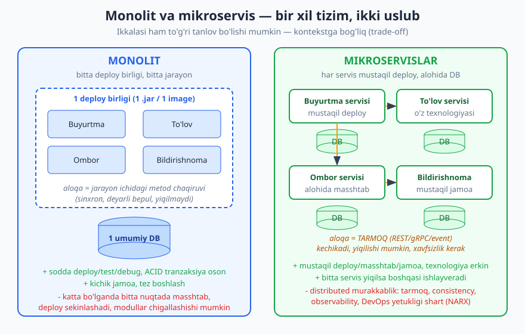
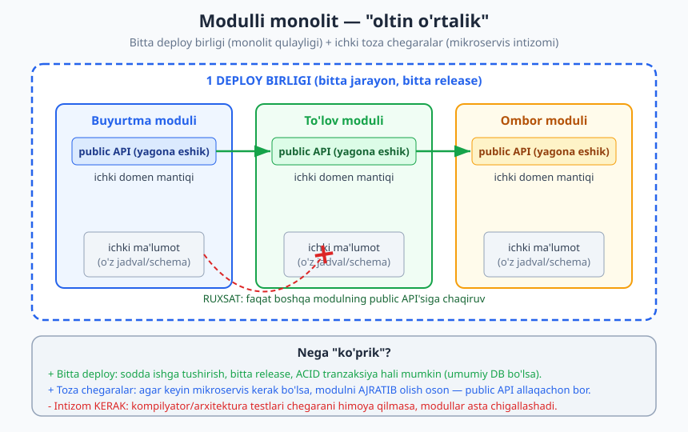
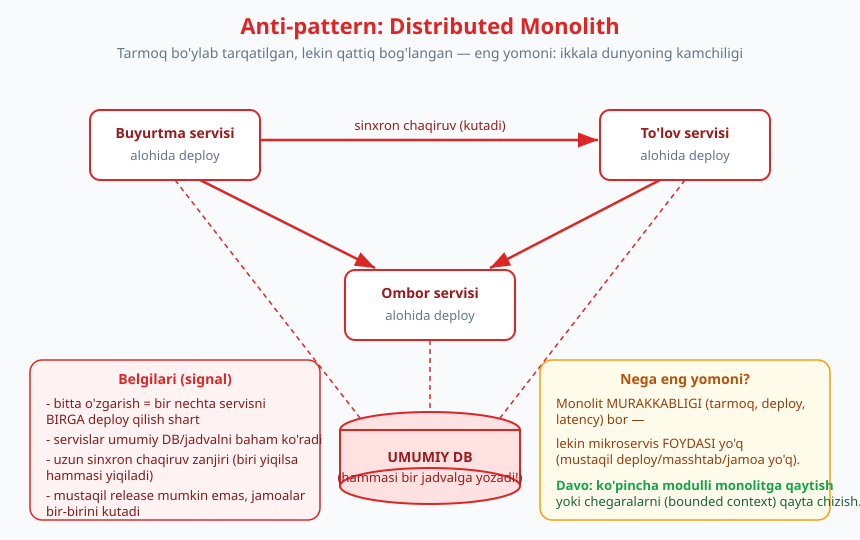

# 16 — Monolit, modulli monolit va mikroservislar

[⬅️ Oldingi: 15 — Event-driven arxitektura va CQRS](./15-event-driven-cqrs.md) · [🏠 README](./README.md) · [Keyingi: 17 — Servislararo aloqa va API dizayni ➡️](./17-api-dizayni-aloqa.md)

---

> **Bu bobda:** dasturiy ta'minot arxitekturasidagi eng ko'p bahslashiladigan va eng ko'p NOTO'G'RI tushuniladigan qaror — tizimni **bitta deploy birligi** (monolit) qilib qurishmi yoki **ko'p mustaqil servis** (mikroservis) ga bo'lishmi. Biz uchta asosiy uslubni ko'rib chiqamiz: oddiy **monolit**, intizomli **modulli monolit** (modular monolith) va **mikroservislar**. Har biri uchun: nima, qachon, va eng muhimi — TRADE-OFF (ayirboshlash). "Monolit = yomon, mikroservis = zamonaviy" degan keng tarqalgan MIFNI buzamiz; Martin Fowler'ning "Monolith First" va "Microservice Premium" g'oyalarini o'rganamiz; eng xavfli anti-pattern — **Distributed Monolith** (tarqatilgan monolit) ni tanib olishni o'rganamiz; va arxitekturani jamoa tuzilmasiga bog'laydigan **Conway qonuni** bilan yakunlaymiz.
>
> **Trade-off eslatmasi / Halollik:** bu bobda BIRORTA mutlaq da'vo yo'q — "har doim shunday qil" degan gap arxitekturada deyarli har doim noto'g'ri. Monolit ham, mikroservis ham, modulli monolit ham TO'G'RI tanlov bo'lishi mumkin; qaysi biri — kontekstga (jamoa, masshtab, domen yetukligi, DevOps darajasi) bog'liq. Bu bob asosan KONSEPTUAL: asosiy yuk diagrammalar va trade-off tahlili. Kichik TypeScript misollari (modul chegarasi, in-process vs tarmoq chaqiruvi) `tsx`/`tsc --strict` bilan haqiqatan ishga tushirilgan (bob oxirida hisobot). Da'volar martinfowler.com va sohaning standart manbalariga (masalan "Fundamentals of Software Architecture" — Richards & Ford) moslangan.

---

## Asosiy savol: nega bu bahs muhim?

Tasavvur qiling, e-commerce (onlayn-do'kon) backend'ini quryapsiz: buyurtma, to'lov, ombor, bildirishnoma. Bularning hammasini **bitta ilova** qilib yozasizmi (hammasi bitta jarayon, bitta `.jar` yoki bitta Docker image, bitta deploy)? Yoki har birini **alohida servis** qilib, ularni tarmoq orqali gaplashtiramizmi?

Bu — texnik tanlovgina emas. U **deploy qanchalik tez/xavfsiz**, **jamoa qanday tashkil etilishi**, **tizim qanday masshtablanishi**, **xato qanchalik oson topilishi** — hammasiga ta'sir qiladi. Va xato tanlov qimmatga tushadi: erta mikroservisga o'tib, ortiqcha murakkablikda cho'kib ketgan startaplar ham, ulkan chigal monolitda qotib qolgan kompaniyalar ham ko'p.

> **Diqqat:** "mikroservis — bu hozirgi to'g'ri yo'l, monolit — eski usul" degan fikr internetda keng tarqalgan, lekin bu XATO va xavfli. Bu — moda (hype), arxitektura qarori emas. Amazon, Netflix kabi gigantlar mikroservisga o'tdi, chunki ularda buni TALAB qiladigan masshtab va muammolar bor edi. Sizning loyihangizda u muammolar bo'lmasligi mumkin — u holda mikroservis foyda emas, sof zarar keltiradi.

Keling, har uchala uslubni tartib bilan ko'ramiz.

---

## Monolit — bitta deploy birligi

**Monolit** — bu butun ilovaning kodi BITTA deploy birligi sifatida qadoqlanib, BITTA jarayon sifatida ishga tushirilishi. Buyurtma, to'lov, ombor — hammasi bir kod bazasida, bir process'da, odatda bir umumiy ma'lumotlar bazasi (DB) bilan.



Diagrammaning chap tomoniga qarang: hamma modul bitta qutida, ular bir-biri bilan oddiy **metod chaqiruvi** orqali gaplashadi (`tolov.hisobla(buyurtma)`), va hammasi bitta DB ga yozadi.

### Monolitning afzalliklari

- **Sodda deploy.** Bitta artefakt (image/jar) — uni serverga qo'yasiz, tamom. Bir nechta servis versiyasini muvofiqlashtirish, "qaysi versiya qaysisi bilan mos?" degan boshog'riq yo'q.
- **Sodda test va debug.** Butun oqimni bitta jarayonda kuzatasiz. Stack trace (xato izi) bir process ichida to'liq ko'rinadi; mahalliy mashinada butun tizimni ishga tushirib, breakpoint qo'yib, qadamma-qadam yura olasiz.
- **Tranzaksiya oson.** "Buyurtmani saqla VA ombor qoldig'ini kamaytir — ikkalasi birga bo'lsin yoki ikkalasi ham bo'lmasin" — bu bitta DB tranzaksiyasi (ACID, [02-bob](./02-sifat-atributlari-tradeoff.md)). Bir nechta servis o'rtasida bu OG'IR muammoga aylanadi (keyin ko'ramiz).
- **Tez boshlash.** Kichik jamoa, yangi loyiha uchun monolit eng tez yo'l: tarmoq, infratuzilma, servis-discovery bilan ovora bo'lmaysiz, biznes mantig'iga e'tibor berasiz.

### Monolitning kamchiliklari

- **Bir nuqtada masshtab.** Faqat to'lov moduli og'ir yuk ostida bo'lsa ham, butun ilovani ko'paytirishingiz (replica qo'shish) kerak — modul-darajasidagi alohida masshtab yo'q.
- **Deploy sekinlashadi.** Kichik o'zgarish ham butun ilovani qayta deploy qilishni talab qiladi; build/test vaqti loyiha o'sgani sayin uzayadi.
- **Texnologiya qulflanishi.** Butun monolit bitta tilda/freymvorkda; bir qismni boshqa texnologiyaga (masalan ML uchun Python) ko'chirish qiyin.
- **Chigallashish xavfi.** Agar intizom bo'lmasa, modullar bir-biriga kirib ketadi (tight coupling, [04-bob](./04-coupling-cohesion.md)) va monolit "katta loy to'pi" (Big Ball of Mud) ga aylanadi.

> **Eslatma:** Diqqat qiling — yuqoridagi oxirgi kamchilik ("chigallashish") monolitning O'ZIGA xos emas! U **intizomsizlik**ning natijasi. Yaxshi tuzilgan monolit toza modullarga ega bo'lishi mumkin. Aynan shu kuzatuv bizni keyingi uslubga — modulli monolitga olib keladi.

> **Amaliyotda:** Ko'pchilik muvaffaqiyatli mahsulot monolit sifatida boshlangan va uzoq vaqt shunday qolgan. GitHub, Shopify, Stack Overflow yillar davomida (ba'zilari hozir ham) yirik monolitlar bilan ishlagan. Monolit "kichik loyiha" degani emas — u shunchaki **bitta deploy birligi** degani.

---

## "Monolit = yomon" mifini buzamiz

Bu mifni alohida ajratish kerak, chunki u juda zararli.

**Da'vo:** "Monolit yomon, mikroservis yaxshi."
**Haqiqat:** ikkalasi ham — vosita. Vosita "yaxshi" yoki "yomon" emas; u muayyan muammoga MOS yoki MOS EMAS bo'ladi.

Martin Fowler (martinfowler.com) buni aniq ifodalaydi: mikroservis arxitekturasi **"premium"** (qo'shimcha narx) bilan keladi. Bu narxni faqat tizim murakkabligi ma'lum chegaradan o'tganda to'lash arziydi. U mashhur grafik chizadi: kichik/o'rta murakkablikdagi tizimlar uchun **monolit samaradorligi mikroservisdan YUQORI**, chunki distributed (tarqatilgan) tizimning qo'shimcha xarajati monolitning ichki chigalligidan ko'ra og'irroq tushadi. Faqat murakkablik yuqori bo'lganda mikroservis foydasi bu narxni qoplaydi.

> **Trade-off:** Mikroservisga o'tganda siz **kod murakkabligini** (modullar bir-biriga aralashib ketishi) **operatsion murakkablikka** (tarmoq, deploy orkestratsiyasi, distributed debugging, monitoring) ALMASHTIRASIZ. Bu almashuv tekin emas — siz bir muammoni boshqasiga, ko'pincha OG'IRROQ muammoga, ayirboshlaysiz. Savol: sizning jamoangiz bu yangi muammolarni hal qila oladimi?

Demak to'g'ri savol "monolitmi yoki mikroservis?" emas, balki: **"Mening hozirgi muammolarim mikroservis narxini to'lashga arziydigan darajadami?"** Aksariyat loyihalar uchun javob — yo'q, hech bo'lmaganda boshida.

---

## Modulli monolit — "oltin o'rtalik"

Agar monolitning yagona haqiqiy kamchiligi (chigallashish) intizomdan kelib chiqsa — nega intizomli monolit qurmaylik? Bu **modulli monolit** (modular monolith).

G'oya oddiy: tizim BITTA deploy birligi bo'lib qoladi (monolit qulayligi), LEKIN ichida **toza, mustaqil modul chegaralari** bor (mikroservis intizomi). Har modul faqat O'Z ma'lumotiga to'g'ridan-to'g'ri kiradi; boshqa modulga FAQAT uning ochiq interfeysi (public API) orqali murojaat qiladi — xuddi mikroservislardagi kabi, lekin tarmoqsiz.



Bu yerda 10-bobdagi (modullik) va 14-bobdagi (DDD bounded context) g'oyalar amalda. Har modul bir **bounded context** (chegaralangan kontekst) ga mos keladi va o'zining toza public API'siga ega.

Quyidagi TypeScript misoli modul chegarasini ko'rsatadi. Buyurtma moduli o'z "jadvali"ni `private` qiladi — boshqa modul unga TO'G'RIDAN kira olmaydi, faqat `summaOlish()` public metodi orqali:

```ts
// Buyurtma moduli: o'z ma'lumotini private qiladi (chegara)
class BuyurtmaModuli {
  // boshqa modul bu Map'ga TO'G'RIDAN kira OLMAYDI (private = chegara)
  private jadval = new Map<number, { id: number; mijozId: number; summa: number }>();
  private keyingiId = 1;

  yarat(mijozId: number, summa: number): number {
    const id = this.keyingiId++;
    this.jadval.set(id, { id, mijozId, summa });
    return id;
  }
  // public API — yagona ruxsat etilgan kirish nuqtasi
  summaOlish(buyurtmaId: number): number {
    const b = this.jadval.get(buyurtmaId);
    if (!b) throw new Error("buyurtma topilmadi");
    return b.summa;
  }
}

// To'lov moduli: Buyurtma JADVALIGA emas, public API'ga bog'lanadi
class TolovModuli {
  constructor(private buyurtmalar: BuyurtmaModuli) {}
  hisobvaraq(buyurtmaId: number): string {
    const summa = this.buyurtmalar.summaOlish(buyurtmaId); // faqat public API
    return `Hisob #${buyurtmaId}: ${summa.toLocaleString("en-US")} so'm`;
  }
}
```

Agar `TolovModuli` ichida `buyurtmalar.jadval` ga to'g'ridan kirmoqchi bo'lsangiz, TypeScript kompilyatori RAD ETADI (haqiqiy `tsc` natijasi):

```text
error TS2341: Property 'jadval' is private and only accessible
within class 'BuyurtmaModuli'.
```

Bu juda muhim: chegara — shunchaki kelishuv emas, kompilyator UNI MAJBURAN ushlab turadi. (Haqiqiy mikroservisda bu rolni tarmoq chegarasi bajaradi.) Ishga tushirgandagi natija:

```text
[Modul chegarasi]
  Hisob #1: 250,000 so'm
```

### Nega modulli monolit ko'p loyiha uchun "oltin o'rtalik"?

- **Monolit qulayligi saqlanadi:** bitta deploy, bitta release, oddiy debug, ACID tranzaksiya hali mumkin (agar modullar umumiy DB ishlatsa).
- **Mikroservis narxi yo'q:** tarmoq, distributed transaction, alohida monitoring — kerak emas.
- **Kelajakka ko'prik:** agar keyin biror modul HAQIQATAN alohida masshtab/jamoa talab qilsa, uni mikroservisga AJRATIB olish ancha oson — chunki public API chegarasi allaqachon bor. Siz faqat metod chaqiruvini tarmoq chaqiruviga almashtirasiz.

> **Amaliyotda:** Shopify (Ruby) va boshqa yirik kompaniyalar ataylab modulli monolit ("majestic monolith") yo'lini tanlagan. Ular millionlab foydalanuvchiga xizmat qiladi va shunga qaramay mikroservisga TO'LIQ o'tmaydi — chunki modulli monolit ularga yetadi. Bu — "kattaroq = ko'proq servis" mifining yana bir raddiyasi.

> **Diqqat:** Modulli monolit BEPUL emas: u **intizom** talab qiladi. Agar chegaralarni faqat "iltimos, boshqa modulning ichki ma'lumotiga tegmang" degan kelishuv himoya qilsa, vaqt o'tib kimdir tegadi va chegaralar yemiriladi. Yechim: chegarani majburiy qiling — modullarni alohida paketga/namespace'ga ajrating, kompilyator ko'rinishi qoidalaridan (`private`, `internal`, modul eksportlari) foydalaning, va arxitektura testlari (masalan ArchUnit, ts-arch) bilan "modul A modul B ning ichki qismiga bog'lanmasin" qoidasini avtomatik tekshiring.

---

## Mikroservislar — mustaqil deploy qilinadigan kichik servislar

**Mikroservislar** — bu tizimni kichik, mustaqil deploy qilinadigan servislarga bo'lish; har servis BIR ish (bir bounded context, [14-bob](./14-ddd-asoslari.md)) atrofida qurilgan va o'z ma'lumotini O'ZI boshqaradi.

Yuqoridagi taqqoslash diagrammasining o'ng tomoniga qarang: har servis alohida quti, alohida DB, va ular bir-biri bilan **tarmoq** orqali (REST, gRPC, yoki event/xabar) gaplashadi.

### Mikroservislarning afzalliklari

- **Mustaqil deploy.** To'lov servisini buyurtma servisiga tegmasdan yangilaysiz va deploy qilasiz. Kichik, tez-tez release — past xavf.
- **Mustaqil masshtab.** Faqat ombor servisi og'ir yuk ostida bo'lsa, faqat O'SHANI ko'paytirasiz. Resurs tejaladi.
- **Mustaqil jamoa.** Har servisni alohida jamoa egallashi mumkin — ular o'z tezligida ishlaydi, bir-birini kutmaydi (bu Conway qonuniga bog'liq, pastda ko'ramiz).
- **Texnologiya erkinligi.** ML servisi Python'da, real-time servisi Go'da, asosiy biznes Node.js'da bo'lishi mumkin — har servis o'z ehtiyojiga mos vositani tanlaydi.
- **Xato izolyatsiyasi.** Bitta servis yiqilsa, butun tizim emas, faqat o'sha funksiya ta'sirlanishi mumkin (agar to'g'ri loyihalansa).

### Mikroservislarning NARXI (premium)

Bu yerda halol bo'lish shart — mikroservis quyidagi narxlar bilan keladi va ularning HAMMASI real:

- **Distributed (tarqatilgan) murakkablik.** Endi sizning tizimingiz — tarqatilgan tizim, va u o'zining barcha qiyinchiliklarini olib keladi. [Distributed computing'ning 8 ta yolg'oni](./23-fault-tolerance-resilience.md) (L. Peter Deutsch) bu yerda kuchga kiradi: tarmoq ishonchli emas, latency nol emas, bandwidth cheksiz emas, tarmoq xavfsiz emas...
- **Tarmoq aloqasi.** In-process metod chaqiruvi deyarli bepul va ishonchli edi; tarmoq chaqiruvi — sekin va XATO bo'lishi mumkin. Har servislararo chaqiruvni timeout, retry (qayta urinish), va xato boshqaruvi bilan o'rashingiz kerak. Quyidagi misol farqni ko'rsatadi (haqiqiy `tsx` natijasi):

```text
[In-process vs tarmoq]
  ichki chaqiruv (monolit ichida): 250000 - xatosiz
  tarmoq chaqiruvi (mikroservis): 250000 - ishladi
  tarmoq xato (yiqildi): ECONNREFUSED: servis javob bermadi
  -> mikroservisda BU holatni boshqarish KERAK (retry/timeout/fallback)
```

Bir xil mantiqiy operatsiya (summa olish) monolitda bir qator kod, mikroservisda esa — tarmoq, xato boshqaruvi, retry, timeout, circuit breaker degan butun apparat. Bu narx.

- **Ma'lumot consistency (yaxlitligi).** Har servis o'z DB siga ega bo'lsa, "buyurtma + ombor birga o'zgarsin" degan oddiy ACID tranzaksiya endi MUMKIN EMAS. Buning o'rniga **eventual consistency** ([15-bob](./15-event-driven-cqrs.md)), saga pattern, kompensatsiya tranzaksiyalari bilan ishlaysiz — ancha murakkab. (ACID vs BASE: [18-bob](./18-malumotlar-bazasi-tanlovi.md).)
- **Observability (kuzatuvchanlik).** Bir so'rov 5 ta servisdan o'tsa, xatoni qayerda izlaysiz? Sizga distributed tracing (Jaeger, OpenTelemetry), markazlashgan loglar, har servis uchun monitoring kerak — bularsiz mikroservis tizimi "qora quti"ga aylanadi.
- **DevOps yetukligi.** Mikroservis CI/CD, konteyner orkestratsiyasi (Kubernetes), servis-discovery, API gateway ([17-bob](./17-api-dizayni-aloqa.md)) talab qiladi. Agar jamoangizda bu yetuklik yo'q bo'lsa, mikroservis sizni cho'ktiradi.

> **Trade-off:** Mikroservis "kichik, sodda servislar" va'da qiladi, lekin almashtirib — TIZIM darajasida murakkablikni keskin oshiradi. Har servis sodda, lekin ULAR ORASIDAGI o'zaro ta'sir (tarmoq, consistency, deploy tartibi) murakkab. Murakkablik yo'qolmaydi — u kod ichidan servislar ORASIGA ko'chadi. Savol: bu joyda murakkablikni boshqarish sizga osonroqmi?

---

## "You must be this tall" — qachon mikroservis arziydi?

Mikroservis hamjamiyatida mashhur o'xshatish bor: "You must be this tall to use microservices" (mikroservis ishlatish uchun shu balandlikda bo'lishingiz kerak — attraksion taqiqi kabi). G'oya Martin Fowler'ning "Microservice Prerequisites" (mikroservis old-shartlari) maqolasiga (martinfowler.com) tayanadi: u mikroservisga o'tishdan OLDIN bo'lishi kerak bo'lgan bir nechta old-shartni sanaydi. Soddalashtirilgan ko'rinishda, sizda quyidagi "balandlik" bo'lishi kerak:

- **Tez deploy va CI/CD** — qo'lda deploy bilan o'nlab servisni boshqarib bo'lmaydi.
- **Monitoring va observability** — siz tizim "sog'lig'i"ni real vaqtda ko'ra olishingiz kerak.
- **Tez avtomat tiklanish (resilience)** — servis yiqilsa, tizim o'zini tutib tursin.
- **Domen yetukligi** — siz chegaralarni (bounded context) BILASIZ. Agar chegaralar hali aniq bo'lmasa, ularni servislarga "muzlatib" qo'yish xato.

> **Eslatma:** Bu "balandlik" tasodifiy emas. Mikroservis muammolarining KO'PI — chegaralarni noto'g'ri qo'yishdan. Agar domen hali tushunarsiz bo'lsa, siz noto'g'ri joydan kessangiz, ikki servis doimo birga o'zgaradigan bo'lib qoladi — bu bizni eng yomon anti-patternga olib keladi (pastda).

Shuning uchun ko'p tajribali muallif tavsiyasi: **monolitdan boshlang**.

---

## "Monolith First" — Fowler tavsiyasi

Martin Fowler'ning **"Monolith First"** (avval monolit) tamoyili (martinfowler.com): yangi loyihada **monolitdan boshlang**, chegaralar (modul/bounded context) aniqlashguncha kuting, KEYIN — agar haqiqatan kerak bo'lsa — modullarni mustaqil servislarga ajrating.

Sabablari:

1. **Yangi loyihada chegaralar noma'lum.** Domen hali yangi; qayerda kesish kerakligini bilmaysiz. Monolitda chegarani siljitish arzon (kodni ko'chirasiz); mikroservisda — qimmat (tarmoq, deploy, ma'lumot migratsiyasi).
2. **Mikroservis narxi loyiha boshida eng og'ir.** Kichik jamoa, kichik tizim uchun distributed murakkablik — sof yo'qotish. Foyda esa keyin, masshtab kelganda paydo bo'ladi.
3. **YAGNI** ([06-bob](./06-dry-kiss-yagni.md)): hali kerak bo'lmagan moslashuvchanlik uchun murakkablik to'lamang.

> **Amaliyotda:** Eng sog'lom yo'l ko'pincha shunday: **monolit -> modulli monolit -> (kerak bo'lsa) ayrim modullarni mikroservisga ajratish.** Hamma narsani birdan mikroservis qilish emas, balki HAQIQATAN alohida deploy/masshtab/jamoa talab qiladigan qismlarnigina ajratish (masalan, yuk og'ir bo'lgan "qidiruv" yoki "tavsiya" moduli). Ko'p tizim hech qachon to'liq mikroservisga o'tmaydi — va bu MUVAFFAQIYAT, mag'lubiyat emas.

> **Diqqat — teskari tomon ham bor:** "Monolith First" mutlaq qoida EMAS. Agar jamoa allaqachon mikroservisni yaxshi biladigan bo'lsa, domen yaxshi tushunilgan bo'lsa va masshtab talabi BOSHIDAN aniq bo'lsa (masalan, ulkan kompaniyaning yangi mahsuloti) — to'g'ridan mikroservisdan boshlash oqilona bo'lishi mumkin. Fowler'ning o'zi buni tan oladi: bu — sukut bo'yicha (default) tavsiya, qonun emas. Yana: trade-off.

---

## Service granularity — servis qanchalik kichik bo'lishi kerak?

"Mikro" so'zi chalg'ituvchi — u "imkon qadar kichik" degani EMAS. Juda mayda servislar (har endpoint bir servis) tarmoq chaqiruvlari portlashiga, "nano-servis" anti-patterniga olib keladi: shunchalik mayda servislar borki, ularning xarajati har qanday foydadan oshib ketadi.

To'g'ri o'lcham odatda **bounded context** ([14-bob](./14-ddd-asoslari.md)) ga mos keladi: "buyurtma", "to'lov", "ombor" — har biri o'z domen mantig'i va ma'lumotiga ega yaxlit (cohesive, [04-bob](./04-coupling-cohesion.md)) birlik. Yaxshi belgi: servis ichidagi qismlar tez-tez BIRGA o'zgaradi, servislar orasi esa kamdan-kam birga o'zgaradi.

```text
Juda mayda (nano-servis)      To'g'ri (bounded context)      Juda yirik (distributed monolit)
  [yarat] [o'qi] [yangila]         [Buyurtma servisi]            [Hammasi bitta "core" servis]
  [hisobla] [tekshir] ...          [To'lov servisi]              har o'zgarish hammaga ta'sir,
  har biri alohida servis,         [Ombor servisi]               servislar bir-birini kutadi
  tarmoq portlashi, latency        har biri yaxlit, mustaqil
```

### Database-per-service — har servis o'z DB siga

Mikroservisning MUHIM prinsipi: har servis o'z ma'lumotini O'ZI boshqaradi (**database-per-service**). Boshqa servis uning DB siga TO'G'RIDAN kira olmaydi — faqat API orqali. Bu chegarani haqiqiy qiladi: agar ikki servis bir jadvalni baham ko'rsa, ular aslida bog'langan (tight coupling) — sizda "mikroservis" emas, bo'lingan monolit bor. ([18-bobda](./18-malumotlar-bazasi-tanlovi.md) chuqurroq.)

> **Trade-off:** Database-per-service mustaqillik beradi, lekin "buyurtma + ombor birga o'zgarsin" degan oddiy tranzaksiyani yo'qotadi. Endi siz eventual consistency, saga, yoki kompensatsiya bilan ishlaysiz. Bu — mikroservisga o'tishdagi eng katta amaliy qiyinchiliklardan biri.

---

## Anti-pattern: Distributed Monolith (tarqatilgan monolit)

Bu — mikroservisga o'tishdagi ENG xavfli tuzoq, va halol bo'lganda — eng ko'p uchraydigan natija.

**Distributed Monolith** — bu tizim mikroservis NOMI bilan ataladi (alohida deploy qilingan servislar bor), LEKIN ular shunchalik QATTIQ bog'langanki, aslida bitta monolit kabi ishlaydi — faqat tarmoq orqali. Bu **ikkala dunyoning kamchiligi**: monolitning chigalligi PLUS distributed tizimning murakkabligi, lekin hech birining foydasisiz.



### Distributed monolit belgilari (signallar)

- **Birga deploy.** Bitta o'zgarishni chiqarish uchun bir nechta servisni BIRGA deploy qilishingiz shart (mustaqil deploy YO'Q).
- **Umumiy DB/jadval.** Servislar bir DB yoki jadvalni baham ko'radi — biri schema'ni o'zgartirsa, boshqasi sinadi.
- **Uzun sinxron zanjir.** Bir so'rov A -> B -> C -> D zanjirini kutadi; oxirdagi servis yiqilsa, butun zanjir yiqiladi (xato izolyatsiyasi YO'Q).
- **Mustaqil release mumkin emas.** Jamoalar bir-birini kutadi, chunki o'zgarishlar bir-biriga bog'liq.
- **Birga o'zgaruvchi servislar.** Bir funksiyani qo'shish doimo 2-3 servisni o'zgartirishni talab qiladi — bu chegaralar noto'g'ri qo'yilganining isboti.

> **Anti-pattern:** Distributed monolit eng yomoni, chunki siz BARCHA narxni to'laysiz (tarmoq, deploy murakkabligi, latency, distributed debugging) lekin HECH BIR foydani olmaysiz (mustaqil deploy/masshtab/jamoa). Monolit hech bo'lmaganda sodda edi; bu — sodda emas VA foydasiz.

### Davosi nima?

Ko'pincha — orqaga qadam: **modulli monolitga qaytish** (servislarni qayta birlashtirib, toza modul chegaralari bilan bitta deploy qilish), yoki **chegaralarni qayta chizish** (bounded context'larni qaytadan, to'g'ri joydan kesish — birga o'zgaradigan narsalar BIR servisda bo'lsin). Distributed monolit — deyarli har doim erta yoki noto'g'ri kesilgan mikroservislashtirish natijasi. Bu yana "Monolith First" tavsiyasining sababini ko'rsatadi: chegaralarni bilmasdan kesmang.

> **Eslatma:** Qanday qilib distributed monolitdan qochasiz? Belgini erta tuting: agar siz doimo "bu o'zgarish uchun 3 ta servisni ham deploy qilishim kerak" desangiz — chegaralaringiz noto'g'ri. Servislar MUSTAQIL deploy bo'lolmasa, ular mikroservis emas. Mustaqil deploy — mikroservisning ta'rifi, bezagi emas.

---

## Conway qonuni — arxitektura jamoa tuzilmasini aks ettiradi

Bu bobning eng chuqur saboqlaridan biri texnik emas, **tashkiliy**.

**Conway qonuni** (Melvin Conway, 1967): *"tizimni loyihalovchi tashkilotlar muqarrar ravishda o'z aloqa tuzilmasining nusxasi bo'lgan dizaynlar ishlab chiqaradi"* ("organizations design systems that mirror their communication structure"). Soddaroq: **dasturingiz arxitekturasi jamoangiz tuzilmasini aks ettiradi.**

Agar sizda 3 ta alohida jamoa bo'lsa — frontend, backend, DB — siz 3 qatlamli tizim olasiz. Agar 4 ta mahsulot jamoasi bo'lsa, ularning har biri o'z ishini egallasa — siz 4 ta modul/servis olasiz. Bu tasodif emas — bu Conway qonuni.

```text
Jamoa tuzilmasi              ->   Arxitektura natijasi
---------------------------       ----------------------------
3 ta texnik jamoa                 3 qatlam (frontend/backend/DB)
(frontend, backend, DBA)          gorizontal bo'lingan

4 ta mahsulot jamoasi             4 ta servis/modul
(har biri o'z domeni)             vertikal (bounded context) bo'lingan
```

### Bu mikroservis qaroriga qanday ta'sir qiladi?

Juda kuchli. Mikroservis FOYDASI (mustaqil jamoa, mustaqil deploy) faqat jamoa tuzilmasi servis chegaralariga MOS kelganda paydo bo'ladi. Agar sizda bitta katta jamoa bo'lsa-yu, siz tizimni 10 ta servisga bo'lsangiz, har o'zgarish hali ham butun jamoadan o'tadi — siz mustaqillik foydasini OLMAYSIZ, faqat tarmoq narxini to'laysiz (distributed monolit xavfi!).

### Inverse Conway Maneuver

Bundan amaliy xulosa: agar siz muayyan arxitekturani XOHLASANGIZ, avval jamoa tuzilmasini o'shanga moslang. Buni **"Inverse Conway Maneuver"** (teskari Conway manyovri) deyiladi: arxitekturani jamoaga moslashtirib qo'yishni kutish o'rniga, **jamoani kerakli arxitekturaga moslab tuzing**, va Conway qonuni o'sha arxitekturani o'zi yetkazib beradi.

> **Amaliyotda:** Mikroservisga o'tayotgan kompaniyalar ko'pincha avval jamoalarni qayta tashkil qiladi — har servis uchun mustaqil, "ikki pitsa" (kichik) jamoa tuzadi, ular butun servis hayot tsiklini (kod, deploy, monitoring, navbatchilik) egallaydi ("you build it, you run it"). Jamoa avtonom bo'lmasa, servis ham avtonom bo'lmaydi.

> **Trade-off:** Conway qonunini "yengib bo'lmaydi" — uni inkor qilish o'rniga ISHLATING. Arxitektura va tashkilotni birga loyihalang. Eng yaxshi texnik chegara ham, agar jamoa tuzilmasiga zid bo'lsa, ishlamaydi — odamlar aloqa yo'llari kodning aloqa yo'llariga "oqib o'tadi".

---

## Qaror jadvali — qaysi uslubni tanlash?

Hech qanday formula yo'q, lekin quyidagi belgilar yo'naltiradi (har doim — kontekstga qarab):

| Holat / belgi | Ko'proq mos |
|---|---|
| Yangi loyiha, domen hali noaniq, kichik jamoa | **Monolit** (yoki modulli monolit) |
| Chegaralar aniq, lekin bitta jamoa, oddiy deploy yetadi | **Modulli monolit** |
| Mustaqil masshtab/deploy/jamoa HAQIQATAN kerak, DevOps yetuk | **Mikroservislar** |
| Faqat bitta-ikki modul boshqacha masshtab/texnologiya talab qiladi | **Modulli monolit + ayrim modulni ajratish** |
| "Zamonaviy ko'rinsin", "hamma shunday qilyapti" | **Hech biri — bu sabab emas** |
| Domen noaniq, lekin baribir mikroservis qilingan | **Distributed monolit xavfi — to'xtang** |

> **Eslatma:** Bu jadval — yo'l-yo'riq, retsept emas. Real qaror har doim ko'p omilning tarozisi: jamoa hajmi va yetukligi, domen tushunilganligi, masshtab talabi, DevOps imkoniyatlari, deploy chastotasi, va biznes bosimi. Yaxshi arxitektor "to'g'ri javob"ni emas, "bu kontekst uchun mos kelishuvni" izlaydi.

---

## Amaliy yo'l xaritasi (umumlashma)

Tipik sog'lom evolyutsiya:

```text
1. Monolit            -> tez boshla, biznes mantig'iga e'tibor, chegaralarni o'rgan
2. Modulli monolit    -> chegaralar aniqlashgach, ichki modullarni tozala (10/14-bob)
3. Selektiv ajratish  -> faqat HAQIQATAN alohida masshtab/jamoa kerak modulni servisga ol
4. (kamdan-kam) to'liq mikroservis -> ulkan masshtab, ko'p mustaqil jamoa bo'lsa
```

Har bosqichda to'xtab, "keyingisi HAQIQATAN kerakmi?" deb so'rang. Ko'p tizim 1 yoki 2-bosqichda muvaffaqiyatli qoladi.

---

## Bo'g'uvchi anjir (Strangler Fig) — qanday QILIB ajratish kerak

Faraz qilaylik, qaror qabul qildingiz: monolitdagi bitta og'ir modulni (masalan "qidiruv" yoki "to'lov") mikroservisga ajratish HAQIQATAN kerak. Buni QANDAY qilasiz? Eng vasvasaga soluvchi (va eng xavfli) yo'l — **"katta portlash" (big-bang) qayta yozish**: butun tizimni to'xtatib, noldan mikroservis qilib qayta yozish. Bu deyarli har doim halokat bilan tugaydi — uzoq muddat hech narsa yetkazib berilmaydi, eski tizim bilan yangisi tafovutga uchraydi, risk ulkan.

Martin Fowler (martinfowler.com, 2001) taklif qilgan xavfsizroq yo'l — **Strangler Fig** (bo'g'uvchi anjir) namunasi. Nomi tabiatdan: anjir lianasi daraxt ustida o'sib, asta-sekin uni o'rab oladi, oxir-oqibat o'zi mustaqil "daraxt" bo'lib qoladi, eski daraxt esa quriydi. Dasturda xuddi shunday: yangi servisni eski monolit ATROFIDA, ASTA-SEKIN o'stirasiz; funksionallikni qism-qism eski tizimdan yangisiga ko'chirasiz; har bosqichda ishlaydigan tizim qoladi.

```text
Bosqich 1: [        MONOLIT        ]   <- barcha so'rov shu yerga
Bosqich 2: [ proksi/marshrutizator ]   <- "qidiruv" so'rovini yangi servisga, qolganini monolitga
              |                |
        [Qidiruv servisi]   [MONOLIT (qolgani)]
Bosqich 3: tobora ko'p funksiya yangiga ko'chadi, monolit "quriydi"
```

Amaliy qadamlar: (1) monolit oldiga marshrutizator/proksi (yoki API gateway, [17-bob](./17-api-dizayni-aloqa.md)) qo'ying; (2) bitta toza chegarali modulni (modulli monolitda allaqachon public API'si bor) yangi servisga ko'chiring; (3) marshrutizatorni o'sha funksiya uchun yangi servisga yo'naltiring; (4) ishlaydi-yu, ishonch hosil qilgach, monolitdan eski kodni olib tashlang; (5) keyingi modulga o'ting.

> **Amaliyotda:** Bu yerda modulli monolitning katta foydasi yana ko'rinadi — agar modulingiz allaqachon toza public API chegarasiga ega bo'lsa, uni ajratish ASOSAN o'sha chegaradagi metod chaqiruvlarini tarmoq chaqiruvlariga almashtirishdan iborat. Chegara yo'q "katta loy to'pi"dan ajratish esa — azob, chunki avval chegarani topishingiz kerak (modul boshqa hamma joyga bog'langan).

> **Trade-off:** Strangler Fig xavfni keskin kamaytiradi (har qadamda ishlaydigan tizim, orqaga qaytish oson) va qiymatni erta yetkazadi, LEKIN o'tish davrida siz IKKALA tizimni (eski monolit + yangi servis) bir vaqtda boshqarasiz — bu vaqtincha qo'shimcha murakkablik va ehtiyotkor ma'lumot sinxronizatsiyasini talab qiladi. Shunga qaramay, deyarli har doim big-bang qayta yozishdan xavfsizroq.

---

## Mashqlar

### Oson

**1.** Quyidagi ta'riflarni to'g'ri uslubga moslang: (a) bitta deploy birligi, ichki toza modul chegaralari bilan; (b) bitta deploy birligi, hammasi bir-biriga aralashgan; (c) ko'p mustaqil deploy qilinadigan servis, har biri o'z DB si bilan; (d) ko'p servis nomi bilan, lekin qattiq bog'langan va birga deploy qilinadi.

**2.** "Monolit har doim yomon, mikroservis har doim yaxshi" — bu da'voning NEGA noto'g'ri ekanini bitta jumla bilan ayting.

**3.** Mikroservisning UCHTA afzalligini va UCHTA narxini (kamchiligini) sanab bering.

**4.** "Database-per-service" nima va u nima uchun mikroservisda muhim? Agar ikki servis bir jadvalni baham ko'rsa, qanday muammo paydo bo'ladi?

### O'rta

**5.** Conway qonunini o'z so'zingiz bilan tushuntiring. Sizda bitta katta jamoa bor, lekin tizimni 8 ta mikroservisga bo'ldingiz. Conway qonuni nuqtai nazaridan qanday muammo kutiladi?

**6.** Quyidagi belgilarga ega tizim qaysi anti-patternga tegishli va NEGA: "har funksiya qo'shganda 3 ta servisni o'zgartiramiz va ularni birga deploy qilamiz; servislar umumiy DB ga yozadi; bir servis sekin bo'lsa hammasi sekinlashadi"?

**7.** Martin Fowler'ning "Monolith First" tamoyilini tushuntiring va UCHTA sababini ayting. Bu tamoyil MUTLAQ qoidami? Qachon undan chetga chiqish oqilona?

**8.** **(KOD)** Modulli monolitda modul chegarasini ko'rsating: `OmborModuli` sinfini yozing — ichki `qoldiq` ma'lumotini `private` qiling, faqat `qoldiqOlish(mahsulotId)` va `kamaytir(mahsulotId, son)` public metodlarini bering. Keyin `BuyurtmaModuli` undan FAQAT public API orqali foydalanib, buyurtma berishda qoldiqni kamaytirsin. `tsx`/`tsc --strict` bilan tekshiring.

**9.** "Mikroservis = imkon qadar kichik servis" degan tushuncha nega xato? To'g'ri service granularity'ni qaysi tushuncha ([14-bob](./14-ddd-asoslari.md)) belgilaydi? "Nano-servis" anti-patternini ayting.

**10.** Sizdan monolitni mikroservislarga ko'chirishni so'rashdi. Hamkasbingiz "butun tizimni to'xtatib, noldan mikroservis qilib qayta yozamiz" deydi. Bu yondashuv qanday ataladi, nega xavfli, va siz qaysi muqobil namunani (Fowler) taklif qilasiz? Modulli monolit bu ko'chishni nega osonlashtiradi?

### Qiyin

**11.** **(Dizayn — qaror)** Sizga quyidagi tizim berilgan: 3 kishilik jamoa, yangi onlayn-kurslar platformasi (kurslar, foydalanuvchilar, to'lov, video). Mahsulot hali bozorda sinalmagan (MVP). **Bu tizimga mikroservis kerakmi?** Tanlovingizni Fowler'ning "Monolith First" va "you must be this tall" tamoyillari bilan asoslang. Qanday belgilar paydo bo'lsa, fikringizni o'zgartirasiz?

**12.** **(Dizayn — chegara)** Quyidagi domen berilgan: e-commerce'da `Buyurtma`, `To'lov`, `Ombor`, `Yetkazib berish`, `Mijoz profili`, `Tavsiya (recommendation)`. Bularni bounded context'larga (servis nomzodlariga) ajrating. Qaysilari BIR servisda qolishi mantiqiy, qaysilari alohida bo'lishi mumkin? "Tavsiya" servisi nega ko'pincha BIRINCHI ajratiladigan nomzod bo'ladi (masshtab/texnologiya nuqtai nazaridan)?

**13.** **(Tahlil — distributed monolit)** Bir jamoa monolitni "mikroservislarga" bo'ldi, lekin: barcha servis bitta umumiy DB ga yozadi, har release'da hamma servis birga deploy qilinadi, va bitta so'rov 4 servisdan sinxron o'tadi. Bu — distributed monolit. (a) Belgilarini sanab, NEGA bu "ikkala dunyoning kamchiligi" ekanini tushuntiring. (b) Ikkita tuzatish yo'lini taklif qiling va har birining trade-off'ini ayting.

**14.** **(Tahlil — Conway)** Kompaniya mikroservis arxitekturasini XOHLAYDI, lekin hozir bitta katta, markazlashgan jamoasi bor. "Inverse Conway Maneuver" nima va bu yerda uni qanday qo'llaysiz? Jamoani qayta tuzmasdan mikroservisga o'tishga urinish nega muvaffaqiyatsizlikka olib kelishi mumkin (Conway qonuni bilan bog'lang)?

<details markdown="1">
<summary>Yechimlar</summary>

### 1-mashq yechimi
- (a) **Modulli monolit** — bitta deploy, ichki toza chegaralar.
- (b) **Monolit** ("katta loy to'pi" / Big Ball of Mud varianti) — bitta deploy, aralashgan.
- (c) **Mikroservislar** — ko'p mustaqil deploy, database-per-service.
- (d) **Distributed Monolith** (anti-pattern) — servis nomi bilan, lekin qattiq bog'langan va birga deploy.

### 2-mashq yechimi
Chunki har ikkalasi — TRADE-OFF'ga ega vosita, "yaxshi/yomon" emas, balki muayyan kontekstga (jamoa, masshtab, domen yetukligi, DevOps darajasi) MOS yoki MOS EMAS; monolit ham, mikroservis ham to'g'ri yoki noto'g'ri tanlov bo'lishi mumkin — bu kontekstga bog'liq.

### 3-mashq yechimi
**Afzalliklar:** (1) mustaqil deploy (servisni alohida yangilash); (2) mustaqil masshtab (faqat kerakli servisni ko'paytirish); (3) mustaqil jamoa va texnologiya erkinligi. **Narxi:** (1) distributed murakkablik (tarmoq, 8 fallacy); (2) ma'lumot consistency qiyinlashadi (ACID o'rniga eventual consistency/saga); (3) observability va DevOps yetuklik talabi (tracing, monitoring, K8s, CI/CD). Qo'shimcha: tarmoq latency va xato boshqaruvi.

### 4-mashq yechimi
**Database-per-service** — har mikroservis o'z ma'lumotini O'ZI boshqaradi, boshqa servis uning DB siga TO'G'RIDAN kira olmaydi, faqat API orqali. Bu chegarani haqiqiy va majburiy qiladi. Agar ikki servis bir jadvalni baham ko'rsa, ular aslida **qattiq bog'langan** (tight coupling): biri schema'ni o'zgartirsa, ikkinchisi sinadi; ular mustaqil deploy bo'lolmaydi. Bu — distributed monolitga olib boruvchi asosiy belgilardan biri. "Mikroservis" deb atalsa-da, umumiy DB uni bo'lingan monolitga aylantiradi.

### 5-mashq yechimi
**Conway qonuni:** tizim arxitekturasi uni quruvchi tashkilotning aloqa tuzilmasini aks ettiradi. **Muammo:** bitta katta jamoa 8 ta servisga bo'linsa, har o'zgarish hali ham butun jamoadan o'tadi (mustaqil egalik yo'q). Demak siz mikroservis FOYDASINI (mustaqil jamoa/deploy) OLMAYSIZ, lekin tarmoq, deploy orkestratsiyasi, distributed debugging NARXINI to'laysiz. Natija ko'pincha — distributed monolit. Servis chegaralari jamoa chegaralariga mos kelmasa, mikroservis o'zini oqlamaydi.

### 6-mashq yechimi
Bu — **Distributed Monolith** (tarqatilgan monolit) anti-patterni. Belgilar mos: (1) bir o'zgarish = bir nechta servisni birga deploy (mustaqil deploy yo'q); (2) umumiy DB (qattiq bog'lanish); (3) sinxron zanjir, biri sekinlashsa hammasi sekinlashadi (xato/yuk izolyatsiyasi yo'q). Bu eng yomoni, chunki distributed tizim narxini (tarmoq, deploy murakkabligi) to'laydi, lekin mikroservis foydasini (mustaqil deploy/masshtab) olmaydi.

### 7-mashq yechimi
**"Monolith First":** yangi loyihada monolitdan boshla, chegaralar aniqlashguncha kut, keyin (kerak bo'lsa) modullarni servisga ajrat. **Sabablari:** (1) yangi loyihada chegaralar noma'lum — monolitda chegarani siljitish arzon, mikroservisda qimmat; (2) mikroservis narxi loyiha boshida eng og'ir, foyda esa keyin (masshtabda) keladi; (3) YAGNI — hali kerak bo'lmagan moslashuvchanlik uchun murakkablik to'lamang. **Mutlaq emas:** agar jamoa mikroservisni yaxshi biladigan bo'lsa, domen yaxshi tushunilgan va masshtab boshidan aniq bo'lsa (masalan yirik kompaniyaning yangi mahsuloti), to'g'ridan mikroservisdan boshlash oqilona. Bu — sukut bo'yicha tavsiya, qonun emas.

### 8-mashq yechimi
Ishga tushirildi (`tsx` natijasi quyida; `tsc --strict` toza). `qoldiq` `private` — `BuyurtmaModuli` unga TO'G'RIDAN kira olmaydi, faqat public metodlar orqali:

```ts
class OmborModuli {
  private qoldiq = new Map<string, number>(); // ichki ma'lumot (chegara)
  constructor(boshlangich: Record<string, number>) {
    for (const [k, v] of Object.entries(boshlangich)) this.qoldiq.set(k, v);
  }
  qoldiqOlish(mahsulotId: string): number {
    return this.qoldiq.get(mahsulotId) ?? 0;
  }
  kamaytir(mahsulotId: string, son: number): void {
    const hozir = this.qoldiqOlish(mahsulotId);
    if (hozir < son) throw new Error(`yetarli qoldiq yo'q: ${mahsulotId}`);
    this.qoldiq.set(mahsulotId, hozir - son);
  }
}

class BuyurtmaModuli {
  constructor(private ombor: OmborModuli) {} // public API orqali bog'lanadi
  buyurtmaBer(mahsulotId: string, son: number): string {
    this.ombor.kamaytir(mahsulotId, son); // faqat public metod
    return `Buyurtma OK: ${mahsulotId} x${son}, qolgan: ${this.ombor.qoldiqOlish(mahsulotId)}`;
  }
}

const ombor = new OmborModuli({ telefon: 5 });
const buyurtma = new BuyurtmaModuli(ombor);
console.log(buyurtma.buyurtmaBer("telefon", 2)); // qolgan: 3
console.log(buyurtma.buyurtmaBer("telefon", 1)); // qolgan: 2
// ombor.qoldiq -> TS xato: 'qoldiq' is private. Chegara himoyalangan.
```

Natija:

```text
Buyurtma OK: telefon x2, qolgan: 3
Buyurtma OK: telefon x1, qolgan: 2
```

Bu modulli monolit mohiyati: `BuyurtmaModuli` `OmborModuli` ning ICHKI ma'lumotini bilmaydi — faqat public API'ni. Ertaga `OmborModuli` mikroservisga ajratilsa, faqat `kamaytir`/`qoldiqOlish` chaqiruvlarini tarmoq chaqiruviga almashtirasiz; chegara allaqachon joyida.

### 9-mashq yechimi
"Imkon qadar kichik" xato, chunki juda mayda servislar (**nano-servis** anti-patterni — har endpoint/operatsiya alohida servis) tarmoq chaqiruvlari portlashiga, ulkan latency va operatsion yukka olib keladi — xarajat har qanday foydadan oshadi. To'g'ri o'lcham **bounded context** ([14-bob](./14-ddd-asoslari.md)) ga mos keladi: yaxlit (cohesive) domen birligi (masalan "to'lov"), uning ichidagi qismlar tez-tez birga o'zgaradi. Yaxshi belgi: servis ichi birga o'zgaradi, servislar orasi kamdan-kam birga o'zgaradi.

### 10-mashq yechimi
Bu — **"katta portlash" (big-bang) qayta yozish**. Xavfli, chunki: o'tish davomida uzoq vaqt hech narsa yetkazib berilmaydi (faqat qayta yozish); eski va yangi tizim tafovutga uchraydi (eski tizim ish davomida o'zgarishda davom etadi); risk bir nuqtaga to'planadi — "ishga tushdi" deguncha hech narsa sinovdan o'tmaydi. Muqobil — **Strangler Fig** (bo'g'uvchi anjir, Martin Fowler): monolit oldiga marshrutizator/proksi qo'yib, funksionallikni QISM-QISM yangi servis(lar)ga ko'chirasiz, har bosqichda ishlaydigan tizim qoladi, monolit asta-sekin "quriydi". **Modulli monolit osonlashtiradi:** modul allaqachon toza public API chegarasiga ega bo'lsa, ajratish asosan o'sha chegaradagi metod chaqiruvlarini tarmoq chaqiruvlariga almashtirishdan iborat — chegarani qaytadan izlash shart emas.

### 11-mashq yechimi
**Namunaviy javob: YO'Q, mikroservis kerak emas (hozircha).** Asoslar:
- **"Monolith First":** mahsulot MVP — domen hali sinalmagan, chegaralar noaniq. Hozir mikroservisga kessangiz, ehtimol noto'g'ri joydan kesasiz va keyin qimmat qayta tuzasiz.
- **"You must be this tall":** 3 kishilik jamoa — mustaqil deploy/monitoring/observability/DevOps yetukligini boshqarishga kuch yetmaydi. Mikroservis narxi (tarmoq, distributed debugging, K8s) bu jamoani cho'ktiradi.
- **YAGNI:** masshtab hali yo'q (bozorda sinalmagan); kerak bo'lmagan moslashuvchanlik uchun murakkablik to'lamang.

**Tavsiya:** **modulli monolit** dan boshlang — bitta deploy, lekin toza modul chegaralari (kurslar, foydalanuvchilar, to'lov, video). Video og'ir bo'lsa, uni keyin (kerak bo'lganda) birinchi bo'lib ajratish mumkin — chegara allaqachon bor.

**Fikrni o'zgartiruvchi belgilar:** masshtab haqiqatan oshsa (video transcoding alohida og'ir yuk va texnologiya bo'lsa); jamoa o'sib, mustaqil kichik jamoalarga bo'linsa; deploy chastotasi monolitni bo'g'sa; DevOps yetuklik (CI/CD, monitoring) yetilsa. O'shanda — selektiv ajratish (avval video, keyin to'lov), to'liq mikroservis emas.

### 12-mashq yechimi
**Namunaviy bo'linish:**
- **Buyurtma** — alohida bounded context (buyurtma hayot tsikli).
- **To'lov** — alohida (xavfsizlik, mustaqil compliance, ko'pincha tashqi provayder integratsiyasi; alohida masshtab/maxfiylik).
- **Ombor** — alohida (qoldiq boshqaruvi).
- **Yetkazib berish** — alohida yoki Buyurtma bilan birga, domenga qarab (agar logistika murakkab bo'lsa — alohida).
- **Mijoz profili** — alohida (identity/auth ko'pincha mustaqil).
- **Tavsiya (recommendation)** — alohida, va ko'pincha BIRINCHI ajratiladigan nomzod.

**Nega Tavsiya birinchi ajratiladi:** (1) **masshtab** — tavsiya hisoblari og'ir, lekin asosiy buyurtma oqimidan mustaqil; uni alohida masshtablash foydali. (2) **texnologiya** — tavsiya ko'pincha ML/data-science (Python, alohida ma'lumot ombori) talab qiladi, asosiy biznes esa boshqa stack'da. (3) **bog'liqlik pastligi** — tavsiya yiqilsa, do'kon ishlayveradi (faqat tavsiya ko'rinmaydi) — xato izolyatsiyasi tabiiy. Ya'ni u alohida masshtab, alohida texnologiya va past bog'liqlik — uchchala mikroservis foydasini bir joyda beradi.

**Trade-off izohi:** har bo'linishda "bu ikki kontekst birga o'zgaradimi?" deb so'rang. Buyurtma va To'lov ko'p hollarda BIRGA o'zgaradi (to'lov holati buyurtmaga ta'sir qiladi) — ularni juda erta ajratish saga/eventual consistency murakkabligini keltiradi. Shuning uchun amaliyotda ko'pchilik avval Tavsiya/Qidiruv kabi tabiiy mustaqil qismlarni ajratadi.

### 13-mashq yechimi
**(a) Belgilar:** umumiy DB (har servis bir bazaga yozadi -> schema bog'liqligi); har release'da hamma servis birga deploy (mustaqil deploy yo'q); 4 servisli sinxron zanjir (biri yiqilsa/sekinlashsa hammasi ta'sirlanadi -> xato izolyatsiyasi yo'q). **Nega "ikkala dunyoning kamchiligi":** distributed tizim NARXINI to'laysiz — tarmoq latency, deploy orkestratsiyasi, distributed debugging; lekin mikroservis FOYDASINI olmaysiz — mustaqil deploy yo'q (birga deploy), mustaqil masshtab yo'q (umumiy DB to'siq), xato izolyatsiyasi yo'q (sinxron zanjir). Monolit hech bo'lmaganda SODDA edi; bu — sodda emas VA foydasiz.

**(b) Ikkita tuzatish:**
1. **Modulli monolitga qaytarish** — servislarni qayta birlashtirib, bitta deploy + toza ichki modul chegaralari qiling. *Trade-off:* mustaqil masshtab/deploy yo'qoladi (lekin hozir ham yo'q edi), buning evaziga distributed murakkablik yo'qoladi, deploy va debug ancha soddalashadi. Domen yetilguncha eng arzon yo'l.
2. **Chegaralarni qayta chizish + database-per-service** — bounded context'larni to'g'ri (birga o'zgaradigan narsalar bir servisda) qayta kesib, har servisga o'z DB sini bering, sinxron zanjirni asinxron event'lar bilan almashtiring ([15-bob](./15-event-driven-cqrs.md)). *Trade-off:* haqiqiy mikroservis foydasini beradi (mustaqil deploy/masshtab/izolyatsiya), lekin eventual consistency, saga, observability narxini to'laysiz va katta refactoring talab qiladi — faqat jamoa "shu balandlikda" bo'lsa arziydi.

Tanlov kontekstga bog'liq: jamoa kichik/DevOps yetuk emas bo'lsa — 1; haqiqatan mustaqil masshtab kerak va jamoa yetuk bo'lsa — 2.

### 14-mashq yechimi
**Inverse Conway Maneuver:** arxitekturani jamoaga moslashishini KUTISH o'rniga, jamoani kerakli arxitekturaga moslab QAYTA TUZISH; Conway qonuni keyin o'sha arxitekturani o'zi yetkazib beradi. **Bu yerda qo'llanishi:** mikroservis xohlasangiz, avval markazlashgan jamoani har servis (bounded context) uchun kichik, avtonom jamoalarga bo'ling — har jamoa o'z servisining to'liq hayot tsiklini egallasin (kod, deploy, monitoring, navbatchilik — "you build it, you run it").

**Nega jamoani qayta tuzmasdan urinish muvaffaqiyatsiz:** Conway qonuniga ko'ra, arxitektura jamoa aloqa tuzilmasini aks ettiradi. Bitta markazlashgan jamoa qolsa, har o'zgarish hali ham butun jamoaning aloqa/muvofiqlashtiruvidan o'tadi — kod rasman 8 ta servisga bo'lingan bo'lsa ham, amalda u bitta birlikdek o'zgaradi va deploy bo'ladi. Natija — distributed monolit: siz tarmoq narxini to'laysiz, lekin mustaqillik foydasini olmaysiz. Jamoa avtonom bo'lmasa, servis ham avtonom bo'lolmaydi.

</details>

---

## Xulosa

Bu bobda tizimni qadoqlash va deploy qilishning uchta asosiy uslubini ko'rdik — va eng muhimi, ularning HAR BIRI trade-off ekanini, hech biri universal "to'g'ri javob" emasligini:

- **Monolit** — bitta deploy birligi. Sodda deploy/test/debug, ACID tranzaksiya oson, tez boshlash. Katta bo'lganda masshtab/deploy qiyinlashadi. "Monolit = yomon" — MIF; intizomsizlik aybdor, monolit emas.
- **Modulli monolit** — bitta deploy + toza ichki chegaralar. Ko'p loyiha uchun "oltin o'rtalik": monolit qulayligi + mikroservis intizomi + kelajakka ko'prik. Intizom (kompilyator/arxitektura testlari) talab qiladi.
- **Mikroservislar** — mustaqil deploy qilinadigan servislar (bounded context atrofida, database-per-service). Mustaqil deploy/masshtab/jamoa, texnologiya erkinligi beradi — LEKIN distributed murakkablik, tarmoq, consistency, observability, DevOps yetuklik NARXI bilan ("premium").
- **Distributed Monolith** — anti-pattern: mikroservis nomi bilan, lekin qattiq bog'langan; ikkala dunyoning kamchiligi. Belgilarni erta tuting.

Markaziy saboqlar: **"Monolith First"** (Fowler) — chegaralar aniqlashguncha monolitdan boshla; **"you must be this tall"** — mikroservis narxini to'lashga tayyormisiz; **service granularity** bounded context bilan belgilanadi; va **Conway qonuni** — arxitektura jamoa tuzilmasini aks ettiradi, shuning uchun ikkalasini birga loyihalang (Inverse Conway).

Servislarga bo'lish qaroridan keyin tabiiy savol tug'iladi: bu servislar bir-biri bilan QANDAY gaplashadi? Keyingi bobda servislararo aloqa va API dizaynini — REST, gRPC, GraphQL, sinxron vs asinxron, API gateway va versiyalashni ko'ramiz.

---

> **Kod-verifikatsiya hisoboti.** Bu bob asosan KONSEPTUAL (diagrammalar + trade-off tahlili). Ishlatilgan kichik TypeScript misollari `$env:TEMP\arx-probe` muhitida haqiqatan tekshirildi:
> - `_v_16.ts` (modul chegarasi: `BuyurtmaModuli`/`TolovModuli` public API; in-process vs tarmoq chaqiruvi farqi) — `npx tsx _v_16.ts` muvaffaqiyatli ishladi; `npx tsc --noEmit --strict _v_16.ts` toza (0 xato). "Modul chegarasi" va "In-process vs tarmoq" natijalari shu ishdan olingan.
> - `_v_16b.ts` (private maydonga tashqaridan kirish) — `tsc --strict` kutilganidek `error TS2341: Property 'jadval' is private` xatosini berdi; bu modul chegarasini kompilyator MAJBURAN ushlab turishini isbotlaydi.
> - 8-mashq (`OmborModuli`/`BuyurtmaModuli`) yechimidagi kod ham xuddi shu muhitda `tsx` bilan ishlatildi va `tsc --strict` toza; natija haqiqiy.
> - Muhit: TypeScript 6.0.3, tsx 4.22, Node v24. Da'volar (Monolith First, Microservice Premium, "you must be this tall", Conway qonuni) martinfowler.com va sohaning standart manbalariga moslangan; mutlaq da'volardan saqlanildi — har masala trade-off sifatida berildi.

---

[⬅️ Oldingi: 15 — Event-driven arxitektura va CQRS](./15-event-driven-cqrs.md) · [🏠 README](./README.md) · [Keyingi: 17 — Servislararo aloqa va API dizayni ➡️](./17-api-dizayni-aloqa.md)
