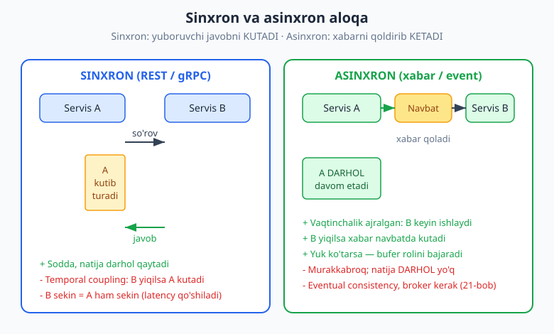
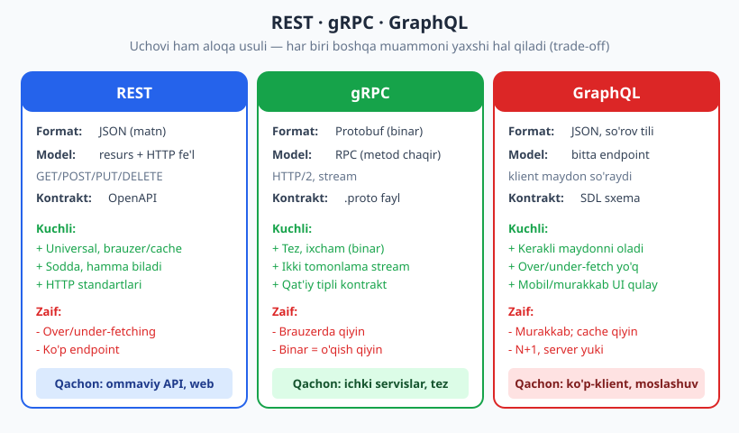
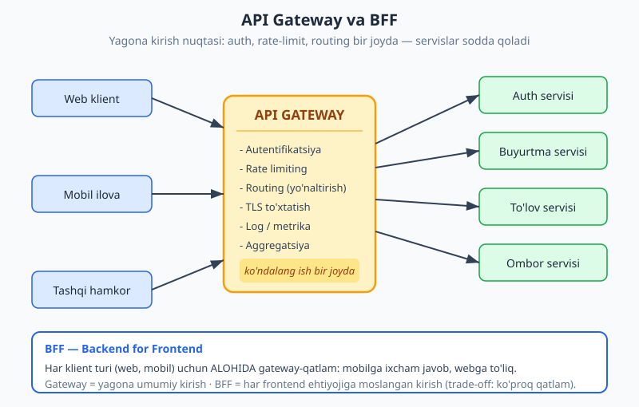

# 17 — Servislararo aloqa va API dizayni

[⬅️ Oldingi: 16 — Monolit, modulli monolit va mikroservislar](./16-monolit-mikroservis.md) · [🏠 README](./README.md) · [Keyingi: 18 — Ma'lumotlar bazasi: SQL vs NoSQL ➡️](./18-malumotlar-bazasi-tanlovi.md)

---

> **Bu bobda:** 16-bobda tizimni bo'laklarga (servislarga) ajratdik. Endi tabiiy savol tug'iladi: bu bo'laklar O'ZARO QANDAY gaplashadi va tashqi dunyoga QANDAY interfeys ko'rsatadi? Aloqaning ikki katta yo'li bor — **sinxron** (so'rov-javob: yuboruvchi javobni kutadi, REST/gRPC) va **asinxron** (xabar/event: yuboruvchi xabarni qoldirib ketadi, navbat orqali — 21-bob). So'ng uchta mashhur sinxron stil — **REST**, **gRPC**, **GraphQL** ni taqqoslaymiz: har biri boshqa muammoni yaxshi hal qiladi. Keyin **API Gateway** va **BFF** (Backend for Frontend) bilan ko'p servisni bitta kirish nuqtasiga jamlaymiz. Yakunda API dizaynining amaliy qoidalari: **versiyalash**, **idempotentlik** (idempotency key), **pagination** (sahifalash), **xato formati** (RFC 7807), **rate limiting** va **kontrakt** (OpenAPI). Idempotentlik va versiyalangan javobni ishlaydigan TypeScript bilan tekshiramiz.
>
> **Trade-off eslatmasi / Halollik:** API dizaynida "to'g'ri javob" yo'q — har qaror ayirboshlash (trade-off). REST sodda va universal, lekin over-fetching keltiradi; gRPC tez, lekin brauzerda qiyin; GraphQL moslashuvchan, lekin cache va server yukini murakkablashtiradi. Sinxron aloqa sodda, lekin **temporal coupling** (vaqtinchalik bog'lanish: B yiqilsa A kutadi) keltiradi; asinxron buni yo'qotadi, lekin **eventual consistency** narxiga. Bu bobdagi TypeScript misollari (`_v_17.ts`, `_v_17b.ts`) `$env:TEMP\arx-probe` da `tsx` bilan ishga tushirilgan va `tsc --strict` bilan tekshirilgan (bob oxirida hisobot). Tizim dizayni qarorlari (qaysi stilni tanlash) — diagramma va trade-off tahlili bilan beriladi, "ishladi" deb emas.

---

## Servislar nega gaplashishi kerak?

Tasavvur qiling, e-commerce backend'ini mikroservislarga ajratdingiz: **Buyurtma**, **To'lov**, **Ombor**, **Bildirishnoma**. Mijoz "Sotib olish" tugmasini bossa, Buyurtma servisi yolg'iz ishni bajara olmaydi — u To'lovdan pul yechishni, Ombordan zaxira kamaytirishni, Bildirishnomadan SMS yuborishni SO'RASHI kerak. Demak servislar tarmoq orqali bir-biriga **so'rov** yuboradi yoki **xabar** uzatadi.

Bu yerda distributed tizimning haqiqati ([22-bob](./22-cap-consistency-replikatsiya.md): tarmoq ishonchsiz) jonlanadi. Ikki servis o'rtasidagi chaqiruv — endi oddiy metod chaqiruvi EMAS, balki tarmoq sayohati: u sekin bo'lishi, yo'qolishi, ikki marta yetib borishi mumkin. Shuning uchun aloqa usulini tanlash — arxitekturaning markaziy qarorlaridan biri.

> **Eslatma:** "API" (Application Programming Interface — ilova dasturlash interfeysi) — bu komponent O'ZINI tashqi dunyoga QANDAY ko'rsatishi. U kontrakt: "menga shu shaklda so'rov yubor, men shu shaklda javob beraman". Yaxshi API — barqaror kontrakt: ichki amalga oshirish o'zgarsa ham, kontrakt o'zgarmaydi. API dizayni — ko'p jihatdan **bog'liqlikni boshqarish** ([04-bob](./04-coupling-cohesion.md)) san'ati: klient API'ning ichki ishlashiga emas, faqat e'lon qilingan shakliga bog'lansin.

Aloqaning eng katta ajralishi — **sinxron** va **asinxron**. Bu ikkisini yaxshi tushunmaslik ko'p arxitektura xatosining ildizi, shuning uchun undan boshlaymiz.

---

## Sinxron va asinxron aloqa

**Sinxron** (so'rov-javob): A servisi B'ga so'rov yuboradi va **javobni kutadi**. Kutish davomida A bloklanadi (yoki hech bo'lmasa shu mantiqiy oqim to'xtaydi). Telefon qo'ng'irog'i kabi: gaplashish uchun ikkalangiz ham AYNI VAQTDA bo'lishingiz kerak. REST va gRPC — sinxron.

**Asinxron** (xabar/event): A servisi xabarni **navbatga** (queue) yoki **broker**ga qoldiradi va darhol o'z ishini davom ettiradi. B xabarni KEYINROQ, o'ziga qulay vaqtda oladi. SMS yoki pochta qutisi kabi: yuborasiz va ketasiz; qabul qiluvchi keyin o'qiydi. Bu — 21-bobning mavzusi (xabar navbatlari, event-driven).



### Temporal coupling — eng muhim farq

Sinxron aloqaning yashirin narxi — **temporal coupling** (vaqtinchalik bog'lanish): A va B AYNI VAQTDA tirik bo'lishi shart. B yiqilgan yoki sekin bo'lsa — A ham yiqiladi yoki sekinlashadi. Latency (kechikish) ham **qo'shiladi**: agar Buyurtma servisi ketma-ket To'lov (100ms), Ombor (80ms), Bildirishnoma (120ms) ni sinxron chaqirsa, umumiy javob kamida 300ms.

```text
Sinxron zanjir (latency qo'shiladi):
  Buyurtma --100ms--> To'lov --80ms--> Ombor --120ms--> Bildirishnoma
  Mijoz kutadi: ~300ms (+ tarmoq narxi). Bittasi yiqilsa — hammasi to'xtaydi.

Asinxron (Buyurtma darhol javob beradi):
  Buyurtma --> [navbat] (xabar qoldi, mijozga "qabul qilindi")
                  |
                  +--> To'lov, Ombor, Bildirishnoma KEYIN, mustaqil ishlaydi
```

Asinxron bu bog'lanishni uzadi: Buyurtma xabarni navbatga qo'yib, mijozga darhol "buyurtmangiz qabul qilindi" deydi. To'lov yoki Bildirishnoma vaqtincha yiqilsa, xabar navbatda **kutadi** va servis qaytganda ishlanadi. Navbat **bufer** rolini ham bajaradi: to'satdan yuk oshsa, xabarlar to'planadi, servislar bardosh berolgan tezlikda ishlaydi.

> **Trade-off:** Asinxron bepul emas. Mijozga "tugadi" deyolmaysiz — faqat "qabul qilindi" deysiz; haqiqiy natija **eventual consistency** (tez orada izchillik, [22-bob](./22-cap-consistency-replikatsiya.md)) bilan keladi. Tizim murakkablashadi: broker (Kafka/RabbitMQ) qo'shiladi, xabar tartibi, takror yetkazib berish (at-least-once) muammolari paydo bo'ladi. Shuning uchun: **darhol javob kerak bo'lsa** (login, balans so'rovi, to'lovni tasdiqlash) — sinxron; **"qil va unut" mumkin bo'lsa** (email, hisobot, analitika, zaxira yangilash) — asinxron.

> **Amaliyotda:** Real tizim IKKALASINI ham ishlatadi. Telegram-bot backend'ida: foydalanuvchi `/balans` so'rasa — sinxron (darhol raqam kerak); foydalanuvchi rasm yuborsa va uni qayta ishlash (rasm tahlili) kerak bo'lsa — asinxron (botga "qabul qildim", natija keyin). e-commerce'da: to'lovni tasdiqlash — sinxron; chek emailini yuborish — asinxron.

> **Diqqat:** "Asinxron har doim yaxshiroq" — XATO. Asinxronni hamma joyga qo'llash distributed tizimni **kuzatib bo'lmaydigan** (debug qilish qiyin) holatga keltiradi: "buyurtma qayerda qoldi?" degan savolga javob topish — bir necha navbat va log orqali izlash. Sinxron oqim o'qishga oson, xatosi darhol ko'rinadi. Murakkablikni faqat HAQIQIY ehtiyoj (masshtab, uzilishga chidamlilik) bo'lsa qo'shing — YAGNI ([06-bob](./06-dry-kiss-yagni.md)).

---

## Sinxron stillar: REST, gRPC, GraphQL

Sinxron aloqani tanlasangiz, uchta keng tarqalgan yondashuv bor. Ularni adashtirmaslik kerak: ular bir-birining "yaxshiroq versiyasi" emas, balki **boshqa muammoni** yaxshi hal qiladigan vositalar.



### REST — resurs va HTTP fe'llari

**REST** (Representational State Transfer) — eng keng tarqalgan stil. Asosiy g'oya: dunyoni **resurslar** (foydalanuvchi, buyurtma, mahsulot) sifatida modellashtirasiz, ularni **URL** bilan nomlaysiz, va ular ustida **HTTP fe'llari** (metodlari) bilan amal qilasiz:

```text
GET    /users          -> ro'yxatni o'qish
GET    /users/42       -> bitta foydalanuvchini o'qish
POST   /users          -> yangi yaratish
PUT    /users/42       -> to'liq yangilash (yoki yaratish)
PATCH  /users/42       -> qisman yangilash
DELETE /users/42       -> o'chirish
```

E'tibor bering: URL'da FE'L yo'q (`/getUser`, `/createUser` emas — bu anti-pattern). Fe'l — HTTP metodida. Resurs URL bilan, amal metod bilan.

REST'ning yana bir tamoyili — **statelessness** (holatsizlik): har so'rov O'ZIDA kerakli ma'lumotni olib keladi; server so'rovlar orasida klient holatini eslab qolmaydi. Bu masshtablashga yordam beradi (har so'rovni istalgan server instansi qayta ishlaydi).

> **Eslatma (HATEOAS va Richardson maturity — qisqa):** REST'ning "to'liq" shakli **HATEOAS** (Hypermedia as the Engine of Application State) deb ataladi: javobda nafaqat ma'lumot, balki "keyin nima qila olasiz" havolalari ham bo'ladi (masalan buyurtma javobida `cancel` havolasi). **Richardson Maturity Model** — REST'ni 0-3 darajaga ajratadi (0: bitta endpoint; 1: resurslar; 2: HTTP fe'l+status; 3: HATEOAS). Amaliyotda ko'p "REST" API'lar 2-darajada to'xtaydi — bu normal va keng qabul qilingan; HATEOAS foydali, lekin majburiy emas. (Bu tasnif Leonard Richardson nomli, Martin Fowler tomonidan ommalashgan — martinfowler.com.)

> **Trade-off (REST):** + Universal: brauzer, `curl`, har til qo'llab-quvvatlaydi; HTTP cache, status kodlari, proxy "bepul" keladi. + Sodda, hamma biladi. - **Over-fetching** (keragidan ko'p ma'lumot: faqat ismni so'raysiz, butun profil keladi) va **under-fetching** (kam: bitta sahifa uchun 5 ta endpoint'ga so'rov). - Resurslar ko'paysa endpoint'lar ko'payadi. REST amaliy misoli: [../php-expert/README.md](../php-expert/README.md) (REST API qurish) va [../nodejs/README.md](../nodejs/README.md).

### gRPC — binar, qat'iy kontrakt, stream

**gRPC** — Google'ning RPC (Remote Procedure Call — masofaviy metod chaqiruvi) freymvorki. Resurs emas, **metod** chaqirasiz (`getUser(id)`, `createOrder(...)`) — xuddi mahalliy funksiya kabi. Ma'lumot **Protobuf** (Protocol Buffers) bilan **binar** ko'rinishda uzatiladi (JSON matni emas), HTTP/2 ustida.

Kontrakt `.proto` faylida qat'iy belgilanadi:

```text
// konseptual .proto (pseudokod — sxema ta'rifi)
service UserService {
  rpc GetUser (GetUserRequest) returns (User);
  rpc StreamUsers (Empty) returns (stream User);   // server stream
}
message User { int32 id = 1; string ism = 2; string email = 3; }
```

Bu `.proto`'dan kod GENERATSIYA qilinadi (klient va server uchun har tilda) — tip xavfsizligi kompilyatsiya vaqtida.

> **Trade-off (gRPC):** + Tez va ixcham (binar JSON'dan kichik), HTTP/2 multiplexing. + **Ikki tomonlama stream** (bidirectional streaming) — REST'da tabiiy emas, gRPC'da oson. + Qat'iy tipli kontrakt, kod generatsiyasi. - Brauzerda to'g'ridan-to'g'ri qiyin (gRPC-Web yoki proxy kerak). - Binar — odam o'qiy olmaydi, debug qilish REST'dan qiyin. **Shuning uchun:** gRPC ko'pincha **ichki servislararo** aloqa uchun (tez, qat'iy), tashqi/ommaviy API uchun REST.

### GraphQL — klient nimani so'rasa, shuni oladi

**GraphQL** — over/under-fetching muammosini hal qiladi. Bitta endpoint (`/graphql`), klient AYNAN qaysi maydonlar kerakligini so'rovda yozadi:

```text
# konseptual GraphQL so'rovi (klient yozadi)
query {
  user(id: 42) {
    ism                 # faqat shu uchta maydon kerak
    buyurtmalar(oxirgi: 3) { id, summa }   # bitta so'rovda bog'liq ma'lumot
  }
}
```

Server faqat so'ralgan maydonlarni qaytaradi. Mobil ilova kam ma'lumot, web ko'p ma'lumot so'raydi — bitta endpoint, har xil shakl. Sxema (SDL — Schema Definition Language) kontrakt rolini bajaradi.

> **Trade-off (GraphQL):** + Over/under-fetching yo'q — klient kerakligini oladi. + Bir so'rovda bir nechta bog'liq resurs (REST'da bir necha so'rov bo'lardi). + Mobil va murakkab UI uchun ideal. - HTTP cache qiyin (hammasi POST `/graphql`). - **N+1 muammosi** (har element uchun alohida DB so'rovi — DataLoader bilan hal qilinadi, lekin qo'shimcha ish). - Server tomoni murakkab; klient og'ir so'rov bilan serverni yuklashi mumkin (so'rov chuqurligini cheklash kerak).

### Qaysi birini qachon? (taqqoslash jadvali)

| Mezon | REST | gRPC | GraphQL |
|---|---|---|---|
| Format | JSON (matn) | Protobuf (binar) | JSON + so'rov tili |
| Model | resurs + HTTP fe'l | metod (RPC) | bitta endpoint, maydon tanlash |
| Tezlik | o'rta | yuqori | o'rta (so'rovga bog'liq) |
| Brauzer | tabiiy | qiyin (proxy kerak) | tabiiy |
| Stream | cheklangan | kuchli (ikki tomonlama) | subscription (cheklangan) |
| Cache | oson (HTTP) | qiyin | qiyin |
| Eng mos | ommaviy/web API | ichki servislar | ko'p-klient, mobil |

> **Amaliyotda:** Ko'p real tizim **aralash** ishlatadi: tashqi/web API uchun REST, ichki yuqori-yuk servislar orasida gRPC, murakkab frontend (mobil + web) uchun GraphQL gateway. "Bitta to'g'ri stil" yo'q — kontekst hal qiladi. Yangi loyihada shubha bo'lsa, REST'dan boshlang (eng universal, eng kam ajablanish) va aniq ehtiyoj paydo bo'lganda boshqasiga o'ting.

---

## API Gateway va BFF

Servislar ko'paygach yangi muammo: klient (web, mobil) HAR servisning manzilini bilishi, har biriga alohida auth qilishi, rate-limit'ni har joyda takrorlash kerakmi? Yo'q. Yechim — **API Gateway**: barcha tashqi so'rovlar uchun **yagona kirish nuqtasi**.



Gateway **ko'ndalang ishlarni** (cross-cutting concerns) bir joyga jamlaydi:

- **Autentifikatsiya/avtorizatsiya** — bir joyda tekshiriladi, servislar sodda qoladi.
- **Rate limiting** — suiiste'molni gatewayda to'xtatasiz, servislargacha yetmaydi.
- **Routing** (yo'naltirish) — `/orders/*` -> Buyurtma servisi, `/payments/*` -> To'lov servisi.
- **TLS to'xtatish**, log/metrika, **aggregatsiya** (bir necha servis javobini birlashtirish).

```text
Gatewaysiz:  har klient -> har servisni biladi, har joyda auth+rate-limit takrorlanadi
Gateway bilan:  klient -> [GATEWAY: auth, rate-limit, routing] -> servislar (sodda)
```

> **Diqqat:** Gateway — kuchli, lekin ehtiyot bo'ling: u **"xudo komponent"** (god object, [04-bob](./04-coupling-cohesion.md)) ga aylanib qolmasin. Gateway'ga biznes-mantiq qo'shsangiz (masalan buyurtma narxini gatewayda hisoblash), u tez orada barcha o'zgarish o'tadigan tor bo'g'iz va yagona nosozlik nuqtasiga (single point of failure) aylanadi. Gateway faqat **ko'ndalang** ishlarni qilsin: auth, routing, limit. Biznes-mantiq — servislarda.

### BFF — Backend for Frontend

Bitta umumiy gateway hamma klientga bir xil javob beradi. Lekin web va mobil ehtiyoji boshqacha: mobilga ixcham javob (kam ma'lumot, kam batareya/trafik), webga to'liq. **BFF** (Backend for Frontend) — har klient turi uchun **alohida** gateway-qatlam:

```text
Web ilova    -> Web BFF    -> servislar (to'liq, boy javob)
Mobil ilova  -> Mobil BFF  -> servislar (ixcham, mobilga moslangan)
```

Har BFF o'z frontend'iga moslangan: maydonlarni birlashtiradi, ortiqchasini olib tashlaydi, mobilga qulay shaklga keltiradi. Frontend jamoasi o'z BFF'ini boshqaradi — tezroq harakat qiladi.

> **Trade-off (BFF):** + Har frontend o'ziga mos backend oladi; umumiy gateway "hamma uchun o'rtacha" kelishuvidan qutuladi; frontend jamoasi mustaqil. - Ko'proq qatlam, ko'proq kod (har BFF alohida); umumiy mantiq takrorlanishi mumkin. BFF — Conway qonuni amalda ([01-bob](./01-arxitektura-nima.md)): jamoa tuzilishi (web jamoasi, mobil jamoasi) arxitekturada aks etadi. Kichik loyihada bitta gateway yetadi; BFF — klientlar va jamoalar soni o'sganda.

---

## API dizayn amaliyotlari

Stil va gateway — katta rasm. Endi kundalik, lekin juda muhim detallar. Bularni e'tiborsiz qoldirish — API'ni keyinroq og'riqli qiladi.

### Versiyalash — kontraktni buzmasdan o'zgartirish

API e'lon qilingach, undan klientlar foydalanadi. Endi javob shaklini o'zgartirsangiz (maydon olib tashlash, nomini o'zgartirish), eski klientlar **buziladi**. Yechim — **versiyalash**:

```text
URL'da:    GET /v1/users/42   va   GET /v2/users/42
Header'da: GET /users/42   +   header: Accept-Version: 2
```

Eng muhim qoida: **additive change** (faqat qo'shimcha o'zgarish) — yangi MAYDON qo'shish odatda buzmaydi (eski klient uni e'tiborsiz qoldiradi); maydon OLIB TASHLASH yoki nomini o'zgartirish — **breaking change**, yangi versiya talab qiladi.

`_v_17.ts` da bir foydalanuvchini ikki versiyada qaytarish builder'i bor. Ishga tushirsak (haqiqiy `tsx` natijasi):

```text
[Versiyalash]
  v1: {"apiVersion":"v1","id":7,"ism":"Ali","familiya":"Valiyev","email":"ali@example.uz"}
  v2: {"apiVersion":"v2","id":7,"toliqIsm":"Ali Valiyev","contact":{"email":"ali@example.uz"}}
```

v1 ism+familiyani alohida beradi (eski klient shunga tayanadi — BUZMAYMIZ), v2 ularni `toliqIsm`ga birlashtirib, kontaktni strukturalaydi. Ikkala versiya YONMA-YON yashaydi — eski klientlar v1'da qoladi, yangilari v2'ga o'tadi.

> **Trade-off (URL vs header versiyalash):** URL (`/v2/...`) — ko'rinadigan, oson test qilinadi (brauzer/`curl`), lekin URL "toza" emas (resurs o'rni versiyaga aralashadi). Header — toza URL, lekin yashirin (brauzerda darrov ko'rinmaydi). Ko'pchilik ommaviy API URL'ni tanlaydi (ravshanlik uchun). Ikkalasi ham to'g'ri — jamoada bittasini tanlab, izchil qo'llang.

### Idempotentlik — ikki marta = bir marta ta'sir

Distributed tizimda tarmoq ishonchsiz ([22-bob](./22-cap-consistency-replikatsiya.md)): so'rov yo'qolishi yoki javob qaytmasligi mumkin. Klient javob olmasa, **qayta urinadi** (retry). Lekin agar so'rov "pul yech" bo'lsa va u aslida birinchi safar yetib borgan bo'lsa — qayta urinish pulni IKKI MARTA yechadimi? Bu — distributed tizimning klassik xavfi.

**Idempotent** operatsiya — uni bir necha marta bajarish, bir marta bajarish bilan BIR XIL natija beradi. HTTP'da `GET`, `PUT`, `DELETE` tabiatan idempotent (`DELETE /users/42` ni 10 marta chaqirsangiz ham natija: 42 yo'q). `POST` esa odatda EMAS (har chaqiruv yangi resurs yaratishi mumkin).

Idempotent bo'lmagan operatsiyani (to'lov) xavfsiz qilish uchun — **idempotency key**: klient har so'rovga noyob kalit (masalan UUID) qo'shadi; server ayni kalitni ko'rsa, qayta bajarmaydi, balki saqlangan natijani qaytaradi.

`_v_17.ts` da bu mantiq bor. Ishga tushirsak (haqiqiy natija):

```text
[Idempotentlik]
  1-chaqiruv: pay_1 takroriy=false
  2-chaqiruv: pay_1 takroriy=true
  3-chaqiruv: pay_1 takroriy=true
  HAQIQATAN yechilgan to'lovlar soni: 1 (3 marta so'ralsa ham 1)
  boshqa key: pay_2 takroriy=false
  endi jami yechilgan: 2
```

Asosiy kod (to'liq fayl probe'da):

```ts
class TolovServisi {
  private kesh = new Map<string, TolovNatijasi>();
  private hisoblagich = 0; // HAQIQATAN bajarilgan to'lovlar (side effect)

  tolovQil(idempotencyKey: string, summa: number): TolovNatijasi {
    const mavjud = this.kesh.get(idempotencyKey);
    if (mavjud) {
      // ayni key allaqachon ishlangan -> saqlangan natija, QAYTA YECHMAYMIZ
      return { ...mavjud, takroriy: true };
    }
    this.hisoblagich += 1;             // faqat birinchi marta side effect
    const natija: TolovNatijasi = { /* ... */ takroriy: false };
    this.kesh.set(idempotencyKey, natija);
    return natija;
  }
}
```

Diqqat: 3 marta so'ralsa ham `bajarilganlarSoni` — `1`. Klient xotirjam qayta urinishi mumkin: takroriy so'rov xavfsiz. Bu — Stripe, Click, Payme kabi to'lov tizimlari ISHLATADIGAN naqsh.

> **Amaliyotda:** Idempotency key'ni klient generatsiya qiladi (UUID) va so'rov sarlavhasida yuboradi: `Idempotency-Key: 7f3e...`. Server uni (natija bilan) ma'lum muddat saqlaydi (masalan 24 soat). To'lov, buyurtma yaratish, pul o'tkazish — idempotency key shart. `_v_17b.ts` da yana bir nozik holat tekshirilgan: ayni key, lekin BOSHQA summa kelsa — bu `409 Conflict` (klient bir key bilan ikki xil amal so'rayapti).

### Pagination — katta ro'yxatni bo'lib berish

`GET /orders` million yozuvni bitta javobda qaytarmaydi — server ham, klient ham bardosh berolmaydi. **Pagination** (sahifalash) bilan bo'lib beriladi. Ikki asosiy usul:

- **Offset/limit:** `?offset=40&limit=20` — sodda, lekin chuqur sahifalarda sekin va yozuv qo'shilsa "siljish" bo'ladi.
- **Cursor (kursor):** `?cursor=abc&limit=20` — keyingi sahifa uchun "belgi" qaytariladi; barqaror va tez (katta ma'lumot uchun afzal).

`_v_17.ts` da kursor-pagination bor. Ishga tushirsak:

```text
[Pagination — kursor]
  sahifa 1: [10, 20] nextCursor=2
  sahifa 2: [30, 40] nextCursor=4
  sahifa 3: [50] nextCursor=null
```

`nextCursor=null` — oxirgi sahifa belgisi. Klient `nextCursor`ni keyingi so'rovda yuboradi, `null` kelguncha davom etadi.

### Xato formati — RFC 7807 (problem+json)

Xato bo'lsa, klient `{"error": "xato"}` kabi tartibsiz javobni MASHINA o'qiy olmaydi. **RFC 7807** (Problem Details) — xatolar uchun standart shakl:

```text
[RFC 7807 xato]
  {"type":"https://api.example.uz/xatolar/topilmadi","title":"topilmadi","status":404,"detail":"id=999 foydalanuvchi mavjud emas","instance":"/v2/users/999"}
```

`type` (xato turi hujjatiga havola), `title` (qisqa nom), `status` (HTTP kod), `detail` (shu holatga oid tafsilot), `instance` (qayerda yuz berdi). Bu standart bo'lgani uchun klientlar xatolarni BIR XIL qayta ishlaydi.

> **Eslatma:** HTTP status kodlaridan to'g'ri foydalaning: `200` (ok), `201` (yaratildi), `400` (yomon so'rov), `401` (autentifikatsiya yo'q), `403` (ruxsat yo'q), `404` (topilmadi), `409` (konflikt — masalan idempotency key band, boshqa summa), `429` (juda ko'p so'rov — rate limit), `500` (server xatosi). Status kodi — birinchi, mashina o'qiydigan signal; RFC 7807 tanasi — tafsilot.

### Rate limiting va kontrakt

**Rate limiting** — bir klient ma'lum vaqtda nechta so'rov yubora olishini cheklash (suiiste'mol va yuk ortishidan himoya). Klassik usul — **token bucket**: har klientga "chelak" token; har so'rov 1 token; tugasa `429 Too Many Requests`. `_v_17b.ts` da soddalashtirilgan token-bucket bor:

```text
[11-mashq: rate limiter (limit=3)]
  so'rov 1: status=200 qolgan=2
  so'rov 2: status=200 qolgan=1
  so'rov 3: status=200 qolgan=0
  so'rov 4: status=429 qolgan=0
  so'rov 5: status=429 qolgan=0
```

**Kontrakt (OpenAPI):** API'ning rasmiy ta'rifi — qaysi endpoint, qanday so'rov/javob shakli. **OpenAPI** (avval Swagger) — REST uchun standart kontrakt formati (YAML/JSON). Foydasi: hujjat avtomatik, klient kodi generatsiya qilinadi, test va validatsiya kontraktga asoslanadi. gRPC'da bu rol — `.proto`, GraphQL'da — SDL sxema.

> **Eslatma (Service discovery — qisqa):** Servislar dinamik ko'tariladi/o'chadi, IP'lari o'zgaradi. **Service discovery** — "Buyurtma servisi hozir qayerda?" degan savolga javob beradigan mexanizm (Consul, Kubernetes DNS, Eureka). Klient qat'iy IP'ni emas, servis NOMINI biladi; discovery joriy manzilni topadi. Bu — gateway va load balancer bilan birga ishlaydigan infratuzilma qatlami.

> **Amaliyotda (umumiy API kontrakt-mehnati):** Yaxshi API — barqaror kontrakt: maydonlarni kamaytirib emas, qo'shib o'zgartiring; izchil nom bering (`createdAt` hamma joyda bir xil, `created_at`/`creationDate` aralashmasin); xatolarni standartlang; har joyda pagination, har xavfli operatsiyada idempotency. Bu detallar API'ni klientlar uchun **bashorat qilinadigan** qiladi — bu eng katta sovg'a.

---

## Mashqlar

### Oson

**1.** Quyidagi aloqalar uchun sinxron yoki asinxronni tanlang va nega: (a) foydalanuvchi `/balans` so'raydi; (b) buyurtmadan keyin chek emailini yuborish; (c) login (parol tekshirish); (d) yuklangan videoni qayta kodlash (transcoding).

**2.** Quyidagi har bir holat uchun REST, gRPC yoki GraphQL'dan birini tanlang: (a) ommaviy ob-havo API, brauzer va `curl` ishlatadi; (b) ikki ichki servis orasida yuqori-yuk, past-latency aloqa; (c) mobil ilova bitta ekran uchun 4 ta bog'liq resursni minimal trafik bilan oladi.

**3.** Quyidagi operatsiyalar idempotentmi (bir necha marta = bir marta ta'sir)? (a) `GET /users/42`; (b) `DELETE /users/42`; (c) `POST /orders` (har chaqiruv yangi buyurtma); (d) idempotency key bilan `POST /payments`.

**4.** Quyidagi URL'larda REST anti-pattern bormi? To'g'rilang: `POST /createUser`, `GET /getUserById?id=42`, `POST /users/42/delete`.

**5.** API Gateway markazlashtiradigan uchta "ko'ndalang ish"ni ayting. Nega bularni har servisda alohida emas, gatewayda qilish yaxshi?

### O'rta

**6.** Sinxron zanjirda Buyurtma servisi To'lov (90ms), Ombor (60ms), Bildirishnoma (150ms) ni KETMA-KET sinxron chaqiradi. (a) Mijoz taxminan qancha kutadi? (b) Bildirishnoma yiqilsa nima bo'ladi? (c) Bildirishnomani asinxron qilsak, (a) va (b) qanday o'zgaradi?

**7.** "Temporal coupling" nima? Sinxron aloqa nega uni keltiradi va asinxron qanday yo'qotadi? Bitta real misol bilan tushuntiring.

**8.** API'ning v1 javobi `{"name": "Ali Valiyev"}`. Endi ism va familiyani ALOHIDA bermoqchisiz. (a) Bu breaking change'mi? (b) Eski klientlarni buzmasdan qanday yo'l tutasiz? (c) Qaysi o'zgarish "additive" bo'lardi va buzmasdi?

**9.** **(KOD)** `_v_17.ts` dagi `TolovServisi`ga shunday xususiyat qo'shing: agar ayni idempotency key bilan, lekin BOSHQA summa kelsa — `409`-ga teng holat (xato) qaytsin. Funksiyani yozing va uch holat bilan ishga tushiring: yangi key, ayni key+ayni summa, ayni key+boshqa summa. (`_v_17b.ts` dagi yondashuvga qarang, lekin o'zingiz yozing.)

**10.** RFC 7807 xato shakli nima uchun `{"error": "topilmadi"}` dan yaxshiroq? Kamida ikkita maydonni ayting va ularning rolini tushuntiring.

### Qiyin

**11.** **(KOD)** Versiyalangan response builder yozing: `Mahsulot` (ichki: `narxTiyin` butun son, tiyinda). `v1` — `{narx: <so'mda>}`; `v2` — `{narx: {qiymat, valyuta:"UZS"}}`. Ikkalasini bitta mahsulotga qo'llab, `tsx` bilan natijani ko'rsating. Nega bu o'zgarish (v1 -> v2) breaking edi va versiyalash nega kerak bo'ldi?

**12.** **(Dizayn)** Telegram-bot backend'i to'lovni qabul qiladi. Foydalanuvchi tarmoq uzilishidan keyin "To'lash" tugmasini IKKI MARTA bosadi. Tizim ikki marta pul yechmasligi uchun qanday loyihalaysiz? (a) Qaysi mexanizm (atama)? (b) Kalitni KIM generatsiya qiladi va qachon? (c) Server ayni kalitni ko'rsa nima qiladi? (d) Bu sinxron yoki asinxron operatsiya — nega? Pseudokod yoki diagramma bilan.

**13.** **(Dizayn)** e-commerce'da yangi mikroservis arxitekturasini loyihalayapsiz: Web ilova, Mobil ilova, va 4 ta servis (Auth, Buyurtma, To'lov, Ombor). (a) Klientlar servislarga QANDAY ulanadi (diagramma yoki pseudokod)? (b) Web va mobilning javob ehtiyoji boshqacha — qaysi naqshni qo'llaysiz? (c) Ichki To'lov<->Ombor aloqasi uchun REST yoki gRPC? (d) "Buyurtma yaratildi -> email yuborish" sinxronmi asinxron? Har tanlovni trade-off bilan asoslang.

**14.** **(Tahlil)** Hamkasbingiz: "GraphQL kelajak, hamma REST'ni tashlab GraphQL'ga o'tishi kerak" deydi. Bu da'voni baholang. GraphQL qaysi holatda REST'dan yaxshi, qaysi holatda yomon? "Bitta to'g'ri stil" g'oyasi nega xato?

<details markdown="1">
<summary>Yechimlar</summary>

### 1-mashq yechimi
(a) **Sinxron** — foydalanuvchiga raqam DARHOL kerak, kutadi. (b) **Asinxron** — email "qil va unut"; mijozni kuttirmaslik kerak, kechiksa ham mayli. (c) **Sinxron** — login natijasi (kirdimi yo'qmi) darhol kerak. (d) **Asinxron** — videoni qayta kodlash sekin (daqiqalar); foydalanuvchiga "yuklandi, qayta ishlanyapti" deb darhol javob, natija keyin. Qoida: **darhol javob kerak** -> sinxron; **"qil va unut" mumkin** -> asinxron.

### 2-mashq yechimi
(a) **REST** — universal, brauzer/`curl` tabiiy, HTTP cache; ommaviy API uchun ideal. (b) **gRPC** — ichki, yuqori-yuk, past-latency: binar va HTTP/2 tez; brauzer muhim emas. (c) **GraphQL** — bitta so'rovda 4 bog'liq resurs, faqat kerakli maydon (minimal trafik); mobil uchun aynan shu muammoni hal qiladi.

### 3-mashq yechimi
(a) **Idempotent** — `GET` o'qish, holatni o'zgartirmaydi. (b) **Idempotent** — `DELETE`'ni necha marta chaqirsang, natija holati bir xil (yo'q). (c) **Idempotent EMAS** — har `POST` yangi buyurtma yaratadi (10 marta = 10 buyurtma). (d) **Idempotent** — idempotency key ayni so'rovni bir marta ishlaydi, qaytalari saqlangan natijani qaytaradi.

### 4-mashq yechimi
Uchovida ham anti-pattern: fe'l URL'da (REST'da fe'l — HTTP metodida). To'g'risi:
- `POST /createUser` -> `POST /users`
- `GET /getUserById?id=42` -> `GET /users/42`
- `POST /users/42/delete` -> `DELETE /users/42`

Resurs URL bilan, amal HTTP metodi bilan ifodalanadi.

### 5-mashq yechimi
Uchta ko'ndalang ish: **autentifikatsiya** (kim?), **rate limiting** (qancha so'rov?), **routing** (qaysi servisga?). (Yana: TLS to'xtatish, log/metrika.) Gatewayda qilish yaxshi, chunki: har servisda takrorlash — kod dublikatsiyasi (DRY buzilishi, [06-bob](./06-dry-kiss-yagni.md)) va xato ehtimoli (bir servisda auth unutilsa — teshik); markazda bitta joyda — izchil, oson o'zgartiriladi, servislar sodda qoladi (faqat biznes-mantiq).

### 6-mashq yechimi
(a) **~300ms** (90+60+150, + tarmoq narxi) — sinxron zanjirda latency QO'SHILADI. (b) Bildirishnoma yiqilsa — butun zanjir yiqiladi, mijoz xato oladi yoki kutadi (temporal coupling). (c) Bildirishnomani asinxron qilsak: (a) endi mijoz ~150ms kutadi (90+60), Bildirishnoma keyin navbatdan ishlanadi; (b) Bildirishnoma yiqilsa — xabar navbatda kutadi, buyurtma MUVAFFAQIYATLI bo'ladi, email keyin yuboriladi. Saboq: muhim bo'lmagan, sekin qadamni asinxron qilish ham latency'ni, ham mo'rtlikni yaxshilaydi.

### 7-mashq yechimi
**Temporal coupling** (vaqtinchalik bog'lanish) — ikki komponent AYNI VAQTDA tirik/tayyor bo'lishi shartligini bildiradi. Sinxron aloqa uni keltiradi: A B'dan javob KUTADI, demak B ayni damda ishlayotgan bo'lishi kerak; B yiqilsa yoki sekin bo'lsa, A ham. Asinxron yo'qotadi: A xabarni navbatga qoldiradi va ketadi; B keyin, o'ziga qulay vaqtda oladi — ikkalasi bir vaqtda tirik bo'lishi shart emas. Misol: buyurtmada email yuborish sinxron bo'lsa, email-server yiqilganda buyurtma ham yiqiladi; asinxron bo'lsa — buyurtma o'tadi, email navbatda kutadi.

### 8-mashq yechimi
(a) **Ha, breaking change** — `name` maydonini olib tashlab `ism`/`familiya`ga almashtirsangiz, eski klient `name`ni topa olmaydi. (b) **Versiyalash:** v1 `name`ni saqlaydi (eski klient uchun), v2 `ism`/`familiya` beradi; ikkalasi yonma-yon yashaydi. Yoki vaqtincha IKKALA shaklni ham qaytarish (`name` + `ism`+`familiya`), keyin eski klientlar ko'chgach `name`ni olib tashlash (deprecation). (c) **Additive:** mavjud `name`ni qoldirib, YANGI `ism`/`familiya` maydonlarini QO'SHISH — eski klient yangilarini e'tiborsiz qoldiradi, buzilmaydi.

### 9-mashq yechimi
Ishga tushirildi (`_v_17b.ts`, haqiqiy natija):

```text
[7-mashq: idempotency + summa tekshiruvi]
   {"ok":true,"tolovId":"pay_1","takroriy":false}
   {"ok":true,"tolovId":"pay_1","takroriy":true}
   {"ok":false,"status":409,"xato":"key band, lekin summa mos emas"}
```

```ts
type Javob =
  | { ok: true; tolovId: string; takroriy: boolean }
  | { ok: false; status: number; xato: string };

tolovQil(key: string, summa: number): Javob {
  const mavjud = this.kesh.get(key);
  if (mavjud) {
    if (mavjud.summa !== summa) {
      return { ok: false, status: 409, xato: "key band, lekin summa mos emas" };
    }
    return { ok: true, tolovId: mavjud.tolovId, takroriy: true };
  }
  // ... birinchi marta: yangi to'lov, keshga saqlash
}
```

Nega 409: ayni idempotency key — "bu AYNAN o'sha so'rov" degani. Agar summa boshqa bo'lsa, klient bir key bilan ikki XIL amalni so'rayapti — bu mantiqiy xato, takror emas. Server uni rad etishi kerak (yashirin ravishda birinchi summani qaytarmasligi muhim).

### 10-mashq yechimi
RFC 7807 yaxshiroq, chunki u **standart** — barcha klientlar bir xil maydonlarni kutadi va bir xil qayta ishlaydi. Maydonlar: **`status`** (HTTP kod, mashina darhol qarorga keladi: 4xx — klient aybi, 5xx — server); **`title`** (barqaror, qisqa xato nomi — klient `switch`/lokalizatsiya uchun ishlatadi); **`detail`** (shu holatga oid o'qiladigan tafsilot); **`type`** (xato hujjatiga havola); **`instance`** (qayerda). `{"error": "topilmadi"}` — strukturasiz: mashina `error`dan turini ham, statusini ham, kontekstni ham ajrata olmaydi.

### 11-mashq yechimi
Ishga tushirildi (`_v_17b.ts`, haqiqiy natija):

```text
[10-mashq: versiyalangan builder]
  v1: {"id":5,"nom":"Telefon","narx":2500000}
  v2: {"id":5,"nom":"Telefon","narx":{"qiymat":2500000,"valyuta":"UZS"}}
```

```ts
const builder = {
  v1: (m: Mahsulot): MahsulotV1 => ({ id: m.id, nom: m.nom, narx: m.narxTiyin / 100 }),
  v2: (m: Mahsulot): MahsulotV2 => ({
    id: m.id, nom: m.nom,
    narx: { qiymat: m.narxTiyin / 100, valyuta: "UZS" },
  }),
};
```

Nega breaking: v1'da `narx` — RAQAM (`2500000`), v2'da OBYEKT (`{qiymat, valyuta}`). Eski klient `response.narx`ni raqam deb ishlatadi (masalan `narx * 1.12`) — obyekt kelsa, kod yiqiladi yoki `NaN` chiqadi. Maydonning TIPINI o'zgartirish — breaking. Shuning uchun v2 alohida versiyada; eski klientlar v1'da tinch qoladi.

### 12-mashq yechimi
**Namunaviy yechim:**
(a) **Idempotency key** (idempotentlik kaliti). (b) Kalitni **klient** (bot/frontend) generatsiya qiladi — foydalanuvchi tugmani bosish OLDIDA bitta noyob UUID yaratadi; ikkala bosishda ham AYNI kalit yuboriladi (tugma sessiyasiga bog'langan). (c) Server ayni kalitni ko'rsa, qayta YECHMAYDI — saqlangan natijani qaytaradi (`takroriy=true`). (d) **Sinxron** — to'lov natijasi (muvaffaqiyatlimi?) foydalanuvchiga darhol kerak, kutadi.

```text
[Foydalanuvchi tugma bosadi] --> key = UUID (bir marta yaratiladi)
  1-bosish: POST /payments  {key, summa}  --> server: yangi -> pul yech -> saqla -> "ok"
  2-bosish: POST /payments  {key, summa}  --> server: key bor! -> saqlangan "ok" (yechmaydi)
Natija: 2 bosish, 1 marta pul yechiladi.
```

Trade-off: server kalitni ma'lum muddat saqlashi kerak (xotira/DB); kalit yashash muddati (TTL) tugagach takror "yangi" sanaladi — TTL'ni retry oynasidan uzunroq qo'ying (masalan 24 soat).

### 13-mashq yechimi
**Namunaviy yechim:**
(a) Klientlar to'g'ridan-to'g'ri servislarga emas, **API Gateway** orqali ulanadi:

```text
Web ilova    --> [Web BFF]   --\
                                 [GATEWAY: auth, rate-limit, routing] --> Auth/Buyurtma/To'lov/Ombor
Mobil ilova  --> [Mobil BFF] --/
```

(b) Web va mobil ehtiyoji boshqacha -> **BFF** (Backend for Frontend): web BFF to'liq javob, mobil BFF ixcham. (c) Ichki To'lov<->Ombor: **gRPC** — ichki, tez, qat'iy kontrakt; brauzer aralashmaydi (yoki shubha bo'lsa, REST'dan boshlash ham to'g'ri — kontekstga qarang). (d) "Buyurtma yaratildi -> email" — **asinxron**: email "qil va unut", mijozni kuttirmaslik, email-server yiqilsa buyurtma o'tishi kerak.

**Trade-off izohi:** Gateway+BFF qatlam qo'shadi (ko'proq kod), lekin auth/limit'ni markazlashtiradi va har klientga moslangan javob beradi. gRPC ichkarida tezlik beradi, debug'ni biroz qiyinlashtiradi. Asinxron email mo'rtlikni kamaytiradi, lekin broker (21-bob) qo'shadi va eventual consistency keltiradi. **Muqobil:** kichik boshlanish uchun bitta gateway (BFF'siz) va hamma yerda REST — sodda; BFF/gRPC'ni masshtab va jamoalar o'sganda kiritish (YAGNI, [06-bob](./06-dry-kiss-yagni.md)).

### 14-mashq yechimi
**Da'vo HADDAN TASHQARI** ("hamma o'tishi kerak"). GraphQL — vosita, "kelajak" emas. **Yaxshi:** ko'p-klient (web+mobil+IoT) har xil ma'lumot shaklini so'rasa; bitta ekran uchun ko'p bog'liq resurs kerak (over/under-fetching og'riq); tez o'zgaradigan frontend ehtiyojlari. **Yomon:** sodda CRUD API (REST yetadi, GraphQL ortiqcha murakkablik); HTTP cache muhim bo'lsa (GraphQL'da qiyin); server-tomon yuk va N+1 muammosini boshqarishga resurs yo'q; ommaviy, oddiy integratsiya kerak (REST universal). "Bitta to'g'ri stil" g'oyasi xato, chunki har stil BOSHQA trade-off'lar to'plami — REST soddalik va universallik, gRPC tezlik, GraphQL moslashuvchanlik beradi. Tanlov **muammoga** bog'liq, modaga emas. Ko'p real tizim aralash ishlatadi.

</details>

---

## Xulosa

Servislararo aloqa — distributed arxitekturaning yuragi. Asosiy qarorlar va saboqlar:

- **Sinxron vs asinxron** — eng katta ajralish. Sinxron (REST/gRPC) sodda, natija darhol, lekin **temporal coupling** va latency qo'shiladi. Asinxron (xabar/event, [21-bob](./21-message-queue-async.md)) bog'lanishni uzadi, mo'rtlikni kamaytiradi, lekin **eventual consistency** va broker narxiga. **Darhol javob -> sinxron; qil-va-unut -> asinxron.**
- **REST / gRPC / GraphQL** — bir-birining "yaxshirog'i" emas, boshqa muammoni hal qiladi. REST: universal, web/ommaviy. gRPC: tez, ichki servislar. GraphQL: moslashuvchan, ko'p-klient. Shubhada REST'dan boshlang.
- **API Gateway** — yagona kirish, ko'ndalang ishlarni (auth, rate-limit, routing) markazlashtiradi; "xudo komponent"ga aylanmasin. **BFF** — har klient turiga moslangan kirish.
- **Amaliyotlar:** versiyalash (additive o'zgarish buzmaydi; tip/maydon o'zgartirish — breaking), **idempotentlik** (idempotency key — to'lovda shart), pagination (kursor afzal), RFC 7807 xato, rate limiting, OpenAPI kontrakt.

Eng muhim saboq — **API dizaynida "to'g'ri javob" yo'q, faqat trade-off bor**. Har stil, har naqsh nimanidir nimaga almashtiradi. Vazifa — kontekstni (klientlar, yuk, jamoa, mo'rtlik talabi) o'qib, ongli tanlov qilish.

Keyingi bobda aloqadan **ma'lumotning o'ziga** o'tamiz: servislar saqlaydigan ma'lumot qayerda va qanday yashaydi — SQL vs NoSQL, modellashtirish va ma'lumot bazasini tanlash trade-off'lari.

---

> **Kod-verifikatsiya hisoboti.** Bu bobdagi barcha TypeScript misollari `$env:TEMP\arx-probe` muhitida tekshirildi:
> - `_v_17.ts` (idempotent to'lov + idempotency key, versiyalangan v1/v2 response, RFC 7807 xato, kursor-pagination) — `npx tsx _v_17.ts` muvaffaqiyatli ishladi; `npx tsc --noEmit --strict _v_17.ts` toza (0 xato). Matndagi "Idempotentlik", "Versiyalash", "RFC 7807 xato", "Pagination" natijalari shu ishdan olingan.
> - `_v_17b.ts` (mashq yechimlari: idempotency+summa konflikti -> 409, DELETE idempotentligi, versiyalangan builder, token-bucket rate limiter) — `npx tsx` muvaffaqiyatli; `tsc --strict` toza. 9, 11-mashq va rate-limit natijalari haqiqiy.
> - Muhit: TypeScript 6.0.3, tsx 4.22, Node v24. Konseptual qismlar (`.proto`/GraphQL so'rov, gateway/BFF diagrammalari, dizayn mashqlari) "konseptual/pseudokod" deb belgilangan — ular ishlaydigan kod sifatida emas, sxema/diagramma sifatida berilgan.

---

[⬅️ Oldingi: 16 — Monolit, modulli monolit va mikroservislar](./16-monolit-mikroservis.md) · [🏠 README](./README.md) · [Keyingi: 18 — Ma'lumotlar bazasi: SQL vs NoSQL ➡️](./18-malumotlar-bazasi-tanlovi.md)
