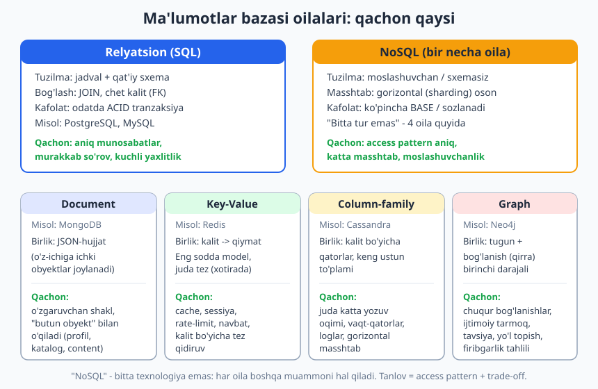
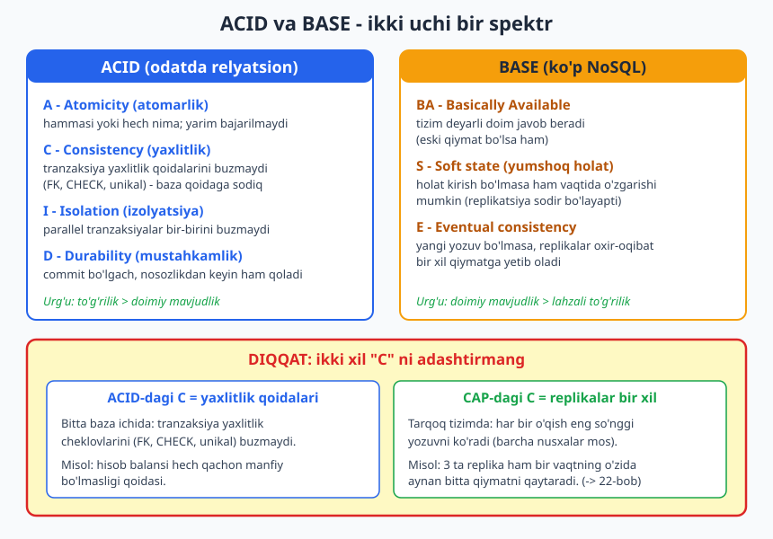
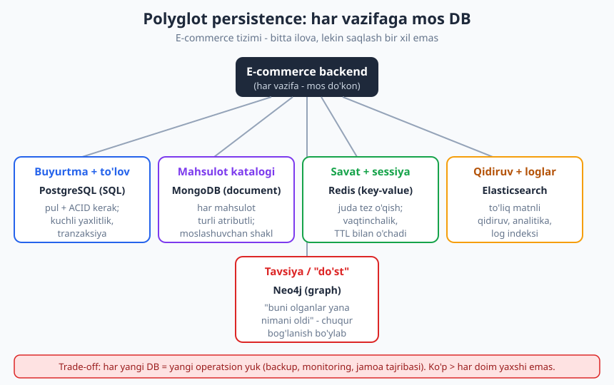

# 18 — Ma'lumotlar bazasi: SQL vs NoSQL, modellashtirish

[⬅️ Oldingi: 17 — Servislararo aloqa va API dizayni](./17-api-dizayni-aloqa.md) · [🏠 README](./README.md) · [Keyingi: 19 — Masshtablash va load balancing ➡️](./19-masshtablash-load-balancing.md)

---

> **Bu bobda:** tizimingiz uchun **ma'lumotni qayerda va qanday saqlash** kerakligini qaror qilishni o'rganamiz. Relyatsion (SQL) bazalarning kuchli tomonlari (yaxlitlik, murakkab so'rov, yetuklik) va NoSQL oilalari — **document** (MongoDB), **key-value** (Redis), **column-family** (Cassandra), **graph** (Neo4j) — har biri qaysi muammoni hal qilishini ko'rib chiqamiz. Eng muhim konseptual chigallikni — **ACID** va **BASE** farqini, ayniqsa **ACID'dagi C** (yaxlitlik qoidalari) **CAP'dagi C** (replikalar bir xil) **emas** ekanligini — aniqlashtiramiz. So'ng modellashtirishning ikki uslubini (normalizatsiya vs denormalizatsiya, "access pattern bo'yicha modellashtirish"), **polyglot persistence** va mikroservislardagi **database-per-service** g'oyasini o'rganamiz.
>
> **Trade-off eslatmasi / Halollik:** bu bob **konseptual va trade-off** haqida — bu yerda "to'g'ri javob" yo'q, faqat kontekstga bog'liq tanlov bor. "SQL eskirgan", "NoSQL tezroq", "mikroservisda har doim NoSQL" kabi mutlaq da'volar — **noto'g'ri**; har birining narxi va foydasi bor. Bobdagi kichik kod-misollar (TypeScript) modellashtirish g'oyasini ko'rsatish uchun **haqiqatan ishga tushirilib tekshirilgan** (natijalar matnda); DB tanlovi qarorlari esa "ishlab ko'rib bo'lmaydigan" dizayn qarorlari — ularni **trade-off tahlili** sifatida beramiz, "bu eng yaxshisi" demaymiz. Tarqoq (distributed) ma'lumot bo'yicha da'volar Martin Kleppmann, *Designing Data-Intensive Applications* (DDIA) bilan moslangan.

---

## Nega bu qaror shunchalik muhim?

Arxitekturada ko'p qarorni keyin o'zgartirish mumkin: framework, til, hatto qatlamlar tuzilishi. Lekin **ma'lumotlar bazasi tanlovi** — eng qiyin qaytariladigan qarorlardan biri. Sababi oddiy: kod vaqtinchalik, **ma'lumot esa abadiy**. Servisni qayta yozish mumkin, lekin yillar davomida to'plangan millionlab yozuvni boshqa modelga ko'chirish — og'riqli, xavfli va qimmat migratsiya.

Shuning uchun bu bobda biz "qaysi DB eng yaxshi?" degan noto'g'ri savoldan voz kechamiz. To'g'ri savol — **"shu ma'lumot, shu so'rovlar, shu masshtab va shu yaxlitlik talabi uchun qaysi model mos?"**.

> **Eslatma:** "SQL vs NoSQL" — biroz chalg'ituvchi qarama-qarshilik. **SQL** — bu so'rov tili; **NoSQL** esa "faqat-SQL-emas" degan keng soyabon atama bo'lib, **ichida bir nechta butunlay boshqa model** bor. Document-bazani key-value bilan solishtirish — olma va apelsinni solishtirishdek. Shuning uchun "NoSQL tez" degan gap mantiqsiz: qaysi NoSQL, qaysi vazifa uchun?

---

## 1-qism. Relyatsion (SQL) bazalar

Relyatsion model 1970-yilda E. F. Codd tomonidan taklif qilingan va shu kungacha eng keng tarqalgan saqlash modeli bo'lib qolmoqda. Asosiy g'oya: ma'lumot **jadvallar** (relation'lar) ko'rinishida, har jadval — qatorlar (yozuvlar) va ustunlar (atributlar) to'plami.

Uchta tayanch tushuncha:

- **Sxema (schema):** jadval tuzilishi **oldindan** belgilanadi — qaysi ustun, qaysi tur, qaysi cheklov (constraint). Ma'lumot kirishdan oldin "shaklga" mos kelishi shart (*schema-on-write*).
- **JOIN:** ma'lumot bir necha jadvalga bo'linadi (foydalanuvchilar, buyurtmalar, mahsulotlar — alohida), so'rov paytida ular **chet kalit** (foreign key) orqali birlashtiriladi. Bu — relyatsion modelning yuragi.
- **Tranzaksiya:** bir nechta o'zgarishni bitta "hammasi yoki hech nima" birligiga jamlash. Bu odatda **ACID** kafolatlari bilan keladi (pastda batafsil).

```sql
-- Relyatsion: ma'lumot bo'linadi, JOIN bilan birlashtiriladi
SELECT u.name, o.id, o.total
FROM users AS u
JOIN orders AS o ON o.user_id = u.id
WHERE u.city = 'Toshkent';
```

### SQL kuchli tomonlari

1. **Kuchli yaxlitlik (consistency).** Cheklovlar (FK, UNIQUE, CHECK) ma'lumotni "buzilishdan" baza darajasida himoya qiladi. Kod xato qilsa ham, baza qoidani o'tkazmaydi.
2. **Murakkab, oldindan ko'zlanmagan so'rov.** SQL — kuchli, deklarativ til. Bugun "shaharlar bo'yicha o'rtacha buyurtma", ertaga butunlay boshqa kesim — modelni o'zgartirmasdan so'raysiz. Bu **moslashuvchanlik o'qish tomonida**.
3. **Yetuklik (maturity).** O'nlab yillik optimizatsiya, ishonchli tranzaksiya, boy asboblar, katta jamoa bilimi. "Zerikarli texnologiya" — ko'pincha eng aqlli tanlov.

> **Amaliyotda:** ko'pchilik loyiha uchun **standart, yaxshi tanlov — relyatsion baza** (PostgreSQL yoki MySQL). NoSQL'ga o'tish — odatda aniq bir muammoni (masshtab, shakl, maxsus access pattern) hal qilish uchun **ongli qaror** bo'lishi kerak, "moda" yoki "yangi-shu uchun yaxshi" emas. SQL bo'yicha chuqurroq: [`../sql/README.md`](../sql/README.md), DB modellashtirish bo'yicha alohida kitob: [`../db-dizayni/README.md`](../db-dizayni/README.md).

---

## 2-qism. NoSQL oilalari — har biri qachon

"NoSQL" bitta narsa emas. Eng kamida **to'rt oila** bor va ularning ehtiyojlari butunlay boshqacha.



### Document (hujjatli) — masalan MongoDB

Ma'lumot **hujjat** (odatda JSON/BSON) sifatida saqlanadi. Bir-biriga aloqador narsalar **bitta hujjatga joylanadi** (embedded), JOIN o'rniga.

- **Kuchli tomoni:** moslashuvchan shakl (har hujjat boshqacha bo'lishi mumkin), "butun obyekt" bilan o'qish/yozish (profil, content, katalog).
- **Qachon:** ma'lumot tabiatan iyerarxik/o'zgaruvchan; ko'pincha "bitta obyektni butunligicha" o'qiysiz.

### Key-value (kalit-qiymat) — masalan Redis

Eng sodda model: **kalit -> qiymat**. Baza qiymat ichini "tushunmaydi" — faqat saqlaydi va kalit bo'yicha qaytaradi. Ko'pincha xotirada ishlaydi, juda tez.

- **Kuchli tomoni:** tezlik, soddalik.
- **Qachon:** cache (kesh), sessiya, rate-limiting (so'rov chegarasi), navbat, leaderboard — kalit bo'yicha tez kirish.

### Column-family (ustun-oilali) — masalan Cassandra

Kalit bo'yicha taqsimlangan, **keng ustunli** qatorlar. Gorizontal masshtablash uchun loyihalangan — ko'p tugunga oson tarqaladi, juda katta yozuv oqimini ko'taradi.

- **Kuchli tomoni:** ulkan masshtab, yuqori yozuv tezligi, gorizontal kengayish.
- **Qachon:** vaqt-qatorlar (metrikalar), loglar, IoT, juda katta yozuv hajmi.

### Graph (graf) — masalan Neo4j

**Tugun** (entity) va **bog'lanish** (qirra) — birinchi darajali fuqarolar. Bog'lanishlar bo'ylab yurish (traversal) tabiiy va tez.

- **Kuchli tomoni:** chuqur, ko'p qatlamli bog'lanishlarni samarali so'rash.
- **Qachon:** ijtimoiy tarmoq ("do'stning do'sti"), tavsiya tizimi, yo'l topish, firibgarlik (fraud) tahlili.

> **Diqqat — keng tarqalgan xato:** "NoSQL sxemasiz, demak modellashtirish kerak emas". Aksincha — NoSQL'da modellashtirish **muhimroq** va **qiyinroq**, chunki baza sizni xatodan himoya qilmaydi. Sxema yo'qoladi degani emas — u **kod ichiga ko'chadi** (*schema-on-read*). Modellashtirish yo'qolmaydi, faqat mas'uliyat sizga o'tadi.

---

## 3-qism. ACID vs BASE — va ikki "C" chalkashligi

Bu — bobning eng muhim konseptual bo'limi. Ikki saqlash falsafasi bor.

**ACID** (odatda relyatsion bazalar) — to'rt kafolat:

- **A — Atomicity (atomarlik):** tranzaksiya "hammasi yoki hech nima". Yarim bajarilmaydi. Pul A'dan yechilib, B'ga qo'shilmasa — ikkalasi ham bekor.
- **C — Consistency (yaxlitlik):** tranzaksiya bazani bir **yaroqli holatdan** boshqasiga o'tkazadi, **yaxlitlik qoidalarini** (FK, UNIQUE, CHECK) buzmasdan.
- **I — Isolation (izolyatsiya):** parallel tranzaksiyalar bir-birini sezmaydi — natija ketma-ket bajarilgandek bo'ladi.
- **D — Durability (mustahkamlik):** commit bo'lgach, ma'lumot nosozlik (masalan, elektr o'chishi) dan keyin ham saqlanadi.

**BASE** (ko'p NoSQL) — boshqa muvozanat:

- **BA — Basically Available:** tizim deyarli doim **javob beradi** (eski qiymat bo'lsa ham, xato emas).
- **S — Soft state:** holat tashqi kirish bo'lmasa ham vaqt o'tib o'zgarishi mumkin (replikatsiya jarayoni davom etayotgani uchun).
- **E — Eventual consistency:** yangi yozuv bo'lmasa, barcha nusxalar **oxir-oqibat** bir xil qiymatga **yetib oladi**.



### Eng muhim aniqlashtirish: ACID-C ≠ CAP-C

Bu — eng ko'p adashtiriladigan joy, hatto tajribali muhandislar ham. **Ikki butunlay boshqa narsa bir xil harf bilan ataladi:**

- **ACID'dagi C (Consistency)** — **yaxlitlik qoidalari**. Bitta baza ichida tranzaksiya cheklovlarni (FK, CHECK, balans manfiy bo'lmasligi) **buzmaydi**. Bu — ma'lumotning **mantiqiy to'g'riligi** haqida.
- **CAP'dagi C (Consistency)** — **replikalar bir xil**. Tarqoq tizimda har o'qish **eng so'nggi yozuvni** ko'radi; barcha nusxalar bir vaqtning o'zida bitta qiymatni qaytaradi. Bu — ma'lumotning **nusxalar bo'yicha mosligini** haqida (texnik nomi: *linearizability*).

Boshqacha aytganda: ACID-C "qoida buzilmadimi?" deb so'raydi; CAP-C "uchchala serverning javobi bir xilmi?" deb so'raydi. Bular mustaqil tushunchalar. Bitta serverdagi relyatsion baza ACID-C ni beradi, lekin u haqida CAP-C "replikalar" so'rog'i umuman ma'noga ega emas (replika yo'q). DDIA ham bu chalkashlikni alohida ta'kidlaydi: "consistency" so'zi haddan ortiq yuklangan atama (overloaded).

> **Eslatma:** CAP teoremasining o'zi (Eric Brewer) — bu bobning mavzusi emas; uni **22-bobda** chuqur ko'ramiz. Hozir faqat bitta narsani eslab qoling: **ikki "C" — ikki boshqa narsa**. Birovni "ACID consistency bor, demak CAP consistency ham bor" deganini eshitsangiz — bu xato. Eslatib o'tamiz: tarqoq tizimda partitsiya muqarrar, shuning uchun "C vs A" tanlovi partitsiya **paytida** yuzaga keladi — bu ham 22-bobda.

### Eventual consistency intuitsiyasi (tekshirilgan)

BASE'ning "yetib oladi" g'oyasini kichik simulyatsiya bilan ko'rsatamiz. Primary'ga yozamiz; follower (replika) hali eski qiymatni ko'rsatadi; keyin replikatsiya yetib oladi:

```ts
class Replica {
  private value = 0;
  read(): number { return this.value; }
  apply(v: number): void { this.value = v; }
}

const primary = new Replica();
const follower = new Replica();

primary.apply(42);                 // primary'ga yozdik
console.log(primary.read());       // 42
console.log(follower.read());      // 0  <- vaqtincha MOS KELMAYDI (kechikish)

follower.apply(primary.read());    // replikatsiya yetib oladi
console.log(follower.read());      // 42 <- endi mos
```

Ishga tushirsak (haqiqatan olingan natija):

```text
Yozishdan SO'NG darhol:
  primary  = 42
  follower = 0
Replikatsiya yetib olgach:
  follower = 42
```

Ana shu "yozdim, lekin boshqa replika hali eskisini ko'rsatadi" oynasi — eventual consistency'ning mohiyati. Foydalanuvchi izohini yozib, sahifani yangilaganda ba'zan u yo'qdek ko'rinishi — aynan shu. Bu **xato emas**, balki **ongli trade-off**: mavjudlik va tezlik uchun lahzali moslikdan vaqtincha voz kechish.

> **Trade-off:** ACID — to'g'rilikka urg'u (pul, buyurtma, inventar). BASE — mavjudlik va masshtabga urg'u (feed, like soni, "ko'rishlar"). Mutlaq "ACID yaxshi" yoki "BASE zamonaviy" — noto'g'ri. Bank balansini eventual consistency bilan saqlamang; "necha kishi ko'rdi" hisoblagichini esa qattiq tranzaksiya bilan saqlash isrof. Muhimi: ma'lumotning **har bo'lagi** uchun alohida qaror.

---

## 4-qism. Modellashtirish — ikki dunyo

Saqlash modeli tanlovi tugaydi; endi **ma'lumotni qanday tuzish** kerak? Bu yerda SQL va NoSQL falsafasi tubdan ajraladi.

### Relyatsion uslub: normalizatsiya

**Normalizatsiya** — ma'lumotni **takrorlanmaslik** uchun bo'lib tashlash: har fakt faqat **bir joyda** saqlanadi. Foydalanuvchi nomi — `users` jadvalida; buyurtma faqat `user_id` ga ishora qiladi. Nom o'zgarsa — bitta joyda o'zgartirasiz, hamma joyda yangilanadi.

- **Foyda:** yozish oson va xavfsiz (bitta nuqta), takror yo'q, ma'lumot ziddiyatga tushmaydi.
- **Narx:** o'qishda **JOIN** kerak — bir necha jadvalni birlashtirish. Ko'p JOIN — sekinroq o'qish.

### NoSQL uslub: denormalizatsiya va "access pattern bo'yicha modellashtirish"

NoSQL'da (ayniqsa document/column-family) tartib **teskari**:

1. **Avval so'rovlaringizni (access pattern) bilib oling:** ilovam ma'lumotni qanday o'qiydi? Eng tez-tez qaysi so'rov?
2. **Keyin modelni shu so'rovga moslab tuzing** — ko'pincha **denormalizatsiya** bilan: o'qishda kerak bo'ladigan narsani **oldindan birga saqlash** (nusxalash), toki o'qish bitta operatsiya bo'lsin, JOIN bo'lmasin.

Misol — "foydalanuvchi profil sahifasi" so'rovi: profil + oxirgi 3 buyurtma. Document modelda ularni bitta hujjatda saqlaymiz, shunda sahifa **bitta o'qish** bilan tayyor:

```ts
interface OrderSummary { id: string; total: number; status: string; }
interface UserProfileDoc {
  userId: string;
  name: string;
  city: string;
  recentOrders: OrderSummary[];  // DENORMALIZATSIYA: nusxalangan
}

const profiles = new Map<string, UserProfileDoc>();
profiles.set("u1", {
  userId: "u1", name: "Oqil", city: "Toshkent",
  recentOrders: [
    { id: "o9", total: 120000, status: "yetkazildi" },
    { id: "o8", total: 45000,  status: "yo'lda" },
  ],
});

// "Profil sahifasi" access pattern: JOIN yo'q, bitta kalit-o'qish
function getProfilePage(userId: string) { return profiles.get(userId); }
```

Ishga tushirsak (haqiqatan olingan natija):

```text
Ism: Oqil
Oxirgi buyurtmalar soni: 3
Birinchi buyurtma jami: 120000
```

> **Diqqat:** denormalizatsiyaning **narxi** — yangilanish. Foydalanuvchi nomi `recentOrders` ichida ham nusxalangan bo'lsa, nom o'zgarganda **bir nechta joyni** yangilashga to'g'ri keladi (yoki "buyurtma paytidagi nom" deb ataylab eski qoldiriladi). Ya'ni denormalizatsiya **o'qishni tezlashtiradi, yozishni qiyinlashtiradi**. Bu — sof trade-off, "yaxshi/yomon" emas.

### Asosiy farqni eslab qoling

| | Relyatsion (normalizatsiya) | NoSQL (denormalizatsiya) |
|---|---|---|
| Tartib | model -> keyin so'rov | so'rov -> keyin model |
| Optimizatsiya | yozish (bitta nuqta) | o'qish (oldindan birga) |
| Takror | yo'q | ataylab bor |
| O'qish | JOIN bilan birlashtiriladi | bitta o'qish, JOIN yo'q |
| Yangilash | oson (bir joy) | qiyin (ko'p nusxa) |

> **Trade-off:** "denormalizatsiya har doim tezroq" — xato. U **o'qish-og'ir** (read-heavy) va so'rovlar **oldindan ma'lum** bo'lganda foydali. So'rovlar **oldindan noma'lum** yoki **yozish-og'ir** bo'lsa — normalizatsiya + SQL ko'pincha to'g'ri. DDIA ham buni shunday qo'yadi: relyatsion model "oldindan ko'zlanmagan so'rovlar"ga, document model "ma'lum, qat'iy access pattern"ga yaxshi mos.

### Indeks — bir og'iz so'z

Ikkala dunyoda ham **indeks** — ma'lum so'rovni tezlashtiradigan yordamchi tuzilma. Tasavvur qiling: kitobning orqasidagi alifboli ko'rsatkich. Har sahifani varaqlamasdan, kerakli so'zni tez topasiz. Ko'pchilik baza **B-tree** (balansli daraxt) indeksidan foydalanadi — bu logarifmik qidiruvni beradi. Lekin indeks bepul emas: u **o'qishni tezlashtiradi, yozishni sekinlashtiradi** (har yozuvda indeks ham yangilanadi) va joy egallaydi. Indekslar bu kitob mavzusi emas — chuqur tushuntirish SQL kitobida: [`../sql/README.md`](../sql/README.md).

---

## 5-qism. Polyglot persistence

Yuqoridagi hammasi bitta xulosaga olib keladi: **bitta tizimda bitta baza shart emas**. Har **vazifa** uchun unga eng mos modelni tanlash mumkin — bu **polyglot persistence** (ko'p tilli saqlash; atamani Martin Fowler ommalashtirgan).



Misol — e-commerce backend:

- **Buyurtma va to'lov** -> **PostgreSQL (SQL):** pul, ACID, kuchli yaxlitlik shart.
- **Mahsulot katalogi** -> **MongoDB (document):** har mahsulot turli atributli, shakl o'zgaruvchan.
- **Savat va sessiya** -> **Redis (key-value):** tez, vaqtinchalik (TTL bilan o'chadi).
- **Qidiruv va loglar** -> **Elasticsearch:** to'liq matnli qidiruv, analitika.
- **Tavsiya** ("buni olganlar yana...") -> **Neo4j (graph):** chuqur bog'lanish.

> **Trade-off — bu g'oyaning qorong'i tomoni:** har yangi baza — **yangi operatsion yuk**. Backup, monitoring, yangilash, xavfsizlik, jamoa tajribasi — har biri uchun alohida. Beshta baza — beshta "ishlamay qolishi mumkin" nuqtasi va beshta o'rganish egri chizig'i. Ko'pchilik loyiha uchun **bitta yaxshi relyatsion baza + bitta Redis** etarli. Polyglot — masshtab yoki aniq ehtiyoj **majbur qilganda** keladi, "qiziq, deb" emas. PostgreSQL'ning o'zi JSON, to'liq-matnli qidiruv, hatto ba'zi graf-so'rovlarni qo'llab-quvvatlaydi — ko'p hollarda "bitta baza" yetarli darajada ko'p tilli.

---

## 6-qism. Database-per-service (mikroservislar)

16-bobda mikroservislarni ko'rgan edik. Ularning **markaziy qoidasi** — **database-per-service**: har servis **o'z bazasiga** ega va boshqa servisning bazasiga **to'g'ridan-to'g'ri tegmaydi**. Ma'lumot faqat servisning API'si orqali olinadi.

```text
Monolit (umumiy baza):              Mikroservis (database-per-service):

[Order]  [User]  [Pay]              [Order svc]   [User svc]   [Pay svc]
    \      |      /                      |            |           |
     \     |     /                    [Order DB]   [User DB]   [Pay DB]
      [ Bitta DB ]                       (har biri mustaqil, izolyatsiya)
```

**Nega?** Servislar haqiqatan **mustaqil** bo'lishi uchun. Umumiy baza bo'lsa, bitta servis sxemani o'zgartirsa — boshqalari buziladi; bu yashirin tight coupling (qattiq bog'liqlik, 04-bob). Alohida baza — har jamoa o'z modelini, hatto o'z baza **turini** (polyglot!) erkin tanlaydi.

> **Diqqat — bu g'oyaning kelib chiqaradigan ikki muammosi:**
>
> 1. **Cross-service JOIN yo'q.** "Foydalanuvchi + uning buyurtmalari"ni bitta JOIN bilan ololmaysiz — ular ikki bazada. Yechim: API orqali ikki marta so'rab, kodda birlashtirish (yoki o'qish uchun maxsus denormalizatsiyalangan ko'rinish — ba'zan CQRS deb ataladi).
> 2. **Distributed (tarqoq) tranzaksiya.** "Buyurtma yarat **va** to'lovni yech" — ikki bazaga tegadi. Klassik ACID tranzaksiya bu yerda ishlamaydi. Yechim — **Saga** namunasi: har qadamni alohida lokal tranzaksiya qilib, xato bo'lsa **kompensatsiya** (orqaga qaytaruvchi amal) bajarish. Saga va navbatlar (queue) — **21-bobning** mavzusi.

> **Trade-off:** database-per-service mustaqillik beradi, lekin **tarqoq ma'lumotning butun og'irligini** — eventual consistency, saga, ko'p so'rov, ma'lumot dublikatsiyasi — olib keladi. Shuning uchun mikroservis (16-bob) "yengil" qaror emas. Ko'pgina tizim uchun **modulli monolit** (bitta baza, lekin toza ichki chegaralar) — ancha sodda va arzon. "Mikroservis = zamonaviy = yaxshi" — bu aynan biz qochadigan mutlaq da'vo.

---

## 7-qism. Tanlov mezoni — amaliy ramka

Endi hammasini bitta qaror ramkasiga jamlaymiz. Yangi ma'lumot to'plami uchun **beshta savol** so'rang:

1. **Ma'lumot tuzilmasi qanday?** Qat'iy, jadval-shaklmi (-> SQL)? O'zgaruvchan, iyerarxikmi (-> document)? Sof kalit-qiymatmi (-> key-value)? Asosan bog'lanishlarmi (-> graph)?
2. **So'rovlar qanday?** Oldindan noma'lum, murakkab, analitik (-> SQL kuchli)? Ma'lum, sodda, kalit bo'yicha (-> NoSQL mos)?
3. **Yaxlitlik talabi qanchalik qattiq?** Pul/buyurtma/inventar — kuchli (-> ACID). Feed/like/ko'rishlar — yumshoq bo'lsa bo'ladi (-> BASE qabul qilinadi).
4. **Masshtab qancha?** Bir nechta gigabayt va minglab so'rov — deyarli har qanday baza yetadi. Petabayt va millionlab yozuv/sekund — gorizontal masshtablash (column-family) jiddiy argument.
5. **Jamoa nimani biladi?** Bu **eng kam baholanadigan**, lekin eng amaliy mezon. Jamoa PostgreSQL'ni a'lo biladimi, Cassandra'ni — yo'q? Notanish baza bilan "to'g'ri" yechim ko'pincha tanish baza bilan "yetarlicha yaxshi" yechimdan **yomonroq** ishlaydi — operatsion xatolar tufayli.

> **Amaliyotda — Telegram-bot backend misoli.** Bot foydalanuvchilari, ularning sozlamalari va xabar tarixini saqlaysiz. (a) Foydalanuvchi + sozlama — qat'iy tuzilma, so'rovlar oddiy -> **PostgreSQL** (SQL) tabiiy. (b) "Aktiv sessiya" / rate-limit "shu chat soatiga necha so'rov" -> **Redis** (key-value, TTL). (c) Agar "do'st kim-kimni taklif qilgan" tarmog'i kerak bo'lsa va u chuqur bo'lsa -> graf-savol; lekin oddiy holatda buni ham SQL'da bemalol qilasiz. Ya'ni: **avval bitta SQL bilan boshlang**, real ehtiyoj paydo bo'lganda qo'shing. Real bot misoli: [`../tgbot-js/README.md`](../tgbot-js/README.md).

> **Trade-off — yakuniy halollik:** bu bobdagi hech bir mezon "formula" emas. Ikki tajribali arxitektor bir xil talabga **boshqa** baza tanlashi mumkin — va ikkalasi ham haq bo'lishi mumkin, chunki ular boshqa narsani (tezlik vs sodlik vs jamoa bilimi vs kelajak masshtab) **og'irroq** deb hisoblagan. Sizning vazifangiz — "to'g'ri javob"ni topish emas, balki **ongli, asoslangan, hujjatlashtirilgan** trade-off qilish (ADR — 03-bob).

---

## Mashqlar

### Oson

**1.** Quyidagi har bir ma'lumot uchun qaysi **NoSQL oilasi** (document / key-value / column-family / graph) eng tabiiy? (a) foydalanuvchi sessiyasi, 30 daqiqada o'chadi; (b) "do'stning do'stlari" tarmog'i; (c) IoT sensorlardan sekundiga millionlab o'lchov; (d) har biri turli maydonli mahsulot katalogi.

**2.** "NoSQL — sxemasiz, demak modellashtirish kerak emas." Bu da'voni tuzating va nega xato ekanligini bir-ikki gap bilan tushuntiring.

**3.** Quyidagilardan qaysi biri **ACID'dagi C** (yaxlitlik qoidalari), qaysi biri **CAP'dagi C** (replikalar bir xil)? (a) "Hisob balansi hech qachon manfiy bo'lmaydi." (b) "Uchchala replikam ham bir vaqtda aynan bitta qiymatni qaytaradi." (c) "Buyurtmaning `user_id` si mavjud foydalanuvchiga ishora qilishi shart."

**4.** "SQL eskirgan, NoSQL — zamonaviy va tezroq." Bu jumlada nechta xato bor? Sanab, har birini qisqa tuzating.

**5.** Normalizatsiya va denormalizatsiya — qaysi biri **o'qishni**, qaysi biri **yozishni** osonlashtiradi? Bir jumla bilan tushuntiring.

### O'rta

**6.** Bank o'tkazmasi (A'dan B'ga pul) uchun: (a) ACID'ning qaysi to'rt harfi shu yerda **nima**ni kafolatlaydi (har biriga shu kontekstda bir misol)? (b) Bu ma'lumotni eventual consistency (BASE) bilan saqlash nega xavfli?

**7.** Sizda e-commerce uchun bu access pattern bor: "mahsulot sahifasini ochganda — mahsulot nomi, narxi va oxirgi 5 ta sharhni **bitta o'qishda** ko'rsatish". (a) Document modelda buni qanday tuzasiz? (b) Sharh egasi (foydalanuvchi) o'z ismini o'zgartirsa, qanday muammo chiqadi va uni qanday hal qilardingiz (ikki variant)?

**8.** "Polyglot persistence har doim yaxshi — har vazifaga ideal baza." Bu da'voga qarshi **uchta** amaliy argument keltiring (operatsion nuqtai nazardan).

**9.** Mikroservislarda "foydalanuvchi + uning buyurtmalari"ni bitta sahifada ko'rsatish kerak, lekin `User` va `Order` — ikki alohida servis, ikki baza. SQL JOIN ishlamaydi. **Ikki** yechim taklif qiling va har birining trade-off'ini ayting.

**10.** Bir kichik startup "kelajakda Google'dek masshtab kerak bo'ladi" deb birinchi kundan Cassandra (column-family) tanladi. Bu qaror bilan bog'liq qanday xavf bor? Qanday maslahat berardingiz va nega? (Tushunchalar: YAGNI — 06-bob, jamoa tajribasi.)

### Qiyin

**11.** **Access pattern bo'yicha modellashtiring (kod).** "Ijtimoiy feed" tizimi: foydalanuvchi o'z **feed'ini** ochganda — uni **bitta o'qish** bilan olishi kerak (eng tez-tez so'rov). TypeScript'da *fan-out on write* yondashuvini yozing: `publishPost(authorId, followers, post)` har follower'ning feed'iga postni nusxalasin; `getFeed(userId)` bitta kalit-o'qish bo'lsin (JOIN yo'q). Ikki post chiqarib, bitta follower'ning feed uzunligi va eng yangi postini tekshiring. So'ng: bu yondashuvning **yozish tomonidagi narxi** nima?

**12.** **Trade-off tahlili (kod yo'q).** Yangi "to'lov hisob-kitoblari" (ledger) servisi loyihalayapsiz: har tranzaksiya o'zgarmas (immutable), balans har doim to'g'ri bo'lishi shart, oylik hisobotlar uchun murakkab analitik so'rovlar kerak, hozircha masshtab kichik. Qaysi baza modelini tanlaysiz va **nega**? Qaysi NoSQL oilalarini **rad** etasiz va nega? Yaxlitlik talabini ACID/BASE tilida ifodalang.

**13.** **Ikki "C" ni amaliy ajrating.** Bir muhandis aytadi: "Bizning bazamiz ACID, demak replikalararo har doim mos — CAP'da ham C kafolatlangan." Bu xulosa **qayerda buziladi**? ACID-C bitta serverda nimani kafolatlaydi va u **nega** avtomatik ravishda replikalararo moslikni (CAP-C) bermaydi? (Maslahat: bitta primary + bitta follower replikatsiya kechikishi bilan.)

**14.** **Polyglot loyihalang.** "Onlayn ta'lim platformasi" uchun bu ma'lumotlar bor: (i) o'quvchi profili va kurslari (qat'iy, pulli — to'lov bilan bog'liq); (ii) video stream sessiya holati (vaqtinchalik, tez); (iii) kurs qidiruvi (to'liq matnli); (iv) "shu kursni olganlar yana shu kursni oldi" tavsiyasi. Har biri uchun model/baza tanlang, asoslang. So'ng: bu polyglot qarorni **soddalashtirishning** bir yo'lini ham taklif qiling (kamroq baza bilan).

<details markdown="1"><summary>Yechimlar</summary>

### 1-mashq yechimi

(a) **Key-value** (Redis) — kalit bo'yicha tez kirish, TTL bilan avtomatik o'chish. (b) **Graph** (Neo4j) — chuqur bog'lanishlar bo'ylab yurish tabiiy va tez. (c) **Column-family** (Cassandra) — ulkan yozuv oqimi, vaqt-qatorlar, gorizontal masshtab. (d) **Document** (MongoDB) — har hujjat turli shaklda bo'lishi mumkin.

### 2-mashq yechimi

Tuzatilgan: "NoSQL ko'pincha **schema-on-read** — sxema baza darajasida majburlanmaydi, lekin **yo'qolmaydi**: u kod ichiga ko'chadi." Xato sababi — modellashtirish g'oyib bo'lmaydi, mas'uliyat sizga o'tadi. Aksincha, baza sizni xatodan himoya qilmagani uchun NoSQL'da to'g'ri modellashtirish **muhimroq** va **qiyinroq**: access pattern'ni oldindan bilish va shunga moslash kerak.

### 3-mashq yechimi

(a) **ACID-C** — bitta baza ichidagi yaxlitlik qoidasi (balans manfiy bo'lmasligi cheklovi). (b) **CAP-C** — replikalararo moslik (uchchala nusxa bir xil qiymat). (c) **ACID-C** — chet kalit (FK) yaxlitlik qoidasi. Eslatma: (a) va (c) bitta server haqida, (b) esa nusxalararo moslik haqida — **butunlay boshqa** o'lcham.

### 4-mashq yechimi

Kamida uch xato:

1. **"SQL eskirgan"** — yo'q; relyatsion bazalar faol rivojlanadi va eng keng ishlatiladi. Yetuklik — kamchilik emas, kuch.
2. **"NoSQL"** — bitta narsa emas; to'rtta butunlay boshqa oila. "NoSQL tezroq" — qaysi NoSQL, qaysi vazifa uchun?
3. **"tezroq"** — kontekstsiz ma'nosiz. NoSQL ba'zi access pattern uchun tezroq (kalit-o'qish), lekin murakkab analitik so'rovda SQL ko'pincha kuchliroq. Tezlik — vazifaga bog'liq, mutlaq emas.

### 5-mashq yechimi

**Normalizatsiya** — **yozishni** osonlashtiradi: har fakt bitta joyda, bir nuqtani yangilash kifoya. **Denormalizatsiya** — **o'qishni** osonlashtiradi: kerakli narsa oldindan birga saqlangani uchun JOIN'siz bitta o'qishda olinadi (lekin yozishda ko'p nusxani yangilash kerak).

### 6-mashq yechimi

(a) **A (Atomicity):** A'dan yechish va B'ga qo'shish — ikkalasi birga, yoki hech biri; pul "yo'qolmaydi". **C (Consistency):** umumiy balans yig'indisi o'zgarmaydi (yaxlitlik qoidasi), balans manfiy bo'lmaydi. **I (Isolation):** ayni vaqtda boshqa o'tkazma shu hisoblar bilan ishlasa, ular bir-birini buzmaydi (natija ketma-ket bajarilgandek). **D (Durability):** commit bo'lgach, server o'chsa ham o'tkazma saqlanadi.

(b) Eventual consistency bilan: bir replika o'tkazmani ko'rgan, boshqasi hali yo'q. Foydalanuvchi ikki "kassada" bir xil pulni **ikki marta** sarflashi (double-spend) mumkin, yoki balans vaqtincha noto'g'ri ko'rinadi. Pul uchun **lahzali mos** to'g'rilik shart — bu yerda kuchli yaxlitlik (ACID) zarur, "oxir-oqibat to'g'ri bo'ladi" yetarli emas.

### 7-mashq yechimi

(a) Document modelda mahsulot hujjatiga sharhlarni (yoki oxirgi 5 tasini) **joylab** (embed) saqlash mumkin:

```text
{ id: "p1", nomi: "Kitob", narx: 50000,
  oxirgiSharhlar: [ {muallif:"ali", matn:"zo'r"}, ... 5 ta ... ] }
```

Sahifa bitta o'qish bilan tayyor — JOIN yo'q.

(b) Muammo: muallif ismi sharh ichida **nusxalangan**; ism o'zgarsa, ko'p joyda eski qoladi. **Variant 1 (denormalizatsiyani qabul qilish):** "sharh paytidagi ism" deb ataylab eski qoldirish — tarixiy to'g'ri, yangilash shart emas. **Variant 2 (ID saqlash):** sharhda faqat `muallifId` saqlab, ismni ko'rsatishda alohida olish — moslik saqlanadi, lekin "bitta o'qish" buziladi (qo'shimcha so'rov). Bu — sof denormalizatsiya trade-off'i.

### 8-mashq yechimi

1. **Operatsion yuk ko'payadi:** har baza uchun alohida backup, monitoring, yangilash, xavfsizlik — N marta ish.
2. **Nosozlik nuqtalari ko'payadi:** beshta baza — beshta "ishlamay qolishi mumkin" joy va ular orasidagi moslikni saqlash murakkabligi.
3. **Jamoa tajribasi suyuladi:** har bazani chuqur bilish kerak; ko'p baza bilan jamoa hech birini yaxshi bilmay qolishi va operatsion xato qilishi mumkin. Ko'pincha "bitta yaxshi SQL + Redis" arzonroq va ishonchliroq.

### 9-mashq yechimi

**Yechim 1 (API kompozitsiyasi):** `User` servisidan foydalanuvchini, `Order` servisidan buyurtmalarni **alohida** so'rab, **kodda** birlashtirish. *Trade-off:* sodda, lekin ikki tarmoq-so'rov (sekinroq, ikkalasi ham ishlashi kerak) va "JOIN'ni qo'lda qilish".

**Yechim 2 (o'qish uchun denormalizatsiyalangan ko'rinish / CQRS):** hodisalar (event) orqali maxsus "o'qish modeli" tuzish — foydalanuvchi + buyurtmalarini birga saqlaydigan oldindan tayyorlangan ko'rinish. *Trade-off:* o'qish juda tez (bitta o'qish), lekin qo'shimcha murakkablik va bu ko'rinish **eventual consistency** bilan yangilanadi (vaqtincha eskirgan bo'lishi mumkin). Tanlov — so'rov chastotasi va eskirishga chidamlilikka bog'liq.

### 10-mashq yechimi

**Xavf:** "Google masshtabi" — ehtimol hech qachon kelmaydi (YAGNI — 06-bob: kerak bo'lmaydigan narsani oldindan qurma). Cassandra murakkab access pattern'larni (ad-hoc so'rov, JOIN, tranzaksiya) qiyinlashtiradi va operatsion jihatdan og'ir. Kichik jamoa uni noto'g'ri sozlab, **sekinroq** va xatoliroq tizim qurishi mumkin — masshtab muammosi hatto kelmasdan.

**Maslahat:** PostgreSQL bilan boshlang. U million qatorgacha (va to'g'ri sozlanganda undan ko'p) bemalol ishlaydi, jamoa uni biladi, so'rovlar erkin. Masshtab **real** muammo bo'lganda (o'lchab, isbotlab) — o'sha vaqt aniq qism uchun ko'chiring. "Premature scaling" — premature optimization'ning bir turi.

### 11-mashq yechimi

```ts
interface FeedItem { postId: string; author: string; text: string; }
const feeds = new Map<string, FeedItem[]>();

function publishPost(authorId: string, followers: string[], post: FeedItem): void {
  for (const f of followers) {                 // fan-out on write
    const list = feeds.get(f) ?? [];
    list.unshift(post);                         // har follower feed'iga nusxa
    feeds.set(f, list);
  }
}
function getFeed(userId: string): FeedItem[] {
  return feeds.get(userId) ?? [];               // bitta kalit-o'qish, JOIN yo'q
}

publishPost("oqil", ["ali", "vali"], { postId: "p1", author: "oqil", text: "Salom" });
publishPost("oqil", ["ali", "vali"], { postId: "p2", author: "oqil", text: "Arxitektura" });
console.log(getFeed("ali").length);      // 2
console.log(getFeed("ali")[0].text);     // Arxitektura
```

Ishga tushirilganda (haqiqatan olingan): `ali feed uzunligi: 2`, `ali eng yangi post: Arxitektura`, `hechkim feed: 0`.

**Yozish tomonidagi narx:** har post **har bir follower** uchun nusxalanadi. Million obunachisi bor mashhur foydalanuvchi bitta post yozsa — million yozuv! Bu "fan-out on write" o'qishni juda tezlashtiradi, lekin mashhur hisoblar uchun yozish portlashiga olib keladi. Amaliyotda gibrid ishlatiladi: oddiy foydalanuvchilar uchun fan-out on write, mashhurlar uchun "fan-out on read" (o'qishda yig'ish). Bu — sof access-pattern trade-off'i (DDIA shu Twitter misolini batafsil yoritadi).

### 12-mashq yechimi

**Tanlov: relyatsion (SQL), masalan PostgreSQL.** Sabablar: (1) balans har doim to'g'ri bo'lishi shart -> **kuchli yaxlitlik = ACID**; (2) murakkab analitik oylik hisobotlar -> SQL'ning deklarativ, ad-hoc so'rovi ideal; (3) masshtab kichik -> gorizontal masshtablash (NoSQL'ning asosiy ustunligi) hozir **kerak emas**; (4) o'zgarmas tranzaksiyalar (append-only ledger) — bu SQL'da ham tabiiy (faqat INSERT).

**Rad etiladigan oilalar:** *Key-value* — analitik so'rov yo'q, ledger uchun yetarli emas. *Document* — ACID va murakkab JOIN-so'rov SQL'dagidek kuchli emas. *Column-family* — masshtab uchun mo'ljallangan, lekin ad-hoc analitika va kuchli tranzaksiyani qiyinlashtiradi; masshtab muammosi yo'q ekan, narxi foydasidan ko'p. *Graph* — bu yerda bog'lanish-og'ir muammo yo'q.

**ACID/BASE tilida:** bu ma'lumot **ACID** talab qiladi (ayniqsa Atomicity va Consistency); eventual consistency (BASE) pul/balans uchun qabul qilib bo'lmaydi.

### 13-mashq yechimi

Xulosa **replikatsiyada** buziladi. ACID-C bitta server (bitta baza nusxasi) ichida **yaxlitlik qoidalari buzilmasligini** kafolatlaydi — FK, CHECK, balans qoidasi. Bu **bitta nusxa** haqida; u **boshqa nusxalar haqida hech narsa demaydi**.

Misol: primary'ga yozasiz, ACID-C bajariladi (qoida buzilmadi). Lekin follower replika **kechikish bilan** yangilanadi — shu lahzada follower'dan o'qigan mijoz **eski qiymatni** ko'radi. Ya'ni replikalar **mos emas** (CAP-C buzildi), garchi har bir nusxada ACID-C ** to'liq saqlangan** bo'lsa ham. Demak ACID-C (yaxlitlik qoidasi) va CAP-C (replikalararo moslik = linearizability) — **mustaqil**; biri ikkinchisini bermaydi. CAP-C uchun maxsus mexanizm (sinxron replikatsiya, konsensus) kerak — bu mavjudlik/latency narxiga keladi (22-bob).

### 14-mashq yechimi

**Namunaviy yechim:** (i) profil + kurslar + to'lov — qat'iy, pul bilan bog'liq -> **PostgreSQL (SQL, ACID)**. (ii) video sessiya holati — vaqtinchalik, tez, TTL -> **Redis (key-value)**. (iii) kurs qidiruvi — to'liq matnli -> **Elasticsearch (search-indeks)**. (iv) tavsiya — bog'lanish bo'ylab -> **Neo4j (graph)** yoki oddiy holatda SQL'dagi agregatsiya.

**Soddalashtirish:** PostgreSQL'ning o'zi ko'p narsani qoplaydi — JSON ustun (yarim-tuzilgan ma'lumot), `tsvector` to'liq-matnli qidiruv, hatto rekursiv CTE bilan oddiy graf-so'rovlar. Boshlang'ich uchun: **PostgreSQL + Redis** (sessiya uchun) — ikki baza yetarli. Elasticsearch va Neo4j'ni faqat qidiruv hajmi yoki tavsiya murakkabligi **haqiqatan talab qilganda** qo'shing. Bu — polyglot'ning to'g'ri qo'llanishi: **kerak bo'lganda kengay**, birdan beshta baza emas. Bu qarorni ADR (03-bob) bilan hujjatlashtiring.

**Muqobil va trade-off:** kimdir (iii) va (iv) ni ham PostgreSQL'da qilib, faqat bitta baza ishlatishni afzal ko'rishi mumkin — operatsion soddalik uchun qidiruv/tavsiya sifatidan biroz voz kechib. Bu ham haqli tanlov: sodlik vs maxsus-vosita kuchi trade-off'i.

</details>

---

[⬅️ Oldingi: 17 — Servislararo aloqa va API dizayni](./17-api-dizayni-aloqa.md) · [🏠 README](./README.md) · [Keyingi: 19 — Masshtablash va load balancing ➡️](./19-masshtablash-load-balancing.md)
