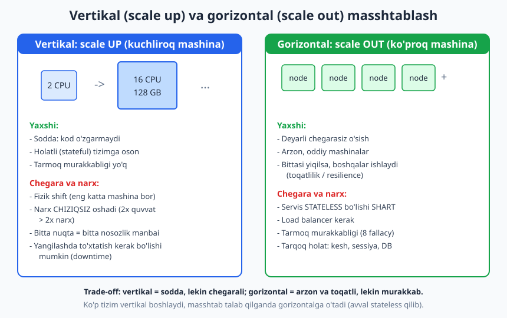
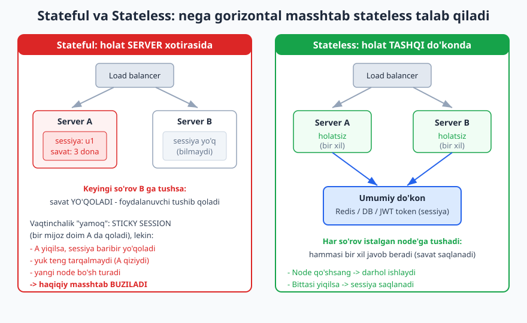
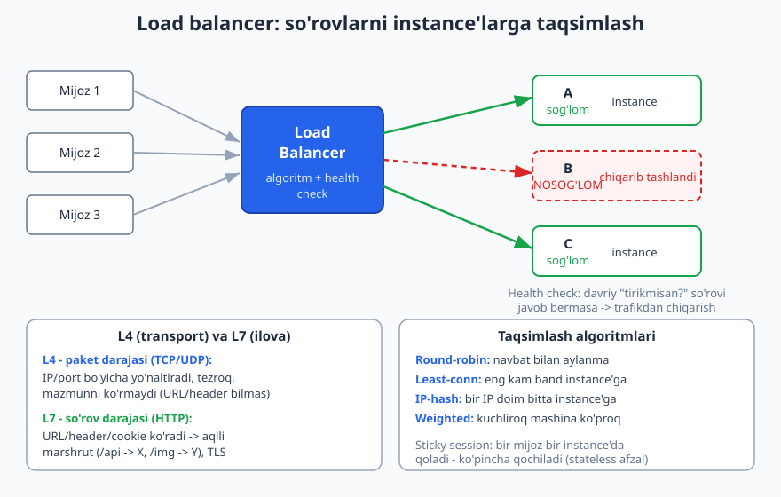

# 19 — Masshtablash va load balancing

[⬅️ Oldingi: 18 — Ma'lumotlar bazasi: SQL vs NoSQL](./18-malumotlar-bazasi-tanlovi.md) · [🏠 README](./README.md) · [Keyingi: 20 — Keshlash strategiyalari ➡️](./20-keshlash.md)

---

> **Bu bobda:** tizimingiz **ko'proq yuk**ni (foydalanuvchi, so'rov, ma'lumot) qanday ko'tarishini o'rganamiz. Ikki yo'l bor: **vertikal masshtablash** (scale up — bitta mashinani kuchaytirish) va **gorizontal masshtablash** (scale out — ko'proq mashina qo'shish). Gorizontal masshtabning **kaliti** — **stateless** (holatsiz) servis: holatni serverda saqlamaslik. So'ng **load balancer** (yuk taqsimlagich) qanday ishlashini ko'ramiz: **L4 vs L7**, algoritmlar (round-robin, least-connections, IP-hash, weighted), **health check** (sog'liq tekshiruvi) va **sticky session** (nega ko'pincha undan qochiladi). Oxirida DB masshtabiga qisqa kirish (read replica, sharding), **CDN**, **autoscaling** va eng muhim amaliy tushuncha — **bottleneck** (tor joy): tizim eng sekin qismi bilan cheklanadi, shuning uchun **o'lchamasdan optimallashtirma**.
>
> **Trade-off eslatmasi / Halollik:** bu bob — **trade-off** haqida. "Gorizontal har doim yaxshi", "vertikal eskirgan" kabi mutlaq da'volar **noto'g'ri** — har birining narxi va o'rni bor. Load balancing **algoritmlari** (round-robin, least-connections, weighted, IP-hash) TypeScript'da yozilib **haqiqatan ishga tushirilib tekshirilgan** (natijalar matnda — bo'lim oxirida hisobot). Tizim raqamlari — RPS (sekundiga so'rov), latency (kechikish), mashina narxi — real tizimda **o'lchanadigan** kattaliklar; bu yerda ular berilganda **"taxminiy / tartib"** deb belgilanadi, aniq va'da emas. Tarqoq (distributed) tizim bo'yicha da'volar — "8 fallacy of distributed computing" (L. Peter Deutsch) bilan moslangan.

---

## Nega masshtablash kerak? Va birinchi savol — kerakmi?

Tizimingiz bugun 100 ta foydalanuvchiga xizmat qiladi. Ertaga 100 000 ta bo'lsa-chi? Server javob berishni sekinlashtiradi, navbat to'ladi, oxiri "yiqiladi". **Masshtablash** — tizimni ko'proq yukni **xizmat sifatini saqlab** ko'tara oladigan qilish.

Lekin eng birinchi va eng muhim savol — **"masshtablash kerakmi?"**. Ko'p loyiha hech qachon "Google masshtabi"ga yetmaydi. Bir kuchli server PostgreSQL bilan minglab parallel foydalanuvchini bemalol ko'taradi. Murakkab gorizontal arxitekturani **kerak bo'lmasdan** qurish — bu YAGNI (06-bob) buzilishi: hozir yo'q muammoni hal qilib, real, bugungi murakkablik narxini to'laysiz.

> **Eslatma:** masshtablash — **ishlash (performance)** bilan bir narsa **emas**. Ishlash — bitta so'rov qancha tez bajariladi (latency). Masshtab — tizim qancha **parallel** yukni ko'tara oladi (throughput). Sekin kod minglab serverda ham sekin bo'lib qoladi. Avval kodni va so'rovni tezlashtiring; masshtab — undan keyingi qadam. Ko'pincha bitta sekin SQL so'rovini tuzatish o'nta server qo'shishdan ko'ra ko'proq foyda beradi.

---

## 1-qism. Vertikal vs gorizontal masshtablash

Ikki tubdan boshqa yondashuv bor.



### Vertikal masshtablash (scale up — kuchliroq mashina)

G'oya oddiy: **bitta mashinani kattalashtirish** — ko'proq CPU, ko'proq RAM, tezroq disk. 2 yadrodan 16 yadroga, 8 GB dan 128 GB ga.

- **Yaxshi tomoni:** **soddalik**. Kod o'zgarmaydi, arxitektura o'zgarmaydi — shunchaki kattaroq serverga ko'chirasiz. **Holatli (stateful)** tizimga ham oson qo'llaniladi (hammasi bitta mashinada qoladi, tarmoq murakkabligi yo'q).
- **Chegara va narx:** **fizik shift bor** — dunyodagi eng katta mashinadan kattaroq yo'q. Narx **chiziqsiz** oshadi: ikki barobar quvvatli server odatda ikki barobardan **qimmatroq**. Va eng muhimi: bitta mashina — **bitta nosozlik nuqtasi** (single point of failure). U yiqilsa, butun tizim yiqiladi.

### Gorizontal masshtablash (scale out — ko'proq mashina)

G'oya: bitta mashinani kattalashtirmasdan, **ko'p oddiy mashina** qo'shish va yukni ular orasida taqsimlash.

- **Yaxshi tomoni:** **deyarli chegarasiz** o'sish (yana node qo'shaverasiz); **arzon, oddiy** mashinalar; va **toqatlilik (resilience)** — bittasi yiqilsa, boshqalari ishlashda davom etadi.
- **Chegara va narx:** **murakkablik**. Endi sizga **load balancer** kerak, servis **stateless** bo'lishi shart (pastda), va siz tarqoq tizim dunyosiga kirasiz — tarmoq ishonchsiz, latency nolga teng emas (8 fallacy). Holat (sessiya, kesh) endi tashqi, umumiy joyga ko'chishi kerak.

> **Trade-off:** vertikal — **sodda, lekin chegarali va mo'rt** (bitta nuqta). Gorizontal — **arzon va toqatli, lekin murakkab**. Amaliy yo'l ko'pincha: **vertikal bilan boshlang** (eng sodda yechim), real ehtiyoj paydo bo'lganda gorizontalga o'ting. Lekin agar siz boshidanoq gorizontalni ko'zlasangiz, eng yaxshi tayyorgarlik — servisni **bugun stateless qilish** (bu deyarli har doim foydali), shunda kelajakda node qo'shish oson bo'ladi.

> **Eslatma — "konteyner" chalkashligi:** "ko'proq node qo'shish" ko'pincha Docker konteyner yoki Kubernetes pod orqali amalga oshiriladi. Lekin diqqat: bu C4 modelidagi "Container" (deployable birlik, 03-bob) bilan **boshqa** narsa. Atama bir xil, ma'no boshqa — kontekstga qarang.

---

## 2-qism. Stateless servis — gorizontal masshtabning KALITI

Gorizontal masshtab faqat bitta shart bilan ishlaydi: **servis stateless bo'lishi kerak**. Bu — bobning eng muhim amaliy tushunchasi.



### Stateful — nega masshtablanmaydi?

**Stateful** (holatli) servis muhim ma'lumotni (sessiya, savat, vaqtinchalik holat) **o'z xotirasida** saqlaydi. Bir foydalanuvchi A serverga ulanib, savatiga 3 mahsulot qo'shdi — bu A ning RAM'ida turibdi.

Endi gorizontal masshtablashga uringaylik: ikkinchi server B qo'shdik. Load balancer foydalanuvchining keyingi so'rovini **B ga** yuborsa — B bu sessiyani **bilmaydi**, savat **yo'qoladi**. Foydalanuvchi tizimdan tushib qoladi. Demak stateful servis bir necha nusxada **to'g'ri ishlamaydi**.

### Stateless — yechim

**Stateless** (holatsiz) servis hech qanday so'rovlararo holatni **o'zida saqlamaydi**. Har so'rov o'zicha to'liq: kerakli holat **tashqi, umumiy do'kon**dan olinadi — sessiya **Redis**'da, ma'lumot **DB**'da, yoki foydalanuvchi holati **token** ichida (masalan JWT) tashiladi.

Natijada **har bir instance bir xil** — qaysi biriga so'rov tushishi muhim emas, javob bir xil. Mana shu xususiyat node qo'shishni (va olib tashlashni) **oson** qiladi.

Buni kichik simulyatsiya bilan ko'rsatamiz (haqiqatan ishga tushirilgan):

```ts
// Umumiy sessiya do'koni (Redis o'rnida Map)
const sessionStore = new Map<string, { userId: string; cart: number }>();
sessionStore.set("sess-abc", { userId: "u1", cart: 3 });

// STATELESS instance: holatni o'zida saqlamaydi, umumiy do'kondan o'qiydi
function handleStateless(_instanceId: string, sessionId: string): number {
  const s = sessionStore.get(sessionId);
  return s ? s.cart : -1;
}

// Bir foydalanuvchi so'rovi turli instance'larga tushsa ham - bir xil javob
console.log(handleStateless("A", "sess-abc")); // 3
console.log(handleStateless("B", "sess-abc")); // 3
console.log(handleStateless("C", "sess-abc")); // 3
```

Ishga tushirsak (haqiqatan olingan natija):

```text
Stateless instance'lar (sessiya umumiy do'konda):
  A->3, B->3, C->3  (har biri bir xil: true)
Stateful (holat serverda):
  A->3, B->-1  (B yo'qotadi -> masshtab buziladi)
```

Stateful holatda B serveri `-1` (topilmadi) qaytaradi — chunki sessiya faqat A ning xotirasida edi. Stateless holatda esa uchchala server ham `3` qaytaradi. Ana shu farq — gorizontal masshtabning butun asosi.

> **Anti-pattern — "in-memory sessiya":** ilovada foydalanuvchi sessiyasini server xotirasida (oddiy o'zgaruvchi yoki lokal Map) saqlash — eng keng tarqalgan masshtablash to'sig'i. U bitta serverda ajoyib ishlaydi, lekin ikkinchi server qo'shilishi bilan buziladi. Sessiyani **birinchi kundan** tashqi do'konga (Redis) yoki tokenga chiqaring — bu deyarli har doim arzon va kelajakni ochiq qoldiradi.

> **Diqqat:** "stateless" — tizimda holat **umuman yo'q** degani **emas**. Holat **bo'lishi shart** (foydalanuvchilar, buyurtmalar — ular qayergadir saqlanadi). "Stateless" faqat **servis nusxasi** so'rovlararo holatni o'zida tutmasligini bildiradi. Holat **markazlashgan** do'konga (DB, Redis) ko'chadi; bu do'konni masshtablash — alohida, qiyinroq masala (3-qism va 22-bob).

---

## 3-qism. Load balancer — yukni taqsimlash

Bizda endi bir nechta bir xil (stateless) instance bor. Kimdir so'rovlarni ular orasida **taqsimlashi** kerak — bu **load balancer** (yuk taqsimlagich). U mijoz va instance'lar orasida turadi: har kelgan so'rovni bitta sog'lom instance'ga yo'naltiradi.



### L4 vs L7 — qaysi darajada ishlaydi?

Load balancer ikki darajada ishlashi mumkin (nomlar OSI modelidagi qatlamlardan):

- **L4 (transport darajasi — TCP/UDP):** faqat **IP va port** bo'yicha yo'naltiradi. So'rov **mazmunini ko'rmaydi** (qaysi URL, qaysi header — bilmaydi). Sodda va **tez**.
- **L7 (ilova darajasi — HTTP):** so'rov **mazmunini ko'radi** — URL, header, cookie. Shuning uchun **aqlli marshrut** qila oladi: `/api/*` ni bir guruhga, `/images/*` ni boshqasiga; TLS'ni tugatish (terminate); so'rov bo'yicha qaror. Kuchliroq, lekin biroz sekinroq (har so'rovni "o'qiydi").

> **Amaliyotda:** zamonaviy veb-ilovalarda ko'pincha **L7** ishlatiladi (nginx, HAProxy, AWS ALB, Traefik) — chunki yo'l (path) bo'yicha marshrut, sticky session, header-asosli qaror kerak bo'ladi. L4 (masalan AWS NLB) o'ta yuqori throughput yoki HTTP bo'lmagan protokollar uchun tanlanadi. Bu — trade-off: tezlik vs aqllilik.

### Health check (sog'liq tekshiruvi)

Load balancer **davriy ravishda** har instance'dan "tirikmisan?" deb so'raydi (masalan har 5 soniyada `GET /health` so'rovi). Agar instance javob bermasa yoki xato qaytarsa — load balancer uni **trafikdan chiqarib tashlaydi** va so'rovlarni faqat **sog'lom**larga yuboradi. Instance tuzalsa — qaytaradi.

Bu — gorizontal arxitekturaning **toqatliligi**ning asosi: bitta instance yiqilsa, foydalanuvchi sezmaydi, chunki load balancer uni chetlab o'tadi.

### Taqsimlash algoritmlari

So'rovni **qaysi** instance'ga yuborish — bu algoritm masalasi. Asosiy to'rttasi:

1. **Round-robin (navbat bilan aylanma):** so'rovlar navbatma-navbat A, B, C, A, B, C... Eng sodda va keng tarqalgan. Barcha instance taxminan teng quvvatli va so'rovlar taxminan teng "og'ir" bo'lsa — yaxshi ishlaydi.
2. **Least-connections (eng kam ulanish):** so'rov ayni paytda **eng kam faol ulanish**i bor instance'ga boradi. So'rovlar **turli muddat**da bajarilsa (ba'zilari uzoq, ba'zilari qisqa) — round-robin'dan adolatliroq, chunki band instance'ga yangi yuk tushmaydi.
3. **IP-hash:** mijoz IP'sidan hash hisoblab, har doim **bitta** instance'ga yuboradi. Bu — sticky session'ning bir turi (pastda).
4. **Weighted (vaznli):** har instance'ga **vazn** beriladi — kuchliroq mashina **ko'proq** so'rov oladi. Aralash apparat (eski + yangi serverlar) bo'lganda foydali. Round-robin va least-connections ham vaznli variantga ega.

### Sticky session — va nega ko'pincha undan qochiladi

**Sticky session** (yopishqoq sessiya, yoki session affinity): load balancer bir foydalanuvchini **doim bitta** instance'ga yuboradi. Bu **stateful** muammosini "yamash" usuli — sessiya A da bo'lsa, foydalanuvchini doim A ga yuborsak, u yo'qolmaydi.

Lekin bu — **yamoq**, yechim emas, va uning jiddiy kamchiliklari bor:

- **A yiqilsa, sessiya baribir yo'qoladi** — foydalanuvchi tushib qoladi.
- **Yuk teng tarqalmaydi** — ba'zi instance qiziydi, boshqalari bo'sh turadi.
- **Yangi node bo'sh qoladi** — eski sessiyalar eski node'larda yopishib qoladi, yangi node'ga foyda kam.

> **Trade-off:** shuning uchun amaliyotda ko'pincha sticky session **o'rniga** servisni **stateless** qilish afzal ko'riladi (sessiyani Redis/tokenga ko'chirish). Shunda istalgan algoritm (round-robin, least-conn) erkin ishlaydi va yuqoridagi muammolar yo'qoladi. Sticky session **butunlay yomon emas** — eski stateful tizimni tez "ushlab turish" uchun yoki WebSocket kabi uzun ulanishlar uchun ba'zan o'rinli. Lekin **yangi** tizimni sticky session'ga bog'lab qurmang — bu masshtabni cheklaydi.

---

## 4-qism. KOD — round-robin va least-connections simulyatsiyasi

Endi load balancing algoritmlarini TypeScript'da yozib, **haqiqatan ishlatib** ko'ramiz. Maqsad — algoritm so'rovlarni qanday taqsimlashini "o'z ko'zimiz bilan" ko'rish.

Avval instance modeli va sog'liq filtri:

```ts
interface Instance {
  id: string;
  healthy: boolean;
  active: number; // ayni paytdagi faol ulanishlar (least-conn uchun)
  served: number; // jami xizmat ko'rsatilgan so'rovlar (statistika)
  weight: number; // weighted uchun
}

// faqat "sog'lom" (health check o'tgan) instance'lar
function healthyOnly(pool: Instance[]): Instance[] {
  return pool.filter((i) => i.healthy);
}
```

**Round-robin** — ichki indeksni aylantiradi (faqat sog'lomlar bo'yicha):

```ts
class RoundRobin {
  private idx = 0;
  pick(pool: Instance[]): Instance {
    const live = healthyOnly(pool);
    if (live.length === 0) throw new Error("Sog'lom instance yo'q");
    const chosen = live[this.idx % live.length]!;
    this.idx++;
    chosen.served++;
    return chosen;
  }
}
```

**Least-connections** — eng kam `active` qiymatli instance'ni topadi:

```ts
function pickLeastConn(pool: Instance[]): Instance {
  const live = healthyOnly(pool);
  if (live.length === 0) throw new Error("Sog'lom instance yo'q");
  let best = live[0]!;
  for (const i of live) {
    if (i.active < best.active) best = i;
  }
  best.active++;
  best.served++;
  return best;
}
```

### Natijalar (haqiqatan olingan)

**Test 1 — round-robin 6 ta so'rovni 3 instance'ga teng tarqatadi:**

```text
Round-robin tartibi: A B C A B C
  A/B/C served: A=2 B=2 C=2
```

Navbat bilan aylanma — har biriga teng 2 tadan tushdi.

**Test 2 — health check: B "o'ladi" (`healthy=false`), trafik faqat A va C ga:**

```text
B nosog'lom -> tartib: A C A C A C
  B ga tushgan so'rov: 0 (0 bo'lishi shart)
```

Round-robin avtomatik ravishda B ni chetlab o'tdi — `served` 0. Mana health check'ning ta'siri.

**Test 3 — least-connections: A oldindan 5 ta uzun so'rov bilan band:**

```text
Least-conn (A oldindan band=5): B C B C
  active: A=5 B=2 C=2
```

Algoritm band A ga **umuman** yangi so'rov bermadi — yangilarni B va C ga teng taqsimladi. Round-robin esa A ning band ekanligini bilmasdan unga ham yuborgan bo'lardi.

**Test 4 — nobir (uneven) yuk: 12 so'rov, har 3-si "og'ir" (band qoladi):**

```text
Nobir yuk (12 so'rov, har 3-si og'ir):
  Round-robin served: A=4 B=4 C=4
  Least-conn  active: A=2 B=1 C=1 (og'irlar qolgan)
```

Round-robin **soni** bo'yicha teng tarqatadi (4/4/4), lekin og'irlikni hisobga olmaydi. Least-conn esa band instance'larni chetlab, **haqiqiy yuk**ni tengroq ushlab turadi.

**Test 5 — IP-hash barqarorligi (bir IP doim bitta instance'ga):**

```text
IP-hash barqarorligi:
  203.0.113.7 -> C, yana -> C  (bir xil bo'lishi shart: true)
  203.0.113.9 -> B  (boshqa IP -> boshqa instance bo'lishi mumkin)
```

Bir IP ikki marta ham C ga tushdi (sticky), boshqa IP esa B ga.

**Test 6 — weighted: A vazni 3, B va C vazni 1 (A uch barobar kuchli):**

```text
Weighted (A=3, B=1, C=1) -> taqsimot:
  A=30 B=10 C=10  (A ~3x B/C bo'lishi shart)
```

A aynan uch barobar ko'p so'rov oldi — kuchliroq mashinaga mos.

> **Trade-off:** least-connections "aqlliroq", lekin har instance'ning faol ulanish sonini kuzatish kerak (ozgina qo'shimcha hisob). Round-robin esa o'ta sodda va so'rovlar bir xil "og'ir" bo'lsa yetarli. **Universal "eng yaxshi" algoritm yo'q** — yukingiz shakliga qarab tanlang. Real load balancer (nginx, HAProxy) bularning hammasini sozlamadan beradi; bu simulyatsiya esa ularning **ichki mantig'i**ni ko'rsatish uchun.

> **Eslatma:** yuqoridagi `203.0.113.x` IP'lari — hujjatlar uchun ajratilgan namuna diapazoni (RFC 5737), real IP emas. Qaysi instance'ga tushishi — hash funksiyasiga bog'liq; bu yerda raqamlar shu sodda hash bilan **haqiqatan** hisoblangan.

---

## 5-qism. Ma'lumotlar bazasini masshtablash (qisqa kirish)

Stateless ilova qatlamini masshtablash oson (node qo'shaverasiz). Lekin holat — **ma'lumotlar bazasi**da, va u ko'pincha **haqiqiy bottleneck** (tor joy) bo'ladi. DB masshtabi alohida, qiyinroq mavzu — bu yerda faqat **kirish**, chuqur tahlil **22-bobda** (CAP, replikatsiya, sharding).

Ikki asosiy yo'nalish:

- **Read replica (o'qish nusxalari):** asosiy (primary) bazadan bir nechta faqat-o'qish nusxasi yaratiladi. **O'qish** so'rovlari nusxalarga tarqatiladi (yuk yengillashadi), **yozish** esa faqat primary'ga boradi. Ko'p tizim **o'qish-og'ir** (read-heavy) bo'lgani uchun bu juda samarali. Narxi: nusxalar **eventual consistency** bilan yangilanadi — yozgan ma'lumot nusxada bir lahza kechikishi mumkin (18-bobdagi "yozdim, lekin replika hali eskisini ko'rsatadi").
- **Sharding / partitioning (bo'laklash):** ma'lumot kalit bo'yicha bir nechta bazaga **bo'linadi** (masalan, foydalanuvchi ID si bo'yicha). Bu **yozish**ni ham tarqatadi — gorizontal masshtabning yagona haqiqiy yo'li juda katta yozuv oqimida. Narxi: cross-shard so'rov va tranzaksiya **qiyinlashadi**, qayta-bo'lish (resharding) og'riqli.

> **Trade-off:** read replica — o'qishni tarqatadi, sodda; sharding — yozishni ham tarqatadi, lekin ancha murakkab. Aksariyat loyiha uchun **avval read replica** (va yaxshi indeks, kesh — 20-bob) yetarli; sharding faqat haqiqatan ulkan yozuv hajmida zarur bo'ladi. DB bo'yicha asoslar: [`../sql/README.md`](../sql/README.md); modellashtirish 18-bobda.

---

## 6-qism. CDN va autoscaling

Yana ikki amaliy vosita masshtab arsenalida.

**CDN (Content Delivery Network — kontent yetkazish tarmog'i):** statik kontent (rasm, CSS, JS, video) foydalanuvchiga **eng yaqin** chekka serverdan (edge) beriladi — dunyo bo'ylab tarqalgan keshlar orqali. Bu ikki foyda beradi: (1) foydalanuvchiga **tezroq** (yaqinroq = past latency); (2) sizning asosiy serverlaringizdan **yuk olib tashlanadi** (statik fayllarni umuman ko'rmaydi). CDN — eng arzon va eng ta'sirli masshtab "g'alaba"laridan biri statik kontent uchun.

**Autoscaling (avtomatik masshtablash):** instance soni **avtomatik** ravishda yukka qarab o'zgaradi — yuk oshganda node qo'shiladi, kamayganda olib tashlanadi (masalan, CPU 70% dan oshsa +1 node). Bu pikli (kunduzi band, kechasi bo'sh) yuklarda **xarajatni tejaydi**.

> **Diqqat:** autoscaling faqat servis **stateless** bo'lsa ishlaydi (yana o'sha kalit!) — chunki node ixtiyoriy qo'shilib-olib tashlanadi, ulardagi hech qanday holat saqlanmasligi kerak. Yana: autoscaling **bir lahzada** emas (yangi node ko'tarilishiga vaqt ketadi), shuning uchun keskin pikni darhol ushlay olmaydi; va u **DB bottleneck**ini hal qilmaydi — 50 ta ilova node DB ni faqat ko'proq bo'g'adi, agar DB tor joy bo'lsa.

> **Amaliyotda — e-commerce "Black Friday" misoli (raqamlar taxminiy/tartib):** chegirma kuni trafik odatdagidan, aytaylik, 10 baravar oshadi. Strategiya: (1) statik kontent (mahsulot rasmlari) **CDN**da — asosiy serverlar ularni ko'rmaydi; (2) stateless ilova qatlami **autoscaling** bilan kengayadi; (3) o'qish-og'ir mahsulot katalogi **read replica** + **kesh** (20-bob) bilan; (4) buyurtma/to'lov (yozish-og'ir, ACID kerak) — bu **eng tor joy**, uni navbat (queue, 21-bob) bilan tekislash mumkin. Har bir qism alohida masshtablanadi.

---

## 7-qism. Bottleneck — eng muhim amaliy tushuncha

Bobning eng amaliy xulosasi: **tizim eng sekin qismi (bottleneck — tor joy) bilan cheklanadi**. Suv quvurini tasavvur qiling: u eng ingichka joyidan ko'p suv o'tkaza olmaydi — quvurning qolgan qismi qancha keng bo'lsa ham.

Demak: o'nta ilova serveri qo'shsangiz-u, hammasi bitta sekin bazaga borsa — siz hech narsani tezlashtirmadingiz, faqat **bazani ko'proq bo'g'dingiz**. Bottleneck **ko'chadi**: bir joyni kengaytirsangiz, tor joy boshqa joyga o'tadi. Masshtablash — bu **tor joyni topish va kengaytirish**ning takrorlanuvchi jarayoni.

> **Anti-pattern — "ko'r-ko'rona optimallashtirish":** **o'lchamasdan optimallashtirma**. Muhandislar ko'pincha "menimcha bu sekin" deb taxmin qilib, noto'g'ri joyni optimallashtirishga vaqt sarflaydi — aslida bottleneck butunlay boshqa joyda bo'ladi. Avval **o'lchang** (profiling, monitoring, metrikalar): qayer haqiqatan sekin? Keyin **o'sha** joyni tuzating. Donald Knuth'ning mashhur ogohlantirishi shu haqida: "premature optimization is the root of all evil" (bevaqt optimallashtirish — yovuzlik ildizi). Bu kontekstda: o'lchamasdan masshtablash — isrof, ba'zan ziyon.

> **Trade-off — yakuniy halollik:** bu bobdagi har bir vosita (gorizontal masshtab, load balancer, replica, CDN, autoscaling) **narx bilan** keladi — murakkablik, operatsion yuk, tarqoq tizim muammolari. "To'g'ri javob" yo'q: kichik loyiha uchun **bitta yaxshi server + kesh** (20-bob) ko'p hollarda yetarli, va u o'nta node'li murakkab arxitekturadan **ishonchliroq** bo'lishi mumkin. Masshtablashni **ehtiyoj** (o'lchangan, isbotlangan) haydasin, "balki kerak bo'lar" emas. Resilience (toqatlilik) — 23-bob; bu bobdagi gorizontal masshtab unga poydevor.

---

## Mashqlar

### Oson

**1.** Quyidagi har bir holatda **vertikal** yoki **gorizontal** masshtablash mosroq? Qisqa asoslang. (a) eski monolit, kodni o'zgartira olmaysiz, lekin biroz ko'proq quvvat kerak; (b) million foydalanuvchiga o'sayotgan stateless veb-API; (c) holatni server xotirasida saqlovchi legacy servis, tez yechim kerak.

**2.** "Gorizontal masshtablash har doim vertikaldan yaxshi." Bu da'voni tuzating — kamida ikkita holatni ayting, qachon vertikal afzalroq.

**3.** Quyidagi servislardan qaysi biri **stateless**, qaysi biri **stateful**? (a) so'rovni qabul qilib, DB'dan o'qib, javob qaytaradigan API; (b) foydalanuvchi savatini o'z RAM'idagi Map'da saqlovchi servis; (c) har so'rovda JWT tokendan foydalanuvchini o'qiydigan servis.

**4.** Round-robin va least-connections farqini bir jumla bilan tushuntiring. Qaysi biri so'rovlar **turli muddat**da bajarilganda adolatliroq?

**5.** Health check nima qiladi va u gorizontal arxitekturaning **toqatliligi**ga qanday hissa qo'shadi? Bir-ikki gap.

### O'rta

**6.** Bir jamoa sessiyani server xotirasida saqlaydi va "masshtab uchun" ikkinchi server qo'shdi — foydalanuvchilar tasodifan tizimdan tushib qola boshladi. (a) Nima bo'ldi (sabab)? (b) Ikki yechim taklif qiling va har birining trade-off'ini ayting (biri "tez yamoq", biri "to'g'ri yechim").

**7.** Sizda load balancer ortida 4 ta instance bor: ikkitasi yangi va kuchli, ikkitasi eski va sekin. Qaysi algoritm(lar)ni tanlaysiz va nega? Sodda round-robin bu yerda nega adolatsiz bo'lishi mumkin?

**8.** "Sticky session — masshtablashning yaxshi yechimi." Bu da'voga qarshi **uchta** argument keltiring. Sticky session **o'rniga** nimani tavsiya qilasiz?

**9.** Bir veb-ilova o'qish-og'ir (read-heavy): 95% so'rov — o'qish, 5% — yozish. DB sekinlashyapti. (a) **Read replica** bu yerda qanday yordam beradi? (b) Uning trade-off'i (consistency tomonidan) nima? (c) Bu bilan **sharding** orasidagi farq nima?

**10.** Bir jamoa "trafik 10 baravar oshyapti, hamma narsani optimallashtiramiz" deb butun kodni qayta yozishni boshladi. Bu yondashuvda qanday xato bor? Bottleneck va o'lchash tushunchalari yordamida to'g'ri ketma-ketlikni taklif qiling.

### Qiyin

**11.** **Round-robin'ni kodda yozing.** TypeScript'da `class RoundRobin` yozing: u `pick(pool)` chaqirilganda faqat `healthy === true` instance'lar orasidan navbat bilan birini qaytarsin. 6 ta so'rov bilan 3 instance'ga teng (2/2/2) tushishini, so'ng bittasini `healthy = false` qilib, unga **0** so'rov tushishini ishga tushirib tekshiring.

**12.** **Least-connections vs round-robin (kod + tahlil).** "Og'ir" va "yengil" so'rovlar aralash kelganda least-connections nega round-robin'dan yaxshi yuk taqsimlashini ko'rsatadigan kichik simulyatsiya yozing (og'ir so'rov instance'ni band qoldiradi, yengili darhol bo'shaydi). So'ng: least-connections qanday **qo'shimcha narx** (overhead) bilan keladi?

**13.** **Stateless'ga ko'chiring (dizayn + kod).** Sizda stateful "savat" servisi bor — savatni lokal Map'da saqlaydi, shuning uchun bir nechta instance'da buziladi. Uni **stateless** qiling: savatni tashqi umumiy do'kon (Map'ni Redis o'rnida ishlating) orqali saqlang, shunda istalgan instance bir xil javob bersin. Ikki instance bir savatga qo'shib, ikkalasi ham bir xil holatni ko'rishini ko'rsating. So'ng: bu o'zgarish autoscaling'ni **nega** mumkin qiladi?

**14.** **Masshtab strategiyasini loyihalang (kod yo'q).** "Video-darslik platformasi" kutilmaganda viral bo'ldi, trafik 20 baravar oshdi (raqam taxminiy). Ma'lumotlar: (i) video fayllar (statik, katta); (ii) stateless API (kurs ro'yxati, profil); (iii) o'qish-og'ir kurs katalogi DB; (iv) to'lov (yozish, ACID kerak). Har biri uchun mos masshtab vositasini tanlang (CDN / autoscaling / read replica / kesh / queue) va asoslang. So'ng: **bottleneck** qayerda bo'lishi ehtimoli yuqori va nega? Avval nimani o'lchaysiz?

<details markdown="1"><summary>Yechimlar</summary>

### 1-mashq yechimi

(a) **Vertikal** — kodni o'zgartira olmasangiz va biroz quvvat yetsa, kattaroq mashina eng sodda yo'l. (b) **Gorizontal** — million foydalanuvchiga o'sish vertikal chegarasidan oshadi; stateless bo'lgani uchun node qo'shish oson va toqatlilik beradi. (c) **Vertikal** (vaqtincha) — legacy stateful servisni tez ushlab turish uchun kattaroq mashina ishlaydi; gorizontalga o'tish avval stateless qilishni talab qiladi (uzoqroq ish).

### 2-mashq yechimi

Tuzatish: **har biri trade-off**. Vertikal afzal bo'lgan holatlar: (1) **soddalik muhim** — kichik jamoa, gorizontal murakkabligini ko'tara olmaydi; (2) **stateful legacy** tizim — uni stateless qilish qimmat yoki imkonsiz; (3) **kod o'zgarmaydi** — tez yechim kerak; (4) yuk vertikal chegaradan **past** — bitta kuchli server yetadi, gorizontal isrof bo'lardi. Gorizontal — chegarasiz o'sish va toqatlilik kerak bo'lganda, lekin murakkablik narxi bilan.

### 3-mashq yechimi

(a) **Stateless** — holatni DB'dan oladi, o'zida saqlamaydi. (b) **Stateful** — savat server RAM'ida; bir nechta instance'da buziladi. (c) **Stateless** — holat tokenda tashiladi, server hech narsa eslamaydi. (a) va (c) — gorizontal masshtablanadi; (b) — yo'q (oldin stateless qilish kerak).

### 4-mashq yechimi

**Round-robin** so'rovlarni navbat bilan aylanma taqsimlaydi (so'rov **sonini** tenglaydi). **Least-connections** har safar ayni paytda eng kam faol ulanishi bor instance'ni tanlaydi (haqiqiy **yuk**ni tenglaydi). So'rovlar **turli muddat**da bajarilganda **least-connections** adolatliroq, chunki u band instance'ga yangi yuk bermaydi.

### 5-mashq yechimi

Health check — load balancer har instance'dan davriy "tirikmisan?" so'rovi (masalan `GET /health`). Javob bermasa, instance **trafikdan chiqariladi** va so'rovlar faqat sog'lomlarga boradi. Toqatlilikka hissa: bitta instance yiqilsa, foydalanuvchi sezmaydi — load balancer uni avtomatik chetlab o'tadi.

### 6-mashq yechimi

(a) **Sabab:** sessiya **server xotirasida** (stateful) saqlanardi. Ikkinchi server qo'shilgach, foydalanuvchining so'rovlari ikki server orasida tasodifan tarqaldi; sessiya faqat bitta serverda bo'lgani uchun boshqasiga tushgan so'rov uni topmadi -> foydalanuvchi tushib qoldi.

(b) **Tez yamoq — sticky session:** load balancer bir foydalanuvchini doim bitta serverga yuborsin. *Trade-off:* tez ishlaydi, lekin server yiqilsa sessiya baribir yo'qoladi, yuk teng tarqalmaydi, yangi node kam foydali. **To'g'ri yechim — stateless qilish:** sessiyani **Redis** yoki **tokenga** ko'chirish; shunda har server bir xil bo'ladi. *Trade-off:* biroz ko'proq ish (Redis qo'shish), lekin haqiqiy masshtab, toqatlilik va autoscaling ochiladi.

### 7-mashq yechimi

**Weighted** (vaznli round-robin yoki least-connections): kuchli serverlarga katta vazn, sekinlarga kichik vazn — har biri quvvatiga **proporsional** so'rov oladi. **Least-connections** ham yaxshi ishlaydi — sekin server uzoqroq band qolib, kamroq yangi so'rov oladi (yukni tabiiy tenglaydi). **Sodda round-robin adolatsiz**, chunki u har serverga **teng son** so'rov beradi, quvvatni hisobga olmaydi — sekin serverlar bo'g'iladi, kuchlilari bo'sh turadi.

### 8-mashq yechimi

1. **Toqatlilik buziladi:** sticky server yiqilsa, undagi sessiyalar yo'qoladi — foydalanuvchilar tushib qoladi.
2. **Yuk teng tarqalmaydi:** ba'zi instance qiziydi (ko'p sticky sessiya), boshqalari bo'sh — masshtabning maqsadi buziladi.
3. **Yangi node kam foydali:** eski sessiyalar eski node'larda yopishib qoladi; yangi qo'shilgan node faqat yangi sessiyalarni oladi, mavjud yukni yengillashtira olmaydi.

**Tavsiya:** sticky session o'rniga servisni **stateless** qilish — sessiyani tashqi do'konga (Redis) yoki tokenga (JWT) ko'chirish. Shunda istalgan algoritm erkin ishlaydi va uchchala muammo yo'qoladi.

### 9-mashq yechimi

(a) **Read replica:** primary bazadan faqat-o'qish nusxalar yaratiladi; 95% o'qish so'rovi nusxalarga tarqatiladi — primary'dan katta yuk olib tashlanadi, o'qishlar parallel bajariladi. O'qish-og'ir tizim uchun juda samarali.

(b) **Trade-off:** nusxalar **eventual consistency** bilan yangilanadi (18-bob) — yangi yozilgan ma'lumot nusxada bir lahza kechikib ko'rinishi mumkin ("yozdim, lekin replikada hali yo'q"). Ko'p o'qish uchun bu qabul qilinadi; lahzali moslik shart bo'lsa, o'sha so'rovni primary'ga yuborish kerak.

(c) **Farq:** read replica **o'qish**ni tarqatadi (har nusxada **to'liq** nusxa bor, yozish baribir bitta primary'ga). **Sharding** ma'lumotni kalit bo'yicha **bo'laklarga** ajratadi — **yozish**ni ham tarqatadi (har shard ma'lumotning bir qismini saqlaydi), lekin cross-shard so'rov murakkablashadi. Replica — o'qish bottleneck'iga, sharding — yozish bottleneck'iga.

### 10-mashq yechimi

**Xato:** **o'lchamasdan**, "hamma narsani" optimallashtirish — bu ko'r-ko'rona ish. Tizim **bottleneck (tor joy)** bilan cheklanadi; agar haqiqiy tor joy DB bo'lsa, ilova kodini qayta yozish hech narsa bermaydi (faqat vaqt isrofi).

**To'g'ri ketma-ketlik:** (1) **O'lchang** — monitoring/profiling bilan qayer haqiqatan sekin ekanligini aniqlang (latency, throughput, DB so'rov vaqti). (2) **Eng katta tor joyni** toping. (3) O'sha **bitta** joyni tuzating (masalan, sekin so'rovga indeks, yoki kesh — 20-bob). (4) Qayta o'lchang — tor joy **ko'chdi**mi? Takrorlang. Knuth: bevaqt optimallashtirish — isrof. Avval o'lchov, keyin ish.

### 11-mashq yechimi

```ts
interface Instance { id: string; healthy: boolean; served: number; }

class RoundRobin {
  private idx = 0;
  pick(pool: Instance[]): Instance {
    const live = pool.filter((i) => i.healthy);
    if (live.length === 0) throw new Error("Sog'lom instance yo'q");
    const chosen = live[this.idx % live.length]!;
    this.idx++;
    chosen.served++;
    return chosen;
  }
}

const pool: Instance[] = [
  { id: "A", healthy: true, served: 0 },
  { id: "B", healthy: true, served: 0 },
  { id: "C", healthy: true, served: 0 },
];
const rr = new RoundRobin();
for (let n = 0; n < 6; n++) rr.pick(pool);
console.log(pool.map((i) => `${i.id}=${i.served}`).join(" ")); // A=2 B=2 C=2

// Health check: B o'lgan holatda TOZA pool bilan tekshiramiz
const pool2: Instance[] = [
  { id: "A", healthy: true, served: 0 },
  { id: "B", healthy: false, served: 0 }, // B nosog'lom
  { id: "C", healthy: true, served: 0 },
];
const rr2 = new RoundRobin();
for (let n = 0; n < 6; n++) rr2.pick(pool2);
console.log("B served:", pool2[1]!.served); // 0 (qo'shilmaydi)
```

Ishga tushirilganda (haqiqatan olingan): `A=2 B=2 C=2`, B nosog'lom pool'da `B served: 0`. Kalit nuqta — `filter((i) => i.healthy)` har `pick`da qaytadan baholanadi, shuning uchun o'lgan instance avtomatik chetda qoladi. (Diqqat: birinchi pool'da B allaqachon 2 ta so'rov olgani uchun health check ta'sirini **toza** pool'da ko'rsatdik — aks holda eski `served` qoladi.)

### 12-mashq yechimi

Asosiy g'oya: og'ir so'rov instance'ning `active` ulanishini **band qoldiradi**, yengili darhol bo'shaydi. Least-connections band instance'ni chetlab o'tadi, round-robin esa hisobga olmaydi:

```ts
interface Inst { id: string; active: number; served: number; }
const mk = (): Inst[] => [
  { id: "A", active: 0, served: 0 },
  { id: "B", active: 0, served: 0 },
  { id: "C", active: 0, served: 0 },
];
function leastConn(pool: Inst[]): Inst {
  let best = pool[0]!;
  for (const i of pool) if (i.active < best.active) best = i;
  best.active++; best.served++; return best;
}

const lc = mk();
for (let n = 0; n < 12; n++) {
  const heavy = n % 3 === 0;     // har 3-si og'ir
  const chosen = leastConn(lc);
  if (!heavy) chosen.active--;   // yengil darhol bo'shadi
}
console.log("Least-conn active:", lc.map((i) => `${i.id}=${i.active}`).join(" "));
```

Ishga tushirilganda (haqiqatan olingan, bob matnidagi Test 4 ga mos): round-robin `served` ni teng (4/4/4) qiladi, lekin least-conn band (og'ir) ulanishlarni tengroq ushlaydi — `A=2 B=1 C=1`. Round-robin og'irlikni ko'rmaydi.

**Qo'shimcha narx (overhead):** least-connections har instance'ning **faol ulanish sonini** kuzatib turishni talab qiladi (har so'rov boshlan/tugashida hisoblagichni yangilash, va tanlovda minimumni topish). Round-robin esa faqat bitta indeks. Yuk bir xil "og'ir" bo'lsa, bu qo'shimcha hisob foyda bermaydi — shu holatda round-robin yetarli.

### 13-mashq yechimi

Stateful'dan stateless'ga: savatni instance ichidagi Map'dan **tashqi umumiy** do'konga ko'chiramiz (bu yerda `sharedStore` Redis o'rnida):

```ts
// Tashqi UMUMIY do'kon (Redis o'rnida)
const sharedStore = new Map<string, string[]>();

// Stateless instance: o'zida savat saqlamaydi, umumiy do'kondan o'qiydi/yozadi
class CartInstance {
  constructor(public id: string) {}
  add(cartId: string, item: string): void {
    const cart = sharedStore.get(cartId) ?? [];
    cart.push(item);
    sharedStore.set(cartId, cart);
  }
  get(cartId: string): string[] {
    return sharedStore.get(cartId) ?? [];
  }
}

const a = new CartInstance("A");
const b = new CartInstance("B");
a.add("u1", "kitob");   // so'rov A ga tushdi
b.add("u1", "qalam");   // keyingi so'rov B ga tushdi
console.log("A ko'radi:", a.get("u1")); // [kitob, qalam]
console.log("B ko'radi:", b.get("u1")); // [kitob, qalam] - bir xil!
```

Ishga tushirilganda (haqiqatan olingan): ikkala instance ham `[ 'kitob', 'qalam' ]` ni ko'radi — savat umumiy do'konda, shuning uchun qaysi instance so'rovni qabul qilgani muhim emas.

**Nega autoscaling mumkin bo'ladi:** endi instance'lar **bir xil va holatsiz** — ularda saqlanadigan hech narsa yo'q. Shuning uchun yuk oshganda yangi instance qo'shish (u darhol umumiy do'kondan to'g'ri holatni oladi) va yuk kamayganda olib tashlash (hech qanday holat yo'qolmaydi) **xavfsiz**. Stateful holatda esa node olib tashlash undagi savatlarni yo'qotardi — shu sabab autoscaling stateless talab qiladi.

### 14-mashq yechimi

**Namunaviy strategiya:**

- (i) **Video fayllar -> CDN.** Statik, katta; chekka serverlardan tarqatiladi — asosiy serverlar ularni umuman ko'rmaydi, foydalanuvchiga yaqin = tez. Eng katta yengillik shu yerda.
- (ii) **Stateless API -> autoscaling.** Yuk 20 baravar oshganda node avtomatik qo'shiladi; stateless bo'lgani uchun xavfsiz.
- (iii) **O'qish-og'ir katalog DB -> read replica + kesh** (20-bob). O'qishlar nusxalarga va keshga tarqaladi; primary yengillashadi.
- (iv) **To'lov (yozish, ACID) -> queue** (21-bob) bilan tekislash. To'lov yozish-og'ir va kuchli yaxlitlik talab qiladi (18-bob); uni cheksiz masshtablash qiyin, shuning uchun navbat bilan piklarni "tekislab" beriladi.

**Bottleneck ehtimoli:** eng katta tor joy — **to'lov / yozish-og'ir DB** (iv va qisman iii). Sababi: video va statik kontentni CDN cheksizga yaqin ko'taradi, stateless API autoscaling bilan kengayadi — lekin **yozish** (to'lov, ACID) gorizontal masshtablash eng qiyin qism; u tabiiy ravishda cheklangan.

**Avval nimani o'lchaysiz:** taxminga bermay, **monitoring**: qaysi endpoint sekin (latency), DB so'rov vaqtlari, qaysi resurs to'yingan (CPU/DB ulanish/disk). Tor joyni **o'lchov bilan** aniqlab, o'sha joyga e'tibor qarating — boshqa joyni optimallashtirib vaqt isrof qilmang.

</details>

---

[⬅️ Oldingi: 18 — Ma'lumotlar bazasi: SQL vs NoSQL](./18-malumotlar-bazasi-tanlovi.md) · [🏠 README](./README.md) · [Keyingi: 20 — Keshlash strategiyalari ➡️](./20-keshlash.md)
