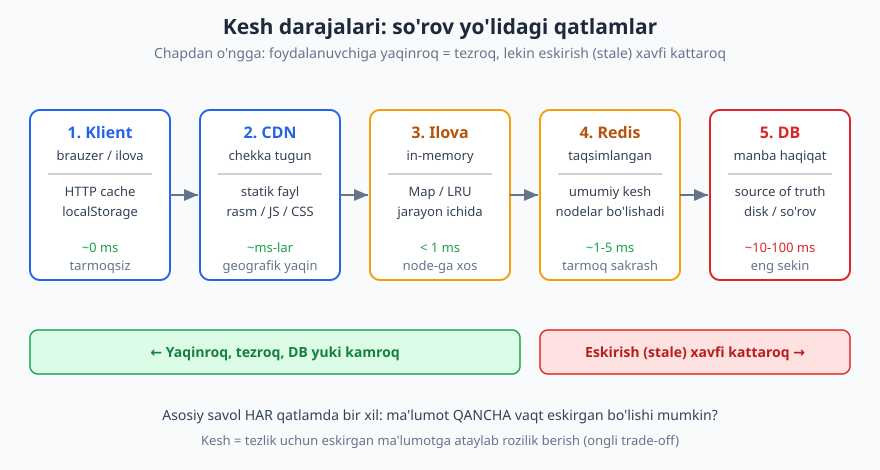
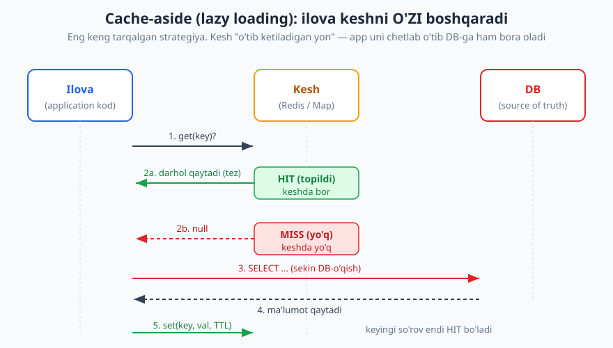
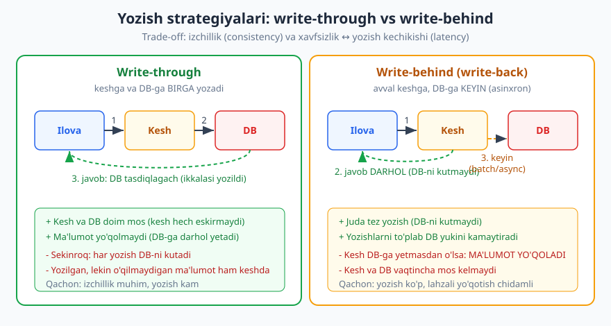

# 20 — Keshlash strategiyalari

[⬅️ Oldingi: 19 — Masshtablash va load balancing](./19-masshtablash-load-balancing.md) · [🏠 README](./README.md) · [Keyingi: 21 — Message queue va asinxron aloqa ➡️](./21-message-queue-async.md)

---

> **Bu bobda:** tizimni tezlashtirishning eng kuchli, eng arzon — va eng xavfli — vositasini, **keshlash**ni (caching, ya'ni tez-tez kerak bo'ladigan ma'lumotni yaqinroq va tezroq joyda saqlash) o'rganamiz. Avval **nega** kesh kerakligini (latency va DB yukini kamaytirish) va **qatlamlarini** (klient -> CDN -> ilova -> Redis -> DB) ko'ramiz. So'ng o'qish/yozish strategiyalarini — **cache-aside** (eng keng tarqalgan), **read-through**, **write-through**, **write-behind**, **refresh-ahead** — qachon qaysi biri to'g'ri kelishini taqqoslaymiz. Keyin kesh hajmi cheklanganda **nimani chiqarish** (LRU/LFU/FIFO/TTL evictsiya) va informatikaning eng mashhur og'riqlaridan biri — **kesh invalidatsiya** (eskirgan ma'lumot muammosi) ni ko'ramiz. Oxirida **cache stampede** (kesh tugaganda hamma DB-ga yopirilishi) ni va uni qanday yengishni o'rganamiz. Bobning markazida — **cache-aside + LRU** ning ishlaydigan TypeScript simulyatsiyasi.

> **Trade-off eslatmasi / Halollik:** keshlash — sof **tezlik vs eskirgan ma'lumot (stale)** ayirboshlashi. Kesh deyarli har doim ma'lumotni **biroz eskirgan** holatda saqlaydi; siz tezlik uchun shu eskirishga **ataylab rozilik** berasiz. Shuning uchun "kesh har doim yaxshi" — noto'g'ri: noto'g'ri qo'yilgan kesh nozik xatolar (foydalanuvchi eski narxni ko'rishi, "saqlandi"-yu sahifada yo'qdek ko'rinishi) keltirib chiqaradi. Bobdagi kod-misol (cache-aside + LRU) **haqiqatan ishga tushirilib, tip-tekshirilgan** (`npx tsx` + `npx tsc --strict`), natijalar matnda aynan keltirilgan. Konkret raqamlar (latency `~1 ms`, `~10-100 ms`) — **tartib bo'yicha taxminiy**, aniq emas; ular faqat nisbatlarni his qilish uchun. Mashhur "informatikadagi 2 qiyin narsa" (kesh invalidatsiya va nomlash) — folklor maqol bo'lib, ko'pincha Phil Karlton'ga nisbat beriladi; biz uni aniq da'vo emas, **intuitsiya** sifatida keltiramiz.

---

## Nega kesh? Eng arzon tezlik

Tasavvur qiling: e-commerce sayti bosh sahifasi har ochilganda mahsulot katalogini ko'rsatadi. Katalog kunda bir marta yangilanadi, lekin sayt sekundiga minglab marta ochiladi. Har ochilishda bazaga bir xil og'ir `SELECT` yuborish — **isrof**: baza bir xil javobni ming marta hisoblaydi.

Kesh g'oyasi oddiy: **bir marta hisobla, natijani yaqin va tez joyda saqla, keyingi safar tayyorini ber**. Bu ikki narsani beradi:

1. **Latency (kechikish) kamayadi.** Diskdagi bazadan o'qish `~10-100 ms` (taxminiy) bo'lsa, xotiradagi keshdan o'qish `< 1 ms`. Foydalanuvchi tezroq javob oladi.
2. **Backend yuki kamayadi.** Har kesh-topilishi (hit) — bu bazaga **bormagan** so'rov. Baza nafas oladi, kamroq resurs bilan ko'proq foydalanuvchini ko'taradi. Bu — 19-bobdagi masshtablashning eng arzon shakli: yangi server qo'shmasdan sig'imni oshirish.

Lekin bularning **narxi** bor — va u butun bob davomida bizni ta'qib qiladi: **kesh deyarli har doim biroz eskirgan ma'lumotni saqlaydi**. Manba (DB) o'zgardi, kesh hali eski qiymatni ushlab turibdi. Bu — keshlashning markaziy trade-off'i: **tezlik uchun eskirgan ma'lumotga (stale data) rozilik berasiz**.

> **Eslatma:** kesh — bu **optimizatsiya**, manba haqiqat (source of truth) emas. To'g'ri ma'lumot har doim bazada. Kesh — uning vaqtinchalik, tezkor nusxasi. Agar kesh butunlay yo'qolsa (Redis qayta ishga tushdi), tizim **sekinroq**, lekin **to'g'ri** ishlashda davom etishi kerak — barcha so'rov DB-ga tushadi, xolos. Agar keshni yo'qotish tizimni **buzsa**, demak siz keshni manba haqiqat sifatida ishlatib yuboribsiz — bu xato.

### Kesh qatlamlari: so'rov yo'lidagi to'siqlar

Kesh bitta joyda emas — so'rov foydalanuvchidan bazagacha boradigan yo'lda **bir nechta qatlam** bor. Har bittasi "men bu javobni bilaman" deb so'rovni to'xtatib qaytarishi mumkin:



- **Klient keshi (brauzer):** HTTP `Cache-Control` sarlavhasi, `localStorage`. Eng tez (`~0 ms`, tarmoqqa umuman chiqmaydi), lekin siz uni boshqarmaysiz — foydalanuvchi qurilmasida.
- **CDN (Content Delivery Network):** geografik yaqin chekka tugun. Statik fayllar (rasm, JS, CSS) va ba'zan butun sahifalar uchun. Foydalanuvchiga jismonan yaqin.
- **Ilova ichidagi (in-memory):** server jarayoni ichidagi `Map` / LRU. Eng tez server keshi (`< 1 ms`), lekin **har node-ga xos** — ikki server ikki xil keshga ega.
- **Taqsimlangan kesh (Redis/Memcached):** alohida servis, barcha node-lar **bir xil** keshni bo'lishadi. Bir tarmoq sakrashi (`~1-5 ms`), lekin izchil va katta.
- **DB:** manba haqiqat, eng sekin, eng to'g'ri.

Asosiy qonuniyat: **yaqinroq qatlam tezroq, lekin eskirish xavfi kattaroq** — chunki uni manba o'zgarishidan xabardor qilish qiyinroq.

> **Trade-off:** in-memory kesh eng tez, lekin masshtablashda muammo: 19-bobdagi gorizontal masshtabda 5 ta node bo'lsa, har birining o'z in-memory keshi bor va ular bir-biridan bexabar. Bittasiga yangi qiymat tushdi, qolgan to'rttasi eski qiymatni saqlaydi. Aynan shuning uchun ko'p tizim **umumiy Redis** ishlatadi: bir oz sekinroq (tarmoq), lekin barcha node bitta haqiqatni ko'radi. Bu — tezlik vs izchillik trade-off'ining yana bir ko'rinishi.

---

## 1-qism. O'qish strategiyalari

Keshni o'qishda asosiy savol: **kesh bo'sh (miss) bo'lsa, ma'lumotni kim va qachon yuklaydi?** Ikki asosiy yondashuv bor.

### Cache-aside (lazy loading) — eng keng tarqalgan

"Aside" — "yon"; kesh **ilovaning yonida** turadi va ilova undan **o'tib ketishi** mumkin. Bu yerda **mas'uliyat ilovada**: keshni ilova kodi o'zi boshqaradi.

Oqim quyidagicha:



```text
function getUser(id):
    val = cache.get(id)
    if val mavjud:            # HIT
        return val            # tez, DB-ga bormaydi
    # MISS:
    val = db.read(id)         # sekin manbadan o'qish
    cache.set(id, val, TTL)   # keshga yozib qo'yamiz
    return val
```

Bu — **lazy loading**: ma'lumot keshga faqat **birinchi marta so'ralganda** tushadi ("dangasa" yuklash). Birinchi so'rov sekin (miss + DB), keyingilari tez (hit) — kesh muddati tugaguncha.

- **Afzalligi:** sodda, tushunarli, faqat **haqiqatan so'ralgan** ma'lumot keshga tushadi (xotira isrof bo'lmaydi). Kesh o'lsa ham tizim ishlaydi (shunchaki barcha so'rov DB-ga tushadi).
- **Kamchiligi:** har miss — bir "qo'shimcha sayohat" (kesh-DB-kesh). Va kod **takrorlanadi** — har joyda "tekshir, bo'lmasa o'qi, yoz" naqshi.

> **Amaliyotda:** cache-aside — Redis bilan eng ko'p ishlatiladigan naqsh. Telegram-bot backend misoli: foydalanuvchi sozlamalarini (`/settings`) har xabarda DB-dan o'qish o'rniga, birinchi o'qishda Redis-ga `user:123:settings` kalit bilan yozib qo'yasiz; keyingi xabarlar Redis-dan oladi. Foydalanuvchi sozlamani o'zgartirsa — kalitni o'chirasiz (invalidatsiya), keyingi o'qish yangisini yuklaydi.

### Read-through — kesh o'zi yuklaydi

Read-through'da mas'uliyat **keshda** (yoki kesh kutubxonasida): ilova faqat `cache.get(id)` deb so'raydi, va **kesh o'zi** miss bo'lsa DB-dan yuklab, qaytaradi. Ilova DB-ni umuman ko'rmaydi.

```text
# Ilova nuqtai nazaridan — DB ko'rinmaydi:
val = cache.get(id)   # kesh ichida: miss bo'lsa o'zi DB-dan yuklaydi
```

- **Cache-aside vs read-through farqi:** bir xil natija, boshqa **mas'uliyat egasi**. Cache-aside'da yuklash mantig'i ilovada (ko'rinadi, lekin takrorlanadi); read-through'da kesh qatlamida (yashirin, markazlashgan, lekin moslashtirish qiyinroq). Ko'p tizim sodda cache-aside'dan boshlaydi.

> **Diqqat:** cache-aside va read-through — ikkalasi ham **dangasa** (lazy): ma'lumot faqat birinchi so'ralganda yuklanadi. Demak har ikkisida ham birinchi so'rov sekin — bu "sovuq kesh" (cold cache) muammosi. Tizim qayta ishga tushganda kesh bo'sh va bir muddat barcha so'rov DB-ga tushadi.

---

## 2-qism. Yozish strategiyalari

O'qishni hal qildik; endi **yozishda** kesh va DB ni qanday sinxron tutamiz? Bu yerda trade-off keskinroq: **izchillik va xavfsizlik** vs **yozish tezligi**.



### Write-through — birga yoz, izchillik kafolati

Har yozishda ma'lumot **keshga ham, DB-ga ham** yoziladi, va javob **ikkalasi tasdiqlangach** qaytadi.

```text
function save(id, val):
    cache.set(id, val)   # keshga
    db.write(id, val)    # DB-ga (kutamiz)
    return "ok"          # ikkalasi yozilgach
```

- **Afzalligi:** kesh va DB **doim mos** — kesh hech qachon eskirmaydi. Ma'lumot darhol DB-da, yo'qolmaydi.
- **Kamchiligi:** **sekinroq** — har yozish DB-ni kutadi. Bundan tashqari, yozilgan-u hech o'qilmaydigan ma'lumot ham keshda joy egallaydi (write-through ko'pincha cache-aside o'qish bilan birga ishlatiladi).

### Write-behind (write-back) — tez, lekin xavfli

Ma'lumot **avval faqat keshga** yoziladi, javob **darhol** qaytadi, DB-ga esa **keyinroq, asinxron** (ko'pincha to'plab — batch) yoziladi.

```text
function save(id, val):
    cache.set(id, val)        # faqat keshga
    queue.enqueue(id, val)    # DB-ga keyin yozish uchun navbatga
    return "ok"               # DARHOL, DB-ni kutmaydi
# Fon jarayoni navbatni o'qib, DB-ga to'plab yozadi
```

- **Afzalligi:** **juda tez** yozish (DB-ni kutmaydi). Yozishlarni to'plab DB yukini keskin kamaytiradi (1000 ta yozish -> bitta batch). Tez-tez o'zgaradigan hisoblagichlar (ko'rishlar soni, like) uchun ideal.
- **Kamchiligi — jiddiy:** kesh DB-ga yozib ulgurmasdan **o'lsa, ma'lumot yo'qoladi**. Bu — sof xavf. Shuning uchun pul, buyurtma kabi ma'lumotda write-behind **xavfli**; "ko'rishlar soni"da esa bir nechta hisobning yo'qolishi chidsa bo'ladigan narx.

### Refresh-ahead — eskirishdan oldin yangila

Tez-tez so'raladigan kalitlarni kesh muddati tugashidan **oldin** fonda yangilab qo'yish. Foydalanuvchi hech qachon "miss"ga urilmaydi — ma'lumot doim issiq. Narxi: kesh kelajakdagi so'rovni **taxmin qiladi** va ba'zan keraksiz yangilash qiladi.

> **Trade-off:** bu strategiyalar orasida "eng yaxshisi" yo'q. **Write-through** — izchillik kerak, yozish kam bo'lganda. **Write-behind** — yozish ko'p, lahzali yo'qotish chidamli (analitika, hisoblagich). **Cache-aside** (o'qish) — eng universal boshlanish nuqtasi. Ko'p real tizim: o'qishda **cache-aside**, ba'zi joyda yozishda **write-through**, hisoblagichlarda **write-behind** — aralash ishlatadi.

---

## 3-qism. Evictsiya: nimani chiqarish?

Kesh **cheksiz emas** — xotira cheklangan. Kesh to'lganda, yangi element joylash uchun **eskisini chiqarish** (evict) kerak. Savol: **qaysi birini?** Bu — evictsiya siyosati.

| Siyosat | Mantiq | Qachon yaxshi | Zaifligi |
|---|---|---|---|
| **LRU** (Least Recently Used) | eng uzoq vaqt **ishlatilmagan**ni chiqar | "yaqinda kerak bo'lgan yana kerak bo'ladi" (temporal locality) | bir martalik ommaviy skan keshni "yuvib" yuboradi |
| **LFU** (Least Frequently Used) | eng **kam marta** ishlatilganni chiqar | barqaror mashhur kalitlar bor | yangi mashhur kalit eski statistikaga yutqazadi |
| **FIFO** (First In First Out) | eng **avval kelgan**ni chiqar (foydadan qat'i nazar) | sodda, tartib muhim bo'lganda | hali kerakli eski elementni chiqarib yuborishi mumkin |
| **TTL** (Time To Live) | belgilangan **muddat o'tgach** chiqar | ma'lumot tabiatan eskiradi (narx, ob-havo) | muddat tugamaguncha eskini ushlaydi |

Amaliyotda eng ko'p **LRU** ishlatiladi (Redis bir nechta siyosatni qo'llab-quvvatlaydi, jumladan LRU va LFU yaqinlashtirishlarini). TTL esa odatda **boshqa siyosat bilan birga** ishlatiladi: "eng kam ishlatilganni chiqar, lekin har holda 1 soatdan keyin eskirgan deb hisobla".

> **Eslatma:** LRU ortidagi taxmin — **temporal locality** (vaqt bo'yicha yaqinlik): yaqinda ishlatilgan narsa yana yaqin orada ishlatiladi. Bu ko'p holatda to'g'ri (foydalanuvchi bitta sahifani qayta-qayta yuklaydi), lekin doim emas. Agar so'rovlar **tasodifiy** yoki **bir martalik** bo'lsa, LRU yomon ishlaydi — buni pastdagi simulyatsiyada o'z ko'zimiz bilan ko'ramiz.

### LRU keshni TypeScript'da: ishlaydigan kod

LRU ni qanday quramiz? Eng oson yo'l — JavaScript `Map`'dan foydalanish, chunki `Map` kalitlarni **qo'shilish tartibida** saqlaydi. Hiyla: kalitni "yaqinda ishlatilgan" qilish uchun uni **o'chirib, qayta qo'shamiz** — shunda u eng oxiriga (eng yangi) o'tadi. Keshda joy tugaganda esa **eng birinchi** kalit (eng eski) chiqadi.

```ts
class LRUCache<V> {
  private map = new Map<string, V>();
  public evictions = 0;
  constructor(private capacity: number) {}

  get(key: string): V | undefined {
    if (!this.map.has(key)) return undefined;
    const value = this.map.get(key)!;
    this.map.delete(key);        // "yaqinda ishlatilgan" -> oxiriga ko'chiramiz
    this.map.set(key, value);
    return value;
  }

  set(key: string, value: V): void {
    if (this.map.has(key)) this.map.delete(key);  // yangilashda ham oxiriga
    this.map.set(key, value);
    if (this.map.size > this.capacity) {
      const oldest = this.map.keys().next().value as string;  // eng eski
      this.map.delete(oldest);
      this.evictions++;
    }
  }
}
```

`get` ham, `set` ham kalitni "tegizganda" uni oxirga suradi; hajm oshganda `keys().next().value` — `Map`'dagi **eng eski** kalitni beradi, biz uni chiqaramiz. Bu `O(1)` operatsiya (Map tezligi tufayli).

---

## 4-qism. Cache-aside + LRU: to'liq simulyatsiya (tekshirilgan)

Endi cache-aside o'qish naqshini LRU evictsiya bilan birlashtiramiz va **hit/miss** statistikasini hisoblaymiz. "Sekin DB" o'rniga har o'qishni sanaydigan soxta baza ishlatamiz — shunda kesh haqiqatan necha DB-o'qishni tejaganini ko'ramiz.

```ts
class FakeDB {
  public readCount = 0;
  private store = new Map<string, string>([
    ["u1", "Oqil"], ["u2", "Ali"], ["u3", "Vali"], ["u4", "Hasan"], ["u5", "Husan"],
  ]);
  get(key: string): string | undefined {
    this.readCount++;            // har "qimmat" DB-o'qish sanaladi
    return this.store.get(key);
  }
}

class UserRepo {
  public hits = 0;
  public misses = 0;
  constructor(private db: FakeDB, private cache: LRUCache<string>) {}

  getUser(id: string): string | undefined {
    const cached = this.cache.get(id);
    if (cached !== undefined) { this.hits++; return cached; }  // HIT: tez
    this.misses++;                                             // MISS: sekin
    const fromDb = this.db.get(id);
    if (fromDb !== undefined) this.cache.set(id, fromDb);      // keshga yoz
    return fromDb;
  }
}
```

Endi atayin **kichik** kesh (hajm = 3) bilan, takrorlanuvchi so'rovlar oqimini yuboramiz va har qadamda keshning holatini kuzatamiz:

```ts
const requests = ["u1", "u2", "u3", "u1", "u4", "u2", "u5", "u1"];
```

Ishga tushirsak (haqiqatan `npx tsx _v_20.ts` bilan olingan natija):

```text
=== Cache-aside + LRU (hajm = 3) ===
u1 -> Oqil  [MISS]  kesh: [u1]
u2 -> Ali  [MISS]  kesh: [u1, u2]
u3 -> Vali  [MISS]  kesh: [u1, u2, u3]
u1 -> Oqil  [HIT ]  kesh: [u2, u3, u1]
u4 -> Hasan  [MISS]  kesh: [u3, u1, u4]
u2 -> Ali  [MISS]  kesh: [u1, u4, u2]
u5 -> Husan  [MISS]  kesh: [u4, u2, u5]
u1 -> Oqil  [MISS]  kesh: [u2, u5, u1]

Jami so'rov:   8
Hit:           1
Miss:          7
Hit rate:      12.5%
DB o'qishlar:  7  (kesh bo'lmaganda 8 bo'lardi)
Evictsiyalar:  4
Oxirgi kesh:   [u2, u5, u1]
```

Bu natijani **diqqat bilan** o'qiymiz — u juda ibratli:

1. Birinchi `u1` — **MISS** (kesh bo'sh), DB-dan o'qildi. Keyingi `u1` (4-qadam) — **HIT**, va e'tibor bering: `u1` keshda oxiriga ko'chdi (`[u2, u3, u1]`) — endi u "eng yangi", `u2` eng eski bo'ldi.
2. `u4` kelganda kesh to'la edi (`[u2, u3, u1]`) — eng eski **`u2` chiqdi**, evictsiya. Lekin keyin (6-qadam) yana `u2` so'raldi — u allaqachon chiqarib yuborilgan, demak **MISS**! Aynan shu yerda LRU bizni "tishladi".
3. Eng oxirgi `u1` ham **MISS** — chunki u 7-qadamda `u5` kirganda chiqarib yuborilgan edi.

**Xulosa:** 8 so'rovdan faqat **1 tasi** hit — hit rate atigi **12.5%**. Bu **yomon** natija. Sabab? Kesh juda **kichik** (3) va so'rovlar oqimida **lokallik kam** — kalitlar shunday tartibda keladiki, har gal kerakli element endigina chiqarib yuborilgan bo'ladi. Bu **cache thrashing** (kesh urilishi) deyiladi: kesh bor, lekin foyda bermayapti.

> **Diqqat:** bu — keshning eng muhim haqiqatlaridan biri. **Kesh borligi tezlik kafolatlamaydi.** Agar (a) kesh juda kichik bo'lsa yoki (b) so'rovlarda lokallik bo'lmasa (har so'rov boshqa-boshqa kalit), hit rate past bo'lib, kesh deyarli foydasiz bo'ladi — ustiga ustak, qo'shimcha murakkablik va xotira sarfi. Keshni qo'shgandan keyin **hit rate'ni o'lchang**; past bo'lsa — kesh hajmini oshiring yoki so'rov naqshini qaytadan ko'rib chiqing.

Sof LRU evictsiya tartibini alohida, kichikroq misolda ham tekshirdik (hajm = 2):

```text
=== LRU evictsiya tartibi (hajm = 2) ===
a,b qo'shildi:        [a, b]
a o'qildi (tegizdik): [b, a]
c qo'shildi:          [a, c]  (b chiqdi, a saqlandi)
Evictsiyalar:         1
```

`a` ni o'qiganimiz uni "yangilab", `b` ni eng eski qildi; shuning uchun `c` kirganda **`b` chiqdi, `a` saqlandi**. Bu — LRU ning aniq ta'rifi: o'qish ham "ishlatish" hisoblanadi.

> **Eslatma — tip-tekshiruv:** bu kod `npx tsc --noEmit --strict _v_20.ts` bilan ham tekshirildi — **strict rejimda xato yo'q**. `Map.keys().next().value` ning turi `string | undefined` bo'lgani uchun `as string` aniqlashtirish kerak bo'ldi (hajm tekshiruvidan keyin u albatta mavjud).

---

## 5-qism. Kesh invalidatsiya — "2 qiyin narsadan biri"

Dasturchilar orasida mashhur hazil bor (ko'pincha Phil Karlton'ga nisbat beriladi):

> *"Informatikada faqat ikkita qiyin narsa bor: kesh invalidatsiyasi va narsalarni nomlash."*

Bu — folklor maqol, lekin **haqiqat yadrosi** bor. **Kesh invalidatsiya** (cache invalidation) — keshdagi eskirgan qiymatni qachon va qanday yangilash yoki o'chirish muammosi. Manba (DB) o'zgardi — kesh hali eskini ushlab turibdi. Foydalanuvchiga **eskirgan ma'lumot** (stale data) ko'rinadi.

Misol: mahsulot narxi 100 000 dan 80 000 ga tushdi (chegirma). DB yangilandi, lekin kesh hali `100 000` ni saqlaydi. Foydalanuvchi eski narxni ko'radi, savatga qo'shadi — va to'lov sahifasida narx boshqacha. Noxush.

Invalidatsiyaning ikki asosiy yondashuvi:

### TTL bilan (vaqt bo'yicha)

Har kesh yozuviga **yashash muddati** beriladi: "bu qiymat 60 sekund yaroqli". Muddat tugagach, keyingi o'qish miss bo'lib, yangisini yuklaydi.

- **Afzalligi:** **sodda** — hech narsani kuzatish shart emas, faqat muddat qo'y.
- **Kamchiligi:** muddat **ichida** ma'lumot o'zgarsa — eskirgan qiymat shu muddatgacha ko'rinadi. Qisqa TTL = kamroq eskirish, lekin kamroq hit (DB yuki ortadi). Uzun TTL = ko'proq hit, lekin ko'proq eskirish. Bu — **TTL trade-off'i**.

### Hodisa asosida (event-based)

Ma'lumot o'zgarganda **darhol** keshni o'chirasiz yoki yangilaysiz. Narx yangilandi -> `cache.delete("product:42")`.

- **Afzalligi:** eskirish minimal — o'zgarish bilanoq kesh tozalanadi.
- **Kamchiligi:** **murakkab** — har yozish nuqtasida "qaysi kalitlarni o'chirish kerak?" deb o'ylash kerak. Bitta o'zgarish bir nechta kalitga ta'sir qilsa (mahsulot narxi -> kategoriya sahifasi, qidiruv natijasi, savat...) — hammasini topib o'chirish qiyin. Bittasini unutsangiz — yashirin, qiyin topiladigan bug.

```text
# Hodisa asosida invalidatsiya — narx yangilanganda:
function updatePrice(productId, newPrice):
    db.update(productId, newPrice)         # manba
    cache.delete("product:" + productId)   # invalidatsiya
    # diqqat: bu mahsulot ko'ringan BOSHQA keshlarni-chi?
    # cache.delete("category:" + categoryId)  <- buni unutish oson!
```

> **Anti-pattern — keshni qo'lda yangilab qo'yish:** ba'zilar `cache.delete` o'rniga `cache.set("product:42", newValue)` qilishni afzal ko'radi (o'chirib qaytadan yuklash o'rniga to'g'ridan-to'g'ri yangi qiymatni qo'yish). Bu **xavfli**: agar yangi qiymatni hisoblashda kichik farq bo'lsa (DB-dagi to'liq obyekt vs sizning qo'lda yasagan obyektingiz), kesh va DB **jimgina ajraladi**. Xavfsizroq naqsh: **invalidatsiya = o'chirish**, keyingi o'qish keshni DB'dan **toza** yuklasin. "Kesh — DB'ning ko'zgusi, qo'lda chizilgan rasm emas."

> **Trade-off:** ko'p tizim **TTL + hodisa** ni birga ishlatadi: hodisada o'chirishga harakat qil (tez), lekin **xavfsizlik to'ri** sifatida TTL ham qo'y (agar invalidatsiyani o'tkazib yuborsang, har holda TTL muddatida eskirish o'z-o'zidan tugaydi). Bu — "ham kamarband, ham bretelka" yondashuvi.

---

## 6-qism. Cache stampede (thundering herd)

Bitta nozik, lekin halokatli muammo. Tasavvur qiling: juda mashhur kalit (bosh sahifa katalogi) keshda, TTL bilan. Sekundiga 10 000 so'rov uni o'qiyapti — hammasi HIT, baza tinch. To'satdan **TTL tugaydi**. Endi nima bo'ladi?

Shu lahzada kelgan **barcha** so'rov bir vaqtda MISS bo'ladi va **bir vaqtda DB-ga yopiriladi** — 10 000 ta bir xil og'ir so'rov. Baza buni ko'tarolmay sekinlashadi yoki yiqiladi. Bu — **cache stampede** (kesh bosqini) yoki **thundering herd** (gumburlagan poda).

```text
t=0:    kesh: [katalog]  (TTL tugashiga 1 ms)
t=1ms:  TTL tugadi -> kesh bo'sh
        10 000 so'rov bir vaqtda: cache.get -> MISS
        10 000 ta bir xil DB so'rov -> baza yiqiladi
```

Achchiq ironiya: kesh **yukni kamaytirish** uchun qo'yilgan edi, lekin u tugagan lahzada **yukni portlatadi**.

Yechimlar:

1. **Qulflash (locking / single-flight):** miss bo'lganda **faqat bitta** so'rov DB-ga boradi (qulfni oladi), qolganlari shu birinchisi kalitni qaytadan to'ldirishini **kutadi**. 10 000 ta DB-so'rov o'rniga — bitta.
2. **Erta qayta hisoblash (early recomputation / refresh-ahead):** TTL tugashidan **biroz oldin**, fon jarayoni kalitni yangilab qo'yadi — foydalanuvchilar hech qachon bo'sh keshga urilmaydi.
3. **Jitter (tasodifiy tarqatish):** TTL ga oz tasodifiy qo'shimcha bering (`60s + random(0..10s)`), shunda ko'p kalit **bir vaqtda** tugamaydi — miss'lar vaqt bo'yicha yoyiladi.

```text
# Single-flight g'oyasi (konseptual pseudokod):
function getWithLock(key):
    val = cache.get(key)
    if val mavjud: return val            # HIT
    if lock.tryAcquire(key):             # faqat MEN DB-ga boraman
        val = db.read(key)
        cache.set(key, val, TTL)
        lock.release(key)
        return val
    else:
        wait_for_cache(key)              # boshqalar to'ldirishini kutadi
        return cache.get(key)
```

> **Amaliyotda:** stampede — kichik trafikda sezilmaydi, lekin yuqori yuklamali tizimda **real avariya** sababi. Mashhur kalit (bosh sahifa, eng ko'p sotilgan mahsulot) uchun albatta single-flight yoki jitter qo'ying. Bu — 19-bobdagi masshtablash bilan bog'liq: keshga ortiqcha tayangan tizim kesh tugagan lahzada masshtab muammosini "to'satdan" his qiladi.

---

## Amaliyotda: Redis va HTTP cache sarlavhalari

Ikki eng keng tarqalgan amaliy vositani eslatib o'tamiz (tafsilotlari konkret texnologiya darslarida):

**Redis (taqsimlangan kesh):** cache-aside uchun standart tanlov. Kalit-qiymat saqlaydi, TTL ni o'zi boshqaradi (`SET key val EX 60`), evictsiya siyosatini sozlash mumkin (`maxmemory-policy allkeys-lru`). Barcha node bitta Redis-ni bo'lishadi -> izchil kesh.

```bash
# Redis: qiymatni 60 sekund TTL bilan qo'yish
SET product:42 '{"name":"Telefon","price":80000}' EX 60
GET product:42        # 60 sekund ichida -> qiymat; keyin -> nil (miss)
DEL product:42        # invalidatsiya (narx o'zgarganda)
```

**HTTP cache sarlavhalari (klient/CDN keshi):** server javobda `Cache-Control` bilan brauzer va CDN-ga "buni qancha saqlash mumkin"ligini aytadi. Bu — kodsiz, protokol darajasidagi keshlash.

```text
Cache-Control: public, max-age=3600      # 1 soat kesh (CDN + brauzer)
Cache-Control: no-store                  # umuman keshlama (maxfiy ma'lumot)
ETag: "v3-abc123"                         # versiya yorlig'i: o'zgarmagan bo'lsa 304
```

> **Eslatma:** kesh strategiyasi ma'lumot **tabiatiga** bog'liq. Statik (logotip, eski blog post) -> uzun TTL, CDN. Tez o'zgaradigan, lekin biroz eskirsa zarar yo'q (mashhur mahsulotlar ro'yxati) -> qisqa TTL, Redis. Hech eskirmasligi shart (joriy hisob balansi) -> **umuman keshlamang** yoki write-through bilan. "Hamma narsani keshla" — anti-pattern.

---

## Cross-link va keyingi qadam

- **19-bob (masshtablash):** kesh — masshtablashning eng arzon shakli (DB yukini kamaytiradi). Lekin in-memory kesh gorizontal masshtabda muammo tug'diradi -> taqsimlangan Redis.
- **18-bob (DB tanlovi):** Redis — key-value NoSQL oilasining tipik vakili; kesh — uning asosiy ishlatilish holati ([`./18-malumotlar-bazasi-tanlovi.md`](./18-malumotlar-bazasi-tanlovi.md)).
- **21-bob (message queue):** write-behind va stampede yechimlari asinxron ishlovga tayanadi — keyingi bobda navbatlarni chuqur ko'ramiz.
- **22-bob (CAP/consistency):** kesh = eventual consistency'ning amaliy ko'rinishi. "Tezlik vs eskirgan ma'lumot" — bu CAP'dagi "L vs C" (PACELC) ning kundalik shakli.
- Backend amaliyoti uchun: [`../nodejs/README.md`](../nodejs/README.md), SQL bo'yicha [`../sql/README.md`](../sql/README.md), real bot misoli [`../tgbot-js/README.md`](../tgbot-js/README.md).

---

## Mashqlar

### Oson

**1-mashq.** Kesh nima uchun "manba haqiqat" (source of truth) **emas**? Agar Redis butunlay yo'qolsa, to'g'ri ishlangan tizim nima qiladi?

**2-mashq.** Quyidagi har bir ma'lumot uchun qaysi kesh **qatlami** (klient/CDN, in-memory/Redis, yoki "umuman keshlama") mos? (a) sayt logotipi rasmi, (b) foydalanuvchining joriy bank balansi, (c) "bugungi eng ko'p sotilgan 10 mahsulot" ro'yxati.

**3-mashq.** "Kesh hit rate" nima? Yuqoridagi simulyatsiyada nega u atigi 12.5% chiqdi — ikkita asosiy sababni ayting.

**4-mashq.** TTL invalidatsiya bilan hodisa asosida invalidatsiyaning bittadan afzalligi va bittadan kamchiligini ayting.

### O'rta

**5-mashq.** Quyidagi LRU keshda (hajm = **3**) shu so'rovlar ketma-ketligidan keyin **keshda nima qoladi** (eskidan yangiga tartibda)? So'rovlar: `A, B, C, A, D, B`. Har qadamda nima chiqishini ham yozing.

**6-mashq.** Bir jamoa write-behind strategiyasini **bank pul o'tkazmalari** uchun ishlatmoqchi ("juda tez bo'ladi"). Nega bu xavfli? Qaysi strategiya bu yerda to'g'ri va nega?

**7-mashq.** Quyidagi kodda kesh invalidatsiya bilan bog'liq nozik xato bor. Toping va tuzating:
```ts
function updateProductName(id: string, name: string) {
  cache.set(`product:${id}`, { id, name });  // faqat name'ni yangiladik
  db.updateName(id, name);
}
```

**8-mashq.** "Cache stampede" nima? `jitter` (TTL ga tasodifiy qo'shimcha) uni qanday yumshatadi — bir jumlada tushuntiring.

**9-mashq.** Bir e-commerce saytida mahsulot narxlari Redis-da 1 soat TTL bilan keshlangan. Marketing bo'limi "chegirma e'lon qilganda narx **darhol** yangilanishi kerak" deydi. Joriy yechim (faqat TTL) nega yetarli emas? Qanday o'zgartirasiz (TTL ni butunlay olib tashlamasdan)?

### Qiyin

**10-mashq (KOD).** Cache-aside o'qish funksiyasini TypeScript'da yozing: `getUser(id)` keshni tekshirsin, miss bo'lsa soxta DB'dan o'qib keshga yozsin, hit/miss sanasin. Yuqoridagi `LRUCache` va `FakeDB` dan foydalaning. **`npx tsx` bilan ishga tushiring** va hit rate'ni chiqaring. (Bob kodidagidan boshqa so'rovlar ketma-ketligini sinab ko'ring — masalan, **takrorlanish ko'p** bo'lgan oqim va hit rate qanchaga ko'tarilishini ko'ring.)

**11-mashq (KOD).** `LRUCache` ga **TTL** qo'shing: har yozuvga yozilgan vaqtni saqlang, `get` da agar `now - writeTime > ttlMs` bo'lsa — kalitni o'chirib `undefined` qaytaring (eskirgan deb hisoblang). `npx tsx` bilan tekshiring: yozing, "vaqt o'tdi" deb simulyatsiya qiling (yoki kichik `ttlMs` va `setTimeout`), eskirganini ko'rsating.

**12-mashq (loyihalash).** Telegram-bot backendini loyihalayapsiz. Bot har xabarda foydalanuvchi tilini (`uz`/`ru`/`en`) biladigan bo'lishi kerak — bu DB'da saqlanadi, lekin har xabarda DB'ga borish qimmat. Kesh strategiyasini loyihalang: (a) qaysi o'qish strategiyasi? (b) qayerda (in-memory yoki Redis)? (c) til o'zgarganda invalidatsiyani qanday qilasiz? (d) bot 3 ta server (node) da ishlasa, qaysi qaror o'zgaradi?

**13-mashq (trade-off).** Bir jamoa "biz hamma narsani 24 soat keshlaymiz, hit rate 99% bo'ladi!" deb maqtanmoqda. Bu yondashuvning **ikkita** jiddiy xavfini ko'rsating va qachon u **mos**, qachon **xavfli** ekanini ayting.

---

<details markdown="1">
<summary>Yechimlar</summary>

### 1-mashq yechimi

Kesh — bu ma'lumotning **vaqtinchalik, tezkor nusxasi**; to'g'ri (kanonik) ma'lumot har doim **bazada** (source of truth). Kesh shunchaki optimizatsiya. Redis butunlay yo'qolsa, to'g'ri ishlangan tizim **sekinroq, lekin to'g'ri** ishlashda davom etadi: barcha so'rov to'g'ridan-to'g'ri DB-ga tushadi (hammasi miss). Foydalanuvchi sekinlikni sezadi, lekin ma'lumot to'g'ri. Agar keshni yo'qotish tizimni **buzsa** (noto'g'ri javob yoki to'liq ishlamay qolish), demak kesh manba haqiqat sifatida noto'g'ri ishlatilgan.

### 2-mashq yechimi

- **(a) Logotip rasmi:** **CDN + klient keshi**, uzun TTL (`Cache-Control: max-age=...` bir necha kun/oy). Statik, deyarli o'zgarmaydi, eskirsa zarar yo'q.
- **(b) Bank balansi:** **umuman keshlamang** (yoki juda ehtiyot bo'lib, write-through bilan). Eskirgan balans — qabul qilib bo'lmaydigan xato. To'g'rilik tezlikdan muhimroq.
- **(c) Eng ko'p sotilgan 10 mahsulot:** **Redis**, qisqa TTL (masalan 1-5 daqiqa). Tez-tez o'qiladi, biroz eskirsa (bir necha daqiqa) zarar yo'q — bu kesh uchun ideal nomzod.

### 3-mashq yechimi

**Hit rate** = (hit'lar soni) / (jami so'rov) — keshdan qoniqarli javob olingan so'rovlar ulushi. Yuqori = kesh samarali. Simulyatsiyada 12.5% chiqdi, sabablari:

1. **Kesh juda kichik** (hajm = 3, lekin 5 ta turli kalit) — element kerak bo'lishidan oldin chiqarib yuboriladi.
2. **So'rovlarda lokallik kam** — kalitlar shunday tartibda keladiki, har gal kerakli element endigina evict qilingan bo'ladi (cache thrashing).

### 4-mashq yechimi

**TTL invalidatsiya:** + sodda (hech narsa kuzatish shart emas, faqat muddat); − muddat ichida o'zgarish bo'lsa, eskirgan qiymat shu muddatgacha ko'rinadi.

**Hodisa asosida:** + eskirish minimal (o'zgarish bilanoq tozalanadi); − murakkab (har yozishda "qaysi kalitlarni o'chirish kerak?" deb o'ylash kerak; bir kalitni unutish — yashirin bug).

Eng yaxshi amaliyot — **ikkalasini birga**: hodisada o'chir (tez), TTL ni xavfsizlik to'ri sifatida qoldir.

### 5-mashq yechimi

Hajm = 3, so'rovlar: `A, B, C, A, D, B`. Qadam-baqadam (eskidan yangiga):

```text
A -> MISS -> [A]
B -> MISS -> [A, B]
C -> MISS -> [A, B, C]
A -> HIT  -> [B, C, A]        (A tegizildi -> oxiriga; B eng eski bo'ldi)
D -> MISS -> [C, A, D]        (kesh to'la edi -> eng eski B chiqdi)
B -> MISS -> [A, D, B]        (B chiqarilgan edi! -> eng eski C chiqdi)
```

**Keshda qoladi:** `[A, D, B]` (eskidan yangiga). 1 hit, 5 miss. E'tibor bering: 4-qadamdagi `A` HIT'i `B` ni eng eski qildi, shuning uchun 5-qadamda `B` chiqdi va 6-qadamda `B` qayta MISS bo'ldi.

### 6-mashq yechimi

**Nega xavfli:** write-behind'da ma'lumot avval faqat keshga yoziladi, DB-ga **keyinroq, asinxron**. Agar kesh DB-ga yozib ulgurmasdan **o'lsa** (server qulashi, Redis qayta ishga tushishi), o'sha yozishlar **butunlay yo'qoladi**. Bank pul o'tkazmasi yo'qolishi — qabul qilib bo'lmaydi (pul "g'oyib bo'ldi").

**To'g'ri strategiya:** **write-through** (yoki to'g'ridan-to'g'ri ACID tranzaksiya bilan DB-ga yozish, keshsiz). Pul ma'lumoti **izchillik va mustahkamlik** talab qiladi — javob faqat DB-ga ishonchli yozilgach qaytishi shart. Bu yerda tezlik to'g'rilikdan muhim emas.

### 7-mashq yechimi

**Xato — yozish tartibi va to'liqlik:**

1. Kesh DB'dan **oldin** yangilanyapti. Agar `db.updateName` muvaffaqiyatsiz bo'lsa (xato), kesh yangi nomni, DB esa eskisini ushlaydi — **kesh va DB ajraladi**.
2. Kesh `{ id, name }` ga to'liq qayta yoziladi — mahsulotning boshqa maydonlari (narx, tavsif) **yo'qoladi**.

**Tuzatish — invalidatsiya = o'chirish naqshi:**
```ts
function updateProductName(id: string, name: string) {
  db.updateName(id, name);          // 1. AVVAL manba (source of truth)
  cache.delete(`product:${id}`);    // 2. invalidatsiya: keyingi o'qish DB'dan toza yuklaydi
}
```
DB'ni avval yangilaymiz; keyin keshni **o'chiramiz** (qo'lda yozmaymiz). Keyingi o'qish keshni DB'dagi **to'liq, to'g'ri** obyekt bilan to'ldiradi. Bu — bobdagi "kesh — ko'zgu, qo'lda chizilgan rasm emas" tamoyili.

### 8-mashq yechimi

**Cache stampede** — mashhur kalitning TTL'i tugagan lahzada, shu kalitni o'qiyotgan **barcha** so'rov bir vaqtda miss bo'lib, bir vaqtda DB-ga yopirilishi; baza ko'p bir xil og'ir so'rovdan yiqilishi mumkin.

**Jitter** TTL'larga oz tasodifiy qo'shimcha berib (`60s + random`), ko'p kalitning **bir vaqtda** tugashiga yo'l qo'ymaydi — miss'lar vaqt bo'yicha yoyiladi, DB'ga bir paytda emas, asta-sekin tushadi.

### 9-mashq yechimi

**Nega yetarli emas:** faqat TTL bilan, chegirma e'lon qilingach ham eski narx **1 soatgacha** (TTL muddati) keshda qolaveradi. Marketing "darhol" deydi — TTL "darhol" emas, "ko'pi bilan 1 soatdan keyin".

**Yechim — TTL + hodisa asosida invalidatsiya:** narx o'zgarganda **darhol** `cache.delete("product:42")` chaqiring (event-based) — keyingi o'qish yangi narxni yuklaydi. TTL ni **xavfsizlik to'ri** sifatida qoldiring (agar biror invalidatsiyani o'tkazib yuborsangiz, TTL har holda eskirishni tugatadi). Bu — "ham hodisa, ham TTL" gibrid yondashuvi.

### 10-mashq yechimi

```ts
class FakeDB {
  public readCount = 0;
  private store = new Map<string, string>([
    ["u1", "Oqil"], ["u2", "Ali"], ["u3", "Vali"],
  ]);
  get(key: string): string | undefined { this.readCount++; return this.store.get(key); }
}

class UserRepo {
  public hits = 0; public misses = 0;
  constructor(private db: FakeDB, private cache: LRUCache<string>) {}
  getUser(id: string): string | undefined {
    const c = this.cache.get(id);
    if (c !== undefined) { this.hits++; return c; }
    this.misses++;
    const v = this.db.get(id);
    if (v !== undefined) this.cache.set(id, v);
    return v;
  }
}

const db = new FakeDB();
const repo = new UserRepo(db, new LRUCache<string>(3));
// TAKRORLANISH KO'P oqim: kam turli kalit, ko'p qayta-o'qish
const reqs = ["u1", "u1", "u2", "u1", "u2", "u1", "u3", "u1"];
for (const id of reqs) repo.getUser(id);
const total = repo.hits + repo.misses;
console.log(`hit=${repo.hits} miss=${repo.misses} hitRate=${((repo.hits/total)*100).toFixed(1)}%`);
```

Ishga tushirilganda (haqiqatan olingan): `hit=5 miss=3 hitRate=62.5%`. Faqat 3 ta turli kalit bor (hajm = 3 ga sig'adi) va `u1` ko'p takrorlanadi -> lokallik yuqori -> hit rate **62.5%** (bob misolidagi 12.5% ga nisbatan ancha yaxshi). **Saboq:** bir xil kesh, lekin yaxshi lokallikli so'rov oqimi -> ancha yuqori hit rate. Kesh samaradorligi so'rov naqshiga juda bog'liq.

### 11-mashq yechimi

```ts
class TTLCache<V> {
  private map = new Map<string, { value: V; at: number }>();
  constructor(private ttlMs: number) {}
  set(key: string, value: V): void { this.map.set(key, { value, at: Date.now() }); }
  get(key: string): V | undefined {
    const e = this.map.get(key);
    if (e === undefined) return undefined;
    if (Date.now() - e.at > this.ttlMs) {   // eskirgan
      this.map.delete(key);                  // tozalaymiz
      return undefined;                      // miss deb hisoblanadi
    }
    return e.value;
  }
}

const c = new TTLCache<string>(50);          // 50 ms TTL
c.set("k", "v");
console.log("darhol:", c.get("k"));          // v (yangi)
setTimeout(() => console.log("60 ms keyin:", c.get("k")), 60);  // undefined (eskirgan)
```

Ishga tushirilganda (haqiqatan olingan): `darhol: v`, keyin `60 ms keyin: undefined`. TTL tugagach `get` kalitni o'chirib `undefined` (miss) qaytaradi — keyingi cache-aside o'qishi uni DB'dan qayta yuklaydi. Bu — TTL invalidatsiyaning eng sodda shakli.

### 12-mashq yechimi

**Namunaviy yechim:**

- **(a) O'qish strategiyasi:** **cache-aside**. Har xabarda `cache.get("user:lang:" + userId)`; miss bo'lsa DB'dan o'qib keshga yoz. Eng sodda va universal.
- **(b) Qayerda:** bitta serverda boshlang -> **in-memory** (`Map`) yetarli, eng tez. Lekin bot bir nechta node'da ishlasa (d-band) -> **Redis**, chunki tilni har node bir xil ko'rishi kerak. TTL ham qo'ying (masalan 1 soat) — xavfsizlik to'ri.
- **(c) Til o'zgarganda invalidatsiya:** foydalanuvchi `/language` bilan tilni o'zgartirsa, DB'ni yangilab, **darhol** `cache.delete("user:lang:" + userId)` (event-based). Keyingi xabar yangi tilni yuklaydi.
- **(d) 3 server bo'lsa:** in-memory kesh **muammoga aylanadi** — foydalanuvchi tilini Node-1'da o'zgartirsa, Node-2 va Node-3 hali eskisini ushlaydi (har birining alohida keshi). Yechim: **umumiy Redis**'ga o'ting (barcha node bitta keshni bo'lishadi). Bu — bobdagi "in-memory gorizontal masshtabda muammo" tamoyilining aniq misoli.

**Muqobil / trade-off:** agar til **juda kam** o'zgarsa va xabar oqimi unchalik katta bo'lmasa, keshsiz to'g'ridan-to'g'ri DB'dan o'qish ham yetarli bo'lishi mumkin — keshni faqat **o'lchangan** muammo (DB yuki yuqori) bo'lganda qo'shing (YAGNI, 06-bob). Premature keshlash ham premature optimizatsiyaning bir turi.

### 13-mashq yechimi

**Ikki jiddiy xavf:**

1. **Eskirgan ma'lumot (stale):** 24 soat TTL = ma'lumot 24 soatgacha eskirgan bo'lishi mumkin. Tez o'zgaradigan yoki to'g'rilik muhim ma'lumot (narx, mavjudlik, balans) uchun bu **qabul qilib bo'lmas**. Foydalanuvchi eski narx/holatni ko'radi.
2. **Cache stampede:** uzun TTL bilan ko'p kalit bir vaqtda issiq turadi; ular birga tugaganda (yoki kesh tozalanganda) barcha so'rov bir vaqtda DB-ga yopiriladi -> baza avariyasi. Yuqori hit rate "yaxshi vaqtda" yukni yashiradi, lekin kesh tushgan lahzada portlash kuchliroq bo'ladi.

**Qachon mos:** ma'lumot **statik yoki juda kam o'zgaradi** va eskirsa zarar yo'q (arxiv maqolalar, eski hujjatlar, o'zgarmas ma'lumotnomalar) -> uzun TTL ajoyib, hit rate haqli ravishda yuqori.

**Qachon xavfli:** ma'lumot tez o'zgaradi yoki to'g'rilik muhim (narx, inventar, balans, foydalanuvchi sozlamalari) -> uzun TTL nozik, topish qiyin xatolar keltiradi. **Xulosa:** "hamma narsani bir xil uzun TTL bilan keshla" — anti-pattern; TTL ma'lumotning **tabiatiga** moslab, har bo'lak uchun alohida tanlanishi kerak.

</details>

---

[⬅️ Oldingi: 19 — Masshtablash va load balancing](./19-masshtablash-load-balancing.md) · [🏠 README](./README.md) · [Keyingi: 21 — Message queue va asinxron aloqa ➡️](./21-message-queue-async.md)
