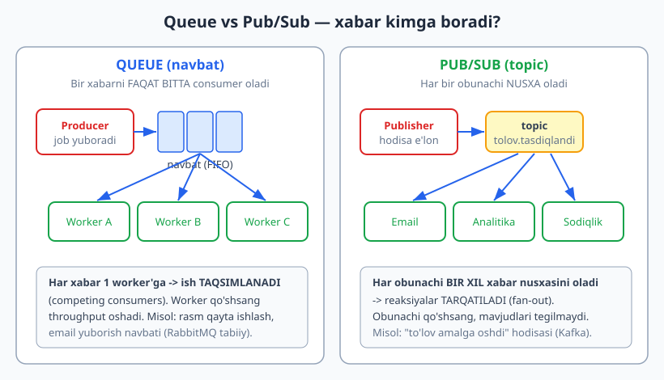
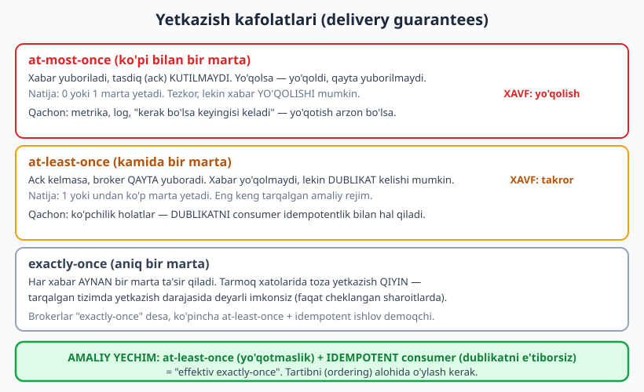
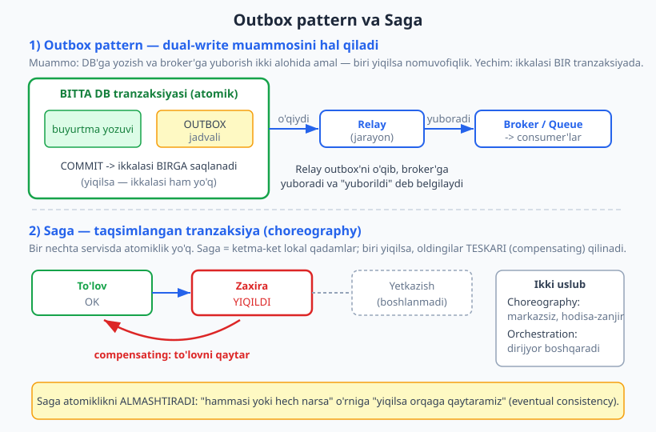

# 21 — Message queue va asinxron aloqa

[⬅️ Oldingi: 20 — Keshlash strategiyalari](./20-keshlash.md) · [🏠 README](./README.md) · [Keyingi: 22 — CAP, consistency va replikatsiya ➡️](./22-cap-consistency-replikatsiya.md)

---

> **Bu bobda:** [15-bobdagi](./15-event-driven-cqrs.md) event-driven g'oyalarni endi **infratuzilma** darajasiga tushiramiz: xabarni A nuqtadan B nuqtaga **broker** (vositachi) orqali yetkazadigan **message queue** (xabar navbati). Avval **nega navbat** kerakligini ko'ramiz — decoupling (bog'liqlikni uzish), buferlash, **load leveling** (yuk tekislash — pik yukni navbatga olib, sekin-asta ishlash) va resilience (chidamlilik). Keyin ikki asosiy modelni ajratamiz: **queue** (bir consumer oladi) vs **pub/sub** (topic, hamma obunachi nusxa oladi). Brokerlar dunyosini taqqoslaymiz: **Kafka** (taqsimlangan log/stream) vs **RabbitMQ** (an'anaviy AMQP broker). Eng nozik mavzu — **yetkazish kafolatlari** (at-most-once / at-least-once / exactly-once) va nega "exactly-once" amalda **at-least-once + idempotentlik** orqali hal qilinishi. Oxirida ishlaydigan TypeScript misol: in-memory navbat + idempotent consumer + **Dead Letter Queue** (DLQ) + **Outbox pattern** va **Saga**.
>
> **Trade-off eslatmasi / Halollik:** Navbat tizimga moslashuvchanlik va chidamlilik beradi, lekin BEPUL emas — endi tizimingiz **asinxron** (javob darrov emas, **eventual consistency**), tartib (ordering) va dublikat muammolari paydo bo'ladi, va broker yangi **buzilish nuqtasi** (operatsion yuk). Bu bobdagi TS misollari (`_v_21.ts`, `_v_21b.ts`) `$env:TEMP\arx-probe` da `tsx` bilan ishga tushirilgan va `tsc --strict` bilan tekshirilgan (bob oxirida hisobot); barcha "ishga tushirsak" natijalari haqiqiy. Broker tanlovi (Kafka vs RabbitMQ) va masshtab raqamlari — konseptual/trade-off tahlili, "ishladi" emas.

---

## Nega navbat? Sinxron chaqiruvning og'rig'i

Avval muammoni his qilaylik. E-commerce backend tasavvur qiling: foydalanuvchi "Buyurtma ber" tugmasini bosadi. Sinxron (to'g'ridan-to'g'ri) yondashuvda buyurtma servisi hamma ishni O'ZI, ketma-ket bajaradi:

```ts
// SINXRON: foydalanuvchi HAMMASI tugaguncha kutadi
async function buyurtmaBer(b: Buyurtma): Promise<void> {
  await saqla(b);                 // 20 ms
  await tolovServisi.yech(b);     // 800 ms (tashqi API)
  await emailServisi.yubor(b);    // 1200 ms (SMTP sekin)
  await inventar.kamaytir(b);     // 100 ms
  await analitika.qayd(b);        // 300 ms
  // foydalanuvchi ~2.4 soniya kutdi, va agar email servisi
  // YIQILSA — butun buyurtma yiqiladi (email tufayli!)
}
```

Bu kodda ikki katta muammo bor:

1. **Sekinlik:** foydalanuvchi eng sekin qadamni (email, 1.2 s) ham kutadi, garchi unga email darrov kerak bo'lmasa.
2. **Mo'rtlik (fragility):** email servisi yiqilsa, buyurtma ham yiqiladi. Aslida email — ikkilamchi ish; buyurtma usiz ham yaratilishi kerak edi.

**Navbat** bu ikkalasini ham yechadi. G'oya oddiy: muhim/tez ishni (buyurtmani saqlash) darrov bajaramiz, qolgan ikkilamchi ishlarni (email, analitika) **navbatga tashlaymiz** va keyinroq, alohida ishchi (worker) bajaradi.

```ts
// ASINXRON: tez javob, ikkilamchi ishlar navbatga
async function buyurtmaBerYaxshi(b: Buyurtma): Promise<void> {
  await saqla(b);                          // 20 ms — muhim
  await navbat.yubor("buyurtma.yaratildi", b); // ~1 ms — faqat navbatga qo'shdik
  // foydalanuvchiga DARROV "qabul qilindi" deymiz (~25 ms)
}
// Email/analitika/inventar — alohida worker'lar navbatdan o'qib, o'z vaqtida bajaradi.
```

Navbat bizga to'rt asosiy foyda beradi. Bularni yodlab oling — har biri trade-off bilan keladi:

- **Decoupling (bog'liqlikni uzish):** publisher (xabar yuboruvchi) consumer'ni (qabul qiluvchi) **bilmaydi**. Buyurtma servisi email servisining mavjudligini ham bilmasligi mumkin. Yangi consumer qo'shsangiz — publisher kodi tegilmaydi (bu — [05-bobdagi](./05-solid.md) OCP printsipi tizim darajasida).
- **Buferlash (buffering):** publisher consumer'dan tezroq xabar ishlab chiqarsa, navbat ularni saqlab turadi. Consumer o'z tezligida o'qiydi.
- **Load leveling (yuk tekislash):** "Black Friday" da minglab buyurtma bir lahzada keladi. Sinxron tizim qulaydi. Navbat pik yukni **buferda saqlaydi**, worker'lar uni sekin-asta (lekin barqaror) ishlaydi. Tizim yiqilmaydi — faqat kechikadi.
- **Resilience (chidamlilik):** consumer (email worker) yiqilsa, xabarlar navbatda **saqlanib qoladi**. Worker qayta ko'tarilgach, qolgan ishni davom ettiradi. Xabar yo'qolmaydi.

> **Eslatma:** Navbat — bu "sekin javob beradigan ishlarni keyinga surish" mexanizmi, lekin u **javobni yo'qotmaydi**, faqat **vaqtda suradi**. Foydalanuvchi "buyurtmangiz qabul qilindi" deydi (darrov), email esa 2 soniyadan keyin keladi. Bu ko'p hollarda mukammal — chunki mijozga email AYNAN o'sha lahzada kerak emas edi.

> **Trade-off:** navbat moslashuvchanlik beradi, lekin tizimni **asinxron** qiladi. Endi "buyurtma yaratildi" va "email yuborildi" o'rtasida vaqt bor — bu **eventual consistency** ([15-bob](./15-event-driven-cqrs.md)). Foydalanuvchi "buyurtmam qani?" deb so'rasa, hali email kelmagan bo'lishi mumkin. Bunday "tezda mos keladi, lekin darrov emas" holatni mahsulot dizayni hisobga olishi shart.

---

## Queue vs Pub/Sub — xabar kimga boradi?

Eng muhim konseptual ajrim. Ikkala model ham broker ishlatadi, lekin xabar **kimga yetishi** tubdan farq qiladi.

**Queue (navbat):** bir xabarni **FAQAT BITTA** consumer oladi. Agar uchta worker bir navbatdan o'qisa, har xabar ulardan **bittasiga** boradi — ish ular orasida **taqsimlanadi**. Bu naqsh **competing consumers** (raqobatlashuvchi consumer'lar) deyiladi: worker qancha ko'p bo'lsa, throughput (o'tkazuvchanlik) shuncha yuqori.

**Pub/Sub (publish/subscribe):** publisher xabarni **topic**ga (mavzuga) e'lon qiladi; har bir **obunachi** (subscriber) xabarning **o'z nusxasini** oladi. Bitta "to'lov tasdiqlandi" hodisasini email, analitika va sodiqlik servislari — uchalasi ham mustaqil oladi. Bu **fan-out** (tarqatish): bir hodisa, ko'p reaksiya.



Farqni intuitiv tushunish uchun o'xshatish:

- **Queue** — pochta bo'limidagi navbat: bir mijozni bir kassir qabul qiladi. Kassir ko'p bo'lsa — navbat tez yuriydi. Hech bir mijoz ikki kassirga bormaydi.
- **Pub/Sub** — radio eshittirish: bitta diktor gapiradi, har bir radio uni mustaqil eshitadi. Yangi radio yoqsangiz — u ham eshitadi, diktor bilmaydi.

> **Eslatma:** Ko'p brokerlar **ikkalasini** ham qo'llab-quvvatlaydi. RabbitMQ'da "exchange" turi orqali (direct = queue, fanout = pub/sub) tanlaysiz. Kafka'da **consumer group** g'oyasi orqali: bir guruh ichidagi consumer'lar ishni **taqsimlaydi** (queue kabi), turli guruhlar esa **har biri nusxa** oladi (pub/sub kabi). Ya'ni Kafka'da bu ajrim "yo u, yo bu" emas — guruh konfiguratsiyasi bilan boshqariladi.

> **Amaliyotda:** "Email yuborish, rasmni qayta o'lchamlash, hisobot generatsiyasi" kabi **ish topshiriqlari** uchun — queue (ish taqsimlansin, har topshiriq bir marta bajarilsin). "Buyurtma yaratildi, foydalanuvchi ro'yxatdan o'tdi" kabi **hodisalar** uchun, ko'p servis qiziqsa — pub/sub.

---

## Broker dunyosi: Kafka vs RabbitMQ

Ikki eng mashhur broker tubdan farqli falsafaga ega. "Qaysi biri yaxshi?" — noto'g'ri savol; "qaysi biri SIZNING muammongizga mos?" — to'g'ri savol.

> **Diqqat:** Quyidagi taqqoslash — **konseptual** trade-off tahlili. Aniq raqamlar (throughput, latency) o'rnatishingiz, yukingiz va konfiguratsiyangizga keskin bog'liq — bu yerda raqam bermaymiz, faqat **xarakter** farqini ko'rsatamiz.

```text
                 RabbitMQ                      Kafka
              (an'anaviy broker)          (taqsimlangan LOG/stream)
  ----------------------------------------------------------------
  Model:      AMQP, smart broker         Distributed commit log
              "xabarni marshrutla         "xabarlarni TARTIBDA
               va yetkaz, keyin o'chir"     LOG'ga yoz, saqla"
  Marshrut:   boy (exchange, routing      oddiy (topic + partition)
              key, binding) — moslashuvchan
  O'qish:     consumer oladi -> o'chadi   consumer OFFSET'ni siljitadi;
              (xabar bir marta iste'mol)   xabar SAQLANADI (qayta o'qish
                                           mumkin — replay)
  Throughput: o'rta-yuqori                juda yuqori (ketma-ket disk
                                           yozuvi, partition'lar bilan)
  Kuchli tomon: murakkab marshrutlash,    katta hajmli stream, event
              per-message ack, prioritet   sourcing, qayta o'qish, log
  ----------------------------------------------------------------
```

Kalit farqni shunday tushuning:

- **RabbitMQ** — "aqlli pochtachi". Xabarni qabul qiladi, kerakli qutilarga (queue) marshrutlaydi, consumer olib bo'lgach **o'chiradi**. Boy marshrutlash qoidalari, har xabarni alohida tasdiqlash (ack), prioritet navbatlar. **Task queue** (ish navbati) uchun ajoyib.
- **Kafka** — "to'xtovsiz jurnal (log)". Xabarlarni **partition** (bo'lak) ichida **tartibda** disk'ga yozadi va **saqlaydi** (masalan, 7 kun yoki cheksiz). Consumer xabarni "olib o'chirmaydi" — u faqat **offset**ini (qaysi joygacha o'qiganini) eslab qoladi. Shuning uchun xabarni **qayta o'qish** (replay) mumkin — yangi consumer tarixni boshidan o'qiy oladi. Bu **event sourcing** ([15-bob](./15-event-driven-cqrs.md)) va katta hajmli **stream** ishlovi uchun ideal.

> **Trade-off:** Kafka'ning "saqlash va qayta o'qish" qobiliyati kuchli, lekin u operatsion jihatdan **og'irroq** (partition, replikatsiya, ZooKeeper/KRaft, consumer group balansi). RabbitMQ oddiyroq o'rnatiladi va boshqariladi. Agar sizga shunchaki "email yuborish navbati" kerak bo'lsa, Kafka — **over-engineering** ([06-bob](./06-dry-kiss-yagni.md)). Agar sizga "kuniga milliardlab event, qayta o'qish, ko'p iste'molchi guruhi" kerak bo'lsa — RabbitMQ kerakli masshtabga yetmasligi mumkin.

> **Eslatma (boshqa variantlar):** RabbitMQ va Kafka — yagona tanlov emas. Bulutda boshqariladigan navbatlar bor (masalan AWS SQS — sodda queue; SNS — pub/sub; Google Pub/Sub). Redis ham ro'yxat (list) yoki Streams orqali yengil navbat sifatida ishlatiladi. Tanlov — **operatsion yuk vs imkoniyat** trade-off'i: boshqariladigan xizmat kam tashvish, lekin moslik kamroq va narx bor.

---

## Yetkazish kafolatlari — eng ko'p adashiladigan mavzu

Tarmoq ishonchsiz ([SPEC: 8 fallacy](./22-cap-consistency-replikatsiya.md) — "tarmoq ishonchli" — yolg'on). Xabar yo'lda yo'qolishi, ack (tasdiq) qaytmasligi mumkin. Shuning uchun broker **qancha marta** xabar yetkazishini kafolatlaydi — uch daraja bor:



- **At-most-once (ko'pi bilan bir marta):** xabar yuboriladi, ack kutilmaydi. Yo'qolsa — yo'qoldi. Natija: **0 yoki 1** marta yetadi. Tez, lekin yo'qotish mumkin. Qachon: metrika, log — bitta o'lchov yo'qolsa, keyingisi keladi.
- **At-least-once (kamida bir marta):** ack kelmasa, broker xabarni **qayta** yuboradi. Yo'qolmaydi, lekin **dublikat** kelishi mumkin. Natija: **1 yoki undan ko'p** marta. Bu — eng keng tarqalgan amaliy rejim.
- **Exactly-once (aniq bir marta):** har xabar **aynan bir marta** ta'sir qiladi. Eshitilishi chiroyli, lekin...

> **Diqqat (eng muhim halollik):** "exactly-once" — taqsimlangan tizimda yetkazish darajasida **deyarli imkonsiz** (faqat juda cheklangan sharoitlarda, masalan bitta broker ichida tranzaksion ravishda). Sababi: xabar yuborildi, lekin ack tarmoqda yo'qoldi — yuboruvchi "yetdimi yoki yo'qmi?" bilmaydi. Qayta yuborsa — dublikat; yubormasa — yo'qotish. Brokerlar "exactly-once semantics" desa, ular ko'pincha **at-least-once yetkazish + idempotent ishlov** kombinatsiyasini nazarda tutadi, sehrli yetkazish emas.

**Amaliy yechim — qoldiqning tagiga chizing:** **at-least-once** (yo'qotmaslik uchun) **+ idempotent consumer** (dublikatni e'tiborsiz qoldirish uchun) = "effektiv exactly-once". Ya'ni broker xabarni bir necha marta yetkazsa ham, consumer uni **bir martagina ta'sir qildiradi**. Buni keyingi bo'limda kod bilan ko'ramiz.

> **Eslatma (tartib / ordering):** Yana bir nozik nuqta — xabarlar **qaysi tartibda** yetishi. Ko'p broker faqat **bir partition/queue ichida** tartibni kafolatlaydi, hammasi bo'ylab emas. Kafka'da bir kalit (masalan `userId`) bo'yicha xabarlar bir partition'ga tushadi va o'sha userning xabarlari tartibda bo'ladi — lekin turli userlar aralash kelishi mumkin. "Global tartib kerak" desangiz — bu masshtabni keskin cheklaydi (bitta partition). Ko'pincha sizga faqat **kalit bo'yicha tartib** kerak.

---

## Idempotentlik, backpressure va Dead Letter Queue

### Idempotentlik — dublikatga qarshi qalqon

**Idempotent** amal — bir necha marta bajarilsa ham, natija **bir marta bajarilgandek**. "Chiroqni o'chir" — idempotent (ikki marta o'chirsangiz ham o'chgan). "Hisobdan 100 yech" — idempotent EMAS (ikki marta yechsangiz, 200 ketadi). At-least-once dunyosida har consumer **idempotent** bo'lishi shart, aks holda dublikat xabar pulni ikki marta yechadi.

Asosiy texnika: har xabarga **yagona id** (message id) bering va consumer "men buni allaqachon ishlaganman" deb **eslab qolsin**:

```ts
class IdempotentConsumer {
  private korilgan = new Set<string>(); // ishlangan xabar id'lari
  qoldiq = 0;
  takror = 0;

  qabulQil(xabarId: string, summa: number): void {
    if (this.korilgan.has(xabarId)) {
      this.takror++;
      return; // takror — ta'sir YO'Q
    }
    this.korilgan.add(xabarId);
    this.qoldiq += summa; // haqiqiy ta'sir faqat BIR marta
  }
}
```

Ishga tushirsak (`_v_21.ts` dan, haqiqiy natija):

```text
=== 2) Idempotent consumer (at-least-once -> takror keladi) ===
Jami kelgan: 6, haqiqiy qoldiq: 175 (kutilgan 175), takror tashlandi: 3
```

To'lov xabarlari `[100, 50, 100(takror), 25, 50(takror), 50(takror)]` keldi. Idempotent bo'lmaganda qoldiq `375` bo'lardi (xato!). Idempotent consumer dublikatlarni tashladi — qoldiq to'g'ri `175`.

> **Amaliyotda:** real tizimda "ko'rilgan id'lar"ni `Set` da emas, **doimiy saqlash**da (DB, Redis) tutasiz, aks holda consumer qayta ishga tushganda eslamaydi. Yana bir keng usul — **idempotency key**ni biznes yozuviga unique constraint sifatida qo'yish: dublikat insert DB darajasida rad etiladi. Eslab qolish jadvali cheksiz o'smasligi uchun unga TTL (eskini tozalash) qo'yiladi.

### Backpressure — "sekinroq, men ulgurmayapman"

Agar publisher consumer'dan **tezroq** xabar ishlab chiqarsa, navbat cheksiz o'sadi — xotira tugaydi, tizim qulaydi. **Backpressure** (orqaga bosim) — bu "navbat to'ldi, sekinlash" signali. Eng oddiy shakli — **cheklangan navbat** (bounded queue): to'lsa, yangi xabarni **rad etadi** (yoki publisher bloklanadi):

```ts
class CheklanganNavbat<T> {
  private q: T[] = [];
  rad = 0;
  constructor(private hajm: number) {}
  yubor(x: T): boolean {
    if (this.q.length >= this.hajm) { this.rad++; return false; } // backpressure
    this.q.push(x); return true;
  }
}
```

Ishga tushirsak (`_v_21b.ts` dan, haqiqiy natija):

```text
=== Backpressure: hajmi 3 li navbatga 5 xabar ===
Qabul qilingan: 3, rad etilgan (backpressure): 2, navbatda: 3
```

Hajmi 3 li navbatga 5 xabar yuborildi — 3 tasi sig'di, 2 tasi rad etildi. Real tizimda bu "rad etish" publisher'ga "sekinlash" deb signal beradi (yoki retry bilan keyinroq qaytadi).

> **Trade-off:** backpressure'siz tizim "tez ishlayotgandek" ko'rinadi — to xotira tugab, **butunlay qulaguncha**. Cheklangan navbat ataylab "yo'q, hozir bo'lmaydi" deydi — bu yoqimsiz, lekin tizimni **barqaror** tutadi. Resilience ([23-bob](./22-cap-consistency-replikatsiya.md) yaqinida) — qulashdan ko'ra, nazorat bilan sekinlash yaxshi.

### Dead Letter Queue (DLQ) — "o'lik xabar"lar uchun qabriston

Ba'zi xabarlar **hech qachon** muvaffaqiyatli ishlanmaydi — buzilgan ma'lumot, mavjud bo'lmagan foydalanuvchi, kod xatosi. Bunday **poison message** (zaharli xabar) navbatda qolsa, consumer uni qayta-qayta sinab, **boshqa hammani bloklaydi**. Yechim: **N marta** muvaffaqiyatsiz urinishdan keyin xabarni **Dead Letter Queue**ga (DLQ) ko'chirish — keyin odam tekshiradi, asosiy oqim esa davom etadi:

```ts
ishlat(ishlovchi: Ishlovchi<T>): { ishlandi: number; dlqGa: number } {
  // ... navbatdan xabar olamiz
  try {
    ishlovchi(x.body, x.id);
  } catch (e) {
    x.urinish++;
    if (x.urinish >= this.maxUrinish) this.dlq.push(x); // 3 urinishdan keyin DLQ
    else this.q.push(x);                                // aks holda requeue
  }
}
```

Ishga tushirsak (`_v_21.ts` dan, haqiqiy natija):

```text
=== 1) Navbat + DLQ (3 urinishdan keyin DLQ) ===
  [ok] ishlandi: "salom"
  [requeue] xabar m2 qayta navbatga (urinish 1)
  [ok] ishlandi: "dunyo"
  [requeue] xabar m2 qayta navbatga (urinish 2)
  [DLQ] xabar m2 3 urinishdan keyin DLQ'ga: ishlov bermadi (poison message)
Yakun: ishlandi=2, DLQ'ga=1, DLQ hajmi=1
```

Ko'ryapsizmi: `m2` (zaharli xabar) ikki marta qayta urinildi, uchinchidan keyin DLQ'ga ketdi — `m1` va `m3` esa muvaffaqiyatli ishlandi. Bitta buzuq xabar butun navbatni bloklamadi.

> **Amaliyotda:** real broker'da DLQ — sozlanadigan funksiya (RabbitMQ'da `x-dead-letter-exchange`, SQS'da redrive policy). Odatda **retry**ni darrov emas, **eksponensial kechikish** (exponential backoff — har urinishda kutish vaqti ikki barobar) bilan qilasiz, va `maxUrinish` dan keyin DLQ'ga yuborasiz. DLQ'ni **monitoring** qilish shart — unda xabar to'planishi "nimadir buzilgan" signali.

---

## Outbox pattern — dual-write muammosini hal qilish

Endi eng nozik amaliy muammoga keladik. Buyurtmani yaratganda ikki ish qilish kerak: (1) DB'ga buyurtmani **yozish**, (2) broker'ga "buyurtma.yaratildi" xabarini **yuborish**. Sodda yondashuv — ketma-ket:

```ts
// XAVFLI: dual-write (ikki alohida yozuv)
await db.buyurtmaYoz(b);              // 1-amal: DB
await broker.yubor("buyurtma.yaratildi", b); // 2-amal: broker
```

Muammo: bular **ikki alohida tizim**, atomik EMAS. Tasavvur qiling, 1-amal muvaffaqiyatli bo'ldi, lekin 2-amaldan oldin servis **qulaydi** (yoki broker vaqtincha o'chiq). Natija: DB'da buyurtma **bor**, lekin hech qanday xabar **yuborilmagan** — email kelmaydi, inventar kamaymaydi. Yoki teskari: xabar yuborildi, lekin DB yozuvi yiqildi — xabar mavjud bo'lmagan buyurtma haqida. Bu **dual-write muammosi** — ikki tizimga atomik yozib bo'lmaydi.

**Outbox pattern** buni nafis hal qiladi: xabarni broker'ga yubormay, uni **o'sha DB tranzaksiyasi ichida** maxsus `outbox` jadvaliga yozasiz. DB tranzaksiyasi atomik — **buyurtma yozuvi va outbox yozuvi BIRGA** saqlanadi (yoki ikkalasi ham yo'q). Keyin alohida **relay** (yetkazuvchi) jarayoni outbox'ni o'qib, broker'ga yuboradi va "yuborildi" deb belgilaydi.



```ts
class SoxtaDB {
  buyurtmalar: { id: string; holat: string }[] = [];
  outbox: OutboxYozuv[] = [];
  // Bitta atomik tranzaksiya: biznes yozuvi + outbox yozuvi BIRGA
  buyurtmaYaratTranzaksiya(buyurtmaId: string, hodisaId: string): void {
    this.buyurtmalar.push({ id: buyurtmaId, holat: "yaratildi" });
    this.outbox.push({ id: hodisaId, hodisa: `buyurtma.yaratildi:${buyurtmaId}`, yuborildi: false });
  }
}
// Alohida relay outbox'ni o'qib broker'ga yuboradi va belgilaydi
function outboxRelay(db: SoxtaDB, navbat: Navbat<string>): number {
  let yuborilgan = 0;
  for (const yozuv of db.outbox) {
    if (!yozuv.yuborildi) { navbat.yubor(yozuv.id, yozuv.hodisa); yozuv.yuborildi = true; yuborilgan++; }
  }
  return yuborilgan;
}
```

Ishga tushirsak (`_v_21.ts` dan, haqiqiy natija):

```text
=== 3) Outbox pattern (atomik DB + xabar, keyin relay) ===
DB: 2 buyurtma, outbox: 2 yozuv (hali yuborilmagan)
Relay: 2 xabar broker'ga yuborildi
  [broker->consumer] evt-1: buyurtma.yaratildi:B-100
  [broker->consumer] evt-2: buyurtma.yaratildi:B-101
Outbox'da yuborilmagan qolgan: 0 (0 bo'lsa hammasi yetkazildi)
```

Endi servis relay'dan **oldin** qulasa ham — DB'da outbox yozuvi turibdi. Servis ko'tarilgach, relay uni o'qib yuboradi. Xabar **yo'qolmaydi**.

> **Diqqat:** Outbox relay'i odatda **at-least-once** ishlaydi — relay xabar yuborib, "yuborildi" deb belgilashdan oldin qulasa, qayta ishga tushganda **o'sha xabarni yana** yuboradi. Demak outbox **dublikatdan qutqarmaydi**; u faqat **yo'qotmaslik**ni kafolatlaydi. Dublikatni hal qilish — yana **idempotent consumer**ning vazifasi. Outbox va idempotentlik birga ishlaydi: outbox "yo'qotma" deydi, idempotentlik "takrorni e'tiborsiz qoldir" deydi.

> **Eslatma (transactional outbox vs CDC):** Relay outbox'ni ikki yo'l bilan o'qishi mumkin: (1) **polling** — jadvalni davriy so'rab turish (oddiy, lekin kechikish va DB yuki); (2) **Change Data Capture (CDC)** — DB'ning tranzaksiya jurnalini (WAL) o'qish (masalan Debezium) va o'zgarishlarni darrov broker'ga oqizish (samaraliroq, lekin murakkabroq infratuzilma). Bu — yana bir **soddalik vs samaradorlik** trade-off'i.

---

## Saga — taqsimlangan tranzaksiya

Outbox bir servis ichidagi atomiklikni hal qildi. Lekin **bir nechta servis** bo'ylab atomiklik kerak bo'lsa-chi? Misol: buyurtma jarayonida **to'lov** (to'lov servisi), **zaxira** (inventar servisi) va **yetkazish** (logistika servisi) — har biri o'z DB'siga ega ([18-bobdagi](./18-malumotlar-bazasi-tanlovi.md) database-per-service). Bularni bitta DB tranzaksiyasiga o'rab bo'lmaydi.

**Saga** — bu muammoning yechimi: bitta katta tranzaksiya o'rniga, **ketma-ket lokal tranzaksiyalar** zanjiri. Agar zanjirning bir bo'g'ini **yiqilsa**, oldingi muvaffaqiyatli qadamlar **compensating action** (tuzatuvchi/teskari amal) bilan bekor qilinadi. "To'lovni yechdik, lekin zaxira yo'q" bo'lsa — to'lovni **qaytaramiz**.

Saga ikki uslubda quriladi:

- **Choreography (markazsiz):** har servis hodisa tinglaydi va o'z hodisasini chiqaradi. Markaziy boshqaruvchi yo'q — servislar "raqsga tushadi". Ajralgan (decoupled), lekin **butun oqimni** bir joyda ko'rish qiyin.
- **Orchestration (markazlashgan):** maxsus **orchestrator** (dirijyor) har servisga ketma-ket buyruq beradi va natijani kutadi. Oqim bir joyda ko'rinadi va boshqarish oson, lekin orchestrator **markaziy bog'liqlik** nuqtasi.

```text
CHOREOGRAPHY (markazsiz, hodisa-zanjir):
  Buyurtma --[buyurtma.yaratildi]--> To'lov --[tolov.tasdiqlandi]-->
  Inventar --[zaxira.ajratildi]--> Yetkazish
  (har servis keyingisini "biluvchi" emas — faqat hodisaga reaksiya)

ORCHESTRATION (markazlashgan, dirijyor):
  [Orchestrator]: to'lov qil -> (ok) -> zaxira ajrat -> (ok) -> yetkazishni boshla
  (yiqilsa orchestrator compensating buyruqlarini beradi)
```

Compensating action'ni kod bilan ko'raylik — choreography'da zaxira qadami yiqilsa, to'lov teskari qilinadi:

```ts
function sagaIshlat(qadamlar: Qadam[]): { holat: "tugadi" | "bekor"; bajarilgan: string[] } {
  const bajarilgan: Qadam[] = [];
  for (const q of qadamlar) {
    if (!q.bajar()) { // yiqildi
      for (const b of bajarilgan.reverse()) b.bekorQil(); // TESKARI tartibda compensating
      return { holat: "bekor", bajarilgan: bajarilgan.map((x) => x.nom) };
    }
    bajarilgan.push(q);
  }
  return { holat: "tugadi", bajarilgan: bajarilgan.map((x) => x.nom) };
}
```

Ishga tushirsak (`_v_21b.ts` dan, haqiqiy natija):

```text
=== Saga: zaxira qadami yiqiladi -> compensating ===
  qadam "tolov": OK
  qadam "zaxira": YIQILDI
  compensating "tolov": bekor qilindi
Saga holati: bekor, yakuniy pul: 1000 (1000 ga qaytdi=compensating ishladi), band: 1
```

To'lov muvaffaqiyatli bo'ldi (pul 1000 dan 800 ga tushdi), keyin zaxira yiqildi — saga to'lovni **qaytardi** (pul yana 1000 ga keldi). Tizim izchil holatda qoldi.

> **Diqqat:** Saga **ACID atomikligini** ([SPEC: ACID](./18-malumotlar-bazasi-tanlovi.md)) BERMAYDI. Klassik tranzaksiyada "yiqilsa hech narsa sodir bo'lmagandek" — saga'da esa qadamlar **haqiqatan bajariladi**, keyin **teskari** qilinadi. Bu vaqtda tizim oraliq, nomuvofiq holatda bo'ladi ("pul yechildi, lekin hali qaytarilmadi") — **eventual consistency**. Bundan tashqari, ba'zi amallarni **bekor qilib bo'lmaydi** (email yuborilgan — qaytarib ololmaysiz; faqat "uzr" emaili yuborasiz). Saga loyihalashda har qadam uchun "compensating action qanday bo'ladi?" degan savol kritik.

> **Anti-pattern:** Saga'ni **har joyda** ishlatish. Agar barcha ma'lumot bir servisning bir DB'sida bo'lsa — oddiy **ACID tranzaksiya** ishlating, saga emas! Saga — faqat **servis chegaralari** bo'ylab atomiklik kerak bo'lganda (database-per-service mikroservis). Monolit yoki modulli monolitda bitta tranzaksiya yetarli; saga keraksiz murakkablik.

---

## Hammasini birga: qachon nima ishlatish

Mavzularni amaliy qarorlar jadvaliga jamlaymiz:

```text
EHTIYOJ                                    YECHIM
-------------------------------------------------------------------
Sekin ishni javobdan ajratish        ->   navbatga tashla (async)
Ish bir marta bajarilsin, taqsimlansin -> queue (competing consumers)
Bir hodisa, ko'p mustaqil reaksiya   ->   pub/sub (topic, fan-out)
Katta hajmli stream + qayta o'qish   ->   Kafka (log-based)
Murakkab marshrutlash, task queue    ->   RabbitMQ (AMQP)
Xabar yo'qolmasligi                  ->   at-least-once
Dublikat zarar bermasin              ->   idempotent consumer (message id)
Navbat to'lib qolmasin               ->   backpressure (bounded queue)
Ishlamaydigan xabar oqimni bloklamasin -> Dead Letter Queue (N urinish)
DB + xabar atomik bo'lsin (1 servis) ->   Outbox pattern
Ko'p servis bo'ylab atomiklik        ->   Saga (compensating action)
```

> **Amaliyotda:** Telegram-bot backend misoli ([tgbot-js kitobi](../tgbot-js/README.md)). Bot 100 000 foydalanuvchiga xabar yuborishi kerak. Sinxron qilsangiz — bot bloklanadi va Telegram rate-limit'ga uriladi. Yechim: har "xabar yuborish" topshirig'ini **navbatga** (queue) tashlash, worker'lar uni rate-limit'ga rioya qilib, sekin-asta yuboradi (load leveling). Foydalanuvchi yuborilmasa (bloklagan) — N urinishdan keyin **DLQ**ga. Bu — aynan shu bobdagi naqshlarning real qo'llanilishi.

Markaziy saboq o'sha — **hamma narsa trade-off**. Navbat decoupling, chidamlilik va masshtablash beradi, lekin tizimni asinxron qiladi, eventual consistency, dublikat va tartib muammolarini, hamda broker operatsion yukini olib keladi. Muammo HAQIQATAN paydo bo'lganda qo'llang — "modaga ergashib" emas.

---

## Mashqlar

### Oson

**1-mashq.** Quyidagi har stsenariy uchun **queue** yoki **pub/sub** kerakligini ayting va sababini bering: (a) yuklangan rasmni 3 o'lchamga qayta o'lchash topshirig'i; (b) "foydalanuvchi ro'yxatdan o'tdi" hodisasi — email, analitika va CRM bir vaqtda qiziqadi; (c) hisobot generatsiyasi navbati, 5 ta worker bilan.

**2-mashq.** O'z so'zlaringiz bilan tushuntiring: nega **at-most-once** metrika/log uchun maqbul, lekin to'lov uchun **xavfli**? Va nega to'lov uchun at-least-once + idempotentlik tanlanadi?

**3-mashq.** **Idempotent** va idempotent **emas** amallarga ikkitadan misol keltiring (kundalik hayotdan yoki koddan). "Hisobni 100 ga to'ldir (set qil)" idempotentmi yoki yo'qmi? Nega?

**4-mashq.** Quyidagi consumer **idempotentmi**? Agar emas bo'lsa, nima xato va qanday tuzatasiz?
```ts
function tolovQabulQil(xabar: { userId: string; summa: number }) {
  balanslar[xabar.userId] += xabar.summa; // ?
}
```

### O'rta

**5-mashq.** **Dual-write muammosi** nima? "DB'ga yoz, keyin broker'ga yubor" kodida aniq qaysi nuqtada tizim qulasa nomuvofiqlik kelib chiqadi? Outbox pattern buni qanday hal qiladi?

**6-mashq.** Kafka va RabbitMQ o'rtasidagi **eng tub** falsafiy farqni bir jumlada ayting. Keyin: "consumer xabarni o'qigach, u o'chadimi?" degan savolga har ikkisi uchun javob bering.

**7-mashq.** **Backpressure** nima va u bo'lmasa nima sodir bo'ladi? Cheklangan navbat (bounded queue) backpressure'ni qanday amalga oshiradi? "Rad etish" o'rniga yana qanday strategiyalar bor?

**8-mashq.** Bir messaging tizimida "tartib (ordering) global kafolatlangan" deb da'vo qilishmoqda. Nega bu da'vo masshtabga shubha tug'diradi? Kafka tartibni qaysi darajada kafolatlaydi va "global tartib" nimani qurbon qiladi?

**9-mashq (KOD).** Idempotent consumer yozing: `qabulQil(xabarId, summa)` — bir xil `xabarId` ikkinchi marta kelsa, `qoldiq`ga ta'sir qilmasin. `["m1":100, "m2":50, "m1":100, "m3":25]` ketma-ketlik uchun yakuniy `qoldiq` va `takror` sonini ayting, keyin kodni ishga tushirib tekshiring.

### Qiyin

**10-mashq.** Quyidagi da'vo to'g'rimi: "Bizning broker exactly-once kafolatlaydi, shuning uchun consumer'larni idempotent qilish shart emas"? Halol javob bering va sababini tushuntiring.

**11-mashq (KOD — DLQ bilan navbat).** In-memory navbat yozing: xabar ishlovi xato tashlasa, qayta navbatga qo'shilsin; **3 urinishdan** keyin **DLQ**ga ko'chsin. `["ok1", "ZAHARLI", "ok2"]` (faqat "ZAHARLI" doim yiqiladi) uchun necha xabar ishlanadi va DLQ hajmi qancha bo'ladi? Ishga tushirib tekshiring.

**12-mashq (Saga loyihalash).** E-commerce buyurtma jarayonini saga sifatida loyihalang: **to'lov -> zaxira ajratish -> yetkazishni boshlash**. Har qadam uchun **compensating action**ni yozing. "Yetkazish boshlangandan keyin" bekor qilish kerak bo'lsa-chi — har qadam teskari qilinadimi? Choreography yoki orchestration tanlang va sababini ayting.

**13-mashq (loyihalash).** Sizga "video yuklash -> transkodlash (sekin, 30 s) -> thumbnail yaratish -> bildirishnoma" oqimi kerak. Qaysi qismlar sinxron, qaysilari asinxron (navbat)? Qaysi model (queue/pub/sub)? Backpressure va DLQ qayerda kerak? Diagramma (matn) bilan chizing.

**14-mashq (anti-pattern aniqlash).** Bir jamoa monolit ilovada, hamma ma'lumot **bitta DB**da bo'lsa ham, "to'lov + buyurtma yozuvi"ni saga bilan ikki qadamga bo'lib, compensating action yozgan. Bu yaxshi qarormi? Nega? To'g'ri yondashuv qanday?

---

<details markdown="1">
<summary>Yechimlar</summary>

### 1-mashq yechimi
- **(a) Queue.** Rasm qayta o'lchash — **ish topshirig'i**: har topshiriq **bir marta** bajarilsin va worker'lar orasida **taqsimlansin** (competing consumers). Bir rasmni ikki worker qayta o'lchashi keraksiz.
- **(b) Pub/Sub.** "Ro'yxatdan o'tdi" — **hodisa**: email, analitika, CRM — uchalasi ham **mustaqil** qiziqadi, har biri **o'z nusxasini** olishi kerak (fan-out). Queue bo'lsa, faqat bittasiga borib qolardi.
- **(c) Queue.** Hisobot topshirig'i — yana **ish**: 5 worker ishni **taqsimlasin**, throughput oshsin.

### 2-mashq yechimi
At-most-once'da xabar ack kutmaydi — yo'qolsa yo'qoldi. **Metrika/log** uchun maqbul: bitta o'lchov yo'qolsa zarar kichik, keyingisi keladi. **To'lov** uchun xavfli: agar "to'lov amalga oshdi" xabari yo'qolsa, mijozdan pul yechildi-yu, lekin buyurtma yaratilmadi — pul "havoda" qoldi. To'lovda **at-least-once** (yo'qotmaslik) tanlanadi, lekin u dublikat keltiradi (pul ikki marta yechilishi xavfi) — shuning uchun **idempotent consumer** (message id bilan) qo'shiladi: bir to'lov xabari necha marta kelsa ham, bir marta ta'sir qiladi.

### 3-mashq yechimi
- **Idempotent:** "chiroqni o'chir" (necha marta o'chirsangiz ham o'chgan), "foydalanuvchi holatini 'tasdiqlangan' qil" (set), DELETE bir id bo'yicha (ikkinchi marta ham yo'q).
- **Idempotent emas:** "hisobdan 100 yech" (har chaqiruvda yana 100 ketadi), "hisoblagichni +1 qil", "savatga mahsulot qo'sh".
- "Hisobni **100 ga to'ldir (set qil)**" — **idempotent**, chunki natija har doim "100", necha marta bajarsangiz ham. Lekin "100 **qo'sh** (add)" — idempotent emas. Kalit: **set** (mutlaq qiymat) idempotent, **delta** (o'zgartirish) emas.

### 4-mashq yechimi
**Idempotent EMAS.** `balanslar[userId] += summa` — bu **delta** (qo'shish): xabar ikki marta kelsa, summa ikki marto'lanadi. At-least-once'da broker xabarni qayta yetkazishi mumkin — bu pulni ikki marta qo'shadi.

**Tuzatish:** har xabarga `xabarId` bering va ishlanganlarni eslab qoling:
```ts
const korilgan = new Set<string>();
function tolovQabulQil(xabar: { xabarId: string; userId: string; summa: number }) {
  if (korilgan.has(xabar.xabarId)) return; // dublikat — e'tiborsiz
  korilgan.add(xabar.xabarId);
  balanslar[xabar.userId] += xabar.summa;
}
```
(Real tizimda `korilgan`ni DB/Redis'da saqlang, yoki `xabarId`ga unique constraint qo'ying.)

### 5-mashq yechimi
**Dual-write muammosi** — ikki alohida tizimga (DB va broker) **atomik** yozib bo'lmasligi. "DB'ga yoz, keyin broker'ga yubor" kodida, agar DB yozuvi muvaffaqiyatli bo'lib, lekin **broker'ga yuborishdan oldin** (yoki yuborish vaqtida) servis qulasa — DB'da buyurtma **bor**, lekin xabar **yo'q**. Consumer'lar (email, inventar) hech qachon xabar bo'lmaganini bilmaydi — buyurtma "soqov" qoladi.

**Outbox** buni hal qiladi: xabarni broker'ga emas, **o'sha DB tranzaksiyasi ichida** `outbox` jadvaliga yozasiz. DB tranzaksiyasi atomik — buyurtma va outbox yozuvi **birga** saqlanadi yoki ikkalasi ham yo'q. Keyin alohida relay outbox'ni o'qib broker'ga yuboradi. Servis relay'dan oldin qulasa ham — outbox yozuvi DB'da turibdi, ko'tarilgach yuboriladi.

### 6-mashq yechimi
**Eng tub farq:** RabbitMQ — **smart broker** (xabarni marshrutlaydi, yetkazadi va **o'chiradi**); Kafka — **distributed log** (xabarlarni tartibda **saqlaydi**, consumer faqat **offset**ini siljitadi).

"Consumer o'qigach xabar o'chadimi?":
- **RabbitMQ:** ha — consumer ack berganidan keyin xabar navbatdan **o'chiriladi** (iste'mol qilindi).
- **Kafka:** yo'q — xabar log'da **qoladi** (retention muddatigacha). Consumer faqat "men shu offsetgacha o'qidim" deb belgilaydi. Shu sababdan Kafka'da xabarni **qayta o'qish** (replay) mumkin — bu event sourcing va yangi consumer'ni tarixdan boshlash uchun kuchli.

### 7-mashq yechimi
**Backpressure** — "navbat to'ldi, sekinlash" signali. U bo'lmasa, publisher consumer'dan tezroq ishlab chiqarsa, navbat **cheksiz o'sadi** — xotira tugaydi, tizim **qulaydi**.

**Cheklangan navbat** (bounded queue) backpressure'ni shunday amalga oshiradi: navbat hajmiga yetganda yangi xabarni **rad etadi** (`false` qaytaradi) yoki publisher'ni **bloklaydi** — bu publisher'ga "sekinla" deb signal beradi.

**Boshqa strategiyalar:** (1) **bloklash** — publisher joy bo'shaguncha kutadi; (2) **drop oldest / drop newest** — eng eski yoki eng yangi xabarni tashlash (metrika uchun maqbul); (3) **sampling** — har N-chi xabarni saqlash; (4) **disk'ga to'kish** (spill) — xotira o'rniga diskka. Tanlov — ma'lumot qanchalik qadrli ekaniga bog'liq.

### 8-mashq yechimi
**Global tartib** — barcha xabarlarni bitta qat'iy ketma-ketlikda saqlash — barcha xabarni **bitta** joydan (bitta partition/queue) o'tkazishni talab qiladi. Bu **masshtablashni o'ldiradi**: parallellik yo'q, throughput bir mashinaning chekiga taqaladi. Shuning uchun "global tartib kafolatlangan" da'vosi yuqori masshtabda shubhali.

**Kafka** tartibni faqat **bir partition ichida** kafolatlaydi, butun topic bo'ylab emas. Xabarlar **kalit** (masalan `userId`) bo'yicha partition'larga tarqaladi — bir userning xabarlari bir partition'da, **tartibda**; turli userlar aralash kelishi mumkin. "Global tartib" istasangiz — **bitta partition** ishlatishingiz kerak, bu esa parallellik (masshtab)ni qurbon qiladi. Amalda ko'pincha sizga faqat **kalit bo'yicha tartib** kerak ("bir userning amallari tartibda"), global emas.

### 9-mashq yechimi
Ishga tushirildi (haqiqiy natija: `qoldiq=175, takror=1`):
```ts
class IdempotentConsumer {
  private korilgan = new Set<string>();
  qoldiq = 0; takror = 0;
  qabulQil(xabarId: string, summa: number): void {
    if (this.korilgan.has(xabarId)) { this.takror++; return; }
    this.korilgan.add(xabarId);
    this.qoldiq += summa;
  }
}
const c = new IdempotentConsumer();
for (const [id, s] of [["m1",100],["m2",50],["m1",100],["m3",25]] as [string,number][]) c.qabulQil(id, s);
console.log(c.qoldiq, c.takror); // 175 1
```
`m1` ikki marta keldi — ikkinchisi **takror** (tashlandi). Yakuniy `qoldiq = 100 + 50 + 25 = 175`, `takror = 1`. Idempotent bo'lmaganda `275` bo'lardi.

### 10-mashq yechimi
**Da'vo to'g'ri EMAS / xavfli.** Taqsimlangan tizimda yetkazish darajasida toza "exactly-once" **deyarli imkonsiz** — tarmoq ack'ni yo'qotishi mumkin, broker "yetdimi?" bilmaydi. Brokerlar "exactly-once semantics" desa, ular odatda **o'z ichidagi** maxsus sharoitlarda (masalan bir tranzaksion yozuv) yoki **at-least-once + idempotent ishlov** kombinatsiyasi bilan ta'minlaydi.

Amaliy halol javob: **consumer'larni baribir idempotent qiling**. Sabablari: (1) broker chegarasidan **tashqari** (masalan sizning DB'yingiz, tashqi API) exactly-once kafolatlanmaydi; (2) consumer'ni qayta ishga tushirish, partition qayta balanslash dublikatlarga olib kelishi mumkin; (3) "exactly-once" odatda muayyan konfiguratsiya va cheklovlar (faqat shu broker ichida) bilan keladi — ulardan tashqarida yiqiladi. Idempotentlik — **arzon sug'urta**; uni tashlash xavfli optimizatsiya.

### 11-mashq yechimi
Ishga tushirildi (haqiqiy natija: `ishlandi=2, DLQ=1`):
```ts
type Xabar = { id: string; body: string; urinish: number };
class Navbat {
  private q: Xabar[] = []; private dlq: Xabar[] = [];
  constructor(private maxUrinish = 3) {}
  yubor(id: string, body: string) { this.q.push({ id, body, urinish: 0 }); }
  ishlat(fn: (b: string) => void) {
    let ishlandi = 0;
    while (this.q.length) {
      const x = this.q.shift()!;
      try { fn(x.body); ishlandi++; }
      catch { x.urinish++; if (x.urinish >= this.maxUrinish) this.dlq.push(x); else this.q.push(x); }
    }
    return { ishlandi, dlq: this.dlq.length };
  }
}
const q = new Navbat(3);
["ok1","ZAHARLI","ok2"].forEach((b,i) => q.yubor("m"+i, b));
console.log(q.ishlat((b) => { if (b === "ZAHARLI") throw new Error("fail"); }));
// { ishlandi: 2, dlq: 1 }
```
"ZAHARLI" 3 urinishdan keyin DLQ'ga ketdi; "ok1" va "ok2" ishlandi. Natija: `ishlandi=2, dlq=1`. Zaharli xabar oqimni bloklamadi.

### 12-mashq yechimi
**Saga qadamlari va compensating action'lar:**

| Qadam | Amal | Compensating (teskari) |
|-------|------|------------------------|
| 1. To'lov | mijozdan pul yech | pulni qaytar (refund) |
| 2. Zaxira ajratish | mahsulotni band qil | bandlikni bekor qil (release) |
| 3. Yetkazishni boshlash | logistikaga buyruq ber | yetkazishni bekor qil / qaytarib chaqir |

Agar **2-qadam (zaxira)** yiqilsa: 1-qadam (to'lov) teskari qilinadi (refund). Agar **3-qadam** yiqilsa: 2 va 1 teskari qilinadi (release + refund).

**"Yetkazish boshlangandan keyin" muammosi:** ba'zi amallarni toza bekor qilib bo'lmaydi. Agar yetkazish boshlangach bekor kerak bo'lsa — bu **murakkab** compensating: kuryerga "qaytar" buyrug'i + mijozga uzr + qisman to'lov qaytarish. Buni saga loyihasi oldindan o'ylashi shart — har qadam uchun "buni qanday teskari qilaman?" savoli kritik. Ba'zan compensating to'liq emas (email yuborilgan — "uzr" emaili yuborasiz, lekin "yubormagandek" qila olmaysiz).

**Uslub tanlovi:** bu oqim uchun **orchestration** afzal — 3 qadam aniq ketma-ketlikda, compensating mantiqi murakkab (qaysi qadamgacha yetildi, qaysilarini bekor qilish). Markaziy orchestrator oqimni **bir joyda** ko'rsatadi va boshqarishni osonlashtiradi. Choreography'da bu oqim hodisa-zanjirga tarqalib, "kim qachon nimani bekor qiladi?" savolini kuzatish qiyinlashadi.

### 13-mashq yechimi
**Sinxron:** faqat **video yuklashni qabul qilish va saqlash** — foydalanuvchi "yuklandi, ishlanmoqda" javobini darrov olsin (~bir necha soniya).

**Asinxron (navbat):** transkodlash (30 s — sekin!), thumbnail, bildirishnoma — hammasi navbatga.

**Diagramma (matn):**
```text
[Yuklash API] --saqla--> [Storage] --"video.yuklandi" (queue)--> [Transcode worker]
                                                                       |
                                                  --"video.transkodlandi" (pub/sub)-->
                                                       |                  |
                                              [Thumbnail worker]   [Bildirishnoma worker]
```
- **Transkodlash** — **queue** (ish topshirig'i, worker'lar taqsimlasin, har video bir marta).
- **"video.transkodlandi"** — **pub/sub** (thumbnail va bildirishnoma — ikki mustaqil reaksiya).
- **Backpressure:** transkodlash navbatida — agar yuklash transkodlashdan tez bo'lsa (pik yuk), navbat buferlasin, lekin cheklangan bo'lsin (xotira himoyasi).
- **DLQ:** transkodlash navbatida — buzilgan video (poison message) 3 urinishdan keyin DLQ'ga, oqim bloklanmasin.

### 14-mashq yechimi
**Bu yaxshi qaror EMAS — over-engineering.** Hamma ma'lumot **bitta DB**da bo'lsa, "to'lov + buyurtma yozuvi" oddiy **ACID tranzaksiyada** atomik bajariladi (`BEGIN ... COMMIT`) — "hammasi yoki hech narsa" bepul keladi. Saga'ga **ehtiyoj yo'q**.

**Nega yomon:** saga **murakkablik** qo'shadi (compensating action'lar, oraliq nomuvofiq holatlar, eventual consistency) — bularning hammasi **ACID atomikligi yetmaganda** kerak. Bitta DB'da ACID yetadi. Saga'ni shu yerda ishlatish — **YAGNI** ([06-bob](./06-dry-kiss-yagni.md)) buzilishi: kelajakda kerak bo'lishi mumkin bo'lgan (mikroservislarga bo'linish) murakkablikni hozir, keraksiz joyda to'lash.

**To'g'ri yondashuv:** bitta DB tranzaksiyasida ikkala yozuvni atomik qiling. **Saga faqat servis chegaralari** bo'ylab (database-per-service mikroservis [18-bob](./18-malumotlar-bazasi-tanlovi.md)) atomiklik kerak bo'lganda oqlanadi — bir DB ichida emas.

</details>

---

## Xulosa

Message queue va asinxron aloqa — [15-bobdagi](./15-event-driven-cqrs.md) event-driven g'oyalarni **infratuzilma** darajasiga tushirish. Markaziy g'oyalar:

- **Nega navbat:** decoupling (publisher consumer'ni bilmaydi), buferlash, **load leveling** (pik yukni tekislash), resilience (consumer o'chsa xabar saqlanadi). Narxi — tizim **asinxron** bo'ladi (eventual consistency).
- **Queue vs Pub/Sub:** queue — bir xabar bir consumer'ga (ish taqsimlanadi, competing consumers); pub/sub — har obunachi nusxa oladi (fan-out).
- **Kafka vs RabbitMQ:** Kafka — distributed log (saqlaydi, qayta o'qish/replay, yuqori throughput, stream); RabbitMQ — smart broker (marshrutlash, ack, o'qigach o'chiradi, task queue). Tanlov — **muammoga** bog'liq.
- **Yetkazish kafolatlari:** at-most-once (yo'qolishi mumkin), at-least-once (takror mumkin), exactly-once (taqsimlangan tizimda deyarli imkonsiz). Amaliy yechim — **at-least-once + idempotentlik**.
- **Idempotentlik, backpressure, DLQ:** message id bilan dublikatga chidash; cheklangan navbat bilan yukni ushlab turish; N urinishdan keyin DLQ bilan poison message'ni izolyatsiya qilish.
- **Outbox** (DB + xabar atomik, dual-write muammosini hal) va **Saga** (servislar bo'ylab taqsimlangan tranzaksiya, compensating action; choreography vs orchestration).

Eng muhim saboq o'zgarmaydi — **hamma narsa trade-off**. Navbat moslashuvchanlik, chidamlilik va masshtab beradi, lekin asinxronlik, eventual consistency, dublikat/tartib muammolari va broker operatsion yukini olib keladi. Muammo HAQIQATAN paydo bo'lganda qo'llang.

Keyingi bobda taqsimlangan tizimning eng fundamental cheklovi — **CAP teoremasi** (aniq formulasi bilan), PACELC, consistency modellari va replikatsiyaga o'tamiz. Bu bobda ko'rgan "eventual consistency" o'sha yerda nazariy asosini topadi.

---

> **Kod-verifikatsiya hisoboti.** Bu bobdagi barcha TypeScript misollari `$env:TEMP\arx-probe` muhitida tekshirildi:
> - `_v_21.ts` (navbat + DLQ 3 urinish, idempotent consumer, outbox + relay) — `npx tsx _v_21.ts` muvaffaqiyatli ishladi; `npx tsc --noEmit --strict _v_21.ts` toza (0 xato). Matndagi "ishga tushirsak" natijalari (DLQ requeue/ko'chish, idempotent `qoldiq=175/takror=3`, outbox relay 2 xabar) shu ishdan olingan.
> - `_v_21b.ts` (mashq yechimlari: cheklangan navbat/backpressure, Saga choreography + compensating action) — `npx tsx` muvaffaqiyatli; `tsc --strict` toza. 7, 12-mashq natijalari haqiqiy (backpressure `qabul 3/rad 2`, saga `bekor`, pul `1000` ga qaytdi). 9 va 11-mashq yechimlari ham probe'da ishlatib tasdiqlandi (`175/1`, `ishlandi 2/dlq 1`).
> - Muhit: TypeScript 6.0.3, tsx 4.22, Node v24. Konseptual qismlar (Kafka vs RabbitMQ taqqoslash, broker tanlovi, choreography/orchestration diagrammalari, masshtab mulohazalari) "konseptual/trade-off" deb belgilangan — ishlaydigan kod sifatida ko'rsatilmagan.

---

[⬅️ Oldingi: 20 — Keshlash strategiyalari](./20-keshlash.md) · [🏠 README](./README.md) · [Keyingi: 22 — CAP, consistency va replikatsiya ➡️](./22-cap-consistency-replikatsiya.md)
