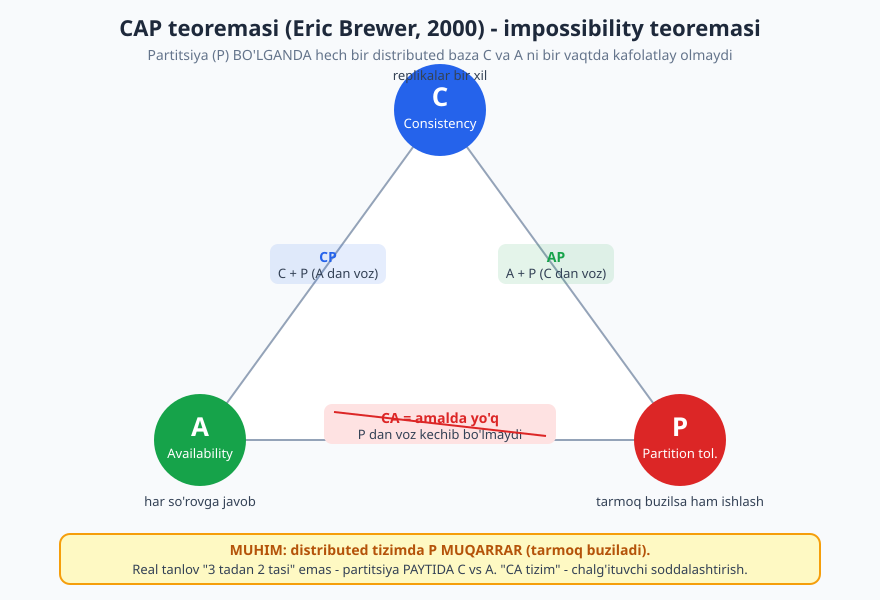
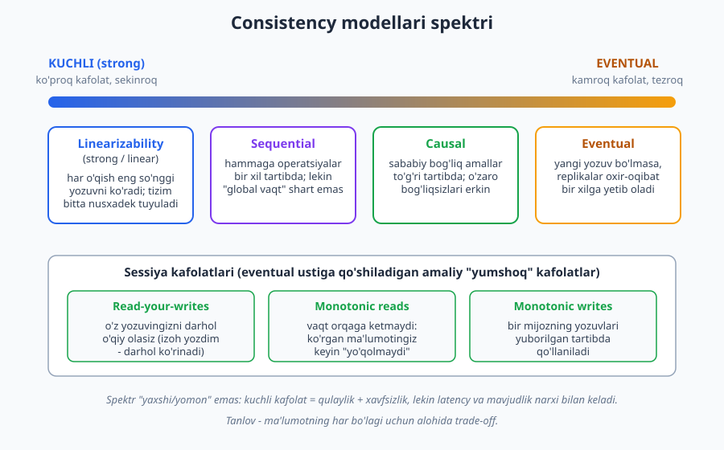
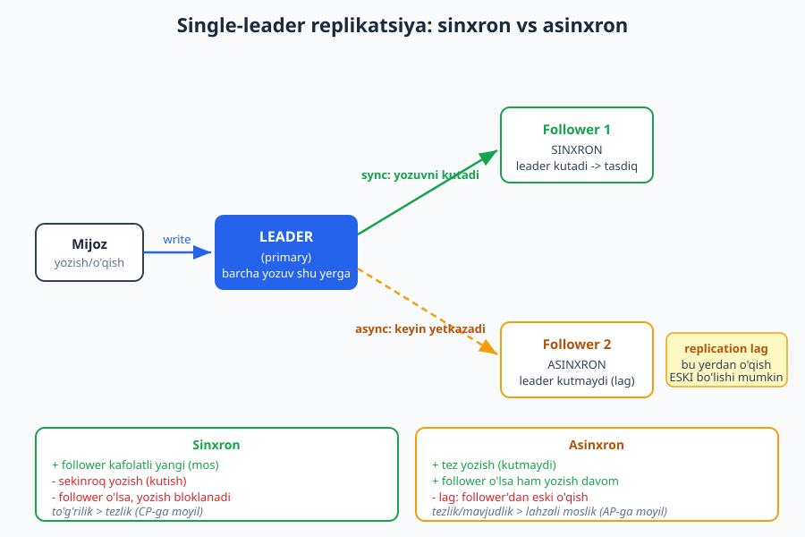

# 22 — CAP, consistency va replikatsiya

[⬅️ Oldingi: 21 — Message queue va asinxron aloqa](./21-message-queue-async.md) · [🏠 README](./README.md) · [Keyingi: 23 — Ishonchlilik: fault tolerance va resilience ➡️](./23-fault-tolerance-resilience.md)

---

> **Bu bobda:** distributed (tarqoq) tizimning eng chuqur va eng ko'p adashtiriladigan mavzusiga — **CAP teoremasi**ga aniq, soxta-soddalashtirishsiz qaraymiz. CAP'ning aslida **impossibility** (imkonsizlik) teoremasi ekanligini, "3 tadan 2 tasini tanla" formulasi nega chalg'ituvchi ekanligini va real tanlov nega partitsiya **paytida** CP yoki AP bo'lishini ko'ramiz. So'ng **PACELC** kengaytmasini (partitsiya bo'lmaganda ham Latency vs Consistency tanlovi borligini), **consistency modellari** spektrini (strong/linearizability -> sequential -> causal -> eventual va read-your-writes kabi sessiya kafolatlarini), **replikatsiya** uslublarini (single-leader, multi-leader, leaderless), **replication lag**, **partitsiyalash/sharding** va **quorum** (R+W>N) matematikasini o'rganamiz. Oxirida **consensus** (Paxos/Raft) bilan qisqa tanishamiz va bankni (CP) ijtimoiy lentaga (AP) qarama-qarshi qo'yamiz.

> **Trade-off eslatmasi / Halollik:** bu bob **chuqur konseptual** — bu yerda "to'g'ri javob" yo'q, kontekstga bog'liq qaror bor. CAP/PACELC ta'riflari folklorga emas, asl manbalarga (Eric Brewer 2000, Seth Gilbert & Nancy Lynch 2002 isboti, Daniel Abadi PACELC) tayanadi va bu kitobda tasdiqlangan. Eng keng tarqalgan **xato** — "CA tizim" tushunchasi va "har doim 2 tasini tanla" — bobda ataylab tuzatiladi. Kichik kod-misollar (TypeScript) quorum matematikasini va replikatsiya kechikishini ko'rsatish uchun **haqiqatan ishga tushirilib tekshirilgan** (natijalar matnda berilgan); tizim qarorlari (qaysi baza, qaysi consistency) esa "ishlab ko'rib bo'lmaydigan" dizayn tanlovlari — ularni **trade-off** sifatida beramiz, "bu eng to'g'risi" demaymiz. Distributed ma'lumot bo'yicha da'volar Martin Kleppmann, *Designing Data-Intensive Applications* (DDIA) bilan moslangan.

---

## Nega bu bob qiyin (va nega muhim)

Tarqoq tizimlar haqida gap ketganda, hamma "CAP teoremasi"ni eshitgan, lekin kam odam uni **to'g'ri** tushuntiradi. Sabab — bu mavzu juda ko'p **folklor**, yarim-rost va noto'g'ri soddalashtirish bilan o'ralgan. "CAP — 3 tadan 2 tasini tanla", "Cassandra AP, MongoDB CP", "CA baza" — bularning aksariyati yo noto'g'ri, yo yarim-haqiqat.

Bu bobning maqsadi — folklorni **aniq, asoslangan** tushunchaga almashtirish. Chunki bu tushunchalar **xavfsizlik darajasidagi aniqlikni** talab qiladi: agar siz "bizning baza ACID, demak replikalararo doim mos" deb adashtirsangiz (18-bobdagi xato), yoki "Cassandra'ni CP rejimda sozladik, demak CAP'ni yengdik" deb o'ylasangiz — bu **pulni, buyurtmani, ishonchni** yo'qotadigan xato bo'lishi mumkin.

> **Eslatma:** bu bob 18-bobga (ma'lumotlar bazasi) bevosita tayanadi. U yerda biz **ACID-C ≠ CAP-C** chalkashligini ko'rib, "CAP teoremasi 22-bobda" deb va'da bergan edik. Mana shu bob. Agar 18-bobni o'qimagan bo'lsangiz, kamida uning "ACID vs BASE" qismini ko'rib qaytishni tavsiya qilamiz: [`./18-malumotlar-bazasi-tanlovi.md`](./18-malumotlar-bazasi-tanlovi.md).

---

## 1-qism. CAP teoremasi — aniq ta'rif

### Uchta xususiyat

CAP teoremasini 2000-yilda **Eric Brewer** taqdim qildi (taxmin/konjektura sifatida), 2002-yilda **Seth Gilbert va Nancy Lynch** uni formal isbotladilar. Teorema **distributed ma'lumot do'koni** (bir necha tugunga tarqalgan, replikalangan baza) haqida. Uchta xususiyat:

- **C — Consistency (yaxlitlik, aniqrog'i *linearizability*):** har bir o'qish **eng so'nggi** yozilgan qiymatni ko'radi (yoki xato qaytaradi). Tizim go'yo **bitta nusxadek** tuyuladi — qaysi tugundan o'qisangiz ham, javob bir xil va eng yangi.
- **A — Availability (mavjudlik):** **ishlayotgan** har bir tugun **har bir** so'rovga (xato emas) **javob beradi**. Tizim "band", "kuting" yoki "xato" demaydi — javob qaytaradi.
- **P — Partition tolerance (partitsiyaga chidamlilik):** tugunlar orasidagi tarmoq **buzilsa** (xabarlar yo'qoladi yoki kechikadi — "**partitsiya**") ham, tizim **ishlashda davom etadi**.



### Teoremaning aniq formulasi (folklor EMAS)

Teorema aytadi: **partitsiya (P) yuz berganda, hech bir distributed ma'lumot do'koni Consistency (C) va Availability (A) ni bir vaqtning o'zida kafolatlay olmaydi.** Ya'ni bu — **impossibility** (imkonsizlik) teoremasi: u "nimadir mumkin emas"ligini isbotlaydi.

Nega? Tasavvur qiling, ikki tugun (`N1` va `N2`) bir-biriga gaplasha olmay qoldi (partitsiya). Mijoz `N1`ga yangi qiymat yozdi. Endi boshqa mijoz `N2`dan o'qiydi. `N2`da ikki yo'l bor:

1. **Eski qiymatni qaytarish** (chunki yangisini `N1`dan ololmadi) -> bu **A**, lekin **C buzildi** (mos emas).
2. **Javob bermaslik / xato qaytarish** (toki noto'g'ri qiymat bermasin) -> bu **C** ni saqlaydi, lekin **A buzildi** (javob bermadi).

Uchinchi yo'l yo'q. Partitsiya paytida `N2` **ikkalasini birga** qila olmaydi. Mana shu — teoremaning butun mohiyati.

> **Diqqat — eng keng tarqalgan XATO:** "CAP — uch xususiyatdan **ikkitasini tanla**" degan formula. Bu — **chalg'ituvchi soddalashtirish**, va Brewer'ning o'zi keyinchalik ("CAP Twelve Years Later", 2012) buni tuzatdi. Muammo shundaki, bu formula go'yo **uch teng variant** (CA, CP, AP) bordek ko'rsatadi. Aslida esa **P — tanlov emas**: real tarqoq tizimda tarmoq **albatta** buziladi (kabel uziladi, paket yo'qoladi, tugun sekinlashadi). Siz "partitsiya bo'lmasin" deb qaror qila olmaysiz — bu sizning ixtiyoringizda emas.

### "CA tizim" nega mavjud emas

Demak, tarqoq tizimda **P'dan voz kechib bo'lmaydi**. Shuning uchun "CA tizim" (C va A ni tanlab, P'ni tashlash) — amalda **mavjud emas**: chunki "P'ni tashlash" degani "tarmoq hech qachon buzilmaydi deb taxmin qilish" — bu esa distributed computing'ning birinchi yolg'oni (8 fallacy, 23-bob).

Real tanlov shunaqa: **tarmoq sog'lom bo'lganda** tizim ham C, ham A ni beradi (muammo yo'q). Lekin **partitsiya yuz berganda** majburan tanlash kerak:

- **CP (Consistency + Partition tolerance):** partitsiya paytida **moslikni saqlash uchun mavjudlikdan voz kechadi** — ya'ni "noto'g'ri qiymat bergandan ko'ra, javob bermayman/xato qaytaraman". Misol: ko'p relyatsion replikatsiya konfiguratsiyasi, etcd/ZooKeeper, MongoDB (sukut bo'yicha).
- **AP (Availability + Partition tolerance):** partitsiya paytida **javob berishni saqlash uchun moslikdan voz kechadi** — ya'ni "eski qiymat bo'lsa ham javob beraman, keyin to'g'rilaymiz". Misol: Cassandra, DynamoDB (sukut bo'yicha), Dynamo-uslubidagi bazalar.

> **Diqqat — yana bir nozik xato:** "Cassandra **AP**, MongoDB **CP**" degan yorliq ham yarim-haqiqat. Ko'p zamonaviy baza **sozlanadi** (tunable consistency): Cassandra'da har bir so'rov uchun consistency darajasini (ONE, QUORUM, ALL) tanlaysiz, shuning uchun u "AP" yoki kuchliroq bo'lishi mumkin. Yorliq — sukut (default) yoki umumiy moyillikni bildiradi, mutlaq xususiyat emas. Aniq da'vo qilishdan oldin **shu bazaning shu konfiguratsiyasi**ni biling.

> **Amaliyotda:** CAP — "har vaqt" haqida emas, **partitsiya lahzasi** haqida. Yiliga necha marta haqiqiy partitsiya bo'ladi? Ko'p tizimda — kam. Demak CAP'ning C-vs-A tanlovi **kamdan-kam** ishlaydi. Bu kuzatuv keyingi qismga — PACELC'ga — olib keladi: "partitsiya yo'q vaqtda nima?".

---

## 2-qism. PACELC — CAP'ning to'liqroq surati

CAP faqat **partitsiya paytidagi** tanlovni tasvirlaydi. Lekin yuqorida ko'rdik: partitsiya kamdan-kam. Unda **normal ishlash paytida** (partitsiya yo'q) qanday trade-off bor? CAP bu haqida **jim**. Mana shu bo'shliqni **PACELC** (Daniel Abadi, 2010) to'ldiradi:

> **PACELC:** agar **P**artitsiya bo'lsa, **A** vs **C** tanla (bu — CAP). **E**lse (aks holda, ya'ni normal ishlashda) **L**atency (kechikish) vs **C**onsistency tanla.

Ya'ni **partitsiya bo'lmaganda ham trade-off bor**: kuchli moslikni (har o'qish eng yangi) ta'minlash uchun tugunlar bir-biri bilan **kelishishi** kerak — bu **vaqt** (latency) talab qiladi. Agar latency'ni kamaytirish istasangiz (tez javob), moslikdan biroz voz kechasiz (yaqindagi replikadan, ehtimol biroz eski, o'qiysiz).

Bazalarni PACELC bilan ikki o'q bo'yicha tasniflaymiz (`P?/E?` ko'rinishida):

| Baza (taxminiy/umumiy moyillik) | Partitsiyada (P) | Normalda (E) | PACELC |
|---|---|---|---|
| DynamoDB | A (mavjudlik) | L (past latency) | **PA/EL** |
| Cassandra (sukut) | A | L | **PA/EL** |
| MongoDB (sukut) | C (moslik) | C (moslik) | **PC/EC** |
| Etcd / ZooKeeper | C | C | **PC/EC** |
| PostgreSQL (sinxron replika) | C | C | **PC/EC** |

> **Eslatma:** bu jadval — **umumlashtirilgan moyillik**, qat'iy "qonun" emas; aniq xulq konfiguratsiyaga bog'liq (yuqoridagi "tunable consistency" eslatmasini eslang). MongoDB'ni ko'pincha **PA/EC** deb ham tasniflashadi (read preference'ga qarab) — manbalar farq qiladi. Muhimi — **g'oya**: ikki o'q bor (P paytida A vs C; E paytida L vs C), bitta emas.

> **Trade-off:** PACELC nima uchun amaliy? Chunki real qaror ko'pincha **EL vs EC** — "tez javob (yaqin replikadan, biroz eski bo'lishi mumkin)" yoki "kafolatli yangi javob (kelishish kutiladi, sekinroq)". Ijtimoiy lentangiz EL bo'lishi mumkin (like soni 2 soniya eski bo'lsa — hech kim sezmaydi); bank balansingiz EC bo'lishi kerak (balans 2 soniya eski bo'lsa — pul yo'qolishi mumkin). DDIA ham aynan shu nuqtani urg'ulaydi: consistency — **bepul emas**, har doim latency narxi bilan keladi.

---

## 3-qism. Consistency modellari spektri

"Consistency" — bitta narsa emas, balki **spektr**. Eng kuchlidan eng yumshog'igacha bir nechta model bor. Ularni bilish — "qancha kafolat kerak, qancha narx to'lay olaman?" degan qarorni aniqlashtiradi.



### Kuchli modellar

- **Linearizability (strong / linear consistency):** eng kuchli. Tizim go'yo **bitta nusxa**dek ishlaydi: har bir operatsiya bir lahzada "sodir bo'ladi", va shu lahzadan keyin **har bir** o'qish (qaysi tugundan bo'lsa ham) eng yangi qiymatni ko'radi. Bu — CAP'dagi "C". Intuitsiya: bir kishi yangi qiymat yozdi -> shu zahoti dunyodagi hamma uni ko'radi.
- **Sequential consistency:** barcha tugunlarda operatsiyalar **bir xil tartibda** ko'rinadi, va har bir mijozning operatsiyalari o'z tartibida saqlanadi — lekin "global, real vaqt" bo'yicha eng yangini ko'rish kafolati yo'q. Linearizability'dan biroz zaifroq.

### Yumshoqroq modellar

- **Causal consistency:** **sababiy bog'liq** operatsiyalar to'g'ri tartibda ko'rinadi (savol -> javob; javob savoldan oldin ko'rinmaydi). O'zaro bog'liqsiz operatsiyalar esa har tugunda boshqa tartibda bo'lishi mumkin. Ko'p amaliy holat uchun "yetarlicha kuchli" model.
- **Eventual consistency:** eng yumshoq. **Yangi yozuv to'xtasa**, replikalar **oxir-oqibat** bir xil qiymatga **yetib oladi**. "Qachon?" — kafolat yo'q (odatda millisekundlar, lekin partitsiyada uzoqroq). Bu — 18-bobdagi BASE'ning "E"si.

### Sessiya kafolatlari (eventual ustiga amaliy qo'shimchalar)

Sof eventual consistency ba'zan juda noqulay ("izoh yozdim, sahifani yangiladim — izohim yo'q!"). Shuning uchun **sessiya kafolatlari** qo'shiladi — ular butun tizimni emas, **bitta mijozning tajribasini** yaxshilaydi:

- **Read-your-writes (o'z yozuvingni o'qish):** o'zingiz yozgan narsani **darhol** o'qiy olasiz (boshqalar hali ko'rmasa ham). Yechim: o'sha mijozni leader'dan o'qitish (pastdagi kodda ko'ramiz).
- **Monotonic reads (monoton o'qish):** vaqt **orqaga ketmaydi** — bir marta yangi qiymatni ko'rgan bo'lsangiz, keyingi o'qishda u "yo'qolmaydi" (eski replikaga tushib qolmaysiz).
- **Monotonic writes (monoton yozish):** bir mijozning yozuvlari **yuborilgan tartibda** qo'llaniladi.

> **Diqqat:** "eventual consistency = ma'lumot noto'g'ri" — xato tushuncha. Eventual consistency **xato emas**, balki **ongli trade-off**: mavjudlik va past latency uchun lahzali moslikdan **vaqtincha** voz kechish. Muhimi — bu trade-off'ni **bilib** qilish va ma'lumotning **har bo'lagi** uchun alohida qaror: like soni eventual bo'lsa bo'ladi, hisob balansi — yo'q.

> **Eslatma:** consistency modellari nomlaridan cho'chimang. Amalda 90% qaror oddiy: "bu ma'lumot eski bo'lib qolsa, foydalanuvchi/biznes uchun yomonmi?". Yomon bo'lsa -> kuchliroq model (latency narxi bilan). Yomon bo'lmasa -> eventual (tezlik va mavjudlik yutug'i bilan).

---

## 4-qism. Replikatsiya — nusxalarni qanday saqlash

Nega umuman bir nechta nusxa (replika) saqlaymiz? Uch sabab: (1) **mavjudlik** — bitta tugun o'lsa, boshqasi ishlaydi; (2) **o'qish masshtabi** — o'qishni ko'p replikaga taqsimlash; (3) **kechikish** — foydalanuvchiga yaqin replikadan o'qish. Lekin nusxa qo'shilishi bilanoq "ular bir-biriga mosmi?" muammosi tug'iladi — butun bu bobning mavzusi.

Replikatsiyaning uch asosiy uslubi bor.

### Single-leader (leader-follower)

Bitta tugun — **leader** (primary). **Barcha yozuvlar** faqat unga boradi. Leader o'zgarishni **follower**larga (replikalarga) tarqatadi. O'qish — leader yoki follower'lardan. Bu — eng keng tarqalgan (PostgreSQL, MySQL, MongoDB, ko'p relyatsion baza).



Leader follower'larga **qanday** tarqatishi — muhim trade-off:

- **Sinxron (synchronous):** leader follower **yozuvni qabul qilganini tasdiqlamaguncha** mijozga "OK" demaydi. Follower kafolatli **yangi** (mos). Lekin: **sekinroq** (kutish), va follower o'lsa/sekinlashsa — yozish **bloklanadi**. CP-ga moyil.
- **Asinxron (asynchronous):** leader follower'ni **kutmaydi** — mijozga darhol "OK" deydi, keyin tarqatadi. **Tez**, follower o'lsa ham yozish davom etadi. Lekin: **replication lag** (replikatsiya kechikishi) — follower'dan o'qigan mijoz **eski qiymatni** ko'rishi mumkin. AP-ga moyil.

> **Anti-pattern — "stale read" tuzog'i:** asinxron replikatsiyada o'qishni follower'ga yo'naltirib, **read-your-writes**ni unutish — keng tarqalgan xato. Foydalanuvchi profilini yangiladi (leader'ga yozildi), sahifa qayta yuklandi (follower'dan o'qildi, hali eski) -> "o'zgarishim yo'qoldi!". Yechim: shu foydalanuvchining **o'z** ma'lumotini leader'dan (yoki yangilanganini bilgan replikadan) o'qitish.

### Multi-leader (master-master)

**Bir nechta** leader bor — har biri yozuvni qabul qiladi va boshqa leader'larga tarqatadi. Foydasi: bir nechta ma'lumot markazi (data center) bo'lsa, har biri **mahalliy** yozadi (past latency) — masalan global ilova. Narxi: ikki leader'ga **bir vaqtda** bir xil maydonni boshqacha yozsa — **konflikt** (conflict). Uni hal qilish (last-write-wins, CRDT, qo'lda birlashtirish) — alohida murakkablik.

### Leaderless (Dynamo uslubi)

**Leader yo'q** — mijoz **bir nechta** replikaga to'g'ridan-to'g'ri yozadi va **bir nechta**sidan o'qiydi. Mos qiymatni "ovoz berish" (quorum) bilan aniqlaydi. Misol: Cassandra, DynamoDB, Riak. Bu uslub **quorum** matematikasini ishlatadi — keyingi qism.

> **Trade-off:** uchala uslubning narxi/foydasi:
>
> - **Single-leader:** sodda (konflikt yo'q — bitta yozuv nuqtasi), lekin leader — bitta nuqta (u o'lsa, **failover**/yangi leader saylash kerak); yozish masshtabi leader bilan cheklangan.
> - **Multi-leader:** geo-taqsimlangan past latency, lekin **konflikt** murakkabligi.
> - **Leaderless:** yuqori mavjudlik (tugun o'lsa ham ishlaydi), lekin **eventual consistency** va quorum mantig'i.
>
> "Eng yaxshisi" yo'q — masshtab, geografiya va moslik talabiga bog'liq.

---

## 5-qism. Partitsiyalash (sharding) — bu boshqa narsa

Diqqat: ikki o'xshash so'z — **partition** ikki ma'noda:

1. **Network partition** (tarmoq partitsiyasi) — CAP'dagi P: tarmoq buzilib, tugunlar gaplasha olmay qolishi. Bu — **nosozlik**.
2. **Partitioning / sharding** — ma'lumotni **bo'laklarga bo'lib**, har bo'lakni boshqa tugunga joylashtirish. Bu — **ataylab dizayn qarori** (masshtab uchun).

Bu qismda ikkinchisi haqida. **Replikatsiya** — bir xil ma'lumotning **nusxasi** (mavjudlik uchun); **sharding** — ma'lumotni **bo'lish** (masshtab uchun). Ko'p tizim **ikkalasini** birga ishlatadi: har shard'ning bir necha replikasi bor.

Sharding — ma'lumotni **kalit bo'yicha** tarqatish:

- **Range partitioning (oraliq bo'yicha):** kalit oralig'iga ko'ra (A-M -> shard 1, N-Z -> shard 2). Foyda: oraliq-so'rovlar oson. Narx: **issiq nuqta** (hot spot) — ma'lum oraliq ko'p ishlatilsa, bitta shard yuklanadi.
- **Hash partitioning (xesh bo'yicha):** kalitning xeshiga ko'ra. Foyda: tekis taqsimlash. Narx: oraliq-so'rovlar qiyin (qo'shni kalitlar har shard'da).

```text
Sharding (kalit bo'yicha bo'lish, MASSHTAB uchun):

  user_id 1..1000  -> Shard A   (+ har shard'ning replikasi bor)
  user_id 1001..2000 -> Shard B
  user_id 2001..3000 -> Shard C

Replikatsiya (NUSXA, MAVJUDLIK uchun):

  Shard A: [leader] -> [follower1] [follower2]
```

> **Diqqat:** sharding masshtab beradi, lekin **narxi** bor: **cross-shard so'rov va tranzaksiya** qiyinlashadi (ikki shard'dagi ma'lumotni JOIN qilish yoki atomik o'zgartirish — 18-bobdagi mikroservis muammosiga o'xshash). Shuning uchun shard kalitini (partition key) tanlash — eng muhim qarorlardan: u eng tez-tez so'rovni bitta shard'da ushlab tursin. Noto'g'ri kalit -> har so'rov hamma shard'ga tarqaydi (scatter-gather) -> sekin.

---

## 6-qism. Quorum: R + W > N

Leaderless (va sozlanadigan) tizimlarda mavjudlik va moslik orasidagi muvozanat **quorum** (kvorum) bilan boshqariladi. Uch parametr:

- **N** — har bir ma'lumotning **nechta nusxasi** (replikasi) saqlanadi.
- **W** — yozuv **tasdiqlangan** deyilishi uchun nechta replika yozishi shart (write quorum).
- **R** — o'qish uchun nechta replikadan o'qiymiz (read quorum).

**Asosiy qoida:** agar **R + W > N** bo'lsa, o'qish va yozish to'plamlari **kamida bitta** umumiy tugunda **kesishadi** — demak har o'qish kamida bitta **eng yangi** qiymatli replikani ko'radi. Bu — kuchli (mos) o'qishning sharti.

**Nega kesishadi?** Oddiy mantiq: N tugundan W tasiga yozdik, R tasidan o'qiymiz. Eng yomon holatda bu ikki to'plam imkon qadar **kam** kesishishi uchun joylashadi. Lekin W + R > N bo'lsa, ular **sig'maydi** — kaptarxona printsipi (pigeonhole): kesishish = `W + R - N >= 1`.

Buni kod bilan tekshiramiz:

```ts
function quorumOverlaps(N: number, W: number, R: number): boolean {
  // Eng yomon holatdagi kesishish = max(0, W + R - N).
  // Kamida 1 umumiy tugun bo'lsa, o'qish eng yangi qiymatni ko'radi.
  const overlap = Math.max(0, W + R - N);
  return overlap >= 1;
}

const cases: Array<[number, number, number, string]> = [
  [3, 2, 2, "klassik W=2,R=2,N=3"],
  [3, 3, 1, "yozish-og'ir: W=3, R=1 (tez o'qish)"],
  [3, 1, 3, "o'qish-og'ir: W=1 (tez yozish), R=3"],
  [3, 1, 1, "W=1, R=1: KAFOLATSIZ"],
  [3, 2, 1, "W=2, R=1: KAFOLATSIZ"],
];

for (const [N, W, R, izoh] of cases) {
  const cond = `R+W=${R + W} ${R + W > N ? ">" : "<="} N=${N}`;
  console.log(`${cond.padEnd(14)} -> kuchli o'qish: ${quorumOverlaps(N, W, R) ? "HA" : "YO'Q"}  (${izoh})`);
}
```

Ishga tushirsak (haqiqatan olingan natija):

```text
R+W=4 > N=3   -> kuchli o'qish: HA  (klassik W=2,R=2,N=3)
R+W=4 > N=3   -> kuchli o'qish: HA  (yozish-og'ir: W=3, R=1 (tez o'qish))
R+W=4 > N=3   -> kuchli o'qish: HA  (o'qish-og'ir: W=1 (tez yozish), R=3)
R+W=2 <= N=3  -> kuchli o'qish: YO'Q  (W=1, R=1: KAFOLATSIZ)
R+W=3 <= N=3  -> kuchli o'qish: YO'Q  (W=2, R=1: KAFOLATSIZ)
```

E'tibor bering: `N=3, W=2, R=1` da `R+W=3` bu `N`ga **teng** (katta emas) — shuning uchun kesishish kafolatlanmaydi (kuchli o'qish **yo'q**). Qoida — **qat'iy katta** (`>`), teng emas.

W va R'ni qanday tanlash — bu sof trade-off:

- **W'ni katta qilsangiz** (masalan W=N): yozish kuchli mos, lekin **sekin** va bitta replika o'lsa yozish **to'xtaydi** (mavjudlik kamayadi).
- **R'ni katta qilsangiz:** o'qish ishonchli, lekin sekinroq.
- **Ikkalasini kichik** (W=1, R=1): juda tez va mavjud, lekin **eventual** (mos emas).

> **Trade-off:** `W=2, R=2, N=3` — mashhur "oltin o'rta": bitta tugun o'lsa ham yozish (W=2 hali ham mumkin) va o'qish (R=2) ishlaydi, va R+W>N (kuchli o'qish). Lekin bu ham mutlaq emas — yozish-og'ir tizim `W=1, R=3`ni (tez yozish) afzal ko'rishi mumkin. Muhimi: **R, W, N — sizning consistency/availability tarozingizning richaglari**.

> **Diqqat:** quorum **hammasini** hal qilmaydi. Bir vaqtda ikki yozuv (concurrent writes) bo'lsa, "qaysi yangi?" — soatlar mos kelmaganda murakkab; "last write wins" ma'lumot **yo'qotishi** mumkin. Shuning uchun Dynamo-uslubi tizimlar version vector / CRDT kabi mexanizmlar qo'shadi. Quorum — boshlanish, oxiri emas (DDIA 5-bob batafsil).

---

## 7-qism. Replication lag va read-your-writes (tekshirilgan)

Asinxron replikatsiyaning markaziy hodisasini — **replication lag**ni va uni qanday yumshatishni — kichik simulyatsiya bilan ko'ramiz. Leader'ga yozamiz; follower hali eskini ko'rsatadi; "read-your-writes" uchun o'sha mijozni leader'dan o'qitamiz; keyin replikatsiya yetib oladi:

```ts
class ReplicaNode {
  value = 0;
  read() { return this.value; }
  write(v: number) { this.value = v; }
}

const leader = new ReplicaNode();
const follower = new ReplicaNode();

leader.write(42); // mijoz leader'ga yozdi
console.log(`Darhol:  leader=${leader.read()}  follower=${follower.read()}`);
// follower hali eski (replikatsiya yetib bormadi)

// read-your-writes: o'sha mijoz o'z yozuvini ko'rishi uchun LEADER'dan o'qitamiz
console.log(`Read-your-writes (leader'dan): ${leader.read()}`);

follower.write(leader.read()); // replikatsiya yetib oladi
console.log(`Lag tugagach: follower=${follower.read()}`);
```

Ishga tushirsak (haqiqatan olingan natija):

```text
Darhol:  leader=42  follower=0
Read-your-writes (leader'dan): 42
Lag tugagach: follower=42
```

`follower=0` ko'rsatgan lahza — bu **replication lag oynasi**. Bu vaqtda follower'dan o'qigan mijoz **eski** (`0`) ko'radi. Bu **xato emas** — asinxron replikatsiyaning tabiiy holati. Foydalanuvchi o'z izohini yozib, sahifani yangilaganda u "yo'qdek" ko'rinishi — aynan shu oyna. Yechim: kritik holatda (o'z yozuvini ko'rsatish) leader'dan o'qish.

> **Eslatma:** bu — 18-bobdagi `Replica` misolining davomi, lekin endi **read-your-writes** muammosi va yechimi bilan. 18-bob "eventual consistency nima"ni ko'rsatgan; bu bob "u bilan **nima qilish**"ni qo'shadi.

---

## 8-qism. Consensus — qisqa kirish (Paxos, Raft)

Kuchli moslik (linearizability) va to'g'ri leader saylash uchun tugunlar **bir qarorga kelishi** kerak — bu **consensus** (konsensus). Masalan: "yangi leader kim?", "bu yozuv qabul qilindimi?". Ikki mashhur algoritm:

- **Paxos** (Leslie Lamport) — birinchi va eng nufuzli, lekin nomi bilan "tushunish qiyin" deb chiqqan.
- **Raft** (Diego Ongaro, John Ousterhout) — **tushunarli bo'lishga** ataylab loyihalangan: leader saylash + log replikatsiyasi. etcd, Consul kabi tizimlar ishlatadi.

Ikkala algoritm ham **quorum** (ko'pchilik — majority) tamoyiliga tayanadi: qaror N tugundan **ko'pchilik** (N/2 + 1) tasdiqlasa, o'tadi. Shuning uchun **toq son** tugun (3, 5, 7) tavsiya etiladi: 5 tugunda 3 ta kelishsa — yetarli, 2 tugun o'lsa ham ishlaydi.

> **Eslatma:** consensus — chuqur mavzu, bu kitob doirasidan tashqari (alohida kurs). Sizga shu yetadi: **kuchli moslik bepul emas** — u tugunlararo kelishish (consensus) talab qiladi, bu esa latency va murakkablik narxi bilan keladi. Aynan shu sabab CAP'da C tomonni tanlash mavjudlik/tezlikka tushadi.

### Yana bir bor: ACID-C ≠ CAP-C

18-bobdagi eng muhim aniqlikni takrorlaymiz, chunki u aynan shu bobning yuragi:

- **ACID'dagi C** — **bitta baza ichidagi yaxlitlik qoidalari** (FK, CHECK, balans manfiy emas). Bu — ma'lumotning **mantiqiy to'g'riligi**.
- **CAP'dagi C** — **replikalararo moslik** (linearizability): barcha nusxalar eng yangi qiymatni ko'rsatadi.

Bitta serverdagi relyatsion baza ACID-C beradi, lekin uning replikasi asinxron bo'lsa — CAP-C **bermaydi** (replication lag). "Bazamiz ACID, demak replikalararo doim mos" — bu **xato** xulosa. Ikki "C" — ikki boshqa o'lcham. Batafsil: [`./18-malumotlar-bazasi-tanlovi.md`](./18-malumotlar-bazasi-tanlovi.md).

---

## 9-qism. Amaliyotda — bank (CP) vs ijtimoiy lenta (AP)

Hammasini ikki qarama-qarshi real misol bilan jamlaymiz.

### Bank — CP (moslik muhim)

Bank balansi, pul o'tkazmasi: ma'lumot **lahzali to'g'ri** bo'lishi shart. Agar partitsiya yuz bersa, bank **javob bermaslikni** (operatsiyani rad etish, "keyinroq urinib ko'ring") **noto'g'ri balans ko'rsatish**dan afzal ko'radi. Aks holda — double-spend (bir pulni ikki marta sarflash), salbiy balans, yo'qolgan pul.

- **Tanlov:** CP. Sinxron replikatsiya yoki consensus (kuchli moslik). Latency va vaqtinchalik mavjudsizlikka chidaydi.
- **PACELC:** PC/EC — har ikki holatda ham moslik ustun.

### Ijtimoiy lenta — AP (mavjudlik muhim)

Like soni, post ko'rishlari, lenta (feed): ma'lumot **2 soniya eski** bo'lsa — hech kim sezmaydi va hech narsa buzilmaydi. Lekin tizim **javob bermasa** (lenta ochilmasa) — foydalanuvchi ketadi.

- **Tanlov:** AP. Eventual consistency. Partitsiyada eski qiymat bo'lsa ham javob beradi, keyin to'g'rilaydi.
- **PACELC:** PA/EL — har ikki holatda ham mavjudlik va past latency ustun.

> **Amaliyotda — Telegram-bot backend misoli.** Bitta tizimda **ikkala** tomon ham bo'lishi mumkin: (a) foydalanuvchining **to'lov/balans**i (premium obuna) -> CP, kuchli moslik (PostgreSQL, sinxron); (b) "bu xabarni necha kishi ko'rdi" hisoblagichi yoki "oxirgi onlayn" -> AP, eventual (eski bo'lsa muammo yo'q, lekin doim javob bersin). Ya'ni CAP — butun tizim uchun **bitta** yorliq emas; ma'lumotning **har bo'lagi** uchun alohida qaror. Real bot misoli: [`../tgbot-js/README.md`](../tgbot-js/README.md).

> **Trade-off — yakuniy halollik:** "CP yoki AP" hech qachon "yaxshi yoki yomon" emas — kontekstga bog'liq. Ikki tajribali arxitektor bir xil tizimning bir bo'lagi uchun boshqacha tanlashi mumkin (masalan "savat" CP yoki AP bo'lishi mumkin — biznes qaroriga bog'liq). Sizning vazifangiz — formula yodlash emas, balki har bir ma'lumot bo'lagi uchun **"eski bo'lib qolsa nima bo'ladi?"** va **"javob bermasa nima bo'ladi?"** savollarini berib, **ongli, hujjatlashtirilgan** (ADR — 03-bob) trade-off qilish.

> **Cross-link:** eventual consistency va event-driven oqim — [`./15-event-driven-cqrs.md`](./15-event-driven-cqrs.md); ma'lumotlar bazasi tanlovi va ACID/BASE — [`./18-malumotlar-bazasi-tanlovi.md`](./18-malumotlar-bazasi-tanlovi.md); partitsiya/nosozlikka chidamlilik (retry, circuit breaker, fallaciylar) — keyingi bob: [`./23-fault-tolerance-resilience.md`](./23-fault-tolerance-resilience.md); sifat atributlari (availability, consistency trade-off'i) — [`./02-sifat-atributlari-tradeoff.md`](./02-sifat-atributlari-tradeoff.md).

---

## Mashqlar

### Oson

**1.** CAP teoremasi qaysi **uch xususiyat** haqida? Har birini bir jumla bilan ta'riflang (C — nima ma'noda, A — nima, P — nima).

**2.** "CAP — 3 tadan 2 tasini tanla" formulasi nega **chalg'ituvchi**? Bir-ikki gap bilan tuzating. (Maslahat: P haqida o'ylang.)

**3.** Quyidagi har biri **CP** ga moslmi yoki **AP** ga? (a) bank pul o'tkazmasi; (b) ijtimoiy tarmoq "like" soni; (c) onlayn do'kon inventari (qancha qoldi); (d) "oxirgi marta onlayn bo'ldi" vaqti.

**4.** PACELC nima qo'shadi? CAP nimani **e'tiborsiz** qoldiradi va PACELC uni qanday to'ldiradi (bir jumla)?

**5.** `N=3, W=2, R=2` uchun: `R+W` nechaga teng? U `N`dan katta-mi? Demak kuchli (mos) o'qish kafolatlanadimi?

### O'rta

**6.** Bir muhandis: "Biz CA baza ishlatamiz — C va A bor, P bizga kerak emas, chunki tarmog'imiz ishonchli." Bu da'voda **nechta** xato bor? Sanab tuzating. (Maslahat: 23-bobdagi 8 fallacy.)

**7.** **Quorum hisobla.** `N=5` replika bor. (a) Kuchli (mos) o'qishni kafolatlaydigan `W` va `R` ning **ikki** xil juftini toping (har birida `R+W>5`). (b) Bittasi "yozish-og'ir" (tez o'qish), ikkinchisi "o'qish-og'ir" (tez yozish) bo'lsin. (c) `W=3, R=2` da `R+W>N` mi — kuchli o'qish bormi?

**8.** Sinxron va asinxron replikatsiya: har biri uchun **bitta foyda** va **bitta narx** ayting. Asinxronda "read-your-writes" muammosi nima va uni qanday hal qilasiz?

**9.** "Cassandra — AP baza, MongoDB — CP baza" degan yorliq nega **yarim-haqiqat**? (Maslahat: tunable consistency.) Aniq da'vo qilishdan oldin nimani bilish kerak?

**10.** **Partition** so'zining ikki ma'nosini ajrating: (a) "network partition" (CAP'dagi P) va (b) "partitioning/sharding". Qaysi biri nosozlik, qaysi biri ataylab dizayn qarori? Replikatsiya va sharding qanday farq qiladi (nima uchun har biri)?

### Qiyin

**11.** **CP yoki AP tanla va asosla.** "Onlayn chipta sotish" tizimi loyihalayapsiz — konsert chiptalari cheklangan (1000 ta), bir o'rindiq **ikki kishiga sotilmasligi** shart. Partitsiya yuz berganda: (a) CP yoki AP tanlaysiz va **nega**? (b) Bu tanlovning foydalanuvchiga ko'rinadigan **narxi** nima (partitsiya paytida)? (c) "Mavjud chiptalar soni"ni ko'rsatish (sotish emas, faqat ko'rsatish) uchun boshqacha (yumshoqroq) tanlov mumkinmi?

**12.** **Bu "CA tizim" da'vosi nega xato?** Bir arxitektor diagrammasida "bitta ma'lumot markazidagi PostgreSQL klasteri — CA tizim, chunki tarmoq ichki va ishonchli" deb yozgan. (a) Bu da'vo qayerda buziladi? (b) Ichki tarmoq ham partitsiyalanishi mumkinmi — qanday holatda? (c) "CA" o'rniga to'g'ri tasvir nima (bu tizim partitsiya paytida aslida nima qiladi)?

**13.** **Quorum trade-off (kod).** TypeScript'da `quorumOverlaps(N, W, R)` funksiyasini yozing (`W+R-N >= 1` mantiqi bilan). So'ng: `N=5` uchun **barcha** `W` (1..5) va `R` (1..5) juftlarini tekshirib, qaysilari kuchli o'qish berishini chiqaring. Natijada nechta juft `R+W>N` shartini qondiradi? Ishga tushirib tekshiring. (Maslahat: ikki ichma-ich tsikl.)

**14.** **Ikki "C" ni amaliy ajrating.** "Bizning PostgreSQL ACID, demak read replica'dan o'qiganda ham har doim eng yangi ma'lumotni olaman." Bu xulosa **qayerda** va **nega** buziladi? ACID-C bitta tugunda nimani kafolatlaydi, va nega u asinxron read replica'da eski o'qishni (CAP-C buzilishini) **oldini olmaydi**? Qanday yechim (consistency talabi kuchli bo'lsa)?

**15.** **PACELC bilan tasnifla.** Bir ilova ikkita ma'lumot bilan ishlaydi: (i) foydalanuvchi sevimlilar ro'yxati (eski bo'lsa, biroz noqulay, lekin xavfli emas), (ii) hisob-kitob (billing) yozuvi (har doim aniq bo'lishi shart). Har biri uchun: partitsiyada A vs C? Normalda L vs C? PACELC kodi (`P?/E?`) bilan yozing va **nega** shunday ekanini asoslang.

**16.** **Replikatsiya uslubini tanla.** Global ilova: foydalanuvchilar Toshkent, London va Nyu-Yorkda; har biriga **mahalliy past latency** kerak, lekin profil yangilanishi kamdan-kam. (a) Single-leader, multi-leader yoki leaderless — qaysi biri va nega? (b) Tanlagan uslubingizning asosiy **narxi** (murakkabligi) nima? (c) Konflikt yuz bersa (ikki regionda bir vaqtda yangilash) — qanday hal qilish strategiyalari bor?

<details markdown="1"><summary>Yechimlar</summary>

### 1-mashq yechimi

**C — Consistency (linearizability):** har o'qish eng so'nggi yozilgan qiymatni ko'radi; tizim bitta nusxadek tuyuladi (qaysi tugundan o'qisang ham — bir xil, yangi). **A — Availability:** ishlayotgan har tugun har so'rovga (xato emas) javob beradi. **P — Partition tolerance:** tugunlar orasidagi tarmoq buzilsa (partitsiya) ham tizim ishlashda davom etadi.

### 2-mashq yechimi

Formula chalg'ituvchi, chunki u go'yo **uch teng variant** (CA/CP/AP) bordek ko'rsatadi. Aslida real distributed tizimda **P — tanlov emas**: tarmoq albatta buziladi, P'dan voz kechib bo'lmaydi. Tuzatish: real tanlov "3 dan 2" emas, balki **partitsiya yuz berganda** C yoki A (CP yoki AP). "CA" amalda mavjud emas. Brewer'ning o'zi ham buni keyinchalik aniqlashtirgan.

### 3-mashq yechimi

(a) bank o'tkazmasi -> **CP** (pul aniq bo'lishi shart, eski balans xavfli). (b) like soni -> **AP** (eski bo'lsa muammo yo'q, doim javob bersin). (c) inventar "qancha qoldi" -> ko'pincha **CP** (oxirgi mahsulotni ikkiga sotmaslik uchun); ammo "taxminiy qoldiq ko'rsatish" AP bo'lishi mumkin — kontekstga bog'liq. (d) "oxirgi onlayn" -> **AP** (eski bo'lsa hech narsa buzilmaydi).

### 4-mashq yechimi

CAP faqat **partitsiya paytidagi** tanlovni (A vs C) tasvirlaydi, lekin **partitsiya yo'q vaqt**dagi trade-off haqida jim — bu esa real tizimda vaqtning aksariyat qismi. PACELC qo'shadi: **Else** (normal ishlashda) ham tanlov bor — **Latency vs Consistency**. Ya'ni kuchli moslik partitsiyasiz ham latency narxiga keladi (tugunlar kelishishi kerak).

### 5-mashq yechimi

`R+W = 2+2 = 4`. `N = 3`. `4 > 3` — **ha, katta**. Demak `R+W > N` sharti bajariladi -> kuchli (mos) o'qish **kafolatlanadi** (o'qish va yozish to'plamlari kamida bitta tugunda kesishadi).

### 6-mashq yechimi

Kamida **ikki** xato: (1) **"CA baza"** — distributed tizimda CA mavjud emas; P'dan voz kechib bo'lmaydi (tanlov C yoki A, partitsiya paytida). (2) **"tarmog'imiz ishonchli, P kerak emas"** — bu distributed computing fallacy'larining birinchisi ("tarmoq ishonchli", 23-bob): ichki tarmoq ham kabel, kommutator, GC pauzasi, sekinlashish tufayli partitsiyalanadi. P — sizning tanlovingiz emas, **realiya**. To'g'ri: bitta tugundagi (replikasiz) baza haqida CAP umuman ma'noga ega emas; replikali bo'lsa — P bor, va siz CP yoki AP'ni tanlaysiz.

### 7-mashq yechimi

(a/b) `N=5`, `R+W>5` kerak (ya'ni `R+W>=6`):

- **Yozish-og'ir / tez o'qish:** `W=5, R=1` (`R+W=6>5`). Yozish hamma replikaga (sekin, kuchli), o'qish bitta replikadan (tez).
- **O'qish-og'ir / tez yozish:** `W=1, R=5` (`R+W=6>5`). Yozish bitta replikaga (tez), o'qish hammadan (sekin, kuchli).
- "Oltin o'rta": `W=3, R=3` (`R+W=6>5`) ham ishlaydi — bitta tugun o'lsa ham ikkalasi mumkin.

(c) `W=3, R=2`: `R+W=5`, `N=5`. `5 > 5` **emas** (teng). Demak kuchli o'qish **kafolatlanmaydi** — qoida qat'iy `>`, teng emas.

### 8-mashq yechimi

**Sinxron:** + follower kafolatli yangi (mos o'qish); − sekinroq yozish va follower o'lsa/sekinlashsa yozish bloklanadi. **Asinxron:** + tez yozish, follower o'lsa ham davom etadi; − replication lag (follower'dan eski o'qish). **Read-your-writes muammosi:** o'z yozuvingizni yozib (leader'ga), darhol follower'dan o'qisangiz — hali eski, "o'zgarishim yo'qoldi"dek. **Yechim:** shu foydalanuvchining o'z ma'lumotini **leader'dan** (yoki yangilanganini bilgan replikadan) o'qitish.

### 9-mashq yechimi

Yorliq yarim-haqiqat, chunki ko'p baza **tunable consistency** (sozlanadigan moslik): Cassandra'da har so'rov uchun consistency darajasini (ONE, QUORUM, ALL) tanlaysiz — shuning uchun u sozlamaga qarab AP yoki kuchliroq bo'ladi; MongoDB'da ham read preference/write concern xulqni o'zgartiradi. Yorliq faqat **sukut (default)** yoki umumiy moyillikni bildiradi. Aniq da'vodan oldin: **shu bazaning shu konfiguratsiyasi** (consistency darajasi, read/write sozlamasi)ni bilish kerak.

### 10-mashq yechimi

(a) **Network partition** — CAP'dagi P: tarmoq buzilib tugunlar gaplasha olmay qolishi -> **nosozlik** (sizning ixtiyoringizda emas). (b) **Partitioning/sharding** — ma'lumotni kalit bo'yicha bo'laklarga bo'lib, har bo'lakni boshqa tugunga joylash -> **ataylab dizayn qarori** (masshtab uchun). **Replikatsiya** — bir xil ma'lumotning **nusxasi** (mavjudlik/o'qish masshtabi uchun); **sharding** — ma'lumotni **bo'lish** (yozish/saqlash masshtabi uchun). Ko'p tizim ikkalasini birga ishlatadi: har shard'ning replikasi bor.

### 11-mashq yechimi

(a) **CP.** Bir o'rindiqni ikki kishiga sotmaslik — **kuchli moslik** talab qiladi (linearizability: "sotilgan" holati lahzali hammaga ko'rinishi shart). Partitsiyada mavjudlikdan voz kechib (sotishni vaqtincha to'xtatib/rad etib), ikki marta sotishning oldini olamiz.

(b) **Narx:** partitsiya paytida ba'zi foydalanuvchilar chipta sotib **ololmaydi** ("hozir mumkin emas, keyinroq urinib ko'ring"). Ya'ni vaqtinchalik mavjudsizlik — lekin bu double-sell'dan (ikki kishiga bitta o'rindiq, keyin bittasini bekor qilish, norozilik, qaytarish) afzal.

(c) **Ha.** "Mavjud chiptalar soni"ni faqat **ko'rsatish** (sotmasdan) AP/eventual bo'lishi mumkin — "taxminan 50 ta qoldi" 2 soniya eski bo'lsa, zarar yo'q. Faqat **haqiqiy sotish (band qilish)** operatsiyasi kuchli mos bo'lsin. Bu — ma'lumotning har bo'lagiga alohida qaror: ko'rsatish AP, band qilish CP.

### 12-mashq yechimi

(a) Da'vo buziladi, chunki **CA tizim mavjud emas** — agar baza replikalangan (klaster) bo'lsa, tugunlar orasida tarmoq bor, va u **buziladi**. (b) **Ha**, ichki tarmoq ham partitsiyalanadi: kommutator nosozligi, kabel uzilishi, tugun GC pauzasi yoki haddan ortiq yuk tufayli "sekinlashib" javob bermay qolishi (effektiv partitsiya), tarmoq segmentlanishi. "Ishonchli tarmoq" — 8 fallacy'ning birinchisi. (c) To'g'ri tasvir: bu klaster aslida **CP** (yoki konfiguratsiyaga qarab AP) — partitsiya yuz berganda u **moslikni saqlash uchun ba'zi tugunlarda javob bermaydi** (CP), "CA" emas. Bitta tugundagi (replikasiz) baza haqida esa CAP umuman qo'llanmaydi (P yo'q — replika yo'q).

### 13-mashq yechimi

```ts
function quorumOverlaps(N: number, W: number, R: number): boolean {
  return Math.max(0, W + R - N) >= 1;
}

const N = 5;
let count = 0;
for (let W = 1; W <= N; W++) {
  for (let R = 1; R <= N; R++) {
    if (quorumOverlaps(N, W, R)) {
      count++;
      console.log(`W=${W} R=${R}  (R+W=${R + W} > ${N})  kuchli o'qish: HA`);
    }
  }
}
console.log(`Jami kuchli juftlar: ${count}`);
```

Ishga tushirilganda (haqiqatan olingan natija) — kuchli o'qish beradigan juftlar: `(W=1,R=5) (W=2,R=4) (W=2,R=5) (W=3,R=3) (W=3,R=4) (W=3,R=5) (W=4,R=2) (W=4,R=3) (W=4,R=4) (W=4,R=5) (W=5,R=1) ... (W=5,R=5)`. **Jami 15 ta** juft (`W+R>=6` bo'lgan barcha kombinatsiyalar: `W+R=6` da 5 ta, `=7` da 4 ta, `=8` da 3 ta, `=9` da 2 ta, `=10` da 1 ta -> `5+4+3+2+1 = 15`). Bu mashqning sabog'i — taxmin qilmang, **o'lchang**: kodni ishga tushirib aniq sonni oling. Asosiy xulosa: kuchli o'qish sharti `W+R>N`, va bunday juftlar `W` va `R`ni kattalashtirgani sari ko'payadi — lekin har biri latency narxi bilan.

### 14-mashq yechimi

Xulosa **read replica'da** (asinxron replikatsiyada) buziladi. **ACID-C** bitta tugun (bitta baza nusxasi) ichida yaxlitlik qoidalari buzilmasligini kafolatlaydi — FK, CHECK, balans qoidasi. Bu **bitta nusxa** haqida; u boshqa nusxalar (replikalar) haqida **hech narsa demaydi**. Asinxron read replica **kechikish bilan** yangilanadi — shu lahzada undan o'qigan mijoz **eski qiymatni** ko'radi. Ya'ni ACID-C to'liq saqlangan bo'lsa ham, **CAP-C** (replikalararo moslik = linearizability) **buzildi**. Ular mustaqil. **Yechim** (kuchli consistency kerak bo'lsa): kritik o'qishni **primary'dan** (leader) o'qish, yoki **sinxron** replikatsiya, yoki "read-after-write" kafolati beradigan konfiguratsiya. Bu — mavjudlik/latency narxiga keladi.

### 15-mashq yechimi

(i) **Sevimlilar ro'yxati:** partitsiyada **A** (mavjudlik — eski bo'lsa ham ko'rsat, javob ber); normalda **L** (past latency muhim, yaqin replikadan). -> **PA/EL**. Asos: eski sevimlilar ro'yxati noqulay, lekin xavfli emas; tezlik va mavjudlik muhimroq.

(ii) **Billing yozuvi:** partitsiyada **C** (moslik — noto'g'ri summa ko'rsatgandan ko'ra javob berma); normalda ham **C** (har doim aniq). -> **PC/EC**. Asos: pul/hisob-kitob lahzali to'g'ri bo'lishi shart; eski yoki noto'g'ri summa qabul qilib bo'lmaydi, latency narxini to'laymiz.

### 16-mashq yechimi

(a) **Multi-leader** (har regionda bitta leader). Sabab: har region **mahalliy** yozadi -> past latency (foydalanuvchiga yaqin); single-leader bo'lsa, uzoq regiondan yozish sekin bo'lardi (okean orqali leader'ga borish). Leaderless ham mumkin, lekin profil yangilanishi sodda va kamdan-kam bo'lgani uchun multi-leader tabiiyroq.

(b) **Asosiy narx — konflikt:** ikki regionda bir vaqtda bir xil maydonni boshqacha yangilash mumkin (kamdan-kam, lekin bo'ladi). Konfliktni hal qilish — qo'shimcha murakkablik.

(c) **Strategiyalar:** *last-write-wins* (eng oxirgi yozuvni saqlash — sodda, lekin ma'lumot yo'qotishi mumkin); *CRDT* (conflict-free replicated data type — matematik birlashuvchi tuzilmalar, masalan sanagich/to'plam); *qo'lda birlashtirish* (ilova mantig'i konfliktni hal qiladi, masalan ikkala o'zgarishni saqlab foydalanuvchiga tanlatish); yoki *konfliktni oldini olish* (har foydalanuvchi faqat o'z "uy" regioniga yozadi). Tanlov — ma'lumot tabiati va yo'qotishga chidamlilikka bog'liq.

</details>

---

[⬅️ Oldingi: 21 — Message queue va asinxron aloqa](./21-message-queue-async.md) · [🏠 README](./README.md) · [Keyingi: 23 — Ishonchlilik: fault tolerance va resilience ➡️](./23-fault-tolerance-resilience.md)
