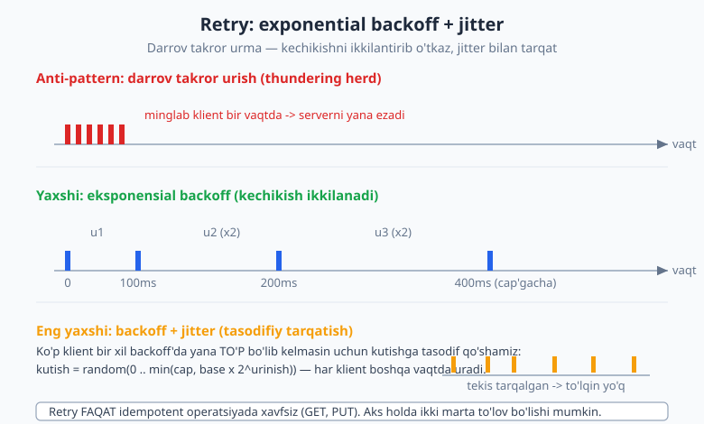
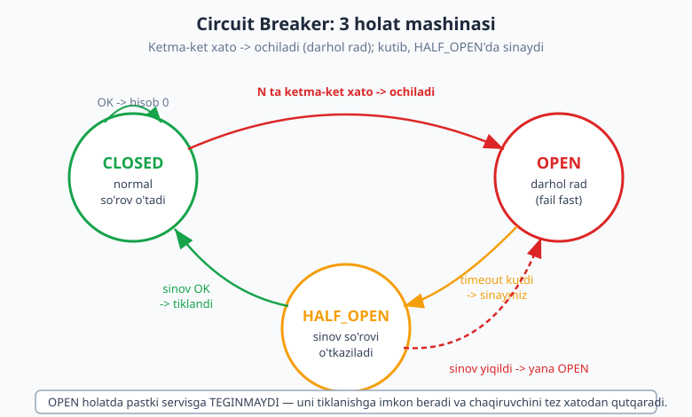
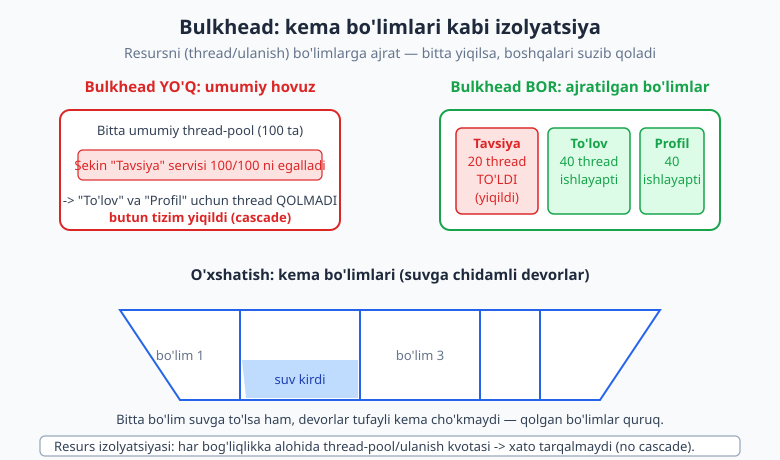

# 23 — Ishonchlilik: fault tolerance va resilience

[⬅️ Oldingi: 22 — CAP, consistency va replikatsiya](./22-cap-consistency-replikatsiya.md) · [🏠 README](./README.md) · [Keyingi: 24 — Observability va operatsiya ➡️](./24-observability.md)

---

> **Bu bobda:** [22-bob](./22-cap-consistency-replikatsiya.md)da tarmoq partitsiyasi distributed (taqsimlangan) tizimda MUQARRAR ekanini ko'rdik. Bu bob shu haqiqatdan boshlanadi: **xatolik — anomaliya emas, NORMAL holat**. Yetarlicha katta tizimda har lahza nimadir yiqilib turadi — disk to'ladi, tarmoq uziladi, servis sekinlashadi. Avval taqsimlangan tizim haqidagi sakkizta keng tarqalgan **noto'g'ri taxminni** (8 fallacy — L. Peter Deutsch) sanab, ularning oqibatini ko'ramiz. So'ng **SPOF** (single point of failure — yagona uzilish nuqtasi) ni va uni redundancy (ortiqchalik) bilan yo'qotishni o'rganamiz. Keyin resilience (uzilishga chidamlilik) patternlarini ketma-ket olamiz: **timeout** (cheksiz kutma), **retry + eksponensial backoff + jitter** (darrov takror urma), **circuit breaker** (yiqilgan servisni darhol rad et), **bulkhead** (resurslarni izolyatsiya qil), **fallback / graceful degradation** (to'liq yiqilish o'rniga qisman ishla) va **rate limiting / load shedding** (yukni cheklab nafas ol). Yakunda **health check**, **failover** va **chaos engineering** (Netflix Chaos Monkey) bilan tanishamiz. Circuit breaker holat mashinasi va retry'ni ishlaydigan TypeScript bilan tekshiramiz.
>
> **Trade-off eslatmasi / Halollik:** Resilience BEPUL emas. Har pattern murakkablik, kechikish yoki resurs sarfini qo'shadi: timeout juda qisqa bo'lsa sog'lom so'rovni ham uzadi; retry idempotent bo'lmagan operatsiyada ikki marta pul yechishi mumkin; circuit breaker noto'g'ri sozlansa sog'lom servisni ham bloklaydi. Maqsad — **nolga teng xatolik emas** (bu imkonsiz), balki **xatoni lokal ushlab, tarqalishiga yo'l qo'ymaslik** (cascade'ning oldini olish). Bu bobdagi TypeScript misoli (`_v_23.ts`) `$env:TEMP\arx-probe` da `tsx` bilan ishga tushirilgan va `tsc --noEmit --strict` bilan tekshirilgan — chiqish bob oxiridagi hisobotda keltirilgan (soxta soat bilan deterministik). Konkret raqamlar (necha xato -> ochiladi, qancha kutish) — kontekstga bog'liq, "to'g'ri qiymat" emas; ularni misol/tartib sifatida o'qing.

---

## Xatolik — anomaliya emas, NORMAL holat

Bitta serverda ishlaydigan dasturda funksiya chaqirsangiz — u o'tadi yoki istisno (exception) tashlaydi, lekin "yarim o'tdi", "10 soniya osilib qoldi" degan holat odatda bo'lmaydi. Distributed tizimda esa har chaqiruv — tarmoq sayohati: u **sekin** bo'lishi, **yo'qolishi**, **ikki marta** yetib borishi yoki **noma'lum** holatda qolishi (so'rov bordi, lekin javob qaytmadi — bajarildimi yo'qmi bilmaysiz) mumkin.

Bu yerda fikrlashning eng muhim siljishi: **kichik tizim** uchun "ishonchli" degani "deyarli hech qachon yiqilmaydi"; **katta tizim** uchun esa "ishonchli" degani "**komponentlar yiqilib turadi, lekin tizim umuman ishlaydi**". 1000 ta serverdan iborat tizimda, har bir server yiliga atigi bir marta yiqilsa ham, o'rtacha kuniga uch marta nimadir yiqiladi. Demak savol "yiqiladimi?" emas — "**yiqilganda nima bo'ladi?**".

> **Eslatma:** Ikki atamani ajratamiz. **Fault tolerance** (xatoga chidamlilik) — tizim komponent yiqilganda ham ishlashda davom etadi (masalan, bitta replika o'lsa, ikkinchisi xizmat qiladi). **Resilience** (uzilishga chidamlilik / tiklanuvchanlik) — kengroq tushuncha: tizim nafaqat chidaydi, balki yukka moslashadi, qisman degradatsiya qiladi va uzilishdan keyin **o'zini tiklaydi**. Bu bob patternlari ikkalasiga ham xizmat qiladi.

### Distributed computing 8 fallacy (L. Peter Deutsch)

Tajribasiz arxitektor taqsimlangan tizimni xuddi bitta mashina kabi tasavvur qiladi va sakkizta noto'g'ri taxminga tayanadi. Bu ro'yxat 1990-yillarda Sun Microsystems'da shakllangan; ko'pini **L. Peter Deutsch** ifodalagan (dastlabki to'rttasini Bill Joy va Tom Lyon, sakkizinchisini James Gosling qo'shgan). Har birini va uning oqibatini ko'ramiz:

```text
1. Tarmoq ishonchli (network is reliable)
   -> XATO: paketlar yo'qoladi, ulanish uziladi.
   Oqibat: har masofaviy chaqiruvda xato bo'lishi mumkin -> retry, timeout kerak.

2. Latency (kechikish) nol
   -> XATO: yorug'lik tezligi ham chegara; ming km = ~o'nlab ms.
   Oqibat: ko'p mayda chaqiruv (chatty API) sekin -> batching, kamroq round-trip.

3. Bandwidth (o'tkazuvchanlik) cheksiz
   -> XATO: kanal kengligi cheklangan; katta javob tiqilib qoladi.
   Oqibat: pagination, faqat kerakli maydon (over-fetching'dan qoch -> 17-bob).

4. Tarmoq xavfsiz (network is secure)
   -> XATO: ichki tarmoq ham buzilishi mumkin (zero trust).
   Oqibat: shifrlash (TLS), autentifikatsiya har qatlamda.

5. Topologiya o'zgarmaydi (topology doesn't change)
   -> XATO: serverlar qo'shiladi/o'chadi, IP o'zgaradi (ayniqsa bulutda).
   Oqibat: IP'ga emas, service discovery / DNS nomiga bog'lan.

6. Bitta administrator bor (one administrator)
   -> XATO: ko'p jamoa, ko'p sozlama; versiyalar bir xil emas.
   Oqibat: orqaga moslik (backward compatibility), versiyalangan API (17-bob).

7. Transport narxi nol (transport cost is zero)
   -> XATO: serializatsiya (JSON tuzish/yechish), tarmoq trafigi pul/CPU sarflaydi.
   Oqibat: ortiqcha ma'lumot uzatma; format va hajmni o'yla.

8. Tarmoq bir xil (network is homogeneous)
   -> XATO: turli OT, til, protokol, qurilma birga ishlaydi.
   Oqibat: standart, ochiq protokol (HTTP, gRPC); platforma taxminiga tayanma.
```

> **Amaliyotda:** Bu sakkizlik — diagnostika ro'yxati. Tizimda g'alati nosozlik ko'rsangiz, undan o'ting: "Men tarmoqni ishonchli deb taxmin qildimmi? Latency'ni e'tiborsiz qoldirdimmi?". Ko'p "tushunarsiz" bug — aslida shu taxminlardan birining buzilishi. e-commerce'da "ba'zan to'lov ikki marta o'tadi" muammosi — odatda 1-fallacy (so'rov yo'qoldi deb retry qilindi, aslida o'tgan edi -> idempotentlik kerak, [21-bob](./21-message-queue-async.md)).

---

## SPOF — yagona uzilish nuqtasi

**SPOF** (Single Point of Failure — yagona uzilish nuqtasi) — tizimda shunday bitta komponent borki, u yiqilsa, BUTUN tizim to'xtaydi. Zanjir eng zaif halqasi qadar mustahkam: agar buyurtma oqimi yagona ma'lumotlar bazasiga tayansa va o'sha baza o'lsa, qancha veb-server bo'lishidan qat'i nazar, hech narsa ishlamaydi.

SPOF'ni topish uchun har komponentdan so'rang: "**Bu o'lsa, nima ishlamay qoladi?**". Tipik SPOF'lar:

- Yagona ma'lumotlar bazasi instansi (replikasiz).
- Yagona load balancer (uning o'zi yiqilsa, kirish yopiq).
- Yagona DNS yoki yagona to'lov shlyuzi.
- Yagona "umumiy" servis (masalan, hammaning autentifikatsiyasi bitta auth servisga tayansa).

Yechim — **redundancy** (ortiqchalik): bitta nusxa o'rniga bir nechta. Agar bir nusxa o'lsa, boshqasi ishni davom ettiradi (**failover**, quyida). Bu [19-bobdagi](./19-masshtablash-load-balancing.md) gorizontal masshtab va [22-bobdagi](./22-cap-consistency-replikatsiya.md) replikatsiya bilan chambarchas bog'liq — bir o'q bilan ikki quyon: masshtab + chidamlilik.

> **Diqqat:** Redundancy SPOF'ni **ko'chiradi**, batamom yo'qotmaydi. Ikkita veb-server qo'ydingiz, lekin ular bitta load balancer ortida bo'lsa — endi load balancer SPOF. Uni ham juftlang (active-passive yoki anycast). "Hech qanday SPOF yo'q" — amalda erishib bo'lmas ideal; maqsad — SPOF'ni biznes uchun maqbul darajagacha kamaytirish (har qo'shimcha "9" — `99.9% -> 99.99%` — geometrik qimmatga tushadi). Bu sof TRADE-OFF: ishonchlilik narxi vs uzilish narxi.

> **Anti-pattern: yashirin SPOF.** Ba'zan SPOF ko'rinmaydi: ikkita ma'lumotlar bazasi bor, lekin ikkalasi ham bitta jismoniy serverda yoki bitta availability zone'da. Yoki ikkita servis "mustaqil", lekin ikkalasi bitta umumiy kesh (cache, [20-bob](./20-keshlash.md))ga tayanadi va kesh yiqilsa, ikkalasi ham qulaydi. Redundancy haqiqiy bo'lishi uchun nusxalar **mustaqil yiqilishi** kerak.

---

## Resilience patternlari

Endi asosiy patternlarga o'tamiz. Tartib bejiz emas: ular ko'pincha **birga** ishlatiladi (timeout -> retry -> circuit breaker -> fallback) — quyida buni ko'ramiz.

### Timeout — cheksiz kutma

Eng oddiy, eng ko'p unutiladigan pattern. Masofaviy chaqiruvga **timeout** (vaqt chegarasi) qo'ying: "shu vaqt ichida javob bermasa — voz kechaman". Timeout'siz chaqiruv — yashirin SPOF: pastki servis osilib qolsa, sizning thread'ingiz (oqimingiz) ham cheksiz kutib osilib qoladi. Bir nechta shunday osilgan so'rov — barcha thread'larni band qiladi, va siz **butun** servis yiqilganini ko'rasiz, garchi faqat bitta bog'liqlik sekinlashgan bo'lsa ham. Bu — eng tez-tez uchraydigan cascade (zanjirli yiqilish) sababi.

```text
Timeout YO'Q:
  A --> B (B osilib qoldi)
  A'ning thread'i kutadi... kutadi... cheksiz.
  Ko'p so'rov keladi -> A'ning hamma thread'i B'ni kutib band -> A ham yiqildi.

Timeout BOR (masalan 2s):
  A --> B  ... 2s o'tdi, javob yo'q -> A voz kechadi, xato qaytaradi.
  Thread bo'shadi, A boshqa so'rovlarni xizmat qilishda davom etadi.
```

> **Trade-off:** Timeout qiymati nozik. Juda **qisqa** — sog'lom, lekin biroz sekin javobni ham uzasiz (false positive), keraksiz xato va retry ko'payadi. Juda **uzun** — osilgan chaqiruvni juda kech ushlaysiz, foyda kam. Yaxshi boshlanish nuqtasi: normal javob vaqtining (masalan p99 latency'ning) bir necha barobari. Timeout'ni har qatlamga mos qo'ying: tashqi (foydalanuvchi) timeout > ichki chaqiruvlar timeout yig'indisi bo'lmasin, aks holda foydalanuvchi allaqachon ketgan bo'ladi, lekin ichki ish davom etadi (behuda).

### Retry + eksponensial backoff + jitter

Tarmoqdagi xato ko'pincha **vaqtinchalik** (transient): paket yo'qoldi, servis bir lahza band edi. Bunday holatda **retry** (qayta urinish) mantiqan to'g'ri — ko'pincha ikkinchi urinish o'tadi. Lekin retry'ni **noto'g'ri** qilish vaziyatni YOMONLASHTIRADI.

Avval eng katta xatolikni ko'raylik. Servis sekinlashganda minglab klient bir vaqtda xato oladi va **darrov, bir vaqtda** qayta uradi. Bu — **thundering herd** (gala hujumi) yoki **retry storm** (qayta urinish bo'roni): allaqachon qiynalayotgan servisni ikki barobar yuk bilan yana ezadi va u butunlay qulaydi. Yechim ikki bosqichli:

1. **Eksponensial backoff** (eksponensial chekinish): har urinishdan keyin kutish vaqtini IKKILANTIRING — `100ms`, keyin `200ms`, keyin `400ms`... `cap` (shift) gacha. Bu servisaga nafas olishga vaqt beradi.
2. **Jitter** (tasodif): backoff'ga tasodif qo'shing, aks holda hamma klient bir xil backoff'dan keyin yana BIR VAQTDA keladi — to'lqin saqlanadi. Kutishni `random(0 .. backoff)` qiling — klientlar vaqt o'qiga **tekis tarqaladi**.



> **Diqqat (eng muhim shart): retry FAQAT idempotent operatsiyada xavfsiz.** **Idempotentlik** ([21-bob](./21-message-queue-async.md)) — operatsiyani bir marta yoki ko'p marta bajarish bir xil natija beradi. `GET`, `PUT` (to'liq almashtirish), `DELETE` — odatda idempotent. Lekin "balansdan 100$ yech" yoki idempotency key'siz `POST /payment` — EMAS. Tasavvur qiling: so'rov serverga yetdi, server pulni yechdi, lekin **javob** tarmoqda yo'qoldi. Klient "xato" deb retry qiladi -> pul **ikki marta** yechiladi. Shuning uchun pul/buyurtma kabi operatsiyalarni retry qilishdan oldin ularni **idempotency key** bilan idempotent qiling, aks holda retry'ni umuman qo'llamang.

> **Eslatma:** Cheksiz retry ham yomon — agar servis haqiqatan o'lgan bo'lsa, abadiy urinish thread'ni va resursni behuda sarflaydi. `maxRetries` (masalan 3-5) qo'ying. Va retry'ni **circuit breaker** bilan birlashtiring (keyingi bo'lim): agar servis aniq yiqilgan bo'lsa, retry ham qilmang — darhol rad eting.

### Circuit Breaker — yiqilgan servisni darhol rad et

Bu — bobning **markaziy** pattern'i. G'oya elektr avtomatidan olingan: simlar qizib ketganda avtomat (breaker) zanjirni **uzadi**, yong'in chiqishidan oldin. Dasturda: agar pastki servis ketma-ket ko'p marta xato bersa, **circuit breaker** uni "o'lgan" deb hisoblaydi va keyingi so'rovlarni unga **umuman yubormaydi** — darhol xato qaytaradi. Bu ikki foyda beradi: (1) chaqiruvchi sekin timeout'ni kutmaydi (**fail fast** — tez yiqilish), (2) yiqilgan servis qo'shimcha yuksiz **tiklanishga** imkon oladi.

Circuit breaker — uchta holatli mashina:



- **CLOSED** (yopiq — normal): so'rovlar o'tadi. Ketma-ket xatolar sanaladi. Xato soni chegaradan (`failureThreshold`) oshsa -> **OPEN**'ga o'tadi. (Muvaffaqiyat hisobni nollaydi.)
- **OPEN** (ochiq — uzilgan): so'rovlar pastki servisga **TEGMAYDI**, darhol rad etiladi (`CircuitOpenError`). Belgilangan vaqt (`openDuration`) kutiladi.
- **HALF_OPEN** (yarim ochiq — sinov): kutish tugagach, breaker BIR (yoki bir nechta) **sinov** so'rovini o'tkazib ko'radi. Agar sinov **muvaffaqiyatli** bo'lsa -> servis tiklangan, **CLOSED**'ga qaytadi. Agar **yiqilsa** -> yana **OPEN**'ga (qaytadan kutadi).

> **Eslatma (terminologiya teskari ko'rinadi):** "Closed" — elektr zanjiri YOPIQ, ya'ni tok (so'rov) OQADI = normal. "Open" — zanjir UZILGAN, tok oqmaydi = so'rov bloklanadi. Dasturchilar uchun avval chalkash, lekin elektr metaforasi shunday.

Endi buni ishlaydigan TypeScript'da ko'ramiz. To'liq fayl (`_v_23.ts`) circuit breaker holat mashinasini va retry'ni amalga oshiradi; deterministik bo'lishi uchun real kutish o'rniga **soxta soat** (fake clock) ishlatamiz. Quyida circuit breaker yadrosi:

```ts
type BreakerState = 'CLOSED' | 'OPEN' | 'HALF_OPEN';

interface BreakerOptions {
  failureThreshold: number;          // ketma-ket nechta xatodan keyin OPEN
  openDurationMs: number;            // OPEN'da qancha kutib HALF_OPEN'ga o'tish
  halfOpenSuccessesToClose: number;  // HALF_OPEN'da nechta muvaffaqiyat -> CLOSED
}

class CircuitBreaker {
  private state: BreakerState = 'CLOSED';
  private consecutiveFailures = 0;
  private halfOpenSuccesses = 0;
  private openedAt = 0;

  constructor(private opt: BreakerOptions, private clock: FakeClock) {}

  // Har chaqiruvdan oldin: OPEN'da yetarli kutilgan bo'lsa, HALF_OPEN'ga o'tamiz.
  private beforeCall(): void {
    if (this.state === 'OPEN') {
      const elapsed = this.clock.now() - this.openedAt;
      if (elapsed >= this.opt.openDurationMs) {
        this.halfOpenSuccesses = 0;
        this.state = 'HALF_OPEN';
      }
    }
  }

  async call<T>(op: () => Promise<T>): Promise<T> {
    this.beforeCall();
    if (this.state === 'OPEN') {
      // Pastki servisga TEGINMAYMIZ — darhol rad (fail fast)
      throw new CircuitOpenError();
    }
    try {
      const result = await op();
      this.onSuccess();        // HALF_OPEN'da yetarli muvaffaqiyat -> CLOSED
      return result;
    } catch (err) {
      this.onFailure();        // chegaradan oshsa -> OPEN
      throw err;
    }
  }
}
```

`onFailure` ichida muhim nuqta: agar **HALF_OPEN** holatda sinov yiqilsa, darhol **OPEN**'ga qaytamiz (servis hali tiklanmagan), aks holda CLOSED'da ketma-ket xato hisobini oshiramiz va chegaraga yetganda OPEN'ga o'tamiz:

```ts
private onFailure(): void {
  if (this.state === 'HALF_OPEN') {
    this.openedAt = this.clock.now();
    this.state = 'OPEN';            // sinov yiqildi -> yana ochiladi
    return;
  }
  this.consecutiveFailures++;
  if (this.consecutiveFailures >= this.opt.failureThreshold) {
    this.openedAt = this.clock.now();
    this.state = 'OPEN';            // ketma-ket xato chegarasi
  }
}
```

Bu kodni ishga tushirganda (to'liq chiqish — bob oxiridagi hisobotda) holat aynan kutilgan tartibda o'tadi: 3 ta ketma-ket xato -> `CLOSED -> OPEN`; so'rovlar darhol rad etiladi; 5 soniya kutilgach `OPEN -> HALF_OPEN`; sinov muvaffaqiyatli -> `HALF_OPEN -> CLOSED`. ASSERT (o'tishlar to'g'riligi) PASS qaytardi.

> **Trade-off:** Circuit breaker sozlamalari biznes-mantiq. `failureThreshold` juda **past** (masalan 1) -> bitta tasodifiy xato butun yo'nalishni bloklaydi (juda sezgir). Juda **baland** -> yiqilgan servisni juda uzoq ezasiz. `openDuration` juda **qisqa** -> tiklanmagan servisni erta sinab, yana yiqilasiz. Amaliyotda ko'pincha xato **foizi** (oxirgi N so'rovning ko'p qismi xato bo'lsa) bilan ishlatiladi, oddiy ketma-ket hisob emas — lekin printsip bir xil. Tayyor kutubxonalar bor (masalan Resilience4j, Polly, opossum), o'zingiz noldan yozish shart emas — bu yerda ichki mexanizmni TUSHUNISH uchun yozdik.

### Bulkhead — resurslarni izolyatsiya qil

**Bulkhead** (kema bo'lim devori) — nomi kemadan: korpus suvga chidamli bo'limlarga ajratiladi, shuning uchun bitta bo'lim teshilsa ham, suv butun kemaga tarqalmaydi va u cho'kmaydi. Dasturda xuddi shu: resurslarni (thread, ulanish, hovuz) **izolyatsiyalangan bo'limlarga** ajratasiz, toki bitta bog'liqlik barcha resursni yutib, **butun** tizimni cho'ktirmasin.



Klassik misol: veb-servisingiz uchta pastki bog'liqlikni chaqiradi — `To'lov`, `Profil`, `Tavsiya`. Agar hammasi **bitta** umumiy thread-pool (100 thread) ni baham ko'rsa va `Tavsiya` servisi sekinlashsa, uning sekin chaqiruvlari asta-sekin barcha 100 thread'ni egallaydi. Endi `To'lov` so'rovi ham thread topolmaydi — eng muhim funksiya, eng ahamiyatsiz servis tufayli yiqildi. Bulkhead bilan har bog'liqlikka **alohida kvota** berasiz (masalan Tavsiya'ga 20 thread). Tavsiya yiqilsa, faqat o'sha 20 thread band bo'ladi; To'lov va Profil o'z kvotasi bilan ishlashda davom etadi.

> **Amaliyotda:** Bulkhead ko'p ko'rinishda bo'ladi: alohida thread-pool, alohida DB ulanish hovuzi (connection pool) har bog'liqlikka, hatto alohida server guruhi muhim mijozlar uchun. "Eng muhim oqimni izolyatsiya qil" — amaliy qoida: e-commerce'da `To'lov`/`Buyurtma` oqimini hech qachon `Tavsiya`/`Analitika` bilan bir hovuzda saqlamang.

### Fallback va graceful degradation

Ba'zan eng yaxshi javob — to'liq yiqilish o'rniga **kamroq, lekin baribir foydali** javob. **Fallback** (zaxira yo'l) — asosiy yo'l yiqilganda ishga tushadigan oddiyroq muqobil. **Graceful degradation** (muloyim degradatsiya) — tizim qismlari yiqilganda butunlay o'lish o'rniga **funksiyani qisqartirib** ishlashda davom etish.

Misollar:

- Shaxsiy **tavsiya** servisi yiqildi -> uning o'rniga **ommabop** mahsulotlar ro'yxatini ko'rsat (umumiy, lekin foydali). Foydalanuvchi bo'sh ekran o'rniga nimadir ko'radi.
- Real-vaqt narx servisi yiqildi -> **keshdagi** oxirgi ma'lum narxni "biroz eskirgan bo'lishi mumkin" izohi bilan ko'rsat ([20-bob](./20-keshlash.md), stale-while-revalidate).
- Profil rasmlari yuklanmadi -> standart avatar ko'rsat, sahifa baribir ochiladi.

```text
Asosiy yo'l:    so'rov -> [Tavsiya servisi] -> shaxsiy ro'yxat
                                 |  (yiqildi / timeout / circuit OPEN)
                                 v
Fallback:       so'rov -> [kesh / ommabop ro'yxat] -> umumiy, lekin foydali javob
```

> **Diqqat:** Fallback ham xato bera oladi va u ham resurs ishlatadi. Fallback'ni **oddiy va ishonchli** qiling — agar fallback ham murakkab bog'liqlikka tayansa, u ham yiqilishi mumkin (fallback'ning fallback'i kerak bo'lib qoladi). Eng yaxshi fallback — statik yoki keshdagi ma'lumot. Va fallback ishga tushganini **kuzating** ([24-bob](./24-observability.md)): agar fallback doim ishlayotgan bo'lsa, demak asosiy yo'l buzuq — bu ko'rinmay qolmasin.

### Rate limiting va load shedding

Resilience faqat "boshqalar yiqilganda" emas — **o'zingni himoya qilish** ham. **Rate limiting** (so'rov tezligini cheklash) — bitta klient (yoki umuman) belgilangan vaqt ichida nechta so'rov yubora olishini cheklash. Bu tizimni haddan ortiq yukdan, suiiste'moldan va tasodifiy "retry storm"dan himoya qiladi. **Load shedding** (yukni tashlash) — tizim sig'imi to'lganda, **yangi** so'rovlarni darhol rad etish (masalan `503 Service Unavailable`), toki mavjud so'rovlar tugatilsin. Hammaga "biroz" xizmat qilib, hammasini yiqitgandan ko'ra — qisman rad etib, qolganini sog' saqlash yaxshiroq.

> **Trade-off:** Rate limit juda **qattiq** bo'lsa, halol foydalanuvchini bloklaysiz; juda **bo'sh** bo'lsa, himoya yo'q. Odatda klient/IP/API-kalit bo'yicha cheklanadi (token bucket yoki leaky bucket algoritmi). Rad etilganda `429 Too Many Requests` + `Retry-After` sarlavhasi qaytaring — toki yaxshi klient backoff bilan kutsin (yuqoridagi retry pattern bilan tabiiy bog'lanadi).

### Patternlarni birga ishlatish

Bu patternlar yakka emas — odatda **qatlam** bo'lib ishlaydi. Bitta masofaviy chaqiruvning to'liq himoyasi shunday ko'rinadi:

```text
so'rov
  -> [Rate limiter]      yukni cheklab kiritamiz
  -> [Circuit breaker]   servis OPEN bo'lsa, darhol fallback'ga o't
       -> [Retry]        vaqtinchalik xatoda backoff+jitter bilan qayta ur
            -> [Timeout]  har urinishni vaqt bilan chegarala
                 -> [Bulkhead]  ajratilgan thread/ulanish kvotasida bajar
                      -> masofaviy chaqiruv
  -> hammasi yiqilsa -> [Fallback]  kesh / oddiy javob
```

> **Eslatma (tartib muhim):** Retry circuit breaker'ning ICHIDA bo'ladi (bitta mantiqiy chaqiruvning bir necha urinishi — breaker uchun yagona "muvaffaqiyat yoki yakuniy xato" bo'lib ko'rinadi), aks holda har retry breaker'ni alohida xato sifatida sanab, uni juda tez ochib yuboradi. Bu nozik nuqta — tayyor kutubxonalar buni to'g'ri tartibda qiladi.

---

## Health check, failover va chaos engineering

### Health check

**Health check** (sog'liq tekshiruvi) — servisning "tirikman va ishlay olaman" deb javob beradigan maxsus endpoint'i (masalan `GET /health`). Load balancer va orkestrator (Kubernetes) buni muntazam so'raydi; servis javob bermasa, uni rotatsiyadan **chiqaradi** (trafikni unga yubormaydi). Ikki turi muhim:

- **Liveness** (tiriklik): "jarayon tirikmi?" — yo'q bo'lsa, qayta ishga tushir (restart).
- **Readiness** (tayyorlik): "so'rov qabul qila olamanmi?" — yo'q bo'lsa (masalan, hali DB'ga ulanmadi yoki haddan tashqari band), trafikni vaqtincha to'xtat, lekin restart qilma.

> **Diqqat:** Health check **mazmunli** bo'lsin. "Faqat `200 OK` qaytaradigan" tekshiruv yetarli emas — u jarayon tirikligini ko'rsatadi, lekin servis aslida DB'ga ulanolmasligi mumkin. Lekin teskari xato ham bor: health check muhim bog'liqliklarning HAMMASINI tekshirsa, bitta ahamiyatsiz bog'liqlik yiqilganda butun servis "nosog'" deb e'lon qilinadi va rotatsiyadan chiqariladi — keraksiz yiqilish. Balans: faqat **shu servis ishlashi uchun zarur** bog'liqliklarni tekshiring.

### Failover

**Failover** — asosiy (primary) komponent yiqilganda zaxira (standby) avtomatik ishni o'z zimmasiga olishi. SPOF'ni redundancy bilan yo'qotishning amaliy mexanizmi. Ikki rejim:

- **Active-passive**: zaxira kutib turadi (issiq/iliq/sovuq), asosiy o'lsa ishga o'tadi. Soddaroq, lekin zaxira resursi "behuda" turadi va o'tish lahzasi (failover time) bor.
- **Active-active**: hamma nusxa bir vaqtda ishlaydi, biri o'lsa qolganlari yukni bo'lishadi. Resurs to'la ishlatiladi, lekin koordinatsiya murakkabroq (ayniqsa ma'lumot izchilligi — [22-bob](./22-cap-consistency-replikatsiya.md)).

> **Amaliyotda:** Failover'ning eng katta yashirin xatosi — uni **hech qachon sinab ko'rmaslik**. "Zaxira bor" deb yozilgan, lekin asosiy haqiqatan yiqilganda zaxira ishlamaydi (eskirgan, noto'g'ri sozlangan, yoki o'tish skripti buzuq). Failover ishlashiga ishonchingiz komil bo'lishi uchun uni **muntazam mashq qiling** — bu bizni chaos engineering'ga olib keladi.

### Chaos engineering

**Chaos engineering** (betartiblik muhandisligi) — tizim chidamliligini **ataylab xato kiritib** sinash amaliyoti. G'oya oddiy va jasur: agar tizim haqiqiy uzilishga chidashi kerak bo'lsa, uzilishni **nazorat ostida**, ish vaqtida (yoki staging'da) o'zingiz keltiring va tizim ushlay oladimi ko'ring — kutilmagan uzilishni kutib o'tirmasdan.

Eng mashhur misol — **Netflix Chaos Monkey**: ishlab chiqarish (production) muhitida tasodifiy serverlarni **ataylab o'chiradigan** vosita. Mantiq: agar tasodifiy server o'chishi tizimni yiqitsa, buni payshanba kuni soat 14:00da, butun jamoa ishda turganida bilgan yaxshi — kechasi soat 3:00da, hamma uxlab yotganda emas. Doimiy chaos tufayli muhandislar har komponentni boshidanoq chidamli qilib quradi (redundancy, timeout, fallback — odatga aylanadi).

> **Diqqat:** Chaos engineering — "production'ni shunchaki buzish" emas. U **ilmiy** amaliyot: (1) avval normal holatni o'lchang (steady state), (2) gipoteza tuzing ("bitta DB replikasi o'lsa, tizim ishlashda davom etadi"), (3) kichik **blast radius** (ta'sir doirasi) bilan boshlang, (4) avtomatik to'xtatish (kill switch) tayyorlang. Yetuk monitoring ([24-bob](./24-observability.md)) BO'LMASA chaos engineering'ni boshlamang — natijani ko'rolmasangiz, foydasi yo'q, zarari bor.

---

## Hammasini birlashtirib: amaliy ko'rsatma

Resilience — alohida pattern emas, **fikrlash tarzi**. Yangi masofaviy chaqiruv yozayotganda o'zingizdan so'rang:

1. **Timeout** qo'ydimmi? (Cheksiz kutmasligim uchun.)
2. Bu xato vaqtinchalik bo'lsa, **retry** mantiqiymi? Operatsiya **idempotent**mi? Backoff+jitter bilanmi?
3. Bu bog'liqlik tez-tez yiqilsa, **circuit breaker** kerakmi?
4. Bu bog'liqlikni boshqa oqimlardan **bulkhead** bilan izolyatsiya qildimmi?
5. Yiqilsa, **fallback** bormi? Foydalanuvchi nima ko'radi?
6. Bu chaqiruvning yiqilishi qayerda **ko'rinadi** ([24-bob](./24-observability.md))?

> **Trade-off (umumiy xulosa):** Har patternni har joyga qo'shmang — bu murakkablik va kechikish keltiradi (YAGNI, [06-bob](./06-dry-kiss-yagni.md)). Eng muhim, eng tez-tez yiqiladigan tashqi bog'liqliklardan boshlang. Ko'pchilik resilience'ni infratuzilma (service mesh, API gateway, [17-bob](./17-api-dizayni-aloqa.md)) qatlamida markazlashtiradi — toki har servis o'zi qaytadan yozmasin. Bu — sifat atributlari ([02-bob](./02-sifat-atributlari-tradeoff.md)) o'rtasidagi muvozanat: ishonchlilik vs soddalik vs kechikish.

---

## Xulosa

- Xatolik distributed tizimda **NORMAL** holat. Savol "yiqiladimi?" emas, "**yiqilganda nima bo'ladi?**".
- **8 fallacy** (Deutsch) — taqsimlangan tizim haqidagi noto'g'ri taxminlar; ko'p bug ularning buzilishidan kelib chiqadi.
- **SPOF** — yagona uzilish nuqtasi; **redundancy** bilan kamaytiriladi (lekin SPOF ko'chadi, butunlay yo'qolmaydi).
- **Timeout** — cheksiz kutmaslik; cascade'ning eng tez-tez sababi — timeout'siz chaqiruvlar.
- **Retry** faqat **idempotent** operatsiyada, **eksponensial backoff + jitter** bilan (thundering herd'dan qochish uchun).
- **Circuit breaker** (CLOSED -> OPEN -> HALF_OPEN) — yiqilgan servisni darhol rad etib, tez yiqilish va tiklanishga imkon beradi.
- **Bulkhead** — resurslarni izolyatsiyalab, bitta yiqilish butun tizimga tarqalmasin.
- **Fallback / graceful degradation** — to'liq o'lim o'rniga qisman foydali javob.
- **Rate limiting / load shedding** — o'zini ortiqcha yukdan himoya qilish.
- **Health check, failover, chaos engineering** — chidamlilikni operatsion ta'minlash va **sinab ko'rish**.
- Hammasi **trade-off**: maqsad nol xatolik emas, balki xatoni **lokal ushlab**, tarqalishiga yo'l qo'ymaslik.

Keyingi bobda ([24-bob](./24-observability.md)) bu chidamlilikni **ko'rinadigan** qilamiz: logging, metrics va tracing — "tizim ichida nima bo'lyapti?" degan savolga javob. Resilience'ni quramiz, observability bilan uni kuzatamiz.

---

## Mashqlar

### Oson

**1-mashq.** Quyidagi taxmin qaysi fallacy (8 tadan)? "Bizning servislar bir ma'lumot markazida, demak ular orasidagi chaqiruv darhol qaytadi, kechikishni hisobga olmasak ham bo'ladi."

**2-mashq.** Ushbu atamalarni moslang: (a) CLOSED, (b) OPEN, (c) HALF_OPEN — bilan: (1) so'rovlar darhol rad etiladi, (2) sinov so'rovi o'tkaziladi, (3) normal, so'rovlar o'tadi.

**3-mashq.** Nima uchun retry'ni faqat **darrov** (backoff'siz) qilish vaziyatni yomonlashtiradi? Bir jumlada javob bering va bu hodisaning nomini ayting.

**4-mashq.** "Closed" holatda circuit breaker so'rovni o'tkazadimi yoki bloklaydimi? Nima uchun nom chalkash ko'rinadi?

### O'rta

**5-mashq.** Quyidagi chaqiruvlarning har biri uchun retry **xavfsiz**mi (idempotentmi)? Sababini ayting:
(a) `GET /users/42` (b) `POST /payments` (idempotency key'siz) (c) `PUT /users/42` (to'liq almashtirish) (d) `DELETE /sessions/abc`

**6-mashq.** Servisingiz `To'lov`, `Profil`, `Tavsiya` ni chaqiradi va hammasi bitta 100-thread'lik hovuzni baham ko'radi. `Tavsiya` sekinlashdi va butun servis yiqildi. Qaysi pattern bu muammoni hal qiladi va aniq qanday?

**7-mashq.** "Tavsiya servisi yiqilganda foydalanuvchiga bo'sh ekran o'rniga ommabop mahsulotlar ko'rsatiladi." Bu qaysi pattern? Uni amalga oshirishda nimaga e'tibor berish kerak (bitta diqqat nuqtasi)?

**8-mashq.** `failureThreshold` ni `1` qilib qo'ysangiz, qanday muammo bo'ladi? Endi uni `1000` qilsangiz-chi? Ikki ekstremumning trade-off'ini tushuntiring.

**9-mashq.** Quyidagi to'liq himoya qatlamini to'g'ri tartibga keltiring (tashqaridan ichkariga): `Timeout`, `Retry`, `Circuit breaker`, `Rate limiter`. Retry nega circuit breaker ICHIDA bo'lishi kerak?

**10-mashq.** Sizda ikkita veb-server bor, ikkalasi bitta load balancer ortida, va o'sha load balancer bitta. Bu yerda SPOF qayerda? Uni qanday yo'qotasiz?

### Qiyin

**11-mashq (KOD).** TypeScript'da `retry` funksiyasini yozing: signaturasi `retry<T>(op, opt)` bo'lib, `opt` da `maxRetries`, `baseMs`, `capMs` bor. Eksponensial backoff (kechikish `min(cap, base * 2^attempt)`) va **full jitter** (`random(0..backoff)`) ishlating. Test uchun `rand: () => number` ni `opt` ga qo'shing (deterministik chiqish uchun). `tsx` bilan ishga tushiring va `tsc --noEmit --strict` bilan tekshiring; kechikishlar `100, 200, 400...` tartibida ekanini ko'rsating.

**12-mashq (KOD).** `_v_23.ts` dagi `CircuitBreaker` ni kengaytiring: **xato foizi** bo'yicha ishlasin (oxirgi N so'rovning 50%+ xato bo'lsa OPEN), oddiy ketma-ket hisob o'rniga. Sirpanuvchi oyna (sliding window) ishlating. Holat o'tishlarini jurnalga yozing va `tsx` bilan tasdiqlang.

**13-mashq (DIZAYN).** e-commerce checkout (to'lov) oqimini loyihalang. U `Inventory` (zaxira), `Payment` (to'lov shlyuzi — tashqi, ishonchsiz) va `Notification` (email) ni chaqiradi. Har bog'liqlik uchun: qaysi resilience pattern(lar)ni qo'llaysiz va nega? Qaysi chaqiruv idempotent bo'lishi kerak? Qaysi biri sinxron, qaysi biri asinxron ([17](./17-api-dizayni-aloqa.md), [21](./21-message-queue-async.md))? Diagramma yoki matn bilan tasvirlang.

**14-mashq (DIZAYN).** Sizda monitoring deyarli yo'q tizim bor va rahbar "chaos engineering boshlaymiz" deyapti. Javobingiz nima? Nimani avval qurish kerak va nega? Chaos'ni xavfsiz boshlashning to'rt qadamini sanang.

<details markdown="1"><summary>Yechimlar</summary>

### 1-mashq yechimi

**2-fallacy: "latency nol".** Ma'lumot markazi ichida ham chaqiruvlar nol vaqtda qaytmaydi — har round-trip (borib-kelish) o'lchanadigan kechikishga ega. Ko'p mayda chaqiruv (chatty API) yig'ilib sezilarli sekinlikka olib keladi. To'g'ri yondashuv: chaqiruvlarni birlashtirish (batching), round-trip sonini kamaytirish. (Agar "bir markazda, demak yo'qolmaydi" desa — bu 1-fallacy bo'lardi.)

### 2-mashq yechimi

(a) CLOSED -> (3) normal, so'rovlar o'tadi. (b) OPEN -> (1) so'rovlar darhol rad etiladi. (c) HALF_OPEN -> (2) sinov so'rovi o'tkaziladi. Eslatma: "closed" = zanjir yopiq = tok (so'rov) oqadi = normal; "open" = zanjir uzilgan = oqmaydi = bloklangan (elektr metaforasi).

### 3-mashq yechimi

Servis sekinlashganda minglab klient bir vaqtda xato oladi va **darrov, bir vaqtda** qayta uradi — bu allaqachon qiynalayotgan servisni qo'sh yuk bilan yana ezib, butunlay yiqitadi. Hodisa nomi: **thundering herd** (yoki **retry storm** / **retry bo'roni**). Yechim: eksponensial backoff + jitter.

### 4-mashq yechimi

**Closed holatda so'rov O'TADI** (normal ish). Nom elektr avtomatidan: "closed circuit" = elektr zanjiri YOPIQ (ulangan) = tok oqadi. Dasturda "tok" — so'rov, demak closed = so'rov oqadi. "Open" = zanjir UZILGAN = tok oqmaydi = so'rov bloklanadi. Dasturchi intuitsiyasiga teskari, lekin elektr injenerligida shunday.

### 5-mashq yechimi

(a) `GET /users/42` — **xavfsiz** (idempotent): o'qish hech narsani o'zgartirmaydi, ko'p marta chaqirsangiz ham bir xil. (b) `POST /payments` (key'siz) — **XAVFLI**: takror urinish ikki marta to'lovga olib keladi. Avval idempotency key bilan idempotent qiling. (c) `PUT /users/42` (to'liq almashtirish) — **xavfsiz**: bir xil tana bilan ko'p marta qo'ysangiz, natija bir xil holat. (d) `DELETE /sessions/abc` — **xavfsiz**: ikkinchi o'chirish "allaqachon yo'q" — yakuniy holat bir xil (ko'pincha `204`/`404`, lekin holat idempotent). Asosiy mezon: takror bajarish **yakuniy holatni** o'zgartirmasligi.

### 6-mashq yechimi

**Bulkhead** (resurs izolyatsiyasi). Bitta umumiy 100-thread hovuz o'rniga har bog'liqlikka **alohida kvota** beriladi: masalan `To'lov`=40, `Profil`=40, `Tavsiya`=20. Endi `Tavsiya` sekinlashsa, faqat o'sha 20 thread band bo'ladi; `To'lov` va `Profil` o'z kvotasi bilan ishlashda davom etadi. Sekin/ahamiyatsiz bog'liqlik muhim oqimni cho'ktirolmaydi — xato lokal qoladi (no cascade).

### 7-mashq yechimi

Bu **fallback** (graceful degradation). Asosiy yo'l (`Tavsiya`) yiqilganda oddiyroq muqobil (ommabop ro'yxat) ishga tushadi. **Diqqat nuqtasi:** fallback'ning O'ZI ishonchli va oddiy bo'lishi kerak — agar u ham murakkab bog'liqlikka tayansa, u ham yiqilishi mumkin (eng yaxshisi statik yoki keshdagi ma'lumot). Qo'shimcha: fallback ishga tushganini **kuzating** — agar u doim ishlasa, asosiy yo'l buzuq demak, va bu ko'rinmay qolmasligi kerak.

### 8-mashq yechimi

`failureThreshold = 1`: bitta tasodifiy/vaqtinchalik xato darhol circuit'ni ochadi va butun yo'nalishni bloklaydi — juda sezgir, sog'lom servisni ham keraksiz uzadi (false positive ko'p). `failureThreshold = 1000`: circuit deyarli hech qachon ochilmaydi — yiqilgan servisni juda uzoq ezasiz, fail-fast foydasi yo'qoladi, chaqiruvchilar uzoq timeout'larni kutadi. **Trade-off:** past chegara = sezgir, lekin yolg'on signal ko'p; baland chegara = sekin reaksiya, lekin barqaror. Amaliyotda ko'pincha xato **foizi** (oxirgi N so'rovning ulushi) ishlatiladi — bu ikki ekstremum orasida muvozanat beradi.

### 9-mashq yechimi

Tashqaridan ichkariga: **Rate limiter -> Circuit breaker -> Retry -> Timeout -> (masofaviy chaqiruv)**. Mantiq: avval umumiy yukni cheklaymiz (rate limit); keyin servis aniq yiqilgan bo'lsa darhol to'xtaymiz (circuit breaker — OPEN bo'lsa retry ham qilmaymiz); keyin vaqtinchalik xatoda qayta urinamiz (retry); har urinishni vaqt bilan chegaralaymiz (timeout). **Retry circuit breaker ICHIDA**, chunki bitta mantiqiy chaqiruvning bir necha urinishi breaker uchun YAGONA "muvaffaqiyat yoki yakuniy xato" bo'lib ko'rinishi kerak. Agar teskari bo'lsa (breaker retry ichida), har retry breaker'ga alohida xato sifatida sanaladi va uni juda tez ochib yuboradi.

### 10-mashq yechimi

**SPOF — load balancer.** Veb-serverlarni juftladingiz, lekin ikkalasiga kirish bitta load balancer orqali — u o'lsa, ikkala server sog' bo'lsa ham, tashqaridan kirish yopiq. Yechim: load balancer'ni ham **redundant** qiling — juft LB (active-passive yoki active-active), oldida floating/virtual IP yoki DNS failover, yoki anycast. Umumiy saboq: redundancy SPOF'ni **ko'chiradi** — har qatlamni alohida tekshiring "bu o'lsa, nima ishlamay qoladi?".

### 11-mashq yechimi

```ts
interface RetryOptions {
  maxRetries: number;
  baseMs: number;
  capMs: number;
  rand: () => number; // [0,1) — test uchun nazoratli
}

function backoffDelay(attempt: number, opt: RetryOptions): number {
  const exp = Math.min(opt.capMs, opt.baseMs * Math.pow(2, attempt));
  return Math.floor(opt.rand() * exp); // full jitter: random(0..exp)
}

async function retry<T>(op: () => Promise<T>, opt: RetryOptions): Promise<T> {
  let lastErr: unknown;
  for (let attempt = 0; attempt <= opt.maxRetries; attempt++) {
    try {
      return await op();
    } catch (err) {
      lastErr = err;
      if (attempt === opt.maxRetries) break;
      const delay = backoffDelay(attempt, opt);
      console.log(`urinish ${attempt} yiqildi -> ${delay}ms kutib qayta uraman`);
      await new Promise((r) => setTimeout(r, delay)); // real kutish
    }
  }
  throw lastErr;
}
```

`rand: () => 1` bilan (jitterni o'chirib, maksimal backoff) kechikish chegarasi `100, 200, 400, 800...` bo'ladi (cap'gacha). `rand: () => 0.5` bilan har biri yarmi: `50, 100, 200...`. Asosiy g'oya: `base * 2^attempt` — eksponensial; `random(0..)` — jitter. **Eslatma:** `maxRetries` chegara qo'yadi (cheksiz urinmaslik), va bu funksiyani faqat idempotent `op` bilan ishlating. `_v_23.ts` da aynan shu mantiq soxta soat bilan (deterministik) ishga tushirilgan.

### 12-mashq yechimi

Asosiy o'zgarish — `consecutiveFailures` (ketma-ket) o'rniga **sirpanuvchi oyna** (oxirgi N natija — `true`/`false`):

```ts
class PercentBreaker {
  private window: boolean[] = []; // true = muvaffaqiyat, false = xato
  private state: 'CLOSED' | 'OPEN' | 'HALF_OPEN' = 'CLOSED';
  public transitions: string[] = [];
  constructor(
    private windowSize: number,     // masalan 10
    private failureRate: number,    // masalan 0.5 (50%)
    private clock: { now(): number },
  ) {}

  private record(ok: boolean): void {
    this.window.push(ok);
    if (this.window.length > this.windowSize) this.window.shift();
    if (this.window.length === this.windowSize) {
      const failures = this.window.filter((x) => !x).length;
      if (failures / this.windowSize >= this.failureRate && this.state === 'CLOSED') {
        this.transitions.push('CLOSED -> OPEN (xato foizi)');
        this.state = 'OPEN';
        this.window = []; // oynani tozalaymiz
      }
    }
  }
  // call(...) onSuccess -> record(true); onFailure -> record(false);
  // OPEN'da kutib HALF_OPEN, sinovda record qaytadan — asosiy mantiq _v_23.ts kabi.
}
```

Asosiy farq: chegara endi **ketma-ket** emas, **oxirgi N so'rovning ulushi**. Bu aralash yuk (ba'zi xato, ba'zi muvaffaqiyat) holatida sezgirroq va realroq. Oyna to'lguncha (`length === windowSize`) qaror qabul qilinmaydi — kam ma'lumotda noto'g'ri ochilishdan saqlanadi. Holat o'tishlarini `transitions` ga yozib `tsx` bilan tasdiqlang.

### 13-mashq yechimi

Namunaviy yechim (muqobillar bilan):

```text
Checkout oqimi:
  Mijoz -> [Checkout servisi]
              |
   1) Inventory (zaxira tekshir/band qil) — SINXRON (darhol javob kerak):
        - Timeout (masalan 1s)
        - Retry (idempotent: "shu buyurtma uchun band qil" — idempotency key bilan)
        - Circuit breaker (Inventory yiqilsa fail-fast)
        - Fallback: agar tekshirib bo'lmasa -> "keyinroq tasdiqlaymiz" (graceful)

   2) Payment (tashqi shlyuz, ISHONCHSIZ) — SINXRON, lekin ehtiyot:
        - Timeout (mas. 5s — tashqi sekin bo'lishi mumkin)
        - Circuit breaker (tashqi yiqilsa darhol rad)
        - Retry FAQAT idempotency key bilan! (aks holda ikki marta to'lov)
        - Bulkhead: to'lov ulanish hovuzini alohida izolyatsiya qil
        - Javob noma'lum bo'lsa (timeout) -> "kutilmoqda" holati + keyin status so'rash

   3) Notification (email/SMS) — ASINXRON (qil va unut, 21-bob):
        - Navbatga qo'y, darhol davom et (checkout buni kutmasin)
        - Yiqilsa retry navbat darajasida; mijoz baribir buyurtmani ko'radi
```

**Asosiy qarorlar:** (1) `Payment` — eng xavfli (tashqi, pul), shuning uchun MAJBURIY idempotency key + circuit breaker + bulkhead. (2) `Notification` — asinxron, chunki email kechikishi checkout'ni bloklamasligi kerak (temporal coupling'dan qochish, [17-bob](./17-api-dizayni-aloqa.md)). (3) `Inventory` band qilish — idempotent qiling (bir buyurtma = bir band). **Muqobil:** butun checkout'ni Saga pattern bilan asinxron qilish (eventual consistency) — masshtab katta bo'lsa yaxshi, lekin murakkabroq; kichik/o'rta tizimda sinxron checkout + asinxron notification yetarli. **Trade-off:** sinxron oddiy va darhol javob beradi, lekin tashqi to'lov sekinligi mijozga ko'rinadi; to'liq asinxron tezroq javob beradi, lekin "to'lov o'tdimi?" holatini boshqarish murakkablashadi.

### 14-mashq yechimi

**Javob: chaos engineering'ni hozir boshlamang — avval observability quring.** Sabab: chaos engineering — bu nazorat ostida xato kiritib, tizim ushlay oladimi KUZATISH. Agar monitoring (logging/metrics/tracing, [24-bob](./24-observability.md)) bo'lmasa, xato kiritganda nima bo'lganini KO'RA OLMAYSIZ — natijada faqat zarar (foydalanuvchilar ta'sirlanadi), foyda yo'q (o'lchov yo'q). Bu — "ko'zi yopiq tizimni buzish".

Avval qurish kerak: (1) mazmunli **metrics** (xato foizi, latency, throughput) va **alerting**; (2) **steady state** (normal holat) ni o'lchash imkoniyati; (3) **logging/tracing** (xato qayerda boshlangani ko'rinishi uchun).

Chaos'ni xavfsiz boshlashning **to'rt qadami**: (1) avval **steady state**'ni o'lchang (normal ko'rsatkichlar nima?); (2) aniq **gipoteza** tuzing ("bitta replika o'lsa, xato foizi oshmaydi"); (3) kichik **blast radius** bilan boshlang (production'da emas, staging'da yoki ozgina trafikda); (4) avtomatik **to'xtatish** (kill switch) tayyorlang — biror narsa noto'g'ri ketsa darhol bekor qiling. Va eksperimentni ish vaqtida, jamoa tayyor turganda o'tkazing.

</details>

---

[⬅️ Oldingi: 22 — CAP, consistency va replikatsiya](./22-cap-consistency-replikatsiya.md) · [🏠 README](./README.md) · [Keyingi: 24 — Observability va operatsiya ➡️](./24-observability.md)
