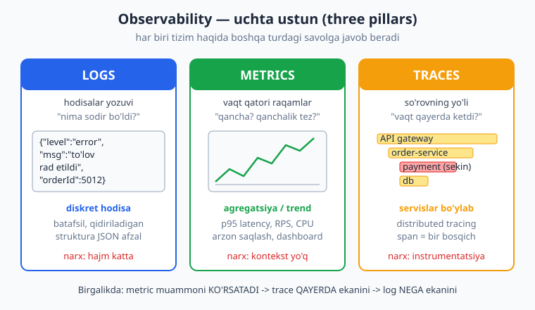
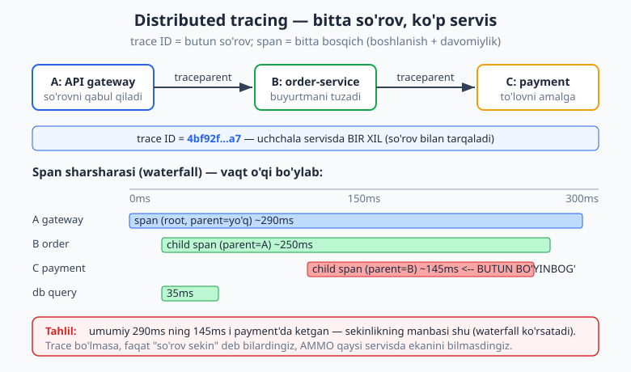
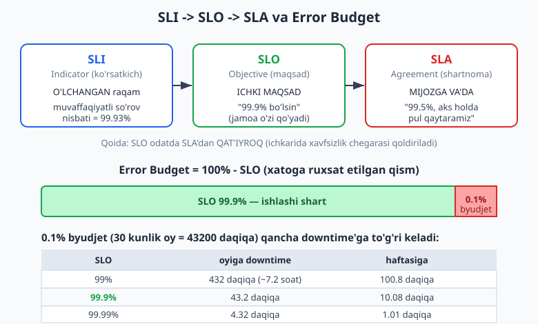

# 24 — Observability va operatsiya

[⬅️ Oldingi: 23 — Ishonchlilik: fault tolerance va resilience](./23-fault-tolerance-resilience.md) · [🏠 README](./README.md) · [Keyingi: 25 — Evolyutsion arxitektura, anti-patternlar va xavfsizlik ➡️](./25-evolyutsion-antipatternlar.md)

---

> **Bu bobda:** 23-bobda tizimni uzilishga chidamli (resilient) qilishni o'rgandik — retry, circuit breaker, timeout. Lekin bir savol qoladi: tizim ishlab turganda, uning ICHIDA nima bo'layotganini QANDAY bilamiz? Mijoz "sayt sekin" desa, sekinlik QAYERDA — bazada, to'lov servisidami, tarmoqdami? Ana shu savolga javob beradigan qobiliyat — **observability** (kuzatuvchanlik). Avval **monitoring** va **observability** farqini aniqlaymiz (ko'pchilik adashtiradi). So'ng uchta ustun — **Logs** (hodisalar), **Metrics** (raqamlar), **Traces** (so'rovning yo'li) — ni ko'ramiz va ularni qachon ishlatishni o'rganamiz. **Structured logging** (struktura log), **correlation ID** orqali bir so'rovni servislararo bog'lashni, **RED**/**USE** metrika metodlarini, eng muhimi **SLI/SLO/SLA** va **error budget** (xato byudjeti) tushunchalarini chuqur o'rganamiz. Yakunda **alerting** (ogohlantirish), **alert fatigue** va **OpenTelemetry** standartiga to'xtalamiz. Struktura logger (correlation ID propagatsiyasi bilan) va error-budget kalkulyatorini ishlaydigan TypeScript'da yozib, ishga tushiramiz.
>
> **Trade-off eslatmasi / Halollik:** Observability bepul emas — har bir log, metrika, trace SAQLASH, TARMOQ va INSTRUMENTATSIYA narxiga ega. "Hammani logla" — anti-pattern: disk to'ladi, muhim signal shovqinda ko'rinmay qoladi, hisob oshadi. Kuzatuvchanlik darajasi ham trade-off: ko'proq ko'rinish vs ko'proq narx va kod murakkabligi. Bu bobdagi TypeScript misoli (`_v_24.ts`) `$env:TEMP\arx-probe` da `tsx` bilan ishga tushirilgan va `tsc --strict` bilan tip-tekshirilgan (bob oxirida hisobot) — error budget raqamlari (43.2 daqiqa/oy va h.k.) shu koddan haqiqatan olingan. SLO darajasini tanlash (99.9% mi 99.99% mi) — tizim dizayni qarori: uni "ishladi" deb emas, trade-off (narx vs ishonchlilik) tahlili bilan beramiz.

---

## Tizim ichini qanday "ko'ramiz"?

Tasavvur qiling, sizning e-commerce backend'ingiz ishlab turibdi: bir necha mikroservis ([16-bob](./16-monolit-mikroservis.md)), load balancer ([19-bob](./19-masshtablash-load-balancing.md)), ma'lumotlar bazasi. Soat 21:00 da mijozlar shikoyat qila boshlaydi: "buyurtma berolmayapman". Siz serverga kirasiz — protsessor normal, xotira normal. Lekin nimadir buzilgan. **Qayerda?**

Bu — har bir ishlab chiqarish tizimining markaziy savoli. Kod yozilgan, deploy qilingan, ishlamoqda — endi u **qora quti** (black box). Ichida millionlab so'rov oqib o'tadi, yuzlab xato chiqadi, latency goh oshadi goh tushadi. Bularning hech birini siz to'g'ridan-to'g'ri KO'RMAYSIZ. Faqat tizim **tashqariga** chiqaradigan signallar orqali — log yozuvlari, metrika raqamlari, trace'lar — ichkaridagi holatni TIKLAB OLISHINGIZ kerak.

> **O'xshatish:** Vrach bemorni ichidan ko'rolmaydi. U tashqi signallarni o'qiydi — harorat, puls, qon tahlili, rentgen — va ulardan ichki holatni xulosa qiladi. **Observability** ham xuddi shu: tizimning "hayotiy belgilari"ni o'qib, "kasallik"ni (muammoni) tashxislash qobiliyati. Yaxshi instrumentlangan tizim — tahlili oson bemor; instrumentlanmagan tizim — "qornim og'riydi" deydigan, boshqa hech narsa aytolmaydigan bemor.

Bu qobiliyat — **operatsiya** (operations) jihatining yuragi. Arxitektor faqat "tizim qanday ishlaydi"ni emas, "tizim ishlamay qolsa, biz buni QANCHA TEZ bilamiz va QAYERDA ekanini topa olamizmi"ni ham o'ylashi shart. Bu — [02-bobdagi](./02-sifat-atributlari-tradeoff.md) sifat atributlaridan biri: **observability** o'zi ham "-ility" (kuzatuvchanlik), va u **maintainability** (qo'llab-quvvatlanuvchanlik) va **reliability** (ishonchlilik) bilan chambarchas.

---

## Monitoring vs Observability

Bu ikki atama ko'pincha sinonim sifatida ishlatiladi, lekin orasida muhim farq bor.

**Monitoring** (kuzatib turish) — OLDINDAN BELGILANGAN savollarga javob. Siz tizimni qurganda bilasiz: "CPU 80% dan oshsa, xabar ber", "5xx xato nisbati 1% dan oshsa, ogohlantir". Bular **ma'lum noma'lumlar** (known unknowns) — qaysi muammo bo'lishini taxmin qilasiz, faqat QACHON bo'lishini bilmaysiz. Monitoring shu taxmin qilingan muammolarni kuzatadi.

**Observability** (kuzatuvchanlik) — NOMA'LUM savollar bera olish qobiliyati. Tizim shunday instrumentlangan-ki, siz oldindan O'YLAMAGAN savolga ham javob topa olasiz: "nega FAQAT Toshkentdagi Android foydalanuvchilari, FAQAT soat 21:00 dan keyin, FAQAT yangi to'lov yo'li bilan xato olishadi?" Bu — **noma'lum noma'lumlar** (unknown unknowns). Siz bu savolni oldindan qo'ymagansiz, lekin yetarlicha boy ma'lumot (yuqori kardinallik: foydalanuvchi ID, mintaqa, qurilma, versiya) yiqqaningiz uchun, hodisadan KEYIN ham javob topishingiz mumkin.

> **Eslatma:** Sodda qilib: **monitoring** — "tizim ishlaydimi?" (oldindan tayyorlangan dashboard, alert). **Observability** — "tizim NEGA bunday ishlamoqda?" (yangi savol, jonli tahqiq). Monitoring — observability'ning bir QISMI, uning ostidagi maxsus holat. Zamonaviy distributed tizim ([22-bob](./22-cap-consistency-replikatsiya.md): tarmoq ishonchsiz, mustaqil yiqiluvchi qismlar)da faqat monitoring yetarli emas — chunki muammolar siz oldindan tasavvur qilmagan kombinatsiyalarda paydo bo'ladi.

> **Diqqat:** "Observability vositasini sotib oldik, demak bizda observability bor" — XATO. Observability — bu sotib oladigan MAHSULOT emas, balki tizimning XUSUSIYATI. Vosita (Grafana, Datadog, Jaeger) faqat ma'lumotni ko'rsatadi; lekin agar kodingiz mazmunli log, metrika va trace CHIQARMASA, hech qanday vosita yordam bermaydi. Observability — birinchi navbatda KOD ichiga instrumentatsiya qo'yishdan boshlanadi.

---

## Uchta ustun: Logs, Metrics, Traces

Observability'ning klassik tasviri — **uchta ustun** (three pillars): Logs, Metrics, Traces. Bular bir-birining o'rnini bosmaydi — har biri BOSHQA turdagi savolga javob beradi. Ularni adashtirmaslik va to'g'ri ishlatish — arxitektorning muhim malakasi.



### Logs — "nima sodir bo'ldi?"

**Log** (jurnal) — diskret hodisalar yozuvi. Har bir log qatori — bir paytda bir joyda sodir bo'lgan voqea: "to'lov rad etildi", "foydalanuvchi tizimga kirdi", "fayl saqlandi". Log eng BATAFSIL ustun: u kontekst beradi (qaysi buyurtma, qaysi foydalanuvchi, qanday xato).

Logning kuchi — qidiriladigan tafsilot. Kamchiligi — hajm: million so'rov sekundiga million log qatori; ularni saqlash va qidirish QIMMAT. Shuning uchun log darajasini (level) saralash zarur: hammasini `debug`'da loglash mumkin emas.

### Metrics — "qancha? qanchalik tez?"

**Metric** (ko'rsatkich) — vaqt bo'yicha o'lchanadigan RAQAM: so'rovlar soni (RPS), o'rtacha javob vaqti, CPU foizi, xato nisbati. Metrika — AGREGAT: u individual hodisani emas, umumiy holatni ko'rsatadi ("oxirgi daqiqada 12000 so'rov, p95 latency 230ms").

Metrikaning kuchi — arzon va tez. Bir raqamni vaqt qatorida saqlash millionlab logni saqlashdan ancha arzon, shuning uchun metrika uzoq saqlanadi va dashboard/alert uchun ideal. Kamchiligi — kontekst yo'q: "xato nisbati oshdi" deydi, lekin QAYSI foydalanuvchi, QAYSI buyurtma ekanini aytmaydi (buning uchun logga yoki trace'ga o'tasiz).

> **Eslatma:** Metrikada **kardinallik** (cardinality — turli qiymatlar soni) muammosi bor. Metrikaga "foydalanuvchi ID" yorlig'ini (label) qo'shsangiz — million foydalanuvchi = million alohida vaqt qatori, bu metrika tizimini buzadi. Shuning uchun yuqori-kardinallikdagi tafsilot LOG va TRACE'ga, past-kardinallikdagi (status, mintaqa, servis nomi) metrikaga boradi. Bu — uchta ustunni qachon ishlatishning amaliy qoidasi.

### Traces — "vaqt qayerda ketdi?"

**Trace** (iz) — bitta so'rovning butun TIZIM bo'ylab YO'LI. Distributed tizimda bitta foydalanuvchi so'rovi o'nlab servisdan o'tishi mumkin: gateway -> order-service -> payment -> baza. **Distributed tracing** shu yo'lni qayd etadi: har bir bosqich — bir **span** (boshlanish vaqti + davomiyligi), va span'lar **trace ID** orqali bir-biriga bog'lanadi.

Trace'ning kuchi — distributed tizimda latency manbasini topish. "So'rov 290ms" deydi, AMMO trace ushbu 290ms ning 145ms i payment servisida ketganini aniq KO'RSATADI. Metrika "sekin" deydi, trace "QAYERDA sekin" deydi.



> **Amaliyotda:** Uchovi BIRGALIKDA ishlaydi va tabiiy ish oqimini hosil qiladi: (1) **Metric** ogohlantiradi ("p95 latency 800ms ga sakradi"). (2) **Trace** qayerda ekanini topadi ("payment span sekinlashgan"). (3) **Log** nega ekanini aytadi ("payment gateway timeout: connection refused"). Bu — "metric -> trace -> log" tashxis voronkasi. Faqat bittasiga tayanish — ko'r nuqta: faqat metrika bilan QAYERDA ekanini topa olmaysiz; faqat log bilan dengizda igna qidirasiz.

---

## Structured logging va correlation ID

Eng katta amaliy xato — log'ni **matn satri** sifatida yozish:

```text
[2026-06-14 21:03] Buyurtma 5012 uchun to'lov rad etildi, sabab: mablag' yetarli emas
```

Bu odam o'qishi uchun yaxshi, lekin MASHINA uchun yomon. "Barcha rad etilgan to'lovlarni topib, summalari bo'yicha guruhla" desangiz — bu satrni parse qilish (regex bilan ajratish) azob. Yechim — **structured logging** (struktura log): log'ni JSON sifatida, MAYDONLAR bilan yozish:

```json
{"ts":"2026-06-14T21:03:00Z","level":"error","service":"payment-service","message":"to'lov rad etildi","orderId":5012,"reason":"insufficient_funds","amount":250000}
```

Endi log — QIDIRILADIGAN ma'lumot: `level=error AND service=payment-service`, yoki `reason=insufficient_funds` bo'yicha filtr, `amount` bo'yicha agregatsiya — hammasi oson. Bu — log'ni "matn" emas, "ma'lumot" sifatida ko'rishdir.

### Log darajalari

Har log bir DARAJAga ega — bu uning muhimligini bildiradi va shovqinni boshqarish imkonini beradi:

```text
debug  — batafsil ichki tafsilot (faqat lokal/tahqiqotda)
info   — normal muhim hodisa ("buyurtma yaratildi")
warn   — g'ayritabiiy, lekin xato emas ("to'lov 2-urinishda o'tdi")
error  — operatsiya muvaffaqiyatsiz ("to'lov rad etildi")
```

Ishlab chiqarishda odatda `info` va undan yuqori loglanadi (`debug` o'chiriladi — hajmni kamaytirish uchun). Bu — kuzatuvchanlik vs narx trade-off'ining amaliy ko'rinishi.

### Correlation ID — bir so'rovni servislararo bog'lash

Mana eng muhim g'oya. Distributed tizimda bitta foydalanuvchi so'rovi bir necha servisda log qoldiradi. Mijoz "buyurtmam o'tmadi" desa, siz uning so'roviga TEGISHLI hamma logni — gateway'da ham, order-service'da ham, payment'da ham — topishingiz kerak. Lekin ular ALOHIDA serverlarda, aralash million log orasida. Qanday bog'laysiz?

Yechim — **correlation ID** (yoki **trace ID**, **request ID**): so'rov tizimga kirganda BIR XIL noyob ID beriladi va u so'rov bilan birga HAMMA servisga uzatiladi. Har bir log shu ID ni yozadi. Endi "`correlationId=req-0001`" bo'yicha filtr — butun sayohatni ko'rsatadi.

```text
Mijoz so'rovi
   |
   v  correlationId = req-0001 (shu yerda yaratiladi)
[gateway]  -> log: {correlationId: req-0001, msg: "so'rov keldi"}
   |        (ID so'rov bilan uzatiladi)
   v
[order-service] -> log: {correlationId: req-0001, msg: "buyurtma tuzilmoqda"}
   |
   v
[payment]  -> log: {correlationId: req-0001, msg: "to'lov rad etildi"}

Endi: "req-0001" bo'yicha qidirsangiz -> butun so'rov yo'li, uch servis bo'ylab.
```

Buni qo'lda har funksiyaga `correlationId` parametrini uzatish — zerikarli va xatoga moyil. Yaxshiroq yo'l — **kontekst** (context) mexanizmidan foydalanish: so'rov boshlanganda ID ni "so'rov kontekstiga" qo'yasiz, logger uni AVTOMATIK oladi. Node.js'da bu `AsyncLocalStorage`, Python'da `contextvars`, Go'da `context.Context`. Quyida ishlaydigan TypeScript misol shuni ko'rsatadi.

### Ishlaydigan misol: struktura logger + correlation ID (TypeScript)

`_v_24.ts` da struktura logger yozdik. U `AsyncLocalStorage` orqali so'rov kontekstidan correlation ID ni avtomatik oladi — har log chaqiruvida qo'lda uzatish shart emas:

```ts
import { AsyncLocalStorage } from "node:async_hooks";

type LogLevel = "debug" | "info" | "warn" | "error";

interface LogContext {
  correlationId: string;
  service: string;
  [key: string]: unknown;
}

// Har bir so'rov uchun alohida kontekst (so'rovlararo aralashmaydi).
const requestContext = new AsyncLocalStorage<LogContext>();

const LEVEL_ORDER: Record<LogLevel, number> = { debug: 10, info: 20, warn: 30, error: 40 };

class StructuredLogger {
  constructor(
    private readonly service: string,
    private readonly minLevel: LogLevel = "info",
    private readonly sink: (line: string) => void = console.log,
  ) {}

  private write(level: LogLevel, message: string, fields: Record<string, unknown> = {}): void {
    if (LEVEL_ORDER[level] < LEVEL_ORDER[this.minLevel]) return; // darajadan past -> tashlanadi
    const ctx = requestContext.getStore();
    const record = {
      ts: new Date().toISOString(),
      level,
      service: this.service,
      correlationId: ctx?.correlationId ?? "none", // kontekstdan AVTOMATIK
      message,
      ...fields,
    };
    this.sink(JSON.stringify(record));
  }

  info(msg: string, f?: Record<string, unknown>): void { this.write("info", msg, f); }
  warn(msg: string, f?: Record<string, unknown>): void { this.write("warn", msg, f); }
  error(msg: string, f?: Record<string, unknown>): void { this.write("error", msg, f); }
}

// So'rovni kontekst bilan o'rab ishga tushirish — ID hamma logga avtomatik tushadi.
function handleRequest<T>(service: string, fn: () => T): T {
  const ctx: LogContext = { correlationId: newCorrelationId(), service };
  return requestContext.run(ctx, fn);
}
```

Ikki servis (order va payment) AYNI so'rov kontekstida ishlasa, ularning log'lari BIR XIL `correlationId` oladi — biz uni hech qayerda qo'lda uzatmadik:

```ts
handleRequest("order-service", () => {
  orderLog.info("buyurtma qabul qilindi", { orderId: 5012, amount: 250000 });
  payLog.info("to'lov boshlandi", { gateway: "click" });
  payLog.warn("to'lov sekin javob berdi", { latencyMs: 1450 });
});
```

`npx tsx _v_24.ts` natijasi (haqiqiy chiqish — `ts` deterministik qilib qo'yilgan):

```text
{"ts":"...","level":"info","service":"order-service","correlationId":"req-0001","message":"buyurtma qabul qilindi","orderId":5012,"amount":250000}
{"ts":"...","level":"info","service":"payment-service","correlationId":"req-0001","message":"to'lov boshlandi","gateway":"click"}
{"ts":"...","level":"warn","service":"payment-service","correlationId":"req-0001","message":"to'lov sekin javob berdi","latencyMs":1450}
{"ts":"...","level":"error","service":"order-service","correlationId":"req-0002","message":"ombor zaxirasi yetarli emas","orderId":5013,"sku":"A-19"}
```

E'tibor bering: birinchi uch qator BIR XIL `req-0001` (bir so'rov, ikki servis); to'rtinchisi — boshqa so'rov, `req-0002`. Endi `req-0001` bo'yicha filtr butun sayohatni qaytaradi. Bu — distributed tizimda log'ni kuzatishning asosiy mexanizmi.

---

## Metrika metodlari: RED va USE

"Qaysi metrikani o'lchayman?" — boshlovchi savol. Ikki mashhur, bir-birini to'ldiruvchi metod javob beradi.

**RED** — SERVIS uchun (so'rovga javob beruvchi har qanday komponent). Uch metrika:

- **R**ate (tezlik) — sekundiga so'rovlar soni (yuk qancha).
- **E**rrors (xatolar) — muvaffaqiyatsiz so'rovlar nisbati (sifat qanday).
- **D**uration (davomiylik) — javob vaqti, odatda p95/p99 (tezlik qanday).

RED — foydalanuvchi NIMANI HIS QILISHIga yaqin: yuk, xato, sekinlik. Har bir HTTP servis, har bir API endpoint uchun bu uchini o'lchash — minimal observability poydevori.

**USE** — RESURS uchun (CPU, disk, tarmoq, ulanish puli). Brendan Gregg taklif qilgan. Uch metrika:

- **U**tilization (foydalanish) — resurs band vaqtining foizi (CPU 70%).
- **S**aturation (to'yinganlik) — kutayotgan ish navbati (ishlab bo'lmagan, navbatda turgan so'rovlar).
- **E**rrors (xatolar) — resurs darajasidagi xatolar (disk I/O xatosi).

> **Eslatma:** Ikkalasi BIRGA ishlatiladi. RED foydalanuvchi tomonidan ko'ringan muammoni ("so'rovlar sekin/xato") ko'rsatadi; USE uning ICHKI sababini ("baza ulanish puli to'yingan — saturation") ko'rsatadi. Misol: RED "p99 latency oshdi" deydi -> USE'ga qaraysiz -> "baza CPU 95%, ulanish navbati 200" -> sabab topildi. Bu yana "simptom -> sabab" tahqiqotining bir ko'rinishi.

> **Diqqat — o'rtacha (average) yashiradi:** Latency'ni FAQAT o'rtacha (mean) bilan o'lchamang. O'rtacha 100ms bo'lishi mumkin, lekin foydalanuvchilarning 1% i 5 sekund kutayotgan bo'lishi mumkin — o'rtacha buni yashiradi. Shuning uchun **persentil** ishlatiladi: **p95** (so'rovlarning 95% i shu vaqtdan tez) va **p99** (99% i). p99 "eng yomon tajriba"ni ko'rsatadi — ko'pincha eng muhim raqam, chunki sekin 1% — sizning eng faol mijozlaringiz bo'lishi mumkin.

---

## SLI, SLO, SLA va error budget

Bu — bobning eng muhim qismi va arxitektura/operatsiyani biznes bilan bog'laydigan ko'prik. Uch atama bir-biriga o'xshaydi, lekin har biri boshqa narsa.



**SLI** (Service Level Indicator — xizmat darajasi ko'rsatkichi) — O'LCHANGAN raqam. "Oxirgi 30 kunda muvaffaqiyatli so'rovlar nisbati 99.93% edi". Bu — fakt, o'lchov natijasi. SLI yaxshi tanlangan bo'lishi kerak: foydalanuvchi haqiqatan HIS QILADIGAN narsa (so'rov muvaffaqiyati, latency), CPU foizi emas.

**SLO** (Service Level Objective — xizmat darajasi maqsadi) — ICHKI MAQSAD. "SLI 99.9% dan past tushmasin". Buni jamoa O'ZI qo'yadi, mijozga va'da emas. SLO — muhandislik qaroriga asos bo'ladi: "byudjet bormi, yangi feature chiqaramizmi yoki barqarorlikka e'tibor beramizmi?"

**SLA** (Service Level Agreement — xizmat darajasi shartnomasi) — mijozga RASMIY VA'DA, odatda JURIDIK oqibati bilan. "Uptime 99.5% dan past bo'lsa, hisobingizga 10% kredit qaytaramiz". SLA buziladigan bo'lsa — pul ketadi.

> **Eslatma — muhim qoida:** SLO odatda SLA'dan QAT'IYROQ qo'yiladi. Agar mijozga SLA 99.5% va'da qilsangiz, ichki SLO ni 99.9% qo'yasiz — shunda SLO buzilsa ham (jamoa "signal" oladi) SLA hali buzilmaydi (mijozga zarar yo'q). Bu — xavfsizlik chegarasi (safety margin). 99.5% ni mijozga va'da qilib, ichki maqsadni ham 99.5% qo'yish — xatolikka joy qoldirmaydi.

### Error budget — eng kuchli g'oya

Mana g'oyaning go'zalligi. Agar SLO 99.9% bo'lsa, demak siz 100% emas, FAQAT 99.9% ishlashga majbursiz. Qolgan **0.1% — sizning "xato byudjetingiz"** (error budget): tizim BUZILISHIGA RUXSAT ETILGAN vaqt.

```text
Error budget = 100% - SLO

SLO 99.9%  ->  byudjet = 0.1%
30 kunlik oy = 43200 daqiqa
0.1% dan 43200 = 43.2 daqiqa/oy "ruxsat etilgan" downtime
```

Bu raqam o'zgaradi:

| SLO | Oyiga ruxsat etilgan downtime | Haftasiga |
|-----|-------------------------------|-----------|
| 99% | 432 daqiqa (~7.2 soat) | 100.8 daqiqa |
| 99.9% ("uch to'qqiz") | 43.2 daqiqa | 10.08 daqiqa |
| 99.95% | 21.6 daqiqa | 5.04 daqiqa |
| 99.99% ("to'rt to'qqiz") | 4.32 daqiqa | 1.01 daqiqa |

(Bu raqamlar `_v_24.ts` dan haqiqatan hisoblangan — pastdagi hisobotga qarang.)

**Error budget nima uchun inqilobiy?** U "ishonchlilik vs tezlik" ziddiyatini OBYEKTIV raqamga aylantiradi:

- **Byudjet bor** (masalan oyning 30 daqiqasidan faqat 10 daqiqasi ishlatilgan) -> jamoa yangi feature chiqarishi mumkin, risk olishga ruxsat. Ishonchlilik yetarli.
- **Byudjet tugadi** (43.2 daqiqa downtime to'liq ishlatildi) -> YANGI FEATURE TO'XTAYDI. Jamoa endi faqat barqarorlik, test, ishonchlilikka ishlaydi — to byudjet tiklanguncha (keyingi oy).

> **Amaliyotda:** Error budget — bu mahsulot jamoasi va muhandislik o'rtasidagi DOIMIY janjalni hal qiladigan vosita. Mahsulot "tezroq chiqaraylik" deydi, muhandislik "barqarorroq qilaylik" deydi — kim haq? Error budget javob beradi: byudjet bor bo'lsa — chiqar; tugagan bo'lsa — to'xta. Bu — Google SRE amaliyotining markaziy g'oyasi. Eslatma: 100% ishonchlilik MAQSAD EMAS — u amalda imkonsiz va juda qimmat; har bir qo'shimcha "to'qqiz" narxni keskin oshiradi. Maqsad — foydalanuvchi UCHUN YETARLI ishonchlilik, ortig'i emas.

### Ishlaydigan misol: error budget kalkulyatori (TypeScript)

`_v_24.ts` da error budget va "burn" (byudjet sarfi) ni hisoblovchi funksiyalar bor:

```ts
function errorBudget(sloPercent: number, daysInMonth = 30) {
  const allowedFailureRatio = (100 - sloPercent) / 100; // 99.9 -> 0.001
  const minutesInMonth = daysInMonth * 24 * 60;          // 30*1440 = 43200
  const budgetMinutes = minutesInMonth * allowedFailureRatio;
  return { sloPercent, budgetMinutes: round(budgetMinutes, 2) };
}

// Byudjetning qanchasi "yondi"? (kuzatilgan uptime'dan)
function budgetBurn(sloPercent: number, observedSuccessPercent: number) {
  const budgetTotalRatio = (100 - sloPercent) / 100;      // ruxsat etilgan xato
  const consumedRatio = (100 - observedSuccessPercent) / 100; // haqiqiy xato
  const burnPercent = round((consumedRatio / budgetTotalRatio) * 100, 1);
  return { burnPercent, exhausted: consumedRatio >= budgetTotalRatio };
}
```

`npx tsx _v_24.ts` natijasi (haqiqiy chiqish):

```text
=== 3. Error budget burn (99.9% SLO) ===
Kuzatilgan uptime 99.99%  ->  byudjet 10% ishlatildi, 90% qoldi
Kuzatilgan uptime 99.9%   ->  byudjet 100% ishlatildi, 0% qoldi  <-- BYUDJET TUGADI: yangi feature to'xta!
Kuzatilgan uptime 99.5%   ->  byudjet 500% ishlatildi, -400% qoldi  <-- BYUDJET TUGADI: yangi feature to'xta!
```

Kuzatilgan uptime 99.5% bo'lsa, 99.9% SLO byudjetidan BESH BARAVAR ko'p sarflangan — bu SLO chuqur buzilgani va shoshilinch choralar kerakligini bildiradi. Kod ichidagi `assert`'lar shu hisoblarning to'g'riligini tekshiradi (`99.9% -> 43.2 daqiqa`, `99.95% -> 21.6 daqiqa`).

---

## Alerting va alert fatigue

O'lchov yetarli emas — muammo bo'lganda KIMDIR XABAR OLISHI kerak. Bu — **alerting** (ogohlantirish). Lekin bu yerda nozik trade-off bor.

**Alert fatigue** (ogohlantirishdan charchash) — eng keng tarqalgan operatsion kasallik. Agar tizim juda ko'p alert yuborsa (ko'pi yolg'on tashvish — false positive), muhandislar ularga e'tibor bermay qo'yadi. Va o'shanda HAQIQIY muhim alert kelsa — u shovqinda yo'qoladi. "Bo'ri keldi!" deb ko'p qichqirgan cho'pon kabi: haqiqiy bo'ri kelganda hech kim ishonmaydi.

> **Diqqat — symptom-based alerting:** Yaxshi qoida — SABABga emas, SIMPTOMga alert qo'ying. Yomon: "CPU 90% ga yetdi" -> alert. Lekin CPU 90% bo'lib, foydalanuvchi NORMAL xizmat olayotgan bo'lsa-chi? Bu — yolg'on tashvish. Yaxshi: "p99 latency 1 sekunddan oshdi" yoki "xato nisbati 1% dan yuqori" -> alert. Bu — foydalanuvchi HAQIQATAN azob chekayotganini bildiradi. Qoida: alert "kimdir hozir UYG'ONIB muammoni hal qilishi kerakmi?" degan savolga "ha" bo'lganda chiqsin. Aks holda — u alert emas, shunchaki dashboard'da ko'riladigan signal.

SLO va error budget bu yerda ham yordam beradi: alert'ni error budget BURN RATE (byudjet sarflanish tezligi) ga bog'lash mumkin — "byudjet juda tez sarflanmoqda, soat ichida tugaydi" -> alert. Bu, statik chegaralarga ("xato > 1%") qaraganda, ancha kam yolg'on tashvish beradi.

**Dashboard** — alert'ni to'ldiradi. Alert "muammo bor, qara!" deydi; dashboard "mana umumiy holat" ko'rsatadi. Yaxshi xizmat dashboard'i odatda RED metrikalarini (rate, errors, duration) ko'rsatadi — bir qarashda servis sog'lig'ini bilish uchun.

---

## OpenTelemetry — standart

Avval har vosita (Datadog, Jaeger, Prometheus) o'z kutubxonasini talab qilardi — kodingizni bir vositaga BOG'LAB qo'yardi (vendor lock-in). **OpenTelemetry** (OTel) — bu muammoni hal qiluvchi ochiq STANDART: log, metrika, trace'ni QANDAY hosil qilish, yorliqlash va eksport qilishning yagona API/SDK si.

G'oyasi sodda va arxitekturaviy jihatdan muhim: kodingizni OTel API'siga (abstraksiyaga) bog'laysiz, KONKRET backend'ga emas — bu, aniq [05-bobdagi](./05-solid.md) **Dependency Inversion** printsipining operatsion ko'rinishi. Bugun Jaeger ishlatasiz, ertaga boshqa vositaga o'tasiz — KOD o'zgarmaydi, faqat eksport sozlamasi. Yana bir muhim hissa — `traceparent` standarti (W3C Trace Context): correlation/trace ID ni servislararo HTTP sarlavhasi orqali UZATISH usulining standartlashtirilishi.

> **Eslatma:** OTel'ni bu bobda CHUQUR o'rganmaymiz — u alohida amaliy mavzu. Muhimi — KONSEPTNI tushunish: observability'ni VOSITAdan ajratib, standartga bog'lash. Bu yana arxitektura printsipi: konkret texnologiyaga emas, abstraksiyaga bog'lan ([12-bob](./12-hexagonal-portlar-adapterlar.md): portlar va adapterlar — bu yerda OTel = port, Jaeger/Datadog = adapter).

---

## Hammasini birlashtirish: bir tahqiqot

Tushunchalarni real stsenariyda ko'raylik. e-commerce, soat 21:00, "buyurtma berolmayapman" shikoyatlari.

```text
1. ALERT:  "checkout p99 latency > 2s, error nisbati 3%" (symptom-based)
              v
2. DASHBOARD (RED): checkout servisida Errors va Duration qizil. Rate normal.
              v
3. TRACE:  sekin so'rovni ochasiz -> waterfall: payment span 1800ms
           (boshqalar normal). Sabab payment'da.
              v
4. METRIC (USE): payment'ning DB ulanish puli -> saturation 100% (navbat to'la).
              v
5. LOG:    correlationId bo'yicha payment loglari ->
           {"level":"error","msg":"db connection timeout","correlationId":"req-8842"}
              v
6. SABAB:  baza ulanish puli kichik + sekin so'rovlar pulni band qildi.
           Yechim: pul kattalashtirish + sekin so'rovni optimizatsiya.
```

Bu — uchta ustun, RED/USE, correlation ID, SLO/alert — hammasi BIRGA ishlaganda kuzatuvchanlik nima berishini ko'rsatadi. Hech biri yolg'iz yetarli emas; birgalikda — qora qutini shaffof qiladi. Va bu poydevor [23-bobdagi](./23-fault-tolerance-resilience.md) resilience naqshlari bilan to'ldiriladi: observability muammoni KO'RSATADI, resilience (circuit breaker, bulkhead) uni avtomatik YENGADI.

> **Trade-off:** Bu darajadagi instrumentatsiya bepul emas. Har trace span — CPU va tarmoq; har log — disk; har metrika — saqlash. Kichik tizimga to'liq distributed tracing — ortiqcha murakkablik (YAGNI buzilishi, [06-bob](./06-dry-kiss-yagni.md)). Boshlang'ich qoida: struktura log + correlation ID + RED metrikalari — bu MINIMAL va arzon poydevor, deyarli har tizimga arziydi. To'liq distributed tracing — ko'p servisli, murakkab tizim haqiqiy ehtiyoj tug'dirganda qo'shiladi. Observability darajasi ham — tizim murakkabligiga MOS bo'lsin.

---

## Mashqlar

### Oson

**1.** Quyidagi har biri qaysi USTUN (log, metric yoki trace) ga tegishli: (a) "oxirgi daqiqada 12000 so'rov bo'ldi"; (b) "buyurtma 5012 uchun to'lov rad etildi, sabab: mablag' yetarli emas"; (c) "bu so'rov gateway -> order -> payment bo'ylab 290ms yurdi, 145ms i payment'da"; (d) "p99 latency 230ms".

**2.** **Monitoring** va **observability** farqini bir-bir jumlada ayting. "Nega FAQAT Toshkentdagi Android foydalanuvchilari soat 21:00 dan keyin xato olishadi?" — bu savol qaysisiga tegishli va nega?

**3.** Quyidagi matn log'ni struktura (JSON) log'ga aylantiring va kamida 4 maydonni ajrating: `[2026-06-14 21:03] payment-service: buyurtma 5012 uchun to'lov rad etildi, summa 250000, sabab mablag' yetarli emas`.

**4.** RED va USE metodlarining har birini yoying (uch harf nimani anglatadi) va ayting: RED qaysi narsa uchun (servis yoki resurs?), USE qaysi narsa uchun?

**5.** Quyidagi alert'lar — symptom-based (yaxshi) yoki cause-based (yomon)? (a) "CPU 90%"; (b) "p99 latency > 2s"; (c) "xato nisbati > 1%"; (d) "disk 85% to'ldi". Har birini izohlang.

### O'rta

**6.** SLO **99.95%** uchun error budget'ni hisoblang: (a) byudjet nisbati (foiz); (b) 30 kunlik oyga ruxsat etilgan downtime daqiqada; (c) haftasiga. (Ishini ko'rsating: oy = 43200 daqiqa.)

**7.** **SLI**, **SLO**, **SLA** — uchovini farqlang. e-commerce uchun bittadan misol keltiring. Nega SLO odatda SLA'dan QAT'IYROQ qo'yiladi?

**8.** **Correlation ID** nima va u qaysi muammoni hal qiladi? Uni har funksiyaga qo'lda parametr sifatida uzatish o'rniga `AsyncLocalStorage` (yoki `contextvars`) ishlatishning afzalligi nima?

**9.** **Error budget** "tugadi" deganda jamoa nima qiladi va NEGA? Bu g'oya mahsulot jamoasi ("tezroq chiqar") va muhandislik ("barqarorroq qil") o'rtasidagi ziddiyatni qanday hal qiladi?

**10.** **(KOD)** `_v_24.ts` dagi `budgetBurn` ga shunday holat qo'shing: agar `burnPercent >= 50` (byudjetning yarmidan ko'pi yongan) bo'lsa — natijaga `warning: true` qo'shilsin. Funksiyani yozing va uch uptime (99.99%, 99.95%, 99.9%) bilan 99.9% SLO ga qarshi ishga tushiring. Qaysilari ogohlantirish beradi?

### Qiyin

**11.** **(KOD)** `_v_24.ts` uslubida `metricSummary` funksiyasini yozing: latency raqamlari massivini (ms) olib, **p50**, **p95**, **p99** va **o'rtacha** (mean) ni qaytarsin. Massiv `[10, 12, 14, 15, 20, 22, 30, 800]` (bittasi juda sekin) bilan ishga tushiring. O'rtacha p95/p99 dan nega ko'p narsani "yashiradi" — natija bilan tushuntiring. (`tsx` bilan ishga tushiring.)

**12.** **(Dizayn)** Telegram-bot backend'i (bot -> API -> 3 servis: foydalanuvchi, to'lov, bildirishnoma). Foydalanuvchi "/buy" bosib, "xato" oldi. (a) Bu so'rovga tegishli HAMMA logni qanday topasiz (mexanizm va u qayerda yaratiladi)? (b) Sekinlik manbasini topish uchun qaysi ustun? (c) "Botning 99.5% so'rovi 1 sekunddan tez javob bersin" — bu SLI, SLO yoki SLA? (d) Buni o'lchash uchun qaysi metrika metodi va qaysi persentil?

**13.** **(Dizayn)** Yangi mikroservisli e-commerce uchun MINIMAL observability poydevorini loyihalang (kichik jamoa, byudjet cheklangan). (a) Uchta ustundan qaysilarini BIRINCHI navbatda joriy qilasiz va nega (trade-off: narx vs qiymat)? (b) Qaysi RED metrikalarini har servisga qo'yasiz? (c) Bitta SLO taklif qiling (raqam) va uni nega shunday tanladingiz? (d) To'liq distributed tracing'ni QACHON qo'shasiz? Har tanlovni asoslang.

**14.** **(Tahlil)** Hamkasbingiz: "Biz hamma narsani `debug` darajasida loglashimiz va har metrikaga foydalanuvchi ID yorlig'ini qo'shishimiz kerak — shunda hamma savolga javob bo'ladi". Bu da'voni baholang. (a) `debug`-hammasi loglashning ikki muammosi? (b) Metrikaga yuqori-kardinallik (foydalanuvchi ID) yorlig'i qo'shish nega xato va to'g'ri joyi qayer? (c) "Hammani kuzat" g'oyasi qaysi trade-off'ni e'tiborsiz qoldiradi?

<details markdown="1">
<summary>Yechimlar</summary>

### 1-mashq yechimi
(a) **Metric** — agregat raqam, vaqt qatori ("12000 so'rov"). (b) **Log** — diskret hodisa, batafsil kontekst (buyurtma ID, sabab). (c) **Trace** — so'rovning servislararo yo'li, span davomiyliklari bilan. (d) **Metric** — p99 — agregat o'lchov (latency taqsimoti). Qoida: agregat raqam = metric; bitta hodisa tafsiloti = log; so'rovning yo'li = trace.

### 2-mashq yechimi
**Monitoring** — oldindan belgilangan savollarga javob ("CPU oshdimi?", "xato 1% dan oshdimi?") — ma'lum noma'lumlar. **Observability** — oldindan o'ylanmagan, yangi savol bera olish qobiliyati — noma'lum noma'lumlar. Berilgan savol ("FAQAT Toshkent + Android + 21:00 dan keyin") — **observability**ga tegishli: bu kombinatsiyani oldindan dashboard qilib qo'ymagansiz; unga javob faqat yetarlicha boy ma'lumot (yuqori kardinallik: mintaqa, qurilma, vaqt) yiqsangiz, hodisadan KEYIN topiladi.

### 3-mashq yechimi
```json
{"ts":"2026-06-14T21:03:00Z","level":"error","service":"payment-service","message":"to'lov rad etildi","orderId":5012,"amount":250000,"reason":"insufficient_funds"}
```
Ajratilgan maydonlar: `ts`, `level`, `service`, `orderId`, `amount`, `reason`. Endi `reason=insufficient_funds` bo'yicha filtr, `amount` bo'yicha yig'indi, `service` bo'yicha guruhlash — hammasi parse'siz oson. Matn log'da bularning hammasi bitta satrda "yopishgan", regex bilan ajratish kerak edi.

### 4-mashq yechimi
**RED** = **R**ate (so'rov tezligi) + **E**rrors (xato nisbati) + **D**uration (javob vaqti). RED — **SERVIS** uchun (foydalanuvchiga xizmat beruvchi komponent; foydalanuvchi his qiladigan narsaga yaqin). **USE** = **U**tilization (foydalanish foizi) + **S**aturation (navbatda turgan ish) + **E**rrors (resurs xatosi). USE — **RESURS** uchun (CPU, disk, ulanish puli — ichki sabab). Birga: RED simptomni, USE ichki sababni ko'rsatadi.

### 5-mashq yechimi
(a) **Cause-based (yomon)** — CPU 90% bo'lib, foydalanuvchi normal xizmat olsa, bu yolg'on tashvish. (b) **Symptom-based (yaxshi)** — latency oshishi foydalanuvchi azobini bevosita bildiradi. (c) **Symptom-based (yaxshi)** — xato nisbati = foydalanuvchi muvaffaqiyatsizligi. (d) **Cause-based (yomon)** — disk 85% — o'zi muammo emas; muhimi, u tufayli xizmat buziladimi (agar buzilsa, simptom alert'i chiqadi). Qoida: alert "kimdir hozir uyg'onib hal qilishi kerakmi?" deganda "ha" bo'lsin.

### 6-mashq yechimi
(a) Byudjet nisbati = 100% - 99.95% = **0.05%** (0.0005). (b) Oyiga: 43200 daqiqa × 0.0005 = **21.6 daqiqa**. (c) Haftasiga: 7×24×60 = 10080 daqiqa × 0.0005 = **5.04 daqiqa**. (`_v_24.ts` da `errorBudget(99.95)` aynan shu raqamlarni — 21.6 va 5.04 — qaytaradi, `assert` bilan tekshirilgan.) 99.9% (43.2 daqiqa) dan 99.95% ga o'tish byudjetni YARIM ga qisqartiradi — har qo'shimcha "to'qqiz" ancha qimmat.

### 7-mashq yechimi
**SLI** — O'LCHANGAN raqam (fakt): "oxirgi 30 kunda muvaffaqiyat 99.93% edi". **SLO** — ichki MAQSAD (jamoa qo'yadi): "SLI 99.9% dan past tushmasin". **SLA** — mijozga RASMIY va'da, juridik oqibati bilan: "99.5% dan past bo'lsa 10% kredit". SLO SLA'dan qat'iyroq, chunki SLO buzilganda (signal) hali SLA buzilmaydi — bu xavfsizlik chegarasi; jamoa SLA (pul ketishi) dan oldin ogohlantiriladi.

### 8-mashq yechimi
**Correlation ID** — so'rov tizimga kirganda beriladigan noyob ID; so'rov bilan hamma servisga uzatiladi, har log uni yozadi. Muammo: distributed tizimda bitta so'rov bir necha servisda, million log orasida log qoldiradi — ID bo'yicha filtr butun sayohatni topadi. `AsyncLocalStorage`/`contextvars` afzalligi: ID ni har funksiya/log chaqiruviga QO'LDA uzatish shart emas — u so'rov kontekstida saqlanadi, logger AVTOMATIK oladi. Bu kodni toza qiladi va "ID ni uzatishni unutish" xatosini yo'qotadi.

### 9-mashq yechimi
Byudjet tugaganda jamoa **yangi feature chiqarishni TO'XTATADI** va faqat barqarorlik/ishonchlilikka ishlaydi (to byudjet tiklanguncha, keyingi oy). Nega: byudjet — risk olishga "ruxsatnoma"; u tugagan bo'lsa, demak tizim allaqachon SLO chegarasida, yangi risk SLO ni (va keyin SLA ni) buzadi. Ziddiyatni hal qilishi: "tezroq chiqar vs barqarorroq qil" janjalini SUBYEKTIV bahsdan OBYEKTIV raqamga aylantiradi — byudjet bor bo'lsa chiqar, tugagan bo'lsa to'xta. Hech kim "his-tuyg'u" bilan emas, ma'lumot bilan qaror qiladi.

### 10-mashq yechimi
Ishga tushirildi (`_v_24.ts` uslubida, haqiqiy natija):
```ts
function budgetBurnWithWarn(sloPercent: number, observedSuccessPercent: number) {
  const budgetTotalRatio = (100 - sloPercent) / 100;
  const consumedRatio = (100 - observedSuccessPercent) / 100;
  const burnPercent = Math.round((consumedRatio / budgetTotalRatio) * 1000) / 10;
  return { burnPercent, warning: burnPercent >= 50, exhausted: consumedRatio >= budgetTotalRatio };
}
// 99.9% SLO ga qarshi:
// uptime 99.99% -> burn 10%   warning: false
// uptime 99.95% -> burn 50%   warning: true   (chegarada)
// uptime 99.9%  -> burn 100%  warning: true, exhausted: true
```
99.95% va 99.9% ogohlantirish beradi (byudjetning >=50% i yongan). 99.99% xavfsiz. Bu — "byudjet burn rate" alert'ining sodda ko'rinishi: statik chegaradan (xato>1%) ko'ra yaxshiroq, chunki SLO bilan bevosita bog'langan.

### 11-mashq yechimi
Ishga tushirildi (`_v_24.ts` uslubida, haqiqiy natija):
```ts
function metricSummary(values: number[]) {
  const sorted = [...values].sort((a, b) => a - b);
  const pct = (p: number) => sorted[Math.min(sorted.length - 1, Math.ceil((p / 100) * sorted.length) - 1)];
  const mean = values.reduce((a, b) => a + b, 0) / values.length;
  return { p50: pct(50), p95: pct(95), p99: pct(99), mean: Math.round(mean * 10) / 10 };
}
// [10,12,14,15,20,22,30,800] ->
// { p50: 15, p95: 800, p99: 800, mean: 115.4 }
```
**O'rtacha 115.4** — lekin so'rovlarning yarmi 15ms dan tez (p50=15)! O'rtacha 115.4 ham noto'g'ri taassurot beradi (deyarli hech kim 115ms kutmaydi), lekin u eng yomon 800ms ni "yumshatib" yashiradi. p95/p99 = 800 — eng sekin tajriba aniq ko'rinadi. Saboq: latency uchun persentil ishlat, o'rtachaga ishonma — bitta sekin so'rov o'rtachani buzadi, lekin persentil haqiqatni ko'rsatadi.

### 12-mashq yechimi
(a) **Correlation ID** orqali: so'rov botga (yoki API gateway'ga) kirganda yaratiladi, 3 servisga uzatiladi, har log yozadi; "/buy" so'rovi ID si bo'yicha filtr -> butun yo'l. Yaratiladigan joy — eng tashqi kirish nuqtasi (gateway/bot handler). (b) **Trace** (distributed tracing) — qaysi servisda (foydalanuvchi/to'lov/bildirishnoma) vaqt ketganini waterfall ko'rsatadi. (c) **SLO** — ichki maqsad (jamoa o'zi qo'ygan, mijozga juridik va'da emas). (d) **RED** metodi (Duration komponenti), **p95** yoki **p99** persentil — "99.5% so'rov 1s dan tez" aynan p99.5 ga yaqin chegara; o'rtacha ishlatilmaydi (sekin dumini yashiradi).

### 13-mashq yechimi
Namunaviy yechim: (a) **Birinchi: struktura log + correlation ID, va RED metrikalari** — eng arzon, eng katta qiymat; deyarli har muammoni tashxislashning poydevori. Trace KEYINROQ (qimmatroq instrumentatsiya). (b) Har servisga: Rate (RPS), Errors (5xx nisbati), Duration (p95/p99). (c) SLO taklifi: **99.9%** (oyiga 43.2 daqiqa byudjet) — yangi e-commerce uchun amaliy va erishish mumkin; 99.99% (4.32 daqiqa) juda qimmat va kichik jamoaga erta. (d) **Distributed tracing**'ni servislar ko'payganda va "qaysi servisda sekin?" savoli tez-tez chiqib, log/metrika yetmay qolganda qo'shasiz — ya'ni haqiqiy ehtiyoj bo'lganda (YAGNI). **Muqobil:** boy budjetli jamoa boshidanoq to'liq OTel + tracing qo'yishi mumkin — trade-off: oldindan investitsiya vs keyin retrofit qiyinligi. **Trade-off izohi:** kichik jamoa uchun minimal poydevor to'g'ri — murakkablikni faqat o'lchangan ehtiyoj bilan qo'shish kerak.

### 14-mashq yechimi
(a) `debug`-hammasi loglashning ikki muammosi: (1) **hajm va narx** — disk to'ladi, saqlash qimmatlashadi; (2) **shovqin** — muhim signal (error) million debug qator orasida ko'rinmaydi (signal/shovqin nisbati buziladi). (b) Metrikaga foydalanuvchi ID (yuqori-kardinallik) yorlig'i — million foydalanuvchi = million alohida vaqt qatori, metrika tizimini (saqlash/hisob) buzadi (kardinallik portlashi). To'g'ri joyi: yuqori-kardinallikdagi tafsilot **log va trace**ga boradi (ular hodisa-asosli), metrikaga emas; metrikaga faqat past-kardinallik (status, servis, mintaqa). (c) "Hammani kuzat" g'oyasi **narx/murakkablik trade-off**ini e'tiborsiz qoldiradi: kuzatuvchanlik bepul emas (saqlash, tarmoq, kod murakkabligi, va paradoksal — ortiqcha ma'lumot tahlilni QIYINLASHTIRADI). Maqsad — "hamma narsa" emas, MAZMUNLI signal: kerakli joyga kerakli daraja.

</details>

---

[⬅️ Oldingi: 23 — Ishonchlilik: fault tolerance va resilience](./23-fault-tolerance-resilience.md) · [🏠 README](./README.md) · [Keyingi: 25 — Evolyutsion arxitektura, anti-patternlar va xavfsizlik ➡️](./25-evolyutsion-antipatternlar.md)
