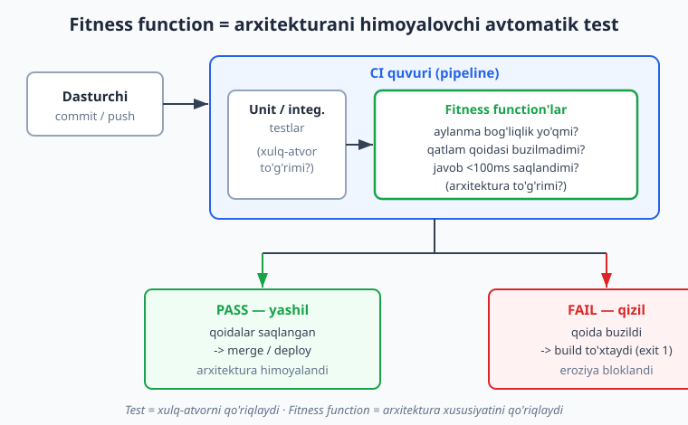
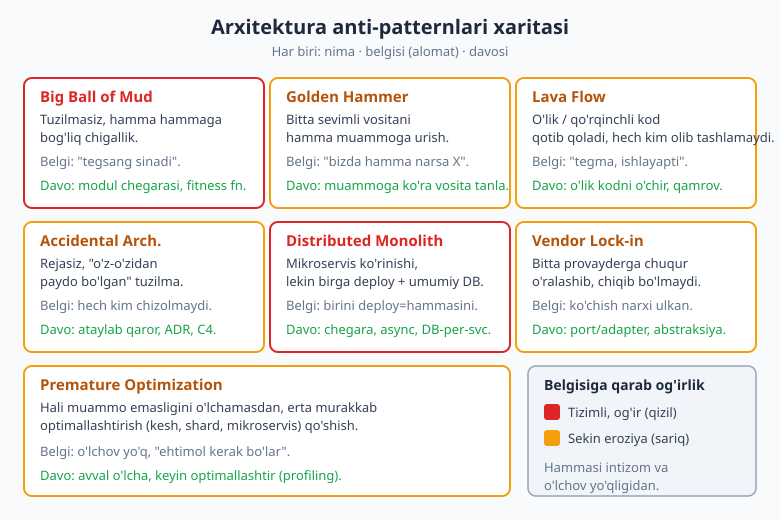
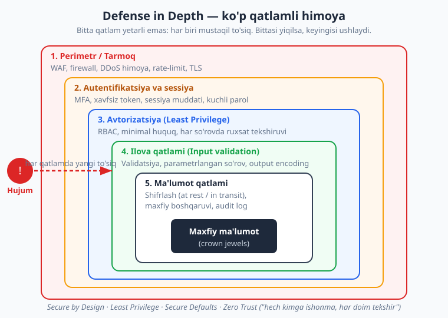

# 25 — Evolyutsion arxitektura, anti-patternlar va xavfsizlik

[⬅️ Oldingi: 24 — Observability va operatsiya](./24-observability.md) · [🏠 README](./README.md) · [Keyingi: 26 — Kapston: real tizimni noldan loyihalash ➡️](./26-kapston-tizim-dizayni.md)

---

> **Bu bobda:** arxitektura haqidagi eng muhim, lekin eng kam aytiladigan haqiqatni o'rganamiz — **arxitektura hech qachon "tugallanmaydi"**. U tirik tizim kabi EVOLYUTSIYA qiladi: talablar o'zgaradi, yuk oshadi, jamoa o'sadi, texnologiya eskiradi. Demak savol "to'g'ri arxitekturani bir marta topish" emas, balki "arxitekturani vaqt o'tishi bilan BOSHQARILADIGAN tarzda o'zgartirish"dir. Buning uchun Neal Ford, Rebecca Parsons va Patrick Kua taklif qilgan **evolyutsion arxitektura** g'oyasini va uning markaziy quroli — **fitness function** (yaroqlilik funksiyasi) ni o'rganamiz. So'ng arxitektura sekin chiriydigan eng keng tarqalgan **anti-patternlar** (Big Ball of Mud, Golden Hammer, Lava Flow va boshqalar) ni tanib olishni, **texnik qarz**ni boshqarishni, va nihoyat — har qanday jiddiy tizimning ajralmas qismi bo'lgan **xavfsizlik arxitekturasi**ni (Defense in Depth, Least Privilege, Zero Trust, OWASP, STRIDE) ko'rib chiqamiz.
>
> **Trade-off eslatmasi / Halollik:** bu bob asosan KONSEPTUAL. Asosiy yuk — diagrammalar, ta'riflar va amaliy intuitsiya. Da'volar manbalarga moslangan: evolyutsion arxitektura va fitness function — Ford, Parsons & Kua, *Building Evolutionary Architectures* (O'Reilly); anti-patternlar — Brian Foote & Joseph Yoder ("Big Ball of Mud"), umumiy adabiyot; xavfsizlik — OWASP (Top 10, ASVS), Microsoft STRIDE. Bobdagi kichik **TypeScript fitness-function namunasi** `tsc --strict` va `tsx` bilan HAQIQATAN ishga tushirilgan (bob oxirida hisobot) — natijalar soxta emas. Xavfsizlik bo'limidagi har qanday "raqam" yoki tahdid stsenariysi konseptual misol; real tizimingizni mustaqil audit qildiring. Hech bir bo'lim "buni qilsangiz xavfsizsiz" deb kafolat bermaydi — xavfsizlik jarayon, bir martalik ish emas.

---

## Arxitektura tugallanmaydi — u evolyutsiya qiladi

Boshlovchilar arxitekturani imorat loyihasi kabi tasavvur qiladi: bir marta chizasiz, quruvchilarga berasiz, bino qad ko'taradi, tamom. Bu o'xshatish **xato** va xavfli. Dasturiy ta'minot binoga emas, **shaharga** o'xshaydi: u to'xtovsiz o'sadi, ba'zi mahallalar buziladi va qayta quriladi, yo'llar kengaytiriladi, eski quvurlar almashtiriladi — va bularning hammasi shahar **ishlab turgan holda** sodir bo'ladi.

Tasavvur qiling, e-commerce backend'ini quryapsiz. Birinchi yili: 100 foydalanuvchi, oddiy monolit ([16-bob](./16-monolit-mikroservis.md)) yetarli. Uchinchi yili: 1 million foydalanuvchi, to'lov moduli alohida masshtab talab qiladi. Beshinchi yili: tavsiya tizimi ML talab qiladi, u Python'da, alohida servis bo'lishi kerak. Sizning "to'g'ri" arxitekturangiz har bir bosqichda BOSHQACHA. Birinchi yili mikroservis qurganingizda — bu xato bo'lardi (ortiqcha murakkablik). Beshinchi yili monolitda qotib qolsangiz — bu ham xato.

> **Eslatma:** Buning ma'nosi "rejalashtirmang" emas. Aksincha — **o'zgarish muqarrarligini** rejalashtiring. Yaxshi arxitektor kelajakni aniq bashorat qilmaydi (buni hech kim qila olmaydi), balki tizimni o'zgarishga OSON moslashadigan qilib quradi. Bu farqni tushunish — 0 dan ekspertgacha bo'lgan yo'lning eng muhim qadami.

### Evolyutsion arxitektura nima?

Neal Ford, Rebecca Parsons va Patrick Kua o'zlarining *Building Evolutionary Architectures* kitobida buni shunday ta'riflaydi (mazmunan): **evolyutsion arxitektura — bu bir nechta o'lcham bo'yicha boshqariladigan, incremental (bosqichma-bosqich) o'zgarishni qo'llab-quvvatlaydigan arxitektura**. Uchta kalit so'zga e'tibor bering:

- **Guided (boshqariladigan) change** — o'zgarish tasodifiy emas; uni biror narsa yo'naltiradi va himoyalaydi (fitness function — pastda).
- **Incremental change** — kichik qadamlar bilan o'zgarish. Bir kechada butun tizimni qayta yozish emas, balki xavfsiz, qaytariladigan kichik o'zgarishlar.
- **Multiple dimensions** — arxitektura faqat kod emas: u ma'lumotlar bazasi sxemasi, xavfsizlik, operatsiya, masshtablanish — bularning hammasi birga evolyutsiya qilishi kerak.

> **O'xshatish:** Evolyutsion arxitektura tirik organizmga o'xshaydi. Tabiiy tanlanish "yaroqlilik" (fitness) ga qarab yo'naladi — muhitga mos organizmlar omon qoladi. Bizning tizimimizda bu rolni **fitness function** o'ynaydi: u arxitekturaning muhim xususiyatini o'lchaydi va "evolyutsiya"ni to'g'ri yo'nalishda ushlab turadi. Har o'zgarishdan keyin biz so'raymiz: "tizim hali ham yaroqlimi?"

---

## Fitness function — arxitekturani himoyalovchi avtomatik test

Mana bu bobning eng amaliy tushunchasi. Tasavvur qiling, jamoangizda qoida bor: "domen qatlami hech qachon infratuzilma qatlamiga bog'lanmasin" ([13-bob](./13-onion-clean-architecture.md), DIP — [05-bob](./05-solid.md)). Bu qoidani qanday himoyalaysiz? Code review'da har commit'ni qo'lda tekshirasizmi? Inson charchaydi, e'tibordan chetda qoladi, va bir kun kelib kimdir `domain/Buyurtma.ts` ichida `import { PostgresRepo } from "../infra/..."` yozadi — qoida sekin chiriydi.

**Fitness function** — bu arxitekturaning biror xususiyatini **avtomatik va takroran** tekshiradigan funksiya/test. U xuddi unit-test kabi, lekin **xulq-atvorni emas, arxitektura xususiyatini** tekshiradi.



Diagrammaga qarang: oddiy testlar "kod TO'G'RI ishlayaptimi?" deb so'raydi (xulq-atvor). Fitness function esa "arxitektura TO'G'RI tuzilganmi?" deb so'raydi. Ikkalasi ham CI'da ishlaydi; ikkalasi ham buzilsa, build YIQILADI (exit code 1) va o'zgarish merge bo'lmaydi.

### Fitness function turlari

Ford va hamkasblari fitness function'larni bir necha o'lcham bo'yicha tasniflaydi. Eng foydalilari:

| O'lcham | Misol |
|---|---|
| **Atomik** (bitta xususiyat) | "Aylanma bog'liqlik (circular dependency) yo'q" |
| **Holistik** (bir nechta xususiyat birga) | "Yuk ostida kesh + DB birgalikda javob &lt;100ms beradimi" |
| **Triggerlangan** (commit/deploy paytida) | CI'da har push'da ishlaydi |
| **Doimiy (continual)** | Productionda monitoring sifatida doim ishlaydi |
| **Statik** | Kod tahlili (linter/ArchUnit-uslubi) |
| **Dinamik** | Ishlab turgan tizimni o'lchash (latency, throughput) |

Amaliy misollar:

- **"Qatlamlararo bog'liqlik qoidasi buzilmasin"** — domen -> infra import bo'lmasin (statik, atomik).
- **"Hech qaysi modul orasida aylanma bog'liqlik bo'lmasin"** ([10-bob](./10-modullik-komponentlar.md)) — statik.
- **"API javob vaqti P95 &lt;200ms bo'lsin"** ([24-bob](./24-observability.md)) — dinamik, doimiy.
- **"Hech bir servis boshqasining DB'siga to'g'ridan-to'g'ri ulanmasin"** ([16-bob](./16-monolit-mikroservis.md)) — bu Distributed Monolith'ning oldini oladi.
- **"Maxfiy kalitlar (secret) kod repozitoriyasiga commit qilinmasin"** — xavfsizlik fitness function (pastda batafsil).

> **Eslatma:** Java dunyosida buning mashhur quroli — **ArchUnit** (arxitektura qoidalarini test sifatida yozish). .NET'da — NetArchTest. JavaScript/TypeScript'da — `dependency-cruiser`, `eslint` plaginlar, yoki — biz pastda ko'rsatganimizdek — oddiy o'z funksiyangiz. Asosiy g'oya tildan mustaqil: qoidani **kodga aylantir**, uni CI'ga qo'y.

### Oddiy fitness function — TypeScript namunasi

Mana qatlamlararo bog'liqlik qoidasini tekshiradigan minimal fitness function. Bu — **ishlaydigan TypeScript** (bob oxirida hisobot: `tsc --strict` toza o'tdi, `tsx` bilan ishga tushdi).

```ts
// Fitness function: "domain qatlami infrastructure'ga bog'lanmasin" qoidasi.
type ModuleGraph = Record<string, string[]>; // modul -> import qiladigan modullar

function layerOf(name: string): "domain" | "infrastructure" | "other" {
  if (name.startsWith("domain/")) return "domain";
  if (name.startsWith("infra/")) return "infrastructure";
  return "other";
}

interface Violation { from: string; to: string; reason: string; }

function checkLayerDependencyRule(graph: ModuleGraph): Violation[] {
  const violations: Violation[] = [];
  for (const [mod, deps] of Object.entries(graph)) {
    for (const dep of deps) {
      // TAQIQ: domain -> infrastructure (bog'liqlik faqat ICHKARIGA bo'lsin)
      if (layerOf(mod) === "domain" && layerOf(dep) === "infrastructure") {
        violations.push({
          from: mod, to: dep,
          reason: "domain qatlami infrastructure'ga bog'lanmasligi kerak (DIP)",
        });
      }
    }
  }
  return violations;
}
```

Endi uni ikki holatda sinab ko'ramiz — toza arxitektura va buzilgan arxitektura:

```ts
const toza: ModuleGraph = {
  "domain/Buyurtma": ["domain/Pul"],
  "infra/PostgresRepo": ["domain/Buyurtma"],   // infra -> domain: RUXSAT
  "app/Xizmat": ["domain/Buyurtma", "infra/PostgresRepo"],
};

const buzilgan: ModuleGraph = {
  "domain/Buyurtma": ["domain/Pul", "infra/PostgresRepo"], // BUZILISH!
};

console.log("Toza:", checkLayerDependencyRule(toza).length);       // -> 0
const v = checkLayerDependencyRule(buzilgan);
console.log("Buzilgan:", v.length);                                // -> 1
process.exit(v.length > 0 ? 1 : 0); // CI: buzilish bo'lsa build yiqiladi
```

Ishga tushirsak (haqiqatan olingan natija):

```text
Toza arxitektura buzilishlari: 0
Buzilgan arxitektura buzilishlari: 1
  BUZILISH: domain/Buyurtma -> infra/PostgresRepo | domain qatlami infrastructure'ga bog'lanmasligi kerak (DIP)
CI exit-code (buzilgan uchun): 1
```

E'tibor bering: real loyihada `ModuleGraph` ni siz qo'lda yozmaysiz — uni `import` ifodalarini o'qib avtomatik chiqaradigan vosita (masalan `dependency-cruiser` AST yordamida) hosil qiladi. Bu yerda biz tushunchani ko'rsatish uchun qo'lda berdik. Asosiy g'oya: **qoida endi kodda, va u CI'da har push'da o'zini himoyalaydi**. Inson e'tibordan chetda qoldirsa ham, fitness function qoldirmaydi.

> **Amaliyotda:** Fitness function'ni qoida BUZILGUNCHA kutmang — uni qoidani O'RNATGAN kuningiz yozing. Toza arxitektura yangi loyihada eng oson himoyalanadi: bir-ikki qoidani CI'ga qo'ysangiz, ular o'zlarini abadiy himoyalaydi. Eski, chigallashgan loyihada esa fitness function "yangi buzilishlarni" to'xtatish uchun ishlatiladi (mavjudlarini "ruxsat etilgan" deb belgilab, sekin kamaytirasiz).

> **Trade-off:** Har fitness function — narx. U yozilishi, saqlanishi va CI'ni sekinlashtirmasligi kerak. Juda ko'p mayda qoida yozsangiz, ular "shovqin"ga aylanadi va jamoa ularni e'tiborsiz qoldiradi (yoki o'chiradi). MUHIM xususiyatlarni (qatlam chegarasi, aylanma bog'liqlik, javob vaqti, xavfsizlik) himoyalang — har bir narsani emas.

---

## Arxitektura anti-patternlari

Anti-pattern — bu "tez-tez uchraydigan, dastlab to'g'ri ko'rinadigan, lekin oqibatda zarar keltiradigan" yechim. Patternlarning teskarisi. Ularni TANIB OLISH muhim, chunki nomini bilsangiz — muammoni ko'rasiz va davosini topasiz.



### Big Ball of Mud (katta loy to'pi)

Brian Foote va Joseph Yoder o'zlarining mashhur "Big Ball of Mud" maqolasida (1997) buni shunday ta'riflaydi (mazmunan): **tuzilmasiz, tartibsiz, hamma narsa hammaga bog'langan tizim** — "loy to'pi" deb atashlaridan maqsad shu. Bu — eng keng tarqalgan arxitektura, garchi hech kim uni ataylab qurmasa ham.

- **Belgisi:** bir joyni o'zgartirsangiz, kutilmagan boshqa joy sinadi ("tegsang sinadi"). Hech kim butun tizimni tushunmaydi. Yangi dasturchi oylab "qo'rqib" ishlaydi.
- **Sababi:** intizomsizlik, vaqt bosimi, "keyin tozalaymiz" deb hech qachon tozalamaslik.
- **Davo:** modul chegaralarini ([04-bob](./04-coupling-cohesion.md), [10-bob](./10-modullik-komponentlar.md)) qayta tiklash, bog'liqlikni kamaytirish, fitness function bilan yangi chigallikni to'xtatish. Ko'pincha — modulli monolitga bosqichma-bosqich qayta tashkil etish.

> **Anti-pattern:** "Tizimni noldan qayta yozamiz" — Big Ball of Mud'ni ko'rgan jamoaning eng keng tarqalgan, eng xavfli reaksiyasi. Joel Spolsky mashhur tarzda ogohlantirgan: noldan qayta yozish deyarli har doim baholanmaganidan ko'p vaqt oladi va mavjud tizimdagi yillar davomida tuzatilgan minglab kichik xato-tuzatishlarni yo'qotadi. Davo odatda — **bosqichma-bosqich** tozalash (Strangler Fig pattern — eski tizimni yangisi sekin "bo'g'ib" almashtiradi), to'liq qayta yozish emas.

### Golden Hammer (oltin bolg'a)

"Qo'lingda faqat bolg'a bo'lsa, hamma narsa mixga o'xshaydi." Bitta sevimli vositani/texnologiyani HAR muammoga urish.

- **Belgisi:** "Bizda hamma narsa Kubernetes'da" yoki "har muammoni NoSQL bilan hal qilamiz" yoki "har joyga mikroservis". Vosita muammoga MOS kelmasa ham ishlatiladi.
- **Davo:** muammoni avval tushun, KEYIN vosita tanla. Trade-off tahlili ([02-bob](./02-sifat-atributlari-tradeoff.md)) qil. Yangi vositalarni o'rganishga vaqt ajrat — bilim qancha kam bo'lsa, golden hammer xavfi shuncha katta.

### Lava Flow (lava oqimi)

O'lik yoki maqsadi noma'lum kod tizimda "qotib qoladi" — xuddi lava qotib tosh bo'lgani kabi. Hech kim uni olib tashlashga jur'at etmaydi, chunki "balki kerakdir, kim biladi".

- **Belgisi:** "Bu funksiya nega bor?" — "Bilmaymiz, lekin o'chirishdan qo'rqamiz." Izohsiz, testsiz, hech kim tushunmaydigan kod bloklari.
- **Davo:** kod qamrovini (test coverage) oshir — testsiz kodni xavfsiz o'chirib bo'lmaydi. Observability ([24-bob](./24-observability.md)) bilan qaysi kod HAQIQATAN ishlatilishini o'lcha (dead code detection). Versiya nazorati ([git-github](../git-github/README.md)) bor — o'chirilgan kodni har doim qaytarib olish mumkin, demak o'chirishdan qo'rqmang.

### Accidental Architecture (tasodifiy arxitektura)

Hech kim arxitekturani **ataylab** loyihalamaydi — u shunchaki "o'z-o'zidan" paydo bo'ladi, har dasturchi o'z bilganicha qo'shadi.

- **Belgisi:** hech kim tizim diagrammasini chiza olmaydi; "arxitektura qarori" degan tushuncha yo'q; har xususiyat boshqacha uslubda yozilgan.
- **Davo:** **ataylab** qaror qabul qil. Muhim qarorlarni **ADR** (Architecture Decision Record, [03-bob](./03-hujjatlash-c4-adr.md)) bilan hujjatla. **C4** diagrammalari ([03-bob](./03-hujjatlash-c4-adr.md)) bilan tizimni ko'rinarli qil. Arxitektura — qaror, tasodif emas.

### Distributed Monolith (tarqatilgan monolit)

[16-bobda](./16-monolit-mikroservis.md) batafsil ko'rgan eng xavfli anti-pattern: tizim mikroservislarga BO'LINGAN ko'rinadi, lekin amalda monolit kabi bog'langan.

- **Belgisi:** bitta servisni o'zgartirsangiz, boshqalarini ham birga deploy qilish kerak; servislar umumiy DB'ga yozadi; sinxron chaqiruv zanjiri (biri sekinlashsa hammasi ta'sirlanadi).
- **Natija:** mikroservis NARXINI (tarmoq, deploy murakkabligi, distributed debugging) to'laysiz, lekin FOYDASINI (mustaqil deploy/masshtab/izolyatsiya) OLMAYSIZ — "ikkala dunyoning eng yomoni".
- **Davo:** bounded context'larni ([14-bob](./14-ddd-asoslari.md)) to'g'ri kes (birga o'zgaradigan narsa bir servisda), database-per-service, sinxron zanjirni asinxron event'lar ([15-bob](./15-event-driven-cqrs.md)) bilan almashtir. Yoki — agar mustaqillik haqiqatan kerak bo'lmasa — modulli monolitga qaytar.

### Vendor Lock-in (provayderga qulflanish)

Bitta provayder (bulut, ma'lumotlar bazasi, SaaS) ga shunchalik chuqur o'ralashasizki, undan chiqish narxi ko'tarib bo'lmaydigan darajada katta bo'ladi.

- **Belgisi:** kod provayderning maxsus API'lariga to'g'ridan-to'g'ri bog'langan; "boshqa bulutga ko'chsak nima bo'ladi?" degan savolga javob "imkonsiz".
- **Davo:** **port va adapter** ([12-bob](./12-hexagonal-portlar-adapterlar.md)) — provayderni adapter ortiga yashir, ilovangiz abstraksiyaga (port) bog'lansin. Bu lock-in'ni nolga tushirmaydi (har abstraksiya — narx), lekin uni BOSHQARILADIGAN qiladi.

> **Trade-off:** Vendor lock-in bilan kurashni MUBOLAG'A qilmang. To'liq "bulut-agnostik" bo'lishga urinish ko'pincha xato — siz provayderning eng yaxshi (managed) xizmatlaridan voz kechib, hamma narsani o'zingiz quryapsiz (ko'proq ish, ko'proq xato). Aqlli yondashuv: ENG katta lock-in xavfli joylarni (masalan ma'lumotlar bazasi) abstraksiyala, qolganida provayderdan to'liq foydalan. Bu — sof trade-off, dogma emas.

### Premature Optimization (erta optimallashtirish)

Donald Knuth'ga keng nisbat beriladigan ibora: "erta optimallashtirish — barcha yomonliklarning ildizi" (kontekstda: kichik samaradorlik haqida vaqtdan oldin tashvishlanish). Hali muammo ekanini O'LCHAMASDAN murakkablik qo'shish.

- **Belgisi:** "kelajakda kerak bo'lar" deb kesh, shard, mikroservis qo'shish; 100 foydalanuvchili tizimni "millionlab foydalanuvchi uchun" loyihalash.
- **Davo:** avval ishlaydigan oddiy yechim qur, KEYIN o'lcha (profiling, [24-bob](./24-observability.md)), o'lchov ko'rsatgan joyni optimallashtir. "YAGNI" ([06-bob](./06-dry-kiss-yagni.md)) — kerak bo'lmaganini qo'shma.

> **Eslatma:** Bularning hammasining umumiy ildizi bitta: **intizom va o'lchovning yo'qligi**. Anti-patternlar yomon dasturchilardan emas, bosim ostida qisqa yo'l tanlash va "keyin tuzatamiz" deb hech qachon tuzatmaslikdan tug'iladi. Fitness function va ADR — aynan shu intizomni AVTOMATLASHTIRADIGAN vositalar.

---

## Conway qonuni va texnik qarz (recap)

### Conway qonuni

[01-bobdan](./01-arxitektura-nima.md) eslang: Melvin Conway (1968) kuzatgan qonun — **"tizimni loyihalovchi tashkilotlar muqarrar ravishda o'z aloqa tuzilmasining nusxasi bo'lgan dizaynlar ishlab chiqaradi"**. Ya'ni tizim arxitekturasi jamoa tuzilmasini AKS ETTIRADI.

Misol: agar sizda 3 ta alohida jamoa (frontend, backend, DB) bo'lsa, tizimingiz tabiiy ravishda 3 qatlamga bo'linadi. Agar har bir bounded context'da alohida kichik jamoa bo'lsa — mikroservislar tabiiy chiqadi. Bu — qonun, fikr emas: jamoa qanday gaplashsa, kod shunday bog'lanadi.

**Inverse Conway Maneuver** — bundan foydalanish: kerakli arxitekturani KUTISH o'rniga, jamoani o'sha arxitekturaga moslab QAYTA TUZ; Conway qonuni keyin arxitekturani o'zi yetkazib beradi. Mikroservis xohlasangiz — avval avtonom kichik jamoalar tuzing ("you build it, you run it"), arxitektura ergashadi.

> **Diqqat:** Distributed Monolith ko'pincha Conway qonunini E'TIBORSIZ qoldirishdan tug'iladi: kodni 8 ta servisga bo'lasiz, lekin jamoa hali ham bitta markazlashgan birlik — natijada har o'zgarish butun jamoa muvofiqlashuvidan o'tadi va servislar amalda birga o'zgaradi. Arxitektura jamoani aks ettiradi, demak avval JAMOANI to'g'rila.

### Texnik qarz boshqaruvi

**Texnik qarz** (technical debt) — Ward Cunningham kiritgan moliyaviy o'xshatish: bugun tez yetkazib berish uchun "noidealdan toza bo'lmagan" yechim tanlaysiz — bu "qarz". Qarz o'z-o'zidan yomon emas (ba'zan to'g'ri qaror), LEKIN u **foiz** to'laydi: har keyingi o'zgarish sekinroq va xavfliroq bo'ladi. Qarzni qaytarmasangiz, foiz oshib, oxir-oqibat Big Ball of Mud'ga aylanadi.

- **Ataylab qarz** ("muddatga yetkazish uchun hozir soddaroq qilamiz, keyin tuzatamiz") — boshqarilishi mumkin, agar HAQIQATAN qaytarilsa.
- **Tasodifiy qarz** ("yaxshiroq yo'lni endi bilib oldik") — tabiiy, o'rganish natijasi.
- **Qaror qabul qilish:** qarzni KO'RINARLI qil (backlog'da, ADR'da), uni o'lchab boshqar. Hech qachon qaytarilmaydigan "yashirin" qarz — eng xavflisi.

> **Trade-off:** Har texnik qarzni darhol qaytarishga urinish ham xato (perfeksionizm — yetkazib berishni to'xtatadi). Aqlli jamoa qarzni MUDDATIDA boshqaradi: tez-tez o'zgaradigan, muhim kodda qarzni darhol to'la; kamdan-kam tegiladigan barqaror kodda — kutsa bo'ladi. Sof trade-off: tezlik vs uzoq muddatli salomatlik.

---

## Xavfsizlik arxitekturada

Xavfsizlik — bu "oxirida qo'shiladigan funksiya" EMAS. U arxitekturaning ajralmas xususiyati ([02-bob](./02-sifat-atributlari-tradeoff.md) — sifat atributlari) bo'lishi kerak. "Keyin xavfsiz qilamiz" — bu hech qachon ishlamaydigan, eng qimmat anti-pattern. Bu bo'lim — kirish; xavfsizlik o'z-o'zicha alohida kitob, lekin har arxitektor minimal printsiplarni bilishi SHART.

### Security by Design — dizaynga singdirilgan xavfsizlik

Xavfsizlikni boshidan, dizayn bosqichidan o'ylash. Har yangi xususiyat uchun "bu qanday suiiste'mol qilinishi mumkin?" deb so'rash — keyin emas, BOSHIDA. OWASP buni "Security by Design" deb ataydi va arzonroq ekanini ta'kidlaydi: dizaynda topilgan kamchilik productionda topilganidan o'nlab marta arzon tuzatiladi.

### Defense in Depth — ko'p qatlamli himoya

Bitta himoya qatlamiga ishonmang. Har qatlam mustaqil to'siq bo'lsin — bittasi yiqilsa, keyingisi ushlab qoladi. Bu — qal'a devorlari mantig'i: bitta devor emas, ko'p devor, xandaq, minora.



Diagrammada hujumchi maxfiy ma'lumotga ("crown jewels") yetish uchun har qatlamda yangi to'siqqa duch keladi:

1. **Perimetr/tarmoq** — WAF (web application firewall), firewall, rate-limit, TLS.
2. **Autentifikatsiya** — MFA (ko'p faktorli), xavfsiz token, sessiya muddati.
3. **Avtorizatsiya** — Least Privilege (pastda), har so'rovda ruxsat tekshiruvi.
4. **Ilova qatlami** — input validatsiya, parametrlangan so'rov (SQL injection'ga qarshi), output encoding (XSS'ga qarshi).
5. **Ma'lumot qatlami** — shifrlash (at rest va in transit), maxfiy boshqaruvi, audit log.

### Least Privilege — minimal huquq

Har komponent, foydalanuvchi va servis FAQAT o'z ishi uchun zarur bo'lgan minimal huquqqa ega bo'lsin — ko'p emas. Hisobot o'qiydigan servisga DB'da `DELETE` huquqi bermang. Buyurtma servisiga to'lov maxfiylariga kirish bermang.

> **Anti-pattern:** "Hamma narsaga admin/root huquqi beraylik, keyin muammo bo'lmaydi." Bu — eng keng tarqalgan xavfsizlik xatosi. Bitta komponent buzilsa (compromised), hujumchi BUTUN tizimga kiradi. Least Privilege bilan esa buzilish bitta komponent bilan CHEKLANADI — "blast radius" (portlash radiusi) kichik bo'ladi.

### Secure Defaults — xavfsiz standart sozlamalar

Tizim DEFAULT holatda xavfsiz bo'lsin — foydalanuvchi xavfsizlikni "yoqishi" kerak bo'lmasin. Yangi yaratilgan resurs default "yopiq" (private) bo'lsin, "ochiq" emas. Default parol bo'lmasin. Eng xavfsiz holat — eng oson (default) holat bo'lishi kerak.

### Zero Trust — "hech kimga ishonma, har doim tekshir"

An'anaviy model: "ichki tarmoq ishonchli, tashqi tarmoq xavfli" (qal'a-xandaq). Bu eskirgan — bir marta perimetrni yorib kirgan hujumchi ichkarida erkin yuradi. **Zero Trust** modeli: ichki/tashqi farqi YO'Q — har so'rov, har servis, har foydalanuvchi HAR DOIM autentifikatsiya va avtorizatsiya qilinadi. "Ichkarida bo'lsang ishonchlisan" degan taxmin yo'q.

### OWASP Top 10 — eng keng tarqalgan xatolar

OWASP (Open Worldwide Application Security Project) muntazam "Top 10" ro'yxatini chiqaradi — veb-ilovalardagi eng keng tarqalgan xavfsizlik kamchiliklari. Ro'yxat versiyalar bilan o'zgaradi (eng so'nggisini owasp.org'dan tekshiring), lekin barqaror mavzular:

- **Broken Access Control** — avtorizatsiya buzilishi (eng ko'p uchraydiganlardan; masalan foydalanuvchi boshqaning ma'lumotini ko'ra olishi).
- **Injection** — SQL/komanda injection (parametrlangan so'rov bilan oldini oling; [sql](../sql/README.md)).
- **Cryptographic Failures** — maxfiy ma'lumotni shifrlamaslik/zaif shifrlash.
- **Security Misconfiguration** — noto'g'ri sozlamalar (default parol, ortiqcha huquq).
- **Vulnerable Components** — eskirgan/zaif kutubxonalar (dependency'ni yangilab turing).

> **Eslatma:** OWASP Top 10 — " to'liq xavfsizlik ro'yxati" EMAS, balki eng keng tarqalgan xatolar haqida ogohlik. To'liqroq tekshiruv uchun OWASP **ASVS** (Application Security Verification Standard) ni qarang. Aniq versiya raqami va batafsil ro'yxatni har doim rasmiy manbadan (owasp.org) oling — ular yangilanadi.

### Threat Modeling va STRIDE — tahdidlarni modellashtirish

**Threat modeling** — tizimni loyihalashda "qaysi tahdidlar mavjud?" deb tizimli o'ylash jarayoni. Microsoft ishlab chiqqan **STRIDE** — tahdid turlarini eslab qolish uchun akronim:

| Harf | Tahdid | Davo printsipi |
|---|---|---|
| **S** | Spoofing (o'zini boshqa deb ko'rsatish) | Autentifikatsiya |
| **T** | Tampering (ma'lumotni o'zgartirish) | Yaxlitlik (hash, imzo) |
| **R** | Repudiation (qilmadim deb tonish) | Audit log, imzo |
| **I** | Information Disclosure (ma'lumot sizishi) | Shifrlash, kirish nazorati |
| **D** | Denial of Service (xizmatdan mahrum qilish) | Rate-limit, masshtab |
| **E** | Elevation of Privilege (huquqni oshirish) | Least Privilege, avtorizatsiya |

Amaliyot: yangi tizim/xususiyat dizaynida diagramma chizing, har komponent va ma'lumot oqimi uchun STRIDE harflarini ko'rib chiqing: "Bu yerda Spoofing bo'lishi mumkinmi? Tampering-chi?" — va har biriga davo rejalashtiring.

### Xavfsizlik fitness function'lari

Xavfsizlik — fitness function uchun ideal nomzod. Ba'zilarini CI'ga qo'ying:

- **"Maxfiy kalitlar repozitoriyaga commit qilinmasin"** — secret-scanning (masalan `gitleaks`).
- **"Zaif kutubxona ishlatilmasin"** — dependency audit (`npm audit`, OWASP Dependency-Check) CI'da.
- **"Hech bir endpoint avtorizatsiyasiz qolmasin"** — statik tekshiruv yoki test.
- **"TLS majburiy, HTTP rad etilsin"** — konfiguratsiya testi.

> **Trade-off:** Xavfsizlik har doim qulaylik va tezlik bilan trade-off qiladi. Cheksiz xavfsizlik = ishlatib bo'lmaydigan tizim (har qadamda MFA, hamma narsa bloklangan). Maqsad — **mutlaq xavfsizlik emas, mos darajadagi xavfsizlik**: himoya narxi himoyalanayotgan narsa qiymatiga mutanosib bo'lsin. Bank tizimi va blog bir xil darajada himoyalanmaydi. Tahdid modeli sizga "qaysi narsa qancha himoya kerak" ekanini ko'rsatadi.

---

## Hammasini birlashtirish

Bu uchta mavzu — evolyutsion arxitektura, anti-patternlar, xavfsizlik — bir butunning qismlari. Evolyutsion arxitektura "qanday O'ZGARISH" ni o'rgatadi; fitness function uni HIMOYALAYDI; anti-patternlar "nimadan QOCHISH" ni ko'rsatadi; xavfsizlik esa har bosqichda hisobga olinishi kerak bo'lgan xususiyat. Va ularning hammasini bog'laydigan ip — **intizom va o'lchov**: arxitekturani tasodifga emas, ataylab qarorga, avtomatik himoyaga va doimiy o'lchovga asoslang.

Keyingi va oxirgi bobda ([26-bob](./26-kapston-tizim-dizayni.md)) bu kitobning hamma g'oyalarini — C4, SOLID, patternlar, DDD, monolit/mikroservis, va shu bobdagi fitness function va xavfsizlikni — bitta REAL tizimni noldan loyihalashda birlashtiramiz.

---

## Mashqlar

### Oson

**1-mashq.** "Arxitektura bir marta loyihalanib, keyin o'zgarmaydi" — bu da'vo to'g'rimi? Bir jumla bilan tuzating va "shahar" o'xshatishi nima uchun "imorat" o'xshatishidan yaxshiroq ekanini tushuntiring.

**2-mashq.** Fitness function va oddiy unit-test orasidagi farq nima? Har biriga bittadan misol keltiring.

**3-mashq.** Quyidagi belgilardan har biri qaysi anti-patternga ishora qiladi?
(a) "Bu funksiya nega bor, bilmaymiz, lekin o'chirishdan qo'rqamiz."
(b) "Bizda hamma muammoni Kubernetes bilan hal qilamiz."
(c) "Bir joyni o'zgartirsam, butunlay boshqa joy sinadi."

**4-mashq.** STRIDE akronimidagi har harf nimani anglatadi? "E" ga qisqacha davo printsipini ayting.

### O'rta

**5-mashq.** Quyidagi vaziyat qaysi anti-pattern? Nega? Davosini ayting.
> "Bizda 6 ta mikroservis bor, lekin ular bitta umumiy PostgreSQL bazasiga yozadi, va har release'da hammasini birga deploy qilamiz."

**6-mashq.** Sizda quyidagi qoida bor: "controller qatlami to'g'ridan-to'g'ri repository (DB) qatlamiga bog'lanmasin — faqat service qatlami orqali". Shu xususiyat uchun fitness function YOZING (TypeScript yoki pseudokod). Buzilishni qanday aniqlaysiz?

**7-mashq.** "Least Privilege"ni quyidagi vaziyatda qo'llang: hisobot generatsiya qiladigan servis sizning e-commerce DB'ingizga ulanadi. Unga qanday huquqlar berasiz, qaysilarini bermaysiz, va NEGA?

**8-mashq.** "Vendor lock-in"dan to'liq qochishga urinish ham xato bo'lishi mumkin. Nega? Qaysi joyni abstraksiyalash arziydi, qaysisini yo'q — bitta misol bilan tushuntiring.

**9-mashq.** Texnik qarzning "ataylab" va "tasodifiy" turlarini farqlang. Qaysi biri tabiatan yomonroq? "Foiz to'laydi" iborasi nimani anglatadi?

### Qiyin

**10-mashq.** Sizda 50 ming qatorli, intizomsiz o'sgan monolit (Big Ball of Mud) bor. Jamoa "noldan qayta yozaylik" deyapti. Siz arxitektor sifatida muqobil reja taklif qiling. Nega "noldan qayta yozish" xavfli? Bosqichma-bosqich yondashuv qanday ko'rinadi?

**11-mashq.** Yangi onlayn to'lov tizimini loyihalayapsiz. STRIDE bilan tahdid modeli tuzing: kamida 4 tahdid turini aniqlang (har biri uchun konkret stsenariy) va davosini ayting. Defense in Depth'ning qaysi qatlamlari qaysi tahdidni ushlaydi?

**12-mashq.** Jamoangiz "evolyutsion arxitektura" ni qabul qilmoqchi. Yangi yashil (greenfield) loyiha uchun KAMIDA 3 ta fitness function taklif qiling (bittasi xavfsizlikka oid bo'lsin). Har biri qaysi turga (statik/dinamik, atomik/holistik) tegishli? CI'da qachon ishlashi kerak?

**13-mashq.** Kompaniya monolitdan mikroservisga o'tmoqchi, lekin barcha dasturchilar bitta katta jamoada. Conway qonuni asosida tushuntiring: nega jamoa tuzilmasini o'zgartirmasdan o'tish DISTRIBUTED MONOLITGA olib keladi? Inverse Conway Maneuver bu yerda qanday yordam beradi?

**14-mashq.** "Premature optimization" va "kelajakka tayyorlik" orasidagi chegara qayerda? Quyidagilardan qaysi biri erta optimallashtirish, qaysi biri oqilona tayyorlik?
(a) 100 foydalanuvchili MVP uchun mikroservis va Kafka qurish.
(b) DB ulanishini repository interfeysi ortiga yashirish ([12-bob](./12-hexagonal-portlar-adapterlar.md)).
(c) Hali profiling qilmasdan, "tez bo'lsin" deb hamma joyga kesh qo'shish.

<details markdown="1">
<summary>Yechimlar</summary>

### 1-mashq yechimi

**Da'vo noto'g'ri.** Tuzatish: "Arxitektura bir marta loyihalanmaydi — u tizim hayoti davomida boshqariladigan tarzda EVOLYUTSIYA qiladi." Imorat bir marta quriladi va keyin asosan o'zgarmaydi; shahar esa to'xtovsiz o'sadi, ba'zi qismlari buziladi va qayta quriladi — va bularning hammasi shahar ISHLAB TURGAN holda sodir bo'ladi. Dasturiy ta'minot ham xuddi shunday: talablar, yuk, jamoa va texnologiya doim o'zgaradi, demak arxitektura ham o'zgarishga moslashishi kerak. "Imorat" o'xshatishi noto'g'ri taxmin beradi: "to'g'ri qilib qursak, tegmasak ham bo'ladi".

### 2-mashq yechimi

**Farq:** unit-test **xulq-atvor** (kod to'g'ri ishlayaptimi) ni tekshiradi; fitness function **arxitektura xususiyati** (tizim to'g'ri TUZILGANmi) ni tekshiradi.
- Unit-test misoli: "`hisobla(2+2)` `4` qaytaradimi?"
- Fitness function misoli: "domen qatlami infratuzilmaga bog'lanmaganmi?" yoki "API P95 javob vaqti &lt;200ms?" yoki "modullar orasida aylanma bog'liqlik yo'qmi?"

Ikkalasi ham CI'da avtomatik ishlaydi va buzilsa build'ni yiqitadi — lekin ular tizimning HAR XIL jihatini qo'riqlaydi.

### 3-mashq yechimi

(a) **Lava Flow** — o'lik/noma'lum kod tizimda qotib qolgan, hech kim olib tashlashga jur'at etmaydi. Davo: test qamrovi + observability bilan ishlatilmaydigan kodni aniqlab, versiya nazoratiga ishonib o'chirish.
(b) **Golden Hammer** — bitta vositani (Kubernetes) hamma muammoga urish. Davo: muammoga ko'ra vosita tanlash.
(c) **Big Ball of Mud** — tuzilmasiz, yuqori bog'langan tizim ("tegsang sinadi"). Davo: modul chegaralarini tiklash, bog'liqlikni kamaytirish, fitness function bilan yangi chigallikni to'xtatish.

### 4-mashq yechimi

**S**poofing (o'zini boshqa deb ko'rsatish), **T**ampering (ma'lumotni ruxsatsiz o'zgartirish), **R**epudiation (amalni inkor qilish), **I**nformation Disclosure (ma'lumot sizishi), **D**enial of Service (xizmatdan mahrum qilish), **E**levation of Privilege (huquqni oshirish).
**"E" davosi:** Least Privilege (har komponent minimal huquqqa ega bo'lsin) + qat'iy avtorizatsiya (har so'rovda ruxsat tekshirilsin), shunda buzilgan komponent ham yuqori huquqqa o'ta olmaydi.

### 5-mashq yechimi

Bu — **Distributed Monolith** (tarqatilgan monolit). Belgilari hammasi mavjud: (1) umumiy DB — har servis bir bazaga yozadi, demak DB sxemasi orqali bog'langan, mustaqil masshtab yo'q; (2) birga deploy — mustaqil deploy yo'q. Natijada jamoa mikroservis NARXINI (tarmoq, deploy murakkabligi, distributed debugging) to'laydi, lekin FOYDASINI (mustaqil deploy/masshtab/izolyatsiya) olmaydi.

**Davo:** bounded context'larni to'g'ri qayta kesish (birga o'zgaradigan narsa bitta servisda), database-per-service joriy qilish, sinxron bog'liqlikni asinxron event'lar ([15-bob](./15-event-driven-cqrs.md)) bilan kamaytirish. AGAR mustaqillik haqiqatan kerak bo'lmasa — eng arzon yo'l modulli monolitga qaytarish (bitta deploy + toza ichki chegaralar). Tanlov jamoa yetukligi va haqiqiy masshtab ehtiyojiga bog'liq.

### 6-mashq yechimi

Qoida: controller -> repository TAQIQLANGAN (faqat controller -> service -> repository). Fitness function:

```ts
type Graph = Record<string, string[]>;
function layerOf(n: string): "controller" | "service" | "repository" | "other" {
  if (n.startsWith("controller/")) return "controller";
  if (n.startsWith("service/")) return "service";
  if (n.startsWith("repository/")) return "repository";
  return "other";
}
function checkRule(g: Graph): string[] {
  const bad: string[] = [];
  for (const [m, deps] of Object.entries(g))
    for (const d of deps)
      if (layerOf(m) === "controller" && layerOf(d) === "repository")
        bad.push(`${m} -> ${d} (controller to'g'ridan repo'ga bog'lanmasin)`);
  return bad;
}
```

**Buzilishni qanday aniqlaymiz:** har modulning import'larini (bog'liqlik grafi) o'qiymiz va `controller/* -> repository/*` o'qini izlaymiz. Topilsa — qoida buzilgan, ro'yxatga qo'shamiz. CI'da `bad.length > 0` bo'lsa, `process.exit(1)` bilan build'ni yiqitamiz. Real loyihada grafni `import` ifodalaridan avtomatik chiqaramiz (dependency-cruiser kabi).

### 7-mashq yechimi

Hisobot servisi faqat O'QIYDI, demak Least Privilege bo'yicha:
- **Beradigan huquqlar:** kerakli jadvallarga FAQAT `SELECT` (o'qish). Imkon bo'lsa — faqat hisobot uchun zarur ustun/jadval'larga cheklangan ko'rinish (view) orqali.
- **BERMAYDIGAN huquqlar:** `INSERT`/`UPDATE`/`DELETE` (servis yozmaydi), `DROP`/`ALTER` (sxema o'zgartirmaydi), va maxfiy ustunlarga (parol hash, to'lov karta ma'lumoti) kirish — hisobotga kerak bo'lmasa.
- **Nega:** agar hisobot servisi buzilsa (masalan SQL injection orqali), hujumchi faqat o'qiy oladi — ma'lumotni o'chira yoki o'zgartira olmaydi, maxfiy ustunlarga ham yetmaydi. "Blast radius" (zarar doirasi) keskin kichrayadi. Eng ideal — alohida read-replica DB'ga ulash, asosiy bazaga umuman tegmaslik.

### 8-mashq yechimi

To'liq vendor-agnostik bo'lishga urinish ko'pincha xato, chunki siz provayderning ENG YAXSHI managed xizmatlaridan (avtomatik backup, masshtab, monitoring) voz kechib, hamma narsani o'zingiz qurasiz — bu ko'proq ish, ko'proq xato va ko'pincha sekinroq. Bu o'zi bir trade-off: lock-in xavfini KAMAYTIRASIZ, lekin tezlik va sifatni yo'qotasiz.

**Misol:** ma'lumotlar bazasini repository interfeysi ([12-bob](./12-hexagonal-portlar-adapterlar.md)) ortiga yashirish ARZIYDI — DB ko'chirish eng og'ir lock-in va abstraksiya nisbatan arzon. Ammo bulutning xabar navbati (masalan SQS) yoki obyekt-saqlash (S3) uchun to'liq abstraksiya qatlamini qurish ko'pincha ARZIMAYDI — bu xizmatlar barqaror, ko'chish ehtimoli past, va managed afzalliklari katta. Qoida: lock-in NARXI yuqori (ko'chish og'ir) va ehtimoli real bo'lgan joyni abstraksiyala; qolganida provayderdan to'liq foydalan.

### 9-mashq yechimi

- **Ataylab qarz:** "Bilamiz, bu eng toza yechim emas, lekin muddatga yetkazish uchun hozir soddaroq qilamiz va keyin tuzatamiz." Ongli qaror.
- **Tasodifiy qarz:** "Yaxshiroq yo'lni endi, kodni yozib bo'lgandan keyin bilib oldik." O'rganish natijasi, tabiiy.

Tabiatan yomonroq emas — ikkalasi ham boshqarilishi mumkin. Eng yomoni — **yashirin, hech qachon qaytarilmaydigan qarz** (ataylab "keyin tuzatamiz" deyilib hech qachon tuzatilmaydigan). "Foiz to'laydi" iborasi: to'lanmagan qarz har keyingi o'zgarishni sekinroq va xavfliroq qiladi — bu "foiz" vaqt o'tishi bilan to'planib, oxir-oqibat tizimni Big Ball of Mud'ga aylantiradi. Demak qarzni KO'RINARLI qilib (backlog/ADR), o'lchab boshqarish kerak.

### 10-mashq yechimi

**Nega "noldan qayta yozish" xavfli:** (1) deyarli har doim baholanganidan ancha ko'p vaqt oladi; (2) mavjud tizimda yillar davomida tuzatilgan minglab kichik xato-tuzatishlar va "nega bunday" deb hujjatlanmagan biznes qoidalari YO'QOLADI; (3) yangi tizim tayyor bo'lguncha eski tizim ham rivojlanib turishi kerak — ikkita tizimni parallel saqlash og'ir; (4) ko'pincha yangi tizim ham, intizom o'zgarmasa, yana Big Ball of Mud'ga aylanadi.

**Bosqichma-bosqich muqobil (Strangler Fig pattern):**
1. Eski tizim atrofiga "fasad"/marshrutlovchi qo'y — barcha so'rovlar shu orqali o'tsin.
2. Eng muammoli yoki eng mustaqil modulni (masalan tavsiya yoki bildirishnoma) aniqla.
3. Shu modulni alohida, toza qilib QAYTA yoz; marshrutlovchini yangi modulga yo'naltir.
4. Fitness function bilan yangi modul chegarasini himoyala (eski chigallik qaytmasin).
5. Modulma-modul takrorla — yangi tizim eskini sekin "bo'g'ib" almashtiradi.
Har qadam mustaqil deploy bo'ladi va xato bo'lsa qaytariladi — risk kichik bo'laklarga bo'linadi. Tizim hech qachon to'xtamaydi.

### 11-mashq yechimi

To'lov tizimi uchun STRIDE tahdid modeli (namunaviy, kamida 4):

| Tahdid | Stsenariy | Davo | Defense-in-Depth qatlami |
|---|---|---|---|
| **Spoofing** | Hujumchi boshqa foydalanuvchi nomidan to'lov qiladi | MFA, kuchli token, sessiya boshqaruvi | Autentifikatsiya qatlami |
| **Tampering** | To'lov summasi tranzitda o'zgartiriladi (1000 -> 1) | TLS (in transit), so'rov imzosi/HMAC, server tomonida narxni qayta hisoblash | Perimetr (TLS) + ilova qatlami |
| **Information Disclosure** | Karta raqami log'ga yoki javobga sizib chiqadi | Shifrlash (at rest/in transit), maxfiy ustunni log'lamaslik, PCI-DSS qoidalari | Ma'lumot qatlami |
| **Elevation of Privilege** | Oddiy foydalanuvchi admin endpoint'iga kiradi | Least Privilege, har endpoint'da avtorizatsiya tekshiruvi | Avtorizatsiya qatlami |
| **Denial of Service** | Soxta so'rovlar bilan to'lov tizimini bo'g'ish | Rate-limit, WAF, avtomatik masshtab | Perimetr qatlami |

Asosiy g'oya: har tahdidni ALOHIDA qatlam ushlaydi (Defense in Depth) — biror qatlam yiqilsa ham, keyingisi himoyalaydi. Masalan TLS yorilsa ham, server tomonidagi narx-qayta-hisoblash Tampering'ni ushlaydi.

### 12-mashq yechimi

Greenfield loyiha uchun namunaviy 3+ fitness function:

1. **"Modullar orasida aylanma bog'liqlik yo'q"** — *statik, atomik*, CI'da har push'da (triggerlangan). Linter/dependency-cruiser bilan.
2. **"Domen qatlami infratuzilmaga bog'lanmasin"** — *statik, atomik*, CI'da har push'da. (Bobdagi TS namunasi.)
3. **"API P95 javob vaqti &lt;200ms"** — *dinamik, holistik (kesh+DB birga)*, yuk testida (CI'da nightly) yoki productionda doimiy monitoring.
4. **Xavfsizlik: "Maxfiy kalit (secret) repozitoriyaga commit qilinmasin"** — *statik, atomik*, CI'da har push'da (gitleaks kabi secret-scanning). Qo'shimcha: "zaif kutubxona yo'q" — `npm audit` CI'da.

Yangi loyihada bularni BOSHIDAN qo'ying — toza arxitekturani himoyalash eng oson, va ular o'zlarini abadiy himoyalaydi.

### 13-mashq yechimi

Conway qonuniga ko'ra, tizim arxitekturasi jamoa ALOQA tuzilmasini aks ettiradi. Agar barcha dasturchilar bitta katta jamoada qolsa, har o'zgarish hali ham butun jamoaning muvofiqlashuvi/aloqasidan o'tadi. Natijada, kod rasman 8 ta servisga bo'lingan bo'lsa ham, amalda u BITTA birlikdek o'zgaradi va deploy bo'ladi — chunki jamoa bitta. Bu aynan **Distributed Monolith**: tarmoq narxini to'laysiz (servislar alohida), lekin mustaqillik foydasini olmaysiz (jamoa bitta bo'lgani uchun servislar ham bog'liq harakat qiladi).

**Inverse Conway Maneuver:** arxitekturaga MOS jamoa tuzilmasini AVVAL qur. Mikroservis xohlasangiz, katta jamoani har bounded context (servis) uchun kichik, avtonom jamoalarga bo'ling — har jamoa o'z servisining to'liq hayot tsiklini egallasin ("you build it, you run it": kod, deploy, monitoring, navbatchilik). Jamoalar avtonom bo'lgach, Conway qonuni o'sha avtonomiyani arxitekturaga ham olib o'tadi — servislar haqiqatan mustaqil bo'ladi. Ya'ni avval JAMOANI, keyin kodni o'zgartiring.

### 14-mashq yechimi

- **(a) Premature optimization** — 100 foydalanuvchili MVP'ga mikroservis va Kafka qurish. Bu masshtabda monolit yetarli; distributed murakkablik faqat zarar (YAGNI buzilgan). Avval ishlaydigan oddiy yechim qur, masshtab muammosi O'LCHANGANDA bo'l.
- **(b) Oqilona tayyorlik** — DB ulanishini repository interfeysi ortiga yashirish ARZON va katta foyda beradi: u DRY/SOLID'ga mos, testlashni osonlashtiradi, va kelajakda DB ko'chirishni mumkin qiladi — narxi deyarli nol. Bu "tayyorlik", "optimallashtirish" emas.
- **(c) Premature optimization** — profiling qilmasdan "tez bo'lsin" deb hamma joyga kesh qo'shish. Kesh murakkablik va xato manbai (cache invalidation eng qiyin muammolardan) keltiradi; uni O'LCHOV ko'rsatgan joyga qo'ying, "ehtimol kerak" deb emas.

**Chegara qoidasi:** agar o'zgarish (i) arzon, (ii) o'zgarishni osonlashtiradi va (iii) hozir ham foyda bersa — bu oqilona tayyorlik. Agar u (i) qimmat murakkablik qo'shsa, (ii) o'lchanmagan muammoga asoslansa va (iii) "ehtimol kelajakda kerak bo'lar" degan taxminga tayansa — bu premature optimization.

</details>

---

## Hisobot: kod-verifikatsiya

Bu bobdagi TypeScript fitness-function namunasi `$env:TEMP\arx-probe` muhitida HAQIQATAN tekshirildi:

- **Muhit:** Node v24, TypeScript (tsc), tsx (run).
- **`npx tsc --noEmit --strict _v_25.ts`** — toza o'tdi (tip xatosi YO'Q, strict rejimda).
- **`npx tsx _v_25.ts`** — ishga tushdi, natija:
  - Toza arxitektura: **0** buzilish.
  - Buzilgan arxitektura (`domain/Buyurtma -> infra/PostgresRepo`): **1** buzilish to'g'ri aniqlandi.
  - CI exit-code buzilgan holat uchun: **1** (build yiqiladi).

Demak bobdagi "ishga tushirsak: ..." natijalari soxta emas — haqiqatan olingan. Boshqa barcha bo'lim (anti-patternlar, xavfsizlik, Conway, texnik qarz) — konseptual, manbalarga (Ford/Parsons/Kua *Building Evolutionary Architectures*; Foote & Yoder; OWASP; Microsoft STRIDE; martinfowler.com; Conway) moslangan, mutlaq da'vosiz va trade-off bilan berildi.

---

[⬅️ Oldingi: 24 — Observability va operatsiya](./24-observability.md) · [🏠 README](./README.md) · [Keyingi: 26 — Kapston: real tizimni noldan loyihalash ➡️](./26-kapston-tizim-dizayni.md)
