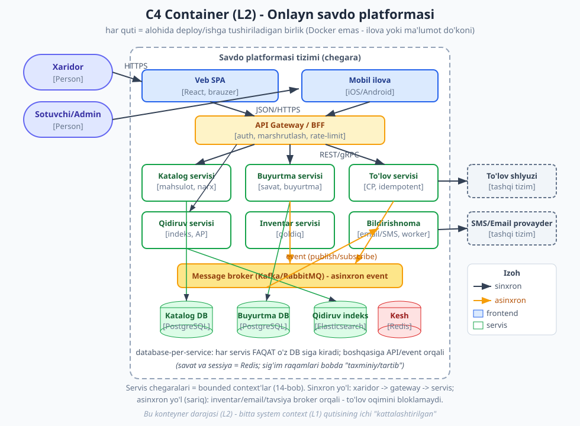

# 26 — Kapston: real tizimni noldan loyihalash

[⬅️ Oldingi: 25 — Evolyutsion arxitektura, anti-patternlar va xavfsizlik](./25-evolyutsion-antipatternlar.md) · [🏠 README](./README.md)

---

> **Bu bobda:** butun kitobni — 01-bobdan 25-bobgacha — bitta amaliy mashqda BIRLASHTIRAMIZ. Biz noldan, "bo'sh oq qog'oz"dan boshlab, to'liq real tizimni — **onlayn savdo platformasi (e-commerce/marketplace)** ni — loyihalaymiz. Bu "system design" (tizim dizayni) intervyusi uslubidagi, lekin undan ancha chuqurroq mashq: **talablar** (funksional + sifat atributlari, 02-bob) -> **sig'im baholash** (back-of-envelope) -> **yuqori darajali dizayn + C4 diagramma** (03-bob) -> **servis chegaralari** (14/16-bob) -> **API dizayni va ma'lumot oqimi** (17-bob) -> **ma'lumot modeli va DB tanlovi** (18-bob) -> **masshtab, kesh, queue** (19/20/21-bob) -> **consistency/CAP trade-off** (22-bob) -> **ishonchlilik va observability** (23/24-bob) -> **ADR'lar** (03-bob). Har bosqichda biz NIMA emas, balki **NEGA** va **nimani nimaga almashtirdik** (trade-off) ga e'tibor beramiz. Bu bob — kitobning "amaliy imtihoni": agar siz bu jarayonni o'zlashtirsangiz, istalgan yangi tizimga shu tarzda yondashasiz.
>
> **Trade-off eslatmasi / Halollik:** bu bob deyarli to'liq **konseptual dizayn mashqi** — kod kam, asosiy yuk diagramma, qaror va trade-off tahlilida. **Sig'im hisoblari** (foydalanuvchi/RPS/saqlash) — **taxminiy, "tartib" (order-of-magnitude) baholash**; ular aniq o'lchov emas, balki "qaysi qism og'ir bo'ladi?" degan savolga javob beradigan qo'pol hisob. **Diagrammalar (C4)** texnik to'g'ri (Container = deployable birlik, o'qlar to'g'ri yo'nalishda), lekin ular real bironta kompaniyaning aniq arxitekturasi emas — o'rgatuvchi namuna. Bobda BIRORTA mutlaq da'vo yo'q: "monolitdan boshlash yaxshi" ham, "mikroservisga bo'lish yaxshi" ham — kontekstga bog'liq; biz har qarorni shartlari bilan beramiz.

---

## Kirish: "boshidan oxirigacha" nima degani

Bu vaqtgacha biz arxitekturani QISMLAB o'rgandik: coupling/cohesion (04-bob), SOLID (05-bob), patternlar (07-09), qatlamlar va chegaralar (10-13), DDD (14-bob), event-driven (15-bob), monolit vs mikroservis (16-bob), API (17-bob), DB (18-bob), masshtab/kesh/queue (19-21), CAP/ishonchlilik/observability (22-24), evolyutsiya (25-bob). Har biri — alohida vosita.

Endi savol: **bu vositalarning HAMMASINI bitta real tizimda QANDAY birlashtiramiz?** Aynan shu — me'morning haqiqiy ishi. Vositalarni bilish — bu hunarmandning quti to'la asbobi; arxitektura — bu o'sha asboblardan TO'G'RI birini, TO'G'RI vaqtda, TO'G'RI sababi bilan tanlash san'ati.

> **Eslatma — tizim dizayni JARAYON, retsept emas.** Quyidagi tartib ("talablar -> sig'im -> dizayn -> ...") yaxshi yo'l-yo'riq, lekin u qat'iy formula EMAS. Real loyihada siz oldinga-orqaga sakraysiz: sig'im baholash dizaynni o'zgartiradi, dizayn yangi talabni ochadi. Muhimi — har bosqichda "nega?" deb so'rash va qarorni asoslash. Intervyu kontekstida ham, real ishda ham, baholanadigan narsa — javobning o'zi emas, **fikrlash jarayoni**.

Bitta izchil tizimni tanlaymiz va butun kitobni unga qo'llaymiz. Tanlov: **onlayn savdo platformasi** (marketplace — masalan, "Uzum" yoki "Amazon" turidagi do'kon). Sabab: u tanish, real, va deyarli har bir arxitektura mavzusini tabiiy ravishda o'z ichiga oladi — katalog, savat, buyurtma, to'lov, qidiruv, inventar, bildirishnoma. (Xohlasangiz, oxiridagi mashqlarda **oziq-ovqat yetkazib berish** yoki **URL qisqartiruvchi** uchun xuddi shu jarayonni qo'llaysiz.)

---

## 1-bosqich: Talablar — nimani quryapmiz?

Har qanday dizayn talablardan boshlanadi. Talab ikki turga bo'linadi: **funksional** (tizim NIMA qiladi) va **nofunksional / sifat atributlari** (tizim QANDAY qiladi — bu aynan [02-bob](./02-sifat-atributlari-tradeoff.md) mavzusi). Eng ko'p uchraydigan xato — to'g'ridan-to'g'ri "qutilar chizish"ga o'tib, talablarni o'tkazib yuborish. Talabsiz dizayn — manzilsiz sayohat.

### Funksional talablar (tizim nima qiladi)

Onlayn savdo platformasi uchun asosiy funksiyalar:

- **Foydalanuvchi:** ro'yxatdan o'tish, kirish (auth), profil.
- **Katalog:** mahsulotlarni ko'rish, kategoriya bo'yicha filtrlash, mahsulot sahifasi (narx, tavsif, rasm).
- **Qidiruv:** matn bo'yicha mahsulot qidirish, filtrlash, saralash.
- **Savat (cart):** mahsulot qo'shish/olib tashlash, miqdorni o'zgartirish.
- **Buyurtma (order):** savatdan buyurtma yaratish, buyurtma holatini kuzatish.
- **To'lov (payment):** tashqi to'lov shlyuzi orqali to'lash.
- **Inventar (qoldiq):** mahsulot qoldig'ini boshqarish (rezerv qilish, kamaytirish).
- **Bildirishnoma:** buyurtma tasdig'i (email/SMS).

> **Diqqat — qamrovni cheklang (scope).** Real platformada yana o'nlab funksiya bor: tavsiya (recommendation), sharhlar (reviews), chegirma/kupon, sotuvchi paneli, analitika, yetkazib berish kuzatuvi... Dizayn mashqida (va intervyuda) **MUHIM bir nechtasini** tanlab, qolganini "keyinroq" deb belgilash to'g'ri yondashuv. Hamma narsani birdan loyihalashga urinish — analiz falaji (analysis paralysis). Biz yuqoridagi yadroga (core) e'tibor beramiz.

### Nofunksional talablar — sifat atributlari (02-bob)

Bu yerda arxitektura qarori boshlanadi. [02-bobda](./02-sifat-atributlari-tradeoff.md) ko'rganimizdek, "-ilities" (sifat atributlari) bir-biri bilan ZIDLASHADI — hammasini bir vaqtda maksimal qilib bo'lmaydi. Shuning uchun biz HAR atributni qaysi qism uchun MUHIM ekanini aniqlaymiz:

| Sifat atributi | Qayerda eng muhim | Nega |
|---|---|---|
| **Availability** (mavjudlik) | Katalog, qidiruv, savat | Do'kon yopiq bo'lsa, savdo to'xtaydi; xaridor ketadi |
| **Consistency** (yaxlitlik) | To'lov, buyurtma, inventar | Pul/qoldiq xato bo'lsa — moliyaviy zarar, ortiqcha sotish |
| **Scalability** (masshtablanuvchanlik) | Katalog/qidiruv (o'qish), buyurtma (cho'qqi) | Aksiya/bayramda yuk keskin oshadi |
| **Latency** (kechikish, past) | Katalog, qidiruv, savat | Sekin sahifa = xaridor ketadi (UX) |
| **Durability** (chidamlilik) | Buyurtma, to'lov | Yozilgan buyurtma YO'QOLMASLIGI shart |
| **Security** (xavfsizlik) | To'lov, auth, shaxsiy ma'lumot | Pul va maxfiy ma'lumot (25-bob: security by design) |

> **Trade-off — bu jadval butun dizaynni boshqaradi.** E'tibor bering: **katalog/qidiruv** uchun biz *availability + past latency* ni ustun qo'ydik (eski narx 1 soniya ko'rsatilsa, dunyo ag'darilmaydi); **to'lov/buyurtma** uchun esa *consistency + durability* ni (bu yerda xato — real pul). Bu farq aynan keyin [CAP qaroriga](./22-cap-consistency-replikatsiya.md) (8-bosqich) olib boradi: katalog **AP**, to'lov **CP**. Sifat atributlarini erta aniqlash — bu butun arxitekturaning kompasi.

> **Amaliyotda:** real loyihada bu jadvalni biznes egasi/mahsulot menejeri bilan BIRGA to'ldiring. "Availability sizga qanchalik muhim?" degan savolga "100% albatta" deb javob berishadi — har doim. Aniq savol: "1 soatlik to'xtash sizga qancha pul yo'qotadi?" va "99.9% (yiliga ~8.7 soat) yetadimi, yoki 99.99% (~52 daqiqa) kerakmi — chunki ikkinchisi bir necha barobar qimmat?". Bu savollar sifat atributini PULGA bog'laydi va to'g'ri qaror chiqaradi.

---

## 2-bosqich: Sig'im baholash (back-of-envelope) — taxminiy

Endi qo'pol hisob qilamiz: tizim qanchalik katta bo'ladi? Bu **"back-of-envelope" (konvert orqasidagi hisob)** — aniq raqam emas, **tartib (order of magnitude)** baholash. Maqsad: "qaysi qism og'ir bo'ladi, qayerda bottleneck (tor joy) kutiladi?" degan savolga javob topish. Bu bizga keyin masshtab rejasini (7-bosqich) to'g'ri chizishga yordam beradi.

> **Diqqat — bu raqamlar TAXMINIY.** Quyidagi hamma raqam — namunaviy, "tartib" darajasidagi farazlar. Real loyihada ular analitika va biznes prognozidan olinadi. Maqsad — aniq son emas, **nisbat va kattalik** (o'qish yozishdan necha barobar ko'p? saqlash gigabaytmi yoki petabaytmi?). Aynan shuning uchun ularni "taxminiy/tartib" deb belgilaymiz.

Faraz qilaylik (taxminiy):

```text
TAXMINIY FARAZLAR (order-of-magnitude)
  - Ro'yxatdagi foydalanuvchi:        ~10 million
  - Kunlik faol foydalanuvchi (DAU):  ~1 million
  - O'rtacha sessiyada sahifa ko'rish: ~30 (asosan katalog/qidiruv)
  - Buyurtma konversiyasi:            ~2% (DAU dan)
```

Endi qo'pol RPS (so'rov/sekund) hisoblaymiz. Bir kunda ~86,400 sekund bor (taxminan ~10^5):

```text
TAXMINIY RPS (o'qish — katalog/qidiruv)
  1 mln DAU x 30 sahifa = 30 mln sahifa-ko'rish/kun
  30,000,000 / 86,400  ~=  ~350 RPS (o'rtacha)
  Cho'qqi (peak) ~ o'rtachadan 5-10x  ->  ~2,000-3,500 RPS (o'qish)

TAXMINIY RPS (yozish — buyurtma)
  1 mln DAU x 2% = ~20,000 buyurtma/kun
  20,000 / 86,400  ~=  ~0.25 RPS (o'rtacha)  -> juda past
  Cho'qqi (aksiya) ~ 20-50x  ->  ~5-12 RPS (yozish) — hali ham past
```

**Birinchi muhim xulosa (taxminiy):** **o'qish yozishdan ~1000x ko'p.** Katalog/qidiruv o'qishlari minglab RPS; buyurtma yozishlari o'nlab RPS. Bu — eng muhim signal: arxitektura **o'qishni** masshtablashga qaratilishi kerak (kesh + o'qish-replika), yozish esa hozircha bitta DB ga sig'adi.

Saqlash (storage) baholash (taxminiy):

```text
TAXMINIY SAQLASH
  Mahsulot: ~10 mln mahsulot x ~2 KB (metadata) ~= ~20 GB (kichik)
  Mahsulot rasmlari: ~10 mln x ~5 rasm x ~200 KB ~= ~10 TB -> CDN/obyekt-ombor
  Buyurtma: ~20k/kun x 365 x ~2 KB ~= ~15 GB/yil (kichik, o'sib boradi)
```

**Ikkinchi muhim xulosa (taxminiy):** matnli ma'lumot (mahsulot, buyurtma) — **kichik** (gigabaytlar), bitta DB ga osongina sig'adi. Asosiy hajm — **rasmlar** (~terabaytlar), ular DB ga emas, **obyekt-ombor + CDN** ga ketadi.

> **Trade-off — sig'im baholash dizaynni boshqaradi, lekin uni MUTLAQLASHTIRMANG.** Bu hisoblar "o'qish og'ir, yozish yengil, rasmlar CDN ga" degan to'g'ri yo'nalishni berdi — bu qimmatli. LEKIN ular taxminiy; agar biznes 100x tezroq o'ssa, qayta hisoblaysiz. Shuning uchun [evolyutsion arxitektura](./25-evolyutsion-antipatternlar.md) (25-bob): dizayn o'zgarishga ochiq bo'lsin. Sig'im baholash — bugungi qaror uchun, kelajak uchun "muzlatilgan haqiqat" emas.

---

## 3-bosqich: Yuqori darajali dizayn — C4 Container diagramma (03-bob)

Endi katta suratni chizamiz. [03-bobda](./03-hujjatlash-c4-adr.md) o'rgangan **C4 model** (Simon Brown, c4model.com) bu yerda asosiy vositamiz. Biz ikki darajani chizamiz: **Context (L1)** — tizim dunyoda qayerda; **Container (L2)** — tizim ichidagi deploy birliklari.

### L1 — System Context (matnli)

Eng yuqori daraja: tizim, foydalanuvchilar, tashqi tizimlar.

```text
KONTEKST (L1) — Savdo platformasi

  [Xaridor]        --HTTPS--> ( Savdo platformasi )
  [Sotuvchi/Admin] --HTTPS--> ( Savdo platformasi )

  ( Savdo platformasi ) --to'lov so'rovi--> [To'lov shlyuzi]   (tashqi)
  ( Savdo platformasi ) --email/SMS-------> [SMS/Email provayder] (tashqi)
```

Bu darajani biznesga ko'rsatsa bo'ladi: "mana bizning tizim, mana kim ishlatadi, mana qaysi tashqi xizmatga bog'liqmiz". Texnik bilim shart emas.

### L2 — Container (KEY diagramma)

Endi markazdagi qutini OCHAMIZ. Ichida nima bor? Konteynerlar — deploy/ishga tushiriladigan birliklar (eslatma: [03-bobdagi](./03-hujjatlash-c4-adr.md) muhim nuans — C4 "Container" Docker konteyneri EMAS; u ilova yoki ma'lumot do'koni).



Diagrammada ko'ringan asosiy qarorlar (har birini keyin chuqurlashtiramiz):

- **Frontend:** Veb SPA + Mobil ilova — ikkita alohida konteyner (alohida deploy, turli UI).
- **API Gateway / BFF:** barcha so'rovning yagona kirish nuqtasi — auth, marshrutlash, rate-limit ([17-bob](./17-api-dizayni-aloqa.md)).
- **Servislar:** Katalog, Buyurtma, To'lov, Qidiruv, Inventar, Bildirishnoma — har biri bir **bounded context** ([14-bob](./14-ddd-asoslari.md)).
- **Ma'lumot do'konlari:** har servis O'Z DB siga ega (database-per-service), + umumiy Redis kesh, + Elasticsearch qidiruv indeksi.
- **Message broker:** asinxron event uchun ([15/21-bob](./15-event-driven-cqrs.md)) — inventar, email, tavsiya event'lari.

> **Eslatma — har o'qqa yorliq.** [03-bobdagi](./03-hujjatlash-c4-adr.md) maslahatga amal qildik: diagrammadagi har o'q "qaysi protokol, qanday maqsadda" ni ko'rsatadi (JSON/HTTPS, REST/gRPC, event). Ko'k o'q = sinxron so'rov; sariq o'q = asinxron event. Bu bitta diagramma "tizim qanday gaplashadi"ni butun jamoaga bir qarashda tushuntiradi.

> **Diqqat — diagramma "konseptual namuna".** Bu C4 Container diagrammasi TEXNIK to'g'ri (har quti deploy birligi, o'qlar to'g'ri yo'nalishda), lekin u real bironta kompaniyaning aniq arxitekturasi emas — o'rgatuvchi misol. Real loyihada servislar soni va chegaralari boshqacha bo'lishi mumkin — bu kontekstga bog'liq (4-bosqichda muhokama qilamiz).

---

## 4-bosqich: Servis chegaralari — monolit yoki mikroservis? (14/16-bob)

Mana eng muhim arxitektura qarori. Yuqoridagi diagrammada biz 6 ta servis chizdik — lekin bu **biz ulardan boshlashimiz kerak** degani EMAS. [16-bobda](./16-monolit-mikroservis.md) chuqur ko'rganimizdek, bu — trade-off, "moda" emas.

### Avval chegaralarni topamiz (DDD — 14-bob)

Servislarni texnik qatlamlar bo'yicha emas, **bounded context** ([14-bob](./14-ddd-asoslari.md)) bo'yicha ajratamiz. Har kontekst — o'z domen tili va ma'lumotiga ega yaxlit (cohesive, [04-bob](./04-coupling-cohesion.md)) birlik:

```text
BOUNDED CONTEXT'LAR (nomzod servislar)
  Katalog        -> mahsulot, kategoriya, narx (o'qishga og'ir, AP)
  Buyurtma       -> savat, buyurtma hayot tsikli (CP)
  To'lov         -> to'lov tranzaksiyasi (CP, xavfsizlik kritik)
  Inventar       -> qoldiq, rezerv (CP, ortiqcha sotishdan qochish)
  Qidiruv        -> indeks, filtr (o'qishga og'ir, AP, alohida texnologiya)
  Bildirishnoma  -> email/SMS (asinxron, alohida)
```

Yaxshi belgi ([16-bob](./16-monolit-mikroservis.md)): kontekst ICHIDAGI qismlar tez-tez BIRGA o'zgaradi; kontekstlar ORASI kamdan-kam birga o'zgaradi.

### Endi qaror: monolitmi yoki mikroservis?

[16-bobning](./16-monolit-mikroservis.md) markaziy saboqlari:

- **"Monolith First" (Fowler):** chegaralar aniqlashguncha monolitdan boshla.
- **"You must be this tall":** mikroservis narxini (DevOps, observability, distributed murakkablik) to'lashga tayyormisiz?
- **Conway qonuni:** arxitektura jamoa tuzilmasini aks ettiradi.

Bizning kontekstimiz uchun ikki stsenariy:

**Stsenariy A — kichik jamoa, MVP boshlanishi.** Tavsiya: **modulli monolit** ([10/16-bob](./10-modullik-komponentlar.md)). Bitta deploy, lekin ichida toza chegarali modullar (yuqoridagi 6 kontekst). Sabab: domen hali sinalmagan; mikroservis narxi (tarmoq, distributed transaction, K8s) kichik jamoani cho'ktiradi; yozish RPS past (2-bosqich), bitta DB yetadi.

**Stsenariy B — yetuk jamoa, masshtab allaqachon bor.** Tavsiya: **modulli monolit + selektiv ajratish**. Avval **Qidiruv** va **Bildirishnoma** ni ajratish (tabiiy mustaqil — alohida texnologiya/masshtab, past bog'liqlik), so'ng yuk talab qilsa boshqalarni.

```text
SOG'LOM EVOLYUTSIYA (16-bob)
  1. Modulli monolit   -> 6 modul, toza chegara, bitta deploy
  2. Selektiv ajratish -> Qidiruv (Elasticsearch), Bildirishnoma (worker) — birinchi
  3. (kerak bo'lsa)    -> Buyurtma/To'lov/Inventar ni ajratish (CP, ehtiyot bilan)
```

> **Trade-off — nega Qidiruv BIRINCHI ajratiladi?** [16-bobdagi](./16-monolit-mikroservis.md) "Tavsiya/Qidiruv birinchi nomzod" saboqi: (1) **masshtab** — qidiruv o'qishi og'ir, asosiy oqimdan mustaqil; (2) **texnologiya** — qidiruv Elasticsearch/maxsus indeks talab qiladi, asosiy biznes — relyatsion DB; (3) **past bog'liqlik** — qidiruv yiqilsa, do'kon ishlayveradi (faqat qidiruv ishlamaydi), xato izolyatsiyasi tabiiy. Uchchala mikroservis foydasini bir joyda beradi, narxi past.

> **Diqqat — Buyurtma/To'lov/Inventar ni ERTA ajratmang.** Bu uchtasi ko'pincha BIRGA o'zgaradi (to'lov holati buyurtmaga ta'sir qiladi, buyurtma inventarni rezerv qiladi). Ularni juda erta mikroservisga ajratish — [saga/eventual consistency](./15-event-driven-cqrs.md) murakkabligini erta keltiradi va [distributed monolit](./16-monolit-mikroservis.md) xavfini tug'diradi. Ko'p platforma bu yadroni uzoq vaqt bitta deploy/modulda saqlaydi. Conway: bu uchta kontekst bitta jamoa qo'lida bo'lsin.

> **Amaliyotda:** "biz Amazon kabi 100 ta mikroservis qilamiz" — bu MVP uchun deyarli har doim xato. Amazon u yo'lga YILLAR va MINGLAB muhandis bilan keldi, chunki ularda buni talab qiladigan masshtab bor edi. Sizning MVP'ingizda u masshtab yo'q — modulli monolit bilan boshlash sizni tezroq bozorga chiqaradi, va chegaralar (public API) tayyor bo'lgani uchun keyin ajratish oson ([Strangler Fig, 16-bob](./16-monolit-mikroservis.md)).

---

## 5-bosqich: API dizayni va ma'lumot oqimi (17-bob)

Servislar (yoki modullar) bir-biri bilan QANDAY gaplashadi? Bu — [17-bob](./17-api-dizayni-aloqa.md) mavzusi. Ikki o'lcham: (a) **tashqi** API (frontend -> tizim), (b) **ichki** aloqa (servislararo).

### Tashqi API — gateway orqali REST

Frontend (SPA/mobil) -> **API Gateway** -> servislar. Gateway ([17-bob](./17-api-dizayni-aloqa.md)) yagona kirish nuqtasi: auth (token tekshirish), marshrutlash (qaysi servisga), rate-limiting, ba'zan javoblarni birlashtirish (BFF — Backend for Frontend).

Tashqi API uchun **REST/JSON** tabiiy tanlov: keng qo'llab-quvvatlanadi, brauzer/mobil oson ishlatadi, debug qulay. Asosiy resurslar:

```text
REST endpoint'lar (tashqi)
  GET  /products?category=...&q=...     -> katalog/qidiruv (o'qish, keshlanadi)
  GET  /products/{id}                   -> mahsulot sahifasi
  POST /cart/items                      -> savatga qo'shish
  POST /orders                          -> buyurtma yaratish (Idempotency-Key bilan!)
  GET  /orders/{id}                     -> buyurtma holati
```

> **Eslatma — idempotentlik (17/21-bob).** `POST /orders` da **Idempotency-Key** sarlavhasi MAJBURIY. Nega? Tarmoq ishonchsiz ([distributed 8 fallacy](./23-fault-tolerance-resilience.md)): xaridor "Buyurtma ber"ni bossa-yu, javob kelmasa, u qayta bosadi — biz IKKITA buyurtma (va ikkita to'lov) yaratmasligimiz kerak. Idempotency-Key bilan server "bu kalitni allaqachon ko'rdim" deb takror so'rovni xavfsiz e'tiborsiz qoldiradi. Bu — pul bilan ishlaydigan har qanday API uchun kritik.

### Ichki aloqa — sinxron vs asinxron

Servislararo aloqada ([17-bob](./17-api-dizayni-aloqa.md)) ikki uslubni ARALASH ishlatamiz — bu eng muhim qaror:

- **Sinxron** (REST/gRPC) — javob DARROV kerak bo'lganda. Masalan, buyurtma yaratayotganda inventar qoldig'ini tekshirish ("rezerv qil") — bu javobni KUTISH kerak.
- **Asinxron** (event/broker) — javob darrov kerak EMAS bo'lganda. Masalan, buyurtma tasdiqlangach email yuborish, tavsiyani yangilash, analitikani hisoblash — bular kuta oladi.

### Ma'lumot oqimi — "buyurtma berish" (ketma-ketlik)

Endi eng muhim oqimni — buyurtma berishni — servislar bo'ylab kuzatamiz. Bu [03-bobdagi](./03-hujjatlash-c4-adr.md) **ketma-ketlik (sequence) diagrammasi**:


Oqimning mohiyati:

1. **Sinxron qism (to'lovgacha):** buyurtma yarat -> inventarni REZERV qil (sinxron, javob kerak) -> to'lovni amalga oshir (sinxron, CP) -> xaridorga `201` qaytar. Bu yo'l **consistency** talab qiladi — pul va qoldiq xato bo'lmasligi shart.
2. **Asinxron qism (to'lovdan keyin):** `OrderPlaced` event'ini broker'ga publish qil -> inventar qoldiqni QAT'IY kamaytiradi (eventual), bildirishnoma email yuboradi (eventual), tavsiya yangilanadi. Bu yo'l **availability/latency** ni ustun qo'yadi — xaridor email kelishini KUTMAYDI.
3. **Kompensatsiya (to'lov xato):** to'lov muvaffaqiyatsiz bo'lsa, rezervni BEKOR qilamiz ([saga pattern](./15-event-driven-cqrs.md)) — distributed tranzaksiya o'rnida.

> **Trade-off — sinxron vs asinxron chegarasini QAYERGA qo'yamiz?** Bu — dizaynning yuragi. Biz chegarani **to'lovdan keyin** qo'ydik: to'lovgacha bo'lgan hamma narsa sinxron (xaridor natijani kutadi, consistency kerak); to'lovdan keyin hamma narsa asinxron (xaridor kutmaydi, eventual yetadi). Agar email yuborishni ham sinxron qilsak, email provayder sekin bo'lsa, butun buyurtma sekinlashadi — yomon. Agar to'lovni asinxron qilsak, xaridor "to'landimi?" bilmay qoladi — yomon. To'g'ri chegara: **xaridorga muhim natija sinxron, qolgani asinxron.**

---

## 6-bosqich: Ma'lumot modeli va DB tanlovi (18-bob)

Endi har servis QAYSI ma'lumotni QANDAY saqlaydi? Bu — [18-bob](./18-malumotlar-bazasi-tanlovi.md) mavzusi: SQL vs NoSQL, va **polyglot persistence** (har servis o'z ehtiyojiga mos DB).

### Asosiy printsip: database-per-service (16/18-bob)

[16-bobdan](./16-monolit-mikroservis.md): har servis O'Z ma'lumotini o'zi boshqaradi. Boshqa servis uning DB siga TO'G'RIDAN kira olmaydi — faqat API/event orqali. (Modulli monolitda bu "modul o'z jadvallariga egalik qiladi" shaklida; mikroservisda — alohida DB.)

### Qaysi servis qaysi DB? (polyglot — 18-bob)

| Servis | DB tanlovi | Nega (18-bob) |
|---|---|---|
| **Katalog** | Relyatsion (PostgreSQL) | Tuzilgan ma'lumot, narx/kategoriya bog'lanishlari; o'qish keshlanadi |
| **Buyurtma** | Relyatsion (PostgreSQL) | **ACID kerak** — buyurtma + holat izchil; tranzaksiya |
| **To'lov** | Relyatsion (PostgreSQL) | **ACID majburiy** — pul; audit izi, durability |
| **Inventar** | Relyatsion (PostgreSQL) | Qoldiq — atomik kamaytirish/rezerv, ACID |
| **Qidiruv** | Qidiruv indeks (Elasticsearch) | Matn qidiruv, filtr — relyatsion DB bunga zaif |
| **Savat** | Key-value (Redis) | Vaqtinchalik, tez, sxema kerak emas; TTL bilan |
| **Sessiya** | Key-value (Redis) | Tez kirish, stateless API uchun markazlashgan |

> **Eslatma — nega ko'pchilik relyatsion?** [18-bobdagi](./18-malumotlar-bazasi-tanlovi.md) muhim saboq: "NoSQL zamonaviy, SQL eski" — MIF. Pul va buyurtma bilan ishlaganda **ACID** (atomiklik, izchillik) qimmatli — relyatsion DB buni beradi. NoSQL ni FAQAT aniq sabab bo'lganda tanlaymiz: qidiruv -> Elasticsearch (relyatsion matn qidiruvda zaif); savat -> Redis (vaqtinchalik, tez, TTL). Bu — **polyglot persistence**: har vazifaga mos asbob, "hammasi bitta DB" ham, "hamma joyda NoSQL" ham emas.

> **Trade-off — ACID vs masshtab (18/22-bob).** Buyurtma/to'lov uchun biz ACID (relyatsion) ni tanladik — bu **consistency** ni beradi, lekin gorizontal masshtablashni qiyinlashtiradi. Yaxshi xabar: 2-bosqichdagi hisob (taxminiy) yozish RPS past ekanini ko'rsatdi — bitta PostgreSQL osongina yetadi. Demak biz ACID foydasini olamiz, masshtab narxini to'lamaymiz, chunki yozish yengil. Katalog/qidiruv (o'qishga og'ir) esa boshqa hikoya — keyingi bosqich.

### Ma'lumot modeli (soddalashtirilgan, konseptual)

Asosiy entity'lar va munosabatlar (konseptual ER, [18-bob](./18-malumotlar-bazasi-tanlovi.md)):

```text
KONSEPTUAL MA'LUMOT MODELI
  Mahsulot (id, nom, narx, kategoriya_id, tavsif)
  Kategoriya (id, nom, ota_id)
  Buyurtma (id, xaridor_id, holat, jami_summa, yaratilgan_vaqt)
  BuyurtmaQatori (id, buyurtma_id, mahsulot_id, soni, narx_snapshot)
  To'lov (id, buyurtma_id, summa, holat, idempotency_key)
  Qoldiq (mahsulot_id, mavjud, rezerv)
```

> **Diqqat — narx "snapshot" qiling.** `BuyurtmaQatori` da `narx_snapshot` bor — buyurtma paytidagi narx. Nega mahsulotning hozirgi narxiga havola qilmaymiz? Chunki mahsulot narxi keyin o'zgarishi mumkin, lekin buyurtma O'SHA paytdagi narxni saqlashi shart (moliyaviy/huquqiy). Bu — domen modellashtirishning nozik, lekin muhim qarori ([14/18-bob](./14-ddd-asoslari.md)).

---

## 7-bosqich: Masshtab, kesh va queue (19/20/21-bob)

Endi 2-bosqichdagi xulosani eslang: **o'qish yozishdan ~1000x ko'p** (taxminiy). Demak masshtab rejasi asosan **o'qishni** yengillashtirishga qaratiladi. Bu — [19](./19-masshtablash-load-balancing.md) (masshtab), [20](./20-keshlash.md) (kesh), [21](./21-message-queue-async.md) (queue) boblarining birgalikdagi qo'llanilishi.


### Load balancing + stateless replikalar (19-bob)

[19-bobdan](./19-masshtablash-load-balancing.md): API ni **stateless** qilamiz (sessiya Redis'da, API xotirasida emas) -> keyin uni **gorizontal masshtablash** mumkin (ko'p bir xil replika), oldida **load balancer** so'rovlarni teng taqsimlaydi. Stateless bo'lgani uchun "sticky session" shart emas — istalgan so'rov istalgan replikaga tushaveradi.

> **Trade-off — vertikal vs gorizontal masshtab (19-bob).** Vertikal (kattaroq server) — sodda, lekin shift bor (eng katta server ham cheklangan) va SPOF. Gorizontal (ko'p server) — deyarli cheksiz, xato izolyatsiyasi yaxshi, lekin **stateless** dizayn talab qiladi va murakkabroq (LB, ko'p nusxa). Biz gorizontalni tanladik, chunki masshtab talabimiz (cho'qqi o'qish) buni oqlaydi. Lekin u BEPUL emas — sessiyani markazlashtirish (Redis) kerak bo'ldi.

### Kesh strategiyasi (20-bob)

[20-bobdan](./20-keshlash.md): o'qishni eng samarali yengillatish — **kesh**. Bizning strategiyamiz:

- **Cache-aside (Redis):** katalog/mahsulot o'qishlari. Servis avval Redis'ni tekshiradi; topilmasa (cache miss) DB'dan o'qiydi va Redis'ga yozadi. Mahsulot kamdan-kam o'zgaradi -> kesh juda samarali.
- **CDN:** mahsulot rasmlari va statik kontent. 2-bosqichdagi ~10 TB rasm DB ga emas, obyekt-ombor + CDN ga; CDN ularni foydalanuvchiga yaqin yetkazadi (past latency) va origin serverni yengillatadi.

> **Diqqat — kesh-invalidatsiya va stampede (20-bob).** [20-bobdagi](./20-keshlash.md) ikkita tuzoq: (1) **invalidatsiya** — mahsulot narxi o'zgarsa, keshni yangilash/o'chirish kerak, aks holda eski narx ko'rsatiladi ("kesh-invalidatsiya — informatikadagi ikki qiyin masaladan biri"). (2) **stampede** — mashhur kesh kaliti muddati tugaganda, minglab so'rov bir vaqtda DB'ga uriladi. Yechim: TTL + qulflash yoki "stale-while-revalidate". Bizning katalogimiz uchun narx o'zgarsa keshni event orqali o'chiramiz (broker'dan).

> **Trade-off — kesh = tezlik vs yangilik (20-bob).** Kesh latency'ni keskin tushiradi va DB'ni yengillatadi, LEKIN ma'lumot "eskirishi" mumkin (stale). Katalog uchun bu MAQBUL — narx 1 daqiqa eski bo'lsa, falokat emas (availability ustun, eslang 1-bosqich). LEKIN to'lov/qoldiq uchun bu MAQBUL EMAS — u yerda kesh ishlatmaymiz yoki juda ehtiyot bo'lamiz. Bu yana 1-bosqichdagi sifat-atribut jadvali bizni boshqarayotganini ko'rsatadi.

### O'qish-replikalar (19/22-bob)

Kesh yetmasa (yoki kesh-miss ko'p bo'lsa), DB o'qishini ham masshtablash mumkin: **o'qish-replikalar** ([19/22-bob](./19-masshtablash-load-balancing.md)). Birlamchi (primary) DB yozishni qabul qiladi; o'qish so'rovlari replikalarga boradi. Replikatsiya **asinxron** — replika birlamchidan biroz orqada bo'lishi mumkin (eventual consistency, [22-bob](./22-cap-consistency-replikatsiya.md)).

### Queue + worker — asinxron ish (21-bob)

[21-bobdan](./21-message-queue-async.md): og'ir/sekin ishlarni asosiy so'rov yo'lidan CHIQARAMIZ. Email yuborish, hisobot hisoblash, inventarni yangilash — bularni **message queue** (Kafka/RabbitMQ) ga qo'yamiz, alohida **worker** lar bajaradi. Foyda: (1) xaridor javobni kutmaydi (past latency); (2) cho'qqi yukni queue bufferlaydi (backpressure); (3) email provayder sekin bo'lsa, asosiy oqim ta'sirlanmaydi.

> **Eslatma — worker idempotent bo'lsin (21-bob).** Queue odatda "kamida bir marta" (at-least-once) yetkazadi — bitta xabar IKKI marta kelishi mumkin. Shuning uchun worker **idempotent** bo'lishi shart: bir email ikki marta yuborilmasin, bir qoldiq ikki marta kamaymasin. [21-bobdagi](./21-message-queue-async.md) **outbox pattern** bu yerda yordam beradi: event'ni DB tranzaksiyasi bilan birga "outbox" jadvaliga yozib, keyin ishonchli publish qilamiz (yo'qolmasin).

---

## 8-bosqich: Consistency va CAP trade-off (22-bob)

Endi distributed tizimning eng chuqur qarori. [22-bobdan](./22-cap-consistency-replikatsiya.md) **CAP teoremasi** (Eric Brewer): partitsiya (tarmoq bo'linishi) BO'LGANDA, distributed tizim bir vaqtda Consistency (C) va Availability (A) ni KAFOLATLAY olmaydi. Muhim nuans ([22-bob](./22-cap-consistency-replikatsiya.md)): partitsiya distributed tizimda MUQARRAR, shuning uchun real tanlov partitsiya paytida **C vs A**.

Bizning platformamizda — bu **har servis uchun alohida qaror**:

```text
CAP QARORI — har kontekst uchun (22-bob)
  To'lov     -> CP  (Consistency ustun: partitsiyada to'lovni RAD et, xato to'lovdan ko'ra)
  Buyurtma   -> CP  (buyurtma holati izchil bo'lsin)
  Inventar   -> CP  (ortiqcha sotishdan qochish: qoldiq aniq bo'lsin)
  Katalog    -> AP  (Availability ustun: eski narx ko'rsatish to'xtashdan yaxshi)
  Qidiruv    -> AP  (biroz eski natija OK; do'kon ochiq qolsin)
  Tavsiya    -> AP  (tavsiya yiqilsa, do'kon ishlayveradi)
```

> **Trade-off — bu qaror 1-bosqichdan kelib chiqdi.** E'tibor bering: bu CAP qarorlari aynan 1-bosqichdagi sifat-atribut jadvalining DAVOMI. To'lov/buyurtma/inventar uchun biz *consistency* ni ustun qo'ygan edik -> CP. Katalog/qidiruv uchun *availability/latency* ni -> AP. Arxitektura izchil: erta qabul qilingan qaror (sifat atributlari) keyingi har bir qarorni (DB, kesh, CAP) boshqaradi. Bu — yaxshi arxitekturaning belgisi.

> **Diqqat — "CA tizim" degan tushuncha chalg'ituvchi (22-bob).** [22-bobdagi](./22-cap-consistency-replikatsiya.md) nuans: "har doim 3 tadan 2 tasini tanla" — soddalashtirish. Tarmoq partitsiyasi muqarrar, P'dan voz kechib bo'lmaydi. To'g'rirog'i — **PACELC**: partitsiya(P)da A vs C; aks holda (E, normal ishlashda) Latency(L) vs Consistency(C). Aksariyat vaqt partitsiya yo'q, shuning uchun L vs C ko'proq ahamiyatli. Katalog uchun biz normal ishlashda ham L (past latency, kesh/replika) ni C dan ustun qo'yamiz — shuning uchun eski narx maqbul.

> **Amaliyotda — "ortiqcha sotish" muammosi.** Inventar nega CP? Tasavvur qiling, oxirgi 1 dona mahsulot, ikki xaridor bir vaqtda sotib oladi. Agar inventar AP (eventual) bo'lsa, ikkalasi ham "mavjud" deb ko'radi va ikkalasi ham sotib oladi -> bittasiga mahsulot yo'q (ortiqcha sotish, oversell). CP bilan biz qoldiqni atomik rezerv qilamiz -> faqat bittasi yutadi. Narx: partitsiya paytida inventar "mavjudmi?" ga javob bermasligi mumkin (availability qurbon). Bu — ongli trade-off.

---

## 9-bosqich: Ishonchlilik va observability (23/24-bob)

Tizim ishlaydi — lekin u **yiqilganda** nima bo'ladi? Va biz u yiqilganini QANDAY bilamiz? Bu — [23](./23-fault-tolerance-resilience.md) (ishonchlilik) va [24](./24-observability.md) (observability) boblari.

### Ishonchlilik — fault tolerance (23-bob)

[23-bobdan](./23-fault-tolerance-resilience.md) asosiy patternlar, bizning tizimga qo'llangani:

- **Timeout:** har tashqi/servislararo chaqiruv timeout bilan o'ralgan. To'lov shlyuzi 30 sekund javob bermasa, cheksiz kutmaymiz.
- **Retry (qayta urinish):** vaqtinchalik xato bo'lsa, **exponential backoff** bilan qayta urinamiz. LEKIN faqat **idempotent** operatsiyalar uchun (5-bosqichdagi Idempotency-Key shuning uchun ham kerak).
- **Circuit breaker (zanjir uzgich):** to'lov shlyuzi doimiy yiqilayotgan bo'lsa, har safar urinib vaqt yo'qotmaymiz — "zanjirni uzamiz" va tez xato qaytaramiz, shlyuz tiklanguncha. Bu kaskad yiqilishning oldini oladi.
- **Bulkhead (to'siq):** bir servisning resurs hovuzini boshqasidan ajratamiz — qidiruv yiqilsa, u buyurtma resurslarini yeb tugatmasin.
- **Graceful degradation (yumshoq pasayish):** tavsiya servisi yiqilsa, mahsulot sahifasi tavsiyasiz ko'rsatiladi (xato emas). Qidiruv yiqilsa, katalog kategoriya bo'yicha ishlayveradi.

> **Eslatma — SPOF (yagona buzilish nuqtasi, 23-bob).** [23-bobdagi](./23-fault-tolerance-resilience.md) muhim mashq: tizimda yagona buzilish nuqtasi (Single Point Of Failure) bormi? Bizning dizaynda nomzodlar: yagona DB birlamchi (-> replika + failover), yagona Redis (-> Redis cluster/replikatsiya), yagona load balancer (-> bir nechta LB + DNS). Har SPOF ni topib, unga zaxira (redundancy) qo'shamiz. Lekin har zaxira narx (pul + murakkablik) — shuning uchun MUHIM yo'llarga (to'lov, buyurtma) avval e'tibor.

> **Trade-off — ishonchlilik vs sodda/narx (23-bob).** Har resilience pattern (retry, circuit breaker, bulkhead, replika) murakkablik va resurs qo'shadi. Hammasini hamma joyga qo'yish — ortiqcha muhandislik. To'g'ri yondashuv: 1-bosqichdagi sifat atributlariga qarab, eng MUHIM yo'llarni (to'lov, buyurtma — durability/consistency kritik) eng ishonchli qiling; ikkilamchi yo'llar (tavsiya) graceful degradation bilan kifoyalansin.

### Observability — uchta ustun (24-bob)

[24-bobdan](./24-observability.md): tizim "qora quti"ga aylanmasligi uchun uchta ustun kerak:

- **Logging (loglar):** har servis tuzilgan (structured) log yozadi; markazlashgan log to'plovchi (masalan ELK). Har so'rovga **correlation ID** — bitta buyurtma 5 servisdan o'tsa, uni izlash uchun.
- **Metrics (metrikalar):** RPS, latency (p50/p95/p99), xato darajasi, queue uzunligi, kesh-hit nisbati. Dashboard'da ko'rinadi.
- **Tracing (distributed tracing):** bir so'rovning butun yo'lini (gateway -> buyurtma -> inventar -> to'lov) kuzatish — qaysi qadam sekin? (OpenTelemetry/Jaeger).

> **Eslatma — SLO/SLI (24-bob).** [24-bobdan](./24-observability.md): biznes uchun maqsadlar qo'yamiz. **SLI** (indikator) — o'lchanadigan narsa (masalan, "buyurtma so'rovlarining p99 latency"). **SLO** (maqsad) — kerakli daraja ("p99 < 500ms, 99.9% so'rov muvaffaqiyatli"). SLO buzilsa, alert chiqadi. Bu — "tizim sog'lommi?" degan savolga RAQAMLI javob. SLO'siz monitoring — "nimadir noto'g'ri ko'rinadi" darajasida qoladi.

---

## 10-bosqich: ADR'lar — kalit qarorlarni hujjatlash (03-bob)

Nihoyat, [03-bobda](./03-hujjatlash-c4-adr.md) o'rgangan **ADR** (Architecture Decision Record) bilan eng muhim qarorlarni yozib qo'yamiz. Nega? Olti oydan keyin kimdir "nega bunday qilingan?" deb so'raganda, javob bo'lsin. ADR'ning eng qimmatli qismi — **salbiy oqibatlar** (halol trade-off).

### ADR-0001: Modulli monolitdan boshlash (mikroservis emas)

```text
# ADR-0001: Modulli monolitdan boshlash

**Status:** Qabul qilingan  |  **Sana:** 2026-06-14

## Kontekst
Yangi savdo platformasi, kichik jamoa, MVP. Domen (chegaralar) hali
to'liq sinalmagan. Yozish RPS past (taxminiy ~10 RPS cho'qqida), bitta
DB osongina yetadi. Jamoada hali distributed tizim (K8s, tracing,
distributed debugging) tajribasi cheklangan.

## Qaror
Tizimni MODULLI MONOLIT sifatida quramiz: bitta deploy birligi, lekin
ichida 6 ta toza chegarali modul (Katalog, Buyurtma, To'lov, Inventar,
Qidiruv, Bildirishnoma) — har biri bir bounded context. Modullar faqat
public API orqali gaplashadi.

## Oqibatlar
- (+) Tez bozorga chiqish; sodda deploy/test/debug; ACID tranzaksiya oson.
- (+) Chegaralar (public API) tayyor -> keyin servisga ajratish oson (Strangler Fig).
- (-) Bir modul alohida masshtab/texnologiya talab qilsa, hozir bera olmaymiz
  (lekin yozish yengil bo'lgani uchun hozircha kerak emas).
- (-) Intizom talab qiladi: modul chegaralarini arxitektura testlari bilan ushlab turish.
- (~) Yuk/jamoa o'ssa, Qidiruv va Bildirishnoma birinchi bo'lib ajratiladi (yangi ADR).
```

### ADR-0002: Buyurtma/inventar uchun SQL (NoSQL emas)

```text
# ADR-0002: Buyurtma, to'lov, inventar uchun relyatsion DB (PostgreSQL)

**Status:** Qabul qilingan  |  **Sana:** 2026-06-14

## Kontekst
Buyurtma, to'lov, inventar pul va qoldiq bilan ishlaydi — bu yerda xato
moliyaviy zarar (noto'g'ri to'lov, ortiqcha sotish). Atomik, izchil
operatsiya (rezerv, to'lov) kerak. Yozish yuki past (taxminiy), gorizontal
yozish-masshtab hozircha shart emas.

## Qaror
Buyurtma, to'lov, inventar uchun PostgreSQL (relyatsion, ACID). Qidiruv
uchun esa Elasticsearch (matn qidiruv), savat/sessiya uchun Redis
(vaqtinchalik, tez) — polyglot persistence.

## Oqibatlar
- (+) ACID -> atomik rezerv/to'lov; ortiqcha sotish va xato to'lovdan himoya.
- (+) Tanish texnologiya, kuchli tranzaksiya, audit izi.
- (-) Relyatsion DB gorizontal yozish-masshtabda NoSQL'dan qiyinroq
  (lekin yozish yengil -> hozircha muammo emas).
- (~) Yozish keskin oshsa, sharding yoki CQRS qayta ko'riladi (yangi ADR).
```

### ADR-0003: Buyurtmadan keyingi ishlar asinxron (sinxron emas)

```text
# ADR-0003: To'lovdan keyingi ishlar (email, inventar-yangilash, tavsiya) asinxron

**Status:** Qabul qilingan  |  **Sana:** 2026-06-14

## Kontekst
Buyurtma berishda ba'zi ishlar (email yuborish, tavsiya yangilash,
analitika) xaridor uchun DARROV kerak emas, lekin ba'zilari (inventar
rezerv, to'lov) DARROV kerak. Email provayder/tavsiya sekin yoki yiqilishi
mumkin — agar sinxron bo'lsa, ular butun buyurtma oqimini sekinlashtiradi.

## Qaror
Sinxron/asinxron chegarasini TO'LOVDAN KEYIN qo'yamiz: to'lovgacha hamma
narsa sinxron (xaridor kutadi, consistency kerak); to'lovdan keyin
(OrderPlaced event) hamma narsa asinxron — broker (Kafka/RabbitMQ) orqali,
worker'lar idempotent bajaradi.

## Oqibatlar
- (+) Past latency (xaridor email kutmaydi); cho'qqi yukni queue bufferlaydi.
- (+) Email/tavsiya yiqilsa, asosiy buyurtma oqimi ta'sirlanmaydi (izolyatsiya).
- (-) Eventual consistency: email/inventar-yangilash biroz kechikadi.
- (-) Murakkablik: broker, idempotent worker, outbox pattern kerak.
- (~) Worker takror xabarni e'tiborsiz qoldirishi shart (at-least-once yetkazish).
```

> **Trade-off — ADR'ning qiymati salbiy oqibatlarda.** Har uchala ADR'da biz "(-)" (salbiy) qatorlarni HALOL yozdik. [03-bobdagi](./03-hujjatlash-c4-adr.md) saboq: salbiy oqibatsiz ADR — reklama, hujjat emas. Olti oydan keyin kimdir "nega NoSQL emas, SQL?" desa, ADR-0002 ni o'qiydi va sababni (ACID, yengil yozish) 2 daqiqada tushunadi — va salbiy tomonini ("yozish oshsa qayta ko'riladi") ham biladi, demak qaror ongli edi.

---

## Butun rasm: qaror zanjiri

Endi orqaga qaraylik. E'tibor bering — har qaror oldingisidan KELIB CHIQDI, bu izchil zanjir:

```text
QAROR ZANJIRI (har biri oldingisini boshqaradi)

  1. Talablar/sifat atributlari
       to'lov=consistency, katalog=availability/latency
            |
            v
  2. Sig'im (taxminiy): o'qish >> yozish (~1000x), rasmlar=TB
            |
            v
  3-4. Dizayn: modulli monolit, 6 bounded context
            |
            v
  5-6. API: sinxron(to'lovgacha)+asinxron(keyin); polyglot DB (SQL+ES+Redis)
            |
            v
  7. Masshtab: o'qish og'ir -> kesh+CDN+o'qish-replika+LB; og'ir ish -> queue
            |
            v
  8. CAP: to'lov/buyurtma/inventar=CP; katalog/qidiruv/tavsiya=AP
            |
            v
  9. Ishonchlilik: timeout/retry/circuit-breaker/graceful degradation; observability
            |
            v
  10. ADR: kalit qarorlarni salbiy oqibatlari bilan hujjatla
```

Bu — yaxshi arxitekturaning belgisi: tasodifiy qarorlar to'plami emas, balki **bir-biridan kelib chiqadigan izchil zanjir**, va zanjirning boshi — talablar va sifat atributlari.

---

## Mashqlar

### Oson

**1.** Tizim dizayni jarayonining asosiy bosqichlarini (talablar -> ... -> ADR) tartib bilan sanang. Nega "talablar"dan boshlanadi, "qutilar chizish"dan emas?

**2.** Funksional va nofunksional (sifat atributi) talab orasidagi farqni bitta misol bilan tushuntiring (savdo platformasi kontekstida).

**3.** 2-bosqichdagi sig'im baholash nega "taxminiy/tartib" deb belgilandi? Bu hisoblardan chiqqan IKKITA muhim xulosani ayting (o'qish/yozish, saqlash).

**4.** Diagrammadagi qaysi servislar **CP**, qaysilari **AP** deb belgilandi? Har toifadan bittadan misol va sababini ayting.

**5.** Nega `POST /orders` da **Idempotency-Key** kerak? Agar bo'lmasa, qanday muammo yuz beradi?

### O'rta

**6.** Sifat-atributlar jadvali (1-bosqich) keyingi qarorlarni QANDAY boshqarganini ko'rsating: "to'lov = consistency" qarori (a) DB tanlovi, (b) CAP qarori, (c) kesh strategiyasiga qanday ta'sir qildi?

**7.** Nega **Qidiruv** servisi (yoki tavsiya) ko'pincha BIRINCHI ajratiladigan nomzod? Uchta sababni ([16-bob](./16-monolit-mikroservis.md)) ayting. Nega Buyurtma/To'lov/Inventar ni erta ajratmaslik kerak?

**8.** **(Dizayn — DB)** Quyidagi ma'lumotlarning har biri uchun mos DB turini ([18-bob](./18-malumotlar-bazasi-tanlovi.md)) tanlang va asoslang: (a) mahsulot katalogi, (b) foydalanuvchi savati (vaqtinchalik), (c) mahsulot matn qidiruvi, (d) to'lov tranzaksiyalari. Bu "polyglot persistence" ga qanday misol?

**9.** Buyurtma oqimida sinxron/asinxron chegarasi QAYERGA qo'yildi va NEGA? Agar email yuborishni sinxron qilsangiz, qanday muammo paydo bo'ladi? Agar to'lovni asinxron qilsangiz-chi?

**10.** **(ADR)** "Mahsulot rasmlarini DB ga (BLOB) saqlash o'rniga obyekt-ombor + CDN ga saqlaymiz" qarori uchun to'liq ADR yozing (5 bo'lim, salbiy oqibatlar bilan). 2-bosqichdagi sig'im hisobiga ([20-bob](./20-keshlash.md)) tayaning.

**11.** Nega o'qish-replikadan o'qish **eventual consistency** ([22-bob](./22-cap-consistency-replikatsiya.md)) keltiradi? Bu savatga mahsulot qo'shgandan keyin uni darrov ko'rmaslik muammosiga olib kelishi mumkinmi? Qanday yumshatasiz?

### Qiyin

**12.** **(Kengaytirish)** Platformaga yangi talab qo'shildi: **"flash sale" (chaqmoq aksiya)** — bitta mashhur mahsulot 1 daqiqada minglab marta sotib olinadi. Bu dizaynni QANDAY o'zgartiradi? (a) qaysi bosqichlar (sig'im, kesh, CAP, queue) qayta ko'riladi; (b) "ortiqcha sotish" muammosi bu yerda qanchalik o'tkir va uni qanday hal qilasiz; (c) bitta mahsulot uchun inventar bottleneck'ini qanday yengasiz.

**13.** **(Kengaytirish)** Yangi talab: **sotuvchi paneli** — sotuvchilar o'z mahsulotlarini qo'shadi/tahrirlaydi va sotuv analitikasini ko'radi. (a) bu yangi bounded context'mi yoki mavjudiga sig'adimi; (b) analitika (og'ir o'qish/agregatsiya) uchun qanday yondashasiz ([CQRS, 15-bob](./15-event-driven-cqrs.md) / o'qish-replika / analitik ombor); (c) sotuvchi ma'lumoti xaridor oqimiga ta'sir qilmasligini qanday ta'minlaysiz.

**14.** **(Boshqa tizim — bir xil jarayon)** Xuddi shu 10 bosqichli jarayonni **URL qisqartiruvchi** (masalan `bit.ly`) tizimiga qo'llang: (a) funksional + sifat atributlari; (b) sig'im (taxminiy: o'qish/yozish nisbati bu yerda QANDAY — savdodan farqi); (c) kalit qaror — qisqa kod qanday generatsiya qilinadi va u CP yoki AP'mi; (d) kesh nega bu yerda juda samarali.

**15.** **(Boshqa tizim — bir xil jarayon)** Xuddi shu jarayonni **real-vaqt chat ilovasi** (masalan Telegram turidagi) ga qo'llang, faqat YUQORI darajada: (a) eng muhim sifat atributi qaysi va nega; (b) sinxron/asinxron chegarasi qayerda; (c) qaysi qism CP, qaysi AP; (d) qaysi yangi muammo (savdoda yo'q) paydo bo'ladi (masalan, real-vaqt yetkazish, xabar tartibi).

**16.** **(Tahlil — trade-off)** Hamkasbingiz aytadi: "Modulli monolit eskirgan, biz boshidanoq 12 ta mikroservis qilaylik — zamonaviy bo'ladi". [16-bob](./16-monolit-mikroservis.md) va bu bobdagi qarorlarga tayanib, bu fikrni TANQID qiling: uchta aniq xavf va qaysi sharoitda u haq bo'lishi mumkinligini ayting.

**17.** **(Dizayn — ADR)** Platformada to'lov shlyuzi tez-tez sekinlashyapti va ba'zan yiqilyapti, bu butun buyurtma oqimini ta'sirlamoqda. [23-bobdagi](./23-fault-tolerance-resilience.md) qaysi patternlarni qo'llaysiz? Tanlovingizni bitta ADR sifatida yozing (circuit breaker yoki boshqa).

<details markdown="1">
<summary>Yechimlar</summary>

### 1-mashq yechimi
Bosqichlar: **(1) talablar** (funksional + sifat atributlari) -> **(2) sig'im baholash** (taxminiy) -> **(3) yuqori darajali dizayn + C4** -> **(4) servis chegaralari** (monolit/mikroservis) -> **(5) API + ma'lumot oqimi** -> **(6) ma'lumot modeli + DB** -> **(7) masshtab/kesh/queue** -> **(8) consistency/CAP** -> **(9) ishonchlilik + observability** -> **(10) ADR**.

Nega talablardan? Chunki **dizayn talabga xizmat qiladi** — talabsiz "qutilar chizish" manzilsiz sayohat. Ayniqsa sifat atributlari (consistency/availability/latency) butun keyingi qarorlarni (DB, CAP, kesh) boshqaradi. Talabni o'tkazib yuborsangiz, chiroyli, lekin noto'g'ri tizim quryapsiz.

### 2-mashq yechimi
**Funksional** (tizim NIMA qiladi): "foydalanuvchi savatga mahsulot qo'sha oladi", "buyurtma yarata oladi". **Nofunksional / sifat atributi** (tizim QANDAY qiladi): "to'lov 99.99% ishonchli va izchil bo'lsin", "katalog sahifasi 200ms ichida yuklansin". Funksional — xatti-harakat; nofunksional — sifat (tezlik, ishonchlilik, masshtab). Ikkalasi ham kerak, lekin arxitektura qarorini ko'proq SIFAT atributlari boshqaradi.

### 3-mashq yechimi
"Taxminiy/tartib" deb belgilandi, chunki raqamlar aniq o'lchov emas, **tartib (order-of-magnitude) farazlar** — maqsad aniq son emas, "nisbat va kattalik". Ikkita xulosa: (1) **o'qish yozishdan ~1000x ko'p** (katalog/qidiruv minglab RPS, buyurtma o'nlab RPS) -> arxitektura o'qishni masshtablashga qaratiladi (kesh + replika). (2) **Saqlash:** matnli ma'lumot kichik (GB, bitta DB ga sig'adi), asosiy hajm — rasmlar (TB) -> obyekt-ombor + CDN, DB ga emas.

### 4-mashq yechimi
**CP** (consistency ustun): To'lov, Buyurtma, Inventar. Misol — **Inventar**: ortiqcha sotishdan (oversell) qochish uchun qoldiq aniq bo'lishi shart; partitsiya paytida "mavjudmi?" ga javob bermaslik (availability qurbon), lekin xato qoldiqdan ko'ra yaxshi.
**AP** (availability ustun): Katalog, Qidiruv, Tavsiya. Misol — **Katalog**: eski narx 1 daqiqa ko'rsatilishi do'kon yopilishidan yaxshi; availability/latency ustun.

### 5-mashq yechimi
**Idempotency-Key** — bir xil so'rov ikki marta kelganda IKKINCHISINI xavfsiz e'tiborsiz qoldirish uchun. Tarmoq ishonchsiz: xaridor "Buyurtma ber"ni bossa-yu, javob kelmasa (tarmoq xatosi), u qayta bosadi. Kalitsiz: **ikkita buyurtma va ikkita to'lov** yaratiladi -> xaridordan ikki marta pul yechiladi. Kalit bilan: server "bu kalitni ko'rganman" deb takror so'rovga o'sha javobni qaytaradi, yangi buyurtma yaratmaydi. Pul bilan ishlaydigan har API uchun kritik.

### 6-mashq yechimi
"To'lov = consistency" qarori zanjir bo'ylab tarqaldi:
- **(a) DB tanlovi:** consistency kerak -> **relyatsion (PostgreSQL, ACID)**, NoSQL (eventual) emas. Atomik to'lov tranzaksiyasi.
- **(b) CAP qarori:** consistency ustun -> **CP**. Partitsiya paytida to'lovni RAD et (xato to'lovdan ko'ra to'xtash yaxshi).
- **(c) Kesh:** consistency kerak -> to'lov/qoldiqni **keshlamaymiz** (yoki juda ehtiyot) — eski ma'lumot bu yerda xavfli. (Aksincha, katalog = availability -> keshlaymiz.)

Bu izchillik yaxshi arxitektura belgisi: bitta erta qaror (sifat atributi) keyingi har bir qarorni boshqaradi.

### 7-mashq yechimi
**Qidiruv/Tavsiya birinchi ajratiladi**, chunki: (1) **masshtab** — o'qishga og'ir, asosiy oqimdan mustaqil, alohida masshtablash foydali; (2) **texnologiya** — Elasticsearch/ML kerak, asosiy biznes relyatsion DB; (3) **past bog'liqlik** — yiqilsa do'kon ishlayveradi (graceful degradation), xato izolyatsiyasi tabiiy. Uchchala mikroservis foydasi bir joyda, narx past.

**Buyurtma/To'lov/Inventar ni erta ajratmaslik:** ular BIRGA o'zgaradi (to'lov holati buyurtmaga, buyurtma inventarni rezerv qiladi). Erta ajratish saga/eventual consistency murakkabligini erta keltiradi va distributed monolit xavfini tug'diradi. Bu yadroni uzoq bitta deploy/modulda saqlash mantiqiy.

### 8-mashq yechimi
- **(a) Mahsulot katalogi:** **relyatsion (PostgreSQL)** — tuzilgan ma'lumot, narx/kategoriya bog'lanishlari; o'qish keshlanadi.
- **(b) Savat (vaqtinchalik):** **key-value (Redis)** — tez, sxema kerak emas, TTL bilan o'z-o'zidan tozalanadi.
- **(c) Matn qidiruv:** **qidiruv indeks (Elasticsearch)** — relyatsion DB matn qidiruv/filtrda zaif.
- **(d) To'lov tranzaksiyalari:** **relyatsion (PostgreSQL, ACID)** — pul, atomiklik, audit, durability majburiy.

Bu **polyglot persistence** ([18-bob](./18-malumotlar-bazasi-tanlovi.md)): har vazifaga MOS asbob, "hammasi bitta DB" ham, "hamma joyda NoSQL" ham emas. Har tanlov aniq sabab bilan.

### 9-mashq yechimi
Chegara **to'lovdan KEYIN** qo'yildi: to'lovgacha hamma narsa sinxron (buyurtma yarat, inventar rezerv, to'lov — xaridor natijani kutadi, consistency kerak); to'lovdan keyin hamma narsa asinxron (email, tavsiya, analitika — xaridor kutmaydi).

**Email sinxron bo'lsa:** email provayder sekin/yiqilsa, butun buyurtma oqimi sekinlashadi yoki yiqiladi — xaridor email yuborilishini kutib qoladi. Yomon.
**To'lov asinxron bo'lsa:** xaridor "to'landimi, buyurtmam o'tdimi?" bilmay qoladi — natijani darrov ololmaydi, noaniqlik. Yomon (bu pul, darrov tasdiq kerak).
To'g'ri chegara: **xaridorga muhim natija sinxron, qolgani asinxron.**

### 10-mashq yechimi
```text
# ADR-0004: Mahsulot rasmlari obyekt-omborda + CDN (DB BLOB emas)

**Status:** Qabul qilingan  |  **Sana:** 2026-06-14

## Kontekst
Sig'im baholash (taxminiy): ~10 mln mahsulot x ~5 rasm x ~200 KB ~= ~10 TB
rasm. Bu DB asosiy matnli ma'lumotidan (~20 GB) ~500x katta. Rasmlar
ko'p o'qiladi (har sahifa-ko'rish), kamdan-kam o'zgaradi. Foydalanuvchilar
geografik tarqoq.

## Qaror
Rasmlarni obyekt-omborda (masalan S3 turidagi) saqlaymiz, oldida CDN.
DB faqat rasm URL/kalitini saqlaydi, rasm baytlarini emas.

## Oqibatlar
- (+) DB kichik va tez qoladi (BLOB DB'ni shishirib, backup/replikani sekinlashtiradi).
- (+) CDN past latency (foydalanuvchiga yaqin) + origin yukini keskin tushiradi.
- (+) Obyekt-ombor arzon va deyarli cheksiz masshtablanadi.
- (-) Yangi bog'liqlik (obyekt-ombor + CDN); rasm va DB yozuvini sinxron saqlash kerak
  (rasm o'chsa, URL osilib qolmasin).
- (-) Kesh-invalidatsiya: rasm yangilansa, CDN keshini tozalash kerak (versiyalangan URL bilan yengillashtiriladi).
- (~) Maxfiy rasmlar (agar bo'lsa) uchun imzolangan URL keyin ko'riladi.
```
Asosiy nuqta: sig'im hisobi (rasmlar TB, matn GB) bu qarorni TO'G'RIDAN boshqardi — rasmni DB ga qo'yish DB ni shishiradi va backup/replikani sekinlashtiradi.

### 11-mashq yechimi
O'qish-replika **asinxron** yangilanadi (birlamchidan biroz orqada) -> shuning uchun **eventual consistency**: yozish birlamchiga tushadi, lekin replika uni bir lahzadan keyin ko'radi. Ha, muammo bo'lishi mumkin: savatga mahsulot qo'shdingiz (yozish -> birlamchi), keyin savatni o'qidingiz (o'qish -> replika, hali yangilanmagan) -> mahsulot ko'rinmaydi ("read-your-own-writes" buzilishi).

**Yumshatish yo'llari:** (1) foydalanuvchining O'Z yozuvidan keyingi o'qishini **birlamchidan** o'qing (read-your-writes); (2) savat kabi "o'z ma'lumoti darrov ko'rinishi kerak" qismlarni replikadan emas, birlamchi/kesh (Redis)dan o'qing; (3) "sticky" — yozgandan keyin qisqa vaqt birlamchiga yo'naltiring. Eng oddiyi: savatni Redis'da saqlash (biz shunday qildik) — u yerda bu muammo yo'q.

### 12-mashq yechimi
**Flash sale — dizayn o'zgarishi:**

**(a) Qayta ko'riladigan bosqichlar:** **Sig'im** — endi o'qish/yozish bitta mahsulotga JAMLANADI (hot key); o'rtacha RPS emas, bir nuqtadagi cho'qqi muhim. **Kesh** — mahsulot sahifasi keshi kritik (stampede xavfi — kesh tugasa minglab so'rov DB'ga; [20-bob](./20-keshlash.md)). **CAP** — inventar CP qarori bu yerda eng o'tkir sinovga uchraydi. **Queue** — buyurtmalarni queue orqali oqimni tekislash (rate-limit).

**(b) Ortiqcha sotish o'tkir:** minglab parallel xaridor oxirgi donalar uchun kurashadi. Yechim: inventarni **atomik dekrement** (masalan, Redis `DECR` yoki DB `UPDATE ... WHERE qoldiq > 0` atomik) — faqat muvaffaqiyatli dekrement yutadi; qolganlar "tugadi" oladi. Yoki oldindan **rezervlangan token/slot** (cheklangan sonli "chipta") tarqatish.

**(c) Inventar bottleneck:** bitta mahsulot qatori "issiq" (hot row) -> DB qulflanishi (lock contention). Yechimlar: (1) qoldiqni **Redis**da atomik hisoblagich qilib boshqarish (DB'dan tezroq), keyin DB'ga asinxron sinxronlash; (2) qoldiqni bir nechta "bo'lak" (bucket/segment) ga bo'lish, parallel dekrement; (3) **queue** — barcha sotib olishni navbatga qo'yib, ketma-ket (yoki cheklangan parallellik) bilan ishlash. Trade-off: tezlik vs aniqlik — Redis tez, lekin DB bilan sinxronlashda ehtiyot kerak (idempotent, [21-bob](./21-message-queue-async.md)).

### 13-mashq yechimi
**Sotuvchi paneli:**

**(a) Yangi bounded context'mi?** Asosan **ha** — "Sotuvchi/Merchant" alohida domen (sotuvchi profili, mahsulot egaligi, analitika) o'z tili va qoidalari bilan. Lekin mahsulot CRUD katalog bilan kesishadi -> ehtiyot bilan: sotuvchi mahsulot YOZADI (katalog egaligi), xaridor O'QIYDI. Yangi "Sotuvchi" konteksti + Katalog bilan aniq kontrakt.

**(b) Analitika (og'ir o'qish):** asosiy transaksion DB'da og'ir agregatsiya (SUM, GROUP BY oylar bo'yicha) ishlatish xaridor oqimini sekinlashtiradi. Yondashuvlar: (1) **o'qish-replika**dan analitik so'rov (transaksion birlamchini yengillatadi); (2) **CQRS** ([15-bob](./15-event-driven-cqrs.md)) — yozish modeli (buyurtma) va o'qish modeli (analitika) ajratiladi, event orqali sinxronlanadi; (3) **alohida analitik ombor** (data warehouse) — event'lardan to'ldiriladi, og'ir analitik so'rovlar shu yerda.

**(c) Izolyatsiya:** sotuvchi analitikasi (og'ir, batafsil) xaridor oqimi (yengil, tez) bilan ARALASHMASIN. **Bulkhead** ([23-bob](./23-fault-tolerance-resilience.md)) — alohida resurs/DB (o'qish-replika yoki analitik ombor); sotuvchi og'ir so'rovi xaridor buyurtmasi resurslarini yemasin. CQRS/alohida ombor aynan shu izolyatsiyani beradi.

### 14-mashq yechimi
**URL qisqartiruvchi:**

**(a) Funksional:** uzun URL -> qisqa kod yarat; qisqa kod -> uzun URL ga yo'naltir (redirect). Sifat atributlari: **past latency** (redirect tez bo'lsin), **yuqori availability** (havola doim ishlasin), **durability** (kalit yo'qolmasin).

**(b) Sig'im (taxminiy):** bu yerda nisbat TESKARI — **o'qish (redirect) yozishdan ~100x+ ko'p** (bir marta yaratiladi, ko'p marta bosiladi). Savdoda ham o'qish ustun edi, lekin bu yerda yanada keskinroq. Saqlash kichik (har yozuv: qisqa kod + uzun URL, ~bir necha yuz bayt).

**(c) Kalit qaror — qisqa kod generatsiyasi:** ikki yo'l: (1) **hisoblagich + base62 kodlash** (ketma-ket ID ni qisqa belgilarga o'tkazish — qisqa, lekin taxmin qilinadigan); (2) **tasodifiy/hash** (taxmin qilib bo'lmaydigan, lekin to'qnashuvni tekshirish kerak). To'qnashuvdan qochish — **CP** muhim (ikki uzun URL bir kodga tushmasin). Lekin redirect (o'qish) — **AP** bo'lishi mumkin (replika/keshdan, biroz eski bo'lsa ham havola ishlaydi).

**(d) Kesh juda samarali:** mashhur havolalar (viral) ko'p bosiladi, kamdan-kam o'zgaradi (immutable — qisqa kod bir uzun URL ga abadiy bog'langan). Demak kesh-hit nisbati juda yuqori; redirect deyarli har doim keshdan keladi, DB'ga kamdan-kam uriladi. Immutable bo'lgani uchun kesh-invalidatsiya muammosi ham deyarli yo'q — bu URL qisqartiruvchini keshlash uchun ideal qiladi.

### 15-mashq yechimi
**Real-vaqt chat (yuqori daraja):**

**(a) Eng muhim sifat atributi:** **past latency** va **real-vaqt yetkazish** — xabar darhol (~bir necha yuz ms) yetib borishi shart; sekin chat — yaroqsiz. Yana **availability** (chat doim ishlasin).

**(b) Sinxron/asinxron chegarasi:** xabar yuborish — yuboruvchiga tez "qabul qilindi" (sinxron/optimistik), lekin oluvchiga yetkazish **asinxron push** (WebSocket/long-poll orqali) — bu savdodan farqli, bu yerda "push" (serverdan klientga) markaziy. Xabarni saqlash va yetkazish ajratiladi.

**(c) CP vs AP:** xabar **tartibi** (ordering) va **yetkazish** muhim. Ko'p chat tizimi **AP**ga moyil (xabar yetib borsin, biroz kechiksa ham; vaqtincha eski holat OK), lekin bitta suhbat ichida **tartib** saqlanishi kerak (causal/per-conversation ordering). To'liq global consistency shart emas.

**(d) Yangi muammo (savdoda yo'q):** **real-vaqt push va ulanish holati** — minglab ochiq WebSocket ulanishni boshqarish (qaysi foydalanuvchi qaysi serverga ulangan?); **xabar tartibi va yetkazish kafolati** (kamida bir marta, takror emas); **presence** (kim onlayn); **offline yetkazish** (foydalanuvchi onlayn bo'lganda kutilgan xabarlar). Bular savdo so'rov-javob modelida yo'q edi — chat **uzoq yashovchi ulanish** va **serverdan-klientga push** muammolarini keltiradi.

### 16-mashq yechimi
**Tanqid — 12 ta mikroservisdan boshlash xavflari:**

1. **Domen noaniq -> noto'g'ri chegaralar.** MVP'da chegaralar (bounded context) hali sinalmagan. Erta kesilgan 12 servis ko'pincha noto'g'ri joydan kesiladi -> ikki servis doimo birga o'zgaradi -> **distributed monolit** ([16-bob](./16-monolit-mikroservis.md)): tarmoq narxi + monolit chigalligi, foydasiz.
2. **"You must be this tall" yo'q.** Kichik jamoa 12 servisning deploy/monitoring/tracing/observability'sini boshqara olmaydi — distributed murakkablik (tarmoq, saga, eventual consistency) ularni cho'ktiradi, biznes mantig'iga vaqt qolmaydi.
3. **Conway qarama-qarshiligi.** Bitta kichik jamoa 12 servisni egallasa, har o'zgarish baribir butun jamoadan o'tadi -> mikroservis FOYDASI (mustaqil jamoa/deploy) yo'q, faqat NARXI bor.

**Qachon haq bo'lishi mumkin:** jamoa mikroservisni yaxshi BILSA, domen yaxshi tushunilgan (masalan, mavjud monolitdan ko'chirish), masshtab boshidan ANIQ va katta, va DevOps yetukligi (CI/CD, K8s, observability) tayyor bo'lsa. Bu — sukut bo'yicha tavsiyaning istisnosi, qonun emas. Trade-off, har doimgidek.

### 17-mashq yechimi
[23-bobdagi](./23-fault-tolerance-resilience.md) patternlar: **circuit breaker** (asosiy), **timeout**, **retry (backoff bilan, idempotent)**, **graceful degradation**.

```text
# ADR-0005: To'lov shlyuzi uchun circuit breaker + timeout

**Status:** Qabul qilingan  |  **Sana:** 2026-06-14

## Kontekst
Tashqi to'lov shlyuzi tez-tez sekinlashyapti va ba'zan yiqilyapti. Har
chaqiruvda uzoq kutish (timeout'siz) buyurtma oqimini bloklaydi va
resurslarni (ulanish, ip) tugatadi -> kaskad yiqilish xavfi.

## Qaror
To'lov shlyuziga chaqiruvni: (1) qat'iy TIMEOUT bilan o'raymiz; (2)
CIRCUIT BREAKER qo'yamiz — ketma-ket N xatodan keyin "zanjir uziladi",
qisqa muddat har so'rov DARROV xato qaytaradi (shlyuzni urintirmaymiz),
keyin ehtiyotkorlik bilan qayta sinab ko'radi; (3) idempotent retry
(Idempotency-Key bilan, faqat tarmoq-darajali xatolar uchun).

## Oqibatlar
- (+) Shlyuz yiqilsa, tizim tez xato qaytaradi (uzoq kutmaydi) -> resurs saqlanadi, kaskad oldi olinadi.
- (+) Foydalanuvchiga "to'lov hozir mavjud emas, qayta urinib ko'ring" deb tez aytamiz (yaxshi UX).
- (-) Circuit ochiq paytda to'lovlar vaqtincha qabul qilinmaydi (lekin baribir ishlamas edi).
- (-) Sozlash murakkab: timeout/threshold/qayta-sinash oynasini to'g'ri tanlash kerak.
- (~) Alternativ to'lov shlyuzi (fallback) keyin ko'rib chiqiladi (yangi ADR).
```
Asosiy g'oya: yiqilayotgan bog'liqlikni cheksiz urintirmaslik — tez fail qilib, tizimni va foydalanuvchini himoya qilish (graceful degradation).

</details>

---

## Xulosa — va kitob yakuni

Bu kapston bobida biz butun kitobni bitta amaliy mashqda birlashtirdik: bo'sh oq qog'ozdan boshlab, to'liq onlayn savdo platformasini 10 bosqichda loyihaladik. Eng muhim saboq — **alohida vositalarni emas, ularni BIRLASHTIRISH jarayonini** o'rgandik:

- **Talablar va sifat atributlari** ([02-bob](./02-sifat-atributlari-tradeoff.md)) butun dizaynning kompasi — to'lov=consistency, katalog=availability degan erta qaror keyingi HAR bir qarorni boshqardi.
- **Sig'im baholash** (taxminiy) bizga "o'qish og'ir, yozish yengil, rasmlar CDN ga" degan to'g'ri yo'nalishni berdi.
- **C4 diagrammalar** ([03-bob](./03-hujjatlash-c4-adr.md)) katta suratni ko'rsatdi; **servis chegaralari** ([14/16-bob](./14-ddd-asoslari.md)) ni biz moda emas, trade-off sifatida tanladik (modulli monolitdan boshlash).
- **API, ma'lumot oqimi, DB, masshtab, kesh, queue, CAP, ishonchlilik, observability** — har biri o'z bobidan keldi va bir-biri bilan izchil bog'landi.
- **ADR'lar** ([03-bob](./03-hujjatlash-c4-adr.md)) kalit qarorlarni — salbiy oqibatlari bilan — hujjatladi.

Markaziy haqiqat, kitob boshidan oxirigacha takrorlangan: **arxitekturada "yagona to'g'ri javob" yo'q — har qaror trade-off.** Yaxshi me'mor "to'g'ri javob"ni emas, "bu kontekst uchun mos kelishuvni" izlaydi, va o'z qarorini asoslay oladi. Aynan shu — bu kitobning yagona, eng muhim saboqi.

> **Trade-off — kapstonning halol yakuni.** Yuqoridagi dizayn — BITTA mumkin yechim, "to'g'ri javob" emas. Boshqa yetuk me'mor boshqacha (masalan, boshidan mikroservis, yoki boshqa DB taqsimoti) loyihalashi va to'g'ri bo'lishi mumkin — agar kontekst boshqacha bo'lsa. Muhimi — javobning o'zi emas, **jarayon va asoslash**: har qarorni talab, sifat atributi va trade-off bilan bog'lash. Agar siz buni qila olsangiz, kitob o'z vazifasini bajardi.

### Endi nima o'qish — sayohatning davomi

Bu kitob tugadi, lekin arxitektura o'rganish hech qachon tugamaydi. Keyingi qadamlar:

- **Amaliyot — eng muhimi.** Arxitektura kitobdan emas, **qaror qabul qilib, oqibatini ko'rib** o'rganiladi. O'z loyihangizda bu 10 bosqichni qo'llang; mashqlardagi boshqa tizimlarni (URL qisqartiruvchi, chat, oziq-ovqat yetkazish) loyihalang.
- **Manbalar (bu kitob tayangan, chuqurlashish uchun):** Martin Kleppmann, *"Designing Data-Intensive Applications"* (distributed ma'lumot tizimlari — eng tavsiya etilgan); Mark Richards & Neal Ford, *"Fundamentals of Software Architecture"*; Eric Evans, *"Domain-Driven Design"* (DDD); Sam Newman, *"Building Microservices"*; martinfowler.com va c4model.com (Simon Brown).
- **Real kodga o'tish.** Bu kitob til-mustaqil edi. Endi tanlagan tilingizda amaliy qo'llang: backend uchun [Node.js kitobi](../nodejs/README.md), tip-xavfsizlik uchun [TypeScript kitobi](../typescript/README.md), PHP'da arxitektura amaliyoti uchun [PHP Expert kitobi](../php-expert/README.md), ma'lumotlar bazasi chuqurligi uchun [SQL kitobi](../sql/README.md). Real bot/backend misoli uchun [Telegram-bot kitobi](../tgbot-js/README.md).
- **O'qing, lekin tanqidiy.** Internetdagi har "best practice" ni shubha bilan oling: "qaysi kontekstda?", "qanday trade-off?". Aynan shu tanqidiy fikrlash — havaskorni me'mordan ajratadi.

Arxitektura — bu intizom va tajriba bilan o'sadigan mahorat. Siz endi vositalarni bilasiz va, eng muhimi, ularni QANDAY birlashtirishni — qachon, nega, qaysi narxda — bilasiz. Qolgani — amaliyot. Omad, me'mor!

---

[⬅️ Oldingi: 25 — Evolyutsion arxitektura, anti-patternlar va xavfsizlik](./25-evolyutsion-antipatternlar.md) · [🏠 README](./README.md)
