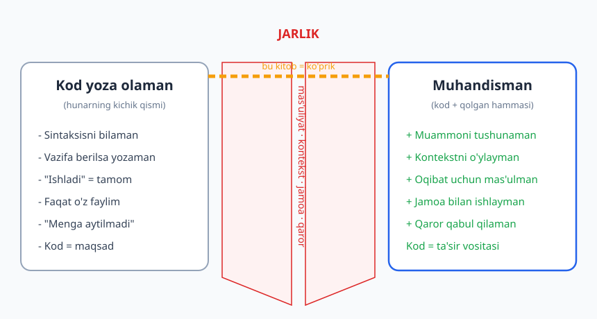
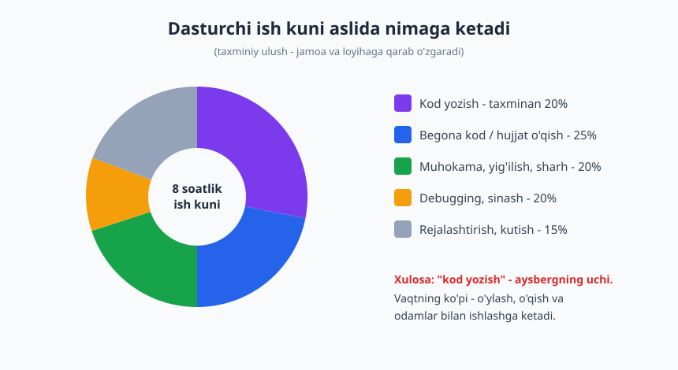
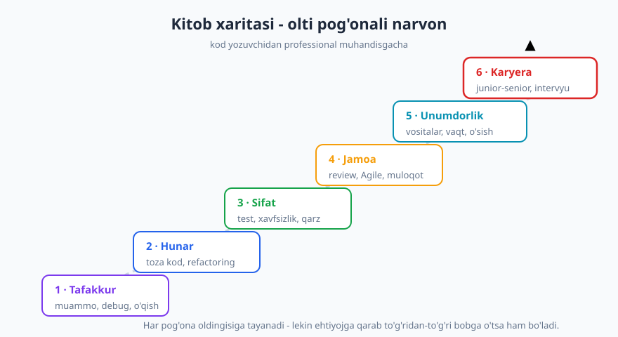

# 01 — Kod yozuvchidan muhandisgacha

[🏠 README](./README.md) · [Keyingi: 02 — Muammoni yechish san'ati ➡️](./02-muammoni-yechish-sanati.md)

---

> **Bu bobda:** "Men kod yoza olaman" bilan "men muhandisman" o'rtasidagi jarlikni ko'ramiz. Professionalizm aslida nima ekanini, dasturchining real ish kuni nimadan iboratligini, junior tafakkuri muhandis tafakkuridan nimasi bilan farq qilishini va bu kitobning butun xaritasini muhokama qilamiz.
>
> **Halollik / Eslatma:** bu bobdagi (va butun kitobdagi) gaplar — *qonun emas, amaliy yo'l-yo'riq*. Bu yerda muhandislik tajribasi va keng qabul qilingan amaliyot bor, lekin ayrim joylar — ochiqchasiga — **fikr va shaxsiy tajriba**. "Muhandis" so'zi diplom yoki unvon emas; u — **xulq**. Shuning uchun bu bobni ta'rif sifatida emas, oyna sifatida o'qing: o'zingizni qaysi tomonda ko'rasiz?

---

## "Ishladi" degan tuzoq

Tasavvur qiling: siz birinchi haqiqiy vazifangizni oldingiz. Foydalanuvchi ro'yxatdan o'tganda unga xush kelibsiz xati yuborilsin. Bir soatdan keyin kod tayyor — siz tugmani bosasiz, xat keladi, ekranda yashil belgi. Siz xursandsiz: **ishladi.**

Endi savol: bu vazifa *bajarildimi*?

Aniq emas. Email manzili noto'g'ri bo'lsa nima bo'ladi? Email xizmati javob bermasa? Bir foydalanuvchi ikki marta ro'yxatdan o'tsa, ikkita xat ketadimi? Bu xat spam papkasiga tushmasligi tekshirildimi? Keyingi dasturchi bu kodni ochsa, nima qilishini tushunadimi? Sizdan keyin kim buni qo'llab-quvvatlaydi?

"Ishladi" — bu kod yozuvchining yakuni. **Muhandis uchun esa "ishladi" — bu boshlanish.** Ana shu bitta jumlada butun bu kitobning mohiyati yotadi.

Buni boshqacha tasavvur qiling. Oshpaz bo'lishni o'rganayotgan odam birinchi marta tuxum qovurganda quvonadi — va haqli. Lekin restoran oshpazi bo'lish — bu tuxum qovurishni bilish emas: bu o'nlab buyurtmani bir vaqtda boshqarish, mahsulot sifatini tekshirish, jamoa bilan ishlash, mehmonning ehtiyojini tushunish va har taom barqaror chiqishini ta'minlash. Tuxum qovurish — kerakli, lekin kichik ko'nikma. Dasturlashda ham xuddi shunday: kod yozish — tuxum qovurish; muhandislik — restoranni boshqarish.

Kod yoza olish — ajoyib ko'nikma. Lekin u hunarning faqat kichik bir bo'lagi. Qolgan, ko'rinmaydigan bo'lagi — muammoni to'g'ri tushunish, oqibatlarni o'ylash, jamoa bilan til topish, kontekstni hisobga olish va qaror uchun mas'uliyatni o'z zimmangizga olish — aynan shu narsa kod yozuvchini muhandisga aylantiradi.

## Jarlik: ikki dunyo orasidagi masofa

Ko'pchilik dasturlashni o'rganishni "kod yozishni o'rganish" deb tushunadi. Bu — to'g'ri, lekin yarim haqiqat. Sintaksisni, sikllarni, funksiyalarni bilish sizni qirg'oqning bir tomoniga olib chiqadi. Lekin ish beruvchi, jamoa va foydalanuvchilar sizdan kutadigan narsa — narigi qirg'oqda.

Bu ikki qirg'oq orasidagi masofani **jarlik** deb ataylik. Jarlikning tubida nima bor? Mana shular:

| Jihat | Kod yozuvchi | Muhandis |
|---|---|---|
| **Maqsad** | Kod ishlasin | Muammo hal bo'lsin, qiymat yaralsin |
| **"Tayyor" mezoni** | Mening mashinamda ishladi | Ishonchli, qo'llab-quvvatlanadigan, tushunarli |
| **Kontekst** | "Menga shu aytildi" | "Nega bu kerak? Kim foydalanadi?" |
| **Xato** | "Aybim yo'q, topshiriq noto'g'ri edi" | "Men buni oldindan ko'ra olardim" |
| **Kod** | Maqsad | Vosita (ta'sirga erishish uchun) |
| **Jamoa** | Yolg'iz ishlayman | Boshqalar bilan birga quraman |
| **Vaqt o'lchovi** | Bugun ishlasin | Olti oydan keyin ham yashasin |

E'tibor bering: bu jadvalda **biror dasturlash tili, framework yoki algoritm yo'q.** Jarlikni kechib o'tish texnik bilim emas — bu *yondashuv* masalasi. Aynan shuning uchun bu kitob til-mustaqil: siz PHP, Python, Go yoki Rust yozasizmi — jarlik bir xil, ko'prik ham bir xil.

> **Trade-off:** "Ishladi yetarli emas" degani — hamma narsani mukammal qilish kerak degani EMAS. Bir martalik skript, tez prototip yoki hech kim ko'rmaydigan ichki vosita uchun "ishladi" — yetarli bo'lishi mumkin. Muhandislikning mohiyati — *qachon yetarli, qachon yetarli emasligini ajrata bilish*. Ortiqcha mukammallik (over-engineering) ham xuddi ehtiyotsizlikdek xato. Kontekst hal qiladi.

## Dasturchi aslida nima qiladi

Yangi dasturchilarning eng katta hayratlaridan biri shu: **ishga kirgach, kod yozishga juda kam vaqt ketadi.** Filmlardagidek tunu kun klaviatura chertib o'tirilmaydi.

Real ish kuni ko'pincha shunday ko'rinadi: bir vazifani tushunish uchun begona kodni o'qiysiz, hamkasb bilan muhokama qilasiz, nima xato ketganini aniqlash uchun debug qilasiz, kimnidir javobini kutasiz, yig'ilishda o'tirasiz, keyin biroz kod yozasiz, undan ko'proq vaqt esa o'sha kodni sinash va tuzatishga ketadi.

Aniq foizlar jamoaga, loyihaga va sizning darajangizga qarab har xil — bu yerdagi raqamlar taxminiy. Lekin naqsh deyarli har joyda bir xil: **klaviatura chertish — aysbergning uchi.** Suv ostidagi katta qism — o'ylash, o'qish va odamlar bilan ishlash.

Konkret bir kun. Soat 9:00 da Aziz ishni boshlaydi. Avval kechagi koddagi xato haqida xabar keladi — u yarim soat log o'qib, muammoni topadi (kod o'qish + debugging). 10:00 da standup yig'ilishi (muhokama). Keyin yangi vazifani tushunish uchun u mavjud kodni titkilaydi va ikkita hamkasbdan so'raydi (o'qish + kommunikatsiya). Tushdan keyin nihoyat kod yozadi — bor-yo'g'i 40 daqiqa. Qolgan vaqt esa shu kodni sinash, code review'da olgan izohlarni tuzatish va keyingi vazifani rejalashtirishga ketadi. Kuni oxirida u "bugun ko'p ish qildim" deb his qiladi — va haqli — lekin sof yozilgan kod juda oz.

Bu nimani anglatadi? Agar siz faqat kod yozishni o'rgansangiz, ishingizning balki beshdan bir qismiga tayyorsiz. Qolgan qismi — bu kitob qamraydigan ko'nikmalar:

- **Begona kodni o'qish** ([3-bob](./03-begona-kodni-oqish.md)) — chunki siz ko'proq o'qiysiz, kamroq yozasiz.
- **Debugging** ([4-bob](./04-debugging-tizimli-ovlash.md)) — chunki "nega ishlamayapti" so'rog'i ish kunining katta qismini egallaydi.
- **Kommunikatsiya** ([17-bob](./17-texnik-kommunikatsiya.md)) — chunki muhokama, savol va yozma muloqot — ishning markazi.
- **Baholash va rejalashtirish** ([16-bob](./16-baholash-rejalashtirish.md)) — chunki "qachon tayyor bo'ladi" degan savol sizni doim quvib yuradi.

## Professionalizm: unvon emas, xulq

"Professional dasturchi" iborasini ko'pincha "yaxshi haq oladigan" yoki "katta kompaniyada ishlaydigan" deb tushunishadi. Bu noto'g'ri. Professionalizm — pul yoki joy emas, **xatti-harakat**.

Professional dasturchining belgilari:

**1. Ishonchlilik.** Aytgan ishini qiladi, aytgan vaqtida (yoki kechikishini *oldindan* aytadi). Sizga vazifa berilsa, boshqalar uni unutib qo'yishi mumkinligidan xavotirlanmaydi — bu ularning kuni tinch o'tishini bildiradi.

**2. Kelishuvni bajarish.** "Ertaga tayyor" degan bo'lsangiz, ertaga tayyor bo'ladi yoki kechqurun "bir kun kechikadi, mana sababi" deysiz. Professional hech qachon jim qolib, muddatni o'tkazib yubormaydi.

**3. Oqibat uchun mas'uliyat.** Siz yozgan kod prodakshenda sinsa, "lekin men shunchaki aytilganini qildim" demaysiz. "Men buni ko'ra olardim, keyingi safar shu tekshiruvni qo'shaman" deysiz. Bu — aybni o'z bo'yniga olish emas, **egalik qilish** (ownership).

**4. "Ishladi" yetarli emasligini bilish.** Yuqorida ko'rganimizdek — professional tugma bosilganda emas, ish ishonchli, tushunarli va qo'llab-quvvatlanadigan bo'lganda to'xtaydi.

Mana real misol va anti-misol:

❌ **Anti-misol:** Dilshod vazifani juma kuni tugatdi deb aytdi. Dushanba kuni ma'lum bo'ldiki, u faqat o'z mashinasida sinagan, prodakshenda umuman ishlamaydi. So'rashganda: "Menga buni ham tekshiring deyilmagan edi-ku". Texnik jihatdan u haq. Lekin jamoa endi uning har bir "tayyor" so'ziga shubha bilan qaraydi.

✅ **Misol:** Madina ham xuddi shu vazifani oldi. U juma kuni: "Asosiy qism tayyor, lekin prodakshen muhitida bir cheklov bor — uni dushanbagacha hal qilaman, shuning uchun reliz dushanbaga suriladi" dedi. U bir kun "kechikdi", lekin jamoa unga *ko'proq* ishondi. Chunki u muammoni boshqalar his qilishidan oldin ko'rdi va ochiq aytdi.

Ikkalasi ham bir xil texnik darajada kod yozadi. Farq — kodda emas, **xulqda**.

> **Eslatma:** Professionalizm — "doim ha demaslik" emas. Aksincha, professional kerak bo'lganda "yo'q" yoki "bu muddatda imkonsiz, mana variantlar" deya oladi. Ko'r-ko'rona rozilik — professionalizm emas, qo'rquv. Bu haqda [16-bob](./16-baholash-rejalashtirish.md)da batafsil gaplashamiz.

## Mas'uliyat: kichik kodning katta to'lqini

Yangi dasturchi ko'pincha o'z kodini izolyatsiyada ko'radi: "men o'z funksiyamni yozdim, qolgani meni qiziqtirmaydi". Muhandis esa har bir o'zgarish *to'lqin* kabi tarqalishini biladi. Bir qator kod prodakshenda minglab foydalanuvchiga, qo'shni jamoaga, hatto kompaniyaning obro'siga tegishi mumkin.

Konkret hikoya. Bir e-tijorat loyihasida dasturchi "tezlik uchun" buyurtma summasini hisoblashda yaxlitlashni o'zgartirdi — har tranzaksiyada tiyin kasrlari "pastga" yaxlitlanadigan bo'ldi. Kod ishladi, testlar (yetarli emas edi) o'tdi, reliz bo'ldi. Bir oydan keyin buxgalteriya hisobotda nomuvofiqlik topdi: yuz minglab kichik buyurtmada yo'qolgan tiyinlar yig'ilib, sezilarli summa hosil qilgan. Kod "ishlagan" edi — lekin oqibati kodning o'zidan ancha uzoqqa cho'zildi.

Muhandis tafakkuri shu yerda farqlanadi:

❌ **Kod-markaz:** "Funksiya to'g'ri hisoblayapti, mening ishim tamom."

✅ **Mas'uliyat-markaz:** "Bu pul bilan ishlaydi — yaxlitlash qoidasini kim tasdiqlaydi? Buxgalteriya bilan kelishilganmi? Bu o'zgarish hisobotlarga qanday ta'sir qiladi?"

Mas'uliyat — ayb qidirish yoki har bir oqibatni oldindan ko'rish degani emas (bu imkonsiz). U — **savol berish odati**: "men yozayotgan narsa kimlarga, qayerda tegadi?" Bu odatni rivojlantirish — junior'dan senior'gacha bo'lgan yo'lning markazida turadi.

> **Trade-off:** Har bir o'zgarishning butun ta'sir zanjirini oxirigacha kuzatib chiqish ko'pincha imkonsiz va isrofgarchilik. Aql — *xavf darajasiga qarab kuch sarflashda*: parol, to'lov, foydalanuvchi ma'lumoti bilan ishlaganda chuqur o'ylang; tugma rangini o'zgartirganda — yo'q. Mas'uliyat = "qancha o'ylash kerakligini to'g'ri baholash", "hamma narsadan qo'rqish" emas.

## Kontekst: kod yozishdan oldingi haqiqiy ish

Vazifa kelganda, kod yozuvchi darrov klaviaturaga yopishadi. Muhandis avval **kontekstni** yig'adi — chunki noto'g'ri muammoni mukammal yechgan kod ham befoyda.

Misol: sizga "qidiruv tezroq ishlasin" deyildi. Kod-markaz yondashuv — darrov keshlash yoki indeks qo'shishga kirishadi. Muammo-markaz yondashuv avval so'raydi: *Qidiruv kim uchun sekin — barcha foydalanuvchilarmi yoki bittasimi? Qancha sekin — 2 soniyami yoki 0.2 soniyami? Qaysi qidiruv — mahsulot bo'yichami, buyurtma bo'yichami? Sekinlikni qanday o'lchadik?* Ko'pincha shu savollardan ma'lum bo'ladiki, asl muammo butunlay boshqa joyda — masalan, bitta noto'g'ri so'rov yoki bitta katta mijozning ma'lumoti. Bunda keshlash umuman kerak bo'lmaydi.

Kontekstni yig'ishning oddiy ramkasi:

| Savol | Nima beradi |
|---|---|
| **Kim** foydalanadi? | Haqiqiy ehtiyojni, chegaraviy holatlarni |
| **Nega** kerak? | Asl muammoni (so'rovning ortidagi) |
| **Qachongacha** va qanchalik muhim? | Yetarlilik darajasini, mukammallik chegarasini |
| Bunga **kim bog'liq**? | Ta'sir doirasini, kim bilan kelishishni |
| Hozir **qanday** ishlayapti? | Boriga tayanishni, qaytadan yozmaslikni |

Bu savollar — to'siq emas, *tezlatgich*. Ular kodni yozishdan oldin yo'lni to'g'rilaydi va keyinroq qayta yozishning oldini oladi.

## Junior tafakkuri vs muhandis tafakkuri

Daraja (junior, mid, senior) — bu kitobning [23-bobi](./23-karyera-narvoni.md) mavzusi. Lekin bu yerda muhim narsa unvon emas, **tafakkur**. Ikki dasturchi bir xil yillik tajribaga ega bo'lib, butunlay boshqacha tafakkurda bo'lishi mumkin.

**Junior (kod-markaz) tafakkuri:**

- "Menga aytilgan narsani yozaman."
- "Bu kod ishlayaptimi? Demak, tayyor."
- "Hammasini bilishim kerak — bilmasligimni hech kim ko'rmasin."
- "Bu mening kodim, bu — uning kodi."
- Savol: *"Buni qanday qilib yozaman?"*

**Muhandis (muammo/qiymat-markaz) tafakkuri:**

- "Nega bu kerak? Aslida qanday muammoni yechyapmiz?"
- "Bu ishlaydi — lekin tushunarlimi, ishonchlimi, kerakmi?"
- "Hammasini bilish mumkin emas; men *qanday topishni* va *kimdan so'rashni* bilaman."
- "Bu — *bizning* kodimiz; men uni yaxshilab ketsam, hammaga foyda."
- Savol: *"Bu muammoni yechishning eng oddiy, ishonchli yo'li nima — va umuman buni yozish kerakmi?"*

Eng katta farqni qarang: junior **"qanday yozaman"** deb so'raydi, muhandis avval **"nega va kerakmi"** deb so'raydi. Ba'zan eng yaxshi kod — yozilmagan kod. Mavjud yechimdan foydalanish, vazifani soddalashtirish yoki "bu funksiya umuman kerakmi?" deb so'rash — ko'pincha minglab qator koddan qimmatliroq.

Eng muhim nuqta — **"hammasini bilish shart emas"**. Yangi dasturchilarni eng ko'p qiynaydigan narsa shu: bilmaganidan uyaladi, savol berishdan qo'rqadi, "men yetarli emasman" deb o'ylaydi. Aslida hech bir muhandis hamma narsani bilmaydi — yangi framework, yangi til, yangi muammo har kuni paydo bo'ladi. Farq shundaki, muhandis *bilmaslikdan qo'rqmaydi*; u **qanday tez o'rganishni va qachon yordam so'rashni** biladi. Bu — kuchsizlik emas, ko'nikma (bu haqda [22-bob](./22-organishni-organish.md)da).

> **Trade-off:** "Nega kerak?" deb so'rash kuchli vosita — lekin har bir mayda vazifada uni qaytaraverish jamoani charchatadi va sizni "to'sqinlik qiluvchi" qilib ko'rsatishi mumkin. Ba'zan eng to'g'ri yo'l — ishonib, bajarib, keyin natijani ko'rib savol berish. Tafakkur muhim, lekin *takt* ham muhim.

## Bu kitob nima haqida — va nima haqida emas

Bu kitobni boshqa kitoblardan ajratib turadigan narsa shu: u sizga **kod yozishni o'rgatmaydi**. Buni til kitoblari va algoritm kitoblari qiladi. Bu kitob esa kod yozuvchini muhandisga aylantiradigan ko'prikni quradi.

| Bu kitob qamraydi | Bu kitob qamramaydi (boshqa kitobga qarang) |
|---|---|
| Muammoni yechish, debugging tafakkuri | Tilning sintaksisi → [Python](../python/README.md), [JavaScript](../js/README.md), [PHP](../php/README.md) |
| Toza kod hunari, nomlash, refactoring | Algoritm va murakkablik → [Algoritmlar](../algoritmlar/README.md), [1000 masala](../1000-masala/README.md) |
| Commit/PR/code review *madaniyati* | Git *mexanikasi* → [Git & GitHub](../git-github/README.md) |
| Jamoa, Agile, kommunikatsiya, karyera | Tizim *darajasidagi* dizayn → [Dasturlash arxitekturasi](../arxitektura/README.md) |
| Test va xavfsizlik *ongi* | Deploy, CI/CD, monitoring → [DevOps & Deployment](../devops/README.md) |

Boshqacha aytganda: boshqa kitoblar sizga **qurolni** beradi; bu kitob — o'sha qurolni jamoada, real loyihada, mas'uliyat bilan **qanday ishlatishni** o'rgatadi.

Kitob olti qismdan iborat va ular bir narvon kabi tartiblangan — pastdan yuqoriga:

1. **Tafakkur** — muammoni yechish, begona kodni o'qish, debugging.
2. **Toza kod hunari** — nomlash, modullik, izoh, xato boshqarish, refactoring.
3. **Sifat** — texnik qarz, testlash, xavfsizlik.
4. **Jamoa** — code review, commit/PR madaniyati, Agile, baholash, kommunikatsiya, hujjatlash, fikr-mulohaza.
5. **Unumdorlik** — vositalar, vaqt va diqqat, o'rganishni o'rganish.
6. **Karyera** — daraja narvoni, ish topish, intervyu, frilans, etika, barqarorlik.

Narvonni tartib bilan ko'tarilish tavsiya etiladi, lekin shart emas. Agar aniq, dolzarb ehtiyojingiz bo'lsa — masalan, ertaga intervyu bor — to'g'ridan-to'g'ri [25-bobga](./25-texnik-intervyu.md) o'ting. To'liq yo'l xaritasini [README](./README.md)da topasiz.

## "Muhandis" — manzil emas, yo'nalish

Oxirgi va, ehtimol, eng halol nuqta. "Muhandis bo'ldim" degan bir nuqta yo'q. Hech kim bir kuni uyg'onib "men endi muhandisman" deb sertifikat olmaydi. Buning o'rniga, har kuni qaror qabul qilasiz: bu kodni shoshib tashlab ketamanmi yoki biroz vaqt ajratib tushunarli qilamanmi? Bilmaganimni yashiramanmi yoki so'raymanmi? "Aybim yo'q" deymanmi yoki "men buni yaxshilay olardim" deymanmi?

Mana shu mayda qarorlarning yig'indisi — sizning muhandisligingiz. Bu unvon emas, **kunlik xulq**. Va xushxabar shuki: bugun, hozir, qaysi darajada bo'lishingizdan qat'i nazar, siz keyingi qarorni muhandisdek qabul qilishingiz mumkin.

Bir narsani esda tuting: bu kitobdagi hech narsa "iqtidor" yoki "tug'ma aql" haqida emas. Jarlikni kechib o'tish — *o'rganiladigan ko'nikma*. Eng tajribali muhandislar ham bir paytlar "ishladi, demak tayyor" deb o'ylagan, ular ham bilmaganidan uyalgan, ular ham muddatlarni o'tkazib yuborgan. Farq — ular har xatodan keyin yondashuvini bir oz to'g'rilashda davom etgan. Siz ham xuddi shunday qila olasiz — va aynan shuning uchun bu kitobni o'qiyapsiz.

Bu kitobning maqsadi — sizga shu qarorlarni osonroq va ongliroq qilishda yordam berish. Qolgani — sizning amaliyotingiz.

---

## Asosiy g'oyalar (bobni qisqacha)

- **"Ishladi" — kod yozuvchining yakuni, muhandisning boshlanishi.** Tugma bosilganda emas, kod ishonchli, tushunarli va qo'llab-quvvatlanadigan bo'lganda ish bitadi (lekin kontekstga qarab "yetarli" darajasi o'zgaradi).
- **Kod yoza olish — hunarning kichik qismi.** Real ish kunining katta qismi o'qish, muhokama, debugging va rejalashtirishga ketadi; klaviatura chertish — aysbergning uchi.
- **Professionalizm — unvon yoki haq emas, xulq:** ishonchlilik, kelishuvni bajarish, oqibat uchun **egalik** (ownership), va kerak bo'lganda asosli "yo'q" deya olish.
- **Muhandis tafakkuri "qanday yozaman" emas, "nega kerak va kerakmi" deb so'raydi** — muammo va qiymat markazda, kod esa shunchaki vosita.
- **"Hammasini bilish shart emas":** muhandis bilmaslikdan qo'rqmaydi, u tez o'rganishni va qachon yordam so'rashni biladi.
- **Bu kitob til-mustaqil va kasb haqida** — texnologiyani boshqa kitoblar o'rgatadi; bu yerda jamoa, mas'uliyat, kommunikatsiya va karyera.
- **"Muhandis" — manzil emas, yo'nalish:** uni har kunlik mayda qarorlar bilan tanlaysiz.

---

## Mashqlar

### Oson

**1-mashq.** O'zingizning so'nggi bitta kod vazifangizni eslang. Uni faqat "ishladi" deb topshirgan bo'lsangiz, qanday savollarni *bermagan* edingiz? (Masalan: noto'g'ri kirish bo'lsa-chi? kim qo'llab-quvvatlaydi?) Kamida 3 ta savol yozing.

**2-mashq.** Bobdagi jadval asosida o'zingizni baholang: oxirgi bir oyda "kod yozuvchi" ustunidagi qaysi xatti-harakatni qildingiz? Bittasini halol toping va yozing.

**3-mashq.** O'z kuningizni kuzating: kechagi (yoki bugungi) ish kuningizning taxminan necha foizi sof kod yozishga, necha foizi o'qish/muhokama/debug/kutishga ketdi? Taxminiy ulushlarni yozing.

### O'rta

**4-mashq.** Dilshod va Madina misolini eslang. Siz "kechikaman" deb oldindan aytishingiz kerak bo'lgan, lekin jim qolgan bir vaziyatni eslang. Endi Madina aytgandek bitta jumla yozing: nimani, qachongacha, qanday sabab bilan aytgan bo'lardingiz?

**5-mashq.** "Nega bu kerak?" degan savol foydali, lekin har joyda emas. Bitta vaziyat o'ylab toping (ish yoki o'quv loyihangizdan) bunda bu savolni berish *to'g'ri* edi, va bittasini bunda berish *takt yo'qligi* bo'lar edi. Farqni izohlang.

**6-mashq.** Quyidagi vazifani oldingiz deylik: "Foydalanuvchi parolini tiklash funksiyasini qo'sh". "Ishladi" demasdan oldin javob berishingiz kerak bo'lgan kamida 5 ta savolni ro'yxatlang (kontekst, chegaraviy holatlar, xavfsizlik, qo'llab-quvvatlash).

### Qiyin

**7-mashq.** O'zingizning hozirgi tafakkuringizni baholang. Bobdagi "junior tafakkuri vs muhandis tafakkuri" ro'yxatining har bir bandi bo'yicha 1–5 ball qo'ying (1 = sof kod-markaz, 5 = sof muammo-markaz). Eng past 2 ballni toping va keyingi oyda har biri uchun bitta aniq harakat yozing.

**8-mashq.** Bu kitobning olti qismidan o'zingizga eng dolzarbini tanlang va *nega* aynan o'sha qism kerakligini bitta paragrafda asoslang. Keyin o'qish rejasini tuzing: qaysi 3 bobni birinchi o'qiysiz va har biridan keyin loyihangizda nimani sinab ko'rasiz?

Yechimlar

> Bu mashqlar refleksiv — yagona to'g'ri javob yo'q. Quyida namuna javoblar va o'zingizni baholash mezonlari berilgan.

### 1-mashq yechimi
Namuna savollar: (1) Kirish noto'g'ri yoki bo'sh bo'lsa nima bo'ladi? (2) Bir vaqtning o'zida ikki marta chaqirilsa? (3) Tashqi xizmat (DB, API, email) javob bermasa? (4) Kim va qanday qo'llab-quvvatlaydi — log bormi? (5) Olti oydan keyin bu kodni ochgan odam tushunadimi? Agar bu savollarning hech birini bermagan bo'lsangiz — bu normal, aynan shu kitob shuni o'zgartirish uchun.

### 2-mashq yechimi
Halol javob — kuchli javob. Eng ko'p uchraydiganlar: "menga aytilmadi" deb mas'uliyatdan qochish; faqat o'z mashinangizda sinash; "ishladi" deb keyingi savollarni bermaslik. Bittasini topganingiz — allaqachon muhandis tafakkuriga qadam.

### 3-mashq yechimi
Aniq raqam muhim emas — naqsh muhim. Aksariyat dasturchilarda sof kod yozish 10–30% atrofida chiqadi. Agar sizda ham shunday bo'lsa — bu normal. Agar 80% chiqsa, ehtimol kuningizni to'liq kuzatmadingiz yoki hali jamoada ishlamayapsiz (bu ham normal, lekin bilib qo'ying: ish boshlagach naqsh o'zgaradi).

### 4-mashq yechimi
Yaxshi jumla uch narsani o'z ichiga oladi: **nima** holatda (asosiy qism tayyor / bir cheklovga duch keldim), **qachongacha** (aniq yangi muddat), **nega** (qisqa, ayb qidirmaydigan sabab). Namuna: "Asosiy funksiya tayyor, lekin X muhitida kutilmagan cheklovga duch keldim — uni payshanbagacha hal qilaman, shuning uchun reliz bir kun suriladi." Jim qolish — eng yomon variant.

### 5-mashq yechimi
Mezon: savol *to'g'ri* bo'ladi, agar u qaror, ko'lam yoki muammo-ta'rifiga ta'sir qilsa va hali aniqlanmagan bo'lsa ("nega bu funksiya birinchi navbatda kerak?"). Savol *taktsiz* bo'ladi, agar javob aniq, qaror allaqachon qabul qilingan yoki vaqt tor bo'lsa-yu, siz baribir "lekin nega?" deb to'sib tursangiz. Qoida: savol qiymat qo'shsa — bering; faqat o'z qiziqishingiz uchun bo'lsa — keyinroq, yoki o'zingiz qidirib toping.

### 6-mashq yechimi
Namuna savollar: (1) Tiklash havolasi qancha vaqt amal qiladi va bir martalikmi? (2) Mavjud bo'lmagan email kiritilsa, "bunday foydalanuvchi yo'q" deb aytamizmi (bu xavfsizlik tashvishi — foydalanuvchi borligini oshkor qiladi)? (3) Eski parol bilan tiklash so'rovlari rate-limit qilinadimi (spam/hujum)? (4) Tiklangach, eski sessiyalar bekor qilinadimi? (5) Bu jarayon qanday loglanadi va kim ko'radi? E'tibor bering — bularning ko'pi xavfsizlik va chegaraviy holat (bu haqda [8-bob](./08-xatolarni-boshqarish.md) va [12-bob](./12-xavfsiz-kod-asoslari.md)).

### 7-mashq yechimi
Bu mashqda maqsad — aniq ball emas, o'z-o'zini halol ko'rish. Agar deyarli hamma band 4–5 bo'lsa, ehtimol o'zingizga juda yumshoq baho qo'ydingiz (yoki haqiqatan tajribali muhandissiz — unda bu kitob sizga koordinatalarni eslatadi). Eng qimmatli natija — eng past 2 band va ular uchun aniq, kichik, o'lchasa bo'ladigan harakat (mas. "keyingi PR'da kamida bitta 'nega kerak' savolini beraman").

### 8-mashq yechimi
Yaxshi javob qismni *ehtiyojga* bog'laydi, "qiziqarli ko'rindi"ga emas. Masalan: "Ikki oydan keyin birinchi ishimni boshlayman — shuning uchun avval **Jamoa** qismini o'qiyman, chunki birinchi 90 kunda eng ko'p qiynaladigan narsam texnik emas, balki code review, commit madaniyati va kommunikatsiya bo'ladi." Reja aniq bo'lsin: 3 bob + har biridan keyin bitta amaliy qadam. Maslahat: oxirgi [29-bob](./29-kapston-90-kun-osish-rejasi.md) aynan shunday rejani tuzishga bag'ishlangan.

---

[🏠 README](./README.md) · [Keyingi: 02 — Muammoni yechish san'ati ➡️](./02-muammoni-yechish-sanati.md)
