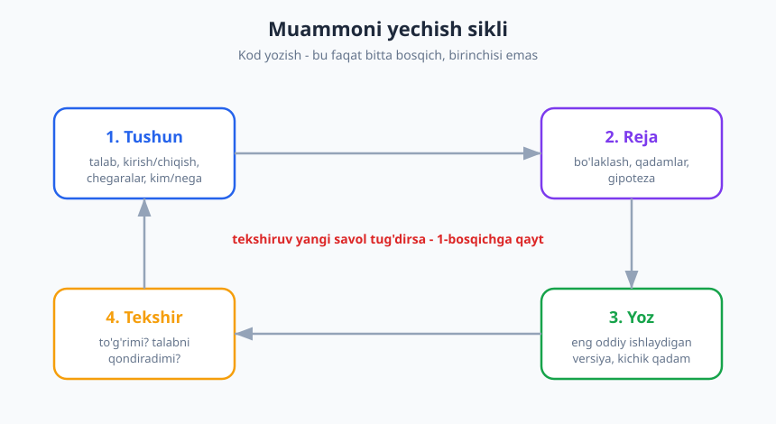
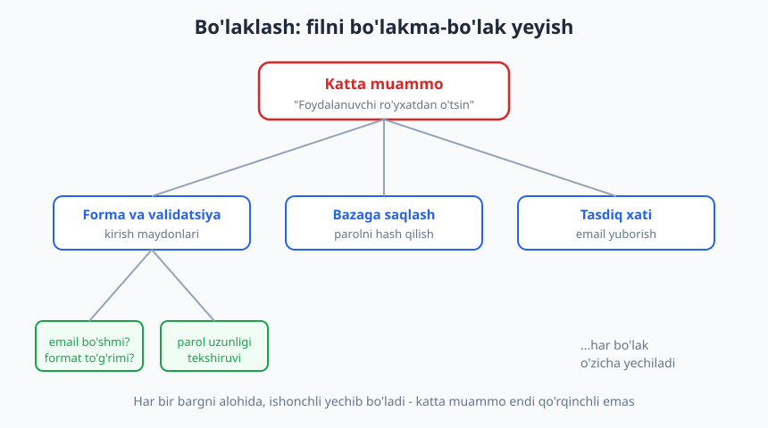
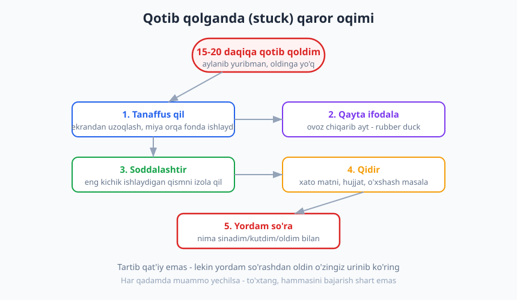

# 02 — Muammoni yechish san'ati

[⬅️ Oldingi: 01 — Kod yozuvchidan muhandisgacha](./01-kod-yozuvchidan-muhandisgacha.md) · [🏠 README](./README.md) · [Keyingi: 03 — Begona kodni o'qish va tushunish ➡️](./03-begona-kodni-oqish.md)

---

> **Bu bobda:** dasturchining eng asosiy ko'nikmasi — muammoni yechish — bilan tanishasiz. Nega kodga darrov sakrash eng katta xato ekanini, muammoni qanday *tushunish* va *bo'laklash* kerakligini, gipoteza qo'yib tekshirishni, "rubber duck" usulini va qotib qolganda (stuck) nima qilishni o'rganasiz.
>
> **Halollik / Eslatma:** bu yerda yagona "to'g'ri" jarayon yo'q. Bularning hammasi — *fikrlash asboblari to'plami*, qonun emas. Tajribali muhandislar ham har xil yo'l tutadi; ba'zan tartibni buzadi. Maqsad — sizga bir nechta ishonchli asbob berish, siz esa vaziyatga qarab tanlaysiz. Bu yerda muallifning va keng amaliyotning tajribasi bor; yakuniy qaror sizniki.

---

## Dasturchi nima bilan shug'ullanadi?

Ko'pchilik yangi dasturchi o'ylaydiki, uning ishi — kod yozish. Aslida kod — bu *yechimning ko'rinishi*, ishning o'zi emas. Dasturchining haqiqiy ishi — **muammoni yechish**. Kod — shunchaki yechimni kompyuter tushunadigan tilga o'girilgan shakli.

Buni boshqacha aytsak: agar siz muammoni tushunmagan bo'lsangiz, qanchalik chiroyli kod yozsangiz ham, u *noto'g'ri muammoni* hal qiladi. Bu — eng qimmat xato, chunki u oxirida bilinadi: kod ishlaydi, testlardan o'tadi, lekin mijoz "men buni so'ramagan edim-ku" deydi.

Shuning uchun professional dasturchi va boshlovchini ajratadigan birinchi narsa — **klaviaturaga qachon tegish kerakligini bilish**. Boshlovchi muammoni eshitishi bilan yoza boshlaydi. Muhandis avval to'xtaydi va o'ylaydi.

> **Eslatma:** "o'ylash — bu vaqtni behuda sarflash" degan tuyg'u — yangi dasturchining eng katta dushmani. Aslida 20 daqiqa o'ylab, 2 soatni tejaysiz. Tezroq kod yozish — tezroq tugatish degani emas.

---

## Sikl: Tushun → Reja → Yoz → Tekshir

Muammoni yechishga ishonchli yondashuv — bu bir necha bosqichli sikl. Kod yozish — bu siklning faqat **uchinchi** bosqichi.



1. **Tushun** — muammo aslida nima? Kirish va chiqish nima? Chegaralar qaerda? Kim uchun va nega?
2. **Reja** — muammoni qanday bo'laklarga ajrataman? Qaysi qadamlar kerak? Gipotezam nima?
3. **Yoz** — eng oddiy ishlaydigan versiyani yozaman, kichik qadamlar bilan.
4. **Tekshir** — bu haqiqatan ham talabni qondiradimi? Yangi savol tug'ildimi?

Eng muhimi: **tekshiruv yangi savol tug'dirsa, 1-bosqichga qaytasiz**. Bu sikl, to'g'ri chiziq emas. Real ishda siz bu siklni bir necha marta aylantirasiz — har gal muammoni biroz chuqurroq tushunib.

> **Trade-off:** kichik, aniq vazifalarda (mas. "bu tugma rangini o'zgartir") bu siklni to'liq bajarish ortiqcha — bir necha soniyada "tushunib", to'g'ridan-to'g'ri yozasiz. Sikl qancha **noaniq va katta** bo'lsa, shuncha foydali. Asbobni vazifa kattaligiga moslang; har doim 4 bosqichni rasman bajarish — byurokratiya.

---

## 1-bosqich: Muammoni tushunish

Bu — eng tashlab ketiladigan, lekin eng muhim bosqich. Tushunish degani — savollarga javob topish:

| Savol | Nega muhim |
|---|---|
| **Kirish nima?** | Qanday ma'lumot keladi? Formati, turi, hajmi? |
| **Chiqish nima?** | Natija qanday ko'rinishi kerak? Aniq misol bormi? |
| **Chegaralar (edge case) qaysi?** | Bo'sh kirish? Juda katta son? Manfiy qiymat? Mavjud bo'lmagan foydalanuvchi? |
| **Kim uchun?** | Foydalanuvchi kim? Ular bundan nimani kutadi? |
| **Nega?** | Muammo ortidagi haqiqiy ehtiyoj nima? (Ko'pincha aytilgan vazifa - haqiqiy ehtiyoj emas.) |

Eng kuchli savol — **"nega?"**. U sizni *aytilgan* yechimdan *haqiqiy* muammoga olib boradi.

### ❌ Anti-misol: kodga sakrash

Mijoz aytadi: *"Menga mahsulotlar ro'yxatini Excel'ga eksport qiladigan tugma kerak."* Dasturchi darrov Excel kutubxonasini o'rnatadi, eksport funksiyasini yozadi, ikki kun ishlaydi. Topshiradi. Mijoz: *"Bu yaxshi, lekin men buni har kuni do'stimga pochta orqali yuborishim kerak edi. Excel emas, oddiy jadval bo'lsa ham bo'lardi, faqat avtomatik yuborilsin."*

Ikki kun behuda ketdi. Dasturchi **nima** so'ralganini eshitdi, lekin **nega** kerakligini so'ramadi.

### ✅ Misol: avval tushunish

```text
Mijoz: "Menga Excel'ga eksport tugmasi kerak."
Dasturchi: "Albatta. Bir savol - bu eksport bilan keyin nima
            qilmoqchisiz? Kim ko'radi uni?"
Mijoz: "Har kuni hamkorimga yuboraman, u sotuvlarni ko'radi."
Dasturchi: "Tushundim. Unda balki har kuni avtomatik
            yuboriladigan hisobot foydaliroq bo'lar?
            Excel ham qo'shsak bo'ladi, lekin asosiysi -
            siz qo'l bilan yubormasligingiz."
```

Bu suhbat 3 daqiqa oldi va ikki kunni tejadi. **Muammoni tushunish — savol berish demakdir.** Savol berishdan uyalmang; bu kuchsizlik emas, professionalik belgisi.

> **Eslatma:** ba'zan siz mijoz emas, kod bilan ishlaysiz — masalan, "bu funksiya nega sekin" deganda. O'shanda ham "tushunish" o'sha-o'sha: kirish nima (qancha ma'lumot?), chiqish nima (qancha vaqt qabul qilinadi?), nega muhim (kim shikoyat qildi?). Savol obyekti — odam emas, tizim, lekin usul bir xil.

---

## 2-bosqich: Bo'laklash (decomposition)

Katta muammo qo'rqinchli ko'rinadi, chunki miya uni bir butun sifatida ko'taradigan og'irlik deb qabul qiladi. Yechim — uni **kichik, alohida yechiladigan bo'laklarga** ajratish. Eski maqol: *"Filni qanday yeysan? Bo'lakma-bo'lak."*



Aytaylik, vazifa: *"Foydalanuvchi ro'yxatdan o'tsin."* Bu bitta jumla, lekin ichida ko'p narsa bor. Uni bo'laklaymiz:

- **Forma va validatsiya** — email va parol maydonlari; email bo'shmi? formati to'g'rimi? parol yetarli uzunmi?
- **Bazaga saqlash** — foydalanuvchini yaratish; parolni hash qilish; takroriy emailni tekshirish.
- **Tasdiq xati** — tasdiqlash havolasi bo'lgan email yuborish.

Endi har bir bo'lak — **alohida, kichik, qo'rqinchsiz vazifa**. Siz "ro'yxatdan o'tish"ni emas, "email bo'shmi" ni yechasiz — buni esa har bir dasturchi qila oladi. Katta muammo yo'qolmadi, lekin u endi yengiladigan bo'laklar yig'indisi.

Bo'laklashning yana bir foydasi — **oraliq g'alaba**. Har bir kichik bo'lak tugaganda, siz ilgarilaganingizni ko'rasiz. Bu motivatsiyani saqlaydi; bitta ulkan vazifa ustida kunlab "hech narsa tugamayapti" hissi bilan ishlash — charchatadi.

> **Trade-off:** haddan tashqari bo'laklash ham xato. Agar siz "tugmani bosish" ni "sichqonchani harakatlantirish" va "piksel rangini o'zgartirish" gacha bo'laklasangiz, bu analiz falaji (analysis paralysis). To'g'ri bo'lak — *bir o'tirishda* yechib, test qilib bo'ladigan kattalik. Tajriba bilan siz "qachon bo'lak yetarlicha kichik" ni his qilasiz.

---

## 3-bosqich: Eng oddiy ishlaydigan versiya

Bo'laklarni qo'lga olganingizdan keyin, vasvasa shu: hammasini birdan, "to'g'ri" qilib yozish. Buning o'rniga — **eng oddiy ishlaydigan versiyadan** boshlang.

Bu — "make it work, make it right, make it fast" (avval ishlasin, keyin to'g'ri bo'lsin, keyin tez bo'lsin) tamoyili. Birinchi versiya xunuk bo'lishi mumkin: bitta funksiyada, validatsiyasiz, faqat bitta holatda ishlaydi. Muhimi — u **ishlaydi**. Bu sizga:

- Yo'l to'g'riligini isbotlaydi (gipotezangiz to'g'rimi?).
- Yangi savollarni ochadi (siz bilmagan chegaralar bor edi).
- Aniq, ko'rinadigan natija beradi.

Keyin uni qadam-baqadam yaxshilaysiz: validatsiya qo'shasiz, holatlarni qoplaysiz, tartibga solasiz. Har qadamda kod **ishlab turadi** — bu sizga xavfsizlik tarmog'i beradi.

### ❌ Anti-misol: hammasini birdan

```python
# Bir o'tirishda 200 qatorli "to'liq" funksiya yozildi,
# hech qachon ishga tushirilmadi. Oxirida ishga tushganda
# 12 ta xato chiqdi va qaysi biri qaerdan kelganini topish
# uchun yana yarim kun ketdi.
def royxatdan_otkaz(malumot):
    # ... 200 qator: validatsiya + hash + baza + email + log + ...
    pass
```

### ✅ Misol: kichik ishlaydigan qadam

```python
# 1-qadam: faqat bazaga yozadi. Validatsiya yo'q, email yo'q.
# Lekin ISHLAYDI va men sinab ko'raman.
def royxatdan_otkaz(email, parol):
    foydalanuvchi_yarat(email, parol)  # eng oddiy holat
    return "yaratildi"

# Ishladi! Endi keyingi bo'lak - validatsiya qo'shaman.
# Har qadamda kod ishlab turadi.
```

Kichik qadamlar bilan, xato chiqsa — u **oxirgi qadamingizda** ekanini bilasiz. 200 qatorlik "katta portlash"da esa xatoni butun kod ichidan qidirasiz. ([04-bob](./04-debugging-tizimli-ovlash.md) da debugging haqida batafsil.)

---

## Gipoteza qo'yish va tekshirish

Muammoni yechish — ko'pincha **ilmiy usul** kabi: siz gipoteza qo'yasiz va uni tekshirasiz. "O'ylaymanki, muammo bu yerda" → tekshiraman → to'g'ri yoki noto'g'ri → keyingi gipoteza.

Yomon yondashuv — **taxmin qilib, o'zgartirib ko'rish** (random kod o'zgartirish, "balki shu ishlar"). Bu vaqtni yeydi va siz nima qilganingizni tushunmaysiz. Yaxshi yondashuv:

1. **Gipoteza:** "Menimcha, sahifa sekin, chunki har bir element uchun alohida so'rov yuborilyapti."
2. **Bashorat:** "Agar shunday bo'lsa, so'rovlar sonini logda ko'raman — yuzdan ortiq bo'lishi kerak."
3. **Tekshiruv:** logni ochaman. Haqiqatan ham 140 ta so'rov.
4. **Xulosa:** gipoteza to'g'ri. Endi yechim aniq — so'rovlarni birlashtirish.

Har bir gipoteza — siz bilim olasiz, hatto u noto'g'ri bo'lsa ham. Noto'g'ri gipoteza — bu yo'lni *o'chiradi*, izlash maydonini toraytiradi. Bu — yutqazish emas, ilgarilash.

> **Eslatma:** gipotezani **bittadan** tekshiring. Agar siz bir vaqtda uch narsani o'zgartirsangiz va muammo yo'qolsa — qaysi biri yordam berganini bilmaysiz. Bittadan o'zgartirish — sekinroq tuyuladi, lekin aslida tezroq, chunki siz haqiqatni bilasiz.

---

## "Rubber duck" — o'rdakka tushuntirish

Bu usulning nomi kulgili, lekin u haqiqatan ishlaydi. **Rubber duck debugging**: muammoingizni stol ustidagi o'yinchoq o'rdakka (yoki itingizga, yoki devorga) ovoz chiqarib, qadamma-qadam tushuntiring.

Sirning kaliti shundaki: muammoni **so'z bilan ifodalash** miyangizni boshqa rejimga o'tkazadi. Yozayotgan yoki o'qiyotgan miya tezroq sirpanib o'tadi; gapirayotgan miya har qadamni aniq aytishga majbur. Va aynan shu "aniq aytish" paytida siz o'zingiz xatoni topasiz: *"...keyin men bu qiymatni olaman va... shoshma, men buni hech qaerda olmayapman-ku!"*

Bu — siz odamga aytib turib, javobni o'zingiz topganingizdek. Shuning uchun o'rda — odam ham bo'lishi shart emas. Muammoni:

- **Baland ovoz bilan ayting** (o'rdakka, o'zingizga).
- **Yozib chiqing** (matn yoki forumga savol yozayotgandek — ko'pincha "yuborish" tugmasiga bosishdan oldin javobni topasiz).
- **Birovga tushuntiring** — agar yonida hamkasb bo'lsa, undan javob kutmang ham, shunchaki tushuntiring.

Bularning hammasi bitta narsa qiladi: muammoni boshqacha qarashga majbur qiladi. Va aksariyat qotib qolish — bu shunchaki **bir nuqtaga uzoq qarab qolish** dan kelib chiqadi. Yangi ko'z — yangi yechim.

---

## Qotib qolganda (stuck) nima qilish

Har bir dasturchi — har kuni — qotib qoladi. Bu kasbning bir qismi, kamchilik emas. Farq shuki, tajribali dasturchi qotib qolganini **tezroq seizadi** va undan **chiqish yo'lini biladi**. Boshlovchi esa soatlab bir nuqtada aylanadi.

Birinchi qadam — **qotib qolganingizni tan olish**. Belgi: siz 15-20 daqiqadan beri oldinga siljimadingiz, bir xil narsalarni qayta-qayta sinab yuribsiz, asabiylashyapsiz. Bu — to'xtab, strategiya o'zgartirish vaqti.



| Qadam | Nima qilasiz | Nega ishlaydi |
|---|---|---|
| **Tanaffus** | Ekrandan turing, suv iching, 5-10 daqiqa yuring | Miya orqa fonda ishlaydi; yechim ko'pincha dushda keladi |
| **Qayta ifodala** | Muammoni boshqacha so'z bilan ayting (rubber duck) | Yangi ko'z, yashirin taxminlar ko'rinadi |
| **Soddalashtir** | Eng kichik ishlaydigan qismni alohida ajrating | Muammo maydonini toraytiradi |
| **Qidir** | Xato matnini, hujjatni, o'xshash masalani qidiring | Sizdan oldin kimdir bu muammoga duch kelgan |
| **Yordam so'ra** | Hamkasbdan/jamoadan so'rang — to'g'ri tarzda | Yangi tajriba, yangi nuqtai nazar |

Bu tartib qat'iy emas. Lekin bitta qoida bor: **yordam so'rashdan oldin o'zingiz urinib ko'ring**, va yordam so'raganda **tayyorgarlik bilan so'rang**.

### Yordamni qanday so'rash kerak

Yomon savol: *"Ishlamayapti, nima qilay?"* — bu hamkasbingizni sizning butun yo'lingizni boshidan kuzatishga majbur qiladi.

Yaxshi savol uch narsani aytadi:

```text
1. NIMA qilmoqchiman:    "Foydalanuvchi loginini saqlamoqchiman."
2. NIMA sinadim:         "Sessiyaga yozdim, mana shu kod (link)."
3. NIMA kutgandim/oldim: "Qayta kirganda saqlanishini kutdim,
                          lekin har safar null qaytyapti."
```

Bu — *to'g'ri savol berish*. Ko'pincha siz savolni shu tarzda yozayotib, javobni **o'zingiz topasiz** (rubber duck effekti). Topmasangiz ham, hamkasbingiz 30 soniyada javob beradi, chunki siz unga to'liq rasm berdingiz. (Savol berish san'ati haqida [17-bob](./17-texnik-kommunikatsiya.md) da batafsil — XY muammosi va asinxron muloqot.)

> **Trade-off:** qachon yordam so'rash kerak? Juda erta so'rasangiz — o'rganish imkoniyatini boy berasiz va hamkasbingiz vaqtini olasiz. Juda kech so'rasangiz — kunlab bir muammoga botasiz va jamoa kechikadi. Amaliy qoida: **bir narsani o'zingiz 30-60 daqiqa urinib ko'ring**, agar ilgarilamasangiz — so'rang. Bu vaqt sizning darajangizga va vazifa shoshilinchligiga qarab o'zgaradi.

---

## "Naqsh"ni tanish — lekin ko'r-ko'rona ko'chirmaslik

Tajriba ortgan sari siz **naqshlarni** tanib qola boshlaysiz: *"Bu muammoni avval ko'rgandim. O'shanda lug'at (hash map) bilan yechgandim."* Bu — kuchli ko'nikma. Yangi muammoni ko'rganda o'zingizga savol bering: *"Bu nimaga o'xshaydi? Men avval shunga o'xshash narsani yechganmidim?"*

Bu sizni noldan o'ylashdan qutqaradi. O'xshash masala — o'xshash yechim shaklini taklif qiladi.

Lekin bu yerda **tuzoq** bor: tayyor yechimni ko'r-ko'rona ko'chirish. Internetdan kod nusxalash yoki AI yordamida olingan javobni — **tushunmasdan** — joylash. Bu vaqtinchalik ishlashi mumkin, lekin:

- Sizning aniq muammoyingizga to'liq mos kelmasligi mumkin (chegaralar boshqacha).
- Birinchi xato chiqqanda — siz uni tuzata olmaysiz, chunki kodni tushunmaysiz.
- Siz o'rganmaysiz; keyingi safar yana qidirasiz.

### ✅ To'g'ri yo'l

Naqshni yoki tayyor yechimni **ilhom** sifatida oling, lekin uni o'z muammoyingizga moslang va **har bir qatorini tushuning**. O'zingizga ayting: *"Bu kod nega ishlaydi? Mening holatimda chegaralar bir xilmi? Agar kirish bo'sh bo'lsa, bu nima qiladi?"* Agar javob bilmasangiz — to'xtang va tushunib oling. Tushunmagan kod — bu sizning kodingiz emas, vaqtinchalik qarz.

> **Eslatma:** AI yordamchilar (Claude, Copilot va h.k.) bu sohada yangi voqelik. Ular ajoyib asbob — lekin "naqsh"ning kuchaytirilgan shakli. Xuddi internetdagi kod kabi: olganingizni *tushuning*, sinab ko'ring, moslang. AI bergan javob ham gipoteza — tekshirilishi shart. (Bu mavzu — [27-bob](./27-etika-masuliyat.md) da, AI bilan kod yozish etikasi doirasida.)

---

## Hammasini birlashtirib: kichik real misol

Aytaylik, sizga vazifa berildi: *"Foydalanuvchilar ro'yxatidan eng faol 5 tasini ko'rsat."* Mana muhandisning ichki monologi:

```text
TUSHUN:  "Eng faol" nima degani? Kirish/buyurtma soni bo'yichami,
         yoki oxirgi 30 kunmi? -> so'rayman.
         Javob: oxirgi 30 kundagi buyurtma soni bo'yicha.
         Chiqish: 5 ta ism + soni. Agar 5 tadan kam bo'lsa? -> hammasini.

REJA:    1) 30 kunlik buyurtmalarni foydalanuvchi bo'yicha sanash
         2) kamayish tartibida saralash
         3) birinchi 5 tasini olish

YOZ:     Avval eng oddiy: barcha buyurtmalarni olib, qo'lda sanayman.
         Ishladi (kichik bazada). Endi yaxshilayman.

TEKSHIR: 5 ta to'g'ri chiqdimi? Buyurtmasi yo'q foydalanuvchi-chi?
         Hozir u ro'yxatda yo'q - bu to'g'rimi? -> mijozdan so'rayman.
         Yangi savol -> TUSHUN ga qaytaman.
```

Diqqat qiling: **birinchi qator hali kod emas**. Eng katta qiymat — sikldagi "Tushun" va "Tekshir" da. Kod — o'rtada, eng oson qism.

---

## Asosiy g'oyalar (bobni qisqacha)

- Dasturchining haqiqiy ishi — **kod yozish emas, muammoni yechish**. Kod — yechimning shakli, ishning o'zi emas.
- Eng katta xato — **muammoni tushunmasdan kodga sakrash**. Avval savol bering: kirish, chiqish, chegaralar, kim, **nega**.
- **Bo'laklash** (decomposition) — katta muammoni kichik, alohida yechiladigan bo'laklarga ajratish; "filni bo'lakma-bo'lak yeyish".
- **Eng oddiy ishlaydigan versiyadan** boshlang va kichik qadamlar bilan yaxshilang — har qadamda kod ishlab tursin.
- **Gipoteza qo'yib tekshiring**, taxmin qilib o'zgartirmang; bir vaqtda bittadan o'zgartiring.
- **Rubber duck** — muammoni ovoz chiqarib/yozib tushuntirish miyani yangi ko'z bilan ko'rishga majbur qiladi.
- Qotib qolganda **tanaffus → qayta ifodala → soddalashtir → qidir → yordam so'ra**; yordamni *to'g'ri* so'rang (nima qilmoqchi, nima sinadim, nima kutdim).
- **Naqshni taning, lekin ko'r-ko'rona ko'chirmang** — har bir qatorni tushuning, aks holda u sizning kodingiz emas.

---

## Mashqlar

### Oson

**1-mashq.** Quyidagi vazifani **kamida 5 ta savol** bilan oydinlashtiring (kodga sakramang): *"Foydalanuvchilarga bildirishnoma yuboradigan tizim qil."* Kirish, chiqish, chegaralar, kim, nega bo'yicha savollarni yozing.

**2-mashq.** *"Onlayn do'kon savatini qilish"* vazifasini kamida 4 ta kichik bo'lakka ajrating. Har bir bo'lak *bir o'tirishda* yechiladigan kattalikda bo'lsin.

**3-mashq.** Oxirgi marta dasturlashda qotib qolganingizni eslang. Qancha vaqt qotib turdingiz? Qaysi paytda yordam so'radingiz (yoki so'rashingiz kerak edi)? Bobdagi 5 qadamdan qaysilarini qo'llamadingiz?

### O'rta

**4-mashq.** Quyidagi yomon savolni **yaxshi savolga** aylantiring (3 qismli shakl bilan): *"Saytim ishlamayapti, yordam bering!"* O'zingiz tasavvur qilgan kontekstni to'ldiring.

**5-mashq.** Bir hamkasbingiz *"Excel'ga eksport tugmasi"* so'rayapti. Unga **"nega" turidagi** 3 ta savol yozing, ular *aytilgan yechim* ortidagi *haqiqiy ehtiyojni* ochishi kerak.

**6-mashq.** Sizga muammo berildi: *"Sahifa juda sekin yuklanyapti."* Buni ilmiy usul bilan yechish uchun **kamida 2 ta gipoteza** yozing, har biri uchun *bashorat* (agar shu to'g'ri bo'lsa, men nimani ko'raman) va *tekshiruv usuli*ni ko'rsating.

### Qiyin

**7-mashq.** O'zingizning real loyihangizdan (yoki o'qiyotgan kodingizdan) bitta murakkab vazifani oling. Uni bobdagi **to'liq sikl** bo'yicha yozma ravishda o'tkazing: Tushun (savollar + javoblar), Reja (bo'laklar), Yoz (eng oddiy versiya rejasi), Tekshir (qanday tekshirasiz + qanday yangi savollar tug'ilishi mumkin). Bu — fikrlash mashqi, kod yozish shart emas.

**8-mashq.** Bir hafta davomida **"qotib qolish jurnali"** yuriting: har gal qotib qolganingizda yozing — (a) muammo nima edi, (b) qancha vaqt qotib turdingiz, (c) nima sizni qutqardi (tanaffus? qayta ifodalash? qidirish? yordam?). Hafta oxirida tahlil qiling: qaysi usul siz uchun eng tez ishlaydi? Qaysi vaziyatda juda kech yordam so'radingiz?

<details markdown="1">
<summary>Yechimlar</summary>

### 1-mashq yechimi

Namuna savollar (yagona to'g'ri javob yo'q — muhimi *nega* va *chegaralar* bo'lishi):

1. **Kim uchun?** Bildirishnoma kimlarga boradi — barcha foydalanuvchilargami, ma'lum guruhgami?
2. **Qanday kanal?** Email, SMS, push, ilova ichi — yoki bir nechtasi?
3. **Nega?** Bildirishnoma qanday voqea-hodisaga javoban yuboriladi (yangi xabar, buyurtma holati)? Haqiqiy ehtiyoj nima?
4. **Chiqish/format:** Bildirishnoma matni qanday — shablonmi, har biri uchun moslashtiriladimi?
5. **Chegaralar:** Foydalanuvchi bildirishnomani o'chirgan bo'lsa-chi? Email noto'g'ri bo'lsa? Bir vaqtda 100 000 ta yuborilsa nima bo'ladi?

Eng kuchlisi — 3-savol ("nega"): balki ularga umuman bildirishnoma kerak emas, balki shunchaki ilova ichida belgi yetarli.

### 2-mashq yechimi

Namuna bo'laklash:

- **Savatga mahsulot qo'shish** — mahsulot + son saqlash; allaqachon bor mahsulotni qayta qo'shsa?
- **Savatni ko'rsatish** — mahsulotlar ro'yxati + jami summa hisoblash.
- **Sonni o'zgartirish / o'chirish** — sonni yangilash; 0 ga tushsa o'chirish.
- **Savatni saqlash** — sessiyada yoki bazada (foydalanuvchi qaytib kelganda saqlanadimi?).

Har biri alohida, testlanadigan. "Onlayn do'kon savati" endi qo'rqinchli emas.

### 3-mashq yechimi

Bu — refleksiv mashq, namuna javob: *"Men 2 soat qotib turdim, bir xil kodni qayta-qayta ishga tushirib. Yordam so'rashdan uyaldim. Bobdagi qadamlardan tanaffusni va qayta ifodalashni qo'llamadim — agar 20 daqiqada to'xtab, muammoni yozib chiqqanimda, ehtimol o'zim topardim. Eng katta xatom — juda kech yordam so'radim."* Muhimi — o'zingizga halol baho berish.

### 4-mashq yechimi

```text
1. NIMA qilmoqchiman: Saytimda login formasi orqali kirmoqchiman.
2. NIMA sinadim:      To'g'ri email/parol kiritdim, "Kirish" bosdim.
                      Kod: (havola yoki snippet). Brauzer konsolida
                      "500 Internal Server Error" chiqyapti.
3. NIMA kutgandim:    Bosh sahifaga o'tishni kutgandim, lekin oq
                      ekran qoladi va URL o'zgarmaydi.
```

Endi yordam beruvchi aniq qaerga qarashni biladi (server logi, 500 xato).

### 5-mashq yechimi

Namuna "nega" savollari:

1. "Bu eksportni kim ko'radi va u bilan keyin nima qiladi?"
2. "Buni qanchalik tez-tez qilasiz — bir martamigina, har kunmi?"
3. "Excel'ning o'zi shartmi, yoki maqsad — ma'lumotni boshqa joyga olib o'tishmi?"

Maqsad — *eksport tugmasi* (yechim) emas, *ma'lumotni qayergadir yetkazish* (ehtiyoj) ekanini ochish. Balki avtomatik hisobot yoki integratsiya yaxshiroq.

### 6-mashq yechimi

```text
Gipoteza 1: Sahifa sekin, chunki ko'p alohida baza so'rovlari bor (N+1).
  Bashorat:  Agar shunday bo'lsa, so'rov logida yuzlab o'xshash
             so'rovlarni ko'raman.
  Tekshiruv: Baza so'rov logini yoqaman va sonini sanayman.

Gipoteza 2: Sahifa sekin, chunki katta rasmlar optimallashtirilmagan.
  Bashorat:  Agar shunday bo'lsa, brauzer Network panelida bir necha
             megabaytlik rasm fayllarini ko'raman.
  Tekshiruv: Brauzer Network panelini ochib, eng og'ir resurslarni
             ko'raman.
```

Har birini *alohida* tekshiring — ikkalasini birdan o'zgartirmang.

### 7-mashq yechimi

Bu — to'liq jarayonni mashq qilish. Mezonlar (o'zingizni baholash uchun):

- **Tushun:** Kamida 3 ta aniqlovchi savol va ularga (taxminiy) javob bormi? "Nega" savoli bormi?
- **Reja:** Muammo 3+ bo'lakka ajratildimi? Har bir bo'lak *bir o'tirishda* yechiladimi?
- **Yoz:** "Eng oddiy ishlaydigan versiya" aniqlanganmi (validatsiyasiz, eng oddiy holat)?
- **Tekshir:** Qanday tekshirishingizni aytdingizmi? Kamida bitta yangi savol/chegara topdingizmi (sikl qayta boshlanishi)?

Agar to'rttasiga ham "ha" desangiz — siz muammoni muhandis kabi ko'rasiz.

### 8-mashq yechimi

Bu — uzoq muddatli refleksiya. Hafta oxirida quyidagicha tahlil kutiladi:

- **Naqsh:** "Men ko'pincha qidirish bilan qutuldim (5 holatdan 3 tasi)." yoki "Tanaffus eng kuchli — yurib kelgach yechim topildi."
- **Vaqt:** "O'rtacha 35 daqiqa qotib turdim — bu me'yordan uzun, ertaroq to'xtashim kerak."
- **Yordam:** "Ikki marta juda kech (2+ soat) so'radim. Keyingi safar 45 daqiqada so'rayman."

Muhimi — siz o'z *shaxsiy* qotib qolish naqshingizni va undan chiqish yo'lingizni bilib olasiz. Bu — eng qimmatli o'z-o'zini bilish.

</details>

---

[⬅️ Oldingi: 01 — Kod yozuvchidan muhandisgacha](./01-kod-yozuvchidan-muhandisgacha.md) · [🏠 README](./README.md) · [Keyingi: 03 — Begona kodni o'qish va tushunish ➡️](./03-begona-kodni-oqish.md)
