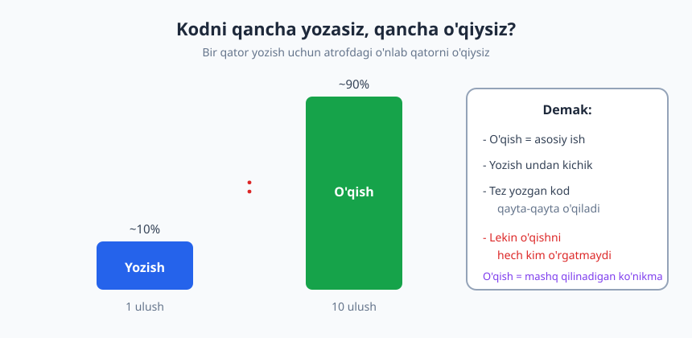
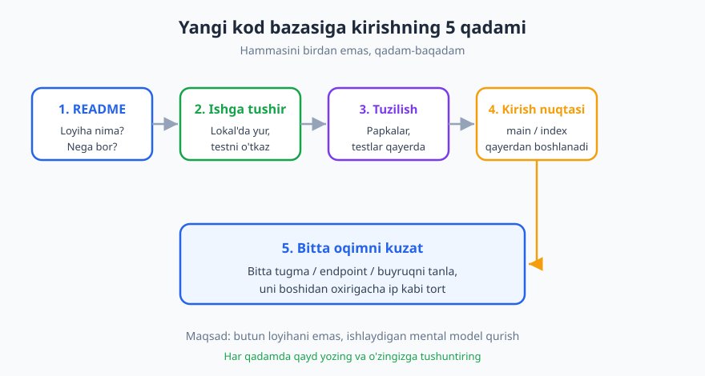
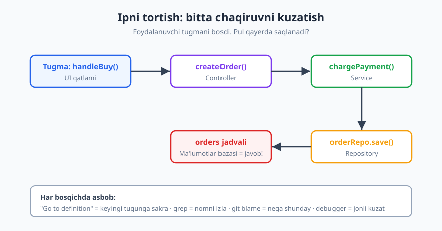

# 03 — Begona kodni o'qish va tushunish

[⬅️ Oldingi: 02 — Muammoni yechish san'ati](./02-muammoni-yechish-sanati.md) · [🏠 README](./README.md) · [Keyingi: 04 — Debugging: xatoni tizimli ovlash ➡️](./04-debugging-tizimli-ovlash.md)

---

> **Bu bobda:** professional dasturchining kunining katta qismi yangi kod yozish emas, **boshqalar yozgan kodni o'qish** bilan o'tadi. Siz nega o'qish — asosiy ko'nikma ekanini, katta va notanish kod bazasiga qayerdan kirishni, "qaysi ipni tortish"ni, kod ichida navigatsiya qilish asboblarini (go to definition, grep, git blame, debugger), va o'z ichingizda **mental model** qurishni o'rganasiz.
>
> **Halollik / Eslatma:** notanish kodni tushunish **vaqt oladi** — bu sizning zaifligingiz emas, ishning tabiati. Senior dasturchi ham yangi loyihada birinchi kuni "yo'qolgan"day his qiladi; farqi — u qanday yo'l topishni biladi. Bu yerdagi yondashuvlar amaliy yo'l-yo'riq, qonun emas: kichik skript bilan million qatorli monolit bir xil usulda o'qilmaydi.

---

## Nega o'qish — eng kam o'rgatiladigan ko'nikma

Maktab, kurs, universitet — hammasi sizga kod **yozishni** o'rgatadi. Bo'sh fayl ochasiz, vazifa olasiz, yozasiz. Lekin real ishda kuningiz boshqacha o'tadi: ertalab ochiladigan birinchi narsa — bo'sh fayl emas, **kimdir yozgan minglab qator kod**. Sizga "shu tugmaga yangi maydon qo'sh" deyishadi, va siz avvalo o'sha tugma qayerda, qanday ishlashini *tushunishingiz* kerak.

Tajriba shuni ko'rsatadiki, dasturchi kodni **yozganidan taxminan o'n barobar ko'p o'qiydi**. Bu nisbat aniq raqam emas — loyihaga qarab o'zgaradi — lekin yo'nalishi har doim bir xil: **o'qish ustun keladi.** Hatto yangi qator yozayotganingizda ham, avval atrofdagi o'nlab qatorni o'qiysiz: bu funksiya nimani qaytaradi, qanday chaqiriladi, qaysi o'zgaruvchi nimani anglatadi.



Shundan kelib chiqadigan amaliy xulosa ikkita. Birinchi — **o'qishni alohida ko'nikma sifatida mashq qiling**: u o'z-o'zidan kelmaydi. Ikkinchi — siz yozgan kod ham keyin (ko'pincha o'zingiz tomonidan, oradan oy o'tib) o'qiladi, shuning uchun "ishladi-bo'ldi" emas, "boshqa odam buni o'qiganda tushunadimi" deb yozing.

> **Trade-off:** "har doim o'qishga ko'p vaqt sarflang" degani emas. Bir martalik, tashlanadigan skript yoki tezkor tajriba (prototip) uchun chuqur tushunishga urinish — vaqt isrofi. O'qishga sarflagan kuchingizni kodning **umri** va **muhimligi**ga moslang: ishlab chiqarishda yuradigan to'lov moduli — diqqat bilan; bir kunlik demo skript — yuzaki.

## Katta kod bazasiga kirish: qayerdan boshlash

Notanish, katta loyihani birinchi marta ochganda eng keng tarqalgan xato — **birinchi fayldan boshlab hammasini ketma-ket o'qishga urinish**. Bu cho'kishga olib keladi: kontekstsiz minglab qator hech narsa anglatmaydi. Buning o'rniga tartibli kirish qadamlari bor.



1. **README va hujjatlar.** Loyiha *nima qiladi* va *nega bor*? Bu eng yuqori darajadagi kontekst. README'ni o'qimasdan kodga sho'ng'ish — xaritasiz shaharga kirish.
2. **Ishga tushir.** Loyihani lokal kompyuteringizda yurg'azing, testlarni o'tkazing. Ishlayotgan tizimni ko'rish — eng kuchli o'qish: nima kiritiladi, nima chiqadi, ekranda nima ko'rinadi. Agar ishga tushira olsangiz, allaqachon yarmini tushungansiz.
3. **Papka tuzilishi.** Yuqori darajadagi papkalar nimani anglatadi? `src`, `tests`, `config`, `migrations` qayerda? Bu sizga loyihaning *shakli* haqida tasavvur beradi.
4. **Kirish nuqtasi (entry point).** Dastur qayerdan *boshlanadi*? `main`, `index`, server boshlanadigan joy, yoki marshrutlar (routes) ro'yxati. Bu — ipning bir uchi.
5. **Bitta oqimni kuzat.** Endi butun loyihani emas, **bitta** konkret amalni (bir tugma, bir API endpoint, bir buyruq) boshidan oxirigacha kuzating. Bu keyingi bo'limning mavzusi.

> **Eslatma:** testlar — yashirin hujjat. Yaxshi yozilgan test "bu funksiyaga shuni bersang, shu qaytadi" deb aniq aytadi. Notanish modulni tushunmoqchi bo'lsangiz, avval uning testlarini o'qing — ular kodning *niyatini* odam tilida ko'rsatadi.

Real misol: yangi ishga kirgan dasturchining birinchi haftasi ko'pincha shunday o'tadi. Birinchi kun — README'ni o'qish va loyihani lokal'da ishga tushirishga harakat (odatda yarim kun shunga ketadi: kerakli versiya, muhit o'zgaruvchilari, ma'lumotlar bazasini ko'tarish). Ishga tushgach, bir-ikki kun mavjud xulqni "buzib ko'rish" bilan o'tadi — kichik o'zgartirish kiritib, nima sodir bo'lishini kuzatish. Faqat shundan keyin yangi xususiyat ustida ishlash boshlanadi. Bu sekinlik **kutilgan** narsa; yaxshi jamoa yangi a'zoga "birinchi hafta o'rganishga" deb ataylab vaqt beradi.

## Yuqoridan-pastga vs pastdan-yuqoriga

Kodni o'qishning ikki yo'nalishi bor, va tajribali dasturchi ikkalasini ham vaziyatga qarab ishlatadi.

| Yondashuv | Qanday | Qachon foydali | Xavfi |
|---|---|---|---|
| **Yuqoridan-pastga** | Umumiy rasmni ol: arxitektura, modullar, ular qanday bog'langan. Keyin asta ichkariga kir. | Loyihaning umumiy *shaklini* tushunmoqchi bo'lsangiz; yangi a'zo sifatida onboarding'da. | Detal yo'q — "tushundim" deb o'ylaysiz, lekin aniq qanday ishlashini bilmaysiz. |
| **Pastdan-yuqoriga** | Bitta aniq funksiya/satrdan boshlab, u nima chaqirishini va kim uni chaqirishini kuzat. | Aniq bir buni tuzatish/o'zgartirish kerak bo'lganda; "bu xato qayerdan?" | Katta rasmni yo'qotasiz — "daraxtni ko'rib, o'rmonni ko'rmaslik". |

Real ishda ko'pincha **pastdan-yuqoriga** boshlaysiz, chunki sizga aniq vazifa beriladi ("buyurtma summasi noto'g'ri hisoblanyapti, tuzat"). Siz "summa" so'zini qidirib, bir funksiyani topasiz va ipni torta boshlaysiz. Yuqoridan-pastga esa ko'proq loyihaga *birinchi marta* kirishda yoki katta o'zgarish rejalashtirishda asqotadi.

## "Qaysi ipni tortish": bitta funksiyani kuzatish

Eng kuchli o'qish texnikasi — **bitta konkret oqimni ip kabi tortish**. Butun tizimni tushunishga urinmaysiz; faqat bitta savolga javob izlaysiz: "Foydalanuvchi *Sotib olish* tugmasini bosganda, pul qayerda yoziladi?"



Siz tugma bosilganda chaqiriladigan funksiyadan boshlaysiz va har safar "bu nimani chaqiradi?" deb keyingi bo'g'inga sakraysiz: UI → controller → service → repository → ma'lumotlar bazasi. Zanjir oxirida savolingizning javobi turadi. Yo'l davomida siz tizimning bir **kesimini** tabiiy ravishda o'rganasiz — barchasini emas, faqat sizga kerakligini.

✅ **Yaxshi: bitta savol, bitta ip.**

```text
Savol: "Buyurtma summasiga chegirma qayerda qo'llanadi?"
1. UI'da "Sotib olish" -> handleBuy() ni topdim (grep: "Sotib olish")
2. handleBuy() -> api.createOrder() ni chaqiradi (go to definition)
3. createOrder() -> orderService.create() (go to definition)
4. create() ichida -> applyDiscount() ko'rindi. MANA SHU JOY.
Javob topildi: 4 sakrashda. Qolgan kodga tegmadim.
```

❌ **Yomon: hammasini birdan tushunishga urinish.**

```text
"Avval butun src/ papkasini o'qib chiqaman, keyin tushunaman."
-> 3 soat o'qidim, 40 ta fayl ochdim, bosh aylanmoqda.
-> Hamon "chegirma qayerda?" degan savolga javob yo'q.
-> Charchadim va "bu loyiha juda chalkash" degan noto'g'ri xulosaga keldim.
```

Farq — **fokus**. Ikkinchi holatda kod chalkash emas; yondashuv chalkash. Aniq savolsiz o'qish — yo'nalishsiz suzish.

> **Trade-off:** ipni tortish tezkor va aniq, lekin u sizga faqat *bitta* yo'lni ko'rsatadi. Agar bir necha marta turli iplarni tortib, har safar o'sha bir modulga kelib qolsangiz — bu modul muhim, endi uni *butunlay* (yuqoridan-pastga) o'rganishga arziydi. Ip tortish — kirish nuqtasi, yakuniy tushuncha emas.

## O'qish asboblari: qo'lda emas, qurol bilan

Kodni ko'z bilan, fayldan-faylga varaqlab o'qish — sekin va xato. Tajribali dasturchi navigatsiyani **asboblarga** topshiradi.

| Asbob | Nima qiladi | Qaysi savolga javob beradi |
|---|---|---|
| **Go to definition** (F12) | Nom ustida bosib, u *qayerda aniqlangan*iga sakraydi | "Bu funksiya/klass aslida nima qiladi?" |
| **Find usages / qidiruv (grep)** | Bir nom *qayerlarda ishlatilishi*ni topadi | "Buni kim chaqiradi? O'chirsam nima buziladi?" |
| **`git log` / `git blame`** | Satr *qachon, kim tomonidan, qaysi commit'da* yozilganini ko'rsatadi | "Nega bu yerda shunday yozilgan?" |
| **Debugger** | Dasturni to'xtatib, *jonli* qiymatlar va chaqiruv stekini ko'rsatadi | "Ish vaqtida aslida nima sodir bo'lyapti?" |
| **Call hierarchy / chaqiruv daraxti** | Funksiyaning kim chaqirishi va u kimni chaqirishini daraxt ko'rinishida | "Bu funksiya butun tizimda qayerda turadi?" |

Bu yerda alohida ahamiyatga ega bo'lgan asbob — **`git blame`** va **`git log`**. Kodda g'alati, ortiqcha ko'ringan bir qator uchrasa, uni o'chirishdan oldin "nega bu bor?" deb so'rang. `git blame` o'sha satrni qaysi commit qo'shganini, `git log` esa o'sha commit'ning xabarini ko'rsatadi — ko'pincha u yerda "shu mijozda ushbu xato chiqqani uchun maxsus tekshiruv qo'shildi" deb yozilgan bo'ladi. Bu — tarixni kod orqali o'qish. Versiya nazoratining bu kuchli tomonini chuqurroq o'rganish uchun [Git & GitHub](../git-github/README.md) kitobiga qarang.

Debugger esa — eng kam baholanadigan o'qish asbobi. Ko'pchilik uni faqat xato tutishga ishlatadi, lekin u **o'qish** uchun ham ajoyib: kodni tushunmasangiz, breakpoint qo'yib dasturni ishga tushiring va har qadamda o'zgaruvchilar qanday qiymat olishini *o'z ko'zingiz bilan* kuzating. Bu — statik matnni jonli filmga aylantirish.

Qidiruv (grep) — kirish nuqtasini topishning eng tez yo'li. Hiyla shundaki, **foydalanuvchi ko'radigan matndan** boshlang: ekrandagi yozuv, xato xabari, tugma nomi, URL bo'lagi noyob bo'ladi va ko'pincha kodda faqat bir-ikki joyda uchraydi.

```text
# Ekranda "Buyurtma qabul qilindi" yozuvi chiqdi. Bu qayerdan?
$ grep -rn "Buyurtma qabul qilindi" src/
src/handlers/order.js:88:   return msg("Buyurtma qabul qilindi");

# Topildi: order.js:88. Endi shu funksiyadan ipni torta boshlayman.
# Loyiha ko'p tilli bo'lsa, tarjima kalitidan qidiring:
$ grep -rn "order.success" src/locales/ src/
```

Bu usul juda kuchli, chunki "qaysi fayldan boshlasam" degan eng qiyin savolni bir buyruq bilan hal qiladi. Murakkab matn naqshlari uchun qidiruvni kengaytirish (regex, fayl turi bo'yicha filtr) [Algoritmlar](../algoritmlar/README.md) kitobidagi qator/string qidirish g'oyalari bilan ham bog'liq.

## Mental model qurish: birdan hammasini emas

Kodni o'qishdan maqsad — uni yoddan bilish emas, balki boshingizda ishlaydigan **mental model** (aqliy tasavvur) qurish: "ma'lumot bu yerga kiradi, mana bu qatlamlardan o'tadi, mana shu joyda saqlanadi". Bu modelni qurishda bir necha amaliyot juda yordam beradi:

- **Chizib oling.** Qog'oz yoki oddiy quti-strelka diagramma — eng tez tushunish vositasi. Modullar va ular orasidagi oqimni chizganingizda, miyangizdagi tarqoq parchalar bir butunga bog'lanadi.
- **Qayd yuriting.** O'qiyotganda "bu funksiya X qiladi", "bu o'zgaruvchi Y ni anglatadi" deb qisqa qaydlar yozing. Ertaga aynan shu qaydlar yarim ishingizni tejaydi.
- **O'zingizga (yoki o'rdakka) tushuntiring.** Agar bir bo'lakni baland ovozda tushuntira olmasangiz — demak tushunmagansiz. Bu texnika [Muammoni yechish san'ati](./02-muammoni-yechish-sanati.md) bobidagi "rubber duck" usuli bilan bir oilaga kiradi.

Eng muhimi — **hammasini birdan tushunishga urinmang**. Inson xotirasi cheklangan; siz 200 ming qatorli loyihani boshingizga sig'dira olmaysiz, va bunga hojat ham yo'q. Bugun sizga kerak bo'lgan kesimni tushuning, qolganini "qora quti" sifatida qoldiring. Vaqt o'tib, har vazifada model kengayadi — bu tabiiy, sekin jarayon.

> **Eslatma:** O'zbekistondagi ko'p frilanser va kichik jamoa dasturchilari **legacy** (eski, qo'llab-quvvatlanayotgan) loyihalarni meros qilib oladi: hujjat yo'q, asl muallif ketgan, kod chalkash. Bunday holatda yuqoridagi asboblar — ayniqsa `git log` va testlar — sizning yagona "hujjatingiz". Birinchi ish: agar test yo'q bo'lsa, o'zingiz tushungan kesim uchun bittagina **xarakterlovchi test** (characterization test) yozing — u kod *hozir* nima qilishini muhrlaydi va keyingi o'zgarishlarda himoya bo'ladi.

## Eski va "iflos" kodga munosabat

Notanish kodni o'qiyotganda eng katta xato — texnik emas, **insoniy**: kodni ko'rib darrov "kim buni shunday yozgan, qanday ahmoqona!" deb hukm chiqarish. Bu o'qishni to'xtatadi, chunki siz tushunishga emas, ayblashga o'tasiz.

Haqiqat shuki — o'sha g'alati ko'ringan kodning **ortida ko'pincha sabab bor**. Bu **Chesterton panjarasi** tamoyili: yo'l o'rtasida panjara turibdi; "nega kerak buni, olib tashlayman" demang — avval *nega u o'rnatilganini* bilib oling. Ehtimol o'sha "ortiqcha" tekshiruv real mijozda chiqqan haqiqiy xatoni to'sib turibdi.

✅ **Yaxshi munosabat:**

```text
"Bu yerda g'alati `if (user.id == 1042) return;` bor.
git blame: 2 yil oldin, commit xabari: 'Test-akkaunt 1042 ni
hisobotdan chiqarish, mijoz so'rovi #88'.
=> Tushundim. O'chirsam, test-akkaunt hisobotga qaytadi.
Hozir o'chirmayman; kerak bo'lsa, to'g'ri yo'l bilan hal qilaman."
```

❌ **Yomon munosabat:**

```text
"Bu `if (user.id == 1042)` nima ahmoqlik? Kim qattiq kodlaydi ID ni?!
O'chirdim, toza bo'ldi."
=> Ertasi: mijoz hisobotida test-akkaunt ma'lumotlari paydo bo'ldi.
=> Sabab bor edi, siz bilmadingiz.
```

Bu tahqirlamaslik o'zingizga ham qaytadi: bir necha oydan keyin **o'zingizning** kodingizni o'qiyotganda "bu nima bema'nilik?" deb so'raysiz — va javob "o'sha kuni men buni bilmas edim" bo'ladi. Hamma "iflos" kod ahmoqlikdan emas; ko'pi — vaqt bosimi, o'zgargan talab, yoki o'sha paytda mavjud bo'lmagan ma'lumot natijasi. Bu, albatta, "yomon kod tuzatilmasin" degani emas — uni tuzatishni [Refactoring va kod hidlari](./09-refactoring-kod-hidlari.md) bobi o'rgatadi — lekin tuzatishdan **oldin tushuning**.

> **Trade-off:** Chesterton panjarasi "hech narsani o'chirma" degani emas. Agar tekshirib, panjara haqiqatan keraksiz ekaniga ishonch hosil qilsangiz (test bor, `git log` sabab ko'rsatmaydi, hech kim ishlatmaydi) — o'chiring. Tamoyil "o'chirma" emas, "**bilmasdan** o'chirma" deydi. Doimo ehtiyot bo'lib hech narsaga tegmaslik ham qarz to'playdi.

## Halollik: sekin tushunish — normal

Yakuniy va eng muhim fikr. Yangi kod bazasida o'zingizni "ahmoq"day his qilsangiz — bu **siz emas, vaziyat shunday**. Notanish, katta kodni tushunish soatlar, ba'zan haftalar oladi. Senior dasturchi yangi loyihaga kelganda ham birinchi hafta sekin yuradi; uning ustunligi — *qanday* yo'l topishni bilishi va "tushunmadim" deb so'rashdan uyalmasligida, tezligida emas.

Shuning uchun: vaqt so'rang, savol bering (yaxshi savol berishni [Texnik kommunikatsiya](./17-texnik-kommunikatsiya.md) bobi o'rgatadi), va o'zingizdan "nega men buni darrov tushunmadim" deb emas, "bu kesimni tushunish uchun keyin qaysi ipni tortaman" deb so'rang. Tushunish — jarayon, bir lahzalik hodisa emas.

## Tez-tez uchraydigan xatolar va to'g'ri yo'l

Notanish kodni o'qishda boshlovchilar takror qiladigan xatolar bor. Ularni oldindan bilsangiz, ko'p vaqtingizni tejaysiz.

| Keng tarqalgan xato | Nega yomon | To'g'ri yondashuv |
|---|---|---|
| Birinchi fayldan ketma-ket o'qish | Kontekstsiz, charchatadi, mental model bermaydi | Aniq savol/oqim bilan ip torting |
| Aniq savolsiz "umuman tushunmoqchi"man | Yo'nalish yo'q, hech qachon "tugamaydi" | Bitta konkret savol qo'ying ("X qayerda?") |
| Hammasini birdan boshga sig'dirishga urinish | Xotira cheklangan; chalkashlik va asabiylik | Bitta kesimni tushuning, qolgani "qora quti" |
| Faqat ko'z bilan o'qish, asbobsiz | Sekin, xato, chaqiruv zanjirini yo'qotasiz | go to definition, grep, debugger ishlating |
| Kodni ko'rib darrov ayblash/o'chirish | Yashirin sababni buzasiz (Chesterton panjarasi) | Avval `git blame`/test bilan sababini toping |
| "Sekin tushunyapman, men yomonman" | Noto'g'ri o'z-baho, yordam so'rashga to'sqinlik | Sekinlik normal; vaqt so'rang, savol bering |
| Qayd yozmasdan o'qish | Ertasiga aynan o'sha yo'lni qaytadan bosib o'tasiz | Qisqa qayd va diagramma yuriting |

> **Eslatma:** bu jadvaldagi xatolarning aksariyati bir ildizdan — **sabrsizlik**dan o'sadi. "Tez tushunib, tez yozaman" istagi sizni ketma-ket o'qish, ayblash va asbobsiz ishlashga undaydi. O'qish — sekin, ataylab qilinadigan ish; uni shoshilish bilan emas, tartib bilan tezlashtirasiz.

---

## Asosiy g'oyalar (bobni qisqacha)

- **Kod yozilganidan ~10 barobar ko'p o'qiladi** — o'qish asosiy ko'nikma, lekin uni hech kim maxsus o'rgatmaydi; uni atayin mashq qiling.
- **Katta loyihaga kirish tartibli**: README → ishga tushir → papka tuzilishi → kirish nuqtasi → bitta oqimni kuzat. Hammasini birinchi fayldan ketma-ket o'qimang.
- **Bitta ipni torting**: aniq bitta savol bilan bir funksiyadan chaqiruvlar zanjirini kuzating; butun tizimni birdan tushunishga urinmang.
- **Navigatsiyani asboblarga bering**: go to definition, grep, `git blame`/`git log` (tarix uchun), debugger (jonli kuzatish uchun), call hierarchy.
- **Mental model quring** — chizing, qayd yuriting, o'zingizga tushuntiring; modelni kerak bo'lganda kengaytiring, hammasini xotirada saqlamang.
- **Chesterton panjarasi**: g'alati kodni *bilmasdan* o'chirmang — `git blame` bilan sababini toping; eski kodni tahqirlamang, ortida ko'pincha sabab bor.
- **Sekin tushunish — normal va halol**: senior ham yangi kodda sekin; farqi — yo'l topish usulida.

---

## Mashqlar

### Oson

**1-mashq.** O'zingiz hozir ishlayotgan (yoki GitHub'dan tanlagan notanish) loyihaning README'sini oching. 3 ta savolga javob yozing: (a) bu loyiha nima qiladi? (b) qanday ishga tushiriladi? (c) kirish nuqtasi qaysi fayl?

**2-mashq.** O'qish/yozish nisbatini o'zingizda kuzating: bir ish kuni davomida (yoki 2 soat) kod *o'qishga* va kod *yozishga* sarflagan vaqtingizni taxminan belgilab boring. Nisbat qanday chiqdi?

**3-mashq.** Notanish bir funksiyani toping. IDE'ngizda "go to definition" va "find usages" buyruqlarining qisqa tugmasini (shortcut) aniqlang va har birini kamida 3 marta ishlatib ko'ring.

### O'rta

**4-mashq.** Bir loyihada bitta konkret amalni tanlang (mas. "foydalanuvchi tizimga kiradi" yoki "buyurtma yaratiladi"). Uni kirish nuqtasidan ma'lumotlar bazasigacha *ip kabi torting* va har bir sakrashni (qaysi funksiya → qaysi funksiya) qog'ozga chizing. Necha sakrashda oxiriga yetdingiz?

**5-mashq.** Loyihangizda sizga g'alati yoki ortiqcha ko'ringan bir qator kodni toping. `git blame` va `git log` bilan o'sha satr qaysi commit'da, qanday sabab bilan qo'shilganini aniqlang. Sabab "yashirin" bo'lib chiqdimi?

**6-mashq.** Tushunmagan bir modulni tanlang va uni **debugger** bilan o'qing: kirishiga breakpoint qo'ying, dasturni yurg'azing va o'zgaruvchilar qiymatini qadamma-qadam kuzating. Faqat kodni o'qish bilan tushuna olmagan nimani endi tushundingiz?

### Qiyin

**7-mashq.** Notanish o'rta hajmli loyiha (mas. ochiq manbali kutubxona) oling va undan bitta kesimni o'rganib, **bir sahifalik mental-model diagramma** chizing: asosiy modullar va ular orasidagi ma'lumot oqimi. Keyin o'sha loyiha bo'yicha tajribali birovga (yoki "o'rdakka") 5 daqiqada tushuntirib bering — qaysi joyda tiqilib qoldingiz?

**8-mashq.** Hujjatsiz, testsiz "legacy" kod bo'lagini toping. Avval uni `git log`, grep va debugger bilan o'rganib, *hozir nima qilishini* aniqlang, so'ng o'sha xulqni muhrlaydigan bitta **xarakterlovchi test** (characterization test) yozing — kodni o'zgartirmasdan. Test yozish jarayoni kodni tushunishingizga qanday ta'sir qildi?

<details markdown="1">
<summary>Yechimlar</summary>

### 1-mashq yechimi
Namuna (kichik Express loyihasi uchun): (a) "REST API — foydalanuvchilar va buyurtmalarni boshqaradi"; (b) `npm install && npm start` (yoki README'da ko'rsatilgan buyruq); (c) `src/index.js` — bu yerda server ishga tushadi va marshrutlar ulanadi. Asosiy mezon: javoblarni *taxmindan emas, README va kod*dan oldingiz va kirish nuqtasini aniq topdingiz.

### 2-mashq yechimi
Aksariyat odamda nisbat **o'qish foydasiga** chiqadi (ko'pincha 2:1 dan 10:1 gacha) — hatto "kod yozdim" deb o'ylagan vaqtingizning yarmi aslida atrofni o'qish ekan. Agar sizda yozish ustun chiqsa, ehtimol siz hisobga olmagan o'qishlar bor (StackOverflow, eski kod, hujjat). Mezon: nisbatni o'lchadingiz va o'qishning real ulushini ko'rdingiz.

### 3-mashq yechimi
Aksariyat IDE'da: "go to definition" = `F12` (yoki `Ctrl`+bosish), "find usages / find all references" = `Shift+F12` (yoki `Alt+F7`). Mezon: ikkala buyruqni topdingiz va ishlatdingiz; navigatsiyani qo'lda varaqlash o'rniga asbobga topshirdingiz.

### 4-mashq yechimi
Namuna zanjir: `loginRoute → authController.login() → userService.verify() → userRepo.findByEmail() → DB`. Odatda 3–6 sakrash. To'g'ri javob yagona emas; mezon: (1) aniq bitta amalni tanladingiz, (2) butun loyihani emas, faqat shu ipni kuzatdingiz, (3) zanjirni chizib, o'zingizga ko'rinarli qildingiz.

### 5-mashq yechimi
Ko'pincha sabab `git log`dagi commit xabarida yoki bog'langan masala (issue) raqamida yashiringan bo'ladi — masalan "mijoz X uchun maxsus holat", "vaqtinchalik tuzatuv". Agar sabab topilmasa va hech kim ishlatmasa — bu refactoring nomzodi (lekin avval jamoadan so'rang). Mezon: o'chirishdan oldin *sababini izladingiz* — Chesterton panjarasini qo'lladingiz.

### 6-mashq yechimi
Debugger ko'pincha statik o'qishda ko'rinmaydigan narsani ochadi: o'zgaruvchi kutilmagan qiymat oladi, shart kutmaganday tarmoqlanadi, sikl boshqacha aylanadi, yoki funksiya siz o'ylaganidan boshqa joydan chaqiriladi. Mezon: kodni "jonli" ko'rib, faqat matn o'qishda chiqmagan kamida bitta tushunchaga keldingiz.

### 7-mashq yechimi
Yaxshi diagramma: 5–8 ta quti (modul/qatlam) va orasidagi yo'naltirilgan strelkalar (ma'lumot oqimi) — to'liq emas, *kesim*. Tushuntirishda tiqilib qolgan joy odatda eng kam tushungan joyingizdir — bu sizga keyin qaysi ipni tortishni aytadi. Mezon: hammasini emas, ishlaydigan **soddalashtirilgan** model qura oldingiz va uni baland ovozda tushuntirib, bo'shliqlaringizni topdingiz.

### 8-mashq yechimi
Xarakterlovchi test — kodni *qanday bo'lishi kerakligini* emas, **hozir aslida nima qilishini** tasdiqlaydi (hatto u "noto'g'ri" bo'lsa ham). Masalan: berilgan kirishga funksiya `42` qaytaryaptimi — testda aynan `42` ni kuting. Bu test keyingi refactoring uchun himoya to'ri bo'ladi. Test yozish jarayoni odatda kodni *chuqurroq* tushuntiradi, chunki har bir kirish/chiqishni aniq belgilashga majbur qiladi — bu o'qishning eng faol shakli. Mezon: kodni o'zgartirmasdan, uning joriy xulqini test bilan muhrladingiz.

</details>

---

[⬅️ Oldingi: 02 — Muammoni yechish san'ati](./02-muammoni-yechish-sanati.md) · [🏠 README](./README.md) · [Keyingi: 04 — Debugging: xatoni tizimli ovlash ➡️](./04-debugging-tizimli-ovlash.md)
