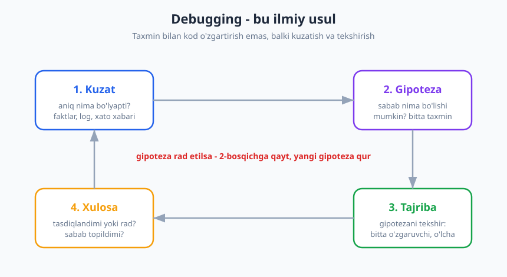
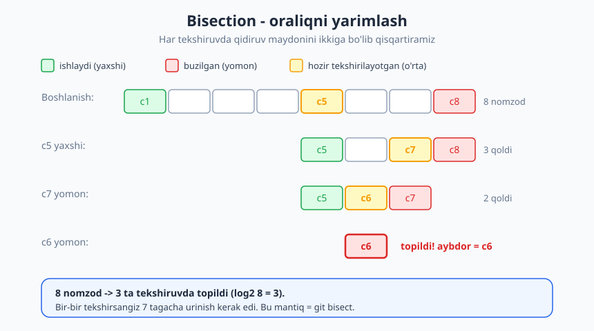
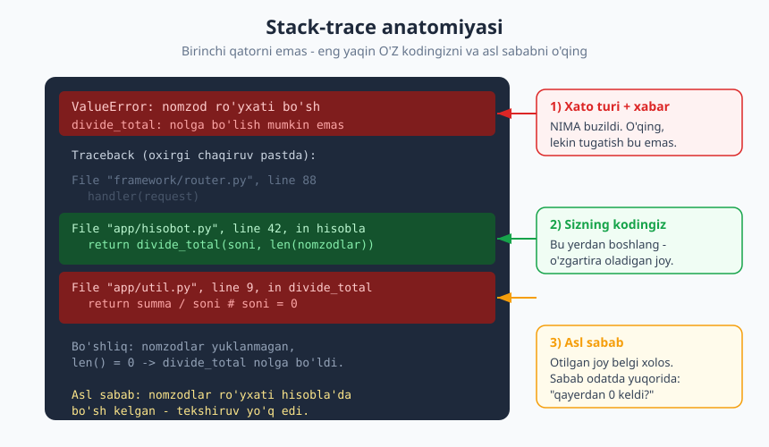

# 04 — Debugging: xatoni tizimli ovlash

[⬅️ Oldingi: 03 — Begona kodni o'qish va tushunish](./03-begona-kodni-oqish.md) · [🏠 README](./README.md) · [Keyingi: 05 — Nomlash — eng qiyin oson ish ➡️](./05-nomlash-sanati.md)

---

> **Bu bobda:** xatoni "tasodifan tuzatish"dan voz kechib, uni **ilmiy usul** bilan ovlashni o'rganamiz: kuzat → gipoteza → tajriba → xulosa. Xatoni barqaror **takrorlash** (reproduce), muammoni **izolatsiya** qilish (bisection), **stack-trace**ni to'g'ri o'qish, log va debugger orasida tanlash, keng tarqalgan tuzoqlarni tanish va — eng muhimi — tuzatgandan keyin *nega yuz berdi*ni tushunib, regresiya testi yozish.
>
> **Halollik / Eslatma:** bu yerdagi usul — universal, lekin har bir maslahat *kontekstga bog'liq*: ba'zan tez `print` qo'yib chiqish, debugger ochishdan ko'ra to'g'ri. Asosiy fikr metod bo'lib qoladi: **taxmin bilan emas, tekshirilgan fakt bilan ishlang**. Ko'p misol psevdokod yoki qisqa snippet — g'oya har qanday tilda bir xil.

---

## Debugging — bu tasodif emas, ilmiy usul

Junior dasturchi xato ko'rganda nima qiladi? Ko'pincha — kodga tikiladi, "shu yer shubhali ko'rinadi" deb bir qatorni o'zgartiradi, ishga tushiradi, ishlamasa boshqasini o'zgartiradi. Bu — **qimor**. Ba'zan omad keladi, lekin kod tobora chigallashadi, va siz nega tuzatilganini (yoki nega buzilganini) bilmaysiz.

Professional dasturchi boshqacha ishlaydi. U debuggingni **ilmiy usul** sifatida ko'radi:

1. **Kuzat** — aniq nima bo'lyapti? Faktlarni yig'.
2. **Gipoteza** — sabab nima bo'lishi mumkin? Bitta aniq taxmin tuz.
3. **Tajriba** — gipotezani tekshir: bitta narsani o'zgartir, natijani o'lcha.
4. **Xulosa** — gipoteza tasdiqlandimi yoki rad etildimi? Rad bo'lsa — yangi gipoteza.



Bu sikl. Gipoteza rad etilsa, siz xafa bo'lmaysiz — bu ham natija: endi *bir sabab kamaydi*. Har aylanish qidiruv maydonini toraytiradi.

### ❌ Taxmin bilan tuzatish (anti-misol)

> Foydalanuvchi: "Profil sahifasi ba'zida bo'sh chiqyapti."
>
> Dasturchi (o'ylamasdan): "Ehtimol kesh muammosi." → keshni o'chiradi. Yordam bermaydi.
> "Unda bazadir." → ulanishni qayta yozadi. Yordam bermaydi.
> "Balki frontend." → bir necha `if`ni o'zgartiradi. Tasodifan "to'g'rilanadi"...
> Bir hafta o'tib xato qaytadi, chunki **asl sabab hech qachon topilmagan** — faqat simptom bekitilgan edi.

### ✅ Tizimli yondashuv (misol)

> **Kuzat:** "ba'zida" qachon? Loglarga qaraymiz — bo'sh sahifa faqat `user_id` mavjud, lekin `profile` qatori yo'q bo'lganda chiqadi.
> **Gipoteza:** "Ro'yxatdan o'tgan, lekin profilni to'ldirmagan foydalanuvchilarda `profile` `null` bo'lib, sahifa uni tekshirmay render qilyapti."
> **Tajriba:** profilsiz test foydalanuvchi yaratamiz → sahifa bo'sh chiqadi. **Takrorlandi!**
> **Xulosa:** sabab — `null profile`ni ko'rmaslik. Tuzatish: bo'sh holatni ochiq ishlash (`if profile is None: ...`). Endi *nega* va *qachon* ekanini bilamiz.

Birinchi yo'l bir hafta vaqt yedi va ishonchsiz natija berdi. Ikkinchisi 30 daqiqada *aniq* sababga olib bordi. Farq — aql emas, **metod**.

---

## Takrorlash (reproduce) — debuggingning poydevori

> Agar xatoni **ishonchli takrorlay olmasangiz, uni tuzata olmaysiz** — chunki tuzatdingizmi yoki shunchaki xato yashirindimi, bilmaysiz.

Birinchi vazifa — har safar xatoni keltirib chiqaradigan **barqaror retsept** topish. "Ba'zan bo'ladi" — bu hali debugging emas, bu hali kuzatuv. Aniq qadamlarga aylantiring:

- **Aniq kirish:** qaysi ma'lumot, qaysi foydalanuvchi, qaysi tugma?
- **Aniq muhit:** qaysi brauzer, qaysi versiya, lokal yoki prod?
- **Aniq ketma-ketlik:** "A qilib, keyin B qilsam, har doim C xato chiqadi."

Keyin retseptni **minimallashtiring** (minimal takror). Keraksiz qadamlarni birma-bir olib tashlang, xato hali ham chiqadimi tekshiring. Ko'pincha 12 qadamli retsept 2 qadamga tushadi — va o'sha 2 qadam allaqachon sababga ishora qiladi.

```text
Boshlang'ich retsept (12 qadam):
  login -> dashboard -> filter -> sahifa 2 -> eksport -> ... -> XATO

Minimallashtirilgan (2 qadam):
  filterda sana bo'sh -> eksport -> XATO
  => sabab "bo'sh sana" atrofida, qolgani shovqin edi.
```

Agar xato faqat prodda chiqib, lokalda chiqmasa — bu ham fakt: muammo **muhit farqida** (ma'lumot hajmi, konfiguratsiya, vaqt zonasi, parallel so'rovlar). "Menda ishlaydi" javobi emas, balki *savol*: "menda nega ishlaydi, prodda nega yo'q?"

> **Trade-off:** ba'zi xatolar tabiatan **noaniq** (intermittent) — poyga holati (race condition), tarmoq, vaqtga bog'liq. Bularni 100% takrorlash qiyin. Bunday holatda maqsad — ehtimollikni oshirish (yukni ko'paytirish, sun'iy kechikish qo'shish, parallel ishga tushirish) va loglarni qalinlashtirish. Ba'zan barqaror takror o'rniga "10 martadan 7 marta" ham yetarli ishboshi bo'ladi.

---

## Izolatsiya — muammoni torlash (bisection)

Xato qayerdaligini bilmaganda, eng kuchli qurol — **ikkiga bo'lib izlash** (binar qidiruv). Kod yoki tarixning yarmini "o'chirib", muammo qaysi yarmida ekanini aniqlaysiz, keyin yana yarmini — toki bitta nuqtaga qadar.



**Kod ichida bisection:** muammo katta funksiyada bo'lsa, o'rtasiga "men shu yergacha yetdimmi va qiymatlar to'g'rimi?" degan tekshiruv qo'ying. To'g'ri bo'lsa — xato pastki yarmida; noto'g'ri bo'lsa — yuqori yarmida. Yarmni tashlab, qolganini yana yarmlang.

**Tarix ichida bisection:** "kecha ishlardi, bugun yo'q" bo'lsa, qaysi **commit** buzganini topish kerak. Bir-bir tekshirish o'rniga oralining o'rtasidagi commitni sinab ko'rasiz:

```text
Ma'lum:  c1 yaxshi ... c100 yomon
Sinov 1: c50 -> yaxshi  => aybdor 51..100 oralig'ida
Sinov 2: c75 -> yomon   => aybdor 51..75 oralig'ida
Sinov 3: c63 -> yaxshi  => aybdor 64..75 ...
... ~7 qadamda 100 commitdan bittasi topiladi (log2 100 ~ 7)
```

Bu aynan `git bisect` qiladigan ish: siz "yaxshi" va "yomon" chegarani belgilaysiz, u har safar o'rtadagi commitni beradi, siz "yaxshi/yomon" deysiz, u aybdor commitni topadi. Versiya nazoratining bu va `git blame` kabi tergov vositalari haqida [Git & GitHub](../git-github/README.md) kitobida batafsil.

> **Trade-off:** bisection commit tarixingiz **ishlaydigan, atomik** bo'lsa eng kuchli. Agar commitlar yirik, aralash va yarmi "buzuq holat"da bo'lsa, har sinov noaniq natija beradi. Bu — toza commit madaniyatining yana bir foydasi (bu haqda [README mundarijasidagi 14-bob](./README.md) — jamoaviy kod oqimi).

### Real loyihada bu shunday ko'rinadi

Frilanser do'stingiz mijozga onlayn-do'kon yasab bergan. Bir kun mijoz yozadi: "to'lov sahifasi ishlamayapti, mijozlarim ketib qolyapti!" Vahima. Birinchi turtki — kodga sho'ng'ib, to'lov funksiyasini ag'dar-to'ntar qilish. Lekin u to'xtab, **metodga** o'tadi:

- **Kuzat:** xato xabarini so'raydi, log'ga qaraydi — `Undefined index: region` faqat *Toshkentdan tashqari* viloyatlarda chiqyapti.
- **Takrorla:** o'zi Samarqand manzili bilan buyurtma beradi → sahifa yiqiladi. **Barqaror takror!**
- **Izolatsiya:** "kecha ishlardi" — `git bisect` bilan 3 sinovda aybdor commitni topadi: kecha "yetkazib berish narxi" funksiyasi qo'shilgan, lekin u faqat Toshkent uchun yozilgan.
- **Xulosa va tuzatish:** boshqa viloyatlar uchun standart narx qo'shadi, **regresiya testi** yozadi ("Samarqand buyurtmasi yiqilmaydi"), va o'xshash joyni qidirib — yetkazib berish hisoblanadigan yana ikki sahifani ham tuzatadi.

Bir soatda, vahimasiz, *aniq* sabab bilan yopildi. Agar u taxmin bilan ishlaganida, to'lov mantig'ini buzib, yangi xatolar qo'shgan bo'lardi. **Metod tezlikni beradi.**

---

## Xato xabari va stack-trace'ni o'qish

Yangi dasturchining eng zararli odati — **xato xabarini o'qimaslik**. Qizil matn ko'rinishi bilan vahima qilib, to'g'ri Google'ga otiladi. Holbuki javob ko'pincha aynan o'sha matnda.

Stack-trace — bu jinoyat sahnasi emas, **chaqiruvlar zanjiri**: dastur qaysi funksiyadan qaysisiga o'tib, qayerda yiqilganini ko'rsatadi.



Uni o'qish tartibi:

1. **Xato turi va xabari** (odatda yuqorida yoki pastda — tilga qarab). NIMA buzildi: `ValueError`, `NullPointerException`, `division by zero`. Bu qidiruvning boshlanishi, oxiri emas.
2. **Sizning kodingizdagi eng yaqin qator.** Trace'da kutubxona/framework qatorlari ham bo'ladi — ularni odatda o'zgartira olmaysiz. **O'z faylingizdagi** eng pastki (yoki tilga qarab eng yaqin) qatorni toping: aralashuv shu yerdan boshlanadi.
3. **Asl sabab.** Xato *otilgan* qator ko'pincha faqat **belgi**. Haqiqiy savol: "o'sha noto'g'ri qiymat (`null`, `0`, bo'sh ro'yxat) **qayerdan keldi**?" Sabab odatda traceda *yuqoriroqda*, chaqiruvchi tomonda.

```text
ValueError: nomzodlar ro'yxati bo'sh
  ...
  app/hisobot.py, 42-qator, hisobla()      <- mening kodim, shu yerdan boshlayman
      divide_total(soni, len(nomzodlar))
  app/util.py, 9-qator, divide_total()     <- xato OTILGAN joy (belgi)
      return summa / soni   # soni = 0
```

Xato `util.py`da otilgan, lekin `util.py` aybdor emas — u to'g'ri ishladi: nolga bo'lib bo'lmaydi. **Asl sabab** — `hisobla()` `nomzodlar` bo'sh kelganini tekshirmagani. `util.py`ga `if soni == 0` qo'shsangiz, simptomni bekitasiz; tuzatish kerak joy — `hisobla()`.

Ko'p tilda "panic"/"fatal" so'zi qo'rqinchli ko'rinadi, lekin u shunchaki "dastur to'xtadi" degani — sizga to'liq, halol ma'lumot beradi. Undan qo'rqmang, undan **o'qing**.

> **Eslatma:** ba'zi tillarda (mas. zanjirli istisnolarda) eng muhim sabab "Caused by:" yoki "during handling of the above" ostida bo'ladi. Trace uzun bo'lsa, **boshini ham, oxirini ham** o'qing — o'rtasidagi 40 qator framework ichki ishi bo'lishi mumkin.

---

## Asboblar: print/log vs debugger

Ikki asosiy kuzatuv usuli bor. Ular raqib emas — ikkalasini ham biling, vaziyatga qarab tanlang.

| Mezon | `print` / log | Debugger (breakpoint) |
|---|---|---|
| Tezda boshlash | Juda tez, hamma joyda ishlaydi | O'rnatish/ulash kerak |
| Holatni ko'rish | Faqat siz chiqargan narsa | **Hamma** o'zgaruvchi, chaqiruv steki |
| Vaqt bo'ylab oqim | Yaxshi (log tarixi qoladi) | Bir nuqtada to'xtaydi, qadamlab yurasiz |
| Prod / masofaviy | Log = ko'pincha yagona yo'l | Odatda imkonsiz |
| Parallel / async | Chalkash bo'lishi mumkin | Poyga holatini buzishi mumkin |
| Iz qoldirish | Tozalashni unutsangiz axlat qoladi | Iz qoldirmaydi |
| Qachon eng yaxshi | "Bu yergacha yetdimmi? qiymat nima?" | "Bu yerda atrofda *hamma narsa* qanaqa?" |

**Print/log** — eng oddiy, eng kam baholangan qurol. Lekin uni ham **aql bilan** qo'ying: shunchaki `print(x)` emas, balki *kontekstli* yorliq bilan.

```python
# ❌ Foydasiz - qaysi biri qaysi?
print(x)
print(jami)
print("here")

# ✅ Yorliqli, joyni va qiymatni aniq ko'rsatadi
print(f"[hisobla] kirish soni={soni} nomzodlar={len(nomzodlar)}")
```

**Log darajalari** print'dan ustun: ularni o'chirmasdan, *darajani* o'zgartirib boshqarasiz.

| Daraja | Qachon |
|---|---|
| `DEBUG` | Tafsilot, faqat tergovda; prodda o'chiq |
| `INFO` | Normal voqea: "buyurtma #42 yaratildi" |
| `WARNING` | G'alati, lekin halokat emas: "kesh bo'sh, qaytadan oldim" |
| `ERROR` | Operatsiya muvaffaqiyatsiz, lekin dastur tirik |
| `CRITICAL` | Dastur davom eta olmaydi |

**Debugger** — kuchini "bir nuqtada butun olamni ko'rish" beradi: breakpoint qo'yasiz, dastur o'sha yerda muzlaydi, va siz har bir o'zgaruvchini, chaqiruv stekini ko'rasiz; `step over` / `step into` bilan qatorma-qator yurasiz; `watch` bilan ma'lum ifoda qiymatini kuzatasiz; **shartli breakpoint** bilan "faqat `id == 42` bo'lganda to'xta" deysiz. Murakkab holatda (chigal holat, ko'p o'zgaruvchi) debugger 10 ta `print`dan tezroq.

> **Trade-off:** debugger har doim ham g'olib emas. Async/parallel kodda breakpoint poyga holatini *yo'qotishi* mumkin (to'xtatib turganingizda muammo yuzaga kelmaydi — "heisenbug"). Prodda yoki masofaviy konteynerda debugger ulash ko'pincha imkonsiz — u yerda **strukturali log** yagona ko'zingiz. Qoida: lokalda chuqur tergov = debugger; oqim/prod/vaqt = log.

---

## Keng tarqalgan tuzoqlar (bularni tanib oling)

Tajribali dasturchi yangidan ko'ra tezroq topadi, chunki u **shubha ro'yxatini** yoddan biladi. Eng tez-tez uchraydiganlar:

| Tuzoq | Tipik belgi | Birinchi tekshiruv |
|---|---|---|
| **Off-by-one** | Oxirgi/birinchi element tushib qoladi, `index out of range` | Sikl chegarasi: `<` mi `<=` mi? 0 dan mi 1 dan mi? |
| **Null / bo'sh** | "ba'zida" yiqiladi | Qiymat `null`/bo'sh kelishi mumkinmi? Kim to'ldiradi? |
| **Tip (type)** | `"3" + 4`, taqqoslash g'alati | Bu son mi, matn mi? Konvertatsiya qayerda? |
| **Kesh (cache)** | Eski qiymat ko'rinadi, deploydan keyin o'zgarmaydi | Kesh/CDN/brauzerni tozalab ko'r |
| **Holat (state)** | Birinchi marta ishlaydi, ikkinchisida yo'q | Global/umumiy o'zgaruvchi qoldiq holatdami? |
| **"Menda ishlaydi"** | Lokalda OK, prodda yo'q | Muhit farqi: versiya, env, ma'lumot, vaqt zonasi |

Misol — klassik off-by-one:

```text
# ❌ Oxirgi elementni o'tkazib yuboradi
i = 0
while i < len(ro'yxat) - 1:     # - 1 keraksiz
    chiqar(ro'yxat[i])
    i = i + 1

# ✅ Hammasini chiqaradi
i = 0
while i < len(ro'yxat):
    chiqar(ro'yxat[i])
    i = i + 1
```

Bu tuzoqlarning kuchi shundaki, ular **sizning taxminingizni** sinaydi: "bu qiymat hech qachon bo'sh bo'lmaydi" deb ishongan joyingiz aynan o'sha bo'sh kelyapti.

---

## Tuzatgandan keyin — ish hali tugamadi

Xato yo'qoldi — ammo bu yarim ish. Professional uchun tuzatishdan keyin uch qadam qoladi:

1. **Nega yuz berdi'ni tushun.** Faqat "endi ishlayapti" emas, balki *aniq sabab nima edi*. Tushunmasangiz, tasodifan tuzatgan bo'lishingiz mumkin — va u qaytadi.
2. **Regresiya testi yoz.** Aynan shu xatoni qayta keltiradigan test yozing va u endi *o'tishini* ko'ring. Bu test xato kelajakda **qaytmasligining** kafolati. (Test madaniyati haqida README'dagi 11-bob.)
3. **O'xshashlarini qidir.** "Bu sabab boshqa qayerda bor?" Bitta funksiya `null`ni tekshirmagani — ehtimol uning qardoshlari ham tekshirmaydi. Bitta tuzatish bilan butun bir sinfni yoping.

```text
# Regresiya testining mohiyati (psevdokod):
test "bo'sh nomzodlar bilan hisobla yiqilmaydi":
    natija = hisobla(soni=10, nomzodlar=[])   # avval bu yiqilardi
    kut(natija == 0)                           # endi 0 qaytaradi, xato yo'q
```

> **Trade-off:** har bir mayda xato uchun test yozish ham har doim oqilona emas — bir martalik skript yoki tez prototipda ortiqcha bo'lishi mumkin. Lekin **prodga chiqadigan kodda** xatoni testsiz yopish — qarz olish: u bir kun qaytadi. Qoida: xato qanchalik qimmat/ko'rinarli bo'lsa, regresiya testi shunchalik zarur.

---

## Halollik: bug — odatda sizning taxminingizda

Debuggingning eng katta haqiqati psixologik. "Bu mumkin emas, men buni allaqachon tekshirdim" degan har bir gap — yashirin gipoteza, va u ko'pincha **noto'g'ri**. Mashhur tergov qoidasi:

> "Imkonsiz" deb hisoblagan narsangizni tekshiring — bug aynan o'sha "imkonsiz" deb o'tkazib yuborgan faraz ostida yashiringan.

Kompyuter sizga yolg'on gapirmaydi. U aynan siz aytgan narsani bajaradi. Agar natija kutilganidan farq qilsa — demak sizning *kutuvingiz* (model) noto'g'ri, kod emas (kompilyator xatolari juda nodir). Shuning uchun:

- "Bu funksiya chaqirilmoqda" deb **ishonmang** — log/breakpoint bilan *isbotlang*.
- "Bu o'zgaruvchi 5 ga teng" deb **ishonmang** — chiqaring va *ko'ring*.
- "Men buni o'zgartirmadim" — `git diff` qiling, ehtimol o'zgartirgansiz (yoki branch boshqa).

Bu kamtarlik — kuchsizlik emas, **tezlik**. O'z farazlarini birinchi shubha ostiga oladigan dasturchi xatoni soatlar emas, daqiqalarda topadi.

---

## Asosiy g'oyalar (bobni qisqacha)

- **Debugging — ilmiy usul**, qimor emas: kuzat → gipoteza → tajriba → xulosa. Bitta narsani o'zgartiring, natijani o'lchang.
- **Takrorla** (reproduce) avval keladi: barqaror, **minimal** retsept bo'lmasa, tuzatganingizni isbotlay olmaysiz.
- **Izolatsiya = ikkiga bo'lib izlash:** kod ichida tekshiruv qo'yib yoki commit tarixini `git bisect` bilan yarimlab, sababni tez torlang.
- **Stack-trace'ni o'qing:** xato *otilgan* qator faqat belgi; **asl sabab** odatda yuqoriroqda, sizning kodingizda — "noto'g'ri qiymat qayerdan keldi?"
- **Print/log va debugger** — bir-birini to'ldiradi: oqim/prod uchun log, bir nuqtada chuqur tergov uchun debugger.
- **Tuzatgandan keyin:** nega yuz berdi'ni tushun, **regresiya testi** yoz, o'xshash joylarni qidir.
- **Eng ehtimolli aybdor — sizning farazingiz.** "Imkonsiz" degan joyingizni birinchi tekshiring.

---

## Mashqlar

### Oson

**1-mashq.** Quyidagi yondashuvni tartibga keltiring va nima yetishmayotganini ayting:
> "Sahifa yiqildi. Men `try/catch` qo'shdim, xatoni yutib yubordim — endi yiqilmayapti, demak tuzatildi."

**2-mashq.** Ushbu stack-trace'da (psevdo) qaysi qatordan tergovni boshlaysiz va asl sababni qayerdan qidirasiz?

```text
TypeError: 'NoneType' uchun 'len' ishlamaydi
  framework/view.py, 120, render()
  app/sahifa.py, 31, korsat()
      jami = len(buyurtmalar)
  app/repo.py, 8, buyurtmalarni_ol()
      return None   # baza topmasa None qaytaradi
```

**3-mashq.** Quyidagi siklda bug bor. Tuzoq turini ayting va tuzating:

```text
# 1..n yig'indisini hisoblash
yigindi = 0
i = 1
while i < n:
    yigindi = yigindi + i
    i = i + 1
chiqar(yigindi)   # n=5 da 10 chiqdi, 15 kutilgandi
```

### O'rta

**4-mashq.** Sizga shunday xabar keldi: "Eksport tugmasi ba'zan ishlamaydi." Bu hali debugging uchun yaroqsiz. **Takrorlanadigan retsept** olish uchun mijozdan/o'zingizdan 5 ta aniq savol yozing.

**5-mashq.** 200 ta commitli loyihada "qidiruv 3 kun avval ishlardi, bugun bo'sh natija qaytaryapti" deyilmoqda. `git bisect` mantiqi bilan necha sinovda aybdor commitni topasiz va birinchi 2 sinovni qaysi commitlarda qilasiz (taxminan)? Jarayonni yozing.

**6-mashq.** Quyidagi snippet "menda ishlaydi, prodda yo'q" deydi. Kamida 3 ta **muhit farqi** gipotezasini yozing va har biri uchun bitta tekshiruv tajribasini ayting.

```text
narx = float(soulrov.get("narx"))     # foydalanuvchi kiritgan matn
chegirma = narx * KOEFFITSIENT          # KOEFFITSIENT env'dan o'qiladi
chiqar(f"Yakuniy: {narx - chegirma}")
```

### Qiyin

**7-mashq.** Bu kod 100 martadan ~7 marta noto'g'ri yig'indi beradi (qolganda to'g'ri). Tuzoq turini ayting, **nega noaniq** (intermittent) ekanini tushuntiring va takrorlash ehtimolini oshirish uchun strategiya bering:

```text
jami = 0                       # umumiy (global) o'zgaruvchi
function ishla(buyurtma):
    global jami
    vaqtinchalik = jami        # o'qidi
    vaqtinchalik = vaqtinchalik + buyurtma.summa
    jami = vaqtinchalik        # yozdi
# ishla() bir vaqtda 8 ta oqimda (thread) chaqiriladi
```

**8-mashq.** Bir bug topdingiz va tuzatdingiz: `hisobla()` bo'sh ro'yxatda yiqilardi, endi `0` qaytaradi. "Tuzatgandan keyingi 3 qadam"ni ushbu holatga to'liq qo'llang: (a) nega yuz berganini bir jumlada, (b) regresiya testini psevdokodda, (c) o'xshash joylarni qanday topishingizni yozing.

<details markdown="1">
<summary>Yechimlar</summary>

### 1-mashq yechimi
Bu **simptomni bekitish**, tuzatish emas — klassik anti-misol. Xato yutib yuborildi, lekin *nega* yiqilgani noma'lum; ma'lumot endi jimgina noto'g'ri bo'lishi mumkin. Yetishmayotgani: **kuzatuv** (xabar/trace'ni o'qish), **takrorlash**, **gipoteza** va **asl sabab**. To'g'ri yo'l: avval nega `len(None)` (yoki nima bo'lsa) yuzaga kelganini topib, *o'sha sababni* tuzatish; `try/catch` faqat ataylab, ma'noli boshqaruv uchun ishlatiladi.

### 2-mashq yechimi
Tergovni **`app/sahifa.py`, 31-qator**dan boshlaysiz — bu sizning kodingizdagi eng yaqin joy (`framework/view.py` framework ichi). Xato shu yerda *otilgan* (`len(buyurtmalar)`, `buyurtmalar` `None`). Lekin **asl sabab pastroqda**: `app/repo.py`, 8-qator `return None` — baza topmaganda `None` qaytaryapti. Tuzatish 31-qatordagi `len`da emas, balki: `buyurtmalarni_ol()` `None` o'rniga bo'sh ro'yxat qaytarsin, yoki `korsat()` `None` holatini ochiq ishlasin.

### 3-mashq yechimi
**Off-by-one.** Sikl sharti `i < n` oxirgi qiymat (`i = n`)ni qo'shmaydi: `n=5` da `1+2+3+4 = 10`. To'g'risi `i <= n`:

```text
while i <= n:
    yigindi = yigindi + i
    i = i + 1
# endi 1+2+3+4+5 = 15
```

### 4-mashq yechimi
Namuna savollar (maqsad — "ba'zan"ni barqaror retseptga aylantirish):
1. Tugma bosilganda **aniq nima** bo'ladi — hech narsa, xato xabari, yoki bo'sh fayl?
2. Qaysi **ma'lumotda** sodir bo'ladi — katta jadval, bo'sh filtr, ma'lum sana oralig'i?
3. Qaysi **brauzer/qurilma va versiya**?
4. **Har safarmi** yoki faqat birinchi/keyingi bosishda (holat qoldig'i)?
5. Buni **takrorlay olasizmi** — ekran yozuvi yoki aniq qadamlar bera olasizmi?
Maqsad — javoblardan minimal takror retseptini yig'ish.

### 5-mashq yechimi
200 commit uchun ~`log2(200) ≈ 8` sinov yetadi. Mantiq: "3 kun avval yaxshi" commitni `good`, hozirgisini `bad` deb belgilaysiz. Birinchi sinov — oralining o'rtasi, ya'ni **~100-commit**; yaxshi chiqsa aybdor 101..200 da, yomon chiqsa 1..100 da. Ikkinchi sinov — qolgan oralining o'rtasi (mas. **~150** yoki **~50**). Har sinovda "qidiruv bo'sh qaytaryaptimi?" deb tekshirib `good`/`bad` deysiz; `git bisect` o'rtani avtomatik beradi va oxirida aybdor commitni nomlaydi. (Avtomatlashtirsa, `git bisect run <skript>` bilan sinovni skriptga topshirib bo'ladi — [Git & GitHub](../git-github/README.md).)

### 6-mashq yechimi
Gipotezalar va tajribalar (har biri **bitta** farazni tekshiradi):
1. **`narx` bo'sh/noto'g'ri matn** kelyapti (prodda foydalanuvchi `""` yoki `"12,5"` kiritgan) → `float("")` yiqiladi. *Tajriba:* `narx`ni konvertatsiyadan oldin loglab, bo'sh/vergulli qiymatni sinab ko'r.
2. **`KOEFFITSIENT` env prodda boshqa yoki yo'q** (lokalda `0.1`, prodda o'rnatilmagan/`None`/`"10%"`). *Tajriba:* dastur boshida `KOEFFITSIENT` qiymati va turini logla.
3. **Lokal va sozlamasi (mas. butun son bo'linishi, vaqt zonasi, til/locale `,` vs `.`)** farqi. *Tajriba:* aynan prod kirishi bilan lokalda qayta ishga tushir; locale sozlamasini solishtir.
Asosiy g'oya: "menda ishlaydi" — javob emas, *gipoteza*; farqni o'lchab tasdiqlash kerak.

### 7-mashq yechimi
**Poyga holati (race condition)** — holat tuzog'ining parallel ko'rinishi. `jami`ni "o'qi → qo'sh → yoz" uch qadam atomik emas: ikki oqim bir vaqtda *eski* `jami`ni o'qib, ikkalasi ham ustiga yozsa, bitta qo'shilish **yo'qoladi** (lost update). **Nega noaniq:** xato faqat ikki oqim aynan o'sha tor oynada to'qnashganda yuzaga keladi — ko'p hollarda ular bir-biriga tegmaydi, shuning uchun ~7/100. **Takrorlash strategiyasi:** oqimlar sonini va iteratsiyalarni keskin oshir (mas. 1000 oqim ko'p marta), "o'qi" va "yoz" orasiga sun'iy kichik kechikish (`sleep`) qo'yib oynani kengaytir, ko'p marta ishga tushirib statistik kut. Yechim — qulf (lock) yoki atomik amal yoki har oqimga alohida yig'indi keyin qo'shish.

### 8-mashq yechimi
(a) **Nega:** `hisobla()` ro'yxat uzunligiga bo'lishdan oldin uning **bo'sh emasligini tekshirmagan** — bo'sh ro'yxat nolga bo'lishga olib keldi.
(b) **Regresiya testi:**

```text
test "hisobla bo'sh ro'yxatda yiqilmaydi":
    natija = hisobla(soni=10, nomzodlar=[])
    kut(natija == 0)        # avval xato edi, endi 0
```

(c) **O'xshash joylar:** kod bazasida `len(...)`/`/`/`[0]` kabi "bo'sh kelishi mumkin" amallarni qidiring (`grep` yoki IDE bo'ylab qidiruv); ayniqsa shu repozitoriydan ma'lumot oladigan boshqa funksiyalarni ko'zdan kechiring — ehtimol ular ham `null`/bo'shni tekshirmaydi. Bitta tuzatish o'rniga butun naqshni yoping.

</details>

---

[⬅️ Oldingi: 03 — Begona kodni o'qish va tushunish](./03-begona-kodni-oqish.md) · [🏠 README](./README.md) · [Keyingi: 05 — Nomlash — eng qiyin oson ish ➡️](./05-nomlash-sanati.md)
