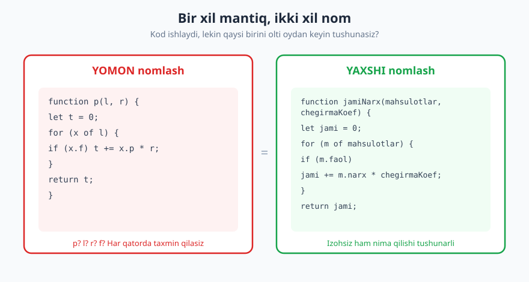
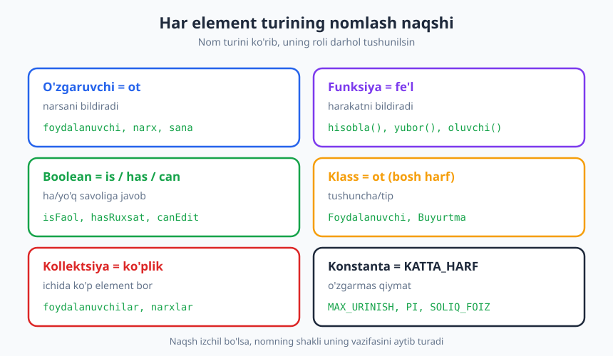
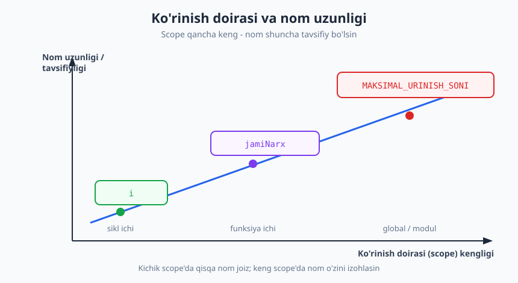

# 05 — Nomlash — eng qiyin oson ish

[⬅️ Oldingi: 04 — Debugging: xatoni tizimli ovlash](./04-debugging-tizimli-ovlash.md) · [🏠 README](./README.md) · [Keyingi: 06 — Funksiyalar, modullik va kod tuzilishi ➡️](./06-funksiyalar-modullik.md)

---

> **Bu bobda:** nega nomlash — soddaligiga qaramay — dasturlashning eng qiyin ishlaridan biri ekanini; **niyatni ochuvchi** nom qanday bo'lishini; o'zgaruvchi, funksiya, boolean, klass, konstanta va kollektsiyalarni nomlash naqshlarini; eng keng tarqalgan nomlash anti-naqshlarini; izchillik va domen tilini; nom uzunligi bilan ko'rinish doirasi orasidagi kelishuvni o'rganamiz. Maqsad — kodingizni o'qiydigan keyingi odam (ko'pincha bu olti oydan keyingi siz) uni tez tushunsin.
>
> **Halollik / Eslatma:** "to'g'ri" nom ko'p hollarda subjektiv — ikkita tajribali muhandis bitta o'zgaruvchini turlicha nomlashi mumkin va ikkalasi ham yetarlicha yaxshi bo'lishi mumkin. Bu yerdagi qoidalar — qonun emas, **kuchli sukut bo'yicha (default)** tavsiyalar. Yagona haqiqiy mezon: keyingi o'quvchi nomni ko'rib, izlanmasdan tushunadimi? Refactoring paytida nomni yaxshilash — kuchsizlik emas, normal va sog'lom amaliyot.

---

## Nega nomlash qiyin?

Dasturchilar orasida mashhur hazil bor:

> "Kompyuter fanida atigi ikkita qiyin narsa bor: kesh invalidatsiyasi (cache invalidation), nomlash, va birga ketgan xatolar (off-by-one error)."

Hazilning o'zi off-by-one xato bilan tugaydi — lekin asosiy fikr jiddiy: **nomlash haqiqatan ham qiyin.** Sirtdan u juda oson ko'rinadi. Faylni ochasiz, o'zgaruvchiga `x` deb yozasiz, kod ishlaydi, ketdik. Aynan shu yerda tuzoq bor: noto'g'ri nom kodni **buzmaydi** — u shunchaki kelajakda kimningdir vaqtini o'g'irlaydi. Kompilyator yomon nomdan shikoyat qilmaydi, testlar yiqilmaydi, mijoz sezmaydi. Narxni faqat keyingi o'quvchi to'laydi.

Nomlash qiyin, chunki **yaxshi nom topish — bu tushunchani aniq idrok etish demak**. Agar siz biror narsaga aniq nom bera olmasangiz, ko'pincha bu o'sha narsani o'zingiz ham to'liq tushunmaganingizdan dalolat. Yomon nom ko'pincha chalkash fikrning belgisi. Shuning uchun nomlash ustida ishlash — bu nafaqat kosmetika, balki **tafakkur mashqi**.

Va eng muhimi: kod **ko'proq o'qiladi, kamroq yoziladi** (buni [03-bob](./03-begona-kodni-oqish.md)da batafsil ko'rdik). Siz bir o'zgaruvchini bir marta nomlaysiz, lekin uni o'nlab marta o'qiysiz — siz va sizdan keyingilar. Nomga sarflagan 30 soniyangiz keyinchalik soatlab tejaladigan vaqtga aylanadi.



Yuqoridagi ikkala funksiya **bir xil ishni** qiladi va **bir xil tezlikda** ishlaydi. Lekin chap tomondagini tushunish uchun har bir harfni boshingizda "dekodlash" kerak: `p` nima? `l`? `r`? `f`? O'ng tomonda esa kod o'zini o'zi tushuntiradi. Mana shu farq — nomlashning butun mohiyati.

---

## Niyatni ochuvchi nom

Yaxshi nomning oltin qoidasi — **niyatni ochish (intention-revealing)**. Nom uchta savolga javob berishi kerak:

1. **Bu nima?** (o'zgaruvchi nimani saqlaydi)
2. **Nega bu bor?** (nima maqsadda kerak)
3. **Qanday ishlatiladi?** (qanday qiymatlar bo'ladi)

Agar nomingiz bu savollarga javob bersa, izoh (comment) yozishga ehtiyoj kamayadi. Ushbu bobning bitta katta g'oyasi: **yaxshi nom = yarim hujjat.**

❌ Niyatni yashiradigan kod:

```python
# bu funksiya nima qiladi? d nima? Tushunish uchun kodni o'qish shart
def get(d):
    r = []
    for x in d:
        if x[3] == 0:
            r.append(x)
    return r
```

✅ Niyatni ochadigan kod:

```python
# nom va tuzilish o'zi gapiradi
def faolBuyurtmalarniTanla(buyurtmalar):
    faollar = []
    for buyurtma in buyurtmalar:
        if buyurtma.holati == HOLAT_FAOL:
            faollar.append(buyurtma)
    return faollar
```

E'tibor bering: ikkinchi variantda biz **bironta ham izoh yozmadik**, lekin kod birinchisidan ancha tushunarli. `x[3] == 0` degan sirli shart `buyurtma.holati == HOLAT_FAOL`ga aylandi — endi `3` indeks nima ekanini va `0` qiymat nimani anglatishini eslab qolish shart emas.

Klassik misol — `d` o'zgaruvchisi. U "days" (kunlar)ni anglatishi mumkin, lekin buni faqat siz bilasiz:

| ❌ Yashirin | ✅ Ochiq |
|---|---|
| `d` | `kunlar` |
| `d` | `otganKunlar` |
| `d` | `tugashgachaQolganKunlar` |
| `d` | `oxirgiKirishdanBeriKunlar` |

Bir harf `d` o'rniga aniq nom tanlash — bu kodni o'qiyotgan odamning miyasidagi "bu nima edi?" savolini o'chiradi. Xuddi shunday, `tmp` o'rniga `vaqtinchaliqSavat` yozish — qaysi vaqtinchaliq narsa ekanini darhol aytib beradi.

> **Trade-off:** niyatni ochish foydali, lekin haddan oshmang. `tugashgachaQolganKunlarSoniIntegerSifatida` — bu allaqachon ortiqcha. Nom yetarlicha tavsifiy bo'lsin, lekin o'qishni qiyinlashtiradigan darajada uzun emas. "Yetarli"ning chegarasi — ko'rinish doirasiga bog'liq (pastda ko'ramiz).

---

## Element turlariga ko'ra nomlash naqshlari

Kodingizdagi har bir element turining o'z nomlash naqshi bor. Bu naqshlar izchil bo'lsa, nomning **shaklini** ko'rib, uning **rolini** darhol tushunasiz — funksiyami yoki o'zgaruvchimi, ha/yo'q qiymatmi yoki ro'yxatmi.



### O'zgaruvchi — ot

O'zgaruvchi biror **narsani** saqlaydi, shuning uchun u **ot** bo'lishi kerak: `foydalanuvchi`, `narx`, `xabar`, `joriySana`.

### Funksiya/metod — fe'l

Funksiya biror **harakatni** bajaradi, shuning uchun u **fe'l** (yoki fe'lli ibora) bilan boshlanishi kerak:

```js
// ✅ harakatni bildiradi
hisoblaJami()
yuborXabar()
saqlaFoydalanuvchi()
toplaMablag()

// ❌ harakat emas, tushunarsiz
jami()
xabar2()
process()   // nimani process qiladi?
```

Qiymat qaytaradigan funksiyalar ko'pincha `ol` (get) yoki savol shaklida nomlanadi: `oluvchiNarx()`, `toplaSoni()`.

### Boolean — savol (is / has / can)

Boolean — bu **ha/yo'q savoliga javob**. Shuning uchun nom savol shaklida bo'lsa eng aniq bo'ladi. Ko'p tillarda bu uchun `is`, `has`, `can`, `should` prefikslari ishlatiladi:

```js
// ✅ o'qiganda "rost yoki yolg'on" ekani aniq
if (isFaol) ...
if (hasRuxsat) ...
if (canEdit) ...
if (foydalanuvchiTasdiqlangan) ...

// ❌ ot, boolean ekani noaniq
if (faol) ...      // faol nima? obyektmi, sonmi, boolmi?
if (status) ...    // status hatto string ham bo'lishi mumkin
```

> **Eslatma:** inkorni boolean nomiga "yopib qo'ymang". `if (!notReady)` — bu ikki marta o'ylashga majbur qiladi. Ijobiy nom tanlang: `if (tayyor)`.

### Klass / tip — ot (bosh harf bilan)

Klass biror **tushunchani** ifodalaydi va ko'pincha katta bosh harf bilan boshlanadi (PascalCase): `Foydalanuvchi`, `Buyurtma`, `To‘lovXizmati`. Klass nomida `Manager`, `Data`, `Info`, `Processor` kabi ma'nosiz qo'shimchalardan qoching (pastda batafsil).

### Konstanta — KATTA_HARF

O'zgarmas qiymatlar an'anaviy ravishda KATTA_HARF bilan, so'zlar ostki chiziq bilan ajratilib yoziladi: `MAKSIMAL_URINISH_SONI`, `SOLIQ_FOIZI`, `STANDART_VAQT_TUGASHI`. Bu **sehrli sonlarni** (magic numbers) yo'qotadi:

```python
# ❌ 3 nima? Nega 3? Boshqa joyda yana 3 bo'lsa, bog'liqmi?
if urinishlar > 3:
    blokla()

# ✅ niyat aniq, bir joyda o'zgartiriladi
MAKSIMAL_URINISH_SONI = 3
if urinishlar > MAKSIMAL_URINISH_SONI:
    blokla()
```

### Kollektsiya — ko'plik

Ro'yxat, massiv, to'plam ichida bir nechta element bor — nom **ko'plikda** bo'lsin: `foydalanuvchilar`, `narxlar`, `xabarlar`. Sikl ichida bittasi — birlikda:

```js
for (const foydalanuvchi of foydalanuvchilar) { ... }
for (const buyurtma of buyurtmalar) { ... }
```

Bu kichik naqsh kodni jonli tilday o'qiladigan qiladi: "har bir foydalanuvchi uchun foydalanuvchilar ro'yxatidan...".

---

## Nomlash anti-naqshlari

Yomon nomlarning aksariyati bir nechta takrorlanuvchi naqshga tushadi. Ularni tanib oling — keyin o'zingizda payqaganda to'xtab, yaxshilaysiz.

### 1. Ma'nosiz "shovqin" so'zlar

`data`, `info`, `manager`, `handler`, `processor`, `temp`, `value`, `object`, `item` — bu so'zlar deyarli hech narsa aytmaydi, chunki **har qanday** narsa "data" yoki "manager" bo'lishi mumkin.

```js
// ❌ uchta "Manager" — qaysi biri nima qiladi?
userManager, dataManager, infoManager

// ✅ aniq mas'uliyat
foydalanuvchiRoyxati, tolovHisoblagich, sessiyaSaqlovchi
```

`userData` va `user` orasida farq bormi? Ko'pincha yo'q — `Data` shunchaki ortiqcha. `getUserData()` o'rniga `getUser()` yetadi.

### 2. Yolg'on nom (xato ma'lumot beruvchi)

Eng xavfli anti-naqsh — nom **noto'g'ri** narsani aytadi:

```python
# ❌ nom "ro'yxat" deydi, lekin aslida lug'at (dict)
foydalanuvchilarRoyxati = {"oqil": 25, "laylo": 30}

# ❌ nom "faol" deydi, lekin aslida o'chirilganlarni qaytaradi
def faolFoydalanuvchilar():
    return [u for u in users if u.ochirilgan]
```

Yolg'on nom yo'q nomdan **battarroq**, chunki o'quvchi unga ishonadi va xato qiladi. Nomni o'zgartirgan vaqtda mazmun ham mosligini tekshiring.

### 3. Kodlangan prefikslar (Hungarian notation)

Bir paytlar tipni nomga "kodlash" modda bo'lgan: `strIsm`, `iSoni`, `arrFoydalanuvchilar`, `b_faol`. Bugun bu **anti-naqsh** hisoblanadi — zamonaviy IDE tipni o'zi ko'rsatadi, va tip o'zgarsa nom yolg'onga aylanadi (`strIsm` keyin songa aylansa-chi?).

```js
// ❌ Hungarian — ortiqcha "shovqin"
let strIsm = "Oqil";
let iYosh = 25;
let arrBuyurtmalar = [];

// ✅ toza
let ism = "Oqil";
let yosh = 25;
let buyurtmalar = [];
```

### 4. Qisqartma jumboq

`calcTtlAmt`, `usrMgr`, `procReq`, `tmpVrbl` — bu o'qiyotgan odamni har safar jumboq yechishga majbur qiladi. Umumiy qabul qilingan qisqartmalar (`id`, `url`, `html`, `db`, `max`, `min`) joiz, lekin o'zingiz o'ylab topgan qisqartmadan qoching.

| ❌ Jumboq | ✅ Toza |
|---|---|
| `calcTtlAmt` | `hisoblaJamiSumma` |
| `usrMgr` | `foydalanuvchiXizmati` |
| `procReq` | `sorovniQaytaIshla` |
| `tmpVrbl` | `vaqtinchaliqQiymat` |
| `n` (funksiya argumenti) | `soni` yoki `nechta` |

### 5. Bir-biriga juda o'xshash nomlar va raqamli ketma-ketlik

`foydalanuvchi`, `foydalanuvchi1`, `foydalanuvchi2`, `foydalanuvchiNew`, `x2`, `data2` — bu nomlar bir-biridan **farqni aytmaydi**, faqat "boshqasi" ekanini aytadi. Aniq farqni nomda ifodalang: `joriyFoydalanuvchi` vs `yangilanganFoydalanuvchi`.

---

## Izchillik: bir tushuncha = bir so'z

Loyihada bitta tushunchani **doim bir xil so'z** bilan atang. Eng ko'p uchraydigan tartibsizlik — bir xil harakat uchun turli fe'llar ishlatish:

```js
// ❌ uchta xil so'z, uchta xil narsa deb o'ylaysiz — aslida hammasi "olish"
getUser()
fetchOrder()
retrieveProduct()

// ✅ bitta tushuncha = bitta so'z
getUser()
getOrder()
getProduct()
```

Aksincha ham xato: bitta so'zni **ikki xil ma'noda** ishlatmang. Agar `add()` bir joyda "ro'yxatga element qo'shish", boshqa joyda "ikki sonni qo'shish" bo'lsa — o'quvchi chalkashadi. Ikkinchisiga `yigindi()` deb boshqa nom bering.

Bu izchillik freelance va jamoa loyihalarida ayniqsa muhim. Tasavvur qiling: O'zbekistondagi 4 kishilik jamoa loyiha ustida ishlaydi. Biri `olib(`, ikkinchisi `get`, uchinchisi `fetch`, to'rtinchisi `yukla` ishlatadi. Olti oydan keyin kod bazasi bo'ylab "ma'lumotni olish" funksiyasini qidirish dahshatga aylanadi. Shuning uchun jamoalar ko'pincha **lug'at** (glossary) tuzadi.

### Domen tili (ubiquitous language)

Eng kuchli nomlash strategiyasi — **domen tilidan** foydalanish. Agar biznes "buyurtma", "yetkazib berish", "chegirma" desa, kodda ham aynan shu so'zlar bo'lsin (`buyurtma`, `yetkazish`, `chegirma`), o'zingiz o'ylab topgan `record`, `transfer`, `reduction` emas. Bu kodni biznes tili bilan bog'laydi va dasturchi hamda mijoz orasidagi muloqotni osonlashtiradi. (Bu g'oya [Dasturlash arxitekturasi](../arxitektura/README.md) kitobida Domain-Driven Design kontekstida chuqurroq ochiladi.)

---

## Uzunlik kelishuvi: scope va tavsifiylik

Nom qancha uzun bo'lishi kerakligi bitta omilga juda bog'liq: **ko'rinish doirasi (scope)** — o'zgaruvchi qancha keng "ko'rinadi" va qancha uzoq yashaydi.



Qoida sodda: **scope qancha keng — nom shuncha tavsifiy bo'lsin.**

- **Kichik scope** (sikl hisoblagichi, qisqa lambda) — qisqa nom joiz. `for (let i = 0; ...)` da `i` mutlaqo normal, chunki uning ko'rinish doirasi atigi bir necha qator. Bu yerda `iteratsiyaHisoblagichi` ortiqcha shovqin bo'lardi.
- **O'rta scope** (funksiya ichidagi o'zgaruvchi) — to'liq, lekin qisqa nom: `jami`, `natija`, `joriyFoydalanuvchi`.
- **Keng scope** (global o'zgaruvchi, modul-darajadagi konstanta, ommaviy API) — eng tavsifiy nom: `MAKSIMAL_URINISH_SONI`, `STANDART_TOLOV_USULI`.

```js
// ✅ kichik scope — qisqa joiz
for (let i = 0; i < n; i++) { jami += narxlar[i]; }

// ✅ keng scope — tavsifiy shart
export const STANDART_SESSIYA_DAVOMIYLIGI_DAQIQA = 30;

// ❌ keng scope, lekin qisqa va sirli nom
export const t = 30;   // t nima? Daqiqami, soniyami, sonmi?
```

| Scope | Misol | Nom uslubi | Yaxshi misol |
|---|---|---|---|
| Sikl ichi (bir necha qator) | `for` hisoblagich | bir-ikki harf joiz | `i`, `j`, `x` |
| Lambda/qisqa funksiya argumenti | `map(u => u.ism)` | qisqa, kontekstli | `u`, `el` |
| Funksiya ichidagi mahalliy o'zgaruvchi | `let jami` | qisqa-to'liq ot | `jami`, `natija` |
| Funksiya/metod nomi | ommaviy API | tavsifiy fe'l | `hisoblaOylikMaosh` |
| Modul/global konstanta | sozlama | to'liq tavsifiy | `MAKSIMAL_FAYL_HAJMI` |

> **Trade-off:** "kichik scope'da qisqa nom" qoidasi qulaylik beradi, lekin uni suiiste'mol qilmang. Agar sikl tanasi 30 qator bo'lsa, u "kichik scope" emas — u yerda `i` o'rniga `qatorIndeksi` yaxshiroq. Va agar tilingiz/jamoangiz konventsiyasi har doim to'liq nom talab qilsa (mas. ba'zi korxona kod bazalarida), izchillik shaxsiy didingizdan ustun turadi.

---

## Til va imlo: ingliz tilimi yoki ona til?

Bu — ko'p o'zbek dasturchilarini o'ylantiradigan amaliy savol: kodni inglizcha nomlash kerakmi yoki o'zbekcha? Halol javob — **yagona "to'g'ri" javob yo'q**, lekin bir nechta mulohaza bor:

- **Inglizcha** — global standart. Kalit so'zlar (`if`, `for`, `class`) baribir inglizcha; kutubxonalar, hujjatlar, Stack Overflow — hammasi inglizcha. Agar kodingizni xalqaro jamoa o'qishi mumkin bo'lsa yoki ochiq kodga ulashsangiz — inglizcha tanlang.
- **Ona til** — domen tushunchalari mahalliy bo'lsa (mas. O'zbekiston soliq tizimi, mahalliy biznes atamalari) ba'zan o'zbekcha aniqroq. Lekin transliteratsiya (`buyurtma`, `mahsulot`) tartibsiz bo'lishi mumkin: kimdir `mahsulot`, kimdir `mahsulotlar`, kimdir `tovar` yozadi.
- **Aralashtirmang.** Eng yomon variant — bir loyihada `getOrder()` va `buyurtmaOl()` aralash bo'lishi. **Izchillik** — bu yerda eng muhim qoida.

Bu kitobda misollar o'zbekcha, chunki maqsad — tushuncha, sintaksis emas. Real loyihangizda esa **jamoa bilan kelishing** va kelishuvni hujjatlang. Qaror nima bo'lishidan qat'i nazar, butun kod bazasi bir tilda bo'lsin.

> **Eslatma:** o'zbekcha nomlashda apostrof (`o'`, `g'`) ba'zi tillar/muhitlarda muammo tug'dirishi mumkin (identifikator sifatida ruxsat etilmasligi yoki kodlash xatosi). Shuning uchun ko'p jamoalar o'zbekcha tushunchalarni apostrofsiz transliteratsiya qiladi (`oylik`, `togri` o'rniga ehtiyotkorlik bilan) yoki to'g'ridan-to'g'ri inglizchaga o'tadi. Bu ham aralashish narxiga kiradi.

---

## Halollik: "to'g'ri" nom subjektiv

Oxirgi, eng muhim halol nuqta: **mukammal nom degan narsa kamdan-kam mavjud.** Ikkita tajribali muhandis bir o'zgaruvchini `foydalanuvchilar` va `aktivFoydalanuvchilar` deb nomlashi mumkin — va ko'pincha bahslashishga arzimaydi. Maqsad mukammallik emas, balki **keyingi o'quvchining tezligi**.

Bundan kelib chiqadigan amaliy tavsiyalar:

1. **Birinchi nom yakuniy emas.** Yozayotganda eng yaxshi nom miyangizga kelmasligi mumkin. Vaqtinchaliq nom qo'ying, kod ishlagach qayting va yaxshilang. Bu refactoringning eng arzon va eng foydali turlaridan biri ([09-bob](./09-refactoring-kod-hidlari.md)).
2. **Nomni o'zgartirishdan qo'rqmang.** Zamonaviy IDE "Rename" (F2) bilan butun loyiha bo'ylab xavfsiz o'zgartiradi. Nom yaxshilash — texnik qarzni ([10-bob](./10-texnik-qarz.md)) kamaytirish.
3. **Tushuntirib bera olmasangiz — nom yomon.** Agar nomni hamkasbingizga ovoz chiqarib o'qisangiz va u "bu nima?" desa — nom o'z ishini bajarmayapti.
4. **Code review'da nom haqida gapirish normal.** "Bu nomni `faolBuyurtmalar`ga o'zgartirsak yaxshiroq bo'lardi" — bu mayda-chuyda emas, sifatga g'amxo'rlik ([13-bob](./13-code-review.md)).

---

## Asosiy g'oyalar (bobni qisqacha)

- **Yaxshi nom = yarim hujjat.** Niyatni ochuvchi nom izohga ehtiyojni kamaytiradi va keyingi o'quvchining vaqtini tejaydi; kod ko'proq o'qiladi, kamroq yoziladi.
- **Nom turiga mos shaklda bo'lsin:** o'zgaruvchi/klass — **ot**, funksiya — **fe'l**, boolean — **savol (is/has/can)**, konstanta — **KATTA_HARF**, kollektsiya — **ko'plik**.
- **Anti-naqshlardan qoching:** ma'nosiz `data`/`manager`/`temp`, **yolg'on nom**, Hungarian prefiks, qisqartma jumboq, `x2`/`data2` ketma-ketligi.
- **Izchillik** — bir tushuncha bir so'z (`get` vs `fetch` vs `retrieve` aralashmasin); imkon bo'lsa **domen tili**dan foydalaning.
- **Scope qancha keng — nom shuncha tavsifiy.** Sikl ichida `i` joiz; global konstanta uchun to'liq tavsifiy nom kerak.
- **Til (ingliz/ona til) jamoa kelishuvi**, izchillik shaxsiy diddan ustun. Apostrof o'zbekcha identifikatorlarda muammo bo'lishi mumkin.
- **Mukammal nom yo'q — nomni keyin yaxshilash normal.** "Rename" — kuchsizlik emas, kasbiy g'amxo'rlik belgisi.

---

## Mashqlar

### Oson

**1-mashq.** Quyidagi nomlarning har biri uchun ayting: bu element qaysi turdan (o'zgaruvchi, funksiya, boolean, konstanta, kollektsiya) va nomi naqshga mos keladimi? Mos kelmasa, tuzating.
`hisoblanganNarx`, `user`, `MAX`, `tekshir`, `isReady`, `narxlar`, `data`, `obYuborildi`.

**2-mashq.** Quyidagi sehrli sonni (magic number) yaxshi nomli konstantaga aylantiring:

```python
if foydalanuvchi.yoshi >= 18:
    ruxsatBer()
```

**3-mashq.** Bu funksiya nomi yolg'on (xato ma'lumot beradi). Tana koddan kelib chiqib, to'g'ri nom taklif qiling:

```python
def faolFoydalanuvchilarniOl(foydalanuvchilar):
    return [f for f in foydalanuvchilar if f.bloklangan]
```

### O'rta

**4-mashq.** Quyidagi kodni faqat **nomlarni o'zgartirib** (mantiqqa tegmasdan) qayta yozing. Hech qanday izoh qo'shmang — nomlarning o'zi gapirsin:

```js
function c(a, b) {
  let t = 0;
  for (let i = 0; i < a.length; i++) {
    if (a[i].s) {
      t += a[i].p * b;
    }
  }
  return t;
}
```

**5-mashq.** Bu kod bazasida "olish" harakati uchun uchta xil so'z ishlatilgan. Izchillik qoidasini qo'llab, bittasini tanlang va hammasini moslashtiring. Tanlovingizni asoslang:

```js
getFoydalanuvchi(id)
fetchBuyurtma(id)
olMahsulot(id)
```

**6-mashq.** Quyidagi nomlarning qaysilari "shovqin so'z" (ma'nosiz qo'shimcha) bilan ifloslangan? Tozalangan variantini bering:
`userData`, `orderManager`, `priceValue`, `temp`, `dataProcessor`, `infoList`.

### Qiyin

**7-mashq.** Quyidagi funksiyani to'liq **qayta nomlang** (funksiya, parametrlar, mahalliy o'zgaruvchilar, sehrli son — hammasi). So'ng kelishuv haqida bir jumla yozing: bu funksiyadagi `i`ni o'zgartirdingizmi yoki qoldirdingizmi va nega?

```python
def proc(lst):
    r = []
    for i in range(len(lst)):
        x = lst[i]
        if x[2] > 1000 and x[4] == 1:
            r.append({"n": x[0], "v": x[2] * 0.1})
    return r
```

**8-mashq.** Siz O'zbekistondagi 3 kishilik jamoaga qo'shildingiz. Kod bazasida nomlar aralash: ba'zilari inglizcha (`getUser`), ba'zilari o'zbekcha (`buyurtmaOl`), apostrofli (`to'lov`) va apostrofsiz (`tolov`) variantlar bor. Jamoa uchun qisqa **nomlash konventsiyasi** (5–7 qoida) yozing va eng muhim 2 ta qarorni (til; apostrof) asoslang.

<details markdown="1">
<summary>Yechimlar</summary>

### 1-mashq yechimi
- `hisoblanganNarx` — o'zgaruvchi (ot), ✅ mos.
- `user` — o'zgaruvchi (ot), ✅ mos (inglizcha, lekin to'g'ri shakl).
- `MAX` — konstanta, ✅ KATTA_HARF, lekin juda noaniq → `MAKSIMAL_QIYMAT` yaxshiroq.
- `tekshir` — funksiya (fe'l), ✅ mos.
- `isReady` — boolean, ✅ mos (savol shakli).
- `narxlar` — kollektsiya (ko'plik), ✅ mos.
- `data` — o'zgaruvchi, ❌ ma'nosiz shovqin → kontekstga qarab `foydalanuvchilar`, `javob` va h.k.
- `obYuborildi` — boolean ko'rinadi, lekin shakli noaniq → `xabarYuborildi` yoki `isYuborildi`.

### 2-mashq yechimi
```python
VOYAGA_YETISH_YOSHI = 18
if foydalanuvchi.yoshi >= VOYAGA_YETISH_YOSHI:
    ruxsatBer()
```
Endi `18` ning ma'nosi aniq va bir joyda o'zgartiriladi.

### 3-mashq yechimi
Tana `bloklangan` foydalanuvchilarni qaytaradi, "faol" emas. To'g'ri nom: `bloklanganFoydalanuvchilarniOl`. (Yoki agar maqsad faollarni qaytarish bo'lsa, tanadagi shartni `not f.bloklangan`ga tuzating — lekin avval nom va niyat mos kelishi kerak.)

### 4-mashq yechimi
```js
function hisoblaJami(mahsulotlar, chegirmaKoef) {
  let jami = 0;
  for (let i = 0; i < mahsulotlar.length; i++) {
    if (mahsulotlar[i].faol) {
      jami += mahsulotlar[i].narx * chegirmaKoef;
    }
  }
  return jami;
}
```
`i` qoldirildi — bu klassik sikl hisoblagichi, kichik scope. Qolgan hamma nom tavsifiy bo'ldi.

### 5-mashq yechimi
Bitta so'z tanlaymiz — masalan `get` (yoki izchil bo'lsa `ol`):
```js
getFoydalanuvchi(id)
getBuyurtma(id)
getMahsulot(id)
```
Asos: bir xil harakat (ma'lumotni olish) uchun bir xil fe'l — kod bazasi bo'ylab qidirish va o'qish osonlashadi. Til tanlovi (ingliz/o'zbek) muhim emas, **izchillik** muhim.

### 6-mashq yechimi
- `userData` → `user` (yoki `foydalanuvchi`) — `Data` ortiqcha.
- `orderManager` → `buyurtmaXizmati` yoki aniq mas'uliyat (`buyurtmaSaqlovchi`).
- `priceValue` → `narx` — `Value` ortiqcha.
- `temp` → kontekstga qarab aniq nom (`vaqtinchaliqSavat`).
- `dataProcessor` → aniq nima qilishi (`hisobotGenerator`, `csvOquvchi`).
- `infoList` → `xabarlar` yoki aniq kollektsiya nomi (ko'plik yetadi, `Info`+`List` ikki shovqin).

### 7-mashq yechimi
```python
QIMMAT_BUYURTMA_CHEGARASI = 1000
FAOL_HOLAT = 1
CHEGIRMA_FOIZI = 0.1

def qimmatFaolBuyurtmalardanChegirmaHisobla(buyurtmalar):
    natija = []
    for buyurtma in buyurtmalar:
        if buyurtma[2] > QIMMAT_BUYURTMA_CHEGARASI and buyurtma[4] == FAOL_HOLAT:
            natija.append({"nom": buyurtma[0], "chegirma": buyurtma[2] * CHEGIRMA_FOIZI})
    return natija
```
Kelishuv: `for i in range(len(lst))` o'rniga to'g'ridan-to'g'ri `for buyurtma in buyurtmalar` ishlatildi — `i` umuman yo'qoldi, chunki u faqat indekslash uchun edi (bu yerda kerak emas). Agar indeks haqiqatan kerak bo'lganida (mas. `enumerate`), qisqa `i` qoldirilardi. Eslatma: `buyurtma[2]`, `buyurtma[0]` kabi indekslar hali ham sirli — ideal holatda buyurtma nomli maydonlarga ega obyekt/klass bo'lishi kerak (bu [06-bob](./06-funksiyalar-modullik.md) mavzusi).

### 8-mashq yechimi (namuna — yagona to'g'ri javob yo'q)
Namuna konventsiya:
1. **Til:** butun kod bazasi **inglizcha** (kalit so'zlar, kutubxonalar baribir inglizcha; xalqaro hamkorlik mumkin). Domen atamalari ham inglizchaga tarjima qilinadi, lug'at (glossary) yuritiladi.
2. **Apostrof:** identifikatorlarda **apostrof ishlatilmaydi** (1-qoida buni allaqachon hal qiladi; agar o'zbekcha kerak bo'lsa, apostrofsiz transliteratsiya).
3. O'zgaruvchi/klass — ot; funksiya — fe'l; boolean — `is/has/can`.
4. Konstantalar — `KATTA_HARF`.
5. Kollektsiyalar — ko'plik.
6. Bir tushuncha — bir so'z (get/fetch aralashmaydi; `get` standart).
7. Qisqartmalar faqat umumiy qabul qilinganlar (`id`, `url`); o'ylab topilgani yo'q.

Eng muhim 2 qaror asosi: **(til)** izchillik + xalqaro ekotizimga moslik; **(apostrof)** texnik xavfsizlik (ba'zi muhitlarda apostrofli identifikator buziladi) va qidiruv qulayligi. Asosiy g'oya — qaror nima bo'lishidan qat'i nazar, **butun jamoa bittasiga rioya qilsin** va u hujjatlangan bo'lsin ([18-bob](./18-hujjatlash.md)).

</details>

---

[⬅️ Oldingi: 04 — Debugging: xatoni tizimli ovlash](./04-debugging-tizimli-ovlash.md) · [🏠 README](./README.md) · [Keyingi: 06 — Funksiyalar, modullik va kod tuzilishi ➡️](./06-funksiyalar-modullik.md)
