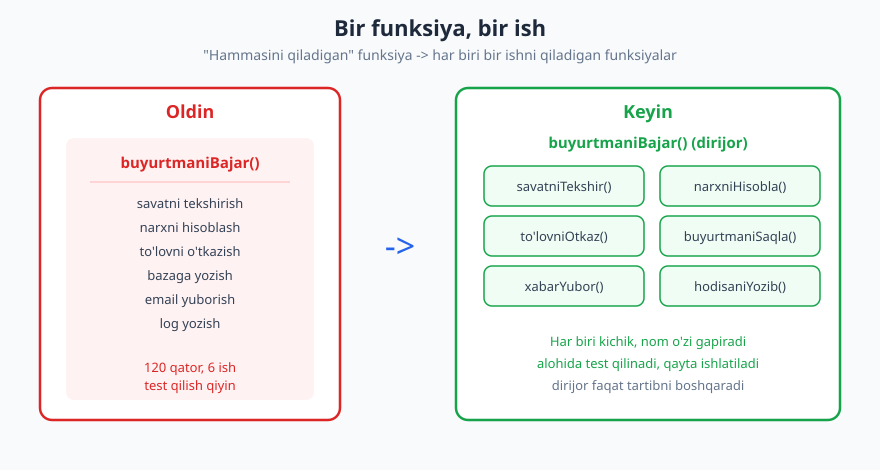
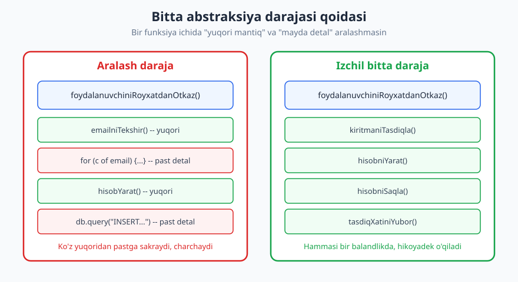
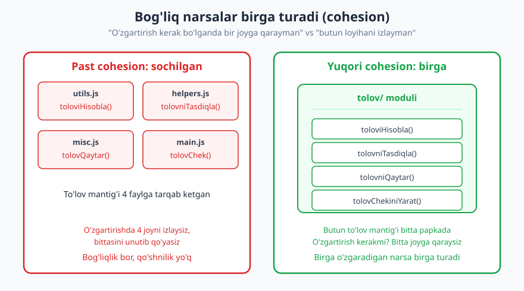

# 06 — Funksiyalar, modullik va kod tuzilishi

[⬅️ Oldingi: 05 — Nomlash — eng qiyin oson ish](./05-nomlash-sanati.md) · [🏠 README](./README.md) · [Keyingi: 07 — Izoh va o'z-o'zini hujjatlovchi kod ➡️](./07-izoh-ozini-hujjatlovchi-kod.md)

---

> **Bu bobda:** funksiyani qanday qilib kichik, tushunarli va bir maqsadli qilish; argumentlarni kamaytirish va yon ta'sirlarni jilovlash; takrorlanishni o'chirish bilan erta abstraksiya o'rtasidagi nozik chiziq; va bog'liq kodni bir joyga yig'ib, faylu modullarni shunday tuzishki, keyinroq "buni qayerga qo'ygandim" deb azoblanmaslik. Hammasi **kod darajasida** — tizim darajasidagi qarorlar uchun [Dasturlash arxitekturasi](../arxitektura/README.md) kitobi bor.
>
> **Halollik / Eslatma:** bu yerdagi "kichik funksiya", "uchta marta qoidasi", "3 argumentdan oshmasin" kabi raqamlar — **qonun emas, mo'ljal**. Ular ko'pchilik holatda foydali, lekin har doim emas. Ba'zan biroz uzunroq, lekin chiziqli o'qiladigan funksiya o'nta mayda bo'lakka bo'lingandan ko'ra ravshanroq bo'ladi. Maqsad — qoidaga bo'ysunish emas, **o'qishga va o'zgartirishga qulay kod**. Qoida shu maqsadga xizmat qilmasa, qoidadan voz keching.

---

## Funksiya — bitta ishni qilsin va yaxshi qilsin

Eng eski va eng kuchli maslahat: **bir funksiya bitta narsa qilsin, uni yaxshi qilsin va faqat shuni qilsin.** Bu — funksiya darajasidagi yagona mas'uliyat (single responsibility). Diqqat: bu *kod* darajasidagi qoida. Arxitektura kitobidagi SOLIDning "S" harfi *klass/modul* darajasida gapiradi — bu yerda biz aynan funksiyaning o'ziga qaraymiz.

"Bitta ish" deganda qatorlar soni emas, **bitta maqsad** nazarda tutiladi. Funksiyani ko'rganingizda uni bir jumla bilan, "va", "yoki", "keyin" so'zlarisiz tasvirlay olsangiz — yaxshi belgi. "Bu funksiya buyurtmani tekshiradi **va** to'lovni o'tkazadi **va** email yuboradi" — bu uchta funksiya, bittasi ichida yashiringan.



❌ **Oldin — hammasini qiluvchi funksiya:**

```js
function buyurtmaniBajar(savat, foydalanuvchi) {
  // savatni tekshirish
  if (savat.mahsulotlar.length === 0) throw new Error("Savat bo'sh");
  for (const m of savat.mahsulotlar) {
    if (m.miqdor <= 0) throw new Error("Noto'g'ri miqdor");
  }
  // narxni hisoblash
  let jami = 0;
  for (const m of savat.mahsulotlar) jami += m.narx * m.miqdor;
  if (foydalanuvchi.premium) jami *= 0.9;
  // to'lovni o'tkazish
  const tolov = tolovTizimi.charge(foydalanuvchi.karta, jami);
  if (!tolov.ok) throw new Error("To'lov o'tmadi");
  // bazaga yozish
  db.query("INSERT INTO buyurtmalar (user, jami) VALUES (?, ?)",
           [foydalanuvchi.id, jami]);
  // email yuborish
  pochta.yubor(foydalanuvchi.email, "Buyurtmangiz qabul qilindi", jami);
}
```

Bu funksiya beshta turli ishni qiladi: tekshiradi, hisoblaydi, to'laydi, saqlaydi, xabar beradi. Uni test qilish uchun bazani ham, to'lov tizimini ham, pochtani ham qalbaki qilishingiz kerak. To'lov mantig'ini o'zgartirsangiz, butun funksiyani qaytadan o'qiysiz.

✅ **Keyin — har biri bir ishni qiladi, "dirijor" boshqaradi:**

```js
function buyurtmaniBajar(savat, foydalanuvchi) {
  savatniTekshir(savat);
  const jami = jamiNiHisobla(savat, foydalanuvchi);
  toloviniOtkaz(foydalanuvchi.karta, jami);
  const buyurtma = buyurtmaniSaqla(foydalanuvchi, jami);
  tasdiqXatiniYubor(foydalanuvchi.email, buyurtma);
}
```

Yuqori darajadagi `buyurtmaniBajar` endi **hikoya** — uni o'qib, nima sodir bo'layotganini kod ichiga kirmasdan tushunasiz. Har bir qadam alohida funksiya: kerak bo'lsa ochasiz, kerak bo'lmasa nomiga ishonasiz. Bu shunchaki "chiroyli" emas — har bir kichik funksiyani **alohida test qilish, qayta ishlatish va o'zgartirish** mumkin.

## Kichik funksiya: nega arzon, qachon haddan oshadi

Kichik funksiya nima beradi? **O'qiluvchanlik** (qisqa narsani miyaga sig'dirish oson), **nom** (har bo'lakka maqsadli nom = bepul hujjat — [05-bob](./05-nomlash-sanati.md)), **testlanuvchanlik** va **qayta ishlatish**. Lekin "kichik" o'zi maqsad emas. Funksiyani shunchaki qatorni kamaytirish uchun maydalash — masalan, bir marta ishlatiladigan ikki qatorli kodni ajratish va unga sun'iy nom o'ylab topish — ba'zan o'qishni *qiyinlashtiradi*: ko'zingiz fayl bo'ylab sakrab, kichik bo'laklarni qayta yig'ishga majbur bo'ladi.

> **Trade-off:** kichik funksiyalar lokal o'qishni osonlashtiradi, lekin "sakrash narxi"ni oshiradi — mantiqni tushunish uchun ko'p faylga qarashga to'g'ri keladi. Agar bo'lak bitta joyda ishlatilsa, juda mayda bo'lsa va ajratilsa nomi mazmunni qo'shmasa — uni joyida qoldirish ravshanroq. Maydalashning o'zi fazilat emas; xizmat qilgani uchun maydalang.

## Bitta abstraksiya darajasi qoidasi

Eng amaliy kichik qoidalardan biri: **bir funksiya ichidagi barcha amallar bir xil abstraksiya balandligida bo'lsin.** Yuqori darajadagi mantiq ("hisobni yarat") bilan mayda detal ("satrning har bir belgisini aylanib chiq") bir funksiyada aralashsa, o'quvchining ko'zi yuqoridan pastga sakrab charchaydi.



❌ **Aralash daraja:**

```python
def foydalanuvchini_royxatdan_otkaz(email, parol):
    email_to_gri = False                      # past: mayda tekshiruv
    if "@" in email and "." in email.split("@")[1]:
        email_to_gri = True
    if not email_to_gri:
        raise ValueError("Email noto'g'ri")
    hisob_yarat(email, parol)                 # yuqori: amal
    db.execute("INSERT INTO logs ...")        # past: bevosita SQL
```

Bu funksiyada "email satrini belgilab-belgilab tekshirish" (juda past daraja) "hisob yaratish" (juda yuqori daraja) bilan yonma-yon turibdi. O'qiyotgan odam bir lahzada "biz nima qilyapmiz" (registratsiya) darajasida, keyingi qatorda "satrda nuqta bormi" darajasida o'ylashga majbur.

✅ **Izchil bitta daraja:**

```python
def foydalanuvchini_royxatdan_otkaz(email, parol):
    kiritmani_tasdiqla(email, parol)
    hisob = hisobni_yarat(email, parol)
    hodisani_yozib_qoy("royxat", hisob.id)
```

Endi har bir qator bir xil balandlikda — hammasi "amal" darajasida. Mayda detal (email satrini tekshirish, SQL yozish) o'sha amallarning *ichiga* tushdi. Funksiya tepadan o'qilganda toza, davomiy hikoyaga aylandi.

## Argumentlar: kamroq — yaxshiroq

Funksiyaning argumentlari soni — uni qanchalik tushunish va test qilish kerakligini ko'rsatadi. Argument qancha ko'p bo'lsa, ularning kombinatsiyalari shuncha ko'p, demak test holatlari va xato imkoniyatlari ko'p.

| Argument soni | Baho | Izoh |
|---|---|---|
| 0 (niladic) | Eng yaxshi | Tushunish oson; ko'pincha toza |
| 1 (monadic) | Yaxshi | Tabiiy: "bunga shuni qil" |
| 2 (dyadic) | Yaxshi | Koordinata `(x, y)` kabi tabiiy juftlik bo'lsa |
| 3 (triadic) | Ehtiyot bo'ling | Tartibni eslab qolish qiyin; hid (smell) |
| 4+ | Qayta ko'ring | Ko'pincha yashirin obyekt: parametr obyektiga yig'ing |

**3+ argument — hid.** `chizish(x, y, kenglik, balandlik, rang, qalinlik)` — qaysi raqam nima ekanini esda tutib bo'lmaydi; `chizish(10, 20, 5, 0, ...)` ni o'qiganda har biriga taxmin qilasiz. Yechim — **parametr obyekti**: bir-biriga bog'liq argumentlarni mazmunli nom ostida bitta obyektga yig'ish.

❌ **Tarqoq argumentlar:**

```js
function tortburchakChiz(x, y, kenglik, balandlik, rang, qalinlik) { ... }
tortburchakChiz(10, 20, 100, 50, "ko'k", 2);  // har bir raqam jumboq
```

✅ **Parametr obyekti:**

```js
function tortburchakChiz(joylashuv, olcham, uslub) { ... }
tortburchakChiz(
  { x: 10, y: 20 },
  { kenglik: 100, balandlik: 50 },
  { rang: "ko'k", qalinlik: 2 }
);
```

Endi chaqiruvning o'zi nima nima ekanini aytib turibdi.

### Boolean flag argumenti — deyarli har doim yomon

`foydalanuvchiniSaqla(user, true)` — bu `true` nima? Flag argumenti funksiya **ikki xil ish qilishini** ochiq tan oladi: rost bo'lsa bir yo'l, yolg'on bo'lsa boshqa. Demak u "bitta ish" qoidasini buzayapti. Ko'pincha eng toza yechim — ikkita aniq nomli funksiya.

❌ `xabarYubor(matn, true);`  ·  `xabarYubor(matn, false);`
✅ `xabarniDarhalYubor(matn);`  ·  `xabarniNavbatgaQoy(matn);`

> **Trade-off:** flag argument har doim gunoh emas. Kutubxona API'sida konfiguratsiya bayrog'i (`{ caseSensitive: true }` kabi nomlangan parametr) o'rinli — bu yerda flag *xulqni sozlaydi*, funksiyani ikki boshqa funksiyaga bo'lib yubormaydi. Yomoni — *pozitsion* `true`/`false` chaqiruv joyida nimani anglatishi ko'rinmasligi.

## Yon ta'sir: bashorat qilinadigan funksiya

**Yon ta'sir (side effect)** — funksiyaning qaytaradigan qiymatidan tashqari, tashqi dunyoga ta'siri: global o'zgaruvchini o'zgartirish, faylga yozish, bazaga so'rov, ekranga chop etish, kiruvchi argumentni o'zgartirish. Yon ta'sirning o'zi yomon emas — dasturlar foydali bo'lishi uchun ular kerak (fayl saqlanishi, xabar yuborilishi kerak). Yomoni — **kutilmagan, yashirin yon ta'sir.**

**Toza funksiya (pure function)** — bir xil kirishga har doim bir xil chiqish beradi va hech qanday yon ta'siri yo'q. Bunday funksiyani tushunish, test qilish va qayta ishlatish eng oson: u faqat kirishga bog'liq, "kechagi holat" yoki "tarmoq" haqida o'ylash shart emas.

❌ **Yashirin yon ta'sir — nomi yolg'on gapiradi:**

```python
def parolni_tekshir(foydalanuvchi, parol):
    if hash(parol) != foydalanuvchi.parol_hash:
        foydalanuvchi.urinishlar += 1      # yashirin: obyektni o'zgartirdi
        log_fayl.write("xato urinish\n")    # yashirin: faylga yozdi
        return False
    return True
```

Nomi "tekshir" deydi — savol beruvchidek tuyuladi. Aslida u obyektni o'zgartiradi va faylga yozadi. Buni faqat tekshirmoqchi bo'lgan odam (masalan, testda) kutilmagan oqibatlarga duch keladi.

✅ **Toza tekshiruv + alohida ataylab amal:**

```python
def parol_togrimi(foydalanuvchi, parol):       # toza: faqat hisoblaydi
    return hash(parol) == foydalanuvchi.parol_hash

def xato_urinishni_qayd_et(foydalanuvchi):      # ataylab: ta'sir bor, nomidan bilinadi
    foydalanuvchi.urinishlar += 1
    log_fayl.write("xato urinish\n")
```

Endi chaqiruvchi kod tartibni o'zi tanlaydi va har bir funksiya nima qilishi nomidan ko'rinadi.

Bu bizni **komanda-so'rov ajratish** (Command-Query Separation, CQS) tamoyiliga olib keladi: funksiya yo **so'rov** bo'lsin (savol beradi, qiymat qaytaradi, hech narsani o'zgartirmaydi) yo **komanda** (biror narsani o'zgartiradi, odatda hech narsa qaytarmaydi) — lekin ikkalasi bir vaqtda emas. "Savol beraman, lekin yon-yog'da javobni ham o'zgartiraman" — chalkashlik manbai.

| Tur | Maqsad | Qaytaradi | Yon ta'sir | Misol |
|---|---|---|---|---|
| So'rov (query) | Ma'lumot olish | Qiymat | Yo'q | `narxniHisobla()`, `parolTogrimi()` |
| Komanda (command) | Holatni o'zgartirish | Yo'q / status | Bor | `buyurtmaniSaqla()`, `xabarYubor()` |

> **Trade-off:** CQS toza nazariya, lekin amalda ba'zan buzasiz — masalan, navbatdan element olib, ayni paytda uni o'chiruvchi `pop()` ham qaytaradi, ham o'zgartiradi. Bu shunchalik keng tarqalgan idiomki, uni buzish g'alati bo'lardi. Qoidani biling, lekin har joyda jangga kirmang — yashirin, kutilmagan yon ta'sirga qarshi turing, ochiq va keng tanilganiga emas.

## Takrorlanish vs erta abstraksiya

Sizga **DRY** (Don't Repeat Yourself — o'zingni takrorlama) o'rgatilgan: bir mantiqni ko'chirib-ko'chirib yozmang, bir joyga yig'ing. To'g'ri maslahat — chunki takrorlangan kodning bir nusxasini tuzatib, ikkinchisini unutib qo'yish — klassik xato manbai. Lekin bu yerda yosh dasturchilar tez-tez to'g'noydigan tuzoq bor: **erta, noto'g'ri abstraksiya takrordan ham yomon.**

Ikki kod bo'lagi bugun bir xil ko'rinishi mumkin, lekin turli sabablar bilan mavjud. Ularni darhol "umumiy funksiya"ga birlashtirsangiz, ertaga biri o'zgarishi kerak bo'lganda, umumiy funksiyani if'lar va flag'lar bilan to'ldirib, oxir-oqibat ikkala holatga ham yomon xizmat qiladigan chigal narsa hosil qilasiz. Tasodifiy o'xshashlik haqiqiy umumiylik bilan adashtirilgan.

Shuning uchun amaliy **"uchta marta qoidasi"** (Rule of Three): biror narsani *ikkinchi* marta yozayotganda biroz bezovta bo'ling, lekin shoshmang. *Uchinchi* marta paydo bo'lganda — endi naqsh aniq, abstraksiyani ishonch bilan ajrating. Ungacha biroz takror — kechirilarli soliq.

```text
1-marta:  yoz. (hali naqsh yo'q)
2-marta:  sezgir bo'l, lekin shoshmay nusxa ol. (bir xil tasodifmi yoki naqshmi?)
3-marta:  endi ajrat. (naqsh tasdiqlandi)
```

❌ **Erta abstraksiya — bitta funksiya ikkala xo'jayinga ham yomon xizmat qiladi:**

```js
// Foydalanuvchi va admin bildirgisi "o'xshash" bo'lgani uchun birlashtirildi...
function bildirgiYubor(odam, tur, adminMi, smsHam, jurnalga) {
  // ...keyin har biri uchun if-flag chigalligi o'sadi
}
```

✅ **Avval ikkita ravshan funksiya, naqsh tasdiqlangach umumiy yadro:**

```js
function foydalanuvchigaBildirgi(foydalanuvchi, hodisa) { /* aniq, sodda */ }
function adminniOgohlantir(admin, hodisa)            { /* aniq, sodda */ }
// Uchinchi shunga o'xshash kerak bo'lsa -> umumiy yadroni ajrating.
```

> **Trade-off:** DRY ham, "uch marta qoidasi" ham — mo'ljal. Xavfsizlik yoki to'lov mantig'i kabi *kritik* joyda ikki marta takror ham xavfli (bir nusxasini tuzatmay qolasiz) — u yerda birinchi takrordayoq birlashtiring. Aksincha, ikki modul *mustaqil* rivojlanishi kerak bo'lsa, ataylab biroz takror to'g'ri — noto'g'ri ulanishdan ko'ra. Tizim darajasidagi DRY, KISS va YAGNI tushunchalari uchun [Dasturlash arxitekturasi](../arxitektura/README.md) kitobiga qarang; bu yerda gap funksiya darajasidagi takror.

## Fayl va modul tuzilishi: bog'liq narsa birga

Funksiyalardan bir pog'ona yuqori — **modul** (fayl yoki papka) darajasi. Bu yerdagi asosiy tushuncha — **cohesion** (ichki bog'liqlik): bir modul ichidagi narsalar bir-biriga qanchalik aloqador. Yuqori cohesion — modulning hamma qismi bir maqsadga xizmat qiladi. Past cohesion — bir-biriga aloqasi yo'q narsalar tasodifan bir faylga to'planib qolgan (`utils.js`, `helpers.py`, `misc.go` — ko'pincha shunday "axlat qutilari").



Amaliy mezon: **birga o'zgaradigan narsa birga tursin.** Agar to'lov narxini o'zgartirganingizda doim to'lov tasdig'i va chek mantig'iga ham qaraysiz — bularning hammasi `tolov/` modulida bo'lishi kerak, uchta turli faylga tarqalmasin. "Buni qayerga qo'yaman?" degan savolga javob — "uni *kim bilan birga o'zgaradi*, o'sha bilan qo'y."

❌ **Texnik turga ko'ra sochilgan (past cohesion):**

```text
controllers/   -> foydalanuvchiController, tolovController, mahsulotController
services/      -> foydalanuvchiService, tolovService, mahsulotService
repositories/  -> foydalanuvchiRepo, tolovRepo, mahsulotRepo
```

Bir "to'lov" xususiyatini o'zgartirish uchun uch papkani ochasiz. To'lov haqida o'ylayotganda foydalanuvchi va mahsulot ham ko'z oldingizda turadi.

✅ **Xususiyatga (feature) ko'ra to'plangan (yuqori cohesion):**

```text
tolov/        -> tolovController, tolovService, tolovRepo, tolov.test
foydalanuvchi/-> ...Controller, ...Service, ...Repo, ...test
mahsulot/     -> ...Controller, ...Service, ...Repo, ...test
```

> **Trade-off:** "xususiyatga ko'ra papka" ko'p loyihada qulay, lekin universal qonun emas. Kichik loyihada texnik bo'linish (`controllers/`, `models/`) ham yetarli va freymvork odatlariga mos bo'lishi mumkin — freymvork qattiq tartib tutsa, unga qarshi kurashmang. Asosiysi — papka qaror bo'lsin, tasodif emas: "bu nega shu yerda?" degan savolga javobingiz bo'lsin. Modullar orasidagi bog'liqlik (coupling) va chegaralarni qanday chizish — bu allaqachon tizim darajasi; chuqurroq [Dasturlash arxitekturasi](../arxitektura/README.md) kitobida.

## Halollik: bular qoida emas, yo'l-yo'riq

Bu bobdagi hamma narsa — "kichik funksiya", "3 argumentdan oshmasin", "toza funksiya", "uch marta qoidasi", "yuqori cohesion" — bir maqsadga xizmat qiladi: **kodni keyingi odam (ko'pincha 6 oydan keyingi siz) tez tushunsin va xavfsiz o'zgartira olsin.** Qoidaning o'zi maqsad emas.

Real misol: ba'zan bir funksiyani o'nta mayda bo'lakka bo'lganingizdan ko'ra, 25 qatorli, lekin yuqoridan pastga chiziqli o'qiladigan funksiya tushunarli bo'ladi — chunki butun mantiq bir ekranda, sakrash yo'q. Ba'zan biroz takror noto'g'ri abstraksiyadan afzal. Ba'zan flag argument — eng sodda yechim. **Qoidani bilish — uni qachon bukish kerakligini bilish uchun.** Tajribasiz dasturchi qoidani ko'r-ko'rona bajaradi; tajribali dasturchi qoidaning *maqsadini* biladi va shu maqsadga xizmat qilganda qo'llaydi, qilmaganda chetga suradi.

---

## Asosiy g'oyalar (bobni qisqacha)

- **Bir funksiya bitta ish qilsin** — uni "va/keyin"siz bir jumlada tasvirlay olsangiz, yaxshi belgi. Bu kod darajasidagi yagona mas'uliyat, tizim darajasidagidan farqli.
- **Bitta abstraksiya darajasi:** bir funksiya ichida yuqori mantiq va mayda detalni aralashtirmang — ko'z sakrab charchaydi.
- **Argument kamroq — yaxshiroq:** 3+ argument hid; bog'liqlarini **parametr obyektiga** yig'ing; **pozitsion boolean flag**dan qoching (ko'pincha ikki nomli funksiya toza).
- **Yon ta'sirni jilovlang:** **toza funksiya** eng oson; yashirin ta'sirdan qoching; **komanda va so'rovni** ajrating (savol berasizmi yoki o'zgartirasizmi — ikkalasi birga emas).
- **DRY, lekin shoshmang:** **uch marta qoidasi** — noto'g'ri erta abstraksiya takrordan yomonroq; tasodifiy o'xshashlikni haqiqiy umumiylik bilan adashtirmang.
- **Cohesion:** **birga o'zgaradigan narsa birga tursin**; `utils`/`misc` "axlat qutisi"dan qoching; papka tasodif emas, qaror bo'lsin.
- **Bular yo'l-yo'riq, dogma emas:** maqsad o'qiluvchanlik va xavfsiz o'zgartirish — qoida bunga xizmat qilmasa, bukib bo'ladi.

---

## Mashqlar

### Oson

**1-mashq.** Quyidagi funksiya bir jumlada, "va"/"keyin" so'zlarisiz tasvirlanadimi? Tasvirlay olmasangiz, u nechta "ish" qilayotganini sanang va har biriga nom bering:

```js
function foydalanuvchiniQayta(user) {
  user.email = user.email.trim().toLowerCase();
  db.save(user);
  pochta.yubor(user.email, "Profil yangilandi");
  console.log("yangilandi: " + user.id);
}
```

**2-mashq.** Quyidagi chaqiruvdagi har bir argument nimani anglatishini *kodga qaramay* ayta olasizmi? Aytolmasangiz, qanday qilib o'qiluvchanroq qilasiz?

```js
hisobYarat("Ali", "ali@mail.uz", true, false, 30);
```

**3-mashq.** Ushbu funksiya "so'rov"mi yoki "komanda"mi? Nomi nima qilishini to'g'ri aytyaptimi? Muammoni bir jumlada tasvirlang:

```python
def keyingi_idni_ol(hisoblagich):
    hisoblagich.qiymat += 1
    return hisoblagich.qiymat
```

### O'rta

**4-mashq.** Quyidagi funksiyada abstraksiya darajalari aralashgan. Mayda detalni alohida funksiyalarga ajratib, asosiy funksiyani bir xil balandlikdagi qadamlar hikoyasiga aylantiring:

```python
def hisobotni_tayyorla(buyurtmalar):
    jami = 0
    for b in buyurtmalar:
        for m in b.mahsulotlar:
            jami += m.narx * m.miqdor
    f = open("hisobot.txt", "w")
    f.write("Jami: " + str(jami))
    f.close()
    pochta.yubor("rahbar@firma.uz", "Hisobot tayyor")
```

**5-mashq.** Sizda ikkita funksiya bor: `userBildirgisiYubor` va `adminBildirgisiYubor`. Ular 80% bir xil. Hamkasbingiz darhol ularni bitta `bildirgiYubor(..., adminMi)` ga birlashtirishni taklif qilyapti. Qaror qabul qilish uchun qaysi 3 savolni berasiz? "Uch marta qoidasi" bu yerda nima deydi?

**6-mashq.** Loyihangizda (yoki tasavvur qiling) `utils.js` fayli bor va unda: `sanaFormatla`, `pulFormatla`, `emailTekshir`, `paroldHashla`, `massivAralashtir` funksiyalari yotibdi. Bu past cohesion misoli. Ularni mazmunli modullarga qanday qayta taqsimlaysiz? Kamida 3 modul nomini taklif qiling va qaysi funksiya qayerga ketishini ayting.

### Qiyin

**7-mashq.** 5-bobdagi yoki o'z loyihangizdagi 40+ qatorli, bir nechta ishni qiladigan funksiyani toping. Uni "dirijor + kichik funksiyalar" naqshiga refactor qiling (oldin/keyin kodini yozing). Keyin halol baholang: refactordan **keyin** kod chindan ham o'qiluvchanroq bo'ldimi, yoki shunchaki ko'p faylga sakrash paydo bo'ldimi? Qaysi ajratish o'rinli, qaysi biri haddan oshgan edi?

**8-mashq.** Quyidagi funksiyada yashirin yon ta'sir bor. (a) Yon ta'sirni aniqlang. (b) Uni toza "so'rov" va alohida "komanda"ga ajrating. (c) Bu refactor testlashni qanday osonlashtirishini bir-ikki jumlada izohlang:

```python
def chegirma_hisobla(savat, foydalanuvchi):
    chegirma = 0
    if savat.jami > 100000:
        chegirma = savat.jami * 0.1
        foydalanuvchi.bonus_ishlatildi = True   # ???
        audit_log.append(f"chegirma: {foydalanuvchi.id}")  # ???
    return chegirma
```

<details markdown="1">
<summary>Yechimlar</summary>

### 1-mashq yechimi
Bir jumlada tasvirlab bo'lmaydi — funksiya **to'rt ish** qiladi: (1) emailni normallashtiradi, (2) bazaga saqlaydi, (3) email yuboradi, (4) log yozadi. Nom (`foydalanuvchiniQayta`) noaniq va yolg'on — "qayta nima?". Ajratish: `emailniNormallashtir(user)`, `foydalanuvchiniSaqla(user)`, `yangilanishXabariniYubor(user)`, `hodisaniYozibQoy(user)`. Yuqori darajadagi `foydalanuvchiniYangila(user)` shu to'rttasini ketma-ket chaqirsa, hikoyaga aylanadi.

### 2-mashq yechimi
`true` va `false` — pozitsion boolean flag, kodga qaramay ma'nosi yo'q. `30` ham noaniq (yosh? muddat? chegirma?). Yaxshilash: bog'liqlarni parametr obyektiga yig'ing va flag'larni aniq nomlang —
```js
hisobYarat({ ism: "Ali", email: "ali@mail.uz", yosh: 30 },
           { tasdiqlangan: true, premium: false });
```
Yoki flag funksiyani ikkiga bo'lsa — `tasdiqlanganHisobYarat(...)`. Asosiysi: chaqiruv joyining o'zi nimani anglatishini aytib tursin.

### 3-mashq yechimi
Bu **ikkalasi** — ham komanda (hisoblagich qiymatini o'zgartiradi), ham so'rov (qiymat qaytaradi). Nomi `keyingi_idni_ol` — "ol" so'zi sof so'rovdek tuyuladi, lekin u jimgina holatni o'zgartiradi. CQS bo'yicha bu chalkashlik manbai. Halol qarash: `pop`/`next`/`generate` kabi *idioma* funksiyalarda bu kechirimli (Trade-off blokiga qarang); lekin nomi yon ta'sirni yashirsa — masalan oddiy `ol`/`get`/`hisobla` — bu xavfli. Eng aniq nom: `keyingiIdniGeneratsiyaQil` (generatsiya = yangi narsa yaratiladi degani, holat o'zgarishini ishora qiladi).

### 4-mashq yechimi
```python
def hisobotni_tayyorla(buyurtmalar):
    jami = umumiy_jamini_hisobla(buyurtmalar)   # so'rov, toza
    hisobotni_faylga_yoz(jami)                  # komanda
    rahbarni_xabardor_qil()                     # komanda

def umumiy_jamini_hisobla(buyurtmalar):
    return sum(m.narx * m.miqdor
               for b in buyurtmalar for m in b.mahsulotlar)

def hisobotni_faylga_yoz(jami):
    with open("hisobot.txt", "w") as f:
        f.write(f"Jami: {jami}")

def rahbarni_xabardor_qil():
    pochta.yubor("rahbar@firma.uz", "Hisobot tayyor")
```
Endi `hisobotni_tayyorla` uchta bir xil balandlikdagi qadam: hisobla -> yoz -> xabar ber. Mayda detal (ichma-ich sikl, fayl ochish/yopish) o'z funksiyalarining ichida. `umumiy_jamini_hisobla` toza — alohida test qilinadi.

### 5-mashq yechimi
Beriladigan savollar: (1) **Ular bir xil sababga ko'ra o'zgaradimi?** Agar ertaga admin bildirgisiga "majburiy o'qildi-belgisi" kerak bo'lsa-yu, foydalanuvchinikiga kerak bo'lmasa — ular *mustaqil* rivojlanadi, birlashtirish noto'g'ri. (2) **O'xshashlik haqiqiy umumiylikmi yoki tasodifmi?** Bugun 80% bir xil bo'lishi tasodif bo'lishi mumkin. (3) **Birlashtirsak, qancha if/flag qo'shamiz?** `adminMi` flagi paydo bo'ldi degani — funksiya ichi tarmoqlana boshlaydi, bu hid. "Uch marta qoidasi": hozircha faqat **ikki** holat bor — shoshmang. Uchinchi shunga o'xshash bildirgi paydo bo'lsa, naqsh tasdiqlanadi; o'shanda umumiy *yadro*ni (masalan, `xabarniJonat(kanal, matn)`) ajratib, ikkala funksiya shuni chaqirsin — lekin flag bilan emas.

### 6-mashq yechimi
`utils.js` — past cohesion (axlat qutisi): funksiyalar bir-biriga aloqasiz. Mazmunli taqsimot, masalan:
- **`formatlash/`** (yoki `format.js`): `sanaFormatla`, `pulFormatla` — ikkalasi ham "ko'rsatish uchun matnga aylantirish".
- **`tasdiqlash/`** (yoki `validatsiya.js`): `emailTekshir` — kiritmani tekshirish oilasi (keyin telefon, parol kuchi shu yerga qo'shiladi).
- **`xavfsizlik/`** (yoki `kripto.js`): `paroldHashla` — maxfiylik/kripto mantig'i.
- `massivAralashtir` umumiy yordamchi bo'lib qolishi mumkin (`massiv.js`) yoki faqat bir joyda ishlatilsa — o'sha joyga ko'chiriladi. Mezon har doim bir xil: **birga o'zgaradigan va bir mavzuga tegishli narsa birga tursin.**

### 7-mashq yechimi
Yagona to'g'ri javob yo'q — bu refleksiv mashq. Yaxshi yechim mezonlari: (1) oldin/keyin kodi real (sun'iy emas); (2) yuqori darajadagi funksiya endi bir xil balandlikdagi nomli qadamlardan iborat; (3) har ajratilgan funksiyaning nomi mazmun qo'shadi (shunchaki `qadam1`, `qism2` emas). Eng muhimi — **halol baho:** agar refactordan keyin 6 ta fayl ochish kerak bo'lsa-yu, asl 40 qator bir ekranda chiziqli o'qilar edi, ehtimol haddan oshgansiz. To'g'ri savol: "keyingi odam buni *tezroq* tushunadimi?" — ha bo'lsa, refactor o'rinli; "raqamni kamaytirdim" — yetarli sabab emas.

### 8-mashq yechimi
(a) **Yashirin yon ta'sir:** funksiya "hisobla" deb nomlangan (so'rovdek), lekin `foydalanuvchi.bonus_ishlatildi` ni o'zgartiradi va `audit_log` ga yozadi — ikki yashirin komanda. (b) Ajratish:
```python
def chegirma_summasi(savat):                 # toza so'rov
    if savat.jami > 100000:
        return savat.jami * 0.1
    return 0

def bonusni_belgila(foydalanuvchi):          # ataylab komanda
    foydalanuvchi.bonus_ishlatildi = True
    audit_log.append(f"chegirma: {foydalanuvchi.id}")
```
Chaqiruvchi kod tartibni o'zi belgilaydi. (c) **Testlash osonlashadi:** `chegirma_summasi` endi toza — turli `jami` qiymatlari uchun bazani, foydalanuvchi obyektini yoki audit log'ni qalbaki qilmasdan natijani tekshirasiz. Avval har bir testda yon ta'sirlarni izolatsiya qilish kerak edi; endi sof matematikani sof tekshirasiz.

</details>

---

[⬅️ Oldingi: 05 — Nomlash — eng qiyin oson ish](./05-nomlash-sanati.md) · [🏠 README](./README.md) · [Keyingi: 07 — Izoh va o'z-o'zini hujjatlovchi kod ➡️](./07-izoh-ozini-hujjatlovchi-kod.md)
