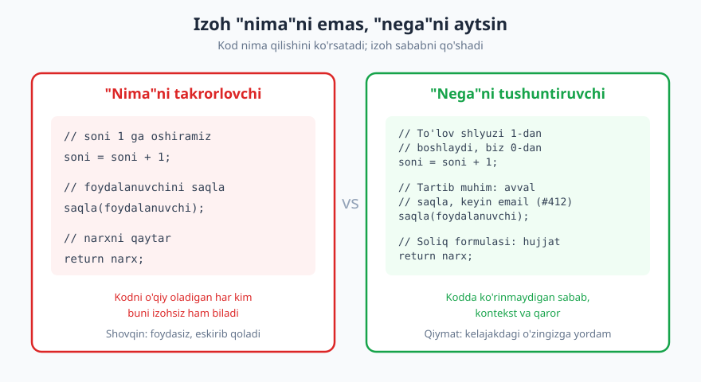
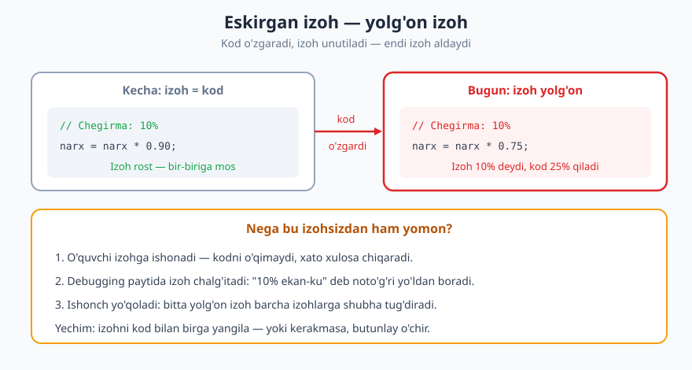
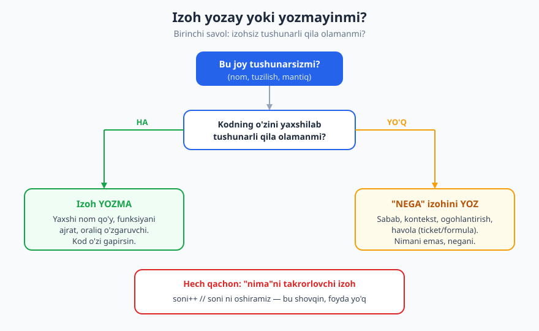

# 07 — Izoh va o'z-o'zini hujjatlovchi kod

[⬅️ Oldingi: 06 — Funksiyalar, modullik va kod tuzilishi](./06-funksiyalar-modullik.md) · [🏠 README](./README.md) · [Keyingi: 08 — Xatolarni boshqarish va mudofaaviy dasturlash ➡️](./08-xatolarni-boshqarish.md)

---

> **Bu bobda:** izohni qachon yozish, qachon yozmaslik kerakligini o'rganamiz. Asosiy g'oya — kod o'zi gapirsin, izoh esa kodda ko'rinmaydigan **"nega"ni** to'ldirsin. Yomon izohlar (ortiqcha, eskirgan, o'chirilgan kod uyumi) va yaxshi izohlar (sabab, ogohlantirish, TODO, tashqi havola) ni juftlikda ko'ramiz, hamda ommaviy interfeys uchun API hujjatlash (docstring/JSDoc/PHPDoc) ni ko'rib chiqamiz.
>
> **Halollik / Eslatma:** "izoh kerak emas, kod o'zi gapirsin" — bu kuchli, lekin ba'zan dogmaga aylanadigan maslahat. Ba'zi murakkab algoritm yoki biznes qoidasi izohsiz haqiqatan ham tushunarsiz qoladi. Bu bobda ekstremal "izohsiz" da'voni ham, "har qatorga izoh" odatini ham rad etamiz: maqsad — **kerakli joyda, kerakli izoh**. Bu yerda keng qabul qilingan amaliyot bor, ammo "qancha izoh yetarli" — jamoa va kontekst qarori.

---

## Izoh — birinchi chora emas, oxirgi to'ldiruvchi

Yangi dasturchilar ko'pincha izohni "yaxshi odat" deb o'rganadi: "har bir qatorni izohla, o'qituvchi shuni so'raydi". Real loyihada esa eng yaxshi izoh — **umuman kerak bo'lmagan izoh**. Sababi oddiy: kod o'zgaradi, izoh esa ko'pincha o'zgarmasdan qoladi. Har bir izoh — siz qo'lda qo'llab-quvvatlashga va'da bergan ikkinchi "haqiqat manbai". Va'dani buzsangiz, izoh aldovga aylanadi.

Shuning uchun professional dasturchi avval **kodni izohga muhtoj qoldirmaslikka** harakat qiladi:

- yomon nom o'rniga niyatni ochuvchi nom qo'yadi ([05-bob](./05-nomlash-sanati.md));
- uzun, chalkash blokni nomli kichik funksiyaga ajratadi ([06-bob](./06-funksiyalar-modullik.md));
- "sehrli son" (magic number) ni nomli konstantaga chiqaradi.

❌ **Izoh bilan "tuzatilgan" yomon kod:**

```js
// agar foydalanuvchi 18 yoshdan katta bo'lsa va hisobi tasdiqlangan bo'lsa
if (u.a >= 18 && u.s === 2) {
  // ...
}
```

✅ **Izohsiz, lekin o'zi gapiradigan kod:**

```js
const BALOG'AT_YOSHI = 18;
const HISOB_TASDIQLANGAN = 2;

if (foydalanuvchi.yosh >= BALOG'AT_YOSHI &&
    foydalanuvchi.holat === HISOB_TASDIQLANGAN) {
  // ...
}
```

Ikkinchi variantda izoh yo'qoldi, lekin kod **ko'proq** tushunarli bo'ldi — chunki tushuntirish kodning o'ziga ko'chdi. Bu farqni butun bob davomida ushlab turamiz.

> **Trade-off:** "izohni nomga aylantirish" har doim ham foydali emas. Agar oraliq o'zgaruvchi yoki funksiyaga ajratish kodni *uzaytirsa* va o'qishni qiyinlashtirsa (mas. faqat bir marta ishlatiladigan, nomi mazmunsiz bo'lgan helper), unda bitta qisqa izoh aniqroq yechim. Maqsad — tushunarlilik, "izoh nolga teng" degan ko'rsatkich emas.

---

## Asosiy qoida: "nima" emas, "nega"

Bu bobning butun mohiyati bitta jumlada: **kod nima qilishini o'zi ko'rsatadi; izoh esa NEGA shunday qilinganini aytadi.**



"Nima"ni takrorlash — eng keng tarqalgan izoh xatosi:

❌ **"Nima"ni takrorlovchi (foydasiz):**

```python
soni = soni + 1          # soni ni 1 ga oshiramiz
foydalanuvchilar = []    # bo'sh ro'yxat yaratamiz
if narx > 100:           # agar narx 100 dan katta bo'lsa
    chegirma = 0.1       # chegirmani 0.1 ga tenglaymiz
```

Bu izohlar kodda allaqachon yozilgan narsani ikkinchi marta yozadi. Ular hech qanday yangi ma'lumot bermaydi — faqat ko'zni chalg'itadi va eskirib qolish xavfini tug'diradi.

✅ **"Nega"ni tushuntiruvchi (qimmatli):**

```python
# To'lov shlyuzi tranzaksiyalarni 1-dan sanaydi, biz esa 0-dan —
# shu sababli moslashtirish uchun 1 ga oshiramiz
soni = soni + 1

# Bu ro'yxatni keyin pastdagi siklda to'ldiramiz; oldindan bo'sh
# bermasak, ba'zi kutubxonalar None ni xato deb hisoblaydi
foydalanuvchilar = []

# 100 so'mdan oshgan buyurtmaga 10% — marketing #412 talabi (2026-Q1 aksiya)
if narx > 100:
    chegirma = 0.1
```

Ikkinchi guruhdagi izohlar kodda **ko'rinmaydigan** narsani aytadi: tashqi tizimning xatti-harakati, kelajakdagi niyat, biznes qarorining manbai. Buni izohsiz bilib bo'lmaydi — hatto eng yaxshi nom ham buni yetkaza olmaydi.

"Nega" izohi odatda quyidagi savollarga javob beradi:

- **Nega bu yondashuv tanlandi** (boshqasi emas)? Mas. "sodda yechim N² edi, bu yer issiq, shuning uchun kesh qo'shildi".
- **Nega bu noodatiy/g'alati ko'rinish kerak**? Mas. "bu `sleep` API limiti tufayli — olib tashlasangiz 429 olasiz".
- **Qanday kontekst kodda yo'q**? Mas. "bu formula buxgalteriya bo'limining Excel jadvalidan olingan, havola: ...".

---

## Yaxshi izohning turlari

"Nega" izohi amalda bir necha aniq shaklda uchraydi. Bularni atayin tanib oling — bular izohning eng qadrli ko'rinishlari:

**1. Niyat va sabab (rationale).** Nega aynan shunday qilingani.

```js
// Cookie 400 kundan oshmasligi kerak — zamonaviy brauzerlar uzunini qisqartiradi
const MAKS_KUN = 400;
```

**2. Ogohlantirish.** "Buni o'zgartirma, chunki...".

```python
# DIQQAT: bu tartibni o'zgartirmang — auth() sessiyani o'rnatadi,
# log() esa undan foydalanadi. Joyini almashtirsangiz, log bo'sh chiqadi.
auth(soʻrov)
log(soʻrov)
```

**3. TODO / FIXME — mas'uliyat bilan.** Kelajakdagi ish yoki ma'lum kamchilik.

```js
// TODO(oqil, #871): bu yerda faqat USD qo'llab-quvvatlanadi;
// ko'p valyuta qo'shilganda valyuta kodini parametrga chiqarish kerak
function hisoblaNarx(miqdor) { /* ... */ }
```

Yaxshi TODO uchta narsani beradi: **kim** (yoki jamoa), **nima qilinishi kerak** va **havola** (ticket raqami). "TODO: tuzatish kerak" — bu shovqin; uni hech kim hech qachon tuzatmaydi.

**4. Tashqi havola.** Formula, hujjat, ticket, standart manbasi.

```python
# Haversine formulasi (ikki koordinata orasidagi masofa):
# https://en.wikipedia.org/wiki/Haversine_formula
def masofa(lat1, lon1, lat2, lon2): ...
```

**5. Murakkab algoritm yoki biznes qoidasini sharhlash.** Ba'zan kod mantig'i shunchalik zich yoki noaniqki, qisqa "bu nima qilyapti" izohi haqiqatan kerak — bu "izohsiz kod" dogmasidan ustun turadigan halol holat.

```python
# Bit-niqob: har bir ruxsat 1 bit. (huquqlar & O'QISH) != 0 bo'lsa,
# foydalanuvchida o'qish huquqi bor degani.
if (huquqlar & O'QISH) != 0: ...
```

---

## Yomon izohning turlari

Yomon izohlarni ham tanib olish kerak — chunki ular kod bazasini sekin zaharlaydi.

**1. Ortiqcha (redundant).** Yuqorida ko'rdik: kod aytayotgan narsani takrorlaydi. Foyda nol, eskirib qolish xavfi bor.

**2. Eskirgan / yolg'on izoh — eng xavflisi.** Kod o'zgardi, izoh qoldi. Endi izoh aldaydi.



```python
# Chegirma: 10%
narx = narx * 0.75   # ❌ izoh 10% deydi, kod 25% qiladi
```

Bu izohsizdan ham yomon. Izohsiz bo'lsa, o'quvchi kodni o'qiydi va to'g'ri xulosa chiqaradi. Yolg'on izoh bilan esa u **noto'g'ri** xulosa chiqaradi va, ehtimol, butun debugging seansini izohning yolg'on yo'lida o'tkazadi. Bitta yolg'on izoh barcha izohlarga ishonchni yo'qotadi.

> **Eslatma:** shuning uchun "kodni o'zgartirsang, izohni ham tekshir" — code review'da ([13-bob](./13-code-review.md)) doimiy savol. Izoh ham xuddi kod kabi qo'llab-quvvatlanadi.

**3. O'chirilgan kod uyumi (zombie code).** Sizda **Git bor** — eski kodni izohga o'rab saqlash kerak emas.

❌ **Yomon — "balki keyin kerak bo'lar" deb saqlangan:**

```js
function jamiHisobla(buyurtma) {
  // let jami = 0;
  // for (const x of buyurtma.qatorlar) {
  //   jami += x.narx;
  // }
  // return jami;
  return buyurtma.qatorlar.reduce((s, x) => s + x.narx, 0);
}
```

✅ **Yaxshi — eski kod o'chirilgan, tarix Git'da:**

```js
function jamiHisobla(buyurtma) {
  return buyurtma.qatorlar.reduce((s, x) => s + x.narx, 0);
}
```

O'chirilgan kod o'quvchini chalg'itadi: "bu nega bu yerda? ehtimol kerakdir?". Git versiya nazorati aynan shu uchun bor — `git log` va `git blame` orqali har qanday eski holatga qaytishingiz mumkin. Batafsil: [Git & GitHub](../git-github/README.md).

**4. Jurnal/o'zgartirish tarixi izohlari.** Fayl boshida "2024-01-05 Ali qo'shdi, 2024-03-12 Vali o'zgartirdi" — bu ham Git ishi, izohniki emas.

**5. Hazil, shikoyat, his-tuyg'u.** `// bu yerni tushunmayman, ishlaydi, tegmang` — kulgili, lekin keyingi dasturchiga azob. Agar tushunmasangiz — o'rganing yoki savol bering ([17-bob](./17-texnik-kommunikatsiya.md)), izohga shikoyat yozmang.

### Yaxshi va yomon izoh turlari — jadval

| Izoh turi | Misol | Baho | Nega |
|---|---|---|---|
| "Nima"ni takrorlash | `i++ // i ni oshiramiz` | ❌ Yomon | Kod allaqachon aytadi; shovqin |
| Eskirgan / yolg'on | `// 10%` ammo kod `* 0.75` | ❌ Xavfli | Aldaydi, ishonchni buzadi |
| O'chirilgan kod uyumi | izohga o'ralgan eski blok | ❌ Yomon | Git bor; chalg'itadi |
| Tarix / jurnal | `// 2024-03 Vali o'zgartirdi` | ❌ Yomon | Git'ning vazifasi |
| Niyat / sabab | `// shlyuz 1-dan sanaydi` | ✅ Yaxshi | Kodda ko'rinmas kontekst |
| Ogohlantirish | `// tartibni o'zgartirma...` | ✅ Yaxshi | Kelajakdagi xatoni oldini oladi |
| TODO (havolali) | `// TODO(#871): ...` | ✅ Yaxshi | Aniq, kuzatiladigan ish |
| Tashqi havola | `// Haversine: <url>` | ✅ Yaxshi | Manba va asoslash |
| API hujjati (docstring) | funksiya tepasidagi blok | ✅ Yaxshi | Ommaviy shartnoma |

---

## API hujjatlash: docstring, JSDoc, PHPDoc

Yuqoridagi qoidalar **ichki** kod uchun. Lekin **ommaviy interfeys** — boshqalar (yoki kelajakdagi siz) chaqiradigan funksiya, klass, modul, kutubxona — uchun strukturali hujjat **kerak**. Buni "nimani takrorlash" deb ataolmaymiz, chunki bu chaqiruvchiga kodni ochmasdan ishlatish shartnomasini beradi.

Bunday hujjat tilga qarab har xil nomlanadi, lekin mohiyati bir: **docstring** (Python), **JSDoc** (JavaScript), **PHPDoc** (PHP). Yaxshi API hujjati quyidagilarni qamraydi: funksiya **nima qiladi** (qisqa), **parametrlar**, **qaytaradigan qiymat**, **istisnolar** (qachon xato tashlaydi), va kerak bo'lsa **misol**.

✅ **Python docstring:**

```python
def chegirma_qol(narx, foiz):
    """Berilgan narxdan foiz chegirmani ayirib, yangi narxni qaytaradi.

    Args:
        narx: chegirmadan oldingi narx (musbat son).
        foiz: chegirma foizi, 0 dan 100 gacha.

    Returns:
        Chegirmadan keyingi narx (float).

    Raises:
        ValueError: agar foiz 0..100 oralig'idan tashqarida bo'lsa.
    """
    if not 0 <= foiz <= 100:
        raise ValueError("foiz 0 va 100 orasida bo'lishi kerak")
    return narx * (1 - foiz / 100)
```

✅ **JavaScript JSDoc:**

```js
/**
 * Berilgan narxdan foiz chegirmani ayiradi.
 * @param {number} narx - chegirmadan oldingi narx.
 * @param {number} foiz - chegirma foizi (0..100).
 * @returns {number} chegirmadan keyingi narx.
 * @throws {RangeError} agar foiz oraliqdan tashqarida bo'lsa.
 */
function chegirmaQol(narx, foiz) { /* ... */ }
```

API hujjatining ikki katta foydasi bor: birinchidan, IDE uni avtomatik ko'rsatadi (funksiya nomi ustiga kelganda ipucha chiqadi) — chaqiruvchi kodga kirmasdan ishlatadi. Ikkinchidan, ko'p tillarda u hujjat saytiga avtomatik aylanadi (Sphinx, JSDoc, phpDocumentor). Bu — kod va hujjat o'rtasidagi masofani eng kichik qiladigan yondashuv; hujjatlash haqida to'liqroq: [18-bob](./18-hujjatlash.md).

> **Trade-off:** har bir kichik ichki helper funksiyaga to'liq docstring yozish ortiqcha — bu ham eskirish xavfini oshiradi va "shovqin" yaratadi. Qoida: **ommaviy** (tashqaridan chaqiriladigan) interfeysni hujjatlang; ichki, bir martalik, nomi o'zi gapiruvchi funksiyani majburlamang. Ba'zi jamoalar "har bir public funksiya docstringli" qoidasini qo'yadi — bu izchillikni oshiradi, lekin past qiymatli hujjatlarni ham keltirib chiqaradi. Bu — jamoa kelishuvi.

---

## Qachon izoh yozish kerak: qaror daraxti

Hammasini bitta amaliy qarorga jamlaymiz. Izoh yozishdan **oldin** o'zingizdan so'rang: "bu joyni izohsiz tushunarli qila olamanmi?".



- **Kodni yaxshilab tushunarli qila olaman** (yaxshi nom, kichik funksiya, nomli konstanta) → **izoh yozma**, kodni yaxshila.
- **Yaxshilay olmayman** — chunki sabab/kontekst kodda umuman ko'rinmaydi (tashqi tizim, biznes qarori, ogohlantirish) → **"nega" izohini yoz**.
- **Hech qachon** — kod o'zi aytayotgan "nima"ni izohga takrorlash.

Bu tartib muhim: izoh — birinchi vosita emas. Avval kodni gapirishga majbur qiling; gapirolmaydigan narsani — sababni, kontekstni, ogohlantirishni — izohga qoldiring.

---

## Izoh ham texnik qarz bo'lishi mumkin

Izoh "bepul" emas. Har bir izoh — qo'llab-quvvatlanishi kerak bo'lgan narsa. Eskirgan, yolg'on izoh — bu **texnik qarz** (technical debt): bugun arzon ko'rinadi, lekin "foiz"ini keyin to'laysiz — kimdir uning yolg'oniga ishonib xato qilganda. Shuning uchun izohni kod bilan birga yangilang yoki kerakmasa, dadil o'chiring. Texnik qarz haqida to'liq: [10-bob](./10-texnik-qarz.md).

Real loyihadan misol: bir jamoada API endpointi ustida `// bu yerda rate-limit yo'q, ehtiyot bo'l` izohi yillab turgan. Aslida rate-limit allaqachon middleware'ga ko'chgan edi — izoh esa qolib ketgan. Yangi dasturchi shu izohga ishonib, qo'lda yana bitta limit qo'ydi — natijada ikki marta cheklash va g'alati xatolar. Bir qatorlik yolg'on izoh — bir kunlik debugging. Izoh ham haqiqatni aytishi shart.

---

## Asosiy g'oyalar (bobni qisqacha)

- **Eng yaxshi izoh — kerak bo'lmagan izoh.** Avval kodni yaxshi nom, kichik funksiya va nomli konstanta bilan o'zi gapiradigan qiling.
- **"Nima" emas, "nega".** Kod nima qilishini o'zi ko'rsatadi; izoh kodda ko'rinmaydigan sabab, kontekst, qaror va ogohlantirishni qo'shadi.
- **Eskirgan izoh — eng xavfli izoh.** U aldaydi va barcha izohlarga ishonchni buzadi; izohni kod bilan birga yangilang yoki o'chiring.
- **O'chirilgan kodni izohda saqlamang.** Sizda **Git** bor; zombie code faqat chalg'itadi.
- **Yaxshi izoh turlari:** niyat/sabab, ogohlantirish, havolali TODO/FIXME, tashqi havola, va zarur bo'lganda murakkab algoritm sharhi.
- **Ommaviy interfeysni hujjatlang** (docstring/JSDoc/PHPDoc): nima qiladi, parametr, qaytaradi, istisno, misol — bu chaqiruvchiga shartnoma beradi.
- **"Izohsiz kod" — dogma emas.** Ba'zi murakkab algoritm yoki biznes qoidasi izohsiz tushunarsiz; halol bo'ling, "izoh nolga teng" maqsad emas, tushunarlilik maqsad.

---

## Mashqlar

### Oson

**1-mashq.** Quyidagi izohlarning har birini "nima"ni takrorlovchi (❌), "nega"ni tushuntiruvchi (✅) yoki xavfli/yolg'on deb tasniflang:
- (a) `total = total + qty  # total ga qty ni qo'shamiz`
- (b) `time.sleep(1)  # tashqi API soniyasiga 1 ta so'rovni qabul qiladi`
- (c) `# eski narx hisobi` ammo kod yangi formulani ishlatadi.

**2-mashq.** Quyidagi kodni izoh **qo'shmasdan**, faqat nomlash va konstanta bilan tushunarli qiling:

```js
if (d > 30 && s === 1) { archive(x); }
```

**3-mashq.** Bu funksiyaga (JavaScript yoki Python — qaysi qulay) to'liq API hujjati (JSDoc/docstring) yozing: `function ulush(jami, odamSoni)` — jamini odamlar soniga teng bo'lib, har biriga tushadigan ulushni qaytaradi; `odamSoni` 0 bo'lsa xato tashlaydi.

### O'rta

**4-mashq.** Quyidagi izohlardan qaysilari Git'ga tegishli (ya'ni izohga emas) ekanligini aniqlang va sababini ayting:
```python
# 2025-02-10: Aziz qo'shdi
# 2025-03-01: Bobur tezlik uchun keshni qo'shdi
# Kesh TTL 5 daqiqa — DB yuki yuqori bo'lgani uchun (incident #2231)
def foydalanuvchi_ol(id): ...
```

**5-mashq.** Sizda `// TODO: bu joyni keyin tuzatish kerak` izohi bor. Buni **mas'uliyatli** TODO ga aylantiring (uchta yetishmayotgan elementni qo'shing) va nega original yomon ekanini tushuntiring.

**6-mashq.** Quyidagi "o'chirilgan kod uyumi"ni toza qiling va nega Git buni ortiqcha qilishini bir jumlada yozing:

```python
def narx_hisobla(buyurtma):
    # natija = 0
    # for q in buyurtma:
    #     natija += q.narx * q.soni
    # return natija
    return sum(q.narx * q.soni for q in buyurtma)
```

### Qiyin

**7-mashq.** Bir hamkasbingiz code review'da: "izoh yomon, kod o'zi gapirishi kerak, hech qachon izoh yozma" deydi. Siz bu da'voni qisman to'g'ri, qisman noto'g'ri deb hisoblaysiz. Unga 4–6 jumlalik **halol, asosli javob** yozing: qachon u haq, qachon yo'q.

**8-mashq.** Quyidagi murakkab kod bloki uchun **bitta** "nega" izohini yozing (kodni o'zgartirmasdan). Izoh nimani aytishi va nimani aytmasligi kerakligini ham izohlang:

```python
# ??? shu yerga izoh yozing
results = [r for r in items if r.score > 0][:100]
results.sort(key=lambda r: (-r.score, r.id))
```
(Kontekst: `items` millionlab element bo'lishi mumkin; mahsulot menejeri "faqat top-100, ball bo'yicha, teng bo'lsa eski ID birinchi" deb so'ragan.)

<details markdown="1">
<summary>Yechimlar</summary>

### 1-mashq yechimi
- (a) ❌ **"Nima"ni takrorlovchi** — kod `total + qty` ni o'zi ko'rsatadi, izoh hech narsa qo'shmaydi. O'chirish kerak.
- (b) ✅ **"Nega"ni tushuntiruvchi** — `sleep(1)` ning o'zidan tashqi API limiti ko'rinmaydi; izoh sababni beradi. Yaxshi izoh.
- (c) **Xavfli / yolg'on** — izoh "eski narx hisobi" deydi, kod yangi formulani ishlatadi: aldaydi. Eng yomon tur; darhol tuzatish yoki o'chirish kerak.

### 2-mashq yechimi
Sehrli sonlar va niyatni nomga ko'chiramiz:
```js
const ARXIVLASH_KUNI = 30;
const HOLAT_FAOL = 1;

if (kunlarOtdi > ARXIVLASH_KUNI && holat === HOLAT_FAOL) {
  arxivla(yozuv);
}
```
Endi `d`, `s`, `1`, `x` ma'noga ega bo'ldi — izoh kerak emas, kod o'zi gapiradi.

### 3-mashq yechimi
JSDoc varianti:
```js
/**
 * Jamini odamlar soniga teng bo'lib, bir kishiga tushadigan ulushni qaytaradi.
 * @param {number} jami - taqsimlanadigan umumiy miqdor.
 * @param {number} odamSoni - odamlar soni (musbat butun son).
 * @returns {number} bir kishiga tushadigan ulush.
 * @throws {RangeError} agar odamSoni 0 ga teng bo'lsa (nolga bo'lish).
 */
function ulush(jami, odamSoni) {
  if (odamSoni === 0) throw new RangeError("odamSoni 0 bo'la olmaydi");
  return jami / odamSoni;
}
```
Mezon: nima qiladi + parametr + qaytaradi + istisno aniq ko'rsatilgan.

### 4-mashq yechimi
- Birinchi ikki qator (`2025-02-10 Aziz qo'shdi`, `2025-03-01 Bobur ... qo'shdi`) — **Git'ga tegishli**. Bu o'zgartirish tarixi; `git log` va `git blame` buni allaqachon, aniqroq va avtomatik saqlaydi. Izohda saqlash — qo'lda yangilanishi kerak va albatta eskiradi.
- Uchinchi qator (`Kesh TTL 5 daqiqa — DB yuki yuqori bo'lgani uchun (incident #2231)`) — **izohga tegishli**: bu "nega" — kodda ko'rinmaydigan sabab va havola. Bu qoladi.

### 5-mashq yechimi
```js
// TODO(oqil, #1204): hozir faqat sinxron yuklaydi; katta fayllarda
// UI muzlaydi — async oqimga o'tkazish kerak (Q3 reja)
```
Uchta yetishmayotgan element: **kim** (oqil / jamoa), **havola** (#1204 — kuzatiladigan ticket), **nima aniq qilinishi kerak** (async oqimga o'tkazish, sababi bilan). Original (`// TODO: keyin tuzatish kerak`) yomon, chunki: hech kim mas'ul emas, nima tuzatilishi noaniq, kuzatib bo'lmaydi — shuning uchun u abadiy qoladi.

### 6-mashq yechimi
```python
def narx_hisobla(buyurtma):
    return sum(q.narx * q.soni for q in buyurtma)
```
Git buni ortiqcha qiladi: eski implementatsiya `git log`/`git blame` tarixida saqlanadi, shuning uchun uni izohda "balki keyin kerak" deb saqlash — faqat o'quvchini chalg'itadi va faylni shishiradi.

### 7-mashq yechimi (namuna javob)
"Sen qisman haqsan: ortiqcha izoh — kod aytayotgan 'nima'ni takrorlash — haqiqatan ham yomon, va eng yaxshi yechim ko'pincha yaxshi nom va kichik funksiya orqali kodni o'zi gapiradigan qilish. Lekin 'hech qachon izoh yozma' — bu dogma. Kod faqat 'nima'ni ko'rsata oladi; 'nega'ni — tashqi tizim xatti-harakatini, biznes qarorini, ogohlantirishni yoki havolani — kodning o'zidan bilib bo'lmaydi. Bunday hollarda izoh kerak, aks holda kontekst yo'qoladi. Shuningdek, murakkab algoritm yoki ommaviy API uchun izoh/hujjat to'g'ridan-to'g'ri qiymat beradi. Demak, qoida 'izoh yozma' emas, balki 'avval kodni gapirishga majbur qil, gapirolmaydigan narsani — sababni — izohga qoldir'." (Mezon: dogmani rad etadi, "nega" tushunchasini ishlatadi, halol va asosli.)

### 8-mashq yechimi (namuna javob)
```python
# Top-100 ni ball bo'yicha kamayuvchi, teng ballda eski ID (kichik) birinchi —
# mahsulot talabi #PM-77. items millionlab bo'lishi mumkin, shuning uchun
# avval filtrlab, kesib, keyin saralaymiz (katta ro'yxatni to'liq saralamaslik uchun).
results = [r for r in items if r.score > 0][:100]
results.sort(key=lambda r: (-r.score, r.id))
```
Izoh **aytishi kerak**: tartiblash qoidasi qayerdan kelganini (PM talabi + havola) va nega avval kesib, keyin saralaganini (ishlash sababi — kodda ko'rinmaydi). Izoh **aytmasligi kerak**: "ro'yxatni saralaymiz" yoki "filter qilamiz" — buni kod allaqachon ko'rsatadi, takrorlash shovqin bo'ladi.

</details>

---

[⬅️ Oldingi: 06 — Funksiyalar, modullik va kod tuzilishi](./06-funksiyalar-modullik.md) · [🏠 README](./README.md) · [Keyingi: 08 — Xatolarni boshqarish va mudofaaviy dasturlash ➡️](./08-xatolarni-boshqarish.md)
