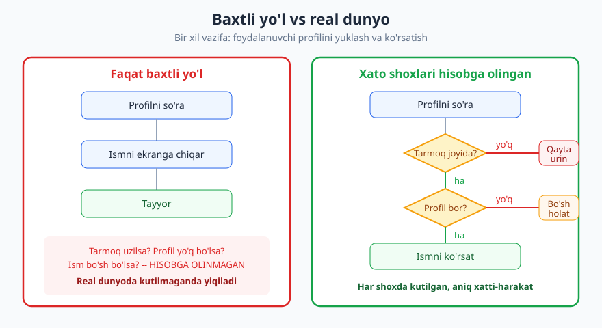
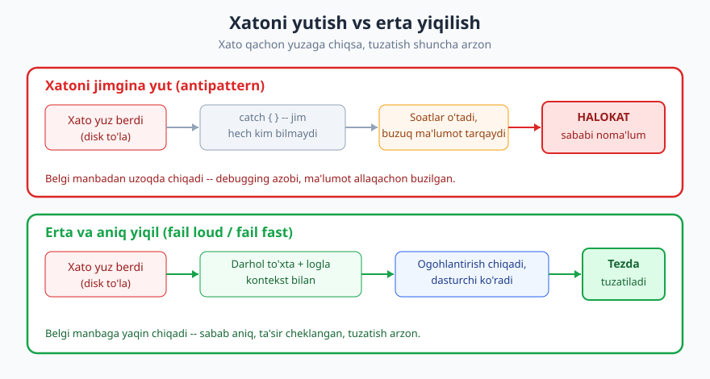
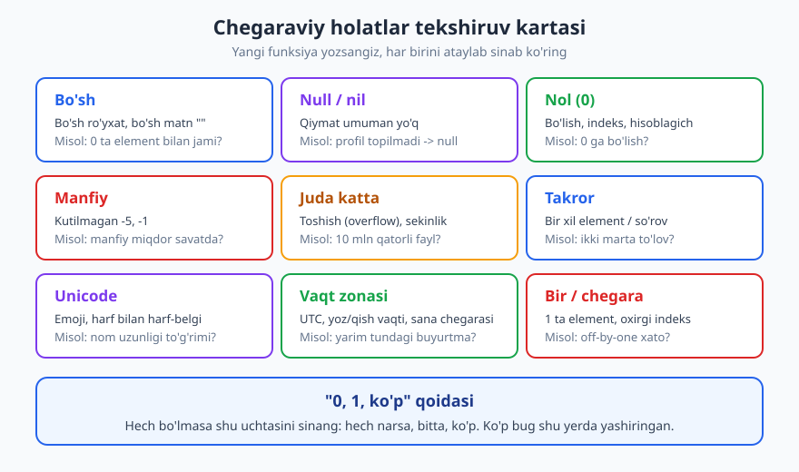

# 08 — Xatolarni boshqarish va mudofaaviy dasturlash

[⬅️ Oldingi: 07 — Izoh va o'z-o'zini hujjatlovchi kod](./07-izoh-ozini-hujjatlovchi-kod.md) · [🏠 README](./README.md) · [Keyingi: 09 — Refactoring va kod hidlari ➡️](./09-refactoring-kod-hidlari.md)

---

> **Bu bobda:** kod faqat "hammasi joyida bo'lsa" ishlashi yetarli emasligini ko'rsatamiz. Real dunyoda tarmoq uziladi, fayl yo'qoladi, foydalanuvchi g'alati narsa kiritadi, disk to'ladi. Professional kod xatoga **tayyor** bo'ladi: erta va aniq yiqiladi (fail loud), chegaraviy holatlarni hisobga oladi, kirishga ko'r-ko'rona ishonmaydi va xatoni jimgina yutib yubormaydi. Shu bilan birga "har joyga mudofaa" ham yomon ekanini — muvozanat kerakligini — ko'rib chiqamiz.
>
> **Halollik / Eslatma:** bu yerdagi qoidalar *amaliy yo'l-yo'riq*, qonun emas. "Fail fast" ham, "graceful degradation" ham kontekstga qarab to'g'ri yoki noto'g'ri bo'ladi: skript bilan to'lov tizimi bir xil emas. Misollar Python/JavaScript va psevdokodda; g'oyalar har qanday tilda bir xil amal qiladi. Qayerda fikr/tajriba borligini ochiq aytaman.

---

## "Baxtli yo'l" yetarli emas

Yangi dasturchi kod yozganda ko'pincha bitta stsenariyni o'ylaydi: **hammasi joyida bo'lsa nima bo'ladi**. Foydalanuvchi to'g'ri kiritadi, tarmoq ishlaydi, fayl bor, server javob beradi. Buni **baxtli yo'l** (happy path) deyishadi. Demoda hammasi chiroyli.

Keyin kod real dunyoga chiqadi — va real dunyo baxtli emas:

- Tarmoq yarim so'rovda uziladi.
- O'qimoqchi bo'lgan fayl o'chirilgan.
- Foydalanuvchi "yosh" maydoniga `o'ttiz` deb yozadi.
- Tashqi API 500 qaytaradi yoki 8 soniya kutadi.
- Disk to'ladi, xotira tugadi.
- Ikki foydalanuvchi bir vaqtda bir xil narsani o'zgartiradi.

Professional kod bilan boshlovchi kod orasidagi eng katta farqlardan biri shu: **professional baxtsiz yo'llarni ham o'ylaydi**. Quyidagi diagrammada bir xil vazifa ikki xil yozilgan — chapda faqat baxtli yo'l, o'ngda xato shoxlari hisobga olingan oqim.



> **Eslatma:** "baxtsiz yo'l"ni o'ylash — bu pessimizm emas, bu **mas'uliyat**. Sizning kodingiz kimningdir pulini, ma'lumotini yoki vaqtini boshqaradi. "Bunday bo'lmaydi" — eng qimmat jumlalardan biri.

---

## Fail loud, fail fast: eng muhim qoida

Eng yomon antipattern — **xatoni jimgina yutib yuborish**. Bu shunday ko'rinadi:

```js
// ❌ YOMON: bo'sh catch — eng yomon antipattern
try {
  saqla(buyurtma);
} catch (e) {
  // jim... hech kim hech qachon bilmaydi
}
```

Bu kod "ishlayaptiganga o'xshaydi", lekin aslida xato yuz berganda **hech narsa bo'lmaydi**: buyurtma saqlanmaydi, ammo foydalanuvchi "muvaffaqiyatli" xabarini ko'radi. Muammo soatlar yoki kunlar keyin, mutlaqo boshqa joyda — masalan, "nega bu buyurtma yo'q?" degan shikoyat shaklida — chiqadi. Sabab manbadan juda uzoq, debugging azobga aylanadi.

Buning aksi — **fail loud** (baland ovozda yiqil) va **fail fast** (erta yiqil): xatoni darhol, manbada, aniq xabar bilan ko'rsat.

```js
// ✅ YAXSHI: xatoni manbada ushla, kontekst bilan logla, yuqoriga uzat
try {
  saqla(buyurtma);
} catch (e) {
  logger.error("Buyurtma saqlanmadi", { buyurtmaId: buyurtma.id, sabab: e.message });
  throw new BuyurtmaSaqlanmadi(buyurtma.id, { cause: e });
}
```

Endi xato yuz berganda: log yoziladi (kontekst bilan), istisno yuqoriga uzatiladi, foydalanuvchi "saqlanmadi" deb to'g'ri xabar oladi. Muammo manbaga yaqin, sabab aniq.



**Nega erta yiqilish yaxshi?** Chunki xato yuzaga chiqqan joy bilan uning manbai orasidagi masofa qancha kichik bo'lsa, tuzatish shuncha arzon. Manbada yiqilsangiz — stack-trace to'g'ridan-to'g'ri aybdorni ko'rsatadi. Yutib yuborib, keyin boshqa joyda yiqilsangiz — bir necha soat ipni teskari tortishingizga to'g'ri keladi.

> **Trade-off:** "fail loud" har joyda emas. Foydalanuvchi yuzidagi ilovada butun dasturni qulatish o'rniga, ba'zan **xatoni ushlab, foydalanuvchiga muloyim xabar ko'rsatish** to'g'ri (graceful degradation). Qoida bunday: xatoni *yutma*, lekin *qayerda* ushlashni tanla. Eng past darajada logla va yuqoriga uzat; eng yuqori, foydalanuvchiga yaqin darajada esa ushlab, chiroyli xabarga aylantir. "Fail loud" = xatoni ko'rinmas qilma; "qaerda yiqil" = arxitektura qarori.

### Bo'sh catch'ning ukalari

Bo'sh `catch` yagona gunoh emas. Quyidagilar ham xatoni yashiradi:

```python
# ❌ Xatoni "loglab" yutish, lekin baribir davom etish (kontekst buzilgan holatda)
try:
    balans = hisobla(hisob)
except Exception as e:
    print(e)        # ekranga chiqdi, lekin balans endi noaniq
    balans = 0      # ...va 0 bilan davom etamiz — yanada xavfli!
```

Bu yerda xato "ko'rindi", lekin kod buzuq holatda davom etdi: `balans = 0` bilan ishlash, ehtimol, xatoning o'zidan ham xavflroq. Ba'zan **to'xtash davom etishdan xavfsizroq**.

---

## Xato turlarini ajrating: kutilgan vs kutilmagan

Hamma "xato" bir xil emas. Eng muhim ajratma — **kutilgan** va **kutilmagan** xatolar.

| Tur | Misol | Kim aybdor | Nima qilish |
|---|---|---|---|
| **Kutilgan** | Foydalanuvchi noto'g'ri parol kiritdi; fayl topilmadi; forma maydoni bo'sh | Hech kim — bu normal hayot | Boshqar: muloyim xabar, qayta so'ra. Yiqilma. |
| **Kutilmagan** | `null` ga `.length` chaqirildi; massiv chegarasidan tashqari; mantiqiy g'ayritabiiy holat | Dasturchi (bug) | Loglab yiqil: bu kod xatosi, yashirma. |

Bu ajratma kodda qanday ko'rinadi? **Kutilgan** xatoni odatda funksiya **qaytaradi** yoki ushlanadigan istisno bilan signal beradi — chaqiruvchi uni boshqarishi shart. **Kutilmagan** xato esa odatda **istisno** (exception) bo'lib yuqoriga uchadi — chunki uni "boshqarish"ning ma'nosi yo'q, faqat loglab, dasturchi tuzatishi kerak.

```python
# Kutilgan xato: qiymat sifatida qaytariladi, chaqiruvchi boshqaradi
def parol_tekshir(kiritilgan, hash):
    if not mos(kiritilgan, hash):
        return Xato("Parol noto'g'ri")   # bu NORMAL, yiqilmaymiz
    return Ok()

# Kutilmagan xato: istisno bo'lib uchadi, biz uni boshqarmaymiz
def foiz_hisobla(summa, stavka):
    if stavka is None:
        # bu KOD xatosi: stavka hech qachon None bo'lmasligi kerak edi
        raise ValueError(f"stavka None bo'lib qoldi, summa={summa}")
    return summa * stavka
```

> **Eslatma:** istisno (exception) vs qaytarilgan xato qiymati — bu tilga bog'liq uslub masalasi. Go va Rust xatoni qiymat sifatida qaytarishni afzal ko'radi; Python/Java/JS istisnodan ko'proq foydalanadi. Muhim g'oya tildan ustun: **kutilganni boshqar, kutilmaganni yuqoriga uzat**. Qaysi mexanizm — ikkinchi darajali.

---

## Chegaraviy holatlar: bug'lar yashiringan joy

Bug'larning aksariyati "o'rta"da emas, **chegarada** yashiringan. Funksiyangiz `[1, 2, 3]` bilan ishlaydi — ajoyib. Lekin `[]` bilan? `null` bilan? `0` bilan? Manfiy son bilan? Mana shu yerda kod yiqiladi.

Mashhur **"0, 1, ko'p" qoidasi**: yangi kod yozsangiz, hech bo'lmasa shu uchta holatni sinang — *hech narsa* (bo'sh/0), *bitta*, *ko'p*. Aksar chegaraviy bug shu uchtasidan kelib chiqadi.



Klassik misol — o'rtachani hisoblash:

```python
# ❌ Bo'sh ro'yxatda 0 ga bo'lish — ZeroDivisionError bilan yiqiladi
def ortacha(sonlar):
    return sum(sonlar) / len(sonlar)

ortacha([])   # BUM!

# ✅ Chegaraviy holat ataylab boshqarilgan
def ortacha(sonlar):
    if not sonlar:                 # bo'sh holat
        return None                # yoki 0, yoki istisno — qaroringizni hujjatlang
    return sum(sonlar) / len(sonlar)
```

Yana bir keng tarqalgan tuzoq — `null`/`nil`ni unutish:

```js
// ❌ profil null bo'lsa, .ism .length da yiqiladi
function salomla(profil) {
  return "Salom, " + profil.ism.toUpperCase();
}

// ✅ Yo'qlik ehtimolini ataylab hisobga oldik
function salomla(profil) {
  if (!profil || !profil.ism) {
    return "Salom, mehmon";       // bo'sh holat uchun mazmunli javob
  }
  return "Salom, " + profil.ism.toUpperCase();
}
```

Eslab qoladigan chegaralar ro'yxati: **bo'sh** (`[]`, `""`), **null/nil**, **0**, **manfiy**, **juda katta** (toshish, sekinlik), **takror** (bir narsa ikki marta), **unicode/emoji** (matn uzunligi baytmi yoki belgimi?), **vaqt zonasi va sana chegarasi** (yarim tun, yoz/qish vaqti, oyning oxirgi kuni).

> **Trade-off:** har bir chegara uchun ham alohida shox yozish kodni shishiradi. To'g'ri yondashuv — **yuqori xavfli funksiyalarda** (pul, ma'lumot yo'qotish, tashqi kirish) chegaralarni qattiq tekshirish; ichki yordamchi funksiyalarda esa, agar kirish allaqachon tekshirilgan bo'lsa, takrorlamaslik. Bu bizni keyingi g'oyaga olib keladi.

---

## Kirishga ishonmang: chegarada tekshir, ichkarida ishon

Sog'lom mudofaaviy strategiya — **tizim chegarasida** kirishni tekshirish, ichkarida esa ma'lumot allaqachon ishonchli deb hisoblash. Chegara — bu foydalanuvchi formasi, HTTP so'rovi, fayldan o'qish, tashqi API javobi: tizimga **tashqaridan** kirgan hamma narsa.

```python
# Chegara (kontroller / API kirishi): qattiq tekshir
def buyurtma_yarat_handler(sorov):
    miqdor = sorov.get("miqdor")
    if not isinstance(miqdor, int) or miqdor <= 0:
        return xato_javob(400, "miqdor musbat butun son bo'lishi kerak")
    # endi ichkariga FAQAT tozalangan ma'lumot kiradi
    return xizmat.buyurtma_yarat(miqdor)

# Ichkari (xizmat qatlami): miqdor allaqachon to'g'ri deb ishonamiz
def buyurtma_yarat(miqdor):
    # bu yerda yana miqdor > 0 ni tekshirmaymiz — chegara bunga kafolat berdi
    return ombor.kamaytir(miqdor)
```

Bu **"tashqi dunyo dushman, ichki dunyo do'st"** modeli: sirtda — paranoyak, ichkarida — ishonchli. Bu nafaqat tozaroq kod beradi, balki bir muhim xavfsizlik amaliyoti hamdir — kirishni ishonchsiz deb bilish injection va boshqa hujumlarning oldini oladi. Bu mavzuni chuqurroq [12-bob — Xavfsiz kod yozish asoslari](./12-xavfsiz-kod-asoslari.md) yoritadi.

> **Eslatma:** "ichkarida ishon" degani "ichkarini hech qachon tekshirma" degani emas. Mantiqiy invariantlarni (masalan, "balans hech qachon manfiy bo'lmasligi kerak") **assertion** yoki kutilmagan-istisno bilan himoyalash o'rinli — bu kod xatosini erta ushlaydi. Farq shunda: tashqi kirishni *kutilgan* xato deb (muloyim boshqar), ichki invariant buzilishini *kutilmagan* deb (yiqil) ko'ramiz.

---

## Xato xabari: ikki auditoriya, ikki til

Yaxshi xato xabari ikki kishiga gapiradi — va ular boshqa narsa eshitishi kerak.

| Auditoriya | Nima ko'rsin | Misol |
|---|---|---|
| **Foydalanuvchi** | Tushunarli, tinch, "endi nima qilay" | "Hisobingizga kira olmadik. Internet ulanishini tekshirib, qayta urinib ko'ring." |
| **Dasturchi (log)** | Diagnostik: kontekst, ID, sabab, stack-trace | `LoginFailed user_id=4471 reason=timeout upstream=auth-svc latency=8200ms` |

```js
// ❌ Foydalanuvchiga ichki tafsilot oqib chiqyapti — chalkash VA xavfli
catch (e) {
  ekranda(e.stack);   // "TypeError: cannot read 'token' of undefined at auth.js:84..."
}

// ✅ Foydalanuvchiga tinch xabar, dasturchiga to'liq diagnostika
catch (e) {
  logger.error("Login muvaffaqiyatsiz", { userId, sabab: e.message, stack: e.stack });
  ekranda("Hisobingizga kira olmadik. Birozdan keyin qayta urinib ko'ring.");
}
```

Ikki muhim qoida:

1. **Maxfiy ma'lumotni oshkor qilmang.** Xato xabari (yoki log) parol, token, ichki yo'l, SQL so'rovi yoki shaxsiy ma'lumotni chiqarmasin. Hujumchi aynan xato xabarlaridan tizim haqida ma'lumot to'playdi. (Batafsil: [12-bob — Xavfsiz kod](./12-xavfsiz-kod-asoslari.md).)
2. **Kontekst qo'shing.** "Xato yuz berdi" — befoyda. "Buyurtma #4471 saqlanmadi: to'lov xizmati 8.2s kutib timeout berdi" — bu sizni to'g'ridan-to'g'ri muammoga olib boradi.

---

## Qayta urinish, zaxira va muloyim degradatsiya

Hamma xato ham "yiqil va bo'ldi" emas. Ayniqsa **tashqi** (tarmoq, API, ma'lumotlar bazasi) xatolari ko'pincha **vaqtinchalik**: bir soniyadan keyin so'rov muvaffaqiyat bilan o'tadi. Shu yerda uchta vosita yordam beradi.

**1. Qayta urinish (retry) — backoff bilan.** Vaqtinchalik xatoda darhol taslim bo'lmang; bir oz kutib, qayta urining. Lekin **eksponensial backoff** ishlating (1s, 2s, 4s...) — aks holda yiqilgan serverni navbatdagi so'rovlar bilan yana ham qattiqroq uribsiz.

```python
# Soddalashtirilgan retry + eksponensial backoff
def so'rov_yubor(url, urinishlar=3):
    for n in range(urinishlar):
        try:
            return http_get(url)
        except VaqtinchalikXato:
            if n == urinishlar - 1:
                raise                     # oxirgi urinish ham yiqildi -> fail loud
            kut(2 ** n)                    # 1s, 2s, 4s — backoff
```

> **Eslatma:** faqat **vaqtinchalik** xatoni qayta urinish kerak (timeout, 503). 400 "noto'g'ri so'rov"ni yoki 401 "ruxsat yo'q"ni qayta urinish befoyda — natija o'zgarmaydi, faqat vaqt ketadi. Yana: qayta urinish faqat **idempotent** amalda xavfsiz; "to'lovni amalga oshir"ni ko'r-ko'rona qayta urinsangiz, mijozdan ikki marta yechib olishingiz mumkin.

**2. Zaxira (fallback).** Asosiy yo'l ishlamasa, kamroq mukammal, lekin ishlaydigan zaxiraga o'ting: kesh'dan eski qiymat, standart qiymat, soddalashtirilgan rejim.

**3. Muloyim degradatsiya (graceful degradation).** Bitta qism yiqilganda butun tizim qulamaydi — faqat o'sha qism ishlamaydi. Tavsiyalar xizmati o'lsa, sahifa baribir ochiladi, shunchaki "tavsiya yo'q". Bu — **resilience** (chidamlilik) tafakkuri; tizim darajasidagi naqshlar (circuit breaker, bulkhead, timeout byudjeti) [Dasturlash arxitekturasi](../arxitektura/README.md) kitobida chuqur yoritilgan.

---

## Halollik: ortiqcha mudofaa ham xato

Hozirgacha "ko'proq tekshir" dedik. Endi muvozanat: **har joyga, har holatga mudofaa qo'yish ham yomon**. Bu **paranoyak kod** deb ataladi va o'z narxi bor:

```python
# ❌ Ortiqcha mudofaa: har qatorda takror tekshiruv (shovqin)
def jami(buyurtma):
    if buyurtma is None: return 0
    if not hasattr(buyurtma, "qatorlar"): return 0
    if buyurtma.qatorlar is None: return 0
    s = 0
    for q in buyurtma.qatorlar:
        if q is None: continue
        if q.narx is None: continue
        if q.soni is None: continue
        if q.narx < 0: continue
        # ...asl mantiq shu shovqin ostida ko'milgan
        s += q.narx * q.soni
    return s
```

Bu kodning muammolari: (1) **asl niyat** o'nlab `if`lar ostida ko'rinmaydi; (2) bu tekshiruvlar ko'pincha "bo'lishi mumkin emas" holatlarni *jimgina yutadi* — ya'ni biz aynan yutmaslikka harakat qilgan antipatternga qaytdik; (3) har bir keraksiz `if` — o'qishni va keyin o'zgartirishni qiyinlashtiradi.

To'g'ri yondashuv — **chegarada bir marta** tekshirish, ichkarida toza mantiq yozish:

```python
# ✅ Kirish chegarada tozalangan; bu funksiya toza invariantga tayanadi
def jami(buyurtma):
    # buyurtma va uning qatorlari yaroqli — bunga chegara kafolat bergan
    return sum(q.narx * q.soni for q in buyurtma.qatorlar)
```

| Vaziyat | Mudofaani oshir | Mudofaani kamaytir |
|---|---|---|
| Tashqi kirish (forma, API, fayl) | ✅ qattiq tekshir | |
| Pul, ma'lumot yo'qotish xavfi | ✅ paranoyak bo'l | |
| Tekshirilgan ma'lumot bilan ichki funksiya | | ✅ ishon, takrorlama |
| Bir marotabalik skript, prototip | | ✅ minimal, tez |
| "Bunday bo'lishi mumkin emas" holat | assertion bilan ushla (yutma) | har joyga `if` qo'yma |

> **Trade-off:** mudofaaviy dasturlash — bu *spektr*, ikkita uchi ham xato. Bir uchda — hech narsa tekshirmaydigan, baxtli yo'lga ishongan mo'rt kod. Ikkinchi uchda — har qatorni o'rab, xatolarni shovqinga ko'mib yutadigan, sekin va o'qib bo'lmas paranoyak kod. **Mahorat — kontekstga qarab to'g'ri nuqtani topish.** To'lov tizimi bilan dam olish kunidagi shaxsiy skript bir xil emas.

---

## Asosiy g'oyalar (bobni qisqacha)

- **Baxtli yo'l yetarli emas:** real dunyo tarmoq uzilishi, yo'q fayl, g'alati kirish bilan to'la. Professional kod baxtsiz yo'llarni ham ataylab o'ylaydi.
- **Fail loud, fail fast:** xatoni jimgina **yutma** (bo'sh `catch` — eng yomon antipattern). Manbada, kontekst bilan logla va yuqoriga uzat. Xato manbaga qancha yaqin chiqsa, tuzatish shuncha arzon.
- **Kutilgan vs kutilmagan:** kutilgan xatoni **boshqar** (muloyim xabar, qayta so'ra); kutilmaganni (bug) **loglab yuqoriga uzat**. Bu ajratma — xatolar bilan ishlashning yuragi.
- **Chegaraviy holatlar:** bug'lar chegarada yashiringan — **bo'sh, null, 0, manfiy, juda katta, takror, unicode, vaqt zonasi**. Hech bo'lmasa **"0, 1, ko'p"** qoidasini har funksiyada sinang.
- **Chegarada tekshir, ichkarida ishon:** tizim sirtida (kirish) qattiq validatsiya; ichkarida tozalangan ma'lumotga tayan. Tashqi dunyo dushman, ichki dunyo do'st.
- **Xato xabari ikki auditoriyaga:** foydalanuvchiga tinch va aniq, dasturchiga diagnostik (kontekst+stack). Maxfiy ma'lumotni hech qachon oshkor qilma.
- **Muvozanat:** retry/backoff, fallback va muloyim degratsiya chidamlilik beradi — lekin **ortiqcha mudofaa** (paranoyak kod) ham shovqin, sekinlik va yashirin yutilgan xato keltiradi. Kontekstga qarab to'g'ri nuqtani toping.

---

## Mashqlar

> Eslatma: bu mashqlarning ko'pi amaliy/refleksiv. "Yagona to'g'ri javob" har doim ham yo'q — yechimlar namuna va mezon sifatida berilgan.

### Oson

**1-mashq.** Quyidagi kodda qaysi **chegaraviy holat** unutilgan? Tuzating.
```python
def oxirgi_element(royxat):
    return royxat[-1]
```

**2-mashq.** Quyidagi `catch` nima uchun "eng yomon antipattern"ga misol? Uni `fail loud` qoidasiga mos qilib qayta yozing.
```js
try {
  faylniSaqla(data);
} catch (e) {}
```

**3-mashq.** Quyidagi ikki holatni "kutilgan" yoki "kutilmagan" xatoga ajrating va har biri uchun kod nima qilishi kerakligini bir jumlada ayting: (a) foydalanuvchi login formasiga noto'g'ri parol kiritdi; (b) ichki funksiyaga `narx` parametri `null` bo'lib keldi (u hech qachon `null` bo'lmasligi kerak edi).

### O'rta

**4-mashq.** Quyidagi kodda **qaysi chegara holat unutilgan**? Toping va tuzating (bittadan ortiq bo'lishi mumkin).
```python
def chegirma_narx(narx, foiz):
    return narx - narx * foiz / 100
```

**5-mashq.** Quyidagi retry kodida ikkita xato bor (qaysi xatoni qayta urinish kerak emasligi va backoff yo'qligi). Toping va tuzating.
```python
def get(url):
    for n in range(5):
        try:
            return http_get(url)   # 400, 401 ham qayta uriniladi
        except Exception:
            continue               # backoffsiz, darhol qayta
```

**6-mashq.** Bitta xato xabarini ikki versiyada yozing — biri foydalanuvchiga, biri logga — quyidagi vaziyat uchun: to'lov xizmati 9 soniya kutib timeout berdi, foydalanuvchi `user_id=88` to'lov qilmoqchi edi. Foydalanuvchi versiyasida maxfiy ma'lumot bo'lmasin.

### Qiyin

**7-mashq.** Quyidagi "paranoyak" funksiya ortiqcha mudofaadan aziyat chekadi (shovqin + yashirin yutish). Uni "chegarada tekshir, ichkarida ishon" tamoyiliga ko'ra ikki funksiyaga (chegara validatsiyasi + toza ichki mantiq) ajrating.
```python
def jami_hisobla(savat):
    if savat is None: return 0
    if not isinstance(savat, list): return 0
    s = 0
    for x in savat:
        if x is None: continue
        if not hasattr(x, "narx"): continue
        if x.narx is None: continue
        if x.narx < 0: continue
        s += x.narx
    return s
```

**8-mashq.** "0, 1, ko'p" + chegaraviy holatlar bo'yicha audit qiling. Quyidagi funksiya berilgan ro'yxatni `n` ta bo'lakka teng bo'ladi. **Qaysi chegara holatlar unutilgan?** Kamida 4 tasini sanang va har biriga qisqacha "nima bo'ladi" deb javob bering.
```python
def bolaklarga_boel(royxat, n):
    bolak_olchami = len(royxat) // n
    return [royxat[i:i+bolak_olchami] for i in range(0, len(royxat), bolak_olchami)]
```

<details markdown="1">
<summary>Yechimlar</summary>

### 1-mashq yechimi
Unutilgan chegara — **bo'sh ro'yxat**. `[][-1]` `IndexError` beradi. Tuzatish — bo'sh holatni ataylab boshqarish:
```python
def oxirgi_element(royxat):
    if not royxat:
        return None        # yoki istisno ko'taring — qaroringizni hujjatlang
    return royxat[-1]
```
Qaroringizni hujjatlash muhim: `None` qaytarish bilan istisno ko'tarishning trade-off'i bor (chaqiruvchi `None`ni unutsa, muammo keyinroq chiqadi).

### 2-mashq yechimi
Bo'sh `catch` xatoni **jimgina yutadi**: fayl saqlanmasa ham hech kim bilmaydi, foydalanuvchi "saqlandi" deb o'ylaydi, muammo keyinroq mutlaqo boshqa joyda chiqadi. `fail loud` versiyasi:
```js
try {
  faylniSaqla(data);
} catch (e) {
  logger.error("Faylni saqlab bo'lmadi", { sabab: e.message, stack: e.stack });
  throw e;   // yuqoriga uzat — chaqiruvchi qaror qabul qilsin
}
```

### 3-mashq yechimi
- **(a) Kutilgan.** Foydalanuvchi noto'g'ri parol kiritishi — normal hayot. Kod buni boshqarishi kerak: muloyim "Parol noto'g'ri" xabari, qayta urinishga ruxsat. **Yiqilmaslik kerak.**
- **(b) Kutilmagan.** `narx`ning `null` bo'lishi — kod xatosi (bug); u hech qachon bunday bo'lmasligi kerak edi. Kod buni **loglab, istisno bilan yiqilishi** kerak — yashirib, masalan `narx=0` bilan davom etish yanada xavfli.

### 4-mashq yechimi
Unutilgan chegaralar:
- **Manfiy foiz** (`foiz < 0`) — narxni oshirib yuboradi.
- **100 dan katta foiz** — manfiy narx beradi (mijoz pul oladimi?).
- **Manfiy narx** — kirish allaqachon noto'g'ri.

Tuzatish (chegarada tekshirish):
```python
def chegirma_narx(narx, foiz):
    if narx < 0:
        raise ValueError(f"narx manfiy bo'lolmaydi: {narx}")
    if not (0 <= foiz <= 100):
        raise ValueError(f"foiz 0..100 oralig'ida bo'lishi kerak: {foiz}")
    return narx - narx * foiz / 100
```
(Trade-off: 0 va 100 chegaralarining o'zini kiritish/kiritmaslik biznes qaroriga bog'liq — buni aniqlashtiring.)

### 5-mashq yechimi
Ikki xato: (1) **hamma** istisno qayta uriniladi — 400/401 kabi doimiy xatolarni qayta urinish befoyda; (2) **backoff yo'q** — darhol qayta urinish yiqilgan serverni yanada uradi. Tuzatish:
```python
def get(url):
    for n in range(5):
        try:
            return http_get(url)
        except VaqtinchalikXato:        # FAQAT vaqtinchalik (timeout, 503)
            if n == 4:
                raise                    # oxirgisi ham yiqildi -> fail loud
            kut(2 ** n)                  # eksponensial backoff
        # doimiy xatolar (400, 401) umuman ushlanmaydi -> darhol yuqoriga uchadi
```

### 6-mashq yechimi
- **Foydalanuvchiga (tinch, maxfiyatsiz):** "To'lovni yakunlay olmadik. Birozdan keyin qayta urinib ko'ring. Pulingiz yechilmadi."
- **Logga (diagnostik):** `PaymentFailed user_id=88 reason=timeout upstream=payment-gw latency=9000ms request_id=...`

E'tibor bering: foydalanuvchi versiyasida `user_id`, ichki xizmat nomi, latency yo'q — bular faqat logda. "Pulingiz yechilmadi" — foydalanuvchining eng katta tashvishiga javob.

### 7-mashq yechimi
Chegarada bir marta tekshir, ichki mantiqni toza qoldir:
```python
def savatni_tekshir(savat):
    if not isinstance(savat, list):
        raise ValueError("savat ro'yxat bo'lishi kerak")
    for x in savat:
        if x.narx is None or x.narx < 0:
            raise ValueError(f"yaroqsiz narx: {x.narx}")
    return savat

def jami_hisobla(savat):
    # savat allaqachon tekshirilgan -> toza, ishonchli
    return sum(x.narx for x in savat)
```
Endi `jami_hisobla` niyatni aniq ko'rsatadi va xatoni yutmaydi — yaroqsiz savat chegarada **baland ovozda** yiqiladi.

### 8-mashq yechimi
Unutilgan chegaralar (kamida 4 ta):
1. **`n == 0`** — `len // 0` → `ZeroDivisionError`. Yiqiladi.
2. **Bo'sh ro'yxat** (`[]`) — `bolak_olchami = 0`, keyin `range(0, 0, 0)` → `ValueError: range() arg 3 must not be zero`. Yiqiladi.
3. **`n > len(royxat)`** — `bolak_olchami = 0`, yana qadam 0 bilan `ValueError`. Yiqiladi.
4. **Teng bo'linmaydigan holat** (mas. 10 element, n=3) — `bolak_olchami=3`, natijada 4 ta bo'lak (3+3+3+1) chiqadi, `n=3` so'ralgan bo'lsa-da. Mantiqiy xato (jim, yiqilmaydi — yanada xavfli).
5. (qo'shimcha) **`n` manfiy** — kutilmagan natija.

Saboq: bu funksiya faqat "yaxshi" kirish (katta ro'yxat, teng bo'linadigan `n`) uchun yozilgan — klassik baxtli yo'l. `n=0` va bo'sh ro'yxatni ataylab boshqarish (yoki chegarada `raise`) kerak edi.

</details>

---

[⬅️ Oldingi: 07 — Izoh va o'z-o'zini hujjatlovchi kod](./07-izoh-ozini-hujjatlovchi-kod.md) · [🏠 README](./README.md) · [Keyingi: 09 — Refactoring va kod hidlari ➡️](./09-refactoring-kod-hidlari.md)
