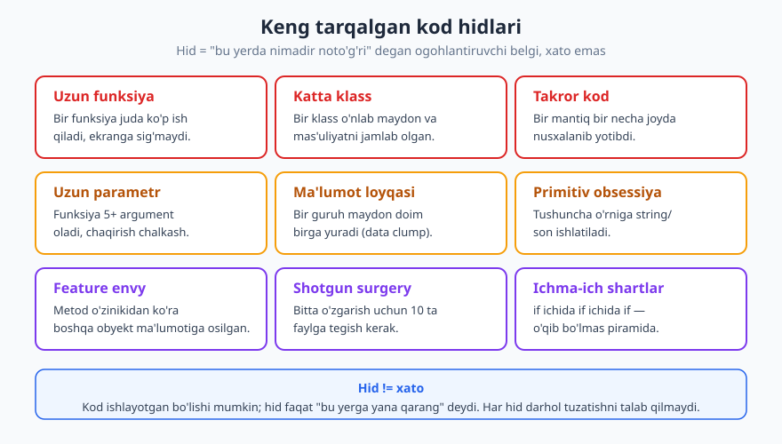
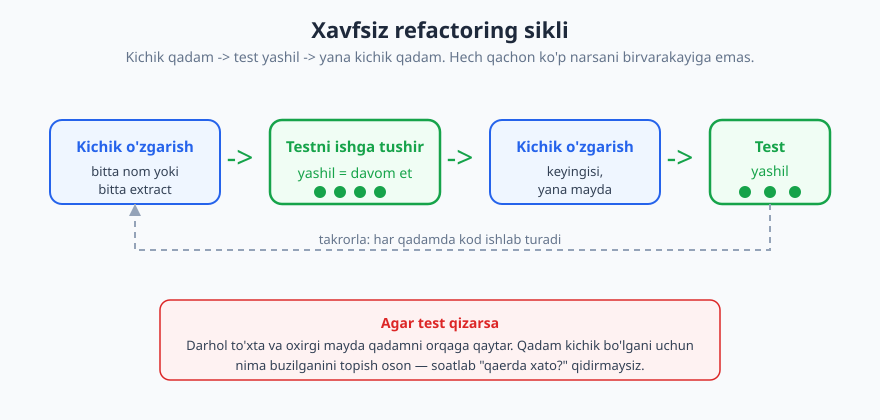
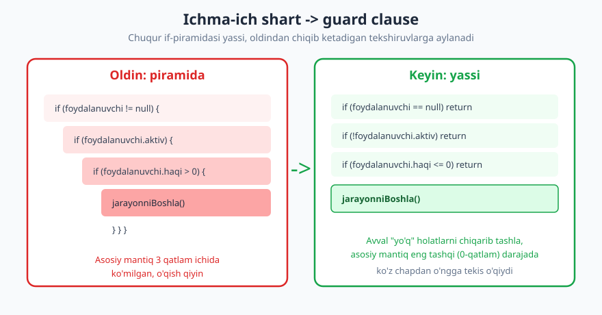

# 09 — Refactoring va kod hidlari

[⬅️ Oldingi: 08 — Xatolarni boshqarish va mudofaaviy dasturlash](./08-xatolarni-boshqarish.md) · [🏠 README](./README.md) · [Keyingi: 10 — Texnik qarz: tushunish va boshqarish ➡️](./10-texnik-qarz.md)

---

> **Bu bobda:** *Refactoring* — kodning tashqi xatti-harakatini o'zgartirmasdan uning ichki tuzilishini yaxshilash san'ati. Siz keng tarqalgan **kod hidlari** (code smells) — uzun funksiya, takror kod, ichma-ich shartlar va boshqalarni tanib olishni, ularni **kichik, xavfsiz qadamlar** bilan tuzatishni, va eng muhimi — *qachon refactor qilish, qachon to'xtash* kerakligini o'rganasiz.
>
> **Halollik / Eslatma:** Bu yerdagi "hid"lar — qonun emas, *e'tibor qaratish belgilari*. Ko'p hid kontekstda mutlaqo to'g'ri bo'lishi mumkin. Refactoring ham — perfeksionizm uchun bahona emas; maqsadi go'zallik emas, **keyingi o'zgarishni osonlashtirish**. Bu bobdagi misollar til-mustaqil; sintaksis emas, g'oya muhim.

---

## Refactoring nima — va nima EMAS

Refactoring atamasini Martin Fowler mashhur qilgan. Uning ta'rifi aniq va qattiq:

> **Refactoring** — dasturning *kuzatiladigan tashqi xatti-harakatini o'zgartirmasdan* uning ichki tuzilishini yaxshilashga qaratilgan o'zgartirish.

Bu ta'rifdagi har bir so'z muhim. "Tashqi xatti-harakatni o'zgartirmasdan" degani: dastur refactoring'dan oldin nima qilgan bo'lsa, keyin ham *aynan o'sha*ni qiladi. Foydalanuvchi farqni sezmaydi. Faqat kod — uni o'qiydigan va o'zgartiradigan dasturchi uchun — toza bo'ladi.

Shuning uchun bu narsalar refactoring **EMAS**:

| Bu refactoring EMAS | Chunki |
|---|---|
| Yangi funksiya qo'shish | Xatti-harakat o'zgaradi (yangi imkoniyat paydo bo'ladi) |
| Bag (xato) tuzatish | Xatti-harakat o'zgaradi (noto'g'ridan to'g'riga) |
| Tezlikni optimallashtirish | Tashqi natija o'sha, lekin bu alohida intizom (xulq o'zgarmaydi, ammo maqsad boshqa) |
| "Hammasini qaytadan yozish" | Bu *rewrite*, refactoring emas — quyida ko'ramiz |

Eng muhim qoida: **bir vaqtning o'zida refactor QILMANG va xulqni o'zgartirmang.** Ikkala ishni aralashtirsangiz, test qizarganda — bu refactoring xatosimi yoki yangi funksiya xatosimi — bilolmaysiz. Bir paytda bitta "shlyapa" kiying: yo *refactoring shlyapasi* (tuzilish, xulq o'zgarmaydi), yo *funksiya shlyapasi* (yangi xulq). Ikkalasini keti-ketin qiling, aralashtirib emas.

```text
# ❌ Bitta commit'da hammasi aralash
- funksiyani 3 ga bo'ldim
- bir bug tuzatdim
- yangi parametr qo'shdim
(test qizardi — qaysi biri sabab? noma'lum)

# ✅ Alohida, ketma-ket
commit 1: refactor — funksiyani 3 ga bo'ldim (test yashil)
commit 2: fix — chegaraviy bug tuzatildi (test yashil)
commit 3: feat — yangi parametr (test yashil)
```

---

## Kod hidlari: "bu yerga yana qarang" signallari

**Kod hidi (code smell)** — kodning sirtidagi, chuqurroq muammoga ishora qiluvchi belgi. Bu atamani Kent Beck o'ylab topgan. Muhim nuqta: **hid xato emas.** Kod ishlashi mumkin, testlar o'tishi mumkin — lekin hid "bu yerni o'zgartirish qiyin bo'ladi" deb shipshib turadi.



Mana eng tez-tez uchraydiganlari:

- **Uzun funksiya** — bir funksiya juda ko'p ish qiladi, ekranga sig'maydi, "u nima qiladi?" degan savolga bir jumlada javob berolmaysiz. Eng keng tarqalgan hid.
- **Katta klass (God object)** — bir klass o'nlab maydon va mas'uliyatni o'ziga yig'ib olgan; "hamma narsa shu yerda".
- **Takror kod (duplication)** — bir xil yoki deyarli bir xil mantiq bir necha joyda nusxalangan. Birini tuzatsangiz, qolganlari eskirib qoladi.
- **Uzun parametr ro'yxati** — funksiya 5-6 ta argument oladi; chaqirishda qaysi qiymat qaysi joyga tushishini eslab bo'lmaydi.
- **Ma'lumot loyqasi (data clump)** — bir guruh o'zgaruvchilar doim birga sayohat qiladi (mas. `kun, oy, yil` yoki `lat, lon`). Ular aslida bitta tushuncha.
- **Primitiv obsessiya (primitive obsession)** — tushunchani o'z tipi o'rniga oddiy `string`/`int` bilan ifodalash (mas. pul miqdorini `float`, telefon raqamini `string` bilan).
- **Feature envy** — metod o'z klassi ma'lumotidan ko'ra *boshqa* obyektning ma'lumotiga ko'proq qiziqadi; mantiq noto'g'ri joyda turibdi.
- **Shotgun surgery** — bitta o'zgarishni amalga oshirish uchun ko'p faylga teginish kerak; o'zgarish bir joyga jamlanmagan.
- **Ichma-ich shartlar (nested conditionals)** — `if` ichida `if` ichida `if`; asosiy mantiq qatlamlar tagiga ko'milgan.

> **Trade-off:** Hid topish — hukm chiqarish emas. "Uzun funksiya" 60 qator bo'lsa-yu, ammo ketma-ket o'qiladigan, hech qachon o'zgarmaydigan migratsiya skripti bo'lsa — uni bo'lakka ajratish faqat zarar keltirishi mumkin. Hid sizni *to'xtatib o'ylashga* chaqiradi, avtomatik tuzatishga emas. Qoida: hidni *o'zgartirish vaqti kelganda* tuzating, shunchaki ko'rganingiz uchun emas.

---

## Xavfsiz refactoring: kichik qadamlar va himoya to'ri

Refactoring'ning eng katta xavfi — *ishlayotgan narsani buzish*. Buning oldini oladigan ikki narsa bor: **testlar** va **kichik qadamlar**.

### Testlar — himoya to'ri

Refactoring'ning oltin sharti: **ishonchli testlar to'plami.** Testlar — sizning "himoya to'ringiz" (safety net). Har bir kichik o'zgarishdan keyin testlarni ishga tushirasiz; agar ular yashil bo'lsa, xulq o'zgarmaganiga ishonchingiz komil. Test piramidasi va testlash madaniyati haqida [11-bob](./11-testlash-madaniyati.md)da batafsil.

Agar refactor qilmoqchi bo'lgan kodingizda **test yo'q** bo'lsa-chi? Avval **xarakteristika testi (characterization test)** yozing: kodning *hozir nima qilayotganini* (to'g'rimi-noto'g'rimi, ahamiyatsiz) qayd etadigan test. U "spetsifikatsiya" emas, "hozirgi haqiqatning surati". Shundan keyingina refactor qilasiz — bu test sizni xulqni tasodifan o'zgartirib qo'yishdan saqlaydi.

```text
# Test yo'q legacy funksiya: chegirma_hisobla(narx, mijoz_turi)
# Avval xarakteristika testi: hozir nima qaytaryapti?
assert chegirma_hisobla(100, "oddiy")  == 100
assert chegirma_hisobla(100, "vip")    == 80
assert chegirma_hisobla(100, "nomalum")== 100   # g'alati, lekin HOZIR shunday
# Endi xavfsiz refactor qilamiz — bu testlar yashil qolishi shart
```

### Kichik qadamlar

Refactoring "bir kechada hammasi" emas. U — sikl: **kichik o'zgarish → test → kichik o'zgarish → test.** Har qadamda kod *ishlab turadi*.



Nega kichik? Chunki agar test 10 ta o'zgarishdan keyin qizarsa — qaysi biri sabab bo'lganini topish uchun soatlab qidirasiz. Agar bitta o'zgarishdan keyin qizarsa — sabab aniq, va siz o'sha bitta qadamni bir soniyada orqaga qaytarasiz.

> **Trade-off:** Juda mayda qadamlar sekin tuyuladi — "bir nom o'zgartirib, har safar test?". Tajribasiz, bu vasvasa. Ammo amalda *katta sakrash* ko'pincha sizni "endi nima buzildi?" tuzog'iga tashlaydi va umumiy vaqtni *ko'paytiradi*. Qoidasi: qadamning kattaligini *xavfga* qarab tanlang — tanish, sodda kodda kattaroq; chigal, qo'rqinchli kodda eng mayda.

---

## Klassik refactoring harakatlari

Refactoring — sehr emas, bir nechta nomlangan, takrorlanuvchi harakatlar to'plami. Mana eng ko'p ishlatiladiganlari.

### 1. Funksiyani ajratish (extract function)

Eng muhim harakat. Funksiyaning bir bo'lagini olib, alohida, *yaxshi nomlangan* funksiyaga ko'chirasiz. Nom — izohning o'rnini bosadi.

```text
# ❌ Oldin — izoh "nima"ni tushuntiryapti
function hisobotTayyorla(buyurtmalar) {
  // jami summani hisoblash
  jami = 0
  for (b of buyurtmalar) jami += b.narx * b.soni

  chop(jami)
}

# ✅ Keyin — funksiya nomi izohni o'rinsiz qiladi
function hisobotTayyorla(buyurtmalar) {
  jami = jamiSummaniHisobla(buyurtmalar)
  chop(jami)
}
function jamiSummaniHisobla(buyurtmalar) {
  jami = 0
  for (b of buyurtmalar) jami += b.narx * b.soni
  return jami
}
```

### 2. O'zgaruvchini ajratish (extract variable)

Murakkab ifodani nomli o'zgaruvchiga bo'lasiz, shunda u o'zini tushuntiradi.

```text
# ❌ Oldin
if (buyurtma.narx * buyurtma.soni > 1000 && mijoz.yili > 2) { ... }

# ✅ Keyin
yirikBuyurtma = buyurtma.narx * buyurtma.soni > 1000
sodiqMijoz    = mijoz.yili > 2
if (yirikBuyurtma && sodiqMijoz) { ... }
```

### 3. Qayta nomlash (rename)

Yomon nomni yaxshisiga almashtirish — eng arzon, eng kuchli refactoring. IDE buni bir tugma bilan, butun loyiha bo'ylab xavfsiz qiladi. `d` → `oxirgiKirishKuni`.

### 4. Inline qilish

Ba'zan teskari yo'nalish kerak: ortiqcha mayda funksiya yoki o'zgaruvchi shunchaki "shovqin" bo'lsa, uni joyiga qaytarasiz.

### 5. Parametr obyektini joriy qilish (introduce parameter object)

Doim birga yuradigan parametr guruhini (ma'lumot loyqasi!) bitta obyektga o'rab olasiz. Bu uzun parametr ro'yxatini ham davolaydi.

```text
# ❌ Oldin — ma'lumot loyqasi + uzun ro'yxat
function band(boshKun, boshOy, boshYil, oxirKun, oxirOy, oxirYil) { ... }

# ✅ Keyin — tushuncha o'z obyektiga ega
function band(boshSana, oxirSana) { ... }   # Sana = {kun, oy, yil}
```

### 6. Guard clause bilan ichma-ich shartni yassilash

Ichma-ich shartlar — eng o'qib bo'lmas hidlardan. Davo: "yo'q" holatlarni *boshida* qaytarib yuborasiz (guard clause), shunda asosiy mantiq eng tashqi darajada, tekis o'qiladi.



```text
# ❌ Oldin — piramida (arrow anti-pattern)
function tolovniBoshla(foydalanuvchi) {
  if (foydalanuvchi != null) {
    if (foydalanuvchi.aktiv) {
      if (foydalanuvchi.haqi > 0) {
        jarayonniBoshla(foydalanuvchi)
      }
    }
  }
}

# ✅ Keyin — guard clause, yassi
function tolovniBoshla(foydalanuvchi) {
  if (foydalanuvchi == null)   return
  if (!foydalanuvchi.aktiv)    return
  if (foydalanuvchi.haqi <= 0) return
  jarayonniBoshla(foydalanuvchi)
}
```

### 7. Sehrli sonni konstantaga (replace magic number)

Kod ichidagi tushunarsiz "sehrli son"ni nomli konstantaga aylantiring.

```text
# ❌ Oldin
if (urinishlar > 3) bloklab_qoy()        // 3 nima?

# ✅ Keyin
MAKS_URINISH = 3
if (urinishlar > MAKS_URINISH) bloklab_qoy()
```

---

## Boy skaut qoidasi

Robert Martin ("Uncle Bob") mashhur bir qoidani targ'ib qiladi, u skaut harakatidan olingan:

> **"Lagerni topqaningdan toza qoldir."**

Kodga tatbiqan: har safar biror faylga *boshqa sabab bilan* (bag tuzatish, funksiya qo'shish) teganingizda — uni biroz, *bir ozgina* yaxshilab qoldiring. Bitta yomon nomni tuzating. Bitta sehrli sonni konstantaga oling. Bitta funksiyani ajrating.

Bu — refactoring uchun alohida loyiha rejasi *kerakmasligining* siri. Katta, "bir oylik refactoring sprinti" odatda boshqaruvga sotilmaydi va xavfli. Ammo har tegishda 1% yaxshilash — bir yilda kod bazasini sezilarli toza qiladi, va hech kimdan ruxsat so'ramaysiz, chunki siz allaqachon o'sha kod ustida ishlayotgan edingiz.

> **Trade-off:** "Toza qoldirish" ham chegarani biladi. Agar siz bir qatorlik bag tuzatish uchun kelib, butun fayilni qayta tuzsangiz — bu *toza qoldirish* emas, *diqqatni yo'qotish*. Code review qiluvchi sizning haqiqiy o'zgarishingizni 200 qatorlik "yaxshilash" ichidan topolmaydi. Qoida: yaxshilashingiz asosiy o'zgarishingizdan *kichik* bo'lsin, va imkon bo'lsa — alohida commit'ga ajrating.

---

## Qachon refactor qilish — va qachon YO'Q

Refactoring qachon eng samarali? **Ish ustida** — kodni o'qiyotganingizda yoki o'zgartirishga tayyorlanayotganingizda. Fowler buni shunday ifodalaydi: refactoring — "o'zgarishni qo'shishdan oldin yer tayyorlash". Funksiya qo'shish qiyin bo'lsa — avval qo'shishni *oson* qiladigan refactoring qiling, keyin oson qo'shing.

Qachon refactor qilmaslik kerak:

- **Kodga umuman tegmayotgan bo'lsangiz.** Ishlab turgan, o'zgarmaydigan, hech kim o'qimaydigan kodni "go'zallik" uchun titkilash — sof xavf, sof yo'qotilgan vaqt. Trade-off bobi ([10-bob](./10-texnik-qarz.md)) buni "qarzni undirmaslik" deb ataydi.
- **Muddat juda yaqin bo'lsa.** Refactoring qiymat keltiradi, lekin *vaqti bilan*. Relizdan bir soat oldin arxitekturani qayta qurmaysiz.
- **Testlar yo'q va yozishga vaqt yo'q bo'lsa.** Himoya to'risiz balandda yurish — refactoring emas, qimor.

### "Big bang rewrite" — eng katta tuzoq

Eng vasvasali, eng xavfli qaror: "bu kod juda iflos, hammasini noldan qayta yozaman." Bu — *katta portlash qayta yozuvi (big bang rewrite)*. Tarix bunday loyihalarning ko'pchiligi muvaffaqiyatsiz bo'lganini ko'rsatadi.

Nega? Chunki eski kod — ko'rinishidan iflos bo'lsa-da — yillar davomida topilgan minglab chegaraviy holatni va bag tuzatishni *o'zida saqlaydi*. Noldan yozganingizda, siz o'sha bilimni nolga tushirasiz va bir xil baglarni qaytadan bosib o'tasiz, mijozlar esa shu vaqt davomida *eski* tizimda qoladi.

| Yondashuv | Xavf | Qiymat yetkazish |
|---|---|---|
| **Big bang rewrite** | Juda yuqori — eski bilim yo'qoladi | Faqat oxirida (yoki hech qachon) |
| **Bosqichma-bosqich refactoring** | Past — har qadam test bilan | Doimiy, har kuni biroz |

> **Trade-off:** Ba'zan rewrite *to'g'ri* javob — masalan, texnologiya butunlay eskirgan (qo'llab-quvvatlanmaydigan til/freymvork), yoki kod bazasi shunchalik kichikki, qayta yozish refactoringdan arzonroq. Lekin bu — istisno, qoida emas. Rewrite'ni tanlashdan oldin: "bosqichma-bosqich yaxshilay olamanmi?" degan savolga *halol* javob bering.

---

## Halollik: refactoring ≠ perfeksionizm

Eng muhim ogohlantirish oxirida. Refactoring — kuchli, lekin u *o'zi maqsad emas*. Maqsad — kodni ishlatish, o'qish va o'zgartirishni osonlashtirish, ya'ni *biznes* va *jamoa* uchun qiymat.

Cheksiz "go'zallashtirish" — abstraksiya qatlamlarini ko'paytirish, har narsani "kelajak uchun" moslashuvchan qilish, har kuni bitta yaxshi pattern'ni qo'llash uchun ishlaydigan kodni qayta yozish — bu qiymat keltirmaydi, balki *yangi murakkablik* qo'shadi. Bu ham bir xil hid: u **kelajakdagi noma'lum ehtiyojga** xizmat qiladi, *hozirgi real* ehtiyojga emas.

Mezon oddiy: **"Bu refactoring keyingi o'zgarishni osonlashtiradimi?"** Agar ha — qiling. Agar "yo'q, lekin chiroyliroq bo'ladi" — to'xtang. Professional dasturchi — kodni mukammal qiladigan emas, kodni *zarur darajada yaxshi* qilib, qolgan vaqtni qiymatga sarflaydigan dasturchi.

---

## Asosiy g'oyalar (bobni qisqacha)

- **Refactoring** = tashqi xulqni o'zgartirmasdan ichki tuzilishni yaxshilash. Funksiya qo'shish yoki bag tuzatish — refactoring EMAS; ularni aralashtirmang.
- **Kod hidi** — xato emas, *e'tibor signali*. Uzun funksiya, takror kod, uzun parametr, ma'lumot loyqasi, primitiv obsessiya, feature envy, shotgun surgery, ichma-ich shartlar — eng keng tarqalganlari.
- **Himoya to'ri** — ishonchli testlar. Test yo'q bo'lsa, avval **xarakteristika testi**, keyin refactor.
- **Kichik qadamlar** — har o'zgarishdan keyin test. Qadam kattaligini xavfga qarab tanlang; chigal kodda eng mayda.
- **Klassik harakatlar** — extract function/variable, rename, inline, parametr obyekti, guard clause, sehrli son → konstanta.
- **Boy skaut qoidasi** — "lagerni topqaningdan toza qoldir"; har tegishda 1% yaxshilash > bir martalik katta sprint.
- **Big bang rewrite** — eng katta tuzoq; bosqichma-bosqich yondashuv deyarli har doim ustun.
- **Refactoring ≠ perfeksionizm** — mezon: "keyingi o'zgarishni osonlashtiradimi?". Yo'q bo'lsa, to'xtang.

---

## Mashqlar

> Quyidagi mashqlarning aksariyatida savol bir xil: **"bu kodning hidi nima va uni qanday refactor qilasiz?"** Yagona to'g'ri javob bo'lmasligi mumkin — yechimlar *namuna* sifatida berilgan.

### Oson

**1-mashq.** Quyidagi funksiyaning hidi nima, va uni qanday yassilaysiz?
```text
function ruxsatBormi(u) {
  if (u != null) {
    if (u.rol == "admin") {
      return true
    }
  }
  return false
}
```

**2-mashq.** Bu kodning hidini nomlang va davolang:
```text
narx = soni * 1.2     // 1.2 nima?
if (kun > 30) { ... } // 30 nima?
```

**3-mashq.** Quyidagi ifodani o'qishni osonlashtiring (`extract variable`):
```text
if (foydalanuvchi.yosh >= 18 && foydalanuvchi.mamlakat == "UZ" && !foydalanuvchi.bloklangan) { ... }
```

### O'rta

**4-mashq.** Bu funksiya parametr ro'yxatining hidi nima? Qanday refactor qilasiz?
```text
function tadbirYarat(nom, boshKun, boshOy, boshYil, oxirKun, oxirOy, oxirYil, joy) { ... }
```

**5-mashq.** Sizga test *umuman yo'q* legacy funksiya berildi: `soliqHisobla(daromad, viloyat)`. Uni refactor qilishdan oldin birinchi qadamingiz nima? Aniq tartibni yozing.

**6-mashq.** Hamkasbingiz bitta tugma rangini o'zgartirish PR'iga 180 qatorlik "yo'l-yo'lakay tozalash"ni qo'shibdi. Boy skaut qoidasi nuqtai nazaridan bu to'g'rimi? Nega? Unga qanday maslahat berasiz?

### Qiyin

**7-mashq.** Quyidagi metodning hidi nima (e'tibor bering — u qaysi ma'lumotga "qiziqyapti")? Mantiq qayerga ko'chishi kerak?
```text
class Buyurtma {
  jamiNarx() {
    return this.mijoz.tarif.asosiy * this.mijoz.tarif.koeffitsient * this.soni
  }
}
```

**8-mashq.** Loyihangizda menejer "uch hafta ajrataylik, butun to'lov modulini noldan qayta yozamiz" deyapti. Bu **big bang rewrite** — uni qaysi savollar bilan baholaysiz, va qanday *bosqichma-bosqich* muqobilni taklif qilasiz?

<details markdown="1">
<summary>Yechimlar</summary>

### 1-mashq yechimi
**Hid:** ichma-ich shartlar (nested conditionals). **Davo:** guard clause va shartni to'g'ridan-to'g'ri qaytarish.
```text
function ruxsatBormi(u) {
  if (u == null) return false
  return u.rol == "admin"
}
```

### 2-mashq yechimi
**Hid:** sehrli sonlar (magic numbers) — `1.2` va `30` nimani anglatishini kod aytmaydi. **Davo:** nomli konstantalar.
```text
QQS_KOEFFITSIENTI = 1.2
MAKS_KUN          = 30
narx = soni * QQS_KOEFFITSIENTI
if (kun > MAKS_KUN) { ... }
```

### 3-mashq yechimi
Murakkab shartni nomli o'zgaruvchilarga ajrating, shunda u o'zini tushuntiradi:
```text
voyaga_yetgan = foydalanuvchi.yosh >= 18
mahalliy      = foydalanuvchi.mamlakat == "UZ"
faol          = !foydalanuvchi.bloklangan
if (voyaga_yetgan && mahalliy && faol) { ... }
```
Yana yaxshiroq: buni `foydalanuvchi.huquqliMi()` metodiga ham ko'chirish mumkin.

### 4-mashq yechimi
**Hid:** uzun parametr ro'yxati + ma'lumot loyqasi (`kun/oy/yil` ikki marta birga yuribdi). **Davo:** `introduce parameter object` — sanani o'z tushunchasiga o'rang.
```text
function tadbirYarat(nom, boshSana, oxirSana, joy) { ... }
# bu yerda Sana = {kun, oy, yil}, va validatsiya/formatlash ham shu yerga jamlanadi
```

### 5-mashq yechimi
Birinchi qadam — **refactor QILMASLIK.** Tartib:
1. **Xarakteristika testi yozing:** funksiyaga turli kirishlarni berib, *hozir nima qaytarayotganini* (to'g'ri-noto'g'riligidan qat'i nazar) test qilib qotiring. Bir nechta tipik va chegaraviy holat.
2. Testlar yashilligiga ishonch hosil qiling — bu sizning himoya to'ringiz.
3. Endi **kichik qadamlar** bilan refactor qiling, har qadamdan keyin testni ishga tushiring.
4. Agar test qizarsa — oxirgi mayda qadamni orqaga qaytaring.

Test yo'q kodni "ko'rinmas to'rsiz balandda yurish" deb ataladi — avval to'rni yoyish kerak.

### 6-mashq yechimi
**Yo'q, bu boy skaut qoidasiga zid emas, lekin uni *noto'g'ri* qo'llagan.** Qoida "biroz toza qoldir" deydi — 1 qatorlik o'zgarish uchun 180 qatorlik tozalash "biroz" emas. Muammolar: (1) reviewer haqiqiy o'zgarishni shovqin ichidan topolmaydi; (2) refactoring xulqni tasodifan o'zgartirsa, sezilmay qoladi; (3) commit tarixi chalkashadi.

**Maslahat:** tozalashni *alohida* PR/commit'ga ajrating. "Toza qoldirish" = asosiy ishingdan *kichik* va aralashmagan yaxshilash.

### 7-mashq yechimi
**Hid:** feature envy — `jamiNarx()` deyarli butunlay `mijoz.tarif`ning ma'lumatiga osilgan, o'z klassi `Buyurtma`'ning ma'lumotidan ko'ra. Mantiq noto'g'ri joyda. **Davo:** narx hisoblashni `Tarif`ga ko'chiring:
```text
class Tarif {
  birlikNarxi() { return this.asosiy * this.koeffitsient }
}
class Buyurtma {
  jamiNarx() { return this.mijoz.tarif.birlikNarxi() * this.soni }
}
```
Endi har klass o'z ma'lumoti bilan ishlaydi.

### 8-mashq yechimi
**Baholash savollari:**
- Eski kod *aslida* tuzatib bo'lmas darajada chigalmi, yoki bosqichma-bosqich yaxshilash mumkinmi?
- Eski kod necha yillik chegaraviy holat/bag tuzatishni o'zida saqlaydi (ular yo'qolib ketmaydimi)?
- Rewrite davomida mijozlar *qaysi* tizimda qoladi — eski yangisi tayyor bo'lgunchami?
- Uch haftaning realligi qancha (noaniqlik konusi — [10-bob](./10-texnik-qarz.md) va baholash bobiga qarang)?

**Bosqichma-bosqich muqobil (strangler fig pattern):** yangi to'lov mantig'ini *eski tizim atrofida* asta-sekin o'stiring — har bir qismni ko'chirib, test bilan qoplab, eski qismni o'chirib boring. Mijoz hech qachon "katta o'tish"ni sezmaydi, va har qadamda orqaga qaytish mumkin. Big bang rewrite — faqat eski texnologiya butunlay o'lik bo'lsa yoki kod juda kichik bo'lsa oqilona.

</details>

---

[⬅️ Oldingi: 08 — Xatolarni boshqarish va mudofaaviy dasturlash](./08-xatolarni-boshqarish.md) · [🏠 README](./README.md) · [Keyingi: 10 — Texnik qarz: tushunish va boshqarish ➡️](./10-texnik-qarz.md)
