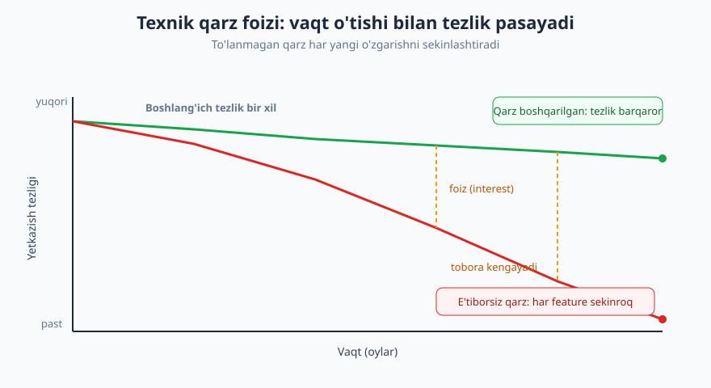
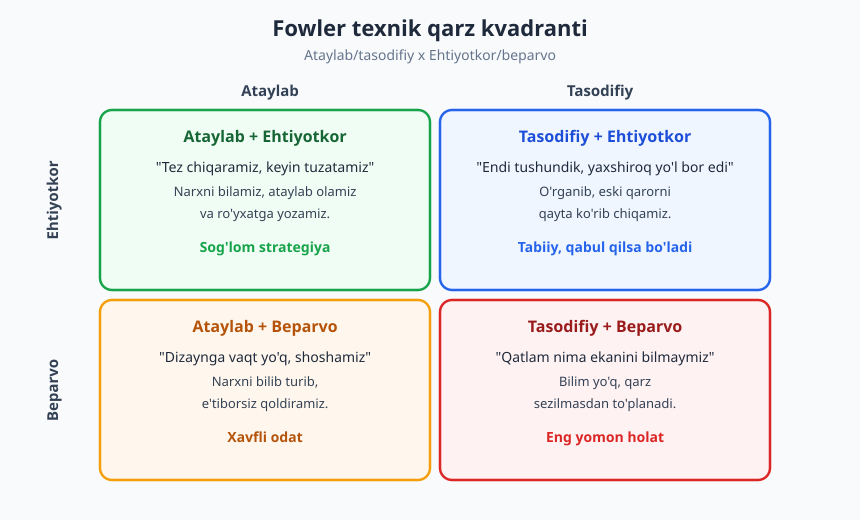
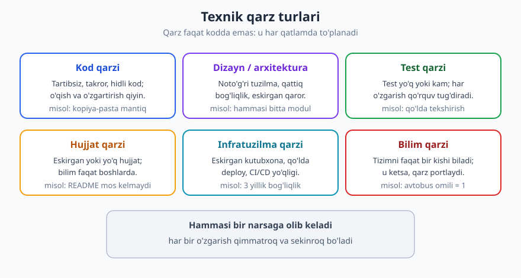

# 10 — Texnik qarz: tushunish va boshqarish

[⬅️ Oldingi: 09 — Refactoring va kod hidlari](./09-refactoring-kod-hidlari.md) · [🏠 README](./README.md) · [Keyingi: 11 — Testlash madaniyati ➡️](./11-testlash-madaniyati.md)

---

> **Bu bobda:** texnik qarz (technical debt) nima va nega u moliyaviy qarzga o'xshaydi; qarz har doim yomon emasligi (Ward Cunningham asl ma'nosi); Fowler kvadranti (ataylab/tasodifiy x ehtiyotkor/beparvo); qarz turlari va belgilari; qarzni ko'rinadigan qilish, o'lchash va to'lash strategiyalari; eng muhimi — texnik qarzni **biznesga** tushunarli til bilan tushuntirish. Maqsad: qarzni yo'qotish emas, **boshqarish**.
>
> **Halollik / Eslatma:** "texnik qarz" — metafora, aniq formula emas. Quyidagi maslahatlar amaliy yo'l-yo'riq: bir jamoada to'g'ri qaror boshqasida noto'g'ri bo'lishi mumkin. "Qancha qarz yig'ish kerak" degan savolga universal javob yo'q — bu kontekstga, muddatga va mahsulot bosqichiga bog'liq. Bu yerda muhandislik tajribasi bor, lekin oxirgi qaror sizniki.

---

## Metafora: nega "qarz"?

Tasavvur qiling, mijoz ertaga demo so'rab qoldi, lekin to'g'ri yechim uchun uch kun kerak. Siz tezroq, "vaqtincha" yo'l tanlaysiz: kodni kopiya qilasiz, validatsiyani o'tkazib yuborasiz, testni keyinga qoldirasiz. Demo o'tdi. Lekin endi har safar shu kodga tegsangiz, qisqartmangiz "qarsillaydi".

Bu — **texnik qarz**. 1992-yilda Ward Cunningham aytgan metafora: kodni tezroq yetkazish uchun siz "qarz olasiz", xuddi pul qarz olgandek. Qarzning o'zi falokat emas — ko'pincha bu oqilona qaror. Falokat — **foiz** (interest): qarz qaytarilmaguncha, har bir keyingi o'zgarish biroz sekinroq va qimmatroq bo'ladi. Foiz "to'lanmasa", u o'sib boradi va bir kun tezligingizni yutib yuboradi.



Diqqat qiling: ikki jamoa bir xil tezlikdan boshlaydi. Qarzni boshqargan jamoa yashil chiziq bo'ylab ketadi — tezligi deyarli barqaror. E'tiborsiz qoldirgan jamoa qizil chiziq bo'ylab pastga tushadi: har choragda yangi feature qo'shish qiyinlashadi, garchi jamoa "ko'proq ishlayotgandek" tuyulsa ham. Ular orasidagi oraliq — to'lanayotgan foiz.

> **Eslatma:** moliyaviy qarzdan farqi — texnik qarzning "foiz stavkasi" oldindan ma'lum emas. U qachon va qanchaga "portlaydi" — buni faqat o'sha kodga qaytib tegganingizda bilasiz. Shu sababli ko'pchilik uni past baholaydi.

## Ward Cunningham aslida nimani nazarda tutgan

Bugun "texnik qarz" deganda ko'pchilik **iflos kodni** tushunadi: "biz qarz yig'dik" = "biz axlat yozdik". Bu Cunningham asl ma'nosi emas. U shuni aytgan edi:

> Biz mahsulotni tezroq chiqarib, **tushunchamizni amaliyotda sinab ko'rish** uchun ataylab to'liq bo'lmagan yechim chiqaramiz. Keyin **o'rganganimizni kodga qaytarib singdiramiz** (refactoring) — bu qarzni to'lashdir. Agar o'rganganni singdirmasak, qarz foiz yig'a boshlaydi.

Ya'ni qarz — **bilarakdan, ongli ravishda** olingan, keyin **qaytariladigan** narsa. Bu — strategiya, axlat emas. Yomon kodni "qarz" deb atash — qarzni romantiklashtirish: aslida u shunchaki sifatsiz ish. Haqiqiy qarz halol nomlanadi, ko'rinadi va to'lov rejasi bor.

> **Trade-off:** "har doim ideal kod yoz" maslahati ham aldamchi. Mahsulot bozorga mosligini hali isbotlamagan startap uchun, ehtimol, hech kim ishlatmaydigan funksiyaga mukammal arxitektura qurish — bu **isrof**, qarzdan ham yomon. Ba'zan tez, "yetarlicha yaxshi" yechim — eng oqilona muhandislik. Savol "qarz olaymizmi yoki yo'q" emas, "**qaysi** qarzni, **ataylab**mi va uni **qaytaramizmi**" degan savol.

## Fowler kvadranti: hamma qarz bir xil emas

Martin Fowler texnik qarzni ikki o'qda joylashtirgan: qarz **ataylab** olinganmi yoki **tasodifiy** to'planganmi, va munosabat **ehtiyotkor** (oqibatni biladi) yoki **beparvo** (oqibatni o'ylamaydi).



| Kvadrant | Ovozli misol | Baho |
|---|---|---|
| **Ataylab + ehtiyotkor** | "Vaqt yo'q, oddiy yechim chiqaramiz, keyingi sprintda tuzatamiz — TODO yozdik" | ✅ Sog'lom strategiya |
| **Tasodifiy + ehtiyotkor** | "Endi tushundik, qatlamlarni boshqacha bo'lishimiz kerak edi — keyingi imkoniyatda tuzatamiz" | 🔵 Tabiiy, o'sishning belgisi |
| **Ataylab + beparvo** | "Dizaynga vaqt yo'q, shunchaki ishga tushiraylik" (oqibatni o'ylamasdan) | 🟠 Xavfli odat |
| **Tasodifiy + beparvo** | "Qatlam nima ekanini, nega kerakligini bilmaymiz — shunchaki yozaveramiz" | ❌ Eng yomon |

Eng muhim farq **ehtiyotkor** va **beparvo** o'rtasida, **ataylab** va **tasodifiy** o'rtasida emas. Tajribali jamoa ham tasodifiy qarz yig'adi (chunki har doim hamma narsani oldindan bilmaysiz) — bu uyat emas, agar ular buni payqab, qaytarsa. Asl muammo — beparvolik: oqibatni umuman o'ylamaslik.

**Real misol.** Bir freelance jamoa MVP'ni ikki haftada chiqarish uchun ma'lumotlar bazasiga hamma narsani bitta `data` jadvaliga JSON sifatida yozdi. Bu — ongli qaror edi: "agar mahsulot tutsa, normal sxemaga o'tamiz" deb yozib qo'yishdi (ataylab + ehtiyotkor). Mahsulot tutdi. Uchinchi oyda, foydalanuvchi soni o'sib, qidiruv sekinlashdi — bu foiz to'lay boshlaganlari edi. Lekin qarz **ko'rinadigan** bo'lgani uchun, ular rejalashtirilgan ravishda sxemaga ko'chdilar va inqirozga tushmadilar. Aynan shu jamoa boshqa modulda — autentifikatsiyada — qarzni **hech qayerga yozmagandi** ("keyin tartibga solamiz"). Bir yildan keyin u modulga hech kim tegmasdi, har login bug'i panika tug'dirardi. Bir xil jamoa, ikki xil natija — farq faqat qarzning **ko'rinishida**.

## Qarz turlari: u faqat kodda emas

Ko'pchilik "texnik qarz" deganda iflos kodni tasavvur qiladi. Aslida qarz tizimning **har qatlamida** to'planadi.



| Tur | Belgisi | Misol |
|---|---|---|
| **Kod qarzi** | O'qish/o'zgartirish qiyin | Takrorlangan mantiq, hidli kod (qarang [09-bob](./09-refactoring-kod-hidlari.md)) |
| **Dizayn / arxitektura** | Qattiq bog'liqlik, eskirgan qaror | Hamma narsa bitta ulkan modulda, qatlam chegarasi yo'q |
| **Test qarzi** | Har o'zgarish qo'rquvli | Test yo'q yoki kam; faqat qo'lda tekshirish |
| **Hujjat qarzi** | Bilim faqat odamlarning boshida | README kodga mos kelmaydi, setup yozilmagan |
| **Infratuzilma** | Eskirgan, qo'lda jarayon | 3 yillik kutubxona, qo'lda deploy, CI/CD yo'q |
| **Bilim qarzi** | "Buni faqat X biladi" | Avtobus omili = 1; bir odam ketsa, tizim qora quti bo'lib qoladi |

Eng xavfli — ko'pincha eng ko'rinmaydiganlar: **arxitektura qarzi** (kech payqaladi, qaytarish qimmat — chuqurroq uchun [Dasturlash arxitekturasi](../arxitektura/README.md)) va **bilim qarzi** (hamma narsa "boshlardagi" odam ketguncha yaxshi ko'rinadi).

## Belgilar: jamoangizda qarz qachon "qichqiradi"

Texnik qarz ko'rinmas, lekin uning belgilari aniq:

- **Har feature avvalgisidan sekinroq.** Oddiy o'zgarish ham kunlar oladi.
- **Qo'rquv.** "Bu fayilga tegma — buziladi." Hech kim u yerni o'zgartirgisi kelmaydi.
- **Bug'lar oqimi.** Bitta tuzatish ikkita yangi bug tug'diradi.
- **Onboarding qiyin.** Yangi odam mahsuldor bo'lishi haftalar emas, oylar oladi.
- **"Tushuntirib bo'lmaydi" javoblari.** "Nega bunday?" — "Bilmaymiz, eski koddan qolgan."
- **Estimatlar har doim oshib ketadi.** Reja bilan haqiqat orasida doimiy uzilish ([16-bob](./16-baholash-rejalashtirish.md)).

Bitta belgi xavotirli emas — har loyihada ba'zi qiyin joylar bo'ladi. Lekin bularning bir nechtasi birga ko'rinsa — bu foiz to'layotganingizning ovozli ishorasi. Ko'pincha jamoa buni notog'ri o'qiydi: "biz sekinlashyapmiz, demak ko'proq ishlashimiz kerak" deb o'ylaydi. Aslida muammo mehnatda emas — qarzning foizida. Ko'proq ishlash foizni kamaytirmaydi; faqat asosiy summani to'lash (qarzni qaytarish) kamaytiradi.

> **Eslatma:** belgilarni o'lchovga aylantiring. "Sekin tuyuladi" o'rniga "bu modulga oxirgi uch o'zgarish o'rtacha 2.5 kun oldi, boshqa joyda — yarim kun" deganingiz biznes bilan suhbatda ham, o'z qaroringizda ham kuchliroq. Subyektiv hisni raqamga aylantirish — boshqaruvning birinchi qadami.

## Sog'lom qarz vs beparvo qarz: misol

Ikki jamoa bir xil shoshilinch muddatga duch keldi. Farq — qarzni **qanday** olishida.

✅ **Sog'lom qarz (ataylab + ehtiyotkor).** To'lov integratsiyasi kerak, lekin to'liq abstraksiya uch kun oladi. Jamoa qaror qiladi:

```text
QAROR: Hozircha faqat bitta to'lov provayderi (Payme) bilan
       to'g'ridan-to'g'ri ulanamiz, abstraksiyasiz.

SABAB: Demo ertaga; ikkinchi provayder hali kelishilmagan.

QARZ:  To'lov mantig'i biznes kodga aralashib ketadi.
       Ikkinchi provayder qo'shilsa, abstraksiya kerak bo'ladi.

REJA:  TECH-DEBT registriga yozildi (#142). Ikkinchi provayder
       talab qilinishi bilan, undan oldin to'laymiz. ~2 kun.
```

Bu yerda qarz **ko'rinadi**: nomlangan, sababi yozilgan, to'lov sharti aniq. Bu — strategiya.

❌ **Beparvo qarz (tasodifiy + beparvo).** Boshqa jamoa shunchaki:

```text
// Tez ishlasin uchun shunday qildim, keyin ko'ramiz
function handlePayment(order) {
  // 200 qator: API chaqiruv, validatsiya, DB, email,
  // log, narx hisobi -- hammasi aralash, test yo'q
  ...
}
```

Bu yerda qarz **yashirin**: hech qayerga yozilmagan, sababi tushuntirilmagan, to'lov rejasi yo'q. "Keyin ko'ramiz" — hech qachon kelmaydigan vaqt. Olti oydan keyin hech kim bu funksiyaga tegishdan qo'rqadi. Foiz jimgina o'sadi.

Ikkalasi ham "tez" yechim edi. Farq sifatda emas — **ko'rinishda va niyatda**.

## Qarzni boshqarish: ko'rinadigan qilish, o'lchash, to'lash

### 1. Ko'rinadigan qilish

Boshqarib bo'lmaydigan narsa — ko'rinmaydigan narsa. Birinchi qadam — qarzni yashirin holatdan ochiq holatga chiqarish:

- **Qarz registri** — oddiy ro'yxat (Jira labeli `tech-debt`, yoki `TECHDEBT.md` fayli). Har yozuv: nima, qayerda, nega olingan, qancha foiz to'layapmiz (taxminan).
- **Kodda belgilash** — `// TODO`, `// HACK`, `// DEBT(#142): vaqtinchalik, abstraksiya kerak`. Belgi havola bilan registrga bog'lansin.
- **Onboarding xaritasi** — "bu yerda ajdaholar bor" deb yangi odamlarni ogohlantiring.

### 2. O'lchash

Aniq formula yo'q, lekin taxminiy signallar bor: bir o'zgarishga qancha vaqt ketdi (avvalgi bilan solishtirib); shu modulda bug zichligi; "qo'rqinchli zonalar" ro'yxati. Maqsad — mukammal raqam emas, **tendensiyani** ko'rish: qarz o'syaptimi yoki kamayaptimi.

### 3. To'lash strategiyalari

| Strategiya | Qachon mos | Ehtiyot |
|---|---|---|
| **Boy skaut qoidasi** (har teginishda biroz toza qil) | Doimiy, kichik qarz | Katta arxitektura qarzini hal qilmaydi |
| **Ish ustida bo'lakma-bo'lak** (har feature bilan birga shu zonani toza qil) | O'rtacha qarz, faol kod | Reja kerak, aks holda "keyin"ga qoladi |
| **Ajratilgan vaqt** (sprint hajmining ~10-20%i) | Barqaror, oldindan ko'ringan | Biznes "nega" deb so'raydi — tushuntirish kerak |
| **Maxsus to'lash sprinti / refactoring loyihasi** | Katta arxitektura qarzi, "sinish nuqtasi" yaqin | Xavfli: katta refactoring oson buziladi (qarang [09-bob](./09-refactoring-kod-hidlari.md)) |

> **Trade-off:** "hammasini bir martada tuzatamiz" katta refactoring loyihasi jozibali, lekin ko'pincha xato. U yangi feature'larni to'xtatadi, biznes bosim o'tkazadi, va katta o'zgarish katta xavf tug'diradi. Aksincha, faqat "boy skaut" ham yetarli emas — u arxitektura qarzini hal qilmaydi. Sog'lom jamoa **ikkalasini aralashtiradi**: kundalik kichik tozalash + rejalashtirilgan, chegaralangan katta to'lovlar.

**Sinish nuqtasi (point of no return).** Ba'zi qarz "to'lasa arziydi" chegarasidan o'tib ketadi: refactoring narxi yangidan yozishdan qimmat bo'ladi. Bu nuqtaga yetmaslik — boshqaruvning asl maqsadi. Buni oldindan sezish uchun tendensiyani kuzating, "sekinlashish" belgilarini jiddiy qabul qiling.

## Eng muhim ko'nikma: biznesga tushuntirish

Texnik qarz ko'pincha to'lanmaydi, chunki dasturchi uni **texnik tilda** tushuntiradi: "bizda kuchli bog'lanish bor, abstraksiya yetishmaydi, test qamrovi past." Biznes egasi buni eshitadi va o'ylaydi: "Demak, kod ishlayapti. Nega men yangi feature o'rniga ko'rinmas narsaga pul to'lashim kerak?"

Hal — qarzni **moliyaviy va xavf tilida** gapirish. Bu tasodifiy emas: "qarz" metaforasining butun kuchi shunda.

❌ **Texnik til (ishlamaydi):**
> "Auth modulida juda ko'p coupling bor, biz uni refactor qilishimiz kerak, aks holda kod sifati pasayadi."

✅ **Biznes tili (ishlaydi):**
> "Hozir login bilan bog'liq har yangi funksiya bizdan ikki barobar ko'p vaqt oladi — chunki kodning bu qismi 'qarzga botgan'. Agar uni shu chorakda 4 kun ichida tartibga solsak, kelgusi har bir funksiya 30-40% tezroq chiqadi. Tartibga solmasak, xavf shundaki: yangi xususiyat qo'shganda kutilmagan buglar paydo bo'lishi ehtimoli oshib boradi va bir kun katta to'xtalish bo'lishi mumkin."

Farqni sezing: ikkinchi variantda **vaqt**, **tezlik**, **pul** va **xavf** bor — biznes tushunadigan til. Hech qanday "coupling" yoki "abstraksiya" yo'q. Asosiy formulalar:

- "Har yangi funksiya N barobar sekin" (foizni vaqtga aylantirish).
- "Agar hozir M kun sarflasak, kelgusi har ish K% tezroq" (sarmoya kabi).
- "Tuzatmasak, [aniq xavf]: kechikish, to'xtash, mijoz yo'qotish" (xavfni nomlash).

Bu chuqurroq mavzu — qanday savol berish, yozma muloqot va non-tech bilan gaplashish [17-bob](./17-texnik-kommunikatsiya.md)da.

> **Eslatma:** ortiqcha qaramang. "Hammasini to'xtatib refactor qilaylik" deb qo'rqitish ham, har TODO'ni inqiroz qilib ko'rsatish ham ishonchni yo'qotadi. Konkret, o'lchovli va kichik so'rovlar (4 kun, bitta modul) "katta tozalash" so'rovidan ko'ra ko'p marta ma'qullanadi.

## Halollik: nol qarz — maqsad emas

Oxirgi muhim fikr: **nol texnik qarz real ham emas, iqtisodiy ham emas.** Har bir real loyihada qarz bor — chunki siz hamma narsani oldindan bilolmaysiz, va ba'zan tez yetkazish to'g'ri biznes qarori. Maqsad qarzni **yo'qotish** emas:

- **Bilib oling** — qaysi qarz bor, qayerda.
- **Ataylab oling** — tasodif emas, qaror sifatida.
- **Ko'rinadigan qiling** — registr, belgi, hujjat.
- **Boshqaring** — to'lov rejasi, tendensiyani kuzatish.
- **Sinish nuqtasiga yetkazmang.**

Professional dasturchi — qarzdan qochmaydi; u qarzni **ongli boshqaradi**, xuddi tajribali tadbirkor pul qarzini boshqargandek.

---

## Asosiy g'oyalar (bobni qisqacha)

- **Texnik qarz = moliyaviy qarz** metaforasi: tez yetkazish uchun "qarz olasiz", lekin har keyingi o'zgarish sekinlashadi — bu **foiz** (interest).
- **Qarz har doim yomon emas** (Ward Cunningham): bilib, ataylab olingan, keyin qaytariladigan qarz — strategiya, axlat emas.
- **Fowler kvadranti**: muhim farq **ehtiyotkor vs beparvo**da; ataylab+ehtiyotkor — sog'lom, tasodifiy+beparvo — eng yomon.
- Qarz **faqat kodda emas**: dizayn/arxitektura, test, hujjat, infratuzilma va **bilim qarzi** ham bor.
- **Belgilar**: har feature sekinroq, "tegma buziladi" qo'rquvi, bug oqimi, qiyin onboarding.
- **Boshqarish** = ko'rinadigan qilish (registr) + o'lchash (tendensiya) + to'lash (boy skaut / bo'lakma-bo'lak / ajratilgan vaqt) + sinish nuqtasidan saqlanish.
- **Biznesga moliyaviy/xavf tilida tushuntiring** ("2 barobar sekin", "kechikish xavfi") — texnik atamada emas.
- Maqsad — qarzni **boshqarish**, yo'qotish emas: nol qarz na real, na iqtisodiy.

---

## Mashqlar

### Oson

**1-mashq.** O'z so'zlaringiz bilan: texnik qarz metaforasida "asosiy summa" (principal) va "foiz" (interest) nimaga to'g'ri keladi? Bitta-bittadan misol bilan tushuntiring.

**2-mashq.** Quyidagi har bir vaziyatni qarz **turiga** (kod / dizayn / test / hujjat / infra / bilim) ajrating:
(a) README'da yozilgan setup qadamlari endi ishlamaydi;
(b) bitta 600 qatorli funksiya hamma ishni qiladi;
(c) loyiha 4 yillik, qo'llab-quvvatlanmaydigan kutubxonaga bog'liq;
(d) "to'lov oqimini faqat Aziz tushunadi".

**3-mashq.** O'zingiz hozir ishlayotgan (yoki oxirgi) loyihadan **uchta** texnik qarz belgisini yozing (bobdagi ro'yxatdan). Har biriga bitta konkret misol keltiring.

### O'rta

**4-mashq.** Quyidagi har bir holat **qaysi Fowler kvadrantida**? Sababini bir jumlada ayting.
(a) "Muddatga ulgurish uchun validatsiyani vaqtincha o'tkazib yubordik, Jira'ga `tech-debt` yozdik, keyingi sprintda qaytaramiz."
(b) "Biz REST tanlagandik; endi tushundikki, bu holatda event-driven yaxshiroq bo'lardi — keyingi katta versiyada ko'rib chiqamiz."
(c) "Arxitektura haqida o'ylashga vaqt yo'q, shunchaki ishlaydigan narsa yozaylik, oqibati nima bo'lishini bilmayman."
(d) "Bu frameworkning qatlamlari nima uchun kerakligini bilmaymiz, shuning uchun hammasini bitta joyga yozdik."

**5-mashq.** Sizning jamoangiz to'lov modulini refactor qilmoqchi, lekin mahsulot egasi rozi emas. Quyidagi **texnik** jumlani biznes (moliyaviy/xavf) tiliga aylantiring:
> "To'lov modulida kuchli coupling va nol test bor; biz uni refactor qilib, integratsion testlar qo'shishimiz kerak."

**6-mashq.** Loyihangiz uchun oddiy **qarz registri** yozuvini to'ldiring (jadval yoki ro'yxat): *Nima · Qayerda · Nega olindi · Qaysi kvadrant · To'lov rejasi/sharti*. Bitta real (yoki tasavvuriy) qarz uchun.

### Qiyin

**7-mashq.** Sizga ikkita yo'l taklif qilinmoqda: (A) butun legacy modulni 6 hafta to'liq qayta yozish, (B) har sprintda shu modulning faol qismini bo'lakma-bo'lak tozalash (har sprint ~15%). Har birining ustun va kamchiligini yozing, qaysi sharoitda qaysi birini tanlashingizni asoslang. Bu yerda **trade-off** bormi?

**8-mashq.** "Sinish nuqtasi" (refactoring narxi qayta yozishdan qimmat bo'lib qolgan holat) ga yetib qolgan kodga duch keldingiz, lekin biznes hech qanday tozalashga vaqt bermayapti. Qadamma-qadam reja yozing: (1) qarzni qanday ko'rinadigan qilasiz; (2) biznesga nimani, qanday til bilan tushuntirasiz; (3) qanday eng kichik, xavfsiz birinchi qadamni taklif qilasiz?

<details markdown="1">
<summary>Yechimlar</summary>

### 1-mashq yechimi
**Asosiy summa (principal)** — qarz olingan paytdagi "qisqartmaning" o'zi: o'tkazib yuborilgan ish (mas. yozilmagan test yoki qilinmagan abstraksiya). **Foiz (interest)** — har keyingi o'zgarish o'sha qisqartma tufayli qancha **qo'shimcha** vaqt/qiyinlik olayotgani. Misol: test yozmaslik = asosiy summa; har yangi o'zgarishda qo'lda tekshirishga ketgan qo'shimcha 2 soat = foiz. Asosiy summani "to'lash" = qarzni qaytarish (testni yozish); to'lamaslik = foizni cheksiz to'lashda davom etish.

### 2-mashq yechimi
(a) **Hujjat qarzi** — README haqiqatga mos kelmaydi. (b) **Kod qarzi** (va qisman dizayn) — ulkan funksiya, bir nechta mas'uliyat. (c) **Infratuzilma qarzi** — eskirgan, qo'llab-quvvatlanmaydigan bog'liqlik. (d) **Bilim qarzi** — avtobus omili = 1.

### 3-mashq yechimi
Yagona to'g'ri javob yo'q — bu refleksiv mashq. Namuna: (1) "Auth modulida har o'zgarish kunlar oladi" → oddiy 'logout' tugmasi qo'shish 3 kun oldi. (2) "Tegma buziladi" → hech kim `legacy_report.py`ga teginishni xohlamaydi. (3) "Onboarding qiyin" → yangi dasturchi birinchi PR'ini chiqarishi 3 hafta oldi. Mezon: belgi + **konkret** misol (raqam, fayl nomi, voqea) bo'lishi.

### 4-mashq yechimi
(a) **Ataylab + ehtiyotkor** — bilib qildik, yozib qo'ydik, to'lov rejasi bor (sog'lom). (b) **Tasodifiy + ehtiyotkor** — keyin o'rganib payqadik, qaytarishni rejalashtiryapmiz (tabiiy, o'sish belgisi). (c) **Ataylab + beparvo** — bilib turib oqibatni o'ylamaymiz. (d) **Tasodifiy + beparvo** — bilim yo'q va oqibat o'ylanmagan (eng yomon).

### 5-mashq yechimi
Namuna: "Hozir to'lov bilan bog'liq har bir o'zgarish bizdan kutilganidan ancha ko'p vaqt oladi va har safar yangi xato chiqishi xavfi bor — chunki bu kodda avtomatik tekshiruv yo'q. Agar shu chorakda taxminan 5 kun ajratsak: (1) kelgusi to'lov funksiyalari ~30% tezroq chiqadi, (2) to'lov xatosi (ya'ni real pul muammosi) ehtimoli sezilarli kamayadi. Tuzatmasak, eng katta xavf — mijoz to'lovida xato va undan kelib chiqadigan ishonch yo'qotish." Mezon: vaqt/tezlik/pul/xavf bor, "coupling/test" kabi atamalar yo'q.

### 6-mashq yechimi
Namuna yozuv:

| Maydon | Qiymat |
|---|---|
| Nima | Bildirishnoma yuborish mantig'i 5 ta kontrollerda takrorlangan |
| Qayerda | `controllers/` ostidagi 5 fayl |
| Nega olindi | Birinchi versiyada faqat 1 joy bor edi, keyin shoshib ko'paydi |
| Kvadrant | Tasodifiy + ehtiyotkor (endi payqadik, tuzatamiz) |
| To'lov rejasi | Keyingi bildirishnoma o'zgarishi kelishi bilan — undan oldin yagona `NotificationService`ga chiqaramiz (~1 kun) |

Mezon: barcha besh maydon to'ldirilgan, to'lov **sharti** (qachon) aniq.

### 7-mashq yechimi
**(A) To'liq qayta yozish:** ustun — natijada toza, izchil dizayn; tezda katta yengillik. Kamchilik — feature'lar to'xtaydi (biznes bosimi), katta o'zgarish katta xavf (ko'p yashirin xulq yo'qoladi), "ikkinchi tizim sindromi", muddat ko'pincha 2x oshadi. **(B) Bo'lakma-bo'lak:** ustun — feature oqimi davom etadi, har qadam test bilan himoyalangan, xavf kichik; kamchilik — sekin, intizom talab qiladi, "vaqt yo'q" deb to'xtab qolish xavfi.
**Qaysi qachon:** B — agar modul hali faol ishlayotgan va qisman tegiladigan bo'lsa (ko'pchilik holat shunday). A — faqat modul chinakam "sinish nuqtasi"dan o'tgan, deyarli tegib bo'lmaydigan, va sof izolatsiya qilingan bo'lsa, va biznes to'liq qo'llab-quvvatlasa.
**Trade-off:** ha — **tezlik/butunlik vs xavf/uzluksizlik**. A tez butun yechim beradi, lekin yuqori xavf va to'xtash narxi; B xavfsiz va uzluksiz, lekin sekin. Ko'pincha eng yaxshi javob — gibrid: chegaralangan, test bilan himoyalangan bosqichli almashtirish (strangler pattern — qarang [Dasturlash arxitekturasi](../arxitektura/README.md)).

### 8-mashq yechimi
Namuna reja: **(1) Ko'rinadigan qilish:** qarzni registrga yozing; har o'zgarishga ketgan qo'shimcha vaqtni 2-3 hafta o'lchab, raqam to'plang ("bu modulga har teginish o'rtacha 2 kun"). **(2) Biznesga tushuntirish:** texnik atamasiz, xavf+pul tilida: "Bu modul hozir har o'zgarishni 2-3 barobar sekinlashtiryapti va to'xtash xavfi o'syapti; agar hech narsa qilmasak, bir kun katta nosozlik bo'lishi mumkin va uni tuzatish haftalar oladi." Konkret, o'lchovli. **(3) Eng kichik xavfsiz qadam:** "hammasini qayta yozaylik" demang — buni biznes rad etadi. O'rniga: eng og'riqli, eng tez-tez tegiladigan kichik qismni ajrating, uni test bilan o'rang, keyin bo'lakma-bo'lak almashtiring (boy skaut + strangler). 3-4 kunlik aniq, chegaralangan birinchi qadam taklif qiling — kichik "ha" olish "katta ha"dan oson. Mezon: ko'rinadigan qilish + biznes tili + kichik, chegaralangan, xavfsiz birinchi qadam.

</details>

---

[⬅️ Oldingi: 09 — Refactoring va kod hidlari](./09-refactoring-kod-hidlari.md) · [🏠 README](./README.md) · [Keyingi: 11 — Testlash madaniyati ➡️](./11-testlash-madaniyati.md)
