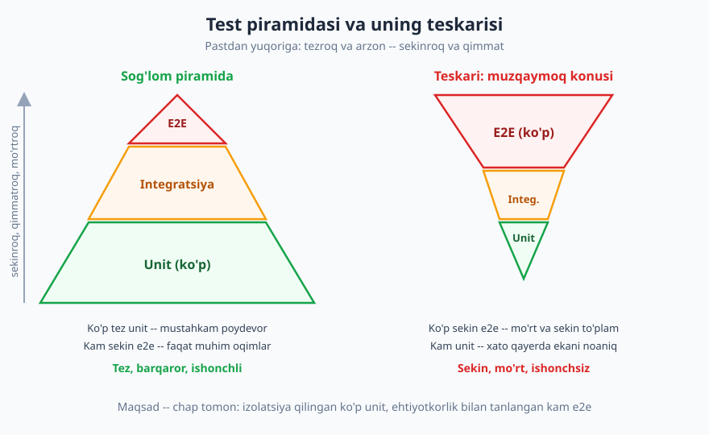
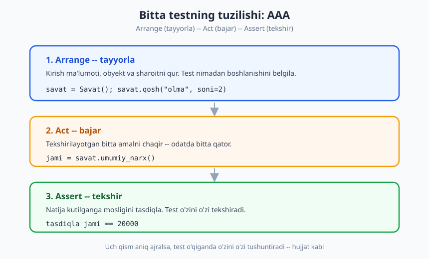
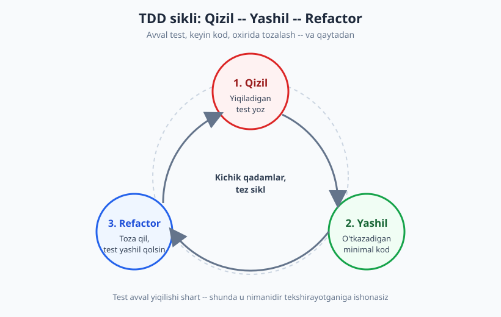

# 11 — Testlash madaniyati

[⬅️ Oldingi: 10 — Texnik qarz: tushunish va boshqarish](./10-texnik-qarz.md) · [🏠 README](./README.md) · [Keyingi: 12 — Xavfsiz kod yozish asoslari ➡️](./12-xavfsiz-kod-asoslari.md)

---

> **Bu bobda:** test yozish bu sintaksis emas, **madaniyat va tafakkur**. Nega umuman test kerakligini ("menda ishlaydi" dan "isbotlandi"ga), test piramidasini (ko'p unit, o'rta integratsiya, kam e2e), yaxshi testning xossalarini (AAA tuzilishi), nimani test qilish va nimani EMASligini, TDD fikrlash sikli (qizil → yashil → refactor) va testning o'zi ham qo'llab-quvvatlanadigan kod ekanini ko'rib chiqamiz. Bu bob *qanday* yozishni emas, *qachon, nega va qanday muvozanatda* yozishni o'rgatadi.
>
> **Halollik / Eslatma:** bu yerdagi hech narsa "qonun" emas. Test piramidasi — kuchli **standart**, lekin ba'zi loyihalar (masalan, ko'p integratsiyali tizimlar) uchun shakli boshqacharoq bo'ladi. TDD — *foydali fikrlash usuli*, **majburiyat emas**: katta jamoalarda kuchli, prototip qilayotganingizda ortiqcha bo'lishi mumkin. "100% coverage" — sifat kafolati emas, balki ko'pincha xavfli xudbinlik. Maqsad — qo'rqmasdan kod o'zgartira oladigan **ishonch**, foiz emas. Quyida real trade-off'lar ochiq aytiladi.

---

## Nega umuman test? "Menda ishlaydi" dan "isbotlandi"ga

Yangi dasturchining eng keng tarqalgan fikri: *"Men kodni yozdim, qo'lda ishlatib ko'rdim, ishlaydi. Test — vaqt isrofi."* Bu fikr bir muhim narsani unutadi: kod **bir marta** yozilib, **o'n marta** o'zgaradi. "Menda hozir ishlaydi" — kelajakdagi o'zingiz, hamkasbingiz yoki uch oydan keyin shu kodga tegadigan odam uchun hech narsani isbotlamaydi.

Test — bu **takrorlanadigan isbot**. Siz qo'lda tekshirgan narsani mashina endi har commit'da, har push'da, har kechki CI'da sizning o'rningizga tekshiradi. Test yozishning to'rt asosiy sababi bor:

- **Ishonch (qo'rqmasdan o'zgartirish).** Bu eng katta foyda. Testlar bilan qoplangan kodni siz **dadil** refactor qilasiz, optimizatsiya qilasiz, kutilmagan joyni o'zgartirasiz — chunki biror narsa buzilsa, test darrov "qizil" bo'ladi. Testsiz kod esa "tegmaganim ma'qul" qo'rquviga aylanadi va aynan shu qo'rquv [texnik qarz](./10-texnik-qarz.md)ni o'stiradi.
- **Regresiya oldini olish.** Bir marta tuzatilgan xato qaytib kelmasligi kerak. Har bir tuzatilgan bug uchun yozilgan test — o'sha bug'ning *qabr toshi*: u boshqa qaytib kelmaydi.
- **Hujjat sifatida test.** Yaxshi yozilgan test — funksiyaning eng aniq **ishlatilish misoli**. `test_bosh_savat_jami_nol()` degan testni o'qigan odam funksiya bo'sh savatda nima qaytarishini hech bir izohsiz tushunadi. Bu [izoh va o'z-o'zini hujjatlovchi kod](./07-izoh-ozini-hujjatlovchi-kod.md) g'oyasining tabiiy davomi.
- **Dizaynni yaxshilash.** Testlash qiyin kod — odatda **yomon dizaynli** kod. Agar funksiyani sinash uchun o'nta narsani sozlashingiz kerak bo'lsa, demak u funksiya juda ko'p narsaga bog'langan. Test yozish sizni shu og'riqni *erta* his qilishga majbur qiladi.

> **Trade-off:** test bepul emas. U yozish vaqtini oladi va qo'llab-quvvatlanishi kerak. Bir martalik skript, tashlab yuboriladigan prototip yoki tez o'zgaruvchi reklama sahifasi uchun to'liq test to'plami ortiqcha bo'lishi mumkin. Lekin **uzoq yashaydigan, ko'p odam tegadigan kod** uchun testsizlik — eng qimmat tanlov. Savol "test yozamizmi?" emas, balki "qaysi qismni qanchalik qoplaymiz?".

---

## Test piramidasi: shakl muhim

Hamma test bir xil emas. Ular tezligi, ko'lami va mo'rtligi bo'yicha tabiiy qatlamlarga bo'linadi. Sog'lom test to'plami **piramida** shaklida bo'ladi.



| Qatlam | Nimani sinaydi | Tezlik | Soni | Mo'rtligi |
|---|---|---|---|---|
| **Unit** | Bitta funksiya/klassni izolatsiyada | Juda tez (millisekund) | Eng ko'p | Past — aniq joyni ko'rsatadi |
| **Integratsiya** | Bir nechta qism birga (mas. kod + DB) | O'rtacha | O'rtacha | O'rtacha |
| **E2E (uchidan-uchiga)** | Butun tizim foydalanuvchi ko'zi bilan | Sekin (sekundlar) | Eng kam | Yuqori — tashqi narsaga bog'liq |

Asosiy g'oya: **poydevor keng, cho'qqi tor**. Ko'p tez unit testlar mantiqni izolatsiyada tekshiradi; ular yiqilsa, xato qayerda ekani darrov ma'lum. Kam e2e testlar esa faqat eng muhim foydalanuvchi oqimlarini (masalan, "ro'yxatdan o'tish → kirish → buyurtma") uchidan-uchiga tasdiqlaydi.

Buning teskarisi — **muzqaymoq konusi (ice-cream cone)** antipatterni: ko'p sekin e2e test, kam unit. Bunday to'plam:

- **Sekin** — CI har push'da o'n daqiqa ishlaydi, dasturchilar uni o'tkazib yuborishni boshlaydi.
- **Mo'rt** — bitta tugma ko'chsa, o'nta e2e qizil bo'ladi, ammo *sabab* qayerda ekani noaniq.
- **Ishonchsiz** — vaqti-vaqti bilan sababsiz yiqiladigan ("flaky") testlar jamoaning testga ishonchini o'ldiradi. Bir marta "yana o'sha sababsiz qizil, e'tibor berma" deyilsa, test o'z ma'nosini yo'qotadi.

> **Trade-off:** piramida — yo'naltiruvchi shakl, qattiq qoida emas. Asosan tashqi servislarni bog'laydigan tizimda (masalan, integratsiyalar ko'p mikroservis) "olcha to'plami" (testing trophy) deb ataladigan integratsiya-og'irroq shakl ko'proq qiymat berishi mumkin. Muhimi — **ko'p sekin e2e'ga suyanib qolmaslik**: tez qatlamga qancha ko'p mantiq tushsa, qaytar aloqa shuncha tez.

---

## Yaxshi testning xossalari: F.I.R.S.T va AAA

Yomon test foydadan ko'ra ko'p tashvish keltiradi. Yaxshi unit test quyidagi xossalarga ega bo'ladi (ko'pincha **F.I.R.S.T** deb eslab qolinadi):

- **Tez (Fast)** — millisekundlarda ishlaydi, shunda yuzlab testni soniyada ishlatasiz.
- **Mustaqil (Independent)** — boshqa testga, ish tartibiga yoki tashqi holatga bog'liq emas. Har birini alohida ishlatish mumkin.
- **Takrorlanuvchi (Repeatable)** — bugun ham, ertaga ham, boshqa mashinada ham bir xil natija. Joriy vaqt, tasodifiy son yoki tarmoqqa bog'liq test buni buzadi.
- **O'z-o'zini tekshiruvchi (Self-validating)** — "o'tdi/yiqildi" deb aniq aytadi; odam log'ga qarab "to'g'rimi-yo'qmi" deb baholamaydi.
- **O'z vaqtida (Timely)** — kod bilan birga yoziladi, "keyinroq" qoldirilmaydi (chunki "keyin" hech qachon kelmaydi).

Bularning ustiga test **aniq nomlanishi** kerak. Test nomi — uning birinchi hujjati: `test_manfiy_summa_xato_qaytaradi()` degan nom yiqilganda, log'siz ham nima buzilganini aytadi.

Yaxshi testning ichki tuzilishi esa odatda **AAA** (Arrange–Act–Assert) yoki uning BDD ekvivalenti **Given–When–Then** naqshiga ergashadi.



✅ **Yaxshi test** — aniq, mustaqil, bitta narsani tekshiradi, nomi gapiradi:

```python
def test_savatdagi_ikki_olma_jamini_qaytaradi():
    # Arrange — tayyorla
    savat = Savat()
    savat.qosh("olma", soni=2, narx=10000)
    # Act — bajar
    jami = savat.umumiy_narx()
    # Assert — tekshir
    assert jami == 20000
```

❌ **Mo'rt/yomon test** — bir nechta narsani aralashtiradi, tashqi holatga bog'liq, nomi hech nima demaydi:

```python
def test_savat():                      # nom hech nima demaydi
    savat = Savat()
    savat.qosh("olma", soni=2, narx=10000)
    assert savat.umumiy_narx() == 20000
    savat.qosh("non", soni=1, narx=5000)
    assert savat.umumiy_narx() == 25000
    assert savat.elementlar_soni() == 2
    assert datetime.now().hour < 24     # vaqtga bog'liq, ma'nosiz tekshiruv
    # yiqilsa qaysi qator aybdor ekani noaniq
```

Ikkinchi testda agar `umumiy_narx()` buzilsa, siz uni `elementlar_soni()` muammosidan ajrata olmaysiz — chunki bitta test ichida juda ko'p narsa bor. Qoida: **bir test — bir sabab bilan yiqiladi**.

---

## Nimani test qilish — va nimani EMAS

Hammasini test qilishga urinish — vaqt va ishonchni isrof qilishning eng tez yo'li. Aql bilan tanlang.

**Test qilishga arziydi:**

- **Qiymatli, murakkab mantiq** — hisob-kitob, narx/chegirma logikasi, holat mashinasi, biznes qoidalari. Xatosi qimmatga tushadigan joylar.
- **Chegaraviy holatlar (edge cases)** — bo'sh ro'yxat, nol, manfiy son, juda katta qiymat, `null`/bo'sh string. Bular [xatolarni boshqarish](./08-xatolarni-boshqarish.md) bobida ko'rilgan "fail loud" g'oyasi bilan chambarchas: chegarani test bilan mahkamlang.
- **Bir marta yuzaga kelgan xato** — har tuzatilgan bug uchun avval uni **takrorlaydigan** test yozing (qizil), keyin tuzating (yashil). Shunda u qaytib kelmaydi.

**Odatda test qilishga arzimaydi:**

- **Oddiy getter/setter** va trivial bir qatorlilar — ularda mantiq yo'q, test faqat shovqin qo'shadi.
- **Freymvork yoki kutubxonaning o'zi** — `array_map`, ORM yoki HTTP kutubxonasini siz emas, ularning mualliflari test qiladi. Siz faqat *o'z* mantig'ingizni sinaysiz.
- **Tashqi tizimning ichki xulqi** — to'lov shlyuzi pul yechishini siz unit testda tasdiqlay olmaysiz; siz faqat *o'z kodingiz* uni to'g'ri chaqirayotganini tekshirasiz.

> **Trade-off:** **coverage foizi — vosita, maqsad emas.** 90% qoplama bilan ham eng muhim chegaraviy holat test qilinmagan bo'lishi mumkin; 60% bilan ham eng qiymatli mantiq to'la qoplangan bo'lishi mumkin. Foizni *bo'sh joylarni topish radari* sifatida ishlating ("nega bu modul 10%?"), lekin uni KPI'ga aylantirmang. "100% coverage" majburiyati ko'pincha odamlarni **ma'nosiz, hech nima tasdiqlamaydigan testlar** yozishga majbur qiladi — bu sof [texnik qarz](./10-texnik-qarz.md).

---

## TDD: qizil → yashil → refactor (majburiy emas, foydali)

**Test-driven development (TDD)** — testni koddan **oldin** yozish amaliyoti. U ko'pchilik o'ylaganidek "testlash texnikasi" emas, balki **dizayn va fikrlash** usuli. Sikl uch qadamdan iborat va u juda kichik bo'lishi kerak.



1. **Qizil** — hali mavjud bo'lmagan xulqni tekshiradigan testni yozasiz. U **yiqilishi shart** — agar darrov yashil bo'lsa, test hech nimani tekshirmayotgan bo'lishi mumkin. Qizilni ko'rish — testingizning haqiqatan ishlayotganining isboti.
2. **Yashil** — testni o'tkazadigan **eng minimal** kodni yozasiz. Bu yerda chiroyli bo'lishga urinmang; faqat yashilga yeting.
3. **Refactor** — endi testlar himoyasida kodni tozalaysiz: nom, takror, tuzilish. Testlar yashil qolsa — siz hech narsani buzmaganingizni bilasiz. Bu [refactoring](./09-refactoring-kod-hidlari.md) bobidagi "test bilan himoyalangan xavfsiz qadamlar" g'oyasining aniq amaliy ko'rinishi.

TDD'ning eng katta foydasi koddan oldin **muammoni aniq belgilashga** majbur qilishidir: "bu funksiya aniq nimani qaytarishi kerak?" degan savolga test yozayotib javob berasiz. Bu ko'pincha kodni soddalashtiradi.

> **Trade-off:** TDD — **majburiy emas**. U keng tarqalgan, bir-biriga bog'liq mantiq (algoritm, hisob-kitob, parser) uchun ajoyib. Lekin sof izlanish/prototip qilayotganingizda, hali yechim shakli noma'lum bo'lganda, TDD sizni sekinlashtirishi mumkin — bunday holda avval prototip, keyin uni test bilan mahkamlash oqilona. Muhimi — *qaysidir nuqtada* test yozish; uni avval yoki keyin yozish jamoa va vazifa uslubiga bog'liq. "TDD qilmasangiz professional emassiz" degan da'voga ishonmang.

---

## Test ham kod — va mock'ni me'yorida ishlating

Eng ko'p e'tibordan chetda qoladigan haqiqat: **test to'plami ham kod bazasi**, va u ham qo'llab-quvvatlanadi. Mo'rt, sekin, tushunarsiz testlar — sof [texnik qarz](./10-texnik-qarz.md). Ular jamoaning vaqtini yeydi va, eng yomoni, *ishonchni* o'ldiradi: sababsiz qizil bo'ladigan testlarni odamlar o'chirib qo'yadi yoki e'tiborsiz qoldiradi, shunda butun to'plam ma'nosiz bo'lib qoladi.

Shuning uchun testga ham kod sifatida qarang: nomlash yaxshi bo'lsin, takror kamaytirilsin (lekin testdagi ozgina takror — produkt koddagidan ko'ra ko'pincha kechirimliroq, chunki har test mustaqil va o'qilishi oson bo'lishi kerak), tushunarli bo'lsin.

**Mock va stub** — testdagi sezgir vosita. Tashqi narsa (DB, tarmoq, vaqt) o'rniga qo'yiladigan "soxta" obyektlar testni tez va mustaqil qiladi. Lekin ulardan **haddan oshmang**:

✅ **O'rinli mock** — tashqi, sekin yoki nazoratsiz narsani almashtiradi:

```python
def test_email_yuborilganda_xabar_qaytaradi():
    soxta_pochta = MockPochtaServisi()   # haqiqiy email yubormaymiz
    natija = royxatdan_otkaz(soxta_pochta, "ali@example.com")
    assert natija.muvaffaqiyatli
    assert soxta_pochta.yuborilganlar_soni == 1
```

❌ **Haddan oshgan mock** — o'z kodingizning yarmini soxtalashtiradi, test endi *real xulqni* emas, *mock'ni* tekshiradi:

```python
def test_hammasi_mock():
    db = Mock(); hisoblagich = Mock(); validator = Mock()
    validator.tekshir.return_value = True
    hisoblagich.hisobla.return_value = 100
    # bu yerda real mantiq qolmadi — test faqat "men aytgan narsani aytdi" deydi
```

Qoida: **o'z mantig'ingizni mock qilmang**, faqat *chegaradagi* (tashqi) narsani mock qiling. Agar test'ni yozish uchun hamma narsani mock qilishga majbur bo'lsangiz, bu ko'pincha kod juda bog'langanligining belgisi — yana bir bor [dizayn signali](./09-refactoring-kod-hidlari.md).

---

## Halollik: 100% — kafolat emas

Oxirgi va eng muhim halol gap: **yashil test "kod ishlaydi" degani emas**. Testlar siz *o'ylab topgan* holatlarni tekshiradi; siz o'ylamagan holat baribir buzilishi mumkin. 100% qoplama — siz *yozgan* satrlar ishga tushganini ko'rsatadi, lekin ular *to'g'ri* ekanini emas.

Shu sababli testlash — **muvozanat san'ati**, dindorlik emas. Maqsad — har bir satrni qoplash ham, "testsiz tezroq" ham emas, balki: *qo'rqmasdan o'zgartira oladigan, regresiyadan himoyalangan, asosiy mantig'i isbotlangan kod*. Bunga qaysi qatlamda qancha test bilan yetish — kontekst qarori. Sog'lom intuitsiya: "bu joyni o'zgartirsam, biror narsa jimgina buzilishidan qo'rqamanmi?" Agar javob "ha" bo'lsa — o'sha yerga test kerak.

---

## Asosiy g'oyalar (bobni qisqacha)

- **Test = takrorlanadigan ishonch.** Asosiy qiymat — qo'rqmasdan o'zgartirish; "menda ishlaydi" emas, "isbotlandi". Test yana **regresiyani to'sadi**, **hujjat** bo'ladi va **dizaynni** yaxshilaydi.
- **Test piramidasi:** ko'p tez **unit**, o'rta **integratsiya**, kam sekin **e2e**. Teskari "**muzqaymoq konusi**" — sekin, mo'rt, ishonchsiz antipattern.
- **Yaxshi test** tez, mustaqil, takrorlanuvchi, o'z-o'zini tekshiradi va **aniq nomlangan**; ichki tuzilishi **AAA** (Arrange–Act–Assert) yoki Given–When–Then.
- **Qiymatli mantiq va chegaraviy holatlarni** test qiling; **getter va freymvorkni** emas. **Coverage foizi — radar, KPI emas.**
- **TDD** (qizil → yashil → refactor) — kuchli *fikrlash usuli*, **majburiyat emas**; qaysidir nuqtada test bo'lsa bas.
- **Test ham kod:** mo'rt/sekin test — texnik qarz. **Mock'ni faqat chegarada** ishlating, o'z mantig'ingizni emas.
- **Halollik:** 100% coverage sifat kafolati emas; testlash — muvozanat, dindorlik emas.

---

## Mashqlar

### Oson

**1-mashq.** Quyidagi funksiya uchun qanday test(lar) yozasiz? Kamida uchta holatni (oddiy, chegaraviy, xato) sanab bering va har biriga AAA bo'yicha bittadan test nomini taklif qiling.

```python
def chegirma_narx(narx, foiz):
    # foiz 0..100 oralig'ida; narx manfiy bo'lmasligi kerak
    return narx - (narx * foiz / 100)
```

**2-mashq.** Quyidagi test nega yomon? Kamida ikkita muammoni ayting va tuzatilgan variantini yozing.

```python
def test_1():
    u = Foydalanuvchi("ali", yosh=25)
    u.tugilgan_yilni_yangila(2000)
    assert u.yosh == datetime.now().year - 2000
    assert u.ism == "ali"
    assert u.faolmi() == True
```

**3-mashq.** Test piramidasining uch qatlamini (unit, integratsiya, e2e) ayting va har biriga o'z loyihangizdan (yoki tasavvuriy "onlayn do'kon"dan) bittadan misol keltiring.

### O'rta

**4-mashq.** "Muzqaymoq konusi" antipatterni nima va u jamoaga qanday zarar keltiradi? Sizning yoki tanish loyihangizdagi test to'plami qaysi shaklga yaqin — piramidami yoki konusmi? Qisqa baholang.

**5-mashq.** TDD siklini bir aniq misolda yozib ko'rsating: "manfiy son kiritilsa xato qaytaradigan `kvadrat_ildiz(x)` funksiyasi". (a) qizil bosqichdagi testni, (b) yashilga yetkazadigan minimal kodni, (c) refactor bosqichida nimani tozalashingiz mumkinligini yozing.

**6-mashq.** Quyidagi funksiyada qaysi qism(lar)ni mock qilish o'rinli, qaysisini EMAS? Sababini ayting.

```python
def buyurtmani_yakunla(savat, tolov_shlyuzi, pochta):
    jami = savat.umumiy_narx()          # o'z mantig'imiz
    chek = tolov_shlyuzi.yech(jami)      # tashqi servis
    pochta.yubor(chek)                   # tashqi servis
    return chek
```

### Qiyin

**7-mashq.** Sizning rahbaringiz "har modulda 100% test coverage bo'lishi shart" degan qoida joriy qildi. Buni qabul qilish yoki rad etishga 4-5 jumlali dalil yozing: foizning haqiqiy qiymati, uning xavfi va siz taklif qiladigan yaxshiroq mezon nima.

**8-mashq.** Bir testchi sizga shikoyat qiladi: "CI to'plamimiz 12 daqiqa ishlaydi va vaqti-vaqti bilan sababsiz qizil bo'ladi, hamma uni e'tiborsiz qoldira boshladi." Diagnoz qo'ying (qaysi antipattern?) va tiklash uchun konkret 3 qadamlik reja taklif qiling.

<details markdown="1">
<summary>Yechimlar</summary>

### 1-mashq yechimi

Kamida uch holat:

- **Oddiy:** `test_yuz_minglik_narxdan_yigirma_foiz_chegirma()` → `chegirma_narx(100000, 20) == 80000`.
- **Chegaraviy:** `test_nol_foiz_chegirma_narxni_ozgartirmaydi()` → `chegirma_narx(100000, 0) == 100000`; va `test_yuz_foiz_chegirma_nol_qaytaradi()` → `chegirma_narx(100000, 100) == 0`.
- **Xato/chegaradan tashqari:** `test_manfiy_narx_xato_qaytaradi()` yoki `test_yuzdan_katta_foiz_xato()` — funksiya hozir bunday holatni tekshirmaydi, demak avval u xulqni belgilab (xato chaqirsinmi yoki cheklasinmi), keyin test yozasiz. Bu [xatolarni boshqarish](./08-xatolarni-boshqarish.md)dagi "chegarani aniq belgila" g'oyasi.

### 2-mashq yechimi

Muammolar: (1) nomi (`test_1`) hech nima demaydi; (2) bitta test bir nechta bog'liqsiz narsani tekshiradi (yosh, ism, faollik) — yiqilsa sabab noaniq; (3) `datetime.now()` ga bog'liq — joriy yilga qarab natija o'zgaradi, demak takrorlanuvchi emas. Tuzatish — vaqtni qotirish va testlarni ajratish:

```python
def test_tugilgan_yil_yangilanganda_yosh_qayta_hisoblanadi():
    # Arrange
    u = Foydalanuvchi("ali", yosh=25)
    joriy_yil = 2026
    # Act
    u.tugilgan_yilni_yangila(2000, hozir_yil=joriy_yil)
    # Assert
    assert u.yosh == 26
```

(Ism va faollik uchun alohida testlar.)

### 3-mashq yechimi

Onlayn do'kon misolida:

- **Unit:** `chegirma_narx()` funksiyasi to'g'ri hisoblashini izolatsiyada sinaydi — DB yo'q, tarmoq yo'q.
- **Integratsiya:** "savatni saqlash" kod + haqiqiy (yoki test) ma'lumotlar bazasi bilan ishlashini sinaydi.
- **E2E:** brauzerda "mahsulot tanlash → savatga qo'shish → buyurtma berish" oqimi to'liq ishlashini sinaydi.

### 4-mashq yechimi

**Muzqaymoq konusi** — piramidaning teskarisi: ko'p sekin e2e, kam unit. Zarari: (1) CI sekin → dasturchilar testni o'tkazib yuboradi; (2) mo'rt → bitta UI o'zgarishi o'nlab e2e'ni qizil qiladi, sabab noaniq; (3) ishonchsiz ("flaky") → sababsiz qizil bo'ladi va jamoa testga ishonmay qo'yadi. Baholash — namuna javob: "Bizniki konusga yaqin: ko'p Selenium testlari bor, unit deyarli yo'q, CI 15 daqiqa. Buni unit qatlamini o'stirib tuzatish kerak." (Yagona to'g'ri javob yo'q — o'z holatingizni halol baholang.)

### 5-mashq yechimi

(a) **Qizil** — funksiya hali yo'q yoki xatoni tekshirmaydi:

```python
def test_manfiy_son_xato_qaytaradi():
    with pytest.raises(ValueError):
        kvadrat_ildiz(-4)
```

(b) **Yashil** — minimal kod:

```python
def kvadrat_ildiz(x):
    if x < 0:
        raise ValueError("manfiy sondan ildiz olib bo'lmaydi")
    return x ** 0.5
```

(c) **Refactor** — xato xabarini aniqroq qilish, musbat holat uchun ham test qo'shib, keyin nom/tuzilishni tozalash. Testlar yashil qolsa — hech narsani buzmadingiz.

### 6-mashq yechimi

- `tolov_shlyuzi` va `pochta` — **mock qilish o'rinli**: ular tashqi servislar (haqiqiy pul yechish va email yuborish testda kerak emas, sekin va xavfli).
- `savat.umumiy_narx()` — **mock qilmang**: bu *o'z mantig'ingiz*, aynan shuni tekshirmoqchisiz. Uni mock qilsangiz, test real hisob-kitobni emas, mock'ni sinaydi.

Test: `tolov_shlyuzi.yech(jami)` to'g'ri summa bilan chaqirilganini va `pochta.yubor()` ishga tushganini tasdiqlang.

### 7-mashq yechimi

Namuna dalil: "100% coverage'ni majburlash men maslahat bermayman. Coverage — *qaysi satrlar ishga tushgani* o'lchovi, lekin u satrlar *to'g'ri* ekanini isbotlamaydi va eng muhim chegaraviy holat baribir qolib ketishi mumkin. 100% majburiyati odamlarni hech nima tasdiqlamaydigan rasmiy testlar yozishga undaydi — bu sof texnik qarz. Yaxshiroq mezon: kritik mantiq (to'lov, narx, holat mashinasi) **yuqori qoplangan** bo'lsin, coverage'ni esa *bo'sh joy radari* sifatida kuzataylik (keskin past modulni tekshiramiz), KPI sifatida emas. Maqsad — ishonch, foiz emas."

### 8-mashq yechimi

**Diagnoz:** muzqaymoq konusi + flaky (beqaror) testlar — sekin va ishonchsiz to'plam. Reja: (1) **Flaky'larni ajrating va to'xtating** — beqaror e2e'larni topib, vaqtincha karantinga oling yoki barqarorlashtiring (tasodifiy kutish/holatga bog'liqlikni yo'qoting), shunda qizil = haqiqiy xato bo'ladi. (2) **Tez qatlamga ko'taring** — bir nechta e2e'da tekshirilayotgan mantiqni unit testga tushiring; e2e'da faqat eng kritik oqimlar qolsin. (3) **Tezlik byudjeti qo'ying** — CI'ni parallel ishlatish va testlarni qatlamga bo'lish (har push'da unit, kechqurun to'liq e2e), maqsad — push-fikrlash sikli bir necha daqiqa. Yana: jamoa bilan kelishuv — qizil CI'ni *hech qachon* e'tiborsiz qoldirmaslik, aks holda butun to'plam ma'nosiz.

</details>

---

[⬅️ Oldingi: 10 — Texnik qarz: tushunish va boshqarish](./10-texnik-qarz.md) · [🏠 README](./README.md) · [Keyingi: 12 — Xavfsiz kod yozish asoslari ➡️](./12-xavfsiz-kod-asoslari.md)
