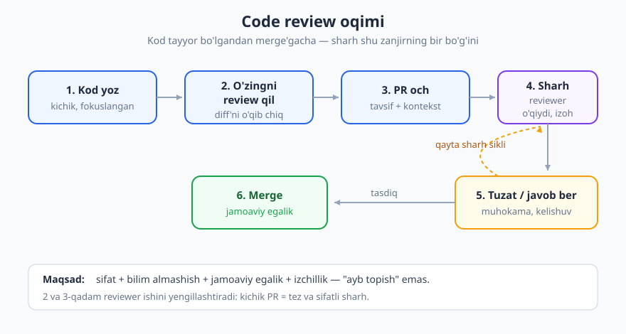
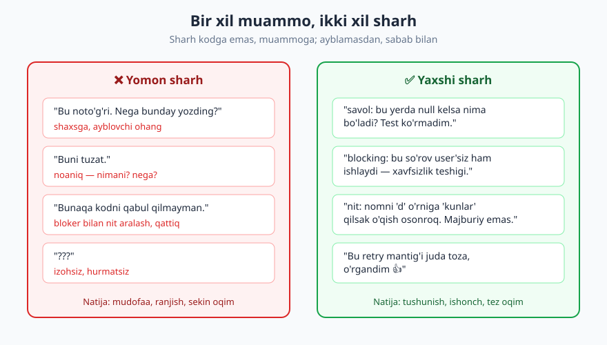
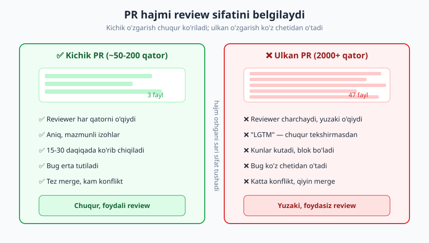

# 13 — Code review — berish va olish

[⬅️ Oldingi: 12 — Xavfsiz kod yozish asoslari](./12-xavfsiz-kod-asoslari.md) · [🏠 README](./README.md) · [Keyingi: 14 — Jamoaviy kod oqimi: commit, branch, PR madaniyati ➡️](./14-jamoaviy-kod-oqimi.md)

---

> **Bu bobda:** code review — bir dasturchining kodini boshqa dasturchi yozilganidan keyin, lekin asosiy tarmoqqa qo'shilishidan oldin ko'rib chiqishi. Bu bob mexanika emas (PR ochish, branch, merge — bu [14-bob](./14-jamoaviy-kod-oqimi.md)da); bu yerda gap **madaniyat va munosabat** haqida: review nima uchun bor, qanday qilib *foydali* va *mehribon* sharh yozish, sharhni qanday qilib *ego'siz* qabul qilish, review qilinishi oson PR qanday tayyorlanadi va pair/mob programming qachon review o'rnini bosadi. Eng muhim g'oya: code review — **ayb topish marosimi emas, birgalikda sifat va bilim qurish jarayoni**.
>
> **Halollik / Eslatma:** review madaniyati har jamoada turlicha. Bir jamoada qattiq, ikkinchisida yumshoq; biri har bir o'zgarishni review qiladi, ikkinchisi faqat muhimini. Bu yerdagi narsalar — keng qabul qilingan amaliyot va shaxsiy tajriba, qonun emas. Haddan oshgan perfeksionizm review'ni jamoaning eng sekin joyiga aylantiradi; haddan yumshoqlik esa uni foydasiz qiladi. To'g'ri muvozanat — kontekstga bog'liq. Misollar psevdokod va qisqa snippetlarda; g'oyalar har qanday tilda bir xil.

---

## Code review nima uchun bor

Yangi dasturchi code review'ni ko'pincha shunday his qiladi: "kimdir mening kodimni tekshirib, xatolarimni ko'rsatadi" — ya'ni imtihon, hatto bahona axtarish. Bu noto'g'ri model, va u review'ni og'riqli qiladi. Aslida code review'ning maqsadi ko'p, va ularning hech biri "ayb topish" emas:

- **Sifat (xato ushlash).** Yana bir juft ko'z muallif sezmagan xato, chegara holati, mantiq teshigini topadi. Lekin bu — bir necha maqsaddan faqat *bittasi*.
- **Bilim almashish.** Sharhlovchi kodning yangi qismi bilan tanishadi; muallif sharhlovchidan yangi usul yoki yondashuvni o'rganadi. Review — jamoaning eng arzon o'qish-o'rgatish mexanizmi.
- **Jamoaviy egalik.** Kodni ikki kishi ko'rgach, u endi faqat muallifniki emas — *jamoaniki*. Muallif ertaga ketib qolsa ham, kamida bir kishi bu kod nima qilishini biladi (bus-factor, ya'ni "avtobus ostida qolib ketsa" omilini oshiradi).
- **Izchillik.** Jamoa stili, naqshlari va kelishuvlari (konventsiyalari) review orqali tarqaladi va saqlanadi. Yangi a'zo bir necha review'dan keyin jamoa "qanday yozishini" o'zlashtiradi.

Eng muhim ruhiy o'zgarish — review'ni **muallif vs sharhlovchi** kurashi emas, **ikki kishi birga, kodga qarshi** turgan hamkorlik deb ko'rish. Dushman — kod ichidagi nuqson; siz ikkalangiz bir tomondasiz.

> **Eslatma:** review nimani tekshirmasligi ham muhim. **Lint, format, stil-bo'sh-joy — bularni inson tekshirmaydi, mashina tekshiradi.** Agar sharhda "bu yerga bo'sh joy qo'shing", "tab emas, probel" kabi gaplar bo'lsa — bu sizning linter/formatter (mas. Prettier, Black, ESLint) sozlanmaganidan dalolat. Insonning vaqti qimmat: uni **mantiq, dizayn, nomlash, chegara holatlari, test va xavfsizlik**ka sarflang, mashina hal qiladigan narsaga emas. Avtomatlashtirish haqida ko'proq [20-bob](./20-ish-muhiti-vositalar.md)da.

Mana review'da nimaga e'tibor berish kerakligining oddiy ramkasi:

| Inson review qiladi (qimmatli) | Mashina hal qiladi (review'da o'rni yo'q) |
|---|---|
| Mantiq to'g'rimi, niyatga mosmi? | Kod uslubi, chekinish (indent), qavs joylashuvi |
| Chegara holatlari (bo'sh, null, juda katta) | Qator uzunligi, bo'sh joy |
| Nomlash niyatni ochadimi? | Import tartibi |
| Test bormi va u haqiqatan tekshiradimi? | Nuqta-vergul, tirnoq turi |
| Xavfsizlik (kirishga ishonish, sirlar) | Trailing whitespace |
| Bu yechim eng oddiyimi, kerakmi? | Avtomatik formatlash mumkin bo'lgan hamma narsa |

---

## Review oqimi: bir o'zgarish qanday harakatlanadi

Sharh berishdan oldin oqimning o'zini ko'rib chiqaylik. Bu yerda gap *madaniyat* haqida; PR ochish, izoh qoldirish, tasdiqlash kabi platformaning aniq mexanikasi (GitHub/GitLab) [Git & GitHub](../git-github/README.md) kitobida. Tipik code review hayot sikli quyidagicha:



1. **Muallif PR ochadi** — kichik, fokuslangan, tavsifli o'zgarish (pastda batafsil).
2. **Sharhlovchi ko'radi** — kontekstni o'qiydi, kodni tushunadi, izoh qoldiradi.
3. **Muallif javob beradi** — tuzatadi yoki sababini tushuntiradi (har izohga javob shart).
4. **Qayta ko'rish** — sharhlovchi yangilanishni tekshiradi.
5. **Tasdiq (approve)** va birlashtirish (merge).

Bu sikl tezligi jamoa unumdorligiga to'g'ridan-to'g'ri ta'sir qiladi. Eng katta dushman — **sekin javob**: PR ochilib, ikki kun hech kim qaramasa, muallif kontekstni unutadi, branch eskirib qoladi, ish to'planib qoladi. Shuning uchun ko'p jamoada **norma** bor: "PR'ga 1 ish kuni ichida javob ber". Javob har doim to'liq review bo'lishi shart emas — hatto "ertaga ko'raman, bugun band edim" ham javob, chunki muallif kutib o'tirmaydi.

> **Trade-off:** tez review vs chuqur review. Agar siz har bir PR'ni soatlab, har qatorini chuqur o'rganib chiqsangiz — sifat baland, lekin jamoa oqimi to'xtaydi va sizning o'z ishingiz to'planadi. Agar yuzaki "approve" bosib o'tsangiz — tez, lekin review hech narsa ushlamaydi. Amaliy yechim: review chuqurligini **xavfga moslang**. To'lov mantig'i, xavfsizlik, ma'lumotlar migratsiyasi — chuqur; matn o'zgarishi, oddiy konfiguratsiya — yuzaki yetarli.

---

## Sharh BERISH: mehribon va aniq bo'lish san'ati

Bu — code review'ning eng nozik qismi. Bir xil texnik fikrni ikki xil aytish mumkin: biri muallifni o'sishga undaydi, ikkinchisi himoyaga o'tkazadi va munosabatni buzadi. Farq mazmunda emas — **ohangda va shaklda**.



Mana bir necha real sharh juftligi — chap tomonda yomon, o'ng tomonda yaxshi variant:

❌ **Yomon:** "Bu noto'g'ri. Nega bunday qildingiz?"
✅ **Yaxshi:** "Bu yerda kirish bo'sh kelganda nima bo'ladi? Menimcha `null` qaytishi mumkin — chegara holatini tekshirib ko'rdingizmi?"

❌ **Yomon:** "Bunday yozmaydilar."
✅ **Yaxshi:** "Jamoada biz bu xil holatda odatda guard-clause ishlatamiz (mana shu yerdagidek: `OrderService`). Shunday qilsak izchilroq bo'larmidi?"

❌ **Yomon:** "Sen bu funksiyani juda chigallashtirib yuboribsan."
✅ **Yaxshi:** "Bu funksiya bir nechta ish qilayotganga o'xshaydi (validatsiya + saqlash + xabar yuborish). Ularni ajratsak, har birini alohida test qilish osonroq bo'ladimi? Yoki bu yerda ataylab birga turibdimi?"

To'rtta tamoyilni yodda saqlang:

- **Muammoga qarating, odamga emas.** "Bu kod..." yoki "Bu yerda..." deng, "Sen..." emas. Kod — sizning hujum nishoningiz, muallif emas.
- **"Nega"ni tushuntiring.** "Bu yomon" foydasiz; "bu null bo'lganda qulaydi, chunki..." — foydali. Sharh muallifga *o'rganish* imkonini berishi kerak.
- **Savol shaklida bering.** "Nega...?", "...bo'lsa-chi?", "...haqida o'ylab ko'rdingizmi?" — bu muallifga fikrlash maydoni qoldiradi va siz xato qilgan bo'lishingiz ehtimolini ham qoldiradi (ko'pincha kontekstni to'liq bilmaysiz).
- **Maqtovni ham yozing.** "Bu test juda toza chiqibdi", "Bu nomni yaxshi tanlabsiz" — bejiz emas. Review faqat tanqid bo'lsa, u og'riqli; balans bilim almashishni qulay qiladi.

### Bloker va taklif (nit) farqi

Sharhlovchining eng katta xatosi — **hammasini bir xil og'irlikda aytish**. Stil bo'yicha kichik takliflar bilan jiddiy mantiq xatosi aralashib ketsa, muallif nimani albatta tuzatishi, nimani ixtiyoriy ekanini bilmaydi. Yechim — har izohni **belgilash**:

| Belgisi | Ma'nosi | Misol | Birlashtirishni to'xtatadimi? |
|---|---|---|---|
| `blocking:` | Tuzatilmasa merge bo'lmaydi (xato, xavfsizlik, buzilgan mantiq) | "blocking: bu yerda parol log'ga tushyapti" | Ha |
| `savol:` | Tushunmadim yoki aniqlik kerak | "savol: bu sikl nega `n+1` marta aylanadi?" | Javobga qarab |
| `nit:` | Kichik, ixtiyoriy taklif (nitpick) | "nit: bu o'zgaruvchini `total` desak yaxshiroqmi?" | Yo'q |
| `maqtov:` | Ijobiy e'tirof | "maqtov: bu xato xabari juda aniq, rahmat" | Yo'q |

Bu konventsiya jamoaga aniqlik beradi: `nit:` yozilgan izohni muallif e'tibordan chetda qoldirsa ham PR'ni birlashtiraversa bo'ladi. Bitta `blocking:` esa — to'xtatadi.

> **Trade-off:** "nit:" larni ko'p yozish ham xavf. Agar har review'da o'nlab nit bo'lsa, muallif charchaydi va asosiy fikrlarni ham e'tibordan chetda qoldiradi. Qoida: agar nit'lar juda ko'paysa — bu inson emas, **linter/formatter sozlanishi kerakligining belgisi**. Yoki ularni bitta "umumiy nit" izohida jamlang, har qatorga alohida emas.

---

## Sharh OLISH: ego'siz qabul qilish

Endi narigi tomon — sizning kodingiz review qilinmoqda. Bu, ehtimol, code review'ning eng qiyin psixologik qismidir, ayniqsa yangi dasturchi uchun. Birinchi haftalarda har bir izoh shaxsiy hujumdek tuyuladi. Bu his tabiiy, lekin u sizning o'sishingizga to'siq.

Asosiy g'oya bitta: **kod = siz emas.** Siz uch soat o'tirib yozgan funksiya — sizning shaxsiyatingizning bir qismi emas, u shunchaki muammoning bir yechimi. Uni yaxshilash — sizni emas, kodni yaxshilash. Bu fikrni o'zlashtirgan kishi review'dan o'sadi; o'zlashtirmaganlar har review'da kurashadi.

❌ **Mudofaaga o'tish:** "Yo'q, bu to'g'ri, sen tushunmayapsan." (gohida shunday, lekin avval o'ylab ko'ring — sharhlovchi nimadir ko'rgan bo'lishi mumkin.)
✅ **Ochiqlik:** "Hmm, men bunday qaramagan ekanman. Aniqlashtirib bering — siz `x` holatini nazarda tutyapsizmi?"

❌ **Sukut + g'azab:** izohni o'qib, indamay tuzatib, ichida xafa bo'lish.
✅ **Minnatdorlik:** "Rahmat, bu chegara holatini o'tkazib yuborgan ekanman. Tuzatdim."

Bir necha amaliy qoida:

- **"Rahmat" deng.** Sharhlovchi sizning kodingizga vaqt sarfladi — bu sovg'a, hujum emas. Hatto kelishmasangiz ham, e'tibor uchun rahmat ayting.
- **Mudofaaga shoshilmang.** Birinchi reaksiyangiz "lekin..." bo'lsa — bir nafas oling. Ko'pincha sharhlovchi haq, yoki kamida muhim narsani ko'rsatgan.
- **Kelishmaslik mumkin — lekin dalil bilan.** Agar sharhga qo'shilmasangiz, "yo'q" emas, **sababni** ayting: "Men bu yerda atayin shunday qildim, chunki..." Agar dalilingiz kuchli bo'lsa, sharhlovchi qabul qiladi. Bu bahs emas, hamkorlikda haqiqatni topish.
- **Har izohga javob bering.** Tuzatdingizmi — "tuzatildi" deng. Tuzatmadingizmi — nega tuzatmaganingizni ayting. Javob berilmagan izoh — sharhlovchi uchun "e'tiborsiz qoldirildi"degan signal.
- **O'rganish imkonini ko'ring.** Har izoh — bepul dars. Senior sizning kodingizga vaqt sarflab nimadir o'rgatmoqchi — bu jamoadagi eng qimmatli narsalardan biri.

> **Eslatma:** ego'siz qabul qilish — ko'r-ko'rona rozi bo'lish *emas*. Agar sharh noto'g'ri bo'lsa yoki kontekstni hisobga olmasa, dalil bilan himoya qiling. Maqsad — eng yaxshi kod, sizning yoki sharhlovchining "g'olib" chiqishi emas. Ba'zan to'g'ri javob — ikkalangiz ham dastlab o'ylamagan uchinchi variant.

---

## Yaxshi PR: review'ni osonlashtirish muallifning ishi

Sharhning sifati ko'p jihatdan **PR'ning qanchalik review qilsa bo'ladiganligiga** bog'liq. Sharhlovchini ayblashdan oldin, muallif o'z ishini qildimi degan savol bor. Yaxshi PR — sharhlovchiga sovg'a.

- **Kichik va fokuslangan.** Bitta PR — bitta maqsad. "Login tuzatildi" PR'iga "va o'sha yerda men ko'rib qolgan 5 ta boshqa narsani ham tuzatdim" qo'shmang. Aralash PR'ni review qilish — azob.
- **Tavsifli.** PR tavsifi: *nima* o'zgardi, *nega*, *qanday test qildingiz*. Sharhlovchi kontekstni o'qimasdan kodga sho'ng'isa — vaqtini behuda sarflaydi.
- **O'zingizni avval review qiling.** PR ochishdan oldin o'z diff'ingizni o'qib chiqing. Tashlab qolgan `console.log`, izoh, vaqtinchalik kod — buni sharhlovchidan oldin siz topishingiz kerak. Bu eng arzon va eng samarali odat.

Eng muhim omil — **hajm**. PR hajmi va review sifati teskari bog'langan:



10–50 qatorlik PR'da sharhlovchi har qatorni o'qiydi, mantiqni tekshiradi, chegara holatlarini o'ylaydi. 1000+ qatorlik PR'da inson miyasi shunchaki taslim bo'ladi — sharhlovchi yuzaki ko'z yugurtirib "LGTM" (looks good to me — yaxshi ko'rinadi) yozadi. Ya'ni **katta PR = yuzaki review = ushlanmagan xato**. Paradoks: katta o'zgarishlar (eng xavfli) eng kam review qilinadi.

> **Trade-off:** PR'ni kichik bo'laklarga bo'lish ham bepul emas. Ko'p kichik PR — ko'p merge, ko'p context-switch, ba'zan bir-biriga bog'liq o'zgarishlarni sun'iy ravishda ajratish. Lekin amaliyot deyarli bir tomonga og'adi: agar shubha bo'lsa — **kichikroq qiling**. Katta xususiyatni bosqichli, mustaqil PR'larga bo'lish (mas. feature-flag ortida) deyarli har doim yutuq. PR'ni qanday bo'lish va commit/branch mexanikasi — [14-bob](./14-jamoaviy-kod-oqimi.md)da.

---

## Pair va mob programming: real-vaqt review

Code review yagona usul emas. Ba'zi jamoalar (yoki ba'zi vazifalar uchun) review'ni **real vaqtda** qiladi:

- **Pair programming** — ikki dasturchi bitta vazifa ustida, bitta ekranda ishlaydi. Bir kishi **driver** (klaviaturada, kod yozadi), ikkinchisi **navigator** (o'ylaydi, yo'naltiradi, xatolarni ko'radi). Vaqti-vaqti bilan rol almashadi. Bu — review'ni *kodga sing'dirish*: xato yozilayotgan paytda topiladi, keyin emas.
- **Mob programming** — bir necha kishi (3+) bitta ekranda, navbatma-navbat driver bo'lib ishlaydi. Murakkab arxitektura qarori yoki butun jamoaga muhim bilim tarqatish kerak bo'lganda foydali.

Bu usullarning afzalligi — fikr-mulohaza *darhol*, asinxron PR kutmasdan keladi. Kamchiligi — ikki (yoki ko'p) odamning vaqti bir vaqtda band bo'ladi, va hamma uchun qulay emas (introvertlar charchaydi). Ko'p jamoa aralash ishlatadi: murakkab/yangi narsani pair bilan, oddiy narsani odatdagi async review bilan.

| | Asinxron PR review | Pair programming |
|---|---|---|
| Fikr-mulohaza | Kechikkan (soatlar/kunlar) | Darhol |
| Hujjat qoladi | Ha (PR izohlari) | Yo'q (ish vaqtida) |
| Vaqt narxi | Bo'lingan, moslashuvchan | Ikki odam bir vaqtda |
| Eng mos | Aksar kundalik ish | Murakkab, yangi, bilim tarqatish |
| Diqqat | Bir o'zi, o'z tezligida | Birga, doimiy |

---

## Ego'siz muhandislik va psixologik xavfsizlik

Hammasining ostida bitta madaniyat turadi: **ego'siz muhandislik**. Bu — "mening kodim" emas, "bizning kodimiz"; "men haq bo'lishim kerak" emas, "biz eng yaxshi yechimni topaylik" munosabati. Ego'siz muhandis savol berishdan, "bilmadim"deyishdan, xato qilishdan uyalmaydi — chunki uning o'zlik tuyg'usi kodga emas, *o'sishga* bog'langan.

Buning jamoa darajasidagi nomi — **psixologik xavfsizlik**: a'zolar jazolanishdan qo'rqmasdan savol berish, fikr aytish, xato tan olish mumkin bo'lgan muhit. Psixologik xavfsiz jamoada code review qo'rqinchli emas — u o'rganish maydoni. Aksincha bo'lsa, odamlar PR'ga "blocking:" yozishdan, yoki "tushunmadim" deyishdan qo'rqadi, va sifat tushadi. Bu mavzu — feedback, mentorlik va jamoa madaniyati — [19-bob](./19-fikr-mulohaza-mentorlik.md)da chuqurroq ochiladi.

> **Halollik:** review madaniyati **butunlay jamoaga bog'liq**. Yangi joyga kirganingizda eng avval shu jamoaning yozilmagan qoidalarini kuzating: ular qanday sharh yozadi, qanchalik qattiq, nima "blocking" hisoblanadi. Boshqa jamoadan kelgan "to'g'ri" usulingizni birinchi kundan majburlash — ko'pincha yaxshi natija bermaydi. Avval kuzating, integratsiya bo'ling, keyin asta yaxshilang.

---

## Asosiy g'oyalar (bobni qisqacha)

- **Code review — ayb topish emas**, balki sifat, bilim almashish, jamoaviy egalik va izchillik uchun. Muallif va sharhlovchi bir tomonda, **kodga qarshi**.
- **Inson review qiladigan narsa** — mantiq, chegara, nomlash, test, xavfsizlik. **Stil/format — mashinaning ishi** (linter/formatter).
- Yaxshi sharh: **muammoga qaratilgan, mehribon, "nega"ni tushuntiradi, savol shaklida**, va `blocking:`/`savol:`/`nit:`/`maqtov:` bilan og'irligi belgilangan. Maqtovni ham yozing.
- Sharhni qabul qilishda: **kod = siz emas**. Mudofaaga shoshilmang, "rahmat" deng, kelishmasangiz **dalil bilan**, har izohga javob bering.
- **Yaxshi PR — kichik, fokuslangan, tavsifli, o'zi avval review qilingan.** Hajm oshgani sari review sifati keskin tushadi: katta PR = yuzaki "LGTM".
- **Pair/mob programming** — real-vaqt review muqobili (driver/navigator); fikr darhol, lekin ikki odam vaqti band.
- Hammasining ostida **ego'siz muhandislik va psixologik xavfsizlik**; review madaniyati har jamoada turlicha — avval kuzating, keyin yaxshilang.

---

## Mashqlar

### Oson

**1-mashq.** Quyidagi sharhni mehribonroq va foydaliroq qilib qayta yozing (muammoga qarating, "nega"ni qo'shing, savol shaklida bering):
> "Bu funksiya juda yomon. Hech kim bunday yozmaydi. Qayta yoz."

**2-mashq.** Quyidagi to'rt izohni `blocking:`, `savol:`, `nit:`, `maqtov:` deb to'g'ri belgilang:
1. "Bu yerda foydalanuvchi paroli ochiq matn ko'rinishida log'ga yozilyapti."
2. "Bu o'zgaruvchini `d` emas, `kunlarSoni` desak o'qish osonroq bo'larmidi?"
3. "Bu xato xabari juda aniq va foydali — rahmat."
4. "Bu sikl nima uchun teskari tartibda aylanmoqda? Sababi bormi?"

**3-mashq.** Quyidagi reaksiya mudofaaviy. Uni ego'siz, ochiq variantga aylantiring:
> Sharhlovchi: "Bu yerda `null` kelsa qulashi mumkin."
> Muallif: "Yo'q, u hech qachon null bo'lmaydi, men bilaman. Keyingisiga o'taylik."

### O'rta

**4-mashq.** Sizga 1400 qatorlik PR review uchun keldi: nomi "Yangi to'lov tizimi + bir nechta bug-fix + refactoring". Sharhlovchi sifatida nima qilasiz? Muallifga qanday (mehribon) javob yozasiz?

**5-mashq.** Quyidagi PR'da sharhlovchi sifatida **nimani review qilasiz** — qaysi 5 narsaga e'tibor berasiz, va qaysi narsalarni umuman tekshirmaysiz (chunki mashina hal qiladi)?
```python
def transfer(from_acc, to_acc, amount):
    from_acc.balance -= amount
    to_acc.balance += amount
    db.save(from_acc)
    db.save(to_acc)
    return True
```

**6-mashq.** Jamoangizda har PR'ni review qilish o'rtacha 3 kun kutadi. Bu qanday muammolarga olib keladi? Tezlikni oshirish uchun jamoaga taklif qiladigan 3 ta amaliy o'zgarishni yozing.

### Qiyin

**7-mashq.** Siz senior dasturchisiz. Junior a'zoning PR'iga 12 ta izoh yozmoqchisiz: 1 ta jiddiy mantiq xatosi, 2 ta xavfsizlik muammosi, 9 ta kichik stil/nom takliflari. Bu junior endigina jamoaga qo'shilgan va o'ziga ishonchsiz. Sharhlaringizni **qanday yozasiz va tartiblaysiz** — psixologik xavfsizlikni saqlab, lekin jiddiy muammolarni ham o'tkazib yubormasdan? Strategiyangizni tushuntiring.

**8-mashq.** Sizning jamoangizda "review" deyarli har doim 30 sekundda "LGTM 👍" bilan tugaydi — hech kim hech narsa topmaydi, lekin keyin prod'da xatolar chiqaveradi. Boshqa tarafdan, qo'shni jamoa shunchalik qattiq review qiladiki, oddiy PR ham bir haftada merge bo'ladi va hamma asabiy. Ikkala jamoa ham nimani noto'g'ri qilyapti? Sog'lom review madaniyatining belgilari qanday va siz har bir jamoaga nimani o'zgartirishni tavsiya qilasiz?

<details markdown="1">
<summary>Yechimlar</summary>

### 1-mashq yechimi
Namuna javob (yagona to'g'ri javob yo'q, lekin shu xususiyatlar bo'lishi kerak — odamga emas kodga qaratilgan, "nega", savol shaklida):
> "Bu funksiya bir nechta ishni birga qilayotganga o'xshaydi, shuning uchun uni tushunish va test qilish qiyinroq. Uni 2–3 kichik funksiyaga ajratsak (mas. validatsiya / hisoblash / saqlash alohida), o'qish osonroq bo'larmidi? Yoki bu yerda ataylab birga turibdimi?"

Asosiy farq: "yomon", "hech kim", "qayta yoz" — yo'qoldi; sabab, taklif va savol qo'shildi.

### 2-mashq yechimi
1. `blocking:` — parolni log'ga yozish jiddiy xavfsizlik muammosi, merge'ni to'xtatishi kerak.
2. `nit:` — nomlash bo'yicha ixtiyoriy taklif.
3. `maqtov:` — ijobiy e'tirof.
4. `savol:` — aniqlik so'rayapti (javobga qarab blocking bo'lishi ham mumkin).

### 3-mashq yechimi
Namuna:
> "Rahmat, tekshiraman. Aslida men `null` bo'lmasligini taxmin qilgandim — lekin shuni qaragan ekanman, bu qiymat tashqi API'dan keladi, demak null bo'lishi *mumkin* ekan. Yaxshi ushladingiz, guard qo'shaman."

Yoki, agar muallif haqiqatan haq bo'lsa, baribir dalil bilan: "Bu funksiyaga `null` faqat `X` orqali kelishi mumkin, va u yerda yuqorida tekshirilgan (mana shu qatorda). Lekin bu aniq emas ekan — buni kommentariya yoki assert bilan ochiq qilsam yaxshiroqmi?" — ya'ni kelishmaslik ham ochiq va dalil bilan, mudofaa bilan emas.

### 4-mashq yechimi
Bunday PR'ni **chuqur review qilib bo'lmaydi** — bu uning eng katta muammosi. To'g'ri javob: yuzaki "approve" bosmang, balki **muallifdan bo'lishni so'rang**:
> "Bu juda katta ish ekan, rahmat! Lekin uni shu holida adolatli review qilolmayman — to'lov mantig'i kabi muhim narsa yuzaki ko'rilib qolmasligi uchun. Iloji bo'lsa, buni 3 ta alohida PR'ga bo'lsak bo'ladimi: (1) to'lov tizimining o'zi, (2) bug-fix'lar, (3) refactoring? Har birini alohida sifatli ko'rib chiqaman."

Mehribon, lekin aniq. Sababi (sifat, muhim mantiq) tushuntirilgan, ayb qo'yilmagan.

### 5-mashq yechimi
**Review qilaman (mantiq/xavfsizlik/chegara):**
1. **Atomiklik:** `from_acc` saqlangach, `to_acc` saqlashdan oldin xato chiqsa — pul "yo'qoladi". Tranzaksiya kerakmi? (eng jiddiy — `blocking:`)
2. **Yetarli balans tekshirilmagan:** `amount` balansdan katta bo'lsa, balans manfiyga tushadi.
3. **`amount` validatsiyasi:** manfiy `amount` o'tkazilsa — teskari o'tkazma! Noldan katta ekani tekshirilganmi?
4. **Bir xil hisob:** `from_acc is to_acc` bo'lsa nima bo'ladi?
5. **`return True` ma'nosi:** har doim `True` qaytarsa, qaytish qiymatining ma'nosi yo'q; xatoda nima qaytadi?

**Tekshirmayman (mashina hal qiladi):** chekinish, qator uzunligi, bo'sh joy, nuqta-vergul, import tartibi — bularni linter/formatter ushlaydi.

### 6-mashq yechimi
**Muammolar:** muallif kontekstni unutadi; branch eskirib konflikt chiqadi; ish to'planib "katta PR" muammosini kuchaytiradi; jamoa oqimi (flow) buziladi; odamlar bir-birini kutib turadi (blokirovka).

**3 taklif (namuna):**
1. **SLA o'rnatish:** "PR'ga 1 ish kuni ichida kamida birinchi javob ber" normasini kelishish.
2. **PR'larni kichraytirish:** kichik PR tezroq review qilinadi — review tezligi va PR hajmi bog'liq.
3. **Review'ni kunlik ritualga aylantirish:** mas. har kuni ertalab 30 daqiqa "review vaqti", yoki standup'da ochiq PR'larni ko'rib chiqish. Stil nit'larni esa avtomatlashtirib, inson vaqtini muhimga yo'naltirish.

### 7-mashq yechimi
Strategiya (asosiy g'oya — *signal/shovqin nisbati* va psixologik xavfsizlik):
1. **Maqtovdan boshlang.** PR'da yaxshi bo'lgan biror narsani topib chin dildan ayting — bu ohangni belgilaydi.
2. **Jiddiyni ajrating.** Mantiq xatosi va 2 xavfsizlik muammosini aniq `blocking:` deb belgilang, sabab bilan tushuntiring. Bular muzokaraga ochiq emas, lekin baribir savol/sabab ohangida.
3. **9 ta stil nit'ini kamaytiring.** Ularning hammasini alohida yozish junior'ni ko'mib tashlaydi. Variantlar: (a) eng muhim 2–3 tasini `nit:` qilib qoldiring, qolganini formatter/linter sozlash bilan hal qiling; (b) "umumiy nit" izohida jamlang: "bir nechta kichik nom/stil takliflari bor, lekin bular ixtiyoriy — istasangiz keyin ko'rib chiqamiz".
4. **Kontekst bering.** "Bular kichik narsalar, asosiysi yaxshi ishlagan — endi xavfsizlik bo'yicha 2 ta narsani birga ko'raylik" deb yozing.

Maqsad: junior 12 ta izohni 12 ta hujum deb emas, 3 ta o'rganadigan narsa + bir nechta ixtiyoriy maslahat deb ko'rsin.

### 8-mashq yechimi
**Birinchi jamoa (LGTM 👍):** review *marosim* (teatr) — shakli bor, mazmuni yo'q. Belgilari: hech kim hech narsa topmaydi, lekin prod'da xato chiqadi. Sabablari: psixologik xavfsizlik *yo'q* (hech kim "blocking" yozishni xohlamaydi), yoki PR'lar juda katta, yoki review qiymatiga ishonmaydilar. Tavsiya: review'ni xavfga moslang (muhim kodni chuqur), `blocking:`/`nit:` konventsiyasini joriy qiling, "topilgan xato — yaxshi review belgisi" madaniyatini qo'llang.

**Ikkinchi jamoa (perfeksionist):** haddan oshgan perfeksionizm oqimni to'xtatadi — har nit `blocking`dek qattiq, oddiy PR bir hafta yotadi, odamlar asabiy. Tavsiya: nit'ni blocker'dan ajrating, stil'ni avtomatlashtiring (inson uni tekshirmasin), review chuqurligini xavfga moslang, SLA qo'ying.

**Sog'lom review belgilari:** tez javob; muhimga fokus, kichikka emas; mehribon ohang; maqtov ham bor; topilgan xato — uyalish emas, qadr; konventsiya aniq. Asosiy xulosa: ikkala chekka ham yomon — sog'lom review *muvozanat*da, va u kontekstga (kod xavfiga) moslashadi.

</details>

---

[⬅️ Oldingi: 12 — Xavfsiz kod yozish asoslari](./12-xavfsiz-kod-asoslari.md) · [🏠 README](./README.md) · [Keyingi: 14 — Jamoaviy kod oqimi: commit, branch, PR madaniyati ➡️](./14-jamoaviy-kod-oqimi.md)
