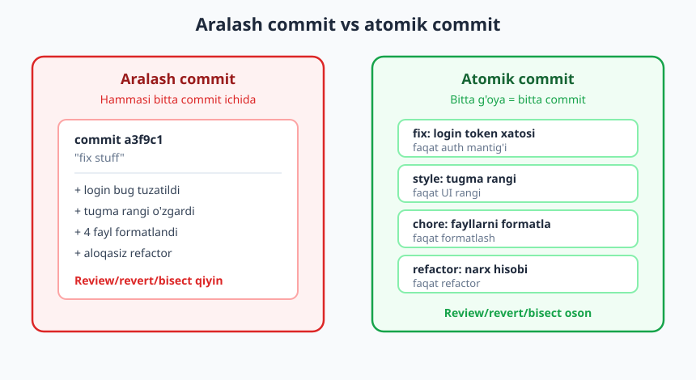
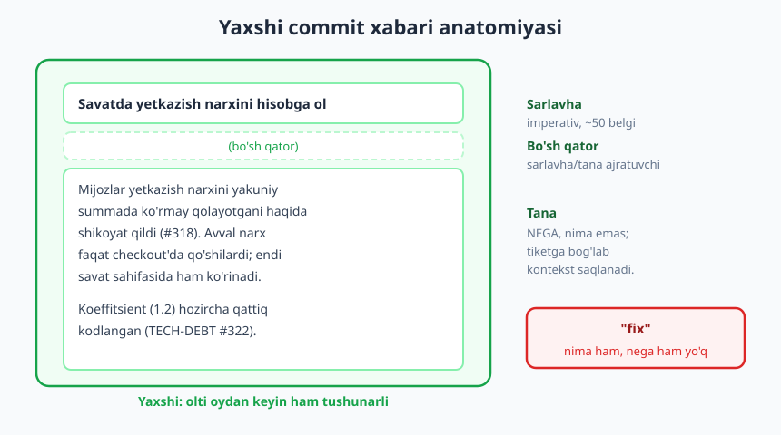
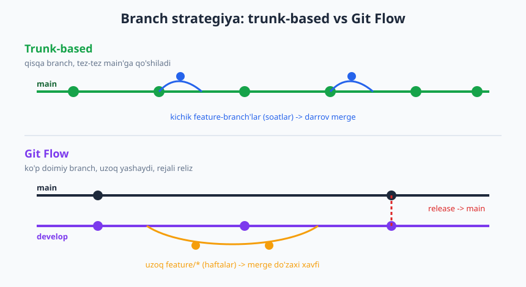

# 14 — Jamoaviy kod oqimi: commit, branch, PR madaniyati

[⬅️ Oldingi: 13 — Code review — berish va olish](./13-code-review.md) · [🏠 README](./README.md) · [Keyingi: 15 — Agile amalda: Scrum, Kanban va sprintlar ➡️](./15-agile-scrum-kanban.md)

---

> **Bu bobda:** versiya nazorati yakka ish emas, **jamoa tili** ekani; atomik commit (bitta mantiqiy o'zgarish = bitta commit) va nega kichik commit review, revert va bisect uchun qulay; yaxshi commit xabari anatomiyasi (imperativ sarlavha + "nega" tanasi); branch strategiyasi (trunk-based vs Git Flow vs GitHub Flow) jamoa **qarori** sifatida; PR odob-axloqi va asosiy branchni himoya qilish. Maqsad — Git buyruqlarini emas, **jamoaviy odob va kelishuvni** o'rganish.
>
> **Halollik / Eslatma:** bu yerda Git **mexanikasi** o'rgatilmaydi (rebase qanday ishlaydi, merge konflikti qanday hal qilinadi) — buni [Git & GitHub](../git-github/README.md) kitobi qiladi; bu bob unga havola qiladi va takrorlamaydi. Bu yerdagi narsa — *madaniyat*: qaror, kelishuv, odob. "To'g'ri" oqim yagona emas; eng yaxshisi — jamoangizga va kontekstingizga mos keladigani. Quyidagilar amaliy yo'l-yo'riq, qonun emas.

---

## Git yakka emas — jamoa tili

Yolg'iz ishlaganingizda Git sizning shaxsiy "qaytarish" tugmangiz: commit'lar qanday bo'lsa ham, hech kim ko'rmaydi. Jamoaga qo'shilganingizda hammasi o'zgaradi. Endi sizning commit tarixingiz, branch nomlaringiz va PR'laringiz — **boshqa odamlar o'qiydigan matn**. Ular siz nima qilganingizni, nega qilganingizni va bir narsa buzilganda qaysi o'zgarish aybdor ekanini aynan shu tarixdan o'qiydilar.

Shuning uchun professional dasturchi uchun versiya nazorati — texnik vosita emas, **kommunikatsiya vositasi**. Sof, o'qiladigan tarix — jamoaga qoldirgan sovg'angiz. Chalkash tarix esa — har kim to'lashga majbur bo'ladigan yashirin soliq: kim nimani buzganini topish soatlar oladi, "bu o'zgarish nega qilingan?" degan savolga hech kim javob bera olmaydi.

Bu bobning butun mohiyati shu jumlada: **kelajakdagi o'qiruvchi uchun yozing.** O'sha o'qiruvchi — olti oydan keyingi yangi jamoadosh, yoki yarim tunda buzilgan production'ni tuzatayotgan navbatchi, yoki ko'pincha — hamma narsani unutib qolgan kelajakdagi siz.

## Atomik commit: bitta mantiqiy o'zgarish

**Atomik commit** — bitta to'liq, mantiqan yaxlit o'zgarishni o'z ichiga oladigan commit. "Atomik" so'zi — "bo'linmas, lekin to'liq" degani: commit'da bitta g'oya bor, na ko'p, na kam. Login bug'ini tuzatdingizmi — o'sha tuzatish bitta commit. Tugma rangini o'zgartirdingizmi — bu boshqa commit.

Anti-naqsh — **aralash commit** (kasaba uyushmasi commit, "kitchen sink"): bitta commit'da bug tuzatish, yangi feature, kod formatlash va ikkita aloqasiz refactoring birga turadi.



Nega kichik, atomik commit qulay — uchta amaliy sabab bor, va uchalasi ham jamoa hayotini osonlashtiradi:

- **Review oson.** Bitta g'oyani o'z ichiga olgan commit'ni ko'rib chiqish oson; uni tushunish uchun reviewer bitta narsaga e'tibor beradi. Aralash commit'ni review qilish — bir vaqtning o'zida besh xil filmni tomosha qilishga o'xshaydi (review odobi haqida [13-bob](./13-code-review.md)).
- **Revert oson.** Feature buzuq chiqdimi — atomik bo'lsa, faqat o'sha bitta commit'ni orqaga qaytarasiz, qolgani joyida qoladi. Aralash commit'da feature'ni qaytarsangiz, u bilan birga bog'liq bo'lmagan bug-tuzatish ham yo'qoladi.
- **Bisection oson.** `git bisect` — qaysi commit bug kiritganini ikkilik qidiruv bilan topadigan vosita ([04-bob](./04-debugging-tizimli-ovlash.md)dagi bisection g'oyasi aynan shu). Har commit yaxlit va ishlaydigan bo'lsa, bisect aybdorni aniq ko'rsatadi. Aralash commit'da "aybdor commit" topilsa ham, u beshta narsani o'zgartirgani uchun aybdor *qism* noma'lum qoladi.

Praktik mezon: "Bu commit'ni bir jumlada, 'va' so'zisiz tasvirlay olamanmi?" Agar "login bug'ini tuzatdim **va** tugma rangini o'zgartirdim **va** formatladim" desangiz — bu uchta commit bo'lishi kerak edi.

> **Trade-off:** atomik commit dogmaga aylanmasligi kerak. Har bitta o'zgartirilgan qatorga alohida commit qilish — boshqa chekka: tarix shovqinga to'ladi, "bitta mantiqiy o'zgarish" o'nta mayda commit'ga bo'linib, aslida o'qishni qiyinlashtiradi. Maqsad — *mantiqiy* yaxlitlik, fizik mayda-chuydalik emas. Shuningdek, juda erta bosqichda ("ishlab turibdi, keyin tartibga solaman") mukammal atomik commit'lar yozishga urinish ishni sekinlashtirishi mumkin — ko'p jamoa ishni mahalliy "ishchi" commit'lar bilan qiladi, keyin PR'ni squash qilib bitta toza commit'ga aylantiradi (squash haqida pastda).

## Yaxshi commit xabari: nima emas, nega

Aksariyat yangi dasturchi commit xabarini "majburiy formal qadam" deb biladi va `fix`, `update`, `asd`, `ishladi nihoyat` deb yozadi. Bu — yo'qotilgan imkoniyat. Commit xabari — kodingiz **nega** o'zgarganini saqlaydigan yagona joy; kod *nima* qilishini kodning o'zidan ko'rish mumkin, lekin *nega shunday qilingani* faqat odamning boshida yoki commit xabarida bo'ladi.

Yaxshi commit xabarining anatomiyasi: **imperativ sarlavha** (taxminan 50 belgi) + **bo'sh qator** + **tana** (nega va kontekst).



- **Sarlavha — imperativ (buyruq) mayl.** "Add", "Fix", "Remove" — "Added", "Fixes", "Removing" emas. Sezgi shunaqa: sarlavha "Agar qo'llansa, bu commit ___ qiladi" jumlasini to'ldirishi kerak. O'zbekcha jamoada o'zbekcha imperativ ham yaxshi: "to'lov validatsiyasini qo'sh", "login xatosini tuzat".
- **Sarlavha qisqa va aniq** (~50 belgi), oxirida nuqta yo'q.
- **Bo'sh qator** — sarlavha bilan tana orasida shart (vositalar shu bo'sh qatorga qarab sarlavhani ajratadi).
- **Tana — NEGA.** Nega bu o'zgarish kerak edi? Qanday muammoni hal qiladi? Qaysi yondashuvni nega tanladingiz? Tana ixtiyoriy: kichik, o'zidan ravshan o'zgarishga shart emas, lekin "nega" tushunarsiz bo'lgan har joyda shart.

❌ **Yomon — nima ham, nega ham yo'q:**

```text
fix
```

```text
update code
```

❌ **Yomon — faqat "nima" (koddan ham ko'rinadi), "nega" yo'q:**

```text
narxni 1.2 ga ko'paytirildi
```

✅ **Yaxshi — sarlavha imperativ, tana "nega"ni saqlaydi:**

```text
Savatda yetkazib berish narxini hisobga ol

Mijozlar yetkazish narxini yakuniy summada ko'rmay
qolayotgani haqida shikoyat qildi (#318). Avval narx
faqat checkout sahifasida qo'shilardi; endi savat
sahifasida ham ko'rinadi, shunda mijoz "kutilmagan"
qo'shimcha summaga duch kelmaydi.

Mintaqaviy koeffitsient (1.2) hozircha qattiq kodlangan;
ikkinchi mintaqa qo'shilsa, sozlamaga chiqariladi (TECH-DEBT #322).
```

Bu xabarni olti oydan keyin o'qigan odam: o'zgarish nima uchun qilingani (shikoyat #318), qanday yechilgani va qaysi qarz qoldirilganini darrov tushunadi. `fix` xabari esa hech narsa demaydi.

### Conventional Commits sezgisi

Ko'p jamoa **Conventional Commits** konvensiyasini qabul qiladi: sarlavha `tur(doira): tavsif` shaklida boshlanadi, masalan:

```text
feat(savat): yetkazish narxini savatda ko'rsat
fix(auth): muddati o'tgan token bilan login xatosini tuzat
docs(readme): setup qadamlarini yangila
refactor(payment): to'lov mantig'ini servisga ajrat
```

Asosiy turlar: `feat` (yangi xususiyat), `fix` (bug tuzatish), `docs`, `refactor`, `test`, `chore` (texnik ish). Foydasi: tarix mashina o'qiy oladigan bo'ladi (avtomatik changelog, versiya), va inson ham bir qarashda commit turini biladi. Bu — *konvensiya*, majburiyat emas: ba'zi jamoa qabul qiladi, ba'zisi yo'q. Muhimi — jamoa **bitta** uslubga kelishishi va unga rioya qilishi.

> **Eslatma:** commit xabarida muammo/tiket raqamini bog'lash (`#318`, `JIRA-142`) — kichik, lekin kuchli odat. U kodni "nega" hujjatiga ulaydi: kelajakda kimdir bu qatorga qarab "nega bunday?" desa, tiketga o'tib to'liq kontekstni topadi.

## Branch strategiyasi — jamoa qarori

Branch (tarmoq) bilan ishlash uslubi — texnik tanlov emas, **jamoaviy qaror**. To'g'ri javob jamoa hajmiga, reliz tezligiga va mahsulot turiga bog'liq. Uchta keng tarqalgan oqim bor.



- **Trunk-based development.** Hamma `main` (trunk) atrofida ishlaydi; branch'lar juda qisqa umrli (soatlar yoki bir kun), tez-tez `main`'ga qo'shiladi. Tugallanmagan ish ko'pincha **feature flag** ortida yashiriladi. Doimiy integratsiya (CI/CD) bilan juda yaxshi mos keladi.
- **GitHub Flow.** Soddalashtirilgan oqim: `main` har doim deploy qilsa bo'ladigan holatda; har ish uchun qisqa umrli feature-branch, PR orqali review, merge, deploy. Trunk-based va Git Flow orasidagi oltin o'rtalik; ko'p veb-jamoa shuni ishlatadi.
- **Git Flow.** Murakkab, ko'p doimiy branch: `main`, `develop`, `feature/*`, `release/*`, `hotfix/*`. Rejalashtirilgan, versiyalangan relizlar uchun mo'ljallangan (masalan, har olti haftada chiqadigan, bir nechta versiya bir vaqtda qo'llab-quvvatlanadigan mahsulotlar).

| Mezon | Trunk-based | GitHub Flow | Git Flow |
|---|---|---|---|
| Branch umri | Soatlar–1 kun | Kunlar | Haftalar |
| Doimiy branch | Faqat `main` | Faqat `main` | `main` + `develop` (+ relizlar) |
| Reliz uslubi | Doimiy (CI/CD) | Tez, ko'p marta | Rejalangan, versiyalangan |
| Jamoa hajmi | Har xil (tajriba kerak) | Kichik–o'rta | O'rta–katta |
| Merge murakkabligi | Past (kichik, tez) | Past–o'rta | Yuqori (uzoq branch) |
| Eng mos | Tez-tez deploy, kuchli CI | Veb-app, SaaS, startap | Versiyali mahsulot, bir nechta reliz |

Eng muhim umumiy tamoyil — barcha zamonaviy oqimda bir xil: **uzoq yashagan branch — xavf.** Branch `main`'dan qancha uzoq va qancha uzun ayri yursa, oxirida qo'shilish shuncha og'riqli bo'ladi — bu "merge do'zaxi" (merge hell). Ikki hafta alohida ishlagan branch'da o'nlab konflikt, eskirgan kontekst va "men nima qilgandim?" holati bo'ladi. Qisqa, tez-tez qo'shiladigan branch — har safar kichik, oson hal qilinadigan farq beradi.

> **Trade-off:** "trunk-based eng zamonaviy, demak hamma shuni ishlatishi kerak" — soddalashtirilgan fikr. Trunk-based kuchli CI/CD, yaxshi test qamrovi va feature flag intizomini talab qiladi; bularsiz `main`'ga tez-tez qo'shish — uni doimiy buzish demakdir. Aksincha, kichik jamoa uchun Git Flow'ning beshta branch turi — keraksiz murakkablik, "merosxo'r" jarayon. Strategiya jamoa pishganligiga mos bo'lishi kerak, modaga emas. **Eng oddiy, sizda ishlaydigan oqimni tanlang.**

## PR odob-axloqi

Pull request (yoki merge request) — bu kodingizni asosiy branchga qo'shishni so'rovingiz, *va* uni review qilish, muhokama qilish joyingiz. PR'ning odobi — sizning kodingizdan ko'ra ko'proq jamoadoshlaringizning vaqtini hurmat qilish haqida.

- **Kichik PR.** 2000 qatorlik PR'ni hech kim chuqur review qilmaydi — odam "ko'rdim" deb tasdiqlaydi va buglar o'tib ketadi. 200 qatorlik PR — haqiqiy review oladi. Kichik PR = atomik commit g'oyasining PR darajadagi aksi.
- **Aniq tavsif.** PR sarlavhasi va tavsifi *nima* va *nega*ni aytadi; tegishli tiketga bog'lanadi; agar UI o'zgarsa — skrinshot. Reviewer kodga kirishdan oldin nimaga qarashini bilishi kerak.
- **Avval o'zingiz review qiling.** PR ochishdan oldin o'z "Files changed" jadvalingizni o'qing. Yarmiga yetmagan TODO, debug `print`, tasodifan qolgan fayl — ko'pincha o'zingiz topasiz. Bu reviewerga hurmat.
- **"Yashil" CI.** PR'ni CI (testlar, lint) o'tmaguncha review'ga qo'ymang. Reviewer test buzilganini sizga aytishi — uning vaqtini behuda sarflash; buni vosita aytsin (CI/lint haqida [DevOps](../devops/README.md)).
- **Draft PR.** Ish hali tugamagan bo'lsa, lekin erta fikr xohlasangiz — **draft** (qoralama) PR oching. Bu "hali review so'ramayapman, lekin yo'nalish to'g'rimi?" degan halol signal.
- **Tez javob.** Sizning PR'ingizga sharh kelsa, tez javob bering; siz boshqaning PR'ini review qilsangiz — uni "osib qo'ymang". Bloklangan PR — bloklangan jamoadosh.
- **Konfliktni o'zingiz hal qiling.** PR'ingiz `main` bilan konfliktga tushsa — uni hal qilish sizning ishingiz, reviewer'niki emas (mexanika [Git & GitHub](../git-github/README.md)da).

❌ **Yomon PR tavsifi:**

```text
Sarlavha: changes
Tavsif: (bo'sh)
```

✅ **Yaxshi PR tavsifi:**

```text
Sarlavha: Savatda yetkazish narxini ko'rsat (#318)

## Nima
Savat sahifasida endi yetkazish narxi ko'rsatiladi.

## Nega
Mijozlar yakuniy summada "kutilmagan" narxga duch kelyapti (#318).

## Qanday sinash
1. Savatga mahsulot qo'sh
2. Savat sahifasida "Yetkazish: 15 000" qatori ko'rinishini tekshir

## Eslatma
Mintaqa koeffitsienti hozircha qattiq kodlangan (TECH-DEBT #322).
```

> **Eslatma:** PR sizning ishingizni emas, **muammoni** hal qiladi. "Men 3 kun ishladim, tasdiqlang" emas; "bu muammo shunday hal qilindi, to'g'rimi?" Egolik bilan kodga yopishish — eng katta jamoaviy ziddiyat manbai (ego'siz muhandislik [13-bob](./13-code-review.md)da).

## Asosiy branchni himoya qilish

Sog'lom jamoada `main`'ga **to'g'ridan-to'g'ri push qilinmaydi.** `main` — barcha foydalanadigan "haqiqat manbai"; uni buzish — butun jamoani bloklash. Shuning uchun jamoalar **branch himoyasi** (branch protection) qoidalarini o'rnatadi:

- To'g'ridan-to'g'ri push taqiqlanadi; har o'zgarish PR orqali kiradi.
- Merge'dan oldin CI (test, lint) majburiy **yashil** bo'lishi shart.
- Kamida bitta (yoki ko'proq) **approve** talab qilinadi.

Bu qoidalar individual dasturchiga ishonchsizlik emas — ular **inson xatosini tizim darajasida** oldini oladi. Eng tajribali dasturchi ham charchagan kuni `main`'ga to'g'ridan-to'g'ri buzuq kod push qilishi mumkin; himoya buni imkonsiz qiladi. Mexanik sozlash [DevOps](../devops/README.md) va [Git & GitHub](../git-github/README.md)da; bu yerda muhimi — **bu madaniy norma**, shaxsiy hujum emas.

## Jamoa kelishuvi: yozib qo'ying

Yuqoridagi qarorlarning aksariyatida "to'g'ri" javob yo'q — muhimi, jamoa **kelishib olishi va yozib qo'yishi**. Aytilmagan kelishuv — kelishuv emas; u har yangi a'zo bilan qaytadan, ko'pincha janjal orqali "kashf qilinadi". Kelishish kerak bo'lgan asosiy nuqtalar:

- **Branch nomlash.** `feature/savat-narx`, `fix/login-token`, yoki `OQIL-318-savat`? Bitta naqsh tanlang.
- **Squash vs merge.** PR merge qilinganda commit'lar bittaga **squash** qilinsinmi (toza, chiziqli `main` tarixi) yoki **merge commit** bilan saqlanadimi (to'liq tarix)? Ikkalasining ham asosi bor.
- **Kim approve qiladi.** Nechta approve kerak? Code owner shartmi? Kichik o'zgarishga yengilroq qoidami?
- **Commit uslubi.** Conventional Commits ishlatiladimi, yo'qmi?

| Mavzu | Bir tomon | Boshqa tomon |
|---|---|---|
| **Squash** | Toza, chiziqli `main`; bitta PR = bitta commit; revert oson | Ish jarayonidagi mayda commit tarixi yo'qoladi |
| **Merge commit** | To'liq tarix saqlanadi | `main` tarixi shovqinli, o'qish qiyinroq |

> **Trade-off:** squash vs merge bo'yicha "to'g'ri" javob yo'q. Squash — `main` tarixini o'qish uchun ajoyib (har commit = bitta yaxlit feature), lekin batafsil ishchi tarix yo'qoladi. Merge commit — har qadamni saqlaydi, lekin tarix shovqinli bo'ladi. Ko'p jamoa squash'ni tanlaydi, chunki kelajakdagi o'quvchi uchun toza `main` qimmatroq. Lekin bu — kelishuv masalasi: jamoa qaror qilib, **bir xil** ishlatsa bo'ldi. Eng yomoni — har kim o'zicha qilishi.

## Halollik: "to'g'ri" oqim yo'q

Internetda "Git Flow eng yaxshi" yoki "trunk-based yagona to'g'ri yo'l" degan qat'iy maqolalarni ko'p ko'rasiz. Haqiqat soddaroq va kamtarroq: **kontekstga bog'liq.** Uch kishilik startap va uch yuz kishilik bankning oqimi bir xil bo'lishi shart emas — va bo'lmasligi kerak.

Dasturchi sifatida sizning vazifangiz — eng "to'g'ri" yoki eng "zamonaviy" oqimni izlash emas, balki **eng oddiy, jamoangizda ishlaydigan** oqimni tanlash va unga izchil rioya qilish. Dogmadan qoching: agar jarayon ishni osonlashtirsa — yaxshi; agar u shunchaki "kitobda shunday yozilgan" deb murakkablik qo'shsa — uni soddalashtiring.

Va eng oxirgi tamoyil: bularning hammasi — atomik commit, toza xabar, kichik PR — bitta narsaga xizmat qiladi. **Kelajakdagi o'qiruvchiga g'amxo'rlik.** O'sha o'qiruvchi — jamoadoshingiz va ko'pincha o'zingiz. Sof tarix — kelajakka yozilgan xat.

---

## Asosiy g'oyalar (bobni qisqacha)

- **Versiya nazorati — jamoa tili**, yakka vosita emas: commit, branch va PR — boshqalar o'qiydigan matn; sof tarix jamoaga sovg'a.
- **Atomik commit** = bitta mantiqiy o'zgarish; review, **revert** va **bisect** uchun qulay; mezon — "va" so'zisiz bir jumlada tasvirlash.
- **Yaxshi commit xabari** = imperativ sarlavha (~50 belgi) + bo'sh qator + **nega** tanasi; "nima"ni koddan ko'rasiz, "nega"ni faqat xabardan; Conventional Commits — foydali konvensiya.
- **Branch strategiyasi — jamoa qarori**: trunk-based / GitHub Flow / Git Flow; tanlov hajm va reliz tezligiga bog'liq; **uzoq yashagan branch = merge do'zaxi**.
- **PR odobi**: kichik PR, aniq tavsif, o'zini review, yashil CI, draft, tez javob, konfliktni o'zing hal qil.
- **`main`'ni himoyala**: to'g'ridan-to'g'ri push yo'q, CI/approve majburiy — bu inson xatosini tizim darajasida to'sadi, ishonchsizlik emas.
- **Jamoa kelishuvini yozib qo'ying**: branch nomlash, squash vs merge, kim approve qiladi — aytilmagan kelishuv kelishuv emas.
- **"To'g'ri" oqim yagona emas** — kontekstga bog'liq; eng oddiy ishlaydigan oqimni tanlang, dogmadan qoching.

---

## Mashqlar

### Oson

**1-mashq.** Quyidagi commit xabarini tuzating — uni atomik va ma'noli qiling. Nima xato, qanday qilib yaxshilaysiz?
```text
fix stuff
```
Vaziyat: bu commit'da login bug'i tuzatilgan, bitta tugma rangi o'zgartirilgan va ikkita fayl avtomatik formatlangan.

**2-mashq.** Quyidagi sarlavhalardan qaysilari to'g'ri **imperativ** maylda? Noto'g'rilarini tuzating:
(a) `Added new login page`
(b) `Fix token expiry bug`
(c) `narxni yangiladim`
(d) `Remove unused imports`

**3-mashq.** O'z so'zlaringiz bilan ayting: nega katta jamoada `main`'ga to'g'ridan-to'g'ri push qilish taqiqlanadi? Uchta sabab keltiring.

### O'rta

**4-mashq.** Quyidagi commit xabarini to'liq professional shaklga keltiring (sarlavha + bo'sh qator + nega tanasi). Vaziyat: hisobot sahifasi sekin yuklanardi, chunki har qator uchun alohida DB so'rovi yuborilardi (N+1); siz uni bitta so'rovga aylantirdingiz.
```text
hisobotni tezlashtirdim
```

**5-mashq.** Quyidagi uchta jamoa uchun **qaysi branch strategiya** mos? Har biriga sababini bir-ikki jumlada asoslang:
(a) 4 kishilik startap, kuniga bir necha marta deploy qiladigan SaaS veb-app, kuchli avtomatik testlar bor.
(b) 40 kishilik jamoa, mijozlarga o'rnatiladigan dasturning 2.3, 2.4 va 3.0 versiyalarini bir vaqtda qo'llab-quvvatlaydi.
(c) 6 kishilik jamoa, haftada bir marta deploy qiladigan ichki veb-asbob, CI hali yangi.

**6-mashq.** Sizning jamoangiz "squash vs merge commit" bo'yicha bo'linib qoldi. Har bir variantning bitta ustun va bitta kamchiligini yozing, keyin "yangi loyiha, toza `main` tarixi muhim" konteksti uchun qaysi birini tanlashingizni asoslang.

### Qiyin

**7-mashq.** Sizga 1800 qatorlik, bitta katta PR'ni review qilish berildi: u yangi to'lov modulini, butun loyihaning formatlanishini va aloqasiz bug-tuzatishni o'z ichiga oladi. CI yashil. Buni qanday boshqarasiz? (1) PR muallifiga nima taklif qilasiz va qanday til bilan; (2) atomik commit/kichik PR g'oyasidan kelib chiqib, ideal holatda bu PR qanday bo'lishi kerak edi; (3) trade-off bormi (kichik PR har doim ham bepulmi)?

**8-mashq.** Jamoangizda yozilmagan, lekin amaldagi kelishuvlar bor: "main'ga push qilma", "PR'ni squash qil", lekin yangi qo'shilgan har bir odam buni janjal orqali "kashf qiladi". Siz buni tuzatmoqchisiz. (1) Qaysi kelishuvlarni rasman yozib qo'yish kerakligini ro'yxatlang; (2) ularni qayerga yozasiz (havola: [18-hujjatlash] — kontekst); (3) qanday qilib bu "qoidalar to'plami" emas, "jamoa kelishuvi" bo'lib qolishini ta'minlaysiz?

<details markdown="1">
<summary>Yechimlar</summary>

### 1-mashq yechimi
Asosiy muammo ikki qavatli: (1) xabar ma'nosiz (`fix stuff` hech narsa demaydi), (2) commit **aralash** — uch xil aloqasiz o'zgarish bitta joyda. To'g'risi — uni **uchta atomik commit'ga** ajratish:
```text
Muddati o'tgan token bilan login xatosini tuzat

Token muddati tekshiruvi noto'g'ri timezone'da
solishtirilayotgani uchun login rad etilardi (#207).
```
```text
"Saqlash" tugmasi rangini brend ko'k rangiga moslashtir
```
```text
auth/ ostidagi fayllarni formatla
```
Mezon: har commit bitta mantiqiy o'zgarish; sarlavha imperativ va aniq; bug-tuzatishda "nega" tanasi bor.

### 2-mashq yechimi
(a) ❌ `Added` → ✅ `Add new login page` (o'tgan zamon emas, imperativ). (b) ✅ to'g'ri (`Fix ...` imperativ). (c) ❌ `narxni yangiladim` → ✅ `narxni yangila` (o'zbekcha imperativ: "...ladim" o'tgan zamon, imperativ — "...la"). (d) ✅ to'g'ri. Tamoyil: sarlavha "Agar qo'llansa, bu commit ___ qiladi" jumlasini to'ldirishi kerak.

### 3-mashq yechimi
Namuna sabablar (uchtasi yetarli): (1) **`main` hamma uchun haqiqat manbai** — uni buzish butun jamoani bloklaydi. (2) **Review o'tkazib yuboriladi** — to'g'ridan-to'g'ri push'da hech kim kodni ko'rmaydi; xato va xavfsizlik muammosi nazoratsiz kiradi. (3) **CI majburiy emas bo'lib qoladi** — testdan o'tmagan kod `main`'ga tushishi mumkin. (4) **Inson xatosini tizim to'smaydi** — eng tajribali odam ham charchagan kuni xato push qiladi; himoya buni imkonsiz qiladi. Asosiy g'oya: bu ishonchsizlik emas, **tizim darajasidagi xavfsizlik**.

### 4-mashq yechimi
Namuna:
```text
Hisobot sahifasidagi N+1 so'rovni bitta so'rovga birlashtir

Hisobot sahifasi 8-10 soniya yuklanardi: har qator uchun
alohida DB so'rovi yuborilardi (1000 qator = 1000 so'rov).
Endi barcha qatorlar bitta JOIN so'rovi bilan olinadi,
yuklanish ~0.4 soniyaga tushdi (#291).
```
Mezon: imperativ sarlavha (~50 belgi); bo'sh qator; tana **nega**ni (sekinlik sababi N+1) va natijani (vaqt o'zgarishi) saqlaydi; tiketga bog'langan. "Tezlashtirdim" — faqat natija, "nega" yo'q edi.

### 5-mashq yechimi
(a) **Trunk-based** (yoki GitHub Flow). Kichik jamoa, tez-tez deploy, kuchli testlar — qisqa branch'lar va doimiy integratsiya ideal mos; feature flag bilan tugallanmagan ishni yashirish mumkin. (b) **Git Flow**. Bir vaqtda bir nechta versiyani qo'llab-quvvatlash — aynan `release/*` va `hotfix/*` branch'lari uchun mo'ljallangan stsenariy; murakkablik bu yerda oqlanadi. (c) **GitHub Flow**. O'rta-kichik jamoa, haftalik deploy, CI yangi — sodda PR-asoslangan oqim mos; trunk-based uchun CI hali yetarli pishmagan, Git Flow esa ortiqcha murakkab bo'lardi. Mezon: tanlov hajm + reliz tezligi + CI pishganligiga asoslangan, modaga emas.

### 6-mashq yechimi
**Squash:** ustun — toza, chiziqli `main` (bitta PR = bitta yaxlit commit), revert oson; kamchilik — ish jarayonidagi mayda commit tarixi yo'qoladi. **Merge commit:** ustun — to'liq tarix saqlanadi (har qadam ko'rinadi); kamchilik — `main` tarixi shovqinli, o'qish qiyin. "Yangi loyiha, toza tarix muhim" konteksti uchun — **squash**: kelajakdagi o'quvchi uchun har commit bitta tushunarli feature bo'ladi, va loyiha boshida batafsil ishchi tarixning qiymati past. Mezon: ikkala tomonning asosi ko'rsatilgan, tanlov kontekst bilan asoslangan (yagona "to'g'ri" javob yo'q).

### 7-mashq yechimi
**(1) Muallifga taklif** — mehribon, lekin aniq til bilan: "Bu PR juda katta va bir nechta aloqasiz o'zgarishni birlashtirgan, shuning uchun uni sifatli review qilish qiyin. Iloji bo'lsa, uni uchta alohida PR'ga bo'lsak: (a) to'lov moduli, (b) formatlash, (c) bug-tuzatish — har birini alohida va tezroq review qila olaman." Aybdor qilmang, muammoni (review sifati) ko'rsating ([13-bob](./13-code-review.md)). **(2) Ideal holat:** uchta alohida PR, har biri kichik va atomik; formatlash — alohida, hech qanday mantiq o'zgarishisiz (formatlashni mantiqdan ajratish review'ni juda osonlashtiradi); bug-tuzatish — o'z PR'ida, o'z tavsifi va tiketi bilan. **(3) Trade-off:** ha — kichik PR bepul emas. Juda mayda bo'laklarga bo'lish nakladnoy xarajat (ko'p PR ochish, kutish, kontekst almashinuvi) tug'diradi, va ba'zan bir-biriga bog'liq o'zgarishni sun'iy ajratish noqulay. Lekin 1800 qatorlik aralash PR aniq juda katta — bu yerda bo'lish foydasi xarajatdan ancha katta. Mezon: mehribon-aniq kommunikatsiya + atomik/kichik-PR tamoyili + trade-off ongi.

### 8-mashq yechimi
**(1) Yozib qo'yiladigan kelishuvlar:** branch nomlash naqshi; `main`'ga to'g'ridan-to'g'ri push taqiqi (branch himoyasi); squash vs merge qarorii; nechta approve kerak; CI yashil bo'lishi sharti; commit xabari uslubi (Conventional Commits ishlatiladimi); PR tavsifi nimani o'z ichiga olishi. **(2) Qayerga:** loyihaning `CONTRIBUTING.md` yoki jamoa wiki'siga; onboarding hujjatiga havola qilingan ([18-hujjatlash] — bu kelishuvlar yangi a'zo birinchi kuni o'qiydigan joyda bo'lishi kerak; mexanik himoya esa `main`'da branch protection orqali majburlanadi). **(3) "Qoida" emas, "kelishuv" bo'lib qolishi:** kelishuvlarni jamoa **birgalikda** muhokama qilib qabul qilsin (yuqoridan tushirilgan farmon emas); har biriga qisqa "nega" yozilsin; vaqti-vaqti bilan (mas. retro'da) qayta ko'rib chiqilsin va o'zgartirilishi mumkin bo'lsin. Mezon: yozma + topiladigan joyda + jamoa birgalikda egalik qiladi (dogma emas, tirik kelishuv).

</details>

---

[⬅️ Oldingi: 13 — Code review — berish va olish](./13-code-review.md) · [🏠 README](./README.md) · [Keyingi: 15 — Agile amalda: Scrum, Kanban va sprintlar ➡️](./15-agile-scrum-kanban.md)
