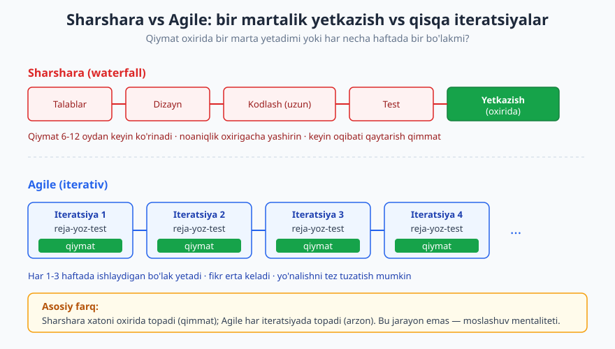
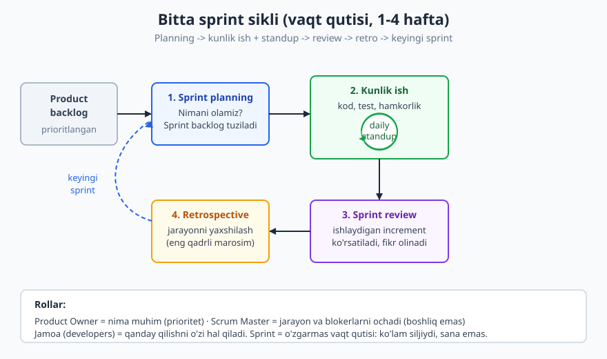
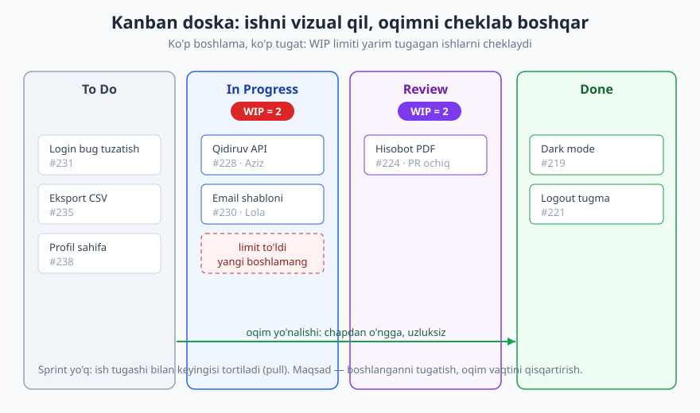

# 15 — Agile amalda: Scrum, Kanban va sprintlar

[⬅️ Oldingi: 14 — Jamoaviy kod oqimi: commit, branch, PR madaniyati](./14-jamoaviy-kod-oqimi.md) · [🏠 README](./README.md) · [Keyingi: 16 — Baholash va rejalashtirish ➡️](./16-baholash-rejalashtirish.md)

---

> **Bu bobda:** nega Agile paydo bo'ldi (sharshara muammosi) va Agile aslida nima — **jarayon emas, mentalitet**; Scrum amalda (rollar, artefaktlar, marosimlar, sprint = vaqt qutisi); to'g'ri standup va uning antipatterni; Kanban oqimi, doska va WIP limiti; nega retrospective eng qadrli marosim; user story va "definition of done"; va eng halol qism — "kargo-kult Agile" antipatternlari. Hammasi **dasturchi nuqtai nazaridan** (menejer emas): jarayon sizning ishingizni qiyinlashtirish uchun emas, qiymatni tez yetkazish uchun.
>
> **Halollik / Eslatma:** Agile — **vosita, din emas**. Bu bobdagi maslahatlar amaliy yo'l-yo'riq: bir jamoada to'g'ri narsa boshqasida ortiqcha bo'lishi mumkin. Ko'p jamoa "biz Agile qilamiz" deydi, lekin aslida marosim ostidagi sharsharani bajaradi. Maqsad — marosimni to'g'ri o'ynash emas, **moslashuvchanlik va qiymat**. Bu yerda keng tarqalgan amaliyot bor, lekin oxirgi qaror jamoangiz kontekstiga bog'liq.

---

## Nega Agile paydo bo'ldi: sharshara muammosi

Eski model — **sharshara (waterfall)**: avval hamma talab yig'iladi, keyin to'liq dizayn, keyin uzoq kodlash, keyin test, va oxirida — bir martada — yetkazish. Suv yuqoridan pastga oqqandek, har bosqich tugagach keyingisiga o'tiladi, ortga qaytish qimmat.

Bu qog'ozda chiroyli ko'rinadi. Muammo — **real hayot bunday emas**:

- Mijoz boshida nima xohlashini o'zi ham to'liq bilmaydi; ko'rmaguncha aytolmaydi.
- Talablar 6 oyda o'zgaradi (bozor, raqobat, qonun).
- Xato eng kech — test bosqichida yoki yetkazgandan keyin — topiladi, qachonki uni tuzatish eng qimmat.



2001-yilda 17 nafar dasturchi to'planib **Agile manifestini** yozdi. Bu yangi "jarayon" emas edi — bu **qadriyatlar to'plami**. Asosiy g'oya: katta, oldindan tuzilgan rejaga ko'r-ko'rona ergashishdan ko'ra, **kichik bo'laklarda yetkazish va o'rganib moslashish** yaxshiroq.

**To'rt qadriyat** (chapdagi ham qadrli, lekin o'ngdagidan ustun qo'yiladi):

| Ustun qo'yamiz | Lekin shundan voz kechmaymiz |
|---|---|
| **Shaxslar va o'zaro muloqot** | jarayon va vositalardan |
| **Ishlaydigan dastur** | to'liq hujjatdan |
| **Mijoz bilan hamkorlik** | shartnoma muzokarasidan |
| **O'zgarishga javob berish** | rejaga ergashishdan |

**12 prinsip** shuni amaliylashtiradi, lekin mohiyati bir nechtada: erta va tez-tez ishlaydigan dastur yetkazing; o'zgaruvchi talabni kech kelsa ham qabul qiling; biznes va dasturchi har kuni birga ishlasin; barqaror temp (sustainable pace) — toliqtirib emas; muntazam to'xtab "qanday yaxshilanamiz?" deb so'rang.

> **Eslatma:** Agile — **mentalitet, jarayon emas.** Scrum va Kanban — bu mentalitetni amalga oshirishning ikki usuli (framework). Siz Scrum'ning hamma marosimini bajarib ham Agile bo'lmasligingiz mumkin, va hech qanday rasmiy framework'siz ham chuqur Agile bo'lishingiz mumkin. Marosim — vosita; qadriyat — maqsad.

> **Trade-off:** sharshara har doim yomon emas. Talablar chinakam qotib turgan, o'zgarish ehtimoli kam va xato narxi ulkan bo'lgan sohalarda (kosmik apparat dasturi, tibbiy qurilma sertifikatsiyasi) oldindan to'liq dizayn oqilona. Agile o'zgaruvchanlik va noaniqlik ko'p bo'lgan joyda — ya'ni ko'pchilik biznes/veb/mobil mahsulotda — yutadi. Savol "qaysi biri to'g'ri" emas, "**mening kontekstimda noaniqlik qanchalik yuqori**" degan savol.

## Scrum: rollar, artefaktlar, marosimlar

**Scrum** — eng keng tarqalgan Agile framework. U ishni **sprint**larga bo'ladi: 1-4 haftalik (ko'pincha 2 hafta) **vaqt qutisi (timebox)**. Sprint oxirida — ishlaydigan, ko'rsatsa bo'ladigan mahsulot bo'lagi.



### Uch rol

- **Product Owner (PO)** — **nima** muhimligini hal qiladi. Backlog'ni prioritlaydi, biznes qiymatini ifodalaydi. Sizga "qaysi xususiyat avval" degan javobni beradi, lekin "qanday kodlash"ga aralashmaydi.
- **Scrum Master (SM)** — **jarayonni** soz tutadi va **blokerlarni** olib tashlaydi. Bu **boshliq emas** — xizmatkor-rahbar (servant leader). Yaxshi SM sizni himoya qiladi (ortiqcha yig'ilish, o'rtada vazifa qo'shishdan), boshqarmaydi.
- **Jamoa (developers)** — ishni **qanday** qilishni o'zi hal qiladi. Scrum jamoasi o'z-o'zini boshqaradi (self-organizing): kim nimani oladi, qanday yechadi — jamoaning qarori.

> **Eslatma:** dasturchi sifatida muhim narsa — **PO sizga vazifa bermaydi, prioritet beradi**. "Qanday" qilish sizning hududingiz. Agar kimdir "buni shu klass bilan, shu pattern'da yoz" deb mikromenejment qilsa — bu Scrum emas, bu sharshara yashiringan.

### Artefaktlar

- **Product backlog** — butun mahsulot uchun istaklar ro'yxati, prioritet bo'yicha tartiblangan. PO egasi.
- **Sprint backlog** — shu sprint uchun olingan ish (product backlog'ning tepasidan). Jamoa egasi.
- **Increment** — sprint oxiridagi ishlaydigan mahsulot bo'lagi. "Done" mezoniga javob bergan, ko'rsatsa bo'ladigan.

### To'rt marosim (events)

| Marosim | Qachon | Maqsad | Dasturchi uchun |
|---|---|---|---|
| **Sprint planning** | Sprint boshida | Nimani olamiz? Sprint backlog tuziladi | Realistik baho bering, ko'lamni tushuning |
| **Daily standup** | Har kuni, ~15 daqiqa | Sinxronlash, blokerni ochish | Qisqa, blokerga e'tibor |
| **Sprint review** | Sprint oxirida | Increment'ni ko'rsatish, fikr olish | Ishlaydigan narsani ko'rsating |
| **Retrospective** | Sprint oxirida | Jarayonni yaxshilash | Halol fikr, harakat taklif |

**Sprint = vaqt qutisi.** Bu eng muhim tushuncha: sprintning **uzunligi o'zgarmaydi**, **ko'lam** o'zgaradi. Ulgurmadingizmi? Sprintni cho'zmaysiz — ulgurmagan ish keyingi sprintga qaytadi. Bu intizom mo'ljal aniqligini oshiradi: jamoa vaqt ichida nima sig'ishini o'rganadi (qarang [16-bob](./16-baholash-rejalashtirish.md)).

## Standup: to'g'ri qilish

Daily standup (kunlik yig'ilish) — eng ko'p buziladigan marosim. To'g'ri qilingani **qisqa, tik turib** (shuning uchun "stand-up"), uch savolga javob:

1. Kecha nima qildim?
2. Bugun nima qilaman?
3. Meni nima **bloklayapti**?

Mohiyat — uchinchi savolda: **blokerni ochish va jamoani sinxronlash**. Bu **status hisobot emas**. Standup boshliqqa "men ishlayapman" deb isbotlash uchun emas — jamoa a'zolari bir-birini eshitib, "men ham shunga tegyapman, keyin urishamiz" yoki "men buni ochib beraman" deyishi uchun.

✅ **Sog'lom standup:**

```text
Aziz:  Kecha to'lov API integratsiyasini boshladim.
       Bugun webhook qismini tugataman.
       BLOKER: Payme test kaliti yo'q -- Lola, sizda bormi?

Lola:  Ha, sizga DM qilaman.
       Kecha qidiruv filtrini tugatdim, PR ochildi (#228).
       Bugun review kutaman, profil sahifaga o'taman.

Said:  Men #228 ni bugun ko'rib chiqaman.
       Kecha onboarding hujjatini yangiladim, blokerim yo'q.
```

15 daqiqada tugadi. Bloker ochildi (test kaliti), bir vazifa egasi topildi (review), ikki kishi to'qnashuvni oldindan ko'rdi. Bu — **jamoa uchun**, kimdir uchun emas.

❌ **Status hisoboti (antipattern):**

```text
Aziz:  Kecha ertalab soat 9 da keldim, avval emailni tekshirdim,
       keyin to'lov modulida HttpClient klassini ochdim, undagi
       timeout 30 sekund edi, men uni 60 ga oshirdim, keyin tushlik,
       keyin webhook handler yozdim, 3 ta funksiya, birinchisi...
       (Scrum Master telefonga qarab boshini chayqaydi.)
```

Bu yomon, chunki: (1) Aziz **menejerga** hisobot beryapti, jamoaga emas; (2) tafsilot juda ko'p — hech kimga kerak emas; (3) bloker yo'q — eng muhim qism o'tkazib yuborilgan; (4) 25 daqiqa ketdi, qolganlar zerikdi. Standup status teatriga aylandi.

| | Sog'lom standup | Status hisoboti (antipattern) |
|---|---|---|
| Kimga | Jamoaga (o'zaro) | Boshliqqa (yuqoriga) |
| Diqqat markazi | Bloker, sinxronlash | "Men band edim" isboti |
| Uzunlik | ~15 daqiqa, tik | Cho'ziladi, hamma o'tiradi |
| Tafsilot | Yetarli, kerakli | Mayda-chuyda, ortiqcha |
| Natija | Bloker ochiladi, harakat | Hech narsa o'zgarmaydi |

> **Trade-off:** standup har doim ham kerak emas. Kichik, bir xonada o'tirgan yoki uzluksiz suhbatlashadigan jamoaga rasmiy standup ortiqcha bo'lishi mumkin — ular allaqachon sinxron. Taqsimlangan (masofaviy, turli vaqt zonasi) jamoaga esa **asinxron standup** (yozma, kanalga) jonli yig'ilishdan yaxshiroq. Qoida: standup blokerni ochmasa va sinxronlamasa — formatni o'zgartiring yoki tashlang. Marosimni marosim uchun saqlamang.

## Kanban: oqim va WIP limiti

**Kanban** — boshqa yondashuv. Bu yerda **sprint yo'q**; ish **uzluksiz oqadi**. Tasavvur qiling: konveyer to'xtamaydi, vazifalar chapdan o'ngga suriladi.



Asosiy g'oyalar:

- **Vizuallashtirish** — ish doskada ko'rinadi: ustunlar (To Do / In Progress / Review / Done), kartalar — vazifalar. Hamma butun oqimni ko'radi.
- **WIP limiti (Work In Progress limit)** — har ustunda **bir vaqtda nechta** ish bo'lishi mumkinligi cheklanadi. Masalan "In Progress = 2": agar 2 ta ish bor bo'lsa, yangi boshlay olmaysiz — avval birortasini tugatib bo'shating.
- **"Ko'p boshlama, ko'p tugat" (Stop starting, start finishing)** — Kanban'ning shiori. Bir vaqtda 5 ta ishni "deyarli tugatish"dan ko'ra, 1-2 tasini **to'liq tugatish** qiymatliroq: yarim tugagan ish — yetkazilmagan qiymat.

WIP limiti aql bovar qilmaydigan darajada kuchli: u **darmonsizlanishni** majburan ochib tashlaydi. Agar In Progress to'lib qolsa va hech narsa Done'ga o'tmasa — demak biror joyda tiqilinch (bottleneck) bor (mas. review kimnidir kutyapti). WIP limiti sizni "yangi ish boshlash" o'rniga "tiqilinchni ochishga" majbur qiladi.

### Scrum va Kanban farqi

| | Scrum | Kanban |
|---|---|---|
| **Ritm** | Sprint (vaqt qutisi, 1-4 hafta) | Uzluksiz oqim, sprint yo'q |
| **Rollar** | PO, Scrum Master, jamoa | Belgilangan rol majburiy emas |
| **Rejalashtirish** | Sprint boshida, partiya bilan | Talab kelsa, doimiy |
| **Asosiy o'lcham** | Velocity (sprint hajmi) | Oqim vaqti (lead/cycle time) |
| **O'zgarish** | Sprint ichida ko'lam qotgan | Istalgan vaqtda prioritet o'zgaradi |
| **Eng mos** | Mahsulot rivoji, feature sprintlar | Qo'llab-quvvatlash, oqim ishi, support |

Ko'p jamoa ikkalasini aralashtiradi — **Scrumban**: Scrum marosimlari + Kanban doskasi va WIP limiti. Halol bo'ling: nom muhim emas, qaysi narsa **sizning oqimingizga** mos kelishi muhim.

> **Trade-off:** Kanban moslashuvchan, lekin **muddat bosimini kamaytirmaydi** — sprintning "vaqt qutisi" intizomi yo'qligi sababli ba'zi jamoa Kanban'da "tugamaydigan" ishga botadi. Scrum esa muntazam ritm va aniq nuqta beradi, lekin sprint o'rtasida shoshilinch ish kelsa, qattiqroq. Support/incident ko'p oqimga Kanban, reja bilan feature yetkazishga Scrum ko'pincha mosroq.

## Retrospective: eng qadrli marosim

Agar bitta marosimni saqlash kerak bo'lsa — bu **retrospective (retro)**. Sababi oddiy: qolgan hamma narsa **mahsulot** haqida, retro esa **jamoaning ishlash usuli** haqida. Bu yerda jamoa to'xtab, o'ziga qaraydi.

Klassik format — uch savol:

- **Nima yaxshi ketdi?** (saqlaymiz)
- **Nima yomon ketdi?** (muammolar)
- **Nimani o'zgartiramiz?** (harakat)

Retro ishlashining sharti — **psixologik xavfsizlik (psychological safety)**: odamlar jazo yoki masxaradan qo'rqmasdan haqiqatni aytishi mumkin bo'lgan muhit. Agar "nima yomon ketdi?" degan savolga hech kim ochiq javob bermasa — retro o'lik. Bu chuqur mavzu, [19-bobda](./19-fikr-mulohaza-mentorlik.md) feedback va jamoa madaniyati bilan birga.

Eng muhim qadam — retro'ni **harakatga aylantirish**. "Test yozishni unutyapmiz" deb aytib, hech narsa qilmaslik — retro teatri. To'g'ri retro **aniq, egali, o'lchovli harakat** chiqaradi:

❌ Noaniq: "Kelajakda ko'proq test yozaylik."
✅ Harakatga aylangan: "Keyingi sprintdan boshlab, har PR'da kamida bitta test bo'lsin — Said buni PR shabloniga qo'shadi (juma'gacha)."

> **Eslatma:** har retroda 1-2 ta **kichik** harakat oling, 10 ta emas. 10 ta "yaxshilash" — hech biri bajarilmaydi. Bitta o'zgarishni keyingi retro'da tekshiring: "o'tgan safar PR shablonini kelishdik — ishladimi?" Bu retro'ni gap-so'zdan haqiqiy yaxshilanishga aylantiradi.

## User story va "definition of done"

Agile'da ish ko'pincha **user story (foydalanuvchi hikoyasi)** sifatida ifodalanadi — texnik vazifa emas, **foydalanuvchi nuqtai nazaridan** qiymat. Klassik shakl:

```text
Kim sifatida (As a)        ...men foydalanuvchi turiman
Men xohlayman (I want)     ...men nima qilmoqchiman
Shuning uchun (so that)    ...men nima qiymat olaman
```

Misol:

```text
Onlayn-do'kon xaridori sifatida,
men savatchamni saqlab qo'ymoqchiman,
shuning uchun keyin qaytib kelganimda qaytadan tanlamayman.
```

Bu nega kuchli? Chunki **"nega"si bor** — siz nafaqat nima qilishni, balki **kim uchun va nega** ekanini bilasiz. "Savatcha jadvaliga `saved` ustuni qo'sh" degan texnik vazifada bu yo'qoladi; story esa qiymatga bog'laydi.

Har story'da **acceptance criteria (qabul mezonlari)** bo'ladi — "qachon tayyor deb hisoblanadi" ning aniq sharti:

```text
- Tizimga kirgan xaridor savatga mahsulot qo'shsa, u saqlanadi.
- Keyin qaytib kelganda, savatda o'sha mahsulotlar turibdi.
- Tizimga kirmagan (mehmon) foydalanuvchining savati saqlanmaydi.
```

**Definition of Done (DoD) — "tayyor" ta'rifi** — bundan kengroq: butun jamoa uchun **har** ishni "done" deyish sharti. Masalan:

- Kod yozildi va o'zini-o'zi review qildi.
- Test yozildi va o'tdi (qarang [11-bob](./11-testlash-madaniyati.md)).
- PR review'dan o'tdi va merge qilindi.
- Hujjat/README yangilandi (kerak bo'lsa).
- Staging'da ishlaydi.

DoD'ning kuchi — "done" so'zining ma'nosini **bitta** qiladi. "Tayyor" degan dasturchi va PO bir narsani tushunadi. Aks holda "tayyor (lekin test yo'q)" va "tayyor (lekin deploy bo'lmagan)" tushunmovchiliklari boshlanadi.

## Anti-patternlar: kargo-kult Agile

Endi eng halol qism. Ko'p jamoa "Agile qilamiz" deydi, lekin aslida **marosim teatri**ni o'ynaydi. Buni **kargo-kult Agile** deyiladi: marosim shakli bor, mentalitet yo'q.

| Antipattern | Qanday ko'rinadi | Aslida nima yetishmaydi |
|---|---|---|
| **Kargo-kult Agile** | Hamma marosim bajariladi, lekin moslashuv yo'q | Mentalitet (qadriyat) yo'q, faqat shakl |
| **Sprintni to'ldirish** | Vaqtni "to'ldirish" uchun ish tiqiladi | Barqaror temp, realistik baho yo'q |
| **Standup = status** | Boshliqqa hisobot, bloker yo'q | Jamoa sinxronligi, ishonch yo'q |
| **Retro'siz** | "Vaqt yo'q" deb retro tashlanadi | Yaxshilanish sikli yo'q — bir joyda qotadi |
| **Baholashni majburlash** | Baho = va'da, kechiksa jazo | Baho — taxmin, mas'uliyat emas ([16-bob](./16-baholash-rejalashtirish.md)) |
| **"Velocity poygasi"** | Jamoalar velocity bo'yicha solishtiriladi | Velocity — reja vositasi, KPI emas |

Eng zaharli antipattern — **baholashni majburlash**. Baho (estimate) — bu **taxmin**, va'da emas. Lekin ko'p tashkilotda baho "deadline"ga aylanadi, kechikish "jazo"ga. Natijada dasturchi himoya uchun bahoni shishiradi yoki sifatni qurbon qiladi. Bu chuqur mavzu — [16-bob](./16-baholash-rejalashtirish.md) aynan shu haqida.

**Real misol.** Bir kompaniya "biz Scrum'ga o'tdik" deb e'lon qildi. Ular kunlik standup o'tkazdi (lekin u 40 daqiqalik status hisoboti edi, menejer har kishidan "nega sekin?" deb so'rardi), sprint qildi (lekin sprint o'rtasida menejer doim yangi "shoshilinch" ish tiqardi, ko'lam hech qachon qotmasdi), va retro o'tkazdi (lekin hech qachon hech narsa o'zgarmasdi, chunki "vaqt yo'q"). Tashqaridan — to'liq Scrum. Ichkaridan — qo'rquv bilan boshqariladigan sharshara. Dasturchilar Agile'ni yomon ko'rib qoldi — aslida ular Agile'ni hech qachon ko'rmagan edi.

Buning aksi ham bor: bir kichik jamoa hech qanday rasmiy framework ishlatmasdi — sprint yo'q, Scrum Master yo'q. Lekin ular: kichik bo'laklarda yetkazardi, har juma 20 daqiqa "qanday yaxshilanamiz?" deb gaplashardi, va prioritet o'zgarsa bemalol moslashardi. Qog'ozda "Agile emas". Mohiyatda — eng chuqur Agile.

> **Trade-off:** rasmiy framework (Scrum sertifikatlari, vositalar, rollar) katta tashkilotda **koordinatsiya** uchun foydali — umumiy til beradi. Kichik jamoada esa u **ortiqcha yuk (overhead)** bo'lishi mumkin. Halol bo'ling: framework — vosita. Agar marosimlar qiymat yetkazishga yordam bermasa, ulardan voz keching yoki moslang. "Biz to'g'ri Scrum qilmayapmiz" degan tashvish ko'pincha noto'g'ri tashvish — to'g'ri savol: "biz tez va sifatli qiymat yetkazyapmizmi?"

## Halollik: Agile — vosita, din emas

Yakuniy halol fikr. Agile sanoatida ko'p **dogma** va **sotuvchilik** bor: sertifikatlar, qimmat vositalar, "yagona to'g'ri usul" da'volari. Bularning hammasi asl manifestning ruhiga **zid** — manifest aynan "jarayon va vositalardan ko'ra shaxslar va muloqot" deydi.

Dasturchi sifatida eslab qoling:

- Agile **mentalitet**: tez yetkazish, fikr olish, moslashish. Marosim — buning vositasi.
- Hech bir framework **muqaddas** emas. Scrum, Kanban, Scrumban — vositalar qutisidagi asboblar.
- "Biz Agile qilamiz" degan ko'p jamoa aslida sharshara qiladi. Marosim borligi Agile'ni anglatmaydi.
- Maqsad — **moslashuvchanlik va qiymat**, jadval to'ldirish emas.

Eng yaxshi jamoalar Agile haqida ko'p gapirmaydi — ular shunchaki tez, sifatli yetkazadi, bir-birini eshitadi va muntazam yaxshilanadi. Jarayon ko'rinmas bo'lib, qiymat ko'rinadigan bo'lganda — siz to'g'ri qilyapsiz.

---

## Asosiy g'oyalar (bobni qisqacha)

- **Agile = mentalitet, jarayon emas.** Sharshara muammosi (kech fikr, qimmat o'zgarish) ga javob: kichik iteratsiyalarda yetkazib, **o'rganib moslashish**.
- **Scrum**: uch rol (PO = nima, Scrum Master = jarayon/bloker, jamoa = qanday), artefaktlar (product/sprint backlog, increment), to'rt marosim. **Sprint = vaqt qutisi**: ko'lam siljiydi, sana emas.
- **Standup** — jamoa uchun sinxronlash va **bloker ochish**; status hisoboti EMAS. Qisqa, blokerga e'tibor.
- **Kanban**: uzluksiz oqim, doska, **WIP limiti** ("ko'p boshlama, ko'p tugat"); Scrum'dan farqi — sprint yo'q.
- **Retrospective** — eng qadrli marosim: nima yaxshi/yomon/o'zgartiramiz; **psixologik xavfsizlik** shart; **aniq harakatga** aylantirilsin.
- **User story** (kim/xohlayman/shuning uchun) qiymatni "nega"ga bog'laydi; **acceptance criteria** va **Definition of Done** "tayyor" ma'nosini bitta qiladi.
- **Anti-patternlar**: kargo-kult Agile (shakl bor, mentalitet yo'q), sprintni to'ldirish, standup=status, retro'siz, baholashni majburlash.
- **Halollik**: Agile — vosita, din emas. Maqsad — moslashuvchanlik va qiymat, marosimni mukammal o'ynash emas.

---

## Mashqlar

### Oson

**1-mashq.** O'z so'zlaringiz bilan tushuntiring: nega sharshara modeli "xato kech topiladi" muammosidan aziyat chekadi, va Agile buni qanday yengillashtiradi? Bitta konkret misol bilan.

**2-mashq.** Scrum'ning uch rolini (PO, Scrum Master, jamoa) va har birining asosiy mas'uliyatini bir jumlada yozing. "Nima" va "qanday" qarorlarini kim qabul qiladi?

**3-mashq.** Quyidagi user story'ni "Kim sifatida... men xohlayman... shuning uchun..." shaklida **to'liq** yozing: *"Foydalanuvchi parolini unutsa, uni tiklay olishi kerak."* Keyin shu story uchun **2 ta** acceptance criteria yozing.

### O'rta

**4-mashq.** Quyidagi standup nima uchun yomon ekanligini tahlil qiling va **uchta** muammoni nomlang:
> "Said: Kecha keldim, kofe ichdim, emailni ko'rdim, keyin `UserService` faylida 4 ta funksiyani ochdim, birinchisida null tekshiruvi yo'q ekan, qo'shdim, ikkinchisida... (8 daqiqa davom etadi). Blokerim yo'q deb o'ylayman."

Keyin shu standup'ni sog'lom shaklga keltirib qayta yozing (3 savol, qisqa, blokerga e'tibor bilan).

**5-mashq.** Jamoangiz Kanban doskasida "In Progress" ustunida WIP limiti = 3, lekin doimo 6-7 ta karta "In Progress"da turibdi va "Done"ga deyarli hech narsa o'tmayapti. (a) Bu nimani anglatadi? (b) WIP limitini qattiq hurmat qilish jamoani nimaga **majbur** qiladi? (c) Tiqilinchni topish uchun qaysi ustunlarga qaraysiz?

**6-mashq.** Sizning jamoangiz retrospective o'tkazadi, lekin har safar "ko'proq test yozaylik", "yaxshiroq kommunikatsiya qilaylik" kabi noaniq gaplar bilan tugaydi va hech narsa o'zgarmaydi. Bu retro'ni **harakatga aylantirish** uchun ikkita aniq, egali, o'lchovli harakat namunasini yozing. Nega "egali" va "o'lchovli" muhim?

### Qiyin

**7-mashq.** Bir jamoa quyidagilarni qiladi: har kuni 35 daqiqalik standup (menejer har kishidan "nega kechikding?" deb so'raydi), 2 haftalik sprint (lekin menejer haftada 2-3 marta yangi "shoshilinch" ish qo'shadi), retro (lekin oxirgi 4 sprintda hech qanday o'zgarish kiritilmagan). Bu jamoa "biz Agile qilamiz" deydi. (a) Bu **qaysi antipatternlar**ga to'g'ri keladi (kamida 3 ta nomlang)? (b) Har biri **qaysi Agile qadriyatini** buzadi? (c) Dasturchi sifatida (menejer emas) siz bu vaziyatda nimani o'zgartirishga **ta'sir qila olasiz**, qaysi 3 ta kichik qadamni taklif qilasiz?

**8-mashq.** Sizdan "Scrum yoki Kanban — qaysi birini tanlaymiz?" deb so'rashdi. Ikki ssenariy uchun tanlovingizni asoslang: (A) yangi mahsulotni 0 dan quryapsiz, feature'lar rejalashtirilgan, jamoa muntazam ritm xohlaydi; (B) ishlab turgan mahsulotni qo'llab-quvvatlovchi jamoa — incident, support so'rovlari va kichik tuzatishlar uzluksiz, oldindan rejalashtirib bo'lmaydi. Har biri uchun tanlovni va **trade-off**ni yozing. Bitta jamoa ikkalasini aralashtira oladimi?

<details markdown="1">
<summary>Yechimlar</summary>

### 1-mashq yechimi
Sharsharada test va yetkazish **oxirida** bo'lgani uchun, xato (yoki noto'g'ri talab tushunilgani) faqat oxirida — 6-12 oydan keyin — ko'rinadi, qachonki uni tuzatish eng qimmat (ko'p kod allaqachon shu noto'g'ri asosga qurilgan). Agile har 1-3 haftada ishlaydigan bo'lak yetkazadi va fikr oladi, shuning uchun xato **erta va arzon** topiladi. Misol: mijoz "savatcha shunday emas edi" deb 2-iteratsiyada aytsa — bir hafta ish qayta ishlanadi; sharsharada buni 9-oyda aytsa — butun savatcha tizimi qayta yoziladi. Mezon: "xato kech vs erta topilishi" g'oyasi + konkret misol.

### 2-mashq yechimi
**Product Owner (PO)** — **nima** muhimligini hal qiladi: backlog'ni prioritlaydi, biznes qiymatini ifodalaydi. **Scrum Master (SM)** — **jarayonni** soz tutadi va blokerlarni olib tashlaydi; bu boshliq emas, xizmatkor-rahbar. **Jamoa (developers)** — ishni **qanday** qilishni o'zi hal qiladi, o'z-o'zini boshqaradi. "Nima/prioritet" qarorini PO, "qanday/texnik yechim" qarorini jamoa qabul qiladi. Mezon: uch rol + nima(PO) vs qanday(jamoa) farqi.

### 3-mashq yechimi
Namuna story:
```text
Ro'yxatdan o'tgan foydalanuvchi sifatida,
men parolimni unutganimda uni tiklay olmoqchiman,
shuning uchun hisobimga qaytadan kira olaman va ma'lumotlarimni yo'qotmayman.
```
Acceptance criteria namunalari:
- Foydalanuvchi "Parolni unutdim" ni bossa, ro'yxatdagi emaliga tiklash havolasi yuboriladi.
- Havola orqali yangi parol o'rnatib, u bilan tizimga kira oladi; havola bir martalik va vaqt o'tib eskiriadi.

Mezon: to'liq uch qismli story ("nega"si bor) + 2 ta tekshirsa bo'ladigan, aniq mezon.

### 4-mashq yechimi
Uchta muammo: (1) **Status hisoboti, blokerga e'tibor yo'q** — Said jamoaga sinxronlash o'rniga o'z kunini bayon qilyapti. (2) **Juda ko'p tafsilot** — kod ichidagi mayda-chuyda hech kimga kerak emas, 8 daqiqa ketdi. (3) **Bloker noaniq** ("yo'q deb o'ylayman") — eng muhim savol jiddiy ko'rib chiqilmagan. Sog'lom qayta yozuv:
```text
Said: Kecha UserService refactoringini boshladim.
      Bugun null-tekshiruvlarni tugatib, PR ochaman.
      BLOKER: yo'q. (yoki: bor bo'lsa -- aniq aytadi)
```
Mezon: 3 muammo to'g'ri nomlandi + qayta yozuv qisqa, 3 savolga javob, blokerga aniq e'tibor.

### 5-mashq yechimi
(a) Bu **tiqilinch (bottleneck)** borligini va jamoa "ko'p boshlab, kam tugatayotganini" anglatadi — yarim tugagan ish (yetkazilmagan qiymat) to'planib qolgan; ehtimol review yoki test bosqichida tiqilish bor. (b) WIP limitini qattiq hurmat qilish jamoani **yangi ish boshlash o'rniga mavjudni tugatishga** majbur qiladi: limit to'lsa, "borib tiqilinchni ochish" (mas. review qilish) yagona yo'l qoladi. (c) "Done"dan oldingi oxirgi ustunlarga (mas. Review, Test) qarayman — ish u yerda to'planib, o'tmay turgan bo'lsa, tiqilinch o'sha yerda. Mezon: tiqilinch tushunchasi + WIP "tugatishga majbur qiladi" + tiqilinchni oxirgi-ustunlardan izlash.

### 6-mashq yechimi
Namuna harakatlar:
- "Har PR'da kamida bitta avtomatlashtirilgan test bo'lsin — Lola buni PR shabloniga checkbox qilib qo'shadi (keyingi dushanbagacha)."
- "Standup'da blokerlar yozib boriladi — Aziz umumiy kanalda 'Bloker' threadini ochadi va har kuni yangilaydi (shu sprintdan)."
"Egali" muhim, chunki egasi yo'q harakat — hech kimning ishi emas, demak bajarilmaydi. "O'lchovli/muddatli" muhim, chunki keyingi retro'da "bajarildimi?" deb **tekshirib bo'ladi** — aks holda yana noaniq gapga aylanadi. Mezon: 2 harakatda ham aniq ega + aniq muddat/o'lchov + nega tushuntirildi.

### 7-mashq yechimi
(a) Antipatternlar: **standup = status** (35 daqiqa, "nega kechikding?" — qo'rquv, hisobot); **sprintni buzish / ko'lam qotmasligi** (sprint o'rtasida doim yangi ish — vaqt qutisi intizomi yo'q); **retro'siz / harakatsiz retro** (4 sprint hech narsa o'zgarmagan); va umuman **kargo-kult Agile** (shakl bor, mentalitet yo'q). (b) Buzilgan qadriyatlar: status-standup → "shaxslar va muloqot" (qo'rquv ishonchni o'ldiradi) va barqaror temp prinsipi; sprintni buzish → "o'zgarishga javob" noto'g'ri tushunilgan (har shoshilinch ishni tiqish = reja yo'qligi, moslashuv emas) hamda barqaror temp; harakatsiz retro → muntazam yaxshilanish prinsipi. (c) Dasturchi ta'sir qila oladigan kichik qadamlar: (1) standupni qisqartirishni taklif qilish — "blokerga e'tibor beraylik, tafsilotni keyin juftlikda" va o'zingizdan namuna ko'rsatish (qisqa, blokerli); (2) sprint o'rtasidagi yangi ishni ko'rinadigan qilish — "buni hozir olsak, qaysi rejalashtirilgan ishni chiqaramiz?" deb savol berish (trade-off'ni ochish); (3) retroda bitta **kichik, egali** harakat olishni taklif qilish va keyingi retro'da uni tekshirishni so'rash. Mezon: 3+ antipattern + qadriyat bog'lanishi + dasturchi real ta'sir qila oladigan (yuqoriga buyruq bermaydigan) kichik qadamlar.

### 8-mashq yechimi
**(A) Yangi mahsulot, rejalashtirilgan feature, muntazam ritm xohlanadi → Scrum.** Sprint vaqt qutisi aniq ritm va rejalashtirish nuqtasi beradi; review'da increment ko'rsatiladi; velocity bilan kelajakni taxmin qilish mumkin. Trade-off: sprint o'rtasida o'zgarishga qattiqroq, marosim yuki bor. **(B) Support/incident, uzluksiz, rejalashtirib bo'lmaydi → Kanban.** Sprint yo'qligi shoshilinch ish kelganida moslashuvchanlik beradi; WIP limiti tiqilinchni ochadi; oqim vaqti (qancha tez yopildi) asosiy o'lcham. Trade-off: vaqt qutisi intizomi yo'q — "tugamaydigan" ishga botish xavfi, prioritetlash tartibsiz bo'lishi mumkin. Ha, **bitta jamoa aralashtira oladi (Scrumban)**: Scrum marosimlari (planning, retro) + Kanban doskasi va WIP limiti, masalan reja bilan feature ustida ishlab, lekin incident'larni alohida Kanban oqimida boshqarish. Mezon: har ssenariyga mos tanlov + asoslangan trade-off + Scrumban aralashmasi imkoniyati.

</details>

---

[⬅️ Oldingi: 14 — Jamoaviy kod oqimi: commit, branch, PR madaniyati](./14-jamoaviy-kod-oqimi.md) · [🏠 README](./README.md) · [Keyingi: 16 — Baholash va rejalashtirish ➡️](./16-baholash-rejalashtirish.md)
