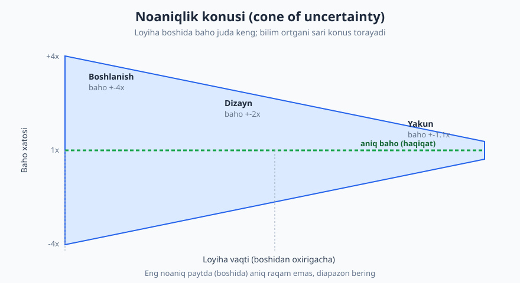
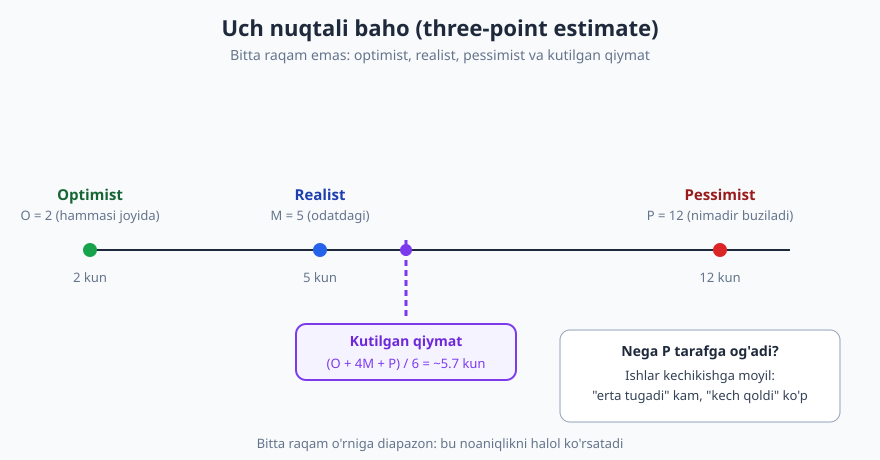
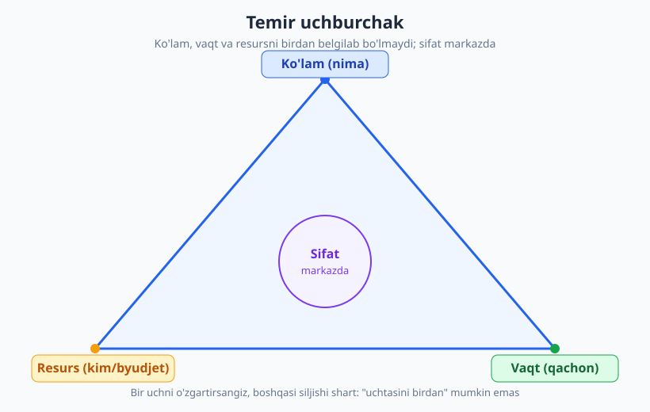

# 16 — Baholash va rejalashtirish

[⬅️ Oldingi: 15 — Agile amalda: Scrum, Kanban va sprintlar](./15-agile-scrum-kanban.md) · [🏠 README](./README.md) · [Keyingi: 17 — Texnik kommunikatsiya: yaxshi savol va yozma muloqot ➡️](./17-texnik-kommunikatsiya.md)

---

> **Bu bobda:** nega dasturiy ishni baholash (estimation) tabiatan qiyin (noaniqlik, optimizm tarafkashligi, "noma'lum noma'lumlar", Hofstadter qonuni); baho, va'da, maqsad va deadline — bular bir narsa emas va ularni aralashtirish — eng katta xato; noaniqlik konusi; amaliy texnikalar (dekompozitsiya, o'tmish ma'lumoti, uch nuqtali baho, story point vs soat, planning poker, T-shirt o'lchami); velocity nima va nima EMAS; buffer va xavf; "men bilmayman" deyish jasorati; kechikishni **erta** aytish; temir uchburchak. Maqsad: baholashni aniqlik o'yiniga aylantirmasdan, **halol va foydali** qilish.
>
> **Halollik / Eslatma:** baho — **bashorat**, va'da emas. Bu bobdagi raqamlar va formulalar (uch nuqtali, velocity, +-4x konus) — yo'naltiruvchi vositalar, qonun emas. Hech bir texnika baholashni "aniq" qilmaydi — ular faqat noaniqlikni **ko'rinadigan** va boshqariladigan qiladi. Bir jamoada ishlagan yondashuv boshqasida ishlamasligi mumkin. Bu yerda muhandislik amaliyoti va tajriba bor, lekin yakuniy qaror — sizning kontekstingiznikidir.

---

## Nega baholash shunchalik qiyin

Yangi dasturchining eng tez-tez eshitadigan savoli: *"Bu qancha vaqt oladi?"* Va eng tez-tez beradigan noto'g'ri javobi: *"Bir kun."* Ertasiga ma'lum bo'ladiki — uch kun. Buning sababi dangasalik yoki qobiliyatsizlik emas. Baholash **tabiatan** qiyin, chunki dasturlash — qurilish emas, **kashfiyot**.

G'isht teruvchi devorni juda aniq baholaydi: u minglab marta xuddi shunday devor qurgan. Dasturchi esa har safar **avval qilinmagan** narsani quradi — agar aynan shunisi avval qilingan bo'lsa, uni ko'chirib qo'yardik, qaytadan yozmasdik. Ya'ni har baho — hali to'liq tushunilmagan ishning bashorati.

Baholashni qiyinlashtiradigan asosiy kuchlar:

- **Optimizm tarafkashligi (optimism bias).** Inson tabiatan eng yaxshi stsenariyni tasavvur qiladi. "Agar hammasi joyida ketsa" — lekin hech qachon hammasi joyida ketmaydi.
- **Noma'lum noma'lumlar (unknown unknowns).** Siz bilmasligingizni bilgan narsalarni hisobga olishingiz mumkin. Lekin **bilmasligingizni ham bilmagan** narsalar — kutilmagan API cheklovi, hujjatsiz qirralar holati, integratsiya muammosi — aynan ular muddatni buzadi.
- **Yashirin ish.** Bahoga ko'pincha faqat "yozish" kiradi. Test, code review ([13-bob](./13-code-review.md)), bug tuzatish, deploy, hujjat, yig'ilish — bular ko'rinmas, lekin real vaqt yeydi.
- **Hofstadter qonuni.** "Ish har doim o'ylaganingizdan uzoq davom etadi — hatto Hofstadter qonunini hisobga olgan taqdiringizda ham." Ya'ni buferni qo'shgan taqdiringizda ham baho kamayib chiqishga moyil.

> **Eslatma:** "bilmayman" — qobiliyatsizlik belgisi emas. Aksincha, tajribasiz dasturchi har narsaga ishonch bilan raqam aytadi; tajribali dasturchi qancha narsa noma'lum ekanini biladi va shuni halol aytadi. "Buni aytishdan oldin yarim kun tekshirib ko'rishim kerak" — bu **professional** javob.

## Baho ≠ va'da ≠ maqsad ≠ deadline

Bu — butun bobning eng muhim g'oyasi. Ko'p muammolar bu to'rt tushunchani aralashtirishdan kelib chiqadi:

| Tushuncha | Ma'nosi | Kim aytadi | Tabiati |
|---|---|---|---|
| **Baho (estimate)** | "Menimcha, taxminan 5 kun" | Dasturchi | Bashorat — ehtimollik, noaniqlik bilan |
| **Maqsad (target)** | "Konferensiyaga ulgursak yaxshi bo'lardi" | Biznes | Istak — biznes ehtiyoji |
| **Va'da (commitment)** | "Ha, juma kuniga tayyor bo'ladi" | Jamoa | Majburiyat — bajarilishi kutiladi |
| **Deadline (muddat)** | "Shartnomada 1-iyul yozilgan" | Tashqi/shartnoma | Qattiq chegara — oqibatli |

Muammo shu yerda: biznes egasi *"Bu qancha oladi?"* deb so'raydi, dasturchi *"Taxminan bir hafta"* deb **baho** beradi, biznes esa buni *"bir haftaga va'da qilindi"* deb eshitadi va mijozga *"juma kuniga deadline"* deb aytadi. Bir og'iz so'zda baho deadline'ga aylandi — hech kim ataylab yolg'on aytmagan holda.

> **Trade-off:** ba'zan biznes haqiqatan **deadline** beradi (konferensiya, shartnoma, mavsumiy bozor). Bu yomon emas — qattiq sana real bo'lishi mumkin. Lekin u holda suhbat boshqacha bo'lishi kerak: "1-iyul qattiq sana bo'lsa, bu sanaga **nimani** sig'dira olamiz?" — ya'ni vaqt belgilangan bo'lsa, **ko'lam** o'zgaruvchan bo'ladi (temir uchburchakni pastda ko'ring). Xato — sanani ham, to'liq ko'lamni ham, jamoa hajmini ham bir vaqtda qattiq belgilash.

Professional dasturchi har gap-suhbatda bu farqni ushlab turadi: *"Bu mening **bahom** — bashorat. Agar bu **va'da** sifatida kerak bo'lsa, men buferni qo'shaman va kamroq xususiyatni kafolatlayman."*

## Noaniqlik konusi

Loyihaning eng boshida — talab to'liq tushunilmagan, dizayn qilinmagan, hech narsa yozilmagan paytda — sizning bahoyingiz eng noaniq. Tadqiqotlar ko'rsatadiki, bu paytda real natija bahodan **4 barobar ko'p yoki 4 barobar kam** bo'lishi mumkin. Loyiha rivojlangani sari — talab aniqlashgani, dizayn paydo bo'lgani, kod yozilgani sari — bu diapazon torayadi.



Bundan ikkita amaliy xulosa chiqadi:

1. **Eng noaniq paytda aniq raqam so'ralganda, diapazon bering.** "5 kun" emas, "3 dan 8 kungacha, o'rta hisobda 5". Yagona raqam soxta aniqlik beradi — go'yo siz bilmagan narsani bilasiz.
2. **Bahoni qayta ko'rib chiqing.** Boshlanishdagi baho — birinchi taxmin, abadiy va'da emas. Yangi bilim kelgani sari (dizayn tugadi, prototip ishladi) bahoni yangilash — halollik, beqarorlik emas. Buni biznes bilan oldindan kelishib oling: "Birinchi bahom keng bo'ladi, dizayn tugagach aniqlashtraman."

> **Eslatma:** konusning eng muhim saboqi — **noaniqlikni yashirmang**. Yangi dasturchi ko'pincha aniq raqam berib "ishonchli" ko'rinmoqchi bo'ladi. Aslida tajribali muhandis aynan diapazon bilan gapiradi, va bu uni kuchsiz emas, **ishonchli** qiladi: u o'z ishini chuqur tushunadi.

## Misol: yomon baho vs to'g'ri baho

Vaziyat: mahsulot egasi *"Foydalanuvchilar profil rasmini yuklay olsin"* degan xususiyatni so'rayapti.

❌ **Yomon baho (refleks, bitta raqam):**

> — Profil rasmini yuklash qancha oladi?
> — A, bu oddiy. Bir kunlik ish.

Bu yerda nima bo'ldi: dasturchi faqat "fayl yuklash formasi"ni tasavvur qildi (optimizm). Hisobga **olinmagan**lar: rasm o'lchami validatsiyasi, formatlar (PNG/JPG/HEIC), katta fayl, rasmni qirqish (crop), serverdagi saqlash (lokalmi yoki S3?), eski rasmni o'chirish, xavfsizlik (zararli fayl yuklash), mobil qurilmada test, eski foydalanuvchilarning bo'sh rasmi. "Bir kun" aslida ikki hafta bo'lib chiqdi — va endi dasturchi "har doim kechikadigan" sifatida ko'rinadi.

✅ **To'g'ri baho (dekompozitsiya + diapazon + farazlar):**

> — Profil rasmini yuklash qancha oladi?
> — Aniq aytishdan oldin bo'laklab chiqay. Ko'rinib turibdiki, bunda: yuklash formasi, format va o'lcham validatsiyasi, saqlash joyi, rasmni qirqish, xavfsizlik tekshiruvi va mobil test bor. Hozircha bahom: realist 6 kun, lekin agar S3 sozlash kerak bo'lsa yoki qirqish murakkab bo'lsa, 10 kungacha cho'zilishi mumkin. Eng tez stsenariy — 4 kun.
>
> Bir savol: rasmni qirqish (crop) shartmi yoki shunchaki yuklash yetarlimi? Bu javob bahoni sezilarli o'zgartiradi.
>
> **Farazlarim:** rasm S3'da saqlanadi (lokal disk emas), bitta format (JPG) yetarli, va dizayner crop UI'sini beradi.

Ikkinchi javob uzunroq, lekin u **halol**: u noaniqlikni ko'rsatadi, farazlarni ochiq aytadi (keyin "men buni boshqacha tushungandim" deyilmaydi), va biznesga **qaror qabul qilish** uchun ma'lumot beradi ("crop kerak emas ekan — unda 4 kun"). Aynan shu — bahoning asl maqsadi: aniq raqam emas, **qaror uchun ma'lumot**.

## Baholash texnikalari

Universal "to'g'ri" texnika yo'q — kontekstga qarab tanlanadi. Mana asosiylari:

| Texnika | Qachon mos | Kuchli tomoni | Ehtiyot |
|---|---|---|---|
| **Dekompozitsiya** (ishni mayda bo'laklarga ajratish) | Deyarli har doim, asos sifatida | Mayda ishni baholash osonroq, yashirin ish ko'rinadi | Juda mayda bo'lsa — vaqt yeydi |
| **O'tmish ma'lumoti** (avval shunga o'xshashga qancha ketgan) | Takrorlanuvchi ish bor jamoada | Eng ishonchli — haqiqatga asoslangan | "Ozgina boshqacha" deganni unutmang |
| **Uch nuqtali** (optimist/realist/pessimist) | Noaniqlik yuqori, halol diapazon kerak | Noaniqlikni raqamga aylantiradi | Soxta aniqlik bermasin |
| **Story point** (nisbiy o'lcham) | Agile jamoa, sprintlar ([15-bob](./15-agile-scrum-kanban.md)) | Vaqt taxminidan qochadi, nisbiy taqqoslash oson | Vaqtga aylantirib yuborish — keng tarqalgan xato |
| **Planning poker** (jamoa birga ovoz beradi) | Jamoa baholashi, bilim taqsimlangan | Turli ko'rinishlar yuzaga chiqadi | Eng baland ovoz bosib ketmasin |
| **T-shirt o'lchami** (S/M/L/XL) | Juda erta bosqich, taxminiy ko'lam | Tez, soxta aniqliksiz | Keyin aniqlashtrish kerak |

### Dekompozitsiya — har baholashning poydevori

Eng kuchli yagona texnika — ishni **mayda, baholash mumkin bo'lgan** bo'laklarga ajratish (bu muammoni yechish ko'nikmasining bir qismi — [02-bob](./02-muammoni-yechish-sanati.md)). Ikki sababdan ishlaydi: (1) mayda ishni baholash xatosi kichikroq; (2) bo'laklaganda yashirin ish (test, deploy, validatsiya) **ko'rinadi**. Qoida: agar bir bo'lakni "ikki kundan ko'p" deb baholasangiz, demak uni hali yetarlicha tushunmagansiz — yana bo'laklang.

### Uch nuqtali baho

Bitta raqam o'rniga uchta bering: **O** (optimist — hammasi joyida), **M** (realist — odatdagi), **P** (pessimist — nimadir buziladi). Kutilgan qiymat ko'pincha pessimist tarafga ozroq og'gan formula bilan hisoblanadi, chunki ishlar kechikishga ko'proq moyil:



```text
Kutilgan qiymat = (O + 4M + P) / 6

Misol: O=2, M=5, P=12 kun
       = (2 + 4*5 + 12) / 6
       = (2 + 20 + 12) / 6
       = 34 / 6
       = ~5.7 kun
```

Diqqat: oddiy realist baho 5 kun edi, lekin pessimist stsenariy hisobga olinganda kutilgan qiymat ~5.7 ga ko'tarildi. Bu — optimizm tarafkashligiga qarshi tabiiy tuzatish. P va M orasidagi katta farq (5 va 12) noaniqlik yuqoriligini ham ko'rsatadi — bu signal: balki avval tadqiqot (spike) kerak.

### Story point: nisbiy, vaqt emas

Story point — Agile jamoalarda ishlatiladigan **nisbiy** o'lcham. U "qancha soat" degani **emas**; u "bu ish boshqasiga nisbatan qanchalik katta/murakkab/xavfli" degani. Odatda Fibonacci-ga o'xshash shkala (1, 2, 3, 5, 8, 13) ishlatiladi — chunki ish kattalashgani sari noaniqlik ham oshadi, shuning uchun yiriklar orasidagi qadam ham kattalashadi.

| | Story point | Soat bilan baho |
|---|---|---|
| Nimani o'lchaydi | Nisbiy hajm/murakkablik/xavf | Aniq vaqt |
| Kuchli tomoni | Vaqt taxminining tuzog'idan qochadi | To'g'ridan-to'g'ri tushunarli |
| Zaifligi | "Soat-ekvivalent" qilib yuborish vasvasasi | Soxta aniqlik, optimizmga moyil |
| Kim solishtirsa bo'ladi | Faqat o'sha jamoa ichida | Hech kim — har kishi har xil |

> **Trade-off:** story point afzalligi — u jamoani "bu necha soat" degan behuda aniqlikdan ozod qiladi va nisbiy taqqoslashga e'tibor qaratadi (5 ball ish 2 ball ishdan ~2.5 barobar katta). Lekin agar jamoa yashirin tarzda "1 point = 4 soat" deb hisoblay boshlasa, butun afzallik yo'qoladi — bu shunchaki soatning niqoblangan ko'rinishi bo'lib qoladi. Bundan tashqari, story point boshqaruv tomonidan **mahsuldorlik o'lchovi** sifatida ishlatilsa (pastda — velocity), u zaharli bo'ladi: jamoalar ballni shishiradi. Ko'p kichik jamoalar uchun oddiy uch nuqtali soat baho ham yetarli — story point majburiy emas.

### Planning poker

Jamoa baholashning oddiy usuli: har a'zo bir vaqtda (boshqalardan ta'sirlanmasdan) o'z bahosini ko'rsatadi (karta yoki raqam). Agar baholar keskin farq qilsa — bu eng qimmatli payt: demak kimdir biror narsani biladi yoki tushunmaydi. Eng past va eng yuqori bergan ikki kishi sababini tushuntiradi, keyin qayta ovoz beriladi. Maqsad — "to'g'ri raqam" emas, **umumiy tushuncha** va yashirin farazlarni yuzaga chiqarish.

## Velocity — bashorat vositasi, baho yoki ish o'lchovi EMAS

Velocity — jamoaning bir sprintda o'rtacha tugatadigan story point miqdori. U **rejalashtirish** uchun foydali: "o'rtacha 20 ball qilamiz, demak bu 60 balllik backlog ~3 sprint". Lekin velocity atrofida ikkita xavfli xato bor:

- **Velocity ni mahsuldorlik o'lchovi qilish.** "Bu sprintda 18, oldingida 22 — jamoa sustlashdi" — bu noto'g'ri. Velocity tabiiy tebranadi (bayramlar, kasallik, murakkab ish). Uni KPI qilsangiz, jamoa ballni shishiradi va o'lchov ma'nosini yo'qotadi (Goodhart qonuni: "o'lchov maqsadga aylansa, u yaxshi o'lchov bo'lmay qoladi").
- **Jamoalararo solishtirish.** A jamoa 40 ball, B jamoa 20 ball — bu A "ikki barobar yaxshi" degani **emas**. Story point har jamoaning **o'z** nisbiy shkalasi; jamoalararo solishtirib bo'lmaydi. Bu — almalarni nokga solishtirish.

> **Eslatma:** velocity — jamoaning **o'zi uchun** oyna, boshqaruv uchun qamchi emas. U "kelgusi sprintga qancha olaylik" degan savolga yordam beradi, "kim yaxshi ishlayapti" degan savolga emas. Agar rahbaringiz velocity ni reyting qilib ishlatsa — bu menejment anti-patterni; uni xushmuomalalik bilan tushuntirish kerak ([17-bob](./17-texnik-kommunikatsiya.md)).

## Buffer, xavf va surunkali ortiqcha va'da

Optimizm tarafkashligi va noma'lum noma'lumlar tufayli, **xom baho deyarli har doim kam chiqadi**. Shuning uchun:

- **Buffer qo'shing — lekin halol.** Buferni yashirin "yostiq" qilib qo'shmang ("aslida 5 kun, lekin 10 deyman, qolgani zaxira"). Bu ishonchni buzadi va shishirilgan bahoni keltirib chiqaradi. Buning o'rniga noaniqlikni ochiq ayting: "Realist baho 5 kun, lekin S3 integratsiyasi hech sinalmagani uchun 3 kun zaxira qo'shaman — sababi shu."
- **Xavfni alohida nomlang.** Bahoning eng katta dushmani — bitta katta noma'lumlik. Agar baho ichida "agar X ishlamasa, hamma narsa o'zgaradi" degan nuqta bo'lsa, avval **shuni** sinab ko'ring (spike / prototip), keyin baholang. Noma'lumni baholamang — avval ma'lum qiling.
- **Surunkali ortiqcha va'da bermang.** Eng zararli odat — har safar "ulguraman" deb, har safar kechikish. Bir-ikki marta bo'lsa kechiriladi; surunkali bo'lsa, sizning har bir bahoyingiz ishonchsiz bo'lib qoladi va jamoa "uning bahosini 2 ga ko'paytir" deb o'rganadi. Yaxshi reputatsiya — "ko'p va'da bermaydi, lekin aytganiniini qiladi".

## Kechikishni erta ayting

Bu — kasbiy halollikning eng amaliy ko'rinishi. Muddat o'tib ketishi **ko'rinishi bilanoq**, darrov xabar bering — kuting emas, umid qilmang.

❌ **Yomon (jim turish):**

> Dasturchi jumagacha tayyor bo'ladi deb va'da berdi. Seshanba kuni u tushundiki, kutilmagan integratsiya muammosi bor — ulgurmaydi. Lekin "balki dam olishda ishlab tutib olarman" deb hech kimga aytmadi. Juma kuni hech narsa tayyor emas. Endi mahsulot egasi mijozga allaqachon "juma" deb aytib qo'ygan. Inqiroz.

✅ **To'g'ri (erta signal):**

> Seshanba kuni muammoni payqagan zahoti: "Diqqat — profil yuklashda kutilmagan S3 muammosiga uchradim. Hozirgi holatda juma emas, kelasi seshanbaga yetishi mumkin. Variantlar: (a) crop'ni hozircha olib tashlab juma'ga oddiy versiya chiqaraman, (b) to'liq versiyani seshanbaga qoldiramiz. Qaysi biri ma'qul?"

Farqni sezing: ikkinchi holatda muammo hali **kichik** paytda aytildi, va dasturchi shunchaki "kechikaman" demadi — **variantlar** taklif qildi. Bu mahsulot egasiga qaror qabul qilish vaqtini beradi (mijoz bilan kelishish, ko'lamni qisqartirish). Kech aytilgan kechikish — eng yomoni: u boshqalarning rejasini ham buzadi va tuzatish imkonini olib qo'yadi.

> **Trade-off:** "har kichik kechikishni darrov xabar qilish" ham haddan oshmasin — har soatda "biroz orqadaman" deb panika qilish ham ishonchni buzadi va shovqin yaratadi. Mezon: **bashorat sezilarli o'zgargan**da (kun, sana siljiganda) va boshqalar bunga tayanayotganda xabar bering. Kichik tebranishlar (yarim kun) odatda standup'da ([15-bob](./15-agile-scrum-kanban.md)) aytilsa yetarli. Asosiy qoida: hech kim sizdan kechikishni **kech** eshitmasin.

## Temir uchburchak: uchtasini birdan bo'lmaydi

Har bir loyihada uchta o'zaro bog'liq cheklov bor: **ko'lam** (nima qilinadi), **vaqt** (qachon), **resurs** (kim/byudjet). Sifat esa markazda — u alohida "tugma" emas, balki uchalasining oqibati. Asosiy qonun: **uchtasini bir vaqtda qattiq belgilab bo'lmaydi.** Birini o'zgartirsangiz, boshqasi siljishi shart.



| Agar biznes belgilasa... | ...unda nima o'zgaruvchan bo'ladi |
|---|---|
| **Vaqt + Ko'lam** qattiq | Resurs (odam qo'shish) yoki sifat — lekin "9 ayol 1 oyda bola tug'maydi" (Brooks qonuni: kech jamoa kattalashishi loyihani sekinlashtiradi) |
| **Vaqt + Resurs** qattiq | Ko'lam qisqaradi — kamroq xususiyat, lekin sana saqlanadi |
| **Ko'lam + Resurs** qattiq | Vaqt cho'ziladi — to'liq qilamiz, lekin kechroq |
| Uchalasi qattiq | **Sifat qurbon bo'ladi** (yashirin) — texnik qarz to'planadi ([10-bob](./10-texnik-qarz.md)), keyin foiz to'laysiz |

Eng xavfli holat — oxirgisi: biznes vaqtni ham, to'liq ko'lamni ham, jamoa hajmini ham qattiq belgilaydi. U holda yagona "egiluvchan" narsa — sifat, va u **yashirincha** qurbon bo'ladi: shoshilinch kod, test yo'q, texnik qarz. Buni "tezlashtirish" deb o'ylashadi, lekin aslida bu — kelajakdan o'g'irlik.

Professional dasturchining vazifasi — bu trade-off'ni **ochiq qilish**: "1-iyulgacha to'liq ro'yxatni qila olmaymiz. Variantlar: (a) sanani siljitamiz, (b) X va Y xususiyatlarni keyingi versiyaga qoldiramiz, (c) yana ikki dasturchi qo'shamiz (lekin bu birinchi 2 hafta bizni sekinlashtiradi). Qaysi birini tanlaymiz?" Bu qaror — biznesniki, lekin **ma'lumotni** siz berasiz.

## Halollik: baho — bashorat, va'da emas

Bu bobni bitta jumla bilan yakunlasa bo'ladi: **baho — bashorat, va'da emas; aniqlik soxta; maqsad — qaror qabul qilishga yordam berish, aniq raqam emas.**

- Baho **so'rashganda** — diapazon va farazlar bilan javob bering, yagona raqam bilan emas.
- "Bilmayman, tekshirib aytaman" — kuchli, professional javob.
- Bahoni va'da deb eshitganlarini **tuzating**: "Bu mening bashorat; va'da bo'lsa, bufer va kamroq ko'lam kerak".
- Bashorat o'zgarsa — **erta** xabar bering, variant bilan.
- Temir uchburchakda nimani egish kerakligini biznes hal qilsin, lekin ma'lumotni siz bering.

Bu — sizni "har doim kechikadigan" dan "ishonchli bashoratchi" ga aylantiradigan farq. Va ishonch — junior'dan senior'gacha ([23-bob](./23-karyera-narvoni.md)) yo'lning katta qismi.

---

## Asosiy g'oyalar (bobni qisqacha)

- **Baholash qiyin, chunki dasturlash — kashfiyot, qurilish emas**: optimizm tarafkashligi, noma'lum noma'lumlar, yashirin ish va **Hofstadter qonuni** (har doim o'ylaganingdan uzoq) baholarni kam chiqaradi.
- **Baho ≠ maqsad ≠ va'da ≠ deadline** — bularni aralashtirish eng katta muammo manbai; baho — **bashorat**, va'da — majburiyat.
- **Noaniqlik konusi**: loyiha boshida baho +-4x, oxiriga yaqin aniqlashadi — eng noaniq paytda **diapazon** bering, yagona raqam emas.
- **Texnikalar**: dekompozitsiya (poydevor), o'tmish ma'lumoti (eng ishonchli), uch nuqtali (O+4M+P)/6, **story point — nisbiy, vaqt emas**, planning poker, T-shirt o'lchami.
- **Velocity — bashorat vositasi**, mahsuldorlik o'lchovi yoki jamoalararo solishtirish vositasi **EMAS** (Goodhart qonuni).
- **Buferni halol qo'shing** (yashirin yostiq emas), **xavfni alohida nomlang** (avval spike), **surunkali ortiqcha va'da bermang**.
- **Kechikishni erta ayting** — bashorat sezilarli o'zgarganda, variant bilan; kech aytish eng yomoni ([17-bob](./17-texnik-kommunikatsiya.md)).
- **Temir uchburchak**: ko'lam/vaqt/resursdan uchtasini birdan belgilab bo'lmaydi — uchalasi qattiq bo'lsa, **sifat** yashirincha qurbon bo'ladi.

---

## Mashqlar

### Oson

**1-mashq.** O'z so'zlaringiz bilan baho (estimate), maqsad (target), va'da (commitment) va deadline o'rtasidagi farqni tushuntiring. Har biriga bittadan real misol keltiring.

**2-mashq.** Quyidagi javoblarning qaysi biri "yomon baho", qaysi biri "to'g'ri baho" va nega? (a) "Bu oson, yarim kun"; (b) "Realist 4 kun, lekin API hujjati noaniq bo'lgani uchun 7 kungacha cho'zilishi mumkin; farazim — eski ma'lumotni ko'chirish kerak emas". Ikkinchisi nega yaxshiroq, ayting.

**3-mashq.** Uch nuqtali baho formulasini qo'llang: bir vazifa uchun optimist O=3, realist M=6, pessimist P=15 kun. Kutilgan qiymatni hisoblang. Natija oddiy realist bahodan katta yoki kichikmi? Nega?

### O'rta

**4-mashq.** Sizdan *"Bildirishnoma tizimi qancha vaqt oladi?"* deb so'rashdi. **Bu vazifani baholang va farazlaringizni yozing**: (1) vazifani kamida 5 bo'lakka ajrating (dekompozitsiya); (2) har bo'lakka uch nuqtali yoki diapazon baho bering; (3) kamida 3 ta ochiq faraz va 1 ta "avval tekshirishim kerak" (xavf) nuqtasini yozing.

**5-mashq.** Quyidagi velocity ishlatilishlarining qaysilari **to'g'ri**, qaysilari **noto'g'ri** va nega? (a) "O'rtacha 25 ball qilamiz, demak bu 100 balllik backlog ~4 sprint"; (b) "A jamoa 40 ball, B jamoa 20 — A samaraliroq"; (c) "Bu sprint 18 chiqdi, o'tgani 24 — jamoa dangasalashdi"; (d) "Oxirgi 4 sprint o'rtachasi 22, shuning uchun keyingisiga 22 ballcha olamiz".

**6-mashq.** Bir hamkasbingiz mahsulot egasiga shunday dedi: *"Ha, albatta, juma kuniga hammasi tayyor bo'ladi"* — hech bir faraz, diapazon yoki "agar" siz. **Bu baho nega xato** (yoki xavfli)? Kamida 3 sababni yozing va uni qanday qayta ifodalashni taklif qiling.

### Qiyin

**7-mashq.** Biznes egasi aytdi: *"1-iyulgacha (qattiq deadline) ushbu 8 xususiyatning hammasi kerak, jamoa o'zgarmaydi, va sifat ham a'lo bo'lsin."* Temir uchburchakdan foydalanib, bu so'rovning **nega mumkin emasligini** tushuntiring. Biznes egasiga taqdim etish uchun kamida 3 ta aniq variant (trade-off bilan) tayyorlang. Har variantda nimadan voz kechilishini ayting.

**8-mashq.** Siz juma kuniga bir xususiyatni va'da qilgandingiz. Seshanba kuni tushundingizki, kutilmagan muammo tufayli ulgurmaysiz (yangi baho — kelasi chorshanba). **Qadamma-qadam yozing**: (1) kimga, qachon, qanday xabar berasiz; (2) shunchaki "kechikaman" o'rniga qanday **variantlar** taklif qilasiz; (3) kelgusida bunday vaziyatni kamaytirish uchun baholash odatingizda nimani o'zgartirasiz?

<details markdown="1">
<summary>Yechimlar</summary>

### 1-mashq yechimi
**Baho** — bashorat, noaniqlik bilan ("menimcha ~5 kun"). **Maqsad** — biznes istagi ("konferensiyaga ulgursak yaxshi"). **Va'da** — majburiyat, bajarilishi kutiladi ("juma kuniga tayyor qilaman"). **Deadline** — qattiq tashqi chegara, oqibatli ("shartnomada 1-iyul"). Misollar har xil bo'lishi mumkin. Mezon: baho — noaniq/ehtimollik; maqsad — istak; va'da — majburiyat; deadline — qattiq sana. Asosiy nuqta: bularni aralashtirish (bahoni va'da deb eshitish) muammo manbai.

### 2-mashq yechimi
(a) **Yomon baho** — yagona raqam, hech bir faraz, diapazon yoki noaniqlik yo'q; soxta aniqlik, optimizmga moyil. (b) **To'g'ri baho** — diapazon bor (4-7 kun), noaniqlik manbai nomlangan (API hujjati), faraz ochiq aytilgan (ma'lumot ko'chirish kerak emas). Ikkinchisi yaxshiroq, chunki: noaniqlikni halol ko'rsatadi, farazni ochib keyingi tushunmovchilikni oldini oladi, va biznesga qaror uchun ma'lumot beradi.

### 3-mashq yechimi
Kutilgan qiymat = (O + 4M + P) / 6 = (3 + 4*6 + 15) / 6 = (3 + 24 + 15) / 6 = 42 / 6 = **7 kun**. Bu oddiy realist bahodan (6 kun) **katta**, chunki pessimist stsenariy (P=15) realistdan ancha uzoq — formula pessimist tarafga og'adi, optimizm tarafkashligiga qarshi tabiiy tuzatish qiladi. P va M orasidagi katta farq (6 va 15) yuqori noaniqlikdan dalolat — balki avval spike kerak.

### 4-mashq yechimi
Yagona to'g'ri javob yo'q — bu amaliy mashq. Namuna dekompozitsiya: (1) bildirishnoma modeli/DB; (2) yuborish mexanizmi (email/push/in-app); (3) shablon va matn; (4) foydalanuvchi sozlamalari (qaysisini olishni tanlash); (5) navbat/asinxron yuborish; (6) test va xato holatlari (yuborish muvaffaqiyatsiz bo'lsa). Har biriga diapazon (mas. yuborish mexanizmi: 2-5 kun). Farazlar namunasi: "faqat email, push hozir kerak emas", "tashqi email xizmati (SendGrid) ishlatamiz", "real-time emas, navbat orqali". Xavf: "push notification uchun mobil infratuzilma borligini avval tekshirishim kerak". Mezon: dekompozitsiya + har bo'lak baholangan + ochiq farazlar + kamida 1 xavf/spike nuqtasi.

### 5-mashq yechimi
(a) **To'g'ri** — velocity rejalashtirish uchun ishlatilyapti (necha sprint kerak). (b) **Noto'g'ri** — jamoalararo solishtirish; story point har jamoaning o'z shkalasi, solishtirib bo'lmaydi. (c) **Noto'g'ri** — velocity ni mahsuldorlik/intizom o'lchovi qilyapti; velocity tabiiy tebranadi, KPI qilish ballni shishiradi (Goodhart). (d) **To'g'ri** — o'tmish o'rtachasidan kelgusi sprint sig'imini bashorat qilyapti, bu velocity ning asl maqsadi.

### 6-mashq yechimi
Sabablar (kamida 3): (1) **Yagona raqam, diapazon yo'q** — noaniqlikni yashiradi, soxta aniqlik. (2) **Faraz yo'q** — keyin "men buni boshqacha tushungandim" deyilsa, kim aybdor noma'lum. (3) **"Albatta" — ortiqcha ishonch** — optimizm tarafkashligi, noma'lum noma'lumlar hisobga olinmagan. (4) Bu **baho** edi, lekin **va'da** kabi aytilgani uchun biznes uni majburiyat deb eshitadi. Qayta ifoda namunasi: "Realist bahom juma, lekin integratsiya hali sinalmagani uchun dushanbagacha cho'zilishi mumkin. Farazim — X tayyor. Agar juma qat'iy kerak bo'lsa, Y qismini keyingi versiyaga qoldiraylik."

### 7-mashq yechimi
**Nega mumkin emas:** temir uchburchakda ko'lam (8 xususiyat), vaqt (1-iyul) va resurs (jamoa o'zgarmaydi) — uchchalasi qattiq belgilangan. Bunda yagona egiluvchan narsa sifat qoladi, lekin biznes "a'lo sifat" ham talab qilyapti. Demak to'rtchalasi qattiq — bu fizik jihatdan mumkin emas; amalda sifat **yashirincha** qurbon bo'ladi (shoshilinch kod, texnik qarz). Variantlar (har biri bittasini egadi): **(A) Ko'lamni egish** — 8 dan eng muhim 5 xususiyatni 1-iyulga, qolgan 3 tasini keyingi versiyaga; sana va sifat saqlanadi. **(B) Vaqtni egish** — to'liq 8 ta, a'lo sifat, lekin sana 15-iyul; agar 1-iyul qattiq deadline bo'lmasa. **(C) Resursni egish** — dasturchi qo'shish, lekin Brooks qonuni: birinchi 2-3 hafta sekinlashtiradi, shuning uchun bu faqat deadline uzoqroq bo'lsa yordam beradi. Mezon: trade-off ochiq, har variantda nimadan voz kechilishi aniq, qaror biznesga qoldirilgan.

### 8-mashq yechimi
Yagona to'g'ri javob yo'q. Namuna: **(1)** Muammoni payqagan zahoti (seshanba, juma'ni kutmasdan) mahsulot egasiga to'g'ridan-to'g'ri (chat emas, balki yetarlicha rasmiy — qarang [17-bob](./17-texnik-kommunikatsiya.md)) xabar bering; kech qoldirish eng yomoni. **(2)** "Kechikaman" o'rniga variantlar: (a) juma'ga qisqartirilgan/oddiy versiya (qaysidir qism keyingi haftaga), (b) to'liq versiya chorshanbaga, (c) agar mumkin bo'lsa, boshqa kimdir muammoning bir qismini parallel olsin. Har variantning oqibatini ayting. **(3)** Kelgusi o'zgarishlar: aniq raqam o'rniga diapazon berish; noaniq/sinalmagan qismni avval spike qilish; buferni halol qo'shish; "albatta ulgur aman" deb refleks bilan va'da bermaslik. Mezon: erta xabar + variant taklif + o'z odatda aniq tuzatish.

</details>

---

[⬅️ Oldingi: 15 — Agile amalda: Scrum, Kanban va sprintlar](./15-agile-scrum-kanban.md) · [🏠 README](./README.md) · [Keyingi: 17 — Texnik kommunikatsiya: yaxshi savol va yozma muloqot ➡️](./17-texnik-kommunikatsiya.md)
