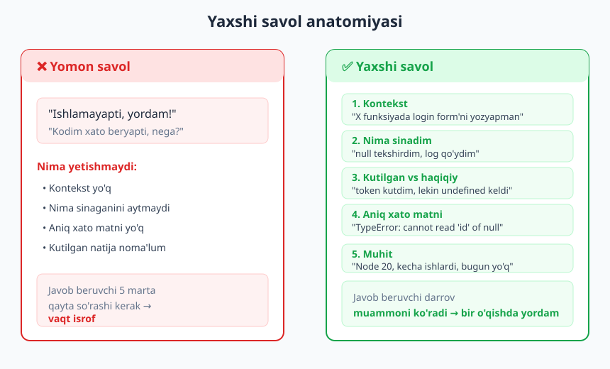
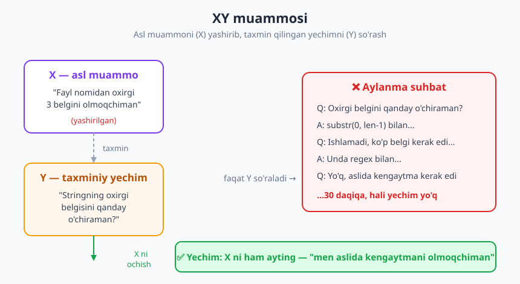
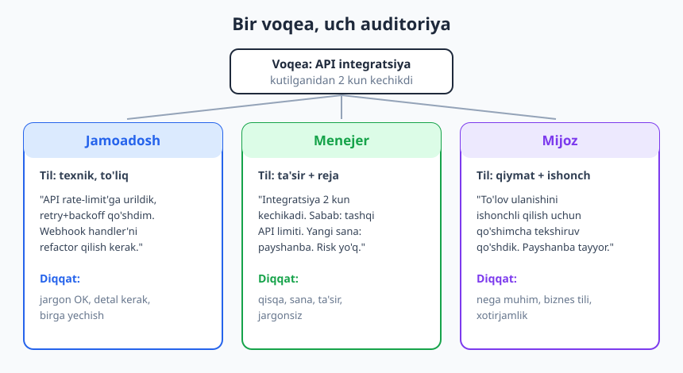

# 17 — Texnik kommunikatsiya: yaxshi savol va yozma muloqot

[⬅️ Oldingi: 16 — Baholash va rejalashtirish](./16-baholash-rejalashtirish.md) · [🏠 README](./README.md) · [Keyingi: 18 — Hujjatlash: README'dan runbook'gacha ➡️](./18-hujjatlash.md)

---

> **Bu bobda:** nega kommunikatsiya senior'lik markazi — eng zo'r kod ham yomon yetkazilsa qiymatsiz; **yaxshi savol berish** san'ati (kontekst + nima sinaganingiz + kutilgan vs haqiqiy + xato matni, "XY muammosi", "no hello"); **asinxron yozma muloqot** (remote/jamoa uchun yozma ko'pincha og'zaikidan ustun); auditoriyaga moslash (jamoadosh / menejer / mijoz / non-tech bilan gaplashish); **RFC / dizayn hujjati / ADR** orqali katta qarorni yozma taklif qilish; yig'ilish kerakmi degan savol; faol tinglash va kelishmovchilikni hurmat bilan boshqarish. Maqsad: g'oyangizni boshqa odamning miyasiga eng kam ishqalanish bilan ko'chirish.
>
> **Halollik / Eslatma:** bu yerdagi maslahatlar — qonun emas, amaliy yo'l-yo'riq. Kommunikatsiya uslubi **madaniyatga juda bog'liq**: bir jamoada normal bo'lgan to'g'ridan-to'g'rilik boshqasida qo'pol tuyuladi; bir kompaniyada hamma narsa yozma, boshqasida og'zaki. "Ko'proq yozish har doim yaxshi" ham noto'g'ri — haddan ko'p yozish shovqin tug'diradi. Bu yerda keng qabul qilingan amaliyot bor, lekin oxirgi nozik sozlash sizning jamoangiz va kontekstingizniki.

---

## Nega bu — senior'lik markazi

[01-bob](./01-kod-yozuvchidan-muhandisgacha.md)da aytilgan edi: kod yozish — dasturchi ish vaqtining kichik qismi. Qolgan katta qism — o'qish, o'ylash va **boshqalar bilan muloqot**: savol berish, tushuntirish, kelishish, yozish. Junior va senior o'rtasidagi farqning katta qismi aynan shu yerda: junior masalani yechadi va jim qoladi; senior masalani yechadi, **nega shunday yechganini yozadi**, jamoaga tushuntiradi va keyingi odam tushunadigan iz qoldiradi.

Buni shafqatsiz haqiqat bilan ayting: **eng yaxshi kod ham yomon yetkazilsa, qiymatsiz.** Siz dunyodagi eng nafis algoritmni yozgan bo'lishingiz mumkin — lekin agar PR tavsifingiz bo'sh bo'lsa, sharhlovchi nima qilganingizni tushunmasa, qaroringizning sababi hech qayerda yozilmagan bo'lsa — bir oydan keyin (ehtimol o'zingiz ham) bu kodni qo'rqib o'zgartirasiz. Qiymat — kod yetkazilganda, tushunilganda va ishonch bilan davom ettirilganda tug'iladi.

> **Eslatma:** kommunikatsiya "yumshoq ko'nikma" deb atalsa-da, bu eng "qattiq" ROI'lardan biri. Bir soatlik aniq yozilgan dizayn hujjati o'nlab soatlik noto'g'ri yo'nalishdagi kodni saqlab qolishi mumkin. Bu — texnik ish, hissiy ish emas.

## Yaxshi savol berish — eng kam baholanadigan mahorat

Savol berish — zaiflik emas, samaradorlik. Lekin **qanday** so'rashingiz javob sifatini va o'zingiz haqingizdagi taassurotni belgilaydi. Yomon savol javob beruvchini 5 marta qayta so'rashga majbur qiladi; yaxshi savol bir o'qishda yordam oladi.



Yaxshi savolning anatomiyasi besh qismdan iborat:

1. **Kontekst** — nima qilyapsiz, qaysi kodda, qanday maqsadda.
2. **Nima sinadingiz** — o'zingiz qaysi yo'llarni tekshirib ko'rdingiz (bu siz "rubber duck" qilganingizni ko'rsatadi — [02-bob](./02-muammoni-yechish-sanati.md)).
3. **Kutilgan vs haqiqiy** — nima bo'lishini kutdingiz, aslida nima bo'ldi.
4. **Aniq xato matni** — to'liq xato/stack-trace, ekran rasmi emas, matn (qidiriladigan).
5. **Muhit** — versiya, OS, "kecha ishlardi" kabi belgilar.

❌ **Yomon savol:**

> Salom! Kodim ishlamayapti, yordam bera olasizmi?

❌ **Hali ham yomon (biroz aniqroq, lekin yetarli emas):**

> Login funksiyasi xato beryapti, nega bo'lishi mumkin?

✅ **Yaxshi savol:**

> Login form'da token olishga harakat qilyapman (`auth.js`, `getToken` funksiyasi). Foydalanuvchi `null` bo'lsa, `user.id` o'qishda yiqilyapti. `if (user)` tekshiruvini qo'shdim, lekin baribir xato chiqyapti — chunki `user` `{}` bo'lib kelarkan, `null` emas. Kutgan natijam: token qaytsin. Haqiqiy natija:
> `TypeError: Cannot read properties of null (reading 'id')` (to'liq trace pastda).
> Muhit: Node 20, kecha ishlardi, bugun API javobini o'zgartirgandan keyin sindi. `user` ob'ektining shaklini qanday to'g'ri tekshirsam bo'ladi?

Ikkinchi savolda javob beruvchi deyarli darrov muammoni ko'radi — siz unga butun tergovni qayta qildirmadingiz. Bundan tashqari, ko'pincha savolni shu darajada aniq yozayotganingizda **o'zingiz javobni topib olasiz** — bu rubber duck effekti.

> **Trade-off:** har bir savolni shu darajada batafsil yozish ham har doim to'g'ri emas. Mayda, tez savol uchun ("bu funksiya promise qaytaradimi?") besh qismli format ortiqcha rasmiyat va shovqin. Qoida: **savol qanchalik qiyin va vaqt oluvchi bo'lsa, shunchalik batafsil yozing.** "30 daqiqa o'zim urindim, qotib qoldim" — batafsil yozing. "Tez aniqlashtiruvchi savol" — bir qatorda so'rang.

### Ikki anti-pattern: "no hello" va XY muammosi

**"No hello" (faqat salomlashib kutish).** Chatda faqat "Salom!" yoki "Bir daqiqangiz bormi?" yozib, javob kutib o'tirish — bu boshqa odamni garovga oladi. U "ha, ayting" deb javob bergunicha, siz savolingizni yozmaysiz, u esa nima haqida ekanini bilmay kutadi. Bu — sun'iy ikki bosqichli kechikish.

❌ **No hello:**

> **14:02** Salom!
> *(20 daqiqa jimlik — ikkalasi ham kutmoqda)*
> **14:22** Bir savolim bor edi...

✅ **Savolni darrov yozing:**

> Salom! Login token muammosi bo'yicha savolim bor — `user` ob'ekti `{}` bo'lib kelyapti, `null` emas, shuning uchun `if (user)` o'tib ketyapti. Shaklni qanday to'g'ri tekshiraman? (kontekst pastda)

Salomlashish yomon emas — uni savol bilan **bir xabarda** birlashtiring. Javob beruvchi qachon vaqti bo'lsa, butun kontekstni ko'rib, bir martada javob beradi.

**XY muammosi.** Bu eng nozik tuzoq: siz asl muammo (**X**)ni hal qilish uchun bir yechim (**Y**)ni taxmin qilasiz, keyin faqat Y haqida so'raysiz — X ni umuman aytmaysiz. Natijada javob beruvchi sizga Y'ni qildiradi, lekin Y noto'g'ri yo'l edi.



Klassik misol:

❌ **Faqat Y so'raladi:**
> — Stringning oxirgi belgisini qanday o'chiraman?
> — `s.slice(0, -1)` bilan.
> — Ishlamadi, ko'proq belgi kerak edi...
> — Unda `s.slice(0, -3)`...
> — Yo'q, aslida har xil uzunlikda...
> *(30 daqiqa, hali yechim yo'q)*

✅ **X ham ochiladi:**
> — Men fayl nomidan **kengaytmani** olib tashlamoqchiman (`.txt`, `.jpeg` — uzunligi har xil). Hozir oxirgi belgini o'chirish bilan urinyapman, lekin uzunlik turlicha. Buni qanday qilsam to'g'ri bo'ladi?
> — A, unda `path.parse(name).name` ishlat — kengaytmani o'zi ajratadi.

Farqni ko'rdingizmi? X ochilgani zahoti yechim butunlay boshqacha va to'g'ri bo'ldi. **Doim asl maqsadingizni ayting**, faqat taxmin qilingan oraliq yechimni emas. "Men aslida nimaga erishmoqchiman" — har savolga shu jumlani qo'shing.

| Anti-pattern | Nimaga olib keladi | Yechim |
|---|---|---|
| **No hello** | Ikki bosqichli sun'iy kechikish | Savolni salom bilan bir xabarda yozing |
| **XY muammosi** | Aylanma suhbat, noto'g'ri yo'l | Asl maqsad (X)ni doim ayting |
| **Kontekstsiz** | 5 marta qayta so'rash | Kod/xato/muhitni biriktiring |
| **Ekran rasmi bilan xato** | Qidirib bo'lmaydi, ko'chirib bo'lmaydi | Xato **matnini** code-block'da bering |
| **Rubber duck'siz** | Arzimas savolga vaqt sarflanadi | Avval o'zingiz 2-bobdagi qadamlarni bosing |

## Asinxron yozma muloqot: jamoa va remote'ning yangi normal'i

Remote va taqsimlangan jamoalarda **yozma muloqot ko'pincha og'zaikidan ustun**. Sababi oddiy: yozma xabar vaqt zonasidan mustaqil, qidiriladigan, iz qoldiradi va o'qiruvchiga o'ylab javob berish imkonini beradi. Og'zaki suhbat tezroq tuyuladi, lekin u **bir vaqtda hamma joyni talab qiladi** (sinxron) va hech qanday iz qoldirmaydi — bir hafta o'tib "biz nimaga kelishgan edik?" degan savol qoladi.

Asinxron muloqotning oltin qoidalari:

- **To'liq kontekst bilan yozing.** O'quvchi sizdan boshqa vaqt zonada, 8 soatdan keyin o'qishi mumkin. "Yodingdami, o'sha narsa..." — yo'q. Havola, fayl nomi, qaror — hammasi xabarda bo'lsin.
- **Thread'da yozing.** Mavzularni ajrating — har bir muhokama o'z ipida bo'lsin, umumiy kanalni ko'chki qilmang.
- **Darhol javob kutmang.** Asinxron muloqotning butun ma'nosi shu: men yozdim, siz qulay paytda javob berasiz. "Nega hali javob bermayapsan?" — sinxron kutuv, asinxron muhitni buzadi.
- **Vaqt zonasi va "qachon javob"ni hisobga oling.** "Ertaga sizning ertangizgacha javob beraman" — aniq. Shoshilinch bo'lsa, buni **aniq belgilang** (va shoshilinchni kamdan-kam ishlating).

| Mezon | Sinxron (og'zaki/qo'ng'iroq) | Asinxron (yozma) |
|---|---|---|
| **Tezlik** | Darhol, lekin hamma band bo'lishi shart | Kechikadi, lekin uzilishsiz |
| **Iz / hujjat** | Yo'q (yodda qoladi, unutiladi) | Bor — qidiriladi, qaytib o'qiladi |
| **Vaqt zonasi** | Bir vaqtda bo'lish shart | Mustaqil, global jamoaga mos |
| **Diqqat narxi** | Hammaning fokusini uzadi | O'quvchi qulay paytda o'qiydi |
| **Murakkab fikr** | Yo'qoladi, "keyin tushuntiraman" | Tartibli, qayta o'qiladigan |
| **Hissiy/nozik mavzu** | ✅ Tabassum, ohang ko'rinadi | ❌ Soviq, noto'g'ri tushunilishi mumkin |

> **Trade-off:** yozma har doim ham g'olib emas. **Nozik, hissiy yoki tezkor muvofiqlashtirish** kerak bo'lganda — kelishmovchilik avj olganda, kimdir xafa bo'lganda, yoki 20 ta xabar almashinuvi 5 daqiqalik qo'ng'iroqdan uzunroq bo'lganida — og'zaki suhbat to'g'ri. Qoida: **murakkab qaror = yozma; murakkab his = og'zaki.** Va og'zaki suhbatdan keyin doim **yozma xulosa** qoldiring ("Gaplashdik, mana kelishuv:").

## Auditoriyaga moslash: bir voqea, uch til

Senior dasturchi bir narsani **kimga aytayotganiga qarab boshqacha** ifodalaydi. Bu yolg'on emas — bu hurmat. Jamoadoshga texnik detal kerak; menejerga ta'sir va sana kerak; mijozga qiymat va ishonch kerak. Bir xil xabarni hammaga jo'natish — yo birovni cho'ktirib yuborish, yo birovni hech narsa tushunmay qoldirish.



Tasavvur qiling: tashqi API limiti tufayli integratsiya 2 kun kechikdi. Bir voqea, uch xil yetkazish:

✅ **Jamoadoshga (texnik, to'liq):**
> Tashqi API'ning rate-limit'iga urildik, retry + eksponensial backoff qo'shdim. Webhook handler'ni ham idempotent qilish kerak, hozir takroriy event ikki marta yozyapti. PR'ni bugun ochaman.

✅ **Menejerga (ta'sir + reja, jargonsiz):**
> Integratsiya 2 kun kechikadi. Sabab — biz boshqaradigan emas, tashqi xizmat cheklovi. Yangi sana: payshanba. Boshqa ishlarga ta'sir qilmaydi, risk yo'q. Detal kerakmi?

✅ **Mijozga (qiymat + ishonch, biznes tili):**
> To'lov ulanishini ishonchli qilish uchun qo'shimcha himoya qo'shdik, shunda yuqori yuklamada ham uzilmaydi. Tayyor bo'lish sanasi — payshanba.

❌ **Hammaga bir xil (mijozga texnik):**
> Rate-limit'ga urildik, backoff qo'ydim, webhook idempotent emas edi...

Mijoz "rate-limit" va "idempotent"ni tushunmaydi — u faqat **xavotirlanadi**: "demak biror narsa buzilibdi?". Non-tech odam bilan gaplashganda: **jargonni tashlang, analogiya ishlating, va eng muhimi — "nega bu muhim"ni biznes tilida ayting.** Texnik qarz haqida boshqaruvga gapirganda ham xuddi shu — uni "kod yomon" emas, "har yangi funksiya 30% sekinroq chiqyapti va xato xavfi oshyapti" deb ifodalang ([10-bob](./10-texnik-qarz.md) va [16-bob](./16-baholash-rejalashtirish.md) bilan bog'liq).

> **Eslatma:** "nega muhim"ni biznes tiliga tarjima qilish — sehrli ko'nikma. Texnik gap "indekslarni qayta qurish kerak" emas, "qidiruv hozir 4 soniya, mijozlar tashlab ketyapti, buni 0.5 soniyaga tushiramiz" bo'lsin. Boshqaruv texnologiyani emas, **natijani** tushunadi.

## RFC, dizayn hujjati va ADR: katta qarorni yozma taklif qilish

Kichik o'zgarish uchun PR yetarli. Lekin **katta, qaytarish qiyin qaror** (yangi servis, ma'lumotlar bazasini almashtirish, asosiy kutubxonani tanlash) uchun avval **yozma taklif** kerak. Bu hujjat turli nom bilan ataladi:

- **RFC** (Request for Comments) — "fikr so'rayman": muammo, taklif qilinayotgan yechim va **muqobillar**ni yozib, jamoadan sharh so'raysiz.
- **Dizayn hujjati** — yechimning batafsil tasviri, odatda RFC kelishilgandan keyin.
- **ADR** (Architecture Decision Record) — qaror **qabul qilingandan keyin** "nega shunday qaror qildik"ni qisqa yozib qo'yish. Bu — kelajakdagi "nega bu shunday?" savoliga javob.

Yaxshi RFC'ning skeleti:

```text
# RFC: Sessiya saqlashni Redis'ga ko'chirish

## Muammo / kontekst
Hozir sessiya DB'da saqlanadi; har so'rovda ortiqcha yuk,
peak vaqtda javob 800ms ga chiqadi.

## Taklif
Sessiyalarni Redis'ga ko'chirish, TTL bilan.

## Muqobillar (nega ularni tanlamadik)
- A) Hozirgicha qoldirish — yuk o'sib boradi, masshtablanmaydi.
- B) Memcached — TTL bor, lekin persistence yo'q; restart'da
     hamma sessiya yo'qoladi.
- C) Redis (tanlandi) — TTL + ixtiyoriy persistence, jamoa tajribasi bor.

## Ta'sir / risk
+1 infratuzilma komponenti (monitoring, backup kerak).
Migratsiya: ikki bosqichli, eski/yangi parallel ishlaydi.

## Ochiq savollar
Redis'ni o'zimiz hostlaymizmi yoki managed?
```

Bu yerda eng muhim qism — **muqobillarni ko'rsatish.** "Redis ishlataylik" emas, "mana 3 ta variant, mana nega Redis'ni tanladim" — bu jamoaga sizning **fikrlash jarayoningizni** ko'rsatadi va ular sezgan kamchilikni erta tutadi. Qaror chuqurroq texnik tizim darajasida bo'lsa, [Dasturlash arxitekturasi](../arxitektura/README.md) kitobidagi ADR va tizim dizayni bo'limlariga o'ting; bu yerda gap qarorni **yozma yetkazish** madaniyati haqida. To'liq hujjatlash formatlar (README, runbook) keyingi [18-bob](./18-hujjatlash.md)da.

> **Trade-off:** RFC har bir qaror uchun emas. Kichik, oson qaytariladigan qarorlar uchun u byurokratiya — shunchaki qilib qo'ying. RFC narxi (yozish + sharh kutish) faqat qaror **qimmat va qaytarish qiyin** bo'lganda o'zini oqlaydi. "Bir tomonli eshik" (qaytib bo'lmaydigan qaror) — RFC; "ikki tomonli eshik" (osongina ortga qaytariladi) — shunchaki qiling va keyin aytib qo'ying.

## Yig'ilish: avval "kerakmi?" deb so'rang

Eng yaxshi yig'ilish — bo'lmagan yig'ilish. Har yig'ilishdan oldin halol savol: **buni yozma hal qilib bo'lmaydimi?** Ko'p "statusni aytamiz" yig'ilishlari bitta yozma yangilanish bilan almashtirilishi mumkin. Yig'ilish narxi yuqori: 6 kishi × 1 soat = 6 soat, ustiga kontekst almashinuvi narxi ([21-bob](./21-vaqt-diqqat-chuqur-ish.md)).

Yig'ilish **kerak** bo'lganda:

- **Kun tartibi (agenda) oldindan yozilgan bo'lsin** — agenda yo'q = yig'ilish yo'q.
- **Maqsadni ayting:** qaror qabul qilamizmi, fikr to'playmizmi, yoki shunchaki sinxronlashamizmi?
- **Qisqa bo'lsin** — 30 daqiqa default, 60 emas; faqat kerakli odamlar.
- **Oxirida yozma xulosa** — qaror, kim nima qiladi, qachongacha.

Taqdimot uchun ham asos shu: auditoriyani biling, bitta asosiy xabar tanlang, va detallarni keyingi o'qish uchun hujjatga qoldiring.

## Tinglash, qayta ifodalash va kelishmovchilik

Kommunikatsiya — bir tomonlama efir emas. **Faol tinglash** — eng kuchsiz baholangan qism:

- **Qayta ifodalang:** "Ya'ni siz aytmoqchisizki, muammo X'da, Y'da emas — to'g'rimi?" Bu siz tushunganingizni tasdiqlaydi va noaniqlikni erta tutadi.
- **Bo'lmang.** Odam fikrini tugatsin.
- **Kelishmovchilikni hurmat bilan boshqaring.** "Yo'q, bu noto'g'ri" emas, "Men boshqacha o'ylayman, mana nega — sizning yondashuvingizdagi X risk meni xavotirga solyapti." G'oyaga qarshi turing, odamga emas. Bu — ego'siz muhandislik; chuqurroq [13-bob](./13-code-review.md) va [19-bob](./19-fikr-mulohaza-mentorlik.md)da.

❌ **Hurmatsiz:** "Bu yechim umuman ishlamaydi, kim bunday yozadi?"
✅ **Hurmat bilan:** "Bu yondashuv ko'p hollarda ishlaydi. Bitta xavotirim: yuqori yuklamada `n+1` so'rov muammosi bo'lishi mumkin. Buni o'lchab ko'rdikmi yoki men sinab ko'raymi?"

Ikkala holda ham siz bir xil texnik fikrni aytyapsiz. Lekin birinchisi odamni mudofaaga o'tkazadi (endi u haq ekanini isbotlashga harakat qiladi), ikkinchisi birga muammoni yechishga taklif qiladi.

> **Eslatma:** halol bo'ling — kommunikatsiya uslubi madaniyatga juda bog'liq. Ba'zi jamoalar to'g'ridan-to'g'ri muloqotni qadrlaydi va "yumshatish"ni vaqt isrofi deb biladi; boshqalarda esa bevosita tanqid qo'pol sanaladi. O'z jamoangizni kuzating va moslashing — universal "to'g'ri ohang" yo'q. Bir narsa universal: g'oyaga qarshi turing, odamning qadr-qimmatiga emas.

## Muvozanat: ko'p yozish ham shovqin

Oxirgi halol gap: "ko'proq kommunikatsiya har doim yaxshi" — afsona. Har bir xabar boshqa odamdan diqqat o'g'irlaydi. Agar siz har bir mayda qadamni 10 ta xabarga bo'lib jo'natsangiz, yoki har bir kanalga bir xil narsani takrorlasangiz — siz signalingizni o'z shovqiningizda ko'mib yuborasiz. Maqsad — **kerakli ma'lumotni, kerakli odamga, kerakli kanalda, bir martada, aniq** yetkazish. Ko'p emas, **to'g'ri** kommunikatsiya.

---

## Asosiy g'oyalar (bobni qisqacha)

- **Kommunikatsiya — senior'lik markazi.** Eng yaxshi kod ham yomon yetkazilsa qiymatsiz; qiymat tushunilganda tug'iladi.
- **Yaxshi savol = kontekst + nima sinadingiz + kutilgan vs haqiqiy + aniq xato matni + muhit.** Savol qancha qiyin bo'lsa, shuncha batafsil. Avval **rubber duck** ([02-bob](./02-muammoni-yechish-sanati.md)).
- **"No hello" va XY muammosidan qoching:** savolni salom bilan bir xabarda yoz; doim **asl maqsad (X)**ni ayt, faqat taxminiy yechim (Y)ni emas.
- **Asinxron yozma ko'pincha ustun** (remote/global jamoa): iz qoldiradi, vaqt zonasidan mustaqil, uzilishsiz. Lekin **murakkab his = og'zaki**, murakkab qaror = yozma.
- **Auditoriyaga moslang:** jamoadoshga texnik detal, menejerga ta'sir va sana, mijozga qiymat va ishonch. Non-tech bilan — jargonsiz, "nega muhim"ni biznes tilida.
- **Katta qaror uchun RFC/ADR yozing** — eng muhimi **muqobillarni ko'rsatish**; lekin faqat qaytarish qiyin qarorlar uchun.
- **Yig'ilishdan oldin "kerakmi?" deb so'rang;** kun tartibi, qisqa, oxirida yozma xulosa. Faol tinglang, qayta ifodalang, kelishmovchilikni hurmat bilan boshqaring.

---

## Mashqlar

### Oson

**1-mashq.** Quyidagi savolni yaxshi savolga qayta yozing. Yetishmayotgan barcha qismlarni (kontekst, nima sinaganingiz, kutilgan vs haqiqiy, xato matni, muhit) o'zingiz mantiqiy to'ldiring:
> "Salom, mening kodim ishlamayapti, yordam bera olasizmi?"

**2-mashq.** Quyidagi suhbatda XY muammosini aniqlang: X (asl muammo) nima, Y (taxminiy yechim) nima? So'rovni X bilan qayta yozing:
> "CSV faylda vergulni qanday bo'sh joyga almashtiraman?"

**3-mashq.** Bitta xabarni uch auditoriyaga moslang. Voqea: "Ma'lumotlar bazasi migratsiyasi tufayli sayt 15 daqiqa ishlamaydi (texnik ish)." Uni (a) jamoadoshga, (b) menejerga, (c) mijozga qisqa yozing.

### O'rta

**4-mashq.** Quyidagi xabarni menejerga moslang (jargonni olib tashlang, ta'sir va sanani qo'shing):
> "Legacy auth modulida circular dependency bor edi, DI container'ni refactor qildim, endi tokenni JWT'ga ko'chiraman, taxminan ko'p vaqt ketadi."

**5-mashq.** Sizdan jamoada Redis o'rniga Memcached'dan keksh sifatida foydalanishni taklif qilishingiz so'ralyapti. Qisqa RFC skeletini yozing: muammo, taklif, **kamida 2 muqobil** (nega ularni tanlamadingiz), ta'sir/risk va bitta ochiq savol.

**6-mashq.** Sizning jamoadosh chatda yozdi: "Salom, bandmisan?" va boshqa hech narsa yo'q — 25 daqiqa o'tdi. Bu qaysi anti-pattern? Unga qanday hurmatli javob berasiz va kelajakda buni qanday oldini olishni taklif qilasiz?

### Qiyin

**7-mashq.** Code review'da hamkasbingiz yozgan kod, sizningcha, yuqori yuklamada `n+1` so'rov muammosini keltirib chiqaradi. Sharhingizni ikki versiyada yozing: (a) ❌ hurmatsiz/mudofaaga o'tkazadigan, (b) ✅ hurmatli, g'oyaga qaratilgan, birga yechishga taklif qiluvchi. Ikkalasi ham **bir xil texnik fikrni** aytsin. Nima farq qildi?

**8-mashq.** Jamoangizda har kuni 30 daqiqalik "status" yig'ilishi bor, lekin u ko'pincha 50 daqiqaga cho'ziladi va sizning chuqur ish vaqtingizni uzadi. Menejeringizga buni yozma yangilanishga (yoki qisqaroq formatga) o'tkazishni taklif qiluvchi xabar yozing: muammo, taklif, **muqobil** va u uchun foydani ko'rsating. Eslatma: bu hurmatli takliflar va trade-off'larni baholash haqida — yagona to'g'ri javob yo'q.

<details markdown="1">
<summary>Yechimlar</summary>

### 1-mashq yechimi
Namuna (sizning to'ldirgan detalingiz boshqacha bo'lishi mumkin — muhimi besh qismning hammasi bor):

> Salom! `orders.js` da buyurtmalar ro'yxatini API'dan yuklayapman (`fetchOrders`). Bo'sh ro'yxat qaytsa, sahifa "Yuklanmoqda..." da qotib qoladi. `data.length === 0` ni tekshirdim va `console.log(data)` qo'ydim — `data` `undefined` bo'lib kelarkan, `[]` emas. Kutgan natija: bo'sh holatda "Buyurtma yo'q" xabari. Haqiqiy: cheksiz spinner. Xato: `Cannot read properties of undefined (reading 'length')`. Muhit: React 18, API kecha o'zgargandan keyin sindi. API'dan `undefined` kelganda holatni qanday to'g'ri boshqaraman?

Mezon: kontekst ✅, nima sinadingiz ✅, kutilgan vs haqiqiy ✅, aniq xato matni ✅, muhit ✅.

### 2-mashq yechimi
- **Y (taxminiy yechim):** "vergulni bo'sh joyga almashtirish".
- **X (asl muammo, yashiringan):** ehtimol foydalanuvchi CSV'ni **to'g'ri o'qimoqchi** (vergul ustun ajratgichi bo'lgani uchun ma'lumot buzilyapti). Vergulni almashtirish ma'lumotni buzadi.
- **X bilan qayta yozilgan:** "Men CSV faylni o'qiyapman, lekin ba'zi maydonlar ichida vergul bor (mas. 'Toshkent, Uzbekistan') va u ustun ajratgich bilan adashyapti, ustunlar siljiyapti. Buni qanday to'g'ri parse qilaman?" — Javob: CSV parser ishlat (tirnoq ichidagi vergulni to'g'ri tushunadi), vergulni almashtirma.

### 3-mashq yechimi
- **(a) Jamoadosh:** "Bugun 02:00 da `users` jadvaliga indeks qo'shamiz, migratsiya ~15 daq, shu vaqtda sayt read-only/down. Deploy script tayyor, rollback ham bor."
- **(b) Menejer:** "Bugun tunda (02:00, eng kam trafik) 15 daqiqalik rejalashtirilgan texnik ish — sayt qisqa muddat ishlamaydi. Foydalanuvchiga ta'sir minimal. Tayyormiz, risk past."
- **(c) Mijoz/foydalanuvchi:** "Xizmatni yaxshilash uchun bugun tunda qisqa texnik ish o'tkazamiz; sayt taxminan 15 daqiqa mavjud bo'lmaydi (02:00–02:15). Noqulaylik uchun uzr."

### 4-mashq yechimi
> Eski autentifikatsiya qismini tartibga keltiryapman — u qaytadan ishlatilishi qiyin holatda edi va bu kelajakdagi xavfsizlik yangilanishlarini sekinlashtirardi. Tozalash deyarli tugadi. Keyingi qadam — sessiya tokenlarini zamonaviy standartga o'tkazish (xavfsizroq). Taxminiy tugash: [aniq sana]. Foydalanuvchiga ta'sir yo'q, bu fon ishi.

Mezon: jargon ("circular dependency", "DI container", "JWT") olib tashlandi yoki soddalashtirildi ✅; ta'sir aytildi ✅; "ko'p vaqt" o'rniga aniq sana ✅; nega muhimligi biznes tilida ✅.

### 5-mashq yechimi
Namuna skelet:
```text
# RFC: Sessiya keshi uchun Memcached

## Muammo
Sessiya o'qish DB'ni yuklayapti, peak'da javob sekin.

## Taklif
Sessiyalarni Memcached'da keshlash.

## Muqobillar
- A) Redis — TTL + persistence + pub/sub, lekin biz faqat
     oddiy kesh kerak, ortiqcha imkoniyat. Jamoa tajribasi kam.
- B) DB'da qoldirish — masshtablanmaydi.
- C) Memcached (taklif) — sof kesh uchun yengil, tez, sodda.

## Ta'sir / risk
Restart'da kesh yo'qoladi (sessiya uchun maqbul, qayta login emas —
sessiya DB'da ham bor, Memcached faqat tezlashtirgich).

## Ochiq savol
Cache invalidation strategiyasi: TTL yetarlimi yoki aniq tozalash kerakmi?
```
Mezon: muammo aniq ✅, kamida 2 muqobil "nega yo'q" bilan ✅, ta'sir/risk ✅, ochiq savol ✅.

### 6-mashq yechimi
- **Anti-pattern:** "no hello" — savolsiz salomlashib kutish, ikki bosqichli sun'iy kechikish.
- **Hurmatli javob:** "Salom! Hozir bandroqman, lekin savolingni yozib qo'y — bo'shashim bilan javob beraman 👍". (Uni bloklamaysiz, lekin kontekst so'raysiz.)
- **Kelajakda oldini olish (yumshoq):** "Aytgancha, keyingi safar savolingni darrov yozaver — band bo'lsam ham, ko'rganimda darhol javob bera olaman, ikkimiz ham vaqt yutamiz." Bu — odamni xijolat qilmasdan, foydani ko'rsatib taklif.

### 7-mashq yechimi
- **(a) ❌ Hurmatsiz:** "Bu loop ichida query yozish — klassik xato. Yuklama oshsa darrov yiqiladi. Bunday yozmaslik kerakligini bilasan-ku?"
- **(b) ✅ Hurmatli:** "Mantiq toza ko'rinadi 👍. Bitta xavotirim: bu sikl ichidagi so'rov har element uchun alohida DB chaqiruvi qiladi (n+1) — 10 ta buyurtmada sezilmaydi, lekin 10 000 da sekinlashishi mumkin. Bularni bitta `IN (...)` yoki join bilan oldindan yuklasak bo'ladimi? Xohlasang, birga ko'rib chiqamiz."
- **Farq:** ikkalasi ham aynan bir texnik fikrni (n+1 muammosi) aytadi. (a) odamni ayblaydi va mudofaaga o'tkazadi ("bilasan-ku?"); (b) g'oyaga qaratilgan, ta'sirni aniq son bilan ko'rsatadi, va birga yechishga taklif qiladi. Texnik mazmun bir xil, **munosabat** boshqacha — va aynan u natijani belgilaydi. Chuqurroq: [13-bob](./13-code-review.md), [19-bob](./19-fikr-mulohaza-mentorlik.md).

### 8-mashq yechimi
Bu — namuna; yagona to'g'ri javob yo'q (madaniyat va jamoaga bog'liq):
> Salom! Bir taklifim bor. Kunlik status yig'ilishimiz so'nggi paytlarda 50 daq'ga cho'zilyapti va eng chuqur ish vaqtimni uzyapti. Taklif: statusni har kuni yozma kanalga (yesterday/today/blockers formatida) yozaylik, og'zaki yig'ilishni esa haftada 2 ga tushiraylik — faqat blokerlar/qaror kerak bo'lganlar uchun. Muqobil: yig'ilishni 15 daq'ga qattiq cheklab, agenda bilan o'tkazish. Foydasi: hamma o'z fokus vaqtini saqlaydi, status baribir yozilib, qidiriladigan bo'lib qoladi. Sizningcha qaysi biri qulay?

Mezon: muammo aniq ✅, aniq taklif ✅, muqobil ko'rsatilgan ✅, **menejer/jamoa uchun foyda** tilida ✅, hurmatli/ochiq ohang ✅. Trade-off ongi: ba'zi jamoaga kunlik og'zaki standup kerak (yangi a'zolar, mentorlik) — yechim kontekstga bog'liq.

</details>

---

[⬅️ Oldingi: 16 — Baholash va rejalashtirish](./16-baholash-rejalashtirish.md) · [🏠 README](./README.md) · [Keyingi: 18 — Hujjatlash: README'dan runbook'gacha ➡️](./18-hujjatlash.md)
