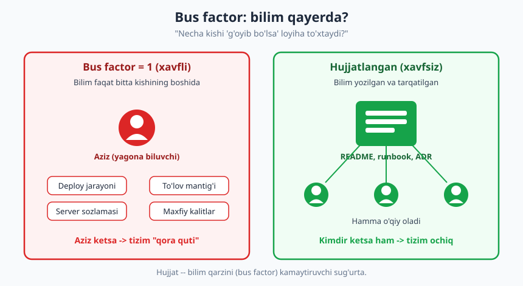
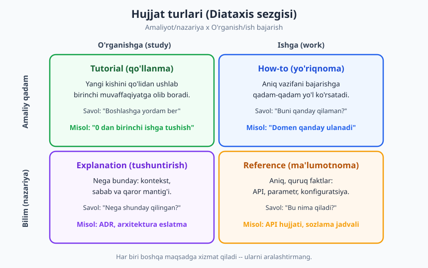
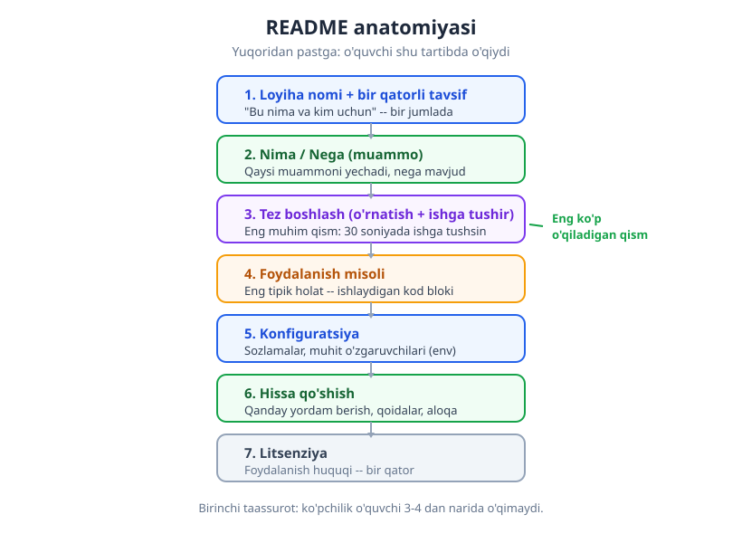

# 18 — Hujjatlash: README'dan runbook'gacha

[⬅️ Oldingi: 17 — Texnik kommunikatsiya: yaxshi savol va yozma muloqot](./17-texnik-kommunikatsiya.md) · [🏠 README](./README.md) · [Keyingi: 19 — Fikr-mulohaza, mentorlik va mojaro ➡️](./19-fikr-mulohaza-mentorlik.md)

---

> **Bu bobda:** hujjatlash *nega* muhimligini (bus factor, onboarding, bilim qarzi), hujjatning to'rt asosiy turini (Diataxis: tutorial / how-to / reference / explanation), README anatomiyasini, hamda onboarding hujjati, runbook va ADR kabi maxsus turlarni ko'rib chiqamiz. Eng muhimi — **qachon yozish, qachon yozmaslik** kerakligini va hujjatni koddek tirik saqlash (docs-as-code) ko'nikmasini o'rganamiz.
>
> **Halollik / Eslatma:** "ko'p hujjat" — har doim yaxshi degani emas. Bu bobdagi maslahatlar *qonun emas*: tez o'zgaruvchi prototipda ortiqcha hujjat zarar, barqaror tizimda esa hujjatning yo'qligi falokat. Asosiy halol haqiqat shu: **eskirgan hujjat — yolg'on**. Shuning uchun kitob bo'ylab takror aytamiz: "kam, lekin yangilanadigan" > "ko'p, lekin eskirgan".

---

## Nega umuman hujjat yozish kerak?

Ko'p dasturchi hujjatlashni "majburiy uy vazifasi" deb biladi — kod yozilgach, kimdir talab qilgani uchun qilinadigan zerikarli ish. Bu xato qarash. Hujjat — kelajakka yuboriladigan **xabar**, va u xabarning birinchi qabul qiluvchisi ko'pincha **kelajakdagi o'zingiz** bo'lasiz.

Tasavvur qiling: olti oy oldin yozgan loyihangizni qayta ochasiz. "Buni qanday ishga tushirgan edim? `.env` ichida nima bo'lishi kerak edi? Nega bu yerda shunday g'alati yechim qilingan?" — bu savollarning har biriga javob aslida o'sha paytda *bir necha daqiqada* yozib qo'yilishi mumkin edi. Yozilmagani uchun endi siz yarim kun yo'qotasiz.

Hujjatning uchta asosiy qiymati bor:

1. **Bus factor (avtobus omili).** Bu g'alati nomli, lekin jiddiy tushuncha: "loyiha to'xtab qolishi uchun nechta kishi 'avtobus ostida qolishi' (ya'ni to'satdan g'oyib bo'lishi) kerak?" Agar javob "1" bo'lsa — ya'ni faqat bitta odam deploy qanday qilinishini, to'lov mantig'i qayerda ekanini biladi — loyihangiz juda mo'rt. O'sha odam kasal bo'lsa, ta'tilga chiqsa yoki ishdan ketsa, jamoa qotib qoladi.
2. **Onboarding tezligi.** Yangi dasturchi jamoaga qo'shilganda, yaxshi hujjat uni *bir kunda* mahsuldor qiladi; yomon hujjat (yoki uning yo'qligi) bir-ikki haftani "kim biladi?" deb so'rab yurishga sarflaydi.
3. **Bilim qarzi.** "Bu yodimda" deb yozmay qo'ygan har bir narsa — bu [texnik qarz](./10-texnik-qarz.md)ning bir turi: **bilim qarzi**. Foizi ham bor — vaqt o'tgan sayin tafsilotlar unutiladi, qarzni "to'lash" qimmatlashadi.



> **Trade-off:** Bus factor'ni oshirish (bilimni tarqatish) bepul emas — hujjat yozish va yangilash vaqt talab qiladi. Bir martalik skript yoki bir hafta yashaydigan prototip uchun bus factor = 1 mutlaqo me'yorida. Lekin **boshqalar tayanadigan** yoki **uzoq yashaydigan** tizimda bus factor = 1 — bu jiddiy xavf, va uni hujjat bilan kamaytirish odatda eng arzon "sug'urta".

### Hujjat — bir kishining emas, jamoaning xotirasi

Real loyihada bu shunday ko'rinadi. Aziz ismli dasturchi to'lov tizimini yolg'iz yozgan. Hammasi uning boshida: qaysi API kalit qayerda, deploy qanday, "agar to'lov ikki marta tushsa nima qilish kerak". Bir kuni Aziz ikki haftalik ta'tilga chiqadi — va aynan o'sha hafta to'lovlar ishlamay qoladi. Jamoa kodga qaraydi-yu, "bu nega shunday?" degan savolga javob topa olmaydi. Aziz telefonini o'chirib qo'ygan.

Agar Aziz ketishidan oldin bir sahifalik **runbook** ("to'lov ishlamay qolsa: 1) bu logga qara, 2) bu komandani ber, 3) bu odamga yoz") yozib qo'yganida, navbatchi dasturchi muammoni 20 daqiqada hal qilardi. Hujjat — Azizning xotirasini jamoa xotirasiga aylantiradi.

---

## Hujjat turlari: hammasi bir xil emas (Diataxis)

Eng keng tarqalgan xato — har xil maqsadli matnlarni bitta "hujjat" deb aralashtirib yuborish. README ichida API ma'lumotnomasi, o'rgatuvchi qo'llanma va arxitektura falsafasi bir-biriga qorishib ketsa, hech kim kerakli narsani topolmaydi.

**Diataxis** — hujjatlarni to'rt aniq turga ajratuvchi sezgi (framework). Asosi ikki o'q: hujjat *o'rganish*gami yoki *ish bajarish*gami; *amaliy qadam*mi yoki *nazariy bilim*mi.



| Tur | Maqsad | O'quvchining savoli | Misol |
|---|---|---|---|
| **Tutorial** (qo'llanma) | O'rgatish — yangi kishini qo'lidan ushlab birinchi muvaffaqiyatga olib borish | "Boshlashga yordam ber" | "0 dan birinchi ishga tushirish" |
| **How-to** (yo'riqnoma) | Aniq vazifani bajartirish | "Buni qanday qilaman?" | "Domenni qanday ulash" |
| **Reference** (ma'lumotnoma) | Aniq faktlar berish | "Bu nima qiladi?" | API hujjati, sozlamalar jadvali |
| **Explanation** (tushuntirish) | Tushuntirish — *nega* shunday | "Nega bunday qilingan?" | ADR, arxitektura eslatmasi |

Nega bu farq muhim? Chunki har bir tur **boshqacha yoziladi**:

- **Tutorial** — o'quvchi hech narsa bilmaydi deb faraz qiladi, har qadamni aytadi, "nega"ni tushuntirmaydi (ortiqcha yuk bo'lmasligi uchun), faqat "bunday qiling, ishlaydi".
- **How-to** — o'quvchi nima qilmoqchiligini biladi, faqat *qadamlar*ni qisqa beradi; tushuntirishsiz.
- **Reference** — quruq, to'liq, izchil. "Falsafa" yo'q, faqat "bu funksiya bu argumentni oladi, buni qaytaradi".
- **Explanation** — kontekst, muqobillar, qaror sabablari. "Nega Postgres'ni tanladik, Mongo'ni emas".

> **Trade-off:** Diataxis'ni *qonun* deb qabul qilmang. Kichik loyihada to'rttala turni alohida hujjatga bo'lish ortiqcha — bitta yaxshi README ko'pincha tutorial + how-to + reference'ning qisqa aralashmasi bo'ladi va bu yetarli. Diataxis'ning asl qiymati — *bir hujjat ichida turlarni aralashtirib yubormaslik* sezgisini berishida. Masalan API ma'lumotnomasi o'rtasida "loyiha tarixi" haqida ikki sahifa yozmang.

---

## README anatomiyasi

README — loyihangizning **birinchi taassuroti** va eng ko'p o'qiladigan hujjat. Ko'p o'quvchi (va deyarli har bir potensial hissa qo'shuvchi) faqat shuni o'qiydi. Shuning uchun README'ning tuzilishi bejiz emas: o'quvchi yuqoridan pastga o'qiydi va ko'pchilik 3-4 bo'limdan narida o'qimaydi.



Yaxshi README'ning standart skeleti:

1. **Loyiha nomi + bir qatorli tavsif** — "bu nima va kim uchun", bir jumlada.
2. **Nima / Nega** — qaysi muammoni yechadi, nega umuman mavjud.
3. **Tez boshlash** — o'rnatish va ishga tushirish. *Eng muhim qism.* O'quvchi bu yerda 30 soniyada loyihani ishga tushira olishi kerak.
4. **Foydalanish misoli** — eng tipik holatning ishlaydigan kod bloki.
5. **Konfiguratsiya** — sozlamalar, muhit o'zgaruvchilari (`.env`).
6. **Hissa qo'shish** — qanday yordam berish mumkin, qoidalar, aloqa.
7. **Litsenziya** — bir qator.

### ❌ Yomon README

````text
# my-project

Bu mening loyiham. Node.js da yozilgan.

TODO: hujjat keyinroq yoziladi.
````

Bu README hech kimga hech narsa bermaydi. Loyiha nima qiladi? Qanday ishga tushiriladi? `npm install` yetadimi yoki yana nimadir kerakmi? Hech narsa ma'lum emas. "TODO: keyinroq" — bu ko'pincha "hech qachon" degani.

### ✅ Yaxshi README

````markdown
# Hisobot Generator

PDF moliyaviy hisobotlarni CSV'dan avtomatik yasaydigan CLI vositasi.
Buxgalterlar uchun: qo'lda Excel'da hisobot yasashni yo'q qiladi.

## Tez boshlash

```bash
git clone https://github.com/user/hisobot.git
cd hisobot
npm install
cp .env.example .env   # API kalitni shu yerga yozing
npm start
```

## Foydalanish

```bash
hisobot generate --input data.csv --output hisobot.pdf
```

## Konfiguratsiya

| O'zgaruvchi   | Tavsif                  | Standart |
|---------------|-------------------------|----------|
| `API_KEY`     | To'lov xizmati kaliti   | (majburiy) |
| `OUTPUT_DIR`  | PDF saqlanadigan papka  | `./out` |

## Hissa qo'shish

Issue oching yoki PR yuboring. `CONTRIBUTING.md` ni o'qing.

## Litsenziya

MIT
````

Farqni sezdingizmi? Yaxshi README — **o'quvchidan boshlanadi**: "men bu loyihani topdim, endi nima qilaman?" degan savolga darhol javob beradi. Birinchi 20 soniyada o'quvchi loyiha nima qilishini biladi va uni ishga tushira oladi.

> **Eslatma:** "Tez boshlash" bo'limini o'zingizda sinab ko'ring — *toza* mashinada (yoki yangi papkada), README'da yozilgan qadamlarni so'zma-so'z bajarib. Ko'pincha "avval shuni o'rnatish kerak edi" yoki "bu komanda boshqacha" degan yashirin qadamlar topiladi. README'da bo'lmagan har bir qadam — keyingi o'quvchi uchun to'siq.

---

## Maxsus hujjat turlari

README va Diataxis'dan tashqari, jamoa hayotida tez-tez uchraydigan uchta muhim hujjat turi bor.

### Onboarding hujjati — yangi dasturchining birinchi kuni

Yangi dasturchi kelganda unga kerak bo'lgan narsa README emas (u loyihaning *foydalanuvchisi* uchun), balki **onboarding hujjati** — "shu jamoada qanday ishlaymiz" qo'llanmasi:

- Loyihani lokal mashinada qanday ishga tushirish (kengaytirilgan, "agar X xato chiqsa Y qiling" bilan).
- Kim nima bilan shug'ullanadi, kimga qaysi savolni berish kerak.
- Kod oqimi: qaysi branch'dan branch ochiladi, PR qanday yuboriladi (qarang: [14-bob](./14-jamoaviy-kod-oqimi.md)).
- Birinchi haftadagi "yengil" vazifa (yaxshi onboarding birinchi kunda kichik PR'ni merge qilishga olib boradi).

Yaxshi onboarding hujjatining sinovi oddiy: **yangi kelgan odam uni o'qib, hech kimdan so'ramay loyihani ishga tushira oladimi?** Aslida eng yaxshi onboarding hujjatini *eng oxirgi kelgan dasturchi* yozadi — chunki u qayerda qoqilganini hali unutmagan.

### Runbook — incident paytidagi qadamlar

Runbook (operatsion qo'llanma) — "tizim buzilganda nima qilish kerak" degan amaliy yo'riqnoma. Bu soat 3 da, navbatchi dasturchi uyqusiragan holda o'qiydigan hujjat — shuning uchun u **qisqa, aniq, qadam-qadam** bo'lishi shart, tushuntirishsiz.

````text
## Runbook: To'lov xizmati javob bermayapti

1. Statusni tekshir:  curl https://api.example.com/health
2. Loglarga qara:     kubectl logs -l app=payment --tail=100
3. "rate limit" ko'rsa -> 5 daqiqa kut, qayta urin.
4. Hal bo'lmasa -> #incidents kanaliga yoz va @navbatchi-lead ni chaqir.
5. Rollback kerak bo'lsa:  ./deploy.sh rollback
````

Runbook how-to turining maxsus, "shoshilinch" ko'rinishi. Incident jarayoni va monitoring — [DevOps](../devops/README.md) kitobining mavzusi; bu yerda muhimi shu: **runbook yozilmagan tizim — har incident'da noldan o'ylanadigan tizim.**

### ADR — qaror yozuvi

ADR (Architecture Decision Record — arxitektura qaror yozuvi) — "nega shunday qaror qildik" degan qisqa hujjat. Bu Diataxis'dagi *explanation* turi. Kelajakda kimdir "nega bu yerda Postgres, Mongo emas?" deb so'raganda, ADR javob beradi — va "buni o'zgartiraylik" degan har safargi takroriy bahsni to'xtatadi.

ADR odatda juda qisqa: **kontekst** (qanday vaziyatda turardik), **qaror** (nima qildik), **oqibatlar** (buning yaxshi va yomon tomonlari). ADR — tizim *darajasidagi* qaror uchun; uni batafsil [Dasturlash arxitekturasi](../arxitektura/README.md) kitobi ko'rib chiqadi. Bu yerda muhimi: ADR — texnik [kommunikatsiyaning](./17-texnik-kommunikatsiya.md) yozma, kelajakka mo'ljallangan shakli.

---

## Yaxshi hujjatning belgilari

Hujjat turidan qat'i nazar, yaxshi hujjat quyidagicha:

- **O'quvchidan boshlanadi.** "Men nima bilaman" emas, "o'quvchi nima bilmaydi va nimani izlaydi". Eng katta xato — yozuvchining boshidagi kontekstni o'quvchida ham bor deb faraz qilish.
- **Qisqa.** Kerakli narsa bir ekranda. Uzun hujjat o'qilmaydi. Eng yaxshi hujjat — o'quvchini kerakli javobga tez yetkazadigan hujjat, eng to'liq emas.
- **Misolli.** Bitta ishlaydigan misol o'nta abstrakt jumladan ko'ra ko'proq narsani tushuntiradi. "Quruq" hujjatga doim "mana shunday ishlatasiz" misolini qo'shing.
- **Yangilanadigan.** Kod o'zgarganda hujjat ham o'zgaradi. Eskirgan hujjat — eng xavfli holat.
- **Koddan yaqin (docs-as-code).** Hujjat kod bilan bir repozitoriyada, bir PR'da yangilanadi.

### "Docs-as-code": hujjat ham kod

Bu kitobning markaziy g'oyalaridan biri: hujjatni koddek munosabat qiling. Bu degani:

- Hujjat **kod bilan bir joyda** turadi (repozitoriy ichida, alohida Wiki'da emas — Wiki tez eskiradi, chunki kod o'zgarganda kimdir uni ochib yangilashni unutadi).
- Hujjat o'zgarishi **bir xil oqimdan** o'tadi: PR, [code review](./13-code-review.md). Funksiyani o'zgartirgan PR o'sha funksiyaning hujjatini ham o'zgartiradi.
- "Kodni o'zgartirdim, hujjatni keyin yangilayman" — bu "keyin" hech qachon kelmaydi. Bir PR — bir butun.

### Eskirgan hujjat — yolg'on

Bu eng muhim halol haqiqat. [07-bobda](./07-izoh-ozini-hujjatlovchi-kod.md) eskirgan *izoh* haqida aytgan edik; bu hujjatga ham aynan tegishli, hatto kuchliroq.

Kodda xato bo'lsa — dastur ishlamaydi, siz buni darrov bilasiz. Lekin hujjatda yolg'on bo'lsa — hech narsa "buzilmaydi". Hujjat jim turaveradi va odamlarni *ishonch bilan* noto'g'ri yo'lga boshlaydi. Yangi dasturchi eskirgan onboarding hujjatiga ko'ra ikki soat "API_TOKEN" ni qidiradi — vaholanki uning nomi allaqachon "API_KEY" ga o'zgartirilgan.

> **Trade-off:** Aynan shuning uchun **"kam, lekin yangilanadigan" hujjat "ko'p, lekin eskirgan" hujjatdan yaxshiroq.** Yangilay olmaydigan hujjatni umuman yozmaslik ko'pincha to'g'riroq. Yuz sahifalik, lekin yarmi yolg'on hujjat — bu zaharlangan quduq: odamlar undan ichadi va kasal bo'ladi.

---

## Qachon hujjat YOZMASLIK kerak

Hujjat — qadr-qimmatga ega, lekin u **qarz** ham: yozilgan har bir hujjat sahifasi keyinchalik yangilanishi kerak bo'ladi, aks holda u yolg'onga aylanadi. Shuning uchun "hammasini hujjatlash" — bu *fazilat emas, balki kelajakdagi yuk*.

| Hujjat yozing ✅ | Hujjat yozmang (yoki keyinga qoldiring) ❌ |
|---|---|
| Boshqalar tayanadigan, uzoq yashaydigan tizim | Bir martalik skript, tashlab yuboriladigan kod |
| Aniq bo'lmagan, "g'alati" qaror (ADR) | Kodning o'zi aniq aytib turgan narsa |
| Lokal ishga tushirish qadamlari | Hali tez o'zgaruvchi prototip ("har kun shaklini o'zgartiradigan" API) |
| Incident javobi (runbook) | "Nima uchun"i kod o'qishdan ravshan bo'lgan funksiya |
| Sirli/yashirin bilim (deploy, maxfiy kalit qayerda) | Til/freymvorkning standart, hammaga ma'lum xulqi |

Ikki muhim holat:

1. **O'z-o'zini tushuntiruvchi kod.** Agar kod toza, yaxshi nomlangan bo'lsa ([05-bob](./05-nomlash-sanati.md) bilan birga [07-bobdagi](./07-izoh-ozini-hujjatlovchi-kod.md) g'oyalar), u o'zi-o'zining hujjati. `calculateMonthlyInterest(balance, rate)` funksiyasiga "bu oylik foizni hisoblaydi" degan hujjat yozish — ortiqcha shovqin.
2. **Tez o'zgaruvchi prototip.** MVP'ni har kuni qayta yozayotgan bo'lsangiz, batafsil hujjat — bekorga ketadigan vaqt. Bu yerda eng ko'pi bilan bir-ikki qatorli "qanday ishga tushirish" yetadi. Loyiha *barqarorlashgach* hujjatlay boshlang.

> **Eslatma:** "Hammasini hujjatla" va "hech narsani hujjatlama" — ikkalasi ham xato uchlik. Sog'lom yo'l: **eng ko'p og'riq keltiradigan bilimni hujjatlang.** Yangi odamlar takror-takror beradigan savol — hujjatlash uchun eng birinchi nomzod. Hech kim hech qachon so'ramaydigan narsa — ehtimol hujjat kerak emas.

---

## Asosiy g'oyalar (bobni qisqacha)

- **Hujjat — kelajakka xabar**, va birinchi qabul qiluvchisi ko'pincha kelajakdagi o'zingiz. U **bus factor**ni oshiradi, **onboarding**ni tezlashtiradi va **bilim qarzi**ni kamaytiradi.
- **Hujjat turlari bir xil emas (Diataxis):** tutorial (o'rgatadi), how-to (vazifa bajartiradi), reference (faktlar beradi), explanation (nega'ni tushuntiradi). Ularni bir matnda aralashtirmang.
- **README — birinchi taassurot.** Standart skelet: nom/tavsif → nima/nega → tez boshlash → foydalanish → konfiguratsiya → hissa → litsenziya. Eng muhim qism — "tez boshlash".
- **Maxsus turlar:** onboarding (1-kun), runbook (incident qadami — [DevOps](../devops/README.md)), ADR (qaror yozuvi — [Arxitektura](../arxitektura/README.md)).
- **Docs-as-code:** hujjat kod bilan bir repozitoriyada, bir PR'da, bir [review](./13-code-review.md)dan o'tib yangilanadi. **Eskirgan hujjat — yolg'on.**
- **Halollik:** "kam, lekin yangilanadigan" > "ko'p, lekin eskirgan". Hammasini hujjatlash — fazilat emas, [qarz](./10-texnik-qarz.md).
- **Qachon yozmaslik:** o'z-o'zini tushuntiruvchi kod va tez o'zgaruvchi prototip uchun hujjat — ko'pincha bekorga ketadigan vaqt.

---

## Mashqlar

### Oson

**1-mashq.** Quyidagi to'rt holatni Diataxis turlariga ajrating (tutorial / how-to / reference / explanation): (a) "Kutubxonadagi har bir funksiyaning argumentlari ro'yxati", (b) "Yangi boshlovchi uchun: birinchi chatbotni 10 daqiqada yasash", (c) "Loyihaga yangi til qo'shish bo'yicha qadamlar", (d) "Nega biz REST emas, GraphQL tanladik".

**2-mashq.** Quyidagi README'da kamida 3 ta kamchilik toping:
````text
# tool

Foydali vosita. Java.

Ishlatish: ./run

Litsenziya bor.
````

**3-mashq.** "Bus factor = 1" iborasini o'z so'zlaringiz bilan tushuntiring va o'z hozirgi loyihangiz (yoki o'qiyotgan kodingiz) uchun taxminiy bus factor ni baholang. Qaysi bilim faqat bitta odamning boshida?

### O'rta

**4-mashq.** O'zingiz yaqinda yozgan kichik loyiha (yoki shaxsiy GitHub repo'ngiz) uchun **to'liq README yozing** — kamida quyidagi bo'limlar bilan: nom + bir qatorli tavsif, tez boshlash, foydalanish misoli, litsenziya. Yozib bo'lgach, "tez boshlash" qadamlarini toza papkada (yoki xayolan) bajarib, yashirin qadam bor-yo'qligini tekshiring.

**5-mashq.** Sizning jamoangizda (yoki tasavvuriy jamoada) "to'lov xizmati 500 xato qaytarmoqda" degan incident bo'ldi. Buning uchun 5-6 qadamli **runbook** yozing: tekshiruv → diagnostika → vaqtinchalik yechim → eskalatsiya → rollback.

**6-mashq.** Quyidagi qarorlardan bittasini tanlab, qisqa **ADR** yozing (kontekst / qaror / oqibatlar): (a) ma'lumotlar bazasi tanlovi, (b) monolitni mikroservisga ajratish, (c) tashqi kutubxona vs o'zimiz yozish. Har bo'lim — 2-3 jumla.

### Qiyin

**7-mashq.** Sizga 50 sahifalik, lekin yarmi eskirgan loyiha hujjati berildi. Yangi dasturchilar undan foydalanib chalg'imoqda. **Strategiya yozing:** nimani saqlash, nimani o'chirish, nimani docs-as-code oqimiga ko'chirish kerak? "Eskirgan hujjat — yolg'on" tamoyilini hisobga oling.

**8-mashq.** Bir jamoa ikki uchlikka bo'lingan: bir guruh "hamma narsani batafsil hujjatlash kerak", boshqasi "kod o'zi hujjat, yozish vaqtni o'ldiradi". Ikkala tomonning haq jihatini toping va jamoa uchun **amaliy hujjatlash siyosati** taklif qiling (qaysi narsalar majburiy hujjatlanadi, qaysilari yo'q, qanday yangilanadi).

<details markdown="1">
<summary>Yechimlar</summary>

### 1-mashq yechimi

- (a) **Reference** — quruq faktlar, argumentlar ro'yxati.
- (b) **Tutorial** — yangi kishini qo'lidan ushlab birinchi muvaffaqiyatga olib boradi.
- (c) **How-to** — aniq vazifani (til qo'shish) bajarish qadamlari, biluvchi odam uchun.
- (d) **Explanation** — *nega* shunday qaror qilingani, kontekst va muqobillar.

### 2-mashq yechimi

Kamchiliklar (kamida 3): (1) **Nima qiladi noma'lum** — "foydali vosita" hech narsa demaydi, qaysi muammoni yechishi yo'q. (2) **Tez boshlash yo'q** — `./run` dan oldin nima o'rnatish, qanday build qilish kerak? Yashirin qadamlar bor. (3) **Foydalanish misoli yo'q** — tipik holat ko'rsatilmagan. (4) Konfiguratsiya yo'q. (5) "Litsenziya bor" — qaysi litsenziya? Aytilmagan = aytilmagandek. Umuman: README **o'quvchidan** boshlanmagan.

### 3-mashq yechimi

Namuna javob: "Bus factor = 1 — loyihaning biror muhim qismini *faqat bitta odam* tushunadi degani; o'sha odam ketsa, jamoa o'sha qismda qotib qoladi." Baholash uchun savol bering: "agar X kishi ertaga g'oyib bo'lsa, qaysi narsa ishlamay qoladi yoki tushunarsiz bo'ladi?" Tipik javoblar: deploy jarayoni, maxfiy kalitlar qayerda, "g'alati" biznes-mantiq sababi. Yagona to'g'ri javob yo'q — maqsad o'z loyihangizdagi mo'rt nuqtani aniqlash.

### 4-mashq yechimi

To'liq README namunasi (qisqartirilgan):
````markdown
# Vaqt Tracker
Frilanserlar uchun soddalashtirilgan vaqt hisoblovchi CLI.

## Tez boshlash
```bash
npm install -g vaqt-tracker
vaqt start "loyiha nomi"
```

## Foydalanish
```bash
vaqt start "Mijoz A"   # taymerni boshlaydi
vaqt stop              # to'xtatadi va saqlaydi
vaqt report --week     # haftalik hisobot
```

## Litsenziya
MIT
````
Asosiy mezon: o'quvchi 30 soniyada loyiha nima qilishini bilib, uni ishga tushira oldimi? "Tez boshlash"da yashirin qadam (mas. global o'rnatish kerakligi) tashlab ketilmadimi?

### 5-mashq yechimi

Namuna runbook:
````text
## Runbook: To'lov xizmati 500 xato

1. Tekshir:    curl -i https://api.example.com/payments/health
2. Loglar:     kubectl logs -l app=payment --tail=200 | grep ERROR
3. Sabab DB bo'lsa -> ulanish poolini tekshir, restart: kubectl rollout restart deploy/payment
4. Tashqi xizmat (Stripe) bo'lsa -> status.stripe.com ga qara, 10 daqiqa kut.
5. Eskalatsiya: #incidents ga yoz, @payment-lead ni chaqir.
6. Hal bo'lmasa rollback: ./deploy.sh rollback payment
````
Mezon: qadamlar shoshilinch holatda, tushuntirishsiz bajarilarli; eskalatsiya va rollback bor.

### 6-mashq yechimi

Namuna ADR (DB tanlovi):
````text
# ADR-007: Asosiy DB sifatida PostgreSQL

## Kontekst
Tranzaksion to'lov ma'lumotlari kerak. Kuchli izchillik (consistency) va
murakkab so'rovlar (JOIN, agregatsiya) bo'ladi. Jamoa SQL biladi.

## Qaror
PostgreSQL tanlandi (MongoDB emas).

## Oqibatlar
+ ACID tranzaksiya, ishonchli moliyaviy ma'lumot.
+ Jamoa allaqachon biladi -> o'rganish xarajati yo'q.
- Gorizontal masshtab Mongo'dan murakkabroq (hozircha kerak emas).
````
Mezon: uch bo'lim ham bor; "nega aynan shu" aniq; muqobil (Mongo) eslatilgan.

### 7-mashq yechimi

Namuna strategiya: (1) **Audit** — har sahifani "to'g'ri / eskirgan / keraksiz" deb belgilang. (2) **Eskirganni o'chiring yoki tuzating** — yolg'on hujjat yo'qligidan yomonroq; o'chirish — to'g'ri harakat. (3) **Saqlanadiganlarni docs-as-code'ga ko'chiring** — kod repo'siga, har biri egasi (owner) bilan; PR oqimiga bog'lang. (4) **Eng ko'p so'raladigan narsalardan boshlang** — bir kichik, *to'g'ri* "Tez boshlash" 50 sahifa eskirgan matndan qimmatroq. Tamoyil: kam, lekin yangilanadigan.

### 8-mashq yechimi

Ikkala tomon ham qisman haq: "kod o'zi hujjat" tarafdorlari **eskiruvchi/ortiqcha** hujjatdan haqli qo'rqadi; "batafsil hujjat" tarafdorlari **bus factor va onboarding** xavfidan haqli qo'rqadi. Amaliy siyosat: **Majburiy hujjatla:** (a) lokal ishga tushirish (README), (b) deploy/incident (runbook), (c) "g'alati" qarorlar (ADR), (d) sirli bilim (kalitlar qayerda). **Hujjatlama:** o'z-o'zini tushuntiruvchi kod, standart freymvork xulqi. **Yangilash:** docs-as-code — kodni o'zgartirgan PR tegishli hujjatni ham yangilaydi, code review buni tekshiradi. Yagona to'g'ri javob yo'q — maqsad ikki ekstremum o'rtasidagi kontekstga mos muvozanat.

</details>

---

[⬅️ Oldingi: 17 — Texnik kommunikatsiya: yaxshi savol va yozma muloqot](./17-texnik-kommunikatsiya.md) · [🏠 README](./README.md) · [Keyingi: 19 — Fikr-mulohaza, mentorlik va mojaro ➡️](./19-fikr-mulohaza-mentorlik.md)
