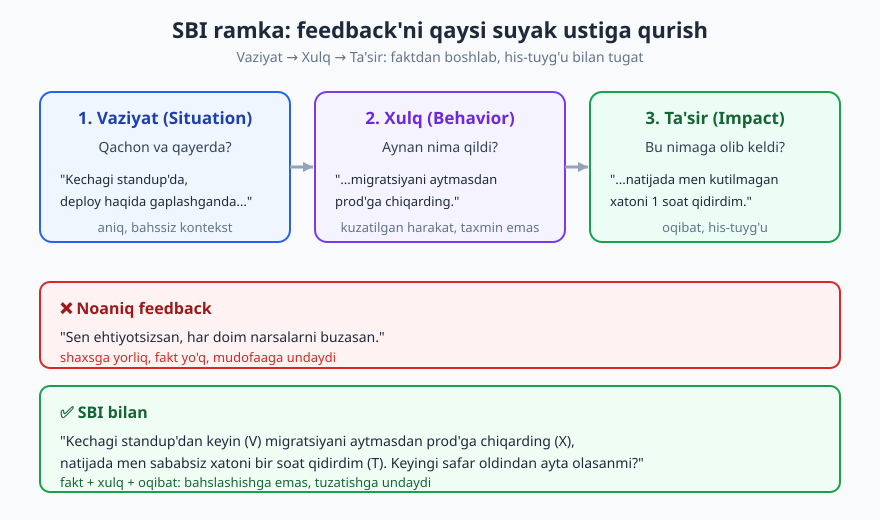
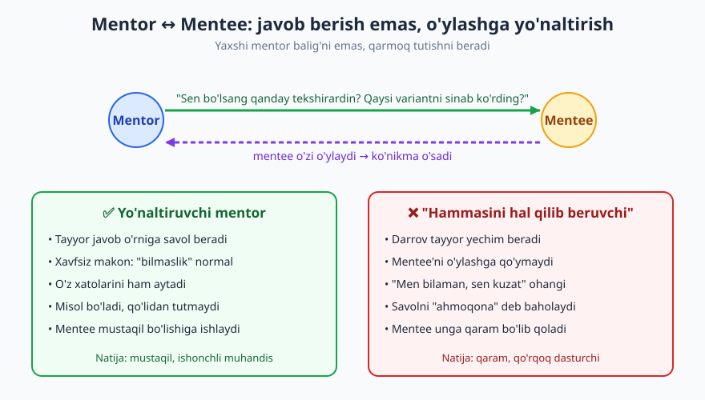
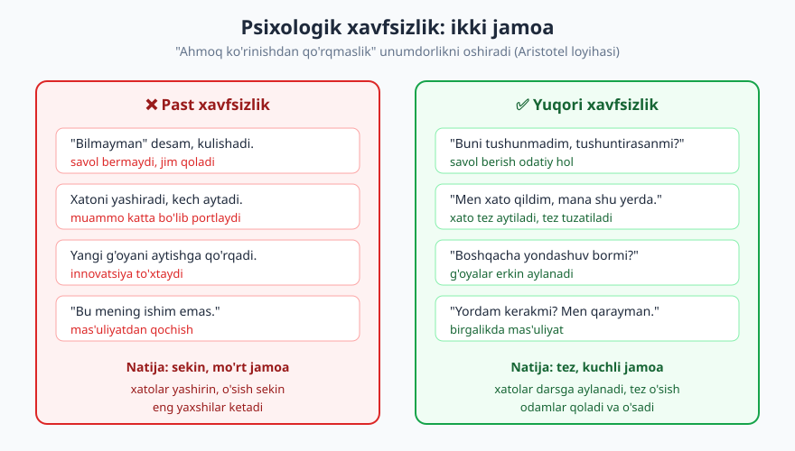

# 19 — Fikr-mulohaza, mentorlik va mojaro

[⬅️ Oldingi: 18 — Hujjatlash: README'dan runbook'gacha](./18-hujjatlash.md) · [🏠 README](./README.md) · [Keyingi: 20 — Ish muhiti va vositalar ustaligi ➡️](./20-ish-muhiti-vositalar.md)

---

> **Bu bobda:** dasturchilik — yolg'iz sport emas, jamoa sporti. Texnik mahorat senior'likning faqat yarmi; qolgan yarmi — insonlar bilan ishlash. Bu bobda fikr-mulohaza (feedback) berish va olishni (SBI ramkasi bilan), mentor va mentee bo'lishni, texnik kelishmovchilik va mojaroni boshqarishni, hamda jamoaning eng muhim poydevori — **psixologik xavfsizlik**ni o'rganasiz.
>
> **Halollik / Eslatma:** bu bobdagi maslahatlar *qonun emas, amaliy yo'l-yo'riq*. Bu ko'nikmalar — feedback berish, mojaroni yumshatish, mentorlik — **tug'ma emas, mashq bilan o'sadi**. Introvert ham, "men odamlar bilan ishlay olmayman" deydigan kishi ham buni o'rganadi. Ohang, masofa va to'g'ridan-to'g'rilik darajasi **madaniyatga kuchli bog'liq**: bu yerda berilgan iboralar O'zbekiston va global masofaviy jamoa orasidagi keng tajribadan olingan, lekin o'z jamoangizning normalariga moslang.

---

## Nega bu bob — texnik mahorat yetarli emas

Tasavvur qiling: ikki dasturchi. Birinchisi — kodda dahshat, har qanday algoritmni yecha oladi, lekin code review'da odamlarni ranjitadi, kelishmovchilikda ovozini ko'taradi, hech kimga o'rgatmaydi. Ikkinchisi — texnik jihatdan o'rtacha, lekin savol berishni biladi, feedback'ni yaxshi qabul qiladi, yangilarni o'stiradi, mojaroni yumshatadi.

Besh yildan keyin ikkinchisi — texnik lid, birinchisi esa hali ham "o'sha qiyin odam". Nega? Chunki **dasturlash — jamoa sporti**. Bir kishi yozadigan kod kichik; katta tizimni jamoa quradi. Va jamoaning tezligi eng zaif texnik a'zo emas, balki **odamlar bir-biri bilan qanchalik yaxshi ishlashi** bilan o'lchanadi.

Senior dasturchining ta'rifi "eng murakkab kodni yozadi" emas. Senior — **atrofidagilarni kuchaytiradi**: feedback beradi, o'rgatadi, kelishmovchilikni hal qiladi, jamoani bir-biriga bog'laydi. Bu bob aynan shu "yarim"ni — texnik bo'lmagan, lekin senior'likni belgilaydigan yarmni — o'rgatadi.

> **Eslatma:** bu bob [13-bob (Code review)](./13-code-review.md), [15-bob (Agile)](./15-agile-scrum-kanban.md) va [17-bob (Texnik kommunikatsiya)](./17-texnik-kommunikatsiya.md) bilan zich bog'liq. U yerda *mexanika* (qanday sharh yozish, qanday standup o'tkazish), bu yerda esa undan ortda turgan *inson munosabati* bor.

---

## 1. Fikr-mulohaza BERISH

Feedback — bu "tanqid" emas. Feedback — **bir odamga o'sish uchun ma'lumot berish**. Yaxshi feedback — sovg'a; lekin noto'g'ri berilgan feedback — yara. Farq texnikada.

### Yaxshi feedback'ning to'rt ustuni

1. **O'z vaqtida.** Hodisadan keyin tezroq — ta'sir kuchliroq. Olti oy oldingi xatoni "performance review"da aytish — kech va foydasiz. Lekin "tezroq" "darrov, jahl bilan" degani emas (pastda mojaroda ko'ramiz).
2. **Aniq.** "Sen yaxshi ishlamayapsan" — foydasiz. "Kechagi PR'da test yozmadingiz, shuning uchun review uzoq cho'zildi" — aniq, harakatga aylantiriladi.
3. **Xulqqa, shaxsga emas.** "Sen ehtiyotsizsan" — bu shaxs yorlig'i, hujum. "Bu deploy'da migratsiya o'tkazib yuborilgan edi" — bu xulq, tuzatish mumkin.
4. **Niyat yaxshi.** Feedback'ning maqsadi — odamni pasaytirish emas, o'stirish. Agar siz odamning o'sishini chin dildan istamasangiz, bu feedback emas — bu shikoyat.

### SBI ramkasi — feedback'ni qanday qurish

Eng amaliy ramkalardan biri — **SBI**: *Situation (Vaziyat) → Behavior (Xulq) → Impact (Ta'sir)*. Faktdan boshlaysiz, kuzatilgan harakatni aytasiz, oqibatini ko'rsatasiz — va shaxsga yorliq yopishtirmasdan, odam o'zi xulosa chiqaradi.

| Bosqich | Savol | ✅ Misol | ❌ Tipik xato |
|---|---|---|---|
| **Vaziyat** | Qachon, qayerda? | "Kechagi standup'dan keyin..." | (kontekst yo'q, "har doim") |
| **Xulq** | Aynan nima qildi? | "...migratsiyani aytmasdan prod'ga chiqarding" | "...ehtiyotsizlik qilding" (yorliq) |
| **Ta'sir** | Bu nimaga olib keldi? | "...natijada men xatoni 1 soat qidirdim" | (oqibat aytilmaydi, faqat ayb) |

**❌ SBI'siz (noaniq, hujumkor):**
> "Sen doim narsalarni buzasan. Ehtiyotsizsan."

**✅ SBI bilan:**
> "Kechagi standup'dan keyin migratsiyani aytmasdan prod'ga chiqarding. Natijada men sababsiz xatoni bir soat qidirdim. Keyingi safar deploy'dan oldin migratsiyani aytib o'ta olasanmi?"

Ikkinchisi bahslashishga emas, **tuzatishga** undaydi. Birinchisiga javob faqat bitta — mudofaa.

### Ikki oltin qoida

- **"Maqtov omma oldida, tanqid yakkama-yakka."** Yangi a'zoning yaxshi PR'ini jamoa kanalida maqtang — bu uni ham, atrofni ham ruhlantiradi. Lekin xato haqidagi feedback — shaxsiy suhbatda, DM'da yoki yakkama-yakka qo'ng'iroqda. Odamni boshqalar oldida tuzatish — uyat va mudofaa keltiradi, dars emas.
- **"Feedback sendvichi"dan ehtiyot bo'ling.** Klassik maslahat: "maqtov → tanqid → maqtov". Lekin amalda u ko'pincha ishlamaydi: odam yo faqat maqtovni eshitadi (tanqid yo'qoladi), yo har maqtovdan keyin tanqid kutib, maqtovga ishonmay qoladi. **Halol va to'g'ridan-to'g'ri, lekin mehribon** bo'lish ko'pincha sendvichdan yaxshiroq.

> **Trade-off:** to'g'ridan-to'g'rilik darajasi madaniyatga bog'liq. Niderlandiya jamoasida "buni boshqacha qilsang yaxshi" — oddiy hol. Boshqa, ko'proq iyerarxik yoki "yuzni saqlash" muhim bo'lgan madaniyatlarda bevosita tanqid qattiq tuyulishi mumkin va munosabatni buzadi. To'g'ridan-to'g'rilik bilan empatiya orasidagi balansni jamoangiz kontekstiga moslang — universal "to'g'ri" daraja yo'q.

---

## 2. Fikr-mulohaza OLISH

Feedback olish — berishdan ko'ra qiyinroq, chunki bu yerda ego ishga tushadi. Yaxshi xabar: feedback'ni qanday qabul qilishingiz — sizning professional o'sishingizning eng kuchli ko'rsatkichlaridan biri.

### Mudofaaga o'tmaslik

Tabiiy reaksiya — o'zini oqlash: "Lekin men shuning uchun...", "Sen tushunmaysan, chunki...". Bu refleks feedback oqimini darrov to'xtatadi. Bir marta mudofaaga o'tsangiz, odam keyingi safar sizga feedback bermaydi — va siz "ko'r" qolasiz.

**❌ Mudofaa:**
> "Yo'q, men test yozdim-ku! Sen e'tibor bermagansan. Vaqtim ham yo'q edi."

**✅ Qabul qilish:**
> "Rahmat aytganingga. Aniqlashtirsam — qaysi qism test'siz qolgan? Keyingi safar buni qanday oldini olsam bo'ladi?"

### To'rt qadam: sovg'a → aniqlik → rahmat → harakat

1. **Sovg'a sifatida qabul qiling.** Kimdir vaqt sarflab sizga o'sish uchun ma'lumot berdi. Bu — sovg'a, hatto noqulay bo'lsa ham. Birinchi reaksiya — eshitish, javob qaytarish emas.
2. **Aniqlashtirib so'rang.** "Qaysi vaziyatda?", "Misol bera olasanmi?" — bu mudofaa emas, bu chin tushunish. (Lekin "isbotlab ber" ohangida emas.)
3. **Rahmat ayting.** Hatto rozi bo'lmasangiz ham, ma'lumot uchun rahmat. Roziligingiz keyingi qadam.
4. **Harakatga aylantiring.** Feedback'ning qiymati — undan keyin nimadir o'zgarsa. Bitta aniq narsani tanlang va keyingi safar boshqacha qiling.

> **Eslatma:** har feedback to'g'ri emas. Ba'zan beruvchi noto'g'ri tushungan, ba'zan kontekstni bilmaydi. Lekin **avval to'liq eshiting**, keyin baholang. "Eshitish" "rozi bo'lish" degani emas — lekin eshitmasdan rad etish — o'sishni to'xtatadi. Bu xuddi [13-bobdagi code review](./13-code-review.md) sharhini qabul qilish bilan bir xil ko'nikma: kod sizga emas, kod sizning ishingizga taalluqli.

---

## 3. Mentorlik

Senior dasturchining eng muhim merosi — yozgan kodi emas, balki **o'stirgan odamlari**. Keyingi avlodni tayyorlash — texnik liderlikning markazi.

### Mentor bo'lish: javob berish emas, o'ylashga yo'naltirish

Eng ko'p uchraydigan mentorlik xatosi — har savolga darrov tayyor javob berish. Bu tez, lekin **mentee'ni o'ylashdan mahrum qiladi**. Mentee sizga qaram bo'lib qoladi, mustaqil muhandis bo'lmaydi.

Yaxshi mentor — **qarmoq beradi, baliq emas**:

- **Tayyor yechim o'rniga savol:** "Sen bo'lsang qayerdan tekshirardin?", "Qaysi variantlarni ko'rib chiqding?", "Bu xato xabari senga nima deyapti?".
- **Xavfsiz makon yaratadi:** mentee "bilmayman" deyishdan, "ahmoqona" savol berishdan qo'rqmasligi kerak. Buning eng kuchli usuli — siz ham o'z bilmasligingizni va xatolaringizni ochiq ayting: "Men ham buni ikki yil bilmaganman", "Mana shu yerda men o'tgan oy katta xato qilgandim".
- **Misol bo'ladi:** mentee sizning *qanday ishlashingizni* — debugging'ingizni, savol berishingizni, feedback qabul qilishingizni — kuzatib o'rganadi, aytganingizdan ko'ra ko'proq.

> **Trade-off:** "savol bilan yo'naltirish" har doim to'g'ri emas. Agar mentee yong'inni o'chiryapti (prod ishlamayapti, deadline bugun) yoki butunlay yo'qolgan bo'lsa — sokratcha savollar bermang, to'g'ridan-to'g'ri yo'l ko'rsating. Yo'naltiruvchi savol — o'rganish rejimi uchun; favqulodda holatda esa tezlik muhim. Rejimni to'g'ri tanlang.

### Mentee bo'lish: vaqtni qadrlash, o'zini ochish

Mentorlik — ikki tomonlama. Yaxshi mentee bo'lish ham ko'nikma:

- **Savol tayyorlang.** Mentor bilan uchrashishdan oldin nima so'rashingizni yozib qo'ying. "Hammasi qiyin" emas — aniq savollar.
- **Mentor vaqtini qadrlang.** Avval o'zingiz urinib ko'ring (qidiring, hujjat o'qing), keyin "men buni va buni sinab ko'rdim, qotib qoldim" deb keling. Bu [17-bobdagi yaxshi savol berish](./17-texnik-kommunikatsiya.md) bilan bir xil.
- **O'zingizni oching.** Mentor sizning zaif joylaringizni ko'rmasa, yordam bera olmaydi. "Men hammasini bilaman" niqobi — o'sishning dushmani.

---

## 4. Mojaro (conflict) boshqarish

**Texnik kelishmovchilik — normal va foydali.** Jamoada hech qanday kelishmovchilik bo'lmasligi — sog'lom belgi emas; bu odatda odamlar fikrini aytishdan qo'rqishini bildiradi. Muammo kelishmovchilikda emas — uni **qanday boshqarishda**.

### Sog'lom mojaro vs zararli mojaro

| Jihat | ✅ Sog'lom (g'oyalar urishi) | ❌ Zararli (shaxslar urishi) |
|---|---|---|
| Nimaga qaratilgan | Muammo / yechim | Odam / shaxs |
| Til | "Men bu yondashuvda risk ko'ryapman" | "Sen noto'g'ri o'ylaysan" |
| Maqsad | Eng yaxshi qarorga yetish | "G'olib" bo'lish |
| Asos | Fakt, ma'lumot, o'lchov | His-tuyg'u, ego, status |
| Natija | Yaxshiroq yechim, ishonch | Ranjish, jamoa parchalanishi |

### Mojaroni yumshatadigan vositalar

- **"Men-gapi" (I-statement).** "Sen meni eshitmayapsan" o'rniga — "Men bu yerda eshitilmayotgandek his qilyapman". Birinchisi — ayblov, mudofaa keltiradi; ikkinchisi — o'z holatingizni aytish, suhbatni ochiq tutadi.
- **Faktga tayaning.** "Menimcha bu sekin" o'rniga — "men o'lchadim, bu so'rov 800ms ketyapti, byudjet 200ms". Fakt bahsni emotsiyadan ma'lumotga ko'chiradi.
- **Ad hominem'dan qoching.** Hech qachon g'oyani emas, odamni hujum qilmang. "Bu yondashuv ishlamaydi, chunki X" — yaxshi. "Sen hech qachon to'g'ri qaror qabul qilmaysan" — bu jamoani buzadi va sizni ham yomon ko'rsatadi.
- **"Kelishmaymiz, lekin bajaramiz" (disagree and commit).** Ba'zan bahs to'xtashi kerak. Hamma o'z fikrini aytdi, qaror qabul qilindi — siz rozi bo'lmasangiz ham, qaror ortidan to'liq turasiz va uni sabotaj qilmaysiz. Bu — yetuk muhandislikning belgisi: o'z egongizni jamoa qaroriga bo'ysundirish.

**❌ Zararli:**
> "Bu arxitektura ahmoqona. Buni taklif qilgan odam tajribasiz."

**✅ Sog'lom:**
> "Men bu arxitekturada masshtablashda risk ko'ryapman — yuk oshganda DB bo'g'iladi deb o'ylayapman. Yaxshiroq tushunishim uchun, biz buni qanday hal qilmoqchimiz?"

### Eskalatsiya — qachon yuqoriga olib chiqish

Ko'pchilik mojaro ikki kishi orasida hal bo'ladi. Lekin ba'zan:
- bir necha marta hal qilishga urinib bo'lmadi;
- qaror jamoa ko'lamidan tashqarida (byudjet, prioritet);
- xulq professional chegaradan chiqdi (hurmatsizlik, hujum).

Bunda **lid yoki menejerga olib chiqish — zaiflik emas, balki to'g'ri qadam**. Eskalatsiya — "shikoyat" emas; u "biz ikkalamiz hal qila olmadik, qaror qabul qiluvchi kerak" degani. Lekin avval o'zaro hal qilishga halol urinib ko'ring.

---

## 5. Psixologik xavfsizlik — jamoaning poydevori

Google'ning **Aristotel loyihasi** (Project Aristotle) yuzlab jamoani o'rgangach, eng samarali jamoalarni boshqalardan ajratib turadigan eng kuchli omilni topdi. Bu — eng aqlli a'zolar emas, eng katta tajriba emas. Bu — **psixologik xavfsizlik**: jamoada "ahmoq ko'rinishdan", savol berishdan, xato qilishdan yoki "bilmayman" deyishdan **qo'rqmaslik**.

Past xavfsizlik jamoasida odamlar jim turadi, xatoni yashiradi, "ahmoqona" savol bermaydi — natijada xatolar kech ochiladi va katta portlaydi, innovatsiya to'xtaydi. Yuqori xavfsizlik jamoasida "bilmayman", "men xato qildim", "boshqacha yo'l bormi?" — odatiy gaplar, va aynan shu jamoani tez va kuchli qiladi.

Bu nazariy emas — kunlik amaliyot:

- **"Men bilmayman" deyish madaniyati.** Eng senior odam ham "buni bilmayman, keyin tekshirib aytaman" desa — bu butun jamoaga ruxsat beradi. Hech kim bilmaslikni yashirmaydi.
- **Xatoni jazolanmasdan tan olish.** "Men prod'ni buzdim" deganga hujum qilinsa, keyingi safar hamma xatosini yashiradi. Aksincha, "rahmat tez aytganga, keling birga tuzataylik" — xatoni darsga aylantiradi (bu [DevOps blameless postmortem](../devops/README.md) madaniyatining o'zagi).
- **Junior savolini "ahmoqona" demaslik.** Senior'ning bir kinoyali izohi yangini bir yilga jim qilib qo'yishi mumkin.

> **Trade-off:** psixologik xavfsizlik "hech qachon tanqid yo'q" yoki "standart past" degani EMAS. Bu past talab bilan adashtirilmaydi. Aksincha: yuqori xavfsizlik + yuqori talab = eng yuqori unumdorlik (Amy Edmondson buni "o'rganuvchi zona" deydi). Odamlar qo'rqmasdan xato qiladi *va* bir-biridan yuqori sifat kutadi. Xavfsizlik — ayblovsiz, lekin standartsiz emas.

---

## 6. Turli odamlar, madaniyatlar va masofaviy jamoa

Zamonaviy jamoa ko'pincha bir necha mamlakat, vaqt zonasi va madaniyatdan iborat. O'zbekistondan turib global jamoada ishlash — bugun oddiy hol (karyera yo'nalishida ko'proq — [23-bob](./23-karyera-narvoni.md)). Bu yerda **empatiya** — texnik ko'nikmadan kam emas:

- **Turli shaxslar:** introvert standupda kam gapirishi mumkin — bu beparvolik emas. Ba'zilarga o'ylab javob berish uchun vaqt kerak; yozma muloqot ularga ovoz beradi.
- **Turli madaniyatlar:** to'g'ridan-to'g'rilik, sukut, "ha" ning ma'nosi madaniyatga bog'liq. Bir madaniyatda "ko'rib chiqaman" — "yo'q", boshqasida — chin va'da. Taxmin qilmang, aniqlashtiring.
- **Masofaviy jamoa:** tana tili yo'q, shuning uchun yozma ohang juda muhim. Quruq "ok." sovuq tuyuladi; emoji va aniq so'zlar mehrni yetkazadi. Asinxron muloqotda har bir xabar to'liq kontekst bilan yozilsin.

---

## Asosiy g'oyalar (bobni qisqacha)

- **Dasturlash jamoa sporti.** Texnik mahorat senior'likning faqat yarmi; qolgani — **insonlar bilan ishlash**.
- **Feedback berish:** o'z vaqtida, aniq, **xulqqa (shaxsga emas)**, niyat yaxshi. **SBI** (Vaziyat → Xulq → Ta'sir) ramkasi bahsni faktga ko'chiradi. "Maqtov omma oldida, tanqid yakkama-yakka."
- **Feedback olish:** mudofaaga o'tmang. **Sovg'a → aniqlik → rahmat → harakat**. Eshitish rozi bo'lish degani emas, lekin eshitmaslik o'sishni to'xtatadi.
- **Mentorlik:** tayyor javob emas, **savol bilan yo'naltiring**; xavfsiz makon yarating; misol bo'ling. Senior'ning merosi — kodi emas, o'stirgan odamlari.
- **Mojaro:** texnik kelishmovchilik **normal va foydali**. "Men-gapi", faktga tayanish, ad hominem'dan qochish, **"kelishmaymiz lekin bajaramiz"**.
- **Psixologik xavfsizlik** (Aristotel loyihasi) — eng samarali jamoaning poydevori: "bilmayman" va "men xato qildim" deyish madaniyati. Lekin past talab emas.
- **Bu ko'nikmalar tug'ma emas** — mashq bilan o'sadi; introvert ham, har madaniyatdan kishi ham o'rganadi.

---

## Mashqlar

### Oson

**1-mashq.** Quyidagi feedback'ni SBI ramkasi bilan qayta yozing: *"Sen juda sekin ishlaysan, hech narsani vaqtida tugatmaysan."* (Vaziyat, Xulq, Ta'sirni alohida ajrating.)

**2-mashq.** Sizga shunday feedback berildi: *"PR'ing juda katta edi, review qilish qiyin bo'ldi."* Mudofaaga o'tmasdan, "sovg'a → aniqlik → rahmat → harakat" to'rt qadami bo'yicha javobingizni yozing.

**3-mashq.** Quyidagi mentor javoblaridan qaysi biri "yo'naltiruvchi", qaysi biri "tayyor javob beruvchi"? Belgilang va nega shundayligini bir jumlada ayting: (a) "Mana, bu yerga `await` qo'shsang ishlaydi." (b) "Bu funksiya nima qaytaradi deb o'ylaysan — sinab ko'rdingmi?"

### O'rta

**4-mashq.** Bir hamkasbingiz standup'da boshqalar oldida sizning kodingizni qattiq tanqid qildi: "Bu kod butunlay noto'g'ri". "Maqtov omma oldida, tanqid yakkama-yakka" qoidasini eslab, vaziyatni qanday hal qilasiz? Qadamlarni yozing.

**5-mashq.** Quyidagi mojaroni hal qiling: siz mikroservisni yoqlaysiz, hamkasbingiz monolitni. Suhbat qizib ketdi, u dedi: "Sen shunchaki yangi texnologiya quvib yuribsan". Ad hominem'ga ad hominem bilan javob bermasdan, "men-gapi" va fakt bilan suhbatni qanday qaytarib olasiz? Javobingizni yozing.

**6-mashq.** Jamoangizda junior savol berganda kimdir ko'zini aylantirdi va "buni bilmaslik kerakmas-ku" dedi. Psixologik xavfsizlik nuqtai nazaridan: bu nima zarar keltiradi va siz (jamoa a'zosi sifatida) qanday aralashasiz?

### Qiyin

**7-mashq.** Siz texnik kelishmovchilik vaziyatidasiz: jamoa A yechimni tanladi, lekin siz hali ham B'ni to'g'ri deb hisoblaysiz. Siz o'z dalillaringizni to'liq aytib bo'ldingiz. "Disagree and commit" tamoyilini qo'llab: (a) nima qilasiz, (b) nima QILMAYsiz, (c) qaysi holatda bu qoidadan chetga chiqib eskalatsiya qilasiz? Har birini izohlang.

**8-mashq.** Sizdan masofaviy, ko'p madaniyatli jamoada yangi junior'ga mentor bo'lish so'raldi. U boshqa vaqt zonasida, o'zbek tilini bilmaydi, va standupda juda kam gapiradi. Birinchi oyda psixologik xavfsizlikni qurish va uni samarali yo'naltirish uchun aniq 5 ta amaliy qadam rejasini tuzing.

Yechimlar

> Eslatma: bu mashqlarning ko'pida yagona to'g'ri javob yo'q — quyida **namuna javoblar va baholash mezonlari** berilgan.

### 1-mashq yechimi
Namuna: **Vaziyat:** "O'tgan sprintda, login funksiyasi vazifasida..." **Xulq:** "...rejalashtirilgan 3 kun o'rniga 8 kun ketdi va kechikishni standup'da oldindan aytmagansan." **Ta'sir:** "...natijada bog'liq ishlar to'xtab qoldi va men prioritetni kech qayta tuzdim." Mezon: shaxs yorlig'i ("sekin") yo'qolib, aniq vaziyat + kuzatilgan xulq + real oqibatga aylandimi.

### 2-mashq yechimi
Namuna: "Aytganing uchun rahmat (rahmat). Aniqroq aytsang — qaysi qism review'ni qiyinlashtirdi, kommitlarni bo'lmaganimmi yoki bitta PR'da ko'p o'zgarish bo'lganimi? (aniqlik). To'g'ri, men buni bitta katta bo'lakda yuborgan ekanman (qabul, mudofaa yo'q). Keyingi safar PR'ni mantiqiy kichik bo'laklarga bo'lib yuboraman (harakat)." Mezon: "lekin men..." bilan boshlanmaydi; to'rt qadam ko'rinadi.

### 3-mashq yechimi
(a) — **tayyor javob beruvchi**: yechim to'g'ridan-to'g'ri berilgan, mentee o'ylamaydi. (b) — **yo'naltiruvchi**: savol mentee'ni o'zi tekshirishga, mental model qurishga undaydi. Eslatma: agar bu favqulodda (prod yong'in) bo'lsa, (a) ham to'g'ri bo'lishi mumkin — rejim muhim.

### 4-mashq yechimi
Namuna qadamlar: (1) standup'da darrov qarshi urishMANG (zararli mojaro va omma oldida ziddiyat); qisqa "keyin gaplashamiz" deng. (2) Yakkama-yakka (DM yoki qo'ng'iroq) so'rang. (3) "Men-gapi" bilan: "Standupda kodim 'butunlay noto'g'ri' deyilganda men omma oldida kamsitilgandek his qildim. Texnik fikringni eshitishga tayyorman, lekin yakkama-yakka qulayroq." (4) Texnik mohiyatni faktga ko'chiring. Mezon: tanqidni omma oldidan shaxsiyga ko'chirish + "men-gapi" + texnik mohiyatni rad etmaslik.

### 5-mashq yechimi
Namuna: "Men yangi texnologiya emas, masshtablanish muammosini hal qilmoqchiman (men-gapi). Mana o'lchovlarim: kutilayotgan yuk X, monolitda bu komponent bo'g'iladi deb hisoblayapman (fakt). Lekin men noto'g'ri bo'lishim mumkin — sen monolit qaysi jihatdan yaxshiroq deb o'ylaysan?" Mezon: hujumga hujum bilan javob yo'q; suhbat g'oyaga qaytarildi; o'z noto'g'ri bo'lish ehtimoli tan olindi (xavfsizlik).

### 6-mashq yechimi
Zarar: bu junior'ni (va kuzatayotgan boshqalarni) keyingi safar savol berishdan to'xtatadi — psixologik xavfsizlik pasayadi, muammolar yashirin qoladi. Aralashuv namunasi: (1) o'sha payt junior savoliga jiddiy va to'liq javob bering — bu "savol normal" signalini beradi. (2) Kinoya qilgan kishiga keyinroq yakkama-yakka SBI bilan feedback: "Standupda junior savoliga ko'z aylantirilganda, men u keyin savol berishdan qo'rqib qoladi deb o'yladim." (3) O'zingiz ham ochiq savol bering ("men ham buni aniq bilmayman") — normani ko'rsating.

### 7-mashq yechimi
(a) **Qilaman:** qarorni to'liq qo'llab-quvvatlayman, A yechimni xuddi o'zimniki kabi yaxshi bajaraman, jamoadan tashqarida "men aslida B derdim" deb shivirlamayman. (b) **QILMAYman:** qarorni passiv sabotaj, "men aytgandim" deyish, yarim ko'ngil bilan ishlash, har xatoda "ko'rdingmi" deyish. (c) **Eskalatsiya:** agar A yechim *jiddiy real zarar* keltirishini ko'rsam (xavfsizlik teshigi, ma'lumot yo'qolishi, qonun buzilishi) — bu shaxsiy afzallik emas, mas'uliyat masalasi; faktlarni hujjatlab lidga olib chiqaman. Mezon: ego'ni jamoa qaroriga bo'ysundirish, lekin "haqiqiy xavf"ni shaxsiy afzallikdan ajratish.

### 8-mashq yechimi
Namuna reja: (1) **1:1 ritm o'rnating** — har hafta mos vaqt zonasida qisqa qo'ng'iroq; bu ishonch quradi. (2) **O'z xatolaringizni oching** — "men ham bu kod bazasini bilmaganman, mana qanday o'rgangandim"; bu xavfsizlik signali. (3) **Yozma kanalni rag'batlantiring** — standupda kam gapirsa, async yozuvga ovoz bering; savollarni ochiq kanalda maqtang ("yaxshi savol"). (4) **Savol bilan yo'naltiring**, lekin birinchi haftalarda ko'proq aniq misol va kontekst bering (yangi muhitda toza sokratcha usul ko'mib qo'yadi). (5) **Madaniy taxminlarni tekshiring** — "ko'rib chiqaman" ning ma'nosini aniqlashtiring; til to'sig'ida sodda, aniq til ishlating va emoji bilan ohangni iliq tuting. Mezon: psixologik xavfsizlik (2,3) + yo'naltirish (4) + masofaviy/madaniy moslashuv (1,5) hammasi qamralganmi.

---

[⬅️ Oldingi: 18 — Hujjatlash: README'dan runbook'gacha](./18-hujjatlash.md) · [🏠 README](./README.md) · [Keyingi: 20 — Ish muhiti va vositalar ustaligi ➡️](./20-ish-muhiti-vositalar.md)
