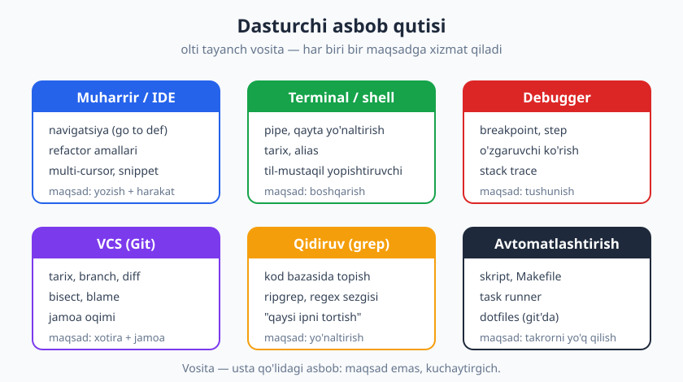
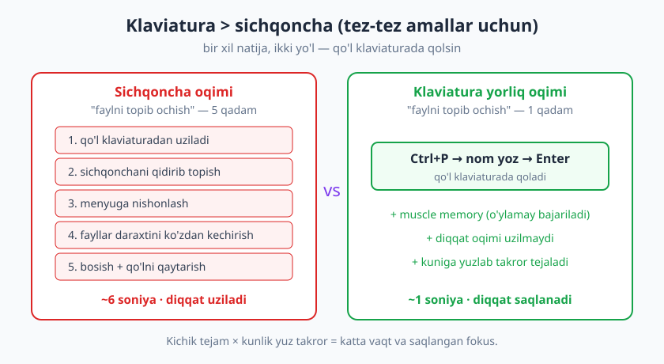
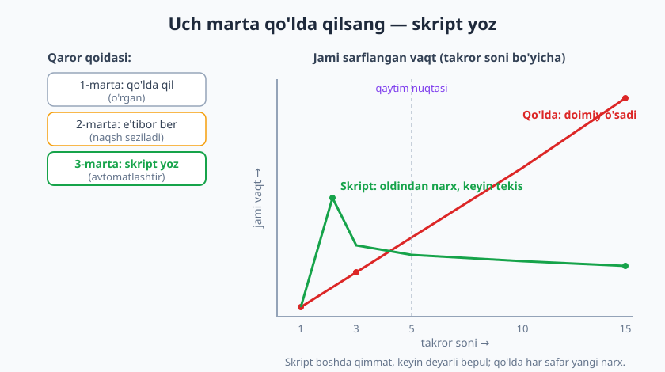

# 20 — Ish muhiti va vositalar ustaligi

[⬅️ Oldingi: 19 — Fikr-mulohaza, mentorlik va mojaro](./19-fikr-mulohaza-mentorlik.md) · [🏠 README](./README.md) · [Keyingi: 21 — Vaqt, diqqat va chuqur ish ➡️](./21-vaqt-diqqat-chuqur-ish.md)

---

> **Bu bobda:** vositalar — usta qo'lidagi asbob. Yaxshi dasturchi asbobini ayblamaydi, lekin o'tkir asbob uning kuchini ko'paytiradi. Bu bobda muharrir/IDE'ni qurolga aylantirishni, klaviaturani sichqonchadan ustun qo'yishni, terminal/shell ustaligini, takrorlanuvchi ishni avtomatlashtirishni (skript, Makefile, task runner), dotfiles bilan muhitni ko'chiriladigan qilishni va AI yordamchilarni ongli ishlatishni o'rganasiz. Maqsad — tezlik emas, balki **diqqatni saqlash**: asbob o'rtangizdan chiqib ketsin.
>
> **Halollik / Eslatma:** bu bobdagi maslahatlar *qonun emas, amaliy yo'l-yo'riq*. Vosita tanlovida "yagona to'g'ri" yo'q — Vim'chi ham, VS Code'chi ham, JetBrains'chi ham ajoyib muhandis bo'ladi. Muhimi qaysi asbob emas, balki **siz uni qanchalik chuqur egallaganingiz**. Va asosiy tuzoq — vositaga berilib ketish (yak-shaving): cheksiz sozlashga sarflagan vaqtingiz hech qachon qaytmasligi mumkin. Bu yerdagi prinsiplar til/IDE-mustaqil: konkret nomlar misol uchun, g'oya esa har qanday muhitda amal qiladi.

---

## Nega vosita — sarmoya, na o'yinchoq, na bahona

Dasturchi kuniga ish soatining katta qismini bir nechta asbob bilan o'tkazadi: muharrir, terminal, brauzer, Git. Bu asboblardan har biri bilan siz minglab marta muomala qilasiz — fayl ochasiz, qidirasiz, almashasiz, ishga tushirasiz. Agar har bir amal bir soniya tez bo'lsa, kuniga yuzlab takror — bu yiliga soatlab tejalgan vaqt. Lekin haqiqiy yutuq vaqt emas: **diqqat**. Asbob bilan kurashganingizda fikringiz masaladan uziladi; asbob o'rtangizdan g'oyib bo'lganda fikr to'xtamaydi.

Shu bilan birga, ikki xato bir xil darajada xavfli:

- **"Yomon usta asbobni ayblaydi."** "Mening IDE'm sekin", "bu terminal noqulay" — ko'pincha bahona. Asboblarni o'rganmagan dasturchi har doim asbobni ayblaydi. Mahorat avval keladi.
- **Yak-shaving** (yak qirqish) — aslida bajarilishi kerak bo'lgan ishni qoldirib, asbobni cheksiz sozlash. "Avval muharrir mavzusini mukammal qilay, keyin masalani yechaman" — bu ish emas, kechiktirish.

To'g'ri munosabat oraliqda: vosita o'rganishni **sarmoya** deb biling. Bir martalik o'rganish keyin har kuni qaytadi. Lekin sarmoya bir martalik bo'lsin — cheksiz emas. Bir bor o'tkirlang, keyin ishlang.

> **Eslatma:** bu bob [21-bob (Vaqt, diqqat va chuqur ish)](./21-vaqt-diqqat-chuqur-ish.md) bilan zich bog'liq. U yerda diqqatni *qanday himoya qilish* haqida; bu yerda esa asbobning o'zi diqqatni qanday saqlashi (yoki o'g'irlashi) haqida.

---

## Dasturchi asbob qutisi

Vositalarni bezak deb emas, **maqsad bo'yicha** ko'ring. Har asbob bir savolga javob beradi. Asbob qutingizdagi olti tayanch:



| Vosita turi | Maqsad (qaysi savolga javob) | Tayanch ko'nikma | Boshqa kitob |
|---|---|---|---|
| **Muharrir / IDE** | Kodni yozish va u bo'ylab harakat | navigatsiya, refactor, multi-cursor | — |
| **Terminal / shell** | Mashinani boshqarish, vositalarni ulash | pipe, tarix, alias, skript | [DevOps](../devops/README.md) |
| **Debugger** | "Nega bunday bo'lyapti?" ni tushunish | breakpoint, step, watch | [04-bob](./04-debugging-tizimli-ovlash.md) |
| **VCS (Git)** | Tarix, jamoa, "qachon buzildi?" | branch, diff, bisect, blame | [Git & GitHub](../git-github/README.md) |
| **Qidiruv (grep)** | Katta kod bazasida topish | regex sezgisi, ripgrep | [03-bob](./03-begona-kodni-oqish.md) |
| **Avtomatlashtirish** | Takrorni yo'q qilish | skript, Makefile, task runner | — |

Bu jadval — yo'l xarita: keyingi olti oyda har bir ustunda bir pog'ona ko'tarilsangiz, unumdorligingiz sezilarli o'sadi. Hammasini birdan emas — bittadan.

---

## 1. Muharrir/IDE'ni qurol qilish

Ko'p dasturchi muharrirni "matn yozadigan oyna" sifatida ishlatadi va uning 90% quvvatidan bexabar qoladi. Muharringizni **o'rganish** — eng yuqori qaytimli sarmoyalardan biri, chunki siz unda har kuni yashaysiz.

Egallash kerak bo'lgan asosiy qobiliyatlar:

- **Navigatsiya.** "Go to definition" (ta'rifga sakrash), "find references" (qayerda ishlatilgan), "symbol search" (loyiha bo'ylab nom qidirish), fayllar orasida tez almashish. Bu — begona kodni o'qishning asosi ([03-bob](./03-begona-kodni-oqish.md)).
- **Refactor amallari.** "Rename symbol" (hamma joyda qayta nomlash), "extract function/variable", "inline". Buni qo'lda qilish — xato manbasi; muharrir buni xavfsiz qiladi ([09-bob](./09-refactoring-kod-hidlari.md)).
- **Multi-cursor va tanlash.** Bir vaqtda ko'p joyni tahrirlash, bir xil so'zni belgilab almashtirish.
- **Integratsiyalangan debugger.** `print` bilan kurashish o'rniga breakpoint qo'yib, o'zgaruvchini ko'rish.
- **Snippet va shablonlar.** Tez-tez yoziladigan naqshlarni qisqa kalit bilan chaqirish.

**❌ Anti-misol — sichqonchaga qaramlik:**

> Funksiya nomini o'zgartirish kerak. Dasturchi har bir faylni qo'lda ochadi, har joyda eski nomni topib, sichqoncha bilan belgilaydi, yangisini yozadi. 14 fayl, 20 daqiqa, va ikki joyni o'tkazib yuboradi — prod buziladi.

**✅ Misol — muharrirni qurol qilish:**

> Kursorni nom ustiga qo'yib "Rename symbol" (mas. `F2`) bosadi, yangi nomni yozadi, Enter. Muharrir 14 faylda 31 joyni bir lahzada, xatosiz almashtiradi. 5 soniya.

Bu farq tasodif emas: muharrir kodni *matn* emas, *tuzilma* (sintaksis daraxti) sifatida tushunadi. Shuning uchun u sizdan ko'ra to'g'riroq almashtiradi.

> **Eslatma:** muharringiz qaysi bo'lishi muhim emas — VS Code, Neovim, JetBrains, Emacs. Muhimi: bittasini tanlang va **chuqur** o'rganing. Har oy yangi muharrirga ko'chish — o'sish emas, yak-shaving. "Eng yaxshi muharrir" — siz pog'onama-pog'ona ustasi bo'lgani.

### Lekin "IDE qulligi"dan qoching

Kuchli IDE shu qadar qulay qiladiki, ba'zi dasturchi tugmasiz hech narsa qila olmay qoladi: testni faqat yashil tugma bilan ishga tushiradi, kodni faqat IDE'dan deploy qiladi, terminalda nima bo'layotganini bilmaydi. Bu — **asbob qulligi**. Server'da IDE yo'q; CI/CD'da yashil tugma yo'q. Asoslarni terminalda ham bilish — sizni mustaqil qiladi: IDE tugmasi ortida aslida qaysi buyruq ishlayotganini tushuning.

---

## 2. Klaviatura > sichqoncha

Tez-tez bajariladigan amal uchun klaviatura yorlig'i sichqonchadan deyarli har doim tezroq. Sabab faqat tezlik emas: sichqonchaga uzatilganda qo'l klaviaturadan uziladi, ko'z ekranda kursor qidiradi, diqqat oqimi sinadi. Klaviatura yorlig'i esa qo'lni joyida qoldiradi va vaqt o'tib **muscle memory** (mushak xotirasi) ga aylanadi — o'ylamay bajariladi.



Amaliy yondashuv: bir vaqtning o'zida hamma yorliqni yodlamang. **Eng tez-tez qilgan 5 amalingizni** kuzating (fayl ochish, qidirish, qatorni ko'chirish, terminalga o'tish, faylni saqlash) va faqat shularning yorlig'ini o'rganing. Ular muscle memory'ga o'tgach, keyingi beshtasini oling. Bir oyda 20 yorliq — sezilarli o'zgarish.

> **Trade-off:** klaviatura ustunligi *tez-tez* amallar uchun. Yiliga bir marta ochiladigan menyu uchun yorliq yodlash — yak-shaving. Va sichqoncha hech qachon yomon emas: diagramma chizish, vizual interfeysni ko'zdan kechirish, notanish menyuni o'rganishda sichqoncha tabiiyroq. Qoida oddiy: **takror = yorliq, kamdan-kam = sichqoncha**.

---

## 3. Terminal / shell ustaligi

Terminal — eng noto'g'ri qo'rqiladigan asbob. Yangi dasturchiga u "qora ekran, xatarli" tuyuladi; aslida u — eng kuchli va eng **ko'chiriladigan** vositangiz. Sababi: terminalda mayda asboblarni bir-biriga ulab, hech bir GUI bera olmaydigan yangi imkoniyat yasaysiz.

Egallash kerak bo'lgan sezgilar:

- **Asosiy buyruqlar.** Fayllarni ko'rish/ko'chirish/o'chirish, papka bo'ylab harakat, jarayonlarni ko'rish. Bularsiz hech qaerga bormaysiz.
- **Pipe (`|`) va qayta yo'naltirish (`>`, `>>`).** Bir buyruq chiqishini ikkinchisining kirishiga ulash — terminalning butun sehri shu. "Loglardagi `ERROR` qatorlarni sanab, eng ko'p uchraganini top" — bir qatorda.
- **Tarix.** Oldingi buyruqni qayta chaqirish (yuqori strelka, `Ctrl+R` bilan qidirish) — bir xil uzun buyruqni qayta yozmaslik.
- **Alias.** Uzun, tez-tez teriladigan buyruqqa qisqa nom berish.

**❌ Anti-misol — har safar qayta yozish:**

```text
git add . && git commit -m "..." && git push origin feature/x
```

Buni kuniga 15 marta qo'lda terish — vaqt va xato manbasi.

**✅ Misol — alias bilan:**

```text
# .bashrc / .zshrc ichida bir marta:
alias gacp='git add . && git commit -m'

# endi kuniga:
gacp "feature: foydalanuvchi profilini qo'shdim"
```

Pipe sezgisiga oddiy misol — logda xatolarni guruhlash:

```text
# "loglardagi xato turlarini eng ko'pdan kamga qarab sana"
cat app.log | grep ERROR | sort | uniq -c | sort -rn | head
```

Bu zanjirning har bo'lagi mayda; birga ulanganda esa kuchli tahlil chiqadi. Aynan shu — terminal falsafasi.

> **Eslatma:** terminal/shell chuqur mavzu (Bash, skript, muhit o'zgaruvchilari) — to'liq qo'llanma [DevOps & Deployment](../devops/README.md) kitobida. Bu bobda gap *odat* haqida: terminalni qo'rqmasdan, kundalik asbob sifatida ishlating.

---

## 4. Avtomatlashtirish — "uch marta qo'lda qilsang, skript yoz"

Toza koddagi DRY prinsipi ("o'zingni takrorlama") faqat kodga emas, **butun ish jarayoniga** tegishli. Agar bir ishni qo'lda qayta-qayta qilayotgan bo'lsangiz — bu kelajakdagi siz uchun xato va zerikish manbasi. Amaliy qoida:

- **1-marta:** qo'lda qiling. Hali naqshni bilmaysiz.
- **2-marta:** e'tibor bering — "buni yana qildim".
- **3-marta:** skript yozing. Endi bu takror, va u o'sib boradi.



Grafikda mantiq: qo'lda ish har takrorda **bir xil** narx oladi — chiziq doimiy yuqoriga. Skript boshda qimmat (yozish vaqti), keyin deyarli bepul — chiziq tekislanadi. Ikki chiziq **qaytim nuqtasi**da kesishadi; undan keyin avtomatlashtirish toza yutuq.

**❌ Anti-misol — abadiy qo'lda:**

> Loyihada test ishga tushirish uchun: virtual muhitni faollashtir, muhit o'zgaruvchilarini eksport qil, bazani migratsiya qil, keyin testni chaqir — to'rt buyruq, har kuni o'nlab marta. Yangi a'zo kelganda buni og'zaki tushuntirishadi, u yarmini unutadi, "menda ishlamayapti" deydi.

**✅ Misol — Makefile / task runner:**

```text
# Makefile
test:
	. venv/bin/activate && \
	export $$(cat .env | xargs) && \
	python manage.py migrate && \
	pytest

# endi hamma uchun bitta buyruq:
make test
```

Bir buyruq — `make test` — to'rt qadamni bekamu-ko'st bajaradi. Foyda nafaqat sizga: yangi a'zo birinchi kuniyoq `make test` deb ishga tushadi, og'zaki ko'rsatma kerak emas. **Avtomatlashtirish — ham vaqt tejash, ham yashirin hujjat.**

Nimalarni avtomatlashtirish arziydi: muhitni sozlash, test/lint ishga tushirish, deploy qadamlari, takroriy ma'lumot tayyorlash, fayl nomlarini ommaviy o'zgartirish. Vositalar: shell skript, Makefile, `npm`/`composer` skriptlari, `just`, yoki tilingizdagi task runner.

> **Trade-off:** har narsani avtomatlashtirish — ham yak-shaving. Yiliga bir marta bajariladigan ishni avtomatlashtirishga bir kun ketkazsangiz, hech qachon qaytmaydi. Avtomatlashtirishning **o'zi** ham qarz bo'lishi mumkin: murakkab, hech kim tushunmaydigan skript — yangi nosozlik manbai. Qoida: takror chastotasi × bir martalik narx > avtomatlashtirish narxi bo'lsagina yozing. Va skriptni oddiy, o'qiladigan qiling — u ham kod.

---

## 5. Dotfiles — muhitni ko'chiriladigan qilish

Oylar davomida muharrir sozlamalari, shell alias'lari, Git konfiguratsiyasi to'planadi — bu sizning shaxsiy ish muhitingiz. Endi mashina almashdi, yoki yangi ishga kirdingiz, yoki noutbuk buzildi. Hammasini noldan qayta sozlash — kunlar. Yechim — **dotfiles**: sozlama fayllaringizni (`.bashrc`, `.gitconfig`, muharrir konfiguratsiyasi) bitta Git repozitoriyasida saqlash.

Foydasi:

- **Tez tiklash.** Yangi mashinada repozitoriyani klonlab, bitta skript bilan butun muhitni qaytarasiz — soatlar emas, daqiqalar.
- **Tarix va orqaga qaytarish.** Sozlamani buzsangiz, Git tarixidan qaytarasiz.
- **Bir nechta mashinada izchillik.** Uy va ish kompyuteri bir xil.
- **Hujjat.** Repozitoriyaning o'zi — "men muhitimni qanday sozlaganman" ning hujjati.

> **Trade-off:** dotfiles ham yak-shaving tuzog'i. Internetda "mukammal dotfiles" larini ko'rib, kunlab sozlash mumkin — buning hech qaysisi ish bitirmaydi. Boshlang'ich: faqat **haqiqatan ishlatadigan** sozlamalarni saqlang. Muhit ko'chiriladigan bo'lsa — yetarli; u "san'at asari" bo'lishi shart emas.

> **Diqqat — maxfiy ma'lumot.** Dotfiles'ni ommaviy repozitoriyaga qo'yganda, ichiga **parol, API kalit, token** tushib qolmasin. Bu eng keng tarqalgan xato. `.env`, kalitlar, mahalliy maxfiy fayllarni `.gitignore`'ga qo'shing — bu [12-bob (Xavfsiz kod)](./12-xavfsiz-kod-asoslari.md) prinsiplarining kundalik amali.

---

## 6. Boshqa o'tkir asboblar (sezgi darajasida)

To'liq o'rganish shart emas, lekin mavjudligini bilib, kerak bo'lganda chaqirish unumdorlikni oshiradi:

- **Kuchli qidiruv (grep / ripgrep).** Katta kod bazasida "bu funksiya qayerda ishlatilgan?" — bir soniyada. Regex sezgisi — superkuch ([03-bob](./03-begona-kodni-oqish.md)).
- **Clipboard menejeri.** Oxirgi nusxalangan bir nechta narsani saqlaydi — "yana nusxalashga qaytish" yo'qoladi.
- **Snippet kengaytmalari.** Tez-tez yoziladigan blok (litsenziya sarlavhasi, test shabloni) bir kalit bilan.
- **Terminal multiplekser (tmux va o'xshashlari).** Bir terminal oynasida bir nechta panel/sessiya; masofaviy serverda uzilgan sessiyani qayta ulash. Server bilan ishlasangiz — bebaho.

Bularni bittadan, ehtiyoj tug'ilganda qo'shing. "Hammasini o'rnatib olay" — yak-shaving; "shu og'riq paydo bo'ldi, uni hal qiladigan asbobni o'rganay" — sarmoya.

---

## 7. AI yordamchi vositalar — kuchaytirgich, na o'rinbosar

Kod assistentlari (AI yordamchilari) so'nggi yillarda kundalik asbobga aylandi: avtotaklif, kod yozish, tushuntirish, test generatsiya. To'g'ri ishlatilganda ular **unumdorlikni jiddiy oshiradi** — qoliplı kodni tez yozadi, notanish API'ni tushuntiradi, "qanday qilsam bo'ladi?" ga boshlang'ich beradi.

Lekin asosiy xavf bitta: **tushunmasdan ishlatish**. AI taklif qilgan kodni o'qimasdan, sinab ko'rmasdan loyihaga qo'shish — bu sizniki bo'lmagan, lekin javobgarligi sizda bo'lgan kod. U xato qilishi, eskirgan yoki xavfsiz bo'lmagan naqsh tavsiya qilishi, o'ylab topilgan API chaqirishi mumkin.

| Yondashuv | ✅ Sog'lom | ❌ Xavfli |
|---|---|---|
| Kod taklifi | o'qiyman, tushunaman, sinayman | o'qimasdan qabul qilaman |
| Mas'uliyat | kod meniki — men javobgar | "AI yozdi, men emas" |
| O'rganish | tushuntirishni o'rganaman | mustaqil fikrlashni unutaman |
| Maxfiylik | maxfiy kodni o'ylab yuboraman | mijoz kodini bemalol joylash |

**✅ Misol:** AI sizga regex tavsiya qildi. Siz uni o'qiysiz, nima qilishini tushunasiz, chegaraviy holatda sinaysiz, keyin qo'shasiz — va endi uni o'zingiz tushuntira olasiz.

**❌ Anti-misol:** AI 60 qatorlik funksiya berdi, siz nusxalab qo'yasiz, ishlayotganga o'xshaydi. Bir oydan keyin u buziladi — siz o'z kodingizni tushunmaysiz, debug qila olmaysiz.

> **Eslatma:** AI yordamida kod yozishning *etik* tomoni — mualliflik, mas'uliyat, mijoz maxfiyligi, litsenziya — alohida muhim mavzu. To'liqroq [27-bob (Etika va mas'uliyat)](./27-etika-masuliyat.md)da. Qoidaning o'zagi: **siz tushunmagan kodga javobgar bo'lolmaysiz** — va sizning ismingiz commit'da turadi.

Bu yangi vositani o'rganish ham [22-bob (O'rganishni o'rganish)](./22-organishni-organish.md) ning bir qismi: yangi asbobni qanday qabul qilish, qachon ishonish, qachon shubhalanishni bilish — kasbiy ko'nikma.

---

## 8. Halollik: vosita — maqsad emas

Bobni ochgan g'oyaga qaytamiz. O'tkir asbob — kuchaytirgich, lekin **ishni asbob emas, siz bajarasiz**. Eng chiroyli sozlangan muhit ham yomon mantiqni yaxshi qilmaydi; eng oddiy muhitda ham ajoyib muhandis ajoyib ish chiqaradi.

Shuning uchun balansni saqlang:

- **Ishlaydigan oddiy sozlama > cheksiz moslash.** "Yetarlicha yaxshi" muhit bilan bugun ish bitiring; mukammallikni keyin, ehtiyoj bo'lganda quvib boring.
- **Asbobni masala ortidan o'rganing,** masala asbob ortidan emas. Yangi yorliq/skript/asbob — biror og'riqqa javob bo'lsin, "men buni o'rganishim kerak" hissi emas.
- **Sarmoya bir martalik, foyda doimiy.** Yorliqni bir bor yodlang, alias'ni bir bor yozing — keyin u har kuni qaytadi.

Senior dasturchining asboblari ko'pincha *kam, lekin chuqur*: u uchta asbobni mukammal biladi, yuztasini yuzaki emas. Sizning maqsadingiz — asbobni shu darajada egallashki, u **ko'rinmas** bo'lib qolsin va siz faqat masalaga e'tibor bera olasiz.

---

## Asosiy g'oyalar (bobni qisqacha)

- **Vosita — sarmoya.** Bir martalik o'rganish keyin har kuni qaytadi; lekin sarmoya bir martalik bo'lsin, **yak-shaving** emas.
- **Muharrirni qurol qiling:** navigatsiya, refactor, multi-cursor, debugger. Bittasini tanlang va chuqur egallang — lekin **IDE qulligi**dan qoching, asoslar terminalda ham bo'lsin.
- **Klaviatura > sichqoncha** tez-tez amallar uchun: tezlik emas, **muscle memory va saqlangan diqqat**. Eng ko'p 5 amalingizdan boshlang.
- **Terminal — eng ko'chiriladigan kuch:** pipe, tarix, alias bilan mayda asboblarni ulang. Chuqur mavzu [DevOps](../devops/README.md)da.
- **"Uch marta qo'lda qilsang — skript yoz."** DRY hayotda ham amal qiladi; lekin kamdan-kam ishni avtomatlashtirish ham yak-shaving.
- **Dotfiles** muhitni ko'chiriladigan qiladi — lekin maxfiy ma'lumotni hech qachon repozitoriyaga qo'ymang.
- **AI yordamchi — kuchaytirgich, o'rinbosar emas:** tushunmasdan ishlatmang, kod sizniki — javobgarlik ham.
- **Asbob — maqsad emas:** ishlaydigan oddiy sozlama cheksiz moslashdan ustun; senior asboblari kam, lekin chuqur.

---

## Mashqlar

### Oson

**1-mashq.** Keyingi ish kuningiz davomida o'zingizni kuzating: sichqoncha bilan bajargan, lekin klaviatura yorlig'i bo'lishi mumkin bo'lgan **5 ta tez-tez amalni** ro'yxat qiling (mas. fayl ochish, qatorni o'chirish, terminalga o'tish). Har biri uchun yorliqni toping va yozib qo'ying.

**2-mashq.** O'zingizning so'nggi haftadagi ishingizni eslang: **uch yoki undan ko'p marta qo'lda takrorlagan** bitta ishni toping (mas. test ishga tushirish, fayllarni qayta nomlash, deploy). Buni qanday avtomatlashtirasiz — qaysi asbob bilan (alias, skript, Makefile)? Bir-ikki jumlada tasvirlang.

**3-mashq.** Quyidagi qo'lda terilgan buyruqqa qisqa **alias** o'ylab toping va u qaerga yoziladi (qaysi faylga):
`git checkout main && git pull && git checkout - && git rebase main`

### O'rta

**4-mashq.** Quyidagi qo'lda ish jarayonini bitta `make` maqsadi (yoki shell skripti) ga aylantiring. Loyihada test ishga tushirish uchun: (1) virtual muhitni faollashtir, (2) bog'liqliklarni o'rnat, (3) linter ishga tushir, (4) testlar. Skriptni yozing.

**5-mashq.** Bir hamkasbingiz: "Men yorliq yodlamayman, sichqoncha menga yetadi, vaqtni behuda sarflashni xohlamayman" deydi. Unga klaviatura yorliqlarining qiymatini **bir misol bilan** (vaqt × takror hisobi) tushuntiruvchi qisqa javob yozing — lekin uni "majburlamasdan".

**6-mashq.** Sizdan dotfiles repozitoriyasi yaratish so'raldi. Unga **qaysi 4 faylni** qo'shasiz va **qaysi 2 narsani hech qachon qo'ymaysiz** (xavfsizlik)? Ro'yxat tuzing va nega ekanini qisqacha izohlang.

### Qiyin

**7-mashq.** Bir dasturchi ikki kun davomida o'z muharririni "mukammal" qilish bilan band: mavzu, rang, plaginlar, animatsiya. Sprint vazifasi esa qotgan. Bu **yak-shaving** ekanini ko'rsating: unga (a) hozir to'xtash uchun, (b) kelajakda muhit sozlashga qancha vaqt ajratish "sog'lom" ekani haqida amaliy maslahat bering. Trade-off'ni ochiq ayting.

**8-mashq.** Quyidagi qo'lda log tahlilini **bir qatorlik terminal zanjiri** (pipe bilan) ga aylantiring: "`app.log` fayldan faqat `ERROR` qatorlarni ol, ularning sabab matnini guruhla, eng ko'p uchragan 5 tasini chiqar". Keyin: bu ishni har kuni qilsangiz, uni qanday avtomatlashtirasiz (alias yoki skript)?

<details markdown="1">
<summary>Yechimlar</summary>

### 1-mashq yechimi

Namuna ro'yxat (yorliqlar muharringizga qarab o'zgaradi — VS Code misolida):

| Amal | Yorliq (misol) |
|---|---|
| Faylni nom bo'yicha ochish | `Ctrl+P` |
| Loyihada matn qidirish | `Ctrl+Shift+F` |
| Qatorni nusxalab pastga | `Shift+Alt+↓` |
| Terminalni ochish/yashirish | `Ctrl+\`` |
| Symbolga sakrash (go to def) | `F12` |

Asosiy fikr: yorliqlarni **kuzatishdan** boshlang, hammasini birdan yodlamang. Beshtasi muscle memory'ga o'tgach, keyingisini oling.

### 2-mashq yechimi

Namuna: "Har kuni `feature` branch'ni `main`'dan yangilab turaman — 3 buyruq, kuniga 5 marta." Avtomatlashtirish: bu ketma-ketlikni **alias** yoki kichik **shell skript**ga aylantiraman (`gsync` kabi). Agar qadamlar shartli/murakkab bo'lsa (xato tekshirish kerak) — skript; oddiy ketma-ketlik bo'lsa — alias. To'g'ri javob bitta emas; muhimi: takrorni aniqladingiz va asbobni mosladingiz.

### 3-mashq yechimi

```text
# .bashrc yoki .zshrc ichiga:
alias gsync='git checkout main && git pull && git checkout - && git rebase main'
```

Endi `gsync` — joriy branch'ni yangilangan `main`'ga rebase qiladi. Eslatma: rebase'ning jamoa oqimiga ta'siri uchun [Git & GitHub](../git-github/README.md) va [14-bob](./14-jamoaviy-kod-oqimi.md)ga qarang.

### 4-mashq yechimi

```text
# Makefile
.PHONY: ci
ci:
	. venv/bin/activate && \
	pip install -r requirements.txt && \
	flake8 . && \
	pytest

# ishlatish:
make ci
```

Foyda: bitta buyruq butun tekshiruvni bajaradi; yangi a'zo birinchi kuni `make ci` deb ishga tushadi, og'zaki ko'rsatma kerak emas. Skript ayni paytda hujjat ham — "loyihani qanday tekshiriladi" yozib qo'yilgan.

### 5-mashq yechimi

Namuna javob (mehribon, majburlamaydigan):

> "To'g'ri, har bir yorliq alohida arzimas. Lekin hisoblab ko'r: fayl ochishni kuniga ~50 marta qilamiz. Sichqoncha bilan ~5 soniya, `Ctrl+P` bilan ~1 soniya — kuniga 200 soniya, yiliga ~14 soat. Va asosiysi vaqt emas: sichqonchaga uzanganda fikr oqimi uziladi. Bittasini sinab ko'r — `Ctrl+P` — bir hafta, yoqmasa tashlab yuborasan. Hammasini birdan yodlash shart emas."

Mezon: vaqt × takror hisobi bor; diqqat argumenti bor; bosim yo'q; bitta kichik qadam taklif qilingan.

### 6-mashq yechimi

**Qo'shaman (namuna):**

1. `.gitconfig` — Git sozlamalari (ism, alias, default branch).
2. `.bashrc` / `.zshrc` — shell alias va sozlamalar.
3. Muharrir sozlamasi (`settings.json` kabi) — tahrirlash muhiti.
4. `.tmux.conf` yoki terminal sozlamasi (agar ishlatsangiz).

**Hech qachon qo'ymayman:**

- **Maxfiy fayllar** — `.env`, API kalitlari, token, SSH maxfiy kalitlari. Bular ommaviy repozitoriyada — jiddiy xavfsizlik buzilishi ([12-bob](./12-xavfsiz-kod-asoslari.md)).
- **Mashina-bog'liq, ko'chmaydigan narsalar** — mutlaq yo'llar, faqat bitta kompyuterga xos sozlamalar (bular muhitni ko'chiriladigan emas, sindiradigan qiladi).

### 7-mashq yechimi

Bu yak-shaving, chunki: asosiy ish (sprint vazifasi) qoldirilib, **bilvosita, qaytimi noaniq** ishga (muhit bezagi) ikki kun ketdi. Mavzu va animatsiya kodni yaxshilamaydi.

(a) **Hozir to'xtash:** "Muhit bezagi ish bitirmaydi. Hozir vazifaga qayt; muhit 'yetarlicha yaxshi' — u bilan bugun ishlay olasan."

(b) **Kelajak uchun sog'lom chegara:** muhit sozlashni **alohida, cheklangan vaqt**ga ajrat — masalan haftada 30 daqiqa yoki faqat real og'riq paydo bo'lganda ("bu amal har kuni meni sekinlashtiryapti — buni tuzatay"). Sozlash masala ortidan kelsin, masala sozlash ortidan emas.

**Trade-off (ochiq):** muhitni umuman sozlamaslik ham xato — yomon sozlangan muhit har kuni vaqt va diqqat o'g'irlaydi. Balans: bir martalik, ehtiyojga asoslangan sozlash = sarmoya; cheksiz, ehtiyojsiz sozlash = yak-shaving.

### 8-mashq yechimi

Bir qatorlik zanjir:

```text
grep ERROR app.log | sort | uniq -c | sort -rn | head -5
```

Bo'laklar: `grep ERROR` — faqat xato qatorlar; `sort` — bir xillarni yonma-yon qo'yadi; `uniq -c` — guruhlab sanaydi; `sort -rn` — sondan kamayuvchi tartib; `head -5` — eng yuqori 5 tasi.

Har kuni qilsangiz — alias yoki skript:

```text
# .bashrc ichida:
alias toperrors='grep ERROR app.log | sort | uniq -c | sort -rn | head -5'
```

Yoki fayl nomini argument qiladigan kichik skript yozib, har qanday log uchun ishlatasiz. Bu — "uch marta qo'lda qilsang, skript yoz" qoidasining to'g'ridan-to'g'ri amali.

</details>

---

[⬅️ Oldingi: 19 — Fikr-mulohaza, mentorlik va mojaro](./19-fikr-mulohaza-mentorlik.md) · [🏠 README](./README.md) · [Keyingi: 21 — Vaqt, diqqat va chuqur ish ➡️](./21-vaqt-diqqat-chuqur-ish.md)
