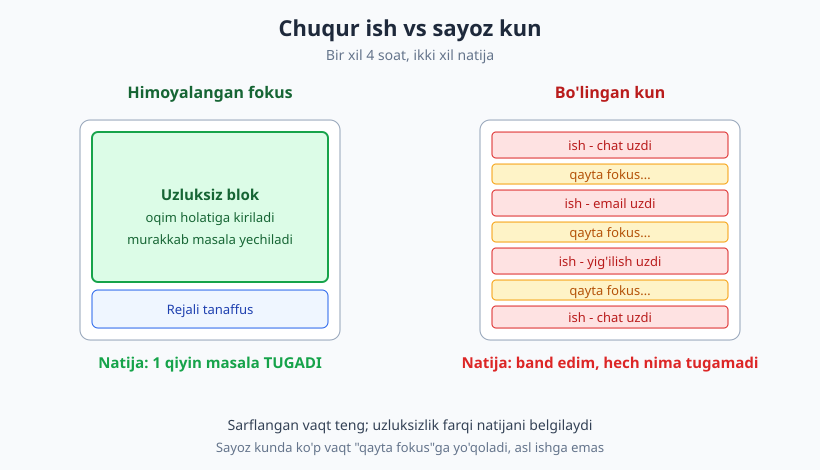
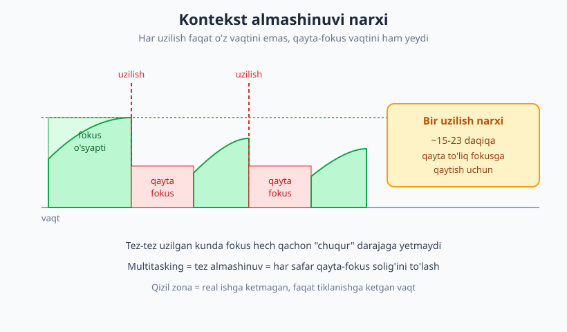
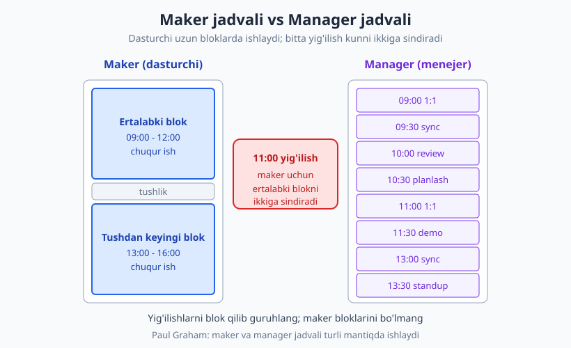

# 21 — Vaqt, diqqat va chuqur ish

[⬅️ Oldingi: 20 — Ish muhiti va vositalar ustaligi](./20-ish-muhiti-vositalar.md) · [🏠 README](./README.md) · [Keyingi: 22 — O'rganishni o'rganish va dolzarb qolish ➡️](./22-organishni-organish.md)

---

> **Bu bobda:** nega dasturlash boshqa ishlardan farqli ravishda **chuqur ish (deep work)** — uzluksiz, bo'linmagan fokus talab qiladi, va "oqim holati" (flow) nima; **kontekst almashinuvi narxi** (bir uzilishdan keyin qayta-fokusga ~15-23 daqiqa ketadi) va ko'p ishni bir vaqtda qilish (multitasking) afsonasi; uzilishlar bilan kurash (bildirishnoma, fokus bloki, async muloqot); **yig'ilishlar** dasturchi kunini qanday parchalaydi (maker vs manager jadvali); amaliy texnikalar (Pomodoro, time-boxing, "eng qiyin ishni ertalab"); vazifa boshqaruvi va "boshlash" inertsiyasini yengish; va eng muhim halol haqiqat — hech kim kuniga 8 soat chuqur ishlay olmaydi. Maqsad: vaqtingizdan emas, **diqqatingizdan** unumli foydalanish.
>
> **Halollik / Eslatma:** bu yerdagi maslahatlar — qonun emas, amaliy yo'l-yo'riq. Unumdorlik **juda shaxsiy va kontekstga bog'liq**: kimdir ertalab, kimdir kechqurun zo'r ishlaydi; office'da ishlayotgan dasturchi uzilishlarni frilanserdek boshqara olmaydi; junior'dan ko'proq javob berish kutiladi, shuning uchun u senior'dek "g'oyib bo'la" olmaydi. Bu yerda keng tarqalgan amaliyot va o'lchamlar bor, lekin raqamlar (15-23 daqiqa, 3-4 soat) — o'rtacha, qonun emas. O'zingizni kuzating va o'zingizga moslang.

---

## Nega dasturlash chuqur ish

Dasturchi vazifasini bajarish uchun bir vaqtning o'zida boshida ko'p narsani ushlab turishi kerak: bu funksiya nimani qaytaradi, u qaysi modulni chaqiradi, qaysi o'zgaruvchi qayerda o'zgaradi, chegaraviy holatlar qanday, butun tizimning mental modeli qanday. Bu — **xotirada qurilgan nozik imorat**. Uni qurish daqiqalar oladi, lekin **bir uzilish uni bir zumda qulatadi**. Mana shuning uchun dasturlash boshqa ko'p ishlardan tubdan farq qiladi.

Kal Newport buni **chuqur ish (deep work)** deb atadi: kognitiv jihatdan og'ir vazifani, chalg'imasdan, to'liq diqqat bilan bajarish holati. Uning aksi — **sayoz ish (shallow work)**: email javoblash, chatga qarash, oddiy ko'chirmalar — uzilib-uzilib qilsa ham bajariladigan, lekin yangi qiymat kam yaratadigan ishlar.

Chuqur ishning eng yuqori nuqtasi — **oqim holati (flow)**: vaqt sezilmay o'tadi, masala "o'zi yechilayotgandek" tuyuladi, siz va kod o'rtasidagi to'siq yo'qoladi. Bu sehr emas — bu uzoq, uzluksiz fokusning natijasi. Va u **mo'rt**: oqimga kirish 15-20 daqiqa oladi, undan chiqarish esa bir bildirishnoma yetarli.

> **Eslatma:** "band bo'lish" va "unumli bo'lish" bir narsa emas. Kuni bo'yi chat'ga javob berib, yig'ilishdan yig'ilishga yugurib, kechqurun "juda charchadim" deyish mumkin — lekin bitta ham qiyin masalani yechmagan bo'lish. Sayoz ish charchatadi, lekin oldinga siljitmaydi. Chuqur ish — kamroq vaqtda ko'proq qiymat.

## Kontekst almashinuvi: ko'rinmas soliq

Aytaylik, siz murakkab bug ustida ishlayapsiz, miyangizda 5 ta fayl va ularning bog'lanishi turibdi. Shu payt chat "ding!" qiladi. Siz "bir soniya"ga qaraysiz, javob berasiz, kodga qaytasiz — va... haligi 5 ta fayl qayerda edi? Qaysi gipotezani sinayotgan edingiz? Imorat quladi, qaytadan qurishingiz kerak.

Bu — **kontekst almashinuvi (context switching)** narxi. Tadqiqotlar (Gloria Mark va boshqalar) ko'rsatishicha, bir uzilishdan keyin asl vazifaga **to'liq** qaytish o'rtacha **15-23 daqiqa** oladi. "Bir soniyalik" qarash aslida chorak soatlik soliq.

Bu yerda **multitasking afsonasi** yashiringan. Inson miyasi haqiqatda parallel ishlamaydi — u **tez almashinadi**. "Bir vaqtda ikki ish qilyapman" aslida "ikki ish o'rtasida sekundlar sayin sakrayapman, va har sakrashda kontekst-soliq to'layapman". Natija: ikkala ish ham sekinroq, ko'proq xato bilan bitadi. Multitasking — unumdorlik emas, unumdorlik **illyuziyasi**.

❌ **Bo'lingan kun (real misol):**

> 09:00 — Bug ustida ishlay boshladim, kontekst yig'ilyapti.
> 09:08 — Chat: "Bir savol bor edi..." → javob berdim (5 daq).
> 09:13 — Kodga qaytdim, "qayerda edim?" → 15 daq qayta-yig'ish.
> 09:25 — Email bildirishnomasi → "tez ko'rib qo'yay" → 7 daq.
> 09:32 — Yana qayta-fokus...
> 11:00 — "Ertalab nima qildim?" — deyarli hech narsa. Charchadim, lekin bug hali ham bor.

✅ **Himoyalangan fokus (xuddi shu odam, boshqa kun):**

> 09:00 — Telefon sokin rejimda, chat "fokusda" statusida, bildirishnomalar o'chiq.
> 09:00–10:30 — Faqat bug. 25-daqiqada oqimga kirdim, gipotezalarni izchil sinadim.
> 10:30 — Bug topildi va tuzatildi. 10 daqiqa tanaffus.
> 10:40 — Chatni ochdim: 4 ta xabar to'planibdi, hammasiga bir o'tirishda javob berdim.

Ikkala kunda ham bir xil ishlar bor edi — bug ham, chatdagi savollar ham. Farq: birinchisi ularni **aralashtirdi** va ikkalasini ham yomon bajardi; ikkinchisi ularni **ajratdi** (batch qildi) va ikkalasini ham yaxshi bajardi.

> **Trade-off:** "doim fokusda, hech kimga javob bermayman" ham noto'g'ri. Jamoa sizga bog'liq bo'lishi mumkin: deploy buzilgan, hamkasb bloklangan, mijoz kutyapti. Hamma narsani 4 soat kechiktirib bo'lmaydi. Yechim — **mutlaq izolatsiya emas, balki rejalashtirilgan o'tkazuvchanlik**: fokus bloklari + ular orasida muloqot oynalari. Va shoshilinch holat uchun jamoada kelishilgan "tez kanal" (mas. telefon = haqiqatan shoshilinch) bo'lsin, qolgan hamma narsa async kutadi.

## Uzilishlar bilan kurash

Uzilishlar ikki xil: **tashqi** (chat, email, hamkasb yelkangizga turtadi, telefon) va **ichki** (o'zingiz "bir narsani googling qilay", "Twitter'ga qaray" deb chalg'iysiz). Ikkalasi ham fokusni buzadi; ikkalasiga ham qarshi usul bor.

Amaliy qadamlar:

- **Bildirishnomalarni o'chiring.** Push, badge, ovoz — hammasi. Telefonni ko'rinmas joyga qo'ying. Kompyuterda "Do Not Disturb" / fokus rejimi. Bildirishnoma — dizayni bo'yicha diqqatni o'g'irlash uchun qurilgan; siz uni o'chirmaguningizcha u sizni boshqaradi.
- **"Fokus vaqti"ni kalendarga bloklang.** Kalendarda 2 soatlik "Deep work" bloki — bu yig'ilish kabi haqiqiy. Boshqalar uni ko'radi va band deb biladi. Bu uzilishni kamaytiradi.
- **Signal bering.** Naushnik (musiqasiz ham) — "men fokusdaman" universal belgisi. Statusni "Fokusda, 11:00 da javob beraman" qiling. Bu odamlarni xafa qilmaydi — aksincha, qachon javob kutishni biladi.
- **Async muloqotga o'ting.** Ko'p savol darhol javob talab qilmaydi. Yozma, thread'li, async muloqot fokusni saqlaydi — buni [17-bob](./17-texnik-kommunikatsiya.md)da batafsil ko'rdik. "Hozir javob ber" o'rniga "qulay paytingda javob ber" madaniyati butun jamoaning chuqur ishini himoya qiladi.
- **Ichki chalg'ishni "keyinroq"ga yozing.** Ish o'rtasida "buni googling qilishim kerak" degan fikr kelsa — uni darrov bajarmang, bir qatorga yozib qo'ying ("keyin ko'rish" ro'yxati) va ishga qayting. Aksariyat "shoshilinch" fikrlar tanaffusgacha kuta oladi.

> **Eslatma:** bildirishnomani o'chirish "ishdan g'oyib bo'lish" emas. Bu — **qachon** muloqot qilishni **siz** tanlash, chat sizni tanlamasligi. Aksariyat jamoada "men har 90 daqiqada chatni tekshiraman" deb ochiq aytsangiz, hech kim xafa bo'lmaydi — chunki ular qachon javob kelishini biladi.

## Yig'ilishlar: maker jadvalini parchalaydi

Paul Graham mashhur "Maker's Schedule, Manager's Schedule" esse'sida muhim farqni ko'rsatdi. **Manager** (menejer) kunini yarim soatlik bo'laklarga bo'ladi — uning ishi aynan odamlar bilan gaplashish, shuning uchun kalendar to'la slotlardan iborat bo'lishi normal. **Maker** (dasturchi, dizayner, yozuvchi) esa **uzun, uzluksiz bloklar**da ishlaydi — chunki uning ishi xotirada katta imorat qurishni talab qiladi.

Muammo shu yerda: **bitta yig'ilish maker kunini ikkiga sindiradi.** Menejer uchun soat 14:00 dagi yig'ilish — kalendardagi bitta slot, atrofida ish davom etadi. Maker uchun esa o'sha 14:00 dagi yig'ilish butun tushdan keyingi blokni ikki yarim-blokga bo'ladi: oldidan "yig'ilishgacha katta narsa boshlamayman" deb kutadi, keyin esa yangidan kontekst yig'ishi kerak. Bir yarim soatlik yig'ilish aslida butun yarim kunni "o'ldiradi".

Bu — yig'ilish yomon degani emas. Bu — yig'ilishlarni **qanday joylashtirish** muhim degani:

| Yondashuv | Maker uchun ta'sir |
|---|---|
| Yig'ilishlar kun bo'ylab sochilgan (10:00, 13:00, 15:30) | Kun 4 ta mayda bo'lakka bo'linadi — hech biri chuqur ish uchun yetarli emas |
| Yig'ilishlar bloklab guruhlangan (hammasi 13:00–15:00) | Ertalab to'liq fokus, tushdan keyin muloqot — ikkalasi ham ishlaydi |
| "Yig'ilishsiz kun/yarim kun" kelishuvi | Haftada kafolatlangan chuqur ish vaqti |

Amaliy choralar: kerakmas yig'ilishni hurmat bilan rad eting ("Bu yozma yangilanish bilan hal bo'larmidi? Kerak bo'lsa qo'shing"); yig'ilishlarni kunning bir qismiga blok qilishni so'rang; agenda yo'q yig'ilishga bormang. [17-bob](./17-texnik-kommunikatsiya.md)da "yig'ilish kerakmi?" savolini ko'rganmiz — bu savol vaqt boshqaruvining ham markazi.

> **Trade-off:** har doim "yig'ilishni rad et" deb bo'lmaydi. Junior sifatida, yangi jamoada, yoki onboarding paytida — yig'ilish va muloqot **ko'proq** kerak: siz hali kontekstni yig'yapsiz, savollar ko'p, munosabat qurilyapti. "Maker jadvalini himoya qilish" senior'roq, kontekstni o'zlashtirilgan bosqichda kuchliroq ishlaydi. Halol baho: men yig'ilishdan qochyapmanmi, yoki haqiqatan u keraksizmi?

## Amaliy texnikalar

Texnika — sehrli tugma emas, balki **fokusni boshlash va ushlash uchun iskala**. Quyidagilarni sinab, o'zingizga mosini tanlang:

| Texnika | Nima | Qachon foydali | Cheklov |
|---|---|---|---|
| **Pomodoro** | 25 daq ish + 5 daq tanaffus sikllari | Boshlash qiyin bo'lganda, prokrastinatsiyaga qarshi | Chuqur oqimni 25 daqiqada uzishi mumkin — uzunroq sikl (50/10) ko'pchilikka mosroq |
| **Time-boxing** | Vazifaga aniq vaqt oynasi ajratish ("10:00–12:00 = shu masala") | Tarqoq kunni tartibga solishda; perfeksionizmni cheklashda | Ijodiy/noaniq ishda vaqtni aniq belgilash qiyin |
| **Eat the frog** | Eng qiyin/eng muhim ishni ertalab, toza miya bilan | Eng og'ir masala uchun eng yaxshi kognitiv resurs | Hamma "eng yaxshi" payti ertalab emas — o'zingizni biling |
| **Energiya menejmenti** | Vaqtni emas, energiyani boshqarish; og'ir ishni yuqori-energiya soatiga | Tabiiy ritmingizni hisobga olganda | Doimiy jadvalga ega ish'da moslash qiyin |

**"Eng qiyin masalani toza miya bilan" — eng kuchli qoida.** Kunning birinchi soatlari (ko'pchilik uchun) kognitiv jihatdan eng o'tkir. Aynan shu vaqtni eng og'ir masala (yangi arxitektura, qiyin bug, murakkab algoritm) uchun saqlang. Email va chat — energiya past bo'lgan tushdan keyingi soatlarga. Eng yomon naqsh: ertalabki o'tkir miyani email'ga "isinish" deb sarflab, qiyin masalaga charchaganda kirishish.

Va eng nozik tushuncha: gap **vaqtni** boshqarishda emas, **energiyani** boshqarishda. Sizda 8 soat bor — lekin ularning hammasi teng emas. Bir soat yuqori-energiya = uch soat charchagan-energiya. Shuning uchun savol "qancha vaqtim bor?" emas, "qaysi vaqtda qanday energiyam bor va og'ir ishni qaysiga qo'yaman?".

## Vazifa boshqaruvi va "boshlash" inertsiyasi

Fokus bloki bor, lekin nimadan boshlashni bilmasangiz — vaqt baribir yo'qoladi. Shuning uchun fokusning yarmi — **nima ustida ishlashni oldindan aniq qilish**.

- **Ro'yxat tuting (boshdan tashqarida).** Yodda saqlangan har bir "qilish kerak" fonda energiya yeydi (bu — **Zeigarnik effekti**: tugallanmagan ish miyada osilib turadi va diqqatni torttiradi). Hammasini bir joyga yozsangiz, miya "men buni unutmayman" deb tinchlanadi va joriy ishga to'liq beriladi.
- **Katta vazifani kichik qadamlarga bo'ling.** "Auth tizimini yozish" — qo'rqinchli, boshlash qiyin. "Login form HTML'ini yozish" — aniq, 20 daqiqalik, darrov boshlanadi. Muammoni bo'laklash — [02-bob](./02-muammoni-yechish-sanati.md)ning markaziy g'oyasi; u faqat yechim emas, **boshlash** uchun ham vosita.
- **"Boshlash" inertsiyasini yenging.** Eng og'ir qadam — birinchisi. Hiyla: o'zingizga "atigi 5 daqiqa ishlayman" deng. Ko'pincha 5 daqiqadan keyin allaqachon oqimda bo'lasiz va davom etasiz. Harakatga kelgan jism harakatda qoladi.
- **Tugallanmagan ishni "parkga qo'ying".** Blokni tugatayotganda keyingi qadamni yozib qo'ying ("Ertaga: `parseToken` ga test yozish"). Bu ertangi boshlashni osonlashtiradi — bo'sh sahifaga emas, aniq qadamga qaytasiz.

❌ **Noaniq ro'yxat:** "Loyihani tugatish" — qaerdan boshlashni bilmaysiz, ko'zda chayqaladi, prokrastinatsiya qilasiz.

✅ **Bo'laklangan ro'yxat:**
> - [ ] Login endpoint'iga validatsiya qo'shish
> - [ ] Token muddati tugashini test bilan tekshirish
> - [ ] Xato xabarini foydalanuvchi tiliga moslash

Har bir element — aniq, kichik, "boshlanadigan". Birinchisidan boshlaysiz, inertsiya yengiladi, qolganlari ergashadi.

## Halol haqiqat: hech kim 8 soat chuqur ishlay olmaydi

Eng muhim halol gap shu, va uni kam aytishadi: **hech bir inson kuniga 8 soat chuqur ishlay olmaydi.** Chuqur, sifatli fokus — **kuniga real 3-4 soat**, ko'pi bilan. Qolgan ish vaqti — sayoz ish (email, yig'ilish, muloqot), tanaffus va tabiiy quvvat pasayishi. Bu — kamchilik emas, **biologiya**. Sportchi kuniga 8 soat to'liq quvvatda yugura olmaganidek.

Bundan ikkita muhim xulosa:

1. **Unumdorlik teatridan qoching.** Soatlab stolda o'tirish, kech qolish, "band ko'rinish" — bu *teatr*, ish emas. Real qiymat 3-4 soat chuqur ishda yaratiladi; qolgan vaqtni uni **himoya qilish va to'ldirish**ga sarflang, soxta bandlikka emas. "Ko'p soat = ko'p ish" tenglamasi dasturlashda yolg'on.

2. **Tanaffus — ishning bir qismi, dushmani emas.** Yurish, choy, ko'zni ekrandan uzish — bular vaqt isrofi emas. Miya tanaffusda fonda ishlashda davom etadi (shuning uchun ko'p yechim dush ostida yoki sayrda keladi). Tanaffussiz uzluksiz "ishlash" — fokusni emas, charchoqni oshiradi.

Surunkali band-lik — chuqur ish emas, uning **aksi**. Doimiy "vaqtim yo'q", har doim shoshilinch, hech qachon to'xtamaslik — bu unumdorlik emas, bu **charchashga (burnout) tushadigan yo'l**. Sog'lom ritm: intensiv fokus → haqiqiy tanaffus → fokus, va kun oxirida **to'xtash**. Barqaror karyera bu ritmga bog'liq — chuqurroq [28-bob](./28-barqaror-karyera-burnout.md)da.

> **Trade-off:** "kuniga 3-4 soat chuqur ish" — o'rtacha, kafolat emas. Deadline yaqin, incident bor, yoki kamdan-kam intensiv davr (release oldi)da odamlar vaqtincha ko'proq ishlaydi — bu normal. Muammo — bu **istisno emas, norma** bo'lib qolganda. Qisqa sprintda chidaysiz; doimiy "sprint" — burnout retsepti. Halol o'zingizga savol: bu vaqtinchami yoki men shunday yashayapmanmi?

---

## Asosiy g'oyalar (bobni qisqacha)

- **Dasturlash — chuqur ish:** xotirada nozik mental imorat quriladi; uzluksiz fokus va **oqim holati** unga zarur, bir uzilish esa uni quladi.
- **Kontekst almashinuvi qimmat:** bir uzilishdan keyin to'liq qaytish ~15-23 daqiqa oladi. **Multitasking afsona** — miya parallel emas, tez almashinadi va har safar soliq to'laydi.
- **Uzilishlarni boshqaring:** bildirishnomalarni o'chiring, kalendarga **fokus bloki** qo'ying, signal bering (status/naushnik), **async muloqot**ga o'ting ([17-bob](./17-texnik-kommunikatsiya.md)), ichki chalg'ishni "keyinroq"ga yozing.
- **Yig'ilish maker kunini parchalaydi** (maker vs manager jadvali): yig'ilishlarni **blok qilib guruhlang**, kerakmasini rad eting, agendasizga bormang.
- **Texnikalar — iskala:** Pomodoro/time-boxing, eng qiyin ishni **ertalab toza miya bilan** ("eat the frog"); gap vaqtni emas, **energiyani** boshqarishda.
- **Boshlashni osonlashtiring:** ro'yxat (boshdan tashqari — **Zeigarnik**), katta ishni **kichik qadamlarga** bo'lish ([02-bob](./02-muammoni-yechish-sanati.md)), "5 daqiqa" hiylasi bilan inertsiyani yengish.
- **Halol haqiqat:** hech kim 8 soat chuqur ishlay olmaydi (real ~3-4 soat); **unumdorlik teatridan** qoching, **tanaffus — ish qismi**; surunkali band-lik chuqur ish emas, burnout yo'li ([28-bob](./28-barqaror-karyera-burnout.md)).

---

## Mashqlar

### Oson

**1-mashq.** Bugungi (yoki kechagi) ish kuningizni tahlil qiling. Qog'ozga yozing: necha marta uzildingiz (chat, email, hamkasb, telefon, o'zingiz chalg'idingiz)? Taxminan **chuqur ish** necha soat bo'ldi, **sayoz ish** va uzilishlar necha soat? Bitta xulosa chiqaring.

**2-mashq.** Hozir kompyuteringiz va telefoningizdagi bildirishnomalarni sanang: qaysilari haqiqatan zarur, qaysilari shunchaki diqqat o'g'irlaydi? Kamida 3 ta keraksiz bildirishnomani o'chiring va nima o'chirganingizni yozing.

**3-mashq.** Quyidagi vazifa "boshlash qiyin", chunki juda katta va noaniq. Uni 4-5 ta aniq, kichik, "darrov boshlanadigan" qadamga bo'ling:
> "Foydalanuvchi profili sahifasini qo'shish."

### O'rta

**4-mashq.** Ertangi kuningiz uchun **fokus rejasi** tuzing: (a) eng qiyin/eng muhim bitta vazifani aniqlang, (b) uni kunning qaysi vaqtiga (qaysi energiya darajangizga) qo'yasiz, (c) qancha uzunlikdagi fokus bloki ajratasiz, (d) uzilishlarni qanday kamaytirasiz (aniq qadamlar). Refleksiv mashq — yagona to'g'ri javob yo'q.

**5-mashq.** Sizning kalendaringizda yig'ilishlar kun bo'ylab sochilgan: 09:30, 11:00, 13:30, 15:00 — har biri 30 daqiqa. Bu maker jadvalingizni qanday parchalayotganini tushuntiring (necha soatlik chuqur blok qoldi?), va menejeringizga yig'ilishlarni qayta joylashtirish bo'yicha hurmatli taklif yozing.

**6-mashq.** Bir hafta davomida o'zingizni kuzating: kunning qaysi soatlarida eng o'tkir/energiyali, qaysi soatlarida bo'shashgan bo'lasiz? Shu asosda "ideal kun shabloni" tuzing — qaysi soatga chuqur ish, qaysiga sayoz ish (email/yig'ilish/muloqot)ni joylaysiz?

### Qiyin

**7-mashq.** Quyidagi "unumdor" kunni tahlil qiling va muammolarni aniqlang. Keyin uni qayta loyihalang (chuqur ish himoyalangan, energiya to'g'ri ishlatilgan versiya):
> 09:00 email + chatni "tozalash" (eng o'tkir miya), 10:00 yig'ilish, 10:30 qiyin bug'ga kirishish, 10:45 chat uzdi, 11:00 yig'ilish, 11:30 yana bug, 12:00 tushlik, 13:00 yig'ilish, 14:00 nihoyat fokus (charchagan), 16:00 "hech narsa ulgurmadim" — kech qolib ishlash.

**8-mashq.** Jamoangizda "doimo onlayn bo'lish" madaniyati bor: chatga 5 daqiqada javob bermasangiz, "qayoqqa ketding?" deyishadi. Bu butun jamoaning chuqur ishini buzyapti. Jamoaga (yoki rahbarga) **async muloqot va fokus vaqtini himoya qilish** madaniyatini taklif qiluvchi qisqa yozma taklif tayyorlang: muammo, taklif, **muqobil**, va jamoa uchun foyda. Eslatma: bu trade-off'larni baholash haqida — kontekstga (mas. shoshilinch holatlar) e'tibor bering.

Yechimlar

### 1-mashq yechimi
Bu — refleksiv mashq; "to'g'ri javob" yo'q, lekin yaxshi tahlil quyidagicha ko'rinadi:
> "Kecha taxminan 14 marta uzildim (asosan chat va o'zim Twitter'ga qarab). Chuqur ish: bor-yo'g'i ~2 soat, va u ham bo'lak-bo'lak edi. Sayoz ish + uzilish: ~5 soat. Xulosa: men 'band' edim, lekin asosiy masala (refactoring) deyarli siljimadi. Eng katta o'g'ri — chatni doim ochiq tutganim."

Mezon: uzilishlarni sanadingiz ✅, chuqur/sayoz vaqtni baholadingiz ✅, bitta amaliy xulosa chiqardingiz ✅. Maqsad — band-lik va unumdorlik farqini o'zingizda ko'rish.

### 2-mashq yechimi
Namuna:
> **Zarur:** kalendar (yig'ilish 5 daqiqa oldin), to'g'ridan-to'g'ri xabar (DM) — lekin u ham faqat ish soatida.
> **O'chirdim:** (1) email har xat kelganda push — endi kuniga 2 marta o'zim tekshiraman; (2) ijtimoiy tarmoq badge'lari; (3) "kimdir like bosdi" tipidagi hamma bildirishnoma; (4) guruh chatining har xabari (faqat @mention'da bildirsin).

Mezon: zarur/keraksizni ajratdingiz ✅, kamida 3 tasini o'chirdingiz ✅. Asosiy g'oya: bildirishnoma — default'da **siz** boshqarishingiz kerak bo'lgan narsa, u sizni emas.

### 3-mashq yechimi
Namuna bo'laklash:
> - [ ] Profil sahifasi uchun route/URL qo'shish (bo'sh sahifa render bo'lsin)
> - [ ] Backend'dan foydalanuvchi ma'lumotini oladigan endpoint chaqiruvini yozish
> - [ ] Ma'lumotni sahifada ko'rsatish (ism, rasm, email)
> - [ ] "Ma'lumot yuklanmoqda" va "xato" holatlarini qo'shish
> - [ ] Profilni tahrirlash tugmasini qo'shish (keyingi qadam uchun zaxira)

Mezon: har qadam aniq va kichik ✅, birinchisi "darrov boshlanadigan" ✅. Diqqat: "Profil sahifasi qo'shish" — qo'rqinchli; "Bo'sh route qo'shish" — 10 daqiqalik, inertsiyani yengadi. Bog'liq: [02-bob](./02-muammoni-yechish-sanati.md).

### 4-mashq yechimi
Namuna fokus rejasi:
> (a) **Eng qiyin vazifa:** yangi to'lov oqimi logikasini yozish (murakkab, diqqat talab qiladi).
> (b) **Qachon:** 09:00–11:00 — men ertalab eng o'tkirman.
> (c) **Blok uzunligi:** 2 soatlik blok, o'rtasida 10 daqiqa tanaffus (50/10 ritm).
> (d) **Uzilishlarni kamaytirish:** telefon boshqa xonada, chat "fokusda 11:00 gacha" statusi, kalendarda "Deep work" bloki, email/yig'ilishni 13:00 dan keyinga surdim.

Mezon: bitta eng muhim vazifa tanlandi ✅, energiya darajasiga moslandi ✅, blok uzunligi aniq ✅, uzilishni kamaytirish qadamlar aniq ✅.

### 5-mashq yechimi
- **Parchalanish tahlili:** yig'ilishlar 09:30 / 11:00 / 13:30 / 15:00 da. Bu kunni shunday bo'laklarga bo'ladi: 09:00–09:30 (juda qisqa), 10:00–11:00 (~50 daq, lekin yig'ilishlar orasida tor), 11:30–13:00 (tushlik bilan kesilgan), 14:00–15:00, 15:30–oxir. **Hech bir blok 2 soatlik uzluksiz chuqur ish uchun yetarli emas** — har biri keyingi yig'ilish "soyasi"da.
- **Hurmatli taklif (namuna):** "Salom! Bir taklifim bor. Yig'ilishlarimiz kun bo'ylab sochilgani uchun chuqur ishga uzun blok qolmayapti. Iloji bo'lsa, ularni bir vaqtga (mas. 13:00–15:00 oralig'iga) guruhlay olamizmi? Shunda ertalab hammaga to'liq fokus blok qoladi, yig'ilishlar ham bir o'tirishda bo'ladi. Muqobil sifatida — haftada 'yig'ilishsiz ertalab' belgilashimiz mumkin. Sizningcha qaysi biri qulay?"

Mezon: parchalanishni miqdoriy tushuntirdingiz ✅, hurmatli + muqobilli taklif ✅. Bog'liq: maker vs manager jadvali, [17-bob](./17-texnik-kommunikatsiya.md).

### 6-mashq yechimi
Bu — shaxsiy kuzatuv mashqi; namuna natija:
> "Bir hafta kuzatdim: eng o'tkir vaqtim 09:00–11:30. Tushdan keyin 13:00–14:00 o'rtacha, 14:00–15:30 'tushlik cho'kishi' (past), 15:30 dan keyin yana biroz ko'tariladi.
> **Ideal kun shabloni:** 09:00–11:30 = chuqur ish (eng qiyin masala). 11:30–12:30 = sayoz (email, code review). 13:00–15:00 = yig'ilish/muloqot (past energiya, lekin sotsial). 15:30–17:00 = o'rta-qiyin ish yoki o'rganish."

Mezon: shaxsiy energiya ritmingizni aniqladingiz ✅, og'ir ishni yuqori-energiyaga, sayozni past-energiyaga moslab shablon tuzdingiz ✅. Asosiy g'oya — energiya menejmenti, vaqt menejmenti emas.

### 7-mashq yechimi
**Muammolar:**
- Eng o'tkir ertalabki miya **email/chatga** (sayoz ish) sarflangan.
- Qiyin bug'ga uzilib-uzilib, yig'ilishlar orasidagi mayda bo'laklarda kirishilgan — har safar qayta-fokus solig'i.
- Yagona haqiqiy fokus (14:00) **charchagan** payt boshlangan.
- Natija: kech qolib ishlash — bu unumdorlik teatri va burnout yo'li.

**Qayta loyihalangan kun (namuna):**
> 09:00–11:00 — qiyin bug, to'liq fokus (eng o'tkir miya, "eat the frog"). Bildirishnomalar o'chiq.
> 11:00–11:15 — tanaffus.
> 11:15–12:00 — email + chatni bir o'tirishda tozalash (sayoz ish, kamroq energiya kerak).
> 12:00–13:00 — tushlik + haqiqiy uzilish (ekran emas).
> 13:00–14:30 — yig'ilishlar **bloklab guruhlangan** (ikkalasi ketma-ket).
> 14:30–16:00 — o'rta-qiyin ish yoki bugni yakunlash, code review.
> 16:00 — **to'xtash.** Kech qolish yo'q.

Mezon: muammolarni aniqladingiz (o'tkir miya sayozga sarflangan, bug bo'lingan, fokus charchaganda) ✅; qayta loyihada chuqur ish ertalab himoyalangan ✅, yig'ilishlar bloklangan ✅, kun oxirida to'xtash bor ✅.

### 8-mashq yechimi
Bu — namuna; yagona to'g'ri javob yo'q (jamoa madaniyatiga bog'liq):
> "Salom jamoa! Bir taklif. Hozir chatga darhol javob berish kutilgani uchun hech kimda uzun fokus bloki qolmayapti — har 5-10 daqiqada uzilamiz, va bu chuqur ishni (bug, dizayn, murakkab feature) sekinlashtiryapti. Taklif: chatni **async** deb kelishaylik — javob 1-2 soat ichida kelsa normal, darhol shart emas. Har kim 'fokusda' statusi qo'ysa, uni hurmat qilaylik. **Muqobil:** har kim kuniga aniq 'muloqot oynalari'ni e'lon qilsin (mas. men 11:00 va 16:00 da chatni tekshiraman). **Shoshilinch holat uchun** alohida kelishuv: haqiqatan zudlik bo'lsa — qo'ng'iroq/telefon, va bu kamdan-kam bo'lsin. **Foyda:** hammaga uzun fokus, kamroq xato, kamroq charchoq — javob baribir o'sha kuni keladi. Sinab ko'ramizmi, bir hafta?"

Mezon: muammo aniq ✅, aniq taklif (async norma) ✅, muqobil ko'rsatilgan (muloqot oynalari) ✅, jamoa foydasi tilida ✅, **shoshilinch holat trade-off'i hisobga olingan** ✅. Trade-off ongi: ba'zi rol (support, on-call, incident) tezkor javob talab qiladi — yechim hammaga emas, kontekstga moslangan bo'lsin. Bog'liq: [17-bob](./17-texnik-kommunikatsiya.md), [28-bob](./28-barqaror-karyera-burnout.md).

---

[⬅️ Oldingi: 20 — Ish muhiti va vositalar ustaligi](./20-ish-muhiti-vositalar.md) · [🏠 README](./README.md) · [Keyingi: 22 — O'rganishni o'rganish va dolzarb qolish ➡️](./22-organishni-organish.md)
