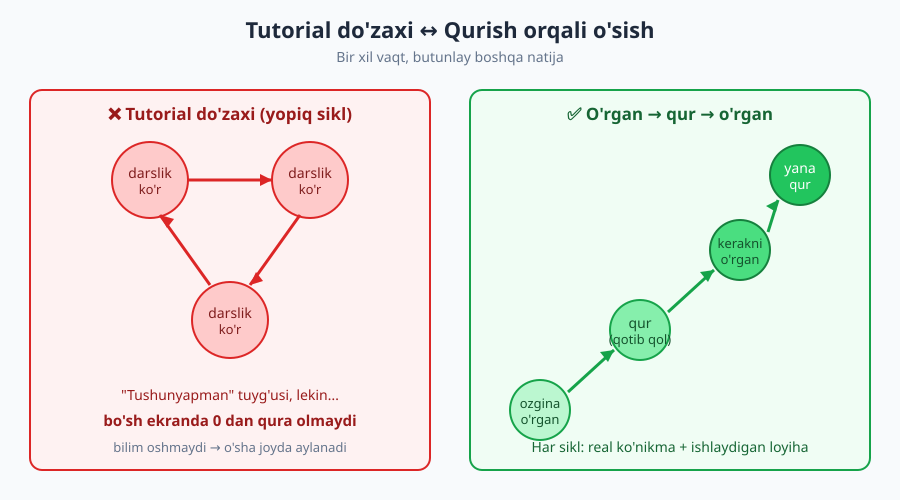
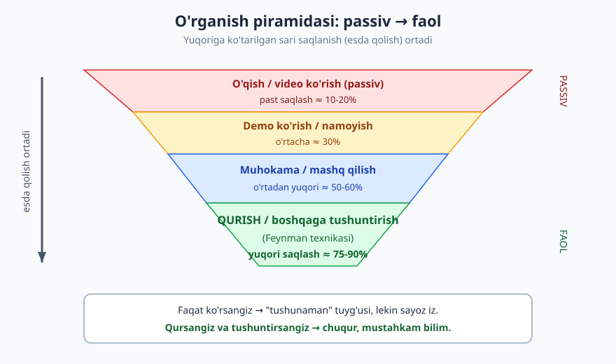
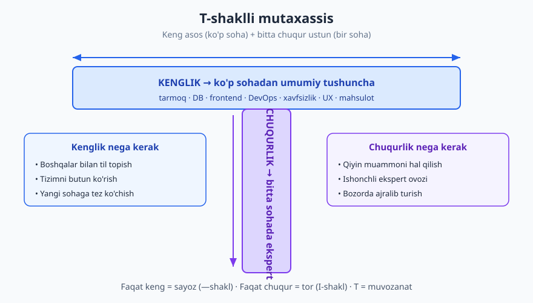

# 22 — O'rganishni o'rganish va dolzarb qolish

[⬅️ Oldingi: 21 — Vaqt, diqqat va chuqur ish](./21-vaqt-diqqat-chuqur-ish.md) · [🏠 README](./README.md) · [Keyingi: 23 — Dasturchi karyera narvoni: junior'dan senior'gacha ➡️](./23-karyera-narvoni.md)

---

> **Bu bobda:** dasturlash — umrbod o'rganish kasbi. Texnologiya tez o'zgaradi, lekin fundamentlar sekin. Shuning uchun eng kuchli ko'nikma — *o'rganishni o'rganish*. Bu bobda "tutorial do'zaxi"dan chiqishni (qurish orqali o'rganish), **faol vs passiv** o'rganishni (Feynman texnikasi, intervalli takror), **fundamental vs trend**ni ajratishni, **T-shaklli mutaxassis** bo'lishni, FOMO va charchashga qarshi "o'rganish byudjeti"ni, hamda "kerak bo'lganda o'rganish" (just-in-time) strategiyasini o'rganasiz.
>
> **Halollik / Eslatma:** bu bobdagi maslahatlar *qonun emas, amaliy yo'l-yo'riq*. O'rganish uslubi shaxsga, sohaga va karyera bosqichiga kuchli bog'liq: junior uchun keng asos qurish to'g'ri bo'lsa, senior uchun chuqurroq ixtisos to'g'ri bo'lishi mumkin. Bu yerda berilgan "saqlash foizlari" va texnikalar — keng tajriba va o'rganish ilmidan olingan *sezgi*, aniq ilmiy formula emas. Asosiy g'oya bir xil qoladi: **passiv iste'mol yetarli emas — qurish, yozish va tushuntirish kerak.**

---

## Nega bu bob — kasb bo'yi maktab

Tasavvur qiling: 2010-yilda eng yaxshi frontend dasturchi jQuery'ni mukammal bilardi. Bugun jQuery deyarli yo'qoldi — React, Vue, Svelte keldi va ketmoqda. Backend'da PHP yakka hukmron edi; keyin Node.js, Go, Rust qo'shildi. Mobil: Objective-C → Swift, Java → Kotlin, endi Flutter va React Native. Agar siz faqat *bitta vositani* o'rgangan bo'lsangiz va u eskirsa — siz ham eskirasiz.

Lekin shu 15 yil ichida **o'zgarmagan** narsalar bor: HTTP qanday ishlaydi, ma'lumotlar strukturasi (massiv, hash, daraxt), algoritm murakkabligi, toza kod tamoyillari, tarmoq, ma'lumotlar bazasi asoslari. Yangi freymvork shularning ustiga qurilgan qatlam, xolos.

Mana bu yerda kasbning haqiqati: **dasturlash — bir marta o'rganib, umrbod ishlaydigan kasb emas. Bu — umrbod o'rganish kasbi.** Bu sizni charchatishi mumkin ("yana yangi narsa?!"), yoki ozod qilishi mumkin ("men har doim o'sa olaman"). Farq — *qanday* o'rganishingizda. Aynan shu sababli eng muhim ko'nikma — biror til yoki freymvork emas, balki **o'rganishni o'rganish (learning how to learn)**.

> **Eslatma:** bu bob [03-bob (Begona kodni o'qish)](./03-begona-kodni-oqish.md) bilan zich bog'liq — kod o'qish o'rganishning eng kuchli, lekin eng kam ishlatiladigan usuli. [19-bob (Mentorlik)](./19-fikr-mulohaza-mentorlik.md) — boshqalardan o'rganish; [21-bob (Chuqur ish)](./21-vaqt-diqqat-chuqur-ish.md) — o'rganish uchun fokus; [28-bob (Burnout)](./28-barqaror-karyera-burnout.md) — charchamasdan dolzarb qolish.

---

## 1. "Tutorial do'zaxi" — eng keng tarqalgan tuzoq

**Tutorial do'zaxi (tutorial hell)** — bu holat: siz cheksiz darslik ko'rasiz, kurs ortidan kurs tugatasiz, har bir videoni boshdan-oxir tomosha qilasiz — va "tushunyapman" tuyg'usini olasiz. Lekin bo'sh ekran ochib, noldan biror narsa qurmoqchi bo'lganingizda — qotib qolasiz. Bilim bormi? Yo'q. Faqat *tanishlik* (familiarity) tuyg'usi bor.

Bu nega shunday? Chunki video ko'rish — **passiv**. Instruktor muammoni o'zi yechadi, siz faqat kuzatasiz. Bu xuddi futbol o'yinini televizorda ko'rib, "endi men ham o'ynay olaman" deganga o'xshaydi. Tomosha qilish bilan qilish o'rtasida jarlik bor.

### Anti-misol vs misol

**❌ Tutorial do'zaxi (passiv iste'mol):**
> Aziz "Veb-dasturchi bo'lish" niyatida. U HTML kursini ko'rdi (8 soat), CSS kursini ko'rdi (10 soat), JavaScript kursini ko'rdi (20 soat), React kursini ko'rdi (15 soat), keyin "to'liq stack" kursini boshladi. Olti oydan keyin uning GitHub'i bo'sh. "Hammasini bilaman, lekin nima qurishni bilmayman" deydi. Yangi kurs ochib, yana boshlaydi — bu sikldan chiqolmaydi.

**✅ Qurish orqali o'rganish (project-based):**
> Bobur ham "veb-dasturchi" bo'lmoqchi. U HTML/CSS asoslarini 3 kun o'rgandi (ozgina!), keyin **darrov** o'z portfolio sahifasini qurdi. Qotib qolganda — aynan o'sha muammoni Google qildi ("CSS markazga qanday qo'yish"). Sahifa tayyor bo'lgach, JavaScript'ning faqat kerakli qismini o'rgandi va sahifaga interaktiv forma qo'shdi. Olti oydan keyin uning GitHub'ida 5 ta kichik, lekin **ishlaydigan** loyiha bor. U "hammasini" bilmaydi — lekin u *qura oladi*, va kerak bo'lganda qolganini o'rganadi.

Farqni ko'rdingizmi? Aziz bilimni **to'plashga** urindi; Bobur bilimni **ishlatib** o'rgandi. Davo bitta: **"ozgina o'rgan, ko'p qur" (learn a little, build a lot).** Tutorialni butunlay tashlamang — lekin uni *boshlang'ich uchqun* sifatida ishlating, manzil sifatida emas. Qoida: har bir tutorialdan keyin uni **yopib**, o'zingiz kichkina narsa quring. Agar qura olmasangiz — siz hali o'rganmadingiz, faqat ko'rdingiz.

> **Eslatma:** tutorial do'zaxidan chiqishning eng aniq belgisi — siz darslikni *to'xtatib*, "men buni o'zim sinab ko'ray" deya boshlaganingizda. Diskomfort (qotib qolish, xato, sekinlik) — bu o'rganishning o'zi, kasallik emas.

---

## 2. Faol vs passiv o'rganish

O'rganishning hamma usullari teng emas. Ba'zilari miyada chuqur iz qoldiradi, ba'zilari esa suvga yozilgan yozuvdek yo'qoladi. Asosiy o'q — **passiv (qabul qilish)** vs **faol (ishlab chiqarish)**.

| Usul | Tur | Saqlash (esda qolish) | Nega |
|---|---|---|---|
| Video ko'rish / o'qish | Passiv | Past (~10-20%) | Miya "tanish" deydi, lekin qayta yarata olmaydi |
| Demo / namoyish ko'rish | Passiv | O'rtacha (~30%) | Konteksti bor, lekin baribir kuzatish |
| Muhokama / mashq | Yarim-faol | O'rtadan yuqori (~50%) | Miya javob qaytaradi, ishlatadi |
| **Qurish / kod yozish** | Faol | **Yuqori (~75%)** | Muammoni o'zingiz hal qilasiz |
| **Boshqaga tushuntirish** | Faol | **Eng yuqori (~90%)** | Bo'shliqlaringiz fosh bo'ladi |

> **Eslatma:** bu foizlar aniq ilmiy o'lchov emas (mashhur "o'rganish piramidasi" raqamlari ko'p tanqid qilingan). Lekin **yo'nalish** mustahkam tasdiqlangan: *ishlab chiqarish* (qurish, yozish, tushuntirish) *qabul qilishdan* (o'qish, ko'rish) ko'ra ancha chuqurroq o'rgatadi. Raqamga emas, prinsipga ishoning.

### Feynman texnikasi — tushuntirib, bo'shliqni top

Fizik Richard Feynman'ning usuli: **agar biror narsani sodda til bilan, jargonsiz, boshqaga (yoki xayoliy boshlovchiga) tushuntira olmasangiz — demak siz uni tushunmagansiz.** Tushuntirish jarayonida "shu yerda men aslida bilmas ekanman" degan teshiklar fosh bo'ladi.

**Amalda:** yangi tushunchani (mas. "Promise JavaScript'da qanday ishlaydi") o'rganganingizda, uni hamkasbingizga, blog'ingizda, yoki hatto o'zingizga ovoz chiqarib tushuntiring. "Bu... ee... shunaqa... aniq bilmasam" degan joy — aynan siz qaytib o'rganishingiz kerak bo'lgan joy. Bu **18-bobdagi hujjatlash** bilan ham bog'lanadi: yozish — tushunishni majburlaydi.

### Intervalli takror (spaced repetition)

Miya bir marta o'rgangan narsani unutadi (unutish egri chizig'i). Lekin **vaqt oralig'i bilan qayta ko'rsangiz** — har takrorda xotira mustahkamlanadi va sekinroq unutiladi. Shuning uchun "bir kechada hammasini yodlash" (cramming) intervalli takrordan ancha yomonroq.

Dasturchi uchun amaliy shakli — Anki kabi flashcard emas (garchi bu ham ishlaydi), balki: **o'rgangan narsani bir hafta keyin yana ishlating.** Yangi konsepsiyani o'rgangach, uni boshqa loyihada qayta qo'llang; bir oy keyin o'sha kodga qaytib, "nega shunday qilgandim?" deb tahlil qiling. Takroriy ishlatish — eng tabiiy intervalli takror.

> **Trade-off:** faol o'rganish *sekinroq va noqulayroq*. Video ko'rish — rohat, kod yozish — qiyin. Shuning uchun miya passivni afzal ko'radi (kamroq harakat). Lekin "qulay" va "samarali" ko'pincha qarama-qarshi. Istisno: butunlay yangi, notanish sohada birinchi *umumiy tasavvur* uchun passiv (yaxshi video/kitob) to'g'ri boshlanish — keyin tezda faolga o'ting.

---

## 3. Fundamental vs trend — nimaga sarmoya kiritish

Vaqtingiz cheksiz emas. Demak savol: **qaysi bilim 10 yildan keyin ham qiymatga ega bo'ladi, qaysi biri 2 yilda eskiradi?** Bu — sarmoya qarori.

| Jihat | Fundamental (sekin o'zgaradi) | Trend (tez o'zgaradi) |
|---|---|---|
| Misol | Tarmoq (HTTP, TCP), ma'lumotlar strukturasi, algoritm, OS, DB asoslari, til konsepsiyalari (closure, tip, xotira), toza kod | Konkret freymvork (React 19, Next.js), kutubxona versiyasi, "haftaning yangi vositasi", build tool |
| Yaroqlilik | 10-20+ yil | 1-5 yil |
| Ko'chuvchanlik | Til/freymvorklar orasida ko'chadi | Ko'pincha bitta ekotizimga bog'liq |
| O'rganish narxi | Yuqori (qiyin, sekin) | Past (tez o'rganiladi) |
| Sarmoya qiymati | **Yuqori** — bir marta, uzoq foyda | O'rta — kerakda o'rgan, eskirsa tashla |

Mantiq oddiy: **fundamentlarga chuqur sarmoya, trendlarga yengil yondashuv.** Agar siz HTTP, ma'lumotlar strukturasi va algoritmlarni chuqur bilsangiz, yangi freymvork — bir haftalik ish: u baribir o'sha asoslarning ustiga qurilgan. Lekin agar siz faqat freymvorkni "tugma bosish darajasida" bilsangiz, u eskirgach, noldan boshlaysiz.

**❌ Hype'ga quvish:** "Bu hafta yangi JS freymvork chiqdi, darrov o'rganishim kerak!" — har hafta yangi. Bu sizni doimiy tashvishda, lekin hech qachon chuqur emas qoldiradi.

**✅ Fundamentga tayanish:** "Bu yangi freymvork qanday muammoni hal qiladi? U qaysi asosiy g'oyaga (reaktivlik, virtual DOM, signal) tayanadi? O'sha g'oyani tushunsam, freymvork — detal." Bu sizni hype'dan ustun qiladi.

Algoritm va ma'lumotlar strukturasi kabi fundamentlar uchun [Algoritmlar kitobi](../algoritmlar/README.md)ga, qaysi mavzuni qaysi tartibda o'rganish uchun esa [Yo'l xaritasi](../roadmap.md)ga qarang.

> **Trade-off:** "faqat fundamental" ham xato. Agar siz 5 yil DB nazariyasi o'qib, hech qachon real ish vositasini o'rganmasangiz — sizni ishga olmaydilar, chunki kompaniyalarga *bugun ishlaydigan* odam kerak. Va ba'zi "trend"lar aslida yangi fundamentga aylanadi (Git bir paytlar trend edi — endi majburiy poydevor). Sezgi: fundamentlarga 70%, eng dolzarb amaliy vositalarga 30% vaqt.

---

## 4. T-shaklli mutaxassis — chuqur + keng

Karyerada eski savol: **generalist (hamma narsadan ozgina) yoki specialist (bir narsadan hammasini)?** Eng yaxshi javob — ikkalasi ham: **T-shaklli mutaxassis (T-shaped).**

- **T'ning gorizontal chizig'i (kenglik):** ko'p sohadan umumiy tushuncha — frontend, backend, DB, DevOps, xavfsizlik, UX, mahsulot. Chuqur emas, lekin "bu nima va qachon ishlatiladi"ni bilasiz. Bu sizga boshqalar bilan til topish, butun tizimni ko'rish va yangi sohaga tez ko'chish imkonini beradi.
- **T'ning vertikal chizig'i (chuqurlik):** bitta sohada **ekspert** darajasi — masalan, backend masshtablash, yoki frontend unumdorlik, yoki ma'lumotlar muhandisligi. Bu sizga qiyin muammoni hal qilish, ishonchli ekspert ovozi va bozorda ajralib turish beradi.

Faqat keng (— shakl) = sayoz: hamma narsadan ozgina, hech narsadan yetarli emas; "junior abadiy". Faqat chuqur (I shakl) = tor: bir narsada zo'r, lekin boshqalar bilan ishlay olmaydi, soha eskirsa zaif. **T** = muvozanat.

**Real misol:** yaxshi senior backend dasturchi backend'da chuqur (DB, masshtab, arxitektura), lekin frontend'ni *yetarlicha* biladiki, frontend jamoasi bilan kelisha oladi va to'liq xususiyatni boshdan-oxir tushunadi. U frontend "ekspert"i emas — lekin "ojiz" ham emas.

> **Trade-off:** chuqurlikni qaysi sohada qurishni *erta* qat'iy tanlash xavfli — siz hali nimani yoqtirishingizni bilmaysiz, va o'sha soha eskirishi mumkin. Junior bosqichida **kenglikka** ko'proq sarmoya kiriting (ko'p narsani sinab ko'ring), chuqur ustun esa tabiiy ravishda 2-4 yilda, sizni qiziqtirgan va bozor talab qiladigan kesishmada shakllanadi. Ustunni majburan emas, tajriba bilan tanlang. Bundan tashqari, ba'zi rollar (mas. platforma muhandisi yoki startapdagi yagona dasturchi) keng "M-shaklli" (bir necha chuqur ustun) talab qiladi — kontekst hal qiladi.

---

## 5. Dolzarb qolish — charchamasdan

Eng katta xavf — **FOMO** (fear of missing out): "men hamma yangilikni o'rganishim kerak, aks holda orqada qolaman" tuyg'usi. Bu his sizni doimiy tashvishda saqlaydi, charchatadi, va paradoksal ravishda chuqur o'rganishni **to'xtatadi** (chunki har narsani yuzaki tegib o'tasiz). Haqiqat: **hamma narsani o'rganish mumkin emas, va shart ham emas.**

### "O'rganish byudjeti" — chegara qo'ying

Vaqtingiz va energiyangiz cheklangan resurs. Uni byudjet kabi boshqaring:

- **Tanlangan manbalar.** 50 ta newsletter'ga obuna bo'lmang — 2-3 ta sifatlisini tanlang. 20 ta YouTube kanalini emas, eng foydali ikkitasini kuzating. Ko'p manba = shovqin va tashvish.
- **Haftalik o'rganish vaqti.** Mas. "haftada 3 soat yangi narsa o'rganaman" deb belgilang — ko'p emas, lekin barqaror. Cheksiz "men dam olishda ham o'rganishim kerak" — burnout'ga yo'l ([28-bob](./28-barqaror-karyera-burnout.md)).
- **"Ko'rmadim" ro'yxati halol bo'lsin.** Siz Rust'ni bilmaysiz, Kubernetes'ni chuqur bilmaysiz — bu normal. Hech kim hammasini bilmaydi.

### Just-in-time o'rganish — kerak bo'lganda

"Just-in-case" (har ehtimolga qarshi, oldindan hammasini) emas, **"just-in-time" (kerak bo'lganda)** o'rganing. GraphQL'ni "kelajakda kerak bo'lar" deb bugun o'rganmang — loyihangizga GraphQL kerak bo'lganda o'rganing. Shunda: (1) aniq kontekst bor, (2) darrov ishlatasiz (faol!), (3) vaqt behuda ketmaydi.

**❌ Just-in-case:** "Men kelajakda kerak bo'lar deb Kubernetes, GraphQL, Rust, machine learning, blockchain — hammasini o'rganaman." Natija: hech biri chuqur emas, hammasi unutiladi, charchash.

**✅ Just-in-time + fundamental fon:** "Men fundamentlarni (tarmoq, DB, algoritm) mustahkam bilaman. Aniq vosita kerak bo'lganda — uni tez o'rganaman, chunki asos bor." Natija: tinch, fokuslangan, samarali.

> **Trade-off:** "faqat kerak bo'lganda" ham chegarasi bor. Ba'zi narsalarni *oldindan* bilish kerak — masalan, siz xavfsizlik haqida "buzilganidan keyin" o'rgansangiz, kech bo'ladi. Va sizning sohangizda nima sodir bo'layotganidan umuman bexabar bo'lish ham xavfli — "radar"ni yoqing (sarlavhalarni o'qing), lekin har narsani chuqur o'rganishga shoshilmang. Farq: *xabardor bo'lish* (yengil, doimiy) vs *o'rganish* (chuqur, tanlab).

---

## 6. Rasmiy bo'lmagan o'rganish — eng kuchli manba

Eng yaxshi o'rganish ko'pincha kurs yoki kitobda emas, balki **ish jarayonida** bo'ladi. Bu manbalar tekin va kuchli:

- **Kod o'qish.** Yaxshi ochiq kod (open source) loyihasini o'qish — minglab "yaxshi misol" beradi. Sevimli kutubxonangiz qanday yozilganini ko'ring. Bu o'rganishning eng samarali, lekin eng kam ishlatiladigan usuli — batafsil [03-bob (Begona kodni o'qish)](./03-begona-kodni-oqish.md)da.
- **Ochiq kodga hissa.** Kichik bir bug fix yoki hujjat tuzatishi — real loyihada, real review bilan. Bu sizga jamoaviy oqim, code review va sifat standartlarini o'rgatadi (pul to'lanmaydigan, lekin bebaho amaliyot).
- **Yon loyiha (side project).** O'zingiz qiziqqan kichik narsani qurish — bosim yo'q, qiziqish bor. Eng tez o'rganish shu yerda bo'ladi, chunki motivatsiya ichki.
- **Jamoa va mentor.** Tajribali hamkasbdan o'rganish — kitobdan tez. Mentor bilan ishlash, pair programming, code review — bularning hammasi [19-bob (Mentorlik)](./19-fikr-mulohaza-mentorlik.md)da.
- **Konferensiya, blog, podkast.** Yengil "radar" uchun — sohada nima bo'layotganini bilish uchun. Lekin bu *xabardorlik*, *o'rganish* emas (yuqoridagi farqni eslang).

Eng yaxshi dasturchilar bu manbalarni **aralashtiradi**: tutorial bilan uchqun olishadi, qurish bilan mustahkamlashadi, kod o'qish bilan kengaytirishadi, va boshqalarga tushuntirib chuqurlashtirishadi.

---

## 7. Halollik: hech kim hammasini bilmaydi

Eng zararli afsona: "professional dasturchi hamma narsani biladi." **Yo'q.** Eng tajribali senior ham har kuni Google qiladi, hujjat o'qiydi, Stack Overflow'ga kiradi, "buni qanday qilamiz?" deb so'raydi.

**Real holat:** 15 yillik tajribali senior, prinsipial yangi muammoga duch kelganda, junior bilan bir xil narsa qiladi — qidiradi, sinaydi, xato qiladi. Farq tajribada emas, *qaysi savolni berishni va qaerga qarashni bilishida*, hamda "men buni bilmayman" deyishdan qo'rqmasligida.

"Bilmaslik"ni tan olish — **zaiflik emas, kuch**:
- U sizga to'g'ri o'rganish yo'lini ochadi (avval bilmasligingizni tan olmasangiz, o'rganmaysiz).
- U jamoada psixologik xavfsizlik yaratadi ([19-bob](./19-fikr-mulohaza-mentorlik.md)) — senior "bilmayman" desa, junior ham qo'rqmaydi.
- U sizni *o'rganuvchi* qiladi — kasbning eng muhim ko'nikmasi.

Bu his — "men yetarli emasman, atrofdagilar mendan ko'p biladi" — **impostor sindromi** deyiladi va deyarli har bir dasturchida bor (eng kuchlilarida ham). Bu kasbning tabiiy yon ta'siri: maydon shu qadar keng va tez o'zgaradiki, hech kim o'zini "to'liq" his qila olmaydi. Bu haqda batafsil [28-bob (Barqaror karyera, burnout, impostor)](./28-barqaror-karyera-burnout.md)da.

Muhim qayta ramka: **maqsad — hammasini bilish emas, tez o'rgana olish.** Siz "bilmaslikdan" "bila olishga" o'tish mexanizmisiz. Aynan shu sizni dolzarb saqlaydi — texnologiya o'zgaradi, lekin o'rganish ko'nikmangiz hech qachon eskirmaydi.

---

## Asosiy g'oyalar (bobni qisqacha)

- **Dasturlash — umrbod o'rganish kasbi.** Texnologiya tez o'zgaradi, fundament sekin; eng muhim ko'nikma — **o'rganishni o'rganish**, na biror til, na freymvork.
- **Tutorial do'zaxidan chiqing:** cheksiz darslik ko'rish "tanishlik" beradi, qobiliyat emas. Davo — **qurish orqali o'rganish**: "ozgina o'rgan, ko'p qur". Tutorialni yopib, o'zingiz quring.
- **Faol > passiv:** o'qish/ko'rish — past saqlash; **qurish va tushuntirish** — yuqori. **Feynman texnikasi** (sodda til bilan tushuntir) bo'shliqlarni fosh qiladi; **intervalli takror** xotirani mustahkamlaydi.
- **Fundamental vs trend:** fundamentlarga (tarmoq, ma'lumotlar strukturasi, algoritm, asoslar) chuqur sarmoya; trendlarga (freymvork) yengil, kerak bo'lganda. Hype'ga quvmang.
- **T-shaklli mutaxassis:** ko'p sohada **keng** asos + bitta sohada **chuqur** ustun. Junior'da kenglikka, keyin tabiiy chuqurlikka.
- **Charchamasdan dolzarb:** "o'rganish byudjeti", tanlangan manbalar, FOMO'ga qarshi, **just-in-time** (kerak bo'lganda) o'rganish; xabardorlik bilan chuqur o'rganishni ajrating.
- **Halollik:** hech kim hammasini bilmaydi — senior ham doim qidiradi. **"Bilmaslik"ni tan olish — kuch**; impostor his deyarli hammada bor.

---

## Mashqlar

### Oson

**1-mashq.** Quyidagi o'rganish usullarini "passiv" yoki "faol" deb belgilang va har birini taxminiy saqlash darajasi bo'yicha eng pastdan eng yuqorigacha tartiblang: (a) tutorial video ko'rish, (b) o'rgangan tushunchani hamkasbga tushuntirish, (c) konsepsiya haqida blog o'qish, (d) o'sha konsepsiyadan foydalanib kichik loyiha qurish.

**2-mashq.** Quyidagi bilimlarni "fundamental" (sekin eskiradi) yoki "trend" (tez eskiradi) deb ajrating va nega shundayligini bir jumlada izohlang: (a) HTTP qanday ishlaydi, (b) Next.js 15'ning yangi routing API'si, (c) hash-jadval (hash table) ishlash prinsipi, (d) falon CSS freymvorkining utility klasslari nomi.

**3-mashq.** O'zingizning so'nggi 3 oydagi o'rganishingizni tahlil qiling: necha soatni passiv (video/o'qish) va necha soatni faol (qurish/yozish) o'tkazdingiz? Nisbatni taxminan yozing va bitta o'zgartirish taklif qiling.

### O'rta

**4-mashq.** Bir do'stingiz "veb-dasturchi bo'laman" deb 4 oydan beri faqat kurs ko'ryapti, lekin hali hech narsa qurmagan. U tutorial do'zaxida ekanini sezdingiz. Unga "ozgina o'rgan, ko'p qur" prinsipini amalda qanday qo'llashni — aniq, bajariladigan 4 qadamli reja bilan — tushuntiring.

**5-mashq.** O'zingiz uchun **T-shaklli xarita** chizing (so'z bilan): (a) gorizontal — siz "yetarlicha" biladigan 4-6 soha (kenglik); (b) vertikal — siz chuqurlashtirayotgan yoki chuqurlashtirmoqchi bo'lgan 1 ta soha (ustun). Keyin: bu ustun sizni qiziqtiradimi va bozor talab qiladimi — halol baholang.

**6-mashq.** Sizni FOMO bosib turibdi: 7 ta yangi texnologiya (mas. Rust, WebAssembly, falon yangi freymvork, ML asoslari, ...) "o'rganishim kerakdek" tuyuladi. "O'rganish byudjeti" va "just-in-time vs just-in-case" tamoyillaridan foydalanib, bu 7 tasini uch guruhga ajrating: (1) hozir o'rganaman, (2) faqat radarda ushlayman, (3) kerak bo'lganda o'rganaman. Har bir tanlovni qisqa izohlang.

### Qiyin

**7-mashq.** Sizdan junior'ga mentor bo'lish so'raldi. U klassik tutorial do'zaxida: 6 oy kurs ko'rgan, lekin GitHub'i bo'sh va bo'sh ekranda qotib qoladi. Unga: (a) muammoni qanday halol, ranjitmasdan ko'rsatasiz; (b) keyingi 4 hafta uchun "qurish orqali o'rganish" rejasini qanday tuzasiz (har hafta nima); (c) progressni qanday o'lchaysiz — uni bayon qiling. ([19-bob mentorlik](./19-fikr-mulohaza-mentorlik.md) prinsiplarini eslang.)

**8-mashq.** O'zingiz uchun yaqin 6 oyga **o'rganish rejasini** tuzing. Quyidagilarni qamrang: (a) qaysi 1-2 ta **fundamental**ni chuqurlashtirasiz va nega; (b) qaysi 1 ta **trend/vosita**ni o'rganasiz va u qaysi real loyihaga bog'lanadi (just-in-time); (c) haftalik "o'rganish byudjeti" (soat); (d) qaysi **faol** usuldan foydalanasiz (qurish/tushuntirish/blog); (e) charchashning oldini olish uchun qanday chegara qo'yasiz. Reja real va bajariladigan bo'lsin.

Yechimlar

> Eslatma: bu mashqlarning ko'pida yagona to'g'ri javob yo'q — quyida **namuna javoblar va baholash mezonlari** berilgan.

### 1-mashq yechimi
**Passiv:** (a) video ko'rish, (c) blog o'qish. **Faol:** (d) loyiha qurish, (b) tushuntirish. Saqlash bo'yicha eng pastdan eng yuqorigacha tartib: **(c/a) o'qish/ko'rish (past) → (d) qurish (yuqori) → (b) tushuntirish (eng yuqori, Feynman)**. (a va c orasida aniq tartib muhim emas — ikkalasi ham passiv, past.) Mezon: passiv/faol farqi to'g'ri ajratilganmi va "ishlab chiqarish > qabul qilish" prinsipi ko'rinadimi.

### 2-mashq yechimi
**Fundamental:** (a) HTTP — desyatilliklar davomida o'zgarmaydi, hamma veb shunga tayanadi; (c) hash-jadval — til/freymvorkdan mustaqil informatika asosi, abadiy qiymatli. **Trend:** (b) Next.js routing API — konkret versiya, 1-2 yilda o'zgaradi; (d) CSS freymvork klass nomlari — freymvork eskirsa, butunlay yo'qoladi. Mezon: "ushbu bilim 10 yildan keyin ham qiymatga ega bo'ladimi?" mezoni qo'llanilganmi.

### 3-mashq yechimi
Namuna: "So'nggi 3 oyda ~40 soat video/maqola (passiv), ~10 soat real qurish (faol) — nisbat ~80/20, passivga og'ishgan. O'zgartirish: har bir o'rgangan tushunchadan keyin 30 daqiqa o'zim kichik narsa quraman, shunda nisbat 50/50 ga yaqinlashadi." Mezon: halol o'lchov + passivdan faolga siljish taklifi (raqam muhim emas, yo'nalish muhim).

### 4-mashq yechimi
Namuna 4 qadam: (1) **Hozircha kursni to'xtat** — keyingi videoni ko'rmasdan, bilgan narsang bilan kichik narsa qur (mas. oddiy "to-do" ilovasi). (2) **Qotib qolganda — aynan o'sha muammoni** Google qil, butun kursni qaytadan ko'rma (just-in-time). (3) Birinchi loyiha tugagach, **biroz murakkabroq** ikkinchisini qur, kerakli yangi qismni o'rgan. (4) Har loyihani **GitHub'ga qo'y** — bu progress va portfolio. Mezon: "ozgina o'rgan → darrov qur → qotsa kerakni o'rgan → yana qur" sikli aniq ko'rinadimi; "yana kurs ko'r" tavsiya qilinmaganmi.

### 5-mashq yechimi
Namuna: **Kenglik (gorizontal):** frontend asoslari, REST API, SQL/DB, Git/CI, Linux/terminal, asosiy xavfsizlik. **Chuqurlik (ustun):** backend masshtablash va arxitektura. **Halol baho:** "Bu meni qiziqtiradi (ha — murakkab tizimni yoqtiraman) va bozor talab qiladi (ha — backend talab yuqori). Demak ustun to'g'ri tanlangan." Mezon: keng/chuqur farqi to'g'ri ajratilgan + ustun qiziqish va bozor kesishmasida tekshirilgan. (Agar talaba ustunni hali tanlay olmasa — bu ham normal, junior'da kenglik birinchi.)

### 6-mashq yechimi
Namuna ajratish (kontekstga bog'liq): **(1) hozir:** loyihamga to'g'ridan-to'g'ri kerak bo'lgan 1-2 tasi (mas. agar API qurayotgan bo'lsam — yangi freymvork). **(2) radar:** sohamga aloqador, lekin shoshilinch emaslari (mas. WebAssembly — sarlavhalarini o'qiyman, chuqur emas). **(3) kerak bo'lganda:** hozircha ishimga aloqasi yo'qlari (mas. blockchain, ML — loyiha kelsa o'rganaman). Mezon: hamma narsani "hozir o'rganaman" deb belgilamaslik (FOMO'ga qarshi) + just-in-time qo'llanilgan + xabardorlik vs o'rganish ajratilgan.

### 7-mashq yechimi
Namuna: (a) **Halol ko'rsatish:** ranjitmasdan, savol bilan ([19-bob](./19-fikr-mulohaza-mentorlik.md)): "Hozir noldan kichik bir narsa qura olasanmi? Qaerda qotyapsan?" — u o'zi sezadi; keyin "bu juda keng tarqalgan, men ham shu yo'ldan o'tganman" deb normallashtir. (b) **4 haftalik reja:** 1-hafta — eng oddiy ishlaydigan loyiha (kalkulyator/to-do), tutorial yopiq; 2-hafta — unga 2 ta yangi xususiyat qo'shish (kerakni o'rganib); 3-hafta — biroz murakkabroq mustaqil loyiha; 4-hafta — uni boshqaga (yoki menga) tushuntirish + GitHub README yozish (Feynman). (c) **O'lchov:** "o'rgangan video soni" emas, balki **qurilgan ishlaydigan loyihalar soni** va "bo'sh ekranda noldan boshlay oladimi" — bu yagona real mezon. Mezon: javob qurish-asoslimi, faol o'rganishni o'lchaydimi, mentorlik ohangida (savol bilan, normallashtirib)mi.

### 8-mashq yechimi
Namuna reja: (a) **Fundamental:** ma'lumotlar strukturasi + algoritmlar ([Algoritmlar kitobi](../algoritmlar/README.md)) — chunki intervyu va har qanday tizimda kerak, eskirmaydi; va tarmoq/HTTP asoslari. (b) **Trend/vosita:** loyihamda kerak bo'lgan konkret freymvork (mas. ish loyiham React talab qiladi) — just-in-time, real loyihaga bog'langan. (c) **Byudjet:** haftada 4 soat (mas. shanba 2 soat + ish kuni ichida 2 soat), barqaror. (d) **Faol usul:** har o'rgangan narsani kichik demo'da qurib, oyiga 1 marta blog/jamoaga tushuntiraman. (e) **Chegara:** dam olish kunining bittasi butunlay o'rganishsiz; FOMO'ni 2 ta tanlangan newsletter bilan cheklab, qolganini o'qimayman ([28-bob](./28-barqaror-karyera-burnout.md)). Mezon: fundamental+trend muvozanati, just-in-time bog'lanish, real byudjet, faol usul, va aniq charchashga qarshi chegara — beshtasi ham bormi.

---

[⬅️ Oldingi: 21 — Vaqt, diqqat va chuqur ish](./21-vaqt-diqqat-chuqur-ish.md) · [🏠 README](./README.md) · [Keyingi: 23 — Dasturchi karyera narvoni: junior'dan senior'gacha ➡️](./23-karyera-narvoni.md)
