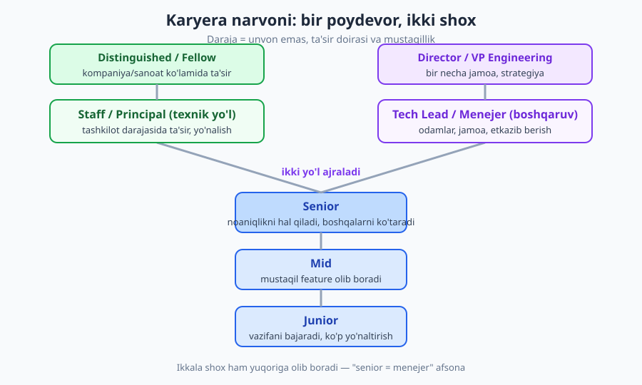
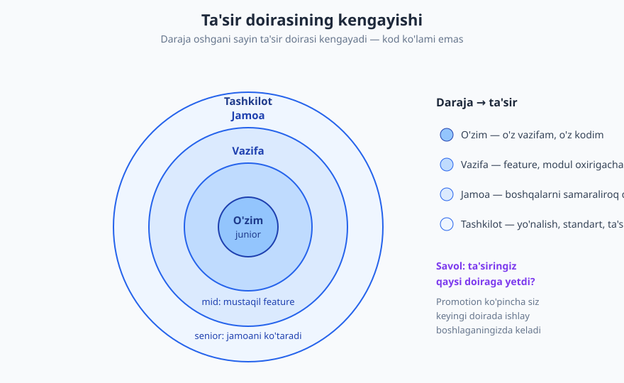
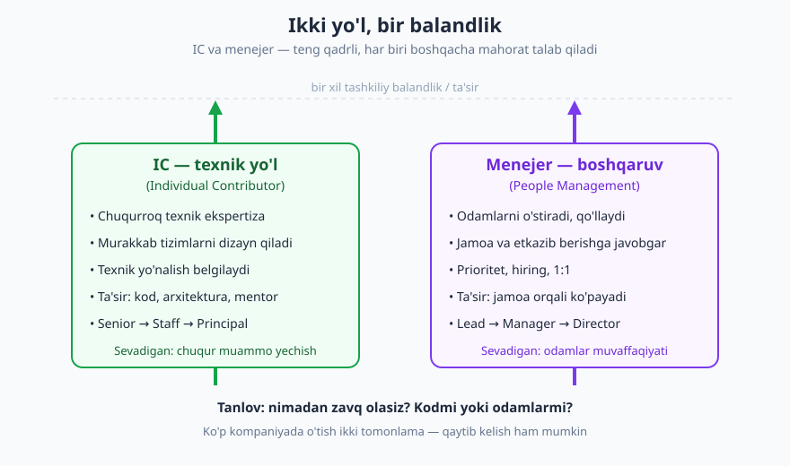

# 23 — Dasturchi karyera narvoni: junior'dan senior'gacha

[⬅️ Oldingi: 22 — O'rganishni o'rganish va dolzarb qolish](./22-organishni-organish.md) · [🏠 README](./README.md) · [Keyingi: 24 — Ishni topish: rezyume, portfolio va tarmoq ➡️](./24-ish-topish-rezyume-portfolio.md)

---

> **Bu bobda:** dasturchi karyerasi qanday quriladi — junior → mid → senior, keyin ikki shox: texnik yo'l (staff/principal) yoki boshqaruv (lead/menejer). Eng muhim g'oya: darajalar orasidagi farq **ko'lamda emas** (senior ko'proq kod yozmaydi), balki **ta'sir doirasi va mustaqillikda**. "Senior" nima anglatishini, IC va menejer yo'llarini, darajani qanday oshirishni va darajalarning halol haqiqatini (kompaniyaga bog'liqligi, promotion adolatsizligi) o'rganasiz.
>
> **Halollik / Eslatma:** bu bobdagi maslahatlar *qonun emas, amaliy yo'l-yo'riq*. Darajalar va ularning ta'rifi **kompaniyaga kuchli bog'liq**: bir joydagi "senior" boshqasida "mid" bo'lishi mumkin. Bu yerdagi tasvir keng tarqalgan sanoat amaliyotidan olingan, lekin sizning kompaniyangizning rasmiy darajalash ramkasi (career ladder) boshqacha bo'lishi tabiiy. Maqsad — unvonni quvish emas, balki **ko'nikma va ta'sirni o'stirish**; unvon ko'pincha shundan keyin keladi.

---

## Narvon haqida noto'g'ri tasavvur

Ko'pchilik karyerani shunday tasavvur qiladi: "yiliga shuncha kod yozsam, tajribam oshsa, avtomatik senior bo'laman". Bu — eng keng tarqalgan xato. Vaqt o'tishi sizni avtomatik senior qilmaydi; aks holda har 10 yillik dasturchi senior bo'lardi — amalda esa "10 yil tajribali, lekin aslida 1 yilni 10 marta takrorlagan" dasturchilar to'la.

Haqiqiy o'lchov boshqa. **Daraja = sizning ta'sir doirangiz va mustaqillik darajangiz.** Junior o'z vazifasiga ta'sir qiladi; senior butun jamoaga; staff butun tashkilotga. Bu kod miqdori emas — ko'pincha senior junior'dan **kamroq** qator kod yozadi, chunki vaqti dizayn, mentorlik, qaror va noaniqlikni hal qilishga ketadi.



Narvonning poydevori hamma uchun bir xil: junior → mid → senior. Senior'dan keyin yo'l **ikkiga ajraladi** — texnik (IC: staff, principal) yoki boshqaruv (lead, menejer, direktor). Ikkala shox ham yuqoriga, teng balandlikka olib boradi. Keling, har darajani aniq ko'rib chiqaylik.

---

## 1. Darajalar: junior, mid, senior, staff

Eng aniq farqni ko'rsatish uchun jadval. Diqqat qiling — har qatorda gap **kod miqdorida emas, mustaqillik va ta'sirda**.

| Daraja | Mustaqillik | Ta'sir doirasi | Tipik faoliyat |
|---|---|---|---|
| **Junior** | Ko'p yo'naltirish kerak; aniq vazifa beriladi | O'zi (o'z vazifasi) | Berilgan vazifani bajaradi, ko'p savol beradi, o'rganadi |
| **Mid** | Mustaqil; "qanday" ni o'zi hal qiladi | Bitta feature / modul | Feature'ni boshidan oxirigacha mustaqil olib boradi |
| **Senior** | Noaniqlikni o'zi hal qiladi; "nima" ni ham aniqlaydi | Jamoa | Tizim o'ylaydi, mentorlik qiladi, qaror qabul qiladi, boshqalarni ko'taradi |
| **Staff / Principal** | Tashkilot darajasida ishlaydi | Bir necha jamoa / tashkilot | Yo'nalish belgilaydi, ko'p jamoa kesib o'tuvchi muammolarni hal qiladi |

> **Eslatma:** "mid" darajasi ba'zi kompaniyalarda alohida emas — to'g'ridan-to'g'ri "junior → senior" bo'ladi, yoki "senior" ichida bir necha pog'ona (Senior I, Senior II) bo'ladi. Nomlar har xil; muhimi — pog'onalar ortidagi **ta'sir va mustaqillik mantig'i**, nomlari emas.

### Ta'sir doirasi: asosiy aql

Eng foydali tasavvur — **ta'sir doirasi konsentrik doiralar kabi kengayadi**:



- **O'zim** (junior): "men o'z vazifamni bajardim". Ta'sir o'zimning kodim bilan chegaralangan.
- **Vazifa** (mid): "men bu feature'ni oxirigacha, mustaqil yetkazdim". Boshqalar meni har qadamda yo'naltirmasligi kerak.
- **Jamoa** (senior): "men jamoaning umumiy unumdorligini oshiraman" — yaxshi dizayn, code review, mentorlik, dokumentatsiya orqali. Mening ta'sirim endi faqat o'z kodim emas, **boshqalarning kodi orqali ham** ko'payadi.
- **Tashkilot** (staff+): "men ko'p jamoaga taalluqli yo'nalish, standart va qarorga ta'sir qilaman".

Promotion ko'pincha siz **keyingi doirada ishlay boshlaganingizda** keladi — buni pastda ko'ramiz.

---

## 2. "Senior" aslida nimani anglatadi

Eng katta tushunmovchilik aynan shu yerda. Ko'pchilik "senior" ni "eng zo'r kod yozadigan", "eng murakkab algoritmni biladigan" deb tushunadi. Bu noto'g'ri. **Senior'lik kod emas** — u quyidagilar:

- **Mas'uliyat va egalik (ownership).** Senior "menga aytilmadi" demaydi; muammoni ko'rsa, egasiz qolgan ishni o'ziga oladi va oxirigacha javob beradi.
- **Hukm (judgment).** Senior'ning eng qimmatli tomoni — qaror qabul qilish. Qaysi yo'l, qaysi trade-off, nimani hozir qilish, nimani keyin. Ko'pincha "to'g'ri javob" yo'q — eng yaxshi qarorni kontekstda topa olish kerak.
- **Trade-off ongi.** Senior "ideal yechim" ni emas, "shu vaziyatda eng mos yechim" ni quradi. Vaqt, sifat, texnik qarz orasidagi muvozanatni biladi (qarang: [10-bob — texnik qarz](./10-texnik-qarz.md)).
- **Boshqalarni ko'tarish.** Mentorlik, code review, bilim ulashish — senior atrofidagilarni kuchaytiradi (qarang: [19-bob](./19-fikr-mulohaza-mentorlik.md)).
- **Kommunikatsiya.** Murakkab narsani sodda tushuntirish, non-tech bilan gaplashish, yozma muloqot. Bu senior'lik mahoratining yarmi (qarang: [17-bob](./17-texnik-kommunikatsiya.md)).
- **Biznes konteksti.** "To'g'ri narsani qurish" — nafaqat "narsani to'g'ri qurish". Senior nima uchun qurayotganini, mijoz va biznesga qanday qiymat berishini tushunadi.

### Misol + anti-misol: junior vs senior bir xil vazifaga

Aniq ko'rsatish uchun bitta real vaziyatni olamiz. **Vazifa:** "Foydalanuvchilar 'eksport' tugmasini bosganda hisobotni CSV qilib yuklab olsin."

**❌ Junior yondashuvi (vazifani so'zma-so'z bajaradi):**
> Tugma qo'shadi, bosilganda hamma qatorni o'qiydi, CSV yasaydi, yuklab beradi. Test qiladi: 10 qatorda ishladi — tayyor, PR yuboradi.

```text
- ko'rinadigan vazifa: tugma + CSV -> bajarildi
- savol bermaydi: kim ishlatadi? necha qator bo'ladi?
- chegara holatlar: 1 mln qatorda? bo'sh hisobotda? maxsus belgilarda (vergul ichida)?
- yashirin ta'sir: katta eksport serverni bo'g'ib qo'yishi mumkin
```

**✅ Senior yondashuvi (noaniqlikni hal qiladi, kontekst o'ylaydi):**
> Avval **savol beradi**: "Kim eksport qiladi, qanchalik tez-tez? Hisobotlar qancha katta bo'lishi mumkin?" Javob: "Hisobchilar, oyiga bir marta, ba'zilari 500 ming qatorgacha." Senior endi boshqacha quradi: katta eksportni fon vazifasiga (background job) o'tkazadi, tayyor bo'lganda email/bildirishnoma yuboradi, CSV'da maxsus belgilar va kodlash (encoding) holatini hal qiladi, server yukini o'ylaydi. PR'da **nega** shunday qilganini izohlaydi.

Diqqat qiling: ikkala dasturchi ham "ishlaydigan kod" yozdi. Farq qatorlar sonida emas — **senior ko'rinmas talablarni, chegara holatlarni va ta'sirni ko'rdi**, junior esa faqat aytilgan vazifani bajardi. Aynan shu farq — junior'ni senior'dan ajratadi, "10 ming qator kod" emas.

> **Eslatma:** bu junior'ni kamsitish emas — har kim junior'dan boshlaydi va bu butunlay normal. Junior'ning ishi — vazifani bajarib, savol berib, tezroq o'rganish. Yuqoridagi farq sizga **qaysi yo'nalishda o'sish kerakligini** ko'rsatadi: "ko'proq kod" emas, "kengroq o'ylash va mustaqil hal qilish".

---

## 3. Ikki yo'l: texnik (IC) vs menejerlik

Senior'dan keyin eng katta karyera qarori — qaysi shoxni tanlash. Bu yerda eng zararli afsona yashaydi: **"senior bo'lish = oxiri menejer bo'lish".** Bu noto'g'ri. Sog'lom kompaniyalarda **ikki parallel narvon** bor — ikkalasi ham teng balandlikka, teng maoshga olib boradi.



- **IC (Individual Contributor) yo'li:** texnik chuqurlik. Senior → Staff → Principal → Distinguished. Siz hali ham kod yozasiz, lekin ta'siringiz arxitektura, texnik yo'nalish va mentorlik orqali ko'payadi. Odamlarni rasman boshqarmaysiz.
- **Menejer yo'li:** odamlar. Tech Lead → Engineering Manager → Director → VP. Siz endi kod orqali emas, **jamoa orqali** qiymat yaratasiz: o'stirasiz, prioritet qo'yasiz, ishga olasiz, to'siqlarni olib tashlaysiz.

Eng muhimi — bular **boshqa-boshqa mahorat**, biri "yuqoriroq" emas. Zo'r senior dasturchi yomon menejer bo'lishi mumkin (va aksincha). Menejer bo'lish "ko'tarilish" emas — bu **kasb almashtirish**.

> **Trade-off:** IC yo'lini tanlasangiz — chuqur texnik ishdan zavq olasiz, lekin yuqori darajada (principal+) baribir ko'p **ta'sir va kommunikatsiya** ishi bor, sof "yolg'iz kod" emas. Menejer yo'lini tanlasangiz — odamlarga ta'sir qilasiz va kengroq qaror qabul qilasiz, lekin **kundalik kodlashdan uzoqlashasiz** va sizning "mahsulotingiz" endi kod emas, sog'lom va samarali jamoa. Ko'p kishi menejerlikni sinab ko'rib, kodni sog'inib IC'ga qaytadi — va bu mag'lubiyat emas, balki o'zini bilish. To'g'ri tanlov — "qaysi nufuzliroq" emas, balki **nimadan chin zavq olasiz**: murakkab muammoni yechishdanmi yoki odamlarni o'stirishdanmi?

Agar hali bilmasangiz — bu normal. Ko'pchilik IC sifatida boshlaydi, senior bo'lgach sinab ko'radi. Ba'zi kompaniyalarda "Tech Lead" — vaqtinchalik, ikkalasini aralashtirgan rol; uni sinov maydoni sifatida ishlatish mumkin.

---

## 4. Darajani qanday oshirish

Promotion (ko'tarilish) **avtomatik emas** va kutib o'tirsangiz, ko'pincha kelmaydi. Mana ishlaydigan yondashuv:

### Kutilganidan oldin shu darajada ishlash

Eng muhim qoida: **promotion sizni keyingi darajaga ko'tarmaydi — u siz allaqachon shu darajada ishlayotganingizni rasmiylashtiradi.** Senior bo'lishni kutmang; senior kabi ishlay boshlang (mustaqil noaniqlikni hal qiling, boshqalarga yordam bering, tizim o'ylang). Promotion shundan keyin "tabiiy" bo'lib keladi.

**❌ Kutuvchi yondashuv:**
> "Menga senior unvonini bering, keyin senior kabi ishlayman." — Bu deyarli hech qachon ishlamaydi.

**✅ Oldindan ishlovchi yondashuv:**
> "Men allaqachon noaniq vazifalarni o'zim hal qilyapman, ikki junior'ga mentor bo'lyapman, kross-jamoa muammosini olib chiqdim." — Endi promotion adolatli va oson asoslanadi.

### Ko'rinadigan ta'sir

Yaxshi ish qilish yetarli emas — uning **ko'rinishi** kerak. Bu maqtanish emas; bu ta'siringizni hujjatlash:
- Qilgan ishingizni va uning **natijasini** yozib boring ("eksportni optimallashtirib, server yukini 60% kamaytirdim").
- Yutuqlarni 1:1'da menejeringizga ayting, demo qiling, RFC yozing.
- "Jim qahramon" sindromidan ehtiyot bo'ling: hech kim bilmaydigan zo'r ish promotion keltirmaydi.

### Homiy (sponsor) va mentor

Bu ikkisi har xil:
- **Mentor** sizga maslahat beradi ("qanday qilsang yaxshi"). Sizga *gapiradi*.
- **Homiy (sponsor)** xonada siz yo'q paytda sizning nomingizdan gapiradi ("uni shu loyihaga qo'yaylik, u uddalaydi"). Sizning *foydangizga harakat qiladi*.

Karyera o'sishi uchun ikkalasi ham kerak, lekin **homiy ko'pincha hal qiluvchi**. Homiy odatda sizdan yuqori turgan, ta'sirli kishi. Uni topishning yo'li — ko'rinadigan, ishonchli ish qilish va munosabat qurish.

### Fikr-mulohaza so'rash

Menejeringizdan aniq so'rang: **"Keyingi darajaga o'tish uchun menga aniq nima yetishmayapti?"** Noaniq "yaxshi ishlayapsan" ni rad eting; aniq, harakatga aylantiriladigan javob talab qiling. Bu [19-bobdagi](./19-fikr-mulohaza-mentorlik.md) feedback so'rash ko'nikmasi bilan bir xil.

> **Eslatma:** halol haqiqat — **promotion har doim adolatli emas.** Ba'zan byudjet yo'q, ba'zan menejer sizni yetarli ko'rmaydi, ba'zan siyosat aralashadi. Bu real. Agar bir necha bor adolatli urinib ham o'sish bo'lmasa — ba'zan eng tez "promotion" boshqa kompaniyaga o'tish bo'ladi (qarang: [24-bob](./24-ish-topish-rezyume-portfolio.md)). Buni shaxsiy mag'lubiyat deb qabul qilmang.

---

## 5. O'sish kostyumi va qulay zonadan chiqish

Daraja oshirishning ichki dvigateli — **o'sish kostyumi (growth mindset)**: "men hali bilmayman, lekin o'rganaman" deb ishonish. Aksincha — "qat'iy kostyum" (fixed mindset): "men buni qila olmayman, bu mening ishim emas".

O'sish deyarli har doim **qulay zonadan tashqarida** bo'ladi:
- Hech qachon qilmagan vazifani so'rang ("men bu DB migratsiyasini olishni xohlayman").
- Noaniq, "egasiz" muammoni o'zingizga oling.
- Jamoa oldida taqdimot qiling, garchi qo'rqsangiz ham.
- Bilmagan sohaga ko'ngilli bo'ling.

Bularning hammasi noqulay — va aynan shu noqulaylik o'sish belgisi. Agar ishingiz har kuni butunlay qulay bo'lsa, ehtimol siz o'smayapsiz.

> **Trade-off:** "doimo qulay zonadan chiqish" ham har doim to'g'ri emas. Doimiy diskomfort — bu **charchash (burnout)** ga to'g'ri yo'l (qarang: [28-bob](./28-barqaror-karyera-burnout.md)). Sog'lom o'sish — qulay zona bilan diskomfort orasidagi tebranish: bir muddat cho'zilasiz, keyin yangi ko'nikmani mustahkamlab, dam olasiz. Doimiy "max rejim" barqaror emas. O'sishni marafon deb biling, sprint emas.

---

## 6. Halol haqiqatlar: unvonga emas, ko'nikmaga e'tibor

Bu bo'limni alohida ajratdik, chunki bu yerda eng ko'p adashish bor.

**Darajalar kompaniyaga bog'liq.** Bir startapdagi "Senior Engineer" katta korporatsiyada "Mid" bo'lishi mumkin, va aksincha. Kichik kompaniyada unvonlar "arzon" beriladi (jamoada faqat 3 kishi — kimdir "lead" bo'lishi kerak); katta kompaniyada esa qattiq darajalash bor. Shuning uchun **unvonlarni kompaniyalararo to'g'ridan-to'g'ri solishtirib bo'lmaydi.**

| ✅ Sog'lom yondashuv | ❌ Nosog'lom yondashuv |
|---|---|
| "Men shu ko'nikmalarni egalladim, shu ta'sir ko'rsatdim" | "Mening unvonim — Senior, demak men senior" |
| Ko'nikma va ta'sirni o'lchaydi | Unvonni o'lchaydi |
| Boshqa kompaniyadagi darajani kontekstda baholaydi | Unvonlarni so'zma-so'z solishtiradi |
| Barqaror, chuqur o'sishni xohlaydi | Faqat tez ko'tarilishni quvadi |

**Tez ko'tarilish har doim yaxshi emas.** Ba'zan kompaniya sizni "senior" qiladi, lekin sizda hali poydevor yetishmaydi — keyin og'ir mas'uliyat ostida qoqilasiz, yoki "senior" unvoni bilan boshqa joyga o'tib, intervyuda "siz senior emassiz" degan og'riqli haqiqatga duch kelasiz. **Chuqur poydevor** — tez unvondan qimmatroq. Unvon — yorliq; ko'nikma — siz bilan har joyga ketadigan haqiqiy kapital.

**Unvonni emas, o'sishni quving.** Eng sog'lom savol "qachon senior bo'laman?" emas, balki **"men o'tgan yilga nisbatan kengroq ta'sir ko'rsata olyapmanmi? Yangi ko'nikma egalladimmi?"**. Unvon kechikishi mumkin (yuqoridagi adolatsizlik), lekin chinakam o'sish — sizniki, va u oxir-oqibat unvonni ham olib keladi (bu yerda bo'lmasa, boshqa joyda).

---

## Asosiy g'oyalar (bobni qisqacha)

- **Daraja = ta'sir doirasi va mustaqillik**, kod miqdori emas. Vaqt o'zi sizni senior qilmaydi — "1 yilni 10 marta takrorlash" senior'lik emas.
- **Ta'sir doirasi kengayadi:** o'zim (junior) → vazifa (mid) → jamoa (senior) → tashkilot (staff). Ko'pincha senior junior'dan **kamroq** kod yozadi.
- **"Senior" = kod emas:** mas'uliyat, hukm (judgment), trade-off ongi, mentorlik, kommunikatsiya, biznes konteksti, "to'g'ri narsani qurish".
- **Ikki teng yo'l:** texnik (IC: staff/principal) va boshqaruv (lead/menejer). "Senior = menejer bo'lish" — **afsona**. Menejerlik ko'tarilish emas, **kasb almashtirish**.
- **Promotion sizni ko'tarmaydi — u siz allaqachon shu darajada ishlayotganingizni rasmiylashtiradi.** Oldindan shu darajada ishlang, ta'siringizni ko'rinadigan qiling, **homiy** toping, aniq feedback so'rang.
- **O'sish qulay zonadan tashqarida**, lekin doimiy diskomfort — burnout yo'li. Tebranish kerak.
- **Halol:** darajalar kompaniyaga bog'liq (bir joydagi senior boshqada mid); promotion adolatsiz bo'lishi mumkin; tez ko'tarilish har doim yaxshi emas. **Unvonni emas, ko'nikma va ta'sirni quving.**

---

## Mashqlar

### Oson

**1-mashq.** Quyidagi faoliyatlarni ta'sir doirasi bo'yicha tartiblang (eng tor → eng keng) va har biriga mos darajani belgilang: (a) butun jamoa uchun kodlash standartini joriy qildi, (b) o'ziga berilgan bug'ni tuzatdi, (c) yangi to'lov feature'ini boshidan oxirigacha mustaqil yetkazdi.

**2-mashq.** Quyidagi gaplardan qaysilari "senior" ta'rifiga to'g'ri, qaysilari afsona? Har birini bir jumlada izohlang: (a) "Senior — eng murakkab algoritmni yozadigan kishi." (b) "Senior noaniq vazifani o'zi aniqlashtirib hal qiladi." (c) "Senior bo'lish — oxiri menejer bo'lish."

**3-mashq.** O'zingizni qaysi darajada ko'rasiz (junior / mid / senior) va **nega**? Konkret 2-3 ta dalil keltiring (ta'sir doirangiz, mustaqillik darajangiz bo'yicha) — unvoningizga emas, real faoliyatingizga tayaning.

### O'rta

**4-mashq.** "Eksport hisobotini CSV qiling" vazifasini eslang. Endi o'zingiz tez-tez bajaradigan tipik vazifani oling va junior vs senior yondashuvini yozing: junior so'zma-so'z nima qiladi va senior **qanday savollar berib, qanday ko'rinmas talab/chegara holatlarni** ko'radi?

**5-mashq.** Siz mid darajadasiz va senior bo'lishni xohlaysiz. Menejeringiz bilan 1:1 uchrashuvga tayyorlaning: senior'ga o'tish uchun **nima yetishmayapti** ni aniqlashtiruvchi 4 ta aniq savol yozing (noaniq "yaxshi ishlayapsanmi?" emas).

**6-mashq.** Sizga IC va menejer yo'li orasida tanlash kerak. O'zingiz haqingizda halol javob bering: (a) qaysi ish sizga ko'proq zavq beradi — murakkab texnik muammoni chuqur yechishmi yoki odamlarni o'stirib, jamoa muvaffaqiyatini ta'minlashmi? (b) tanlovingizning bitta xavfi (trade-off) nima?

### Qiyin

**7-mashq.** Siz 4 yildan beri shu kompaniyada ishlaysiz, "senior" deb hisoblaysiz, lekin ikki marta promotion rad etildi. Halol o'z-o'zini tahlil rejasini tuzing: (a) ta'sir doirangiz haqiqatan jamoa darajasidami yoki hali vazifa darajasidami — qanday tekshirasiz? (b) ta'siringiz **ko'rinadigan** mi? (c) homiyingiz bormi? (d) qaysi nuqtada "muammo menda emas, kontekstda" deb xulosa qilib, boshqa kompaniyaga o'tishni o'ylaysiz? Har birini izohlang.

**8-mashq.** Bir do'stingiz maqtanadi: "Men 2 yil ishlab Senior Engineer bo'ldim!" — lekin u 3 kishilik startapda. Boshqa do'stingiz katta korporatsiyada 5 yil ishlab hali "Mid". Darajalarning kompaniyaga bog'liqligi nuqtai nazaridan: (a) bu ikki "darajani" to'g'ridan-to'g'ri solishtirsa bo'ladimi va nega? (b) qaysi savollarni berib, ularning **haqiqiy ta'sir va ko'nikma darajasini** baholagan bo'lardingiz? (c) tez unvonning yashirin xavfi nima?

<details markdown="1">
<summary>Yechimlar</summary>

> Eslatma: bu mashqlarning ko'pida yagona to'g'ri javob yo'q — quyida **namuna javoblar va baholash mezonlari** berilgan.

### 1-mashq yechimi
Tartib (tor → keng): **(b) bug'ni tuzatdi** — ta'sir doirasi: o'zim → **junior**; **(c) feature'ni mustaqil yetkazdi** — ta'sir: vazifa/feature → **mid**; **(a) jamoa standartini joriy qildi** — ta'sir: jamoa → **senior**. Mezon: tartib ta'sir doirasi (o'zim → vazifa → jamoa) bo'yicha to'g'rimi.

### 2-mashq yechimi
(a) **Afsona** — senior'lik kod murakkabligi emas, mas'uliyat/hukm/ta'sir; senior ko'pincha kamroq kod yozadi. (b) **To'g'ri** — noaniqlikni mustaqil hal qilish aynan senior belgisi. (c) **Afsona** — IC (texnik) va menejer ikki teng yo'l; senior bo'lish menejerlikka majburlamaydi. Mezon: har bir baho to'g'ri va izoh "ta'sir/mas'uliyat" mantig'iga tayanadimi.

### 3-mashq yechimi
Namuna (mid uchun): "Men mid'man, chunki: (1) feature'larni o'zim mustaqil olib boraman, har qadamda yo'naltirish kerak emas — bu junior emasligimni ko'rsatadi; (2) lekin men hali jamoa darajasida ta'sir qilmayman — boshqalarga mentor bo'lmayman, tizim/arxitektura qarorlarini menejer/senior qiladi — bu senior emasligimni ko'rsatadi." Mezon: javob unvonga emas, real ta'sir doirasi va mustaqillikka tayanadimi; o'z-o'ziga halol baho bormi.

### 4-mashq yechimi
Mezon ro'yxati: junior tomonida — vazifani so'zma-so'z, "ko'rinadigan" qismni bajarish; senior tomonida — kamida 3 narsa bo'lishi kerak: (1) **savol beradi** (kim ishlatadi, qanchalik tez-tez, ko'lam qancha), (2) **chegara holatlarni** ko'radi (bo'sh, juda katta, maxsus belgilar, parallel ishlatish), (3) **yashirin ta'sirni** o'ylaydi (server yuki, xavfsizlik, kelajak o'zgaruvchanlik). Yaxshi javob "ko'proq kod" emas, "kengroq o'ylash" ni ko'rsatadi.

### 5-mashq yechimi
Namuna savollar: (1) "Senior'ga o'tish uchun sizning ramkangizda menga aniq qaysi 2-3 kompetensiya yetishmayapti?" (2) "Senior darajasida ishlaganimga oxirgi misol qaysi edi, va qaysi misollar hali mid darajasini ko'rsatdi?" (3) "Keyingi 2 chorakda qanday aniq, o'lchanadigan ta'sir ko'rsatsam, promotion uchun asos bo'ladi?" (4) "Menga homiy/loyiha kerakmi — siz qaysi ko'rinadigan ishni olishimni tavsiya qilasiz?" Mezon: savollar aniq, harakatga aylantiriladigan, "yaxshimi?" tipidagi noaniq emas.

### 6-mashq yechimi
Bu refleksiv — to'g'ri javob yo'q. Mezon: (a) javob halol va konkret (mavhum "ikkalasi ham" emas) — qaysi faoliyatdan chin zavq olishini aniq aytadimi; (b) trade-off to'g'ri tan olinganmi — IC tanlovida "yuqori darajada baribir kommunikatsiya/ta'sir ishi ko'p" yoki menejer tanlovida "kundalik kodlashdan uzoqlashish" kabi. Eslatma: "bilmayman, sinab ko'rishim kerak" — to'liq joiz va yetuk javob.

### 7-mashq yechimi
Namuna: (a) Ta'sir doirasini tekshirish: oxirgi 6 oyda men jamoa darajasida nima qildim (mentorlik, kross-jamoa, standart, boshqalarning ishini osonlashtirish)? Agar javoblar hali "o'z vazifam" atrofida bo'lsa — men hali senior darajasida **ishlamayapman**, faqat unvonni xohlayapman. (b) Ko'rinishlik: menejerim va atrof mening ta'sirimni biladimi, yoki men "jim qahramon"manmi? (c) Homiy: kimdir men yo'q xonada mening foydamga gapiradimi? (d) Eskalatsiya/ketish nuqtasi: agar men senior darajada ishlayotganimni hujjatlab ko'rsatib, aniq feedback olib, 2-3 chorak ishlab ham adolatli o'sish bo'lmasa — bu kontekst muammosi; tashqi intervyu bilan bozor meni qanday baholashini sinab ko'raman. Mezon: o'z-o'zini halol tekshirish (muammo menda emasligini tezda xulosa qilmaslik) + ko'rinishlik + homiy + adolatsizlikni tan olib oqilona qaror.

### 8-mashq yechimi
(a) **Yo'q** — to'g'ridan-to'g'ri solishtirib bo'lmaydi: kichik startapda unvonlar "arzon" beriladi (kichik jamoa), katta korporatsiyada qattiq darajalash bor; "Senior" so'zi ikki kontekstda boshqa narsani anglatadi. (b) Baholash savollari: ta'sir doirasi qanday (faqat o'z kodimi yoki jamoa/tizimmi)? Mustaqil noaniqlikni hal qiladimi? Boshqalarni o'stiradimi? Qaror/trade-off mas'uliyati bormi? — ya'ni unvon emas, **real faoliyat** so'raladi. (c) Tez unvon xavfi: poydevor yetishmasligi mumkin — keyin og'ir mas'uliyatda qoqilish yoki boshqa joyga o'tganda "siz senior emassiz" haqiqatiga duch kelish; unvon yorliq, ko'nikma esa siz bilan ketadigan kapital. Mezon: kompaniyaga bog'liqlikni tushunish + unvon o'rniga ta'sir/ko'nikmaga e'tibor + tez unvonning chuqurlik xavfi.

</details>

---

[⬅️ Oldingi: 22 — O'rganishni o'rganish va dolzarb qolish](./22-organishni-organish.md) · [🏠 README](./README.md) · [Keyingi: 24 — Ishni topish: rezyume, portfolio va tarmoq ➡️](./24-ish-topish-rezyume-portfolio.md)
