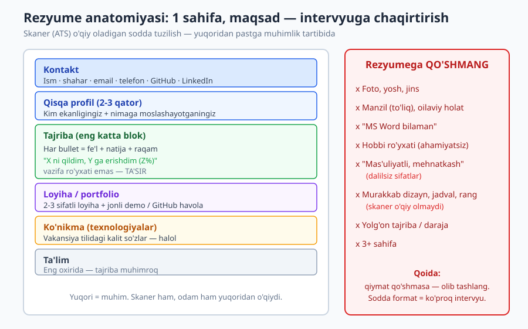
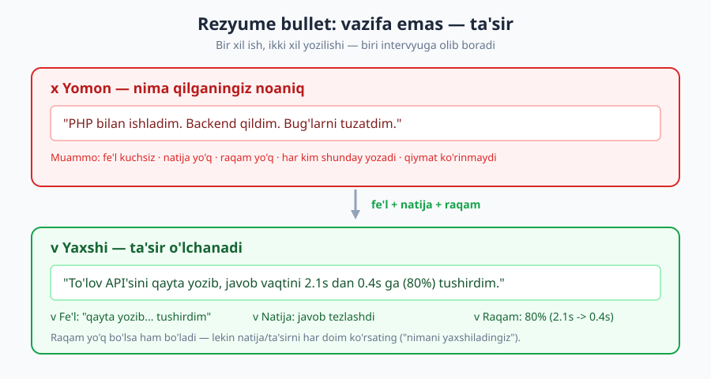
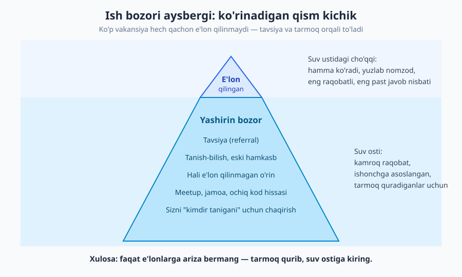

# 24 — Ishni topish: rezyume, portfolio va tarmoq

[⬅️ Oldingi: 23 — Dasturchi karyera narvoni: junior'dan senior'gacha](./23-karyera-narvoni.md) · [🏠 README](./README.md) · [Keyingi: 25 — Texnik intervyuga tayyorgarlik ➡️](./25-texnik-intervyu.md)

---

> **Bu bobda:** ishni qanday topish — bu **ko'nikma, omad emas**. Ish izlash jarayonini (qidir → ariza → intervyu → taklif) o'rganasiz: ta'sirli rezyume (CV) yozish, kod ko'rsatadigan portfolio/GitHub qurish, LinkedIn va onlayn hozirlik, **tarmoq (networking)** — vakansiyalarning katta qismi e'lon qilinmaydi, va maqsadli ariza strategiyasi. Eng og'riqli ikki haqiqatni ham ochamiz: "tajriba paradoksi" (birinchi ish eng qiyin) va "soxta talablar afsonasi" (100% mos kelish shart emas). O'zbekistondan global bozorga chiqish konteksti bilan.
>
> **Halollik / Eslatma:** bu bobdagi maslahatlar *qonun emas, amaliy yo'l-yo'riq*. Ish bozori **mintaqaga, yilga va kompaniyaga kuchli bog'liq**: O'zbekistondagi mahalliy bozor, global remote va frilans — har biri boshqacha o'ynaydi. Bu yerdagi tasvir keng tarqalgan amaliyotdan, lekin "raqamlar o'yini" tabiati shuni anglatadiki: bir kishiga ishlagan narsa boshqasiga ishlamasligi mumkin. Eng muhim halol gap: **rad javobi — sizning qadr-qiymatingiz haqida emas, faqat moslik haqida**, va ish izlash charchatadi — bu butunlay normal.

---

## Ish topish — ko'nikma, omad emas

Ko'pchilik o'ylaydi: "yaxshi dasturchi bo'lsam, ish o'zi topiladi." Bu yarim haqiqat. Yaxshi dasturchi bo'lish — **kerakli, lekin yetarli emas** shart. Ishni topish — bu alohida ko'nikma: o'zingizni qanday taqdim etish, qaerga ariza berish, kim bilan gaplashish. Eng zo'r dasturchi ham, agar uni hech kim ko'rmasa yoki rezyumesi skanerdan o'tmasa, ishsiz qolishi mumkin. Aksincha, o'rtacha dasturchi, lekin o'zini yaxshi taqdim etadigan va tarmoqi kuchli kishi tezroq ish topadi.

Yaxshi xabar: bu ko'nikma — **o'rganiladi**, xuddi kod yozish kabi. Omad emas. Jarayonni tushunsangiz va mashq qilsangiz, natija yaxshilanadi.

Ish izlashning to'rt bosqichi bor — bu **voronka** (funnel), har bosqichda son kamayadi:

```text
Qidirish   ->  Ariza      ->  Intervyu   ->  Taklif
(vakansiya)    (rezyume,      (texnik +      (muzokara,
               cover letter)   behavioral)    qaror)

100 ko'rib    20 ariza        4 intervyu     1 taklif
chiqdingiz    berdingiz       chaqirildi     oldingiz
```

Diqqat qiling — bu **raqamlar o'yini**. Har bosqichdagi rad javob normal va kutilgan. Maqsad — voronkaning yuqorisiga yetarli "material" tashlash va har bosqichda konversiyani (o'tish nisbatini) yaxshilash. Bu bob asosan **birinchi ikki bosqich** (qidirish va ariza) haqida; intervyu — [25-bob](./25-texnik-intervyu.md), muzokara ham o'sha yerda.

### Tajriba paradoksi: birinchi ish eng qiyin

Eng og'riqli to'siq: "Ishga tajriba kerak. Tajriba olish uchun ish kerak." Bu — **tajriba paradoksi**, va deyarli har bir yangi dasturchi unga duch keladi. Vakansiyada "2 yil tajriba" yozilgan, lekin sizda hali ish tajribasi yo'q.

Yechim: **"tajriba" ish joyidagi tajribadan kengroq.** Sizda tajriba yaratadigan ko'p yo'l bor:

- **Real loyihalar** — o'zingiz qurgan, ishlayotgan, foydalanuvchisi bor narsa (hatto kichik bo'lsa ham).
- **Ochiq kodga hissa** (open source) — boshqalarning loyihasiga PR, hujjat, bug tuzatish.
- **Frilans / kichik buyurtma** — bitta-ikkita real mijoz ishi ([26-bob](./26-frilans-masofaviy-ish.md)).
- **Internship / amaliyot** — past maoshli, lekin "birinchi ish" eshigini ochadi.
- **O'quv loyihalari** — bootcamp, kurs, diplom ishi (lekin "todo-app" emas — pastda ko'ramiz).

> **Eslatma:** birinchi ishni topish 5-yillik tajribaga ega bo'lganga qaraganda **ancha ko'p urinish** talab qiladi. Bu adolatsiz tuyuladi, lekin haqiqat. Agar 50 ta arizadan keyin javob bo'lmasa — bu siz yomon dasturchi ekanligingizni anglatmaydi; bu birinchi ish tabiatan qiyin ekanligini anglatadi. Sabr va jarayonni yaxshilash — kalit.

---

## Rezyume (CV): maqsad — intervyuga chaqirtirish

Eng katta tushunmovchilik shu yerda. **Rezyumening maqsadi — ish olish emas, intervyuga chaqirtirish.** U sotmaydi, u *eshikni ochadi*. Bu farq hamma narsani o'zgartiradi: rezyume to'liq tarjimai hol bo'lishi shart emas — u faqat "bu odam bilan suhbatlashishga arziydi" degan qarorni keltirib chiqarishi kerak.

Va u buni **juda tez** qilishi kerak. Rekruter bir rezyumega o'rtacha 6-10 soniya qaraydi. Birinchi skanerdan esa ko'pincha **odam emas, dastur** (ATS — Applicant Tracking System) o'tkazadi. Demak rezyume ikki "o'quvchi" uchun yozilishi kerak: tez qaraydigan odam va matnni qidiradigan dastur.



### Tuzilish: 1 sahifa, muhimi yuqorida

- **1 sahifa** (junior/mid uchun). Senior bo'lsangiz, 2 sahifagacha mumkin. 3+ sahifa — deyarli har doim xato.
- **Yuqoridan pastga muhimlik tartibida:** kontakt → qisqa profil → tajriba → loyiha → ko'nikma → ta'lim. Talaba bo'lsangiz, ta'lim/loyiha tajribadan yuqoriroq bo'lishi mumkin.
- **Sodda, ASCII-do'st format.** Murakkab jadval, ustun (column), grafika, rang — skaner (ATS) ularni ko'pincha **buzib o'qiydi** yoki tashlab yuboradi. Oddiy bitta ustunli, aniq sarlavhali format eng ishonchli o'tadi.

### Ta'sir: fe'l + natija + raqam

Rezyumening yuragi — tajriba bulletlari. Eng keng tarqalgan xato: bulletni **vazifa ro'yxati** qilib yozish ("nima qildim"). To'g'risi — **ta'sir** ("nimaga erishdim"). Formula:

> **fe'l + nima qilding + qanday natija (iloji bo'lsa raqam bilan)**



**❌ Yomon bullet (vazifa, noaniq):**
> - PHP bilan ishladim.
> - Backend qildim.
> - Bug'larni tuzatdim.
> - Loyihaga mas'ul edim.

**✅ Yaxshi bullet (ta'sir, o'lchanadigan):**
> - To'lov API'sini qayta yozib, javob vaqtini 2.1s dan 0.4s ga (80%) tushirdim.
> - 12 ta takrorlanuvchi bug'ning ildiz sababini topib, qo'llab-quvvatlash murojaatlarini oyiga 30% kamaytirdim.
> - Yangi onboarding oqimini qurib, ro'yxatdan o'tish konversiyasini 18% oshirdim.

Diqqat: ikkala holatda ham **bir xil ish** qilingan. Farq — yozilishida. Raqam har doim bo'lavermaydi (ayniqsa birinchi ishda), va bu joiz — lekin natijani/ta'sirni doim ko'rsating: "nimani yaxshiladingiz, soddalashtirdingiz, tezlashtirdingiz".

> **Trade-off:** raqam kuchli, lekin **yolg'on raqam — xavf**. "Tizimni 500% tezlashtirdim" deb yozsangiz, intervyuda "qanday o'lchadingiz?" deb so'rashadi — va asoslay olmasangiz, ishonch yo'qoladi. Aniq raqamingiz bo'lmasa, **taxminiy lekin halol** yozing ("taxminan choragicha kamaytirdim") yoki raqamsiz, lekin aniq natija bilan yozing. Bo'rttirilgan raqamdan ko'ra halol "natija" yaxshiroq.

### Nima QO'SHMASLIK kerak

Rezyumega qo'shmaydigan narsalar ham qo'shadigani kabi muhim — har ortiqcha satr asosiy xabarni susaytiradi:

| ✅ Qo'shing | ❌ Qo'shmang |
|---|---|
| Email, telefon, GitHub, LinkedIn | Foto, yosh, jins, oilaviy holat |
| Ta'sirli tajriba bulletlari | "Mas'uliyatli, mehnatkash" (dalilsiz sifatlar) |
| Vakansiyaga mos kalit so'zlar (halol) | "MS Word", "internetda ishlay olaman" |
| 2-3 sifatli loyiha + havola | 10 ta yarim tugatilgan o'quv loyihasi |
| Aniq, sodda format | Murakkab dizayn, jadval, ko'p rang |
| Mos ko'nikmalar | Ahamiyatsiz hobbi ro'yxati |

> **Eslatma:** O'zbekiston (va ko'p MDH) kontekstida foto, tug'ilgan sana, "millat" kabi maydonlar an'anaga ko'ra qo'shilib kelgan. **Global / xalqaro kompaniyalar uchun bularni olib tashlang** — ular nafaqat keraksiz, balki ba'zi mamlakatlarda diskriminatsiyaga yo'l qo'ymaslik uchun **ataylab istalmaydi**. Mahalliy kompaniyaga ariza bersangiz, ularning kutilmasini bilib oling — lekin shubha bo'lsa, soddaroq (fotosiz) versiya xavfsizroq.

### ATS — skanerlovchi tizim uchun yozish

Katta kompaniyalar arizalarni avval **ATS** (Applicant Tracking System) orqali o'tkazadi — bu dastur rezyumeni matnga aylantirib, vakansiya kalit so'zlariga mosligini tekshiradi. Past ball olgan rezyume **odamga yetib ham bormaydi**. Shuning uchun:

- **Vakansiya tilini ishlating.** E'londa "React, REST API, PostgreSQL" deyilgan bo'lsa — sizda shu ko'nikma bor bo'lsa — aynan shu so'zlarni yozing ("ReactJS" emas "React", agar e'lon shunday yozgan bo'lsa).
- **Standart sarlavhalar:** "Tajriba", "Ta'lim", "Ko'nikmalar" — dastur taniydigan oddiy nomlar.
- **PDF yoki .docx**, oddiy format. Rasmga matn joylamang (skaner o'qiy olmaydi).
- **Kalit so'zni halol ishlating** — sizda bo'lmagan ko'nikmani "ATS uchun" qo'shmang; intervyuda fosh bo'ladi.

---

## Portfolio va GitHub: kod ko'rsatish > da'vo

Dasturchi uchun eng kuchli dalil — **ishlaydigan kod**. "Men React bilaman" deyish — da'vo; React bilan qurilgan, jonli ishlayotgan loyihaga havola — **isbot**. Birinchi ish izlayotganda, portfolio ko'pincha rezyumedan ham muhimroq, chunki ish tajribangiz yo'q — lekin kodingiz bor.

### Sifat > son

Eng keng tarqalgan xato: "GitHub'imda 30 ta repozitoriy bor!" — lekin hammasi yarim tugatilgan tutorial nusxasi. Bu yaxshi emas, hatto zarar. **2-3 ta sifatli loyiha, 20 ta yarimtadan ancha kuchli.**

**❌ Zaif portfolio:**
> 30 ta repo: "todo-app", "weather-app-tutorial", "my-first-react", hammasi README'siz, oxirgi commit 8 oy oldin, ishga tushirib bo'lmaydi.

**✅ Kuchli portfolio:**
> 3 ta tugallangan loyiha: har birida aniq README (nima qiladi, qanday ishga tushirish, qanday texnologiya), **jonli demo havola** (deploy qilingan), toza commit tarixi, hatto test. Bittasi real muammoni yechadi (mas. mahalliy bozor uchun kichik xizmat).

Bitta yaxshi loyiha quyidagilarga ega:

- **README** — eng birinchi qaraladigan narsa. Nima qiladi, skrinshot/demo, qanday ishga tushirish, qanday qaror qabul qildingiz. (README anatomiyasi: [18-bob](./18-hujjatlash.md).)
- **Jonli demo** — deploy qilingan, bosib ko'rsa bo'ladigan ([DevOps](../devops/README.md) yordam beradi).
- **Toza tarix** — mazmunli commit'lar ([Git & GitHub](../git-github/README.md)).
- **Real muammo** — "yana bir todo-app" emas; o'zingiz yoki tanishingiz ehtiyojini yechadigan narsa esda qoladi.

### "Yashil kvadrat" afsonasi

GitHub profilingizdagi "contribution graph" (har kunlik yashil kvadratchalar) — ko'pchilik uni **majmuaviy o'lchov** deb o'ylaydi: "har kuni commit qilsam, ish beruvchi meni tirishqoq deb biladi". Bu **afsona**. Hech bir jiddiy rekruter "365 kun ketma-ket commit" ni mezon qilib olmaydi — aksincha, har kuni mayda, mazmunsiz commit (`fix typo`, `update`) sun'iy ko'rinadi.

> **Trade-off:** muntazam faollik *foydali* — u sizning hozir aktiv ekanligingizni ko'rsatadi, va odat qurish yaxshi. Lekin **grafikni "bo'yash" uchun mazmunsiz commit qilish** — vaqt isrofi va soxta. Yashil kvadratni maqsad qilmang; **sifatli ish** qiling, yashil kvadrat shundan tabiiy chiqadi. Ish beruvchi grafikni emas, **loyihalaringizni va kod sifatini** ko'radi.

### Ochiq kodga hissa (open source)

Ochiq kod loyihasiga hissa qo'shish — tajriba paradoksini yengishning kuchli yo'li: real, jamoaviy kod bilan ishlaganingizni ko'rsatadi. Hatto kichik hissa ham qiymatli:

- Hujjatdagi xatoni tuzatish, README'ni yaxshilash.
- Ochiq "good first issue" yorlig'li muammoni hal qilish.
- Kichik bug fix yoki test qo'shish.

Bu ish beruvchiga ko'rsatadi: siz begona kod bazasiga kira olasiz ([3-bob](./03-begona-kodni-oqish.md)), code review jarayonida ishlay olasiz ([13-bob](./13-code-review.md)), jamoada PR yubora olasiz ([14-bob](./14-jamoaviy-kod-oqimi.md)).

---

## Onlayn hozirlik: ko'rinish quradi

Ish izlash nafaqat ariza yuborish — bu **topiladigan bo'lish** hamdir. Onlayn hozirligingiz (online presence) — rekruterlar va kelajakdagi hamkasblar sizni ko'radigan oyna.

- **LinkedIn:** xalqaro va remote ish uchun deyarli majburiy. To'liq profil (sarlavha, "About", tajriba), professional foto, va **kalit so'zlar** — rekruterlar LinkedIn'da "React developer Tashkent" kabi qidiradi. Profilingiz shu qidiruvlarda chiqishi kerak. "Open to work" belgisini yoqing.
- **GitHub:** profil README, pin qilingan eng yaxshi 3 loyiha, toza ko'rinish.
- **Texnik jamoalar:** O'zbekiston dasturchilar Telegram guruhlari, X (Twitter) texnik jamoasi — bu yerda vakansiyalar e'lon qilinadi va aloqalar quriladi.
- **Blog / yozish:** o'rgangan narsangiz haqida qisqa post yozish (hatto oddiy "men buni shunday hal qildim") — bu sizni eslab qolinadigan qiladi va bilim chuqurligingizni ko'rsatadi. ([17-bob](./17-texnik-kommunikatsiya.md) yozma muloqot haqida.)

> **Eslatma:** onlayn hozirlik — uzoq muddatli sarmoya, tezkor hiyla emas. Bugun yozgan blog posti yoki qurgan aloqangiz olti oydan keyin ish taklifiga aylanishi mumkin. Shuning uchun ish izlamayotganda ham profilni "tirik" tuting — eng yaxshi vaqt ish izlashdan oldin tarmoq qurish.

---

## Tarmoq (networking): eng kuchli kanal

Mana eng kam tushuniladigan haqiqat: **vakansiyalarning katta qismi hech qachon ochiq e'lon qilinmaydi.** Ular ichki tavsiya, tanish-bilish yoki to'g'ridan-to'g'ri murojaat orqali to'ladi. Bu — **yashirin ish bozori**.



E'lon qilingan vakansiya — aysbergning suv ustidagi cho'qqisi: hamma ko'radi, yuzlab nomzod ariza beradi, raqobat eng yuqori, javob nisbati eng past. Suv osti — yashirin bozor: kamroq raqobat, ishonchga asoslangan, **tarmoq quradiganlar uchun ochiq**.

### Tavsiya (referral) nega kuchli

Ichki tavsiya bilan kelgan ariza odatda **birinchi navbatda ko'riladi** va ATS'dan ham oson o'tadi. Sababi sodda: kompaniya allaqachon ishonadigan kishi sizni "tavsiya etyapti" — bu xavfni kamaytiradi. Ko'p kompaniyalar tavsiya uchun xodimga bonus ham to'laydi, demak ular tavsiyani **rag'batlantiradi**.

Bu adolatsiz tuyulishi mumkin ("demak tanish kerakmi?"), lekin asli — tarmoq **quriladi**, tug'ma emas. Va u "soxta" bo'lishi shart emas.

### "Soxta" emas, haqiqiy aloqa

Networkingni ko'pchilik yoqtirmaydi, chunki uni "manfaatparastlik" deb tushunadi — "kimdandir nimadir olish uchun gaplashish". Bu noto'g'ri va samarasiz model.

**❌ Soxta networking:**
> Notanish odamga LinkedIn'da yozasiz: "Salom, menga ish kerak, sizning kompaniyangizga meni tavsiya qila olasizmi?" — Bu deyarli har doim e'tiborsiz qoldiriladi.

**✅ Haqiqiy aloqa:**
> Jamoaga qo'shilasiz, savollarga javob berasiz, meetup'da chin qiziqish bilan suhbatlashasiz, kimningdir loyihasiga yordam berasiz. Vaqt o'tib, tabiiy munosabat quriladi. Keyin "men ish izlayapman, shu sohada kim ishlayotganini bilasizmi?" deb so'rasangiz — odam sizni biladi va yordam berishni xohlaydi.

Haqiqiy networking — **bering, keyin oling**. Avval qiymat qo'shasiz (yordam, bilim, e'tibor), keyin yordam so'rashga "ruxsat" qozonasiz. Yaqinda ish izlamayotgan paytda qilingan aloqa eng samarali.

### Yordam so'rashdan uyalmaslik

Ko'p yangi dasturchi yordam so'rashdan uyalad: "bezovta qilaman", "kim men kabi noma'lum odamga yordam beradi". Haqiqat — **ko'p odam yordam berishni xohlaydi**, ayniqsa siz aniq, kichik so'rov bilan kelsangiz. "Menga ish toping" emas, balki "siz X kompaniyada ishlaysiz — u yerdagi muhit haqida 15 daqiqa gaplasha olamizmi?" — bu aniq, kichik va bajariladigan so'rov.

> **Trade-off:** tarmoq kuchli, lekin **faqat tarmoqqa tayanish ham xato** — agar tarmog'ingiz kichik bo'lsa (yangi boshlovchi uchun tabiiy), ariza va portfolio'ni e'tiborsiz qoldirib bo'lmaydi. Eng yaxshi strategiya — **ikkalasi**: tarmoqni uzoq muddatda quring, ariza/portfolio'ni qisqa muddatda ishlating. Va tarmoq qurish vaqt oladi; bugun boshlasangiz, mevasini keyin ko'rasiz — shuning uchun erta boshlang.

---

## Ariza strategiyasi: maqsadli > spam

Ikki yo'l bor: **100 ta umumiy ariza** ("spray and pray" — sepib, umid qilish) yoki **20 ta maqsadli ariza**. Birinchisi qiziqarli ko'rinadi (ko'p ariza = ko'p imkoniyat), lekin amalda samarasiz: umumiy rezyume hech qaerga aniq mos kelmaydi, javob nisbati past, va sizni tez charchatadi.

**Maqsadli ariza** kuchliroq: har biriga rezyumeni biroz moslab (vakansiya kalit so'zlari), nega aynan shu kompaniya qiziqtirayotganini bilib, iloji bo'lsa ichki aloqa topib. 20 ta sifatli ariza ko'pincha 100 ta spamdan ko'p intervyu keltiradi.

### Sovuq xat (cover letter) va kuzatuv

- **Sovuq xat (cover letter):** har doim ham o'qilmaydi, lekin maqsadli arizada qiymat qo'shadi. Qisqa (3-4 jumla), aniq: nega shu kompaniya, nega siz mos, bitta konkret misol. Shablon emas — har biriga moslang.
- **Kuzatuv (follow-up):** ariza bergandan 1-2 hafta keyin javob bo'lmasa, xushmuomala bir eslatma yuborish o'rinli. Bu g'ayrioddiy emas — band rekruterlar ba'zan unutadi.

### Rad javobi normal — raqamlar o'yini

Bu og'riqli, lekin muhim: **rad javobi ish izlashning normal qismi.** Har bir "yo'q" — sizning qadr-qiymatingiz haqida emas. Sabablari ko'pincha sizdan tashqarida: kompaniya ichki nomzod tanladi, byudjet o'zgardi, boshqa nomzod aynan o'sha texnologiyada ko'proq tajribali edi, yoki shunchaki "moslik" bo'lmadi.

Raqamlar o'yini sifatida qarang: agar 20 arizadan 1 taklif olsangiz, bu yomon emas — bu shuni anglatadiki, ko'proq taklif uchun ko'proq sifatli ariza kerak (yoki konversiyani yaxshilash kerak). Har raddan keyin: "bu meni qanday o'rgatadi?" deb so'rang, "men yaroqsizman" emas.

### Soxta talablar afsonasi: 100% mos kelish shart emas

Vakansiyalardagi talablar ro'yxati ko'pincha **istaklar ro'yxati** (wishlist), majburiy minimum emas. "5 yil tajriba, 8 texnologiya, magistr daraja" — kompaniya ideal nomzodni tasvirlaydi, lekin amalda 100% mos keladigan odam kamdan-kam.

> **Eslatma:** mashhur tadqiqot natijasi — **erkaklar talablarning ~60% iga mos kelsa ariza beradi, ayollar esa ko'pincha ~100% mos kelmasa ariza bermaydi.** Bu shuni anglatadiki, ko'p (ayniqsa ayol) malakali nomzod o'zini ortiqcha cheklaydi. **Agar siz asosiy talablarning kattasiga mos kelsangiz — ariza bering.** "Tajriba etarli emas" deb o'zingizni rad etmang; bu qarorni ish beruvchiga qoldiring. Eng yomoni — "yo'q" eshitish, va u sizga zarar qilmaydi.

| Ariza turi | Hajm | Moslash | Javob nisbati | Qachon mos |
|---|---|---|---|---|
| **Spam (umumiy)** | 100+ | Yo'q, bir xil rezyume | Juda past | Deyarli hech qachon |
| **Maqsadli** | 10-30 | Har biriga moslangan | O'rtacha-yuqori | Ko'pchilik holatda |
| **Tavsiya orqali** | Kam | Aloqa + moslangan | Eng yuqori | Tarmoq bo'lsa — birinchi tanlov |

---

## O'zbekistondan: mahalliy + global

O'zbekistonlik dasturchi uchun ish bozori **uch qatlamli**:

- **Mahalliy bozor** — O'zbekistondagi kompaniyalar, startaplar, IT Park rezidentlari. Kirish osonroq, til to'sig'i past, lekin maosh global bozordan past.
- **Global remote** — xalqaro kompaniyalarda masofaviy ishlash. Maosh ancha yuqori, lekin raqobat global va ingliz tili deyarli majburiy. ([26-bob](./26-frilans-masofaviy-ish.md) buni chuqur yoritadi.)
- **Frilans** — Upwork, to'g'ridan-to'g'ri xalqaro mijozlar. Moslashuvchan, lekin o'z-o'zini boshqarish va mijoz topish ko'nikmasini talab qiladi ([26-bob](./26-frilans-masofaviy-ish.md)).

**Ingliz tilining roli:** mahalliy bozorda foydali, global remote/frilansda **deyarli hal qiluvchi**. Rezyume, LinkedIn, intervyu, kundalik muloqot — hammasi inglizcha. Ingliz tili — bu "texnik ko'nikma" emas, balki **bozorga kirish kaliti**: u sizning daromad imkoniyatingizni bir necha barobar oshiradi. Buni alohida investitsiya qiling.

> **Trade-off:** global remote yuqori maosh beradi, lekin **birinchi ish uchun** mahalliy ko'pincha amaliyroq: tajriba paradoksini yengish osonroq, mentorlik olasiz, jamoada ishlashni o'rganasiz. Ba'zilar mahalliy 1-2 yil ishlab, tajriba va portfolio yig'ib, keyin global remote'ga o'tadi — bu ko'pincha eng barqaror yo'l. Boshqalar to'g'ridan global frilansdan boshlaydi. Yagona to'g'ri yo'l yo'q — sizning vaziyatingiz, til darajangiz va xavfga munosabatingizga bog'liq.

---

## Halollik: yolg'on yozmang, jarayon charchatadi

Bir necha halol gap bilan yakunlaymiz.

**Yolg'on yozmang.** Rezyumeda mavjud bo'lmagan tajriba, bilmagan texnologiya, soxta daraja — **tez fosh bo'ladi**. Texnik intervyuda "Docker bilan ishlaganman" deb yozgan odam Docker savoliga javob bera olmasa, nafaqat o'sha ishni, balki ishonchni ham yo'qotadi. Bo'rttirish ham xavfli. Halol bo'ling: bilmaganingizni "o'rganyapman" deb yozing — bu kuchsizlik emas, yetuklik.

**Rad — sizga emas, moslikka tegishli.** Buni takrorlaymiz, chunki ish izlash o'z-o'zini qadrlashga og'ir urishi mumkin. Har "yo'q" — bir moslik bo'lmagani, sizning inson yoki dasturchi sifatidagi qiymatingiz pasayganini emas.

**Ish izlash charchatadi — bu normal.** Uzluksiz rad, noaniqlik, o'zini isbotlash bosimi — bu haqiqiy charchoq. Buni shaxsiy zaiflik deb qabul qilmang. Tanaffus oling, qo'llab-quvvatlovchilarga gaplashing, kichik g'alabalarni nishonlang. ([28-bob](./28-barqaror-karyera-burnout.md) ruhiy barqarorlik haqida.)

---

## Asosiy g'oyalar (bobni qisqacha)

- **Ish topish — ko'nikma, omad emas.** U o'rganiladi. Jarayon: qidir → ariza → intervyu → taklif — bu **voronka** va **raqamlar o'yini**.
- **Rezyumening maqsadi — intervyuga chaqirtirish**, ish olish emas. 1 sahifa, **fe'l + natija + raqam**, sodda ATS-do'st format; foto/yosh/"MS Word" qo'shmang.
- **Kod ko'rsatish > da'vo.** 2-3 sifatli loyiha (README + jonli demo) 20 ta yarim loyihadan kuchli. "Yashil kvadrat" — **afsona**; ochiq kodga hissa kuchli.
- **Yashirin bozor katta:** vakansiyalarning ko'pi e'lon qilinmaydi. **Tavsiya (referral)** eng kuchli kanal; networking — "soxta" emas, haqiqiy aloqa: **bering, keyin oling**.
- **Maqsadli ariza > spam.** Rad — normal, sizga emas, moslikka tegishli. **Soxta talablar afsonasi:** 100% mos kelish shart emas — asosiy talablarga mos bo'lsangiz, ariza bering.
- **O'zbekistondan:** mahalliy + global remote + frilans; **ingliz tili — bozorga kirish kaliti**.
- **Halol:** yolg'on yozmang (tez fosh bo'ladi); ish izlash charchatadi — bu normal, shaxsiy zaiflik emas.

---

## Mashqlar

### Oson

**1-mashq.** Quyidagi rezyume bulletini **fe'l + natija + raqam** formulasiga ko'ra qayta yozing (puxta tasavvur qiling, taxminiy raqam qo'shing): "Saytda forma bilan ishladim." Keyin nega sizning yangi versiyangiz kuchliroq ekanligini bir jumlada izohlang.

**2-mashq.** Quyidagi gaplardan qaysilari **to'g'ri**, qaysilari **afsona**? Har birini bir jumlada izohlang: (a) "Har kuni commit qilib, GitHub grafigini yashil tutsam, meni tirishqoq deb ishga olishadi." (b) "Vakansiyalarning katta qismi hech qachon ochiq e'lon qilinmaydi." (c) "Rezyumening maqsadi — meni darhol ishga oldirish."

**3-mashq.** Rezyumega **qo'shmaslik** kerak bo'lgan 5 ta narsani sanang va har biri uchun nega keraksiz yoki zararli ekanligini qisqa ayting.

### O'rta

**4-mashq.** O'zingizning haqiqiy (yoki o'quv) loyihangizdan **bittasini tanlang** va uni portfolio loyihasi sifatida tavsiflang: (a) u qaysi real muammoni yechadi; (b) README'da qaysi 4 narsa bo'lishi kerak; (c) uni "kuchli" qiladigan 2 element (jonli demo, test va h.k.). Agar mos loyihangiz bo'lmasa — qanday loyiha qurishni rejalashtirasiz?

**5-mashq.** Siz X kompaniyada ishlash haqida o'ylaysiz, lekin u yerda tanishingiz yo'q. **Haqiqiy aloqa** quradigan reja yozing: (a) qaysi 3 ta "qiymat berish" qadami (yordam, jamoa, ochiq kod); (b) keyin yuboradigan **aniq, kichik** so'rovingiz qanday bo'ladi — "soxta networking" misolidan farqini ko'rsating.

**6-mashq.** Vakansiyada 8 ta talab bor; siz 5 tasiga to'liq, 1 tasiga qisman mos kelasiz, 2 tasini bilmaysiz. Ariza berasizmi yoki yo'qmi? Qaroringizni "soxta talablar afsonasi" nuqtai nazaridan asoslang, va agar ariza bersangiz — sovuq xatda yetishmagan ko'nikmalarni qanday **halol** taqdim etasiz?

### Qiyin

**7-mashq.** Siz birinchi ishingizni izlayapsiz, 40 ta ariza berdingiz, faqat 2 ta javob (ikkalasi ham rad). **Voronkani tahlil qilish** rejasini tuzing: (a) qaysi bosqichda yo'qotyapsiz — ariza→intervyu (rezyume/ATS muammosi) yoki intervyu→taklif? (b) har bosqich uchun bitta tekshiriladigan gipoteza va uni qanday sinashingiz; (c) ariza strategiyangizni (spam vs maqsadli vs tavsiya) qanday o'zgartirasiz; (d) bu jarayon charchatganda o'zingizni qanday qo'llab-quvvatlaysiz? Har birini izohlang.

**8-mashq.** Ikki yondashuvni taqqoslang: do'stingiz A 100 ta umumiy ariza yuborgan (bir xil rezyume, cover letter'siz), do'stingiz B 15 ta maqsadli ariza + 5 ta tavsiya so'rovi qilgan. (a) Qaysi biri ko'proq intervyu olishi ehtimoli yuqori va nega? (b) A ga qanday 3 ta aniq o'zgarishni maslahat berasiz? (c) "raqamlar o'yini" tushunchasi bu yerda qanday to'g'ri va qanday noto'g'ri qo'llaniladi (ko'p ariza = ko'p natija degani har doim to'g'rimi)?

<details markdown="1">
<summary>Yechimlar</summary>

> Eslatma: bu mashqlarning ko'pida yagona to'g'ri javob yo'q — quyida **namuna javoblar va baholash mezonlari** berilgan.

### 1-mashq yechimi
Namuna: "Mahsulot qidiruv formasini qayta loyihalab, kiritish xatolarini 40% kamaytirdim va izlash vaqtini sezilarli tezlashtirdim." Kuchliroq, chunki: vazifa ("forma bilan ishladim") emas, **ta'sir** (xato kamaydi, tezlashdi) ko'rsatilgan, kuchli fe'l ("qayta loyihalab") va o'lchanadigan natija bor. Mezon: javobda fe'l + natija mavjudmi; raqam halol/taxminiy ko'rsatilganmi (yolg'on bo'rttirish emas).

### 2-mashq yechimi
(a) **Afsona** — jiddiy rekruter yashil kvadratni mezon qilmaydi; mazmunsiz kunlik commit sun'iy ko'rinadi. Muhimi — loyiha va kod sifati. (b) **To'g'ri** — yashirin ish bozori real; ko'p o'rin tavsiya/tanish orqali to'ladi. (c) **Afsona** — rezyumening maqsadi intervyuga chaqirtirish (eshikni ochish), bevosita ishga oldirish emas. Mezon: har baho to'g'ri va izoh sababga tayanadimi.

### 3-mashq yechimi
Namuna ro'yxat: (1) **Foto** — ko'p xalqaro kompaniyada keraksiz/istalmaydi (diskriminatsiyadan qochish); (2) **Yosh/oilaviy holat** — ahamiyatsiz va istalmaydi; (3) **"MS Word bilaman"** — dasturchi uchun kutilgan, qiymat qo'shmaydi; (4) **Dalilsiz sifatlar ("mehnatkash")** — har kim yozadi, isbotsiz; (5) **10 ta yarim o'quv loyihasi** — sifatni susaytiradi. Mezon: har element + nega zararli/keraksiz izohi bormi.

### 4-mashq yechimi
Bu amaliy — to'g'ri javob loyihangizga bog'liq. Mezon: (a) loyiha **real muammoni** yechishi aniq aytilganmi (yana bir todo-app emas); (b) README'da kamida — nima qiladi, qanday ishga tushirish, qaysi texnologiya, skrinshot/demo; (c) "kuchli" elementlar — jonli demo (deploy), test, toza commit tarixi, aniq kod sifatidan kamida 2 tasi. Loyihasi yo'qlar uchun: rejada real ehtiyojga asoslangan loyiha g'oyasi bo'lsa — to'liq joiz.

### 5-mashq yechimi
Namuna: (a) qiymat berish — kompaniya muhandislari faol jamoaga qo'shilib savollarga javob berish; ularning ochiq kod loyihasiga kichik PR; meetup/uchrashuvda chin qiziqish bilan suhbatlashish. (b) Aniq so'rov: "Salom, men sizning React jamoangiz ishini kuzatib boryapman va shu sohada o'syapman. 15 daqiqa u yerdagi ish muhiti haqida gaplasha olamizmi?" — bu kichik, aniq, "darhol ish bering" emas. Soxta misoldan farq: avval munosabat/qiymat, keyin kichik so'rov; "menga ish kerak, tavsiya qiling" degan sovuq talab emas. Mezon: bering-keyin-oling tartibi va so'rovning aniq/kichikligi.

### 6-mashq yechimi
**Ha, ariza bering.** Asos: talablar ko'pincha istaklar ro'yxati; 8 tadan 6 tasiga (to'liq+qisman) mos kelish — kuchli moslik. "Soxta talablar afsonasi": ko'p malakali nomzod 100% mos kelmasa o'zini rad etadi (ayniqsa ayollar ~100% kutadi, tadqiqot) — bu xato; rad qarorini ish beruvchiga qoldiring. Yetishmagan 2 ko'nikmani halol taqdim etish: "X va Y bilan hali ish tajribam yo'q, lekin asoslarini o'rganganman va tez egallashga tayyorman" — yolg'on emas, o'rganishga tayyorlikni ko'rsatadi. Mezon: ariza berish qarori + afsonani to'g'ri qo'llash + halol (bo'rttirilmagan) taqdimot.

### 7-mashq yechimi
Namuna: (a) 40 arizadan faqat 2 javob — muammo asosan **ariza→intervyu** bosqichida (rezyume yoki ATS yoki maqsadsizlik); intervyu→taklif ni hali baholay olmaysiz (kam ma'lumot). (b) Gipotezalar: "rezyume ATS'dan o'tmayapti" → onlayn ATS-tekshiruv yoki sodda formatga o'tkazib sinash; "bulletlar ta'sirsiz" → fe'l+natija+raqamga qayta yozish; "arizalar maqsadsiz" → maqsadli + kalit so'z moslash. (c) Strategiya: spamdan maqsadli+tavsiyaga o'tish — kamroq, lekin sifatliroq ariza, ichki aloqa izlash. (d) Charchoq: tanaffus, kichik g'alabalarni nishonlash, rad'ni shaxsiy qabul qilmaslik, qo'llab-quvvatlovchi bilan gaplashish (28-bob). Mezon: bosqichni to'g'ri lokalizatsiya + tekshiriladigan gipoteza + strategiya o'zgarishi + o'z-o'ziga g'amxo'rlik.

### 8-mashq yechimi
(a) **B** — maqsadli ariza har biriga moslangan (kalit so'z, kontekst), tavsiya esa eng yuqori javob nisbatli kanal; A ning umumiy rezyumesi hech qaerga aniq mos kelmaydi va ATS'dan past ball oladi. (b) A ga maslahat: (1) arizalarni maqsadli qilish — vakansiya kalit so'zlariga rezyumeni moslash; (2) iloji bo'lsa ichki tavsiya izlash; (3) qisqa, moslangan cover letter qo'shish. (c) "Raqamlar o'yini" to'g'ri — ko'proq sifatli urinish ko'proq natija beradi; lekin **noto'g'ri** qo'llanish — "ko'proq = doimo yaxshi" deb sifatni e'tiborsiz qoldirish: 100 ta sifatsiz ariza 20 ta sifatlidan kam natija beradi. Raqam **konversiya bilan birga** ishlaydi. Mezon: B ni to'g'ri tanlash + sabab + A uchun aniq maslahat + raqamlar o'yinining nozik (sifat vs son) tushunilishi.

</details>

---

[⬅️ Oldingi: 23 — Dasturchi karyera narvoni: junior'dan senior'gacha](./23-karyera-narvoni.md) · [🏠 README](./README.md) · [Keyingi: 25 — Texnik intervyuga tayyorgarlik ➡️](./25-texnik-intervyu.md)
