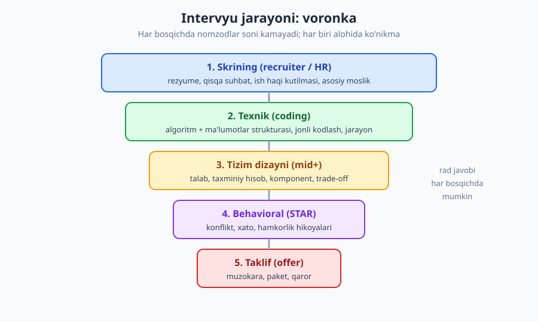
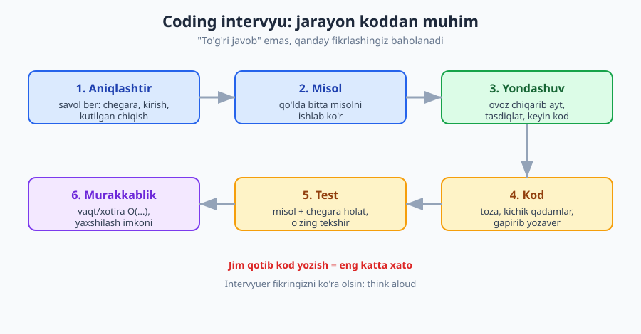
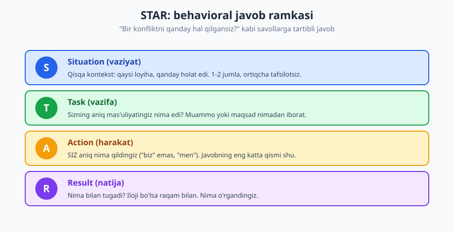

# 25 — Texnik intervyuga tayyorgarlik

[⬅️ Oldingi: 24 — Ishni topish: rezyume, portfolio va tarmoq](./24-ish-topish-rezyume-portfolio.md) · [🏠 README](./README.md) · [Keyingi: 26 — Frilans va masofaviy ish ➡️](./26-frilans-masofaviy-ish.md)

---

> **Bu bobda:** texnik intervyu — bu alohida, mashq qilinadigan **ko'nikma**, kundalik ishingizdan farq qiladigan o'yin. Hatto eng kuchli dasturchi ham tayyorgarliksiz yiqilishi mumkin. Intervyu jarayonining bosqichlarini (skrining → texnik → tizim dizayni → behavioral → taklif), coding intervyuda **jarayonni** (ovoz chiqarib o'ylash), tizim dizayni va behavioral (STAR) intervyularini, take-home vazifalarni, intervyuerga savol berishni va ish haqi muzokarasini o'rganasiz.
>
> **Halollik / Eslatma:** bu bobdagi maslahatlar *qonun emas, amaliy yo'l-yo'riq*. Intervyu jarayoni **nosimmetrik va ba'zan adolatsiz**: ba'zi savollar realdan uzoq ("leetcode" o'yini), ba'zi intervyuerlar charchagan yoki tayyorlanmagan, ba'zan moslik tasodifga ham bog'liq. Bitta rad javobi — sizning qiymatingiz haqidagi hukm emas. Bu yerdagi maslahat o'rtacha holatga to'g'ri keladi; konkret kompaniya va rolga qarab moslang.

---

## Intervyu — alohida ko'nikma

Eng katta yanglish tasavvur: "Men yaxshi dasturchiman, demak intervyuni ham yaxshi topshiraman." Bu noto'g'ri. Intervyu — **kunlik ishingizdan boshqacha o'yin**. Real ishda sizda Google, IDE, soatlar, jamoadoshlar va tinch muhit bor. Intervyuda esa: oq doska yoki bo'sh muharrir, soat, begona odam tikilib turibdi, va sizdan yarim soatda bir muammoni ovoz chiqarib yechish kutiladi. Bu — **alohida mashq qilinadigan ko'nikma**, xuddi velosiped haydash kabi: bila olishingiz mumkin, lekin uzoq vaqt mashq qilmasangiz, kamida bir oz qoqilasiz.

Shuning uchun birinchi qoida: **intervyuga oldindan tayyorlaning**. Ish topishni "ariza yuboraman, chaqirsalar boraman" deb emas, balki "intervyu mashqini boshlayman, keyin ariza yuboraman" deb ko'ring. Tayyorgarlik — bir hafta emas, bir necha hafta jarayon.

> **Eslatma:** "intervyu = ko'nikma" degani "siz aldash kerak" yoki "rolni o'ynash kerak" degani emas. Aksincha — bu sizni qiynalayotgan bosimni **mashq orqali oddiy holatga** aylantirish. Mashq qilgan odam intervyuda o'zi bo'lib qola oladi; mashq qilmagan odam hayajondan o'zini ko'rsata olmaydi.

---

## Intervyu jarayoni: bosqichlar

Ko'pchilik kompaniyada intervyu bir necha bosqichdan iborat voronka. Har bosqich **boshqa narsani** sinaydi va boshqacha tayyorgarlik talab qiladi.

1. **Skrining** — recruiter/HR bilan qisqa suhbat (15-30 daqiqa). Bu yerda chuqur texnika yo'q: rezyumengiz, asosiy moslik, ish haqi kutilmangiz tekshiriladi. Asosiy maslahat — ish haqi haqida bu bosqichda ehtiyot bo'ling (pastda muzokara qismida).
2. **Texnik (coding)** — algoritm/ma'lumotlar strukturasi yoki amaliy masala; jonli kodlash. Eng ko'p tayyorgarlik shu yerga ketadi.
3. **Tizim dizayni** — odatda mid darajadan boshlab. "Qisqartiruvchi havola xizmatini loyihalang" tipidagi ochiq masala.
4. **Behavioral** — "o'tmishdagi xatti-harakatingiz" haqida. "Konfliktni qanday hal qilgansiz", "xato qilgan vaqtingizni ayting". STAR usuli bilan.
5. **Taklif (offer) va muzokara** — diapazon, paket, qaror.

| Bosqich | Nimani sinaydi | Qanday tayyorlanish |
|---|---|---|
| Skrining | Asosiy moslik, kommunikatsiya | Rezyume, o'zingiz haqingizda 1 daqiqalik tanishtiruv, savollar tayyor |
| Coding | Muammo yechish jarayoni, kod | Algoritm/struktura mashqi + ovoz chiqarib o'ylashni mashq qilish |
| Tizim dizayni | Trade-off, ko'lam ongi | Komponent, taxminiy hisob, real tizimlarni o'rganish |
| Behavioral | Hamkorlik, o'z-o'zini anglash | 5-6 ta STAR hikoyani oldindan tayyorlash |
| Taklif | Muzokara, o'zingizni qadrlash | Bozor narxini bilish, diapazon, butun paket |

> **Eslatma:** har kompaniya jarayoni har xil. Startaplarda bu 1-2 bosqichga qisqaradi; yirik kompaniyalarda 5-6 turga cho'ziladi. Aniq jarayonni **recruiter'dan oldindan so'rang** — "Intervyu qaysi bosqichlardan iborat, har biri qancha davom etadi?" Bu savol sizni tashkilotli ko'rsatadi va aniq tayyorlanishingizga yordam beradi.

---

## Coding intervyu: jarayon koddan muhim

Eng ko'p qo'rqiladigan bosqich. Lekin sir shunda: **intervyuer to'g'ri javobni emas, qanday fikrlashingizni baholaydi.** Ko'p nomzod muammoni yarim yechib qolsa ham, jarayon kuchli bo'lgani uchun o'tadi; va aksincha — to'g'ri javob bersa-yu, jim qotib, fikrini ko'rsatmasa, yiqiladi.

Algoritm va ma'lumotlar strukturasini chuqur o'rganish uchun [Algoritmlar](../algoritmlar/README.md) kitobiga va mashq uchun [1000 masala](../1000-masala/README.md) to'plamiga murojaat qiling — bu bobda **texnikani emas, intervyu jarayonini** o'rgatamiz.

### Olti qadamli jarayon

1. **Aniqlashtir.** Darrov kod yozmang. Savol bering: kirish formati qanday? Chegaralar (eng katta hajm)? Bo'sh yoki noto'g'ri kirish bo'ladimi? Takror elementlarmi? Bu sizni o'ylaydigan dasturchi sifatida ko'rsatadi.
2. **Misol.** Bitta konkret misolni qo'lda ishlab ko'ring. Bu masalani to'g'ri tushunganingizni tasdiqlaydi va keyin test uchun ham asqotadi.
3. **Yondashuv (ovoz chiqarib).** Kod yozishdan **oldin** g'oyani tushuntiring: "Men avval sodda yondashuvni aytaman — bu O(n^2), keyin uni yaxshilashga harakat qilaman." Intervyuer rozimi yoki yo'naltiradimi — tinglang.
4. **Kod.** Endi yozing — toza, kichik qadamlar bilan, gapirib yozaver.
5. **Test.** O'z koodingizni misol va chegara holat (bo'sh, bitta element, juda katta) bilan o'zingiz tekshiring. Intervyuer aytishini kutmang.
6. **Murakkablik.** Vaqt va xotira murakkabligini ayting (O-notatsiya) va "buni yana yaxshilash mumkinmi?" deb o'ylang.

### "Ovoz chiqarib o'ylash" — hal qiluvchi

Bu bobning eng muhim bitta maslahati. Intervyuer sizning miyangizga kira olmaydi — u faqat siz **aytgan va yozgan** narsani ko'radi. Agar jim o'tirsangiz, hatto to'g'ri javobga kelsangiz ham, u "bu odam qanday fikrlaydi?" degan savolga javob ololmaydi.

**❌ Jim kodlash (yomon):**
> Nomzod savolni o'qiydi, 5 daqiqa jim o'ylaydi, keyin kod yoza boshlaydi va indamay yozadi. Intervyuer nima bo'layotganini bilmaydi: nomzod adashayaptimi, to'g'ri yo'ldami, qotib qoldimi? Oxirida kod ishlamasa, intervyuer hech qanday "qisman ball" bera olmaydi, chunki jarayonni ko'rmadi.

**✅ Ovoz chiqarib o'ylash (yaxshi):**
> "Mayli, men masalani shunday tushundim: massivdan ikki sonni topish kerakki, yig'indisi K bo'lsin. Bir savol — bir element ikki marta ishlatilsa bo'ladimi? ... Yo'q. Yaxshi. Birinchi xayolimga kelgan yo'l — har juftni tekshirish, bu O(n^2). Buni yaxshilash uchun hash-jadval ishlatsam, har element uchun K minus shu sonni qidiraman — O(n) bo'ladi. Shuni yozaman." (yozadi, gapirib) "Hozir bo'sh massiv holatini ham tekshiraman..."

Birinchi nomzod, hatto yaxshi koddan ham, kuchsiz taassurot qoldiradi. Ikkinchisi — intervyuerga hamkordek ko'rinadi.

### Qotib qolganda

Qotib qolish — **normal va kutiladi**; intervyuer ham bilib turibdi. Muhimi — qanday chiqishingiz. [02-bob](./02-muammoni-yechish-sanati.md)dagi muammo yechish texnikalari aynan shu yerda ishlaydi:

- **Sodda holatdan boshlang.** "Optimal yo'lni hozir ko'rmayapman, lekin sodda, ishlaydigan yechimni yozaman — keyin yaxshilaymiz." Ishlaydigan O(n^2) — hech narsadan yaxshi.
- **Ovoz chiqarib qiynaling.** "Hozir men ... qismida qiynalayapman, chunki ..." — intervyuer ko'pincha kichik ishora beradi. Bu **aldash emas** — bu hamkorlik.
- **Misolga qayting.** Yana bitta konkret misolni qo'lda ishlang; ko'pincha naqsh shu yerda ko'rinadi.

> **Eslatma:** intervyuerni **hakam** emas, **kelajakdagi jamoadosh** deb tasavvur qiling. Ko'p intervyuer aslida siz o'tishingizni **xohlaydi** (ularga yangi odam kerak). Ishorani qabul qilish, savol berish, hamkorlik — bularning hammasi musbat signal. "Yordam so'rasam zaif ko'rinaman" — noto'g'ri tasavvur; real jamoada ham yordam so'rash kuch belgisi.

### Jonli kodlash muhiti

Coding intervyu oq doskada, umumiy muharrirda (CoderPad, HackerRank) yoki o'z mashinangizda bo'lishi mumkin. Tayyorgarlik:

- **Muhitni oldindan so'rang:** "Qaysi vositada kodlaymiz? IDE bo'ladimi yoki oddiy muharrir?" Agar avtomatik to'ldirish (autocomplete) bo'lmasa, bunga moslashing.
- **Bitta tilni yaxshi biling.** Intervyuda eng qulay tilingizni ishlating; sintaksisni eslab qolish uchun vaqt sarflamang.
- **Oq doskada mashq qiling.** Klaviatura yordamisiz, qog'ozda kod yozishni sinab ko'ring — bu boshqacha ko'nikma.

---

## Tizim dizayni intervyusi (mid+)

Mid darajadan boshlab odatda tizim dizayni bosqichi qo'shiladi. Masala ochiq va "to'g'ri javob" yo'q: "Instagram'ga o'xshash xizmatni loyihalang", "URL qisqartirgich yarating". Bu yerda baholanadigan narsa — **trade-off ongi va tuzilgan fikrlash**, aniq bir arxitektura emas.

Tuzilgan yondashuv:

1. **Talablarni aniqlang.** Funksional ("foydalanuvchi rasm yuklaydi") va nofunksional ("kuniga 10 mln yuklash, kechikish past bo'lsin"). Savol bering, taxmin qilmang.
2. **Taxminiy hisob (estimation).** "Kuniga 10 mln yuklash → sekundiga ~115, har biri 2MB → kuniga ~20TB." Aniq raqam emas, **kattalik tartibi** muhim.
3. **Yuqori darajadagi komponentlar.** Mijoz → API → xizmat → ma'lumotlar bazasi / kesh / navbat / fayl ombori. Doskaga chizing.
4. **Chuqurlashtiring va trade-off ayting.** "Bu yerda SQL yoki NoSQL? Men ... sababli NoSQL tanlayman, lekin trade-off — ..." Aynan shu trade-off muhokamasi ball keltiradi.

Chuqurroq o'rganish uchun [Dasturlash arxitekturasi](../arxitektura/README.md) kitobiga murojaat qiling — u yerda ko'lam, kesh, navbat, CAP teoremasi batafsil.

> **Trade-off:** tizim dizayni intervyusida eng katta tuzoq — **chuqurlik darajasini noto'g'ri tanlash**. Juda yuzaki qolsangiz ("ma'lumotlar bazasi ishlatamiz, tamom"), tajribangiz ko'rinmaydi. Juda chuqur ketsangiz (bitta jadval sxemasini 20 daqiqa muhokama qilsangiz), vaqt tugaydi va umumiy rasm yarim qoladi. To'g'ri yo'l — avval butun tizimni yuzadan chizish, keyin intervyuer "qaysi qismni chuqurlashtiraylik?" deganini so'rash yoki o'zingiz eng qiziq qismni tanlash. Darajangizga moslang: junior'dan chuqur masshtab kutilmaydi, staff'dan esa faqat komponent chizish yetarli emas.

---

## Behavioral intervyu: STAR usuli

"Texnik bo'lmagan" deb e'tibordan chetda qolmang — behavioral intervyu ko'pincha **xuddi coding kabi muhim**, ba'zan undan ham. Bu yerda "o'tmishdagi xatti-harakat kelajakni bashorat qiladi" g'oyasi bilan, real vaziyatlar so'raladi: "Bir konfliktni qanday hal qilgansiz?", "Xato qilgan vaqtingizni ayting", "Boshqa fikrdagi odam bilan qanday ishlagansiz?"

Eng yaxshi javob ramkasi — **STAR**:

- **Situation** — qisqa kontekst (qaysi loyiha, qanday holat).
- **Task** — sizning aniq mas'uliyatingiz/muammo.
- **Action** — SIZ aniq nima qildingiz ("men", "biz" emas).
- **Result** — nima bilan tugadi, iloji bo'lsa raqam bilan, va nima o'rgandingiz.

**❌ Yomon javob (tartibsiz, "biz", natijasiz):**
> "Ha, bizda bir marta katta muammo bo'lgan, deploy buzilib ketgandi, hammamiz qattiq ishladik, oxiri tuzatdik. Jamoamiz juda zo'r edi."

Bu javobda **siz** nima qilganingiz yo'q, natija o'lchanmagan, va hech narsa o'rganilmagan. Intervyuer sizni emas, "jamoa"ni ko'rdi.

**✅ Yaxshi javob (STAR, "men", natija + saboq):**
> **(S)** "O'tgan yili bizda to'lov xizmati ishlab turgan paytda kutilmagan xato chiqdi — foydalanuvchilar to'lay olmay qoldi. **(T)** Men o'sha vaqtda navbatchi muhandis edim, muammoni tezda topib, tiklash mening zimmamda edi. **(A)** Men avval log'larni tekshirib, xato yangi deploy'dan kelganini aniqladim, darrov oldingi versiyaga qaytardim (rollback), keyin jamoaga aniq xabar yozdim va sababini izolyatsiya qildim — bitta null tekshiruvi tushib qolgan edi. **(R)** Xizmat 12 daqiqada tiklandi. Keyin men shu holat uchun avtomatik test va deploy oldidan tekshiruv qo'shdim, shunday xato qaytmasligi uchun. Bu menga monitoring va tinch holda harakat qilishni o'rgatdi."

Farqi yaqqol: ikkinchi javobda aniq vaziyat, sizning rolingiz, konkret harakatlaringiz, o'lchangan natija va saboq bor.

### Hikoyalarni oldindan tayyorlang

5-6 ta universal STAR hikoyasini oldindan yozib qo'ying — ular ko'p savolga moslashadi:
- Bir qiyin **konflikt/kelishmovchilik** (qarang: [19-bob](./19-fikr-mulohaza-mentorlik.md) — feedback va mojaro).
- Bir **xato/muvaffaqiyatsizlik** va undan saboq.
- Bir **muvaffaqiyat/g'urur** loyiha.
- Bir marta **muddatga yetisholmaganingiz** yoki bosim ostida ishlaganingiz.
- Bir marta **boshqalarga yordam berganingiz** yoki yetakchilik qilganingiz.

### Halollik — STAR'ning poydevori

To'qib chiqarmang. Tajribali intervyuer keyingi savol bilan ("o'sha paytda boshqa nima sinab ko'rgan edingiz?") to'qima hikoyani osongina ochib tashlaydi. Real, hatto kichik hikoya — yaxshi sayqallangan yolg'ondan yaxshiroq. "Xato qilgan vaqtingiz"da haqiqiy xatoni ayting va undan o'rganganingizni ko'rsating — bu kuch belgisi, zaiflik emas. Kasbiy halollik haqida [19-bob](./19-fikr-mulohaza-mentorlik.md)ga ham qarang.

---

## Take-home vazifa

Ba'zi kompaniyalar jonli coding o'rniga (yoki qo'shimcha) **uyga vazifa** beradi: "Bu kichik ilovani 2-3 soatda yozing." Bu sizning real ish uslubingizni ko'rsatish imkoni — toza kod, test, README. Bir vaqtning o'zida — **vaqt tuzog'i**.

| ✅ Take-home'ni to'g'ri qilish | ❌ Tuzoqqa tushish |
|---|---|
| Aytilgan vaqt doirasida qoling (3 soat desa ~3 soat) | "Mukammal qilaman" deb 20 soat sarflash |
| Toza, o'qiladigan kod + bir necha test | Hammasini bir faylga, testsiz tashlash |
| README: qanday ishga tushirish, qaror izohi | Hech qanday hujjatsiz topshirish |
| "Vaqt yetmadi, lekin X, Y, Z ni qo'shgan bo'lardim" deb yozish | Kamchilikni yashirish |
| Versiya nazorati bilan, ma'noli commit'lar | Bitta "final" commit, ZIP arxiv |

Take-home'da kod sifati [05-bob](./05-nomlash-sanati.md) (nomlash), test [11-bob](./11-testlash-madaniyati.md) va hujjat [18-bob](./18-hujjatlash.md) ko'nikmalarini ko'rsatish vaqti keldi. README'ga **qaror izohini** qo'shish (nega bu yondashuvni tanladingiz, qaysi trade-off'larni qildingiz) — kuchli signal.

> **Trade-off:** take-home halol emas degan tanqid bor — u sizning ma'lum vaqtingizni **tekin** oladi, ayniqsa siz bir vaqtda 5 kompaniyada intervyu bersangiz. Bu adolatli e'tiroz. Shuning uchun: agar vazifa juda katta bo'lsa (kunlar talab qilsa), buni recruiter bilan muhokama qiling yoki rad eting. Lekin o'rtacha (2-4 soat) take-home — jonli coding'ning bosimi yoqmaydigan ko'p odam uchun aslida **adolatliroq** format: tinch muhitda, real sharoitda ishlaysiz. Qaysi formatda yaxshi chiqishingizni biling va shunga ko'ra kompaniyalarni tanlang.

---

## Intervyuerga savol berish

Intervyu — **bir tomonlama emas**. Siz ham kompaniyani intervyu qilasiz: bu yer sizga mosmi? Intervyu oxirida "Sizda savol bormi?" deyilganda **"yo'q" demang** — bu eng yomon signallardan biri ("bu odam qiziqmaydi yoki tayyorlanmagan" deb o'qiladi).

Yaxshi savollar (jamoa, jarayon, o'sish haqida):
- "Jamoaning bir kuni qanday o'tadi? Code review qanday ishlaydi?"
- "Bu yerda muhandis qanday o'sadi — junior'dan senior'gacha yo'l qanday?"
- "Eng katta texnik qiyinchiligingiz hozir nima?"
- "Yangi odam birinchi oyida nimaga erishsa, muvaffaqiyatli hisoblanadi?"
- "Texnik qarz va yangi feature orasidagi muvozanatni qanday hal qilasiz?"

**❌ Zaif savol:** "Ish haqi qancha?" (texnik intervyuerga — noo'rin) yoki "Kompaniyangiz nima qiladi?" (saytdan o'qish kerak edi).

**✅ Kuchli savol:** "Siz bu yerda ishlashda nimani eng qadrlaysiz, va nimani o'zgartirgan bo'lardingiz?" — bu samimiy javob keltiradi va sizning yetukligingizni ko'rsatadi.

> **Eslatma:** savol berish nafaqat taassurot uchun — bu sizning **haqiqiy ma'lumot yig'ish** vositangiz. Yomon jamoa, toksik madaniyat, tartibsiz jarayonni shu savollar orqali ilg'ab olishingiz mumkin. Sizni ishga olishlari bilan birga, **siz ham ularni tanlayapsiz**. Bu muvozanat sizni kuchliroq, ishonchli his qildiradi.

---

## Ish haqi muzokarasi

Eng noqulay, lekin moliyaviy jihatdan **eng ta'sirli** bosqich. Bir necha asosiy qoida:

- **Birinchi raqamni aytmaslikka harakat qiling.** "Ish haqi kutilmangiz qancha?" deyilsa, "Avval rolni va mas'uliyatni yaxshiroq tushunsam, keyin gaplashsak. Bozor diapazoni sizda qancha?" deb qaytaring. Birinchi raqamni aytgan ko'pincha yutqazadi.
- **Raqam emas, diapazon bering.** Agar aytishingiz shart bo'lsa, oldindan o'rganib qo'ygan bozor narxiga asoslangan diapazon ayting (eng pastki raqam — siz haqiqatan rozi bo'ladigan miqdor).
- **Butun paketga qarang, nafaqat oylik.** Ish haqi — paketning bir qismi: bonus, kapital ulush (equity), ta'til, masofaviy ishlash, sug'urta, o'rganish byudjeti, o'sish imkoni. Ba'zan past oylik + yaxshi o'sish + masofaviy ish > yuqori oylik + toksik muhit.
- **Rad qilish huquqingiz bor.** Taklif yoqmasa, "rahmat, lekin men boshqa yo'nalishda qaror qildim" deyish — to'liq normal. "Ha" deyishga majbur emassiz.

**❌ Zaif muzokara:**
> Recruiter: "Sizning kutilmangiz qancha?" Nomzod darrov: "5 million." — Ehtimol kompaniya 8 millionga tayyor edi; nomzod o'ziga 3 million zarar qildi va muzokarani yopdi.

**✅ Kuchli muzokara:**
> Recruiter: "Kutilmangiz qancha?" Nomzod: "Rolni to'liq tushunib, sizning diapazoningizni eshitsam yaxshi bo'lardi — bozorda bu rol uchun raqamlarni ko'rganman, lekin aniq miqdor mas'uliyat va paketga bog'liq." (Kompaniya diapazon aytadi.) "Tushunarli. Mening tajribam va shu rolning talablariga qarab, men yuqori uchdan o'ylab kelgan edim — buni muhokama qilsak bo'ladimi?"

> **Trade-off:** muzokara qilish "ochko'zlik" yoki "noqulay" tuyulishi mumkin — bu hissiyot tabiiy, lekin **muzokara — normal va kutiladi**. Kompaniya birinchi taklifni odatda ozgina pastroq beradi, aynan siz muzokara qilishingizni kutib. Lekin har doim cheksiz tortishish ham to'g'ri emas: agar taklif adolatli va siz roldan mamnun bo'lsangiz, juda qattiq tortishish munosabatni buzishi mumkin. O'lchov — bozor narxini bilish va o'zingizni hurmat qilish, lekin ochko'zlik bilan emas. Eng muhimi: **birinchi raqamni avval aytmaslik** deyarli har doim foydangizga.

---

## Rad javobi va hayajon boshqaruvi

**Bitta rad — yakun emas.** Intervyu jarayoni nosimmetrik va ba'zan adolatsiz: yaxshi nomzod ham yiqilishi mumkin (charchagan intervyuer, mos kelmagan savol, oddiy omadsizlik). Rad javobi sizning **qiymatingiz haqida hukm emas** — u faqat "bu kuni, bu kompaniyada, bu savolda mos kelmadi" degani.

- **Fikr-mulohaza so'rang.** "Keyingi safar yaxshiroq tayyorlanishim uchun, qaysi sohada kuchsiz chiqdim?" Hamma javob bermaydi, lekin so'rash o'sish belgisi (qarang: [19-bob](./19-fikr-mulohaza-mentorlik.md)).
- **Har intervyudan keyin yozib qo'ying.** Qaysi savol qiyin bo'ldi, nima yaxshi ketdi. Keyingi mashqni shunga qarating.
- **Hayajonni mashq bilan kamaytiring.** Stress ko'pincha **noma'lumlikdan**. Soxta intervyu (mock interview) — do'st bilan yoki onlayn platformada — bosimni oldindan boshdan kechirib, uni oddiy holatga aylantiradi.
- **Birinchi intervyularni "mashq" deb oling.** Eng xohlagan kompaniyangizga birinchi bo'lib bormang; bir-ikki kamroq muhim intervyuda forma toping.

> **Eslatma — halol haqiqat:** "leetcode" o'yini ko'pincha **real ishdan farq qiladi**. Siz har kuni ikkilik daraxtni teskari aylantirib o'tirmaysiz; intervyu shunchaki bir filtr. Bu adolatsiz tuyulishi mumkin va ko'p tajribali muhandis ham buni tan oladi. Lekin hozircha o'yin shunaqa — uni mashq qilib o'tib oling, keyin real ishda asosiy ko'nikmalaringiz baribir muhimroq bo'ladi. Bir kompaniyaning rad javobi siz "yomon dasturchi" ekanligingizni anglatmaydi — bu faqat bitta filtrning bitta natijasi.

---

## Asosiy g'oyalar (bobni qisqacha)

- **Intervyu — alohida ko'nikma**, kundalik ishdan boshqacha o'yin. Eng kuchli dasturchi ham tayyorgarliksiz yiqilishi mumkin — oldindan mashq qiling.
- **Coding intervyuda jarayon koddan muhim:** aniqlashtir → misol → yondashuvni ovoz chiqarib ayt → kod → test → murakkablik. **"Ovoz chiqarib o'ylash" — hal qiluvchi.** Intervyuer faqat aytgan/yozganingizni ko'radi.
- Qotib qolganda — sodda holatdan boshlang, ovoz chiqarib qiynaling, intervyuerni **hamkor** deb biling. Yordam so'rash kuch belgisi.
- **Tizim dizaynida** trade-off va tuzilgan fikrlash baholanadi: talab → taxminiy hisob → komponent → chuqurlashtirish. Chuqurlik darajasini darajangizga moslang.
- **Behavioral'da STAR** (Situation-Task-Action-Result) ishlating; 5-6 ta hikoyani oldindan tayyorlang; "men" deng, "biz" emas; **halol bo'ling**.
- **Take-home'da** vaqt doirasida qoling, toza kod + test + README bering — bu vaqt tuzog'i.
- **Intervyuerga savol bering** — "savolim yo'q" yomon signal; siz ham ularni intervyu qilyapsiz.
- **Ish haqi muzokarasi:** birinchi raqamni aytmang, diapazon bering, butun paketga qarang, rad qilish huquqingiz bor — ayblik hissisiz.
- **Bitta rad — yakun emas.** Jarayon nosimmetrik va ba'zan adolatsiz; "leetcode" realdan farq qiladi; fikr-mulohaza so'rang, mashq qiling.

---

## Mashqlar

### Oson

**1-mashq.** Coding intervyuning olti qadamini (aniqlashtir, misol, yondashuv, kod, test, murakkablik) to'g'ri tartibda yozing va har biriga bir jumlada "nega kerak"ligini ayting.

**2-mashq.** Quyidagi gaplardan qaysilari to'g'ri, qaysilari noto'g'ri? Bir jumlada izohlang: (a) "Coding intervyuda eng muhimi — to'g'ri javobni topish." (b) "Intervyuerga 'savolim yo'q' deyish — yaxshi, vaqtni tejaydi." (c) "Behavioral intervyuda 'biz' o'rniga 'men' deyish kerak."

**3-mashq.** Sizdan ish haqi kutilmangiz so'raldi: "Qancha maosh kutasiz?" Birinchi raqamni aytmaslik uchun bitta tabiiy javob jumlasini yozing.

### O'rta

**4-mashq.** O'z tajribangizdan bitta real **behavioral savolga STAR bilan javob tayyorlang**: "Bir konfliktni yoki kelishmovchilikni qanday hal qilgansiz?" To'rt qismni (S, T, A, R) aniq belgilab yozing va "men" tilida bo'lsin.

**5-mashq.** Sizni intervyu qilayotgan kompaniyaga **intervyuerga 3 ta savol yozing** — biri jamoa/jarayon haqida, biri o'sish/karyera haqida, biri esa kompaniyani halol baholashga yordam beradigan (toksik muhitni ilg'ash) savol bo'lsin.

**6-mashq.** Quyidagi take-home holatini baholang: nomzodga "3 soatda kichik TODO ilovasi yozing" deyilgan. Nomzod 15 soat sarflab, mukammal qilib, lekin testsiz va README'siz topshirdi. Bu yondashuvning 3 ta xatosini ayting va har birini qanday tuzatishni yozing.

### Qiyin

**7-mashq.** Coding intervyuda sizga masala berildi va siz optimal yechimni topolmayapsiz, 10 daqiqa qoldi. Qotib qolgan holatda **ovoz chiqarib** nima deyishingizni va qanday harakat qilishingizni qadam-baqadam yozing (kamida 4 qadam): sodda yechim, ishora so'rash, test, halol kommunikatsiya qanday ko'rinadi?

**8-mashq.** Sizga taklif keldi: A kompaniyasi 8 mln oylik, lekin haftada 6 kun ofisda, toksik tuyulgan jamoa; B kompaniyasi 6 mln oylik, to'liq masofaviy, kuchli mentorlik va o'sish, qulay madaniyat. (a) "Butun paket" tushunchasidan foydalanib, qaror jarayoningizni yozing — faqat oylikka qaramang. (b) Agar A ni rad etmoqchi bo'lsangiz, halol va hurmatli rad jumlasini yozing. (c) Bu tanlovda yagona "to'g'ri javob" bormi — nega?

Yechimlar

> Eslatma: bu mashqlarning ko'pida yagona to'g'ri javob yo'q — quyida **namuna javoblar va baholash mezonlari** berilgan.

### 1-mashq yechimi
Tartib: (1) **Aniqlashtir** — masalani noto'g'ri tushunib, noto'g'ri narsani yechmaslik uchun; (2) **Misol** — tushunchani tasdiqlash va keyin test asosi; (3) **Yondashuv (ovoz chiqarib)** — intervyuer fikringizni ko'rsin va yo'naltirsin, behuda kod yozmang; (4) **Kod** — endi toza, kichik qadamlar bilan yozish; (5) **Test** — chegara holatlarda ishlashini o'zingiz tekshirish; (6) **Murakkablik** — yechimning sifatini (O-notatsiya) baholash va yaxshilash imkonini o'ylash. Mezon: tartib to'g'ri va har bandda "nega" mavjudmi.

### 2-mashq yechimi
(a) **Noto'g'ri** — eng muhimi jarayon (ovoz chiqarib o'ylash, savol berish); ko'p odam yarim yechim bilan ham o'tadi, jim to'g'ri javob esa kuchsiz taassurot qoldiradi. (b) **Noto'g'ri** — "savolim yo'q" eng yomon signallardan; savol berish qiziqish va yetuklik ko'rsatadi. (c) **To'g'ri** — behavioral'da sizning aniq hissangiz ("men") baholanadi, "biz" sizning rolingizni yashiradi. Mezon: har baho to'g'ri va izoh o'rinli.

### 3-mashq yechimi
Namuna: "Rolni va mas'uliyatni to'liqroq tushunsam, keyin aniq gaplashsak yaxshi bo'lardi. Bu pozitsiya uchun sizning byudjet diapazoningiz qancha?" Mezon: javob (1) birinchi aniq raqamni bermaydi, (2) sababli va hurmatli, (3) to'pni kompaniyaga qaytaradi. "Bilmayman" yoki darrov raqam aytish — zaif.

### 4-mashq yechimi
Bu shaxsiy — to'g'ri javob yo'q. Mezon: (S) qisqa, aniq kontekst bormi (qaysi loyiha/holat); (T) sizning aniq vazifa/mas'uliyatingiz aytilganmi; (A) **konkret, "men" tilidagi harakatlar** — javobning eng katta qismi; (R) o'lchanadigan yoki aniq natija + saboq bormi. Konflikt halol va konstruktiv hal qilingani ko'rinsin (boshqalarni ayblamasdan). To'qima emas, real bo'lsin.

### 5-mashq yechimi
Namuna: (jamoa/jarayon) "Code review va deploy jarayoningiz qanday ishlaydi?"; (o'sish) "Bu yerda muhandis junior'dan senior'gacha qanday o'sadi, qanday qo'llab-quvvatlanadi?"; (halol baholash) "Jamoada odamlar o'rtacha qancha vaqt qoladi, va ketganlar nega ketgan?" yoki "Siz bu yerda ishlashda nimani o'zgartirgan bo'lardingiz?" Mezon: uchchala kategoriya qoplangami; uchinchi savol haqiqatan toksiklik/turnover signalini ilg'ashga qaratilganmi.

### 6-mashq yechimi
Uch xato va tuzatish: (1) **Vaqt tuzog'i** — 3 soat o'rniga 15 soat: bu barqaror emas va boshqa nomzodlar bilan adolatsiz; tuzatish — aytilgan vaqt doirasida qolish, yetmagan qismni README'da "vaqt yetmadi, X qo'shgan bo'lardim" deb ochiq yozish. (2) **Testsiz** — sifat va ishonchni ko'rsatmaydi; tuzatish — hech bo'lmasa bir necha asosiy test qo'shish ([11-bob](./11-testlash-madaniyati.md)). (3) **README'siz** — qanday ishga tushirishni va qaror izohini ko'rsatmaydi; tuzatish — qisqa README: ishga tushirish, yondashuv, trade-off ([18-bob](./18-hujjatlash.md)). Mezon: uch xato to'g'ri aniqlangan va har biriga amaliy tuzatish bormi.

### 7-mashq yechimi
Namuna qadamlar: (1) **Sodda yechimni e'lon qiling**: "Optimal yo'lni hozir aniq ko'rmayapman, lekin ishlaydigan sodda yechimni yozaman — bu O(n^2) bo'ladi, keyin yaxshilashga harakat qilamiz." (2) **Ovoz chiqarib qiynaling**: "Men ... qismida qiynalayapman, chunki ..." — bu ko'pincha intervyuerdan ishora keltiradi. (3) **Ishorani qabul qiling**: agar intervyuer yo'naltirsa, minnatdorchilik bildirib, undan foydalaning — bu hamkorlik, aldash emas. (4) **Bor narsani test qiling**: ishlaydigan sodda yechimni misol bilan tekshiring; ishlaydigan O(n^2) — hech narsadan yaxshi. (5) **Halol yakun**: "Vaqt tugayapti; agar ko'proq bo'lsa, men hash-jadval bilan O(n) ga tushirishni sinab ko'rardim." Mezon: ovoz chiqarib o'ylash, sodda-avval-strategiya, hamkorlik va halollik bormi — jim qotib qolish yoki taslim bo'lish emas.

### 8-mashq yechimi
(a) Mezon: qaror faqat oylikka emas, **butun paketga** tayanadimi — masofaviy ish (vaqt/transport tejovi), mentorlik va o'sish (uzoq muddatda maoshdan ham qimmat), madaniyat (toksik muhit = burnout xavfi, qarang [28-bob](./28-barqaror-karyera-burnout.md)). Ko'p hollarda B ning umumiy qiymati yuqoriroq ko'rinadi (2 mln farq o'sish va sog'lom muhit bilan qoplanadi), lekin moliyaviy holat (masalan, hozir pul zarurati) ham omil — buni tan olish kerak. (b) Namuna rad: "Taklifingiz uchun chin dildan rahmat — jamoangiz bilan tanishish yoqimli bo'ldi. Uzoq o'ylab, men hozir o'sish va ishlash uslubi jihatidan boshqa imkoniyatni tanlashga qaror qildim. Kelajakda yo'llarimiz kesishishidan xursand bo'lardim." (c) **Yo'q, yagona to'g'ri javob yo'q** — bu sizning qadriyatlaringiz, moliyaviy holatingiz va karyera bosqichingizga bog'liq. Mezon: javob "butun paket" mantig'ini qo'llaydimi, rad hurmatli va halolmi, va "to'g'ri javob kontekstga bog'liq"ligini tan oladimi.

---

[⬅️ Oldingi: 24 — Ishni topish: rezyume, portfolio va tarmoq](./24-ish-topish-rezyume-portfolio.md) · [🏠 README](./README.md) · [Keyingi: 26 — Frilans va masofaviy ish ➡️](./26-frilans-masofaviy-ish.md)
