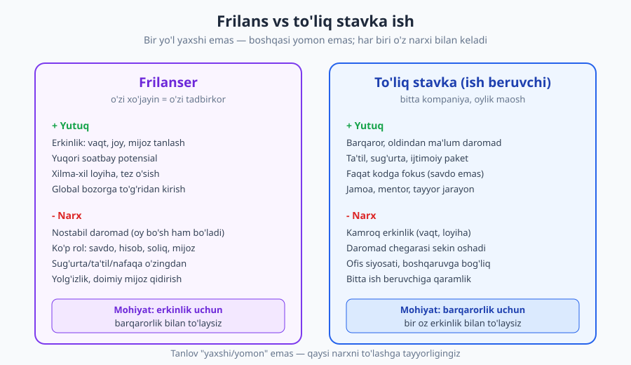
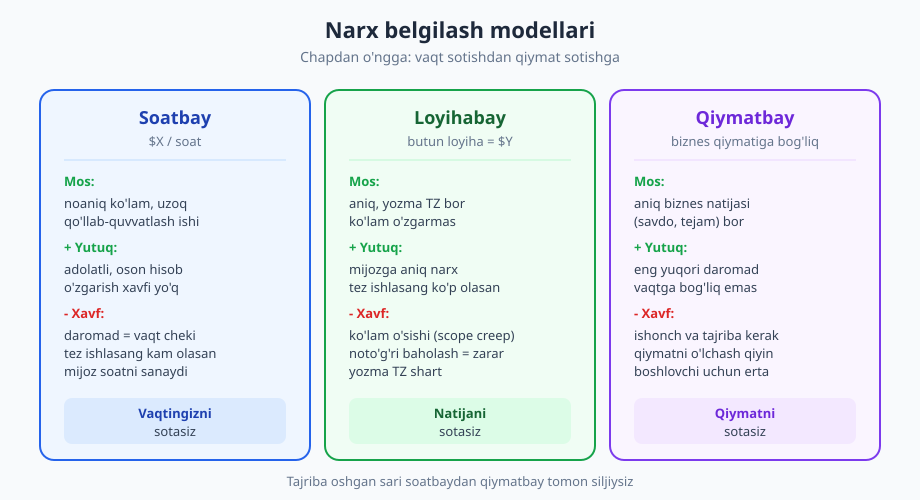
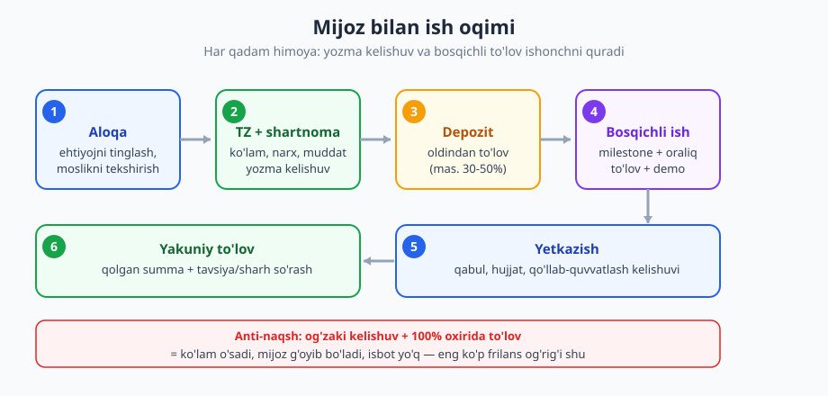

# 26 — Frilans va masofaviy ish

[⬅️ Oldingi: 25 — Texnik intervyuga tayyorgarlik](./25-texnik-intervyu.md) · [🏠 README](./README.md) · [Keyingi: 27 — Professional etika, mas'uliyat va huquq ➡️](./27-etika-masuliyat.md)

---

> **Bu bobda:** frilans va masofaviy ishning haqiqiy yuzi — erkinlik vs barqarorlik trade-off'i, mijoz topish, narx belgilash (soatbay/loyihabay/qiymatbay), yozma shartnoma va TZ (texnik topshiriq), depozit va bosqichli to'lov, masofaviy ish disiplini, vaqt zonasi va madaniyat, hamda O'zbekistondan global bozorga chiqish. Eng muhim g'oya: **frilanser faqat dasturchi emas — u tadbirkor** (savdo, hisob, mijoz munosabati, soliq ham o'z bo'yniga tushadi).
>
> **Halollik / Eslatma:** bu bobdagi maslahatlar *qonun emas, amaliy yo'l-yo'riq*. Frilans **hammaga mos kelmaydi**: ko'pchilik barqaror oylik va sotuv yukisiz ishni afzal ko'radi, va bu butunlay normal. "Tushdan keyin plyajda noutbuk" — marketing afsonasi; real frilans daromad nostabil boshlanadi va sotuv/hisob yuki bilan keladi. Soliq va rasmiylashtirish bo'yicha bu yerdagi gap **umumiy eslatma**, huquqiy maslahat emas — har mamlakat (va O'zbekiston) qoidalari o'zgaradi, mahalliy mutaxassisdan tasdiqlang.

---

## Frilanser kim — dasturchi yoki tadbirkor?

Eng katta tushunmovchilik shu yerda. Ko'pchilik "frilanser bo'laman" deganda "uydan kod yozaman, xo'jayin yo'q" deb tasavvur qiladi. Bu — rasmning faqat o'ndan biri. **Frilanser — bu bir kishilik biznes.** Sizning ishingiz endi faqat kod emas:

- **Savdo (sales):** mijoz topish, taklif yozish, o'zingizni sotish.
- **Hisob (accounting):** invoys yozish, to'lovni kuzatish, xarajat hisobi.
- **Mijoz munosabati:** kutilmani boshqarish, muloqot, nizoni hal qilish.
- **Soliq va rasmiylashtirish:** YaTT/o'zini-o'zi band qilish, hisobot, valyuta.
- **Va undan keyin** — kod.

Tajribali frilanserlar vaqtining ko'pi-da yarmi **kod yozishdan tashqari** ishga ketishini aytadi. Agar siz bularni yoqtirmasangiz yoki bunga vaqt ajratishga tayyor bo'lmasangiz — frilans sizga mos kelmasligi mumkin, va buni oldindan bilish — yutuq.

> **Eslatma:** "mos kelmasligi mumkin" — kamsitish emas. Ko'p ajoyib dasturchi to'liq stavka ishda gullaydi, chunki ular sof texnik ishni yoqtiradi, sotuv va hisobni emas. Frilans "yuqori daraja" emas — bu **boshqa kasb**, dasturchilik ustiga qo'shilgan tadbirkorlik.

---

## 1. Frilans vs to'liq stavka: erkinlik vs barqarorlik

Bu birinchi va eng fundamental qaror. U "yaxshi vs yomon" emas — **trade-off**.

| Jihat | Frilans | To'liq stavka ish |
|---|---|---|
| **Daromad** | Nostabil (oy bo'sh ham bo'ladi), lekin yuqori potensial | Barqaror, oldindan ma'lum, sekin oshadi |
| **Erkinlik** | Yuqori: vaqt, joy, mijoz, loyiha tanlash | Cheklangan: jadval, loyiha tayinlanadi |
| **Rollar** | Ko'p: dasturchi + savdo + hisob + soliq | Faqat dasturchi (qolganini kompaniya qiladi) |
| **Xavfsizlik to'ri** | Yo'q: ta'til, sug'urta, nafaqa o'zingdan | Bor: ijtimoiy paket, ish beruvchi javobgar |
| **O'sish** | Tez, xilma-xil, lekin yolg'iz | Jamoa, mentor, tuzilgan yo'l (qarang: [23-bob](./23-karyera-narvoni.md)) |
| **Mas'uliyat** | Hammasi sizda | Jamoa bilan taqsim |

> **Trade-off:** frilans erkinlik beradi, lekin uning narxi — **barqarorlik va sokinlik**. Daromad nostabil, sotuv yuki doimiy, yolg'izlik real. To'liq stavka barqarorlik beradi, lekin narxi — **erkinlik va daromad chegarasi**: kim, qachon, nima ustida ishlashingizni ko'p hollarda boshqa hal qiladi. To'g'ri tanlov shaxsiyatingiz va hayot bosqichingizga bog'liq: oilangiz, jamg'armangiz, xavfga munosabatingiz. Ko'p kishi **gibrid** yo'l tutadi — to'liq stavkada ishlab, yon tomondan kichik frilans loyihalar bilan ko'nikma va mijoz bazasini sekin quradi, keyin xohlasa to'liq o'tadi. Bu — eng kam xavfli boshlash.

### Misol + anti-misol: o'tish qarori

**❌ Hovliqib o'tish:**
> "Ish zerikarli, frilansda 2 baravar olaman deyishadi — ertaga ariza yozaman." Jamg'arma yo'q, mijoz yo'q, portfolio yo'q. Birinchi 3 oy daromad nol; panika; birinchi kelgan eng arzon, eng qiyin mijozga "ha" deb yuboradi.

**✅ Tayyorlangan o'tish:**
> Ishda turib, kechqurun 2-3 kichik loyiha qiladi (portfolio + birinchi tavsiyalar). 4-6 oylik xarajat jamg'armasini yig'adi. Bir nechta doimiy mijoz yoki kanal (platforma profili, tarmoq — qarang: [24-bob](./24-ish-topish-rezyume-portfolio.md)) qaror topgach, to'liq o'tadi. Birinchi oy bo'sh bo'lsa ham panika yo'q — jamg'arma bor.

---

## 2. Mijoz topish: birinchi mijoz muammosi

Frilansning eng og'ir to'sig'i — **birinchi mijoz**. Tajriba yo'q → mijoz yo'q; mijoz yo'q → tajriba yo'q. Bu halqani uzishning yo'llari:

**Mijoz topish kanallari (ishonch tartibida, pastdan yuqoriga):**

| Kanal | Mohiyat | Ishonch / narx |
|---|---|---|
| **Platformalar** (Upwork, Fiverr sezgisi) | Tayyor bozor, ko'p taklif | Past narx, raqobat qattiq, lekin **boshlashga eng oson** |
| **To'g'ridan-to'g'ri** (o'z sayti, cold outreach) | Mijoz bilan bevosita | O'rta; profil va namuna kerak |
| **Tavsiya (referral)** | Mijoz mijoz keltiradi | **Eng yuqori ishonch, eng yaxshi narx** |

Boshlovchi uchun mantiq oddiy: **platformadan boshlang** (birinchi tajriba, sharhlar, portfolio), keyin har bir mijozdan **tavsiya so'rang** va to'g'ridan-to'g'ri munosabatga o'ting. Tavsiya — frilansning oltin tomiri: ishonch tayyor keladi, narx muzokarasi yengil, mijoz "qiyin" bo'lmaydi. Tarmoq qurish bu yerda hal qiluvchi (qarang: [24-bob](./24-ish-topish-rezyume-portfolio.md)).

**Profil va portfolio.** Mijoz sizni ko'rmaydi — faqat profilingizni ko'radi. Shuning uchun: 2-3 ta aniq, natijaga yo'naltirilgan namuna ("bu do'kon saytini qurdim, konversiya 18% oshdi"), aniq nisha (hamma narsa emas — "PHP/Laravel backend" yoki "Shopify do'konlar"), va aniq taklif. **Nisha tanlash** muhim: "men hamma narsani qilaman" — hech kim sizni eslamaydi; "men restoran saytlarini qilaman" — restoran egasi to'g'ri sizni topadi.

> **Eslatma:** birinchi loyihani **arzonga yoki hatto bepul** qilish vasvasasi bor — "portfolio uchun". Ba'zan (1-2 marta, aniq maqsadli) bu o'rinli. Lekin bu naqshga **qarshi** bo'lib qolish xavfli: "men hali yangiman, arzon olaman" deb cheksiz davom etib, hech qachon adolatli narxga o'tolmaslik — keng tarqalgan tuzoq. Bepul ishni baholash qiyin va u ko'pincha "qiyin mijoz" ni jalb qiladi (pastga qarang).

---

## 3. Narx belgilash: o'zini arzonga sotmaslik

Narx — boshlovchi frilanserlarning eng katta og'rig'i. Uchta asosiy model bor:

- **Soatbay (hourly):** $X/soat. Ko'lam noaniq yoki uzoq, qo'llab-quvvatlash ishi uchun. Adolatli, lekin **daromadingiz vaqt soniga bog'liq** — tez ishlasangiz kam olasiz, va mijoz har soatni sanaydi.
- **Loyihabay (fixed):** butun loyiha = $Y. Ko'lam aniq, yozma TZ bor. Tez ishlasangiz ko'p olasiz, lekin **ko'lam o'sishi (scope creep — qarang: [16-bob](./16-baholash-rejalashtirish.md))** va noto'g'ri baholash sizni zararga olib kelishi mumkin.
- **Qiymatbay (value-based):** narx loyiha mijozga keltiradigan **biznes qiymatiga** bog'liq (savdoni $50k oshirsa, $5k olish adolatli). Eng yuqori daromad, lekin ishonch, tajriba va qiymatni o'lchash qobiliyati kerak — boshlovchi uchun erta.

**Tabiiy yo'l:** soatbaydan boshlang (oddiy, xavfsiz) → ko'lam aniqlasha boshlaganda loyihabayga o'ting → tajriba va ishonch oshgach ba'zi ishlarda qiymatbayga chiqing.

### Misol + anti-misol: o'zini arzon sotish vs to'g'ri narx

**❌ O'zini arzon sotish:**
> Mijoz: "Byudjetim kam, $300 ga qilib bera olasizmi?" Frilanser, ish kerakligidan: "Ha, ha, qilaman." Loyiha aslida 3 hafta ish. Hisoblasa, soatiga $2 chiqadi. Yarim yo'lda charchaydi, sifat tushadi, mijoz norozi, ikkalasi ham yutqazadi. Va bu mijoz keyin yana arzon ish so'rab keladi.

**✅ To'g'ri narxlash:**
> Frilanser avval **ko'lamni aniqlaydi**: "Bu loyiha taxminan 60 soat. Mening stavkam $25/soat, demak $1500. Byudjetingiz $300 bo'lsa, keling, ko'lamni kichraytiramiz: faqat asosiy sahifani $300 ga qilaman, qolganini keyin." Mijoz yo roziroq byudjet topadi, yo ko'lam kichrayadi — lekin frilanser zararga ishlamaydi.

> **Trade-off:** narxni doimo oshirish ham "har doim to'g'ri" emas. Juda baland narx boshlovchiga mijozsiz qoldirishi mumkin; juda past — arzon mijoz va charchash. Real yo'l — **bozorni kuzating, har 3-4 loyihada narxni biroz oshiring**, va band bo'lganingizda (navbat bor) narx oshirish vaqti kelganini biling. Esda tuting: **"arzon mijoz = qiyin mijoz" naqshi** ko'pincha ishlaydi — eng kam to'laydigan mijoz ko'pincha eng ko'p talab qiladi, eng ko'p shikoyat qiladi va eng kech to'laydi. Yaxshi to'laydigan mijoz sizning vaqtingizni qadrlaydi.

---

## 4. Shartnoma va TZ: yozma kelishuvning kuchi

Frilansda eng ko'p og'riq **og'zaki kelishuv**dan keladi. "Gaplashib qo'ydik" — va keyin har kim boshqa narsani eslaydi. **Yozma TZ va shartnoma — sizning eng katta himoyangiz.**

**Yaxshi yozma kelishuvda nima bo'lishi kerak:**

- **Ko'lam (scope):** aniq nima kiradi va — bundan ham muhim — **nima kirmaydi**. ("Sayt + admin panel kiradi; mobil ilova KIRMAYDI.")
- **Muddat va bosqichlar (milestones):** har bosqichda nima yetkaziladi.
- **Narx va to'lov shartlari:** qancha, qachon, qanday (depozit + bosqichli).
- **O'zgarish tartibi:** ko'lam o'zgarsa, narx/muddat qayta kelishiladi (scope creep'dan himoya).
- **Egalik huquqi (IP):** to'liq to'langandan keyin kod kimniki bo'ladi (qarang: [27-bob](./27-etika-masuliyat.md)).
- **Tugatish sharti:** loyiha to'xtasa nima bo'ladi.

**To'lov tuzilishi — depozit va bosqichlar.** Hech qachon "hammasini oxirida" qilmang. Klassik tuzilish:

- **Oldindan depozit** (mas. 30-50%) — ish boshlanishidan oldin. Bu mijozning jiddiyligini ko'rsatadi va sizni "ish qildim, pul yo'q" holatidan himoya qiladi.
- **Bosqichli to'lov** — har milestone yetkazilganda bir qism. Loyiha to'xtasa ham, qilingan ish uchun pul olgan bo'lasiz.
- **Yakuniy to'lov** — to'liq qabul qilingach.

### Misol + anti-misol: og'zaki kelishuv vs yozma TZ

**❌ Yomon kelishuv (og'zaki, depozitsiz):**
> "Onlayn do'kon kerak." — "Yaxshi, qilaman, 2 hafta." Telegramda gaplashishadi, hujjat yo'q, pul oldindan yo'q. 2 hafta o'tib, mijoz: "Yana to'lov tizimi, yetkazib berish hisobi, sodiqlik dasturi ham kerak edi-ku?" Frilanser: "Bu gaplashilmagandi." Mijoz: "Men onlayn do'kon dedim-ku!" Nizo, frilanser 2 haftani bepul ishlagan, oxirida mijoz g'oyib bo'ladi. Isbot yo'q.

**✅ Yozma TZ + bosqichli to'lov:**
> Frilanser oddiy hujjat yuboradi: "Ko'lam: (1) mahsulot katalogi, (2) savat, (3) Click/Payme integratsiyasi. KIRMAYDI: sodiqlik dasturi, mobil ilova — bular alohida loyiha. Narx: $1200. To'lov: $400 depozit, $400 katalog+savat tayyor bo'lganda, $400 ishga tushganda. Muddat: 3 hafta." Mijoz tasdiqlaydi. Yarim yo'lda mijoz "sodiqlik dasturi" so'rasa — "Bu ko'lamdan tashqari, keling, alohida baholaymiz" deydi. Himoyalangan.

> **Eslatma:** shartnoma "ishonchsizlik" belgisi emas — aksincha, u **ikkala tomonni** himoya qiladi va professionallikni ko'rsatadi. Yaxshi mijoz yozma kelishuvdan xursand bo'ladi (u ham himoyalanadi). Yozma kelishuvdan qochadigan mijoz — ogohlantirish belgisi. Murakkab huquqiy shartnoma shart emas — hatto bir sahifalik aniq email ham og'zaki "gaplashib qo'ydik" dan yuz baravar yaxshi.

---

## 5. Masofaviy ish disiplini

Frilans ko'pincha masofaviy — va masofaviy ishning o'z san'ati bor (bu to'liq stavka masofaviy ishchilarga ham tegishli).

- **Uy ofisi va chegaralar.** Alohida ish joyi (hatto burchak bo'lsa ham) miyaga "hozir ish" signalini beradi. Ish va hayot chegarasi xira bo'lsa — ikkalasi ham aralashadi (qarang: [28-bob](./28-barqaror-karyera-burnout.md)). "Doimo onlayn" — burnout yo'li.
- **O'z-o'zini boshqarish.** Xo'jayin yo'q = o'zingiz xo'jayin. Kun rejasi, fokus bloklari (qarang: [21-bob](./21-vaqt-diqqat-chuqur-ish.md)), kechiktirmaslik — hammasi sizning zimmangizda.
- **Yolg'izlik.** Bu kam aytiladigan, lekin real muammo. Jamoasiz, hamkasbsiz ishlash zerikarli va izolyatsiya hosil qiladi. Yechim: hamjamiyat (online dev community), co-working, boshqa frilanserlar bilan aloqa.
- **Asinxron, yozma kommunikatsiya.** Masofaviy ish = ko'p yozma muloqot. Aniq, to'liq, kutilmani boshqaradigan yozma xabar — kritik ko'nikma (qarang: [17-bob](./17-texnik-kommunikatsiya.md)). "Ha" emas — "Ha, payshanba kuni yetkazaman" deyish.

> **Trade-off:** masofaviy ishning erkinligi (joy, jadval) uning eng katta xavfini ham yashiradi — **chegara yo'qligi**. Ofisda ish "tugaydi" (uyga ketasiz); uyda ish hech qachon tugamaydi — noutbuk yoningda, mijoz boshqa vaqt zonasida, kechqurun ham "bir xabarga" javob berasiz. Erkinlik o'z-o'zini intizomsiz **24/7 ishga** aylanishi mumkin. Sun'iy chegara qo'yish (ish soatlari, alohida joy, bildirishnomalarni o'chirish) — erkinlikni saqlash uchun shart.

---

## 6. Vaqt zonasi va madaniyat: global jamoada ishlash

O'zbekistondan global bozorga chiqsangiz — mijoz boshqa qit'ada, boshqa vaqt zonasida, boshqa madaniyatda bo'ladi.

- **Vaqt zonasi va overlap.** AQSh bilan ishlasangiz, sizning kuningiz ularning tuni. **Overlap soatlari** (umumiy ish vaqti) topish kerak — hatto kuniga 2-3 soat bo'lsa ham. Asinxron ish ko'nikmasi bu yerda hal qiluvchi: hamma narsa real vaqtda bo'lishi shart emas.
- **Ingliz tili.** Global bozorda ingliz tili — kirish chiptasi. Mukammal emas, lekin **aniq yozma va og'zaki muloqot** zarur. Texnik atamalar, email, qisqa qo'ng'iroq.
- **Madaniy farqlar.** Muloqot uslubi madaniyatga qarab farq qiladi: ba'zi madaniyatlar to'g'ridan-to'g'ri ("yo'q" deydi), ba'zilari bilvosita. Kutilmani boshqarish, vaqtni hurmat qilish, va'daga rioya — universal ishonch quruvchilar.
- **Masofadan ishonch qurish.** Mijoz sizni ko'rmaydi, qo'l berishmaydi. Ishonch **izchillikdan** quriladi: o'z vaqtida javob, va'daga rioya, aniq yangilanish, kichik narsalarni ham professional bajarish.

> **Eslatma:** "ingliz tilim zaif" — ko'pchilikning to'siq deb o'ylagan narsasi, lekin u **o'rganiladigan ko'nikma**, abadiy devor emas. Boshlang'ich darajada ham yozma muloqot (vaqt ko'proq, tahrirlash mumkin) og'zakidan oson. Ko'p muvaffaqiyatli frilanser ingliz tilini aynan ish jarayonida o'rgangan.

---

## 7. O'zbekistondan global bozorga: amaliy eslatmalar

Bu bo'lim **umumiy yo'naltirish** — aniq raqam yoki huquqiy maslahat emas (qoidalar o'zgaradi; mahalliy mutaxassisdan tasdiqlang).

- **To'lov olish.** Global mijozdan pul olish uchun yechimlar bor (Payoneer, xalqaro bank kartalari, ba'zi platformalarning o'z to'lov tizimi sezgisi). Har birining komissiyasi, limiti va mintaqaviy mavjudligi har xil — o'zingizga mosini tekshiring.
- **Valyuta.** Daromad ko'pincha dollar/yevroda. Valyuta kursi tebranishi daromadingizga ta'sir qiladi — buni rejaga oling.
- **Soliq va rasmiylashtirish.** Ko'p mamlakatda (O'zbekistonda ham) frilanser uchun soddalashtirilgan shakllar bor (mas. o'zini-o'zi band qilish / YaTT sezgisi). **Rasmiylashtirish muhim** — bu sizni himoya qiladi va daromadni qonuniy qiladi. Aniq tartib va stavkalarni mahalliy soliq xizmati yoki buxgalterdan aniqlang.
- **Hisob yuritish.** Invoyslar, kelgan to'lovlar, xarajatlarni boshidan tartibli yuriting — yil oxirida emas. Oddiy jadval ham yetadi.

> **Trade-off:** global bozor **yuqori daromad** beradi (dollar stavka mahalliydan ancha baland), lekin narxi — **murakkablik**: to'lov tizimi, valyuta xavfi, vaqt zonasi, til, soliq. Mahalliy bozor sodda (so'm, o'z tili, yaqin vaqt zonasi), lekin daromad chegarasi past. Ko'p kishi mahalliy bozorda boshlab, ko'nikma va ishonch ortgach global'ga chiqadi — bu kamroq xavfli yo'l.

---

## Asosiy g'oyalar (bobni qisqacha)

- **Frilanser — tadbirkor, nafaqat dasturchi.** Savdo, hisob, mijoz, soliq — hammasi siz. Kod — ishning faqat bir qismi. Buni yoqtirmasangiz, frilans mos kelmasligi mumkin — va bu normal.
- **Frilans vs stavka = erkinlik vs barqarorlik trade-off'i.** Yaxshi/yomon emas — qaysi narxni to'lashga tayyorligingiz. **Gibrid** (ishda turib yon loyiha) — eng kam xavfli boshlash.
- **Mijoz topish:** platformadan boshlang → har mijozdan **tavsiya** so'rang → to'g'ridan-to'g'ri o'ting. **Nisha tanlang**, natijaga yo'naltirilgan portfolio quring.
- **Narx:** o'zingizni arzon sotmang. Soatbay → loyihabay → qiymatbay tomon o'sing. **"Arzon mijoz = qiyin mijoz"** naqshini eslang.
- **Yozma TZ + shartnoma + depozit + bosqichli to'lov** — eng katta himoyangiz. Ko'lamda **nima KIRMASLIGINI** ham yozing (scope creep'dan himoya).
- **Masofaviy disiplin:** chegara qo'ying (ish/hayot), o'zingizni boshqaring, yolg'izlikni boshqaring, **asinxron yozma muloqot** ustasi bo'ling.
- **Global bozor** yuqori daromad, lekin til/vaqt zonasi/to'lov/soliq murakkabligi bilan keladi. Mahalliydan boshlab, ishonch ortgach global'ga chiqish — xavfsiz yo'l.
- **Halol:** frilans plyaj afsonasi emas; daromad nostabil boshlanadi; sotuv yuki doimiy; hammaga mos kelmaydi.

---

## Mashqlar

### Oson

**1-mashq.** Quyidagi vazifalardan qaysilari "kod yozish", qaysilari "tadbirkorlik" (frilanserning kod tashqarisidagi ishi)? (a) Laravel controller yozish, (b) mijozga invoys yuborish, (c) yangi mijozga taklif yozish, (d) bug tuzatish, (e) oylik soliq hisobotini topshirish. Har birini belgilang.

**2-mashq.** Quyidagi narx modellarini to'g'ri vaziyatga ulang: (a) soatbay, (b) loyihabay, (c) qiymatbay. Vaziyatlar: (1) "saytni 2 oy davomida qo'llab-quvvatlash, aniq ko'lam yo'q", (2) "aniq TZ bilan onlayn do'kon qurish", (3) "savdoni 30% oshiradigan reklama sahifasi (mijoz qiymatni biladi)".

**3-mashq.** Quyidagi gaplardan qaysilari frilans haqidagi **afsona**, qaysilari **haqiqat**? Bir jumlada izohlang: (a) "Frilanser plyajda yotib ishlaydi." (b) "Frilanser daromadi birinchi oylarda nostabil bo'ladi." (c) "Frilanser faqat kod yozadi." (d) "Yozma shartnoma ishonchsizlik belgisi."

### O'rta

**4-mashq.** Sizga loyiha keldi: "kichik kafe uchun veb-sayt — bosh sahifa, menyu, kontakt va onlayn buyurtma." Sizning stavkangiz $20/soat, loyiha taxminan 50 soat. **Bu loyihaga narx qo'ying va asoslang:** qaysi narx modelini tanlaysiz, depozit qancha, to'lovni qanday bosqichlarga bo'lasiz? Javobingizni izohlang.

**5-mashq.** Bir mijoz og'zaki shunday dedi: "Menga 'zamonaviy' va 'tez' ishlaydigan blog kerak. 1 haftada bo'lsa zo'r. Byudjet hozircha aniq emas." **Bu TZ'da nima yetishmayapti?** Kamida 4 ta noaniqlik yoki yetishmayotgan element sanab, har biri uchun mijozga beradigan aniqlovchi savolni yozing.

**6-mashq.** Siz AQShdagi mijoz bilan ishlaysiz (vaqt farqi ~10 soat). Mijoz har xabaringizga 12 soatdan keyin javob beradi va ba'zan tunda qo'ng'iroq kutadi. Masofaviy ish disiplini va asinxron muloqot nuqtai nazaridan: (a) overlap muammosini qanday hal qilasiz? (b) chegarani buzmasdan ishonchni qanday saqlaysiz? Aniq 3 ta amaliy qadam yozing.

### Qiyin

**7-mashq.** Mijoz "$300 ga onlayn do'kon" so'rayapti, lekin sizning baholashingizcha bu kamida 3 haftalik (60+ soatlik) ish. Sizda hozir boshqa ish yo'q va pul kerak. Halol qaror rejasini tuzing: (a) "ha" deb yuborsangiz qanday xavflar bor (o'zingizga, mijozga, kelajak munosabatga)? (b) ko'lamni qanday kichraytirib, narxni adolatli saqlash mumkin? (c) "yo'q" deyishning ham qiymati nima? (d) bu mijoz "arzon mijoz = qiyin mijoz" naqshiga to'g'ri keladimi — qanday belgilardan bilasiz?

**8-mashq.** Siz to'liq stavkada ishlaysiz, frilansga o'tmoqchisiz. 6 oylik tayyorgarlik rejasini tuzing, quyidagilarni qamrang: (a) jamg'arma (qancha oylik xarajat?), (b) birinchi mijozlar/portfolio (qaysi kanal, qancha namuna?), (c) narx strategiyasi (qaysi modeldan boshlaysiz?), (d) gibrid bosqich (to'liq o'tishdan oldin nimani sinaysiz?), (e) "qachon to'liq o'taman" qarorining aniq mezoni. Har birini bitta jumla bilan asoslang.

Yechimlar

> Eslatma: bu mashqlarning ko'pida yagona to'g'ri javob yo'q — quyida **namuna javoblar va baholash mezonlari** berilgan.

### 1-mashq yechimi
**Kod yozish:** (a) controller, (d) bug tuzatish. **Tadbirkorlik (kod tashqarisi):** (b) invoys, (c) taklif yozish, (e) soliq hisoboti. Mezon: frilanser vaqtining katta qismi (b/c/e tipidagi) "tadbirkorlik" ishiga ketishini tushunish — frilanser faqat dasturchi emas.

### 2-mashq yechimi
(a) soatbay → **(1)** aniq ko'lam yo'q, uzoq qo'llab-quvvatlash — vaqt bo'yicha to'lov adolatli. (b) loyihabay → **(2)** aniq TZ bor, ko'lam o'lchanadi. (c) qiymatbay → **(3)** aniq biznes natijasi (savdo +30%) bor, narxni qiymatga bog'lash mumkin. Mezon: model vaziyatning aniqlik/qiymat darajasiga mos tanlanganmi.

### 3-mashq yechimi
(a) **Afsona** — frilans real ish, intizom va sotuv yuki bilan; plyaj — marketing tasviri. (b) **Haqiqat** — daromad boshida nostabil, jamg'arma shart. (c) **Afsona** — frilanser savdo, hisob, soliq ham qiladi (tadbirkor). (d) **Afsona** — yozma kelishuv ikkala tomonni himoya qiladi va professionallikni ko'rsatadi; undan qochgan mijoz ogohlantirish belgisi. Mezon: har baho to'g'ri va izoh bobning mantig'iga tayanadimi.

### 4-mashq yechimi
Namuna: ko'lam nisbatan aniq (4 sahifa + buyurtma) → **loyihabay** mos. 50 soat × $20 = **$1000**. To'lov: **$300-400 depozit** (30-40%) ish boshlanishidan oldin, **$300 oraliq** (sahifalar tayyor bo'lganda + demo), **qolgani ishga tushganda**. Asos: depozit jiddiylikni tekshiradi va meni himoya qiladi; bosqichli to'lov loyiha to'xtasa ham qilingan ish to'lanishini ta'minlaydi. Mezon: model tanlovi asoslangan, depozit bor, kamida 2-3 bosqich, raqam mantiqiy. (Aniq foiz muhim emas — depozit + bosqich mantig'i muhim.)

### 5-mashq yechimi
Yetishmayotgan elementlar va savollar (kamida 4): (1) **"zamonaviy" noaniq** → "Yoqgan 2-3 ta sayt misolini ko'rsata olasizmi?" (2) **"tez" o'lchanmagan** → "Tezlik bo'yicha aniq talab bormi (mas. necha soniyada ochilsin)?" (3) **ko'lam noaniq** → "Faqat blogmi yoki admin panel, izohlar, qidiruv ham kerakmi?" (4) **byudjet yo'q** → "Loyihaga ajratilgan taxminiy byudjet qancha?" (5) **muddat realmi** → "1 hafta qattiq muddatmi yoki maqsadmi?" (6) **kontent** → "Matn/rasm sizdan keladimi yoki men topamanmi?" Mezon: kamida 4 noaniqlik aniqlangan, har biriga aniq (noaniq emas) savol bor. "Zamonaviy/tez" kabi sub'yektiv so'zlarni aniqlashtirish — kalit.

### 6-mashq yechimi
Namuna 3 qadam: (1) **Overlap belgilash:** kuniga 2-3 soatlik umumiy oynani kelishib olaman (mas. mening kechqurunim, uning ertalabi) va kerakli qo'ng'iroqlarni faqat shu oynaga rejalashtiraman. (2) **Asinxron ustuvor:** ko'p narsani yozma hal qilaman — to'liq, kontekstli xabarlar, screenshot, video; real vaqt qo'ng'irog'i faqat zarurda. (3) **Chegara + ishonch muvozanati:** ish soatlarimni oldindan aniq aytaman ("men shu vaqtda onlaynman, javobni 24 soat ichida beraman"); tundagi qo'ng'iroqqa rozi bo'lmayman, lekin **izchil va o'z vaqtida** javob berib ishonchni saqlayman (ishonch = doimo onlayn emas, balki bashoratli). Mezon: overlap yechimi bor, asinxron ishlatilgan, chegara saqlanib ishonch ham (izchillik orqali) saqlangan.

### 7-mashq yechimi
(a) **Xavflar:** soatiga ~$5 chiqadi (zarar); yarim yo'lda charchash, sifat tushishi; mijoz norozi → yomon sharh/tavsiya yo'q; arzon ish odat tusiga kirib, adolatli narxga hech o'tolmaslik; "arzon mijoz" keyin yana arzon ish so'raydi. (b) **Ko'lamni kichraytirish:** "$300 ga to'liq do'kon emas, faqat 1 sahifali katalog + kontakt forma qilaman; savat/to'lov keyingi bosqich, alohida narx" — narx soatiga adolatli qoladi. (c) **"Yo'q" qiymati:** vaqtingizni zararli ishdan saqlaydi, charchashdan himoya qiladi, va o'z qiymatingizni hurmat qilishni ko'rsatadi (yaxshiroq mijoz uchun bo'sh qoladingiz). (d) **Belgilar:** narxni qattiq pasaytirishga urinish, "tez va arzon" talabi, ko'lamni kamaytirishga rozi bo'lmaslik, byudjetga nisbatan katta talab — bular "arzon = qiyin" naqshini ko'rsatadi. Mezon: zararni hisoblay olish + ko'lam-narx muvozanati + "yo'q"ning qiymatini tan olish + ogohlantirish belgilarini o'qiy olish.

### 8-mashq yechimi
Namuna reja: (a) **Jamg'arma:** kamida 4-6 oylik shaxsiy xarajat — birinchi oylar bo'sh bo'lsa panika bo'lmasligi uchun. (b) **Portfolio/mijoz:** platformadan boshlayman, kechqurunlari 3-4 ta kichik real loyiha qilaman + har biridan tavsiya/sharh so'rayman; bitta nisha tanlayman (mas. kichik biznes saytlari). (c) **Narx:** soatbaydan boshlayman (oson, xavfsiz), ko'lam aniqlasha boshlaganda loyihabayga o'taman. (d) **Gibrid:** to'liq ketishdan oldin yon tomondan 2-3 oy frilans qilib, real mijoz topa olishimni va daromadni sinab ko'raman. (e) **O'tish mezoni:** yon frilans daromadi ish oyligimning kamida 50-70% iga yetib, 2-3 doimiy/takroriy mijoz kanali barqaror bo'lganda to'liq o'taman. Mezon: jamg'arma aniq (oy soni), kanal+nisha+portfolio bor, narx strategiyasi mantiqiy, gibrid bosqich xavfni kamaytiradi, o'tish mezoni o'lchanadigan (hissiyot emas).

---

[⬅️ Oldingi: 25 — Texnik intervyuga tayyorgarlik](./25-texnik-intervyu.md) · [🏠 README](./README.md) · [Keyingi: 27 — Professional etika, mas'uliyat va huquq ➡️](./27-etika-masuliyat.md)
