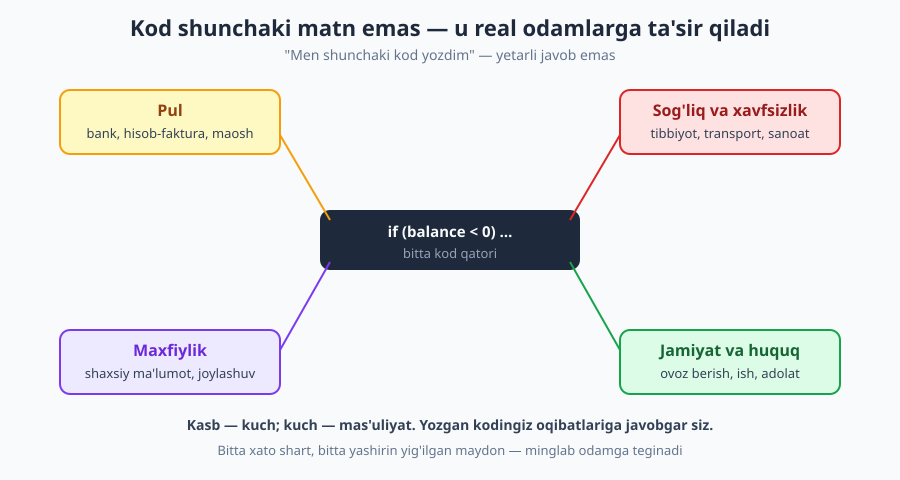
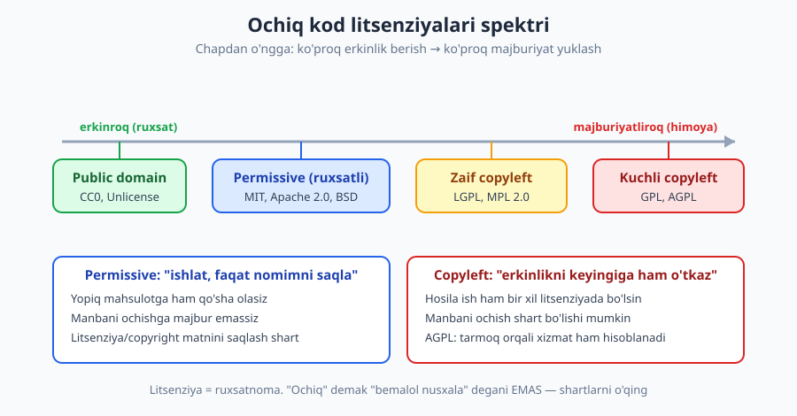
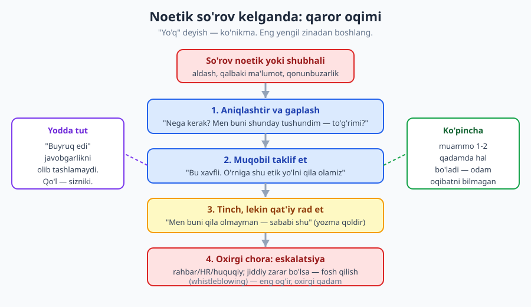

# 27 — Professional etika, mas'uliyat va huquq

[⬅️ Oldingi: 26 — Frilans va masofaviy ish](./26-frilans-masofaviy-ish.md) · [🏠 README](./README.md) · [Keyingi: 28 — Barqaror karyera: burnout, impostor va salomatlik ➡️](./28-barqaror-karyera-burnout.md)

---

> **Bu bobda:** dasturchining yozgan kodi real odamlarga — ularning puli, sog'lig'i, maxfiyligiga — ta'sir qiladi, demak kasb mas'uliyat yuklaydi. Etik kasbiy xulq (halollik, zarar yetkazmaslik, jamoatchilik manfaati), maxfiylik va ma'lumotni ishonch omonati sifatida ko'rish, litsenziya va intellektual mulk (MIT/GPL/Apache, copyleft, NDA, ish beruvchi egaligi), AI yordamida kod yozish etikasi, noetik so'rovga "yo'q" deyish va oxirgi chora fosh qilish (whistleblowing), hamda qulflanish va kirish imkoni (accessibility) etik o'lchovlarini ko'rib chiqamiz. Maqsad — tayyor javob berish emas, **to'g'ri savol berishni o'rgatish**.
>
> **Halollik / Eslatma:** bu bobdagi maslahatlar *qonun emas, amaliy yo'l-yo'riq* — va bu, ayniqsa, etika bobida muhim. **Etika ko'pincha qora-oq emas, kulrang zona**: bir vaziyatda to'g'ri narsa boshqasida noto'g'ri bo'lishi mumkin. Bu bob sizga "to'g'ri javob"ni emas, **qanday savol berishni** o'rgatadi. Bundan tashqari: **bu huquqiy maslahat emas.** Litsenziya, mehnat huquqi, ma'lumot himoyasi qonunlari har mamlakatda (O'zbekiston, G'arb, AQSh) har xil; jiddiy holatda yurist bilan maslahatlashing. Bu yerda etik sezgi va keng tamoyillar bor, aniq qonun moddasi emas.

---

## Nega bu bob bor: kod = kuch = mas'uliyat

Tasavvur qiling, siz yozgan bir funksiya bankning foiz hisoblash modulida ishlaydi. Yoki kasalxonadagi dozani hisoblaydigan tizimda. Yoki millionlab odamning shaxsiy ma'lumotini saqlaydigan bazada. Yoki saylov natijasini ko'rsatadigan paneldagi grafikda. Har bir holatda, sizning bitta `if` shartingiz **real odamlarning hayotiga teginadi** — kimningdir puli, sog'lig'i, maxfiyligi yoki ovozi.

Bu — abstraksiya emas. Bu kitobning boshqa boblari "qanday yaxshi kod yozish"ni o'rgatadi; bu bob esa boshqa savolni beradi: **shu kodni yozish kerakmi, va yozsangiz, oqibatiga kim javob beradi?** Javob deyarli har doim — siz ham. "Men shunchaki kod yozdim, menga shunday aytilgan edi" — bu zaif javob. Kasb sizga kuch beradi (siz qila olasiz), kuch esa mas'uliyat yuklaydi (siz oqibatga javob berasiz).

> **Eslatma:** bu sizni qo'rqitish uchun emas. Aksincha — bu **professional ekanligingiz belgisi**. Shifokor, muhandis, advokat — barchasi kasbiy mas'uliyatni qabul qiladi. Dasturchi ham endi shunday kasb. Mas'uliyatni tan olish — kuchsizlik emas, yetuklikdir.

---

## 1. Tarixiy saboqlar: kod qachon halokatga olib kelgan

Etika mavhum tuyulsa, ikki real misol uni aniq qiladi.

**Therac-25 (1980-yillar).** Bu nurlanish bilan davolash apparati edi. Dasturiy ta'minotdagi xato (poyga holati — race condition) tufayli bemorlarga **o'lik dozada** nurlanish berildi. Bir necha kishi halok bo'ldi. Sabab faqat texnik emas edi: ogohlantirishlar e'tiborsiz qoldirildi, test yetarli emas edi, "dastur ishonchli" degan asossiz ishonch bor edi. Saboq: **xavfli sohada "ishlaganga o'xshaydi" yetarli emas.**

**Volkswagen "dieselgate" (2015).** Muhandislar atayin kod yozishdi: avtomobil sinovdan o'tayotganini sezsa, ifloslantiruvchi gaz chiqarishni kamaytirardi; oddiy yo'lda esa qonuniy chegaradan ko'p chiqarardi. Bu **xato emas — ataylab qilingan aldash** edi. Kompaniya milliardlab jarima to'ladi, ba'zi muhandislar qamaldi. Saboq: **"menga shunday topshirilgan edi" sudda himoya bo'lmaydi.** Kodni yozgan qo'l — sizniki.

| Holat | Bu nima edi | Asosiy etik saboq |
|---|---|---|
| **Therac-25** | Halokatli xato + beparvolik | Xavfli sohada test va ogohlantirish hayot-mamot; "ishlaydiganga o'xshaydi" yetarli emas |
| **Volkswagen** | Ataylab aldash kodi | Buyruq javobgarlikni olib tashlamaydi; noetik vazifaga "yo'q" deyish kerak edi |
| **Maxfiylik sizib chiqishi** | Beparvo ma'lumot saqlash | Ma'lumot — omonat; uni himoya qilmaslik real odamlarga zarar |

> **Eslatma:** sizning ishingiz ehtimol kasalxona apparati emas. Lekin tamoyil bir xil masshtabda kichrayadi: e-tijorat narxida xato — mijoz ortiqcha to'laydi; buggy validatsiya — kimningdir hisobi buziladi; sizib chiqqan parol — odamlarning hayoti buziladi. Masshtab har xil, **mas'uliyat bir xil**.

---

## 2. Etik kasbiy xulqning uchta ustuni

Murakkab nazariyaga botmasdan, dasturchi etikasini uchta sodda savolga jamlash mumkin (bular ACM/IEEE kabi kasbiy etika kodekslari sezgisidan kelib chiqadi):

1. **Halollikmi?** Men haqiqatni aytyapmanmi — kodda, baholashda, holat hisobotida, mijozga? (Baholashdagi halollik aynan [16-bob](./16-baholash-rejalashtirish.md) mavzusi: noaniqlikni yashirish noetik.)
2. **Zarar yetkazmaslikmi?** Bu xususiyat/qaror kimgadir zarar yetkazadimi — moliyaviy, jismoniy, maxfiylik, ruhiy? Eng zaif foydalanuvchini o'yladimmi?
3. **Jamoatchilik manfaatimi?** Bu nafaqat ish beruvchimga, balki kengroq jamiyatga foydami yoki kamida zararsizmi?

### Misol + anti-misol: baholashda halollik

**❌ Noetik (haqiqatni yashirish):**
> Menejer so'raydi: "Bu xususiyat juma kuni tayyor bo'ladimi?" Siz aslida ulgurmasligingizni bilasiz, lekin "ha, bo'ladi" deysiz — keyin ovora bo'lmaslik uchun. Juma kuni tayyor emas; jamoa rejasini buzasiz, mijozga noto'g'ri va'da berilgan bo'ladi.

**✅ Etik (halol noaniqlik):**
> "Asosiy oqim juma kuni tayyor, lekin chegara holatlar va test uchun yana 2 kun kerak bo'lishi mumkin. Agar juma kuni 'mukammal emas, lekin ishlaydi' versiya kerak bo'lsa — ulgurraman; to'liq ishonchli versiya dushanbada." — Bu halol, harakatga aylantiriladigan va ishonch quradi.

Halollik "har doim 'ha' deyish" emas; **haqiqatni vaqtida va aniq aytish**. Ko'pincha halol "yo'q" qalbaki "ha"dan ancha qimmatli.

> **Trade-off:** halollik har doim "hamma narsani ochiq ayt" degani emas. Mijozning maxfiy ma'lumotini boshqasiga oshkor qilmaslik ham halollik tamoyili bilan ziddiyatda emas — bu maxfiylik mas'uliyati. Yoki: yangi xodimga "sening koding dahshatli" deb yuziga aytish — halol, lekin shafqatsiz va foydasiz (qarang: [19-bob — fikr-mulohaza](./19-fikr-mulohaza-mentorlik.md)). Etik halollik = **haqiqat + kontekst + mehribonlik**, shunchaki "bor gapni aytish" emas. Kulrang zona shu yerda: qachon ochiqlik, qachon ehtiyotkorlik.

---

## 3. Maxfiylik: ma'lumot — omonat, mulk emas

Foydalanuvchi sizga ma'lumotini bermaydi — u sizga **ishonib topshiradi**. Bu farq muhim: ishonch omonat (amanat) — siz uni o'zingizniki kabi emas, omonatdek tutishingiz kerak.

Eng muhim tamoyil — **minimal yig'ish (data minimization)**: faqat haqiqatan kerak bo'lganni yig'ing. Texnik jihatdan "yig'sa bo'ladi" hech qachon "yig'ish kerak" degani emas.

**❌ Noetik (beparvo yig'ish):**
> "Forma qulay bo'lsin deb, tug'ilgan kun, joylashuv, kontakt ro'yxati, qurilma identifikatorini ham olib qo'yamiz — keyin asqotar." Bu ma'lumotlar real maqsadsiz yig'iladi, xavfsiz saqlanmaydi, va sizib chiqsa — minglab odamga zarar.

**✅ Etik (minimal va maqsadli):**
> "Ro'yxatdan o'tish uchun faqat email va parol kerak. Boshqasini — faqat aniq xususiyat talab qilganda, foydalanuvchidan ruxsat so'rab, va nega kerakligini tushuntirib olamiz."

Bu yondashuv GDPR (Yevropa ma'lumot himoyasi qonuni) va shunga o'xshash zamonaviy qonunlar sezgisiga mos: maqsadni cheklash, minimallashtirish, foydalanuvchining nazorati. Texnik tomoni — kirishni cheklash, shifrlash, secrets'ni kodga yozmaslik — [12-bob — xavfsiz kod asoslari](./12-xavfsiz-kod-asoslari.md)da batafsil; bu yerda gap **niyatda**: ma'lumotga omonat kabi munosabat.

> **Eslatma:** "loglarga hamma narsani yozaman, debugging uchun qulay" — keng tarqalgan beparvolik. Logga parol, token, karta raqami, shaxsiy ma'lumot tushib qolsa — bu sizib chiqishning eng keng tarqalgan yo'li. Logni ham omonat deb biling.

Yana bir muhim jihat — **maqsadning cheklanishi**. Foydalanuvchi sizga emailini "buyurtma haqida xabar olish uchun" bergan bo'lsa, uni keyin reklama yuborish yoki uchinchi tarafga sotish uchun ishlatish — bu **berilgan ishonchni buzish**. Ma'lumot bir maqsad uchun yig'ilgan bo'lsa, boshqa maqsadda ishlatish — alohida, ochiq rozilik talab qiladi. Bu "texnik ruxsatim bor" (bazaga kira olaman) bilan "axloqiy huquqim bor" (shunday ishlatishga) orasidagi farq — va ikkinchisi har doim ham birinchisi bilan kelmaydi.

> **Trade-off:** ma'lumotni ko'p yig'ish biznes uchun real qiymatga ega — yaxshiroq tavsiyalar, mahsulotni yaxshilash, tahlil. "Hech narsa yig'maslik" amaliy yechim emas. Kulrang zona shu: **qancha yig'ish maqbul, qachondan ortiqcha?** Yaxshi mezon — "agar foydalanuvchiga 'biz buni yig'amiz va shunday ishlatamiz' deb ochiq aytsam, u rozimi yoki xafa bo'ladimi?" Agar yashirishingiz kerak bo'lsa — bu allaqachon javob.

---

## 4. Litsenziya va intellektual mulk

Bu bo'lim eng amaliy va eng ko'p adashiladigan joy. **"Ochiq kod" (open source) "bemalol nusxala" degani EMAS.** Har bir ochiq kodning litsenziyasi bor — bu **ruxsatnoma**, qonuniy shartnoma. Litsenziyasiz kodni esa umuman ishlatish huquqingiz yo'q (sukut bo'yicha "barcha huquqlar himoyalangan").

Litsenziyalar erkinlik–majburiyat spektrida joylashadi:

| Litsenziya turi | Misollar | Asosiy shart | Yopiq mahsulotga qo'sha olamanmi? |
|---|---|---|---|
| **Public domain** | CC0, Unlicense | Deyarli hech qanday | Ha, bemalol |
| **Permissive (ruxsatli)** | MIT, Apache 2.0, BSD | Copyright/litsenziya matnini saqlash | Ha (Apache: patent bandiga ham e'tibor) |
| **Zaif copyleft** | LGPL, MPL 2.0 | Faqat o'zgartirilgan fayl/kutubxona ochiq qolsin | Odatda ha (kutubxona sifatida) |
| **Kuchli copyleft** | GPL, AGPL | Butun hosila ish bir xil litsenziyada, manba ochiq | Yo'q (yoki butun loyihangizni ochishingiz kerak) |

Eng muhim farq — **permissive vs copyleft**:

- **Permissive (MIT, Apache):** "ishlat, o'zgartir, hatto yopiq mahsulotda sot — faqat mening copyright/litsenziya matnimni saqla." Eng erkin, biznesga qulay.
- **Copyleft (GPL):** "men kodimni erkin berdim — sen ham hosilangni erkin ber." Agar GPL kodni mahsulotingizga qo'shsangiz, butun mahsulotingiz ham GPL bo'lishi (manba ochilishi) kerak bo'lishi mumkin. **AGPL** undan ham qattiq: tarmoq orqali xizmat ko'rsatish (SaaS) ham "tarqatish" hisoblanadi.

### Misol + anti-misol: litsenziyaga rioya vs buzish

**❌ Litsenziyani buzish:**
> Yopiq, sotiladigan mahsulotingizga GitHub'dan topgan zo'r GPL kutubxonani qo'shasiz, litsenziyaga qaramaysiz. Endi siz **GPLni buzyapsiz** — qonuniy javobgarlik, mahsulotni ochishga majburlanish yoki sud xavfi.

**✅ Litsenziyaga rioya:**
> Kutubxonani qo'shishdan oldin litsenziyasini tekshirasiz. GPL bo'lsa va sizga yopiq mahsulot kerak bo'lsa — MIT/Apache muqobil topasiz, yoki tijorat litsenziyasini sotib olasiz, yoki uni alohida jarayon sifatida ajratasiz. Permissive bo'lsa — copyright matnini saqlaysiz.

**Boshqa muhim IP holatlari:**

- **Kod nusxalash (StackOverflow, AI, blog).** StackOverflow javoblari ham litsenziya ostida (CC BY-SA). Boshovchidan ko'r-ko'rona nusxalangan katta blok — IP va sifat xavfi. AI yordamchisi qaytargan kod ham (qarang: pastdagi 5-bo'lim) litsenziya/manba jihatidan noaniq bo'lishi mumkin.
- **Ish beruvchi egaligi (work for hire).** Ish vaqtida, ish jihozida yozgan kodingiz odatda **ish beruvchiga tegishli**, sizga emas. Buni shartnomada tekshiring — ayniqsa yon loyiha (side project) qilsangiz. Frilanser uchun esa aksini aniqlashtiring: agar shartnomada aytilmasa, mijoz "men to'ladim, demak hammasi meniki" deb o'ylashi mumkin; siz esa qayta ishlatmoqchi bo'lgan umumiy kutubxonangizni kim egasi qiladi degan savol tug'iladi (frilans shartnomasi: [26-bob](./26-frilans-masofaviy-ish.md)).
- **NDA (maxfiylik kelishuvi).** Mijoz/ish beruvchi maxfiy kodini yoki ma'lumotini ochmaslik majburiyati. Buni buzish — qonuniy javobgarlik. Amaliy xato: maxfiy kod parchasini ommaviy GitHub'ga, forumga yoki AI'ga yopishtirish — bu ko'pincha NDA buzilishi.
- **Git va ochiq kod hissasi.** Open source'ga hissa qo'shish (contribution) — kasbiy o'sish va portfolio uchun zo'r, lekin loyiha litsenziyasi va ish beruvchingiz siyosatini bilib qiling (mexanika: [Git & GitHub](../git-github/README.md)).

**Real vaziyat (frilans/O'zbekiston konteksti).** Frilanser sifatida bitta mijoz uchun yozgan to'lov modulini ikkinchi mijozga "tayyor yechim" deb sotish vasvasasi paydo bo'ladi. Bu yerda ikki etik/huquqiy savol bor: (1) birinchi mijoz bu kodni o'ziniki deb hisoblaydimi (work for hire/shartnoma)? (2) unda mijozning maxfiy biznes mantig'i bormi (NDA)? Agar shartnoma jim bo'lsa — bu kulrang zona, va eng to'g'ri yo'l **oldindan aniqlashtirish**: shartnomaga "men umumiy, mijozga xos bo'lmagan komponentlarni qayta ishlatish huquqini saqlayman" degan band qo'shish. Etika bu yerda ham — keyin emas, **boshida** savol berishdir.

> **Trade-off:** copyleft (GPL) "yomon" emas — u jamoatchilik manfaatini himoya qiladi (Linux yadrosi GPL). Biznes uchun permissive qulayroq, lekin permissive kodni kimdir oladi-da, yopib, hech narsa qaytarmaydi — bu "erkinlik" ba'zilarga adolatsiz tuyuladi. Tanlov g'oyaviy: **maksimal foydalanish (permissive) vs erkinlikni saqlash (copyleft)**. To'g'ri javob yo'q — loyiha maqsadiga bog'liq.

---

## 5. AI yordamida kod yozish etikasi

AI yordamchisi (Copilot, Claude va h.k.) endi kundalik vosita (uni samarali ishlatish — [20-bob — ish muhiti va vositalar](./20-ish-muhiti-vositalar.md)). Lekin etik jihatdan bitta qoida hammasidan ustun:

**Javobgarlik baribir SENDA.** AI kod yozdi, lekin uni qabul qilib, mahsulotga qo'shgan — siz. "AI shunday qildi" — Volkswagen muhandisining "menga aytilgan edi"sining yangi versiyasi. Sudda ham, code review'da ham, ishlamay qolganda ham — javob beradigan siz.

Amaliy etik qoidalar:

- **Tushunmasdan ishlatma.** AI qaytargan kodni o'qib, tushunib, tekshirmasdan qo'shish — eng keng tarqalgan xato. Agar buni tushuntira olmasangiz, mas'uliyatini ham ololmaysiz.
- **Litsenziya va manba.** AI ba'zan boshqa kodga juda o'xshash chiqaradi; muhim/katta bloklarda manba va litsenziyani o'ylang.
- **Maxfiylik.** Maxfiy kod, mijoz ma'lumoti, secrets'ni AI'ga yopishtirib yubormang — bu NDA va maxfiylikni buzishi mumkin (ish beruvchi siyosatini tekshiring).
- **Sifat va halollik.** AI ishonchli ohangda noto'g'ri kod yozadi ("hallucination"). Sizning ishingiz — uni tekshirish, test qilish (qarang: [11-bob](./11-testlash-madaniyati.md)). Mas'uliyatdan qochish uchun "AI yozgan" deyish — noetik.
- **Oshkoralik (transparency).** Jamoa/mijoz konteksti talab qilsa, AI ishlatganingizni yashirmaslik.

**❌ Noetik AI ishlatish:**
> Tushunmagan 200 qatorli AI kodini to'g'ridan-to'g'ri mahsulotga joylaysiz, test qilmaysiz, code review'da "men yozdim" deysiz. Ishlamay qolganda "AI aybdor" deysiz.

**✅ Etik AI ishlatish:**
> AI'dan qoralama olasiz, har qatorini o'qib tushunasiz, test yozasiz, maxfiy ma'lumotni yubormaysiz. Mas'uliyatni o'zingiz olasiz — chunki mahsulotga qo'shgan sizsiz.

---

## 6. "Yo'q" deyish: noetik so'rovni rad etish

Ertami-kechmi sizdan noetik narsa so'rashlari mumkin: foydalanuvchini aldaydigan "dark pattern", qalbaki ma'lumot ko'rsatadigan grafik, qonunni chetlab o'tadigan kod, maxfiylikni buzadigan yashirin kuzatuv. "Yo'q" deyish — **kasbiy ko'nikma**, va u zinapoyali jarayon, baqirib chiqib ketish emas.

1. **Aniqlashtir va gaplash.** Ko'pincha so'rovchi oqibatni bilmaydi. "Nega kerak? Men buni shunday tushundim — foydalanuvchiga zarar bermaydimi?" — ko'p holat shu yerda hal bo'ladi.
2. **Muqobil taklif et.** Sof "yo'q" emas, "bu xavfli, lekin maqsadingizga shu etik yo'l bilan erishamiz" — bu sizni "to'siq" emas, "yechuvchi" qiladi.
3. **Tinch, lekin qat'iy rad et.** Hal bo'lmasa: "Men buni qila olmayman, sababi shu." Yozma qoldiring (email/xabar) — bu sizni himoya qiladi.
4. **Oxirgi chora: eskalatsiya.** Jiddiy zarar (qonunbuzarlik, xavfsizlik, odamga ziyon) bo'lsa va boshqa yo'l qolmasa — rahbar, HR, huquqiy bo'lim. Eng og'ir holatda — **fosh qilish (whistleblowing)**: bu real xavf-xatarli oxirgi chora (ishdan ayrilish, qonuniy oqibatlar mumkin), shuning uchun u **eng oxirgi**, va imkon bo'lsa huquqiy maslahat bilan.

> **Trade-off:** "yo'q" deyishning narxi bor — noqulay suhbat, rahbar bilan ziddiyat, ba'zan ish. Lekin "ha" deyishning narxi ham bor — vijdoningiz, kasbiy obro'yingiz, va ehtimol qonuniy javobgarlik. Bu kulrang zona: har "yo'q" jasorat talab qiladi, lekin har norozilik ham "etik printsip" emas (ba'zida bu shunchaki didingizga to'g'ri kelmasligi). **Ajrata bilish kerak:** "bu menga yoqmaydi" vs "bu kimgadir zarar/qonunbuzarlik". Birinchisida moslashing; ikkinchisida turing. Aniq qonunbuzarlik/zarar holatida — yozma iz qoldirib, zinapoyali harakat qiling.

---

## 7. Boshqa etik o'lchovlar: qulflanish va kirish imkoni

Etika faqat "katta" dilemmalar emas — kundalik texnik qarorlarda ham yashiringan.

**Qulflanish (vendor lock-in).** Foydalanuvchini ataylab o'z platformangizga "qamab qo'yish" — ma'lumotini eksport qilolmasligi, boshqa joyga ko'cholmasligi. Texnik jihatdan "biznesga foydali", lekin etik jihatdan savol: bu foydalanuvchining erkinligini cheklaydimi? Ma'lumot eksporti, ochiq format, standartlar — etik tanlov.

**Kirish imkoni (accessibility, a11y).** Ko'zi ojiz, eshitmaydigan yoki harakat cheklangan foydalanuvchilar ham sizning mahsulotingizdan foydalanadi. Skrinrider'ga moslamagan, kontrasti past, faqat sichqoncha bilan ishlaydigan interfeys — minglab odamni **chetda qoldiradi**. Bu nafaqat texnik, balki etik (va ko'p mamlakatda — huquqiy) talab. "Hamma uchun ishlasin" — adolat masalasi.

**Texnologiyaning ijtimoiy ta'siri.** Siz qurgan tavsiya algoritmi odamlarni qaramlikka soladimi? Yuzni tanish tizimi kimni nazorat qiladi? Bu savollarni berish — professionallik belgisi, "menga daxli yo'q" deyish emas.

| ✅ Etik sezgili qaror | ❌ Beparvo qaror |
|---|---|
| Ma'lumot eksportini beraman (lock-in yo'q) | Foydalanuvchini ataylab qamab qo'yaman |
| Accessibility'ni boshidan o'ylayman | "Keyin qo'shamiz" (hech qachon kelmaydi) |
| Faqat kerakli ma'lumotni yig'aman | "Yig'sa bo'ladigan"ni hammasini yig'aman |
| "Bu kim uchun zararli?" deb so'rayman | "Menga ish topshirilgan, tamom" |

---

## Asosiy g'oyalar (bobni qisqacha)

- **Kod = kuch = mas'uliyat.** Yozgan kodingiz real odamlarning puli, sog'lig'i, maxfiyligi, ovoziga ta'sir qiladi. "Men shunchaki kod yozdim" — yetarli javob emas.
- **Tarixiy saboq (Therac-25, Volkswagen):** xavfli sohada "ishlaganga o'xshaydi" yetarli emas; **buyruq javobgarlikni olib tashlamaydi** — kodni yozgan qo'l sizniki.
- **Etikaning uch ustuni:** halollik, zarar yetkazmaslik, jamoatchilik manfaati. Halol "yo'q" qalbaki "ha"dan qimmatli.
- **Ma'lumot — omonat, mulk emas:** minimal yig'ing; "yig'sa bo'ladi" ≠ "yig'ish kerak"; logni ham omonat deb biling.
- **Litsenziya = ruxsatnoma.** "Ochiq kod" ≠ "bemalol nusxala". **Permissive (MIT/Apache)** erkin; **copyleft (GPL/AGPL)** hosilani ochishni talab qiladi. Ish beruvchi egaligi, NDA'ni tekshiring.
- **AI bilan: javobgarlik baribir SENDA.** Tushunmasdan ishlatma; litsenziya/maxfiylik/sifatga e'tibor; "AI aybdor" — noetik.
- **"Yo'q" deyish zinapoyali:** gaplash → muqobil taklif → qat'iy rad → eskalatsiya/fosh qilish (oxirgi chora). "Yoqmaydi" bilan "zarar/qonunbuzarlik"ni ajrating.
- **Halol:** etika kulrang zona; bu bob savol berishni o'rgatadi, tayyor javob bermaydi; **bu huquqiy maslahat emas** — qonun har mamlakatda har xil.

---

## Mashqlar

### Oson

**1-mashq.** Quyidagi litsenziyalarni "permissive" yoki "copyleft" deb tasniflang va har biriga bir jumla izoh bering: (a) MIT, (b) GPL, (c) Apache 2.0, (d) AGPL.

**2-mashq.** Quyidagi gaplardan qaysilari to'g'ri, qaysilari xato? Har birini izohlang: (a) "Ochiq kodni xohlagancha nusxalasam bo'ladi." (b) "AI yozgan kod ishlamay qolsa, men javobgar emasman." (c) "Faqat haqiqatan kerak ma'lumotni yig'ish kerak." (d) "Ish vaqtida yozgan kodim odatda ish beruvchiga tegishli."

**3-mashq.** Sizdan "forma qulay bo'lsin deb foydalanuvchining barcha kontakt ro'yxatini ham olib qo'yaylik" deb so'rashdi. Minimal yig'ish tamoyili bo'yicha qanday javob berasiz va qanday muqobil taklif qilasiz? Qisqa yozing.

### O'rta

**4-mashq.** **Litsenziya tanlovi.** Quyidagi loyihalarning har biriga qaysi litsenziya turi (permissive yoki copyleft) mosligini tanlang va **nega** ekanini izohlang: (a) keng tarqalsin va biznes ham yopiq mahsulotda ishlatsin degan kutubxona; (b) erkinligini saqlamoqchi, undan foyda olgan kishi ham hissasini qaytarishi shart bo'lgan loyiha; (c) ichki, hech qayerga tarqatilmaydigan kompaniya kodi.

**5-mashq.** **Etik dilemma.** Menejeringiz: "Bu grafikni shunday chizki, savdo o'sgandek ko'rinsin — aslida tushgan bo'lsa ham (o'qning boshlanish nuqtasini o'zgartirib)." Bu — foydalanuvchini/investorni chalg'itish. Yuqoridagi **"yo'q" deyish zinapoyasi** (gaplash → muqobil taklif → rad et → eskalatsiya) bo'yicha 4 qadamingizni yozing: nima deb gaplashasiz, qanday muqobil taklif qilasiz, rad etsangiz qanday, eskalatsiya qachon.

**6-mashq.** **AI etikasi.** Hamkasbingiz: "Men butun modulni AI'ga yozdirdim, o'qib o'tirmadim, test ham yo'q, lekin ishlayotganga o'xshaydi — PR yuboraman." Unga uchta aniq etik/kasbiy e'tirozingizni va nima qilish kerakligini ayting (har biri bir-ikki jumla).

### Qiyin

**7-mashq.** **Bu etik dilemmada nima qilasiz?** Siz fintech ilovasida ishlaysiz. Sezasizki, ilova foydalanuvchilarning geolokatsiyasini ular bilmagan holda doimiy yig'ib, uchinchi tarafga sotyapti — bu maxfiylik va ehtimol qonun masalasi. To'liq harakat rejasini yozing: (a) avval o'zingiz nimani tekshirasiz/aniqlashtirasiz; (b) kim bilan, qanday tartibda gaplashasiz; (c) yozma iz qoldirasizmi va nega; (d) qaysi nuqtada eskalatsiya yoki fosh qilish (whistleblowing) haqida o'ylaysiz va uning xatarlari nima; (e) bu yerda "etika kulrang zona" qaysi jihatda namoyon bo'ladi?

**8-mashq.** **Kulrang zona tahlili.** Quyidagi to'rt holatni "aniq noetik / kulrang zona / aniq etik" deb baholang va eng kulrang ikkitasida **qaysi qo'shimcha savollar** javobni o'zgartirishini yozing: (a) foydalanuvchi parolini ochiq matnda saqlash; (b) bepul foydalanuvchini pulli rejaga o'tishga undaydigan, lekin yolg'on bo'lmagan reklama ko'rsatish; (c) raqobatchining ochiq saytidan ma'lumotni avtomatik yig'ish (scraping); (d) GPL kutubxonani litsenziyasini saqlab, ochiq loyihangizda ishlatish.

Yechimlar

> Eslatma: bu mashqlarning ko'pida yagona to'g'ri javob yo'q — quyida **namuna javoblar va baholash mezonlari** berilgan. Etika kulrang zona bo'lgani uchun, mezon ko'pincha "qaysi savolni berding"da, "qaysi javobni topding"da emas.

### 1-mashq yechimi
(a) **MIT — permissive:** juda erkin, faqat copyright matnini saqlash kerak. (b) **GPL — copyleft (kuchli):** hosila ish ham GPL bo'lib, manbasi ochilishi kerak. (c) **Apache 2.0 — permissive:** MIT'ga o'xshash, qo'shimcha aniq patent bandi bilan. (d) **AGPL — copyleft (eng kuchli):** GPL'dan ham qattiq, tarmoq orqali xizmat (SaaS) ko'rsatish ham manbani ochishni talab qiladi. Mezon: permissive/copyleft to'g'ri ajratilganmi.

### 2-mashq yechimi
(a) **Xato** — ochiq kodning ham litsenziyasi bor; nusxalash shartlariga bog'liq (copyleft bo'lsa cheklov bor). (b) **Xato** — javobgarlik baribir sizda; mahsulotga qabul qilgan/qo'shgan sizsiz. (c) **To'g'ri** — minimal yig'ish (data minimization) asosiy maxfiylik tamoyili. (d) **To'g'ri** — work for hire; aksini xohlasangiz, shartnomada aniqlashtiring. Mezon: har baho to'g'ri va izoh tamoyilga (litsenziya/javobgarlik/minimallik/egalik) tayanadimi.

### 3-mashq yechimi
Namuna: "Kontakt ro'yxati bu forma maqsadi uchun kerak emas — uni yig'sak, sizib chiqish xavfi va foydalanuvchi ishonchini buzish bor (minimal yig'ish tamoyili). Muqobil: faqat ro'yxatdan o'tishga kerakli email/parolni olamiz; agar 'do'st taklif qilish' kerak bo'lsa, uni alohida, foydalanuvchi ixtiyoriy ravishda, nega kerakligini tushuntirib so'raymiz." Mezon: "yig'sa bo'ladi ≠ yig'ish kerak" tamoyili va aniq muqobil bormi.

### 4-mashq yechimi
(a) **Permissive (MIT/Apache)** — maksimal tarqalish va biznes qabuli uchun; yopiq mahsulotga ham qo'shsa bo'ladi. (b) **Copyleft (GPL/AGPL)** — erkinlikni saqlash va "olgan qaytarsin" maqsadiga mos. (c) **Litsenziya muhim emas (yoki ichki/proprietary)** — tarqatilmasa, ochiq litsenziya shart emas; lekin ishlatilgan tashqi kutubxonalar litsenziyasiga rioya zarur. Mezon: tanlov loyiha **maqsadiga** bog'langanmi (g'oyaviy farqni tushunganmi), shunchaki "MIT mashhur" emas.

### 5-mashq yechimi
Namuna: (1) **Gaplash:** "Bu grafik investorni chalg'itadi — o'qni kesib o'zgartirsak, tushgan savdo o'sgandek ko'rinadi. Bu yolg'on ma'lumot. Maqsadingiz nima edi?" (2) **Muqobil:** "Agar maqsad ijobiy tomonni ko'rsatish bo'lsa — halol grafik + 'shu segmentda o'sish bor' degan izoh qo'yamiz; o'qni buzmaymiz." (3) **Rad:** hal bo'lmasa: "Men chalg'ituvchi grafik chiza olmayman" — va buni email'da qoldiraman. (4) **Eskalatsiya:** agar bu investor/regulyatorga ketadigan rasmiy hisobot bo'lsa (jiddiy oqibat) — rahbar/huquqiy bo'limga ko'taraman. Mezon: 4 qadam tartibida, eng yengildan boshlab; yozma iz; "yoqmaydi emas, aldash" deb to'g'ri tasniflagan.

### 6-mashq yechimi
Namuna e'tirozlar: (1) **Tushunmasdan ishlatish** — kodni o'qib tushunmasang, mas'uliyatini ololmaysan va review'da himoya qilolmaysan; AI ishonchli ohangda xato yozadi. (2) **Test yo'qligi** — ishlayotganga "o'xshash" yetarli emas, ayniqsa chegara holatlarda; bu sifat va etik mas'uliyat masalasi. (3) **Javobgarlik** — "AI yozdi" ishlamay qolganda himoya emas; mahsulotga qo'shgan sen, javob beradigan sen. Nima qilish kerak: kodni o'qib tushun, test yoz, keyin PR. Mezon: javobgarlik + tushunish + test + halollik tamoyillaridan kamida uchtasi.

### 7-mashq yechimi
Namuna: (a) **Tekshirish:** rostmi (kod/log/sozlamani ko'raman), ataylabmi yoki xatomi, foydalanuvchidan ruxsat olinganmi, bu qonun (maxfiylik)ga zid bo'lishi mumkinmi. Faktni aniqlamasdan ayblamayman. (b) **Gaplashish:** avval bevosita mas'ul (texnik rahbar/maxsulot egasi) bilan, tinch, "men buni shunday ko'rdim — to'g'rimi?" ohangida; faktga tayanaman. (c) **Yozma iz:** ha — email/xabar bilan, chunki bu meni va jamoani himoya qiladi va jiddiylikni ko'rsatadi. (d) **Eskalatsiya/fosh:** ichki yo'llar (rahbar, huquqiy, compliance) ishlamasa va real, davom etayotgan zarar bo'lsa — tashqi fosh qilish haqida o'ylayman; xatarlari: ishdan ayrilish, qonuniy ta'qib, shuning uchun avval huquqiy maslahat va imkon qadar ichki yechim. (e) **Kulrang zona:** "yig'ish noto'g'ri"mi yoki "foydalanuvchi rozilik berganmi" (maydadagi shart), "men buni to'liq tushundimmi yoki noto'g'ri xulosa qildimmi", "fosh qilish ko'p odamga foydami yoki ko'proq zararmi" — bularning hammasi aniq emas. Mezon: faktni avval tekshirish, zinapoyali harakat, yozma iz, fosh qilishni oxirgi/xatarli deb tan olish, kulrang zonani ochiq aytish.

### 8-mashq yechimi
(a) **Aniq noetik** — parolni ochiq saqlash xavfsizlik/maxfiylik buzilishi (qarang [12-bob](./12-xavfsiz-kod-asoslari.md)); hash'lash shart. (d) **Aniq etik** — litsenziyaga rioya qilingan, ochiq loyihada copyleft kutubxona ishlatish to'g'ri. (b) va (c) **kulrang zona**. (b) reklama uchun qo'shimcha savollar: yolg'on/chalg'ituvchimi yoki halolmi? Foydalanuvchini majburlaydimi ("dark pattern") yoki shunchaki taklif qiladimi? Bekor qilish osonmi? — javob shularga bog'liq. (c) scraping uchun: saytning foydalanish shartlari (ToS) ruxsat beradimi? Shaxsiy ma'lumot bormi? Serverga zarar (yuk) yetkazadimi? Qonun nima deydi? — bu savollar javobni "etik" dan "noetik"ga o'zgartirishi mumkin. Mezon: aniq holatlarni to'g'ri ajratish + kulrang holatlarda javobni o'zgartiradigan **aniq qo'shimcha savollarni** ko'rsatish (yagona "ha/yo'q" bermaslik).

---

[⬅️ Oldingi: 26 — Frilans va masofaviy ish](./26-frilans-masofaviy-ish.md) · [🏠 README](./README.md) · [Keyingi: 28 — Barqaror karyera: burnout, impostor va salomatlik ➡️](./28-barqaror-karyera-burnout.md)
