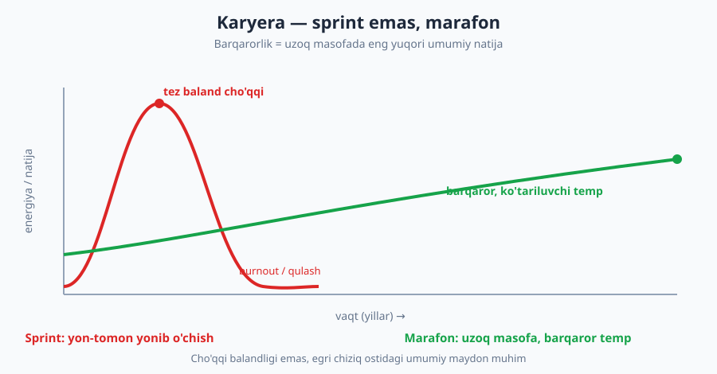
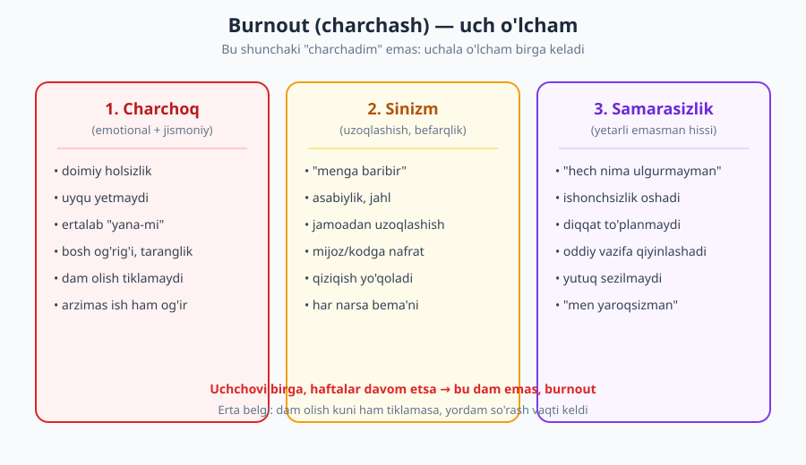
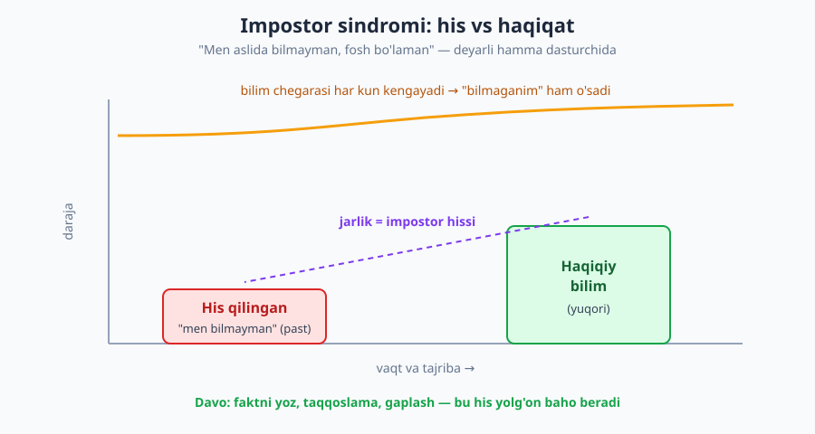

# 28 — Barqaror karyera: burnout, impostor va salomatlik

[⬅️ Oldingi: 27 — Professional etika, mas'uliyat va huquq](./27-etika-masuliyat.md) · [🏠 README](./README.md) · [Keyingi: 29 — Kapston: birinchi 90 kun va shaxsiy o'sish rejasi ➡️](./29-kapston-90-kun-osish-rejasi.md)

---

> **Bu bobda:** karyera — sprint emas, **marafon**. Eng buyuk muhandis ham charchasa, kasallansa, yonib ketsa, uzoqqa bormaydi. Bu bob inson haqida: **burnout** (charchash) belgilari va oldini olish; **impostor sindromi** ("men aslida bilmayman") va u bilan yashash; ish-hayot **chegaralari**; jismoniy va ruhiy salomatlik. Maqsad — sizni "mahsuldorlik mashinasi" qilish emas, balki kasbni *uzoq yillar yoqimli* qilib saqlash.
>
> **Halollik / Eslatma:** bu bob *tibbiy maslahat emas*. Bu yerda muhandislik jamoasi tajribasi va keng tarqalgan amaliyot bor — lekin har kim har xil, va jiddiy holatda (uzoq depressiya, qattiq tashvish, jismoniy og'riq) **albatta mutaxassisga** (shifokor, psixolog) murojaat qiling. Eng muhim halol gap: **mahsuldorligingiz o'zlik qadringiz emas.** Siz kechagidan kamroq kod yozgan kuningiz ham qadrli odamsiz.

---

## Nega bu bob bor

Bu kitobning 27 bobi sizni *yaxshiroq muhandis* qilishga qaratilgan: toza kod, jamoa, kommunikatsiya, karyera. Lekin bu boblarning hammasi bitta jim taxminga tayanadi — **siz hali ishda, hali sog'lom, hali bu kasbni sevasiz.** Agar shu taxmin buzilsa, qolgan hamma narsa qulaydi.

Sanoatda achchiq haqiqat bor: ko'p iqtidorli dasturchilar kasbni *yomon kod yozgani uchun emas, balki yonib ketgani uchun* tark etadi. Ular ajoyib muhandis edi — lekin marafonni sprint kabi yugurdi va o'rtada quladi. Bu bob aynan shuning oldini olish haqida.

Diqqat qiling: marafonchi sprintchidan **sekinroq** yuguradi. Lekin egri chiziq ostidagi maydon — umumiy bosib o'tilgan masofa — marafonchida ancha katta. Karyerada ham shunday: eng katta umumiy natijani bir-ikki yil "yonib", keyin qulab tushadigan odam emas, balki 20 yil barqaror temp tutgan odam beradi.

> **Trade-off:** ba'zan qisqa, intensiv sprint o'rinli — relizdan oldingi hafta, startup'ning hal qiluvchi davri, qiziqarli yon loyiha. Muammo *sprint qilishda emas* — uzluksiz sprint qilishda, ya'ni har haftani avariya rejimida yashashda. Sprint vaqtinchalik bo'lishi va undan keyin **tiklanish davri** kelishi shart. Doimiy sprint = burnout retsepti.

---

## 1. Burnout: charchash kasbiy holat sifatida

Avvalo aniqlik: **burnout shunchaki "charchadim" emas.** Charchoqni bir kun yaxshi uyqu yoki dam olish kuni tuzatadi. Burnout — surunkali ish stressidan kelib chiqadigan, uchta o'lchamli holat. JSST (WHO) buni rasman *kasbiy hodisa* deb tan oladi (kasallik emas, lekin jiddiy holat).

Uchta o'lcham birga keladi:

1. **Charchoq (exhaustion)** — emotsional va jismoniy holsizlik. Dam olish ham tiklamaydi; ertalab "yana shu ish" hissi.
2. **Sinizm (cynicism)** — ishdan, jamoadan, mijozdan uzoqlashish, befarqlik. "Menga baribir", asabiylik, qiziqishning yo'qolishi.
3. **Samarasizlik hissi (inefficacy)** — "hech nima ulgurmayapman, men yaroqsizman". Oddiy vazifa ham qiyin tuyuladi.

### Burnout belgilari: o'zingizni kuzatish jadvali

| Soha | Sog'lom holat | Ogohlantiruvchi belgi (burnout) |
|---|---|---|
| **Energiya** | Dam olishdan keyin tiklanasiz | Dam olish kuni ham charchoq ketmaydi |
| **Motivatsiya** | Ish ba'zan qiziq, ba'zan zerikarli — normal | Hech narsa qiziqtirmaydi, "nima farqi bor" |
| **Hissiyot** | Vaziyatga mos kayfiyat | Doimiy asabiylik, jaxl, yoki befarqlik |
| **Uyqu** | Muntazam, tiklovchi | Uxlay olmaslik yoki haddan tashqari uxlash |
| **Jismoniy** | Vaqti-vaqti bilan toliqish | Surunkali bosh og'rig'i, oshqozon, taranglik |
| **Ish sifati** | Odatdagi darajada | Keskin tushgan, oddiy xatolar ko'paygan |
| **Munosabat** | Jamoa bilan aloqa bor | Hammadan uzoqlashish, izolyatsiya |

Agar o'ng ustundagi belgilarning bir nechtasi **haftalar** davom etayotgan bo'lsa — bu dam emas, e'tibor talab qiladigan signal.

### Burnout sabablari (faqat "ko'p ishlash" emas)

Keng yoyilgan afsona: "burnout = ko'p soat ishlash". Aslida sabablar chuqurroq. Tadqiqotchilar oltita asosiy omilni ajratadi:

- **Surunkali ortiqcha yuk** — doimiy haddan tashqari ish, hech qachon "yetdi" yo'q.
- **Nazorat yo'qligi** — ishingizga, jadvalingizga, qarorlaringizga ta'sir qila olmaslik.
- **Mukofotsizlik** — mehnat e'tirof etilmasligi (na maosh, na rahmat).
- **Adolatsizlik** — favoritizm, noxolis baholash, "boshqalar qutulib qoladi".
- **Jamoa buzilishi** — toksik munosabat, izolyatsiya, ishonchsizlik.
- **Qadriyat ziddiyati** — siz ishonmaydigan yoki etik bo'lmagan narsani qilishga majburlik (qarang: [27-bob — etika va mas'uliyat](./27-etika-masuliyat.md)).

Diqqat qiling: bularning ko'pi **ish hajmi haqida emas**. Odam o'zi sevgan, nazorat qila oladigan, e'tirof etiladigan ishni ko'p qilsa ham kamroq yonadi. Nazoratsiz, mukofotsiz, adolatsiz ozgina ish ko'pincha ko'proq yondiradi.

### Misol: yonib ketgan vs chegaraga ega dasturchi

**❌ Botir — yonayotgan dasturchi:**
> Botir kuchli muhandis. U "ha" deyishni yaxshi ko'radi: har topshiriqni oladi, kechqurun ham, dam olish kunlari ham ishlaydi. Slack bildirishnomalari telefonida tunda ham yonadi — "birov yozgan bo'lsa, javob berishim kerak". U ta'tilga chiqmaydi: "loyiha hozir muhim". Avvaliga u "yulduz" — hamma uni maqtaydi. Olti oydan keyin: kod sifati tushadi, mayda xatolar ko'payadi, jamoadan uzoqlashadi, "menga baribir" deydi. Bir kuni ertalab kompyuterni ochishni xohlamaydi. Bu — burnout, va u sezdirmasdan kelgan, chunki Botir "shunchaki tirishqoqman" deb o'ylagan.

**✅ Dilnoza — chegaraga ega dasturchi:**
> Dilnoza ham kuchli muhandis. Lekin u **chegara** qo'yadi: ish vaqti tugagach, noutbukni yopadi va Slack'ni o'chiradi. "Shoshilinch" deganda haqiqatan shoshilinchmi yoki shunchaki kimningdir rejasizligi — buni ajratadi. U "yo'q" deyishni biladi: "Bu haftaga sig'maydi, keyingi sprintga qo'yamiz". U ta'tilga chiqadi va ta'tilda ishlamaydi. Tashqaridan u Botirdan "kamroq tirishqoq" ko'rinadi. Lekin uch yildan keyin: Dilnoza hali bu yerda, hali sifatli kod yozadi, hali kasbni sevadi. Botir esa kasbni tashlab ketgan.

Farqni ko'ryapsizmi? Bu "g'ayrat" haqida emas. **Barqarorlik haqida.** Dilnoza o'zini kasb uchun yoqilg'i kabi emas, marafonchi kabi boshqaradi.

> **Eslatma:** chegara qo'yish "dangasalik" yoki "loqaydlik" emas. Aksincha — bu *professionallik*. Doim charchagan dasturchi ko'proq xato qiladi, sekinroq ishlaydi va jamoaga ko'proq xarajat keltiradi. Dam olgan, fokuslangan dasturchi ([21-bob — chuqur ish](./21-vaqt-diqqat-chuqur-ish.md)) ancha qimmatli.

### Burnoutning oldini olish (tiklanishdan oson)

Eng yaxshi davo — kasallikni boshlanishidan oldin to'xtatish. Burnout bir kunda kelmaydi; u oylar davomida sezilmay to'planadi, shuning uchun erta belgilar muhim:

- **O'zingizni muntazam kuzating.** Yuqoridagi belgilar jadvalini har bir-ikki haftada qayta o'qing. Tendensiyani kuzating: holatingiz yaxshilanyaptimi yoki yomonlashyaptimi? Bitta yomon kun — bu burnout emas; barqaror pasayish — signal.
- **Tiklanishni rejaga kiriting, qoldiq emas.** Dam "vaqt qolsa" qiladigan narsa emas. Uyqu, harakat, dam olish kuni — ularni oldindan kalendarga yozing, xuddi muhim yig'ilish kabi.
- **"Kichik chegaralar" o'rnating.** Katta o'zgarish kerak emas: kuniga bir tanaffus, kechqurun bildirishnomalarni o'chirish, haftada bir kun "kodsiz" — bularning kumulyativ ta'siri katta.
- **Energiya manbasini saqlang.** Sizni nima quvvatlantiradi (qiziqarli muammo, o'rganish, jamoa)? Ish faqat "majburiyat"ga aylanmasin — vaqti-vaqti bilan o'zingizni *qiziqtiradigan* narsaga vaqt ajrating.
- **Bir-biringizni kuzating.** Sog'lom jamoada odamlar bir-birining yonish belgisini payqaydi va g'amxo'rlik bilan ogohlantiradi. "Yaqinda juda ko'p ishlayapsan, hammasi joyidami?" — bu savol kimningdir karyerasini saqlashi mumkin.

### Burnoutdan tiklanish

Agar siz allaqachon yonib bo'lgan bo'lsangiz — "ko'proq tirishish" yordam bermaydi, u olovni kuchaytiradi. Tiklanish — oldini olishdan ko'ra og'irroq va sekinroq, lekin mumkin:

- **Tan oling.** "Men charchadim" deyish zaiflik emas, birinchi qadam. Inkor — eng katta to'siq.
- **Yukni kamaytiring.** Menejeringiz bilan ochiq gaplashing: nimani to'xtatish, kimga topshirish mumkin. Yaxshi menejer buni tushunadi (bu uning ishi).
- **Haqiqiy dam.** Ta'til oling va ta'tilda ishlamang. "Yarim ta'til" tiklamaydi.
- **Sabab bilan ishlang.** Belgilarni emas, sababni hal qiling: nazorat yetishmasligimi, mukofotsizlikmi, qadriyat ziddiyatimi? Ba'zan javob — ishni almashtirish.
- **Yordam so'rang.** Jiddiy holatda mutaxassis (psixolog, shifokor). Bu — kuch belgisi, zaiflik emas.

---

## 2. Impostor sindromi: "men aslida bilmayman"

Endi deyarli har bir dasturchining ichida yashaydigan ovoz haqida: *"Men aslida bunchalik yaxshi emasman. Bir kuni ular buni payqab qolishadi va fosh bo'laman. Hozirgi muvaffaqiyatlarim — omad yoki aldov."* Bu — **impostor sindromi**.

Va mana eng muhim gap: **bu deyarli HAMMADA bor.** Junior'da ham, 20 yillik senior'da ham ([23-bob — karyera narvoni](./23-karyera-narvoni.md)), mashhur ochiq kod mualliflarida ham. Agar siz buni his qilsangiz — siz singan emassiz, siz **normalsiz**. Aksincha, hech qachon his qilmaganlar ko'pincha tajribasizroq (buni quyida ko'ramiz).

### Nega aynan dasturchilarda kuchli

Ikki sabab impostor hissini dasturchida ayniqsa avj oldiradi:

**1. Bilim cheksiz va har kun kengayadi.** Dasturlash shunday soha: har kuni yangi framework, yangi til, yangi vosita. Qancha ko'p o'rgansangiz, *bilmaydigan narsangiz* shuncha ko'p ko'rinadi — chunki bilim chegarasi kengaygan sari "qorong'i hudud" ham kengayadi. Bu — bilimsizlik emas, **kasbning tabiati**. Hamma "hamma narsani biladi" degan his yolg'on.

**2. Dunning-Kruger egri chizig'i.** Bu psixologik hodisa: kam biladigan odam o'zining qancha kam bilishini *bilmaydi*, shuning uchun o'ziga ishonchi yuqori. Ko'p biladigan odam esa bilim ulkanligini ko'radi, shuning uchun kamtarroq — ba'zan impostor hissiga tushadi. Aks paradoks: **impostor hissini his qilishingiz — ko'pincha siz aslida malakali ekanligingiz belgisi.** Haqiqiy "impostor" o'zini impostor his qilmaydi.

> **Trade-off:** impostor hissining ozi *foydali* tomoni ham bor — u sizni kamtar saqlaydi, o'rganishga undaydi, haddan tashqari o'ziga ishonib xato qilishdan saqlaydi. Muammo — *miqdorida*. Sog'lom shubha o'stiradi; falaj qiluvchi shubha esa to'xtatadi: yangi ishga ariza bermaysiz, fikringizni aytmaysiz, imkonni qo'ldan boy berasiz. Maqsad — bu ovozni *o'chirish* emas, balki unga *haddan tashqari quloq solmaslik*.

### Impostor hissi bilan ishlash: davo

Bu hisni butunlay yo'qotib bo'lmaydi (va kerak ham emas). Lekin uni *boshqarsa* bo'ladi:

- **Faktni yozib boring.** Ovoz "sen hech nima qilmading" deganda — faktlar boshqacha. Haftada bir marta "win log": "bu hafta nimani hal qildim, nima o'rgandim". Bu — his emas, fakt. His yolg'on baho beradi; yozma fakt — ob'ektiv.
- **Taqqoslamang.** Boshqalarning *tashqi* ko'rinishini o'zingizning *ichki* holatingiz bilan taqqoslaysiz — bu adolatsiz. Ular ham shubhalanadi, faqat ko'rsatmaydi. Ijtimoiy tarmoq buni o'nlab marta kuchaytiradi (quyida ko'ramiz).
- **Gaplashing.** Senior hamkasbingizga "menda impostor hissi bor" deng — javob deyarli har doim "menda ham bor, har doim bo'lgan" bo'ladi. Bu his yolg'izlikda kuchayadi, ovoz chiqarganda zaiflashadi.
- **"Hali bilmayman" deb qayta yozing.** "Men buni bilmayman" o'rniga "Men buni *hali* bilmayman" — o'rganish nuqtai nazari ([22-bob — o'rganishni o'rganish](./22-organishni-organish.md)).
- **Savol berishni qadrlang.** Savol berish "bilmaslik"ning isboti emas, professional o'sishning vositasi. Eng kuchli muhandislar eng yaxshi savol beradiganlar.

### Misol + anti-misol: impostor hissiga reaksiya

**❌ Impostor falaji:**
> Madina senior pozitsiyaga ilon ko'rdi. Talablar ro'yxatining 8 tasidan 6 tasini biladi. "Men 2 tasini bilmayman — demak men noloyiqman, ariza bermayman, kulgili bo'lib qolaman." Ariza bermaydi. Pozitsiyani undan kamroq biladigan, lekin *ariza bergan* odam oladi.

**✅ Sog'lom yondashuv:**
> Madina o'sha 6 tani ko'radi. "Men ko'pini bilaman, qolganini ish jarayonida o'rganaman — hech kim 100% mos kelmaydi" deydi. Ariza beradi. Intervyuda "buni hali ishlatmaganman, lekin shu o'xshashni qilganman va tez o'rganaman" deydi. Halollik + ishonch. Bu kombinatsiya — ko'pincha g'olib.

Soxta talablar afsonasi ([24-bob — ish topish](./24-ish-topish-rezyume-portfolio.md)) bu yerda muhim: ish e'lonidagi ro'yxat — "ideal nomzod", "minimal talab" emas. Hech kim hammasiga mos kelmaydi.

---

## 3. Ish-hayot muvozanati va chegaralar

Zamonaviy dasturchilik "har doim onlayn" madaniyatiga moyil: Slack telefonda, kod istalgan vaqt yoziladi, masofaviy ish ([26-bob — frilans va masofaviy ish](./26-frilans-masofaviy-ish.md)) ish va uy chegarasini yo'qotadi. Bu — qulay, lekin xavfli: chegara bo'lmasa, ish *butun hayotni* yutib yuboradi.

### "Ko'p ishlash = ko'p natija" afsonasi

Eng zararli e'tiqod: "haftada 60 soat ishlasam, 40 soatdan 1.5 baravar ko'p qilaman". Bu — **noto'g'ri**. Aqliy ish (kod yozish, dizayn, debugging) — jismoniy ish emas. Charchagan miya:

- ko'proq xato qiladi (keyin tuzatishga vaqt ketadi),
- sekinroq fikrlaydi (bir soatlik ish ikki soat oladi),
- yomon qaror qabul qiladi (texnik qarz ko'payadi).

Tadqiqotlar ko'rsatadi: haftada ~50 soatdan keyin har qo'shimcha soatning samarasi keskin tushadi; ~55 soatdan keyin esa ko'pincha *manfiy* — ya'ni ko'proq ishlab, kamroq foydali natija berasiz. Chuqur ish ([21-bob](./21-vaqt-diqqat-chuqur-ish.md)) sifati miqdordan ustun.

### Amaliy chegaralar

| Chegara | Sog'lom amaliyot | Belgi: chegara buzilgan |
|---|---|---|
| **Ish vaqti** | Aniq boshlanish/tugash; tugagach uziling | Tunda, dam olish kunlari muntazam ishlash |
| **Bildirishnoma** | Ish vaqtidan keyin Slack/email o'chiq | Telefon tunda ham yonadi, har xabarga sakraysiz |
| **"Yo'q" deyish** | Haddan tashqari yukni rad eta olasiz | Hamma narsaga "ha", keyin ulgurmaysiz |
| **Ta'til** | Yiliga to'liq ta'til, ishsiz | Ta'til olmaysiz yoki ta'tilda ishlaysiz |
| **Dam olish kuni** | Haftada kamida bir kun ishsiz | Har kun, istisnosiz ishlash |
| **Shoshilinchlik** | Haqiqiy shoshilinchni soxtadan ajratasiz | Hamma narsa "yong'in", doimiy avariya |

> **Trade-off:** chegara qattiqligi kontekstga bog'liq. Startup'ning hal qiluvchi davrida, yoki o'zingiz sevgan yon loyihada vaqtincha ko'proq ishlash mantiqiy. Frilanserda chegara mijoz bilan kelishuvga bog'liq. Muhimi — chegara *bo'lishi* va uni *siz ongli tanlashingiz*, atrofdagilar yoki "madaniyat" majburlashidan emas. Ba'zan eng professional harakat — "yo'q, bu menga sig'maydi" deyish.

---

## 4. Jismoniy salomatlik: tana ham vositangiz

Dasturchi ishi — kuniga 8+ soat o'tirib, ekranga qarab, klaviatura bosish. Bu tanaga zarar yetkazadi, va zarar yillab to'planadi. Yaxshi xabar: oddiy odatlar katta farq qiladi.

- **O'tirish zarari.** Uzoq o'tirish bel, bo'yin, qon aylanishiga yomon. Davo: har 30–60 daqiqada turing, yuring (Pomodoro tanaffusi yaxshi bahona). Iloji bo'lsa, ba'zan tik turib ishlash.
- **Ko'z.** Ekranga qarash ko'zni quritadi. **20-20-20 qoidasi:** har 20 daqiqada, 20 soniya, 20 fut (~6 metr) uzoqqa qarang. Ekran yorqinligini xona yorug'iga moslang.
- **Bilak / RSI.** Takroriy harakat shikastlanishi (Repetitive Strain Injury) — bilak, barmoq og'rig'i. Davo: to'g'ri stol/stul balandligi, bilak tagligi, tanaffus, og'riq paydo bo'lsa darhol e'tibor (kuchaymasidan).
- **Harakat.** Muntazam jismoniy faollik — yurish, sport — nafaqat tanaga, balki *miyaga* foydali: ko'p dasturchi eng yaxshi yechimni yurganda yoki dush ostida topadi.
- **Uyqu.** Eng kam baholanadigan unumdorlik vositasi. Yetarli uyqu — diqqat, xotira, qaror sifatini oshiradi. "Tunda kod yozish" qisqa muddatda jozibali, lekin uyquni o'g'irlaydi va ertasiga ish sifatini tushiradi.
- **Ekran vaqti.** Ishdan keyin yana ekran (ijtimoiy tarmoq, video) — miyaga dam emas. Ba'zan offline dam (yurish, kitob, suhbat) kuchliroq tiklaydi.

> **Eslatma:** bu "har kuni sport zalga boring" degani emas. Kichik, barqaror odat — kuniga 20 daqiqa yurish, har soat turish, yetarli uxlash — qahramonona, lekin bir hafta davom etmaydigan rejimdan ancha qimmatli. Marafon mantig'i bu yerda ham ishlaydi.

---

## 5. Ruhiy salomatlik va izolyatsiya

Jismoniy salomatlik ko'rinadi; ruhiy ko'pincha yashirin, shuning uchun e'tiborsiz qoladi. Dasturchilik — uzoq fokus, doimiy muammo yechish, ba'zan yolg'izlik talab qiladigan ish. Bu stress va izolyatsiyaga moyil.

- **Stress.** Muddat, prod xatosi, intervyu — stress normal. Muammo — *surunkali* stress, dam bermay davom etganda. Stressni nazoratlash: tanaffus, harakat, gaplashish, real shoshilinchni soxtadan ajratish.
- **Izolyatsiya, ayniqsa masofaviy ishda.** [26-bob](./26-frilans-masofaviy-ish.md) da ko'rsatilganidek, masofaviy ish yolg'izlikni kuchaytiradi: kun bo'yi hech kim bilan gaplashmaslik mumkin. Davo: ataylab ijtimoiy aloqa — jamoa qo'ng'irog'i, hamkasb bilan suhbat, dasturchilar hamjamiyati, oflayn uchrashuv.
- **Yordam so'rash uyat emas.** Eng muhim madaniy o'zgarish: psixolog yoki shifokorga murojaat — zaiflik emas, **o'ziga g'amxo'rlik**. Jismoniy og'riqda shifokorga borasiz; ruhiy holatda ham xuddi shunday bo'lishi kerak. Bu — kuch, ojizlik emas.
- **Jamoa va munosabatlar.** Sog'lom jamoa — psixologik xavfsizlik (xato qilishdan, savol berishdan qo'rqmaslik — [19-bob](./19-fikr-mulohaza-mentorlik.md)) ruhiy salomatlikni asraydi. Toksik jamoa esa eng kuchli odamni ham yondiradi. Ba'zan eng sog'lom qaror — bunday muhitdan ketish.

> **Halollik:** bu bo'lim umumiy yo'l-yo'riq, *tashxis emas*. Agar siz uzoq vaqt umidsizlik, qiziqishning to'liq yo'qolishi, uyqu/ishtaha keskin o'zgarishi, yoki o'ziga zarar fikrlarini sezsangiz — bu "shunchaki charchoq" emas bo'lishi mumkin. Iltimos, mutaxassisga murojaat qiling. Bu kitob buni hal qila olmaydi va shunday qilishga urinmaydi.

---

## 6. Uzoq muddatli barqarorlik

Burnout va impostordan tashqari, karyerani *yillar davomida* yoqimli saqlash uchun bir necha tushuncha:

- **Qiziqishni saqlash.** Kasbni sevdiradigan narsa — o'rganish va yaratish quvonchi. Buni asrang: ba'zan ish bilan bog'liq bo'lmagan, sof qiziqish uchun o'rganing. Lekin...
- **Yon loyiha vs dam.** Yon loyiha ajoyib — agar u *dam* bo'lsa. Agar u ikkinchi (haqsiz) ishga aylansa, u burnoutni *tezlashtiradi*. "Har doim mahsuldor bo'lish kerak" bosimi — o'zi zararli. Ba'zan eng yaxshi yon loyiha — hech qanday loyiha emas.
- **"Yetarli" tushunchasi.** Cheksiz "ko'proq" — ko'proq pul, ko'proq unvon, ko'proq texnologiya — quvg'in qiluvchi. Vaqti-vaqti bilan to'xtab so'rang: "menga aslida nima yetarli?" Bu — qanoat, dangasalik emas.
- **Taqqoslash tuzog'i.** Ijtimoiy tarmoq (LinkedIn, Twitter/X) hammaning *eng yaxshi* daqiqasini ko'rsatadi — yangi ish, ko'tarilish, yutuq. Hech kim "bugun ham debug qila olmadim, charchadim" deb yozmaydi. Siz o'zingizning *oddiy kunlaringizni* boshqalarning *bayram lavhalari* bilan taqqoslaysiz — bu adolatsiz va impostor hissini avj oldiradi. Davo: kamroq taqqoslash, ko'proq o'z yo'lingizga e'tibor.
- **Mahsuldorlik ≠ qadr.** Eng muhim takror: siz qancha kod yozganingiz bilan emas, *odam sifatida* qadrlisiz. Kam mahsuldor kuningiz ham — qadrli kun.

---

## Asosiy g'oyalar (bobni qisqacha)

- **Karyera marafon, sprint emas.** Uzoq muddatda eng katta natijani barqaror temp tutgan odam beradi, vaqtinchalik "yulduz" bo'lib quladigan emas.
- **Burnout uchta o'lcham:** charchoq + sinizm + samarasizlik hissi. Sabablari ko'pincha "ko'p ish" emas — **nazorat yo'qligi, mukofotsizlik, adolatsizlik, qadriyat ziddiyati**.
- **Impostor sindromi deyarli hammada bor** (senior'da ham). Bilim cheksizligi va Dunning-Kruger uni kuchaytiradi. Davo: **faktni yozish, taqqoslamaslik, gaplashish**.
- **Chegara — professionallik**, dangasalik emas. "Yo'q" deyish, ish vaqtidan keyin uzilish, ta'til olish — barqarorlikning asosi.
- **"Ko'p ishlash = ko'p natija" afsona.** Charchagan miya sekinroq, xatoroq ishlaydi; ~50 soatdan keyin samara tushadi.
- **Jismoniy va ruhiy salomatlik vositangiz:** harakat, uyqu, ko'z/bilak g'amxo'rligi, izolyatsiyaga qarshi aloqa. **Yordam so'rash — kuch, zaiflik emas.**
- **Mahsuldorlik o'zlik qadri emas.** Bu — eng muhim halol gap. Jiddiy holatda mutaxassisga murojaat qiling.

---

## Mashqlar

> **Eslatma:** bu bobning mashqlari **refleksiv** — o'zingiz, o'z holatingiz, o'z chegaralaringiz haqida. Bu yerda **yagona to'g'ri javob yo'q**: yechimlar namuna va mezon ro'yxati sifatida berilgan, sizning javobingiz boshqacha bo'lishi mutlaqo normal. Bu — test emas, o'zingizni tushunish vositasi.

### Oson

**1-mashq.** Yuqoridagi "burnout belgilari" jadvalini oching. Har qatorda o'zingizni halol baholang: hozir sog'lom ustundamisiz yoki ogohlantiruvchi ustunda? Nechta qatorda "o'ng tomonda" ekanligingizni sanang.

**2-mashq.** Oxirgi marta qachon haqiqiy dam oldingiz — ish, bildirishnoma, kod haqida o'ylamasdan? Agar eslay olmasangiz, bu nimani anglatadi? Bitta jumlada yozing.

**3-mashq.** "Men aslida bilmayman, fosh bo'laman" hissini oxirgi marta qachon his qilgansiz? O'sha vaziyatda faktan necha narsani *bildingiz/uddaladingiz*? His va faktni taqqoslang.

### O'rta

**4-mashq.** O'zingiz uchun bitta **chegara rejasini** tuzing: 3 ta aniq chegara (mas. "21:00 dan keyin Slack o'chiq", "dam olish kuni kod yo'q") va har biri uchun "buni qanday amalga oshiraman" qadami. Real va bajariladigan bo'lsin.

**5-mashq.** "Win log" boshlang: oxirgi haftada hal qilgan 3 ta narsani va o'rgangan 1 narsani yozing. Buni har hafta davom ettirsangiz, impostor ovozi kelganda nimaga murojaat qilasiz?

**6-mashq.** Burnout sabablarining 6 tasini (ortiqcha yuk, nazorat yo'qligi, mukofotsizlik, adolatsizlik, jamoa, qadriyat ziddiyati) ko'rib chiqing. Hozirgi ishingiz/o'qishingizda qaysi biri eng kuchli? Uni kamaytirish uchun bitta amaliy qadam yozing.

### Qiyin

**7-mashq.** Tasavvur qiling: yaqin hamkasbingiz Botir kabi yonish belgilarini ko'rsatyapti (charchoq, asabiylik, sifat tushishi). Siz unga qanday yondashasiz? "Sen burnoutdasan" demasdan, qanday qilib g'amxo'rlik bilan, hukm qilmasdan suhbat boshlaysiz? Suhbatning birinchi 2-3 jumlasini yozing.

**8-mashq.** O'zingiz uchun "barqaror karyera manifesti" yozing — 5 ta tamoyil, masalan "Men ta'tilda ishlamayman", "Men mahsuldorligimni o'zlik qadrim bilan adashtirmayman". Bu — sizning shaxsiy ramkangiz; uni ko'rinadigan joyga osib qo'ying.

Yechimlar

### 1-mashq yechimi
Yagona javob yo'q — bu o'z-o'zini baholash. Mezon: agar **0–1** qatorda o'ng tomonda bo'lsangiz — yaxshi, kuzatishda davom eting. **2–3** — ogohlantiruvchi signal, chegara va dam haqida jiddiy o'ylang. **4+** va bu haftalar davom etayotgan bo'lsa — bu dam emas; menejer bilan gaplashing, yukni kamaytiring, kerak bo'lsa mutaxassisga murojaat qiling. Muhim: bu bir martalik rasm; bir-ikki haftada qayta baholang, tendensiyani kuzating.

### 2-mashq yechimi
Maqsad — refleksiya. Agar haqiqiy damni eslay olmasangiz, bu deyarli har doim chegara yo'qligini anglatadi: ish hayotning qolgan qismiga "oqib" ketmoqda. Bu o'z-o'zidan tashxis emas, lekin 4-mashqdagi chegara rejasi aynan shu uchun kerakligini ko'rsatadi. Namuna: "Oxirgi haqiqiy dam — 4 oy oldin ta'tilda, lekin u ta'tilda ham email ochib turdim — demak to'liq dam emas edi."

### 3-mashq yechimi
Deyarli har doim fakt his bilan mos kelmaydi: "bilmayman" hissi ostida aslida ko'p narsani uddalagansiz. Namuna: "Yangi loyihaga qo'shildim, 'hech nima tushunmayapman' dedim. Lekin aslida: kod bazasini o'rgandim, 3 ta bug tuzatdim, 1 feature qildim. His 'noloyiqman' dedi, fakt 'o'rganyapman va hissa qo'shyapman' dedi." Saboq: his — yomon o'lchov, fakt — yaxshi.

### 4-mashq yechimi
Namuna chegara rejasi:
- **Chegara 1:** "Ish vaqti 18:00 da tugaydi." Qadam: 18:00 da telefonda Slack/email bildirishnomalarini o'chirish (jadval bilan avtomatik).
- **Chegara 2:** "Dam olish kunlarida kod yo'q." Qadam: ish noutbukini juma kuni yopib, dushanbagacha ochmaslik.
- **Chegara 3:** "Yiliga to'liq ta'til olaman." Qadam: yil boshida ta'til kunlarini kalendarga oldindan bron qilish.
Mezon: chegara *aniq* (vaqt/holat ko'rsatilgan), *bajariladigan* (kichik, real qadam bilan), va *siz tanlagan* bo'lishi kerak. "Kamroq ishlayman" — yomon chegara (noaniq); "18:00 da uzilaman" — yaxshi.

### 5-mashq yechimi
Namuna win log: "Hafta: (1) eksport bug'ini topib tuzatdim, (2) yangi a'zoga onboarding qildim, (3) sekin so'rovni 3x tezlashtirdim. O'rgandim: indeks qo'shish so'rovni qanday o'zgartirishini." Impostor ovozi "sen hech nima qilmaysan" deganda — bu yozuvga qaraysiz. Bu faktlar; ovoz esa his. Fakt yutadi. Har hafta 5 daqiqa yetadi.

### 6-mashq yechimi
Yagona javob yo'q. Namuna: "Eng kuchli — **nazorat yo'qligi**: menga doim aytadilar nima qilishni, qanday qilishni ham. Amaliy qadam: keyingi 1:1 da menejerimdan bitta vazifani 'qanday' qismini o'zim hal qilishimni so'rayman — kichik mustaqillik." Yoki: "**Mukofotsizlik** — hech kim rahmat aytmaydi. Qadam: o'z yutuqlarimni 1:1 da ko'rsataman va jamoadoshlarning ishini ham ochiq e'tirof etaman (madaniyatni o'zim boshlayman)."

### 7-mashq yechimi
Kalit: hukm qilmaslik, "tashxis qo'ymaslik", g'amxo'rlik va makon berish. Yomon ochilish: "Sen burnoutdasan, dam ol." (yorliq yopishtiradi, mudofaaga o'tkazadi). Yaxshi namuna: *"Salom Botir, so'nggi paytlar sen juda ko'p ish olayotganingni payqadim va o'zim ham xavotirdaman. Hammasi joyidami? Agar yuk og'irlik qilayotgan bo'lsa, balki birga ko'rib chiqamiz — biror narsani men olib turay yoki keyingi sprintga surishimiz mumkin."* — kuzatish (yorliq emas), ochiq savol, amaliy yordam taklifi. Keyin **tinglang**, yechim majburlamasdan.

### 8-mashq yechimi
Yagona to'g'ri javob yo'q — bu shaxsiy. Namuna manifest:
1. Men karyerani marafon deb bilaman; barqarorlik > qisqa muddatli yulduzlik.
2. Men ish vaqtidan keyin uzilaman; chegara — professionallik, dangasalik emas.
3. Men "yo'q" deyishni bilaman; hamma narsaga "ha" — sifatni ham, salomatlikni ham buzadi.
4. Men mahsuldorligimni o'zlik qadrim bilan adashtirmayman; kam ishlagan kunim ham qadrli odamman.
5. Men yordam so'rashni kuch deb bilaman; jiddiy holatda mutaxassisga murojaat qilaman.
Mezon: tamoyillaringiz *sizning* qadriyatingizdan kelib chiqsin, ko'chirma bo'lmasin; va ularni amalda sinab ko'rsangiz bajariladigan bo'lsin.

---

[⬅️ Oldingi: 27 — Professional etika, mas'uliyat va huquq](./27-etika-masuliyat.md) · [🏠 README](./README.md) · [Keyingi: 29 — Kapston: birinchi 90 kun va shaxsiy o'sish rejasi ➡️](./29-kapston-90-kun-osish-rejasi.md)
