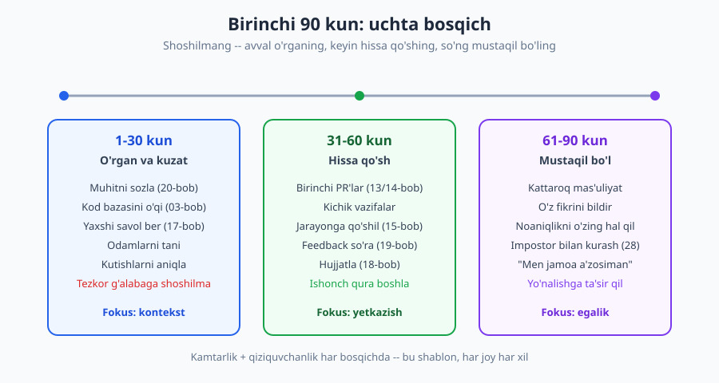
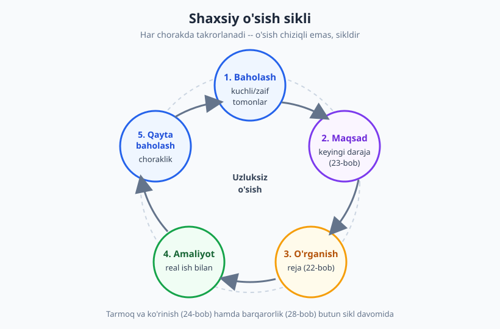
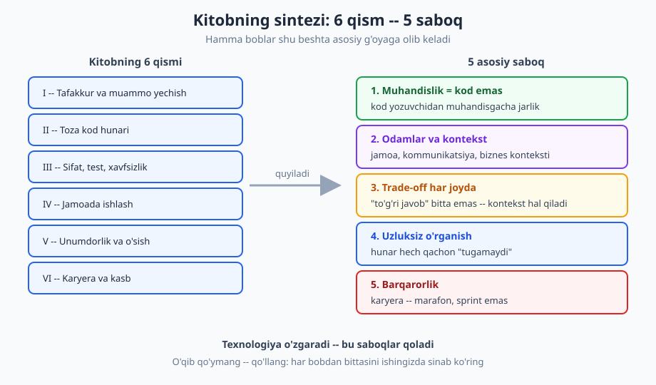

# 29 — Kapston: birinchi 90 kun va shaxsiy o'sish rejasi

[⬅️ Oldingi: 28 — Barqaror karyera: burnout, impostor va salomatlik](./28-barqaror-karyera-burnout.md) · [🏠 README](./README.md)

---

> **Bu bobda:** butun kitobni amaliyotga bog'laymiz. Kitob 28 bob davomida nazariya, ko'nikma va tafakkur berdi — bu kapston ularni **hayotga tatbiq qilish** haqida. Ikkita amaliy stsenariy orqali hamma bobni birlashtiramiz: (1) **yangi ishda birinchi 90 kun** uchun bosqichma-bosqich reja va (2) **shaxsiy o'sish yo'l xaritasi**. Oxirida kitobning asosiy saboqlarini sintez qilamiz, boshqa kitoblarga ko'prik tashlaymiz va sizga iliq yakuniy xat yozamiz.
>
> **Halollik / Eslatma:** bu bobdagi rejalar — *qonun emas, shablon*. "90 kun rejasi" har joyda har xil ko'rinadi: startapda birinchi haftada production'ga kod chiqarasiz, katta korporatsiyada bir oy onboarding o'tasiz. O'sish **chiziqli emas** — ba'zi haftalar sakrab o'sasiz, ba'zilarida turib qolasiz, va bu normal. "To'g'ri yo'l" bitta emas; bu yerda berilgan tartib — eng keng tarqalgan, xavfsiz boshlanish nuqtasi, sizning xaritangiz emas. Uni o'zingizga moslang.

---

## Nazariyadan amaliyotga: nima uchun kapston?

Bu kitobni o'qidingiz — yoki hech bo'lmaganda ko'p qismini. Endi savol tug'iladi: **"Buning hammasini bir vaqtda qanday qilib qo'llayman?"** 28 bobda o'nlab tushuncha bor: toza kod, debugging, code review, baholash, kommunikatsiya, karyera... Real hayotda esa ular alohida-alohida emas, **bir vaqtning o'zida, bir-biriga bog'langan holda** keladi.

Aynan shuni bu kapston ko'rsatadi. Biz nazariyani **ikkita real, vaqtga bog'langan stsenariy** orqali tatbiq qilamiz — chunki kasbiy o'sish abstrakt maslahatlardan emas, konkret vaziyatlarda qaror qabul qilishdan o'sadi.

- **1-qism — Birinchi 90 kun:** siz yangi ishga (yoki yangi loyihaga) kirdingiz. Bu eng stressli va eng hal qiluvchi davr. Bu yerda deyarli har bob "tushadi".
- **2-qism — Shaxsiy o'sish rejasi:** siz allaqachon ishlayapsiz, lekin "keyin nima?" degan savol bor. Bu — uzoq muddatli, takrorlanuvchi yo'l xaritasi.

Keling, birinchisidan boshlaymiz.

---

## 1-qism: Yangi ishda birinchi 90 kun

Birinchi 90 kun — yangi ish (yoki yangi jamoa, yangi loyiha) bilan tanishuvning kritik davri. Bu davrda siz nafaqat kod yozasiz, balki **ishonch quryapsiz, kontekstni o'rganyapsiz va o'zingizning o'rningizni topyapsiz**. Eng katta xato — birinchi kundanoq "o'zingizni isbotlashga" shoshilish. Eng yaxshi yondashuv — bosqichma-bosqich.

> **Trade-off:** "avval o'rgan, keyin hissa qo'sh" qoidasi universal emas. Startapda yoki kichik jamoada sizdan **birinchi haftadayoq** real natija kutilishi mumkin — u yerda 30 kun "faqat kuzatish" hashamat. Aksincha, katta korporatsiyada formal onboarding 4-6 hafta cho'zilishi mumkin va "tezda kod chiqaray" deb urinish nojo'ya. To'g'ri tezlik — kontekstga bog'liq. Pastdagi 30/60/90 bo'linish — o'rtacha holat; **menejeringizdan birinchi kuni "men 30/60/90 kunda nimaga erishishim kutiladi?" deb so'rang** va rejangizni shunga moslang.

### 1-30 kun: O'rganish va kuzatish

Birinchi oyning maqsadi — **kod yozish emas, kontekst yig'ish**. Siz hali tizimni, jamoani, jarayonni bilmaysiz. Bu davrda kamtarona kuzatuvchi bo'ling.

**Nazorat ro'yxati (1-30 kun):**

- [ ] **Muhitni sozlash.** Loyihani lokal mashinangizda ishga tushiring: bog'liqliklar, ma'lumotlar bazasi, env o'zgaruvchilar. Birinchi kun ko'pincha shu bilan o'tadi — bu normal. (Qarang: [20-bob — ish muhiti va vositalar](./20-ish-muhiti-vositalar.md).) Agar README yetishmasa yoki sozlash og'riqli bo'lsa — buni **yozib boring**, keyin tuzatish uchun.
- [ ] **Kod bazasini o'qish.** Hamma kodni tushunishga urinmang. "Ipni torting": bitta real oqimni (mas. foydalanuvchi login qilganda nima bo'ladi) boshidan oxirigacha kuzating. (Qarang: [03-bob — begona kodni o'qish](./03-begona-kodni-oqish.md).)
- [ ] **Yaxshi savol berish.** Savol berishdan uyalmang — lekin **aqlli savol** bering: avval o'zingiz 15-20 daqiqa qidiring, keyin "men shuni sinadim, bu natija bo'ldi, men X deb o'ylayapman — to'g'rimi?" deb so'rang. (Qarang: [17-bob — texnik kommunikatsiya](./17-texnik-kommunikatsiya.md), XY muammosi.)
- [ ] **Odamlarni tanish.** Jamoadagi kim nima bilan shug'ullanadi, kimdan nima so'rash mumkin. 1:1 uchrashuvlar tashkil qiling. Bu **texnik bilim emas, ijtimoiy xarita** — u keyin oltin bo'ladi.
- [ ] **Kutishlarni aniqlash.** Menejeringizdan aniq so'rang: "Mendan birinchi oyda nima kutiladi? Muvaffaqiyat nimaga o'xshaydi?" Noaniqlikda yashamang.
- [ ] **"Tezkor g'alaba"dan shoshilmaslik.** Birinchi haftada katta arxitektura o'zgarishini taklif qilmang. Siz hali **nega** narsalar shunday qilinganini bilmaysiz — ehtimol siz "xato" deb o'ylagan narsa ataylab shunday qilingan (qarang: Chesterton panjarasi g'oyasi, [03-bob](./03-begona-kodni-oqish.md)).

> **Eslatma:** yangi joyda "hammasini bilmaslik" — sizning aybingiz emas, balki **kutilgan holat**. Hech kim 1-haftada produktiv bo'lishingizni kutmaydi. Impostor sindromi aynan shu davrda kuchayadi ("hammadan sustman") — bu normal va vaqtinchalik. (Qarang: [28-bob — impostor sindromi](./28-barqaror-karyera-burnout.md).)

### 31-60 kun: Hissa qo'shish

Ikkinchi oyda siz kontekstni yetarlicha o'rgandingiz — endi **qiymat yetkaza boshlang**. Lekin hali ham kichik, xavfsiz qadamlar bilan.

**Nazorat ro'yxati (31-60 kun):**

- [ ] **Birinchi PR'lar.** Kichik, aniq vazifalardan boshlang: kichik bug tuzatish, hujjat yangilash, kichik feature. Atomik commit va aniq commit xabari yozing; PR'ni kichik tuting. (Qarang: [14-bob — jamoaviy kod oqimi](./14-jamoaviy-kod-oqimi.md).)
- [ ] **Code review jarayoniga qo'shilish.** Boshqalarning PR'larini o'qing (o'rganish uchun zo'r usul) va o'z PR'ingizga sharhni **mudofaasiz, o'rganishga ochiq** qabul qiling. (Qarang: [13-bob — code review](./13-code-review.md).)
- [ ] **Jarayonga qo'shilish.** Standup, sprint planning, retroda faol bo'ling. Jamoa qanday ishlashini (Scrum? Kanban?) tushuning va unga moslang. (Qarang: [15-bob — Agile amalda](./15-agile-scrum-kanban.md).)
- [ ] **Feedback so'rash.** Kutmang — faol so'rang: "Mening birinchi PR'larim qanday? Nimani boshqacha qilsam yaxshi bo'lardi?" Aniq, harakatga aylantiriladigan feedback talab qiling. (Qarang: [19-bob — fikr-mulohaza](./19-fikr-mulohaza-mentorlik.md).)
- [ ] **Hujjatlash.** Onboarding'da topgan bo'shliqlarni to'ldiring: README'ni yangilang, sozlash bo'yicha qadamlarni qo'shing. Bu — yangi kelganning eng qadrli hissasi, chunki siz "yangi ko'z" bilan ko'rasiz. (Qarang: [18-bob — hujjatlash](./18-hujjatlash.md).)

> **Trade-off:** birinchi PR'ingizni "mukammal" qilishga urinish vasvasasi bor — lekin perfeksionizm sizni sekinlashtiradi va jamoa sizni "qotib qolgan" deb ko'radi. Aksincha, sifatga e'tibor bermay shoshilish ishonchni buzadi. Muvozanat: **kichik, toza, lekin mukammal bo'lmagan** hissalar — va sharhga ochiqlik. Birinchi 60 kunda "ishonch qurish" mukammal koddan muhimroq.

### 61-90 kun: Mustaqillik

Uchinchi oyda siz "yangi xodim"dan "jamoa a'zosi"ga aylanasiz. Maqsad — **kattaroq mas'uliyatni o'z zimmangizga olish va o'z ovozingizni topish**.

**Nazorat ro'yxati (61-90 kun):**

- [ ] **Kattaroq mas'uliyat.** Endi butun feature'ni yoki noaniqroq vazifani o'zingiz olib boring — har qadamda yo'naltirish so'ramasdan. (Bu mid darajaga o'tish belgisi — qarang: [23-bob — karyera narvoni](./23-karyera-narvoni.md).)
- [ ] **O'z fikrini bildirish.** Dizayn muhokamalarida, retro'da o'z fikringizni ayting. "Yangi ko'z" qimmatli — siz ko'rgan narsani jamoa "ko'r nuqta" qilib qolgan bo'lishi mumkin. Hurmat bilan, lekin dadil.
- [ ] **Noaniqlikni o'zingiz hal qilish.** "Menga aniq aytishmadi" deb to'xtamang; mantiqiy taxmin qiling, kerak bo'lsa tasdiqlatib, oldinga harakat qiling.
- [ ] **Impostor bilan kurash.** 3 oydan keyin ham "men hali ham yetarli emasman" hissi bo'lishi mumkin. Yutuqlaringizni yozib boring; "yutuq jurnali" yuriting. (Qarang: [28-bob](./28-barqaror-karyera-burnout.md).)
- [ ] **"Men shu jamoaning a'zosiman" hissi.** Bu davr oxirida siz jamoa madaniyatini, jargonni, kimdan nima so'rashni bilasiz. Bu — muvaffaqiyatli onboarding belgisi.

### 90 kun jadvali: bir qarashda

| Davr | Asosiy fokus | Asosiy faoliyat | Tegishli boblar | Belgi (muvaffaqiyat) |
|---|---|---|---|---|
| **1-30 kun** | Kontekst (o'rgan/kuzat) | Muhit, kod o'qish, savol, odamlar | [20](./20-ish-muhiti-vositalar.md), [03](./03-begona-kodni-oqish.md), [17](./17-texnik-kommunikatsiya.md) | Tizim umumiy manzarasini tushunasiz |
| **31-60 kun** | Yetkazish (hissa) | Kichik PR, code review, jarayon | [14](./14-jamoaviy-kod-oqimi.md), [13](./13-code-review.md), [15](./15-agile-scrum-kanban.md), [19](./19-fikr-mulohaza-mentorlik.md), [18](./18-hujjatlash.md) | Mustaqil kichik vazifalarni yopasiz |
| **61-90 kun** | Egalik (mustaqillik) | Katta vazifa, o'z fikri, ovoz | [23](./23-karyera-narvoni.md), [28](./28-barqaror-karyera-burnout.md) | "Jamoa a'zosi" his qilasiz |

### Umumiy tamoyillar (butun 90 kun davomida)

Bosqichlardan qat'i nazar, ikkita xislat butun davrda hamroh bo'lsin:

- **Kamtarlik + qiziquvchanlik.** Kamtarlik — "men hali bilmayman, o'rgataman" (lekin o'zingizni kamsitmang). Qiziquvchanlik — "nega bu shunday qilingan?" Bu ikkisi — yangi kelganning eng kuchli quroli. Takabburlik ("eski kod axlat ekan") yoki passivlik (savolsiz, fikrsiz) — ikkalasi ham zararli.
- **Ishonch qurish.** Ishonch kichik va'dalarni bajarishdan o'sadi: "ertaga yuboraman" desangiz — yuboring. Kichik ishonch katta mas'uliyatga eshik ochadi.

**❌ Yomon 90 kun:**
> 1-kun: "Bu kod bazasi dahshat, men hammasini qayta yozaman." 1-hafta: katta refactoring PR'i (300 fayl), hech kim bilan maslahatlashmasdan. 2-hafta: PR rad etiladi, xafa bo'ladi. 1-oy: kam savol beradi (uyaladi), qotib qoladi, lekin "band ko'rinadi". Natija: jamoa ishonmaydi.

**✅ Yaxshi 90 kun:**
> 1-hafta: muhitni sozlaydi, sozlash bo'yicha README'dagi bo'shliqni topib, kichik PR bilan tuzatadi (birinchi g'alaba!). 1-oy: bitta oqimni chuqur o'rganadi, aqlli savollar beradi, odamlar bilan 1:1 o'tkazadi. 2-oy: kichik bug'larni mustaqil yopadi, code review'da faol. 3-oy: birinchi to'liq feature'ni olib boradi, retro'da fikr bildiradi. Natija: jamoa ishonadi, "u bizning odam".

### Eng keng tarqalgan tuzoq: "tezda isbotlash" bosimi

Ko'p yangi dasturchi (ayniqsa o'zini "yetarli emas" his qilgani) birinchi haftadayoq **katta narsa qilib, qadrini isbotlashga** intiladi. Bu deyarli har doim teskari natija beradi: kontekstsiz qilingan katta o'zgarish jamoaning vaqtini oladi, ishonchni buzadi va sizni "tinglamaydigan yangi xodim" qilib ko'rsatadi. Ironiya shundaki — qadringizni isbotlashning eng tez yo'li **shoshilmaslik**: yaxshi savol berish, kichik va'dalarni bajarish va atrofdagilarga quloq solish ko'proq ishonch quradi.

> **Trade-off:** "shoshilmaslik" cheksiz emas. Agar 90 kun o'tib ham hech qanday mustaqil hissa qo'shmagan bo'lsangiz — bu boshqa muammo (yo siz qotib qolgansiz, yo vazifa noto'g'ri). "Avval o'rgan" — birinchi haftalar uchun; lekin har hafta kichik bo'lsa ham **ko'rinadigan** bir qadam tashlash kerak. Muvozanat: tez emas, lekin **muntazam** oldinga.

---

## 2-qism: Shaxsiy o'sish rejasi (yo'l xaritasi)

90 kun — qisqa muddatli. Endi uzoq muddatga qaraymiz: **siz qaerga bormoqchisiz va u yerga qanday yetasiz?** Karyera tasodifan o'smaydi — eng kuchli dasturchilar o'z o'sishini ataylab boshqaradi. Lekin "boshqarish" qattiq reja emas — bu **takrorlanuvchi sikl**.

### 1-qadam: Hozirgi holatni baholash

O'sish "men qaerdaman?" savolidan boshlanadi. Bu kitobning boblari sizga **o'z-o'zini baholash ramkasi** beradi: har qism bo'yicha o'zingizni kuchli/zaif deb belgilang. Halol bo'ling — bu hech kimga ko'rsatilmaydi.

**O'z-o'zini baholash jadvali (namuna):**

| Soha (bob) | 1-5 baho | Holat | Birinchi qadam |
|---|---|---|---|
| Toza kod hunari ([05](./05-nomlash-sanati.md)–[09](./09-refactoring-kod-hidlari.md)) | 3 | Yozaman, lekin refactoring sust | "Boy skaut qoidasi"ni har PR'da |
| Testlash ([11](./11-testlash-madaniyati.md)) | 2 | Kamdan-kam test yozaman | Keyingi feature'ni TDD bilan |
| Kommunikatsiya ([17](./17-texnik-kommunikatsiya.md)) | 2 | Yozma muloqot zaif | Bitta ADR yozib ko'rish |
| Code review ([13](./13-code-review.md)) | 4 | Yaxshi sharh beraman | Boshqalarga mentor bo'lish |
| Karyera/ko'rinish ([24](./24-ish-topish-rezyume-portfolio.md)) | 1 | GitHub bo'm-bo'sh | Profilni yangilash |

Eng past baholar — sizning **o'sish nuqtalaringiz**. Lekin hammasini bir vaqtda tuzatishga urinmang.

> **Trade-off:** "zaif tomonni kuchaytirish" har doim eng yaxshi strategiya emas. Ba'zan **kuchli tomonni yanada o'tkirlash** ko'proq qiymat beradi (T-shaklli mutaxassis — bitta chuqur soha + keng asos, qarang [22-bob](./22-organishni-organish.md)). Masalan, backend'da kuchli bo'lsangiz, "men frontend'da zaifman" deb hammasini frontend'ga sarflashdan ko'ra, backend'ni "senior" darajaga olib chiqish foydaliroq bo'lishi mumkin. Qaror — sizning maqsadingizga bog'liq: kengaymoqchimisiz yoki chuqurlashmoqchimisiz?

### 2-qadam: Maqsad qo'yish

Baholashdan keyin — **qaerga bormoqchisiz?** Maqsad aniq va o'lchanadigan bo'lsin. "Senior bo'laman" — noaniq. "Keyingi chorakda noaniq vazifalarni mustaqil hal qila olaman va bitta junior'ga mentor bo'laman" — aniq.

Maqsadni keyingi daraja kontekstida o'ylang (qarang: [23-bob — karyera narvoni](./23-karyera-narvoni.md)): daraja = ta'sir doirasi, unvon emas. Demak maqsad ham "unvon olish" emas, "kengroq ta'sir ko'rsatish" bo'lsin.

### 3-qadam: O'rganish rejasi

Maqsadga yetish uchun nima o'rganish kerak? Bu yerda [22-bob — o'rganishni o'rganish](./22-organishni-organish.md) ishga tushadi: "tutorial do'zaxi"dan qoching (faqat ko'rish, qilmaslik), real loyihada o'rganing, fundamental vs trend'ni ajrating. Reja konkret bo'lsin: "har hafta 3 soat, falon mavzu, oxirida kichik loyiha".

### 4-qadam: Amaliyot (real ish bilan)

O'rganish faqat **amaliyotda** mustahkamlanadi. Yangi ko'nikmani real ishingizda yoki yon loyihada sinab ko'ring. Bu kitobning butun falsafasi: **o'qib qo'ymang — qo'llang.** Har bobdan bittasini ishingizda sinab ko'ring.

### 5-qadam: Choraklik qayta baholash

3 oyda bir marta to'xtab, qayta baholang: "Maqsadimga yaqinlashdimmi? Reja ishladimi? Nima o'zgardi?" Bu — sikl: qayta baholashdan keyin yangi maqsad. O'sish — chiziq emas, **spiral**.

### Ko'rinish, tarmoq va barqarorlik — butun sikl davomida

Sikl ichidagi 5 qadamdan tashqari, ikki narsa **doimo** fonda ishlaydi:

- **Ko'rinish va tarmoq.** Yaxshi ish qilish yetarli emas — uning ko'rinishi kerak. GitHub, blog, konferensiya, hamkasblar bilan munosabat. (Qarang: [24-bob — rezyume, portfolio va tarmoq](./24-ish-topish-rezyume-portfolio.md).)
- **Barqarorlik.** O'sishni "max rejim"da quvib, charchab qolmang. Marafon, sprint emas. (Qarang: [28-bob — burnout va salomatlik](./28-barqaror-karyera-burnout.md).)

> **Eslatma:** o'sish **chiziqli emas**. Ba'zi choraklarda sakrab o'sasiz, ba'zilarida turib qolgandek tuyuladi — ayniqsa "plato" davrlarida. Bu normal va deyarli har bir dasturchi boshidan kechiradi. Plato — ko'pincha yangi sakrash oldidan keladigan mustahkamlash davri. Sabr qiling va siklni davom ettiring.

---

## Kitobning asosiy saboqlari (qisqa sintez)

28 bob, oltita qism — lekin agar hammasini beshta jumlaga siqsak, mana kitobning yuragi:

1. **Muhandislik — kod emas.** "Kod yoza olish" bilan "muhandis bo'lish" o'rtasida katta jarlik bor. Muhandislik — muammoni yechish, qaror qabul qilish, mas'uliyat olish. Kod — bu faqat vosita. (Bu kitobning poydevor g'oyasi, [01-bob](./01-kod-yozuvchidan-muhandisgacha.md).)
2. **Kontekst va odamlar har narsadan muhim.** Texnologiya tanlovi, kod sifati, dizayn — hammasi **kim uchun, qaysi sharoitda** degan savolga bog'liq. Va dasturlash — yolg'iz ish emas; jamoa, kommunikatsiya va munosabat hunarning yarmi.
3. **Trade-off har joyda.** "To'g'ri javob" deyarli hech qachon bitta emas. Tez/arzon/sifatli — hammasi bir vaqtda bo'lmaydi. Yaxshi muhandis "ideal" emas, "shu kontekstda eng mos" yechimni topadi va nima evaziga ekanini biladi.
4. **Uzluksiz o'rganish.** Bu kasbda "o'rganib bo'ldim" degan nuqta yo'q. Texnologiya o'zgaradi, lekin o'rganish ko'nikmasi — sizning eng barqaror kapitalingiz. Fundamentalga sarmoya kiriting, trend'ni kuzating.
5. **Barqarorlik.** Eng zo'r kod ham, eng tez karyera ham, agar siz charchab, "kuyib" qolsangiz — qiymatsiz. Karyera marafon; o'zingizga, salomatligingizga g'amxo'rlik — hashamat emas, zarurat.

Bu beshta saboq — **texnologiyadan ustun**. Til, freymvork, vosita o'zgaradi; bular qoladi.

---

## Keyingi qadamlar: boshqa kitoblarga ko'prik

Bu kitob **kasb** haqida edi — "qanday professional dasturchi bo'lish". Texnologiyani chuqur o'rganish uchun yo'l davom etadi:

- **Versiya nazorati to'liq mexanikasi:** bu kitobda commit/PR *madaniyati* bor; [Git & GitHub](../git-github/README.md) da to'liq mexanika (rebase, merge strategiyalari, konflikt).
- **Tizim darajasidagi dizayn:** kod *ichidagi* emas, tizim *darajasidagi* qarorlar uchun [Dasturlash arxitekturasi](../arxitektura/README.md) (SOLID, pattern, mikroservis, masshtab).
- **Algoritmik fikrlash va intervyu poydevori:** [Algoritmlar](../algoritmlar/README.md) va [1000 masala](../1000-masala/README.md) — muammo yechish va texnik intervyu uchun.
- **Deploy va operatsiya:** kodni serverga chiqarish, CI/CD, monitoring uchun [DevOps & Deployment](../devops/README.md).
- **Til asoslari:** sintaksis hali yangi bo'lsa — [Python](../python/README.md), [JavaScript](../js/README.md), [PHP](../php/README.md).
- **Umumiy yo'nalish:** qaysi kitobni qaysi tartibda — [Yo'l xaritasi](../roadmap.md).

Lekin eng muhim "keyingi qadam" kitob emas — **amaliyot**. Real loyihaga qo'shiling, ochiq kodga hissa qo'shing, yon loyiha quring. Bilim faqat qo'llanganda ko'nikmaga aylanadi.

---

## Yakuniy xat o'quvchiga

Aziz o'quvchi,

Agar siz bu yergacha yetib kelgan bo'lsangiz — bu allaqachon ko'p narsani aytadi. Ko'pchilik kitobni boshlaydi, lekin tugatmaydi. Siz tugatdingiz. Bu — sizdagi qiziquvchanlik va sabr-toqatning belgisi, va aynan shu ikki xislat sizni yaxshi muhandis qiladi.

Ochig'ini aytaylik: bu kitob sizni "professional muhandis" qilmadi. Hech bir kitob qila olmaydi. Muhandis bo'lish — bu kitobdan emas, **minglab kichik qarorlardan, xatolardan, o'zgarib qolgan fikrlardan va yetkazilgan ishlardan** o'sadi. Bu kitob faqat xaritani berdi; yo'lni siz bosib o'tasiz.

Va halol bo'laylik — yo'l oson bo'lmaydi. Qotib qolgan kunlar bo'ladi. "Men buni uddalay olmasam kerak" degan ovoz quloq solib turadi (impostor — u deyarli hammada bor, hatto eng tajribali muhandisda ham). Rad etilgan PR'lar, o'tib ketmagan intervyular, kechikkan loyihalar bo'ladi. Bu — mag'lubiyat emas, **yo'lning o'zi**. Har bir tajribali dasturchi shu yo'ldan o'tgan.

Lekin yana bir haqiqat bor: **siz bir o'zingiz emassiz.** Sizdan oldin millionlab dasturchilar aynan shu qo'rquv, shu shubha, shu qiyinchilik bilan boshlagan — va o'sgan. Siz ham o'sasiz. Bir kun kelib, hozir sizga "dahshatli" tuyulgan kod bazasi oddiy ko'rinadi; hozir sizni qo'rqitgan vazifa "qiziq muammo"ga aylanadi. Bu sodir bo'ladi — sabr va amaliyot bilan.

Shuning uchun: kamtar bo'ling, lekin o'zingizni kamsitmang. Qiziquvchan bo'ling, lekin charchaganingizda dam oling. Tez o'sishni emas, **barqaror o'sishni** quving. Va eng muhimi — **boshqalarga yordam bering**: bugun siz o'rganayotgan narsani ertaga kimdir o'rganadi, va siz unga qo'l cho'zsangiz — bu hunarning eng go'zal an'anasini davom ettirasiz.

Yo'lingiz ochiq bo'lsin. Birinchi PR'ingizdan tortib, birinchi mentorlik qilgan kuningizgacha — har qadamingizda omad tilayman.

Endi kitobni yoping va **kod yozing**. Yaxshiroq emas — keyingi safar bir oz yaxshiroq. Bu kifoya.

— Muallif

---

## Asosiy g'oyalar (bobni qisqacha)

- **Kapston — nazariyani hayotga tatbiq qilish.** 28 bob bilim berdi; bu bob ularni ikki real stsenariy orqali birlashtiradi: birinchi 90 kun + shaxsiy o'sish rejasi.
- **Birinchi 90 kun uch bosqich:** 1-30 (o'rgan/kuzat — kontekst), 31-60 (hissa qo'sh — yetkazish), 61-90 (mustaqillik — egalik). Har bosqichda kamtarlik + qiziquvchanlik, kichik va'dalar bilan **ishonch qurish**.
- **Eng katta xato — birinchi kundanoq "o'zini isbotlashga" shoshilish.** Avval *nega* narsalar shunday qilinganini tushuning, keyin o'zgartiring.
- **Shaxsiy o'sish — takrorlanuvchi sikl:** baholash → maqsad → o'rganish → amaliyot → choraklik qayta baholash. Ko'rinish/tarmoq va barqarorlik — butun sikl davomida fonda.
- **Beshta asosiy saboq:** muhandislik = kod emas; kontekst va odamlar; trade-off har joyda; uzluksiz o'rganish; barqarorlik. Bular **texnologiyadan ustun**.
- **Halollik:** 90 kun rejasi — shablon, har joy har xil (menejeringizdan kutishlarni so'rang). O'sish chiziqli emas — plato normal. "To'g'ri yo'l" bitta emas.
- **Eng muhim keyingi qadam — kitob emas, amaliyot.** O'qib qo'ymang — qo'llang.

---

## Mashqlar

### Oson

**1-mashq.** Birinchi 90 kunning uch bosqichini (1-30, 31-60, 61-90) asosiy fokusi bilan eslab, har biriga bittadan tegishli faoliyat yozing. So'ng o'zingizdan so'rang: agar ertaga yangi ishga kirsangiz, **birinchi kun** nimadan boshlagan bo'lardingiz?

**2-mashq.** Quyidagilardan qaysilari yangi ishda **yaxshi**, qaysilari **yomon** birinchi-hafta xatti-harakati? Har birini bir jumlada izohlang: (a) "Bu kod axlat, men hammasini qayta yozaman" deb katta refactoring PR'i yuborish; (b) sozlash bo'yicha README'dagi bo'shliqni topib, kichik tuzatish PR'i yuborish; (c) bironta savol bermay, hammasini o'zi tushunishga urinib qotib qolish.

**3-mashq.** "O'sish chiziqli emas, sikl" degani nima? O'sish siklining beshta qadamini tartib bilan ayting va nega bu "spiral" (bir marta emas, takror) ekanini bir jumlada tushuntiring.

### O'rta

**4-mashq.** **O'zingizning 90 kun rejangizni yozing.** Hozirgi (yoki kelajakdagi) ishingiz uchun har bosqich (1-30, 31-60, 61-90) bo'yicha 3 tadan aniq, o'lchanadigan maqsad yozing. Maslahat: 1-30 — "o'rgan", 31-60 — "yetkaz", 61-90 — "egalik qil". Menejeringizdan qanday savol so'rar edingiz?

**5-mashq.** **Kitob boblari bo'yicha o'zingizni baholang.** Kamida 6 ta sohani (mas. toza kod, testlash, kommunikatsiya, code review, debugging, karyera) oling, har biriga 1-5 baho qo'ying va eng past 2 ta soha uchun bittadan "birinchi qadam" yozing. Halol bo'ling.

**6-mashq.** Kitobning beshta asosiy saboqini eslang. Ulardan **bittasini** tanlang va o'z tajribangizdan (yoki tasavvur qilgan) konkret misol keltiring: bu saboq qaysi vaziyatda "tushadi" va uni bilmaslik qanday muammoga olib kelishi mumkin?

### Qiyin

**7-mashq.** **Shaxsiy o'sish rejangizni to'liq tuzing** (chorak uchun). Quyidagilarni o'z ichiga olsin: (a) hozirgi holat — 2-3 kuchli va 2-3 zaif tomon (boblar bo'yicha); (b) bitta aniq, o'lchanadigan chorak maqsadi (unvon emas, ta'sir tilida); (c) o'rganish rejasi (nima, qancha vaqt, qayerdan); (d) amaliyot — buni qaysi real ishda sinaysiz; (e) qayta baholash — 3 oydan keyin qanday savollar bilan o'zingizni tekshirasiz. Eslatma: yagona to'g'ri javob yo'q — bu sizning xaritangiz.

**8-mashq.** Tasavvur qiling: do'stingiz yangi ishga kirdi va birinchi haftada xafa: "Hech narsani tushunmayapman, hammadan sustman, ishni noto'g'ri tanlaganga o'xshayman." Unga bu kapston va kitobning saboqlari asosida halol, lekin dalda beruvchi javob yozing. Quyidagilarga teging: (a) bu his nima va nega normal (impostor, yangi-joy konteksti); (b) birinchi 30 kun aslida nimaga mo'ljallangan; (c) bitta amaliy maslahat. "Hammasi joyida bo'ladi" tipidagi quruq tasalli emas — konkret bo'ling.

Yechimlar

> Eslatma: bu mashqlarning ko'pi amaliy/refleksiv — yagona to'g'ri javob yo'q. Quyida **namuna javoblar va baholash mezonlari** berilgan.

### 1-mashq yechimi
Bosqichlar: **1-30 — o'rgan/kuzat** (mas. kod bazasini bitta oqim bo'yicha o'qish); **31-60 — hissa qo'sh** (mas. kichik bug-tuzatish PR'i); **61-90 — mustaqillik** (mas. butun feature'ni olib borish). Birinchi kun: ko'pchilik uchun bu **muhitni sozlash** (loyihani lokal ishga tushirish) + menejerdan kutishlarni so'rash. Mezon: bosqich fokuslari to'g'ri (kontekst → yetkazish → egalik), birinchi kun realistik (katta refactoring emas).

### 2-mashq yechimi
(a) **Yomon** — siz hali *nega* kod shunday qilinganini bilmaysiz; katta o'zgarish, hech kim bilan maslahatlashmasdan, ishonchni buzadi (Chesterton panjarasi). (b) **Yaxshi** — kichik, aniq, "yangi ko'z" qiymati bilan tuzatish; xavfsiz birinchi g'alaba va ishonch quradi. (c) **Yomon** — yaxshi savol berish 1-oyning maqsadi; qotib qolish vaqtni behuda sarflaydi va jamoa sizni "band, lekin natijasiz" deb ko'radi. Mezon: har baho to'g'ri + izoh "ishonch / kontekst / kamtarlik" mantig'iga tayanadi.

### 3-mashq yechimi
"Chiziqli emas, sikl" — o'sish bir martalik yo'l emas; bir maqsadga yetgach, qaytadan baholaysiz va yangi maqsad qo'yasiz. Qadamlar: **baholash → maqsad → o'rganish → amaliyot → choraklik qayta baholash → (qaytadan)**. Spiral, chunki har aylanada siz **yuqoriroq** nuqtadan boshlaysiz — o'sha qadamlar, lekin har safar yangi darajada. Mezon: 5 qadam to'g'ri tartibda + "takror/yuqorilab borish" g'oyasi.

### 4-mashq yechimi
Namuna (junior backend dasturchi uchun):
- **1-30:** (1) loyihani lokal ishga tushirish + sozlash hujjatini o'qish; (2) login va to'lov oqimlarini kod bo'yicha kuzatib chiqish; (3) jamoadagi har kishi bilan 1:1 o'tkazish.
- **31-60:** (1) kamida 3 ta kichik bug PR'i; (2) har hafta kamida 2 ta begona PR'ni o'qib, sharh berish; (3) standup/retro'da faol qatnashish.
- **61-90:** (1) bitta to'liq kichik feature'ni boshidan oxirigacha mustaqil yetkazish; (2) onboarding hujjatini yangilash; (3) retro'da kamida bitta taklif kiritish.
Menejerga savol: "Men 30/60/90 kunda nimaga erishishim kutiladi? Muvaffaqiyat nimaga o'xshaydi?" Mezon: maqsadlar aniq va o'lchanadigan; bosqich fokuslari to'g'ri; menejerdan kutish so'ralgan.

### 5-mashq yechimi
Namuna jadval (har kim uchun har xil):

| Soha | Baho | Birinchi qadam |
|---|---|---|
| Toza kod | 3 | Har PR'da "boy skaut": tekkan kodni biroz toza qil |
| Testlash | 2 | Keyingi feature'ni test bilan yozish |
| Kommunikatsiya | 2 | Bitta ADR/RFC yozib ko'rish |
| Code review | 4 | (kuchli — saqlash) |
| Debugging | 3 | Ilmiy debugging qadamlarini ongli qo'llash |
| Karyera/ko'rinish | 1 | GitHub profilini yangilash |

Eng past 2 (bu yerda: testlash va karyera) uchun birinchi qadam yozilgan. Mezon: halol baho (hammasi 5 emas), eng past sohalar aniqlangan, birinchi qadam konkret va kichik.

### 6-mashq yechimi
Namuna (3-saboq, "trade-off har joyda"): vaziyat — deadline yaqin, kod ishlayapti lekin "iflos". Saboq: tez yetkazish vs sifat orasida ongli trade-off — ataylab kichik "texnik qarz" olib, keyin to'lash rejasini yozish (qarang [10-bob](./10-texnik-qarz.md)). Bilmaslik oqibati: yo cheksiz "mukammal" qilib deadline'ni o'tkazib yuborish, yo qarzni rejasiz to'plab, keyin loyihani bo'g'ish. Mezon: tanlangan saboq to'g'ri tushunilgan + konkret vaziyat + bilmaslik oqibati aniq.

### 7-mashq yechimi
Namuna (mid → senior'ga intilayotgan dasturchi, 1 chorak):
- **(a) Kuchli:** mustaqil feature yetkazish, code review sifati, debugging. **Zaif:** yozma kommunikatsiya (ADR/RFC), tizim dizayni, mentorlik tajribasi yo'q.
- **(b) Maqsad:** "Bu chorakda kamida bitta noaniq, kross-modul vazifani o'zim aniqlashtirib hal qilaman va bitta junior'ga muntazam mentor bo'laman" (ta'sir tilida, unvon emas).
- **(c) O'rganish:** haftada 3 soat — tizim dizayni asoslari (qarang [arxitektura kitobi](../arxitektura/README.md)) + ADR yozish amaliyoti.
- **(d) Amaliyot:** keyingi epic'da dizayn hujjatini men yozaman; yangi junior'ga onboarding'da yordam beraman.
- **(e) Qayta baholash:** "Noaniq vazifani mustaqil hal qildimmi? Junior mendan foyda ko'rdimi? Menejer ta'simni jamoa darajasida ko'rdimi?"
Mezon: holat halol; maqsad o'lchanadigan va ta'sir tilida (unvon emas); o'rganish-amaliyot-qayta baholash zanjiri to'liq va bir-biriga bog'langan.

### 8-mashq yechimi
Namuna javob:
> "Bu hisni deyarli har bir dasturchi yangi joyda his qiladi — bu impostor sindromi, va aslida sen yetarli emasligingni emas, balki **hali kontekst yetishmasligini** ko'rsatadi (qarang [28-bob](./28-barqaror-karyera-burnout.md)). Birinchi 30 kun aynan **kod yozish uchun emas, o'rganish va kuzatish uchun** mo'ljallangan — hech kim sendan 1-haftada produktiv bo'lishingni kutmaydi; agar kutsa, bu ularning muammosi, sening emas. 'Hammadan sustman' degan taqqoslash adolatsiz: ular oylar/yillar shu kod bilan ishlagan, sen 5 kun. Bitta amaliy maslahat: bugun bitta kichik narsani tugatishga harakat qil — loyihani lokal ishga tushir yoki bitta funksiyani to'liq tushun. Kichik g'alaba o'sha ovozni jimlatadi. Va kichik 'yutuq jurnali' yurit — har kuni o'rgangan bitta narsani yoz; bir oydan keyin orqaga qarab, qancha o'sganingni ko'rasan."

Mezon: (a) impostorni nomlash va normallashtirish (lekin quruq tasalli emas); (b) "1-oy = o'rganish, kod emas" g'oyasi; (c) konkret amaliy maslahat (kichik g'alaba / yutuq jurnali). Halol + dalda beruvchi muvozanat saqlangan.

---

[⬅️ Oldingi: 28 — Barqaror karyera: burnout, impostor va salomatlik](./28-barqaror-karyera-burnout.md) · [🏠 README](./README.md)
