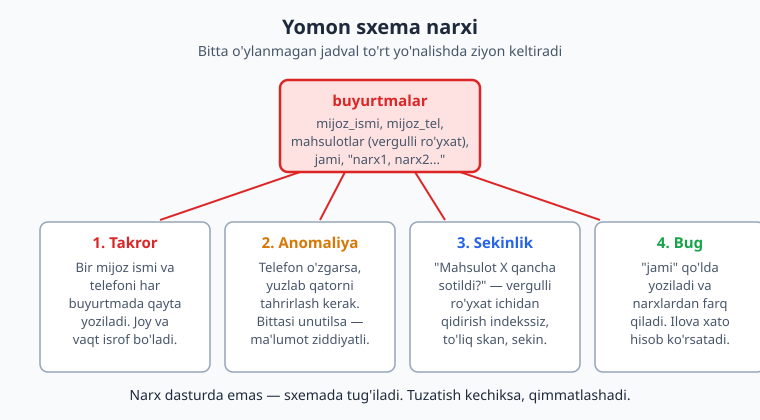
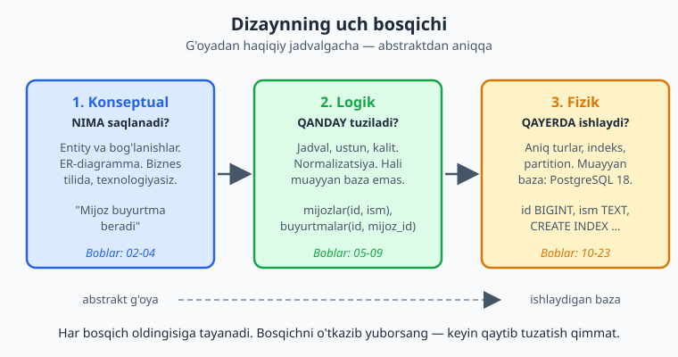
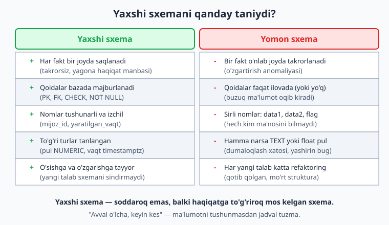

# 01 — Ma'lumotlar bazasi dizayni nima va nega muhim

[🏠 Kitob boshi](./README.md) · [Keyingi: 02 — Talab tahlili va domen modellashtirish ➡️](./02-talab-tahlili.md)

> **Bu bobda:** ma'lumotlar bazasi dizayni nima ekanini va nega u dasturning eng muhim, ammo eng ko'p e'tibordan chetda qoladigan qarori ekanini ko'rib chiqamiz. Yomon sxema qancha turadi (takror, anomaliya, sekinlik, bug), dizaynning uch bosqichi (konseptual -> logik -> fizik) qanday ishlaydi, yaxshi sxemani qanday taniydi, "avval o'lcha, keyin kes" falsafasi nimani anglatadi va butun kitobning yo'l xaritasi qanday ekanini o'rganamiz.

---

## Sintaksis emas, qaror

Sizning qo'lingizda allaqachon SQL bor. `CREATE TABLE` yoza olasiz, `SELECT ... JOIN` bilan jadvallarni bog'lay olasiz, `WHERE` bilan filtrlaysiz. Agar bu so'zlar notanish bo'lsa — bu kitobdan oldin [SQL va MySQL](../sql/README.md) kitobini ko'rib chiqing; u **sintaksisni** o'rgatadi. Bu kitob esa boshqa savolga javob beradi:

> Jadvalni qanday **tuzish** kerakligini bilaman. Lekin **qanday** jadvallar bo'lishi kerak, ularda **qaysi** ustunlar turishi va ular **qanday** bog'lanishi kerakligini qayerdan bilaman?

Mana shu — **ma'lumotlar bazasi dizayni** (database design). U sizning biznesingiz haqidagi haqiqatni — mijozlar, buyurtmalar, mahsulotlar, ularning o'zaro munosabatlari — kompyuter saqlay oladigan va tez, ishonchli ishlay oladigan **strukturaga** aylantirish san'ati.

Ko'plab dasturchilar sxemani "yo'l-yo'lakay" tuzadi: kerak bo'lganda ustun qo'shadi, jadval ochadi. Kichik loyihada bu o'tadi. Lekin baza — bu dasturning **poydevori**. Devorni keyin bo'yash mumkin, lekin poydevorni qayta quyish — butun binoni buzishni anglatadi. Sxemani bir marta to'g'ri loyihalash, keyin uni har oy tuzatishdan ko'ra ancha arzon.

---

## Yomon sxema qancha turadi

Tasavvur qiling: kichik onlayn-do'kon ochdingiz. Shoshilib, hamma narsani bitta jadvalga tiqdingiz:

```sql
-- ❌ yomon dizayn: hamma narsa bitta tekis jadvalda
CREATE TABLE buyurtmalar_yomon (
    id            bigint GENERATED ALWAYS AS IDENTITY PRIMARY KEY,
    mijoz_ismi    text,              -- har buyurtmada qayta yoziladi
    mijoz_tel     text,              -- har buyurtmada qayta yoziladi
    mahsulotlar   text,              -- "Sichqoncha, Klaviatura" — vergulli ro'yxat
    jami          double precision   -- pul float'da (!)
);
```

Bir mijoz ikki marta buyurtma bersa, jadval shunday ko'rinadi:

```
 id |  mijoz_ismi  |   mijoz_tel    |      mahsulotlar       |  jami
----+--------------+----------------+------------------------+---------
  1 | Aziz Karimov | +998901112233  | Sichqoncha, Klaviatura | 250000
  2 | Aziz Karimov | +998901112233  | Monitor                | 1800000
```

Ko'rinishidan ishlayotgandek. Lekin bu jadval to'rt yo'nalishda sekin-asta sizni o'ldiradi.



### 1. Takror (redundancy)

Aziz Karimovning ismi va telefoni **har** buyurtmasida qaytadan yoziladi. 1000 ta buyurtmasi bo'lsa — 1000 marta. Bu nafaqat disk joyini isrof qiladi, balki keyingi uchta muammoning ham asl sababi.

### 2. Anomaliyalar (o'zgartirish, qo'shish, o'chirish anomaliyasi)

Aziz telefon raqamini o'zgartirdi. Endi siz uning **barcha** qatorlarini topib, har birida raqamni yangilashingiz kerak. Bittasini unutsangiz — bazada bir mijozning ikki xil telefoni paydo bo'ladi. Qaysi biri to'g'ri? Hech kim bilmaydi. Bu **o'zgartirish anomaliyasi** (update anomaly).

Yana ikkitasi:

- **Qo'shish anomaliyasi:** hali buyurtma bermagan yangi mijozni qanday saqlaysiz? Bu jadvalda buyurtmasiz qator yo'q — mijozni kiritolmaysiz.
- **O'chirish anomaliyasi:** Aziz yagona buyurtmasini bekor qilsa va qatorni o'chirsangiz — uning ismi va telefoni ham birga yo'qoladi. Ma'lumot **g'oyib bo'ldi**.

### 3. Sekinlik (performans)

"`Monitor` qancha sotildi?" degan savolga javob berish uchun baza har bir qatorning `mahsulotlar` ustunidagi vergulli matn ichidan `Monitor` so'zini qidirishi kerak. Bunday ustunni **indekslab bo'lmaydi** — baza har safar butun jadvalni to'liq skanlaydi. 100 qatorda sezilmaydi, 10 millionda — falokat.

### 4. Bug (mantiqiy xato)

`jami` ni `double precision` (float) da saqladingiz. Float — pul uchun emas: u 0.1 + 0.2 ni aniq saqlay olmaydi, dumaloqlash xatosi to'planadi. Bir kun kelib mijozning cheki 1 tiyinga to'g'ri kelmaydi va siz sababini topolmasdan soatlab izlaysiz. Bu xato **dasturda** emas — **sxemada** tug'ilgan.

> **Asosiy g'oya:** bu to'rt muammoning hech biri "yomon kod" emas. Ular **yomon struktura**. Hech qanday tajribali dasturchi ham buzuq poydevor ustida mustahkam ilova qura olmaydi.

---

## Yaxshi dizayn qanday ko'rinadi

Endi xuddi shu ma'lumotni to'g'ri loyihalaymiz. Bitta jadvalni uchta mas'uliyatga ajratamiz: **kim** (mijoz), **nima** (buyurtma) va ularning **bog'lanishi**.

```sql
-- ✅ yaxshi dizayn: har fakt o'z joyida, bir marta
CREATE TABLE mijozlar (
    id   bigint GENERATED ALWAYS AS IDENTITY PRIMARY KEY,
    ism  text NOT NULL,
    tel  text NOT NULL UNIQUE          -- bir telefon — bir mijoz
);

CREATE TABLE buyurtmalar (
    id         bigint GENERATED ALWAYS AS IDENTITY PRIMARY KEY,
    mijoz_id   bigint NOT NULL REFERENCES mijozlar(id),  -- bog'lanish
    jami       numeric(12,2) NOT NULL CHECK (jami >= 0),  -- pul NUMERIC'da
    yaratilgan timestamptz NOT NULL DEFAULT now()
);
```

Endi to'rt muammoning to'rttasi ham yo'qoldi:

- **Takror yo'q:** Aziz bir marta `mijozlar` jadvalida saqlanadi. Buyurtmalar unga `mijoz_id` orqali ishora qiladi.
- **Anomaliya yo'q:** telefon o'zgarsa — `mijozlar` da bitta qatorni yangilaysiz, tamom. Buyurtmasiz mijozni ham, mijozsiz tarixni ham yo'qotmasdan saqlaysiz.
- **Tez:** `mijoz_id` — indekslanadigan butun son; bog'lanish soniyaning ulushida bajariladi.
- **Bug yo'q:** `jami` endi `numeric(12,2)` — pul uchun aniq tur; `CHECK (jami >= 0)` manfiy summani **bazaning o'zi** rad etadi.

Aziz Karimovning ikki buyurtmasini kiritib, umumiy summasini so'rasak (PostgreSQL 18, jonli klasterda tekshirilgan):

```sql
SELECT m.ism, count(b.id) AS buyurtma_soni, sum(b.jami) AS umumiy
FROM mijozlar m
JOIN buyurtmalar b ON b.mijoz_id = m.id
GROUP BY m.ism;
```

```
     ism      | buyurtma_soni |   umumiy
--------------+---------------+------------
 Aziz Karimov |             2 | 2050000.00
(1 row)
```

`2050000.00` — `numeric` tufayli aniq, ikki kasrli son; float bo'lganda taxminiy qiymat chiqishi mumkin edi. Bir xil ma'lumot, ikki xil struktura — natija osmon bilan yer.

> **Eslatma (MySQL):** bu yerda `GENERATED ALWAYS AS IDENTITY` va `numeric(12,2)` ishlatildi. MySQL'da avtomatik kalit odatda `BIGINT AUTO_INCREMENT`, pul esa `DECIMAL(12,2)`. G'oya bir xil — faqat sintaksis biroz farq qiladi.

---

## Dizaynning uch bosqichi

Yaxshi sxema bir o'tirishda tug'ilmaydi. Tajribali loyihachilar uni **uch bosqichda** — abstraktdan aniqqa qarab — quradi. Bu klassik ketma-ketlik: konseptual -> logik -> fizik.



### 1-bosqich — Konseptual model: NIMA saqlanadi?

Bu yerda hali jadval, ustun yoki PostgreSQL haqida o'ylamaysiz. Faqat **biznes haqiqatini** chizasiz: qaysi narsalar (entity'lar) muhim va ular qanday bog'lanadi.

> "Mijoz buyurtma beradi. Har buyurtmada bir nechta mahsulot bo'ladi. Har mahsulotning kategoriyasi bor."

Bu jumlalardagi otlar — `Mijoz`, `Buyurtma`, `Mahsulot`, `Kategoriya` — bo'lajak entity'lar. Fe'llar — "beradi", "bo'ladi" — bog'lanishlar. Natija — **ER-diagramma** (Entity-Relationship), biznes egasi ham tushunadigan rasm. Bu bosqich texnologiyaga **bog'liq emas**: xoh PostgreSQL, xoh MongoDB ishlatasizmi — konseptual model bir xil. Bu kitobda **02-04-boblar** shu bosqichga bag'ishlangan.

### 2-bosqich — Logik model: QANDAY tuziladi?

Endi konseptual modelni **relyatsion** tilga o'giramiz: entity'lar jadvalga, atributlar ustunga, bog'lanishlar kalitlarga aylanadi. Bu yerda **normalizatsiya** ro'y beradi — ma'lumotni takrorsiz, anomaliyasiz tarzda jadvallarga bo'lib chiqamiz.

```
mijozlar(id, ism, tel)
buyurtmalar(id, mijoz_id -> mijozlar.id, jami, yaratilgan)
```

E'tibor bering: bu hali **muayyan baza emas**. Aniq turlar (`bigint` mi `int` mi?), indekslar, partition'lar — hali yo'q. Logik model "qaysi jadval, qaysi ustun, qaysi kalit" degan savolga javob beradi. **05-09-boblar** shu haqida.

### 3-bosqich — Fizik sxema: QAYERDA ishlaydi?

Nihoyat, logik modelni **muayyan bazaga** — bizning holatda PostgreSQL 18 ga — o'tkazamiz. Bu yerda aniq qarorlar qabul qilinadi: `id` `bigint` mi yoki `uuid` mi? Qaysi ustunga indeks? Jadval partition'lanadimi? Pul `numeric(12,2)`, vaqt `timestamptz`. Bu bosqich bazaga **xos** va u performansni belgilaydi. **10-23-boblar** shu darajaga chuqurlashadi.

> **Nega aynan shu tartib?** Agar darrov fizik bosqichdan (`CREATE TABLE`) boshlasangiz, biznes haqiqatini to'liq tushunib olmagan bo'lasiz — natijada yuqoridagi `buyurtmalar_yomon` kabi jadval chiqadi. Avval **nima** ekanini tushunib oling (konseptual), keyin uni **qanday** tuzishni hal qiling (logik), oxirida **qayerda** ishlatishni sozlang (fizik).

---

## Yaxshi sxemani qanday taniydi

Yaxshi dizaynning aniq matematik formulasi yo'q, lekin tajribali loyihachilar bir nechta barqaror belgiga qarab baho beradi.



- **Yagona haqiqat manbasi.** Har bir fakt bazada **bir** joyda saqlanadi. Mijozning telefonini o'zgartirish uchun faqat bitta qatorni tahrirlaysiz.
- **Qoidalar bazada majburlanadi.** Yaxlitlik `PRIMARY KEY`, `FOREIGN KEY`, `UNIQUE`, `CHECK`, `NOT NULL` bilan **bazaning o'zida** ta'minlanadi — faqat ilovaga ishonib qolmaydi. Ilova xato qilsa ham, baza buzuq ma'lumotni rad etadi. Bu — "oxirgi qal'a" falsafasi (**11-bob**).
- **Tushunarli, izchil nomlar.** `mijoz_id`, `yaratilgan_vaqt` — har kim ma'nosini tushunadi. `data1`, `flag`, `tmp` — yo'q (**09, 13-boblar**).
- **To'g'ri turlar.** Pul — `numeric`, vaqt — `timestamptz`, mantiqiy qiymat — `boolean`. Hamma narsani `text` qilib qo'yish — yashirin buglar manbasi (**10-bob**).
- **O'sishga tayyor.** Yangi talab kelganda sxema **sinmaydi**, balki tabiiy kengayadi. Mo'rt sxema har yangi xususiyatda katta refaktoringni talab qiladi.
- **Sodda — lekin ortiqcha sodda emas.** Yaxshi sxema haqiqatga **to'g'ri** mos keladi: na ortiqcha murakkab, na ortiqcha yassi.

> **Muhim nuance:** "yaxshi" — universal emas. OLTP tizimi (onlayn-do'kon, har soniya buyurtma) uchun yaxshi sxema kuchli **normallashtirilgan** bo'ladi; analitik ombor (hisobotlar, **21-bob**) uchun esa ataylab **denormallashtirilgan**. Dizayn har doim maqsadga bog'liq — keyingi bo'limda shu haqida.

---

## "Avval o'lcha, keyin kes" falsafasi

Duradgorlarning eski qoidasi bor: *"Measure twice, cut once"* — "ikki marta o'lcha, bir marta kes". Yog'ochni kesib bo'lgach, orqaga qaytarib bo'lmaydi. Ma'lumotlar bazasi dizaynida ham xuddi shunday: ishlab turgan tizimning sxemasini o'zgartirish — bu ishlayotgan poyezdning g'ildiragini almashtirishga o'xshaydi.

Bu falsafa amalda ikki narsani anglatadi:

**1. Avval domenni tushun, keyin jadval tuz.** Eng katta xato — biznesni to'liq anglab yetmasdan `CREATE TABLE` yozish. "Mijozning bitta telefoni bo'ladimi yoki bir nechta?", "Buyurtma bekor qilingach ham saqlanadimi?", "Bir mahsulot bir nechta kategoriyaga tegishli bo'la oladimi?" — bu savollarga **oldindan** javob bering. Aks holda sxema noto'g'ri taxminga qurilib qoladi. To'g'ri savol berish san'ati — **02-bob** mavzusi.

**2. Lekin haddan oshma — erta optimallashtirish ham xato.** Buning teskari tomoni ham bor. Hali bir foydalanuvchi yo'q ekan, "10 million qatorga sharding kerak bo'ladi" deb hafta sarflash — vaqtni isrof qilish. **Donald Knuth**ning mashhur gapi bor: *"Erta optimallashtirish — barcha yomonliklarning ildizi"*. Avval to'g'ri va sodda sxema tuzing; performans muammosi **haqiqatan** paydo bo'lganda, **o'lchang** (`EXPLAIN ANALYZE`, **15-bob**) va aniq joyni tuzating — taxminga qarab emas.

> Boshqacha aytganda: **fikrlashda ehtiyot, kodlashda dadil bo'l.** Sxemani chizishdan oldin yaxshilab o'yla (o'lcha); chizgach esa ortiqcha "har ehtimolga qarshi" murakkablik qo'shma (bir marta kes). Muvozanat — tajriba bilan keladi va bu kitob aynan shu tajribani beradi.

---

## Bu kitobning yo'l xaritasi

Bu kitob 24 bob va 7 qismdan iborat. U sizni **0 dan ekspertgacha** — sodda ER-chizmadan tortib taqsimlangan tizim sxemasigacha — bosqichma-bosqich olib boradi.

| Qism | Boblar | Nimani o'rganasiz |
|---|---|---|
| **I. Asoslar va konseptual modellashtirish** | 01-04 | Dizayn nima, talab tahlili, ER-diagramma, bog'lanish va kardinallik (1:1, 1:N, N:M) |
| **II. Relyatsion model va normalizatsiya** | 05-09 | Relyatsion model, kalit dizayni (natural/surrogate/UUID), normalizatsiya (1NF-5NF), logikdan fizikka o'tish |
| **III. Yaxlitlik, turlar, naqshlar** | 10-13 | To'g'ri ma'lumot turi, constraint dizayni, dizayn naqshlari, anti-naqshlar (nima qilmaslik) |
| **IV. Fizik dizayn va performans** | 14-16 | Indeks strategiyasi, sxema performansi (EXPLAIN), tranzaksiya va parallellik dizayni |
| **V. Ilg'or modellashtirish** | 17-19 | Daraxt/graf strukturalari, temporal/versiyalangan ma'lumot, multi-tenancy va RLS |
| **VI. NoSQL, analitik va masshtab** | 20-23 | NoSQL modellashtirish, analitik ombor (star schema), partitioning/sharding, migratsiya va evolyutsiya |
| **VII. Kapston** | 24 | To'liq real tizimni 0 dan loyihalash: talabdan to'liq DDL gacha |

Asosiy misollar **PostgreSQL 18** da yoziladi va jonli klasterda tekshiriladi; kerakli joyda MySQL farqlari qisqa izohda beriladi. Har bobda kamida 3 ta diagramma va kamida 12 ta dizayn mashqi bor.

Bu kitob [SQL va MySQL](../sql/README.md) kitobining **davomi**: u SQL **sintaksisini** (SELECT, JOIN, GROUP BY, normalizatsiyaga kirish) o'rgatadi, bu kitob esa **loyihalash san'atini**. Sintaksisni qayta o'rgatmaymiz — uning o'rniga "nega aynan shu sxema, qaysi trade-off, qaysi kalit, qancha normalizatsiya" degan savollarga javob beramiz.

> **Keyingi qadam:** keyingi bobda haqiqiy biznes talabini — "Bizga onlayn-do'kon kerak..." kabi jumlalarni — qanday qilib ma'lumot modeliga aylantirishni o'rganamiz. Bu butun dizayn jarayonining birinchi va eng muhim qadami.

---

## Mashqlar

Bu mashqlar dizayn **fikrlashini** o'rgatadi — SELECT yozish emas, balki qaror qabul qilish, anti-naqshni topish va trade-off baholash.

### Oson

1. Quyidagi tekis jadvalda **takror** (redundancy) qaysi ustunlarda ko'rinadi? Sababini bir jumlada tushuntiring.
   ```
   buyurtmalar(id, mijoz_ismi, mijoz_manzili, mahsulot_nomi, mahsulot_narxi, soni)
   ```
2. Quyidagi to'rt qaror dizaynning qaysi bosqichiga (konseptual / logik / fizik) tegishli? Har birini moslang: (a) "Mijoz va Buyurtma o'rtasida bog'lanish bor"; (b) "`mijoz_id` ustuniga indeks qo'yamiz"; (c) "`mijozlar` jadvalida `ism` va `tel` ustunlari bo'ladi"; (d) "`jami` ustuni `numeric(12,2)` turida".
3. Do'stingiz "pul ustunini `double precision` (float) da saqlayman, shunchaki son-ku" deydi. Nega bu xato? Qanday tur to'g'ri?
4. "Yaxshi sxema — har doim eng kam jadvalli, eng sodda sxema" degan fikr to'g'rimi? Bir-ikki jumlada bahslang.

### O'rta

5. Quyidagi jadval qaysi **anomaliya**larga (qo'shish / o'zgartirish / o'chirish) duchor? Har birini misol bilan ko'rsating.
   ```
   xodimlar(id, ism, bolim_nomi, bolim_manzili, bolim_telefoni)
   ```
6. Bir do'kon mahsulotlarini shunday saqlaydi: `mahsulotlar(id, nomi, teglar)` bo'lib, `teglar` ustunida `"yangi, chegirma, mashhur"` kabi vergulli matn turadi. Bu qanday anti-naqsh? "`chegirma` tegiga ega barcha mahsulotlarni top" so'rovi nega sekin va noaniq bo'ladi? Tuzatishni so'z bilan tasvirlang (DDL shart emas).
7. Bir startap "biz sxemani keyin o'ylaymiz, hozir tezroq ishga tushiraylik, hamma narsa `jsonb` da tursin" deydi. "Avval o'lcha, keyin kes" nuqtai nazaridan bu qarorning bir afzalligi va bir jiddiy xavfini ayting.
8. Ikki do'st bahslashmoqda. Biri: "Yaxlitlikni ilova kodida tekshiraman, bazaga `CHECK`/`FOREIGN KEY` shart emas". Ikkinchisi: "Yo'q, baza majburlasin". Qaysi biri haq va nega? Bitta amaliy ssenariy bilan asoslang.

### Qiyin

9. Bitta tekis `buyurtmalar(id, mijoz_ismi, mijoz_tel, mahsulotlar_matni, jami)` jadvalini **kamida uchta** to'g'ri jadvalga ajrating (har birida kalit va bog'lanishni ko'rsating). Bu o'zgarish to'rt muammoning (takror, anomaliya, sekinlik, bug) har birini qanday hal qilishini izohlang.
10. Bir jamoa "normalizatsiya tezlikni sekinlashtiradi, shuning uchun hamma narsani bitta keng jadvalda saqlaymiz" deydi. Bu qaysi holatda (qaysi tizim turi uchun) **to'g'ri**, qaysi holatda **xato** bo'ladi? OLTP va analitik (OLAP) misollarda farqni tushuntiring.
11. Sizdan onlayn-do'kon uchun sxema so'rashdi, lekin talab noaniq. "Avval o'lcha" qoidasiga amal qilib, dizaynni boshlashdan oldin biznes egasiga beradigan **kamida 5 ta** aniqlashtiruvchi savolni yozing va har bir savol sxemaga qanday ta'sir qilishini ayting (masalan: "Mijozning bir nechta manzili bo'la oladimi?" -> 1:N bog'lanish kerakmi).
12. "Erta optimallashtirish — yomonlik" (Knuth) va "avval to'g'ri sxema tuz" maslahatlari bir-biriga **zid emasmi**? Ushbu ikki tamoyilni bir-biriga zid kelmaydigan qilib qanday muvozanatlash kerakligini, real loyiha misolida tushuntiring.

---

## Yechimlar

<details markdown="1">
<summary>Yechim — 1</summary>

Takror `mijoz_ismi` va `mijoz_manzili` ustunlarida ko'rinadi. Bir mijoz bir nechta buyurtma bersa, uning ismi va manzili **har** qatorda qaytadan yoziladi. Sababi: mijoz haqidagi ma'lumot buyurtma jadvaliga aralashtirilgan — uning o'z jadvali yo'q. (`mahsulot_nomi` va `mahsulot_narxi` ham xuddi shunday takrorlanadi — ular ham alohida `mahsulotlar` jadvaliga ajratilishi kerak.)

</details>

<details markdown="1">
<summary>Yechim — 2</summary>

- (a) "Mijoz va Buyurtma o'rtasida bog'lanish bor" — **konseptual** (entity'lar va ular orasidagi munosabat, jadval/ustun hali yo'q).
- (b) "`mijoz_id` ustuniga indeks qo'yamiz" — **fizik** (indeks — performans qarori, muayyan bazaga xos).
- (c) "`mijozlar` jadvalida `ism` va `tel` ustunlari bo'ladi" — **logik** (jadval va ustunlar, lekin aniq turlarsiz).
- (d) "`jami` ustuni `numeric(12,2)` turida" — **fizik** (aniq PostgreSQL turi).

</details>

<details markdown="1">
<summary>Yechim — 3</summary>

`double precision` (float) — **suzuvchi nuqtali** son: u ko'p sonlarni (masalan 0.1) faqat **taxminan** saqlaydi, chunki ichida ikkilik kasr ishlatadi. Pul hisob-kitobida bu dumaloqlash xatolari to'planadi va summa bir tiyinga to'g'ri kelmaydi.

To'g'ri tur — PostgreSQL'da `numeric(p, s)` (masalan `numeric(12,2)`): u o'nlik kasrni **aniq** saqlaydi. MySQL'da bu `DECIMAL(12,2)`. Qoida: pul/moliya har doim aniq o'nlik turda, hech qachon float'da emas.

</details>

<details markdown="1">
<summary>Yechim — 4</summary>

To'g'ri emas. "Eng sodda" emas, "**haqiqatga eng to'g'ri mos kelgan**" sxema yaxshi. Ortiqcha soddalashtirish — masalan, hamma narsani bitta jadvalga yig'ish — aslida takror va anomaliyalarni keltirib chiqaradi va shu bois "soddalik" illyuziya bo'lib chiqadi. Boshqa tomondan, ortiqcha bo'laklash (kerak bo'lmagan jadvallarga ajratish) ham keraksiz JOIN'lar va murakkablik qo'shadi. Maqsad — **mosligi**: na ortiqcha, na kam. Bu balans normalizatsiya bobida (07-08) aniqlashadi.

</details>

<details markdown="1">
<summary>Yechim — 5</summary>

`bolim_nomi`, `bolim_manzili`, `bolim_telefoni` xodim jadvaliga aralashtirilgani uchun uch anomaliya yuzaga keladi:

- **Qo'shish anomaliyasi:** hali biror xodim tayinlanmagan **yangi bo'lim**ni saqlay olmaysiz — bu jadvalda xodimsiz qator yo'q.
- **O'zgartirish anomaliyasi:** bo'lim telefoni o'zgarsa, o'sha bo'limdagi **barcha** xodim qatorlarida yangilash kerak; bittasi unutilsa — ziddiyat.
- **O'chirish anomaliyasi:** bo'limdagi **oxirgi** xodim o'chirilsa, bo'lim haqidagi ma'lumot (manzil, telefon) ham birga yo'qoladi.

Yechim: bo'limni alohida jadvalga ajratish — `bolimlar(id, nomi, manzili, telefoni)` va `xodimlar(id, ism, bolim_id -> bolimlar.id)`.

</details>

<details markdown="1">
<summary>Yechim — 6</summary>

Bu **jaywalking** anti-naqshi (bir ustunda vergulli ro'yxat saqlash; 13-bobda batafsil).

Nega sekin va noaniq:
- "`chegirma` tegli mahsulotlar"ni topish uchun matn ichida qism-satr qidirish (`LIKE '%chegirma%'`) kerak — bunday qidiruv **indekslanmaydi**, baza to'liq skan qiladi.
- Noaniqlik: `LIKE '%yangi%'` "yangi" so'zini "yangilik" yoki "uzuk-yangi" ichidan ham topib yuboradi — noto'g'ri natijalar.
- Bog'lanishni majburlab bo'lmaydi: tegda imlo xatosi (`chegrma`) bo'lsa, baza buni payqamaydi.

Yechim (so'z bilan): teg — bu ko'p-ga-ko'p (N:M) bog'lanish. Uchta jadval kerak: `mahsulotlar`, `teglar` va ularni bog'lovchi `mahsulot_teg(mahsulot_id, teg_id)` junction jadvali. Endi tegga JOIN orqali tez murojaat qilinadi, indeks ishlaydi va imlo `teglar` jadvalida bir marta nazorat qilinadi. (N:M va junction jadval — 04-bob.)

</details>

<details markdown="1">
<summary>Yechim — 7</summary>

- **Afzallik:** tez ishga tushirish (MVP) va sxema hali o'zgaruvchan bo'lganda moslashuvchanlik — yangi maydon qo'shish uchun `ALTER TABLE` shart emas, shunchaki JSON'ga kalit qo'shasiz. Talab hali noaniq prototip bosqichida foydali.
- **Jiddiy xavf:** struktura yo'qligi yaxlitlikni yo'qotadi — baza JSON ichidagi maydonlarning turini, mavjudligini yoki bog'lanishni **majburlay olmaydi**. Bir qatorda `narx` son, boshqasida matn, uchinchisida umuman yo'q bo'lishi mumkin. Ma'lumot ko'paygach, hisobot va qidiruv sekinlashadi (JSON ichini indekslash murakkab) va "schema-on-read" yashirin buglarni keltirib chiqaradi. "Avval o'lcha" buni shunday yumshatadi: barqaror, ma'lum maydonlarni (narx, status, mijoz_id) **ustun** qiling; faqat haqiqatan o'zgaruvchan/kam ishlatiladigan qismni `jsonb` da qoldiring. (`jsonb` ning o'rni va xavfi — 10-bob.)

</details>

<details markdown="1">
<summary>Yechim — 8</summary>

Ikkinchi do'st (baza majburlasin) ko'proq haq. Sababi: bitta bazaga ko'pincha **bir nechta** mijoz murojaat qiladi — asosiy ilova, fon ish (cron), migratsiya skripti, ma'lumotni qo'lda tuzatuvchi DBA, kelajakda yoziladigan boshqa servis. Agar yaxlitlik faqat bitta ilova kodida tekshirilsa, qolgan har bir yo'l buzuq ma'lumot kiritishi mumkin.

Amaliy ssenariy: dasturchi tezkor tuzatish uchun bazaga to'g'ridan-to'g'ri `INSERT` qiladi va mavjud bo'lmagan `mijoz_id` ni kiritadi. Agar `FOREIGN KEY` bo'lsa — baza buni darrov rad etadi; bo'lmasa — "yetim" buyurtma paydo bo'ladi va keyin JOIN'lar noto'g'ri ishlaydi. Shuning uchun baza — "oxirgi qal'a": ilova tekshiruvi qulay, lekin **yakuniy** kafolat bazada bo'lishi shart. (Constraint dizayni — 11-bob.)

</details>

<details markdown="1">
<summary>Yechim — 9</summary>

Uch jadvalga ajratamiz: **kim** (mijoz), **nima** (buyurtma) va **qaysi mahsulotlar** (buyurtma satrlari + mahsulot katalogi). Bu PostgreSQL 18 da tekshirilgan:

```sql
CREATE TABLE mijozlar (
    id   bigint GENERATED ALWAYS AS IDENTITY PRIMARY KEY,
    ism  text NOT NULL,
    tel  text NOT NULL UNIQUE
);

CREATE TABLE mahsulotlar (
    id    bigint GENERATED ALWAYS AS IDENTITY PRIMARY KEY,
    nomi  text NOT NULL,
    narxi numeric(12,2) NOT NULL CHECK (narxi >= 0)
);

CREATE TABLE buyurtmalar (
    id         bigint GENERATED ALWAYS AS IDENTITY PRIMARY KEY,
    mijoz_id   bigint NOT NULL REFERENCES mijozlar(id),
    yaratilgan timestamptz NOT NULL DEFAULT now()
);

CREATE TABLE buyurtma_satrlari (
    buyurtma_id  bigint NOT NULL REFERENCES buyurtmalar(id),
    mahsulot_id  bigint NOT NULL REFERENCES mahsulotlar(id),
    soni         integer NOT NULL CHECK (soni > 0),
    PRIMARY KEY (buyurtma_id, mahsulot_id)
);
```

Qanday hal qiladi:
- **Takror:** mijoz va mahsulot ma'lumoti bir marta o'z jadvalida saqlanadi; buyurtmalar ularga kalit orqali ishora qiladi.
- **Anomaliya:** telefon yoki narx o'zgarsa — bitta qatorni yangilaysiz; mijozni buyurtmasiz, mahsulotni sotuvsiz ham saqlay olasiz.
- **Sekinlik:** mahsulotlar endi vergulli matnda emas — `buyurtma_satrlari` orqali JOIN qilinadi va `mahsulot_id` indekslanadi. "Monitor qancha sotildi?" so'rovi tez ishlaydi.
- **Bug:** `jami` ni qo'lda saqlamaymiz — uni `sum(soni * narxi)` orqali hisoblaymiz, demak u hech qachon haqiqatdan chetlashmaydi; `narxi` `numeric` (float emas), `soni > 0` `CHECK` bilan kafolatlangan.

</details>

<details markdown="1">
<summary>Yechim — 10</summary>

- **Xato bo'lgan holat (OLTP):** onlayn-do'kon, bank, ijtimoiy tarmoq kabi tizimlar har soniya ko'p **yozish** (INSERT/UPDATE) qiladi. Bir keng denormallashtirilgan jadvalda har yozishda takrorlangan ma'lumotni yangilash anomaliya va konfliktlar keltiradi. Bu yerda **normalizatsiya** to'g'ri — yaxlitlik va to'g'rilik tezlikdan muhimroq.
- **To'g'ri bo'lgan holat (OLAP/analitik):** ma'lumotlar ombori, hisobot tizimi (21-bob) asosan **o'qish** (katta agregat so'rovlar) qiladi va ma'lumot ko'pincha faqat ETL paytida yoziladi. Bu yerda JOIN'larni kamaytirish uchun **ataylab denormallashtirish** (star schema, keng fakt jadvali) tezlik beradi va anomaliya xavfi past, chunki ma'lumot kam o'zgaradi.

Demak, javob "qaysi maqsad uchun": yozishga og'ir tizim -> normalizatsiya; o'qishga/hisobotga og'ir tizim -> nazorat ostida denormalizatsiya. (Bu trade-off 08 va 21-boblarda chuqurlashadi.)

</details>

<details markdown="1">
<summary>Yechim — 11</summary>

Namuna savollar va ularning sxemaga ta'siri:

1. "Mijozning bir nechta yetkazib berish manzili bo'la oladimi?" -> Ha bo'lsa, `manzillar` alohida jadval, `mijoz_id` bilan **1:N**; yo'q bo'lsa, manzilni `mijozlar` ustuni qilib qoldirish mumkin.
2. "Bir mahsulot bir nechta kategoriyaga tegishli bo'la oladimi?" -> Ha bo'lsa **N:M** (junction jadval); yo'q bo'lsa oddiy `kategoriya_id` (N:1).
3. "Buyurtma bekor qilingach, uni o'chiramizmi yoki tarixda saqlaymizmi?" -> Saqlash kerak bo'lsa, qatorni o'chirmaymiz — `status` ustuni yoki soft delete (`bekor_qilingan_vaqt`) qo'shamiz (12-bob).
4. "Narxlar vaqt o'tishi bilan o'zgaradimi, va eski buyurtmada eski narx ko'rinishi kerakmi?" -> Ha bo'lsa, buyurtma satriga **o'sha paytdagi narxni snapshot** qilib yozamiz — chunki mahsulot narxi keyin o'zgarsa, eski chek buzilmasligi kerak.
5. "Bitta mahsulotni bir nechta sotuvchi sotadimi (marketplace) yoki bitta do'konmi?" -> Marketplace bo'lsa `sotuvchilar` entity'si va `mahsulot`-`sotuvchi` bog'lanishi kerak; oddiy do'konda yo'q.
6. (qo'shimcha) "Kutilayotgan hajm qancha — kuniga necha buyurtma?" -> Bu fizik bosqichda indeks/partition qarorlariga ta'sir qiladi (lekin sxemani hali murakkablashtirmaymiz).

Har savol noma'lum kardinallikni (1:1 / 1:N / N:M) yoki biznes qoidasini ochadi — aynan shu sxemaning shaklini belgilaydi. (Savol berish san'ati — 02-bob.)

</details>

<details markdown="1">
<summary>Yechim — 12</summary>

Zid emas — ular **turli darajaga** taalluqli, shuning uchun birga ishlaydi.

- "Avval to'g'ri sxema tuz" — bu **mantiqiy to'g'rilik** haqida: takrorsiz, anomaliyasiz, to'g'ri kalit va turlar. Buni to'g'ri qilish keyinroq tuzatish qiyin, shuning uchun oldindan o'ylash arziydi. Bu **dizayn** masalasi.
- "Erta optimallashtirish — yomonlik" — bu **performans hiyla-nayranglari** haqida: hali muammo yo'qligida sharding, agressiv keshlash, ekzotik indekslar, denormalizatsiya qo'shish. Bularni o'lchovsiz qo'shish vaqtni isrof qiladi va kodni murakkablashtiradi.

Muvozanat: **avval to'g'ri va sodda normallashtirilgan sxema** tuzing (dizaynni jiddiy oling), **lekin** performans optimizatsiyalarini ertaroq qo'shmang. Real loyiha misoli: onlayn-do'konni `mijozlar`/`buyurtmalar`/`mahsulotlar` jadvallariga to'g'ri ajrating (dizayn), lekin "millionlab buyurtma bo'lsa" deb darrov partition/sharding qilmang. Tizim o'sib, `EXPLAIN ANALYZE` (15-bob) bilan haqiqiy sekin so'rovni **o'lchaganingizda**, aynan o'sha joyga indeks yoki partition qo'shing. Ya'ni: dizaynda o'lcha (ehtiyot bo'l), optimizatsiyada esa dalilga tayan (o'lchamasdan kesma).

</details>

---

[🏠 Kitob boshi](./README.md) · [Keyingi: 02 — Talab tahlili va domen modellashtirish ➡️](./02-talab-tahlili.md)
