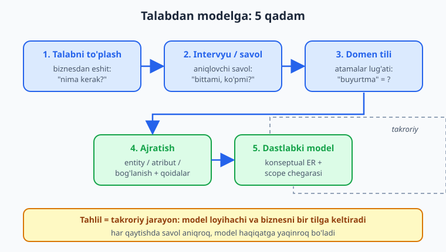
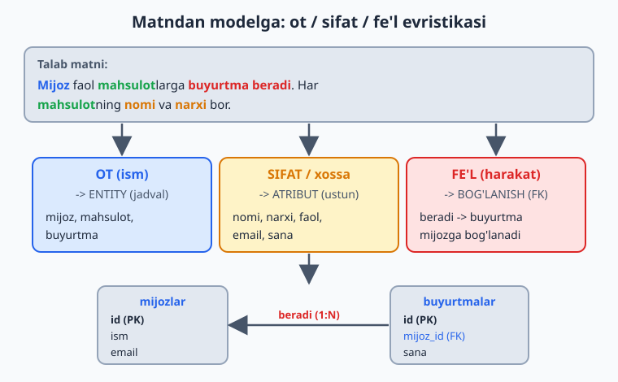
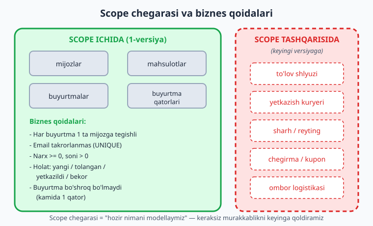

# 02 — Talab tahlili va domen modellashtirish

[⬅️ Oldingi: 01 — Ma'lumotlar bazasi dizayni nima va nega muhim](./01-dizayn-nima.md) · [🏠 README](./README.md) · [Keyingi: 03 — ER-diagramma: entity, atribut, bog'lanish ➡️](./03-er-diagramma.md)

> **Bu bobda:** biznes talabini (oddiy gaplar bilan aytilgan "bizga shunaqa tizim kerak") qanday qilib ma'lumot modeliga aylantirishni o'rganamiz. Matndan entity, atribut va bog'lanishni ajratib olish evristikasini (ot, sifat, fe'l), biznes qoidalarini aniqlashni, ko'lamni (scope) belgilashni, to'g'ri savol berish san'atini va domen tilini (ubiquitous language) ko'rib chiqamiz. Oxirida bitta talab paragrafini bosqichma-bosqich modelga aylantiramiz.

---

## Dizayn qog'ozdan emas, gapdan boshlanadi

01-bobda ko'rdik: yaxshi sxema uchta bosqichdan o'tadi — konseptual, logik, fizik. Ko'pchilik to'g'ridan-to'g'ri fizik bosqichga (ya'ni `CREATE TABLE`) sakraydi. Bu — eng katta xato. Chunki `CREATE TABLE` yozishdan oldin javob berilishi kerak bo'lgan savol bor: **aslida nimani saqlaymiz?**

Bu savolga javob bermaslik narxi qimmat. Tasavvur qiling, sizga shunaqa topshiriq keldi:

> "Bizga onlayn-do'kon kerak. Mijozlar mahsulot buyurtma qiladi, biz yetkazib beramiz."

Bu bir jumla. Lekin uning ortida o'nlab qaror turibdi: Mijoz ro'yxatdan o'tadimi yoki mehmon sifatida buyurtma beradimi? Bitta buyurtmada bir nechta mahsulot bo'ladimi? Mahsulot narxi o'zgarsa, eski buyurtmalarga ta'sir qiladimi? Bu savollarga **kod yozishdan oldin** javob topish — aynan **talab tahlili** (requirements analysis) deyiladi.

Talab tahlili — ma'lumotlar bazasi dizaynining birinchi va eng arzon bosqichi. "Eng arzon", chunki bu yerda xatoni tuzatish bir gapni o'zgartirishdan iborat. O'sha xato kodda chiqsa — jadvallarni qayta yozish, ma'lumotni ko'chirish, ilovani yangilash kerak bo'ladi. Najjorlar bejiz aytmaydi: **"ikki marta o'lcha, bir marta kes"** (01-bobdagi falsafa). Talab tahlili — aynan o'sha "o'lchash".



Bu bobda matnli talabni qanday qilib aniq modelga aylantirishni o'rganamiz. Hali `CREATE TABLE` deyarli yo'q — biz hozircha **fikrlash** bilan shug'ullanamiz. Sxemaning aniq DDL'i 03–09-boblarda yetiladi; bu bob esa o'sha sxemaning **mag'zini** hozirlaydi.

## Matndan model: ot, sifat, fe'l evristikasi

Talab matnini modelga aylantirishning eng mashhur va eng amaliy usuli — **grammatik tahlil**. Gapning bo'laklarini ajratasiz va har bo'lakni model elementiga moslab qo'yasiz. Qoidasi sodda:

| Gap bo'lagi | Model elementi | Misol |
|---|---|---|
| **Ot** (predmet, "narsa") | **Entity** (jadval) | mijoz, mahsulot, buyurtma |
| **Sifat / xossa** ("qanaqa", "nimasi") | **Atribut** (ustun) | nomi, narxi, sanasi, faol |
| **Fe'l** (harakat, "nima qiladi") | **Bog'lanish** (FK / oraliq jadval) | mijoz buyurtma *beradi* |

Bu evristikani esda saqlash oson: **otni ushlasang — jadval, sifatni ushlasang — ustun, fe'lni ushlasang — bog'lanish.**



Bir paragraf talabni olib, shu evristikani amalda qo'llaylik. Talab matni:

> "**Mijoz** ro'yxatdan o'tib, faol **mahsulot**larga **buyurtma beradi**. Har mijozning **ismi** va **takrorlanmas email**i bor. Har mahsulotning **nomi**, **narxi** va **ombordagi soni** bor. Bitta buyurtmada **bir nechta** mahsulot bo'lishi mumkin, har biri o'z **sonida**. Buyurtma **sana** bilan yoziladi va **holati** bor (yangi, to'langan, yetkazildi, bekor)."

Endi bo'lib chiqamiz.

**1-qadam — otlarni topamiz (entity nomzodlari):**

- mijoz → `mijozlar`
- mahsulot → `mahsulotlar`
- buyurtma → `buyurtmalar`

"Mijoz", "mahsulot", "buyurtma" — uchalasi ham mustaqil, hisoblanadigan, "ko'p nusxada bo'ladigan" narsalar. Bu — entity bo'lishining asosiy belgisi: **uni ro'yxat qilib sanay olasizmi?** ("Bizda 1200 mijoz bor", "5000 mahsulot bor"). Sanay olsangiz — bu entity.

**2-qadam — sifat/xossalarni topamiz (atribut nomzodlari):**

- mijozning: ismi, emaili
- mahsulotning: nomi, narxi, ombordagi soni
- buyurtmaning: sanasi, holati

Bu so'zlar "kimningdir/nimaningdir" xossasi — ular o'z-o'zicha turmaydi, doim biror entity'ga "yopishgan". "Narx" o'z-o'zicha yashamaydi — u doim *biror mahsulotning* narxi. Bu — atributning belgisi: **u doim biror entity'ga tegishli, mustaqil sanalmaydi.**

**3-qadam — fe'llarni topamiz (bog'lanish nomzodlari):**

- mijoz buyurtma **beradi** → `buyurtmalar.mijoz_id` (1:N)
- buyurtmada mahsulot **bo'ladi** → buyurtma va mahsulot orasida N:M → oraliq jadval `buyurtma_qatorlari`

"Beradi", "bo'ladi" — bular entity'larni bir-biriga ulaydigan harakatlar. Har harakat — bir bog'lanish. "Bir nechta mahsulot" iborasi muhim signal: bu N:M ekanini ("bitta buyurtmada ko'p mahsulot, bitta mahsulot ko'p buyurtmada") aytib turibdi — demak oraliq jadval kerak (04 va 09-boblarda chuqurroq).

**Natija — dastlabki konseptual model:**

```
mijozlar           (id, ism, email)
mahsulotlar        (id, nomi, narx, ombor_soni)
buyurtmalar        (id, mijoz_id, sana, holat)
buyurtma_qatorlari (buyurtma_id, mahsulot_id, soni, narx)
```

Diqqat qiling: bu yerda hali tur (`text`, `numeric`) yo'q, hali kalit strategiyasi tanlanmagan — bu konseptual model, ya'ni "nima bor va nima nimaga bog'langan" degan rasm, xolos. Fizik tafsilotlar keyin keladi.

> 💡 **Diqqat — har ot ham entity emas.** Ba'zi otlar aslida atribut bo'lib chiqadi. Masalan "mijozning **shahri**" — "shahar" ot, lekin agar bizga faqat shahar **nomi** kerak bo'lsa, u `mijozlar.shahar` ustuni (atribut). Lekin shaharning o'z atributlari bo'lsa (kodi, viloyati, aholisi) yoki uni boshqa joyda ham ishlatsak — u alohida `shaharlar` jadvali (entity) bo'lishi kerak. Qoida: **agar "narsa"ning o'z xossalari bo'lsa yoki u ko'p joyda takrorlansa — entity; aks holda atribut.**

## Biznes qoidalari: matnda yashiringan cheklovlar

Talab matnida faqat entity va atribut emas — **biznes qoidalari** (business rules) ham yashiringan. Bu — "ma'lumot qanaqa bo'lishi SHART" degan cheklovlar. Ularni payqash juda muhim, chunki keyinchalik ular `CHECK`, `UNIQUE`, `NOT NULL`, `FOREIGN KEY` constraint'lariga aylanadi (11-bobda batafsil).

Yuqoridagi talabni yana o'qib, qoidalarni terib chiqaylik:

| Matndagi ibora | Biznes qoidasi | Kelajakdagi constraint |
|---|---|---|
| "takrorlanmas email" | har email faqat bir mijozda | `UNIQUE (email)` |
| "har mijozning ismi va emaili **bor**" | ism va email bo'sh bo'lmaydi | `NOT NULL` |
| "buyurtma bitta mijozga tegishli" | har buyurtma mavjud mijozga | `FOREIGN KEY` |
| "holati (yangi, to'langan, ...)" | holat shu ro'yxatdan bo'ladi | `CHECK (holat IN (...))` |
| (mantiqiy) narx manfiy bo'lmaydi | narx >= 0 | `CHECK (narx >= 0)` |
| (mantiqiy) soni musbat bo'ladi | soni > 0 | `CHECK (soni > 0)` |

Oxirgi ikki qatorga e'tibor bering — ular matnda **to'g'ridan-to'g'ri aytilmagan**, lekin domenni biladigan har odam ularni "o'z-o'zidan ravshan" deb hisoblaydi. Aynan shu — talab tahlilining qiyin qismi: **aytilmagan, lekin nazarda tutilgan qoidalarni topish.** Buni faqat domenni tushunish va to'g'ri savol berish bilan ochasiz.

Bu qoidalarni biz endi PostgreSQL 18'da haqiqiy jadvalga aylantirib, ular ishlashini ko'ramiz. (Constraint sintaksisi SQL kitobining [18-bobida](../sql/18-alter-constraint-fk.md) o'rgatilgan — bu yerda biz uni *dizayn qarori* sifatida ishlatamiz.)

```sql
CREATE SCHEMA IF NOT EXISTS ch02;
SET search_path = ch02;

CREATE TABLE mijozlar (
    id    bigint GENERATED ALWAYS AS IDENTITY PRIMARY KEY,
    ism   text NOT NULL,
    email text NOT NULL UNIQUE              -- "takrorlanmas email" qoidasi
);

CREATE TABLE mahsulotlar (
    id         bigint GENERATED ALWAYS AS IDENTITY PRIMARY KEY,
    nomi       text NOT NULL,
    narx       numeric(12,2) NOT NULL CHECK (narx >= 0),       -- narx manfiy emas
    ombor_soni integer NOT NULL DEFAULT 0 CHECK (ombor_soni >= 0)
);

CREATE TABLE buyurtmalar (
    id       bigint GENERATED ALWAYS AS IDENTITY PRIMARY KEY,
    mijoz_id bigint NOT NULL REFERENCES mijozlar(id),          -- buyurtma -> mijoz
    sana     timestamptz NOT NULL DEFAULT now(),
    holat    text NOT NULL DEFAULT 'yangi'
             CHECK (holat IN ('yangi','tolangan','yetkazildi','bekor'))
);

CREATE TABLE buyurtma_qatorlari (
    buyurtma_id bigint NOT NULL REFERENCES buyurtmalar(id),
    mahsulot_id bigint NOT NULL REFERENCES mahsulotlar(id),
    soni        integer NOT NULL CHECK (soni > 0),             -- soni musbat
    narx        numeric(12,2) NOT NULL,                        -- snapshot (pastga qarang)
    PRIMARY KEY (buyurtma_id, mahsulot_id)                     -- N:M oraliq jadval
);
```

Endi qoidalar **haqiqatan** ishlayotganini tekshiraylik. Avval to'g'ri ma'lumot kiritamiz:

```sql
INSERT INTO mijozlar (ism, email) VALUES ('Davron', 'd@x.uz');
INSERT INTO mahsulotlar (nomi, narx, ombor_soni) VALUES ('Telefon', 2500000, 10);
INSERT INTO buyurtmalar (mijoz_id) VALUES (1);            -- holat va sana o'zi to'ladi
INSERT INTO buyurtma_qatorlari VALUES (1, 1, 2, 2500000);

SELECT id, mijoz_id, holat FROM buyurtmalar;
```

Natija (PostgreSQL 18.4'da haqiqatan ishga tushirilgan):

```
 id | mijoz_id | holat
----+----------+-------
  1 |        1 | yangi
(1 row)
```

`holat` ni biz kiritmadik, lekin `DEFAULT 'yangi'` ishladi — bu ham biznes qoidasi ("yangi buyurtmaning boshlang'ich holati — yangi"). Endi qoidani **buzishga** urinamiz — manfiy narxli mahsulot:

```sql
INSERT INTO mahsulotlar (nomi, narx) VALUES ('Bepul', -1);
```

```
ERROR:  new row for relation "mahsulotlar" violates check constraint "mahsulotlar_narx_check"
DETAIL:  Failing row contains (2, Bepul, -1.00, 0).
```

Baza qoidani **rad etdi**. Email takrorlashga urinsak ham xuddi shunday:

```sql
INSERT INTO mijozlar (ism, email) VALUES ('Soxta Davron', 'd@x.uz');
```

```
ERROR:  duplicate key value violates unique constraint "mijozlar_email_key"
DETAIL:  Key (email)=(d@x.uz) already exists.
```

Mana shu — talab tahlilining kuchi: matndagi bir necha so'zni ("takrorlanmas email") topib, uni bazada majburlangan qoidaga aylantirdik. Endi hech qaysi xato kod, hech qaysi shoshilgan dasturchi bu qoidani buza olmaydi — himoya **bazaning o'zida** (bu falsafa 11-bobda chuqurlashtiriladi).

> 📌 **Snapshot eslatmasi.** `buyurtma_qatorlari.narx` — `mahsulotlar.narx` borligiga qaramay alohida ustun. Bu takror emas: mahsulot narxi *ertaga o'zgarishi* mumkin, lekin mijoz *o'sha kungi* narxda olgan. Bu tarixiy fakt (snapshot). Talab tahlilida bunday vaqtga bog'liq qoidalarni topish — alohida mahorat (18-bobda temporal modellashtirish). Bu yerda muhimi: "narx" so'zi ikki xil faktni anglatishi mumkin — "hozir qancha turadi" va "o'shanda qancha to'langan".

## Ko'lam (scope): chegarani belgilash san'ati

Talab tahlilidagi eng katta xavf — **hammasini bir vaqtda modellashtirishga urinish**. Biznes "onlayn-do'kon" desa, miyada darrov to'lov tizimi, kuryer kuzatuvi, sharhlar, kuponlar, sodiqlik dasturi, ombor logistikasi... yuzlab narsa paydo bo'ladi. Agar hammasini birinchi versiyaga tiqsangiz — loyiha cho'kib ketadi.

**Ko'lam (scope)** — "hozir nimani modellaymiz va nimani keyinga qoldiramiz" degan ongli qaror. Bu — talab tahlilining strategik qismi.



Bizning misol uchun 1-versiya ko'lamini shunday belgilaymiz:

**Scope ichida (hozir modellashtiramiz):**

- mijozlar, mahsulotlar
- buyurtmalar, buyurtma_qatorlari
- asosiy biznes qoidalari (email unique, narx >= 0, holat ro'yxati)

**Scope tashqarisida (keyingi versiyaga):**

- to'lov shlyuzi integratsiyasi
- yetkazib berish / kuryer kuzatuvi
- sharh va reyting
- chegirma / kupon tizimi
- ombor logistikasi (qaytarish, inventarizatsiya)

Bu chegara — **abadiy** emas. Bu "hozir qayergacha modellaymiz" degan vaqtinchalik kelishuv. Muhimi: chegarani **ataylab** chizish va uni biznes bilan kelishish. "Sharhlar 1-versiyada yo'q" — bu yo'qlik **xato emas, qaror**. Hujjatlashtirilgan qaror.

Yaxshi scope qarorining belgilari:

1. **Birinchi versiya ishlaydigan eng kichik tizim bo'lsin** — "mijoz buyurtma bera oladimi?" degan asosiy ssenariyni qoplasin, qolganini emas.
2. **Kelajakni butunlay yopib qo'ymasin** — masalan, hozir to'lov yo'q bo'lsa ham, `buyurtmalar.holat` da `'tolangan'` qiymati borligi kelajakda to'lov qo'shishni osonlashtiradi.
3. **Chegara hujjatlashtirilsin** — "nima yo'q va NEGA yo'q" yozilsin, shunda keyin "buni nega o'ylamagansiz?" degan savol tug'ilmaydi.

> 💡 **Amaliy maslahat.** Yangi loyihada doim o'zingizdan so'rang: "Bu entity'siz tizim ishlaydimi?" Agar ha — uni 2-versiyaga qoldiring. Masalan, do'kon "sharh"siz ham mahsulot sotadi → sharh keyinga. Lekin "mahsulot"siz ishlamaydi → mahsulot albatta 1-versiyada.

## To'g'ri savol berish san'ati (intervyu)

Talab matni hech qachon to'liq bo'lmaydi. Biznes "mijozlar buyurtma beradi" deydi, lekin yuzlab tafsilotni aytmaydi — chunki ular uchun bu "o'z-o'zidan ravshan". Sizning vazifangiz — **to'g'ri savol berib**, o'sha aytilmagan tafsilotlarni ochish. Bu — talab tahlilidagi eng inson-markazli mahorat.

Yaxshi savollar deyarli har doim **kardinallik** (nechta?), **ixtiyoriylik** (shartmi?), **o'zgaruvchanlik** (o'zgaradimi?) va **chegara holatlar** (eng yomon holat) atrofida aylanadi. Bizning do'kon misolida:

**Kardinallik savollari ("bittami yoki ko'pmi?"):**

- "Bitta buyurtmada bir nechta xil mahsulot bo'ladimi?" → ha → N:M → oraliq jadval
- "Bitta mijozning bir nechta manzili bo'ladimi?" → ha bo'lsa, manzil alohida jadval
- "Bitta mahsulot bir nechta kategoriyaga tegishlimi?" → javob 1:N yoki N:M ni hal qiladi

**Ixtiyoriylik savollari ("shartmi yoki bo'sh bo'lishi mumkinmi?"):**

- "Mijoz email'siz ro'yxatdan o'ta oladimi?" → yo'q → `email NOT NULL`
- "Buyurtma mijozsiz (mehmon) berila oladimi?" → ha bo'lsa, `mijoz_id` NULL bo'la olishi yoki "mehmon" entity'si kerak

**O'zgaruvchanlik savollari ("o'zgaradimi, o'zgarsa tarix kerakmi?"):**

- "Mahsulot narxi o'zgaradimi?" → ha → buyurtmaga narx snapshot qilinadi
- "Mijoz emailini o'zgartira oladimi?" → ha → email PK bo'la olmaydi (06-bobda: barqaror kalit)

**Chegara holat savollari ("eng yomon/g'alati holat nima?"):**

- "Bo'sh buyurtma (mahsulotsiz) mumkinmi?" → yo'q → kamida 1 qator qoidasi
- "Mahsulot o'chirilsa, eski buyurtmalardagi shu mahsulot nima bo'ladi?" → tarixni saqlash → `ON DELETE RESTRICT` yoki soft delete (12-bob)

E'tibor bering: bu savollar **texnik emas, biznesga oid**. Siz biznes egasidan "FOREIGN KEY kerakmi?" deb so'ramaysiz — u tushunmaydi. Siz "mahsulot o'chsa eski cheklar saqlanib qolsinmi?" deb so'raysiz — buni har kim tushunadi. **Savolni domen tilida bering, javobni model tiliga o'zingiz tarjima qiling.**

> ⚠️ **Yopiq savoldan saqlaning.** "Mijozning bitta manzili bor, to'g'rimi?" — bu yetakchi (yopiq) savol, biznes "ha" deb qo'ya qoladi. To'g'risi: "Mijoz nechta manzilga buyurtma berishi mumkin?" — bu ochiq savol, haqiqatni ochadi. Yopiq savol — sizning taxminingizni tasdiqlatadi; ochiq savol — biznesning haqiqatini chiqaradi.

## Domen tili (ubiquitous language)

Talab tahlilidagi sezilmas, lekin uzoq muddatda eng qimmatli mahsulot — **yagona, kelishilgan atamalar lug'ati**. Buni *domain-driven design* (DDD) yondashuvida **ubiquitous language** (umumiy/hamma joyda bir xil til) deyiladi.

Muammo shunday: bitta narsani turli odam turlicha ataydi. Sotuvchi "klient" deydi, omborchi "xaridor" deydi, dasturchi "user" deb yozadi, ma'lumotlar bazasida "mijoz" turibdi. Bular **bitta narsami yoki to'rt xil narsami?** Agar aniqlashtirilmasa — bir kun kelib kimdir "klient" va "user"ni ikki xil jadval qilib qo'yadi va tizim chalkashadi.

Domen tili — bu chalkashlikni oldini oladi: jamoa (biznes + dasturchi + DBA) **bitta atamani tanlaydi** va uni **hamma joyda** — suhbatda, hujjatda, kodda, jadval nomida — bir xil ishlatadi.

Bizning do'kon uchun kichik domen lug'ati:

| Atama | Ta'rif (domen) | Kodda/bazada |
|---|---|---|
| **Mijoz** | Ro'yxatdan o'tib buyurtma beradigan shaxs | `mijozlar` |
| **Mahsulot** | Sotuvga qo'yilgan tovar | `mahsulotlar` |
| **Buyurtma** | Mijozning bir martalik xaridi (bir nechta mahsulotni o'z ichiga oladi) | `buyurtmalar` |
| **Buyurtma qatori** | Buyurtmadagi bitta mahsulot + uning soni | `buyurtma_qatorlari` |
| **Holat** | Buyurtmaning hayot bosqichi (yangi → to'langan → yetkazildi) | `buyurtmalar.holat` |

Bu lug'at — shunchaki "chiroyli hujjat" emas. U konkret foyda beradi:

- **Jadval nomlari** — `buyurtmalar`, `buyurtma_qatorlari` — to'g'ridan-to'g'ri domen atamalaridan kelib chiqadi. (Nomlash konvensiyalari 09-bobda.)
- **Suhbatda chalkashlik yo'qoladi** — hamma "buyurtma" deganda bir narsani tushunadi.
- **Atama ta'rifi qoidani ham ochadi** — "buyurtma = bir nechta mahsulotni o'z ichiga oladi" deyilsa, bu allaqachon N:M bog'lanishni aytib turibdi.

> 💡 **Amaliy qadam.** Loyiha boshida 10–20 ta asosiy atamadan iborat kichik lug'at (glossary) tuzing va uni README'ga yoki wiki'ga yozib qo'ying. Bu — talab tahlilining eng arzon va eng kam qilinadigan, lekin eng foydali ishi. Bir varaq lug'at oylab davom etadigan "bu nima edi o'zi?" bahslarini oldini oladi.

## To'liq misol: kutubxona talabini modelga aylantirish

Do'kon misolini ko'rdik. Endi butun jarayonni boshqa domenda — **kutubxona** — to'liq takrorlaymiz, shunda evristika "yodda" qoladi. Talab matni:

> "Kutubxona a'zolarga kitob beradi. Har kitobning sarlavhasi, muallifi va nashr yili bor — bitta sarlavhaning bir nechta nusxasi (jismoniy ekzemplyar) bo'lishi mumkin. A'zo bir vaqtda eng ko'pi 5 ta nusxani olishi mumkin. Har ijara olingan sana va qaytarilishi kerak bo'lgan muddat bilan yoziladi. Kitob qaytarilmasa, jarima hisoblanadi."

**Otlar (entity):** kutubxona, a'zo, kitob, nusxa (ekzemplyar), ijara, jarima.

"Kutubxona"ni darrov entity qilmang — agar bitta kutubxona haqida gap ketsa, u entity emas, balki butun tizimning konteksti. Ko'p filialli bo'lsa — `kutubxonalar` entity bo'ladi. Bu — savol berish kerak bo'lgan joy! Ayni misolda bitta kutubxona deb qoldiramiz (scope qaror).

"Kitob" va "nusxa" — alohida ikki entity. Bu nozik nuqta: "Harry Potter" — bitta **kitob** (sarlavha), lekin javonda uning **3 ta nusxasi** turishi mumkin. A'zo aniq bir **nusxani** oladi, "kitob"ni emas. Bu farqni talabdagi "bitta sarlavhaning bir nechta nusxasi" iborasidan topdik.

**Sifatlar (atribut):**

- kitob: sarlavha, muallif, nashr_yili
- nusxa: inventar_raqami, holati (javonda / ijarada / yo'qolgan)
- a'zo: ism, a'zolik_raqami
- ijara: olingan_sana, qaytarish_muddati, qaytarilgan_sana

**Fe'llar (bog'lanish):**

- a'zo nusxani **oladi** → `ijaralar` (a'zo va nusxa orasida, vaqt bilan)
- kitobning nusxalari **bor** → `nusxalar.kitob_id` (1:N)
- ijara jarimani **keltirib chiqaradi** → `jarimalar.ijara_id` (1:1 yoki 1:N)

**Biznes qoidalari (matndan + nazarda tutilgan):**

- "eng ko'pi 5 ta nusxa" → a'zoda bir vaqtda 5 tadan ko'p **faol** ijara bo'lmaydi (bu murakkab qoida — bitta `CHECK` bilan ifodalab bo'lmaydi, trigger yoki ilova mantig'i kerak; 11-bobda ko'ramiz)
- "qaytarish muddati" → odatda olingan_sana + 14 kun (DEFAULT bilan)
- nusxa bir vaqtda faqat bitta faol ijarada bo'lishi mumkin (muhim qoida!)
- a'zolik_raqami takrorlanmas → UNIQUE

**Dastlabki konseptual model:**

```
a'zolar    (id, ism, azolik_raqami)
kitoblar   (id, sarlavha, muallif, nashr_yili)
nusxalar   (id, kitob_id, inventar_raqami, holati)
ijaralar   (id, azo_id, nusxa_id, olingan_sana, qaytarish_muddati, qaytarilgan_sana)
jarimalar  (id, ijara_id, summa, tolangan)
```

E'tibor bering, "5 ta limit" va "bir vaqtda bitta faol ijara" kabi qoidalar oddiy ustun/constraint bilan ifodalanmaydi — ular **murakkab biznes qoidalari**. Talab tahlilida ularni **topish va belgilab qo'yish** sizning ishingiz; ularni *qanday* majburlash (CHECK, trigger, EXCLUDE constraint, ilova mantig'i) — keyingi boblarning ishi. Asosiysi: ularni **payqab qolish** — chunki payqalmagan qoida — kelajakdagi bug.

Ko'rib turganingizdek, jarayon do'kon misolidagi bilan **bir xil**: otlarni terib entity qil, sifatlarni terib atribut qil, fe'llarni terib bog'lanish qil, qoidalarni ajrat, scope chiz. Domen o'zgardi, usul o'zgarmadi. Aynan shu — talab tahlilini **mahorat** qiladigan narsa: u har domenga yaraydi.

## Boshqa entity emas: hodisa va atributni ajratish

Yangi loyihachilar ikki tipik xatoga yo'l qo'yadi. Ularni alohida ko'rib chiqaylik — chunki ularni payqash darajangizni "0 dan" "ekspert"ga ko'taradi.

**Xato 1 — hodisani (event) o'tkazib yuborish.** Talabda ko'pincha entity'lar aniq aytiladi (mijoz, mahsulot), lekin ular orasidagi **hodisalar** yashiringan bo'ladi. "Mijoz buyurtma beradi" — "buyurtma" bu yerda hodisa-entity. Ko'pchilik faqat "narsa"larni (mijoz, mahsulot) jadval qiladi-yu, "buyurtma berish" hodisasini unutadi. Qoida: **har bir takrorlanadigan harakat (sotish, ijara, to'lov, kirish) — ehtimol entity.** "U qachon bo'ldi? Kim qildi?" deb so'raganda javob kerak bo'lsa — bu hodisani saqlash kerak, demak entity.

**Xato 2 — atributni entity qilib yuborish (yoki aksincha).** "Mijozning shahri" — entity'mi yoki atribut'mi? Javob domenga bog'liq:

| Holat | Qaror |
|---|---|
| Faqat shahar nomi kerak, bir marta ko'rsatish uchun | atribut: `mijozlar.shahar text` |
| Shaharni filterlash/guruhlash kerak, nomi standart bo'lsin | entity: `shaharlar` jadvali + FK |
| Shaharning o'z xossalari bor (kod, viloyat, koordinata) | aniq entity: `shaharlar` |

Qoidaning mag'zi: **"narsa"ning o'z xossalari bormi yoki u ko'p joyda takrorlanadimi?** Ha bo'lsa — entity; yo'q bo'lsa — atribut. Shoshilmang: ko'pincha to'g'ri javob savol berishdan keyin chiqadi ("Shaharlar ro'yxati qat'iymi yoki mijoz ixtiyoriy yozadimi?").

Bu ajratishlar bir qarashda mayda ko'rinadi, lekin ularning narxi katta: noto'g'ri "atribut qilingan" narsani keyinroq "entity"ga ko'chirish — bu butun jadvalni qayta loyihalash, ma'lumotni migratsiya qilish (23-bob) demakdir.

## Xulosa: talab tahlili — eng arzon sug'urta

Talab tahlili — kod yozilmaydigan, lekin loyiha taqdirini hal qiladigan bosqich. Uning mag'zi:

1. **Matnni gramatik bo'l**: ot → entity, sifat → atribut, fe'l → bog'lanish.
2. **Yashiringan biznes qoidalarini top** — aytilganini ham, nazarda tutilganini ham — ular keyin constraint bo'ladi.
3. **Scope chiz** — eng kichik ishlaydigan tizimni belgila, qolganini ongli ravishda keyinga qoldir va hujjatlashtir.
4. **To'g'ri savol ber** — kardinallik, ixtiyoriylik, o'zgaruvchanlik, chegara holat; ochiq savol, domen tilida.
5. **Domen tilini o'rnat** — yagona atamalar lug'ati chalkashlikni butun loyiha davomida oldini oladi.

Bu bobda biz **konseptual** model tuzdik — "nima bor va nima nimaga bog'langan". Keyingi bobda buni **ER-diagramma** orqali aniq, vizual, standart tilda chizishni o'rganamiz — entity, atribut va bog'lanishni rasm qilib ko'rsatadigan, dunyo bo'ylab dizaynerlar tushunadigan notatsiya.

---

## Mashqlar

Quyidagi masalalar — **dizayn** masalalari. Maqsad SQL yozish emas (garchi ba'zilarida DDL yozasiz), balki talabdan to'g'ri model, qoida va scope ni ajratib olishdir. Avval o'zingiz urinib ko'ring, keyin yechimni oching.

### Oson

1. **Otlarni ajrating.** Quyidagi talabdan entity nomzodlarini (otlarni) ajrating: *"O'qituvchi darslarni o'tkazadi. Har darsda bir nechta talaba qatnashadi. Talabaning ismi va guruhi bor."* Qaysi otlar entity, qaysisi atribut bo'lishi mumkin?

2. **Sifatlarni ajrating.** Shu talabdan har entity uchun atributlarni tering: *"Mahsulotning nomi, narxi, og'irligi va ishlab chiqaruvchisi bor. Ishlab chiqaruvchining nomi va mamlakati bor."* — "ishlab chiqaruvchi" entity'mi yoki atributmi? Sababini ayting.

3. **Fe'llarni toping.** *"Foydalanuvchi post yozadi, postga izoh qoldiradi va boshqa foydalanuvchiga obuna bo'ladi."* — fe'llarni toping va har biri qanaqa bog'lanishga (1:N yoki N:M) ishora qilishini ayting.

4. **Biznes qoidasini toping.** Quyidagi gapda nechta biznes qoidasi yashiringan? *"Har foydalanuvchining takrorlanmas username'i bo'ladi, parol majburiy, yosh 13 dan kichik bo'lmasligi kerak."* Har birini constraint turiga moslang.

### O'rta

5. **Domen lug'ati tuzing.** Kichik taksi xizmati uchun talab: *"Yo'lovchi safar buyurtma qiladi, haydovchi uni qabul qiladi va manzilga olib boradi."* — kamida 5 ta domen atamasidan iborat lug'at tuzing (atama → ta'rif → bazadagi nom).

6. **Scope chizing.** "Instagram'ga o'xshash ilova" topshirig'i berildi. 1-versiya uchun scope ni belgilang: qaysi 4–5 entity ICHKARIDA, qaysi 4–5 narsa TASHQARIDA bo'lishi kerak? Har bir tashqaridagi uchun "nega keyinga" deb bir jumla yozing.

7. **Atribut yoki entity?** Quyidagilarning har biri uchun "atribut" yoki "entity" deb qaror qiling va sababini yozing: (a) buyurtmaning yetkazish manzili, (b) mahsulotning rangi, (c) mijozning to'lov kartalari, (d) kitobning tili.

8. **Aniqlovchi savollar yozing.** Talab: *"Restoran buyurtmalarni qabul qiladi va yetkazib beradi."* — biznesga beradigan kamida 6 ta aniqlovchi savol yozing (kardinallik, ixtiyoriylik, o'zgaruvchanlik, chegara holat bo'yicha).

9. **Yashiringan entity'ni toping.** *"Mijoz mahsulotni qaytarib bermoqchi bo'lsa, qaytarishni rasmiylashtiradi va pul qaytariladi."* — bu gapda do'kon modeliga qaysi YANGI entity qo'shilishi kerak? Uning atributlari va bog'lanishlari qanaqa?

### Qiyin

10. **To'liq model tuzing.** Quyidagi talabni to'liq modelga aylantiring (entity'lar, atributlar, bog'lanishlar, biznes qoidalari, scope): *"Onlayn kurs platformasi. O'qituvchi kurs yaratadi, kursda bir nechta dars bor. Talaba kursga yoziladi va darslarni ko'radi. Har dars ko'rilganda progress saqlanadi. Talaba kursni tugatsa, sertifikat oladi."* Konseptual modelni `jadval(ustunlar)` ko'rinishida yozing.

11. **Murakkab qoidani aniqlang.** 10-masaladagi platformaga shu qoida qo'shildi: *"Talaba kursni faqat oldingi (prerequisite) kursni tugatgan bo'lsagina ola oladi."* — bu qoidani modellashtirish uchun qanaqa bog'lanish kerak? Bu oddiy `CHECK` bilan majburlanadimi yoki boshqa narsa kerakmi? Tushuntiring.

12. **Anti-model'ni toping va tuzating.** Bir loyihachi do'kon uchun shunaqa jadval taklif qildi: `buyurtmalar(id, mijoz_ismi, mijoz_emaili, mahsulot1_nomi, mahsulot1_narxi, mahsulot2_nomi, mahsulot2_narxi, mahsulot3_nomi)`. Bu modelda qanaqa muammolar bor (kamida 3 ta)? Talab tahlili nuqtai nazaridan to'g'ri modelni taklif qiling.

13. **Domen farqini ochib bering.** Bir loyihada "user" va "client" atamalari aralash ishlatilmoqda: ba'zi joyda bir narsa, ba'zi joyda ikki xil narsa. Bu qanaqa muammoga olib kelishi mumkin? Domen tili (ubiquitous language) yondashuvi bilan buni qanday hal qilasiz? Konkret qadamlar yozing.

14. **Scope evolyutsiyasini rejalashtiring.** 10-masaladagi kurs platformasi muvaffaqiyatli bo'ldi. Endi biznes qo'shimcha xohlaydi: to'lov, sharh-reyting, sertifikat verifikatsiyasi, jonli vebinar. Bularning har birini qaysi versiyaga (v2, v3) qo'yardingiz va NEGA? Qaysi biri mavjud modelga eng katta o'zgartirish talab qiladi?

## Yechimlar

<details markdown="1">
<summary>Yechim — 1</summary>

**Otlar:** o'qituvchi, dars, talaba, guruh.

- **Entity:** o'qituvchi, dars, talaba (mustaqil, sanaladigan narsalar).
- **Atribut yoki entity:** "guruh" — agar bizga faqat guruh **nomi** kerak bo'lsa, u `talabalar.guruh` atributi. Agar guruhning o'z xossalari (kursi, kurator, xonasi) bo'lsa yoki guruhni ko'p joyda ishlatsak — alohida `guruhlar` entity. Talabda guruh haqida boshqa ma'lumot yo'q, shuning uchun hozircha atribut deb qoldirib, biznesdan so'rash kerak: "Guruh haqida boshqa nima saqlaymiz?"
- "Ism" — aniq atribut (talabaning xossasi).

</details>

<details markdown="1">
<summary>Yechim — 2</summary>

**Mahsulot entity, atributlari:** nomi, narxi, og'irligi.

**"Ishlab chiqaruvchi" — entity.** Sababi: uning **o'z xossalari bor** (nomi, mamlakati). Atributning o'z atributi bo'lmaydi — agar "narsa"ning ichida yana xossalar bo'lsa, u alohida entity. Demak:

```
mahsulotlar       (id, nomi, narx, ogirligi, ishlab_chiqaruvchi_id)
ishlab_chiqaruvchilar (id, nomi, mamlakat)
```

Bog'lanish: `mahsulotlar.ishlab_chiqaruvchi_id` → `ishlab_chiqaruvchilar.id` (1:N — bitta ishlab chiqaruvchi ko'p mahsulot ishlab chiqaradi). Agar "ishlab chiqaruvchi"ni shunchaki `mahsulotlar.ishlab_chiqaruvchi text` qilib qo'ysak, "Samsung"ni 500 mahsulotda takrorlaymiz va nomini o'zgartirish anomaliyaga olib keladi.

</details>

<details markdown="1">
<summary>Yechim — 3</summary>

**Fe'llar va bog'lanishlar:**

- "post **yozadi**" → foydalanuvchi va post: **1:N** (`postlar.foydalanuvchi_id`). Bitta foydalanuvchi ko'p post yozadi, har post bitta muallifga tegishli.
- "postga izoh **qoldiradi**" → foydalanuvchi va izoh: **1:N** (`izohlar.foydalanuvchi_id`); izoh va post: **1:N** (`izohlar.post_id`). Izoh — alohida entity.
- "boshqa foydalanuvchiga **obuna bo'ladi**" → foydalanuvchi va foydalanuvchi: **N:M** (o'z-o'ziga bog'lanish!). Oraliq jadval `obunalar(kim_id, kimga_id)` kerak — ikkala FK ham `foydalanuvchilar` jadvaliga ishora qiladi (04-bobda o'z-o'ziga bog'lanish).

</details>

<details markdown="1">
<summary>Yechim — 4</summary>

**Uchta biznes qoidasi:**

1. "takrorlanmas username" → `UNIQUE (username)`
2. "parol majburiy" → `parol NOT NULL`
3. "yosh 13 dan kichik emas" → `CHECK (yosh >= 13)`

Qo'shimcha (nazarda tutilgan): username ham odatda majburiy → `username NOT NULL`. Talab tahlilida "takrorlanmas" so'zi ko'pincha "majburiy"ni ham nazarda tutadi — buni biznesdan aniqlash kerak. Demak amalda: `username text NOT NULL UNIQUE`.

</details>

<details markdown="1">
<summary>Yechim — 5</summary>

**Taksi domen lug'ati:**

| Atama | Ta'rif | Bazadagi nom |
|---|---|---|
| Yo'lovchi | Safar buyurtma qiladigan shaxs | `yolovchilar` |
| Haydovchi | Safarni bajaradigan, mashinasi bor shaxs | `haydovchilar` |
| Safar | Bir martalik yo'l (A nuqtadan B nuqtaga) | `safarlar` |
| Buyurtma / chaqiruv | Yo'lovchining safar so'rovi | `safarlar.holat = 'yangi'` yoki alohida bosqich |
| Manzil | Boshlanish va tugash nuqtasi | `safarlar.boshlanish`, `safarlar.tugash` |

Diqqat: "buyurtma qilish" va "safar" — bitta narsa bosqichlari (buyurtma → qabul qilindi → yo'lda → tugadi) bo'lishi mumkin, ularni alohida entity qilish shartmasligini biznesdan aniqlash kerak. Bu — domen tilining foydasi: "buyurtma" va "safar" bir narsami yoki ikki narsami — buni boshida kelishib olamiz.

</details>

<details markdown="1">
<summary>Yechim — 6</summary>

**1-versiya scope (namuna qaror):**

**Ichkarida (v1):**

- `foydalanuvchilar` — asosiy, busiz hech narsa ishlamaydi
- `postlar` — ilovaning yuragi (rasm + matn)
- `izohlar` — asosiy o'zaro ta'sir
- `layklar` — asosiy o'zaro ta'sir
- `obunalar` — kim kimni kuzatadi (lenta uchun zarur)

**Tashqarida (keyinga):**

- Stories (24 soatlik) — *asosiy lenta busiz ishlaydi, vaqtinchalik kontent murakkab*
- Direct (shaxsiy xabar) — *bu deyarli alohida tizim (chat), o'z modeli kerak*
- Hashtag/qidiruv — *kontent ko'paygach kerak bo'ladi, boshida emas*
- Reels/video — *rasm bilan boshlash arzonroq, video saqlash murakkab*
- Reklama — *biznes modeli yetilgach*

Qoida: v1 "post yoz, ko'r, layk bos, izoh qoldir, kuzatib bor" ssenariysini qoplaydi — eng kichik ishlaydigan ijtimoiy tarmoq.

</details>

<details markdown="1">
<summary>Yechim — 7</summary>

- **(a) Yetkazish manzili — entity** (ko'pincha). Mijozning bir nechta manzili bo'lishi mumkin, manzilning o'z xossalari bor (ko'cha, shahar, indeks). Agar buyurtmaga manzil snapshot qilinsa, `buyurtmalar`ga matn sifatida nusxalanishi ham mumkin (tarixiy). Domenga qarab: ko'p manzil kerak bo'lsa → `manzillar` entity.
- **(b) Mahsulot rangi — vaziyatga bog'liq.** Faqat bitta rang bo'lsa → atribut (`mahsulotlar.rang`). Bir mahsulotning ko'p rang varianti bo'lsa (har biri o'z ombor soni bilan) → alohida `variantlar` entity.
- **(c) To'lov kartalari — entity.** Mijozning bir nechta kartasi bo'ladi (1:N), kartaning o'z xossalari bor (raqam, amal qilish muddati). Aniq entity.
- **(d) Kitob tili — atribut** (odatda). `kitoblar.til`. Lekin tillar ro'yxatini standartlashtirish kerak bo'lsa (filterlash uchun) → `tillar` lookup jadvali (12-bob).

Umumiy qoida yana: **o'z xossasi bormi / ko'p nusxa bo'ladimi → entity; aks holda atribut.**

</details>

<details markdown="1">
<summary>Yechim — 8</summary>

**Aniqlovchi savollar (namuna):**

*Kardinallik:*
1. Bitta buyurtmada bir nechta xil taom bo'ladimi? (ha → buyurtma_qatorlari)
2. Bitta restoran nechta filialga ega? (ko'p → filiallar entity)

*Ixtiyoriylik:*
3. Mijoz ro'yxatdan o'tmasdan (telefon raqami bilan) buyurtma bera oladimi?
4. Yetkazish manzili har doim majburiymi yoki olib ketish ham bormi?

*O'zgaruvchanlik:*
5. Taom narxi o'zgaradimi? (ha → buyurtmaga narx snapshot)
6. Taom menyudan olib tashlansa, eski buyurtmalardagi shu taom nima bo'ladi?

*Chegara holat:*
7. Bo'sh buyurtma (taomsiz) mumkinmi?
8. Buyurtma bekor qilingach, uni tahrirlash mumkinmi?

Savollar texnik atama emas, domen tilida berilgan — biznes egasi tushunadi.

</details>

<details markdown="1">
<summary>Yechim — 9</summary>

**Yangi entity: `qaytarishlar` (returns).**

"Qaytarish"ni rasmiylashtirish — bu takrorlanadigan hodisa, "qachon, qaysi buyurtma, qancha pul" degan savolga javob kerak → entity.

```
qaytarishlar (id, buyurtma_id, sana, sabab, qaytarilgan_summa, holat)
```

Bog'lanishlar:

- `qaytarishlar.buyurtma_id` → `buyurtmalar.id` (1:N — bitta buyurtma bo'yicha bir nechta qaytarish bo'lishi mumkin)
- Agar qaysi mahsulot qaytarilganini kuzatsak → `qaytarish_qatorlari(qaytarish_id, mahsulot_id, soni)` (yana N:M naqsh!)

Biznes qoidalari: qaytarilgan summa buyurtma summasidan oshmasin; faqat 'yetkazildi' holatdagi buyurtma qaytarilsin. Bu — hodisa-entity'ni payqashning yaxshi misoli: "qaytarish" — narsa emas, harakat, lekin uni saqlash kerak bo'lgani uchun entity bo'ladi.

</details>

<details markdown="1">
<summary>Yechim — 10</summary>

**To'liq konseptual model:**

**Otlar (entity):** o'qituvchi, kurs, dars, talaba, yozilish (enrollment), progress, sertifikat.

**Model:**

```
oqituvchilar (id, ism, email)
kurslar      (id, nomi, tavsif, oqituvchi_id)
darslar      (id, kurs_id, sarlavha, tartib_raqami, video_url)
talabalar    (id, ism, email)
yozilishlar  (id, talaba_id, kurs_id, yozilgan_sana, tugatgan_sana)
progress     (id, yozilish_id, dars_id, korilgan_sana)
sertifikatlar (id, yozilish_id, berilgan_sana, raqam)
```

**Bog'lanishlar:**

- `kurslar.oqituvchi_id` → `oqituvchilar` (1:N)
- `darslar.kurs_id` → `kurslar` (1:N)
- `yozilishlar` — talaba va kurs orasida **N:M** oraliq jadval (talaba ko'p kursga yoziladi, kurs ko'p talabaga)
- `progress` — yozilish va dars orasida har ko'rishni qayd qiladi
- `sertifikatlar.yozilish_id` → `yozilishlar` (1:1 — har tugagan yozilishga bitta sertifikat)

**Biznes qoidalari:**

- Talaba bitta kursga ikki marta yozilmaydi → `UNIQUE (talaba_id, kurs_id)` yozilishlarda
- Sertifikat faqat `tugatgan_sana` to'lgan yozilishga beriladi
- Dars tartib_raqami kurs ichida takrorlanmaydi → `UNIQUE (kurs_id, tartib_raqami)`

**Scope tashqarisida:** to'lov, sharh, vebinar (14-masalaga qarang).

</details>

<details markdown="1">
<summary>Yechim — 11</summary>

**Prerequisite (oldingi kurs) qoidasi — kurs va kurs orasida o'z-o'ziga N:M bog'lanish.**

```
kurs_shartlari (kurs_id, shart_kurs_id)
-- kurs_id ni olish uchun shart_kurs_id tugagan bo'lishi kerak
```

Ikkala ustun ham `kurslar.id` ga ishora qiladi (o'z-o'ziga bog'lanish, 04-bob). Bitta kursning bir nechta sharti bo'lishi mumkin (N:M).

**Bu oddiy `CHECK` bilan majburlanmaydi.** Sababi: qoida bir nechta jadvalni tekshirishni talab qiladi — "talaba kursga yozilayotganda, uning `yozilishlar`ida shu kursning hamma `kurs_shartlari`dagi kurslar `tugatgan_sana` bilan bormi?". `CHECK` faqat bitta qatorning o'z ustunlarini tekshira oladi, boshqa jadvalga qaray olmaydi. Bunday qoida uchun:

- **Trigger** (yozilish qo'shilganda tekshiradi), yoki
- **Ilova mantig'i** (yozish oldidan tekshiradi), yoki
- Saqlanuvchi funksiya orqali yozish.

Bu — talab tahlilidagi muhim saboq: **ba'zi qoidalar oddiy constraint'dan murakkabroq.** Ularni boshida payqash kerak, aks holda ular "unutilgan qoida" bo'lib, ilovada bug sifatida chiqadi.

</details>

<details markdown="1">
<summary>Yechim — 12</summary>

**Muammolar:**

1. **Takrorlanadigan guruh ustunlar** (`mahsulot1_*`, `mahsulot2_*`, `mahsulot3_*`) — bu 1NF buzilishi va qattiq chegara: 4-mahsulotli buyurtma mumkin emas! (Bu "jaywalking"ning bir ko'rinishi, anti-naqsh — 13-bob.)
2. **Mijoz ma'lumoti buyurtmaga nusxalangan** (`mijoz_ismi`, `mijoz_emaili`) — har buyurtmada takrorlanadi, mijoz emaili o'zgarsa qaysi to'g'ri ekani noma'lum (yangilash anomaliyasi).
3. **Bo'sh kataklar** — agar buyurtmada 1 ta mahsulot bo'lsa, `mahsulot2_*` va `mahsulot3_*` bo'sh (NULL) qoladi — joy isrofi va NULL bilan ishlash muammosi.
4. **So'rov qiyinlashadi** — "Telefon nechta sotilgan?" so'rovi uchun 3 ta ustunni alohida tekshirish kerak.

**To'g'ri model** (talab tahlili evristikasi bilan):

```
mijozlar           (id, ism, email)
mahsulotlar        (id, nomi, narx)
buyurtmalar        (id, mijoz_id, sana)
buyurtma_qatorlari (buyurtma_id, mahsulot_id, soni, narx)
```

Endi buyurtmada xohlagancha mahsulot bo'lishi mumkin (har biri `buyurtma_qatorlari`da alohida qator), mijoz ma'lumoti bir joyda (`mijozlar`), so'rovlar oson. Bu — aynan shu bobdagi do'kon modeli.

</details>

<details markdown="1">
<summary>Yechim — 13</summary>

**Muammo:** "user" va "client" aralash ishlatilsa, jamoa ularning bitta narsami yoki ikki xil narsami ekanini bilmaydi. Oqibatlar:

- Ikki dasturchi ikki xil jadval (`users` va `clients`) yaratib, bir xil odamni ikki joyda saqlashi mumkin → ma'lumot bo'linadi, sinxronlik buziladi.
- So'rovlarda qaysi jadvaldan olishni hech kim aniq bilmaydi.
- Biznes va dasturchi "client" deganda turli narsa tushunadi → noto'g'ri talqin → noto'g'ri model.

**Domen tili bilan hal qilish (qadamlar):**

1. **Jamoa bilan o'tirib aniqlang:** "user" va "client" bir narsami? Agar bir narsa bo'lsa — **bitta atama tanlang** (masalan "mijoz") va boshqasini butunlay tark eting.
2. Agar ikki xil narsa bo'lsa (masalan "user" = tizimga kiradigan har kim, "client" = pul to'laydigan mijoz) — **ikkalasini ham aniq ta'riflang** va farqini lug'atga yozing.
3. **Lug'atni hujjatlashtiring** (README/wiki): har atama → ta'rif → bazadagi nom.
4. **Hamma joyda bir xil ishlating** — kod, jadval nomi, suhbat, hujjat. Eski noto'g'ri nomlarni asta-sekin (migratsiya bilan) to'g'rilang.
5. **Yangi a'zolarni lug'at bilan tanishtiring** — shunda chalkashlik qaytib kelmaydi.

Mag'zi: atama — shunchaki so'z emas, **kelishuv**. Bir marta kelishib, hamma joyda bir xil ishlatilsa — butun loyiha bo'yicha chalkashlik yo'qoladi.

</details>

<details markdown="1">
<summary>Yechim — 14</summary>

**Scope evolyutsiyasi (namuna reja):**

| Xususiyat | Versiya | Sabab |
|---|---|---|
| **Sharh-reyting** | v2 | Mavjud modelga eng oson qo'shiladi — yangi `sharhlar(talaba_id, kurs_id, baho, matn)` jadvali, eski jadvallarga deyarli tegmaydi |
| **To'lov** | v2 | Biznes uchun muhim (daromad), lekin `tolovlar` jadvali qo'shish va `yozilishlar`ga `tolangan` ustuni — o'rtacha o'zgarish |
| **Sertifikat verifikatsiyasi** | v3 | Sertifikat allaqachon v1'da bor; verifikatsiya — qo'shimcha `verifikatsiya_kodi` ustuni + ommaviy tekshirish sahifasi — kichik o'zgarish, lekin kam shoshilinch |
| **Jonli vebinar** | v3 | **Eng katta o'zgarish** — bu real-time tizim (video oqim, qatnashuv, jadval), deyarli alohida quyi-tizim; o'z modeli, ehtimol boshqa texnologiya kerak |

**Eng katta o'zgarish — vebinar**, chunki u faqat yangi jadval emas, balki butunlay yangi domen (real-time, jadvallashtirish, video infratuzilma) olib keladi. Shuning uchun u eng oxiriga (v3) va alohida loyiha sifatida rejalashtiriladi.

Saboq: scope evolyutsiyasini rejalashtirar ekansiz, **"mavjud modelga qancha tegadi?"** degan o'lchovni ishlating — eng kam tegadiganini avval, eng ko'p o'zgartiradiganini keyinga.

</details>

---

[⬅️ Oldingi: 01 — Ma'lumotlar bazasi dizayni nima va nega muhim](./01-dizayn-nima.md) · [🏠 README](./README.md) · [Keyingi: 03 — ER-diagramma: entity, atribut, bog'lanish ➡️](./03-er-diagramma.md)
