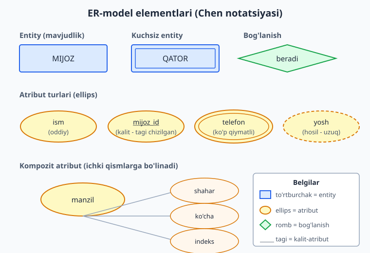
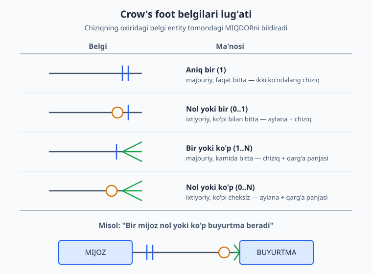
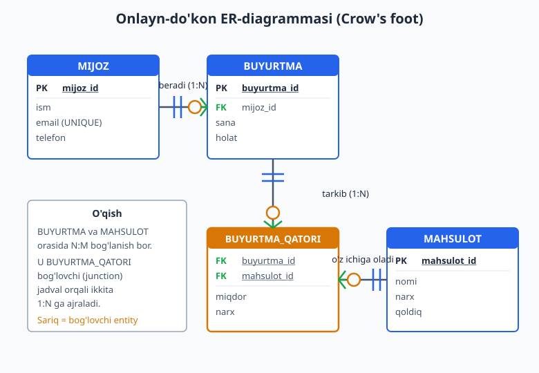

# 03 — ER-diagramma: entity, atribut, bog'lanish

[⬅️ Oldingi: 02 — Talab tahlili va domen modellashtirish](./02-talab-tahlili.md) · [🏠 README](./README.md) · [Keyingi: 04 — Bog'lanishlar va kardinallik (1:1, 1:N, N:M) ➡️](./04-boglanish-kardinallik.md)

> **Bu bobda:** 02-bobda biz biznes talabidan entity, atribut va bog'lanishlarni ajratib oldik. Endi ularni rasmga aylantiramiz — ER-diagramma (Entity-Relationship). Entity va atribut turlarini (oddiy, kompozit, ko'p qiymatli, hosil, kalit), kuchli va kuchsiz entity'ni o'rganamiz, ikkita asosiy notatsiyani (Chen va Crow's foot) solishtiramiz va sanoat standarti bo'lgan Crow's foot belgilarini chuqur tahlil qilamiz. Yakunda to'liq onlayn-do'kon ER-diagrammasini chizamiz.

---

## ER-diagramma nima va nega kerak

Tasavvur qiling, do'stingizga uy qurish rejasini tushuntirmoqchisiz. "Uch xona bo'ladi, oshxona zalga ulanadi, hammom yotoqxona yonida" deb og'zaki aytsangiz, u boshqacha tasavvur qiladi. Lekin **chizma** (plan) ko'rsatsangiz — hamma bir xil tushunadi.

ER-diagramma — bu **ma'lumotlar bazasi uchun chizma**. U kod yozishdan oldin tuziladi va savolga javob beradi: "Bizning tizimda qanday narsalar bor, ular bir-biri bilan qanday bog'langan?"

ER-modelni 1976-yilda Peter Chen taklif qilgan. U uchta asosiy g'oyaga tayanadi:

- **Entity** (mavjudlik) — biz haqida ma'lumot saqlaydigan "narsa": mijoz, buyurtma, mahsulot.
- **Atribut** — entity'ning xususiyati: mijozning ismi, mahsulotning narxi.
- **Bog'lanish** (relationship) — entity'lar orasidagi munosabat: mijoz buyurtma *beradi*.

> **Eslatma:** ER-diagramma — bu **konseptual** model. U hali jadval, ustun yoki `CREATE TABLE` haqida emas. U biznes tilida gaplashadi. Konseptual modeldan fizik PostgreSQL sxemasiga o'tishni 09-bobda batafsil ko'ramiz. Hozir maqsadimiz — to'g'ri tushunchani to'g'ri rasmga tushirish.

ER-diagramma nega foyda beradi:

1. **Umumiy til.** Dasturchi, biznes-egasi va tahlilchi bitta rasmga qarab, bitta narsani tushunadi.
2. **Xatoni arzon tutadi.** Rasmda chiziqni o'chirib qayta chizish — bir daqiqalik ish. Ishlab chiqarishdagi bazada jadvalni qayta loyihalash — haftalar.
3. **Bo'shliqni ko'rsatadi.** "Buyurtma qaysi mijozniki?" degan savol rasmda chiziq yo'qligini ko'rsatadi — demak talab to'liq emas.

## Entity: kuchli va kuchsiz

**Entity** — bu mustaqil ma'no kasb etadigan obyekt. Oddiy test: agar siz uni "bir dona", "ikkita", "har bir ..." deb sanay olsangiz — bu entity. *Har bir* mijoz, *har bir* buyurtma, *har bir* mahsulot.

Chen notatsiyasida entity — **to'rtburchak**. Crow's foot notatsiyasida ham to'rtburchak, lekin ichida atributlar ro'yxati bo'ladi (jadvalga o'xshash).



### Kuchli entity (strong / regular entity)

**Kuchli entity** — o'zining mustaqil kaliti (identifikatori) bor. Uni boshqa hech narsaga bog'lanmasdan ham aniqlash mumkin. `MIJOZ` kuchli entity: har bir mijozning o'z `mijoz_id` si bor, u boshqa hech kimga bog'liq emas.

### Kuchsiz entity (weak entity)

**Kuchsiz entity** — o'zicha mavjud bo'la olmaydi, uni faqat boshqa entity bilan birga aniqlash mumkin. Misol: `BUYURTMA_QATORI` (order line). "3-qator" o'zicha hech narsani anglatmaydi — u faqat *qaysidir* buyurtmaning 3-qatori sifatida mavjud. Buyurtma o'chirilsa, uning qatorlari ham ma'nosini yo'qotadi.

Kuchsiz entity'ning belgilari:

- **Ekzistensial bog'liqlik** — egasi (owner entity) bo'lmasa, u mavjud bo'la olmaydi.
- O'zining to'liq kaliti yo'q; uning kaliti — egasining kaliti + **qisman kalit** (partial / discriminator key).
- Chen notatsiyasida **qo'sh chiziqli to'rtburchak** bilan chiziladi.

Hayotiy o'xshatish: kvartira raqami. "5-kvartira" o'zicha noaniq — qaysi binoning 5-kvartirasi? Faqat "Navoiy 12-uy, 5-kvartira" to'liq manzil beradi. Bu yerda KVARTIRA — kuchsiz entity, BINO — uning egasi.

> **Amaliy maslahat:** Boshlang'ich loyihada kuchli/kuchsiz farqini chuqur dard qilmang. Asosiysi — bog'liqlikni payqash: "bu narsa egasiz mavjud bo'la oladimi?" Agar yo'q bo'lsa, fizik sxemada uning kaliti egasining kalitini o'z ichiga oladi (kompozit kalit). Buni 06-bobda batafsil ko'ramiz.

## Atribut turlari

Atribut — entity'ning xususiyati. Chen notatsiyasida har bir atribut **ellips** bilan chiziladi va entity bilan chiziq orqali bog'lanadi. Crow's foot'da esa atributlar entity to'rtburchagi ichiga ro'yxat bo'lib yoziladi (shuning uchun Crow's foot ixchamroq).

Atributlarning bir necha turi bor — ularni farqlash dizayn qaroriga bevosita ta'sir qiladi.

### Oddiy (atomic) atribut

Boshqa qismlarga bo'linmaydigan atribut: `ism`, `narx`, `tug'ilgan_sana`. Bu eng oddiy va eng ko'p uchraydigan tur.

### Kompozit (composite) atribut

Mantiqan kichikroq qismlarga bo'linadigan atribut. Klassik misol — `manzil`: u `shahar` + `ko'cha` + `pochta_indeksi` ga bo'linadi.

Dizayn qarori: agar siz keyinchalik "Toshkentdagi barcha mijozlar" ni qidirsangiz, manzilni alohida ustunlarga bo'lish kerak. Agar manzil faqat chop etish uchun ishlatilsa, bitta `text` ustun ham yetadi. **Qism bo'yicha qidiruv kerakmi?** — shu savol javobni beradi.

### Ko'p qiymatli (multivalued) atribut

Bitta entity uchun *bir nechta* qiymat bo'lishi mumkin bo'lgan atribut. Misol: mijozning bir nechta telefon raqami. Chen notatsiyasida **qo'sh chiziqli ellips** bilan belgilanadi.

> **Bu juda muhim dizayn signali!** Relyatsion bazada bitta katakka bir nechta qiymat sig'maydi (1NF qoidasi — 07-bobda). Ko'p qiymatli atribut deyarli har doim **alohida jadvalga** ajratiladi. Ya'ni `telefon` ko'p qiymatli bo'lsa — u `MIJOZ_TELEFON` degan yangi entity'ga aylanadi (mijoz bilan 1:N bog'lanishda). ER-diagrammadagi qo'sh ellips — bu "kelajakda jadval bo'ladi" degan ogohlantirish.

### Hosil (derived) atribut

Boshqa atributlardan **hisoblab chiqariladigan** qiymat. Misol: `yosh` — u `tug'ilgan_sana` dan hisoblanadi. Yoki buyurtmaning `umumiy_summa` si — qatorlardagi `miqdor * narx` larning yig'indisi. Chen notatsiyasida **uzuq chiziqli ellips** bilan chiziladi.

Dizayn qarori: hosil atributni saqlash kerakmi yoki har safar hisoblash kerakmi?

- **Hisoblash** (saqlamaslik) — har doim to'g'ri, lekin o'qishda biroz sekinroq.
- **Saqlash** (keshlash) — tez o'qiladi, lekin sinxron tutish kerak (asl ma'lumot o'zgarsa, kesh ham yangilanishi shart).

PostgreSQL bunga chiroyli yechim beradi — **generated column** (10-bobda). Hozircha esda tuting: uzuq ellips "buni saqlamasligimiz ham mumkin" degani.

### Kalit-atribut (key attribute)

Entity'ning har bir nusxasini **noyob** aniqlaydigan atribut. Misol: `mijoz_id`, `email`. Chen notatsiyasida kalit-atribut nomi **tagiga chizilgan** holda yoziladi. Crow's foot'da u `PK` (Primary Key) belgisi bilan ajratiladi.

Kalit tanlash — dizaynning eng muhim qarorlaridan biri. Natural kalit (email) yoki surrogate kalit (avtomatik raqam) tanlash, kompozit kalit qachon kerakligi — bularning hammasini 05 va 06-boblarda chuqur ko'ramiz. Hozircha: ER-diagrammada kalit-atributni belgilab qo'yish kifoya.

| Atribut turi | Chen belgisi | Misol | Dizayn ma'nosi |
|---|---|---|---|
| Oddiy | oddiy ellips | `ism` | bitta ustun |
| Kompozit | qism-ellipslarga bo'lingan | `manzil` | qism qidiruvi kerak bo'lsa, bo'lib tashla |
| Ko'p qiymatli | qo'sh ellips | `telefon[lar]` | alohida jadval (1:N) |
| Hosil | uzuq ellips | `yosh`, `jami` | hisoblash yoki generated column |
| Kalit | tagi chizilgan | `mijoz_id` | PRIMARY KEY |

## Bog'lanish (relationship)

**Bog'lanish** — ikki (yoki undan ko'p) entity orasidagi mantiqiy munosabat. Talab matnida bog'lanish odatda **fe'l** bilan ifodalanadi: mijoz buyurtma **beradi**, buyurtma mahsulotni **o'z ichiga oladi**.

Chen notatsiyasida bog'lanish — **romb** (diamond) shaklida, fe'l bilan nomlanadi va entity'lar bilan chiziqlar orqali ulanadi. Crow's foot'da bog'lanish shunchaki ikki to'rtburchakni tutashtiruvchi chiziq bo'lib, chiziqning oxiridagi belgilar muhim ma'no tashiydi.

Har bir bog'lanishning ikki o'lchovi bor:

1. **Kardinallik** (cardinality) — bir tomonda nechta nusxa boshqa tomonning bitta nusxasiga to'g'ri keladi: bir-bir (1:1), bir-ko'p (1:N), ko'p-ko'p (N:M).
2. **Ishtirok / modallik** (participation / modality) — ishtirok majburiymi yoki ixtiyoriymi: har bir buyurtmada *majburan* mijoz bo'lishi kerakmi, yoki mijozsiz buyurtma ham bo'lishi mumkinmi?

Bu ikki o'lchovni Crow's foot belgilari bitta chiziqda birlashtirib ko'rsatadi — quyida ko'ramiz. Kardinallikning to'liq tahlili (1:1, 1:N, N:M, junction jadvallar, o'z-o'ziga bog'lanish) — keyingi, 04-bobda.

## Ikki notatsiya: Chen va Crow's foot

ER-diagrammani chizishning bir necha "tili" (notatsiya) bor. Eng mashhur ikkitasi — Chen va Crow's foot.

**Chen notatsiyasi** (1976) — akademik, "darslik" notatsiyasi:

- Entity = to'rtburchak.
- Atribut = ellips (har biri alohida, chiziq bilan ulangan).
- Bog'lanish = romb.
- Kardinallik chiziq ustiga `1`, `N`, `M` deb yoziladi.

Chen notatsiyasi tushunchani o'rgatish uchun ajoyib — atribut turlarini (oddiy/kompozit/ko'p qiymatli/hosil) yaqqol ko'rsatadi. Lekin u **joy ko'p egallaydi**: 5 ta atributli entity ekranni to'ldirib yuboradi.

**Crow's foot notatsiyasi** ("qarg'a panjasi") — sanoat standarti:

- Entity = to'rtburchak, ichida atributlar ro'yxati (jadvalga o'xshash).
- Bog'lanish = ikki to'rtburchakni tutashtiruvchi chiziq.
- Kardinallik va ishtirok = chiziq oxiridagi maxsus belgilar.

> **Nega Crow's foot?** Deyarli barcha zamonaviy vositalar (dbdiagram.io, Lucidchart, DBeaver, pgAdmin, MySQL Workbench, Mermaid `erDiagram`) Crow's foot ishlatadi. U ixcham, ko'p entity'li katta diagrammalarni sig'diradi va kardinallikni bir qarashda o'qish mumkin. **Shuning uchun bu kitobda asosan Crow's foot'dan foydalanamiz.** Chen notatsiyasini esa atribut turlarini tushuntirish uchun yuqorida ko'rsatdik.

| Jihat | Chen | Crow's foot |
|---|---|---|
| Atribut | alohida ellipslar | entity ichida ro'yxat |
| Joy | ko'p egallaydi | ixcham |
| Kardinallik | `1`, `N` matn | chiziq oxiridagi belgi |
| Eng yaxshi | o'qitish, nazariya | real loyiha, katta sxema |
| Vositalar | kam | deyarli hammasi |

## Crow's foot belgilarini o'qish

Crow's foot'da eng muhim narsa — **chiziq oxiridagi belgi**. U ikki ma'lumotni birga ko'rsatadi: *minimum* (ishtirok majburiymi?) va *maksimum* (bir yoki ko'p?).

Belgini chiziqning **uchidan** (entity tomondan) ichkariga qarab o'qing: ichkaridagi belgi maksimumni, tashqaridagi belgi minimumni bildiradi.



To'rtta asosiy belgi:

- **Aniq bir (1)** — ikki ko'ndalang chiziq `||`. Ma'nosi: majburiy va faqat bitta. Misol: "har bir buyurtma aniq bitta mijozga tegishli".
- **Nol yoki bir (0..1)** — aylana + chiziq `O|`. Ma'nosi: ixtiyoriy, lekin ko'pi bilan bitta. Misol: "xodimning kompaniya mashinasi bo'lishi mumkin, bo'lmasligi ham".
- **Bir yoki ko'p (1..N)** — chiziq + qarg'a panjasi `|<`. Ma'nosi: kamida bitta, balki ko'p. Misol: "har bir buyurtmada kamida bitta mahsulot bor".
- **Nol yoki ko'p (0..N)** — aylana + qarg'a panjasi `O<`. Ma'nosi: hech biri ham, ko'p ham bo'lishi mumkin. Misol: "mijozda hech qanday buyurtma bo'lmasligi yoki ko'p bo'lishi mumkin".

Belgini yodda saqlash uchun:

- **Ikki chiziq `||`** — "aniq bir" (chiziqlar "ushlab turish" ma'nosini beradi).
- **Aylana `O`** — "nol bo'lishi mumkin" (aylana noldek ko'rinadi).
- **Qarg'a panjasi `<`** — "ko'p" (uchta tarmoq — ko'plik).

### Belgilarni jumlaga aylantirish

Eng yaxshi tekshirish usuli — diagrammani **gapga** aylantirish. `MIJOZ ──││────O<── BUYURTMA` chizig'ini ikki yo'nalishda o'qiymiz:

- Chap → o'ng: "Bir MIJOZ — nol yoki ko'p BUYURTMA beradi" (`O<` belgisi buyurtma tomonida).
- O'ng → chap: "Bir BUYURTMA — aniq bir MIJOZga tegishli" (`||` belgisi mijoz tomonida).

E'tibor bering: belgi har doim **qarama-qarshi tomondagi** miqdorni bildiradi. Buyurtma tomonidagi `O<` — bu "bir mijozning nechta buyurtmasi bo'ladi" degani.

> **Tez-tez yo'l qo'yiladigan xato:** belgini noto'g'ri tomonga qo'yish. Har doim diagrammani ovoz chiqarib ikki tomonga o'qing. Agar gap mantiqsiz chiqsa ("bir buyurtma ko'p mijozga tegishli"?) — belgilar joyi almashib ketgan.

## Diagrammani o'qish: amaliy bosqichlar

Tayyor ER-diagrammani tushunish uchun tartib:

1. **Entity'larni sanang.** Qancha to'rtburchak bor? Har biri qaysi real "narsa"ni ifodalaydi?
2. **Kalitlarni toping.** Har bir entity'da `PK` qaysi? Bu — noyoblik manbai.
3. **Bog'lanishlarni jumlaga aylantiring.** Har bir chiziqni ikki tomonga o'qing.
4. **Ishtirokni tekshiring.** Aylana (ixtiyoriy) bormi yoki chiziq (majburiy)? "Mijozsiz buyurtma" mumkinmi?
5. **N:M ni qidiring.** Ikki tomonida ham qarg'a panjasi bo'lgan bog'lanish — bu ko'p-ko'p, u albatta **bog'lovchi jadval** talab qiladi (04-bobda).

## To'liq misol: onlayn-do'kon ER

Endi hamma narsani birlashtiramiz. Onlayn-do'kon uchun talab (02-bobdan ilhom):

> Do'konda **mijozlar** bor. Har bir mijoz **buyurtma**lar beradi. Har bir buyurtma bir nechta **mahsulot**ni o'z ichiga oladi, har bir mahsulot esa ko'p buyurtmalarda uchrashi mumkin. Buyurtmadagi har bir mahsulot uchun *miqdor* va *o'sha paytdagi narx* saqlanishi kerak.

So'nggi jumlani diqqat bilan o'qing: "buyurtmadagi har bir mahsulot uchun miqdor va narx". `miqdor` BUYURTMA'ga tegishli emas (chunki har xil mahsulotga har xil miqdor), MAHSULOT'ga ham emas (chunki narx har buyurtmada boshqacha bo'lishi mumkin). Bu — **bog'lanishning atributi**, ya'ni N:M bog'lanishni junction (bog'lovchi) entity'ga ajratish signali.



Diagrammani o'qiymiz:

- **MIJOZ** (kuchli entity): `mijoz_id` (PK), `ism`, `email` (UNIQUE), `telefon`.
- **BUYURTMA** (kuchli entity): `buyurtma_id` (PK), `mijoz_id` (FK), `sana`, `holat`.
- **MAHSULOT** (kuchli entity): `mahsulot_id` (PK), `nomi`, `narx`, `qoldiq`.
- **BUYURTMA_QATORI** (bog'lovchi entity): `buyurtma_id` + `mahsulot_id` (kompozit kalit, ikkalasi ham FK), `miqdor`, `narx`.

Bog'lanishlar:

- `MIJOZ ──beradi──< BUYURTMA` — bir mijoz nol yoki ko'p buyurtma beradi; har bir buyurtma aniq bir mijozga tegishli (1:N).
- `BUYURTMA ──tarkib──< BUYURTMA_QATORI` — bir buyurtmada bir yoki ko'p qator (1:N).
- `MAHSULOT ──>──< BUYURTMA_QATORI` — bir mahsulot ko'p qatorda uchraydi (1:N).
- Natijada `BUYURTMA` va `MAHSULOT` orasidagi N:M bog'lanish ikkita 1:N ga ajraladi — bu N:M ni modellashtirishning standart usuli (04-bobda batafsil).

### Konseptualdan fizikga: tekshirilgan DDL

ER-diagramma konseptual hujjat bo'lsa-da, uning fizik PostgreSQL sxemasiga qanday aylanishini ko'rib qo'yish foydali (to'liq qoidalar — 09-bobda). Quyidagi DDL aynan yuqoridagi diagrammaga mos:

```sql
-- ch03 schema'da, PostgreSQL 18'da tekshirilgan
CREATE SCHEMA IF NOT EXISTS ch03;
SET search_path = ch03;

CREATE TABLE mijoz (
    mijoz_id    bigint GENERATED ALWAYS AS IDENTITY PRIMARY KEY,
    ism         text NOT NULL,
    email       text NOT NULL UNIQUE,
    telefon     text
);

CREATE TABLE mahsulot (
    mahsulot_id bigint GENERATED ALWAYS AS IDENTITY PRIMARY KEY,
    nomi        text NOT NULL,
    narx        numeric(12,2) NOT NULL CHECK (narx >= 0)
);

CREATE TABLE buyurtma (
    buyurtma_id bigint GENERATED ALWAYS AS IDENTITY PRIMARY KEY,
    mijoz_id    bigint NOT NULL REFERENCES mijoz(mijoz_id),   -- "aniq bir mijoz"
    sana        timestamptz NOT NULL DEFAULT now(),
    holat       text NOT NULL DEFAULT 'yangi'
);

-- N:M bog'lanishning junction jadvali; kompozit kalit
CREATE TABLE buyurtma_qatori (
    buyurtma_id bigint NOT NULL REFERENCES buyurtma(buyurtma_id),
    mahsulot_id bigint NOT NULL REFERENCES mahsulot(mahsulot_id),
    miqdor      integer NOT NULL CHECK (miqdor > 0),
    narx        numeric(12,2) NOT NULL,        -- o'sha paytdagi narx (snapshot)
    PRIMARY KEY (buyurtma_id, mahsulot_id)
);
```

Diqqat qiling, DDL diagrammadagi qarorlarni qanday aks ettiradi:

- `buyurtma.mijoz_id` — `NOT NULL` (chiziqdagi `||` "aniq bir, majburiy" belgisi).
- `email` — `UNIQUE` (alternativ kalit; diagrammada UNIQUE deb belgilangan).
- `BUYURTMA_QATORI` ning kaliti — `(buyurtma_id, mahsulot_id)` kompoziti (junction jadval naqshi).
- `narx` BUYURTMA_QATORI'da takrorlanadi — bu denormalizatsiya emas, balki **tarixiy snapshot**: mahsulot narxi kelajakda o'zgarsa ham, eski buyurtmadagi narx o'zgarmaydi.

Endi ma'lumot kiritib, ER to'g'ri ishlashini bir so'rov bilan tasdiqlaymiz:

```sql
SET search_path = ch03;

INSERT INTO mijoz (ism, email) VALUES ('Aziz', 'aziz@mail.uz'), ('Dilnoza', 'dilnoza@mail.uz');
INSERT INTO mahsulot (nomi, narx) VALUES ('Klaviatura', 150000), ('Sichqoncha', 80000);
INSERT INTO buyurtma (mijoz_id) VALUES (1);
INSERT INTO buyurtma_qatori (buyurtma_id, mahsulot_id, miqdor, narx)
VALUES (1, 1, 1, 150000), (1, 2, 2, 80000);

-- To'rt entity'ni bog'lab o'qiymiz
SELECT m.ism, p.nomi, q.miqdor, q.narx, (q.miqdor * q.narx) AS jami
FROM buyurtma b
JOIN mijoz m            ON m.mijoz_id = b.mijoz_id
JOIN buyurtma_qatori q  ON q.buyurtma_id = b.buyurtma_id
JOIN mahsulot p         ON p.mahsulot_id = q.mahsulot_id
ORDER BY p.nomi;
```

Natija (PostgreSQL 18, port 5434'da haqiqatan ishga tushirilgan):

```text
 ism  |    nomi    | miqdor |   narx    |   jami
------+------------+--------+-----------+-----------
 Aziz | Klaviatura |      1 | 150000.00 | 150000.00
 Aziz | Sichqoncha |      2 |  80000.00 | 160000.00
(2 rows)
```

`jami` ustuni — bu hosil (derived) atributga misol: u saqlanmaydi, balki `miqdor * narx` dan hisoblanadi. Bu yana ER-modeldagi "uzuq ellips" tushunchasining amaldagi ko'rinishi.

> **SQL sintaksisi haqida:** `CREATE TABLE`, `JOIN`, `numeric` turi va boshqa sintaksis [SQL va MySQL kitobida](../sql/README.md) o'rgatilgan. Bu yerda biz sintaksisni emas, **dizayn qarorini** ko'rsatdik: nega `numeric` (`float` emas — pul uchun, 10-bobda), nega kompozit kalit, nega narx takrorlanadi.

## ER-diagrammadan logik modelga: nimaga aylanadi

ER-modeldagi har bir element fizik sxemada nimaga aylanishini bir jadvalda jamlaymiz (to'liq qoidalar 09-bobda):

| ER-element | Relyatsion sxemada |
|---|---|
| Kuchli entity | jadval (PK bilan) |
| Kuchsiz entity | jadval (egasining kaliti PK'ning bir qismi) |
| Oddiy atribut | ustun |
| Kompozit atribut | bir necha ustun (yoki bitta, agar bo'linmasa) |
| Ko'p qiymatli atribut | **alohida jadval** (1:N) |
| Hosil atribut | hisoblanadi yoki generated column |
| Kalit-atribut | PRIMARY KEY |
| 1:N bog'lanish | "ko'p" tomonda FK |
| N:M bog'lanish | **bog'lovchi (junction) jadval** |

## Mashqlar

### Oson

1. Quyidagi atributlarni turlarga ajrating (oddiy / kompozit / ko'p qiymatli / hosil / kalit): `pasport_raqami`, `to'liq_ism` (ism+familiya+otasining_ismi), `email_manzillari`, `umumiy_xarid_summasi`, `tug'ilgan_yili`.
2. Kutubxona uchun bitta `KITOB` entity'sini Crow's foot uslubida chizing (matnli tasvir kifoya): kamida 4 ta atribut, kalitni belgilang. Qaysi atribut ko'p qiymatli bo'lishi mumkin (masalan, mualliflar)?
3. Quyidagi Crow's foot chiziqlarini gapga aylantiring: (a) `TALABA ──||────O<── BAHO`, (b) `GURUH ──||────|<── TALABA`.
4. Bu jumlalardan entity, atribut va bog'lanishni ajrating: "Har bir shifokor ko'p bemorni qabul qiladi. Har bir bemorning ismi, tug'ilgan sanasi va bir nechta telefon raqami bor."
5. `MASHINA` entity'sida `yosh` atributi bor. Bu qanday tur (oddiy yoki hosil)? Agar mashinaning `ishlab_chiqarilgan_yili` bo'lsa, `yosh` ni qanday belgilash kerak va nega?
6. Quyidagi to'rtta Crow's foot belgisini ma'nosi bilan moslang: `||`, `O|`, `|<`, `O<`.

### O'rta

7. Kutubxona domeni uchun ER-diagramma chizing: `O'QUVCHI`, `KITOB`, `IJARA` (bir o'quvchi kitobni ijaraga oladi). Kardinallik va ishtirokni Crow's foot belgilari bilan ko'rsating. "Hali hech narsa ijaraga olmagan o'quvchi" mumkinmi — buni belgida qanday aks ettirasiz?
8. Ushbu talabni ER ga aylantiring: "Restoranda taomlar bor. Mijoz buyurtma qiladi, bir buyurtmada bir nechta taom bo'lishi mumkin, har bir taom uchun porsiyalar soni saqlanadi." Bu N:M bog'lanishni qanday modellashtirasiz va nega bog'lovchi entity kerak?
9. `MIJOZ` entity'sida `manzil` kompozit atribut sifatida berilgan (`viloyat`, `tuman`, `ko'cha`). Qaysi holatda uni alohida ustunlarga bo'lasiz, qaysi holatda bitta `text` qoldirishingiz mumkin? Ikkala variant uchun bir-bittadan biznes-misol keltiring.
10. Universitet domenini modellashtiring: `KAFEDRA`, `O'QITUVCHI`, `FAN`. Bir kafedrada ko'p o'qituvchi, bir o'qituvchi ko'p fan o'tadi, bir fanni ko'p o'qituvchi o'tishi mumkin. Qaysi bog'lanish 1:N, qaysi N:M? Junction qayerda kerak?
11. Kuchsiz entity misolini o'zingiz o'ylab toping (do'kon yoki kutubxonadan tashqari domen). Nega u egasiz mavjud bo'la olmasligini tushuntiring va uning kaliti nimadan tashkil topishini aytib bering.

### Qiyin

12. **Xato ER ni tuzating.** Bir loyihachi shunday chizgan: `MIJOZ` entity'sida `mahsulot1`, `mahsulot2`, `mahsulot3` degan uchta ustun bor (mijoz oxirgi sotib olgan mahsulotlar). Bu yondashuvning kamida ikki muammosini ayting va to'g'ri ER ni taklif qiling.
13. **N:M atributini topish.** Onlayn-kursda `TALABA` va `KURS` bor (talaba ko'p kursga yoziladi). "Ro'yxatdan o'tgan sana" va "yakuniy baho" ma'lumotlarini qayerga joylashtirasiz — TALABA'gami, KURS'gami yoki boshqa joyga? To'liq asoslang va ER chizing.
14. **Tarixiy snapshot dilemmasi.** Do'kon misolida `BUYURTMA_QATORI.narx` `MAHSULOT.narx` dan nusxa olingan. Bu denormalizatsiyami yoki to'g'ri dizaynmi? Agar `BUYURTMA_QATORI` da narx bo'lmasa va doim `MAHSULOT.narx` ga JOIN qilinsa, qanday biznes-xatosi yuzaga keladi? Misol keltiring.
15. **To'liq domen modeli.** Taksi-xizmat uchun konseptual ER chizing: `HAYDOVCHI`, `YO'LOVCHI`, `SAFAR`, `AVTOMOBIL`. Bir haydovchining bir avtomobili bor (1:1 yoki 1:N?), bir safarda bitta haydovchi va bitta yo'lovchi. Kardinallik, ishtirok va kamida bitta hosil atribut (masalan, safar narxi) bilan to'liq Crow's foot diagramma tuzing.
16. **Ko'p qiymatli atribut dilemmasi.** `XODIM` entity'sida `malakalar` (skills) ko'p qiymatli atribut. Uni alohida jadvalga ajratish kerakligini bilamiz. Lekin "har bir malaka uchun daraja (1-5)" ham saqlanishi kerak bo'lsa, sxema qanday o'zgaradi? Bu N:M ga aylanadimi? ER chizing.

## Yechimlar

<details markdown="1">
<summary>Yechim — 1</summary>

- `pasport_raqami` — **kalit** (noyob aniqlaydi) va oddiy atribut.
- `to'liq_ism` — **kompozit** (ism + familiya + otasining_ismi ga bo'linadi).
- `email_manzillari` — **ko'p qiymatli** (bitta odamda bir nechta email). Alohida jadvalga ajraladi.
- `umumiy_xarid_summasi` — **hosil** (buyurtmalardan hisoblanadi).
- `tug'ilgan_yili` — **oddiy** atribut.

</details>

<details markdown="1">
<summary>Yechim — 2</summary>

Crow's foot uslubida (matnli):

```text
+---------------------------+
|          KITOB            |
+---------------------------+
| PK  kitob_id              |
+---------------------------+
|     sarlavha              |
|     isbn      (UNIQUE)    |
|     nashr_yili            |
|     muallif  (ko'p qiymatli -> alohida jadval)  |
+---------------------------+
```

`muallif` ko'p qiymatli (bir kitobning bir nechta muallifi bo'lishi mumkin). To'g'ri yechim — uni `KITOB` ichida qoldirmasdan, `MUALLIF` entity'siga ajratib, `KITOB` bilan N:M bog'lanish (chunki bir muallif ham ko'p kitob yozadi). `isbn` — alternativ kalit (UNIQUE), `kitob_id` — surrogate PK.

</details>

<details markdown="1">
<summary>Yechim — 3</summary>

(a) `TALABA ──||────O<── BAHO`:
- "Bir TALABA — nol yoki ko'p BAHOga ega" (`O<` baho tomonida: hali baho olmagan yangi talaba ham bo'lishi mumkin).
- "Bir BAHO — aniq bir TALABAga tegishli" (`||` talaba tomonida).

(b) `GURUH ──||────|<── TALABA`:
- "Bir GURUHda — bir yoki ko'p TALABA bor" (`|<`: bo'sh guruh bo'lmaydi, kamida bitta talaba).
- "Bir TALABA — aniq bir GURUHga tegishli" (`||`).

</details>

<details markdown="1">
<summary>Yechim — 4</summary>

- **Entity:** SHIFOKOR, BEMOR.
- **Atribut:** BEMOR.ism (oddiy), BEMOR.tug'ilgan_sana (oddiy), BEMOR.telefon (ko'p qiymatli — "bir nechta telefon" -> alohida jadvalga ajraladi).
- **Bog'lanish:** "qabul qiladi" (SHIFOKOR ─< BEMOR yoki QABUL orqali). "Ko'p bemor" — kardinallik N tomon. Aniq tahlil uchun: bir bemorni ko'p shifokor ham qabul qilishi mumkinligi aytilsa, bu N:M va `QABUL` bog'lovchi entity kerak bo'ladi.

</details>

<details markdown="1">
<summary>Yechim — 5</summary>

`yosh` — **hosil (derived)** atribut, oddiy emas. Agar `ishlab_chiqarilgan_yili` saqlansa, `yosh` ni alohida saqlamaslik kerak, chunki:

- U `joriy_yil - ishlab_chiqarilgan_yili` dan har doim hisoblanadi.
- Saqlansa, har yili eskiradi (yangilash kerak bo'ladi) — bu update anomaliyasiga olib keladi.

ER-diagrammada uni uzuq ellips bilan belgilash kerak. Fizik sxemada — yo so'rovda hisoblash, yo PostgreSQL generated column (10-bobda).

</details>

<details markdown="1">
<summary>Yechim — 6</summary>

- `||` (ikki chiziq) — **aniq bir** (majburiy, faqat bitta).
- `O|` (aylana + chiziq) — **nol yoki bir** (ixtiyoriy, ko'pi bilan bitta).
- `|<` (chiziq + panja) — **bir yoki ko'p** (majburiy, kamida bitta).
- `O<` (aylana + panja) — **nol yoki ko'p** (ixtiyoriy, cheksizgacha).

Eslatma: aylana = "nol mumkin", panja = "ko'p", ikki chiziq = "aniq bir".

</details>

<details markdown="1">
<summary>Yechim — 7</summary>

```text
O'QUVCHI ──||────O<── IJARA ──>O────||── KITOB
```

- `O'QUVCHI ──||────O<── IJARA`: bir o'quvchi nol yoki ko'p ijaraga ega (`O<`) — "hali hech narsa olmagan o'quvchi" aynan shu **aylana (O)** bilan ifodalanadi (ixtiyoriy ishtirok). Har bir ijara aniq bir o'quvchiga tegishli (`||`).
- `IJARA ──>O────||── KITOB`: har bir ijara aniq bir kitobga tegishli (`||`), bir kitob nol yoki ko'p marta ijaraga olingan bo'lishi mumkin (`O<` kitob tomonida — yangi kitob hali ijaraga olinmagan bo'lishi mumkin).

`IJARA` aslida `O'QUVCHI` va `KITOB` orasidagi N:M bog'lanishning junction entity'si bo'lib, qo'shimcha atributlar (`olingan_sana`, `qaytarilgan_sana`) ni saqlaydi.

</details>

<details markdown="1">
<summary>Yechim — 8</summary>

```text
MIJOZ ──||──< BUYURTMA ──||──< BUYURTMA_TAOMI >──||── TAOM
```

`BUYURTMA` va `TAOM` orasida N:M bog'lanish bor (bir buyurtmada ko'p taom, bir taom ko'p buyurtmada). N:M ni to'g'ridan-to'g'ri relyatsion bazada ifodalab bo'lmaydi — shuning uchun **bog'lovchi entity** `BUYURTMA_TAOMI` kerak.

Eng muhimi: `porsiyalar_soni` ni qayerga qo'yamiz? U BUYURTMA'ga emas (har taomga har xil), TAOM'ga ham emas (har buyurtmada har xil) — u aynan **bog'lanish atributi**, ya'ni `BUYURTMA_TAOMI` jadvalida saqlanadi. Bog'lanishning o'z atributi borligi — N:M ni junction'ga ajratishning klassik signali.

```sql
CREATE TABLE buyurtma_taomi (
    buyurtma_id   bigint NOT NULL REFERENCES buyurtma(buyurtma_id),
    taom_id       bigint NOT NULL REFERENCES taom(taom_id),
    porsiyalar    integer NOT NULL CHECK (porsiyalar > 0),
    PRIMARY KEY (buyurtma_id, taom_id)
);
```

</details>

<details markdown="1">
<summary>Yechim — 9</summary>

**Alohida ustunlarga bo'lish kerak**, agar qism bo'yicha qidiruv/filtr/agregatsiya kerak bo'lsa. Misol: "Toshkent viloyatidagi barcha mijozlarga aksiya yuborish" — bu uchun `viloyat` alohida ustun bo'lishi shart, aks holda `text` ichidan qidirish sekin va xatoga moyil.

**Bitta `text` qoldirish mumkin**, agar manzil faqat ko'rsatish/chop etish uchun ishlatilsa. Misol: yetkazib berish yorlig'ini bosib chiqarish — bu yerda manzil bir butun matn sifatida ishlatiladi, qismlarga ajratish ortiqcha murakkablik. Lekin amaliyotda manzillar deyarli har doim filtrlanadi, shuning uchun bo'lish ko'pincha to'g'ri tanlov.

</details>

<details markdown="1">
<summary>Yechim — 10</summary>

```text
KAFEDRA ──||──< O'QITUVCHI ──>──< O'QITUVCHI_FAN >──< FAN
```

- `KAFEDRA ──< O'QITUVCHI` — **1:N** (bir kafedrada ko'p o'qituvchi, bir o'qituvchi aniq bir kafedrada). FK `O'QITUVCHI` da bo'ladi.
- `O'QITUVCHI` va `FAN` — **N:M** (bir o'qituvchi ko'p fan o'tadi, bir fanni ko'p o'qituvchi o'tadi). Bu yerda `O'QITUVCHI_FAN` junction jadvali kerak (kompozit kalit: `o'qituvchi_id` + `fan_id`).

Junction aynan N:M bog'lanishda kerak — KAFEDRA-O'QITUVCHI 1:N da junction kerak emas, oddiy FK yetadi.

</details>

<details markdown="1">
<summary>Yechim — 11</summary>

Misol: **TO'LOV_BO'LAGI** (payment installment). Egasi — `TO'LOV` (payment). "3-bo'lak" o'zicha hech narsani anglatmaydi; u faqat aniq bir to'lovning 3-bo'lagi sifatida mavjud. To'lov o'chirilsa, uning bo'laklari ham ma'nosini yo'qotadi (ekzistensial bog'liqlik).

Uning kaliti — egasining kaliti + qisman kalit: `(to'lov_id, bo'lak_raqami)`. `bo'lak_raqami` o'zicha noyob emas (har to'lovda 1, 2, 3 bo'ladi), faqat `to'lov_id` bilan birga noyob bo'ladi.

Boshqa to'g'ri misollar: BINO -> KVARTIRA, KITOB -> BOB, INVOYS -> INVOYS_QATORI.

</details>

<details markdown="1">
<summary>Yechim — 12</summary>

`mahsulot1`, `mahsulot2`, `mahsulot3` — bu klassik **anti-naqsh** (13-bobda "ustun nomida ma'lumot"). Muammolari:

1. **Cheklangan miqdor.** Mijoz 4-mahsulot olsa, ustun yetmaydi. Sxemani o'zgartirish (`ALTER TABLE`) kerak bo'ladi — bu ishlab chiqarishda qimmat.
2. **Qidiruv qiyin.** "Klaviatura sotib olgan barcha mijozlar" — uchta ustunni alohida tekshirish kerak (`WHERE mahsulot1=... OR mahsulot2=... OR mahsulot3=...`), indeks ishlamaydi, kengaytirilmaydi.
3. **Bo'sh ustunlar.** Faqat 1 mahsulot olgan mijozda 2 ta ustun NULL — joy va mantiq isrofi.

To'g'ri ER: bu aslida `MIJOZ` va `MAHSULOT` orasidagi N:M bog'lanish (xarid tarixi). Bog'lovchi entity kerak:

```text
MIJOZ ──||──< XARID >──||── MAHSULOT
```

`XARID` (yoki `BUYURTMA_QATORI`) jadvalida `mijoz_id`, `mahsulot_id`, `sana`, `miqdor` saqlanadi. Endi mijoz cheksiz mahsulot olishi mumkin, qidiruv tez va indekslanadi.

</details>

<details markdown="1">
<summary>Yechim — 13</summary>

`TALABA` va `KURS` orasida N:M bog'lanish bor (bir talaba ko'p kursga, bir kursga ko'p talaba). "Ro'yxatdan o'tgan sana" va "yakuniy baho" — bu **bog'lanishning atributlari**:

- TALABA'ga qo'ysak — talabaning bitta bahosi bo'lib qoladi, lekin u har kursda boshqacha.
- KURS'ga qo'ysak — kursning bitta bahosi bo'lib qoladi, lekin u har talabaga boshqacha.

Demak ular bog'lovchi entity'ga tegishli:

```text
TALABA ──||──< RO'YXAT >──||── KURS
```

```sql
CREATE TABLE royxat (   -- enrollment
    talaba_id   bigint NOT NULL REFERENCES talaba(talaba_id),
    kurs_id     bigint NOT NULL REFERENCES kurs(kurs_id),
    royxat_sana date   NOT NULL DEFAULT current_date,
    yakuniy_baho smallint CHECK (yakuniy_baho BETWEEN 0 AND 100),  -- hali baholanmagan bo'lsa NULL
    PRIMARY KEY (talaba_id, kurs_id)
);
```

`yakuniy_baho` NULL bo'lishi mumkin (kurs tugamaguncha baho yo'q) — bu ham dizayn qarori.

</details>

<details markdown="1">
<summary>Yechim — 14</summary>

Bu **denormalizatsiya emas, balki to'g'ri dizayn** — bu *tarixiy snapshot* (point-in-time data). `MAHSULOT.narx` — bu joriy narx, `BUYURTMA_QATORI.narx` — buyurtma berilgan paytdagi narx. Ular mantiqan har xil ma'lumot.

Agar `BUYURTMA_QATORI` da narx bo'lmasa va doim `MAHSULOT.narx` ga JOIN qilinsa, biznes-xatosi yuzaga keladi:

- 1-yanvarda mijoz klaviaturani 150 000 so'mga sotib oldi. Chek 150 000 so'm chiqdi.
- 1-fevralda do'kon narxni 200 000 so'mga oshirdi.
- Mijoz eski buyurtmasini ko'rsa yoki buxgalteriya hisobotini chiqarsa — JOIN endi 200 000 so'm ko'rsatadi. **Tarix buzildi!** Mijoz 150 000 to'lagan, lekin tizim 200 000 ko'rsatmoqda.

Shuning uchun moliyaviy/tranzaksion ma'lumotda narxni o'sha paytda nusxalab saqlash standart va to'g'ri amaliyot. Bu denormalizatsiya emas, chunki ikki ustun bir xil faktni emas, ikki xil faktni (joriy narx va o'tmishdagi narx) ifodalaydi.

</details>

<details markdown="1">
<summary>Yechim — 15</summary>

```text
AVTOMOBIL ──||────O<── HAYDOVCHI ──||────O<── SAFAR >──||── YO'LOVCHI
```

(Eslatma: "bir haydovchining bir avtomobili" — agar haydovchi vaqt o'tishi bilan boshqa mashinaga o'tishi mumkin bo'lsa, bu 1:N; agar qat'iy bitta bo'lsa, 1:1. Ko'p hollarda 1:N to'g'riroq.)

To'liq diagramma (matnli):

```text
+--------------+      +---------------+      +------------------+      +-------------+
|  AVTOMOBIL   |      |   HAYDOVCHI   |      |      SAFAR       |      |  YO'LOVCHI  |
+--------------+      +---------------+      +------------------+      +-------------+
| PK avto_id   |──||─<| PK haydovchi_id|──||<| PK safar_id      |>||──| PK yolovchi_id|
|    raqam     |      |    ism         |     | FK haydovchi_id  |      |    ism      |
|    model     |      | FK avto_id     |     | FK yolovchi_id   |      |    telefon  |
+--------------+      +---------------+      |    boshlanish    |      +-------------+
                                            |    masofa_km     |
                                            |  *narx (hosil)   |  <- masofa * tarif
                                            +------------------+
```

- `AVTOMOBIL ──||──< HAYDOVCHI`: bir avtomobilda nol yoki ko'p haydovchi (smenalar), har haydovchida aniq bir avtomobil.
- `HAYDOVCHI ──||──< SAFAR`: bir haydovchi ko'p safar qiladi, har safarda aniq bir haydovchi.
- `YO'LOVCHI ──||──< SAFAR`: bir yo'lovchi ko'p safar, har safarda aniq bir yo'lovchi.
- `narx` — **hosil** atribut (`masofa_km * tarif`), uzuq ellips. Lekin yakuniy narx saqlanishi mumkin (tarixiy snapshot — 14-mashqdagi sabab).

</details>

<details markdown="1">
<summary>Yechim — 16</summary>

`malakalar` ko'p qiymatli atribut bo'lgani uchun alohida jadvalga ajraladi. Lekin "har malaka uchun daraja" qo'shilganda, bu **shunchaki ro'yxat emas, balki XODIM va MALAKA orasidagi N:M bog'lanishga aylanadi** — chunki bir malakani ko'p xodim biladi (har xil darajada), bir xodim ko'p malakaga ega.

```text
XODIM ──||──< XODIM_MALAKA >──||── MALAKA
```

`daraja` — bu bog'lanishning atributi (XODIM'ga ham, MALAKA'ga ham tegishli emas), shuning uchun junction jadvalda saqlanadi:

```sql
CREATE TABLE malaka (
    malaka_id   bigint GENERATED ALWAYS AS IDENTITY PRIMARY KEY,
    nomi        text NOT NULL UNIQUE
);

CREATE TABLE xodim_malaka (
    xodim_id    bigint NOT NULL REFERENCES xodim(xodim_id),
    malaka_id   bigint NOT NULL REFERENCES malaka(malaka_id),
    daraja      smallint NOT NULL CHECK (daraja BETWEEN 1 AND 5),
    PRIMARY KEY (xodim_id, malaka_id)
);
```

Xulosa: ko'p qiymatli atribut **qo'shimcha atributsiz** bo'lsa — oddiy 1:N (`XODIM_TELEFON`). Lekin u boshqa entity bilan bog'liq va o'z atributiga ega bo'lsa — N:M junction'ga aylanadi. Bu farqni payqash muhim dizayn ko'nikmasi.

</details>

---

[⬅️ Oldingi: 02 — Talab tahlili va domen modellashtirish](./02-talab-tahlili.md) · [🏠 README](./README.md) · [Keyingi: 04 — Bog'lanishlar va kardinallik (1:1, 1:N, N:M) ➡️](./04-boglanish-kardinallik.md)
