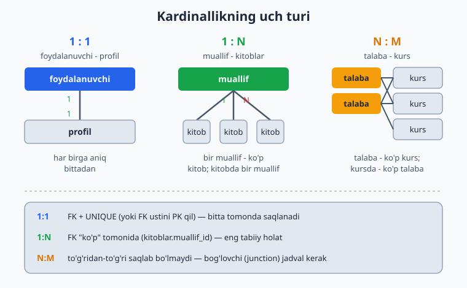
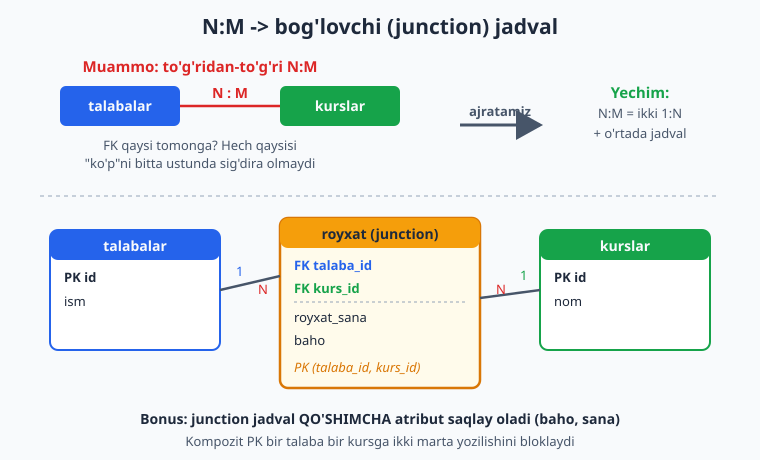
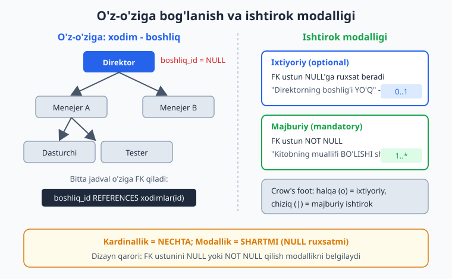

# 04 — Bog'lanishlar va kardinallik (1:1, 1:N, N:M)

[⬅️ Oldingi: 03 — ER-diagramma: entity, atribut, bog'lanish](./03-er-diagramma.md) · [🏠 README](./README.md) · [Keyingi: 05 — Relyatsion model va kalit turlari ➡️](./05-relyatsion-model.md)

> **Bu bobda:** entity'lar bir-biriga necha xil "miqdorda" bog'lanishi mumkinligini — kardinallikni (1:1, 1:N, N:M) — har birini hayotiy misol bilan ko'ramiz; bog'lanish majburiymi yoki ixtiyoriymi degan savolni (modallik); N:M bog'lanishni nega to'g'ridan-to'g'ri saqlab bo'lmasligini va uni bog'lovchi (junction) jadval orqali yechishni; jadvalning o'ziga bog'lanishini (xodim-boshliq, do'stlik); identifying va non-identifying farqini; uch tomonlama bog'lanishni; va bularning hammasini PostgreSQL'da FOREIGN KEY bilan amalda qanday yozishni o'rganamiz.

---

03-bobda biz entity'larni (mijoz, buyurtma, kitob) va ular orasidagi bog'lanishlarni (mijoz buyurtma *beradi*, muallif kitob *yozadi*) ajratib oldik. Lekin "muallif kitob yozadi" jumlasi yetarli emas: bitta muallif nechta kitob yoza oladi? Bitta kitobning nechta muallifi bo'lishi mumkin? Ana shu "nechta" savoliga javob — **kardinallik** (cardinality). Bu bobning birinchi yarmi shu haqda.

Nima uchun bu shunchaki nazariya emas? Chunki kardinallik to'g'ridan-to'g'ri sxemaga aylanadi: u FOREIGN KEY'ni qaysi jadvalga qo'yishingizni, qachon UNIQUE qo'shishingizni, qachon umuman yangi jadval yaratishingizni hal qiladi. Kardinallikni noto'g'ri o'qisangiz — sxema noto'g'ri chiqadi, va buni keyin tuzatish og'riqli (ma'lumotni ko'chirish, kodni qayta yozish kerak bo'ladi).

## Kardinallik nima va uch turi

Kardinallik — bir entity'ning nusxasi ikkinchi entity'ning nechta nusxasiga bog'lana olishini bildiradi. Uchta asosiy holat bor:

| Tur | O'qilishi | Hayotiy misol |
|-----|-----------|---------------|
| **1:1** | har biriga aniq bittadan | foydalanuvchi ↔ profil |
| **1:N** | bitta tomon ko'p tomonga | muallif → kitoblar |
| **N:M** | ikkala tomon ham ko'p | talaba ↔ kurs |



Diqqat qiling: kardinallik bog'lanishning **ikkala yo'nalishini** ham hisobga oladi. "Muallif → kitob" 1:N, lekin teskari tomonga qarasak "kitob → muallif" 1:1 (bizning misolda bitta kitobning bitta muallifi). Shuning uchun bog'lanishni baholaganda doim ikki tomonlama savol bering:

- **A → B:** bitta A nechta B bilan bog'lanadi?
- **B → A:** bitta B nechta A bilan bog'lanadi?

Ikki javobni birlashtirib turni topasiz. "Ko'p–bitta" + "bitta–ko'p" = 1:N. "Ko'p–ko'p" = N:M. "Bitta–bitta" = 1:1.

> SQL kitobida FOREIGN KEY sintaksisini o'rgangansiz ([SQL 18-bob](../sql/18-alter-constraint-fk.md)). Bu yerda biz sintaksisni emas, **qaysi FK'ni qayerga qo'yish kerakligini** — dizayn qarorini ko'ramiz.

Bobdagi barcha misollar **PostgreSQL 18** da haqiqatan ishga tushirildi. Izolyatsiya uchun alohida schema ishlatamiz:

```sql
CREATE SCHEMA IF NOT EXISTS ch04;
SET search_path = ch04;
```

## 1:N — eng keng tarqalgan bog'lanish

Bu eng tez-tez uchraydigan tur. "Bir muallif — ko'p kitob, lekin har bir kitob — aniq bitta muallifniki." Boshqa misollar: bir mijoz — ko'p buyurtma; bir kategoriya — ko'p mahsulot; bir post — ko'p izoh.

**Dizayn qoidasi: FK doim "ko'p" tomonida turadi.** Ya'ni `kitoblar` jadvaliga `muallif_id` ustunini qo'yamiz, `mualliflar`ga "kitoblar ro'yxati" emas. Nega? Chunki bitta ustunga faqat bitta qiymat sig'adi — "kitobning bitta muallifi" osongina ustunga aylanadi, ammo "muallifning ko'p kitobi" bitta ustunga sig'maydi (vergulli ro'yxat — bu anti-naqsh, 13-bobda ko'ramiz).

```sql
CREATE TABLE mualliflar (
    id    bigint GENERATED ALWAYS AS IDENTITY PRIMARY KEY,
    ism   text NOT NULL
);
CREATE TABLE kitoblar (
    id         bigint GENERATED ALWAYS AS IDENTITY PRIMARY KEY,
    sarlavha   text NOT NULL,
    muallif_id bigint NOT NULL REFERENCES mualliflar(id)   -- FK "ko'p" tomonida
);
```

`muallif_id` ni **NOT NULL** qilganimizga e'tibor bering — bu modallik qarori (pastda batafsil): har bir kitobning muallifi *bo'lishi shart* deganimiz. To'ldirib, "har muallifning nechta kitobi bor" deb hisoblaymiz:

```sql
INSERT INTO mualliflar(ism) VALUES ('Abdulla Qodiriy'), ('Cho''lpon');
INSERT INTO kitoblar(sarlavha, muallif_id) VALUES
    ('Otkan kunlar', 1), ('Mehrobdan chayon', 1), ('Kecha va kunduz', 2);

SELECT m.ism, count(k.id) AS kitoblar_soni
FROM mualliflar m LEFT JOIN kitoblar k ON k.muallif_id = m.id
GROUP BY m.ism ORDER BY m.ism;
```

PostgreSQL 18'da haqiqiy natija:

```
       ism       | kitoblar_soni
-----------------+---------------
 Abdulla Qodiriy |             2
 Cho'lpon        |             1
(2 rows)
```

> `GENERATED ALWAYS AS IDENTITY` — bu PostgreSQL'da `SERIAL`ning zamonaviy, standartga mos varianti. Kalit turlarini 06-bobda chuqur ko'ramiz; hozir uni "avtomatik o'suvchi PK" deb qabul qiling.

## 1:1 — ehtiyotkorlik bilan ishlatiladigan tur

"Har bir foydalanuvchining aniq bitta profili, har bir profil aniq bitta foydalanuvchiniki." Yoki: bir bemor — bitta pasport; bir mamlakat — bitta poytaxt.

Bu yerda birinchi savol shu: **nega ikki jadval, nega hammasi bitta jadvalda emas?** Ko'pincha 1:1 ma'lumotni shunchaki bitta jadvalga qo'yish to'g'ri bo'ladi. Ikki jadvalga ajratish faqat shu hollarda mantiqli:

- **Ixtiyoriy/kam to'ldiriladigan ma'lumot** — har foydalanuvchining batafsil profili bo'lavermaydi; uni alohida jadvalga olsangiz asosiy jadval kichik va tez qoladi.
- **Maxfiylik/xavfsizlik** — pasport ma'lumotini alohida jadvalda saqlab, unga kirishni cheklash oson.
- **Katta ustunlar** — kam ishlatiladigan katta matn/blob asosiy jadvalni shishirmasligi uchun.

**Dizayn qoidasi: 1:1 da FK bitta tomonda turadi va u UNIQUE bo'lishi shart** (aks holda 1:N bo'lib qoladi). Eng toza usul — FK ustunining o'zini PRIMARY KEY qilish, chunki PK avtomatik UNIQUE va NOT NULL:

```sql
CREATE TABLE foydalanuvchilar (
    id    bigint GENERATED ALWAYS AS IDENTITY PRIMARY KEY,
    email text NOT NULL UNIQUE
);
CREATE TABLE profillar (
    foydalanuvchi_id bigint PRIMARY KEY REFERENCES foydalanuvchilar(id),  -- PK = UNIQUE + NOT NULL
    bio              text,
    tugilgan_sana    date
);
```

`foydalanuvchi_id` ham FK, ham PK bo'lgani uchun bitta foydalanuvchiga ikkita profil yozib bo'lmaydi. Sinab ko'ramiz:

```sql
INSERT INTO foydalanuvchilar(email) VALUES ('ali@mail.uz'), ('vali@mail.uz');
INSERT INTO profillar(foydalanuvchi_id, bio) VALUES (1, 'Dasturchi');
INSERT INTO profillar(foydalanuvchi_id, bio) VALUES (1, 'Ikkinchi profil');  -- buziladi
```

PostgreSQL 18 ikkinchi INSERT'ni rad etadi — aynan biz xohlagan himoya:

```
ERROR:  duplicate key value violates unique constraint "profillar_pkey"
DETAIL:  Key (foydalanuvchi_id)=(1) already exists.
```

📌 **Qaysi tomonga FK qo'yiladi?** Odatda "ixtiyoriy" tomonga: profil foydalanuvchisiz bo'la olmaydi, lekin foydalanuvchi profilsiz bo'la oladi — shuning uchun FK `profillar`da. "Majburiy" entity (foydalanuvchi) mustaqil yashaydi, "bog'liq" entity (profil) FK'ni ko'taradi.

## N:M — ikkala tomon ham ko'p

"Bir talaba ko'p kursga yoziladi, bir kursda ko'p talaba bor." Boshqa misollar: mahsulot ↔ buyurtma; film ↔ aktyor; teg ↔ maqola; talaba ↔ o'qituvchi.

Bu yerda jiddiy muammo bor: **N:M ni to'g'ridan-to'g'ri ikki jadval bilan saqlab bo'lmaydi.** FK'ni `talabalar`ga qo'ysangiz — bitta talaba bitta kursga bog'lanadi (1:N). `kurslar`ga qo'ysangiz — teskari 1:N. Hech qaysi tomon "ko'p"ni ustunda sig'dira olmaydi.

**Yechim: bog'lovchi (junction) jadval.** N:M bog'lanish o'rtaga qo'yilgan uchinchi jadval orqali ikkita 1:N ga ajraladi. Bu jadval har bir "juftlik"ni bitta qator qilib saqlaydi.



```sql
CREATE TABLE talabalar (
    id  bigint GENERATED ALWAYS AS IDENTITY PRIMARY KEY,
    ism text NOT NULL
);
CREATE TABLE kurslar (
    id   bigint GENERATED ALWAYS AS IDENTITY PRIMARY KEY,
    nom  text NOT NULL
);
-- bog'lovchi (junction) jadval
CREATE TABLE royxat (
    talaba_id    bigint NOT NULL REFERENCES talabalar(id) ON DELETE CASCADE,
    kurs_id      bigint NOT NULL REFERENCES kurslar(id)   ON DELETE CASCADE,
    PRIMARY KEY (talaba_id, kurs_id)   -- kompozit PK: har juftlik faqat bir marta
);
```

Bu yerda ikki muhim dizayn qarori bor:

1. **Kompozit PRIMARY KEY `(talaba_id, kurs_id)`** — ikkala ustun birgalikda kalit bo'ladi. Bu bitta talaba bitta kursga *ikki marta* yozilishini bloklaydi (mantiqsiz bo'lar edi). 06-bobda kompozit kalitlarni chuqur ko'ramiz.
2. **`ON DELETE CASCADE`** — talaba yoki kurs o'chsa, uning ro'yxat yozuvlari ham o'chadi. Bu mantiqli: talaba o'chgach, uning kursga yozilishi ma'nosiz bo'lib qoladi. (FK o'chirish strategiyalarini 11-bobda batafsil ko'ramiz.)

### Junction jadval — atributlar uchun mukammal joy

N:M ni junction'ga aylantirishning eng katta foydasi shu: **bog'lanishning o'zi haqida ma'lumot saqlash mumkin bo'ladi.** "Talaba kursga yozildi" — ammo *qachon* yozildi? *Qancha baho* oldi? Bu ma'lumotni na `talabalar`ga, na `kurslar`ga qo'yib bo'lmaydi (ular juftlikka tegishli, alohida entity'ga emas). Junction jadval — aynan o'sha juftlikni ifodalaydi:

```sql
DROP TABLE royxat;   -- atributlar bilan qayta yaratamiz
CREATE TABLE royxat (
    talaba_id    bigint NOT NULL REFERENCES talabalar(id) ON DELETE CASCADE,
    kurs_id      bigint NOT NULL REFERENCES kurslar(id)   ON DELETE CASCADE,
    royxat_sana  date   NOT NULL DEFAULT current_date,   -- qachon yozildi
    baho         int    CHECK (baho BETWEEN 0 AND 100),  -- olgan bahosi
    PRIMARY KEY (talaba_id, kurs_id)
);

INSERT INTO talabalar(ism) VALUES ('Olim'), ('Gulnoza');
INSERT INTO kurslar(nom) VALUES ('SQL'), ('Python'), ('Tarmoq');
INSERT INTO royxat(talaba_id, kurs_id, baho) VALUES
    (1,1,90),(1,2,75),(2,1,88),(2,3,60);

SELECT t.ism, k.nom, r.baho FROM royxat r
JOIN talabalar t ON t.id = r.talaba_id
JOIN kurslar  k ON k.id = r.kurs_id
ORDER BY t.ism, k.nom;
```

PostgreSQL 18'da:

```
   ism   |  nom   | baho
---------+--------+------
 Gulnoza | SQL    |   88
 Gulnoza | Tarmoq |   60
 Olim    | Python |   75
 Olim    | SQL    |   90
(4 rows)
```

Kompozit PK ishlayotganini tekshiramiz — Olim'ni SQL kursiga ikkinchi marta yozishga urinib ko'ramiz:

```sql
INSERT INTO royxat(talaba_id, kurs_id, baho) VALUES (1, 1, 50);
```

```
ERROR:  duplicate key value violates unique constraint "royxat_pkey"
DETAIL:  Key (talaba_id, kurs_id)=(1, 1) already exists.
```

💡 **Junction jadval — bu to'laqonli entity.** "Ro'yxatga olish" (royxat) aslida o'z atributlariga (sana, baho) ega bo'lgan mustaqil tushuncha. Ko'pincha junction jadval shunchaki "ikki ustunli ko'prik" bo'lib boshlaydi-yu, vaqt o'tib unga ustunlar qo'shilib boradi. Shu sababli ba'zi dizaynerlar junction'ga o'zining `id` surrogate kalitini ham beradi (ayniqsa unga boshqa jadval FK qiladigan bo'lsa). Bu trade-off'ni 06-bobda ko'ramiz.

## Modallik: ixtiyoriy vs majburiy ishtirok

Kardinallik "nechta" degan savolga javob bersa, **modallik** (modality / optionality / ishtirok) "umuman shartmi?" degan savolga javob beradi. Ikkalasi boshqa-boshqa o'lcham:

- **Kardinallik** — bog'langanda nechta? (1 yoki ko'p)
- **Modallik** — bog'lanish *bo'lishi shartmi*, yoki bo'lmasligi ham mumkinmi?

Misol bilan: kitobning muallifi **bo'lishi shart** (majburiy ishtirok) — muallifsiz kitob bizning tizimda yo'q. Lekin foydalanuvchining profili **bo'lmasligi ham mumkin** (ixtiyoriy ishtirok) — yangi ro'yxatdan o'tgan odam hali profil to'ldirmagan bo'lishi mumkin.



**Dizaynda modallik FK ustunining NULL/NOT NULL'iga aylanadi:**

| Modallik | DDL | Ma'no |
|----------|-----|-------|
| Majburiy ishtirok | `muallif_id bigint NOT NULL` | bog'lanish *shart* |
| Ixtiyoriy ishtirok | `boshliq_id bigint` (NULL ruxsat) | bog'lanish bo'lmasligi mumkin |

Crow's foot notatsiyasida (03-bobda ko'rgansiz) buni chiziq oxiridagi belgi ko'rsatadi: halqa (○) — ixtiyoriy ("nol ham bo'lishi mumkin"), qisqa chiziq (|) — majburiy ("kamida bitta").

⚠️ **Bu shunchaki nazariya emas.** `NOT NULL` ni unutib qo'ysangiz, baza "muallifsiz kitob"ga ruxsat beradi — keyin hisobotlaringizda "muallif: bo'sh" qatorlar paydo bo'ladi va kod har joyda NULL tekshirishga majbur. Aksincha, kerakmas joyga `NOT NULL` qo'ysangiz, haqiqiy holatlarni (masalan direktorning boshlig'i yo'q) saqlay olmaysiz. Modallikni to'g'ri o'qish — toza sxemaning poydevori.

## O'z-o'ziga bog'lanish (self-referencing)

Ba'zan entity o'ziga o'zi bog'lanadi. Eng klassik misol — **xodim va boshliq:** boshliq ham xodim, oddiy xodim ham xodim. Ikkalasi bitta `xodimlar` jadvalida yashaydi, va bog'lanish shu jadvalning o'ziga FK qiladi.

### Self 1:N — xodim-boshliq ierarxiyasi

```sql
CREATE TABLE xodimlar (
    id         bigint GENERATED ALWAYS AS IDENTITY PRIMARY KEY,
    ism        text NOT NULL,
    boshliq_id bigint REFERENCES xodimlar(id)   -- NULL = eng yuqori (direktor)
);

INSERT INTO xodimlar(ism, boshliq_id) VALUES ('Direktor', NULL);
INSERT INTO xodimlar(ism, boshliq_id) VALUES ('Menejer', 1), ('Dasturchi', 2);

SELECT x.ism AS xodim, b.ism AS boshliq
FROM xodimlar x LEFT JOIN xodimlar b ON b.id = x.boshliq_id
ORDER BY x.id;
```

PostgreSQL 18'da:

```
   xodim   | boshliq
-----------+----------
 Direktor  |
 Menejer   | Direktor
 Dasturchi | Menejer
(3 rows)
```

`boshliq_id` ataylab **NULL'ga ruxsat beradi** — bu yerda modallik ixtiyoriy, chunki ierarxiyaning tepasidagi odamning boshlig'i yo'q. Bu o'z-o'ziga bog'lanishning klassik xususiyati: ildiz tugun (root) NULL bilan belgilanadi. E'tibor bering, bu aslida **daraxt** strukturasi (adjacency list) — uni rekursiv aylantirish, chuqurroq modellashtirish usullari (path enumeration, closure table) 17-bobning mavzusi.

### Self N:M — do'stlik

Ijtimoiy tarmoqdagi do'stlik ham o'z-o'ziga bog'lanish, lekin bu safar N:M: bir foydalanuvchining ko'p do'sti, har do'stning ham ko'p do'sti bor. Yechim baribir junction jadval, faqat ikkala FK ham bitta jadvalga ishora qiladi:

```sql
CREATE TABLE dostlik (
    a_id  bigint NOT NULL REFERENCES foydalanuvchilar(id),
    b_id  bigint NOT NULL REFERENCES foydalanuvchilar(id),
    sana  date NOT NULL DEFAULT current_date,
    PRIMARY KEY (a_id, b_id),
    CHECK (a_id < b_id)   -- (1,2) va (2,1) ikki marta saqlanmasin
);

INSERT INTO dostlik(a_id, b_id) VALUES (1, 2);
INSERT INTO dostlik(a_id, b_id) VALUES (2, 1);   -- teskari juftlik
```

`CHECK (a_id < b_id)` — nozik, lekin muhim dizayn nayrangi. Do'stlik **simmetrik** (Ali va Vali do'st bo'lsa, bu bitta munosabat, ikkita emas). Tartibni majburlamasak, `(1,2)` va `(2,1)` ikkita alohida qator bo'lib qolardi va "ular do'stmi?" so'rovi ikki tomonni ham tekshirishga majbur bo'lardi. `a_id < b_id` har juftlikni faqat bitta tartibda saqlashga majbur qiladi:

```
ERROR:  new row for relation "dostlik" violates check constraint "dostlik_check"
DETAIL:  Failing row contains (2, 1, 2026-06-13).
```

📌 Agar bog'lanish **asimmetrik** bo'lsa (masalan "kuzatish/follow" — Ali Vali'ni kuzatadi, teskarisi shart emas), unda `CHECK` qo'ymaysiz: `(kuzatuvchi_id, kuzatilgan_id)` ikki yo'nalishni alohida saqlaydi va bu to'g'ri. Demak qaysi constraint kerakligi munosabatning ma'nosiga bog'liq — bu sof dizayn qarori.

## Identifying vs non-identifying bog'lanish

Bu juftlik dastlab chalkash tuyuladi, lekin g'oyasi sodda: **bola entity'ning FK'si uning PRIMARY KEY'ining bir qismimi yoki yo'qmi?**

- **Non-identifying (identifikatsiyalamaydigan):** FK oddiy ustun, PK'dan tashqarida. Bola o'z mustaqil identifikatoriga ega bo'lib, ota'siz ham "mavjud" deb tasavvur qilinishi mumkin. Bizning `kitoblar` aynan shunday: `id` mustaqil PK, `muallif_id` esa alohida oddiy FK ustun. Crow's foot'da bu **uzuq chiziq** bilan chiziladi.
- **Identifying (identifikatsiyalaydigan):** FK PK'ning *ichida* turadi. Bola entity ota'siz umuman mavjud bo'la olmaydi va o'zini ota orqalisiz identifikatsiya qila olmaydi — bu **kuchsiz entity** (03-bobda ko'rgan). Crow's foot'da **uzluksiz chiziq**.

Klassik identifying misol — buyurtma va uning satrlari. "3-buyurtmaning 2-satri" degani mantiqli; "2-satr" o'zicha, qaysidir buyurtmaga tegishli bo'lmasdan ma'nosiz:

```sql
CREATE TABLE buyurtmalar (
    id   bigint GENERATED ALWAYS AS IDENTITY PRIMARY KEY,
    sana date NOT NULL DEFAULT current_date
);
CREATE TABLE buyurtma_satrlari (
    buyurtma_id bigint NOT NULL REFERENCES buyurtmalar(id) ON DELETE CASCADE,
    satr_raqam  int    NOT NULL,
    mahsulot    text   NOT NULL,
    PRIMARY KEY (buyurtma_id, satr_raqam)   -- FK PK ICHIDA = identifying
);

INSERT INTO buyurtmalar DEFAULT VALUES;
INSERT INTO buyurtma_satrlari VALUES (1, 1, 'Non'), (1, 2, 'Sut');
```

Bu yerda `buyurtma_id` ham FK (otaga ishora), ham PK'ning bir qismi (satrni identifikatsiya qiladi). Diqqat: `satr_raqam` 1 dan boshlab har buyurtma ichida qaytadan sanaladi — `(1,1)`, `(1,2)`, keyingi buyurtmada yana `(2,1)`. Bu kuchsiz entity'ning belgisi.

> **Qaysi birini tanlash kerak?** Amalda zamonaviy dizaynda ko'pincha **non-identifying** afzal ko'riladi: junction yoki bola jadvalga ham mustaqil surrogate `id` beriladi, chunki bu boshqa jadvallarning unga FK qilishini osonlashtiradi va kalitlarni barqaror qiladi. Identifying bog'lanish "sof" ER-nuqtai nazaridan to'g'ri bo'lsa-da, fizik sxemada ba'zan noqulay. Bu trade-off — kalit dizayni bobida (06) qaytamiz.

## Uch tomonlama (ternary) bog'lanish

Ba'zan bog'lanish ikki emas, uchta entity'ni bir vaqtda bog'laydi va uni ikkita alohida ikkitomonlama bog'lanishga ajratib bo'lmaydi. Misol: **"qaysi yetkazuvchi qaysi ombor uchun qaysi mahsulotni qancha narxga yetkazadi."** Bu yerda narx aynan uchlikka — (yetkazuvchi, ombor, mahsulot) — bog'liq. Faqat yetkazuvchi+mahsulot bilemiz, narxni aniqlay olmaymiz; ombor ham muhim.

Yechim — uch FK'li junction jadval va uch ustunli kompozit PK:

```sql
CREATE TABLE yetkazuvchilar (id bigint GENERATED ALWAYS AS IDENTITY PRIMARY KEY, nom text);
CREATE TABLE omborlar       (id bigint GENERATED ALWAYS AS IDENTITY PRIMARY KEY, nom text);
CREATE TABLE mahsulotlar    (id bigint GENERATED ALWAYS AS IDENTITY PRIMARY KEY, nom text);

CREATE TABLE yetkazib_berish (
    yetkazuvchi_id bigint NOT NULL REFERENCES yetkazuvchilar(id),
    ombor_id       bigint NOT NULL REFERENCES omborlar(id),
    mahsulot_id    bigint NOT NULL REFERENCES mahsulotlar(id),
    narx           numeric(12,2) NOT NULL,
    PRIMARY KEY (yetkazuvchi_id, ombor_id, mahsulot_id)
);

INSERT INTO yetkazuvchilar(nom) VALUES ('Agro');
INSERT INTO omborlar(nom)       VALUES ('Markaz');
INSERT INTO mahsulotlar(nom)    VALUES ('Bug''doy');
INSERT INTO yetkazib_berish VALUES (1, 1, 1, 4500.00);

SELECT y.nom AS yetkazuvchi, o.nom AS ombor, m.nom AS mahsulot, yb.narx
FROM yetkazib_berish yb
JOIN yetkazuvchilar y ON y.id = yb.yetkazuvchi_id
JOIN omborlar       o ON o.id = yb.ombor_id
JOIN mahsulotlar    m ON m.id = yb.mahsulot_id;
```

PostgreSQL 18'da:

```
 yetkazuvchi | ombor  | mahsulot |  narx
-------------+--------+----------+---------
 Agro        | Markaz | Bug'doy  | 4500.00
(1 row)
```

⚠️ **Ehtiyot bo'ling: haqiqiy ternary kamdan-kam.** Ko'pincha "uch tomonlama" deb o'ylangan narsa aslida ikkita oddiy 1:N yoki N:M ekan. O'zingizdan so'rang: "atribut (narx) chindan ham uchala entity'ga birga bog'liqmi, yoki uni ikkita alohida bog'lanishga bo'lsa bo'ladimi?" Agar bo'lsa — boling, sodda bo'ladi. Faqat atribut uchlikning o'zidan kelib chiqsagina ternary'ni qoldiring.

## FOREIGN KEY — bularning hammasini bazada majburlash

Yuqorida ko'rgan har bir bog'lanish PostgreSQL'da **FOREIGN KEY** orqali himoyalanadi. FK kafolati sodda, lekin kuchli: bola jadvaldagi har bir ishora ota jadvalda haqiqatan mavjud bo'lishi shart. Mavjud bo'lmagan otaga ishora qilishga urinish rad etiladi:

```sql
INSERT INTO kitoblar(sarlavha, muallif_id) VALUES ('Sayqal', 999);   -- 999-muallif yo'q
```

```
ERROR:  insert or update on table "kitoblar" violates foreign key constraint "kitoblar_muallif_id_fkey"
DETAIL:  Key (muallif_id)=(999) is not present in table "mualliflar".
```

Bu nima uchun **dizayn** qarori, oddiy texnik tafsilot emas? Chunki yaxlitlikni qayerda majburlashni tanlash kerak: ilovada (kodda) yoki bazada. Kodga ishonsangiz — bir kun uchta turli xizmat bazaga ulanadi-yu, bittasida tekshiruv unutiladi va "yetim" qatorlar paydo bo'ladi. Baza esa hech qachon unutmaydi. **Tamoyil:** bog'lanish yaxlitligini iloji boricha bazada, FK bilan majburlang.

Kardinallik → FK joylashuvi xaritasi (xulosa sifatida eslab qoling):

| Kardinallik | FK qayerda | Qo'shimcha constraint |
|-------------|-----------|----------------------|
| 1:1 | bog'liq (ixtiyoriy) tomonda | FK ustun UNIQUE yoki PK |
| 1:N | "ko'p" tomonida | — (modallikka qarab NULL/NOT NULL) |
| N:M | junction jadvalda (ikki FK) | ikki ustunli kompozit PK |
| self 1:N | jadvalning o'zida | FK odatda NULL (ildiz uchun) |
| ternary | junction jadvalda (uch FK) | uch ustunli kompozit PK |

> **MySQL/MariaDB farqi:** FK sintaksisi deyarli bir xil, lekin tarixiy jihatdan MySQL'da FK faqat InnoDB engine'da ishlaydi (MyISAM'da e'lon qilinsa-da, e'tiborga olinmaydi — jim "yutilib" ketadi). PostgreSQL'da bunday tuzoq yo'q, FK doim ishlaydi. Shuningdek `GENERATED ALWAYS AS IDENTITY` o'rniga MySQL'da `AUTO_INCREMENT` ishlatiladi.

Schema bilan ishni tugatib, ortidan tozalaymiz:

```sql
DROP SCHEMA ch04 CASCADE;
```

## Mashqlar

Quyidagi masalalar — **dizayn** masalalari. Maqsad SELECT yozish emas, balki to'g'ri bog'lanish turini aniqlash va sxemani loyihalash.

### Oson

1. **Kardinallikni o'qing.** Quyidagi har bir bog'lanish uchun turni (1:1, 1:N yoki N:M) aniqlang: (a) Davlat ↔ Poytaxt; (b) Mijoz ↔ Buyurtma; (c) Talaba ↔ Universitet (faqat bittada o'qiydi); (d) Maqola ↔ Teg.
2. **FK qayerda?** "Bir bo'lim — ko'p xodim, har xodim bitta bo'limda" bog'lanishida FOREIGN KEY qaysi jadvalga, qaysi ustun bilan qo'yiladi? Nega aksincha emas?
3. **Modallikni tanlang.** `xodimlar` jadvalida `bolim_id` ustuni NULL bo'lishiga ruxsat berilsinmi yoki NOT NULL bo'lsinmi? Ikki holatning ma'nosini bir-bir izohlang.
4. **1:1 nima uchun ikki jadval?** Bir holatni ayting, qachon foydalanuvchi ma'lumotini va profil ma'lumotini ikki alohida jadvalga ajratish (bitta jadval o'rniga) mantiqli bo'ladi.

### O'rta

5. **N:M ni junction'ga aylantiring.** "Mahsulot ↔ Buyurtma" N:M bog'lanishi uchun junction jadval DDL'sini yozing. Junction jadval `miqdor` va `sotuv_narxi` atributlarini saqlasin. Kompozit PK qo'ying.
6. **Bemor sxemasi.** Klinika uchun: bemor ↔ pasport (1:1), bemor ↔ qon-tahlil natijasi (1:N). Uchchala jadvalning DDL'sini PostgreSQL'da yozing; modallikni to'g'ri qo'ying (pasport ixtiyoriy, lekin har tahlil albatta bemorga tegishli).
7. **Anti-naqshni toping.** Quyidagi sxemada nima xato? Tuzating:
   ```sql
   CREATE TABLE mualliflar (
       id      bigint PRIMARY KEY,
       ism     text,
       kitoblar text   -- 'Otkan kunlar, Mehrobdan chayon'
   );
   ```
8. **Self 1:N.** Mahsulot kategoriyalari ierarxiyasini bitta jadvalda modellashtiring ("Elektronika" → "Telefon" → "Smartfon"). DDL yozing va ildiz kategoriya qanday belgilanishini ko'rsating.

### Qiyin

9. **Film-aktyor N:M + atribut.** "Film ↔ Aktyor" bog'lanishini modellashtiring, junction jadval har aktyorning shu filmdagi *rol nomi*ni va *bosh rolmi* belgisini saqlasin. Bitta aktyor bitta filmda bir nechta rol o'ynashi mumkinligini hisobga oling (PK'ga ta'siri bormi?).
10. **Identifying vs non-identifying.** "Hisob-faktura va uning satrlari" bog'lanishini avval identifying, keyin non-identifying ko'rinishda yozing. Ikki yondashuvning farqini va qaysi birini qachon tanlashni izohlang.
11. **Simmetrik N:M self.** Ijtimoiy tarmoqda "do'stlik" (simmetrik) va "kuzatish/follow" (asimmetrik) bog'lanishlarini ikki alohida jadval bilan modellashtiring. Simmetrik holatda takror juftlikni qanday bloklaysiz, asimmetrikda nega bloklamaysiz?
12. **Ternary yoki yo'q?** "Shifokor bemorga dori tayinlaydi" — bu chinakam uch tomonlama bog'lanishmi (shifokor, bemor, dori), yoki uni soddaroq tuzilishga bo'lish mumkinmi? Tahlil qiling va o'zingiz tanlagan sxemaning DDL'sini yozing.

## Yechimlar

<details markdown="1">
<summary>Yechim — 1</summary>

(a) Davlat ↔ Poytaxt — **1:1** (har davlatda bitta poytaxt, har poytaxt bitta davlatniki).
(b) Mijoz ↔ Buyurtma — **1:N** (mijoz ko'p buyurtma beradi, har buyurtma bitta mijozniki).
(c) Talaba ↔ Universitet (faqat bittada) — **1:N** (universitetda ko'p talaba, talaba bitta universitetda).
(d) Maqola ↔ Teg — **N:M** (maqolada ko'p teg, teg ko'p maqolada).

</details>

<details markdown="1">
<summary>Yechim — 2</summary>

FK **"ko'p" tomonida** — ya'ni `xodimlar` jadvaliga `bolim_id` ustuni qo'shiladi:

```sql
CREATE TABLE bolimlar (
    id  bigint GENERATED ALWAYS AS IDENTITY PRIMARY KEY,
    nom text NOT NULL
);
CREATE TABLE xodimlar (
    id       bigint GENERATED ALWAYS AS IDENTITY PRIMARY KEY,
    ism      text NOT NULL,
    bolim_id bigint NOT NULL REFERENCES bolimlar(id)
);
```

Aksincha bo'lmaydi: `bolimlar`ga "xodimlar ro'yxati"ni saqlash uchun bitta ustun yetmaydi — bo'limda ko'p xodim bor, ularni bitta ustun-katakka sig'dirib bo'lmaydi. "Bir" tomon ("kitobning bitta muallifi") esa bemalol ustunga aylanadi. Shuning uchun FK doim "ko'p" tomonida.

</details>

<details markdown="1">
<summary>Yechim — 3</summary>

- **`bolim_id ... NOT NULL`** — har bir xodim albatta biror bo'limga tegishli bo'lishi *shart* (majburiy ishtirok). Bo'limsiz xodim bo'lishi mumkin emas.
- **`bolim_id` NULL'ga ruxsat** — xodim vaqtincha hech qaysi bo'limga biriktirilmagan bo'lishi *mumkin* (ixtiyoriy ishtirok). Masalan, yangi ishga olingan, hali joylashtirilmagan xodim.

Tanlov biznes qoidasiga bog'liq. Aksariyat tashkilotda har xodim biror bo'limda bo'lishi shart, shuning uchun odatda `NOT NULL` to'g'riroq.

</details>

<details markdown="1">
<summary>Yechim — 4</summary>

Ikki jadvalga ajratish mantiqli bo'ladigan holatlar (bittasini aytish yetarli edi):

- **Ixtiyoriy/kam to'ldiriladigan profil:** ko'p foydalanuvchi profilni umuman to'ldirmaydi. Profilni alohida jadvalda saqlasak, asosiy `foydalanuvchilar` jadvali ixcham va tez qoladi (har qatorda bo'sh NULL ustunlar yotmaydi).
- **Maxfiylik:** pasport/hujjat kabi maxfiy ma'lumotni alohida jadvalga olib, unga kirishni alohida cheklash oson.
- **Katta ustunlar:** kam ishlatiladigan katta matn/blob (masalan to'liq biografiya) asosiy jadvalni shishirmasligi uchun.

Aks holda — agar profil deyarli har doim to'ladi va kichik bo'lsa — uni alohida jadvalga ajratish ortiqcha JOIN keltirib chiqaradi, hammasini bitta jadvalda qoldirish to'g'riroq.

</details>

<details markdown="1">
<summary>Yechim — 5</summary>

```sql
CREATE TABLE mahsulotlar (
    id  bigint GENERATED ALWAYS AS IDENTITY PRIMARY KEY,
    nom text NOT NULL
);
CREATE TABLE buyurtmalar (
    id   bigint GENERATED ALWAYS AS IDENTITY PRIMARY KEY,
    sana date NOT NULL DEFAULT current_date
);
-- junction jadval: N:M + qo'shimcha atributlar
CREATE TABLE buyurtma_satrlari (
    buyurtma_id  bigint NOT NULL REFERENCES buyurtmalar(id) ON DELETE CASCADE,
    mahsulot_id  bigint NOT NULL REFERENCES mahsulotlar(id),
    miqdor       int    NOT NULL CHECK (miqdor > 0),
    sotuv_narxi  numeric(12,2) NOT NULL CHECK (sotuv_narxi >= 0),
    PRIMARY KEY (buyurtma_id, mahsulot_id)
);
```

`sotuv_narxi` aynan junction'da turishi muhim: u "shu buyurtmadagi shu mahsulot" narxi (sotuv paytidagi snapshot), `mahsulotlar.narx` keyin o'zgarsa ham bu o'zgarmaydi. Kompozit PK bir buyurtmada bir mahsulot bir marta uchrashini ta'minlaydi (miqdorni ko'paytirish kerak bo'lsa — `miqdor` ustunini oshiramiz).

</details>

<details markdown="1">
<summary>Yechim — 6</summary>

```sql
CREATE TABLE bemorlar (
    id  bigint GENERATED ALWAYS AS IDENTITY PRIMARY KEY,
    ism text NOT NULL
);
-- 1:1 — pasport (ixtiyoriy: hammada ham bo'lavermaydi)
CREATE TABLE pasportlar (
    bemor_id bigint PRIMARY KEY REFERENCES bemorlar(id) ON DELETE CASCADE,
    seriya   text NOT NULL UNIQUE
);
-- 1:N — qon-tahlil natijasi (har tahlil albatta bemorga tegishli)
CREATE TABLE tahlillar (
    id        bigint GENERATED ALWAYS AS IDENTITY PRIMARY KEY,
    bemor_id  bigint NOT NULL REFERENCES bemorlar(id) ON DELETE CASCADE,
    natija    text,
    sana      date NOT NULL DEFAULT current_date
);
```

1:1 da `pasportlar.bemor_id` ham PK, ham FK — bitta bemorga ikki pasport yozib bo'lmaydi. 1:N da `tahlillar.bemor_id` **NOT NULL** (majburiy: tahlil bemarsiz bo'lmaydi). Bu DDL PostgreSQL 18'da muvaffaqiyatli ishga tushdi.

</details>

<details markdown="1">
<summary>Yechim — 7</summary>

**Xato:** `kitoblar` ustuni vergul bilan ajratilgan ro'yxatni bitta katakda saqlamoqda ("jaywalking" anti-naqshi). Bu 1NF'ni buzadi: bitta muallifning kitobini sanab, izlab, FK bilan bog'lab bo'lmaydi. Aslida bu **1:N** bog'lanish — alohida `kitoblar` jadvali bo'lishi kerak:

```sql
CREATE TABLE mualliflar (
    id  bigint GENERATED ALWAYS AS IDENTITY PRIMARY KEY,
    ism text NOT NULL
);
CREATE TABLE kitoblar (
    id         bigint GENERATED ALWAYS AS IDENTITY PRIMARY KEY,
    sarlavha   text NOT NULL,
    muallif_id bigint NOT NULL REFERENCES mualliflar(id)   -- FK "ko'p" tomonida
);
```

Endi muallifning kitoblari `WHERE muallif_id = ?` bilan topiladi, yangi kitob qo'shish bitta INSERT, va FK yaxlitlikni kafolatlaydi. (Bu anti-naqshni 13-bobda batafsil ko'ramiz.)

</details>

<details markdown="1">
<summary>Yechim — 8</summary>

O'z-o'ziga 1:N (adjacency list):

```sql
CREATE TABLE kategoriyalar (
    id      bigint GENERATED ALWAYS AS IDENTITY PRIMARY KEY,
    nom     text NOT NULL,
    ota_id  bigint REFERENCES kategoriyalar(id)   -- NULL = ildiz (eng yuqori)
);

INSERT INTO kategoriyalar(nom, ota_id) VALUES ('Elektronika', NULL);  -- ildiz
INSERT INTO kategoriyalar(nom, ota_id) VALUES ('Telefon', 1);
INSERT INTO kategoriyalar(nom, ota_id) VALUES ('Smartfon', 2);
```

Ildiz kategoriya `ota_id = NULL` bilan belgilanadi — uning yuqorisida hech narsa yo'q. `ota_id` ataylab NULL'ga ruxsat beradi (ixtiyoriy ishtirok), aks holda ildizni saqlab bo'lmasdi. Bu daraxt strukturasi; uni rekursiv CTE bilan to'liq aylantirish va boshqa modellashtirish usullari 17-bobda.

</details>

<details markdown="1">
<summary>Yechim — 9</summary>

```sql
CREATE TABLE filmlar   (id bigint GENERATED ALWAYS AS IDENTITY PRIMARY KEY, nom text NOT NULL);
CREATE TABLE aktyorlar (id bigint GENERATED ALWAYS AS IDENTITY PRIMARY KEY, ism text NOT NULL);

CREATE TABLE rollar (
    film_id    bigint NOT NULL REFERENCES filmlar(id),
    aktyor_id  bigint NOT NULL REFERENCES aktyorlar(id),
    rol_nomi   text   NOT NULL,
    bosh_rolmi boolean NOT NULL DEFAULT false,
    PRIMARY KEY (film_id, aktyor_id, rol_nomi)   -- rol_nomi ham PK ichida
);
```

**PK'ga ta'siri bor:** aktyor bitta filmda bir nechta rol o'ynashi mumkin bo'lgani uchun, faqat `(film_id, aktyor_id)` kompozit PK *kam* bo'ladi (ikkinchi rolni yozib bo'lmaydi). Shuning uchun `rol_nomi` ni ham PK'ga qo'shamiz — endi "bitta aktyor, bitta film, ikki xil rol" qonuniy, lekin aynan bir rolni ikki marta yozib bo'lmaydi. Bu DDL PostgreSQL 18'da ishga tushdi:

```sql
INSERT INTO filmlar(nom) VALUES ('Dune');
INSERT INTO aktyorlar(ism) VALUES ('T. Chalamet');
INSERT INTO rollar VALUES (1, 1, 'Pol Atreides', true);
-- natija: Dune | T. Chalamet | Pol Atreides | t
```

</details>

<details markdown="1">
<summary>Yechim — 10</summary>

**Identifying** (satr otasiz mavjud emas, FK PK ichida):

```sql
CREATE TABLE fakturalar (
    id   bigint GENERATED ALWAYS AS IDENTITY PRIMARY KEY,
    sana date NOT NULL DEFAULT current_date
);
CREATE TABLE faktura_satrlari (
    faktura_id bigint NOT NULL REFERENCES fakturalar(id) ON DELETE CASCADE,
    satr_raqam int    NOT NULL,
    mahsulot   text   NOT NULL,
    PRIMARY KEY (faktura_id, satr_raqam)   -- FK PK ICHIDA
);
```

**Non-identifying** (satr o'z mustaqil identifikatoriga ega, FK oddiy ustun):

```sql
CREATE TABLE faktura_satrlari2 (
    id         bigint GENERATED ALWAYS AS IDENTITY PRIMARY KEY,   -- mustaqil PK
    faktura_id bigint NOT NULL REFERENCES fakturalar(id) ON DELETE CASCADE,
    mahsulot   text   NOT NULL
);
```

**Farq va tanlov:** identifying'da satr otasi orqali identifikatsiyalanadi (`(faktura_id, satr_raqam)`), satr_raqam har fakturada qaytadan boshlanadi — ER nuqtai nazaridan "sof". Non-identifying'da satrning o'z global `id`'si bor — bu boshqa jadval shu satrga FK qilishi kerak bo'lsa qulayroq (masalan "satrga izoh" jadvali bitta `satr_id` ustuni bilan ulanadi, ikkita emas). Amalda non-identifying ko'proq tanlanadi: surrogate kalit barqaror va ulashishga qulay. Identifying'ni esa satr chindan ham otasiz hech qachon mavjud bo'lmaydigan va boshqa hech narsa unga FK qilmaydigan toza kuchsiz-entity holatida qoldiramiz.

</details>

<details markdown="1">
<summary>Yechim — 11</summary>

```sql
CREATE TABLE foydalanuvchilar (
    id  bigint GENERATED ALWAYS AS IDENTITY PRIMARY KEY,
    ism text NOT NULL
);

-- Simmetrik: do'stlik (bitta munosabat, ikki tomon teng)
CREATE TABLE dostlik (
    a_id bigint NOT NULL REFERENCES foydalanuvchilar(id),
    b_id bigint NOT NULL REFERENCES foydalanuvchilar(id),
    PRIMARY KEY (a_id, b_id),
    CHECK (a_id < b_id)   -- (1,2) va (2,1) bitta juftlik bo'lsin
);

-- Asimmetrik: kuzatish (yo'nalish muhim)
CREATE TABLE kuzatish (
    kuzatuvchi_id  bigint NOT NULL REFERENCES foydalanuvchilar(id),
    kuzatilgan_id  bigint NOT NULL REFERENCES foydalanuvchilar(id),
    PRIMARY KEY (kuzatuvchi_id, kuzatilgan_id),
    CHECK (kuzatuvchi_id <> kuzatilgan_id)   -- o'zini kuzatmasin
);
```

**Simmetrik (do'stlik):** Ali–Vali do'st bo'lsa, bu bitta fakt. `CHECK (a_id < b_id)` har juftlikni faqat bitta tartibda saqlashga majbur qiladi, shu sababli `(1,2)` va `(2,1)` ikki marta yozilmaydi — takror bloklanadi.

**Asimmetrik (kuzatish):** "Ali Vali'ni kuzatadi" va "Vali Ali'ni kuzatadi" — bular ikkita *boshqa-boshqa* fakt. Shuning uchun yo'nalishni majburlovchi `CHECK` qo'ymaymiz: ikkala qator ham qonuniy va kerak. (Faqat o'zini kuzatishni `kuzatuvchi_id <> kuzatilgan_id` bilan to'sib qo'yamiz.)

</details>

<details markdown="1">
<summary>Yechim — 12</summary>

**Tahlil:** "Shifokor bemorga dori tayinlaydi" birinchi qarashda ternary (shifokor + bemor + dori) ko'rinadi. Lekin tekshiramiz: tayinlovning atributlari (doza, davomiylik, sana) chindan ham *uchala* entity'ga birga bog'liqmi? Ha — aynan "shu shifokor, shu bemorga, shu dorini" tayinlashi bitta hodisa, va doza shu hodisaga tegishli. Demak bu chinakam ternary'ga yaqin, lekin amalda uni **"tayinlov" (retsept) degan mustaqil entity** sifatida modellashtirish toza va kengaytiriladigan bo'ladi:

```sql
CREATE TABLE shifokorlar (id bigint GENERATED ALWAYS AS IDENTITY PRIMARY KEY, ism text NOT NULL);
CREATE TABLE bemorlar    (id bigint GENERATED ALWAYS AS IDENTITY PRIMARY KEY, ism text NOT NULL);
CREATE TABLE dorilar     (id bigint GENERATED ALWAYS AS IDENTITY PRIMARY KEY, nom text NOT NULL);

CREATE TABLE tayinlovlar (
    id          bigint GENERATED ALWAYS AS IDENTITY PRIMARY KEY,  -- mustaqil entity
    shifokor_id bigint NOT NULL REFERENCES shifokorlar(id),
    bemor_id    bigint NOT NULL REFERENCES bemorlar(id),
    dori_id     bigint NOT NULL REFERENCES dorilar(id),
    doza        text   NOT NULL,
    sana        date   NOT NULL DEFAULT current_date
);
```

Uch ustunli kompozit PK o'rniga mustaqil `id` tanladik, chunki: (a) bir shifokor bir bemorga bir dorini *turli kunlarda* qayta tayinlashi mumkin — kompozit PK buni bloklab qo'yardi; (b) "tayinlov"ga keyin boshqa jadval (masalan "qabul qilingan dozalar jurnali") oson FK qiladi. Bu — ternary bog'lanishni associative entity'ga aylantirish: amaliyotda eng moslashuvchan yondashuv.

</details>

---

[⬅️ Oldingi: 03 — ER-diagramma: entity, atribut, bog'lanish](./03-er-diagramma.md) · [🏠 README](./README.md) · [Keyingi: 05 — Relyatsion model va kalit turlari ➡️](./05-relyatsion-model.md)
